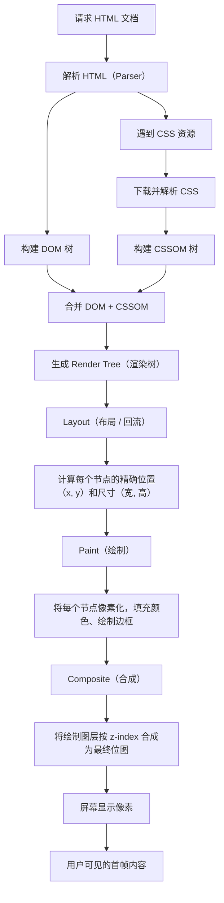

# 01-加载性能优化

> 模块：08-performance（第8周 前端性能优化）
> 内容：Core Web Vitals、资源压缩、Tree Shaking、代码分割、缓存策略、CDN 加速、预加载技术
> 格式：五段式（核心概念 → 底层原理 → 实战应用 → 常见面试题 → 避坑指南）

---

## 一、核心概念

前端加载性能优化是指通过一系列技术手段，缩短页面从发起请求到可交互的时间，提升用户体验。加载性能直接关系到用户留存率、转化率和 SEO 排名。Google 研究表明，页面加载时间超过 3 秒，53% 的移动用户会离开。

加载性能优化的核心目标：**让用户尽快看到页面内容，并尽快能够与页面进行交互**。

加载性能优化的几个关键维度：
- **网络传输**：减少资源体积、减少请求次数、缩短传输距离
- **资源解析**：优化关键渲染路径、延迟非关键资源
- **缓存策略**：合理利用浏览器缓存，减少重复请求

---

## 二、底层原理

### 2.1 Core Web Vitals 三大指标详解

Google 提出的 Core Web Vitals（核心网页指标）是衡量 Web 用户体验的统一标准，也是 Google 搜索排名的影响因素。

#### 2.1.1 LCP（Largest Contentful Paint，最大内容绘制）

**定义**：视口内可见的最大内容元素（图片、视频、文本块）完成渲染的时间点。

**衡量标准**：
- 良好（Good）：LCP < 2.5s
- 需要改进（Needs Improvement）：2.5s <= LCP < 4.0s
- 差（Poor）：LCP >= 4.0s

**计分原理**：浏览器在页面加载过程中持续追踪视口内最大元素的渲染时间。LCP 元素类型包括：
- `` 元素
- `<svg>` 元素内的 `<image>` 元素
- `<video>` 元素的封面图
- 通过 `url()` 加载背景图的元素
- 包含文本节点的块级元素

**优化策略**：
- 优化关键渲染路径，确保 LCP 元素尽早开始加载
- 使用预加载（preload）优先加载 LCP 资源
- 压缩图片、使用现代格式（WebP/AVIF）
- 使用 CDN 加速资源分发
- 避免懒加载 LCP 元素（LCP 元素不应设置 `loading="lazy"`）

#### 2.1.2 FID（First Input Delay，首次输入延迟）【已废弃】

> **历史指标**：FID 已于 2024 年 3 月被 **INP（Interaction to Next Paint）** 正式替代，不再是 Core Web Vitals 的三大指标之一。以下内容仅供历史参考。

**定义**：用户首次与页面交互（点击按钮、链接、输入框等）到浏览器实际响应事件之间的时间差。

**衡量标准**（历史）：
- 良好（Good）：FID < 100ms
- 需要改进：100ms <= FID < 300ms
- 差（Poor）：FID >= 300ms

#### 2.1.3 INP（Interaction to Next Paint，交互到下次绘制）

**定义**：衡量页面在整个生命周期内对所有用户交互（点击、触摸、键盘输入）的响应延迟。取所有交互延迟的接近最大值（第 98 百分位），而非单次交互。

**与 FID 的区别**：
- FID 只测量首次交互的输入延迟，INP 测量所有交互
- FID 只测量延迟，INP 测量从交互开始到下一帧绘制的完整延迟
- INP 更能反映页面的整体交互性能

**衡量标准**：
- 良好（Good）：INP < 200ms
- 需要改进：200ms <= INP < 500ms
- 差（Poor）：INP >= 500ms

**优化策略**：
- 减少主线程长任务（Long Task），将大任务拆分为多个小任务
- 使用 Web Worker 处理 CPU 密集型计算
- 避免在事件处理回调中执行同步耗时操作
- 使用 `requestAnimationFrame` 优化动画
- 代码分割，减少 JavaScript 捆绑包体积

#### 2.1.4 CLS（Cumulative Layout Shift，累积布局偏移）

**定义**：衡量页面生命周期内发生的所有意外布局偏移的累积分数。布局偏移是指可见元素在两次渲染帧之间改变了位置。

**衡量标准**：
- 良好（Good）：CLS < 0.1
- 需要改进：0.1 <= CLS < 0.25
- 差（Poor）：CLS >= 0.25

**计分原理**：
```
CLS = 影响比例（impact fraction）x 距离比例（distance fraction）
```

- 影响比例：不稳定元素在两帧之间占视口面积的比例
- 距离比例：不稳定元素移动距离占视口最大尺寸的比例

**优化策略**：
- 为图片和视频元素设置明确的 `width` 和 `height` 属性
- 为动态注入的内容（如广告）预留空间
- 避免在已有内容上方插入新内容
- 使用 `transform` 动画代替会触发布局的属性动画
- 字体加载时使用 `font-display: swap` 或 `font-display: optional` 配合 `size-adjust`

### 2.1.5 关键渲染路径（Critical Rendering Path）

浏览器从接收 HTML 到首次渲染像素，需要经过一套固定的处理流程，理解这条路径是性能优化的基础。

```
关键渲染路径（Critical Rendering Path）：

  HTML 文档
     │
     ▼
  ┌─────────────────────────────────────────────────────────┐
  │  HTML 解析器（Parser）                                    │
  │  ├─ 逐字节解析 HTML 标记 → 构建 DOM 树                    │
  │  └─ 遇到 <link rel="stylesheet"> → 触发 CSS 下载与解析    │
  └─────────────────────────────────────────────────────────┘
     │                                    │
     ▼                                    ▼
  ┌──────────────────┐            ┌──────────────────┐
  │    DOM 树         │            │   CSSOM 树        │
  │  (Document Object │            │  (CSS Object      │
  │   Model)          │            │   Model)          │
  │                   │            │                   │
  │  表示页面结构      │            │  表示样式规则      │
  └─────────┬─────────┘            └─────────┬─────────┘
            │                                │
            └──────────────┬─────────────────┘
                           │
                           ▼
              ┌─────────────────────────┐
              │   渲染树（Render Tree）   │
              │  ├─ 合并 DOM + CSSOM     │
              │  ├─ 只包含可见节点        │
              │  └─ display:none 不参与   │
              └─────────────┬───────────┘
                            │
                            ▼
              ┌─────────────────────────┐
              │   布局（Layout / Reflow） │
              │  ├─ 计算每个节点的        │
              │  │  精确位置（x, y）      │
              │  └─ 计算每个节点的        │
              │     精确尺寸（宽, 高）    │
              └─────────────┬───────────┘
                            │
                            ▼
              ┌─────────────────────────┐
              │   绘制（Paint）           │
              │  ├─ 将每个节点像素化      │
              │  ├─ 填充颜色、绘制边框    │
              │  └─ 生成位图输出到屏幕    │
              └─────────────────────────┘

阻塞关系（关键！）：
  • CSS 阻塞渲染：Render Tree 依赖 CSSOM，CSS 未加载完成前不会渲染
  • JS 阻塞 DOM 解析：遇到 <script> 标签时暂停 HTML 解析，等待 JS 下载+执行
  • JS 被 CSS 阻塞：脚本可能查询样式，因此浏览器会等前面的 CSSOM 构建完毕再执行 JS
  • 优化核心：让关键 CSS 尽快到达，非关键 CSS 延迟加载，JS 使用 async/defer
```

**浏览器关键渲染路径流程**：



关键渲染路径是浏览器将 HTML、CSS 和 JavaScript 转换为屏幕上像素的完整流程。理解这条路径是性能优化的基础：CSS 会阻塞渲染（Render Tree 必须等待 CSSOM 构建完成），JavaScript 会阻塞 DOM 解析（`<script>` 标签暂停 HTML 解析），而优化的核心目标就是**让关键路径尽可能短**——优先交付首屏必需的 CSS 和 HTML，延迟加载非关键资源。

> 📖 **参考链接**：
> - [web.dev - 渲染方式](https://web.dev/articles/rendering-on-the-web)

### 2.2 资源压缩与优化

#### 2.2.1 图片优化

**格式选择**：
| 格式 | 特点 | 适用场景 |
|------|------|----------|
| JPEG | 有损压缩，不支持透明 | 照片、复杂色彩图片 |
| PNG | 无损压缩，支持透明 | 图标、Logo、需要透明的图片 |
| WebP | 有损+无损，支持透明，体积比 JPEG 小 25-35% | 通用推荐格式 |
| AVIF | 比 WebP 体积更小，支持 HDR | 现代浏览器首选 |
| SVG | 矢量格式，无限缩放 | 图标、简单图形 |

**响应式图片**：
```html
<!-- srcset + sizes：根据屏幕宽度和 DPR 选择合适图片 -->


<!-- picture 元素：根据条件选择不同格式 -->
<picture>
  <source srcset="photo.avif" type="image/avif" />
  <source srcset="photo.webp" type="image/webp" />
  
</picture>
```

**懒加载**：

```html
<!-- 方案一：浏览器原生懒加载 -->


<!-- 方案二：JavaScript 懒加载（配合 Intersection Observer） -->

```

**压缩工具链**：
- **imagemin**：Node.js 图片压缩工具，支持多种插件
- **sharp**：高性能图片处理库，常用于构建时转换格式
- **TinyPNG/TinyJPG**：在线图片压缩服务
- **Squoosh**：Google 出品的在线图片压缩工具

#### 2.2.2 字体优化

**font-display 策略**：
```css
@font-face {
  font-family: 'MyFont';
  src: url('/fonts/MyFont.woff2') format('woff2');
  font-display: swap; /* 立即使用后备字体，加载完成后替换 */
}
```

| font-display 值 | 行为 | 适用场景 |
|-----------------|------|----------|
| auto | 浏览器默认行为 | 一般场景 |
| block | 短暂不可见期后使用后备字体，3s 后强制替换 | 字体很重要 |
| swap | 立即使用后备字体，加载后替换 | 推荐值，避免 FOIT |
| fallback | 短暂不可见期后使用后备字体，短交换期 | 字体较重要 |
| optional | 极短不可见期，网络状况差时可能不加载 | 性能优先 |

**子集化（Subsetting）**：只保留页面实际使用的字符，大幅减少字体文件体积。常用工具：`glyphhanger`、`fonttools`。

#### 2.2.3 CSS/JS 压缩

**压缩工具**：
| 工具 | 目标 | 特点 |
|------|------|------|
| cssnano | CSS | 优化+压缩，支持 PostCSS 插件生态 |
| Terser | JavaScript | 压缩+混淆，支持 ES6+ 语法 |
| esbuild | JS/CSS | 极快速的打包器，内置压缩 |
| SWC | JS/TS | Rust 实现，速度极快 |

**HTTP 压缩**：
- **Gzip**：兼容性最好，压缩率约 70%
- **Brotli**：比 Gzip 压缩率高 15-25%，现代浏览器均支持
- 通常由 Nginx/CDN 在服务端配置，无需前端代码改动

> 📖 **参考链接**：
> - [web.dev - 快速加载](https://web.dev/articles/fast)
> - [MDN - Performance API](https://developer.mozilla.org/zh-CN/docs/Web/API/Performance_API)

### 2.3 Tree Shaking 原理

**核心概念**：Tree Shaking 是一种通过静态分析去除 JavaScript 中未使用代码（Dead Code）的优化技术。术语来源于"摇晃树木，让枯叶掉落"。

**工作原理**：
1. **静态分析**：基于 ES Module 的 `import/export` 语法是静态的（编译时确定），而非 CommonJS 的 `require()` 是动态的（运行时确定）
2. **标记未使用导出**：构建工具分析模块依赖图，标记所有未被引用的导出
3. **删除死代码**：在打包阶段，将标记为未使用的代码从最终产物中移除

**Webpack 配置**：
```javascript
// webpack.config.js
module.exports = {
  mode: 'production',
  optimization: {
    usedExports: true,  // 标记未使用的导出
    minimize: true,     // 使用 Terser 删除标记的代码
  },
};
```

**package.json 中的 sideEffects**：
```json
{
  "name": "my-lib",
  "sideEffects": false  // 标记所有模块都无副作用，可安全 Tree Shaking
}
```

```json
{
  "name": "my-lib",
  "sideEffects": [
    "*.css",          // CSS 文件有副作用（全局样式），不能移除
    "*.scss",
    "./src/polyfills.js"
  ]
}
```

**Tree Shaking 的前提条件**：
- 必须使用 ES Module（`import`/`export`）语法
- 不能有副作用（Side Effects），或正确声明 `sideEffects`
- 生产模式构建（`mode: 'production'`）

### 2.4 代码分割（Code Splitting）

**核心概念**：将代码拆分为多个较小的包（chunk），按需加载或并行加载，而不是将所有代码打包到一个大文件中。

**三种分割策略**：

#### 2.4.1 入口分割（Entry Points）

```javascript
// webpack.config.js
module.exports = {
  entry: {
    main: './src/main.js',
    admin: './src/admin.js',
    vendor: './src/vendor.js',
  },
};
```

#### 2.4.2 动态导入（Dynamic Import）

```javascript
// 路由级代码分割
const AboutPage = () => import('./pages/About.vue');
const UserPage = () => import('./pages/User.vue');

// React 组件级分割
const LazyComponent = React.lazy(() => import('./HeavyComponent'));

function App() {
  return (
    <Suspense fallback={<Loading />}>
      <LazyComponent />
    </Suspense>
  );
}

// Vue 异步组件
import { defineAsyncComponent } from 'vue';
const AsyncComp = defineAsyncComponent({
  loader: () => import('./HeavyComponent.vue'),
  loadingComponent: LoadingComponent,
  delay: 200,
});
```

#### 2.4.3 SplitChunksPlugin（提取公共模块）

```javascript
// webpack.config.js
module.exports = {
  optimization: {
    splitChunks: {
      chunks: 'all',
      cacheGroups: {
        vendor: {
          test: /[\\/]node_modules[\\/]/,
          name: 'vendors',
          priority: 10,
          chunks: 'all',
        },
        common: {
          minChunks: 2,
          priority: 5,
          reuseExistingChunk: true,
        },
      },
    },
  },
};
```

**Vite/Rollup 中的代码分割**：
```javascript
// vite.config.js
export default {
  build: {
    rollupOptions: {
      output: {
        manualChunks: {
          'vendor-react': ['react', 'react-dom'],
          'vendor-ui': ['antd', '@ant-design/icons'],
        },
      },
    },
  },
};
```

> 📖 **参考链接**：
> - [Webpack官方文档 - 代码分割](https://webpack.docschina.org/guides/code-splitting/)

### 2.5 懒加载（Lazy Loading）

#### 2.5.1 图片懒加载

**原生懒加载（推荐）**：
```html

```

**Intersection Observer 实现**：
```javascript
const observer = new IntersectionObserver((entries) => {
  entries.forEach((entry) => {
    if (entry.isIntersecting) {
      const img = entry.target;
      img.src = img.dataset.src;
      observer.unobserve(img);
    }
  });
}, { rootMargin: '50px' }); // 提前 50px 开始加载

document.querySelectorAll('img[data-src]').forEach((img) => observer.observe(img));
```

#### 2.5.2 路由懒加载

```javascript
// Vue Router
const routes = [
  { path: '/dashboard', component: () => import('./views/Dashboard.vue') },
  { path: '/profile', component: () => import('./views/Profile.vue') },
];

// React Router v6
const Dashboard = React.lazy(() => import('./pages/Dashboard'));
```

#### 2.5.3 组件懒加载

组件懒加载适用于非首屏的关键组件，如弹窗、图表、复杂表单等。通过动态 `import()` 结合框架的异步组件机制实现。

> 📖 **参考链接**：
> - [MDN - img 元素 loading 属性](https://developer.mozilla.org/zh-CN/docs/Web/HTML/Element/img#attr-loading)

### 2.6 HTTP 缓存策略

缓存策略的核心原则：**尽最大可能缓存不变的内容，尽早验证可能变化的内容**。

#### 2.6.1 强缓存

强缓存由服务端通过响应头控制，浏览器在缓存有效期内**不发送请求**，直接使用本地缓存。

**相关响应头**：
- `Cache-Control: max-age=31536000`（秒，一年）- HTTP/1.1
- `Expires: Wed, 29 Jun 2027 10:00:00 GMT`（绝对时间）- HTTP/1.0

`Cache-Control` 优先级高于 `Expires`。

**常用指令**：
| 指令 | 含义 |
|------|------|
| max-age=N | 缓存 N 秒后过期 |
| public | 可被浏览器和 CDN 缓存 |
| private | 只能被浏览器缓存 |
| no-cache | 必须验证后才能使用缓存 |
| no-store | 完全不缓存 |
| immutable | 资源不会改变，缓存期间无需验证 |

#### 2.6.2 协商缓存

协商缓存时，浏览器**发送请求**到服务器，服务器判断资源是否变化，未变化则返回 304 Not Modified。

**相关请求/响应头**：
| 机制 | 请求头 | 响应头 | 特点 |
|------|--------|--------|------|
| ETag/If-None-Match | If-None-Match | ETag | 精确匹配，内容哈希 |
| Last-Modified/If-Modified-Since | If-Modified-Since | Last-Modified | 时间精度秒级 |

ETag 优先级高于 Last-Modified。

#### 2.6.3 最佳缓存策略

| 资源类型 | 缓存策略 | 示例 |
|----------|----------|------|
| HTML | 协商缓存 | `Cache-Control: no-cache` |
| JS/CSS（带哈希） | 强缓存 | `Cache-Control: max-age=31536000, immutable` |
| 图片 | 强缓存 | `Cache-Control: max-age=31536000` |
| 字体 | 强缓存 | `Cache-Control: max-age=31536000` |
| API 数据 | 协商缓存或无缓存 | `Cache-Control: no-cache` 或 `no-store` |

**核心思路**：HTML 入口文件使用协商缓存确保及时更新，JS/CSS 等静态资源通过文件名哈希（如 `app.a1b2c3.js`）实现"永久缓存"，内容更新时哈希变化自动触发新请求。

> **生活化理解：图书馆借书**
> 
> 把 HTTP 缓存策略想象成去图书馆借书的过程：
> - **强缓存 = 书上有"有效期"标签**：你借了一本书，书上贴着标签"有效期至 2026-12-31"。在过期之前，你直接在家翻看这本书，不用去图书馆，也不必问管理员——这就是浏览器直接使用本地缓存，状态码 200 (from disk/memory cache)，**连网络请求都不会发出**。
> - **协商缓存 = 过期后问管理员"有没有新版"**：书过期了，你拿着书去图书馆问管理员："这本书有没有出新版？"管理员比对 ISBN 号（ETag）或出版日期（Last-Modified）：
>   - 管理员说："没出新版，这本还是最新的"（返回 304 Not Modified）——你继续用自己手里的书，不用重新借
>   - 管理员说："出了新版，给你换一本"（返回 200 + 新内容）——你拿到新书，旧书作废
> **注意**：如果设置了 `Cache-Control: no-cache`，即使书还没过期，也会每次先问管理员确认有没有新版——这就是每次请求都走协商缓存的场景。
> - **HTML 是"报纸"**：每天内容可能变，不适合长期缓存，应该用协商缓存确保获取最新版
> - **带哈希的 JS/CSS 是"精装书"**：一旦出版（构建完成）内容就固定不变，可以直接贴"永久有效"标签（强缓存 + immutable），要更新就换一个 ISBN 号（哈希），浏览器自然当新书处理

### 2.7 CDN 加速原理

**CDN（Content Delivery Network，内容分发网络）** 是由分布在全球各地的边缘服务器组成的网络，将内容缓存到离用户最近的节点，减少网络延迟。

**工作原理**：
1. 用户在浏览器输入域名
2. DNS 解析到 CDN 的全局负载均衡系统
3. 根据用户 IP 定位到最近的边缘节点
4. 边缘节点有缓存则直接返回（命中），无缓存则回源拉取（回源）
5. 回源后缓存到边缘节点供后续请求使用

**CDN 优化策略**：
- **预热**：提前将资源推送到 CDN 节点，避免首次访问回源
- **刷新**：清除 CDN 缓存，强制回源拉取最新资源
- **缓存命中率优化**：统一 URL 参数规范、合理设置缓存时间

**CDN 适用场景**：
- 静态资源加速（JS、CSS、图片、字体、视频）
- 全站加速（动态+静态混合加速）
- DDoS 防护（CDN 天然具备流量分散能力）

### 2.8 预加载技术

| 技术 | 指令 | 作用 | 使用场景 |
|------|------|------|----------|
| preload | `<link rel="preload">` | 声明式提前加载当前页面**必需**的资源 | 首屏关键 CSS、字体、LCP 图片 |
| prefetch | `<link rel="prefetch">` | 浏览器空闲时加载**未来**页面可能需要的资源 | 下一页的 JS/CSS |
| dns-prefetch | `<link rel="dns-prefetch">` | 提前完成 DNS 解析 | 第三方域名（API、CDN） |
| preconnect | `<link rel="preconnect">` | 提前建立完整连接（DNS + TCP + TLS） | 确定会使用的第三方资源 |
| prerender | `<link rel="prerender">` | 预渲染整个页面 | 用户极大概率会访问的下一页（**已弃用**，推荐使用 Speculation Rules API） |
| fetchpriority | `` 等 | 控制资源加载优先级 | LCP 元素、首屏关键图片 |

**使用示例**：
```html
<head>
  <!-- 预加载关键字体 -->
  <link rel="preload" href="/fonts/main.woff2" as="font" type="font/woff2" crossorigin />
  <!-- 预加载 LCP 图片 -->
  <link rel="preload" href="/hero.webp" as="image" />
  <!-- 预连接到 CDN -->
  <link rel="preconnect" href="https://cdn.example.com" />
  <link rel="dns-prefetch" href="https://api.example.com" />
  <!-- 预获取下一页资源 -->
  <link rel="prefetch" href="/page2.js" as="script" />
</head>
```

**Speculation Rules API（替代已弃用的 prerender）**：
```html
<!-- Speculation Rules API（替代已弃用的 prerender） -->
<script type="speculationrules">
{
  "prerender": [
    {
      "source": "list",
      "urls": ["/next-page.html", "/popular-page.html"]
    }
  ]
}
</script>
```

**preload 与 prefetch 的核心区别**：
- `preload`：强制浏览器立即加载，优先级高，用于当前页面
- `prefetch`：浏览器空闲时加载，优先级低，用于未来页面

> 📖 **参考链接**：
> - [MDN - rel preload](https://developer.mozilla.org/zh-CN/docs/Web/HTML/Attributes/rel/preload)

---

## 三、实战应用

### 3.1 构建一个完整的加载优化方案

**Vite 项目配置示例**：
```javascript
// vite.config.js
import { defineConfig } from 'vite';
import viteCompression from 'vite-plugin-compression';
import { visualizer } from 'rollup-plugin-visualizer';

export default defineConfig({
  plugins: [
    viteCompression({ algorithm: 'brotli' }), // Brotli 压缩
    visualizer({ open: true }),               // 打包分析
  ],
  build: {
    rollupOptions: {
      output: {
        manualChunks: {
          'react-vendor': ['react', 'react-dom'],
          'ui-vendor': ['antd'],
        },
      },
    },
  },
});
```

### 3.2 Nginx 缓存配置示例

```nginx
server {
    # HTML 使用协商缓存
    location / {
        add_header Cache-Control "no-cache, must-revalidate";
    }

    # 带哈希的静态资源使用强缓存
    location ~* \.(js|css|png|jpg|jpeg|gif|ico|svg|woff|woff2)$ {
        expires 1y;
        add_header Cache-Control "public, immutable";
    }

    # Gzip 压缩
    gzip on;
    gzip_types text/plain text/css application/json application/javascript text/xml;
}
```

### 3.3 性能监控指标采集

```javascript
// 使用 web-vitals 库采集 Core Web Vitals
import { onLCP, onCLS, onINP } from 'web-vitals'; // 推荐使用 web-vitals@4.x

function sendToAnalytics(metric) {
  const body = JSON.stringify({
    name: metric.name,
    value: metric.value,
    rating: metric.rating,
    delta: metric.delta,
    id: metric.id,
  });
  navigator.sendBeacon('/api/analytics', body);
}

onLCP(sendToAnalytics);
onINP(sendToAnalytics);
onCLS(sendToAnalytics);
```

---

## 四、常见面试题

**Q1：Core Web Vitals 包含哪些指标？各自的衡量标准是什么？**
- LCP（最大内容绘制）：< 2.5s 良好，衡量加载性能
- INP（与下次绘制的交互）：< 200ms 良好，替代 FID，衡量交互响应性
- CLS（累积布局偏移）：< 0.1 良好，衡量视觉稳定性

**Q2：强缓存和协商缓存的区别是什么？**
- 强缓存：浏览器直接使用缓存，不发送请求（200 from disk/memory cache）
- 协商缓存：浏览器发送请求，服务器验证后返回 304 Not Modified

**Q3：Tree Shaking 为什么只支持 ES Module？**
- ES Module 的 `import/export` 是静态的（编译时确定引用关系），可被静态分析
- CommonJS 的 `require()` 是动态的（运行时确定），无法在编译时分析

**Q4：preload、prefetch、preconnect 的区别？**
- preload：当前页面必需资源，立即加载
- prefetch：未来页面可能需要的资源，空闲时加载
- preconnect：提前建立与第三方域名的连接（DNS + TCP + TLS）

**Q5：如何设计前端资源的缓存策略？**
- HTML：协商缓存（`Cache-Control: no-cache`），确保及时更新
- JS/CSS（带哈希）：强缓存（`Cache-Control: max-age=31536000, immutable`）
- 图片/字体：强缓存，配合文件名哈希实现版本控制

---

## 五、避坑指南

| 常见错误 | 现象 | 原因 | 解决方案 |
|----------|------|------|----------|
| 对 LCP 元素使用懒加载 | 首屏核心内容加载延迟 | `loading="lazy"` 延迟了 LCP 元素的加载 | LCP 元素不使用懒加载，改用 `preload` 或 `fetchpriority="high"` |
| 未给图片设置宽高 | 页面加载时内容跳动，CLS 偏高 | 浏览器无法预留图片空间，图片加载后撑开布局 | 为所有 `` 设置 `width`/`height` 属性或使用 `aspect-ratio` CSS |
| `sideEffects: false` 误用 | 全局 CSS 被 Tree Shaking 移除 | 标记了整个包无副作用，但 CSS 导入有副作用 | 在 `sideEffects` 数组中排除 CSS 文件 |
| preload 资源未使用 | 浏览器控制台警告，浪费带宽 | preload 的资源在 3 秒内未被使用 | 只 preload 确定会立即使用的关键资源，删除未使用的 preload |
| 所有资源都用强缓存 | HTML 更新后用户看不到新版本 | HTML 被强缓存，浏览器不请求新版本 | HTML 使用协商缓存，JS/CSS 使用文件名哈希+强缓存 |
| 动态 import 未加错误处理 | 用户网络差时页面白屏 | 动态导入失败未被捕获 | 使用 `.catch()` 处理加载失败，或使用错误边界 |
| 字体未设置 font-display | 字体加载期间文字不可见（FOIT） | 浏览器默认行为是字体加载期间隐藏文字 | 设置 `font-display: swap`，立即使用后备字体 |
| 忘记配置 Brotli 压缩 | 资源体积大于预期 | 仅依赖 Gzip，未启用更高效的 Brotli | Nginx/CDN 配置 Brotli 压缩，并配合 `vite-plugin-compression` 预生成 |

---

> **学习导航**：
> - 返回 [学习路线总览](../README.md)
> - 本模块其他文件：[02-运行时优化](./02-运行时优化.md) | [03-性能优化笔面试题集](./03-性能优化笔面试题集.md)
> - 下一模块：[09-Node.js](../09-nodejs/README.md)

## 本章学习自检

- [ ] 能解释 Core Web Vitals 三大指标（LCP/INP/CLS）的含义和衡量标准
- [ ] 掌握图片优化策略：WebP/AVIF 格式、srcset、懒加载、压缩工具
- [ ] 理解 Tree Shaking 原理，知道 ES Module 静态分析的关键作用
- [ ] 掌握代码分割的三种策略：入口分割、动态导入、SplitChunks
- [ ] 理解懒加载的实现方式：原生 loading="lazy"、Intersection Observer、路由懒加载
- [ ] 能独立设计前端资源的 HTTP 缓存策略（HTML 协商缓存 + 静态资源强缓存）
- [ ] 理解 CDN 加速原理和回源策略
- [ ] 能区分 preload、prefetch、dns-prefetch、preconnect 的使用场景

---

## 补充内容1：Service Worker 生命周期

### 概念

Service Worker 是运行在浏览器后台的独立脚本，独立于网页线程，可以拦截和处理网络请求，是 PWA（Progressive Web App）的核心技术。它充当浏览器与服务器之间的**代理服务器**角色，能够在离线状态下提供缓存内容，实现离线访问、消息推送、后台同步等功能。

**核心特点**：
- 独立于页面生命周期，页面关闭后仍可运行
- 不能直接访问 DOM，通过 `postMessage` 与页面通信
- 只能运行在 HTTPS 环境（localhost 除外）
- 基于 Promise 的异步 API

### 生命周期三个阶段

Service Worker 的生命周期分为三个主要阶段，每个阶段有对应的事件：

```
注册 Service Worker
       │
       ▼
  ┌─────────────────────────┐
  │  install（安装事件）      │
  │  ├─ 浏览器下载并安装 SW   │
  │  ├─ 触发 install 事件     │
  │  ├─ 适合预缓存关键资源     │
  │  └─ event.waitUntil()     │
  │     确保安装完成前不掉线   │
  └───────────┬─────────────┘
              │
              ▼
  ┌─────────────────────────┐
  │  activate（激活事件）     │
  │  ├─ 旧 SW 释放控制权      │
  │  ├─ 新 SW 获得页面控制权   │
  │  ├─ 触发 activate 事件    │
  │  ├─ 适合清理旧缓存         │
  │  └─ event.waitUntil()     │
  │     确保激活完成           │
  └───────────┬─────────────┘
              │
              ▼
  ┌─────────────────────────┐
  │  fetch（拦截网络请求）     │
  │  ├─ 页面发起网络请求       │
  │  ├─ SW 拦截 fetch 事件    │
  │  ├─ 根据缓存策略决定       │
  │  │  返回缓存还是网络请求    │
  │  └─ 持续监听，直到 SW 终止 │
  └─────────────────────────┘
```

### 注册机制

```javascript
// 在页面主线程中注册 Service Worker
if ('serviceWorker' in navigator) {
  navigator.serviceWorker.register('/sw.js', {
    scope: '/'  // 作用域，SW 只能拦截此路径下的请求
  })
    .then((registration) => {
      console.log('SW 注册成功，作用域：', registration.scope);
    })
    .catch((error) => {
      console.log('SW 注册失败：', error);
    });
}
```

**scope 作用域规则**：
- SW 脚本所在的路径决定其默认作用域
- 只能注册等于或小于 SW 脚本路径的作用域
- 例如 `/app/sw.js` 默认作用域为 `/app/`，可手动设为 `/app/` 或 `/app/sub/`，但不能设为 `/`
- 通过 `Service-Worker-Allowed` 响应头可以扩展作用域范围

### 更新机制

浏览器检测 Service Worker 更新的流程：

1. 浏览器每次导航到作用域内的页面时，都会在后台下载最新版本的 SW 文件
2. 将新旧 SW 文件进行**逐字节对比**
3. 只要有一个字节不同，就认为有新版本，触发安装流程
4. 新 SW 进入 `install` → `waiting` 状态，等待旧 SW 释放所有页面
5. 旧 SW 控制的页面全部关闭后，新 SW 进入 `activate` 状态

**强制激活**：跳过等待，立即接管页面：

```javascript
// sw.js 中
self.addEventListener('install', (event) => {
  // 跳过等待，立即激活
  self.skipWaiting();
});

// 在页面中配合
navigator.serviceWorker.addEventListener('controllerchange', () => {
  // 新 SW 接管后刷新页面，确保使用最新资源
  window.location.reload();
});
```

```javascript
// sw.js 中
self.addEventListener('activate', (event) => {
  // 立即接管所有客户端页面
  event.waitUntil(
    self.clients.claim()
  );
});
```

- `skipWaiting()`：新 SW 在 `install` 阶段完成后，不等旧 SW 释放页面，直接进入 `activate`
- `clients.claim()`：激活后立即接管所有已打开的页面，而不是等到页面重新加载

### Cache API 缓存策略

Service Worker 通过 `Cache API` 实现离线缓存，核心策略有以下五种：

#### 1. Cache-First（缓存优先）

**策略**：优先从缓存读取，缓存未命中时才发起网络请求。适合不会频繁变化的静态资源。

```javascript
// cache-first.js
self.addEventListener('fetch', (event) => {
  event.respondWith(
    caches.match(event.request)
      .then((cachedResponse) => {
        // 缓存命中，直接返回
        if (cachedResponse) {
          return cachedResponse;
        }
        // 缓存未命中，发起网络请求
        return fetch(event.request).then((response) => {
          // 将响应存入缓存，供后续使用
          const responseClone = response.clone();
          caches.open('static-v1').then((cache) => {
            cache.put(event.request, responseClone);
          });
          return response;
        });
      })
  );
});
```

**适用场景**：JS、CSS、字体、图片等带哈希的静态资源，这些资源一旦发布就不会改变。

#### 2. Network-First（网络优先）

**策略**：优先尝试网络请求，网络失败时回退到缓存。适合需要最新数据但离线时也要有兜底内容的场景。

```javascript
// network-first.js
self.addEventListener('fetch', (event) => {
  event.respondWith(
    fetch(event.request)
      .then((response) => {
        // 网络请求成功，更新缓存
        const responseClone = response.clone();
        caches.open('api-v1').then((cache) => {
          cache.put(event.request, responseClone);
        });
        return response;
      })
      .catch(() => {
        // 网络失败，返回缓存（可能过期）
        return caches.match(event.request);
      })
  );
});
```

**适用场景**：API 数据、新闻资讯、社交媒体内容等需要实时性但又希望离线可读的数据。

#### 3. Stale-While-Revalidate（缓存返回同时更新）

**策略**：立即返回缓存内容，同时发起网络请求更新缓存，下次访问时使用最新数据。兼顾了加载速度和数据新鲜度。

```javascript
// stale-while-revalidate.js
self.addEventListener('fetch', (event) => {
  event.respondWith(
    caches.match(event.request)
      .then((cachedResponse) => {
        // 发起网络请求更新缓存（不阻塞响应）
        const fetchPromise = fetch(event.request).then((response) => {
          caches.open('images-v1').then((cache) => {
            cache.put(event.request, response.clone());
          });
          return response;
        });

        // 优先返回缓存，没有缓存则等待网络
        return cachedResponse || fetchPromise;
      })
  );
});
```

**适用场景**：图片、头像、缩略图等对实时性要求不高但希望快速展示的内容。

#### 4. Network-Only（仅网络）

**策略**：始终从网络获取，不缓存。适合必须实时的数据。

```javascript
// network-only.js
self.addEventListener('fetch', (event) => {
  event.respondWith(
    fetch(event.request)
  );
});
```

**适用场景**：支付信息、实时交易数据、用户登录状态等不允许缓存的敏感数据。

#### 5. Cache-Only（仅缓存）

**策略**：只从缓存读取，从不发起网络请求。适合完全离线应用中的预缓存资源。

```javascript
// cache-only.js
self.addEventListener('fetch', (event) => {
  event.respondWith(
    caches.match(event.request)
      .then((cachedResponse) => {
        if (cachedResponse) {
          return cachedResponse;
        }
        // 缓存未命中，返回离线页面
        return caches.match('/offline.html');
      })
  );
});
```

**适用场景**：预缓存的应用外壳（App Shell）、离线页面、完全离线应用。

**五种策略对比总结**：

| 策略 | 缓存行为 | 网络行为 | 适用场景 |
|------|----------|----------|----------|
| Cache-First | 优先返回缓存 | 缓存未命中时请求 | 静态资源（JS/CSS/字体） |
| Network-First | 网络失败时回退 | 优先请求网络 | API 数据 |
| Stale-While-Revalidate | 先返回缓存，后台更新 | 同时发起请求 | 图片、头像 |
| Network-Only | 不缓存 | 始终请求网络 | 支付、实时数据 |
| Cache-Only | 仅从缓存读取 | 不发起网络请求 | 离线应用外壳 |

---

## 补充内容2：Critical CSS 内联

### 关键渲染路径与首屏渲染

浏览器渲染页面的关键路径中，CSS 是**阻塞渲染**的资源。浏览器必须等待所有 CSS 下载并解析为 CSSOM 之后，才能构建渲染树并进行布局和绘制。如果页面中存在大量非首屏的 CSS 规则，它们会不必要地阻塞首屏内容的渲染，延误用户看到页面的时间。

### Critical CSS 概念

**Critical CSS（关键 CSS）** 是指渲染首屏（Above the Fold）可见内容所必需的最小 CSS 集合。核心策略是：

1. **提取**：从完整 CSS 中提取出首屏内容渲染所需的样式规则
2. **内联**：将关键 CSS 直接内联到 HTML 的 `<style>` 标签中，消除额外的网络请求
3. **延迟加载**：非关键 CSS 通过异步方式加载，不阻塞首屏渲染

```
传统加载方式：
  HTML → 下载 CSS（阻塞渲染）→ 解析 CSS → 构建 CSSOM → 渲染

Critical CSS 方式：
  HTML（含内联关键 CSS）→ 立即构建 CSSOM → 渲染首屏
         │
         └→ 异步加载完整 CSS（不阻塞）→ 后续页面渲染
```

### 提取工具

| 工具 | 特点 | 适用场景 |
|------|------|----------|
| **critical** | 基于 Puppeteer，Node.js 库，支持命令行和 API | 通用方案，支持自定义视口大小 |
| **penthouse** | 基于 Puppeteer，专注于提取首屏 CSS | 与 critical 配合使用 |
| **critters** | Webpack 插件，构建时自动提取和内联 | Webpack 项目，零配置集成 |
| **critical-css-loader** | Webpack loader | 简单的 Webpack 项目 |
| **PurgeCSS** | 清除未使用的 CSS（非严格 Critical CSS） | 与 Critical CSS 工具配合使用 |

### 内联策略

```html
<!DOCTYPE html>
<html>
<head>
  <!-- 1. 内联关键 CSS -->
  <style>
    /* 首屏渲染必需的关键样式 */
    .header { background: #333; color: #fff; }
    .hero { padding: 40px; text-align: center; }
    .hero-title { font-size: 2em; margin-bottom: 20px; }
    /* ... 其他首屏关键样式 ... */
  </style>

  <!-- 2. 异步加载完整 CSS（使用 media="print" 技巧 + onload 切换） -->
  <link
    rel="stylesheet"
    href="/styles/full.css"
    media="print"
    onload="this.media='all'; this.onload=null;"
  />

  <!-- 3. 无 JavaScript 降级 -->
  <noscript>
    <link rel="stylesheet" href="/styles/full.css" />
  </noscript>

  <!-- 4. 加载完成后移除内联样式（可选，减少 DOM 体积） -->
  <script>
    document.querySelector('link[onload]').addEventListener('load', function() {
      // 完整 CSS 加载完成后，可移除内联关键 CSS
      var criticalStyle = document.querySelector('style[data-critical]');
      // 注意：仅在确认完整 CSS 已生效时移除
    });
  </script>
</head>
<body>
  <!-- 页面内容 -->
</body>
</html>
```

**策略流程**：
1. 首屏 CSS 内联到 `<style>` 标签中，确保浏览器立即解析
2. 完整 CSS 使用 `media="print"` 加载（浏览器会以低优先级下载，但不阻塞渲染）
3. 加载完成后 `onload` 中将 `media` 切换为 `all`，使得样式生效
4. `<noscript>` 确保在禁用 JavaScript 时也能正常加载完整 CSS
5. 可选：完整 CSS 加载后移除内联样式，减少 DOM 体积

### 与代码分割的配合

在现代 SPA 应用中，通常会按路由/页面进行代码分割。Critical CSS 同样可以按路由粒度提取：

```javascript
// webpack 配置示例：使用 critters 插件
// webpack.config.js
const Critters = require('critters-webpack-plugin'); // 如果项目使用 ESM（"type": "module"），使用 import Critters from 'critters-webpack-plugin'

module.exports = {
  plugins: [
    new Critters({
      // 预加载异步 CSS 的资源提示
      preload: 'swap',
      // 内联关键 CSS 的阈值（字节），超过此大小的规则不内联
      inlineThreshold: 5000,
      // 压缩内联 CSS
      compress: true,
      // 字体预加载策略
      preloadFonts: true,
      // 合并媒体查询
      mergeStylesheets: true,
      // 移除未使用的 CSS 规则
      pruneSource: true,
    }),
  ],
};
```

**手动提取方案（Node.js 脚本）**：

```javascript
// extract-critical.js
const critical = require('critical');
const fs = require('fs');
const path = require('path');

// 提取指定页面的关键 CSS
async function extractCriticalCSS(url, outputPath) {
  const result = await critical.generate({
    // 目标页面 URL（需要本地开发服务器运行）
    src: url,
    // 视口尺寸
    dimensions: [
      { width: 375, height: 812 },   // iPhone X
      { width: 1366, height: 768 },  // 普通桌面
      { width: 1920, height: 1080 }, // 全高清桌面
    ],
    // 提取选项
    extract: true,
    // CSS 文件路径（完整 CSS 源文件）
    css: ['dist/styles/main.css'],
    // 内联到 HTML 中
    inline: true,
    // 输出路径
    target: {
      html: outputPath,
    },
    // 忽略的 CSS 规则（如动画）
    ignore: ['@font-face', /url\(/],
    // Penthouse 配置
    penthouse: {
      timeout: 60000,
      maxEmbeddedBase64Length: 1000,
    },
  });

  return result;
}

// 批量提取多个路由的关键 CSS
const routes = [
  { url: 'http://localhost:3000/', output: 'dist/index.html' },
  { url: 'http://localhost:3000/about', output: 'dist/about.html' },
  { url: 'http://localhost:3000/products', output: 'dist/products.html' },
];

async function main() {
  for (const route of routes) {
    console.log(`提取 ${route.url} 的关键 CSS...`);
    await extractCriticalCSS(route.url, route.output);
    console.log(`完成：${route.output}`);
  }
}

main().catch(console.error);
```

**Vite 项目中使用 critical 的替代方案**：

```javascript
// vite.config.js
import { defineConfig } from 'vite';
import { vitePluginCriticalCSS } from 'vite-plugin-critical-css'; // 社区插件

export default defineConfig({
  plugins: [
    vitePluginCriticalCSS({
      // 每个路由页面提取关键 CSS
      pages: [
        { uri: '/', template: 'index.html' },
        { uri: '/about', template: 'about.html' },
      ],
      dimensions: [
        { width: 375, height: 812 },
        { width: 1920, height: 1080 },
      ],
    }),
  ],
});
```

### 注意事项

- **阈值控制**：过大的内联 CSS 会增大 HTML 体积，影响首字节时间（TTFB），建议内联 CSS 不超过 14KB
- **动态内容**：对于用户登录状态、个性化内容等动态首屏，需要考虑不同状态下的 Critical CSS
- **缓存策略**：内联 CSS 随 HTML 一起缓存，如果 HTML 使用协商缓存，则内联 CSS 也会同步更新
- **开发体验**：建议在 CI/CD 流水线中自动提取 Critical CSS，而非手动维护
- **与 CSS-in-JS 配合**：使用 styled-components 或 emotion 等方案时，Critters 等工具可以自动提取组件级别的关键样式