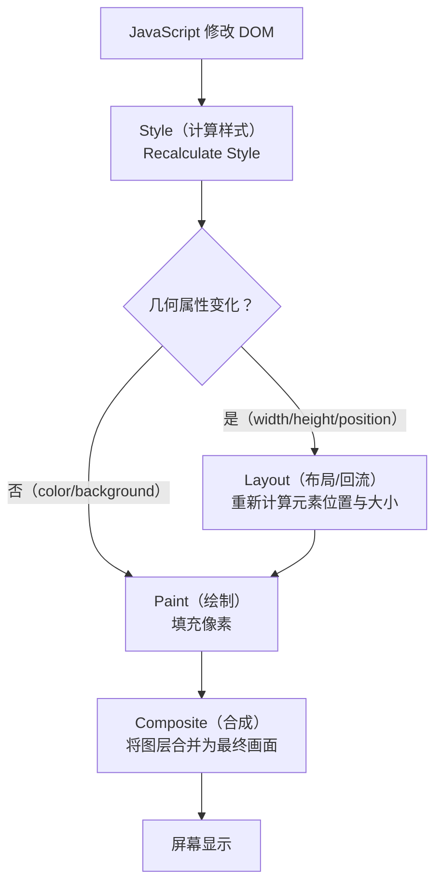

# 02-运行时优化

> 模块：08-performance（第8周 前端性能优化）
> 内容：防抖节流、回流重绘优化、虚拟列表、大文件分片上传、内存泄漏排查、Web Worker、SSR/SSG/ISR、框架级性能优化
> 格式：五段式（核心概念 → 底层原理 → 实战应用 → 常见面试题 → 避坑指南）

---

## 一、核心概念

运行时优化（Runtime Optimization）关注的是页面加载完成后，用户操作过程中的性能表现。与加载性能优化不同，运行时优化直接影响用户与页面交互的流畅度。

运行时性能问题的核心在于 **JavaScript 主线程的阻塞**。浏览器的主线程同时负责 JavaScript 执行、样式计算、布局、绘制和合成，任何长时间占用主线程的操作都会导致页面卡顿、响应延迟。

运行时优化的核心目标：**保持 60fps 的流畅帧率（每帧约 16.6ms），避免主线程长任务（Long Task > 50ms），确保用户交互的即时响应**。

---

## 二、底层原理

### 2.1 防抖（Debounce）与节流（Throttle）

两者的核心目的都是**控制高频事件的触发频率**，减少不必要的计算和 DOM 操作。

#### 2.1.1 防抖（Debounce）

**原理**：在事件被连续触发时，只执行最后一次。每次触发都重置计时器，直到停止触发后延迟 N 毫秒才执行。

```javascript
function debounce(fn, delay = 300) {
  let timer = null;
  return function (...args) {
    clearTimeout(timer);
    timer = setTimeout(() => {
      fn.apply(this, args);
      timer = null;
    }, delay);
  };
}

// 使用场景：搜索输入
searchInput.addEventListener('input', debounce((e) => {
  fetchSearchResults(e.target.value);
}, 300));
```

**适用场景**：
- 搜索框输入联想（等待用户停止输入后再请求）
- 窗口 resize 事件（等用户调整完窗口后再计算）
- 表单验证（等用户停止输入后再校验）
- 按钮防重复提交（只响应最后一次点击）

#### 2.1.2 节流（Throttle）

**原理**：无论事件触发多频繁，在固定时间间隔内只执行一次。

```javascript
function throttle(fn, interval = 300) {
  let lastTime = 0;
  return function (...args) {
    const now = Date.now();
    if (now - lastTime >= interval) {
      lastTime = now;
      fn.apply(this, args);
    }
  };
}

// 使用场景：滚动事件
window.addEventListener('scroll', throttle(() => {
  updateScrollProgress();
}, 100));
```

**适用场景**：
- 滚动事件处理（scroll）
- 鼠标移动事件（mousemove）
- 页面 resize 监听
- 无限滚动加载更多

#### 2.1.3 防抖与节流对比

| 特性 | 防抖（Debounce） | 节流（Throttle） |
|------|-----------------|-----------------|
| 执行时机 | 停止触发后延迟执行 | 固定间隔定期执行 |
| 触发频率 | 最后执行一次 | 每 N 毫秒执行一次 |
| 典型场景 | 搜索输入、按钮防重复 | 滚动监听、鼠标移动 |
| 实现核心 | 每次重置定时器 | 记录上次执行时间 |

### 2.2 回流（Reflow）与重绘（Repaint）优化

#### 2.2.1 概念区分

**回流（Reflow）**：当元素的几何属性（位置、尺寸）发生变化时，浏览器需要重新计算元素的几何属性，然后重新布局页面。回流一定触发重绘。

**重绘（Repaint）**：当元素的外观属性（颜色、背景、阴影等）发生变化，但不影响布局时，浏览器只需重新绘制元素。

**触发回流的操作**：
- 添加/删除可见 DOM 元素
- 元素位置/尺寸变化（width、height、padding、margin、border、top、left）
- 浏览器窗口大小变化
- 读取某些属性（offsetTop、offsetLeft、scrollTop、clientWidth、getComputedStyle）
- 修改字体大小
- 激活 CSS 伪类（如 `:hover`）

**触发重绘的操作**：
- 修改 color、background-color、box-shadow、visibility 等

#### 2.2.2 优化策略

**1. 批量修改 DOM**：
```javascript
// 错误做法：多次触发回流
const el = document.getElementById('box');
el.style.width = '100px';
el.style.height = '100px';
el.style.margin = '10px';
el.style.padding = '5px';

// 正确做法：使用 className 一次性修改
el.className = 'new-style';
```

**2. 使用 DocumentFragment**：
```javascript
const fragment = document.createDocumentFragment();
for (let i = 0; i < 1000; i++) {
  const li = document.createElement('li');
  li.textContent = `Item ${i}`;
  fragment.appendChild(li); // 不在 DOM 树中，不触发回流
}
document.getElementById('list').appendChild(fragment); // 一次性插入，只触发一次回流
```

**3. 离线 DOM 操作**：
```javascript
const list = document.getElementById('list');
list.style.display = 'none'; // 从渲染树中移除
// 执行大量 DOM 操作...
for (let i = 0; i < 1000; i++) {
  const li = document.createElement('li');
  li.textContent = `Item ${i}`;
  list.appendChild(li);
}
list.style.display = 'block'; // 恢复，只触发一次回流
```

**4. 使用 transform 代替 top/left**：
```css
/* 错误做法：触发回流 */
.box { position: absolute; top: 0; transition: top 0.3s; }
.box:hover { top: 100px; }

/* 正确做法：只触发合成，不触发回流 */
.box { transform: translateY(0); transition: transform 0.3s; }
.box:hover { transform: translateY(100px); }
```

**5. 读写分离**：
```javascript
// 错误做法：读写交替触发强制同步布局
elements.forEach(el => {
  const height = el.offsetHeight; // 读
  el.style.height = height + 10 + 'px'; // 写
});

// 正确做法：批量读，再批量写
const heights = elements.map(el => el.offsetHeight); // 先全部读取
elements.forEach((el, i) => {
  el.style.height = heights[i] + 10 + 'px'; // 再全部写入
});
```

**6. requestAnimationFrame 批量更新**：
```javascript
let ticking = false;
window.addEventListener('scroll', () => {
  if (!ticking) {
    requestAnimationFrame(() => {
      updatePosition();
      ticking = false;
    });
    ticking = true;
  }
});
```

**浏览器渲染流水线流程图**：



> 浏览器渲染流水线按**样式计算 -> 布局 -> 绘制 -> 合成**依次执行。回流（Reflow）发生在几何属性变化时需要重新布局，开销最大；重绘（Repaint）仅更新外观属性，跳过布局步骤；合成（Composite）利用 GPU 加速，仅涉及 transform/opacity 变化时性能最优。优化核心在于**减少回流次数、优先使用合成属性**。

> 📖 **参考链接**：
> - [MDN - requestAnimationFrame](https://developer.mozilla.org/zh-CN/docs/Web/API/Window/requestAnimationFrame)

### 2.3 虚拟列表（Virtual List）

**原理**：虚拟列表的核心思想是**只渲染可视区域内的 DOM 节点**，而非渲染全部数据。当用户滚动时，动态计算当前应该显示哪些数据项，并相应地更新 DOM。

**核心变量**：
- `startIndex`：可视区域起始数据索引
- `endIndex`：可视区域结束数据索引
- `offsetY`：列表容器的偏移量，用于模拟滚动位置
- `itemHeight`：每项高度（固定高度场景）
- `visibleCount`：可视区域可容纳的项数 = `Math.ceil(containerHeight / itemHeight)`

**实现原理**：
1. 计算可视区域可容纳的项数 `visibleCount`
2. 根据 `scrollTop` 计算 `startIndex = Math.floor(scrollTop / itemHeight)`
3. 计算 `endIndex = startIndex + visibleCount + bufferSize`（bufferSize 为缓冲区，避免快速滚动白屏）
4. 只渲染 `[startIndex, endIndex]` 范围内的数据
5. 通过 `padding-top` 或 `transform: translateY` 模拟滚动偏移

**常用库**：
- **react-window**：React 虚拟列表，轻量级（约 2KB (gzipped)），支持固定/可变高度
- **react-virtuoso**：功能更丰富的 React 虚拟列表，支持分组、粘性头部
- **vue-virtual-scroller**：Vue 官方推荐的虚拟滚动组件
- **vxe-table**：Vue 表格组件，内置虚拟滚动

**使用示例（react-window）**：
```javascript
import { FixedSizeList } from 'react-window';

function VirtualList({ items }) {
  return (
    <FixedSizeList
      height={600}
      itemCount={items.length}
      itemSize={50}
      width="100%"
    >
      {({ index, style }) => (
        <div style={style}>第 {index} 项：{items[index]}</div>
      )}
    </FixedSizeList>
  );
}
```

> **生活类比**：
> - **虚拟列表**：就像电影院——当前在播的场次坐满观众（可视区域渲染），上一场和下一场的观众在休息区等候（非可视区域不渲染，用占位元素撑开高度）。如果所有场次的观众都挤在放映厅里（全量渲染），再大的电影院也装不下（浏览器卡死）。
> - **防抖（debounce）**：就像电梯关门——连续有人进电梯（连续触发事件），门就一直不关（不执行），最后一个人进来后等几秒，门才关上（执行一次）。适合搜索框输入联想、窗口 resize 事件。
> - **节流（throttle）**：就像地铁发车——无论站台上来了多少乘客（触发多少次事件），地铁固定间隔发一班车（固定频率执行）。适合滚动事件、鼠标移动等高频触发场景。

> 📖 **参考链接**：
> - [MDN - IntersectionObserver](https://developer.mozilla.org/zh-CN/docs/Web/API/IntersectionObserver)

### 2.4 大文件分片上传

**核心原理**：利用 `Blob.slice()` 将大文件切分为多个小块，分片上传，支持断点续传和秒传。

**实现要点**：
1. **文件分片**：使用 `Blob.slice(start, end)` 将文件切分为固定大小的分片（如 5MB/片）
2. **文件哈希**：使用 `spark-md5` 计算文件 MD5 哈希，作为文件唯一标识
3. **并发上传**：控制同时上传的分片数量（如 3-5 个并发）
4. **断点续传**：上传前查询服务端已上传的分片列表，跳过已上传的分片
5. **秒传**：根据文件哈希查询服务端是否已有相同文件，有则直接返回

```javascript
// 核心实现示例
async function uploadFile(file, chunkSize = 5 * 1024 * 1024) {
  const chunks = Math.ceil(file.size / chunkSize);
  const fileHash = await calculateHash(file); // spark-md5 计算哈希

  // 检查秒传
  const { uploaded } = await checkFileExists(fileHash);
  if (uploaded) return { url: uploaded };

  // 获取已上传分片
  const uploadedChunks = await getUploadedChunks(fileHash);

  // 并发上传未完成的分片
  const pendingChunks = [];
  for (let i = 0; i < chunks; i++) {
    if (!uploadedChunks.includes(i)) {
      const chunk = file.slice(i * chunkSize, (i + 1) * chunkSize);
      pendingChunks.push(uploadChunk(fileHash, i, chunk));
    }
  }

  await Promise.all(pendingChunks);

  // 通知服务端合并分片
  return await mergeChunks(fileHash, file.name);
}
```

### 2.5 内存泄漏排查

#### 2.5.1 常见内存泄漏场景

| 泄漏场景 | 示例代码 | 原因 |
|----------|----------|------|
| 全局变量 | `window.data = hugeArray` | 全局变量不会被 GC 回收 |
| 未清除的定时器 | `setInterval(() => {...}, 1000)` | 定时器持续引用回调函数 |
| 闭包引用 | 闭包中保留大对象引用 | 闭包阻止外部变量被回收 |
| DOM 引用 | 删除 DOM 后 JS 仍持有引用 | 被分离的 DOM 节点无法被 GC |
| 未解绑的事件监听 | `element.addEventListener` 未 remove | 事件监听器阻止元素被回收 |
| WebSocket 未关闭 | 组件卸载后连接未断开 | 连接对象持续占用内存 |

#### 2.5.2 Chrome DevTools 排查方法

**1. 堆快照（Heap Snapshot）**：
- 在 Memory 面板中拍摄堆快照
- 拍摄前执行一次操作，拍摄后再次执行，对比两次快照
- 查看 Delta（增量），关注持续增长的对象

**2. 时间轴录制（Allocation instrumentation on timeline）**：
- 录制一段时间内的内存分配
- 操作页面，观察内存曲线是否持续上升
- 停止操作后，手动触发 GC（垃圾回收），观察内存是否回落

**3. 分离 DOM 节点检测**：
- 在堆快照中搜索 "Detached"
- 分离的 DOM 节点（已从 DOM 树移除但 JS 仍引用的节点）会导致内存泄漏

**排查步骤**：
1. 打开 Chrome DevTools → Performance 面板 → 勾选 Memory 选项 → 录制
2. 执行可疑操作，观察 JS Heap（蓝色线）是否持续上升
3. 操作后手动触发 GC（点击垃圾桶图标），如果内存未回落，存在泄漏
4. 切换到 Memory 面板，拍摄堆快照进行对比分析

> 📖 **参考链接**：
> - [MDN - JavaScript 内存管理](https://developer.mozilla.org/zh-CN/docs/Web/JavaScript/Guide/Memory_management)

### 2.6 Web Worker 提升性能

**原理**：Web Worker 在独立的后台线程中执行 JavaScript，不阻塞主线程，适合处理 CPU 密集型计算任务。

**限制**：
- 无法访问 DOM、window、document
- 通过 `postMessage` 与主线程通信（数据通过结构化克隆传递）
- 同源限制

**适用场景**：
- 大数据量计算（排序、过滤、聚合）
- 图像/视频处理（Canvas 像素操作）
- 加密/解密计算
- 大规模 JSON 解析
- 实时数据流处理

**使用 Comlink 简化通信**：
```javascript
// worker.js
import { expose } from 'comlink';

const heavyCalculation = (data) => {
  // CPU 密集型计算
  return result;
};

expose({ heavyCalculation });

// main.js
import { wrap } from 'comlink';
const worker = wrap(new Worker('./worker.js'));
const result = await worker.heavyCalculation(largeData);
```

> 📖 **参考链接**：
> - [MDN - Web Workers API](https://developer.mozilla.org/zh-CN/docs/Web/API/Web_Workers_API)

### 2.7 SSR / SSG / ISR 对比

| 特性 | SSR（服务端渲染） | SSG（静态生成） | ISR（增量静态再生） |
|------|------------------|----------------|---------------------|
| 渲染时机 | 每次请求时在服务端渲染 | 构建时预渲染 | 首次请求时生成，之后复用 |
| 数据新鲜度 | 实时 | 构建时 | 按需更新（可设置 revalidate） |
| 首屏速度 | 快 | 最快 | 快（第二次起） |
| 服务器压力 | 高（每次请求都渲染） | 低（纯静态文件） | 中（首次请求时渲染） |
| SEO 友好 | 是 | 是 | 是 |
| 适用场景 | 个性化内容、实时数据 | 文档、博客、营销页 | 内容更新不频繁的页面 |
| 框架支持 | Next.js、Nuxt.js | Next.js、Nuxt.js、Gatsby | Next.js（ISR 特性） |

**Next.js 配置示例**：
> **适用范围**：以下 API 适用于 Next.js **Pages Router**（`pages/` 目录）。如果使用 App Router（`app/` 目录），请参考 [04-渲染架构深度](./04-渲染架构深度.md) 中的 App Router 写法。

```typescript
// SSR（服务端渲染）—— Pages Router
export async function getServerSideProps(context) {
  const data = await fetchData(context.params.id);
  return { props: { data } };
}

// SSG：构建时渲染（getStaticProps）
export async function getStaticProps() {
  const data = await fetchData();
  return { props: { data } };
}

// ISR：定时重新生成（revalidate）
export async function getStaticProps() {
  const data = await fetchData();
  return { props: { data }, revalidate: 60 }; // 60 秒后重新生成
}
```

> **App Router（Next.js 13+）替代写法**：以上 `getServerSideProps` / `getStaticProps` 是 Pages Router API。在 App Router 中，SSR 直接使用 `async` 组件，SSG 使用 `fetch` + `cache: 'force-cache'`，ISR 使用 `fetch` + `next: { revalidate: N }`。

### 2.8 React / Vue 层面的性能优化

#### 2.8.1 React 性能优化

**React.memo**：对组件进行浅比较，props 未变化时跳过渲染。
```javascript
const ExpensiveComponent = React.memo(({ data }) => {
  return <div>{/* 复杂渲染 */}</div>;
});
```

**useMemo / useCallback**：缓存计算结果和函数引用。
```javascript
const sortedList = useMemo(() => [...data].sort((a, b) => a.value - b.value), [data]);
const handleClick = useCallback(() => { doSomething(id); }, [id]);
```

**避免内联对象/函数**：
```javascript
// 错误：每次渲染都创建新对象，导致子组件重渲染
<ListItem style={{ color: 'red' }} onClick={() => handleClick(id)} />

// 正确：使用 useMemo/useCallback 缓存引用
const itemStyle = useMemo(() => ({ color: 'red' }), []);
// 注意：handleClick 本身也需要被 useCallback 稳定化，否则 onItemClick 仍会每次重新创建
const onItemClick = useCallback(() => handleClick(id), [id, handleClick]);
<ListItem style={itemStyle} onClick={onItemClick} />
```

**key 优化**：使用稳定的唯一标识，避免使用数组索引作为 key。

#### 2.8.2 Vue 性能优化

**v-once**：渲染一次后不再更新，适合静态内容。
```html
<div v-once>{{ staticContent }}</div>
```

**v-memo（Vue 3.2+）**：缓存子树，依赖不变时跳过更新。
```html
<div v-for="item in list" :key="item.id" v-memo="[item.id, item.selected]">
  <p>{{ item.name }}</p>
</div>
```

**shallowRef / shallowReactive**：只跟踪第一层属性的变化。
```javascript
const state = shallowReactive({ deep: { nested: { data: 1 } } });
// state.deep.nested.data = 2 不会触发更新
```

**computed 缓存**：计算属性自动缓存，依赖不变时不重新计算。

---

## 三、实战应用

### 3.1 防抖节流在业务中的实际应用

```javascript
// 搜索输入防抖（300ms）
const searchInput = document.getElementById('search');
searchInput.addEventListener('input', debounce(async (e) => {
  const results = await fetch(`/api/search?q=${e.target.value}`);
  renderResults(results);
}, 300));

// 滚动加载节流（200ms）
window.addEventListener('scroll', throttle(() => {
  if (window.innerHeight + window.scrollY >= document.body.offsetHeight - 200) {
    loadMoreData();
  }
}, 200));

// 按钮防重复提交（leading 模式，首次立即执行）
function debounceLeading(fn, delay) {
  let timer = null;
  return function (...args) {
    if (timer) return;
    fn.apply(this, args);
    timer = setTimeout(() => { timer = null; }, delay);
  };
}
```

### 3.2 虚拟列表集成示例

```vue
<!-- Vue 3 + vue-virtual-scroller -->
<template>
  <RecycleScroller
    class="scroller"
    :items="list"
    :item-size="50"
    key-field="id"
    v-slot="{ item }"
  >
    <div class="item">{{ item.name }}</div>
  </RecycleScroller>
</template>
```

### 3.3 内存泄漏避免 Checklist

- [ ] 组件卸载时清理所有定时器（`clearTimeout`/`clearInterval`）
- [ ] 组件卸载时移除事件监听器（`removeEventListener`）
- [ ] 组件卸载时断开 WebSocket 连接
- [ ] 避免在全局作用域存储大对象
- [ ] 使用 WeakMap/WeakSet 存储 DOM 相关引用
- [ ] 大列表使用虚拟列表，避免创建过多 DOM 节点

---

## 四、常见面试题

**Q1：防抖和节流的区别及适用场景？**
- 防抖：连续触发只执行最后一次，适用于搜索输入、窗口 resize、按钮防重复
- 节流：固定间隔执行一次，适用于滚动事件、鼠标移动、无限滚动

**Q2：什么是回流和重绘？如何减少回流？**
- 回流：元素几何属性变化导致重新布局，开销大
- 重绘：元素外观变化不影响布局，开销较小
- 减少回流：批量修改 DOM、使用 className、DocumentFragment、离线 DOM、transform 动画、读写分离

**Q3：虚拟列表的实现原理？**
- 只渲染可视区域内的 DOM 节点
- 根据 scrollTop 计算 startIndex 和 endIndex
- 通过 padding 或 transform 模拟滚动位置
- 设置缓冲区避免快速滚动时白屏

**Q4：SSR、SSG、ISR 的区别和适用场景？**
- SSR：每次请求服务端渲染，适合个性化内容，服务器压力大
- SSG：构建时生成静态页面，适合内容不常变的页面，性能最优
- ISR：按需重新生成静态页面，结合 SSR 的实时性和 SSG 的性能

**Q5：React 中如何避免不必要的重渲染？**
- React.memo 包裹组件，props 浅比较
- useMemo 缓存计算结果，useCallback 缓存函数引用
- 避免传递内联对象/函数作为 props
- 使用稳定且唯一的 key

---

## 五、避坑指南

| 常见错误 | 现象 | 原因 | 解决方案 |
|----------|------|------|----------|
| 防抖函数中使用了旧的闭包变量 | 防抖回调中获取到的值是函数创建时的旧值 | 闭包捕获了过时的变量引用 | 使用 ref 存储最新值，或使用 `useCallback` + `useRef` |
| 大量 DOM 节点直接渲染 | 列表超过 1000 条时页面卡顿 | 大量 DOM 节点导致内存占用高、渲染慢 | 使用虚拟列表（react-window 等）只渲染可视区域 |
| 频繁读取 offsetTop 等属性 | 页面出现"布局抖动"（Layout Thrashing） | 读取布局属性触发强制同步布局 | 批量读取布局属性，再批量写入，读写分离 |
| 组件卸载后未清理副作用 | 控制台报错"Can't perform state update on unmounted component" | 异步操作完成时组件已卸载 | 使用 cleanup 函数（useEffect 返回值）或 AbortController |
| Web Worker 中传递大量数据 | 主线程仍然卡顿 | postMessage 使用结构化克隆，大数据复制开销大 | 使用 Transferable Objects 转移数据所有权，或使用 SharedArrayBuffer |
| 所有页面都用 SSR | 服务器负载过高，响应变慢 | 不必要的服务端渲染浪费资源 | 根据页面特性选择 SSR/SSG/ISR/CSR |
| useMemo 滥用 | 代码可读性下降，缓存开销超过收益 | 对简单计算使用 useMemo 反而增加开销 | 只在计算开销大、依赖变化频繁的场景使用 useMemo |
| 未设置虚拟列表的缓冲区 | 快速滚动时出现白屏 | 新节点渲染跟不上滚动速度 | 设置 overscan 参数（如 react-window 的 overscanCount），预渲染额外几项 |

---

> **学习导航**：
> - 返回 [学习路线总览](../README.md)
> - 本模块其他文件：[01-加载性能优化](./01-加载性能优化.md) | [03-性能优化笔面试题集](./03-性能优化笔面试题集.md)
> - 下一模块：[09-Node.js](../09-nodejs/README.md)

## 本章学习自检

- [ ] 能实现防抖和节流函数，并知道各自的适用场景
- [ ] 理解回流和重绘的区别，掌握减少回流的优化策略
- [ ] 能解释虚拟列表的原理，知道核心变量（startIndex、endIndex、offsetY）
- [ ] 理解大文件分片上传的流程：分片、哈希、并发、断点续传、秒传
- [ ] 掌握 Chrome DevTools 内存泄漏排查方法（堆快照、时间轴、对比视图）
- [ ] 了解 Web Worker 的适用场景和限制
- [ ] 能区分 SSR/SSG/ISR 的渲染时机和适用场景
- [ ] 掌握 React（React.memo/useMemo/useCallback）和 Vue（v-once/v-memo/shallowRef）的框架级优化手段