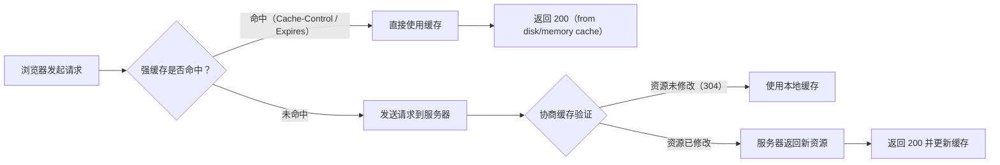

# 前端性能优化笔面试题集

> 模块：08-performance（第8周 前端性能优化）
> 覆盖：Core Web Vitals、加载优化、运行时优化、缓存策略、SSR/SSG
> 题量：10 道选择题 + 8 道简答题 + 5 道场景分析题
> 难度标注：★基础  ★★中档  ★★★拔高

---

## 一、选择题（10 题，每题附解析）

### 第 1 题 ★

Core Web Vitals 不包括以下哪个指标？

A. LCP（Largest Contentful Paint）
B. INP（Interaction to Next Paint）
C. TTI（Time to Interactive）
D. CLS（Cumulative Layout Shift）

**答案：C**

**解析**：Core Web Vitals 包含三个核心指标：LCP（最大内容绘制，衡量加载性能）、FID/INP（首次输入延迟/与下次绘制的交互，衡量交互性）、CLS（累积布局偏移，衡量视觉稳定性）。TTI（Time to Interactive，可交互时间）是 Lighthouse 的性能指标，但不属于 Core Web Vitals 三大核心指标。此外，INP 已于 2024 年 3 月正式替代 FID 成为 Core Web Vitals 的交互性指标。

> 📖 **参考链接**：
> - [web.dev - Core Web Vitals](https://web.dev/articles/vitals)

---

### 第 2 题 ★

LCP（最大内容绘制）的"良好"标准是？

A. < 1.0 秒
B. < 2.5 秒
C. < 5.0 秒
D. < 10.0 秒

**答案：B**

**解析**：根据 Google 的 Web Vitals 标准，LCP 的衡量标准为：良好（Good）< 2.5s，需要改进（Needs Improvement）2.5s ~ 4.0s，差（Poor）>= 4.0s。LCP 衡量的是视口内最大可见内容元素完成渲染的时间，是衡量加载性能的核心指标。

---

**浏览器缓存机制判定流程图：**



> 浏览器缓存机制先判断强缓存（Cache-Control/Expires），命中则直接使用缓存不发起请求；强缓存过期后进入协商缓存（ETag/Last-Modified），由服务器验证资源是否更新，返回 304 或 200。

### 第 3 题 ★

以下哪种缓存策略属于强缓存？

A. Etag
B. Cache-Control: max-age=86400
C. If-None-Match
D. If-Modified-Since

**答案：B**

**解析**：`Cache-Control: max-age=86400` 是强缓存策略，浏览器在 max-age 时间内直接使用缓存，不发送请求到服务器。ETag 是协商缓存的响应头，If-None-Match 和 If-Modified-Since 是协商缓存的请求头，它们都需要浏览器发送请求到服务器进行验证。

---

### 第 4 题 ★★

Tree Shaking 依赖 JavaScript 的什么特性？

A. CommonJS 的动态导入
B. ES Module 的静态导入/导出
C. AMD 的异步模块定义
D. IIFE 的立即执行

**答案：B**

**解析**：Tree Shaking 依赖 ES Module 的静态导入/导出（`import`/`export`）特性。因为 `import` 和 `export` 是编译时确定的（静态的），构建工具可以在编译阶段分析模块依赖关系，找出未使用的导出并删除。CommonJS 的 `require()` 是动态的（运行时确定），无法在编译时进行静态分析，因此不支持 Tree Shaking。

> 📖 **参考链接**：
> - [Webpack官方文档 - Tree Shaking](https://webpack.docschina.org/guides/tree-shaking/)

---

### 第 5 题 ★★

以下关于代码分割（Code Splitting）的说法，正确的是？

A. 代码分割只能通过配置多个 entry 入口实现
B. 使用动态 import() 可以实现按需加载，是代码分割的常用方式
C. 代码分割会增加总体积，不利于性能优化
D. 代码分割只能在 Webpack 中使用

**答案：B**

**解析**：代码分割有三种常见方式：入口分割（entry）、动态导入（`import()`）、SplitChunksPlugin 提取公共模块。动态 `import()` 是最灵活的代码分割方式，可以在路由、组件级别实现按需加载。代码分割不增加总体积，而是将大包拆分为多个小包，提升首屏加载速度。Vite（基于 Rollup）、esbuild 等构建工具也都支持代码分割。

---

### 第 6 题 ★★

虚拟列表（Virtual List）的核心原理是什么？

A. 使用 CSS 动画优化列表渲染
B. 将数据分页，每次只渲染一页数据
C. 只渲染可视区域内的 DOM 节点，根据滚动位置动态计算可见数据
D. 使用 Web Worker 在后台线程渲染列表

**答案：C**

**解析**：虚拟列表的核心原理是只渲染用户可视区域内的 DOM 节点。当用户滚动时，根据 scrollTop 动态计算 startIndex 和 endIndex，只渲染该范围内的数据。通过 padding 或 transform 模拟完整的滚动高度。虚拟列表解决的是大量 DOM 节点带来的内存和渲染开销问题，而非分页（分页需要用户手动翻页）。Web Worker 无法访问 DOM，不能用于渲染。

---

### 第 7 题 ★★

以下关于 SSR（服务端渲染）的描述，正确的是？

A. SSR 在客户端使用 JavaScript 渲染 HTML
B. SSR 在服务端生成完整的 HTML，SEO 友好，首屏速度快
C. SSR 只能在 React 中使用
D. SSR 不需要服务器支持

**答案：B**

**解析**：SSR（Server-Side Rendering）在服务端将组件渲染为完整的 HTML 字符串返回给客户端，具有 SEO 友好、首屏速度快等优点。相比之下，CSR（客户端渲染）在客户端使用 JavaScript 渲染。SSR 需要 Node.js 服务器支持，React（Next.js）、Vue（Nuxt.js）等主流框架都支持 SSR。

---

### 第 8 题 ★★

以下哪种方式可以减少回流（Reflow）？

A. 逐条修改元素的 style 属性
B. 使用 top/left 属性实现动画（无 will-change 优化）
C. 使用 CSS transform 实现动画
D. 在循环中频繁读取 offsetHeight

**答案：C**

**解析**：`transform` 属性只触发合成（Composite），不触发回流（Reflow）和重绘（Repaint），是性能最优的动画实现方式。逐条修改 style 属性会多次触发回流，使用 top/left 实现动画也会触发回流（因为改变了元素位置），频繁读取 offsetHeight 等布局属性会触发强制同步布局（Layout Thrashing）。

---

### 第 9 题 ★★★

以下关于 HTTP 缓存的说法，正确的是？

A. ETag 和 Last-Modified 都属于强缓存，不需要请求服务器
B. Cache-Control: max-age 是协商缓存
C. ETag 和 If-None-Match 属于协商缓存，浏览器需要发送请求验证
D. 强缓存和协商缓存可以同时使用，浏览器会优先使用协商缓存

**答案：C**

**解析**：ETag/If-None-Match 和 Last-Modified/If-Modified-Since 都属于协商缓存，浏览器需要发送请求到服务器，服务器通过对比判断资源是否更新，未更新则返回 304 Not Modified。强缓存（Cache-Control: max-age、Expires）则是在有效期内完全不发送请求。强缓存和协商缓存可以同时使用，浏览器会优先使用强缓存，强缓存过期后才使用协商缓存。

---

### 第 10 题 ★★★

关于 preload 和 prefetch 的区别，以下说法正确的是？

A. preload 和 prefetch 没有区别，可以互换使用
B. preload 是当前页面需要的资源，优先级高，立即加载；prefetch 是未来页面可能需要的资源，优先级低，空闲时加载
C. prefetch 的优先级高于 preload
D. preload 只能用于加载 CSS 文件

**答案：B**

**解析**：preload（`<link rel="preload">`）用于声明当前页面必需的资源，浏览器会以高优先级立即加载，适用于首屏关键 CSS、字体、LCP 图片等。prefetch（`<link rel="prefetch">`）用于声明未来页面可能需要的资源，浏览器在空闲时以低优先级加载，适用于下一页的 JS/CSS 等。preload 支持多种资源类型（script、style、font、image、fetch 等），不仅限于 CSS。

> 📖 **参考链接**：
> - [MDN - rel preload](https://developer.mozilla.org/zh-CN/docs/Web/HTML/Attributes/rel/preload)

---

## 二、简答题（8 题）

### 第 1 题 ★★ Core Web Vitals 三大指标是什么？如何优化？

**参考答案**：

Core Web Vitals 是 Google 提出的衡量 Web 用户体验的核心指标，包括：

1. **LCP（Largest Contentful Paint，最大内容绘制）**：
   - 标准：< 2.5s 良好
   - 优化：优化关键渲染路径、使用 CDN、压缩图片、预加载 LCP 资源、服务端渲染

2. **INP（Interaction to Next Paint，与下次绘制的交互）**：
   - 标准：< 200ms 良好
   - 优化：减少主线程长任务、代码分割、使用 Web Worker、避免同步耗时操作

3. **CLS（Cumulative Layout Shift，累积布局偏移）**：
   - 标准：< 0.1 良好
   - 优化：为图片/视频设置宽高、为动态内容预留空间、使用 `font-display: swap`、避免在已有内容上方插入新内容

> 📖 **参考链接**：
> - [web.dev - Core Web Vitals](https://web.dev/articles/vitals)

---

### 第 2 题 ★★ 强缓存和协商缓存的区别

**参考答案**：

| 对比维度 | 强缓存 | 协商缓存 |
|----------|--------|----------|
| 是否发送请求 | 否，直接使用缓存 | 是，发送请求验证 |
| HTTP 状态码 | 200（from disk/memory cache） | 304 Not Modified |
| 控制头部 | Cache-Control / Expires | ETag / Last-Modified |
| 优先级 | 高（先判断强缓存） | 低（强缓存过期后判断） |
| 适用资源 | 带哈希的 JS/CSS/图片 | HTML 入口文件 |

**关键策略**：HTML 使用协商缓存确保及时更新，JS/CSS/图片使用文件名哈希 + 强缓存实现"永久缓存"。

---

### 第 3 题 ★★ 如何实现图片懒加载？

**参考答案**：

**方案一：原生 API（推荐）**
```html

```

**方案二：Intersection Observer API**
```javascript
const observer = new IntersectionObserver((entries) => {
  entries.forEach(entry => {
    if (entry.isIntersecting) {
      const img = entry.target;
      img.src = img.dataset.src;
      observer.unobserve(img);
    }
  });
}, { rootMargin: '50px' });

document.querySelectorAll('img[data-src]').forEach(img => observer.observe(img));
```

**方案三：使用第三方库**（如 lazysizes、react-lazyload、v-lazy-image）

> 📖 **参考链接**：
> - [MDN - img 元素 loading 属性](https://developer.mozilla.org/zh-CN/docs/Web/HTML/Element/img#attr-loading)
> - [MDN - IntersectionObserver](https://developer.mozilla.org/zh-CN/docs/Web/API/IntersectionObserver)

---

### 第 4 题 ★★ Tree Shaking 的原理和实现条件

**参考答案**：

**原理**：
1. 基于 ES Module 的静态分析，构建工具在编译时分析模块依赖图
2. 标记所有未被引用的导出（usedExports）
3. 在打包阶段通过压缩工具（Terser）删除标记的死代码

**实现条件**：
1. 必须使用 ES Module（`import`/`export`）语法，而非 CommonJS
2. 在 `package.json` 中正确声明 `sideEffects`，标记有副作用的模块
3. 生产模式构建（`mode: 'production'`）
4. 确保模块没有"隐式"副作用（如修改全局变量、原型链等）

> 📖 **参考链接**：
> - [Webpack官方文档 - Tree Shaking](https://webpack.docschina.org/guides/tree-shaking/)

---

### 第 5 题 ★★ 代码分割（Code Splitting）的策略有哪些？

**参考答案**：

1. **入口分割（Entry Points）**：配置多个入口文件，手动拆分代码
2. **动态导入（Dynamic Import）**：使用 `import()` 语法实现按需加载
3. **SplitChunksPlugin**：自动提取公共依赖到独立 chunk
4. **路由级分割**：每个路由对应一个独立的 chunk（React Router、Vue Router 均支持）
5. **组件级分割**：使用 `React.lazy` + `Suspense` 或 `defineAsyncComponent` 实现组件懒加载

> 📖 **参考链接**：
> - [Webpack官方文档 - 代码分割](https://webpack.docschina.org/guides/code-splitting/)

---

### 第 6 题 ★★ 虚拟列表的原理和实现

**参考答案**：

**核心原理**：只渲染可视区域内的 DOM 节点，根据滚动位置动态计算可见数据。

**关键变量**：
- `startIndex`：`Math.floor(scrollTop / itemHeight)`
- `endIndex`：`startIndex + visibleCount + bufferSize`
- `offsetY`：通过 `padding-top` 或 `transform: translateY` 模拟滚动位置

**实现步骤**：
1. 监听滚动事件，获取 `scrollTop`
2. 计算 `startIndex` 和 `endIndex`
3. 只渲染 `[startIndex, endIndex]` 范围内的数据
4. 设置容器的总高度（`itemHeight × totalCount`）保证滚动条正确

**注意事项**：需设置缓冲区（overscan）避免快速滚动白屏，需处理每项高度不固定的场景（动态高度虚拟列表）。

> 📖 **参考链接**：
> - [MDN - IntersectionObserver](https://developer.mozilla.org/zh-CN/docs/Web/API/IntersectionObserver)

---

### 第 7 题 ★★★ SSR / SSG / ISR 的区别和适用场景

**参考答案**：

| 特性 | SSR | SSG | ISR |
|------|-----|-----|-----|
| 渲染时机 | 每次请求 | 构建时 | 首次请求 + 按需更新 |
| 数据新鲜度 | 实时 | 构建时 | 可配置（revalidate） |
| 首屏速度 | 快 | 最快 | 快（第二次起） |
| 服务器压力 | 高 | 低 | 中 |
| 适用场景 | 个性化内容、实时数据 | 文档、博客、营销页 | 商品详情页、新闻列表 |

**框架选择**：
- Next.js：支持 SSR/SSG/ISR，React 生态最完善
- Nuxt.js：支持 SSR/SSG，Vue 生态首选
- Gatsby：专注 SSG 模式

> 📖 **参考链接**：
> - [web.dev - 渲染方式](https://web.dev/articles/rendering-on-the-web)

---

### 第 8 题 ★★ 如何排查前端内存泄漏？

**参考答案**：

**排查步骤**：
1. Chrome DevTools → Performance 面板 → 勾选 Memory 选项 → 录制页面操作
2. 观察 JS Heap（蓝色线）是否持续上升，操作后手动 GC 是否回落
3. 使用 Memory 面板 → Heap Snapshot 拍摄堆快照，对比两次快照的 Delta
4. 搜索 "Detached" 查找分离的 DOM 节点

**常见泄漏场景**：
- 全局变量：`window.xxx = largeData`
- 未清除的定时器：`setInterval` 未调用 `clearInterval`
- 未解绑的事件监听：`addEventListener` 未 `removeEventListener`
- 闭包引用：闭包中保留了大对象引用
- DOM 引用：删除 DOM 节点后 JS 仍持有引用

> 📖 **参考链接**：
> - [MDN - JavaScript 内存管理](https://developer.mozilla.org/zh-CN/docs/Web/JavaScript/Guide/Memory_management)

---

## 三、场景分析题（5 题）

### 第 1 题 ★★ 首屏加载时间过长，如何分析和优化？

**场景描述**：某 H5 页面首屏加载时间超过 5 秒，用户反馈体验差，请给出完整的分析和优化方案。

**参考答案**：

**第一步：性能分析（Lighthouse + Performance）**
1. 运行 Lighthouse 审计，获取 FCP、LCP、TBT、CLS 等指标
2. 查看 Performance 面板的 Network 瀑布图，分析资源加载时序
3. 查看 Coverage 面板，找出未使用的 JS/CSS 代码
4. 查看 Bundle 分析（webpack-bundle-analyzer），找出大体积模块

**第二步：瓶颈定位**
- 网络层面：资源体积过大、请求数量过多、未使用 CDN、未启用压缩
- 渲染层面：关键渲染路径未优化、阻塞渲染的 JS/CSS
- 代码层面：打包体积过大、未做代码分割

**第三步：优化方案**
1. **资源优化**：图片转 WebP/AVIF、JS/CSS 压缩、启用 Gzip/Brotli
2. **加载策略**：关键 CSS 内联、非关键 CSS 异步加载、JS 使用 defer/async
3. **代码分割**：动态 `import()` 路由懒加载、提取第三方库
4. **缓存策略**：HTML 协商缓存，JS/CSS 文件名哈希 + 强缓存
5. **CDN 加速**：静态资源 CDN 分发
6. **预加载**：preload 关键资源，preconnect 第三方域名
7. **SSR/SSG**：考虑服务端渲染或静态生成

**第四步：验证优化效果**
- 再次运行 Lighthouse，对比优化前后数据
- 建立性能监控，持续追踪 Core Web Vitals

---

### 第 2 题 ★★ 列表页有 10000 条数据，渲染卡顿，如何优化？

**场景描述**：后台管理系统中，用户列表页有 10000 条数据，直接渲染导致页面卡顿，滚动不流畅。

**参考答案**：

**方案一：虚拟列表（推荐）**
- 使用 `react-window` 或 `vue-virtual-scroller` 实现虚拟滚动
- 只渲染可视区域内的 DOM 节点（约 20-30 个），而非全部 10000 个
- 设置 overscan（缓冲区），避免快速滚动时白屏

**方案二：分页加载**
- 前端分页 + 后端分页接口
- 每次只加载一页数据（如 50 条）
- 配合搜索和筛选功能减少数据量

**方案三：懒加载**
- 使用 Intersection Observer 实现滚动到底部自动加载更多
- 逐步渲染，避免一次性加载全部数据

**综合推荐**：虚拟列表 + 后端分页接口。虚拟列表保证渲染性能，后端分页减少数据传输量和前端内存占用。

**其他优化**：
- 列表项使用 `React.memo` 避免不必要重渲染
- 图片使用懒加载
- 对列表数据进行适当的缓存

---

### 第 3 题 ★★★ SPA 应用 SEO 问题如何解决？

**场景描述**：某 SPA 应用（React/Vue）在搜索引擎中收录效果差，页面内容无法被爬虫抓取。

**参考答案**：

**问题原因**：SPA 的 HTML 是一个空壳，内容由 JavaScript 动态渲染。虽然 Google 可以执行 JS，但爬取效率低、延迟高，其他搜索引擎（百度等）基本不支持 JS 渲染。

**解决方案对比**：

| 方案 | 原理 | 优点 | 缺点 |
|------|------|------|------|
| SSR | 服务端渲染完整 HTML | SEO 最佳，首屏快 | 服务器压力大，开发成本高 |
| SSG | 构建时预渲染静态 HTML | 性能最优，成本低 | 适合内容不常变的页面 |
| 预渲染（Prerender） | 构建时使用无头浏览器渲染页面 | 对现有 SPA 改动小 | 只适合静态内容，动态路由多时构建慢 |
| 动态渲染 | 对爬虫返回预渲染版本，对用户返回 SPA | 兼容性好 | 需要额外服务，维护成本高 |

**推荐方案**：
- 使用 Next.js（React）或 Nuxt.js（Vue）进行 SSR/SSG 改造
- 对于内容型页面（文章、产品详情）使用 SSG
- 对于个性化页面（用户中心、购物车）使用 CSR
- 配合 `next-seo` / `@nuxtjs/seo` 等 SEO 插件完善 meta 标签

---

### 第 4 题 ★★ 如何设计一个前端资源缓存策略？

**场景描述**：请为一个前端项目设计完整的资源缓存策略，包括 HTML、JS、CSS、图片、字体等。

**参考答案**：

| 资源类型 | 缓存策略 | 配置示例 | 原因 |
|----------|----------|----------|------|
| HTML | 协商缓存 | `Cache-Control: no-cache` | 确保用户总是获取最新页面结构 |
| JS（带哈希） | 强缓存 | `Cache-Control: max-age=31536000, immutable` | 文件名哈希保证内容变化时 URL 变化 |
| CSS（带哈希） | 强缓存 | `Cache-Control: max-age=31536000, immutable` | 同 JS，文件名哈希保证版本控制 |
| 图片 | 强缓存 | `Cache-Control: max-age=31536000` | 图片内容相对稳定，配合文件名哈希 |
| 字体 | 强缓存 | `Cache-Control: max-age=31536000` | 字体文件很少变化 |
| API 数据 | 协商缓存或无缓存 | `Cache-Control: no-cache` 或 `no-store` | 数据实时性要求高 |

**核心原则**：
- HTML 入口文件使用协商缓存，确保内容更新及时生效
- JS/CSS 等静态资源使用文件名哈希（如 `main.a1b2c3.js`），内容变化时哈希自动变化，触发新请求
- 配置 immutable 指令，告诉浏览器资源在缓存期间不会变化，跳过验证请求

**Nginx 配置示例**：
```nginx
location / {
    add_header Cache-Control "no-cache";
}
location ~* \.(js|css|png|jpg|gif|svg|woff2)$ {
    expires 1y;
    add_header Cache-Control "public, immutable";
}
```

---

### 第 5 题 ★★★ 如何设计一个前端性能监控体系？

**场景描述**：请为公司的前端项目设计一套完整的性能监控体系，覆盖加载性能、运行时性能、错误监控。

**参考答案**：

**一、监控指标采集**

**Core Web Vitals 采集**（使用 web-vitals 库）：
```javascript
import { onLCP, onINP, onCLS } from 'web-vitals';

function sendToAnalytics(metric) {
  navigator.sendBeacon('/api/metrics', JSON.stringify({
    name: metric.name,
    value: metric.value,
    rating: metric.rating,
    page: location.pathname,
    timestamp: Date.now(),
  }));
}

onLCP(sendToAnalytics);
onINP(sendToAnalytics);
onCLS(sendToAnalytics);
```

**自定义性能指标**：
- 首屏渲染时间（自定义打点）
- 接口请求耗时（PerformanceObserver 监听 resource）
- 页面切换耗时（路由守卫记录）
- 自定义业务耗时（performance.mark/measure）

**错误监控**：
- JS 运行时错误：`window.onerror` / `window.addEventListener('error')`
- Promise 未捕获异常：`window.addEventListener('unhandledrejection')`
- 资源加载错误：`window.addEventListener('error', ..., true)`（捕获阶段）
- 接口异常：Axios 拦截器统一捕获

**二、数据上报**

- 使用 `navigator.sendBeacon()` 进行非阻塞上报
- 采样率控制：全量采集指标，错误 100% 上报，性能数据可配置采样率
- 数据压缩：批量上报或使用压缩算法

**三、监控平台功能**

1. **性能大盘**：展示 Core Web Vitals 的 P75 值、趋势图
2. **页面级分析**：按页面维度展示 FCP、LCP、TTI 等指标
3. **分布分析**：按地区、设备、浏览器、网络类型分析性能差异
4. **告警机制**：指标劣化超过阈值自动告警
5. **错误分析**：Source Map 还原、错误聚合、影响用户数统计

**四、优化闭环**

- 发现问题 → 定位瓶颈 → 实施优化 → 验证效果 → 持续监控
- 每次发版后对比性能数据，防止性能劣化
- 建立性能预算（Performance Budget），超过预算自动告警

---

## 补充编程题：完整代码实现

### 补充1：图片懒加载（IntersectionObserver）

```javascript
/**
 * 图片懒加载：基于 IntersectionObserver API
 * 当图片进入视口时才加载真实图片资源
 */

// ========== 方案一：原生 IntersectionObserver ==========
class LazyImageLoader {
  constructor(options = {}) {
    this.options = {
      rootMargin: '50px',    // 提前 50px 开始加载
      threshold: 0.01,       // 1% 可见时触发
      placeholder: 'data:image/svg+xml,...', // 占位图
      ...options,
    };

    this.observer = null;
    this.init();
  }

  init() {
    this.observer = new IntersectionObserver(
      this.handleIntersect.bind(this),
      {
        rootMargin: this.options.rootMargin,
        threshold: this.options.threshold,
      }
    );

    // 查找所有需要懒加载的图片
    const images = document.querySelectorAll('img[data-src]');
    images.forEach((img) => this.observer.observe(img));
  }

  handleIntersect(entries) {
    entries.forEach((entry) => {
      if (entry.isIntersecting) {
        const img = entry.target;
        this.loadImage(img);
      }
    });
  }

  loadImage(img) {
    const src = img.dataset.src;
    const srcset = img.dataset.srcset;

    if (!src) return;

    // 设置 srcset（响应式图片）
    if (srcset) {
      img.srcset = srcset;
    }

    // 设置 src 触发加载
    img.src = src;

    // 加载完成后添加样式
    img.onload = () => {
      img.classList.add('lazy-loaded');
      img.removeAttribute('data-src');
      img.removeAttribute('data-srcset');
    };

    // 加载失败处理
    img.onerror = () => {
      img.classList.add('lazy-error');
      // 设置错误占位图
      img.src = this.options.placeholder;
    };

    // 停止观察
    this.observer.unobserve(img);
  }

  // 刷新：重新扫描新增的懒加载图片
  refresh() {
    const images = document.querySelectorAll('img[data-src]');
    images.forEach((img) => {
      if (!img.classList.contains('lazy-loaded')) {
        this.observer.observe(img);
      }
    });
  }

  destroy() {
    if (this.observer) {
      this.observer.disconnect();
      this.observer = null;
    }
  }
}

// 使用
const lazyLoader = new LazyImageLoader({
  rootMargin: '100px',
  placeholder: '/images/placeholder.svg',
});

// ========== 方案二：原生 loading="lazy" 属性（最简单） ==========
// 
// 浏览器原生支持，无需 JavaScript，Chrome 77+ 支持

// ========== 方案三：React 图片懒加载组件 ==========
import React, { useRef, useEffect, useState } from 'react';

function LazyImage({ src, alt, placeholder, className = '', ...props }) {
  const imgRef = useRef(null);
  const [isLoaded, setIsLoaded] = useState(false);
  const [isInView, setIsInView] = useState(false);

  useEffect(() => {
    const observer = new IntersectionObserver(
      ([entry]) => {
        if (entry.isIntersecting) {
          setIsInView(true);
          observer.unobserve(entry.target);
        }
      },
      { rootMargin: '50px' }
    );

    if (imgRef.current) {
      observer.observe(imgRef.current);
    }

    return () => observer.disconnect();
  }, []);

  return (
     setIsLoaded(true)}
      {...props}
    />
  );
}

// ========== 方案四：Vue 图片懒加载组件 ==========
// <template>
//   
// </template>
//
// <script setup>
// import { ref, onMounted, onUnmounted } from 'vue';
//
// const props = defineProps({
//   src: String,
//   alt: String,
//   placeholder: { type: String, default: '' },
// });
//
// const imgRef = ref(null);
// const isInView = ref(false);
// const isLoaded = ref(false);
// let observer = null;
//
// onMounted(() => {
//   observer = new IntersectionObserver(([entry]) => {
//     if (entry.isIntersecting) {
//       isInView.value = true;
//       observer.unobserve(entry.target);
//     }
//   }, { rootMargin: '50px' });
//   if (imgRef.value) observer.observe(imgRef.value);
// });
//
// onUnmounted(() => observer?.disconnect());
// </script>
```

### 补充2：虚拟滚动（Virtual Scroll）

```javascript
/**
 * 虚拟滚动（Virtual Scroll）完整实现
 * 核心原理：只渲染可视区域内的 DOM 节点
 */

// ========== 原生 JavaScript 实现 ==========
class VirtualScroll {
  constructor(options) {
    this.container = options.container;
    this.itemHeight = options.itemHeight || 50;
    this.overscan = options.overscan || 3;  // 预渲染项数
    this.data = options.data || [];
    this.renderItem = options.renderItem;

    this.visibleItems = [];
    this.scrollTop = 0;
    this.containerHeight = 0;

    this.init();
  }

  init() {
    this.containerHeight = this.container.clientHeight;
    this.container.style.overflow = 'auto';
    this.container.style.position = 'relative';

    // 创建内层容器（撑开滚动条）
    this.innerContainer = document.createElement('div');
    this.innerContainer.style.position = 'relative';
    this.updateInnerHeight();

    // 创建可视区域容器
    this.viewport = document.createElement('div');
    this.viewport.style.position = 'absolute';
    this.viewport.style.top = '0';
    this.viewport.style.left = '0';
    this.viewport.style.right = '0';

    this.innerContainer.appendChild(this.viewport);
    this.container.appendChild(this.innerContainer);

    // 绑定滚动事件（保存引用以便 destroy 时移除）
    this._boundScroll = this.handleScroll.bind(this);
    this.container.addEventListener('scroll', this._boundScroll);

    // 初始渲染
    this.render();
  }

  handleScroll() {
    this.scrollTop = this.container.scrollTop;
    this.render();
  }

  updateInnerHeight() {
    this.innerContainer.style.height = `${this.data.length * this.itemHeight}px`;
  }

  // 计算可视范围
  getVisibleRange() {
    const startIndex = Math.max(
      0,
      Math.floor(this.scrollTop / this.itemHeight) - this.overscan
    );
    const endIndex = Math.min(
      this.data.length - 1,
      Math.ceil((this.scrollTop + this.containerHeight) / this.itemHeight) + this.overscan
    );
    return { startIndex, endIndex };
  }

  render() {
    const { startIndex, endIndex } = this.getVisibleRange();

    // 清空现有内容
    this.viewport.innerHTML = '';

    // 只渲染可见范围内的数据
    for (let i = startIndex; i <= endIndex; i++) {
      const item = this.data[i];
      const itemElement = this.renderItem(item, i);
      itemElement.style.position = 'absolute';
      itemElement.style.top = `${i * this.itemHeight}px`;
      itemElement.style.height = `${this.itemHeight}px`;
      itemElement.style.left = '0';
      itemElement.style.right = '0';
      this.viewport.appendChild(itemElement);
    }
  }

  // 更新数据
  setData(data) {
    this.data = data;
    this.updateInnerHeight();
    this.render();
  }

  // 滚动到指定位置
  scrollToIndex(index) {
    const targetScrollTop = index * this.itemHeight;
    this.container.scrollTop = targetScrollTop;
  }

  destroy() {
    this.container.removeEventListener('scroll', this._boundScroll);
  }
}

// 使用示例
const container = document.getElementById('virtual-list');
const data = Array.from({ length: 100000 }, (_, i) => ({
  id: i,
  name: `用户 ${i + 1}`,
  email: `user${i + 1}@example.com`,
}));

const virtualScroll = new VirtualScroll({
  container,
  itemHeight: 60,
  data,
  renderItem: (item, index) => {
    const div = document.createElement('div');
    div.style.cssText = `
      display: flex;
      align-items: center;
      padding: 0 16px;
      border-bottom: 1px solid #f0f0f0;
      box-sizing: border-box;
    `;
    div.innerHTML = `
      <span style="font-weight: bold; width: 80px;">${index + 1}</span>
      <span style="flex: 1;">${item.name}</span>
      <span style="color: #666;">${item.email}</span>
    `;
    return div;
  },
});

// ========== React 虚拟滚动组件 ==========
import React, { useState, useRef, useCallback, useMemo } from 'react';

function ReactVirtualScroll({
  data = [],
  itemHeight = 50,
  containerHeight = 600,
  overscan = 3,
  renderItem,
}) {
  const containerRef = useRef(null);
  const [scrollTop, setScrollTop] = useState(0);

  const handleScroll = useCallback(() => {
    if (containerRef.current) {
      setScrollTop(containerRef.current.scrollTop);
    }
  }, []);

  const { startIndex, endIndex } = useMemo(() => {
    const start = Math.max(0, Math.floor(scrollTop / itemHeight) - overscan);
    const end = Math.min(
      data.length - 1,
      Math.ceil((scrollTop + containerHeight) / itemHeight) + overscan
    );
    return { startIndex: start, endIndex: end };
  }, [scrollTop, itemHeight, containerHeight, data.length, overscan]);

  const visibleItems = useMemo(() => {
    const items = [];
    for (let i = startIndex; i <= endIndex; i++) {
      items.push({ data: data[i], index: i });
    }
    return items;
  }, [data, startIndex, endIndex]);

  const totalHeight = data.length * itemHeight;
  const offsetY = startIndex * itemHeight;

  return (
    <div
      ref={containerRef}
      onScroll={handleScroll}
      style={{
        height: containerHeight,
        overflow: 'auto',
        position: 'relative',
      }}
    >
      <div style={{ height: totalHeight, position: 'relative' }}>
        <div
          style={{
            position: 'absolute',
            top: 0,
            left: 0,
            right: 0,
            transform: `translateY(${offsetY}px)`,
          }}
        >
          {visibleItems.map(({ data: item, index }) => (
            <div key={item.id} style={{ height: itemHeight }}>
              {renderItem(item, index)}
            </div>
          ))}
        </div>
      </div>
    </div>
  );
}
```

### 补充3：防抖节流在性能优化中的应用

```javascript
/**
 * 防抖和节流在性能优化中的完整实现
 * 适用场景：滚动事件、窗口 resize、输入框搜索、按钮防重复点击
 */

// ========== 防抖（Debounce） ==========
// 适用场景：搜索框输入、窗口 resize、按钮防重复提交

function debounce(fn, delay = 300, immediate = false) {
  let timer = null;
  let isInvoked = false;

  function debounced(...args) {
    const context = this;

    if (timer) {
      clearTimeout(timer);
    }

    if (immediate) {
      if (!isInvoked) {
        fn.apply(context, args);
        isInvoked = true;
      }
      timer = setTimeout(() => {
        isInvoked = false;
      }, delay);
    } else {
      timer = setTimeout(() => {
        fn.apply(context, args);
        timer = null;
      }, delay);
    }
  }

  debounced.cancel = () => {
    if (timer) {
      clearTimeout(timer);
      timer = null;
    }
    isInvoked = false;
  };

  return debounced;
}

// 性能优化示例：搜索输入防抖
const searchInput = document.getElementById('search-input');
const handleSearch = debounce((keyword) => {
  console.log('发起搜索请求:', keyword);
  // fetch(`/api/search?q=${keyword}`)
}, 500);

searchInput.addEventListener('input', (e) => {
  handleSearch(e.target.value);
});

// 性能优化示例：窗口 resize 防抖
const handleResize = debounce(() => {
  console.log('窗口大小:', window.innerWidth, window.innerHeight);
  // 重新计算布局
}, 200);

window.addEventListener('resize', handleResize);

// ========== 节流（Throttle） ==========
// 适用场景：滚动加载、鼠标拖拽、动画帧

function throttle(fn, interval = 300) {
  let lastTime = 0;
  let timer = null;

  function throttled(...args) {
    const context = this;
    const now = Date.now();
    const remaining = interval - (now - lastTime);

    if (remaining <= 0) {
      // 到达间隔时间，立即执行
      if (timer) {
        clearTimeout(timer);
        timer = null;
      }
      lastTime = now;
      fn.apply(context, args);
    } else if (!timer) {
      // 未到达间隔，设置定时器保证最后一次执行
      timer = setTimeout(() => {
        lastTime = Date.now();
        timer = null;
        fn.apply(context, args);
      }, remaining);
    }
  }

  throttled.cancel = () => {
    if (timer) {
      clearTimeout(timer);
      timer = null;
    }
    lastTime = 0;
  };

  return throttled;
}

// 性能优化示例：滚动事件节流
const handleScroll = throttle(() => {
  const scrollTop = window.scrollY;
  const windowHeight = window.innerHeight;
  const documentHeight = document.documentElement.scrollHeight;

  // 滚动到底部时加载更多
  if (scrollTop + windowHeight >= documentHeight - 100) {
    console.log('加载更多数据...');
    // loadMoreData();
  }
}, 200);

window.addEventListener('scroll', handleScroll, { passive: true });

// 性能优化示例：使用 requestAnimationFrame 节流（最流畅）
function throttleByRAF(fn) {
  let rafId = null;

  return function (...args) {
    if (rafId) return;

    rafId = requestAnimationFrame(() => {
      fn.apply(this, args);
      rafId = null;
    });
  };
}

// 使用 RAF 节流进行动画优化
const animateOnScroll = throttleByRAF(() => {
  const elements = document.querySelectorAll('.animate-on-scroll');
  elements.forEach((el) => {
    const rect = el.getBoundingClientRect();
    if (rect.top < window.innerHeight) {
      el.classList.add('visible');
    }
  });
});

window.addEventListener('scroll', animateOnScroll, { passive: true });
```

---

> **学习导航**：
> - 返回 [学习路线总览](../README.md)
> - 本模块原理文件：[01-加载性能优化](./01-加载性能优化.md) | [02-运行时优化](./02-运行时优化.md)
> - 实战应用：[企业后台管理系统](../10-project/01-企业后台管理系统实战.md)

## 本章学习自检

- [ ] 能正确回答 Core Web Vitals 包括哪些指标，各指标标准是什么
- [ ] 理解强缓存和协商缓存的区别，能设计资源缓存策略
- [ ] 掌握图片懒加载的多种实现方式
- [ ] 理解 Tree Shaking 的原理，知道为什么依赖 ES Module
- [ ] 掌握代码分割的常用策略
- [ ] 理解虚拟列表的原理和核心变量
- [ ] 能区分 SSR/SSG/ISR 的渲染时机和适用场景
- [ ] 掌握 Chrome DevTools 内存泄漏排查方法
- [ ] 能独立完成首屏加载性能分析（Lighthouse）和优化方案制定
- [ ] 能设计前端资源缓存策略和性能监控体系