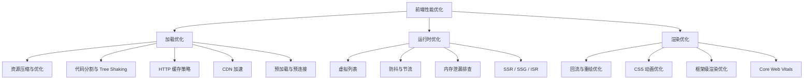

# 前端性能优化 - 综合场景串联

---

## 场景一：首屏性能优化全流程

### 场景描述
某 H5 页面首屏加载时间超过 5 秒，LCP 达到 6.2s，CLS 达到 0.35，用户反馈体验差。需要从分析诊断到优化实施到验证效果，完成首屏性能优化全流程。优化目标：LCP < 2.5s，CLS < 0.1，首屏加载时间 < 2s。



> 前端性能优化可归纳为三大方向：加载优化关注资源获取速度，运行时优化关注代码执行效率，渲染优化关注浏览器绘制性能。三者协同配合才能实现最佳用户体验。

### 涉及知识点
- [加载性能优化](./01-加载性能优化.md)：资源压缩与优化、Tree Shaking、代码分割、懒加载、HTTP 缓存策略、CDN 加速、预加载技术、Core Web Vitals
- [运行时优化](./02-运行时优化.md)：SSR/SSG/ISR、虚拟列表、防抖节流、回流重绘优化、框架级性能优化

### 协作流程
1. 运行 Lighthouse 审计，获取 FCP、LCP、TBT、CLS 等指标，确认瓶颈在加载阶段
2. 查看 Performance 面板的 Network 瀑布图，发现首屏加载了 2.8MB 的 JS bundle 和未压缩的 PNG 图片
3. 查看 Coverage 面板，发现 65% 的 JS/CSS 代码未被首屏使用
4. 运行 webpack-bundle-analyzer 或 rollup-plugin-visualizer，发现 node_modules 中 lodash 和 moment 占用了大量体积
5. 资源优化：图片转 WebP 格式（体积减少 60%），启用 Brotli 压缩（比 Gzip 再减少 20%），JS/CSS 使用 Terser/cssnano 压缩
6. 代码分割：路由级懒加载（动态 import），提取 react/react-dom 为独立 vendor chunk，lodash 替换为 lodash-es 并配合 Tree Shaking
7. 缓存策略：HTML 使用协商缓存（Cache-Control: no-cache），JS/CSS 使用文件名哈希 + 强缓存（Cache-Control: max-age=31536000, immutable），图片和字体使用强缓存
8. CDN 配置：静态资源（JS/CSS/图片/字体）上传 CDN，预热关键资源到边缘节点，配置 CORS 头部
9. 预加载策略：preload 首屏关键 CSS 和 LCP 图片，preconnect CDN 和 API 域名，prefetch 下一页资源
10. CLS 修复：为所有图片添加 width/height 属性，为动态广告位预留固定高度容器，设置 font-display: swap 避免字体加载偏移
11. 考虑 SSR：首屏内容使用 Next.js 的 getServerSideProps 实现服务端渲染，非首屏组件保持 CSR 懒加载
12. 验证效果：再次运行 Lighthouse，LCP 降至 1.8s，CLS 降至 0.05，首屏加载时间降至 1.6s
13. 建立性能监控：使用 web-vitals 库采集 LCP/INP/CLS 并通过 sendBeacon 上报，建立性能预算告警

### 关键要点
- 诊断先行：优化前必须通过 Lighthouse、Performance、Coverage、Bundle Analyzer 精准定位瓶颈，避免凭直觉优化
- 优化顺序：先做收益最大的优化（资源压缩、代码分割），再做细节优化（预加载、缓存策略），最后考虑架构变更（SSR）
- 缓存策略核心原则：HTML 入口文件使用协商缓存确保及时更新，JS/CSS 通过文件名哈希实现"永久缓存"，内容更新时哈希变化自动触发新请求
- CLS 常见根源：图片未设宽高占 60% 以上，动态注入内容未预留空间占 30%，字体加载偏移占 10%
- 性能监控闭环：优化后必须建立持续监控，每次发版后对比性能数据，防止性能劣化

---

## 场景二：后台管理系统大数据量列表性能优化

### 场景描述
后台管理系统的用户列表页有 10000 条数据，直接渲染导致页面卡顿、滚动不流畅，同时存在搜索输入频繁请求、页面切换后内存泄漏等问题。

### 涉及知识点
- [加载性能优化](./01-加载性能优化.md)：代码分割、懒加载
- [运行时优化](./02-运行时优化.md)：虚拟列表、防抖节流、内存泄漏排查、框架级性能优化

### 协作流程
1. 列表渲染优化：使用 react-window 的 FixedSizeList 替换全量渲染，只渲染可视区域约 20 个 DOM 节点，设置 overscanCount=5 避免快速滚动白屏
2. 后端分页配合：后端接口改为分页返回（每页 50 条），前端虚拟列表按需加载数据，减少一次性传输量和内存占用
3. 搜索输入防抖：搜索框 input 事件使用 debounce(fetchResults, 300)，用户停止输入 300ms 后才发送 API 请求
4. 滚动加载节流：滚动到底部自动加载更多使用 throttle(loadMore, 200)，每 200ms 最多触发一次判断
5. 列表项优化：使用 React.memo 包裹列表项组件，避免无关数据变化导致整列重渲染
6. 图片懒加载：用户头像使用 loading="lazy" 原生懒加载，配合 Intersection Observer 提前 50px 触发加载
7. 内存泄漏排查：Performance 面板录制页面操作，观察 JS Heap 蓝色线变化，手动 GC 后确认内存回落
8. 组件卸载清理：useEffect 中注册的定时器、事件监听、WebSocket 连接在 cleanup 函数中清理
9. 路由切换优化：使用 keep-alive（Vue）或状态提升（React）缓存列表页状态，避免返回时重新加载

### 关键要点
- 虚拟列表三要素：startIndex（起始索引）、endIndex（结束索引）、bufferSize（缓冲区大小），后者是避免白屏的关键
- 防抖与节流选择：搜索输入用防抖（关注最终结果），滚动加载用节流（关注持续反馈），按钮防重复用防抖的 leading 模式
- 内存泄漏排查流程：录制 Performance -> 观察 JS Heap 趋势 -> 手动 GC -> 堆快照对比 -> 搜索 Detached DOM 节点
- 框架级优化：React.memo 避免不必要重渲染、useMemo 缓存计算结果、useCallback 缓存函数引用，三者配合使用效果最佳

---

## 完整可运行示例：图片懒加载 + 虚拟滚动

```html
<!DOCTYPE html>
<html lang="zh-CN">
<head>
  <meta charset="UTF-8">
  <meta name="viewport" content="width=device-width, initial-scale=1.0">
  <title>图片懒加载 + 虚拟滚动优化</title>
  <style>
    * { margin: 0; padding: 0; box-sizing: border-box; }
    body {
      font-family: -apple-system, BlinkMacSystemFont, 'Segoe UI', sans-serif;
      background: #f5f5f5;
      color: #333;
    }

    .header {
      position: sticky;
      top: 0;
      z-index: 100;
      background: #fff;
      padding: 16px 24px;
      border-bottom: 1px solid #e0e0e0;
      display: flex;
      align-items: center;
      justify-content: space-between;
      box-shadow: 0 1px 4px rgba(0,0,0,0.06);
    }

    .header h1 { font-size: 20px; }

    .header .stats {
      font-size: 13px;
      color: #888;
    }

    .controls {
      display: flex;
      gap: 12px;
      align-items: center;
    }

    .controls button {
      padding: 6px 16px;
      border: 1px solid #d9d9d9;
      background: #fff;
      border-radius: 4px;
      cursor: pointer;
      font-size: 13px;
    }

    .controls button:hover {
      border-color: #667eea;
      color: #667eea;
    }

    /* 虚拟滚动容器 */
    .virtual-scroll-container {
      height: calc(100vh - 64px);
      overflow-y: auto;
      overflow-x: hidden;
      position: relative;
    }

    /* 占位容器（撑开滚动条） */
    .virtual-scroll-phantom {
      position: absolute;
      top: 0;
      left: 0;
      right: 0;
      z-index: 0;
    }

    /* 可视区域内容 */
    .virtual-scroll-content {
      position: absolute;
      top: 0;
      left: 0;
      right: 0;
      z-index: 1;
    }

    /* 列表项 */
    .list-item {
      padding: 12px 24px;
      border-bottom: 1px solid #f0f0f0;
      background: #fff;
      display: flex;
      align-items: center;
      gap: 16px;
      transition: background 0.15s;
    }

    .list-item:hover {
      background: #fafbff;
    }

    /* 图片占位容器 */
    .item-image-wrapper {
      position: relative;
      width: 60px;
      height: 60px;
      flex-shrink: 0;
      border-radius: 8px;
      overflow: hidden;
      background: #e8e8e8;
    }

    .item-image-wrapper img {
      width: 100%;
      height: 100%;
      object-fit: cover;
      opacity: 0;
      transition: opacity 0.4s ease;
    }

    .item-image-wrapper img.loaded {
      opacity: 1;
    }

    .item-image-wrapper .placeholder {
      position: absolute;
      top: 0;
      left: 0;
      width: 100%;
      height: 100%;
      background: linear-gradient(90deg, #e8e8e8 25%, #f0f0f0 50%, #e8e8e8 75%);
      background-size: 200% 100%;
      animation: shimmer 1.5s infinite;
    }

    .item-image-wrapper.loaded .placeholder {
      display: none;
    }

    @keyframes shimmer {
      0% { background-position: 200% 0; }
      100% { background-position: -200% 0; }
    }

    .item-info {
      flex: 1;
      min-width: 0;
    }

    .item-info .title {
      font-size: 14px;
      font-weight: 600;
      margin-bottom: 4px;
      overflow: hidden;
      text-overflow: ellipsis;
      white-space: nowrap;
    }

    .item-info .desc {
      font-size: 12px;
      color: #999;
      overflow: hidden;
      text-overflow: ellipsis;
      white-space: nowrap;
    }

    .item-index {
      font-size: 12px;
      color: #ccc;
      flex-shrink: 0;
      min-width: 30px;
      text-align: right;
    }

    /* 回到顶部 */
    .back-to-top {
      position: fixed;
      bottom: 24px;
      right: 24px;
      width: 40px;
      height: 40px;
      border-radius: 50%;
      background: #667eea;
      color: #fff;
      border: none;
      cursor: pointer;
      font-size: 18px;
      box-shadow: 0 2px 8px rgba(102, 126, 234, 0.4);
      display: none;
      z-index: 200;
      transition: transform 0.2s;
    }

    .back-to-top:hover {
      transform: scale(1.1);
    }

    .back-to-top.visible {
      display: flex;
      align-items: center;
      justify-content: center;
    }
  </style>
</head>
<body>

  <div class="header">
    <h1>虚拟滚动 + 图片懒加载</h1>
    <div class="controls">
      <span class="stats" id="stats">已渲染: 0 / 0</span>
      <button id="scrollTopBtn">滚动到 500</button>
      <button id="scrollBottomBtn">滚动到底部</button>
    </div>
  </div>

  <!-- 虚拟滚动容器 -->
  <div class="virtual-scroll-container" id="scrollContainer">
    <div class="virtual-scroll-phantom" id="phantom"></div>
    <div class="virtual-scroll-content" id="content"></div>
  </div>

  <button class="back-to-top" id="backToTop">&#9650;</button>

  <script>
    /**
     * 虚拟滚动管理器
     * 仅渲染可视区域内的列表项，大幅减少 DOM 节点数量
     */
    class VirtualScroll {
      /**
       * @param {Object} options
       * @param {HTMLElement} options.container - 滚动容器
       * @param {HTMLElement} options.phantom - 占位撑高元素
       * @param {HTMLElement} options.content - 内容渲染区域
       * @param {number} options.itemHeight - 单个列表项高度（px）
       * @param {number} options.overscan - 缓冲区数量（上下各多渲染几项）
       * @param {Function} options.renderItem - 渲染函数 (item, index) => HTMLElement
       */
      constructor(options) {
        this.container = options.container;
        this.phantom = options.phantom;
        this.content = options.content;
        this.itemHeight = options.itemHeight || 80;
        this.overscan = options.overscan || 5;
        this.renderItem = options.renderItem;
        this.onRender = options.onRender || null;

        this.items = [];
        this.startIndex = 0;
        this.endIndex = 0;
        this.renderedElements = new Map();
        this.observer = null;
        this.ticking = false;

        this.init();
      }

      /**
       * 初始化
       */
      init() {
        this.bindEvents();
        this.initImageObserver();
      }

      /**
       * 设置数据源
       */
      setItems(items) {
        this.items = items;
        this.updatePhantomHeight();
        this.render();
      }

      /**
       * 更新占位高度
       */
      updatePhantomHeight() {
        this.phantom.style.height = `${this.items.length * this.itemHeight}px`;
      }

      /**
       * 绑定滚动事件
       */
      bindEvents() {
        this.container.addEventListener('scroll', () => {
          if (!this.ticking) {
            requestAnimationFrame(() => {
              this.render();
              this.ticking = false;
            });
            this.ticking = true;
          }
        });

        // 窗口大小变化时重新计算
        window.addEventListener('resize', () => {
          this.render();
        });
      }

      /**
       * 初始化图片懒加载观察器
       */
      initImageObserver() {
        // 使用 IntersectionObserver 实现图片懒加载
        if ('IntersectionObserver' in window) {
          this.observer = new IntersectionObserver(
            (entries) => {
              entries.forEach((entry) => {
                if (entry.isIntersecting) {
                  const img = entry.target;
                  const dataSrc = img.getAttribute('data-src');
                  if (dataSrc) {
                    img.src = dataSrc;
                    img.onload = () => {
                      img.classList.add('loaded');
                      const wrapper = img.closest('.item-image-wrapper');
                      if (wrapper) wrapper.classList.add('loaded');
                    };
                    img.onerror = () => {
                      img.classList.add('loaded');
                    };
                  }
                  this.observer.unobserve(img);
                }
              });
            },
            {
              root: this.container,
              rootMargin: '100px',
              threshold: 0,
            }
          );
        }
      }

      /**
       * 观察新的懒加载图片
       */
      observeImages() {
        if (!this.observer) return;
        const images = this.content.querySelectorAll('img[data-src]');
        images.forEach((img) => this.observer.observe(img));
      }

      /**
       * 计算可视区域范围
       */
      getVisibleRange() {
        const scrollTop = this.container.scrollTop;
        const containerHeight = this.container.clientHeight;

        const start = Math.max(
          0,
          Math.floor(scrollTop / this.itemHeight) - this.overscan
        );
        const end = Math.min(
          this.items.length,
          Math.ceil((scrollTop + containerHeight) / this.itemHeight) + this.overscan
        );

        return { start, end };
      }

      /**
       * 渲染可视区域
       */
      render() {
        const { start, end } = this.getVisibleRange();

        // 如果范围没变，跳过渲染
        if (start === this.startIndex && end === this.endIndex) return;

        this.startIndex = start;
        this.endIndex = end;

        // 使用 DocumentFragment 批量更新 DOM
        const fragment = document.createDocumentFragment();
        const newKeys = new Set();

        for (let i = start; i < end; i++) {
          const item = this.items[i];
          newKeys.add(i);

          // 检查是否已有缓存的 DOM 元素
          let element = this.renderedElements.get(i);
          if (!element) {
            element = this.renderItem(item, i);
            element.style.position = 'absolute';
            element.style.top = `${i * this.itemHeight}px`;
            element.style.left = '0';
            element.style.right = '0';
            element.style.height = `${this.itemHeight}px`;
            this.renderedElements.set(i, element);
          }
          fragment.appendChild(element);
        }

        // 清空内容区域并添加新 fragment
        this.content.innerHTML = '';
        this.content.appendChild(fragment);

        // 观察新渲染的图片
        this.observeImages();

        // 移除不在可视范围内的缓存 DOM
        this.renderedElements.forEach((_, key) => {
          if (!newKeys.has(key)) {
            this.renderedElements.delete(key);
          }
        });

        // 回调
        if (this.onRender) {
          this.onRender(start, end, this.items.length);
        }
      }

      /**
       * 滚动到指定索引
       */
      scrollToIndex(index) {
        const top = Math.max(0, index * this.itemHeight);
        this.container.scrollTo({ top, behavior: 'smooth' });
      }

      /**
       * 销毁
       */
      destroy() {
        if (this.observer) {
          this.observer.disconnect();
        }
        this.renderedElements.clear();
        this.content.innerHTML = '';
      }
    }

    // ==================== 使用示例 ====================

    // 生成模拟数据（10000 条）
    const TOTAL_ITEMS = 10000;
    const items = Array.from({ length: TOTAL_ITEMS }, (_, i) => ({
      id: i + 1,
      title: `列表项 ${i + 1}`,
      desc: `这是第 ${i + 1} 条数据的描述信息，用于展示虚拟滚动效果`,
      image: `https://picsum.photos/seed/${i + 1}/120/120`,
    }));

    // 渲染单个列表项
    const renderItem = (item, index) => {
      const div = document.createElement('div');
      div.className = 'list-item';
      div.innerHTML = `
        <div class="item-image-wrapper">
          <div class="placeholder"></div>
          
        </div>
        <div class="item-info">
          <div class="title">${item.title}</div>
          <div class="desc">${item.desc}</div>
        </div>
        <div class="item-index">#${item.id}</div>
      `;
      return div;
    };

    // 初始化虚拟滚动
    const virtualScroll = new VirtualScroll({
      container: document.getElementById('scrollContainer'),
      phantom: document.getElementById('phantom'),
      content: document.getElementById('content'),
      itemHeight: 84,
      overscan: 8,
      renderItem,
      onRender: (start, end, total) => {
        document.getElementById('stats').textContent =
          `已渲染: ${end - start} / ${total}`;
      },
    });

    // 设置数据
    virtualScroll.setItems(items);

    // 控制按钮
    document.getElementById('scrollTopBtn').addEventListener('click', () => {
      virtualScroll.scrollToIndex(500);
    });

    document.getElementById('scrollBottomBtn').addEventListener('click', () => {
      virtualScroll.scrollToIndex(TOTAL_ITEMS - 1);
    });

    // 回到顶部按钮
    const backToTopBtn = document.getElementById('backToTop');
    const scrollContainer = document.getElementById('scrollContainer');

    scrollContainer.addEventListener('scroll', () => {
      if (scrollContainer.scrollTop > 500) {
        backToTopBtn.classList.add('visible');
      } else {
        backToTopBtn.classList.remove('visible');
      }
    });

    backToTopBtn.addEventListener('click', () => {
      scrollContainer.scrollTo({ top: 0, behavior: 'smooth' });
    });
  </script>
</body>
</html>
```

---

> [返回模块目录](../README.md) | [返回知识导览](../知识导览.md)