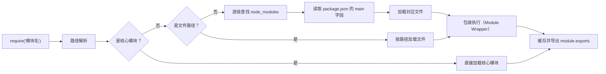

# Node.js 笔面试题集

> 模块：09-nodejs（第9周 Node.js）
> 覆盖：Event Loop、模块机制、Express/Koa、中间件、BFF
> 题量：10 道选择题 + 8 道简答题 + 3 道编程题
> 难度标注：★基础  ★★中档  ★★★拔高

---

## 一、选择题（10 题，每题附解析）

---

### 1. ★ Node.js 的 JavaScript 引擎是什么？

A. SpiderMonkey
B. JavaScriptCore
C. V8
D. Chakra

**答案：C**

**解析**：Node.js 基于 Google Chrome 的 V8 引擎构建。V8 引擎用 C++ 编写，负责将 JavaScript 代码编译为机器码执行。SpiderMonkey 是 Firefox 的引擎，JavaScriptCore（Nitro）是 Safari 的引擎，Chakra 是旧版 Edge 的引擎。

---

### 2. ★ Node.js 中处理异步 I/O 的底层库是？

A. async
B. libuv
C. libevent
D. libev

**答案：B**

**解析**：libuv 是 Node.js 的核心异步 I/O 库，用 C 语言编写，提供跨平台的事件驱动和异步 I/O 能力。它在 Linux 上使用 epoll，macOS 上使用 kqueue，Windows 上使用 IOCP，同时维护一个线程池处理文件 I/O 和 DNS 查询。libev 是 libuv 的前身之一，但已不再直接使用。

---

### 3. ★ 以下哪个不是 Node.js 的全局对象？

A. `global`
B. `process`
C. `window`
D. `Buffer`

**答案：C**

**解析**：`window` 是浏览器环境中的全局对象，Node.js 中不存在。Node.js 的全局对象是 `global`。`process` 是 Node.js 的进程对象，`Buffer` 是处理二进制数据的类，它们都是 Node.js 的全局对象，无需 `require` 即可使用。其他 Node.js 全局对象还包括 `console`、`setTimeout`、`setImmediate` 等。注意 `__dirname` 和 `__filename` 是 CommonJS 模块级变量，非全局对象，ESM 中不可用。

---

### 4. ★★ 关于 `process.nextTick` 和 `setImmediate` 的说法，正确的是？

A. 两者都在事件循环的同一阶段执行
B. `process.nextTick` 在 check 阶段执行，`setImmediate` 在 timers 阶段执行
C. `process.nextTick` 在当前阶段结束后立即执行，`setImmediate` 在 check 阶段执行
D. `setImmediate` 比 `process.nextTick` 优先级更高

**答案：C**

**解析**：`process.nextTick` 属于微任务，在当前事件循环阶段执行完毕后、下一个阶段开始前立即执行，优先级最高。`setImmediate` 在事件循环的 check 阶段执行（poll 阶段之后）。`process.nextTick` 的优先级高于 `setImmediate`。在 I/O 回调中，`setImmediate` 总是先于 `setTimeout(fn, 0)` 执行。

---



> CommonJS 模块加载流程从路径解析开始，依次判断核心模块、文件路径和 node_modules 查找，最终通过模块包装函数执行代码，并将导出结果缓存到 require.cache 中。

### 5. ★★ `require` 的模块查找顺序是？

A. node_modules → 核心模块 → 文件模块
B. 核心模块 → 文件模块 → node_modules（逐级向上）
C. 文件模块 → 核心模块 → node_modules
D. 全局模块 → 核心模块 → node_modules

**答案：B**

**解析**：`require` 的查找顺序为：先检查核心模块（如 http、fs），再检查文件模块（相对路径或绝对路径），接着检查目录模块（package.json 的 main 字段或 index.js），最后从当前目录的 node_modules 开始逐级向上查找，直到根目录。如果仍未找到，则抛出 `MODULE_NOT_FOUND` 错误。

---

### 6. ★★ Koa 中间件的执行模型是什么？

A. 线性管道模型
B. 洋葱模型（Onion Model）
C. 发布订阅模型
D. 观察者模型

**答案：B**

**解析**：Koa 中间件采用洋葱模型，基于 `async/await` 实现。请求从外层中间件进入，逐层深入核心业务逻辑，然后再逐层返回。每个中间件在 `await next()` 之前执行"进入"逻辑，之后执行"穿出"逻辑。这种模型非常适合日志记录、响应包装、错误处理等需要在请求前后都执行逻辑的场景。

---

### 7. ★★ 以下关于 Stream 的说法，正确的是？

A. Stream 只能处理文本数据，不能处理二进制数据
B. Stream 会一次性将数据加载到内存中
C. Stream 可以分块处理数据，避免大文件导致内存溢出
D. 所有 Stream 都是可读可写的

**答案：C**

**解析**：Stream 的核心优势是分块处理数据，避免一次性将大量数据加载到内存中，因此特别适合处理大文件。Stream 可以处理任意类型的数据（文本、二进制）。Stream 分为四种类型：Readable（可读）、Writable（可写）、Duplex（双工）、Transform（转换流），并非所有 Stream 都是可读可写的。

---

### 8. ★★ 以下关于 Buffer 的说法，正确的是？

A. Buffer 是 JavaScript 原生数据类型
B. Buffer 用于处理二进制数据，是 Uint8Array 的子类
C. Buffer 只能通过 `Buffer.from()` 创建
D. Buffer 的大小可以动态扩展

**答案：B**

**解析**：Buffer 是 Node.js 中用于处理二进制数据的类，它是 `Uint8Array` 的子类。JavaScript 原生不擅长处理二进制数据，Buffer 弥补了这一不足。Buffer 可以通过 `Buffer.alloc()`、`Buffer.allocUnsafe()`、`Buffer.from()` 等多种方式创建。Buffer 一旦创建，大小固定不可变。

---

### 9. ★★ Cluster 模块的作用是什么？

A. 管理数据库连接池
B. 创建多进程，充分利用多核 CPU
C. 实现分布式缓存
D. 管理 HTTP 请求队列

**答案：B**

**解析**：Node.js 的 Cluster 模块用于创建多个工作进程（Worker），这些进程共享同一个服务器端口，从而充分利用多核 CPU 的计算能力。主进程（Master）负责 fork 工作进程和管理进程生命周期，工作进程通过 IPC 通信。PM2 的 cluster 模式底层就是基于此模块实现的。

> 📖 **参考链接**：
> - [Node.js 官方文档 - Cluster](https://nodejs.org/api/cluster.html)
> - [Node.js 官方文档 - Process](https://nodejs.org/api/process.html)

---

### 10. ★★★ 以下关于 Node.js 事件循环的说法，正确的是？

A. poll 阶段永远不会阻塞，总是立即执行完回调
B. poll 阶段在有 `setImmediate` 回调时会进入 check 阶段，否则可能阻塞等待新的 I/O 事件
C. `process.nextTick` 在 check 阶段执行
D. close callbacks 阶段在 poll 阶段之前

**答案：B**

**解析**：poll 阶段是事件循环的核心阶段。当 poll 队列为空时，如果有 `setImmediate` 回调，则结束 poll 阶段进入 check 阶段；如果没有 `setImmediate`，则阻塞等待新的 I/O 事件（计算合适的超时时间）。`process.nextTick` 是微任务，在每个阶段之间执行，不属于任何特定阶段。close callbacks 是事件循环的最后一个阶段，在 check 之后。

> 📖 **参考链接**：
> - [Node.js 官方文档 - 事件循环、定时器与 process.nextTick](https://nodejs.org/en/docs/guides/event-loop-timers-and-nexttick)
> - [Node.js 官方文档 - Timers](https://nodejs.org/api/timers.html)

---

## 二、简答题（8 题）

---

### 1. ★★ 请详细描述 Node.js 事件循环的 6 个阶段及其职责。

**参考答案**：

Node.js 事件循环分为 6 个阶段，每个阶段维护一个 FIFO 回调队列：

1. **timers（定时器阶段）**：执行 `setTimeout()` 和 `setInterval()` 中到期的回调。注意到达时间是最小延迟，实际执行可能延后。

2. **pending callbacks（待处理回调阶段）**：执行延迟到下一轮循环的 I/O 回调（如某些 TCP 错误类型的回调）。

3. **idle / prepare（空闲/准备阶段）**：仅内部使用，开发者不直接接触。

4. **poll（轮询阶段）**：核心阶段。获取新的 I/O 事件并执行相关回调。当 poll 队列为空时，如果有 `setImmediate` 回调则进入 check 阶段，否则阻塞等待新的 I/O 事件。

5. **check（检查阶段）**：执行 `setImmediate()` 的回调。在 poll 阶段完成后立即执行。

6. **close callbacks（关闭回调阶段）**：执行关闭事件的回调，如 `socket.on('close', ...)`。

此外，`process.nextTick` 和 `Promise` 微任务在每个阶段之间执行，`nextTick` 优先级高于 `Promise`。

> 📖 **参考链接**：
> - [Node.js 官方文档 - 事件循环、定时器与 process.nextTick](https://nodejs.org/en/docs/guides/event-loop-timers-and-nexttick)
> - [Node.js 官方文档 - Process](https://nodejs.org/api/process.html)

---

### 2. ★★ Node.js 事件循环和浏览器事件循环有什么区别？

**参考答案**：

| 维度 | Node.js | 浏览器 |
|------|---------|--------|
| 宏任务阶段 | 6 个阶段（timers/poll/check 等），每个阶段有独立队列 | 只有一个宏任务队列，每次取一个执行 |
| 微任务队列 | `process.nextTick` 队列 + `Promise` 队列，nextTick 优先级更高 | 仅有 `Promise` 微任务队列（含 MutationObserver） |
| setImmediate | 有，在 check 阶段执行 | 无此 API |
| 执行模型 | Node 11 之前：每个阶段后清空微任务；Node 11+：与浏览器统一（每个宏任务后清空微任务） | 每个宏任务执行完后清空所有微任务 |
| I/O 处理 | libuv 线程池 + 系统异步 API | 浏览器 Web API |
| 特有 API | `process.nextTick`、`setImmediate` | `requestAnimationFrame`、`MutationObserver` |

---

### 3. ★★ CommonJS 和 ES Module 的区别是什么？

**参考答案**：

| 维度 | CommonJS | ES Module |
|------|----------|-----------|
| 语法 | `require()` / `module.exports` | `import` / `export` |
| 加载方式 | 同步加载（运行时） | 异步加载（编译时静态分析） |
| 导出方式 | 值拷贝（模块内部变化不影响外部） | 值引用 / live binding（模块内部变化会反映到外部） |
| Tree Shaking | 不支持 | 支持 |
| 顶层 await | 不支持 | 支持 |
| this 指向 | 指向当前模块 | `undefined` |
| 文件扩展名 | `.js` / `.cjs` | `.mjs` 或 `package.json` 中设置 `"type": "module"` |
| 动态导入 | `require()` 本身就是动态的 | `import()` 函数返回 Promise |

> 📖 **参考链接**：
> - [Node.js 官方文档 - Modules: CommonJS](https://nodejs.org/api/modules.html)
> - [Node.js 官方文档 - Modules: ES Modules](https://nodejs.org/api/esm.html)

---

### 4. ★★ Express 和 Koa 的区别是什么？

**参考答案**：

Express 是功能完备的 Web 框架，内置路由、静态文件、模板引擎等，中间件基于回调函数串联，使用独立的 `req`/`res` 对象，错误处理需要专门的 4 参数中间件。Koa 是极简内核（约 2000 行代码），不绑定任何中间件，中间件基于 `async/await` 的洋葱模型，使用统一的 `ctx` 上下文对象，错误处理通过 `try/catch` 统一捕获。Express 适合快速开发，Koa 适合需要精细控制的现代项目。

---

### 5. ★★ Koa 洋葱模型是什么？请描述其执行流程。

**参考答案**：

洋葱模型是 Koa 中间件的核心执行模型。请求像"剥洋葱"一样逐层进入中间件，到达核心业务逻辑后，再逐层返回。具体流程：请求进入 → 中间件1 前半 → 中间件2 前半 → 核心业务逻辑 → 中间件2 后半 → 中间件1 后半 → 响应返回。

实现原理是 `koa-compose` 函数，它将多个中间件组合成一个，通过 `dispatch(i)` 递归调用下一个中间件，`await next()` 暂停当前中间件并等待下游中间件全部执行完毕。这种模型非常适合日志记录、响应包装、错误处理等场景。

> 📖 **参考链接**：
> - [Koa 官方网站](https://koajs.com/)
> - [Express 官方文档 - 使用中间件](https://expressjs.com/en/guide/using-middleware.html)

---

### 6. ★★ 什么是 BFF 设计模式？它解决了什么问题？

**参考答案**：

BFF（Backend For Frontend）是为前端定制的后端服务层，位于前端应用和后端微服务之间。它通常由前端团队使用 Node.js 自主开发和维护。

BFF 解决的核心问题：
1. **数据聚合**：将多个微服务接口的数据合并为前端需要的数据结构，减少前端请求次数
2. **数据裁剪**：去除前端不需要的字段，减少数据传输量，提升移动端性能
3. **接口适配**：为不同客户端（Web、iOS、Android）提供定制化的 API
4. **版本隔离**：BFF 层隔离后端 API 变化，后端升级不影响前端
5. **协议转换**：将 gRPC、SOAP 等协议统一转换为 RESTful API

---

### 7. ★★ How to handle uncaught exceptions in Node.js?

**参考答案**：

There are several approaches to handle uncaught exceptions in Node.js:

1. **`try/catch`**：Wrap synchronous code or async/await code in try/catch blocks.

2. **`process.on('uncaughtException')`**：Catch synchronous exceptions that bubble up to the event loop. Use this as a last resort for logging and graceful shutdown -- the process is in an unclean state and should be restarted.

```javascript
process.on('uncaughtException', (err) => {
  console.error('Uncaught Exception:', err);
  // Perform cleanup, then exit
  process.exit(1);
});
```

3. **`process.on('unhandledRejection')`**：Catch Promise rejections that are not handled by `.catch()` or `try/catch`.

```javascript
process.on('unhandledRejection', (reason, promise) => {
  console.error('Unhandled Rejection:', reason);
});
```

4. **Domain module（已废弃）**：Deprecated since Node.js 4.0, not recommended.

5. **Use PM2 or similar process managers**：Automatically restart the process when it crashes.

Best practice is to handle errors at the appropriate level (middleware, try/catch) rather than relying solely on global handlers.

> 📖 **参考链接**：
> - [Node.js 官方文档 - Process: uncaughtException](https://nodejs.org/api/process.html#event-uncaughtexception)
> - [Node.js 官方文档 - Process: unhandledRejection](https://nodejs.org/api/process.html#event-unhandledrejection)

---

### 8. ★★ 如何实现 JWT 认证的 Token 刷新机制？

**参考答案**：

使用双 Token 模式：Access Token（短期有效，如 15 分钟）+ Refresh Token（长期有效，如 7 天）。

**实现逻辑**：
1. 用户登录成功后，服务端生成 Access Token 和 Refresh Token 并返回
2. 客户端将 Access Token 放在请求头中访问受保护接口
3. 当 Access Token 过期（返回 401），客户端使用 Refresh Token 调用 `/refresh` 接口
4. 服务端验证 Refresh Token 的有效性，生成新的 Access Token 并返回
5. 如果 Refresh Token 也过期，则要求用户重新登录

**关键代码**：
```javascript
// 生成 Token
const accessToken = jwt.sign({ userId: user.id }, SECRET, { expiresIn: '15m' });
const refreshToken = jwt.sign({ userId: user.id, type: 'refresh' }, SECRET, { expiresIn: '7d' });

// 刷新端点
app.post('/refresh', (req, res) => {
  const { refreshToken } = req.body;
  try {
    const decoded = jwt.verify(refreshToken, SECRET);
    if (decoded.type !== 'refresh') {
      return res.status(401).json({ error: '无效的 Refresh Token' });
    }
    const newAccessToken = jwt.sign({ userId: decoded.userId }, SECRET, { expiresIn: '15m' });
    res.json({ accessToken: newAccessToken });
  } catch (err) {
    res.status(401).json({ error: 'Refresh Token 已过期，请重新登录' });
  }
});
```

---

## 三、编程题（3 题）

---

### 1. ★★ 实现一个 Koa 中间件，记录请求日志（方法、URL、耗时）

**要求**：
- 记录每个请求的 HTTP 方法、URL、状态码和响应耗时
- 日志格式：`[2024-01-01T12:00:00.000Z] GET /api/users 200 15ms`

**参考实现**：

```javascript
const Koa = require('koa');

const app = new Koa();

// 请求日志中间件
function logger() {
  return async (ctx, next) => {
    const start = Date.now();

    // 等待下游中间件和业务逻辑执行完毕
    await next();

    // 计算耗时
    const duration = Date.now() - start;
    const timestamp = new Date().toISOString();

    // 输出格式化日志
    console.log(
      `[${timestamp}] ${ctx.method} ${ctx.url} ${ctx.status} ${duration}ms`
    );
  };
}

app.use(logger());

// 业务路由
app.use(async (ctx) => {
  // 模拟数据库查询延迟
  await new Promise((resolve) => setTimeout(resolve, 50));
  ctx.body = { message: 'Hello Koa' };
});

app.listen(3000, () => console.log('Server running on port 3000'));
```

**输出示例**：
```
[2024-01-01T12:00:00.150Z] GET /api/users 200 52ms
[2024-01-01T12:00:01.200Z] POST /api/login 200 35ms
[2024-01-01T12:00:02.100Z] GET /api/orders 200 128ms
```

---

### 2. ★★ 实现一个简单的文件上传接口（Express + multer）

**要求**：
- 支持单文件上传
- 限制文件类型为图片（jpg、png、gif）
- 限制文件大小为 5MB
- 返回上传后的文件信息

**参考实现**：

```javascript
const express = require('express');
const multer = require('multer');
const path = require('path');

const app = express();

// 配置 multer 存储策略
const storage = multer.diskStorage({
  // 指定上传目录
  destination: (req, file, cb) => {
    cb(null, path.join(__dirname, 'uploads'));
  },
  // 自定义文件名：时间戳 + 原始扩展名
  filename: (req, file, cb) => {
    const uniqueSuffix = Date.now() + '-' + Math.round(Math.random() * 1e9);
    const ext = path.extname(file.originalname);
    cb(null, `${uniqueSuffix}${ext}`);
  },
});

// 文件过滤器：只允许图片
const fileFilter = (req, file, cb) => {
  const allowedTypes = ['image/jpeg', 'image/png', 'image/gif'];
  if (allowedTypes.includes(file.mimetype)) {
    cb(null, true);
  } else {
    cb(new Error('只允许上传 jpg、png、gif 格式的图片'), false);
  }
};

// 创建 multer 实例
const upload = multer({
  storage,
  fileFilter,
  limits: {
    fileSize: 5 * 1024 * 1024, // 5MB
  },
});

// 单文件上传接口
app.post('/upload', upload.single('file'), (req, res) => {
  if (!req.file) {
    return res.status(400).json({ error: '请选择要上传的文件' });
  }

  res.json({
    message: '上传成功',
    file: {
      filename: req.file.filename,
      originalname: req.file.originalname,
      size: req.file.size,
      mimetype: req.file.mimetype,
      path: `/uploads/${req.file.filename}`,
    },
  });
});

// 错误处理中间件（处理 multer 错误）
app.use((err, req, res, next) => {
  if (err instanceof multer.MulterError) {
    if (err.code === 'LIMIT_FILE_SIZE') {
      return res.status(400).json({ error: '文件大小不能超过 5MB' });
    }
    return res.status(400).json({ error: err.message });
  }
  if (err) {
    return res.status(400).json({ error: err.message });
  }
  next();
});

app.listen(3000, () => console.log('Server running on port 3000'));
```

---

### 3. ★★★ 实现一个 BFF 层接口，聚合两个后端 API 的数据

**要求**：
- 实现一个 `/api/dashboard` 接口
- 并行请求用户服务（获取用户信息）和订单服务（获取订单列表）
- 聚合两个服务的数据，裁剪掉敏感字段
- 添加汇总信息（订单总数、总消费金额）
- 处理任一服务请求失败的情况（降级处理）

**参考实现**：

```javascript
const Koa = require('koa');
const Router = require('koa-router');
const axios = require('axios');

const app = new Koa();
const router = new Router();

// 模拟微服务地址
const USER_SERVICE_URL = 'http://localhost:3001';
const ORDER_SERVICE_URL = 'http://localhost:3002';

// 带超时和重试的请求封装
async function fetchWithTimeout(url, options = {}) {
  const { timeout = 3000, retries = 1 } = options;

  for (let attempt = 0; attempt <= retries; attempt++) {
    try {
      const response = await axios.get(url, { timeout });
      return { success: true, data: response.data };
    } catch (err) {
      if (attempt === retries) {
        return { success: false, error: err.message };
      }
      // 重试前等待
      await new Promise((r) => setTimeout(r, 200 * (attempt + 1)));
    }
  }
}

// BFF 层：聚合用户信息和订单列表
router.get('/api/dashboard', async (ctx) => {
  const userId = ctx.query.userId || '1';

  // 并行请求两个微服务
  const [userResult, orderResult] = await Promise.all([
    fetchWithTimeout(`${USER_SERVICE_URL}/users/${userId}`),
    fetchWithTimeout(`${ORDER_SERVICE_URL}/orders?userId=${userId}`),
  ]);

  // 构建响应：用户信息（裁剪敏感字段）
  const response = {
    user: null,
    orders: [],
    summary: { totalOrders: 0, totalSpent: 0 },
    errors: [],
  };

  if (userResult.success) {
    const { id, name, email, phone, address, ...safeFields } = userResult.data;
    response.user = {
      id,
      name,
      // 只返回前端需要的字段，不返回 email、phone 等敏感信息
      level: userResult.data.level || 'normal',
      avatar: userResult.data.avatar || '/default-avatar.png',
    };
  } else {
    response.errors.push(`用户服务不可用: ${userResult.error}`);
  }

  if (orderResult.success) {
    // 裁剪订单数据，只返回前端需要的字段
    response.orders = orderResult.data.items.map((order) => ({
      id: order.id,
      total: order.total,
      status: order.status,
      createdAt: order.createdAt,
    }));

    // 汇总信息
    response.summary = {
      totalOrders: orderResult.data.total || response.orders.length,
      totalSpent: response.orders.reduce((sum, o) => sum + o.total, 0),
    };
  } else {
    response.errors.push(`订单服务不可用: ${orderResult.error}`);
  }

  ctx.body = response;
});

// 错误处理中间件
app.use(async (ctx, next) => {
  try {
    await next();
  } catch (err) {
    ctx.status = 500;
    ctx.body = {
      code: 500,
      message: '服务器内部错误',
      error: process.env.NODE_ENV === 'development' ? err.message : undefined,
    };
  }
});

app.use(router.routes());
app.use(router.allowedMethods());

app.listen(3000, () => console.log('BFF Server running on port 3000'));
```

**设计要点**：

1. **并行请求**：使用 `Promise.all` 并行请求用户服务和订单服务，避免串行等待
2. **数据裁剪**：只返回前端需要的字段，去除敏感信息（email、phone 等）
3. **数据聚合**：在 BFF 层计算汇总信息（订单总数、总消费金额），减轻前端计算负担
4. **降级处理**：当某个服务不可用时，不阻塞整体响应，返回部分数据 + 错误信息
5. **超时和重试**：封装带超时和重试的请求函数，提高接口可靠性

---

## 补充编程题：完整代码实现

### 补充1：手写 Express 中间件

```javascript
/**
 * 手写 Express 风格中间件系统
 * 实现中间件注册、路由匹配、洋葱模型执行
 */

const http = require('http');

class MiniExpress {
  constructor() {
    this.middlewares = [];  // 中间件栈
    this.routes = {
      GET: {},
      POST: {},
      PUT: {},
      DELETE: {},
      PATCH: {},
    };
  }

  // 注册中间件
  use(path, handler) {
    if (typeof path === 'function') {
      handler = path;
      path = '/';
    }
    this.middlewares.push({ path, handler });
  }

  // 注册路由
  get(path, handler) {
    this.routes.GET[path] = handler;
  }

  post(path, handler) {
    this.routes.POST[path] = handler;
  }

  put(path, handler) {
    this.routes.PUT[path] = handler;
  }

  delete(path, handler) {
    this.routes.DELETE[path] = handler;
  }

  // 执行中间件链（洋葱模型）
  async executeMiddlewares(req, res, middlewares) {
    let index = 0;

    const next = async () => {
      if (index >= middlewares.length) return;

      const middleware = middlewares[index];
      index++;

      // 路径匹配：中间件路径是请求路径的前缀
      if (middleware.path === '/' || req.url.startsWith(middleware.path)) {
        req.path = req.url.replace(middleware.path, '') || '/';
        await middleware.handler(req, res, next);
      } else {
        await next();
      }
    };

    await next();
  }

  // 处理请求
  async handleRequest(req, res) {
    // 扩展 req 和 res 对象
    this.enhanceRequest(req);
    this.enhanceResponse(res);

    try {
      // 1. 执行中间件链
      await this.executeMiddlewares(req, res, this.middlewares);

      // 2. 匹配路由
      if (!res.finished) {
        const methodRoutes = this.routes[req.method];
        const routeHandler = methodRoutes && methodRoutes[req.url];

        if (routeHandler) {
          await routeHandler(req, res);
        } else {
          // 404
          res.status(404).json({ error: 'Not Found' });
        }
      }
    } catch (err) {
      // 全局错误处理
      if (!res.finished) {
        res.status(500).json({
          error: 'Internal Server Error',
          message: err.message,
        });
      }
    }
  }

  // 增强 req 对象
  enhanceRequest(req) {
    req.query = {};
    const url = new URL(req.url, `http://${req.headers.host}`);
    req.url = url.pathname;
    url.searchParams.forEach((value, key) => {
      req.query[key] = value;
    });
    req.path = req.url;
  }

  // 增强 res 对象
  enhanceResponse(res) {
    res.status = function (code) {
      res.statusCode = code;
      return res;
    };

    res.json = function (data) {
      if (res.finished) return;
      res.setHeader('Content-Type', 'application/json');
      res.end(JSON.stringify(data));
      res.finished = true;
    };

    res.send = function (data) {
      if (res.finished) return;
      if (typeof data === 'object') {
        return res.json(data);
      }
      res.setHeader('Content-Type', 'text/plain');
      res.end(String(data));
      res.finished = true;
    };

    res.finished = false;
  }

  // 启动服务器
  listen(port, callback) {
    const server = http.createServer((req, res) => {
      this.handleRequest(req, res);
    });

    server.listen(port, callback);
    return server;
  }
}

// ========== 使用示例 ==========
const app = new MiniExpress();

// 1. 日志中间件
app.use(async (req, res, next) => {
  const start = Date.now();
  console.log(`--> ${req.method} ${req.url}`);
  await next();
  const duration = Date.now() - start;
  console.log(`<-- ${req.method} ${req.url} ${res.statusCode} ${duration}ms`);
});

// 2. JSON 解析中间件
app.use(async (req, res, next) => {
  if (req.headers['content-type']?.includes('application/json')) {
    const chunks = [];
    for await (const chunk of req) {
      chunks.push(chunk);
    }
    try {
      req.body = JSON.parse(Buffer.concat(chunks).toString());
    } catch (err) {
      req.body = {};
    }
  }
  await next();
});

// 3. 认证中间件
app.use('/api', async (req, res, next) => {
  const token = req.headers['authorization'];
  if (!token) {
    return res.status(401).json({ error: '未授权' });
  }
  // 验证 token...
  req.user = { id: 1, name: 'Alice' };
  await next();
});

// 4. 错误处理中间件
app.use(async (req, res, next) => {
  try {
    await next();
  } catch (err) {
    console.error('捕获到错误:', err);
    res.status(500).json({ error: '服务器内部错误' });
  }
});

// 业务路由
app.get('/', (req, res) => {
  res.json({ message: 'Hello MiniExpress' });
});

app.get('/api/users', (req, res) => {
  res.json({
    users: [{ id: 1, name: 'Alice' }, { id: 2, name: 'Bob' }],
  });
});

app.post('/api/users', (req, res) => {
  console.log('创建用户:', req.body);
  res.status(201).json({ id: 3, ...req.body });
});

// app.listen(3000, () => console.log('Server running on http://localhost:3000'));
```

### 补充2：手写事件监听器（EventEmitter）

```javascript
/**
 * 手写 Node.js EventEmitter
 * 实现事件注册、触发、移除、一次性事件等核心功能
 */

class EventEmitter {
  constructor() {
    // 存储事件及其回调映射
    this._events = Object.create(null);
    // 最大监听器数量（默认 10）
    this._maxListeners = 10;
  }

  /**
   * 订阅事件
   * @param {string} eventName - 事件名
   * @param {Function} listener - 回调函数
   * @returns {EventEmitter} 返回 this 支持链式调用
   */
  on(eventName, listener) {
    if (!this._events[eventName]) {
      this._events[eventName] = [];
    }

    this._events[eventName].push(listener);

    // 检查监听器数量是否超过限制
    if (
      this._maxListeners > 0 &&
      this._events[eventName].length > this._maxListeners
    ) {
      console.warn(
        `MaxListenersExceededWarning: 事件 "${eventName}" 的监听器数量超过 ${this._maxListeners}`
      );
    }

    return this;
  }

  /**
   * 订阅一次性事件
   * @param {string} eventName - 事件名
   * @param {Function} listener - 回调函数
   */
  once(eventName, listener) {
    const wrapper = (...args) => {
      listener.apply(this, args);
      this.off(eventName, wrapper);
    };

    // 保留原始监听器引用，方便 off 查找
    wrapper._originalListener = listener;

    this.on(eventName, wrapper);
    return this;
  }

  /**
   * 触发事件
   * @param {string} eventName - 事件名
   * @param {...*} args - 传递给回调的参数
   * @returns {boolean} 是否有监听器被触发
   */
  emit(eventName, ...args) {
    const listeners = this._events[eventName];

    if (!listeners || listeners.length === 0) {
      return false;
    }

    // 创建副本，防止回调中修改监听器列表导致异常
    const listenersCopy = [...listeners];

    for (const listener of listenersCopy) {
      listener.apply(this, args);
    }

    return true;
  }

  /**
   * 移除事件监听器
   * @param {string} eventName - 事件名
   * @param {Function} listener - 要移除的回调
   * @returns {EventEmitter}
   */
  off(eventName, listener) {
    const listeners = this._events[eventName];

    if (!listeners) {
      return this;
    }

    // 移除匹配的监听器
    this._events[eventName] = listeners.filter((fn) => {
      // 匹配原始回调或包装后的回调
      return fn !== listener && fn._originalListener !== listener;
    });

    return this;
  }

  /**
   * 移除指定事件的所有监听器
   * @param {string} [eventName] - 事件名，不传则移除所有事件
   */
  removeAllListeners(eventName) {
    if (eventName) {
      delete this._events[eventName];
    } else {
      this._events = Object.create(null);
    }
    return this;
  }

  /**
   * 获取指定事件的监听器列表
   * @param {string} eventName
   * @returns {Function[]}
   */
  listeners(eventName) {
    return this._events[eventName] ? [...this._events[eventName]] : [];
  }

  /**
   * 获取指定事件的监听器数量
   * @param {string} eventName
   * @returns {number}
   */
  listenerCount(eventName) {
    return this._events[eventName] ? this._events[eventName].length : 0;
  }

  /**
   * 获取所有事件名
   * @returns {string[]}
   */
  eventNames() {
    return Object.keys(this._events);
  }

  /**
   * 设置最大监听器数量
   * @param {number} n
   */
  setMaxListeners(n) {
    this._maxListeners = n;
    return this;
  }

  /**
   * 为指定事件添加前置监听器
   * @param {string} eventName
   * @param {Function} listener
   */
  prependListener(eventName, listener) {
    if (!this._events[eventName]) {
      this._events[eventName] = [];
    }
    this._events[eventName].unshift(listener);
    return this;
  }
}

// ========== 使用示例 ==========

const emitter = new EventEmitter();

// 普通事件监听
emitter.on('data', (message) => {
  console.log('收到数据:', message);
});

// 一次性事件
emitter.once('ready', () => {
  console.log('初始化完成（仅触发一次）');
});

// 多个监听器
emitter.on('data', (message) => {
  console.log('数据处理:', JSON.stringify(message));
});

// 触发事件
emitter.emit('data', { id: 1, name: 'test' });
// 输出:
// 收到数据: { id: 1, name: 'test' }
// 数据处理: {"id":1,"name":"test"}

emitter.emit('ready');
// 输出: 初始化完成（仅触发一次）

emitter.emit('ready');
// 无输出（已移除）

// 查看监听器
console.log('data 事件监听器数量:', emitter.listenerCount('data')); // 2
console.log('所有事件名:', emitter.eventNames()); // ['data', 'ready']（ready 数组已空但键仍存在）

// 移除特定监听器
const handler = (msg) => console.log('临时监听:', msg);
emitter.on('data', handler);
emitter.off('data', handler);
```

### 补充3：Promise 化回调函数（promisify）

```javascript
/**
 * 手写 promisify：将回调风格的异步函数转换为 Promise 风格
 * 这是 Node.js util.promisify 的实现原理
 */

/**
 * 通用的 promisify 函数
 * @param {Function} fn - 回调风格的异步函数
 * @returns {Function} 返回 Promise 风格的函数
 */
function promisify(fn) {
  return function (...args) {
    return new Promise((resolve, reject) => {
      // 在参数列表末尾添加回调函数
      fn.call(this, ...args, (err, ...results) => {
        if (err) {
          reject(err);
        } else {
          // 如果只有一个结果，直接返回；否则返回数组
          resolve(results.length === 1 ? results[0] : results);
        }
      });
    });
  };
}

// ========== 使用示例 ==========

const fs = require('fs');

// 将 fs.readFile 转换为 Promise 风格
const readFilePromise = promisify(fs.readFile);

// 使用 Promise 风格调用
async function readConfig() {
  try {
    const data = await readFilePromise('config.json', 'utf-8');
    console.log('文件内容:', data);
    return JSON.parse(data);
  } catch (err) {
    console.error('读取文件失败:', err.message);
    throw err;
  }
}

// 对比：原始回调风格
fs.readFile('config.json', 'utf-8', (err, data) => {
  if (err) {
    console.error('读取失败:', err);
  } else {
    console.log('文件内容:', data);
  }
});

// ========== 增强版：支持自定义 this 绑定 ==========

/**
 * 完整的 promisify 实现（兼容 Node.js util.promisify 的行为）
 * 支持自定义 Symbol 键来获取原始函数
 */
const kCustomPromisifiedSymbol = Symbol('customPromisify');

function promisifyComplete(original) {
  // 如果函数已经标记了自定义 promisify 实现，直接使用
  if (original[kCustomPromisifiedSymbol]) {
    const fn = original[kCustomPromisifiedSymbol];
    if (typeof fn !== 'function') {
      throw new TypeError('自定义 promisify 必须是函数');
    }
    return fn;
  }

  function promisified(...args) {
    return new Promise((resolve, reject) => {
      // 在参数末尾添加 Node.js 风格的回调 (err, result)
      args.push((err, ...results) => {
        if (err) {
          reject(err);
        } else {
          resolve(results.length === 1 ? results[0] : results);
        }
      });

      // 使用 Reflect.apply 确保 this 正确传递
      Reflect.apply(original, this, args);
    });
  }

  // 复制原始函数的属性
  Object.setPrototypeOf(promisified, Object.getPrototypeOf(original));
  Object.defineProperties(promisified, {
    ...Object.getOwnPropertyDescriptors(original),
    [kCustomPromisifiedSymbol]: {
      value: original,
      enumerable: false,
      configurable: true,
      writable: false,
    },
  });

  return promisified;
}

// ========== 批量 promisify 工具函数 ==========

/**
 * 批量将对象中的异步方法转换为 Promise 风格
 * @param {Object} target - 目标对象（如 fs 模块）
 * @param {string[]} methods - 需要转换的方法名数组
 * @returns {Object} 包含 Promise 风格方法的对象
 */
function promisifyAll(target, methods) {
  const result = {};
  for (const method of methods) {
    if (typeof target[method] === 'function') {
      result[method] = promisify(target[method].bind(target));
    }
  }
  return result;
}

// 使用示例：批量转换 fs 模块的方法
const fsPromises = promisifyAll(fs, [
  'readFile',
  'writeFile',
  'readdir',
  'stat',
  'unlink',
]);

async function processFiles() {
  const files = await fsPromises.readdir('./data');
  console.log('目录文件列表:', files);

  for (const file of files) {
    const stat = await fsPromises.stat(`./data/${file}`);
    console.log(`${file}: ${stat.size} bytes`);
  }
}

// ========== 自定义 promisify 支持 ==========

// 有些函数有特殊的回调格式，可以自定义 promisify 行为
const specialFn = function (arg1, arg2, callback) {
  // 假设这个函数的回调格式是 callback(result, error)
  setTimeout(() => {
    callback(`结果: ${arg1}, ${arg2}`, null);
  }, 100);
};

// 为特殊函数定义自定义 promisify
specialFn[kCustomPromisifiedSymbol] = function (arg1, arg2) {
  return new Promise((resolve, reject) => {
    // 使用闭包捕获 specialFn，而非 this（this 在 promisify 调用时指向不对）
    specialFn(arg1, arg2, (result, err) => {
      if (err) reject(err);
      else resolve(result);
    });
  });
};

const promisifiedSpecial = promisifyComplete(specialFn);
// 现在会使用自定义的 promisify 实现
```

---

## 四、避坑指南

| 常见错误 | 现象 | 原因 | 解决方案 |
|---------|------|------|---------|
| 混淆 `process.nextTick` 和 `setImmediate` 的执行顺序 | 回调执行顺序不符合预期 | nextTick 是微任务（阶段之间执行），setImmediate 是宏任务（check 阶段执行） | 记住：nextTick 优先级最高，setImmediate 在 poll 阶段之后 |
| 在 Koa 中间件中忘记 `await next()` | 后续中间件不执行，响应可能不完整 | 不加 `await`，`next()` 返回的 Promise 未被等待，洋葱模型断裂 | 始终使用 `await next()` 等待下游中间件 |
| BFF 层串行请求多个微服务 | 接口响应慢，用户体验差 | 串行请求累加延迟，`await` 一个再 `await` 另一个 | 使用 `Promise.all` 并行请求无依赖关系的接口 |
| `ctx.body` 在 `await next()` 之后赋值 | 响应已发送，后续赋值无效 | 洋葱模型中，`next()` 之后响应可能已经发送给客户端 | 响应体数据在 `await next()` 之前设置，或确保响应未发送 |
| 未处理 `unhandledRejection` 导致进程崩溃 | Node.js 进程因未捕获的 Promise 拒绝而退出 | 未被 `.catch()` 处理的 Promise rejection 会触发 `unhandledRejection` 事件 | 始终为 Promise 添加 `.catch()` 或使用全局 `unhandledRejection` 处理器 |
| 忽略 `body-parser` 中间件的注册顺序 | `req.body` 为 `undefined` | 请求体解析中间件必须在路由之前注册 | 确保 `app.use(express.json())` 在路由定义之前 |

---

> **学习导航**：
> - 返回 [学习路线总览](../README.md)
> - 本模块原理文件：[01-Node运行时与核心API](./01-Node运行时与核心API.md) | [02-Web框架与BFF层](./02-Web框架与BFF层.md)
> - 实战应用：[企业后台管理系统](../10-project/01-企业后台管理系统实战.md)

---

## 本章学习自检

- [ ] 完成全部 10 道选择题，正确率达到 90% 以上
- [ ] 能够口头回答全部 8 道简答题，逻辑清晰、要点完整
- [ ] 能够独立手写 3 道编程题，无需查阅文档
- [ ] 理解 Node.js 事件循环的 6 个阶段和微任务执行时机
- [ ] 能够区分 CommonJS 和 ES Module 的核心差异
- [ ] 理解 Express 和 Koa 的中间件模型差异
- [ ] 掌握 BFF 设计模式的数据聚合和降级处理策略
- [ ] 能够实现 JWT 双 Token 认证和刷新机制