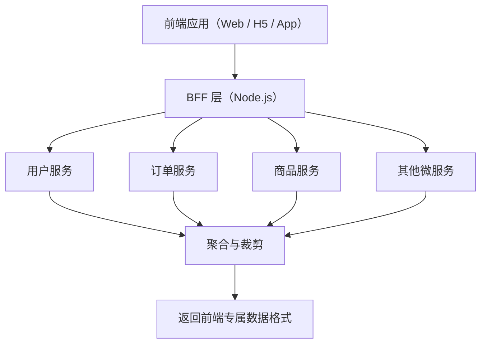
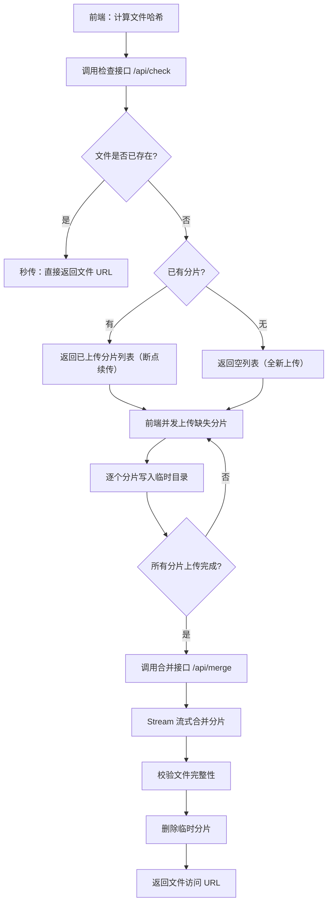

# Node.js - 综合场景串联

---

## 场景一：Node.js BFF 层实现

### 场景描述
使用 Koa 搭建一个 BFF（Backend For Frontend）中间层服务，为前端提供统一的 API 入口。BFF 层负责 JWT 认证鉴权、路由中间件编排、错误统一处理、并行调用多个后端微服务并聚合数据，最终返回裁剪后的前端专属数据格式。



> BFF 层作为前端与后端微服务之间的中间层，负责并行调用多个后端服务并聚合数据，同时对返回数据进行裁剪和格式转换，为不同前端客户端提供定制化的 API 响应。

### 涉及知识点
- [Node运行时与核心API](./01-Node运行时与核心API.md)：事件循环、Stream、Buffer、模块机制
- [Web框架与BFF层](./02-Web框架与BFF层.md)：Koa 洋葱模型、JWT 鉴权、中间件、BFF 设计模式

### 协作流程
1. 使用 Koa 初始化项目，安装 koa-router、koa-body、koa-jwt、@koa/cors 等中间件
2. 配置中间件执行顺序：错误处理中间件放在最外层，利用洋葱模型在 await next() 前后分别执行进入和穿出逻辑
3. 实现 JWT 认证中间件：登录接口生成 accessToken（15 分钟有效期）和 refreshToken（7 天有效期），受保护路由通过 koa-jwt 校验
4. 实现请求日志中间件：在 await next() 之前记录开始时间，之后计算耗时并输出格式化日志
5. 实现统一错误处理中间件：try/catch 包裹 await next()，区分已知错误（业务异常）和未知错误（服务器异常），返回统一格式错误响应
6. 实现 BFF 聚合接口：使用 Promise.all 并行调用用户服务和订单服务，裁剪敏感字段，添加汇总信息
7. 处理部分服务不可用时的降级策略：任一服务失败不阻塞整体响应，返回部分数据并附带错误信息
8. 使用 PM2 的 cluster 模式部署多进程，配合 Nginx 反向代理实现负载均衡

### 关键要点
- 中间件注册顺序必须正确：错误处理中间件在最外层，其次是日志、CORS、认证，最后是路由
- Koa 中间件必须使用 async/await，忘记 await next() 会导致洋葱模型断裂
- BFF 层并行调用使用 Promise.all 而非串行 await，减少总响应时间
- 降级处理确保局部故障不影响整体可用性，返回部分数据优于完全失败
- JWT 密钥通过环境变量管理，不要硬编码在代码中
- 生产环境使用 Redis 存储 refreshToken 黑名单，实现 Token 主动失效

> **生活类比**：洋葱模型就像机场安检流程——你进机场时，先过一道安检（第一个中间件的前半部分），再过一道海关（第二个中间件的前半部分），到达登机口（核心业务逻辑），然后返回时再过海关（第二个中间件的后半部分），再过安检（第一个中间件的后半部分），最后出机场（响应返回）。每道关卡都有机会在"进"和"出"时做检查。

---

## 场景二：大文件上传服务

### 场景描述
使用 Node.js 实现一个大文件上传服务，支持分片上传、断点续传和秒传功能。前端将文件切分为 5MB 分片并计算文件哈希，后端接收分片后合并，利用 Stream 流式写入避免内存溢出。

### 涉及知识点
- [Node运行时与核心API](./01-Node运行时与核心API.md)：Stream 流、Buffer、文件系统操作、事件循环
- [Web框架与BFF层](./02-Web框架与BFF层.md)：Express/Koa 路由、中间件、文件上传处理

### 协作流程
1. 前端使用 Blob.slice 将文件切分为 5MB 分片，使用 spark-md5 计算文件哈希
2. 前端先调用检查接口，传递文件哈希，后端返回已上传的分片列表（断点续传）
3. 后端根据文件哈希判断是否已存在完整文件，存在则直接返回（秒传）
4. 前端并发上传缺失分片（限制同时 3-5 个并发），每个分片携带文件哈希和分片序号
5. 后端使用 multer 接收分片，写入临时目录，命名格式为 `{hash}-{index}`
6. 所有分片上传完成后，调用合并接口，后端使用 Stream 流式合并分片
7. 合并时使用 fs.createReadStream 逐片读取，pipe 到 fs.createWriteStream 追加写入，避免一次性加载全部文件到内存
8. 合并完成后校验文件完整性，删除临时分片，返回文件访问 URL

### 关键要点
- 分片大小建议 5MB，过小导致请求过多，过大导致单次超时
- 文件哈希使用 MD5 计算，前端需使用 Web Worker 避免阻塞 UI 线程
- 后端使用 Stream 流式合并，不要用 Buffer.concat 一次性加载所有分片
- 临时目录需要定期清理，防止分片残留占用磁盘空间
- 并发上传控制使用信号量模式，限制同时上传的分片数量

### 分片上传数据流



### 完整可运行示例：分片上传服务

```javascript
const Koa = require('koa');
const Router = require('@koa/router');
const koaBody = require('koa-body');
const fs = require('fs');
const fsp = require('fs/promises');
const path = require('path');
const crypto = require('crypto');

const app = new Koa();
const router = new Router();
const UPLOAD_DIR = path.resolve(__dirname, 'uploads');
const TEMP_DIR = path.resolve(__dirname, 'temp');

// 确保目录存在
fs.mkdirSync(UPLOAD_DIR, { recursive: true });
fs.mkdirSync(TEMP_DIR, { recursive: true });

// ==================== 接口：秒传检查 ====================

/**
 * GET /api/check?hash=xxx
 * 检查文件是否已存在，或返回已上传的分片列表
 */
router.get('/api/check', async (ctx) => {
  const { hash } = ctx.query;
  if (!hash) {
    ctx.status = 400;
    ctx.body = { success: false, message: '缺少文件哈希' };
    return;
  }

  // 秒传：检查完整文件是否已存在
  const files = await fsp.readdir(UPLOAD_DIR);
  const existingFile = files.find((f) => f.startsWith(hash));
  if (existingFile) {
    ctx.body = {
      success: true,
      data: { uploaded: true, url: `/uploads/${existingFile}` },
    };
    return;
  }

  // 断点续传：检查已上传的分片
  const tempDir = path.join(TEMP_DIR, hash);
  let uploadedChunks = [];
  try {
    const chunks = await fsp.readdir(tempDir);
    uploadedChunks = chunks.map((name) => parseInt(name.split('-')[1], 10));
  } catch {
    // 临时目录不存在，说明没有已上传的分片
  }

  ctx.body = {
    success: true,
    data: { uploaded: false, uploadedChunks },
  };
});

// ==================== 接口：接收分片 ====================

/**
 * POST /api/upload
 * 接收单个分片，写入临时目录
 */
router.post('/api/upload', koaBody({ multipart: true }), async (ctx) => {
  const { hash, index } = ctx.request.body;
  const file = ctx.request.files?.chunk;

  if (!hash || index === undefined || !file) {
    ctx.status = 400;
    ctx.body = { success: false, message: '缺少 hash、index 或 chunk 文件' };
    return;
  }

  // 确保该文件的临时目录存在
  const tempDir = path.join(TEMP_DIR, hash);
  await fsp.mkdir(tempDir, { recursive: true });

  // 将分片写入临时目录：{hash}-{index}
  const chunkPath = path.join(tempDir, `${hash}-${index}`);
  const reader = fs.createReadStream(file.path);
  const writer = fs.createWriteStream(chunkPath);

  await new Promise((resolve, reject) => {
    reader.pipe(writer);
    writer.on('finish', resolve);
    writer.on('error', reject);
  });

  // 清理 multer 临时文件
  await fsp.unlink(file.path).catch(() => {});

  ctx.body = { success: true, message: `分片 ${index} 上传成功` };
});

// ==================== 接口：合并分片 ====================

/**
 * POST /api/merge
 * 使用 Stream 流式合并所有分片，避免内存溢出
 */
router.post('/api/merge', async (ctx) => {
  const { hash, filename, totalChunks } = ctx.request.body;

  if (!hash || !filename || !totalChunks) {
    ctx.status = 400;
    ctx.body = { success: false, message: '缺少必要参数' };
    return;
  }

  const tempDir = path.join(TEMP_DIR, hash);
  const ext = path.extname(filename);
  const finalPath = path.join(UPLOAD_DIR, `${hash}${ext}`);

  // 创建写入流
  const writeStream = fs.createWriteStream(finalPath);

  // 按分片序号顺序合并
  for (let i = 0; i < totalChunks; i++) {
    const chunkPath = path.join(tempDir, `${hash}-${i}`);
    const chunkData = await fsp.readFile(chunkPath);
    writeStream.write(chunkData);
  }

  // 关闭写入流
  await new Promise((resolve) => writeStream.end(resolve));

  // 校验文件完整性
  const fileBuffer = await fsp.readFile(finalPath);
  const actualHash = crypto.createHash('md5').update(fileBuffer).digest('hex');

  if (actualHash !== hash) {
    await fsp.unlink(finalPath);
    ctx.status = 400;
    ctx.body = { success: false, message: '文件哈希校验失败，请重新上传' };
    return;
  }

  // 清理临时分片
  await fsp.rm(tempDir, { recursive: true, force: true });

  ctx.body = {
    success: true,
    data: { url: `/uploads/${hash}${ext}` },
    message: '文件合并完成',
  };
});

// ==================== 启动 ====================

app.use(router.routes()).use(router.allowedMethods());

const PORT = process.env.PORT || 3000;
app.listen(PORT, () => {
  console.log(`[分片上传服务] 已启动: http://localhost:${PORT}`);
});
```

---

## 完整可运行示例：Koa 洋葱模型 + BFF 聚合

```javascript
const Koa = require('koa');
const Router = require('@koa/router');
const jwt = require('jsonwebtoken');
const axios = require('axios');

const app = new Koa();
const router = new Router();
const JWT_SECRET = process.env.JWT_SECRET || 'your-secret-key';

// ==================== 中间件：请求日志 ====================

/**
 * 洋葱模型日志中间件
 * 在 await next() 之前记录开始时间，之后计算耗时
 */
app.use(async (ctx, next) => {
  const start = Date.now();
  console.log(`[请求进入] ${ctx.method} ${ctx.url}`);
  await next(); // 洋葱模型：进入下一层
  const duration = Date.now() - start;
  console.log(`[请求返回] ${ctx.method} ${ctx.url} ${ctx.status} ${duration}ms`);
});

// ==================== 中间件：JWT 认证 ====================

/**
 * JWT 鉴权中间件
 * 放行登录接口，其余接口校验 Token
 */
app.use(async (ctx, next) => {
  // 登录和注册接口跳过认证
  if (ctx.path === '/api/login' || ctx.path === '/api/register') {
    return await next();
  }

  const authHeader = ctx.headers.authorization;
  if (!authHeader || !authHeader.startsWith('Bearer ')) {
    ctx.status = 401;
    ctx.body = { success: false, message: '缺少认证 Token' };
    return;
  }

  try {
    const token = authHeader.split(' ')[1];
    const decoded = jwt.verify(token, JWT_SECRET);
    ctx.state.user = decoded; // 将用户信息挂载到 ctx.state
    await next();
  } catch (err) {
    ctx.status = 401;
    ctx.body = {
      success: false,
      message: err.name === 'TokenExpiredError' ? 'Token 已过期' : '无效的 Token',
    };
  }
});

// ==================== 中间件：统一错误处理 ====================

/**
 * 洋葱模型最外层：统一错误处理
 * try/catch 包裹 await next()，捕获所有下游中间件抛出的异常
 */
app.use(async (ctx, next) => {
  try {
    await next();
  } catch (err) {
    console.error('[错误]', err.message);
    ctx.status = err.statusCode || 500;
    ctx.body = {
      success: false,
      message: err.message || '服务器内部错误',
      errorCode: err.errorCode || 'INTERNAL_ERROR',
    };
  }
});

// ==================== 路由：登录 ====================

router.post('/api/login', async (ctx) => {
  const { username, password } = ctx.request.body;

  // 模拟用户验证
  if (username !== 'admin' || password !== '123456') {
    ctx.status = 400;
    ctx.body = { success: false, message: '用户名或密码错误' };
    return;
  }

  const accessToken = jwt.sign(
    { userId: 1, username },
    JWT_SECRET,
    { expiresIn: '15m' }
  );
  const refreshToken = jwt.sign(
    { userId: 1, username, type: 'refresh' },
    JWT_SECRET,
    { expiresIn: '7d' }
  );

  ctx.body = { success: true, data: { accessToken, refreshToken } };
});

// ==================== 路由：BFF 聚合接口 ====================

/**
 * 获取用户仪表盘数据
 * 并行调用用户服务和订单服务，聚合并裁剪数据
 */
router.get('/api/dashboard', async (ctx) => {
  const userId = ctx.state.user.userId;

  // 并行调用多个后端微服务
  const [userRes, orderRes] = await Promise.allSettled([
    axios.get(`http://user-service/api/users/${userId}`),
    axios.get(`http://order-service/api/orders?userId=${userId}`),
  ]);

  // 裁剪用户敏感字段，只返回前端需要的字段
  const user = userRes.status === 'fulfilled'
    ? { name: userRes.value.data.name, avatar: userRes.value.data.avatar }
    : null;

  // 裁剪订单数据，只返回最近 5 条
  const orders = orderRes.status === 'fulfilled'
    ? orderRes.value.data.orders.slice(0, 5).map((o) => ({
        id: o.id,
        amount: o.amount,
        status: o.status,
        createdAt: o.createdAt,
      }))
    : [];

  ctx.body = {
    success: true,
    data: {
      user,
      recentOrders: orders,
      // 降级标记：部分服务不可用时仍返回可用数据
      partial: userRes.status === 'rejected' || orderRes.status === 'rejected',
    },
  };
});

// ==================== 启动 ====================

app.use(router.routes()).use(router.allowedMethods());

const PORT = process.env.PORT || 3000;
app.listen(PORT, () => {
  console.log(`[Koa BFF] 服务已启动: http://localhost:${PORT}`);
});
```

---

---

## 常见错误

### 1. Koa 中间件忘记 `await next()`

```javascript
// 错误：忘记 await next()，洋葱模型断裂，后续中间件和路由永远不会执行
app.use(async (ctx, next) => {
  console.log('请求进入');
  next(); // 缺少 await，Promise 未被等待，响应可能在中间件返回前就发送了
  console.log('请求返回'); // 这行可能在响应发送之后才执行
});

// 正确：必须使用 await next()
app.use(async (ctx, next) => {
  console.log('请求进入');
  await next(); // 等待下游中间件全部执行完毕
  console.log('请求返回'); // 下游全部完成后才执行
});
```

### 2. 分片合并时使用 `Buffer.concat` 导致内存溢出

```javascript
// 错误：将所有分片一次性加载到内存，大文件会导致 OOM
async function mergeChunks(hash, totalChunks) {
  const buffers = [];
  for (let i = 0; i < totalChunks; i++) {
    const chunk = await fsp.readFile(path.join(TEMP_DIR, hash, `${hash}-${i}`));
    buffers.push(chunk); // 所有分片堆积在内存中
  }
  const merged = Buffer.concat(buffers); // 大文件可能直接 OOM
  await fsp.writeFile(finalPath, merged);
}

// 正确：使用 Stream 流式写入，逐片追加，内存占用恒定
async function mergeChunks(hash, totalChunks) {
  const writeStream = fs.createWriteStream(finalPath);
  for (let i = 0; i < totalChunks; i++) {
    const chunkData = await fsp.readFile(path.join(TEMP_DIR, hash, `${hash}-${i}`));
    writeStream.write(chunkData); // 逐片写入，写完后释放内存
  }
  await new Promise((resolve) => writeStream.end(resolve));
}
```

### 3. BFF 层串行调用多个微服务

```javascript
// 错误：串行调用，总耗时 = 用户服务耗时 + 订单服务耗时
router.get('/api/dashboard', async (ctx) => {
  const userRes = await axios.get('http://user-service/api/users/1'); // 等 200ms
  const orderRes = await axios.get('http://order-service/api/orders'); // 再等 300ms
  // 总耗时：500ms
  ctx.body = { user: userRes.data, orders: orderRes.data };
});

// 正确：使用 Promise.all 并行调用，总耗时 = 最慢的单个服务耗时
router.get('/api/dashboard', async (ctx) => {
  const [userRes, orderRes] = await Promise.all([
    axios.get('http://user-service/api/users/1'),
    axios.get('http://order-service/api/orders'),
  ]);
  // 总耗时：max(200ms, 300ms) = 300ms
  ctx.body = { user: userRes.data, orders: orderRes.data };
});
```

### 4. JWT 密钥硬编码在代码中

```javascript
// 错误：密钥硬编码，一旦代码泄露，所有 Token 可被伪造
const JWT_SECRET = 'my-super-secret-key-123456';

// 正确：通过环境变量管理，代码中不出现真实密钥
const JWT_SECRET = process.env.JWT_SECRET;
if (!JWT_SECRET) {
  console.error('JWT_SECRET 环境变量未设置');
  process.exit(1);
}
```

---

> [返回模块目录](../README.md) | [返回知识导览](../知识导览.md)