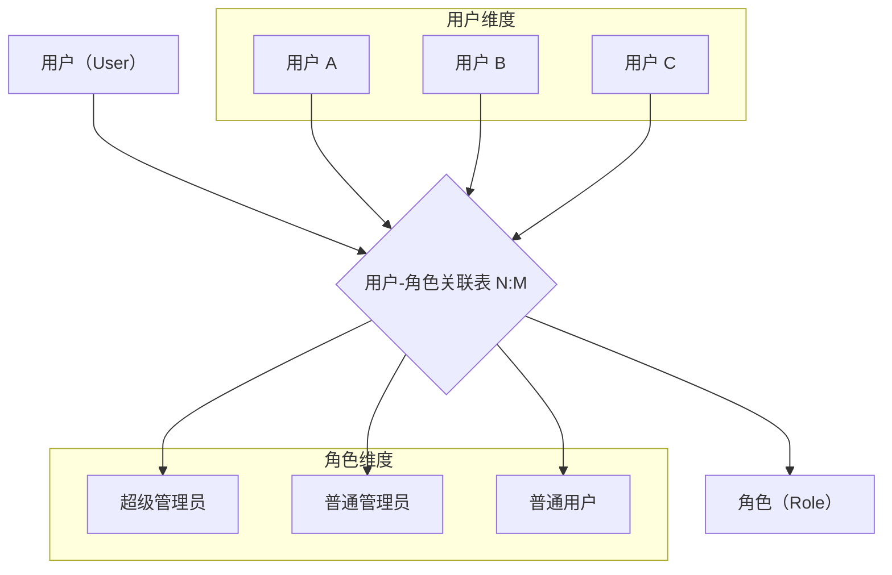
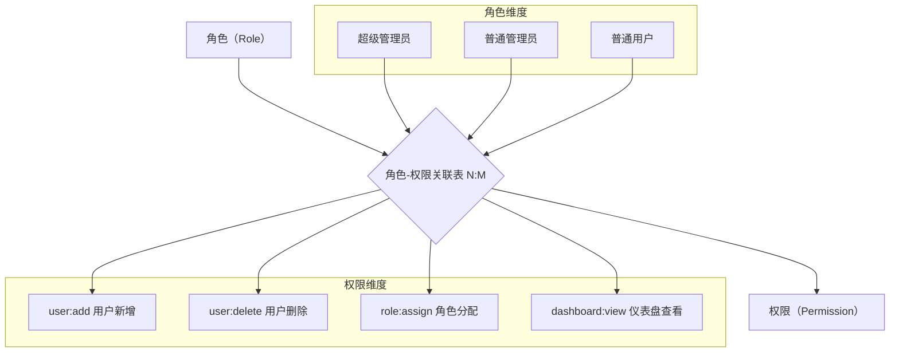
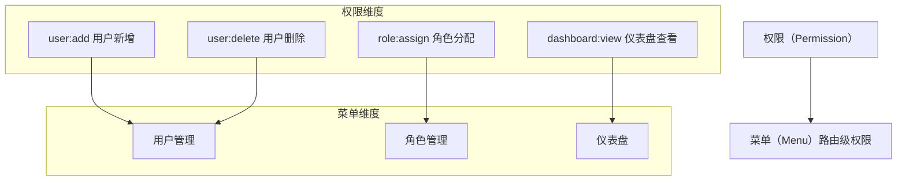
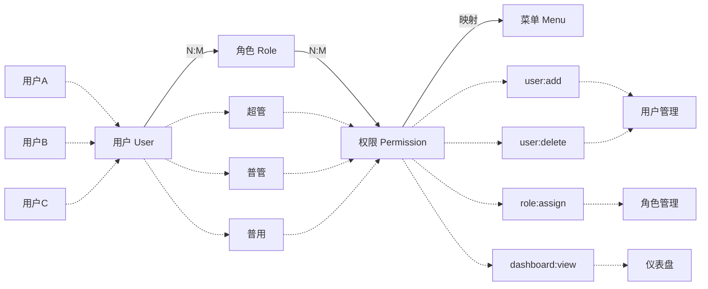
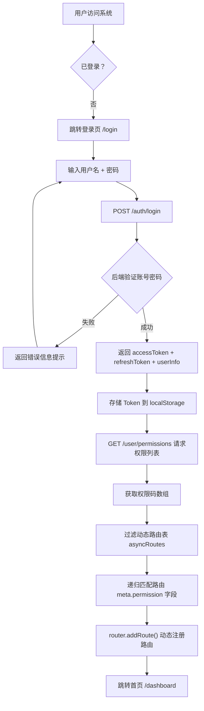
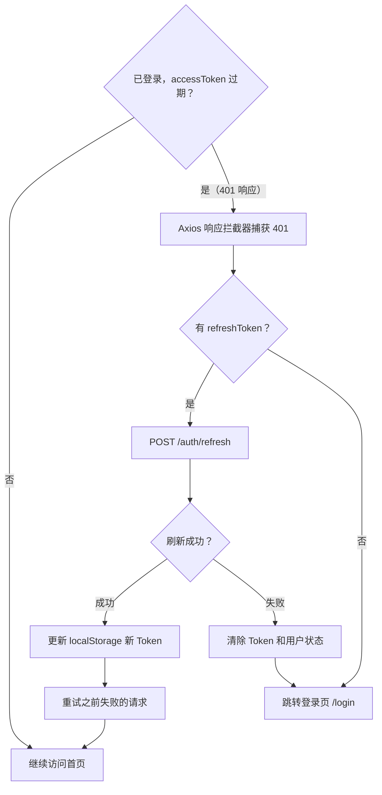
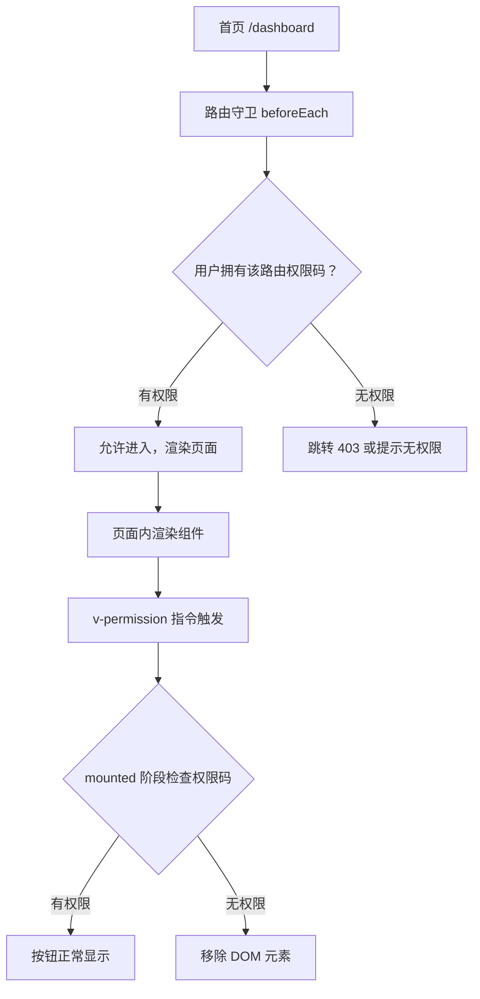

# 企业后台管理系统实战

> 学习路线对应：综合实战（第 1-9 周知识串联）
> 技术栈：Vue 3 + TypeScript + Vite + Pinia + Vue Router 4 + Element Plus + Axios + SCSS + UnoCSS
> 备选方案：React 18 + TypeScript + Vite 6 + Ant Design（Hooks 心智模型统一，生态成熟稳定）
> 项目目标：从零搭建一个功能完整的企业级后台管理系统，覆盖权限控制、认证鉴权、组件封装和主题切换

---

## 本文目录

- [一、项目架构](#一项目架构)
- [二、模块设计](#二模块设计)
- [三、技术实现](#三技术实现)
- [四、常见面试题](#四常见面试题)
- [五、避坑指南](#五避坑指南)
- [本章学习自检](#本章学习自检)

---

## 一、项目架构

### 1.1 需求分析

**核心功能模块**：

| 模块 | 功能描述 | 关键要求 |
|------|---------|---------|
| 用户管理 | 用户的增删改查、状态管理、部门归属 | 批量导入导出、模糊搜索 |
| 角色管理 | 角色的创建、编辑、删除，角色与权限绑定 | 角色继承、多角色叠加 |
| 菜单管理 | 动态菜单树配置、菜单与权限码关联 | 多级菜单、外链菜单 |
| 权限管理 | 权限码（按钮级）的定义与管理 | 与菜单、接口一一对应 |
| 数据报表 | 数据可视化仪表盘、图表展示 | ECharts 集成、实时数据刷新 |
| 系统设置 | 全局参数配置、字典管理、操作日志 | 配置热更新、审计追溯 |

**非功能性需求**：

| 需求 | 具体指标 | 实现方案 |
|------|---------|---------|
| 响应式布局 | 支持 PC / 平板 / 手机 | CSS 媒体查询 + Element Plus 响应式栅格 |
| 暗黑模式 | 一键切换亮色 / 暗色 | CSS 变量 + Pinia 状态管理 + localStorage 持久化 |
| 国际化 | 中英文切换 | vue-i18n，按模块组织语言包 |
| 按钮级权限 | 控制页面内按钮可见性 | 自定义 `v-permission` 指令 |
| 首屏性能 | FCP < 2s，路由切换 < 300ms | 路由懒加载、组件按需引入、CDN 加速 |
| 代码质量 | ESLint 零告警，Prettier 统一格式 | Husky + lint-staged 提交前自动检查 |

### 1.2 技术选型

| 技术 | 选型 | 说明 |
|------|------|------|
| 框架 | Vue 3 + TypeScript | Composition API + `<script setup>`，类型安全 |
| 构建工具 | Vite | 基于 ESM，冷启动快，HMR 极速 |
| 状态管理 | Pinia | 官方推荐，去掉 mutations，TypeScript 友好 |
| 路由 | Vue Router 4 | 动态路由添加、路由守卫 |
| UI 组件库 | Element Plus | 企业级 Vue 3 组件库，中文文档完善 |
| HTTP 客户端 | Axios | 请求 / 响应拦截器、超时控制 |
| CSS 方案 | SCSS + UnoCSS | 原子化 CSS + 预处理器 |
| 代码规范 | ESLint + Prettier + Husky | 提交前自动格式化 + 检查 |
| 包管理 | pnpm | 磁盘节省、严格依赖管理、Monorepo 支持 |

**选型理由**：Vue 3 学习曲线平缓，Element Plus 是 Vue 3 生态最成熟的组件库；Pinia 比 Vuex API 更简洁；UnoCSS 按需生成 CSS，比 Tailwind 更快。

**项目初始化步骤**：

```bash
# 1. 使用 Vite 创建项目
pnpm create vite admin-system --template vue-ts

# 2. 安装核心依赖
pnpm add vue-router@4 pinia axios element-plus @element-plus/icons-vue

# 3. 安装开发依赖
pnpm add -D eslint prettier husky lint-staged @typescript-eslint/parser @typescript-eslint/eslint-plugin \
  unplugin-vue-components unplugin-auto-import sass

# 4. 配置 Vite（vite.config.ts）
# - 路径别名 @ -> src/
# - Element Plus 按需引入
# - UnoCSS 插件
# - 代理配置（开发环境跨域）

# 5. 配置 ESLint + Prettier
# 6. 初始化 Husky（pre-commit hook）
# 7. 创建目录结构（api/、stores/、router/、views/ 等）
```

### 1.3 项目目录结构

```
src/
├── api/              # 接口请求（modules/ 按业务拆分）
├── assets/           # 静态资源（images/、icons/）
├── components/       # 公共组件（ProTable/、ProForm/、ProDialog/）
├── composables/      # 组合式函数（usePermission、useTheme、useTable）
├── directive/        # 自定义指令（permission、debounce）
├── layout/           # 布局组件（index.vue、Sidebar、Navbar、TagsView）
├── router/           # 路由（constantRoutes + asyncRoutes + 守卫）
├── stores/           # Pinia（user、permission、app、tagsView）
├── styles/           # 全局样式（variables、theme/、reset）
├── types/            # TS 类型定义（api.d.ts、router.d.ts、global.d.ts）
├── utils/            # 工具函数（request、auth、storage、validate）
├── views/            # 页面（login/、dashboard/、system/、error/）
├── App.vue
└── main.ts
```

**设计原则**：按功能分层（api/stores/router 各司其职）、业务模块内聚（api/modules/ 与 views/ 一一对应）、公共逻辑抽离（composables/ 和 utils/）。

**Vite 代理配置示例**（解决开发环境跨域问题）：

```typescript
// vite.config.ts
export default defineConfig({
  server: {
    proxy: {
      '/api': {
        target: 'http://localhost:8080',
        changeOrigin: true,
        rewrite: (path) => path.replace(/^\/api/, '')
      }
    }
  }
})
```

---

## 二、模块设计

### 2.1 RBAC 权限控制

RBAC（Role-Based Access Control）核心思想：**用户不直接关联权限，通过角色间接关联**。

```
用户（User）──N:M──> 角色（Role）──N:M──> 权限（Permission）
```

**三级权限控制体系**：

| 权限级别 | 控制粒度 | 实现方式 | 说明 |
|---------|---------|---------|------|
| 菜单权限（路由级） | 页面 / 菜单 | 动态路由 | 控制用户能看到哪些菜单和页面 |
| 按钮权限（元素级） | 页面内按钮 | 自定义指令 `v-permission` | 控制用户能操作哪些按钮 |
| 接口权限（请求级） | API 接口 | 后端鉴权 | 前端只做展示控制，后端做真正安全校验 |

**动态路由核心流程**：
1. 前端维护完整路由表（`asyncRoutes.ts`），每个路由 `meta` 中携带 `permission` 字段
2. 登录后后端返回用户拥有的权限码列表
3. 前端根据权限码过滤路由表，通过 `router.addRoute()` 动态注册
4. 使用 `hasAddedRoutes` 标记防止重复注册

**按钮权限指令**：`v-permission="['user:add']"`，在 `mounted` 阶段检查权限，无权限则从 DOM 移除元素。权限码命名规范：`模块:操作`（如 `user:add`、`role:assign`）。

**RBAC 多对多关系架构图**：

**图解一：用户与角色多对多关系**

用户通过关联表与角色建立多对多关系，一个用户可拥有多个角色，一个角色下可包含多个用户。



**图解二：角色与权限多对多关系**

角色通过关联表与权限建立多对多关系，角色的权限最终取所有关联权限的并集。



**图解三：权限与菜单映射关系**

权限码与前端菜单一一对应，有权限码的用户才能看到对应菜单和页面。



**图解四：RBAC 整体概览**

将三层关系串联：用户关联角色，角色关联权限，权限映射菜单，形成完整的 RBAC 权限控制链路。



> RBAC 的核心思想是**用户不直接关联权限，而是通过角色间接关联**，形成用户-角色-权限-菜单的多层多对多关系。用户最终权限等于所有角色权限的并集，前端通过权限码过滤路由表和按钮可见性，后端负责接口级安全校验，二者结合实现完整的权限控制体系。

**RBAC 权限认证完整流程图**：

**流程图一：登录与权限获取**

用户从未登录状态开始，完成认证后获取权限码，过滤并动态注册路由，最终进入首页。



**流程图二：Token 刷新机制**

已登录用户访问时，若 accessToken 过期则通过 refreshToken 刷新，失败则重新登录。



**流程图三：路由守卫与按钮权限控制**

进入首页后，每次路由跳转都经过权限校验；页面内按钮通过 v-permission 指令控制显隐。



> 📖 **参考链接**：
> - [OWASP - Access Control](https://owasp.org/www-community/Access_Control)
> - [MDN - Web 安全](https://developer.mozilla.org/zh-CN/docs/Web/Security)

### 2.2 用户认证与 Token 管理

**登录流程**：用户名+密码 → POST /auth/login → 后端返回 `{ accessToken, refreshToken, userInfo }` → 存储到 localStorage → 获取权限列表 → 生成动态路由 → 跳转首页。

**Token 刷新机制**：`accessToken` 短期有效（30min），`refreshToken` 长期有效（7天）。当 accessToken 过期时：

```
请求 → 拦截器添加 Authorization 头
  → 后端返回 401 → 响应拦截器捕获
  → 有 refreshToken：POST /auth/refresh 换新 token
    → 成功：更新 localStorage，重试原请求
    → 失败：清除本地状态，跳转登录
  → 无 refreshToken：直接跳转登录
```

**并发刷新问题**：多个请求同时 401 时，用 `isRefreshing` 标记 + `pendingRequests` 队列缓存，只刷新一次，完成后统一重试。

### 2.3 通用组件封装

| 组件 | 核心 Props | 核心插槽 | 关键能力 |
|------|-----------|---------|---------|
| ProTable | columns、data、pagination、loading | #toolbar、#column-{prop}、#actions | 排序、筛选、多选、固定列、自定义渲染 |
| ProForm | formItems、model、rules | #footer | 动态表单、校验、联动、回显 |
| ProDialog | visible、title、width | #default、#footer | 确认/表单/详情三种模式，before-close 钩子 |

**表单封装核心挑战**：
- **动态表单**：根据配置项 `formItems` 数组动态渲染表单项（input、select、date-picker、switch 等）
- **表单校验**：通过 `rules` 配置统一管理校验规则，支持 `async-validator` 异步校验
- **表单联动**：`watch` 监听某字段变化，动态修改其他字段的 `disabled`、`options`、`visible`
- **表单回显**：编辑场景下，通过 `model` 绑定数据源，组件自动填充

**弹窗封装核心挑战**：
- 统一管理弹窗打开 / 关闭状态（`v-model:visible` 双向绑定）
- 支持三种模式：`mode: 'confirm' | 'form' | 'detail'`
- 提供 `before-close` 钩子，防止用户误关闭导致数据丢失
- 在 `onUnmounted` 时清理弹窗状态，避免内存泄漏

**表格 Props 类型定义**：

```typescript
interface Column<T = any> {
  prop: string; label: string;
  width?: number | string; minWidth?: number;
  align?: 'left' | 'center' | 'right';
  sortable?: boolean | 'custom';
  fixed?: 'left' | 'right';
  formatter?: (row: T) => string;
  render?: (scope: { row: T }) => VNode;
}
interface PaginationConfig {
  currentPage: number; pageSize: number; total: number;
  pageSizes?: number[];
  layout?: string;
}
```

### 2.4 布局与主题

**经典布局**：侧边栏 + 顶部导航 + 内容区（`<router-view />`）。侧边栏支持多级菜单递归渲染，根据路由路径自动高亮。

**暗黑模式**：CSS 变量定义两套主题色（亮色在 `:root`，暗色在 `html.dark`），Pinia 管理 `theme` 状态，`localStorage` 持久化，Element Plus 通过 CSS 变量覆盖适配。

**响应式适配**：>=1200px 完整布局，768-1200px 侧边栏默认折叠，<768px 移动端隐藏侧边栏。

**侧边栏菜单实现要点**：

```vue
<!-- 递归菜单组件关键代码 -->
<template>
  <template v-for="item in menuList" :key="item.path">
    <!-- 有子菜单：递归渲染 -->
    <el-sub-menu v-if="item.children?.length" :index="item.path">
      <template #title>
        <el-icon><component :is="item.meta.icon" /></el-icon>
        <span>{{ item.meta.title }}</span>
      </template>
      <MenuItem :menu-list="item.children" />
    </el-sub-menu>
    <!-- 无子菜单：直接渲染 -->
    <el-menu-item v-else :index="item.path" @click="handleMenuClick(item)">
      <el-icon><component :is="item.meta.icon" /></el-icon>
      <span>{{ item.meta.title }}</span>
    </el-menu-item>
  </template>
</template>
```

**注意**：路由 `meta` 中 `hidden: true` 的菜单项不渲染在侧边栏中（如登录页、404 页）。

---

## 三、技术实现

### 3.1 动态路由与路由守卫

```typescript
// router/constantRoutes.ts — 静态路由（无需权限）
export const constantRoutes: RouteRecordRaw[] = [
  { path: '/login', component: () => import('@/views/login/index.vue'), meta: { title: '登录', hidden: true } },
  { path: '/404', component: () => import('@/views/error/404.vue'), meta: { title: '404', hidden: true } },
]

// router/asyncRoutes.ts — 动态路由（需权限）
const Layout = () => import('@/layout/index.vue')
export const asyncRoutes: RouteRecordRaw[] = [
  {
    path: '/system',
    component: Layout,
    meta: { title: '系统管理', icon: 'setting' },
    children: [
      { path: 'user', component: () => import('@/views/system/user.vue'), meta: { title: '用户管理', permission: 'system:user' } },
      { path: 'role', component: () => import('@/views/system/role.vue'), meta: { title: '角色管理', permission: 'system:role' } },
    ]
  },
  { path: '/:pathMatch(.*)*', redirect: '/404', meta: { hidden: true } }
]
```

```typescript
// stores/permission.ts — 递归过滤路由 + 动态注册
function filterAsyncRoutes(routes: RouteRecordRaw[], permissions: string[]): RouteRecordRaw[] {
  const res: RouteRecordRaw[] = []
  routes.forEach(route => {
    const tmp = { ...route }
    if (tmp.meta?.permission && !permissions.includes(tmp.meta.permission as string)) return
    if (tmp.children) tmp.children = filterAsyncRoutes(tmp.children, permissions)
    res.push(tmp)
  })
  return res
}

export const usePermissionStore = defineStore('permission', () => {
  const routes = ref<RouteRecordRaw[]>([])
  let hasAddedRoutes = false

  function generateRoutes(permissions: string[]) {
    const accessedRoutes = filterAsyncRoutes(asyncRoutes, permissions)
    routes.value = [...constantRoutes, ...accessedRoutes]
    return accessedRoutes
  }
  return { routes, hasAddedRoutes, generateRoutes }
})
```

```typescript
// router/index.ts — 全局守卫
router.beforeEach(async (to, _from, next) => {
  NProgress.start()
  const userStore = useUserStore()
  const permissionStore = usePermissionStore()
  const hasToken = getToken()

  if (hasToken) {
    if (to.path === '/login') { next({ path: '/' }); NProgress.done() }
    else {
      if (!userStore.userInfo) {
        try {
          await userStore.getUserInfo()
          const permissions = await userStore.getPermissions()
          const accessedRoutes = permissionStore.generateRoutes(permissions)
          accessedRoutes.forEach(route => router.addRoute(route))
          permissionStore.hasAddedRoutes = true
          next({ ...to, replace: true })
        } catch {
          await userStore.resetToken()
          next(`/login?redirect=${to.path}`)
          NProgress.done()
        }
      } else { next() }
    }
  } else {
    if (whiteList.includes(to.path)) next()
    else { next(`/login?redirect=${to.path}`); NProgress.done() }
  }
})
```

> 📖 **参考链接**：
> - [Vue Router - 动态路由匹配](https://router.vuejs.org/guide/essentials/dynamic-matching.html)
> - [React Router - 官方文档](https://reactrouter.com/)

### 3.2 权限指令

```typescript
// directive/permission.ts
export const permission: Directive = {
  mounted(el: HTMLElement, binding: DirectiveBinding) {
    const { value } = binding
    if (!value) return
    const requiredPermissions = Array.isArray(value) ? value : [value]
    const userStore = useUserStore()
    const hasPermission = requiredPermissions.some(p => userStore.permissions?.includes(p))
    if (!hasPermission) el.parentNode?.removeChild(el)
  }
}

// directive/index.ts
export function setupDirectives(app: App) {
  app.directive('permission', permission)
}
```

### 3.3 Axios 请求拦截器

```typescript
// utils/request.ts
const service = axios.create({
  baseURL: import.meta.env.VITE_API_BASE_URL,
  timeout: 10000,
})

// 请求拦截 — 添加 Authorization
service.interceptors.request.use(config => {
  const token = getToken()
  if (token) config.headers.Authorization = `Bearer ${token}`
  return config
})

// 响应拦截 — 处理 401 + Token 刷新
let isRefreshing = false
let pendingRequests: Array<{ resolve: Function; reject: Function }> = []

service.interceptors.response.use(
  response => response.data,
  async error => {
    if (error.response?.status === 401) {
      const refreshToken = localStorage.getItem('refreshToken')
      if (!refreshToken) { removeToken(); router.push('/login'); return Promise.reject(error) }

      if (isRefreshing) {
        return new Promise((resolve, reject) => {
          pendingRequests.push({ resolve, reject })
        })
      }

      isRefreshing = true
      try {
        const { data } = await axios.post('/auth/refresh', { refreshToken })
        setToken(data.accessToken)
        pendingRequests.forEach(({ resolve }) => resolve(data.accessToken))
        pendingRequests = []
        error.config.headers.Authorization = `Bearer ${data.accessToken}`
        return service(error.config)
      } catch {
        pendingRequests.forEach(({ reject }) => reject())
        pendingRequests = []
        removeToken(); router.push('/login')
        return Promise.reject(error)
      } finally {
        isRefreshing = false
      }
    }
    return Promise.reject(error)
  }
)
```

> 📖 **参考链接**：
> - [MDN - Fetch API](https://developer.mozilla.org/zh-CN/docs/Web/API/Fetch_API)
> - [MDN - HTTP 请求方法](https://developer.mozilla.org/zh-CN/docs/Web/HTTP/Methods)

### 3.4 通用表格组件（精简版）

```vue
<!-- components/ProTable/index.vue -->
<template>
  <div class="pro-table">
    <div v-if="$slots.toolbar"><slot name="toolbar" /></div>
    <el-table v-loading="loading" :data="data" :border="border" @sort-change="$emit('sort-change', $event)" @selection-change="$emit('selection-change', $event)">
      <el-table-column v-if="showSelection" type="selection" width="50" />
      <el-table-column v-if="showIndex" type="index" width="60" label="序号" />
      <template v-for="col in columns" :key="col.prop">
        <el-table-column v-if="!col.hidden" :prop="col.prop" :label="col.label" :width="col.width" :sortable="col.sortable" :fixed="col.fixed" :show-overflow-tooltip="col.showOverflowTooltip !== false">
          <template #default="scope">
            <slot v-if="$slots[`column-${col.prop}`]" :name="`column-${col.prop}`" :row="scope.row" />
            <template v-else-if="col.formatter">{{ col.formatter(scope.row) }}</template>
            <template v-else>{{ scope.row[col.prop] }}</template>
          </template>
        </el-table-column>
      </template>
      <el-table-column v-if="$slots.actions" label="操作" :width="actionWidth" align="center">
        <template #default="scope"><slot name="actions" :row="scope.row" /></template>
      </el-table-column>
    </el-table>
    <div v-if="showPagination" class="pro-table__pagination">
      <el-pagination v-model:current-page="pagination.currentPage" v-model:page-size="pagination.pageSize" :total="pagination.total" background @size-change="$emit('size-change', $event)" @current-change="$emit('page-change', $event)" />
    </div>
  </div>
</template>

<!-- 注：generic 属性需要 Vue 3.3+ -->
<script setup lang="ts" generic="T extends Record<string, any>">
defineProps<{
  columns: Column<T>[]; data: T[]; loading?: boolean; pagination: PaginationConfig
  showSelection?: boolean; showIndex?: boolean; border?: boolean
  actionWidth?: string | number
}>()
defineEmits<{
  'sort-change': [sort: { prop: string; order: string }]
  'selection-change': [selection: T[]]
  'page-change': [page: number]; 'size-change': [size: number]
}>()
</script>
```

> 📖 **参考链接**：
> - [MDN - IntersectionObserver API](https://developer.mozilla.org/zh-CN/docs/Web/API/IntersectionObserver)
> - [MDN - Element scroll 事件](https://developer.mozilla.org/zh-CN/docs/Web/API/Element/scroll_event)

### 3.5 暗黑模式

```typescript
// composables/useTheme.ts
export function useTheme() {
  const appStore = useAppStore()
  const isDark = ref(false)

  function initTheme() {
    const saved = localStorage.getItem('theme') as 'light' | 'dark' | null
    const prefersDark = window.matchMedia('(prefers-color-scheme: dark)').matches
    const theme = saved || (prefersDark ? 'dark' : 'light')
    applyTheme(theme)
  }

  function applyTheme(theme: 'light' | 'dark') {
    document.documentElement.classList.toggle('dark', theme === 'dark')
    isDark.value = theme === 'dark'
    appStore.setTheme(theme)
  }

  function toggleTheme() {
    const newTheme = isDark.value ? 'light' : 'dark'
    applyTheme(newTheme)
    localStorage.setItem('theme', newTheme)
  }

  return { isDark, initTheme, toggleTheme }
}
```

```scss
// styles/theme/variables.scss
:root {
  --bg-color: #f5f7fa; --text-color: #333333;
  --sidebar-bg: #304156; --border-color: #e4e7ed;
}
html.dark {
  --bg-color: #1a1a2e; --text-color: #e0e0e0;
  --sidebar-bg: #16213e; --border-color: #3a3a5c;
}
```

---

## 四、常见面试题

### 1. 如何实现前端权限控制？（★★★）

**三级权限控制**：
- **路由级**：前端维护完整路由表，`meta.permission` 标注权限码，登录后根据后端返回的权限列表过滤路由，`router.addRoute()` 动态注册
- **按钮级**：自定义 `v-permission` 指令，`mounted` 阶段检查权限，无权限则移除 DOM 元素
- **接口级**：后端中间件 / 拦截器校验，前端只做展示控制

**RBAC 模型**：用户 -> 角色 -> 权限，用户最终权限 = 所有角色权限的并集。

**面试追问**：为什么前端权限控制不能替代后端权限校验？
**回答**：前端代码在浏览器中运行，用户可以通过浏览器开发者工具修改代码、绕过前端路由守卫直接调用 API，因此前端权限只能作为 UI 层面的体验优化，真正的安全校验必须在后端完成。

### 2. Axios 拦截器如何实现 Token 刷新？（★★★）

响应拦截器捕获 401 → 用 `refreshToken` 请求 `/auth/refresh` 换新 token → 更新 `localStorage` → 重试原请求。**关键**：并发 401 时用 `isRefreshing` 标记 + `pendingRequests` 队列，只刷新一次，完成后统一重试。

**面试追问**：为什么不用 `axios.interceptors.response.eject()` 移除拦截器？
**回答**：`eject()` 会彻底移除拦截器，后续正常请求也会失去拦截能力。正确的做法是通过标记位控制刷新逻辑，而不是移除拦截器本身。

### 3. 如何封装一个通用表格组件？（★★）

Props 接收 `columns`（列配置）、`data`（数据源）、`pagination`（分页配置）、`loading`；Emits 抛出 `page-change`、`sort-change`、`selection-change`；插槽支持 `#toolbar`、`#column-{prop}`、`#actions`。用 TypeScript 泛型约束数据类型。

**面试追问**：表格组件如何支持自定义列渲染？
**回答**：通过具名插槽 `#column-{prop}` 实现，使用时 `<template #column-status="{ row }">{{ row.status === 1 ? '启用' : '禁用' }}</template>`。同时支持 `formatter` 函数做简单格式化，`render` 函数做复杂渲染。

### 4. 如何实现暗黑模式？（★★）

CSS 变量定义两套主题色（`:root` 亮色，`html.dark` 暗色），Pinia 管理 `theme` 状态，切换时修改 `html` 的 `class`，`localStorage` 持久化用户选择。

**面试追问**：Element Plus 组件如何跟随暗黑模式？
**回答**：Element Plus 2.x 提供了官方暗黑模式支持，有两种方式：一是通过 `import 'element-plus/theme-chalk/dark/css-vars.css'` 引入官方暗黑 CSS 变量；二是自定义覆盖 Element Plus 的 CSS 变量（如 `--el-bg-color`、`--el-text-color-primary` 等）。

### 5. Vue Router 动态路由的实现原理？（★★★）

前端维护完整路由表 → 登录后后端返回权限列表 → 递归过滤路由 → `router.addRoute()` 动态注册 → `hasAddedRoutes` 标记防止重复注册 → 路由守卫中处理用户信息获取和路由生成。

**面试追问**：`router.addRoute()` 和 `router.addRoute(parentName, route)` 的区别？
**回答**：`router.addRoute(route)` 添加一级路由；`router.addRoute('parentName', route)` 向已有路由添加子路由。在动态路由场景中，通常使用前者，因为过滤后的路由树已经包含完整的父子关系。

### 6. 如何实现表单联动校验？（★★）

`watch` 监听字段变化 → 动态修改其他字段的 `rules`、`disabled`、`options` → Element Plus 的 `validateField` 单独校验 → 复杂场景用 `reactive` + `computed`。

**面试追问**：表单联动时 watch 和 computed 如何选择？
**回答**：`computed` 适合纯计算场景（如 A+B 显示合计），`watch` 适合有副作用的场景（如修改其他字段的校验规则、调用 API 获取下拉选项）。联动校验属于副作用场景，应使用 `watch`。

### 7. 如何优化后台管理系统的首屏加载性能？（★★★）

- **路由懒加载**：所有页面组件使用 `() => import()` 动态导入
- **组件按需引入**：`unplugin-vue-components` 自动按需引入 Element Plus
- **代码分割**：Vite 自动基于路由进行 chunk 分割
- **CDN 加速**：将 `vue`、`element-plus` 等大型依赖通过 CDN 引入
- **图片优化**：使用 WebP 格式、懒加载图片
- **Gzip 压缩**：Nginx 开启 Gzip，减小传输体积
- **预加载**：使用 `<link rel="preload">` 预加载关键资源

---

## 五、避坑指南

| 常见错误 | 现象 | 原因 | 解决方案 |
|---------|------|------|---------|
| 权限判断只用前端路由守卫 | 用户可直接访问 API | 前端权限只是 UI 控制 | 后端必须做接口级权限校验 |
| Token 刷新时多个请求同时 401 | 多次刷新导致旧 Token 失效 | 并发请求同时触发刷新 | 用 `isRefreshing` 标记 + 队列缓存，只刷新一次 |
| 动态路由重复添加 | 控制台报路由重复警告 | 每次跳转都调用 addRoute | 用 `hasAddedRoutes` 标记判断是否已添加 |
| 大列表直接渲染 | 页面卡顿 | 大量 DOM 节点同时渲染 | 使用虚拟列表或后端分页加载 |
| 表单校验不完整 | 后端收到无效数据 | 只做了简单 required 校验 | 使用 async-validator 做完整校验 |
| localStorage 存敏感信息 | Token 被 XSS 窃取 | localStorage 可被 JS 直接读取 | 使用 HttpOnly Cookie 或部署 CSP 策略 |
| 路由守卫未处理异步失败 | 登录后白屏 | getUserInfo 失败未捕获 | beforeEach 中用 try-catch 包裹异步操作 |
| 组件库全局引入 | 打包体积过大 | Element Plus 全量引入 | 用 unplugin-vue-components 按需引入 |
| 侧边栏菜单与路由不同步 | 刷新后菜单高亮错误 | default-active 未绑定路由 | 用 useRoute() 动态获取，computed 计算 |
| 暗黑模式切换后第三方组件异常 | 图表颜色不随主题变化 | 第三方组件硬编码颜色 | 主题切换时调用第三方组件的主题 API |
| 使用 `v-if` 和 `v-permission` 同时控制按钮 | 按钮闪烁或权限判断失效 | `v-if` 和自定义指令的执行时机不同 | 统一使用 `v-permission` 控制按钮显隐，避免与 `v-if` 混用 |

---

## 本章学习自检

完成本章学习后，应该能够：

- [ ] 从零搭建一个企业级 Vue 3 + TypeScript + Vite 项目
- [ ] 实现 RBAC 权限控制（动态路由 + 按钮权限指令）
- [ ] 封装通用组件（表格 ProTable、表单 ProForm、弹窗 ProDialog）
- [ ] 实现 Token 刷新机制和 Axios 拦截器封装
- [ ] 实现暗黑模式切换（CSS 变量 + Pinia + localStorage）
- [ ] 配置 ESLint + Prettier + Husky 代码规范工具链
- [ ] 回答权限控制、组件封装、性能优化相关的面试题

---

> **学习导航**：
> - 返回 [学习路线总览](../README.md)
> - 本模块参考：[01-html-css](../01-html-css/) | [02-javascript-core](../02-javascript-core/) | [03-typescript](../03-typescript/) | [04-browser](../04-browser/) | [05-vue](../05-vue/) | [06-react](../06-react/) | [07-engineering](../07-engineering/) | [08-performance](../08-performance/) | [09-nodejs](../09-nodejs/)
> - 后端实战参考：[后端资料库](../../backend/README.md)

---

## 补充内容：超大规模表单管理

> 当表单字段从几十个膨胀到几百个时，传统的单一组件方案会面临性能瓶颈、状态管理混乱、校验逻辑复杂等问题。本节介绍超大规模表单的工程化解决方案。

### 表单分组/分步/分页策略

面对几百个字段的表单，最直接的优化是**分而治之**：

| 策略 | 适用场景 | 实现方式 |
|------|---------|---------|
| **字段分组（Group）** | 字段有关联性，可折叠/展开 | `<el-collapse>` + 分组标题 |
| **分步表单（Steps）** | 有明确流程顺序（如填写→确认→提交） | `<el-steps>` + 每步独立校验 |
| **分页表单（Tabs）** | 字段可按业务维度分类（如基本信息/财务信息/附件） | `<el-tabs>` + 每个 Tab 一个子组件 |

```vue
<!-- 分步表单示例：将 200+ 字段拆分为 4 个步骤 -->
<template>
  <div class="massive-form">
    <el-steps :active="currentStep" finish-status="success" align-center>
      <el-step title="基本信息" />
      <el-step title="业务详情" />
      <el-step title="附件上传" />
      <el-step title="确认提交" />
    </el-steps>

    <!-- 每步独立渲染，避免一次性挂载 200+ 字段组件 -->
    <keep-alive :max="1">
      <component
        :is="stepComponents[currentStep]"
        :form-data="formData"
        @update="handleUpdate"
        @validate="handleValidate"
      />
    </keep-alive>

    <div class="step-actions">
      <el-button v-if="currentStep > 0" @click="prevStep">上一步</el-button>
      <el-button v-if="currentStep < 3" type="primary" @click="nextStep">
        下一步
      </el-button>
      <el-button v-if="currentStep === 3" type="primary" @click="submit">
        提交
      </el-button>
    </div>
  </div>
</template>

<script setup>
import { ref, shallowRef } from 'vue';
import StepBasicInfo from './steps/StepBasicInfo.vue';
import StepBusinessDetail from './steps/StepBusinessDetail.vue';
import StepAttachment from './steps/StepAttachment.vue';
import StepConfirm from './steps/StepConfirm.vue';

const currentStep = ref(0);
const stepComponents = [
  StepBasicInfo,
  StepBusinessDetail,
  StepAttachment,
  StepConfirm,
];

// 使用 shallowRef 避免深层响应式带来的性能开销
const formData = shallowRef({
  basic: { name: '', code: '', category: '', /* ... 50+ 字段 */ },
  business: { amount: 0, currency: '', rate: 0, /* ... 70+ 字段 */ },
  attachments: [],
  remark: '',
});

// 每步独立校验结果缓存
const stepValidMap = ref([false, false, false, false]);

function nextStep() {
  if (stepValidMap.value[currentStep.value]) {
    currentStep.value++;
  }
}

function prevStep() {
  currentStep.value--;
}
</script>
```

### 大表单状态性能优化

当表单字段超过 100 个时，响应式系统的性能开销不可忽视：

```javascript
// ❌ 错误做法：所有字段都使用 reactive/ref
const form = reactive({
  field1: '', field2: '', field3: '', /* ... 200 个字段 */
  // 每次任一字段变化，Vue 都要遍历所有依赖进行检查
});

// ✅ 正确做法：按模块拆分 + shallowRef
import { shallowRef, triggerRef, reactive } from 'vue';

// 策略一：大对象使用 shallowRef + 手动触发更新
const largeForm = shallowRef({
  // 200+ 字段，只有第一层引用会被追踪
  name: '',
  description: '',
  // ... 大量字段
});

// 编辑完成后手动触发更新
function updateField(key, value) {
  largeForm.value = { ...largeForm.value, [key]: value };
  // shallowRef 不会自动追踪深层变更，需要整对象替换
}

// 策略二：Pinia 按业务模块拆分 Store
// 不要把所有表单字段放在一个 Store 中
// stores/formBasicInfo.js
export const useFormBasicInfoStore = defineStore('formBasicInfo', () => {
  const data = reactive({ name: '', code: '', /* ... 50 字段 */ });
  return { data };
});

// stores/formBusinessDetail.js
export const useFormBusinessDetailStore = defineStore('formBusinessDetail', () => {
  const data = reactive({ amount: 0, currency: '', /* ... 70 字段 */ });
  return { data };
});

// 策略三：字段级 lazy 响应式（仅校验时获取值）
// 对于仅用于最终提交的字段，不需要实时响应式
const formRefs = new Map(); // 存储字段 DOM 引用

function getFormData() {
  const result = {};
  formRefs.forEach((ref, key) => {
    result[key] = ref.value;
  });
  return result;
}
```

**性能对比**：

| 方案 | 200字段首次渲染 | 字段变更响应 | 内存占用 |
|------|:---:|:---:|:---:|
| 全量 reactive | ~800ms | ~2ms | 高 |
| 按模块拆分 reactive | ~300ms | ~1ms | 中 |
| shallowRef + 手动触发 | ~200ms | ~0.5ms | 低 |
| 字段级 lazy | ~150ms | 无（仅提交时收集） | 最低 |

### 表单数据草稿保存/恢复机制

```javascript
// composables/useFormDraft.js
import { watch, onMounted } from 'vue';
import { useDebounceFn } from '@vueuse/core';

export function useFormDraft(formData, storageKey, options = {}) {
  const {
    debounceMs = 2000,  // 防抖 2 秒
    maxAge = 7 * 24 * 60 * 60 * 1000, // 草稿保留 7 天
  } = options;

  // 防抖自动保存
  const saveDraft = useDebounceFn(() => {
    const draft = {
      data: JSON.parse(JSON.stringify(formData.value)),
      timestamp: Date.now(),
    };
    localStorage.setItem(storageKey, JSON.stringify(draft));
  }, debounceMs);

  // 深度监听表单变化自动保存
  watch(formData, saveDraft, { deep: true });

  // 恢复草稿
  function restoreDraft() {
    const raw = localStorage.getItem(storageKey);
    if (!raw) return null;

    const draft = JSON.parse(raw);

    // 检查草稿是否过期
    if (Date.now() - draft.timestamp > maxAge) {
      localStorage.removeItem(storageKey);
      return null;
    }

    return draft;
  }

  // 清除草稿
  function clearDraft() {
    localStorage.removeItem(storageKey);
  }

  // 组件挂载时尝试恢复
  onMounted(() => {
    const draft = restoreDraft();
    if (draft) {
      // 提示用户是否恢复草稿
      const confirmed = window.confirm('检测到未保存的草稿，是否恢复？');
      if (confirmed) {
        Object.assign(formData.value, draft.data);
      }
    }
  });

  return { saveDraft, restoreDraft, clearDraft };
}
```

### JSON Schema 驱动动态表单渲染

结合 AI Prompt 工程，可以通过 JSON Schema 描述表单结构，实现"一个渲染引擎渲染所有表单"：

```javascript
// 表单 Schema 定义（可由 AI 根据需求描述生成）
const orderFormSchema = {
  title: '订单创建表单',
  fields: [
    {
      key: 'orderNo',
      label: '订单编号',
      type: 'input',
      required: true,
      rules: [{ pattern: /^ORD-\d{8}$/, message: '格式：ORD-YYYYMMDD' }],
    },
    {
      key: 'customerType',
      label: '客户类型',
      type: 'select',
      required: true,
      options: [
        { label: '企业', value: 'enterprise' },
        { label: '个人', value: 'individual' },
      ],
      // 联动规则：当选择"个人"时，隐藏"开票信息"字段组
      effects: {
        individual: { hide: ['invoiceGroup'] },
      },
    },
    {
      key: 'amount',
      label: '金额',
      type: 'number',
      required: true,
      rules: [{ min: 0.01, message: '金额必须大于 0' }],
      // 联动规则：当金额 > 100000 时，必填"审批人"
      effects: {
        '>100000': { required: ['approver'] },
      },
    },
    // ... 更多字段由 Schema 定义
  ],
};

// 通用 Schema 驱动表单渲染器
<template>
  <el-form :model="formData" :rules="computedRules">
    <template v-for="field in visibleFields" :key="field.key">
      <!-- 根据 field.type 动态渲染不同组件 -->
      <el-form-item :label="field.label" :prop="field.key">
        <SchemaInput
          v-if="field.type === 'input'"
          v-model="formData[field.key]"
        />
        <SchemaSelect
          v-else-if="field.type === 'select'"
          v-model="formData[field.key]"
          :options="field.options"
        />
        <SchemaNumber
          v-else-if="field.type === 'number'"
          v-model="formData[field.key]"
        />
        <!-- ... 更多类型 -->
      </el-form-item>
    </template>
  </el-form>
</template>
```

### 字段间复杂依赖关系管理

使用声明式规则引擎管理字段间的联动关系：

```javascript
// 表单联动规则引擎
class FormDependencyEngine {
  constructor(formData) {
    this.formData = formData;
    this.rules = [];        // 联动规则列表
    this.visibleMap = {};   // 字段可见性
    this.requiredMap = {};  // 字段必填性
    this.valueMap = {};     // 字段值联动
  }

  // 注册规则：当 sourceField 满足 condition 时，对 targetField 执行 action
  addRule({ sourceField, condition, targetField, action, value }) {
    this.rules.push({ sourceField, condition, targetField, action, value });
  }

  // 当字段变化时，计算所有联动规则
  evaluate(field, newValue) {
    const triggered = this.rules.filter(r => r.sourceField === field);

    for (const rule of triggered) {
      const satisfied = this.checkCondition(rule.condition, newValue);

      switch (rule.action) {
        case 'show':
          this.visibleMap[rule.targetField] = satisfied;
          break;
        case 'hide':
          this.visibleMap[rule.targetField] = !satisfied;
          break;
        case 'require':
          this.requiredMap[rule.targetField] = satisfied;
          break;
        case 'setValue':
          if (satisfied) {
            this.valueMap[rule.targetField] = rule.value;
          }
          break;
        case 'clear':
          if (satisfied) {
            this.valueMap[rule.targetField] = undefined;
          }
          break;
      }
    }
  }

  checkCondition(condition, value) {
    if (typeof condition === 'function') return condition(value);
    if (typeof condition === 'string' && condition.startsWith('>')) {
      return Number(value) > Number(condition.slice(1));
    }
    if (typeof condition === 'string' && condition.startsWith('==')) {
      return String(value) === condition.slice(2);
    }
    return value === condition;
  }
}

// 使用示例
const engine = new FormDependencyEngine(formData);

// 当客户类型为"个人"时，隐藏开票信息
engine.addRule({
  sourceField: 'customerType',
  condition: '==individual',
  targetField: 'invoiceGroup',
  action: 'hide',
});

// 当金额 > 100000 时，审批人必填
engine.addRule({
  sourceField: 'amount',
  condition: '>100000',
  targetField: 'approver',
  action: 'require',
});
```

**超大规模表单优化要点总结**：

| 优化维度 | 具体策略 | 收益 |
|---------|---------|------|
| 渲染性能 | 分步/分Tab渲染，KeepAlive缓存当前步骤 | 首次渲染从 200+ 组件降为 50 组件 |
| 响应式性能 | shallowRef + 按模块拆分 Pinia Store | 字段变更响应耗时降低 60% |
| 内存占用 | 字段级 lazy 取值，非当前步骤组件卸载 | 内存占用降低 50% |
| 数据安全 | 防抖自动保存草稿 + 7天过期机制 | 防止数据丢失 |
| 可维护性 | JSON Schema 驱动 + 声明式规则引擎 | 新增字段无需修改渲染逻辑 |
| AI 联动 | Schema 可由 AI 根据需求描述自动生成 | 开发效率提升 3-5 倍 |