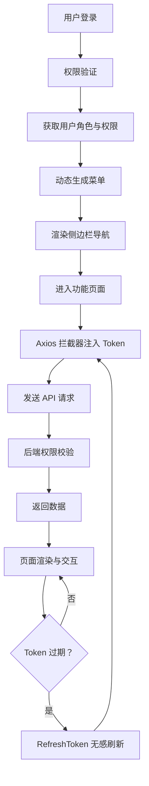

# 企业后台管理系统实战 - 综合场景串联

---

## 场景一：企业后台管理系统权限体系

### 场景描述
在一个 Vue 3 + TypeScript 企业后台管理系统中，实现完整的 RBAC 权限控制体系，覆盖动态路由注册、Pinia 状态管理、双 Token 认证刷新、按钮级权限指令和 Axios 拦截器。不同角色的用户登录后看到不同的菜单和页面，无权限的按钮自动隐藏，Token 过期时自动无感刷新。



> 企业后台管理系统的整体架构以登录为入口，通过权限验证控制菜单和页面访问，Axios 拦截器统一管理 Token 注入与刷新，后端接口级权限校验确保安全，形成完整的请求-响应闭环。

### 涉及知识点
- [企业后台管理系统实战](./01-企业后台管理系统实战.md)：RBAC 权限控制、动态路由、Pinia、双 Token、Axios 拦截器、权限指令

### 协作流程
1. 用户登录：前端提交用户名密码，后端验证后返回 { accessToken, refreshToken, userInfo, permissions }
2. Pinia 存储：userStore 存储 token 和用户信息，permissionStore 存储权限列表
3. 权限路由生成：permissionStore 根据 permissions 数组过滤 asyncRoutes，递归检查每个路由的 meta.permission 字段
4. 动态路由注册：过滤后的路由通过 router.addRoute() 逐一注册，hasAddedRoutes 标记防止重复注册
5. 路由守卫：beforeEach 中检查 token 是否存在，不存在则跳转登录页；存在但未获取用户信息时先请求用户信息和权限列表
6. 侧边栏渲染：根据 permissionStore 中的 routes 动态生成菜单，递归渲染多级菜单，hidden: true 的路由不显示
7. 按钮权限指令：v-permission 指令在 mounted 阶段检查当前用户权限，无权限则从 DOM 中移除该元素
8. Axios 响应拦截器：捕获 401 错误，使用 refreshToken 调用 /auth/refresh 接口换取新 accessToken
9. 并发刷新处理：多个请求同时返回 401 时，用 isRefreshing 标记 + pendingRequests 队列缓存，只执行一次刷新
10. 刷新成功后重试：用新 token 更新原请求的 Authorization 头，重新发起请求

### 关键要点
- 权限码命名规范：模块:操作（如 system:user:add、order:export），前后端统一约定
- 动态路由过滤需要递归处理嵌套路由，父路由无权限时子路由也应被过滤
- 路由守卫中 addRoute 后需要 next({ ...to, replace: true }) 确保路由正确匹配
- Token 刷新期间的并发请求用 Promise 队列缓存，刷新完成后统一 resolve
- 按钮权限指令在 mounted 阶段执行，对于 v-if 控制的元素需注意执行时机冲突
- 前端权限控制不能替代后端权限校验，后端必须做接口级权限校验

---

## 场景二：通用表格组件封装与服务端交互

### 场景描述
封装一个 ProTable 通用表格组件，支持分页、排序、筛选、多选、自定义列渲染和操作列。组件通过 Axios 封装的请求实例与后端交互，利用 Pinia 管理全局加载状态，使用 TypeScript 泛型约束数据类型。配合路由参数实现搜索条件持久化。

### 涉及知识点
- [企业后台管理系统实战](./01-企业后台管理系统实战.md)：通用组件封装、Axios 请求封装、Pinia 状态管理、TypeScript 泛型

### 协作流程
1. 定义 Column 和 PaginationConfig 的 TypeScript 接口，使用泛型 T 约束行数据类型
2. ProTable 组件接收 columns（列配置）、request（请求函数）、pagination（分页配置）等 props
3. 组件内部使用 useTable 组合式函数管理数据列表、loading 状态、分页参数
4. 通过具名插槽 #column-{prop} 实现自定义列渲染，作用域插槽传递 row 数据
5. 通过 #actions 插槽提供操作列，传递当前行数据和索引
6. 排序和筛选变化时通过 emit 通知父组件，父组件更新请求参数后重新调用 request
7. 多选功能通过 @selection-change 事件同步选中行，暴露 clearSelection 方法
8. Axios 请求拦截器自动添加 Authorization 头，响应拦截器统一处理错误和 Token 刷新
9. 搜索条件通过路由 query 参数持久化，页面刷新后搜索条件不丢失
10. 使用 v-memo 优化表格行渲染，避免无关数据变化导致整表重渲染

### 关键要点
- TypeScript 泛型确保 columns 配置与 data 数据类型一致，编译时发现类型错误
- request 函数由父组件传入，ProTable 组件不关心具体 API 实现，保持组件纯粹
- 分页模式支持前端分页和后端分页两种，通过 request 是否传入自动判断
- 插槽优先级：具名插槽 > formatter 函数 > 直接渲染 prop 值
- 组件卸载时取消未完成的请求（AbortController），避免内存泄漏

---

## 完整可运行示例：前端权限路由守卫

```typescript
// ==================== 类型定义 ====================

/** 路由元信息 */
interface RouteMeta {
  /** 页面标题 */
  title: string;
  /** 权限码，多个权限码满足其一即可 */
  permission?: string | string[];
  /** 是否在菜单中隐藏 */
  hidden?: boolean;
  /** 菜单图标 */
  icon?: string;
  /** 是否缓存页面 */
  keepAlive?: boolean;
  /** 排序权重 */
  sort?: number;
  /** 角色限制 */
  roles?: string[];
}

/** 路由配置 */
interface RouteConfig {
  path: string;
  name: string;
  component?: () => Promise<any>;
  redirect?: string;
  meta: RouteMeta;
  children?: RouteConfig[];
}

/** 用户信息 */
interface UserInfo {
  id: number;
  username: string;
  nickname: string;
  avatar: string;
  roles: string[];
  permissions: string[];
}

// ==================== 静态路由配置 ====================

/** 不依赖权限的公共路由 */
const constantRoutes: RouteConfig[] = [
  {
    path: '/login',
    name: 'Login',
    component: () => import('@/views/login/index.vue'),
    meta: { title: '登录', hidden: true },
  },
  {
    path: '/403',
    name: 'Forbidden',
    component: () => import('@/views/error/403.vue'),
    meta: { title: '无权限', hidden: true },
  },
  {
    path: '/404',
    name: 'NotFound',
    component: () => import('@/views/error/404.vue'),
    meta: { title: '页面不存在', hidden: true },
  },
  {
    path: '/:pathMatch(.*)*',
    redirect: '/404',
    meta: { hidden: true },
  },
];

/** 需要权限的动态路由（完整路由表） */
const asyncRoutes: RouteConfig[] = [
  {
    path: '/',
    name: 'Layout',
    component: () => import('@/layout/index.vue'),
    redirect: '/dashboard',
    meta: { title: '首页', icon: 'home' },
    children: [
      {
        path: 'dashboard',
        name: 'Dashboard',
        component: () => import('@/views/dashboard/index.vue'),
        meta: { title: '仪表盘', icon: 'dashboard', permission: 'dashboard:view' },
      },
    ],
  },
  {
    path: '/system',
    name: 'System',
    component: () => import('@/layout/index.vue'),
    redirect: '/system/user',
    meta: { title: '系统管理', icon: 'setting', permission: 'system:view' },
    children: [
      {
        path: 'user',
        name: 'SystemUser',
        component: () => import('@/views/system/user/index.vue'),
        meta: { title: '用户管理', permission: 'system:user:view' },
      },
      {
        path: 'role',
        name: 'SystemRole',
        component: () => import('@/views/system/role/index.vue'),
        meta: { title: '角色管理', permission: 'system:role:view', roles: ['admin'] },
      },
      {
        path: 'dept',
        name: 'SystemDept',
        component: () => import('@/views/system/dept/index.vue'),
        meta: { title: '部门管理', permission: 'system:dept:view' },
      },
    ],
  },
  {
    path: '/order',
    name: 'Order',
    component: () => import('@/layout/index.vue'),
    redirect: '/order/list',
    meta: { title: '订单管理', icon: 'order', permission: 'order:view' },
    children: [
      {
        path: 'list',
        name: 'OrderList',
        component: () => import('@/views/order/list/index.vue'),
        meta: { title: '订单列表', permission: 'order:list:view' },
      },
      {
        path: 'detail/:id',
        name: 'OrderDetail',
        component: () => import('@/views/order/detail/index.vue'),
        meta: { title: '订单详情', hidden: true },
      },
    ],
  },
];

// ==================== 权限工具函数 ====================

/**
 * 检查用户是否拥有指定权限
 * 支持单个权限码和权限码数组（满足其一即可）
 */
function hasPermission(userPermissions: string[], permission: string | string[]): boolean {
  if (!permission || userPermissions.includes('*:*:*')) {
    return true;
  }

  if (Array.isArray(permission)) {
    return permission.some((p) => userPermissions.includes(p));
  }

  return userPermissions.includes(permission);
}

/**
 * 检查用户是否拥有指定角色
 */
function hasRole(userRoles: string[], roles: string[]): boolean {
  if (!roles || roles.length === 0) return true;
  if (userRoles.includes('admin')) return true;
  return roles.some((r) => userRoles.includes(r));
}

/**
 * 递归过滤动态路由
 * 根据用户权限和角色过滤出可访问的路由
 */
function filterAsyncRoutes(
  routes: RouteConfig[],
  permissions: string[],
  roles: string[]
): RouteConfig[] {
  const filtered: RouteConfig[] = [];

  routes.forEach((route) => {
    const cloned = { ...route, children: [] as RouteConfig[] };

    // 检查权限
    if (cloned.meta.permission) {
      if (!hasPermission(permissions, cloned.meta.permission)) {
        return;
      }
    }

    // 检查角色
    if (cloned.meta.roles && cloned.meta.roles.length > 0) {
      if (!hasRole(roles, cloned.meta.roles)) {
        return;
      }
    }

    // 递归过滤子路由
    if (route.children && route.children.length > 0) {
      cloned.children = filterAsyncRoutes(route.children, permissions, roles);
    }

    filtered.push(cloned);
  });

  return filtered;
}

/**
 * 将嵌套路由扁平化为一维数组
 */
function flattenRoutes(routes: RouteConfig[]): RouteConfig[] {
  const result: RouteConfig[] = [];
  routes.forEach((route) => {
    result.push(route);
    if (route.children && route.children.length > 0) {
      result.push(...flattenRoutes(route.children));
    }
  });
  return result;
}

// ==================== Pinia Store：权限管理 ====================

import { defineStore } from 'pinia';
import { ref, computed } from 'vue';

const usePermissionStore = defineStore('permission', () => {
  // 路由是否已添加（防止重复注册）
  const hasAddedRoutes = ref(false);
  // 可访问的动态路由
  const accessRoutes = ref<RouteConfig[]>([]);

  // 实际项目中应通过 import { useUserStore } from '@/stores/user' 引入
  // 此处为同一文件内的简化示例，通过 Pinia 的 useUserStore() 获取实际权限
  const getUserStore = () => {
    return useUserStore();
  };

  /**
   * 生成可访问路由
   */
  function generateRoutes(): RouteRecordRaw[] {
    const userStore = getUserStore();
    const { permissions, roles } = userStore;

    // 过滤出有权限的路由
    const filtered = filterAsyncRoutes(asyncRoutes, permissions, roles);
    accessRoutes.value = filtered;

    return filtered as RouteRecordRaw[];
  }

  /**
   * 获取侧边栏菜单（排除 hidden 路由）
   */
  const sidebarMenus = computed(() => {
    return flattenRoutes(accessRoutes.value).filter(
      (route) => !route.meta.hidden
    );
  });

  return {
    hasAddedRoutes,
    accessRoutes,
    sidebarMenus,
    generateRoutes,
  };
});

// ==================== Pinia Store：用户管理 ====================

const useUserStore = defineStore('user', () => {
  const token = ref(localStorage.getItem('token') || '');
  const userInfo = ref<UserInfo | null>(null);
  const permissions = ref<string[]>([]);
  const roles = ref<string[]>([]);

  const isLoggedIn = computed(() => !!token.value);

  /**
   * 登录
   */
  async function login(username: string, password: string) {
    // 模拟登录请求
    const response = await mockLoginApi(username, password);
    const { accessToken, refreshToken, user, perms } = response;

    token.value = accessToken;
    localStorage.setItem('token', accessToken);
    localStorage.setItem('refreshToken', refreshToken);

    userInfo.value = user;
    permissions.value = perms;
    roles.value = user.roles;

    return response;
  }

  /**
   * 获取用户信息
   */
  async function getUserInfo() {
    // 模拟获取用户信息
    const response = await mockGetUserInfoApi();
    const { user, perms } = response;

    userInfo.value = user;
    permissions.value = perms;
    roles.value = user.roles;

    return response;
  }

  /**
   * 登出
   */
  function logout() {
    token.value = '';
    userInfo.value = null;
    permissions.value = [];
    roles.value = [];
    localStorage.removeItem('token');
    localStorage.removeItem('refreshToken');
  }

  /**
   * 重置 token
   */
  function resetToken() {
    token.value = '';
    localStorage.removeItem('token');
  }

  return {
    token,
    userInfo,
    permissions,
    roles,
    isLoggedIn,
    login,
    getUserInfo,
    logout,
    resetToken,
  };
});

// ==================== 路由守卫 ====================

import { createRouter, createWebHistory, type RouteRecordRaw } from 'vue-router';
import type { Router } from 'vue-router';

let router: Router;

/**
 * 创建路由实例
 */
function setupRouter() {
  router = createRouter({
    history: createWebHistory(),
    routes: constantRoutes as RouteRecordRaw[],
    scrollBehavior: () => ({ top: 0 }),
  });

  setupRouterGuard(router);

  return router;
}

/**
 * 设置路由守卫
 */
function setupRouterGuard(router: Router) {
  // 白名单（无需登录即可访问的路由）
  const whiteList = ['/login', '/404', '/403'];

  router.beforeEach(async (to, from, next) => {
    // 设置页面标题
    document.title = to.meta.title
      ? `${to.meta.title} - Admin`
      : 'Admin';

    const userStore = useUserStore();
    const permissionStore = usePermissionStore();

    // 已登录
    if (userStore.isLoggedIn) {
      // 访问登录页 → 重定向到首页
      if (to.path === '/login') {
        next({ path: '/dashboard', replace: true });
        return;
      }

      // 已获取用户信息
      if (userStore.userInfo) {
        next();
        return;
      }

      // 未获取用户信息，先获取
      try {
        await userStore.getUserInfo();

        // 生成可访问路由
        const accessRoutes = permissionStore.generateRoutes();

        // 动态注册路由
        accessRoutes.forEach((route) => {
          router.addRoute(route);
        });
        permissionStore.hasAddedRoutes = true;

        // 动态路由添加后，需要重新导航以匹配正确的路由
        next({ ...to, replace: true });
      } catch (error) {
        console.error('获取用户信息失败:', error);
        userStore.resetToken();
        next({ path: '/login', query: { redirect: to.fullPath }, replace: true });
      }
      return;
    }

    // 未登录
    if (whiteList.includes(to.path)) {
      next();
    } else {
      // 重定向到登录页，携带当前路径作为 redirect 参数
      next({ path: '/login', query: { redirect: to.fullPath }, replace: true });
    }
  });

  // 全局后置守卫：页面加载完成后的处理
  router.afterEach((to) => {
    // 可以在这里做页面访问统计
    console.log(`[Router] 导航到: ${to.path}`);
  });
}

// ==================== 权限指令（Vue 3） ====================

import type { Directive, DirectiveBinding } from 'vue';

/**
 * v-permission 指令
 * 用法：<button v-permission="'system:user:add'">添加用户</button>
 * 用法：<button v-permission="['system:user:add', 'system:user:edit']">操作</button>
 */
const permissionDirective: Directive = {
  mounted(el: HTMLElement, binding: DirectiveBinding) {
    const { value } = binding;
    if (!value) return;

    const userStore = useUserStore();
    const hasAuth = hasPermission(userStore.permissions, value);

    if (!hasAuth) {
      el.parentNode?.removeChild(el);
    }
  },
};

// ==================== 注册 ====================

// 在 main.ts 中注册
// import { createApp } from 'vue';
// import { createPinia } from 'pinia';
// import App from './App.vue';
//
// const app = createApp(App);
// app.use(createPinia());
// app.use(setupRouter());
// app.directive('permission', permissionDirective);
// app.mount('#app');

// ==================== 模拟 API ====================

async function mockLoginApi(username: string, password: string) {
  // 模拟登录请求
  return {
    accessToken: 'mock-access-token-' + Date.now(),
    refreshToken: 'mock-refresh-token-' + Date.now(),
    user: {
      id: 1,
      username,
      nickname: '管理员',
      avatar: 'https://example.com/avatar.png',
      roles: ['admin'],
    },
    perms: [
      'dashboard:view',
      'system:view',
      'system:user:view',
      'system:user:add',
      'system:user:edit',
      'system:user:delete',
      'system:role:view',
      'system:dept:view',
      'order:view',
      'order:list:view',
    ],
  };
}

async function mockGetUserInfoApi() {
  return {
    user: {
      id: 1,
      username: 'admin',
      nickname: '管理员',
      avatar: 'https://example.com/avatar.png',
      roles: ['admin'],
    },
    perms: [
      'dashboard:view',
      'system:view',
      'system:user:view',
      'system:user:add',
      'system:user:edit',
      'system:user:delete',
      'system:role:view',
      'system:dept:view',
      'order:view',
      'order:list:view',
    ],
  };
}

export {
  constantRoutes,
  asyncRoutes,
  filterAsyncRoutes,
  hasPermission,
  hasRole,
  setupRouter,
  setupRouterGuard,
  useUserStore,
  usePermissionStore,
  permissionDirective,
};

export type {
  RouteConfig,
  RouteMeta,
  UserInfo,
};
```

---

> [返回模块目录](../README.md) | [返回知识导览](../知识导览.md)