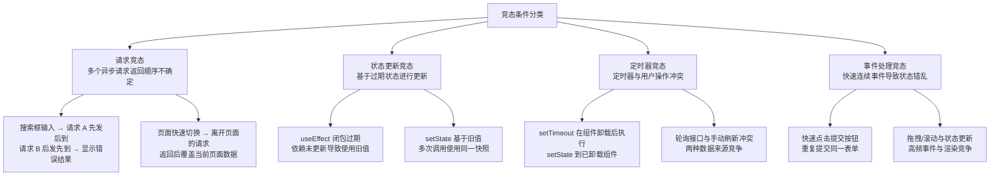

# AI 代码审查与质量管控

> 模块：11-ai-assisted（AI 辅助前端开发）
> 知识点：AI 代码审查、竞态条件检测、AST 自动拦截、ESLint 自定义规则、防调试方案识别、CI/CD 集成 AI 审查
> 前置知识：[Prompt 工程与代码生成](./02-Prompt工程与代码生成.md)、[工程规范与流程](../07-engineering/02-工程规范与流程.md)

---

## 一、核心概念

AI 生成代码的比例已超过 50%，代码审查（Code Review）的焦点需要从"检查语法错误"转向"拦截 AI 幻觉代码"。传统的 ESLint 规则只能捕获表层问题，AI 生成的深层次问题——竞态条件、不存在的 API、过时的模式——需要新的审查策略。

**核心概念要点：**

1. **AI 幻觉代码有规律可循**：胡编 API、过时语法、缺失错误处理、竞态条件遗漏——这四类问题占 AI 代码缺陷的 80% 以上
2. **AST 是拦截幻觉代码的利器**：通过自定义 ESLint 规则，在 AST 层面自动检测不存在的 API 调用、未处理的 Promise 等
3. **竞态条件是 AI 代码的"阿喀琉斯之踵"**：AI 默认生成"快乐路径"代码，异步操作的取消和清理几乎总是被遗漏
4. **防调试代码是技术债务**：AI 可能生成包含 `Object.defineProperty` 防调试陷阱的代码，需要在审查中识别并重构

---

## 二、AI 代码审查工作流

### 2.1 三阶段审查模型

```
阶段一：自动化检查（机器执行，每次提交）
  ├── TypeScript 类型检查
  ├── ESLint 规则检查（含自定义 AST 规则）
  ├── 单元测试
  └── 构建成功验证

阶段二：AI 辅助审查（AI 执行，每次 PR）
  ├── 竞态条件检测
  ├── 安全漏洞扫描
  ├── 性能回归检测
  └── 生成审查报告

阶段三：人工审查（开发者执行，每次 PR）
  ├── 架构合理性
  ├── 业务逻辑正确性
  ├── 代码可维护性
  └── 确认 AI 审查结果
```

### 2.2 AI 代码审查 Prompt 模板

```
你是一名资深前端代码审查员。请审查以下 PR 代码变更，从以下维度逐一检查：

## 检查维度（按优先级排序）

### 1. 竞态条件（Race Condition）
- 异步请求是否使用了 AbortController 取消
- useEffect/watchEffect 是否有 cleanup 函数
- 多个异步操作是否有顺序保证
- 搜索/筛选等频繁触发场景是否有防抖+请求取消

### 2. AI 幻觉 API
- 检查所有使用的 API 是否真实存在于声明的库版本中
- 特别注意：不存在的属性名、错误的方法签名、虚构的配置项

### 3. 安全漏洞
- 是否存在 XSS 风险（v-html/dangerouslySetInnerHTML 未过滤）
- 敏感信息是否泄露（token、密钥出现在前端代码中）
- 是否有 eval()、new Function() 等危险调用

### 4. 内存泄漏
- 事件监听是否在组件卸载时移除
- 定时器是否清理
- WebSocket 连接是否关闭
- 全局变量是否在不需要时置 null

### 5. 错误处理
- 异步操作是否有 try/catch
- 是否处理了 loading、error、empty 三种状态
- API 请求失败是否有用户友好的提示

### 6. 可访问性
- 交互元素是否有键盘支持
- 图片是否有 alt 属性
- 表单是否有 label 关联

## 输出格式
请以 Markdown 表格输出，每行一个发现：
| 严重程度 | 文件:行号 | 问题类型 | 问题描述 | 修复建议 |
|---------|----------|---------|---------|---------|
```

> 📖 **参考链接**：
> - [GitHub Copilot 官方文档](https://docs.github.com/zh/copilot)
> - [GitHub Actions 官方文档](https://docs.github.com/zh/actions)
> - [ESLint 配置文档](https://eslint.org/docs/latest/use/configure/)

---

## 三、竞态条件系统化检测与防范

竞态条件（Race Condition）是 AI 生成代码中最常见的深层次缺陷。AI 默认生成"快乐路径"代码，几乎总是遗漏异步操作的取消和顺序保证。

### 3.1 竞态条件分类



### 3.2 请求竞态解决方案

**方案一：AbortController 取消旧请求**

```typescript
// AI 经常遗漏的写法（有竞态）
const [data, setData] = useState(null);
useEffect(() => {
  fetch(`/api/search?q=${keyword}`)
    .then(res => res.json())
    .then(setData); // 旧请求可能覆盖新请求结果！
}, [keyword]);

// 正确写法：使用 AbortController 取消旧请求
useEffect(() => {
  const controller = new AbortController();

  fetch(`/api/search?q=${keyword}`, { signal: controller.signal })
    .then(res => res.json())
    .then(data => {
      if (!controller.signal.aborted) setData(data);
    })
    .catch(err => {
      if (err.name !== 'AbortError') console.error(err);
    });

  return () => controller.abort(); // cleanup：取消旧请求
}, [keyword]);
```

**方案二：请求序列化（队列）**

当请求必须按顺序执行时，使用请求队列确保顺序：

```typescript
class RequestQueue {
  private queue: Array<() => Promise<any>> = [];
  private processing = false;

  async enqueue<T>(fn: () => Promise<T>): Promise<T> {
    return new Promise((resolve, reject) => {
      this.queue.push(async () => {
        try { resolve(await fn()); }
        catch (e) { reject(e); }
      });
      this.process();
    });
  }

  private async process() {
    if (this.processing) return;
    this.processing = true;
    while (this.queue.length > 0) {
      const fn = this.queue.shift()!;
      await fn();
    }
    this.processing = false;
  }
}
```

**方案三：请求版本号机制**

```typescript
let requestId = 0;

async function search(keyword: string) {
  const id = ++requestId;
  const result = await fetch(`/api/search?q=${keyword}`).then(r => r.json());
  // 只处理最新请求的结果
  if (id === requestId) {
    updateUI(result);
  }
}
```

### 3.3 状态更新竞态解决方案

**React useEffect cleanup 模式**：

```typescript
// AI 经常遗漏的写法
useEffect(() => {
  let ignore = false;

  fetchUser(userId).then(user => {
    if (!ignore) setUser(user); // 组件卸载后不 setState
  });

  return () => { ignore = true; };
}, [userId]);
```

**Vue watchEffect cleanup 模式**：

```typescript
// Vue 3 使用 onCleanup 处理竞态
watchEffect((onCleanup) => {
  let cancelled = false;
  onCleanup(() => { cancelled = true; });

  fetchUser(userId.value).then(data => {
    if (!cancelled) user.value = data;
  });
});
```

### 3.4 代码审查竞态条件检测清单

在进行 AI 代码审查时，使用以下清单逐项检查：

| 检查项 | 关键词 | 需要确认 |
|--------|--------|---------|
| 异步请求是否有取消机制 | `fetch`、`axios`、`useEffect`、`watchEffect` | 是否使用了 AbortController / cleanup / ignore 标记 |
| 搜索/筛选是否有防抖 | `onChange`、`onInput`、`watch` | 是否有 debounce 且结合了请求取消 |
| 表单提交是否有防重复 | `onSubmit`、`handleSubmit` | 是否有 loading 状态防止重复点击 |
| useEffect 是否有 cleanup | `useEffect` | 是否返回了 cleanup 函数 |
| 定时器是否在组件卸载时清理 | `setTimeout`、`setInterval` | 是否有对应的 `clearTimeout`/`clearInterval` |
| 多个异步操作是否有顺序保证 | `Promise.all`、并发请求 | 是否考虑了请求到达顺序 |

---

## 四、AST 自动拦截 AI 幻觉代码

### 4.1 AI 幻觉代码的 AST 特征

AI 生成的幻觉代码在 AST 层面有可检测的特征：

| 幻觉类型 | AST 特征 | 检测方法 |
|---------|---------|---------|
| 不存在的 API 调用 | `CallExpression` 的 callee 属性名不在白名单中 | 自定义 ESLint 规则，维护允许的 API 列表 |
| 未处理的 Promise | `CallExpression` 返回值是 Promise 但没有 `await`/`.then`/`.catch` | ESLint `no-floating-promises` 规则 |
| 过时的语法模式 | `ImportDeclaration` 来源是旧版库路径 | 自定义规则检查 import 路径 |
| 危险的代码模式 | `CallExpression` callee 是 `eval`/`Function` | ESLint `no-eval` 规则 |
| 缺失的 cleanup | 函数体内有 `addEventListener` 但没有对应的 `removeEventListener` | 自定义规则配对检查 |
| 直接 mutate props | `AssignmentExpression` 左侧是 `props.xxx` | ESLint `vue/no-mutating-props` |

### 4.2 编写自定义 ESLint 规则拦截幻觉 API

以下是一个自定义 ESLint 规则的完整示例，用于拦截 AI 幻觉产生的"不存在的 API 调用"：

```javascript
// eslint-plugin-no-hallucination.js
module.exports = {
  rules: {
    'no-fake-api': {
      meta: {
        type: 'problem',
        docs: {
          description: '禁止调用不存在的 API（AI 幻觉检测）',
          recommended: 'error',
        },
        schema: [
          {
            type: 'object',
            properties: {
              allowedAPIs: { type: 'array', items: { type: 'string' } },
              blockedPatterns: { type: 'array', items: { type: 'string' } },
            },
          },
        ],
      },
      create(context) {
        const options = context.options[0] || {};
        const blockedPatterns = options.blockedPatterns || [];

        return {
          // 检查成员表达式：obj.method()
          CallExpression(node) {
            if (node.callee.type === 'MemberExpression') {
              const objectName = node.callee.object.name;
              const propertyName = node.callee.property.name;

              // 检查是否匹配黑名单模式
              const fullPath = `${objectName}.${propertyName}`;
              for (const pattern of blockedPatterns) {
                if (fullPath.match(new RegExp(pattern))) {
                  context.report({
                    node,
                    message: `疑似 AI 幻觉 API：'${fullPath}' 可能不存在于当前版本中，请查阅官方文档确认`,
                  });
                }
              }
            }
          },

          // 检查 import 路径
          ImportDeclaration(node) {
            const importPath = node.source.value;
            // 检查是否导入了不存在的模块路径
            for (const pattern of blockedPatterns) {
              if (importPath.match(new RegExp(pattern))) {
                context.report({
                  node,
                  message: `疑似 AI 幻觉导入：模块路径 '${importPath}' 可能不存在`,
                });
              }
            }
          },
        };
      },
    },
  },
};
```

**在项目中配置自定义规则**：

```javascript
// eslint.config.mjs
import noHallucination from 'eslint-plugin-no-hallucination';

export default [
  {
    plugins: {
      'no-hallucination': noHallucination,
    },
    rules: {
      // 拦截常见 AI 幻觉 API
      'no-hallucination/no-fake-api': ['error', {
        blockedPatterns: [
          // Vue 3 中不存在这些 Vue 2 的 API
          'Vue\\.set',
          'Vue\\.delete',
          'this\\.\\$set',
          'this\\.\\$delete',
          'Vue\\.extend',
          'Vue\\.filter',
          // React 中不存在这些 Vue API
          'this\\.\\$emit',
          'this\\.\\$refs',
          'this\\.\\$nextTick',
          // 虚构的路径
          'vue/composition-api',  // Vue 3 中不需要这个包
          '@vue/composition-api',
        ],
      }],
    },
  },
];
```

### 4.3 利用现有 ESLint 规则拦截常见问题

以下规则组合可拦截大部分 AI 代码质量问题：

```javascript
// eslint.config.mjs - AI 代码质量防线
import tseslint from 'typescript-eslint';
import pluginVue from 'eslint-plugin-vue';
import reactHooks from 'eslint-plugin-react-hooks';

export default [
  ...tseslint.configs.recommended,
  ...pluginVue.configs['flat/vue3-recommended'],
  reactHooks.configs['recommended'],
  {
    rules: {
      // 拦截未处理的 Promise
      '@typescript-eslint/no-floating-promises': 'error',
      // 拦截 require 异步调用（可能导致未处理的 Promise）
      '@typescript-eslint/no-misused-promises': 'error',
      // 拦截 await 非 Promise 值
      '@typescript-eslint/await-thenable': 'error',
      // 拦截 eval
      'no-eval': 'error',
      // 拦截 new Function
      'no-new-func': 'error',
      // 拦截 debugger 语句
      'no-debugger': 'error',
      // 拦截未使用的变量（AI 可能生成多余代码）
      '@typescript-eslint/no-unused-vars': 'error',
      // 拦截 any 类型滥用
      '@typescript-eslint/no-explicit-any': 'warn',
      // 拦截直接修改 props
      'vue/no-mutating-props': 'error',
      // 拦截缺少必需的生命周期 cleanup
      'react-hooks/exhaustive-deps': 'warn',
    },
  },
];
```

---

## 五、安全防护与防调试方案识别

### 5.1 常见防调试方案识别

AI 可能生成包含防调试陷阱的代码（通常来自训练数据中的恶意代码模式）。以下是需要识别和重构的模式：

**模式一：无限 debugger 循环**

```javascript
// 危险：防调试代码，生产环境必须移除
setInterval(() => {
  debugger;
}, 100);
```

**检测方法**：ESLint `no-debugger` 规则 + CI 中 grep 扫描 `debugger` 关键字。

**模式二：Object.defineProperty 检测 DevTools**

```javascript
// 危险：检测 console 是否被 DevTools 覆盖
const element = new Image();
Object.defineProperty(element, 'id', {
  get() {
    // 当 DevTools 检查元素属性时触发
    alert('检测到调试工具！');
  }
});
console.log(element);
```

**重构方案**：移除所有 getter 陷阱，替换为安全的日志代理：

```typescript
// 安全替代方案：使用 Proxy 做日志代理（不阻止调试）
const createLogger = <T extends object>(obj: T, name: string): T => {
  return new Proxy(obj, {
    get(target, prop) {
      console.log(`[${name}] 读取 ${String(prop)}`);
      return Reflect.get(target, prop);
    },
    set(target, prop, value) {
      console.log(`[${name}] 设置 ${String(prop)} = ${value}`);
      return Reflect.set(target, prop, value);
    },
  });
};
```

**模式三：console.log 劫持**

```javascript
// 危险：劫持 console.log 隐藏日志
const originalLog = console.log;
console.log = function(...args) {
  if (args.some(a => typeof a === 'string' && a.includes('debug'))) {
    return; // 静默丢弃调试日志
  }
  originalLog.apply(console, args);
};
```

**重构方案**：使用统一的日志库（如 `winston`/`pino`）替代 `console.log` 劫持：

```typescript
import pino from 'pino';
const logger = pino({ level: process.env.LOG_LEVEL || 'info' });
logger.debug('调试信息'); // 生产环境自动过滤
```

### 5.2 代码审查中识别防调试代码的检查清单

| 检查项 | 检测方法 |
|--------|---------|
| `debugger` 语句 | ESLint `no-debugger` 规则 |
| `Object.defineProperty` 的 getter 做非业务逻辑 | 人工审查 getter 函数体，排除非 Vue 响应式场景 |
| `console.log` / `console.warn` 被重新赋值 | 人工审查 `console.` 开头的赋值语句 |
| `Function.prototype.toString` 被劫持 | 人工审查 `toString` 相关的赋值 |
| `eval` 或 `new Function` | ESLint `no-eval` + `no-new-func` |
| `setInterval` 内包含 `debugger` 或条件判断 | 审查所有 `setInterval` 的回调函数体 |

### 5.3 CI/CD 集成 AI 代码审查

```yaml
# .github/workflows/ai-review.yml
name: AI Code Review

on:
  pull_request:
    types: [opened, synchronize]

jobs:
  ai-review:
    runs-on: ubuntu-latest
    steps:
      - uses: actions/checkout@v4

      # 步骤 1：传统检查
      - uses: actions/setup-node@v4
      - run: pnpm install
      - run: pnpm typecheck
      - run: pnpm lint
      - run: pnpm test

      # 步骤 2：AI 审查（使用 Claude Code 或 GitHub Copilot）
      - name: AI Code Review
        run: |
          claude review \
            --pr "${{ github.event.pull_request.number }}" \
            --checklist "竞态条件,AI幻觉API,安全漏洞,内存泄漏,错误处理,可访问性" \
            --output "ai-review-report.md"

      # 步骤 3：将 AI 审查结果作为 PR 评论
      - name: Post Review Report
        uses: actions/github-script@v7
        with:
          script: |
            const fs = require('fs');
            const report = fs.readFileSync('ai-review-report.md', 'utf8');
            await github.rest.issues.createComment({
              ...context.repo,
              issue_number: context.issue.number,
              body: `## AI 代码审查报告\n\n${report}`
            });
```

---

## 六、常见问题与避坑指南

| 问题 | 原因 | 解决方案 |
|------|------|---------|
| 自定义 ESLint 规则误报过多 | 白名单不够完整 | 在规则中添加 `allowedAPIs` 白名单配置 |
| AbortController 取消后仍有 setState | 未检查 `signal.aborted` | 在 `.then` 回调中检查 `controller.signal.aborted` |
| AI 审查报告过于冗长 | 未限制输出格式 | 在 Prompt 中要求"只报告严重和高优先级问题" |
| 防调试代码被误认为是正常业务逻辑 | 审查者不熟悉防调试模式 | 使用本文的检查清单逐项排查 |
| AST 规则无法检测运行时行为 | AST 是静态分析，不能检测动态代码 | 结合单元测试和 E2E 测试覆盖运行时场景 |

---

> **学习导航**：回到 [AI 编程工具与工作流](./01-AI编程工具与工作流.md) 或 [Prompt 工程与代码生成](./02-Prompt工程与代码生成.md)。

---

## 常见面试题

### 1. AI 代码审查的三级模型是什么？每级的职责和适用场景是什么？

AI 代码审查采用"自动化检查 -> AI 辅助审查 -> 人工审查"的三级递进模型，每一级有明确的职责边界和适用场景：

**三级模型全景图：**

```
┌─────────────────────────────────────────────────────────┐
│ 第一级：自动化检查（机器执行，每次提交）                    │
│ 职责：拦截确定性错误（类型错误、语法错误、规范违反）          │
│ 工具：TypeScript + ESLint + Prettier + 单元测试            │
│ 触发：每次 git commit / push                              │
│ 耗时：秒级                                                │
│ 误报率：极低（规则明确）                                    │
├─────────────────────────────────────────────────────────┤
│ 第二级：AI 辅助审查（AI 执行，每次 PR）                     │
│ 职责：检测启发式问题（竞态条件、AI 幻觉、安全漏洞、内存泄漏） │
│ 工具：Claude Code / Copilot Code Review + 自定义规则       │
│ 触发：PR 创建/更新时                                       │
│ 耗时：分钟级                                              │
│ 误报率：中等（需要人工确认）                                │
├─────────────────────────────────────────────────────────┤
│ 第三级：人工审查（开发者执行，每次 PR）                     │
│ 职责：判断架构合理性、业务逻辑正确性、代码可维护性            │
│ 工具：人脑 + 业务知识                                     │
│ 触发：每次 PR                                              │
│ 耗时：10-30 分钟                                          │
│ 误报率：低（但可能遗漏）                                    │
└─────────────────────────────────────────────────────────┘
```

**各级职责详解：**

**第一级：自动化检查**

| 检查项 | 工具 | 拦截的问题类型 |
|--------|------|--------------|
| 类型安全 | TypeScript (`pnpm typecheck`) | 类型不匹配、缺少属性、null/undefined 未处理 |
| 代码规范 | ESLint | 命名规范、未使用变量、禁止的 API 调用 |
| 格式化 | Prettier | 缩进、引号、分号等格式问题 |
| 功能正确性 | Vitest / Jest | 单元测试失败、快照不匹配 |
| 构建验证 | `pnpm build` | 构建失败、资源引用错误 |

**适用场景：** 每次 `git commit` 或 `git push` 时自动执行，是 CI 流水线的第一道防线。所有问题必须在进入 PR 审查前修复。

**第二级：AI 辅助审查**

| 检查维度 | AI 审查方法 | 为什么 AI 擅长 |
|---------|-----------|--------------|
| 竞态条件 | 扫描异步调用模式，检查是否有 AbortController / cleanup | 模式匹配：AI 能识别"有 fetch 但没有 cleanup"的模式 |
| AI 幻觉 API | 对比已知 API 列表，标记不在白名单中的调用 | 知识库对比：AI 知道哪些 API 在哪些版本中存在 |
| 安全漏洞 | 检测 XSS 风险（v-html）、eval 调用、敏感信息泄露 | 模式识别：AI 能识别已知的漏洞模式 |
| 内存泄漏 | 检查事件监听/定时器是否有对应的清理 | 配对检查：addEventListener 是否有 removeEventListener |

**适用场景：** 每次 PR 创建或更新时自动执行，生成审查报告作为 PR 评论。AI 审查结果需要人工确认，不能直接作为合入依据。

**第三级：人工审查**

| 审查维度 | 为什么必须人工 |
|---------|--------------|
| 架构合理性 | AI 不理解业务上下文，无法判断架构是否适合业务发展 |
| 业务逻辑正确性 | AI 不知道 PRD 的具体要求，无法判断"对错" |
| 代码可维护性 | 需要结合团队长期维护策略和人员技术栈判断 |
| 安全敏感逻辑 | 权限控制、支付逻辑、加密算法等必须人工审查 |

**适用场景：** 每次 PR 必须执行。在 AI 审查报告的基础上，聚焦于 AI 无法判断的维度。

**面试要点：** 面试官关注的是"分层思维"——不是所有问题都适合用 AI 解决，也不是所有问题都适合人工解决。三级模型的核心是"让机器做机器擅长的事，让人做人擅长的事"。

---

### 2. 前端如何系统化检测竞态条件（Race Condition）？列举至少 3 种解决方案。

竞态条件是 AI 生成代码中最常见的深层次缺陷——AI 默认生成"快乐路径"代码，几乎总是遗漏异步操作的取消和顺序保证。以下是系统化的检测和解决方案。

**竞态条件分类与检测方法：**

| 竞态类型 | 触发场景 | 代码特征（检测关键词） | 风险等级 |
|---------|---------|---------------------|:--:|
| 请求竞态 | 搜索框输入、页面切换、筛选切换 | `fetch`/`axios` 在 `useEffect`/`watch` 中，无 `AbortController`/`cleanup` | 高 |
| 状态更新竞态 | 多次 setState、useEffect 闭包 | `setState` 基于旧值、`useEffect` 依赖数组不完整 | 中 |
| 定时器竞态 | 组件卸载后定时器仍执行 | `setTimeout`/`setInterval` 无对应的 `clearTimeout`/`clearInterval` | 高 |
| 事件处理竞态 | 快速连续点击、拖拽/滚动 | 提交按钮无 loading 防重复、高频事件无节流 | 中 |

**方案一：AbortController 取消旧请求（最通用）**

适用于所有异步请求场景，是前端处理竞态条件的第一选择：

```typescript
// 完整示例：Vue 3 Composition API 中的搜索防抖 + 请求取消
import { ref, watch } from 'vue';
import { debounce } from 'lodash-es';

const keyword = ref('');
const results = ref([]);
const loading = ref(false);
let abortController: AbortController | null = null;

const doSearch = debounce(async (kw: string) => {
  // 取消上一次请求
  abortController?.abort();
  // 保存局部引用，避免模块级变量被新请求覆盖后判断失效
  const currentController = new AbortController();
  abortController = currentController;

  loading.value = true;
  try {
    const res = await fetch(`/api/search?q=${kw}`, {
      signal: currentController.signal
    });
    const data = await res.json();
    // 仅在请求未被取消时更新状态
    if (!currentController.signal.aborted) {
      results.value = data;
    }
  } catch (err: any) {
    if (err.name !== 'AbortError') {
      console.error('搜索失败:', err);
    }
  } finally {
    // 仅在当前请求未被取消时才重置 loading，避免旧请求的 finally 覆盖新请求的状态
    if (!currentController.signal.aborted) {
      loading.value = false;
    }
  }
}, 300);

watch(keyword, (val) => doSearch(val));

// 组件卸载时清理
// onUnmounted(() => abortController?.abort());
```

**方案二：请求版本号/序列号机制**

适用于需要保证请求按顺序处理的场景（如多步骤表单提交）：

```typescript
// 请求版本号：只处理最新请求的结果
let requestId = 0;

async function fetchData(params: any) {
  const id = ++requestId;
  const result = await api.fetch(params);
  // 只处理最新请求
  if (id === requestId) {
    updateState(result);
  }
}
```

```typescript
// 请求队列：保证请求按顺序执行
class RequestQueue {
  private queue: Array<() => Promise<any>> = [];
  private processing = false;

  async enqueue<T>(fn: () => Promise<T>): Promise<T> {
    return new Promise((resolve, reject) => {
      this.queue.push(async () => {
        try { resolve(await fn()); }
        catch (e) { reject(e); }
      });
      this.process();
    });
  }

  private async process() {
    if (this.processing) return;
    this.processing = true;
    while (this.queue.length > 0) {
      await this.queue.shift()!();
    }
    this.processing = false;
  }
}
```

**方案三：ignore 标记 / cleanup 函数**

适用于 React useEffect 和 Vue watchEffect 中的异步操作：

```typescript
// React 模式：useEffect cleanup
useEffect(() => {
  let ignore = false;

  fetchUser(userId).then(user => {
    if (!ignore) setUser(user); // 组件卸载后不 setState
  });

  return () => { ignore = true; };
}, [userId]);
```

```typescript
// Vue 模式：watchEffect onCleanup
watchEffect((onCleanup) => {
  let cancelled = false;
  onCleanup(() => { cancelled = true; });

  fetchUser(userId.value).then(user => {
    if (!cancelled) user.value = user;
  });
});
```

**方案四：防重复提交（loading 锁）**

```typescript
// 表单提交防重复
const submitting = ref(false);

const handleSubmit = async () => {
  if (submitting.value) return; // 防止重复提交
  submitting.value = true;
  try {
    await api.submit(formData.value);
    message.success('提交成功');
  } catch (err) {
    message.error('提交失败');
  } finally {
    submitting.value = false;
  }
};
```

**系统化检测清单（代码审查时使用）：**

```
□ 搜索/筛选：是否有 debounce + AbortController？
□ 页面切换：离开页面时是否取消了进行中的请求？
□ 表单提交：是否有 loading 状态防止重复点击？
□ useEffect：是否返回了 cleanup 函数？
□ 定时器：是否有对应的 clearTimeout/clearInterval？
□ 并发请求：是否考虑了请求到达顺序（版本号/队列）？
```

**面试要点：** 面试官期望听到至少三种不同维度的解决方案：AbortController（请求取消）、版本号/队列（顺序保证）、ignore/cleanup（状态安全）。强调"AI 代码几乎总是遗漏竞态处理，因此在 AI 代码审查中竞态检查是最高优先级"。

---

### 3. 如何通过自定义 ESLint 规则实现 AST 级别的 AI 幻觉代码拦截？

AI 幻觉代码在 AST（抽象语法树）层面有可检测的模式特征。通过自定义 ESLint 规则，可以在编译阶段自动拦截这些幻觉代码，而无需依赖人工审查。

**AI 幻觉代码的 AST 特征映射：**

| 幻觉类型 | AST 节点类型 | 检测逻辑 | 示例 |
|---------|------------|---------|------|
| 调用不存在的 API | `CallExpression` | 检查 callee 的完整路径是否在黑名单中 | `Vue.set()`、`Vue.filter()` |
| 导入不存在的模块 | `ImportDeclaration` | 检查 source.value 是否匹配黑名单模式 | `import {} from 'vue/composition-api'` |
| 使用过时的属性 | `MemberExpression` | 检查 object.property 组合是否在废弃列表中 | `this.$set`、`this.$delete` |
| 未处理的 Promise | `ExpressionStatement` > `CallExpression` | 检查返回值是 Promise 但没有 await/.then/.catch | `fetch('/api')` 裸调用 |
| 赋值给 props | `AssignmentExpression` | 检查左侧是否以 `props.` 开头 | `props.name = 'xxx'` |

**完整自定义规则实现：**

```javascript
// eslint-plugin-no-ai-hallucination.js
module.exports = {
  rules: {
    'no-fake-api': {
      meta: {
        type: 'problem',
        docs: {
          description: '拦截 AI 幻觉产生的虚假 API 调用',
          recommended: 'error',
        },
        schema: [{
          type: 'object',
          properties: {
            // 精确匹配黑名单：如 'Vue.set'、'Vue.filter'
            blockedAPIs: { type: 'array', items: { type: 'string' } },
            // 正则匹配黑名单：如 'vue/composition-api'
            blockedImportPatterns: { type: 'array', items: { type: 'string' } },
            // 允许的白名单（避免误报）
            allowedAPIs: { type: 'array', items: { type: 'string' } },
          },
        }],
        messages: {
          fakeApi: "疑似 AI 幻觉 API：'{{api}}' 在当前版本中不存在或已废弃，请查阅官方文档",
          fakeImport: "疑似 AI 幻觉导入：模块路径 '{{path}}' 可能不存在",
        },
      },

      create(context) {
        const options = context.options[0] || {};
        const blockedAPIs = options.blockedAPIs || [];
        const blockedImportPatterns = options.blockedImportPatterns || [];
        const allowedAPIs = new Set(options.allowedAPIs || []);

        // 辅助函数：检查是否在白名单中
        function isAllowed(apiPath) {
          return allowedAPIs.has(apiPath);
        }

        return {
          // 规则 1：检查 CallExpression（函数调用）
          CallExpression(node) {
            if (node.callee.type === 'MemberExpression') {
              let fullPath = '';

              // 构建完整调用路径：如 Vue.set、this.$set
              if (node.callee.object.type === 'Identifier') {
                fullPath = `${node.callee.object.name}.${node.callee.property.name}`;
              } else if (
                node.callee.object.type === 'MemberExpression' &&
                node.callee.object.property.type === 'Identifier'
              ) {
                fullPath = `${node.callee.object.object.name}.${node.callee.object.property.name}.${node.callee.property.name}`;
              }

              if (fullPath && !isAllowed(fullPath)) {
                // 精确匹配检查
                if (blockedAPIs.includes(fullPath)) {
                  context.report({
                    node,
                    messageId: 'fakeApi',
                    data: { api: fullPath },
                  });
                }

                // 正则匹配检查
                for (const pattern of blockedImportPatterns) {
                  if (fullPath.match(new RegExp(pattern))) {
                    context.report({
                      node,
                      messageId: 'fakeApi',
                      data: { api: fullPath },
                    });
                    break;
                  }
                }
              }
            }
          },

          // 规则 2：检查 ImportDeclaration（导入语句）
          ImportDeclaration(node) {
            const importPath = node.source.value;

            for (const pattern of blockedImportPatterns) {
              if (importPath.match(new RegExp(pattern))) {
                context.report({
                  node,
                  messageId: 'fakeImport',
                  data: { path: importPath },
                });
                break;
              }
            }
          },

          // 规则 3：检查 MemberExpression（属性访问 - 如 this.$set）
          MemberExpression(node) {
            if (
              !node.computed && // 非计算属性访问（如 obj[key]）
              node.property.type === 'Identifier'
            ) {
              // 检查 this.$xxx 模式（Vue 2 特有，Vue 3 中不存在）
              if (
                node.object.type === 'ThisExpression' &&
                (node.property.name === '$set' || node.property.name === '$delete')
              ) {
                const fullPath = `this.${node.property.name}`;
                if (blockedAPIs.includes(fullPath)) {
                  context.report({
                    node,
                    messageId: 'fakeApi',
                    data: { api: fullPath },
                  });
                }
              }
            }
          },
        };
      },
    },

    // 规则 4：检测未处理的 Promise（AI 频繁遗漏）
    'no-floating-promise-custom': {
      meta: {
        type: 'problem',
        docs: {
          description: '检测 AI 遗漏的未处理 Promise',
        },
      },
      create(context) {
        return {
          ExpressionStatement(node) {
            if (
              node.expression.type === 'CallExpression' &&
              node.expression.callee.type === 'Identifier'
            ) {
              const asyncFuncs = ['fetch', 'axios'];
              if (asyncFuncs.includes(node.expression.callee.name)) {
                context.report({
                  node,
                  message: `AI 幻觉风险：'${node.expression.callee.name}()' 返回 Promise 但未被处理，请添加 await 或 .catch()`,
                });
              }
            }
          },
        };
      },
    },
  },
};
```

**在项目中配置使用：**

```javascript
// eslint.config.mjs
import noAiHallucination from 'eslint-plugin-no-ai-hallucination';

export default [
  {
    plugins: {
      'no-ai-hallucination': noAiHallucination,
    },
    rules: {
      'no-ai-hallucination/no-fake-api': ['error', {
        // 精确匹配：AI 在 Vue 3 项目中可能生成的 Vue 2 API
        blockedAPIs: [
          'Vue.set', 'Vue.delete', 'Vue.extend', 'Vue.filter',
          'Vue.mixin', 'Vue.directive',
          'this.$set', 'this.$delete',
        ],
        // 正则匹配：AI 可能虚构的导入路径
        blockedImportPatterns: [
          'vue/composition-api',
          '@vue/composition-api',
          'vue-class-component',
          'vue-property-decorator',
        ],
        // 白名单：避免误报
        allowedAPIs: [
          'Vue.ref', 'Vue.reactive', 'Vue.computed', 'Vue.watch',
          'Vue.defineComponent', 'Vue.createApp',
        ],
      }],
      'no-ai-hallucination/no-floating-promise-custom': 'error',
    },
  },
];
```

**CI 集成：**

```yaml
# .github/workflows/ci.yml
- name: 运行 AI 幻觉检测
  run: pnpm lint --rule 'no-ai-hallucination/*: error'
```

**面试要点：** 面试官关注的是你能否从"AI 生成代码的问题特征"出发，反向设计检测规则。核心思路是：AI 幻觉代码有规律可循（Vue 2 API 在 Vue 3 项目中、虚构的导入路径、裸 Promise 调用），通过 AST 节点类型（CallExpression、ImportDeclaration、MemberExpression）可以精确匹配这些模式。

---

### 4. 代码审查中如何识别防调试代码（debugger 循环、getter 陷阱、console 劫持）？

AI 可能从训练数据中学习到防调试/反逆向代码模式，这些代码在正常业务开发中不应出现。代码审查中需要系统化识别以下三类防调试代码：

**类型一：debugger 循环**

```javascript
// 典型模式：定时器触发 debugger，阻止开发者调试
// 危险等级：高
setInterval(() => {
  debugger;
}, 100);

// 变体：条件触发 debugger
document.addEventListener('keydown', (e) => {
  if (e.key === 'F12') {
    debugger; // 阻止打开 DevTools
  }
});

// 变体：基于时间差检测 DevTools
const start = performance.now();
debugger;
const end = performance.now();
if (end - start > 100) {
  // DevTools 已打开（debugger 导致暂停）
  window.location.href = 'about:blank';
}
```

**检测方法：**

| 方法 | 工具 | 配置 |
|------|------|------|
| ESLint 静态检测 | `no-debugger` 规则 | `'no-debugger': 'error'` |
| CI 中 grep 扫描 | `grep` / `ripgrep` | `rg "debugger" --type js --type ts` |
| Git pre-commit hook | husky + lint-staged | 提交前自动检测 |

**类型二：getter 陷阱（Object.defineProperty 防调试）**

```javascript
// 典型模式：通过 getter 检测 DevTools 的元素检查
// 危险等级：高
const element = new Image();
Object.defineProperty(element, 'id', {
  get() {
    // 当 DevTools 展开此元素时触发 getter
    console.clear();
    alert('检测到调试工具！');
    // 更恶意的行为：跳转空白页、清除 localStorage
    window.location.href = 'about:blank';
  }
});
console.log(element);

// 变体：检测 console 是否被重写
const devToolsCheck = /./;
devToolsCheck.toString = function() {
  // 当 DevTools 调用 toString 时触发
  alert('已检测到 DevTools');
  return '';
};
console.log('%c', devToolsCheck);
```

**检测方法：**

```javascript
// 自定义 ESLint 规则：检测可疑的 Object.defineProperty getter
module.exports = {
  rules: {
    'no-debug-getter': {
      create(context) {
        return {
          CallExpression(node) {
            if (
              node.callee.type === 'MemberExpression' &&
              node.callee.object.name === 'Object' &&
              node.callee.property.name === 'defineProperty'
            ) {
              const args = node.arguments;
              if (args.length >= 3 && args[2].type === 'ObjectExpression') {
                const descriptor = args[2];
                // 检查 descriptor 中是否有 getter
                const hasGetter = descriptor.properties.some(
                  p => p.key.name === 'get' && p.value.type === 'FunctionExpression'
                );
                // 检查 getter 内是否有可疑调用
                if (hasGetter) {
                  const getter = descriptor.properties.find(
                    p => p.key.name === 'get'
                  );
                  const getterBody = context.getSourceCode().getText(getter.value.body);
                  const suspiciousCalls = ['alert', 'console.clear', 'window.location', 'debugger'];
                  const hasSuspicious = suspiciousCalls.some(call => getterBody.includes(call));

                  if (hasSuspicious) {
                    context.report({
                      node,
                      message: '检测到疑似防调试代码：Object.defineProperty getter 包含可疑调用',
                    });
                  }
                }
              }
            }
          },
        };
      },
    },
  },
};
```

**类型三：console 劫持**

```javascript
// 典型模式：劫持 console.log 隐藏调试日志
// 危险等级：中
const originalLog = console.log;
console.log = function(...args) {
  if (args.some(a => typeof a === 'string' && a.includes('debug'))) {
    return; // 静默丢弃调试日志
  }
  originalLog.apply(console, args);
};

// 变体：完全禁用 console
console.log = console.warn = console.error = () => {};
```

**安全的重构方案：**

```typescript
// 使用统一的日志库替代 console 劫持
import pino from 'pino';

const logger = pino({
  level: process.env.LOG_LEVEL || 'info',
  transport: process.env.NODE_ENV === 'development' ? {
    target: 'pino-pretty',
    options: { colorize: true }
  } : undefined
});

// 开发环境：显示所有日志
// 生产环境：自动过滤 debug 级别日志
logger.debug('调试信息');   // 生产环境自动过滤
logger.info('业务日志');     // 正常记录
logger.error('错误日志');    // 正常记录
```

**代码审查检查清单：**

| 检查项 | 检测方法 | 严重程度 |
|--------|---------|:--:|
| `debugger` 语句 | ESLint `no-debugger` + CI grep 扫描 | 高 |
| `Object.defineProperty` 的 getter 做非业务逻辑 | 人工审查 getter 函数体，排除 Vue 响应式场景 | 高 |
| `console.log` / `console.warn` 被重新赋值 | 人工审查 `console.` 开头的赋值语句 | 中 |
| `Function.prototype.toString` 被劫持 | 人工审查 `toString` 相关的赋值 | 中 |
| `eval` 或 `new Function` | ESLint `no-eval` + `no-new-func` | 高 |
| `setInterval` 内包含 `debugger` 或条件判断 | 审查所有 `setInterval` 回调函数体 | 高 |
| `performance.now()` 配合 `debugger` 做时间差检测 | 人工审查 `performance.now()` 附近是否有 `debugger` | 高 |

**面试要点：** 面试官关注的是你是否知道"AI 可能生成防调试代码"这个风险点，以及是否有系统化的检测方案。重点强调：防调试代码在正常业务开发中没有任何存在理由，一旦发现必须立即移除。同时要区分"防调试代码"和"安全的日志代理"——前者阻止调试，后者增强调试，两者的意图完全不同。

---

### 5. CI/CD 中如何集成 AI 代码审查，形成完整的质量防线？

将 AI 代码审查集成到 CI/CD 流水线中，可以在每次 PR 提交时自动执行审查，形成"自动化检查 -> AI 审查 -> 人工审查"的完整质量防线。

**CI/CD 流水线设计：**

```yaml
# .github/workflows/pr-quality-gate.yml
name: PR 质量防线

on:
  pull_request:
    types: [opened, synchronize, reopened]

jobs:
  # 第一道防线：自动化检查（秒级，必须通过）
  auto-check:
    runs-on: ubuntu-latest
    steps:
      - uses: actions/checkout@v4
      - uses: actions/setup-node@v4
        with:
          node-version: '20'

      - name: 安装依赖
        run: pnpm install --frozen-lockfile

      - name: TypeScript 类型检查
        run: pnpm typecheck

      - name: ESLint 检查（含自定义 AI 幻觉规则）
        run: pnpm lint

      - name: 单元测试
        run: pnpm test -- --coverage

      - name: 构建验证
        run: pnpm build

      - name: debugger 关键字扫描
        run: |
          if rg "debugger" --type ts --type vue --type jsx; then
            echo "::error::发现 debugger 语句，请移除后重新提交"
            exit 1
          fi

  # 第二道防线：AI 代码审查（分钟级，结果作为参考）
  ai-review:
    needs: auto-check  # 必须在自动化检查通过后执行
    runs-on: ubuntu-latest
    steps:
      - uses: actions/checkout@v4
        with:
          fetch-depth: 0  # 获取完整 git 历史以计算 diff

      - name: 获取 PR 变更文件列表
        id: changed-files
        run: |
          FILES=$(git diff --name-only origin/${{ github.base_ref }}...HEAD | grep -E '\.(ts|vue|tsx|jsx)$' | tr '\n' ' ')
          echo "files=${FILES}" >> $GITHUB_OUTPUT

      - name: Claude Code AI 审查
        run: |
          echo "## AI 代码审查报告" > ai-review-report.md
          echo "" >> ai-review-report.md
          echo "**审查时间：** $(date '+%Y-%m-%d %H:%M')" >> ai-review-report.md
          echo "**审查范围：** ${{ steps.changed-files.outputs.files }}" >> ai-review-report.md
          echo "" >> ai-review-report.md

          # 执行 AI 审查（使用 Claude Code CLI）
          claude review \
            --files "${{ steps.changed-files.outputs.files }}" \
            --checklist "竞态条件,AI幻觉API,安全漏洞,内存泄漏,错误处理,可访问性" \
            --severity-threshold "medium" \
            --output-format "markdown" >> ai-review-report.md

      - name: 将 AI 审查报告作为 PR 评论
        uses: actions/github-script@v7
        with:
          script: |
            const fs = require('fs');
            const report = fs.readFileSync('ai-review-report.md', 'utf8');

            // 查找已有的 AI 审查评论并更新
            const { data: comments } = await github.rest.issues.listComments({
              ...context.repo,
              issue_number: context.issue.number,
            });

            const existingComment = comments.find(c =>
              c.body.includes('AI 代码审查报告')
            );

            if (existingComment) {
              await github.rest.issues.updateComment({
                ...context.repo,
                comment_id: existingComment.id,
                body: report,
              });
            } else {
              await github.rest.issues.createComment({
                ...context.repo,
                issue_number: context.issue.number,
                body: report,
              });
            }

      - name: 上传审查报告
        uses: actions/upload-artifact@v4
        with:
          name: ai-review-report
          path: ai-review-report.md

  # 第三道防线：安全扫描（定期 + PR 触发）
  security-scan:
    needs: auto-check
    runs-on: ubuntu-latest
    steps:
      - uses: actions/checkout@v4

      - name: 依赖安全审计
        run: pnpm audit --audit-level=high

      - name: 密钥泄露扫描
        uses: gitleaks/gitleaks-action@v2
        with:
          config-path: .gitleaks.toml
```

**质量防线设计要点：**

```
第一道防线（必须通过）：
  TypeScript → ESLint → 测试 → 构建 → debugger 扫描
  任何一项失败 → CI 标红 → 阻止合入

第二道防线（参考性质）：
  AI 审查报告 → PR 评论
  不通过 → 警告标记 → 人工判断是否合入

第三道防线（定期执行）：
  依赖审计 → 密钥扫描 → 容器镜像扫描
  发现问题 → 安全告警 → 强制修复
```

**面试要点：** 面试官关注的是你是否能设计完整的 CI/CD 质量防线，而非只关注单个工具。核心思路是"分层拦截"——第一道防线（自动化）必须通过，第二道防线（AI）提供参考，第三道防线（安全）持续监控。

---

## 本章学习自检

请逐项检查自己是否掌握了以下知识点：

- [ ] 我能画出 AI 代码审查的三级模型（自动化检查 -> AI 辅助审查 -> 人工审查），并说出每级的职责和适用场景
- [ ] 我能识别竞态条件的四种类型（请求竞态、状态更新竞态、定时器竞态、事件处理竞态），并掌握至少 3 种解决方案
- [ ] 我能写出使用 AbortController 取消请求的完整代码，并理解 cleanup 函数的作用
- [ ] 我能编写自定义 ESLint 规则，在 AST 层面拦截 AI 幻觉代码（不存在的 API、过时语法、虚构导入路径）
- [ ] 我能识别三类防调试代码（debugger 循环、getter 陷阱、console 劫持），并知道如何检测和重构
- [ ] 我能设计 CI/CD 流水线中的 AI 代码审查集成方案，理解"分层拦截"的设计思路
- [ ] 我掌握了 AI 代码审查的 Prompt 编写技巧，能从竞态条件、AI 幻觉、安全、内存泄漏、错误处理、可访问性六个维度进行审查
- [ ] 我理解"AI 审查是参考，不是判决"——AI 审查结果必须经过人工确认才能作为合入依据