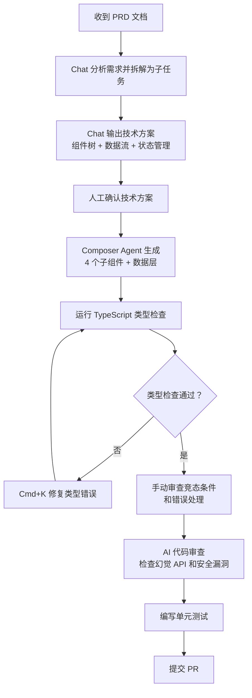
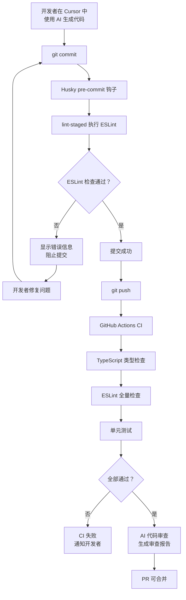

# AI 辅助开发 - 综合场景

> 模块：11-ai-assisted | 共 2 个综合场景

---

## 场景一：从 PRD 到可运行代码的完整 AI 工作流

### 场景描述

你收到一份产品需求文档，需要在一个现有 Vue 3 项目中新增一个"数据看板"功能模块，包含统计卡片、折线图、饼图、数据表格四个子组件，以及数据筛选和导出功能。

### 涉及知识点

- [AI 编程工具与工作流](./01-AI编程工具与工作流.md)（Cursor Composer Agent 多文件生成）
- [Prompt 工程与代码生成](./02-Prompt工程与代码生成.md)（分步 Prompt 策略、Few-shot 示例）
- [AI 代码审查与质量管控](./03-AI代码审查与质量管控.md)（竞态条件检测、AST 拦截）

### 协作流程



### 关键步骤详解

**步骤 1：需求分析与技术方案（Chat）**

```
Prompt：
你是一名前端架构师。请分析以下需求并输出技术方案（不写代码）：

## 需求
在现有 Vue 3 + TypeScript + Pinia + Element Plus 项目中新增"数据看板"模块：
1. 统计卡片（4 个指标卡片，显示总数、增长率、环比）
2. 折线图（近 30 天趋势，支持切换指标）
3. 饼图（分类占比）
4. 数据表格（支持排序、筛选、分页、导出）

## 输出要求
- 组件树结构（Markdown 层级）
- 数据流设计（API → Store → 组件）
- Pinia Store 拆分方案
- 每个组件的 Props/Emits 定义
- 关键的技术选型（图表库、导出方案）
```

**步骤 2：分步生成组件（Composer Agent）**

```
第一步：生成数据层
- API 接口封装（src/api/dashboard.ts）
- Pinia Store（src/stores/dashboard.ts）
- 类型定义（src/types/dashboard.ts）

第二步：生成统计卡片组件
- 参考项目中已有的 Card 组件风格
- 支持 loading 和 error 状态

第三步：生成图表组件
- 使用 ECharts（项目中已有）
- 支持响应式 resize

第四步：生成数据表格 + 导出
- 使用 Element Plus ElTable
- 导出使用 xlsx 库
```

**生成结果：AI 根据好 Prompt 产出的代码示例**

以下代码展示了 AI 在接收到上述分步 Prompt 后生成的典型高质量代码：

```typescript
// src/api/dashboard.ts —— API 接口封装
import request from '@/utils/request';
import type { DashboardOverview, TrendData, CategoryData, TableData } from '@/types/dashboard';

/** 获取统计卡片数据 */
export const fetchOverview = (): Promise<DashboardOverview> => {
  return request.get('/api/dashboard/overview');
};

/** 获取趋势图数据，支持切换指标 */
export const fetchTrend = (params: {
  metric: 'revenue' | 'orders' | 'users';
  days: number;
}, signal?: AbortSignal): Promise<TrendData[]> => {
  return request.get('/api/dashboard/trend', { params, signal });
};

/** 获取分类占比饼图数据 */
export const fetchCategories = (): Promise<CategoryData[]> => {
  return request.get('/api/dashboard/categories');
};

/** 获取数据表格列表 */
export const fetchTableData = (params: {
  page: number;
  pageSize: number;
  sortField?: string;
  sortOrder?: 'asc' | 'desc';
  keyword?: string;
}): Promise<{ list: TableData[]; total: number }> => {
  return request.get('/api/dashboard/table', { params });
};
```

```typescript
// src/stores/dashboard.ts —— Pinia Store（好 Prompt 产出）
import { defineStore } from 'pinia';
import { ref, computed } from 'vue';
import { fetchOverview, fetchTrend, fetchCategories, fetchTableData } from '@/api/dashboard';
import type { DashboardOverview, TrendData, CategoryData, TableData } from '@/types/dashboard';
import { ElMessage } from 'element-plus';

export const useDashboardStore = defineStore('dashboard', () => {
  // 状态
  const overview = ref<DashboardOverview | null>(null);
  const trendData = ref<TrendData[]>([]);
  const categoryData = ref<CategoryData[]>([]);
  const tableList = ref<TableData[]>([]);
  const tableTotal = ref(0);
  const loading = ref(false);
  const trendLoading = ref(false);

  // 当前选中的趋势指标
  const activeMetric = ref<'revenue' | 'orders' | 'users'>('revenue');

  // 计算属性：统计卡片数据
  const cards = computed(() => {
    if (!overview.value) return [];
    return [
      { label: '总营收', value: overview.value.totalRevenue, growth: overview.value.revenueGrowth, unit: '元' },
      { label: '总订单', value: overview.value.totalOrders, growth: overview.value.ordersGrowth, unit: '单' },
      { label: '活跃用户', value: overview.value.activeUsers, growth: overview.value.usersGrowth, unit: '人' },
      { label: '转化率', value: overview.value.conversionRate, growth: overview.value.conversionGrowth, unit: '%' },
    ];
  });

  // 防竞态：为每个请求保存 AbortController
  let trendController: AbortController | null = null;

  /** 获取所有概览数据 */
  const loadOverview = async () => {
    loading.value = true;
    try {
      const [overviewRes, categoryRes, tableRes] = await Promise.all([
        fetchOverview(),
        fetchCategories(),
        fetchTableData({ page: 1, pageSize: 10 }),
      ]);
      overview.value = overviewRes;
      categoryData.value = categoryRes;
      tableList.value = tableRes.list;
      tableTotal.value = tableRes.total;
    } catch (error) {
      ElMessage.error('数据加载失败，请稍后重试');
    } finally {
      loading.value = false;
    }
  };

  /** 获取趋势数据（支持切换指标，带竞态防护） */
  const loadTrend = async () => {
    // 取消上一次未完成的请求，避免竞态
    trendController?.abort();
    // 保存局部引用，避免模块级变量被新请求覆盖后判断失效
    const currentController = new AbortController();
    trendController = currentController;

    trendLoading.value = true;
    try {
      const data = await fetchTrend({ metric: activeMetric.value, days: 30 }, currentController.signal);
      // 仅在请求未被取消时更新状态
      if (!currentController.signal.aborted) {
        trendData.value = data;
      }
    } catch (error: any) {
      if (error?.name !== 'AbortError') {
        ElMessage.error('趋势数据加载失败');
      }
    } finally {
      // 仅在当前请求未被取消时才重置 loading，避免旧请求的 finally 覆盖新请求的状态
      if (!currentController.signal.aborted) {
        trendLoading.value = false;
      }
    }
  };

  /** 切换趋势指标 */
  const switchMetric = (metric: 'revenue' | 'orders' | 'users') => {
    activeMetric.value = metric;
    loadTrend();
  };

  return {
    overview, trendData, categoryData, tableList, tableTotal,
    loading, trendLoading, activeMetric, cards,
    loadOverview, loadTrend, switchMetric,
  };
});
```

```vue
<!-- src/views/dashboard/DashboardView.vue —— 仪表盘页面组件（好 Prompt 产出） -->
<template>
  <div class="dashboard-view" v-loading="store.loading">
    <!-- 统计卡片行 -->
    <el-row :gutter="16" class="card-row">
      <el-col :span="6" v-for="card in store.cards" :key="card.label">
        <StatCard :label="card.label" :value="card.value" :growth="card.growth" :unit="card.unit" />
      </el-col>
    </el-row>

    <!-- 趋势图 + 饼图 -->
    <el-row :gutter="16" class="chart-row">
      <el-col :span="16">
        <TrendChart
          :data="store.trendData"
          :loading="store.trendLoading"
          :metric="store.activeMetric"
          @switch-metric="store.switchMetric"
        />
      </el-col>
      <el-col :span="8">
        <PieChart :data="store.categoryData" />
      </el-col>
    </el-row>

    <!-- 数据表格 -->
    <DataTable
      :list="store.tableList"
      :total="store.tableTotal"
      @page-change="handlePageChange"
      @sort-change="handleSortChange"
      @export="handleExport"
    />
  </div>
</template>

<script setup lang="ts">
import { onMounted } from 'vue';
import { useDashboardStore } from '@/stores/dashboard';
import StatCard from './components/StatCard.vue';
import TrendChart from './components/TrendChart.vue';
import PieChart from './components/PieChart.vue';
import DataTable from './components/DataTable.vue';

const store = useDashboardStore();

onMounted(() => {
  store.loadOverview();
  store.loadTrend();
});

const handlePageChange = (page: number) => { /* 分页逻辑 */ };
const handleSortChange = (sort: { field: string; order: 'asc' | 'desc' }) => { /* 排序逻辑 */ };
const handleExport = () => { /* 导出逻辑 */ };
</script>
```

**差 Prompt vs 好 Prompt 对比**

同样的需求，Prompt 质量不同，AI 产出的代码质量差异巨大：

```typescript
// ❌ 差 Prompt："帮我写一个数据看板页面"
// AI 产出 —— 缺乏类型、无错误处理、无竞态防护、硬编码数据
import { defineStore } from 'pinia';

export const useDashboardStore = defineStore('dashboard', {
  state: () => ({
    data: {} as any,
    list: [] as any[],
  }),
  actions: {
    async fetchData() {
      const res = await fetch('/api/dashboard');
      this.data = await res.json();
    },
  },
});
```

```typescript
// ✓ 好 Prompt：分步指定架构、类型、错误处理、竞态防护（见上方步骤 2 的 Prompt）
// AI 产出 —— 完整的 TypeScript 类型、错误处理、AbortController 竞态防护、ElMessage 用户提示
// （代码见上方 src/stores/dashboard.ts 完整实现）
```

> **生活类比**：AI 编程就像建筑师画图纸——你（开发者）是建筑师，AI 是绘图员。你给绘图员的指令越精确（Prompt 越详细），画出来的图纸（代码）就越符合你的预期。如果你只说"画个房子"，绘图员只能画个方盒子；如果你说"画一个坐北朝南、三室两厅、带落地窗的现代风格住宅"，绘图员才能画出你想要的房子。

**步骤 3：AI 代码审查**

```
审查重点：
1. 竞态条件：图表数据请求是否使用了 AbortController
2. 错误处理：每个 API 调用是否有 try/catch 和用户提示
3. 内存泄漏：ECharts 实例是否在组件卸载时 dispose
4. 类型安全：是否存在 any 类型滥用
```

### 关键要点总结

1. **分步策略是关键**：不要一次性让 AI 生成所有代码，先架构、再数据层、再组件
2. **人工确认不可省略**：每个步骤的输出都需要人工确认正确性
3. **竞态条件是重点**：数据看板通常有多个并发请求，必须处理请求取消
4. **图表库的内存管理**：ECharts 实例必须在 onUnmounted 中 dispose

---

## 场景二：拦截 AI 生成的幻觉代码

### 场景描述

你的团队开始大量使用 AI 编程工具，PR 中经常出现以下问题：
- Vue 3 项目中使用了 `this.$set`（Vue 2 API）
- 导入了 `vue/composition-api`（Vue 3 不需要）
- 未处理的 Promise（`fetch` 返回的 Promise 没有 `await` 或 `.catch`）
- 包含 `debugger` 语句

你需要建立一套自动化防线，在代码提交前拦截这些问题。

### 涉及知识点

- [AI 代码审查与质量管控](./03-AI代码审查与质量管控.md)（AST 自动拦截、自定义 ESLint 规则）
- [工程规范与流程](../07-engineering/02-工程规范与流程.md)（CI/CD 集成）

### 协作流程



### 关键步骤详解

**步骤 1：安装和配置 ESLint 插件**

```bash
pnpm add -D eslint @typescript-eslint/parser @typescript-eslint/eslint-plugin
pnpm add -D eslint-plugin-vue
```

**步骤 2：创建自定义 ESLint 规则**

```javascript
// eslint-local-rules/no-ai-hallucination.js
module.exports = {
  meta: { type: 'problem', docs: { description: '拦截 AI 幻觉代码' } },
  create(context) {
    return {
      // 拦截 Vue 2 语法
      CallExpression(node) {
        if (node.callee.type === 'MemberExpression') {
          const obj = node.callee.object;
          const prop = node.callee.property;
          const blocked = [
            { object: 'Vue', property: 'set' },
            { object: 'Vue', property: 'delete' },
            { object: 'Vue', property: 'extend' },
            { object: 'Vue', property: 'filter' },
            { object: 'this', property: '$set' },
            { object: 'this', property: '$delete' },
          ];
          for (const b of blocked) {
            if (obj.name === b.object && prop.name === b.property) {
              context.report({
                node,
                message: `'${b.object}.${b.property}' 是 Vue 2 的 API，Vue 3 中已移除。请使用 Vue 3 替代方案。`,
              });
            }
          }
        }
      },
      // 拦截过时的导入
      ImportDeclaration(node) {
        const blocked = ['vue/composition-api', '@vue/composition-api'];
        if (blocked.includes(node.source.value)) {
          context.report({
            node,
            message: `'${node.source.value}' 在 Vue 3 中不需要。Vue 3 已内置 Composition API。`,
          });
        }
      },
    };
  },
};
```

**步骤 3：配置 Husky + lint-staged**

```json
// package.json
{
  "lint-staged": {
    "*.{ts,vue}": ["eslint --fix", "prettier --write"],
    "*.{ts,tsx}": [() => "tsc --noEmit"]
  }
}
```

**步骤 4：CI 流水线集成**

```yaml
# .github/workflows/ci.yml
name: Quality Gate
on: [push, pull_request]
jobs:
  quality:
    runs-on: ubuntu-latest
    steps:
      - uses: actions/checkout@v4
      - uses: actions/setup-node@v4
      - run: pnpm install
      - run: pnpm typecheck
      - run: pnpm lint
      - run: pnpm test
```

### 关键要点总结

1. **多层防线**：本地 pre-commit（快速拦截）+ CI 全量检查（深度扫描）+ AI 审查（语义分析）
2. **黑名单持续更新**：每次发现新的 AI 幻觉模式，立即添加到 blockedPatterns 中
3. **误报宽容处理**：自定义规则可能产生误报，提供 `// eslint-disable-next-line` 注释作为逃生口
4. **团队共识**：规则配置需要团队评审，确保拦截的是"真正的问题"而非"风格偏好"

---

## 常见错误

### 1. Prompt 过长导致 AI 忽略关键约束

AI 模型的上下文窗口虽然很大，但注意力机制存在"中间丢失"现象——Prompt 中段的信息容易被模型忽略。如果你把 20 个需求点全部塞进一个 Prompt，AI 往往会遗漏中间的几个约束。

**错误示例**：

```
帮我写一个数据看板，包含 4 个统计卡片，卡片要支持 loading、error、empty 三种状态，
折线图要支持 5 种指标切换且要加动画，饼图要支持钻取，表格要支持排序、筛选、分页、
行内编辑、批量操作、导出 Excel、导出 PDF，还要支持暗黑模式、国际化、响应式布局、
权限控制、操作日志、数据缓存……
```

**解决方案**：将长 Prompt 拆分为多个短 Prompt，按优先级分步生成。先完成核心功能（卡片 + 图表 + 表格），再逐步追加高级特性（导出、暗黑模式、国际化等）。

### 2. 完全信任 AI 生成的代码不做审查

AI 生成的代码"看起来能跑"不等于"真的能跑"。常见隐蔽问题包括：API 路径拼写错误、参数类型不匹配、缺少边界条件处理、内存泄漏等。

**错误示例**：

```typescript
// AI 生成的代码，看似没问题但实际有 bug
const data = computed(() => {
  return store.list.filter(item => item.status === filter.value); // filter 为 undefined 时报错
});
```

**解决方案**：
- 每次 AI 生成代码后，立即运行 `pnpm typecheck` 和 `pnpm lint` 进行静态检查
- 人工审查关键逻辑：竞态条件、错误处理、内存管理（如 ECharts 实例的 dispose）
- 配合场景二中提到的自定义 ESLint 规则，在提交前自动拦截常见问题

### 3. AI 使用了不存在的 API（幻觉）

AI 模型可能"编造"看起来很合理但实际不存在的 API。例如，Vue 3 项目中使用 `this.$set`、导入 `vue/composition-api`、调用 Element Plus 中不存在的组件属性等。

**错误示例**：

```typescript
// ❌ AI 幻觉：Vue 3 中不存在 this.$set
this.$set(this.formData, 'remark', '');

// ❌ AI 幻觉：Element Plus 中 ElTable 没有 columns 这个 prop
<el-table :columns="columns" />
```

**解决方案**：
- 在项目中配置场景二中提到的 `no-ai-hallucination` 自定义 ESLint 规则，自动拦截已知的幻觉 API
- 对 AI 生成的不熟悉的 API，立即查阅官方文档确认
- 维护团队级别的"幻觉 API 黑名单"，持续更新拦截规则

### 4. AI 生成的代码缺少竞态处理

在多请求并发的场景（如数据看板同时请求多个图表数据），AI 常常忽略竞态条件。用户快速切换筛选条件时，后发的请求可能先返回，导致页面显示的是旧数据。

**错误示例**：

```typescript
// ❌ 无竞态防护：快速切换指标时，旧请求的结果可能覆盖新请求
const loadTrend = async () => {
  trendLoading.value = true;
  const data = await fetchTrend({ metric: activeMetric.value });
  trendData.value = data; // 可能设置了旧请求的返回结果
  trendLoading.value = false;
};
```

**解决方案**：使用 `AbortController` 取消上一次未完成的请求（参考场景一中 `src/stores/dashboard.ts` 的完整实现）。