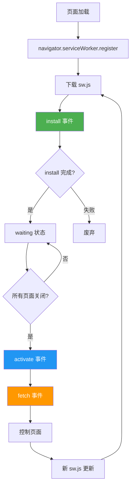

> 模块：12-cross-platform（拓展 跨端开发）
> 难度：★★★ 架构进阶
> 前置知识：Service Worker 概念、HTML/CSS/JS 基础

---

# 03-PWA与WebComponents

---

## 一、核心概念

### 1.1 PWA 核心能力

PWA（Progressive Web App）的目标用一句话概括：**把网站变成 App**。它通过一系列 Web 标准技术，让普通网页获得类似原生应用的体验。

| 核心能力 | 说明 | 关键 API |
|---|---|---|
| **离线访问** | 无网络时也能打开页面，显示缓存内容 | Service Worker + Cache API |
| **安装到桌面** | 像原生 App 一样在桌面/主屏幕生成图标 | Web App Manifest |
| **推送通知** | 即使浏览器关闭也能接收服务端推送 | Push API + Notification API |
| **后台同步** | 在网络恢复后自动完成之前失败的操作 | Background Sync API |
| **全屏体验** | 隐藏浏览器 UI，沉浸式体验 | `display: standalone` + Fullscreen API |
| **内容分享** | 调用系统原生分享面板，分享文本/链接/文件 | Web Share API (`navigator.share()`) |

**PWA 的判定标准**（Google Lighthouse PWA 审计）：

1. 注册了 Service Worker 并能离线工作
2. 提供有效的 `manifest.json`
3. 通过 HTTPS 提供服务（localhost 除外）
4. 响应式设计，适配移动端
5. 页面加载足够快（First Contentful Paint < 2.5s）
6. 每个页面有独立 URL，可被深度链接
7. 页面间导航流畅，无白屏闪烁

```html
<!-- 1. 引入 manifest.json -->
<link rel="manifest" href="/manifest.json" />

<!-- 2. 设置主题色 -->
<meta name="theme-color" content="#4A90D9" />

<!-- 3. 注册 Service Worker -->
<script>
  if ('serviceWorker' in navigator) {
    window.addEventListener('load', () => {
      navigator.serviceWorker.register('/sw.js');
    });
  }
</script>
```

**Web Share API 使用示例**：

```javascript
// Web Share API 允许 PWA 调用系统原生分享面板
// 支持分享文本、URL 和文件（取决于浏览器实现）

// 基本用法：分享文本和链接
async function shareContent() {
  if (!navigator.share) {
    console.warn('当前浏览器不支持 Web Share API');
    return;
  }

  try {
    await navigator.share({
      title: '龙江交易平台',
      text: '查看最新的交易数据和分析报告',
      url: window.location.href,
    });
    console.log('分享成功');
  } catch (error) {
    if (error.name !== 'AbortError') {
      console.error('分享失败:', error);
    }
    // AbortError 表示用户取消了分享操作，这属于正常行为
  }
}

// 分享文件（需要 navigator.canShare 检测）
async function shareFile(file) {
  if (!navigator.share || !navigator.canShare) {
    console.warn('当前浏览器不支持文件分享');
    return;
  }

  const shareData = {
    title: '分享文件',
    text: '查看这份文件',
    files: [file],
  };

  if (navigator.canShare(shareData)) {
    try {
      await navigator.share(shareData);
    } catch (error) {
      console.error('分享失败:', error);
    }
  } else {
    console.warn('不支持分享此文件类型');
  }
}
```

**Web Share API 兼容性说明**：

| 平台 | 支持情况 | 备注 |
|---|---|---|
| Chrome (Android) | 完全支持 | 支持文本、URL 和文件分享 |
| Chrome (Desktop) | 完全支持 | 72+ 版本开始支持 |
| Safari (iOS) | 部分支持 | 支持文本和 URL，文件分享需要 15.0+ |
| Safari (macOS) | 部分支持 | 12.0+ 支持文本和 URL |
| Firefox (Android) | 不支持 | 暂无支持计划 |
| Firefox (Desktop) | 不支持 | 可通过 `about:config` 开启实验性支持 |
| Edge | 完全支持 | 基于 Chromium，与 Chrome 一致 |

> **注意事项**：
> 1. `navigator.share()` 必须由用户手势触发（如点击事件），不能在页面加载时自动调用
> 2. 分享操作返回 Promise，用户取消分享会抛出 `AbortError`，属于正常流程
> 3. 使用 `navigator.canShare()` 检测文件分享是否被支持
> 4. HTTPS 环境下才可用（localhost 除外）

### 1.2 Web Components 三件套

Web Components 是一套浏览器原生支持的组件化技术标准，由三个核心技术组成：

| 技术 | 作用 | 类比 |
|---|---|---|
| **Custom Elements** | 自定义 HTML 标签，定义元素行为和生命周期 | 自定义积木块的形状和行为 |
| **Shadow DOM** | 封装组件的内部 DOM 和样式，与外部隔离 | 积木块内部的机械结构，外部看不到 |
| **HTML Templates** | 声明式定义可复用的 DOM 片段模板 | 积木块的模具，可批量生产 |

```html
<!-- Custom Elements + Shadow DOM + HTML Templates 示例 -->
<!-- 1. 定义模板 -->
<template id="user-card-template">
  <style>
    .card {
      border: 1px solid #e0e0e0;
      border-radius: 8px;
      padding: 16px;
      font-family: sans-serif;
    }
    .name { font-size: 18px; font-weight: bold; }
    .email { color: #666; }
  </style>
  <div class="card">
    <div class="name"><slot name="name">Unknown</slot></div>
    <div class="email"><slot name="email">No email</slot></div>
  </div>
</template>

<!-- 2. 定义 Custom Element -->
<script>
  class UserCard extends HTMLElement {
    constructor() {
      super();
      const template = document.getElementById('user-card-template');
      const shadowRoot = this.attachShadow({ mode: 'open' });
      shadowRoot.appendChild(template.content.cloneNode(true));
    }
  }
  customElements.define('user-card', UserCard);
</script>

<!-- 3. 使用 -->
<user-card>
  <span slot="name">张三</span>
  <span slot="email">zhangsan@example.com</span>
</user-card>
```

### 1.3 PWA 与跨端开发的关系

PWA 和跨端开发有着天然的联系：PWA 提供**跨平台能力**（一套代码运行在 Web、Android、iOS、桌面），同时提供**原生体验**（离线、安装、推送）。

| 方案 | 跨平台能力 | 原生体验 | 分发方式 | 开发成本 |
|---|---|---|---|---|
| **PWA** | 全部支持浏览器的平台 | 接近原生 | 无需应用商店 | 低 |
| React Native | iOS + Android | 原生 | 应用商店 | 中 |
| Flutter | iOS + Android + Web + Desktop | 原生 | 应用商店 | 中 |
| uniapp | iOS + Android + 小程序 | 接近原生 | 应用商店 | 低 |

---

## 二、底层原理

### 2.1 Service Worker 生命周期

Service Worker 的生命周期分为四个阶段：install、waiting、activate、fetch。



```javascript
// sw.js —— Service Worker 完整生命周期
const CACHE_NAME = 'app-cache-v1';
const URLS_TO_CACHE = [
  '/',
  '/index.html',
  '/styles/main.css',
  '/scripts/app.js',
  '/images/logo.png',
];

// 1. install 事件：预缓存关键资源
self.addEventListener('install', (event) => {
  console.log('[SW] Installing...');
  event.waitUntil(
    caches.open(CACHE_NAME).then((cache) => {
      console.log('[SW] Caching app shell');
      return cache.addAll(URLS_TO_CACHE);
    }).then(() => {
      // 强制跳过等待，立即激活
      return self.skipWaiting();
    })
  );
});

// 2. activate 事件：清理旧缓存
self.addEventListener('activate', (event) => {
  console.log('[SW] Activating...');
  event.waitUntil(
    caches.keys().then((cacheNames) => {
      return Promise.all(
        cacheNames
          .filter((name) => name !== CACHE_NAME)
          .map((name) => {
            console.log('[SW] Deleting old cache:', name);
            return caches.delete(name);
          })
      );
    }).then(() => {
      // 立即接管所有页面
      return self.clients.claim();
    })
  );
});

// 3. fetch 事件：拦截网络请求
self.addEventListener('fetch', (event) => {
  event.respondWith(
    caches.match(event.request).then((cachedResponse) => {
      // 缓存命中：返回缓存
      if (cachedResponse) {
        return cachedResponse;
      }
      // 缓存未命中：发起网络请求
      return fetch(event.request).then((response) => {
        // 将成功的响应加入缓存
        if (response.ok) {
          const responseClone = response.clone();
          caches.open(CACHE_NAME).then((cache) => {
            cache.put(event.request, responseClone);
          });
        }
        return response;
      });
    })
  );
});
```

### 2.2 Push API 订阅与推送

Push API 允许服务端在 PWA 未打开时向用户推送通知，是 PWA 实现原生 App 级别推送能力的关键。

```javascript
// ========== 客户端：订阅推送通知 ==========
// push-subscribe.js

// 1. 申请通知权限
async function requestNotificationPermission() {
  if (!('Notification' in window)) {
    console.warn('当前浏览器不支持 Notification API');
    return false;
  }

  const permission = await Notification.requestPermission();
  if (permission === 'granted') {
    console.log('通知权限已获取');
    return true;
  } else {
    console.warn('用户拒绝了通知权限');
    return false;
  }
}

// 2. 订阅推送服务
async function subscribeToPush(swRegistration) {
  try {
    // 获取 VAPID 公钥（服务端生成，用于标识应用）
    const vapidPublicKey = 'BEl62iIYtU...'; // 从服务端获取

    const subscription = await swRegistration.pushManager.subscribe({
      userVisibleOnly: true, // 必须为 true，浏览器要求每次推送都显示通知
      applicationServerKey: urlBase64ToUint8Array(vapidPublicKey),
    });

    console.log('推送订阅成功:', subscription);
    // 将 subscription 对象发送到服务端保存，用于后续推送
    await fetch('/api/push/subscribe', {
      method: 'POST',
      headers: { 'Content-Type': 'application/json' },
      body: JSON.stringify(subscription),
    });

    return subscription;
  } catch (error) {
    console.error('推送订阅失败:', error);
    return null;
  }
}

// 3. 取消订阅
async function unsubscribeFromPush(swRegistration) {
  const subscription = await swRegistration.pushManager.getSubscription();
  if (subscription) {
    await subscription.unsubscribe();
    await fetch('/api/push/unsubscribe', {
      method: 'POST',
      headers: { 'Content-Type': 'application/json' },
      body: JSON.stringify({ endpoint: subscription.endpoint }),
    });
    console.log('已取消推送订阅');
  }
}

// 工具函数：将 Base64 VAPID 公钥转为 Uint8Array
function urlBase64ToUint8Array(base64String) {
  const padding = '='.repeat((4 - (base64String.length % 4)) % 4);
  const base64 = (base64String + padding).replace(/-/g, '+').replace(/_/g, '/');
  const rawData = atob(base64);
  const outputArray = new Uint8Array(rawData.length);
  for (let i = 0; i < rawData.length; ++i) {
    outputArray[i] = rawData.charCodeAt(i);
  }
  return outputArray;
}

// 4. 完整订阅流程
async function initPushNotifications() {
  if (!('serviceWorker' in navigator) || !('PushManager' in window)) {
    console.warn('当前浏览器不支持推送通知');
    return;
  }

  const registration = await navigator.serviceWorker.ready;
  const hasPermission = await requestNotificationPermission();
  if (hasPermission) {
    await subscribeToPush(registration);
  }
}

// ========== Service Worker：接收推送事件 ==========
// sw.js 中添加 push 事件监听

self.addEventListener('push', (event) => {
  if (!event.data) {
    console.warn('收到空推送消息');
    return;
  }

  const data = event.data.json();
  const options = {
    body: data.body,
    icon: '/images/icon-192x192.png',
    badge: '/images/badge-72x72.png',
    vibrate: [200, 100, 200],
    data: {
      url: data.url || '/',
      timestamp: Date.now(),
    },
    actions: data.actions || [
      { action: 'open', title: '查看详情' },
      { action: 'close', title: '关闭' },
    ],
    tag: data.tag || 'default', // 相同 tag 的通知会替换旧通知
    renotify: true,
  };

  event.waitUntil(
    self.registration.showNotification(data.title, options)
  );
});

// 通知点击事件
self.addEventListener('notificationclick', (event) => {
  event.notification.close();

  const urlToOpen = event.notification.data?.url || '/';
  event.waitUntil(
    clients.matchAll({ type: 'window', includeUncontrolled: true })
      .then((windowClients) => {
        // 如果已有打开的窗口，聚焦并导航
        for (const client of windowClients) {
          if (client.url === urlToOpen && 'focus' in client) {
            return client.focus();
          }
        }
        // 否则打开新窗口
        if (clients.openWindow) {
          return clients.openWindow(urlToOpen);
        }
      })
  );
});

// ========== 服务端（Node.js）：发送推送通知 ==========
// 使用 web-push 库发送推送
// pnpm add web-push
// import webpush from 'web-push';
//
// // 设置 VAPID 密钥
// webpush.setVapidDetails(
//   'mailto:admin@example.com',
//   process.env.VAPID_PUBLIC_KEY,
//   process.env.VAPID_PRIVATE_KEY
// );
//
// // 向指定订阅发送推送
// async function sendPushNotification(subscription, payload) {
//   try {
//     await webpush.sendNotification(subscription, JSON.stringify(payload));
//     console.log('推送发送成功');
//   } catch (error) {
//     if (error.statusCode === 410) {
//       // 订阅已过期，需要从数据库移除
//       console.log('订阅已过期，需要清理');
//     } else {
//       console.error('推送发送失败:', error);
//     }
//   }
// }
```

> **注意事项**：
> 1. Push API 仅在 HTTPS 环境下可用（localhost 除外）
> 2. 用户必须主动授予通知权限，`Notification.requestPermission()` 必须由用户手势触发
> 3. VAPID（Voluntary Application Server Identification）密钥对用于服务端身份验证，避免推送服务被滥用
> 4. 不同浏览器的推送服务不同（Chrome 使用 FCM，Firefox 使用 Mozilla Autopush），但 Push API 屏蔽了这些差异
> 5. 订阅对象（subscription）中包含 `endpoint` 和 `keys`（p256dh、auth），需要安全地存储在服务端

### 2.3 缓存策略

Service Worker 的缓存策略决定了在离线/弱网环境下的行为。选择正确的策略至关重要。

| 策略 | 工作流程 | 适用场景 | 网络请求 | 缓存更新 |
|---|---|---|---|---|
| **Cache First** | 先查缓存，缓存未命中才请求网络 | 静态资源（CSS/JS/图片/字体） | 仅缓存未命中时 | 需更新 SW 版本 |
| **Network First** | 先请求网络，失败后回退到缓存 | API 数据、需要新鲜度的内容 | 总是优先 | 网络成功后更新 |
| **Stale-While-Revalidate** | 立即返回缓存，同时后台更新缓存 | 不要求实时性的数据 | 后台更新 | 自动更新 |
| **Network Only** | 只请求网络，不使用缓存 | 实时数据、在线支付 | 总是 | 不缓存 |
| **Cache Only** | 只使用缓存，不请求网络 | 预缓存的静态资源 | 从不 | 不更新 |

```javascript
// sw.js —— 四种缓存策略实现

// ============ 策略 1: Cache First ============
async function cacheFirst(request) {
  const cached = await caches.match(request);
  if (cached) return cached;
  const response = await fetch(request);
  const cache = await caches.open('static-cache-v1');
  cache.put(request, response.clone());
  return response;
}

// ============ 策略 2: Network First ============
async function networkFirst(request) {
  try {
    const response = await fetch(request);
    const cache = await caches.open('dynamic-cache-v1');
    cache.put(request, response.clone());
    return response;
  } catch {
    const cached = await caches.match(request);
    if (cached) return cached;
    // 返回离线回退页面
    return caches.match('/offline.html');
  }
}

// ============ 策略 3: Stale-While-Revalidate ============
async function staleWhileRevalidate(request) {
  const cache = await caches.open('dynamic-cache-v1');
  const cached = await cache.match(request);

  // 后台更新缓存（不阻塞响应）
  const fetchPromise = fetch(request).then((response) => {
    cache.put(request, response.clone());
    return response;
  });

  // 立即返回缓存，若无缓存则等待网络请求
  return cached ?? fetchPromise;
}

// ============ 策略 4: Network Only ============
async function networkOnly(request) {
  return fetch(request);
}

// ============ 策略 5: Cache Only ============
async function cacheOnly(request) {
  const cached = await caches.match(request);
  if (cached) return cached;
  // 缓存未命中时返回离线回退页面或抛出错误
  // 该策略适用于预缓存的静态资源（如图标、字体等），这些资源在 install 阶段已加入缓存
  return caches.match('/offline.html');
}

// ============ 路由分发：根据请求类型选择策略 ============
self.addEventListener('fetch', (event) => {
  const { request } = event;
  const url = new URL(request.url);

  // 静态资源：Cache First
  if (
    request.destination === 'style' ||
    request.destination === 'script' ||
    request.destination === 'image' ||
    request.destination === 'font'
  ) {
    event.respondWith(cacheFirst(request));
    return;
  }

  // 导航请求（HTML 页面）：Network First
  if (request.mode === 'navigate') {
    event.respondWith(networkFirst(request));
    return;
  }

  // API 请求：Stale-While-Revalidate
  if (url.pathname.startsWith('/api/')) {
    event.respondWith(staleWhileRevalidate(request));
    return;
  }

  // 其他请求：Network First
  event.respondWith(networkFirst(request));
});
```

### 2.4 Shadow DOM 隔离原理

Shadow DOM 提供**样式隔离**和 **DOM 隔离**两种隔离能力，确保组件内部的样式和 DOM 结构不会影响外部，反之亦然。

```javascript
// Shadow DOM 隔离原理详解
class IsolatedComponent extends HTMLElement {
  constructor() {
    super();

    // mode: 'open' vs 'closed'
    // open: 外部可通过 element.shadowRoot 访问 Shadow DOM
    // closed: 外部无法访问 Shadow DOM（更安全，但调试困难）
    const shadow = this.attachShadow({ mode: 'open' });

    shadow.innerHTML = `
      <style>
        /* 1. 样式隔离：这里定义的样式不会影响外部 DOM */
        p { color: blue; }
        .container { border: 1px solid #ccc; }

        /* 2. :host 选择器：选择 Shadow DOM 的宿主元素 */
        :host { display: block; margin: 10px; }
        :host(.highlight) { border-color: gold; }

        /* 3. :host-context 选择器：根据宿主祖先元素决定样式 */
        :host-context(.dark-theme) { color: white; }

        /* 4. ::slotted() 选择器：选择通过 slot 传入的 Light DOM 元素 */
        ::slotted(span) { font-weight: bold; }
      </style>
      <div class="container">
        <p>Shadow DOM 内部段落 - 蓝色</p>
        <slot name="header"></slot>
        <slot></slot>
      </div>
    `;
  }
}

customElements.define('isolated-component', IsolatedComponent);

// 使用示例
// <isolated-component class="highlight">
//   <span slot="header">标题</span>
//   <p>这段内容通过 slot 传入，不受 Shadow DOM 样式影响</p>
// </isolated-component>
```

**Shadow DOM 隔离机制总结**：

| 隔离类型 | 机制 | 说明 |
|---|---|---|
| 样式隔离 | Shadow DOM 内部的 CSS 不会泄漏到外部 | 外部 CSS 也不会影响 Shadow DOM 内部（除继承属性外） |
| DOM 隔离 | Shadow DOM 内部的 DOM 节点不在主文档树中 | `document.querySelector` 无法选中 Shadow DOM 内部节点 |
| 事件重定向 | Shadow DOM 内部触发的事件，`event.target` 会被重定向为宿主元素 | 外部监听器无法获取内部真实目标 |
| 插槽投影 | `<slot>` 元素将 Light DOM 节点投影到 Shadow DOM 中 | 投影的节点仍属于 Light DOM，样式由外部控制 |

### 2.5 Declarative Shadow DOM

Declarative Shadow DOM 是 Shadow DOM 的**声明式创建方式**，直接在 HTML 中通过 `<template shadowrootmode="open">` 定义，不需要 JavaScript。这对于 SSR（服务端渲染）场景至关重要。

```html
<!-- Declarative Shadow DOM：服务端渲染友好 -->
<user-card>
  <template shadowrootmode="open">
    <style>
      .card {
        border: 1px solid #e0e0e0;
        border-radius: 8px;
        padding: 16px;
      }
      .name { font-size: 18px; font-weight: bold; }
      .email { color: #666; }
    </style>
    <div class="card">
      <div class="name"><slot name="name">Unknown</slot></div>
      <div class="email"><slot name="email">No email</slot></div>
    </div>
  </template>
  <span slot="name">张三</span>
  <span slot="email">zhangsan@example.com</span>
</user-card>
```

```javascript
// 服务端生成 Declarative Shadow DOM
// Node.js 服务端代码
function renderUserCard(user) {
  return `
    <user-card>
      <template shadowrootmode="open">
        <style>
          .card { border: 1px solid #e0e0e0; border-radius: 8px; padding: 16px; }
          .name { font-size: 18px; font-weight: bold; }
          .email { color: #666; }
        </style>
        <div class="card">
          <div class="name"><slot name="name">Unknown</slot></div>
          <div class="email"><slot name="email">No email</slot></div>
        </div>
      </template>
      <span slot="name">${user.name}</span>
      <span slot="email">${user.email}</span>
    </user-card>
  `;
}
```

> 📖 **参考链接**：
> - [MDN - Service Worker API](https://developer.mozilla.org/zh-CN/docs/Web/API/Service_Worker_API)
> - [MDN - Web Components](https://developer.mozilla.org/zh-CN/docs/Web/API/Web_components)
> - [MDN - ShadowRoot](https://developer.mozilla.org/zh-CN/docs/Web/API/ShadowRoot)
> - [MDN - CustomElementRegistry](https://developer.mozilla.org/zh-CN/docs/Web/API/CustomElementRegistry)

---

## 三、实战应用

### 3.1 PWA 从零到一

完整的 PWA 实现：manifest.json 配置 + Service Worker 注册 + 缓存策略。

```json
// public/manifest.json —— Web App Manifest
{
  "name": "我的 PWA 应用",
  "short_name": "PWA",
  "description": "一个从零到一的 PWA 应用示例",
  "start_url": "/",
  "scope": "/",
  "display": "standalone",
  "orientation": "portrait-primary",
  "background_color": "#ffffff",
  "theme_color": "#4A90D9",
  "icons": [
    {
      "src": "/icons/icon-192.png",
      "sizes": "192x192",
      "type": "image/png",
      "purpose": "any"
    },
    {
      "src": "/icons/icon-512.png",
      "sizes": "512x512",
      "type": "image/png",
      "purpose": "any maskable"
    }
  ],
  "screenshots": [
    {
      "src": "/screenshots/home.png",
      "sizes": "1280x720",
      "type": "image/png",
      "form_factor": "wide"
    }
  ],
  "categories": ["productivity", "utilities"],
  "related_applications": [],
  "prefer_related_applications": false
}
```

```javascript
// public/sw.js —— Service Worker
const CACHE_NAME = 'pwa-app-v1';
const STATIC_CACHE = [
  '/',
  '/index.html',
  '/styles/main.css',
  '/scripts/app.js',
  '/offline.html',
];

// install: 预缓存关键资源
self.addEventListener('install', (event) => {
  event.waitUntil(
    caches.open(CACHE_NAME).then((cache) => cache.addAll(STATIC_CACHE))
  );
  self.skipWaiting();
});

// activate: 清理旧缓存
self.addEventListener('activate', (event) => {
  event.waitUntil(
    caches.keys().then((keys) =>
      Promise.all(keys.filter((k) => k !== CACHE_NAME).map((k) => caches.delete(k)))
    )
  );
  self.clients.claim();
});

// fetch: 使用 Stale-While-Revalidate 策略
self.addEventListener('fetch', (event) => {
  event.respondWith(
    caches.match(event.request).then((cached) => {
      const fetchPromise = fetch(event.request)
        .then((response) => {
          caches.open(CACHE_NAME).then((cache) => cache.put(event.request, response.clone()));
          return response;
        })
        .catch(() => cached ?? caches.match('/offline.html'));
      return cached ?? fetchPromise;
    })
  );
});
```

```html
<!-- public/index.html —— PWA 入口页面 -->
<!DOCTYPE html>
<html lang="zh-CN">
<head>
  <meta charset="UTF-8" />
  <meta name="viewport" content="width=device-width, initial-scale=1.0" />
  <meta name="theme-color" content="#4A90D9" />
  <link rel="manifest" href="/manifest.json" />
  <link rel="apple-touch-icon" href="/icons/icon-192.png" />
  <title>我的 PWA 应用</title>
</head>
<body>
  <div id="app">
    <h1>PWA 从零到一</h1>
    <p id="status">正在检查 PWA 状态...</p>
  </div>

  <script>
    // 注册 Service Worker
    if ('serviceWorker' in navigator) {
      window.addEventListener('load', async () => {
        try {
          const registration = await navigator.serviceWorker.register('/sw.js');
          console.log('[PWA] SW registered:', registration.scope);

          // 监听更新
          registration.addEventListener('updatefound', () => {
            const newWorker = registration.installing;
            newWorker?.addEventListener('statechange', () => {
              if (newWorker.state === 'installed' && navigator.serviceWorker.controller) {
                const statusEl = document.getElementById('status');
                if (statusEl) statusEl.textContent = '有新版本可用，请刷新页面';
              }
            });
          });
        } catch (error) {
          console.error('[PWA] SW registration failed:', error);
        }
      });
    }

    // 检测安装状态
    window.addEventListener('beforeinstallprompt', (event) => {
      event.preventDefault();
      const statusEl = document.getElementById('status');
      if (statusEl) statusEl.textContent = '点击安装 PWA 应用';
      // 保存事件，后续在用户点击安装按钮时触发
      window.deferredPrompt = event;
    });

    window.addEventListener('appinstalled', () => {
      const statusEl = document.getElementById('status');
      if (statusEl) statusEl.textContent = 'PWA 已安装！';
    });
  </script>
</body>
</html>
```

### 3.2 使用 Workbox 简化 Service Worker 开发

Workbox 是 Google 提供的 Service Worker 工具库，简化了预缓存、运行时缓存、后台同步等常见模式。

```bash
# 安装 Workbox
pnpm add -D workbox-webpack-plugin  # Webpack 插件
# 或
pnpm add -D vite-plugin-pwa        # Vite 插件
```

```javascript
// vite.config.ts —— Vite PWA 插件配置
import { defineConfig } from 'vite';
import { VitePWA } from 'vite-plugin-pwa';

export default defineConfig({
  plugins: [
    VitePWA({
      registerType: 'autoUpdate',
      // Workbox 配置
      workbox: {
        globPatterns: ['**/*.{js,css,html,ico,png,svg,woff2}'],
        // 运行时缓存策略
        runtimeCaching: [
          {
            // API 请求：Network First
            urlPattern: /^https:\/\/api\.example\.com\/.*/,
            handler: 'NetworkFirst',
            options: {
              cacheName: 'api-cache',
              expiration: { maxEntries: 100, maxAgeSeconds: 60 * 60 * 24 },
            },
          },
          {
            // 图片：Cache First
            urlPattern: /\.(?:png|jpg|jpeg|gif|webp|svg)$/,
            handler: 'CacheFirst',
            options: {
              cacheName: 'image-cache',
              expiration: { maxEntries: 200, maxAgeSeconds: 60 * 60 * 24 * 30 },
            },
          },
          {
            // 字体：Cache First
            urlPattern: /\.(?:woff|woff2|ttf|eot)$/,
            handler: 'CacheFirst',
            options: {
              cacheName: 'font-cache',
              expiration: { maxEntries: 50, maxAgeSeconds: 60 * 60 * 24 * 365 },
            },
          },
        ],
      },
      // Manifest 配置
      manifest: {
        name: 'Workbox PWA',
        short_name: 'PWA',
        theme_color: '#4A90D9',
        icons: [
          { src: '/icons/icon-192.png', sizes: '192x192', type: 'image/png' },
          { src: '/icons/icon-512.png', sizes: '512x512', type: 'image/png' },
        ],
      },
    }),
  ],
});
```

```javascript
// 使用 Workbox 的 Background Sync
// sw.js
import { BackgroundSyncPlugin } from 'workbox-background-sync';
import { registerRoute } from 'workbox-routing';
import { NetworkOnly } from 'workbox-strategies';

// 创建后台同步插件
const bgSyncPlugin = new BackgroundSyncPlugin('apiQueue', {
  maxRetentionTime: 24 * 60, // 最多保留 24 小时
});

// 对 POST 请求使用 NetworkOnly + 后台同步
registerRoute(
  ({ url, request }) => url.pathname.startsWith('/api/') && request.method === 'POST',
  new NetworkOnly({
    plugins: [bgSyncPlugin],
  }),
  'POST'
);
```

### 3.3 Web Components 实战（使用 Lit 3.0）

Lit 是 Google 开发的轻量级 Web Components 框架，提供了响应式状态管理、声明式模板和高效的 DOM 更新。

```bash
# 安装 Lit
pnpm add lit
```

```typescript
// src/components/custom-button.ts —— 使用 Lit 3.0 创建自定义按钮
import { LitElement, html, css } from 'lit';
import { customElement, property, state } from 'lit/decorators.js';

@customElement('custom-button')
export class CustomButton extends LitElement {
  // 声明式样式
  static styles = css`
    :host {
      display: inline-block;
    }
    button {
      padding: 10px 24px;
      border: none;
      border-radius: 6px;
      font-size: 16px;
      font-weight: 500;
      cursor: pointer;
      transition: all 0.2s ease;
      display: inline-flex;
      align-items: center;
      gap: 8px;
    }
    button:disabled {
      opacity: 0.5;
      cursor: not-allowed;
    }
    /* 支持变体 */
    :host([variant="primary"]) button {
      background: #4A90D9;
      color: white;
    }
    :host([variant="primary"]) button:hover:not(:disabled) {
      background: #357ABD;
    }
    :host([variant="secondary"]) button {
      background: #f0f0f0;
      color: #333;
    }
    :host([variant="secondary"]) button:hover:not(:disabled) {
      background: #e0e0e0;
    }
    :host([variant="danger"]) button {
      background: #E74C3C;
      color: white;
    }
    :host([variant="danger"]) button:hover:not(:disabled) {
      background: #C0392B;
    }
    /* 支持尺寸 */
    :host([size="small"]) button { padding: 6px 16px; font-size: 14px; }
    :host([size="large"]) button { padding: 14px 32px; font-size: 18px; }
  `;

  // 属性（可从外部设置）
  @property({ type: String }) variant: 'primary' | 'secondary' | 'danger' = 'primary';
  @property({ type: String }) size: 'small' | 'medium' | 'large' = 'medium';
  @property({ type: Boolean }) disabled = false;
  @property({ type: Boolean }) loading = false;

  // 内部状态
  @state() private _clickCount = 0;

  // 渲染
  render() {
    return html`
      <button
        ?disabled=${this.disabled || this.loading}
        @click=${this._handleClick}
      >
        ${this.loading
          ? html`<span class="spinner"></span> 加载中...`
          : html`<slot></slot>`
        }
      </button>
    `;
  }

  private _handleClick(e: Event) {
    this._clickCount++;
    // 派发自定义事件
    this.dispatchEvent(new CustomEvent('button-click', {
      detail: { count: this._clickCount },
      bubbles: true,
      composed: true, // 穿透 Shadow DOM 边界
    }));
  }
}
```

```html
<!-- 使用自定义按钮 -->
<custom-button variant="primary" size="large">
  提交表单
</custom-button>

<custom-button variant="secondary" disabled>
  已禁用
</custom-button>

<custom-button variant="danger" loading>
  删除中
</custom-button>

<script>
  document.querySelector('custom-button').addEventListener('button-click', (e) => {
    console.log('按钮被点击了', e.detail.count, '次');
  });
</script>
```

### 3.4 Web Components 在 React/Vue 中使用

Web Components 是框架无关的，可以在任何框架中使用。但需要注意属性传递和事件通信的差异。

```typescript
// React 中使用 Web Components
// src/components/ReactWrapper.tsx
import { useRef, useEffect, useCallback } from 'react';

// React 对 Web Components 的支持
// React 19 之前：只能传递字符串属性，复杂数据需要 ref
// React 19：原生支持自定义元素属性传递

interface CustomButtonProps {
  variant?: 'primary' | 'secondary' | 'danger';
  size?: 'small' | 'medium' | 'large';
  disabled?: boolean;
  loading?: boolean;
  onClick?: (count: number) => void;
  children?: React.ReactNode;
}

// ============ React 18 及之前版本 ============
export function CustomButtonReact({ onClick, children, ...props }: CustomButtonProps) {
  const ref = useRef<HTMLElement>(null);

  useEffect(() => {
    const el = ref.current;
    if (!el) return;

    // 通过 DOM API 设置属性
    Object.entries(props).forEach(([key, value]) => {
      if (typeof value === 'boolean') {
        if (value) el.setAttribute(key, '');
        else el.removeAttribute(key);
      } else if (value !== undefined) {
        el.setAttribute(key, String(value));
      }
    });

    // 监听自定义事件
    const handler = (e: Event) => {
      onClick?.((e as CustomEvent).detail.count);
    };
    el.addEventListener('button-click', handler);
    return () => el.removeEventListener('button-click', handler);
  }, [props, onClick]);

  return <custom-button ref={ref}>{children}</custom-button>;
}
```

```typescript
// ============ React 19（原生支持） ============
// React 19 可以直接传递属性给自定义元素
// 不再需要手动 setAttribute

export function CustomButtonReact19({ onClick, children, ...props }: CustomButtonProps) {
  const ref = useRef<HTMLElement>(null);

  useEffect(() => {
    const el = ref.current;
    if (!el) return;
    const handler = (e: Event) => {
      onClick?.((e as CustomEvent).detail.count);
    };
    el.addEventListener('button-click', handler);
    return () => el.removeEventListener('button-click', handler);
  }, [onClick]);

  // React 19 原生支持自定义元素属性
  return <custom-button ref={ref} {...props}>{children}</custom-button>;
}
```

```vue
<!-- Vue 中使用 Web Components -->
<!-- Vue 天然支持 Web Components，无需额外处理 -->
<template>
  <div class="demo">
    <h2>Vue 中使用 Web Components</h2>

    <!-- 属性绑定 -->
    <custom-button
      :variant="buttonVariant"
      :size="buttonSize"
      :disabled="isDisabled"
      :loading="isLoading"
      @button-click="handleButtonClick"
    >
      {{ buttonText }}
    </custom-button>

    <p>点击次数：{{ clickCount }}</p>
  </div>
</template>

<script setup lang="ts">
import { ref } from 'vue';
// 只需导入组件文件即可注册
import './components/custom-button';

const buttonVariant = ref<'primary' | 'secondary' | 'danger'>('primary');
const buttonSize = ref<'small' | 'medium' | 'large'>('medium');
const isDisabled = ref(false);
const isLoading = ref(false);
const buttonText = ref('点击我');
const clickCount = ref(0);

function handleButtonClick(event: CustomEvent) {
  clickCount.value = event.detail.count;
}
</script>
```

```typescript
// Vue 配置：忽略自定义元素警告
// vite.config.ts
import { defineConfig } from 'vite';
import vue from '@vitejs/plugin-vue';

export default defineConfig({
  plugins: [
    vue({
      template: {
        compilerOptions: {
          // 将 custom- 开头的标签视为自定义元素
          isCustomElement: (tag) => tag.startsWith('custom-'),
        },
      },
    }),
  ],
});
```

---

## 四、常见面试题

**Q1：请解释 Service Worker 的生命周期，以及 skipWaiting 和 clients.claim 的作用。**

**答案要点**：
- 生命周期：install（下载并预缓存）→ waiting（等待旧 SW 释放）→ activate（激活并清理旧缓存）→ fetch（拦截网络请求）
- `skipWaiting()`：在 install 阶段调用，跳过 waiting 状态，立即激活新 SW（不等旧 SW 控制的页面全部关闭）
- `clients.claim()`：在 activate 阶段调用，新 SW 立即接管所有已打开的页面，不需要刷新
- 两者配合使用可实现"无刷新更新"，但可能导致页面状态不一致（旧页面逻辑 + 新缓存策略）

**Q2：PWA 的四种缓存策略分别是什么？各适用于什么场景？**

**答案要点**：
- Cache First：先查缓存，未命中才请求网络，适合静态资源（CSS/JS/图片/字体）
- Network First：先请求网络，失败后回退缓存，适合需要新鲜度的 API 数据
- Stale-While-Revalidate：立即返回缓存同时后台更新，适合不要求实时性的数据
- Network Only / Cache Only：极端策略，适合实时交易/纯预缓存资源
- 选择依据：数据新鲜度要求 vs 离线可用性 vs 网络速度

**Q3：Shadow DOM 的样式隔离是如何实现的？`:host` 和 `::slotted()` 选择器有什么作用？**

**答案要点**：
- 样式隔离：Shadow DOM 内部的 CSS 不会泄漏到外部，外部 CSS 也不会影响内部（除继承属性如 color、font-size）
- `:host`：选择 Shadow DOM 的宿主元素本身，可以从内部定义宿主元素的样式
- `:host(.highlight)`：宿主元素有 `.highlight` 类时应用样式
- `:host-context(.dark-theme)`：宿主的祖先元素有 `.dark-theme` 类时应用样式
- `::slotted(selector)`：选择通过 `<slot>` 传入的 Light DOM 元素
- `mode: 'open'` 允许外部通过 `element.shadowRoot` 访问；`mode: 'closed'` 禁止外部访问

**Q4：Declarative Shadow DOM 是什么？它解决了什么问题？**

**答案要点**：
- Declarative Shadow DOM 是 Shadow DOM 的声明式创建方式，在 HTML 中通过 `<template shadowrootmode="open">` 定义
- 解决的问题：传统 Shadow DOM 必须在 JavaScript 中通过 `attachShadow()` 创建，无法在 SSR 中渲染
- 服务端可以直接生成包含 Shadow DOM 的 HTML，浏览器解析后自动创建 Shadow DOM
- 对 SEO 和首屏渲染友好，不需要等待 JavaScript 加载
- 目前 Chrome/Edge 支持，Firefox/Safari 需要 polyfill

**Q5：Web Components 在 React 和 Vue 中使用时需要注意什么？**

**答案要点**：
- React 18 及之前：只能传递字符串属性，复杂数据需要通过 ref 和 DOM API 设置
- React 19：原生支持自定义元素属性传递
- 事件通信：React 不自动监听自定义事件，需要通过 `addEventListener` 手动绑定
- Vue：天然支持 Web Components，属性绑定和事件监听与普通组件一致
- 需要配置编译器忽略自定义元素警告（`isCustomElement`）
- 复杂数据（对象、数组）在 React 中需要通过 `JSON.stringify` 传递或使用 ref

---

## 五、避坑指南

| 坑点 | 现象 | 原因 | 解决方案 |
|---|---|---|---|
| Service Worker 缓存了旧版本资源 | 部署新版本后用户仍看到旧页面，需要多次刷新 | SW 使用 Cache First 策略，缓存中的旧资源优先级高于新部署 | 每次部署更新 CACHE_NAME 版本号；在 activate 中清理旧缓存；使用 skipWaiting + clients.claim 立即激活新 SW |
| Shadow DOM 中事件 target 被重定向 | 事件监听器中 `event.target` 返回的是宿主元素而非实际点击的内部元素 | Shadow DOM 的事件重定向机制，保护内部实现细节 | 使用 `event.composedPath()` 获取完整事件路径；或设置 `composed: true` 让事件穿透 Shadow DOM 边界 |
| PWA 在 iOS 上的限制 | iOS Safari 对 PWA 支持不完整，存储限制、后台同步不可用、推送通知需原生 App | iOS 对 PWA 的支持落后于 Android Chrome，很多 API 未实现 | 做好功能降级：检测 API 可用性后决定是否启用相关功能；iOS 上使用 App Clip 或引导用户添加到主屏幕（通过 `apple-mobile-web-app-capable` 元标签） |

---

## 本章学习自检

- [ ] 能够解释 PWA 的核心能力（离线访问、安装到桌面、推送通知、后台同步）
- [ ] 理解 Service Worker 的生命周期（install → waiting → activate → fetch），能写出完整的 SW 代码
- [ ] 能够区分并实现四种缓存策略（Cache First、Network First、Stale-While-Revalidate、Network Only）
- [ ] 理解 Shadow DOM 的样式隔离和 DOM 隔离机制，能使用 `:host` 和 `::slotted()` 选择器
- [ ] 理解 Declarative Shadow DOM 的用途和 SSR 场景下的优势
- [ ] 能够使用 Workbox 或 Vite PWA 插件简化 Service Worker 开发
- [ ] 能够使用 Lit 3.0 创建自定义 Web Components，处理属性和事件
- [ ] 能够在 React 和 Vue 中正确使用 Web Components，处理属性传递和事件通信的差异

---

## 学习导航

- 上一章：[02-uniapp渲染差异与性能优化](./02-uniapp渲染差异与性能优化.md)
- 下一章：无（本章为 12-cross-platform PWA 与 Web Components 补充章）
- 导览文件：[03-PWA与WebComponents-导览](./03-PWA与WebComponents-导览.md)
- 常见错误：[常见错误汇总](./常见错误汇总.md)
- 概念对比：[概念对比速查](./概念对比速查.md)
- 综合场景：[综合场景](./综合场景.md)