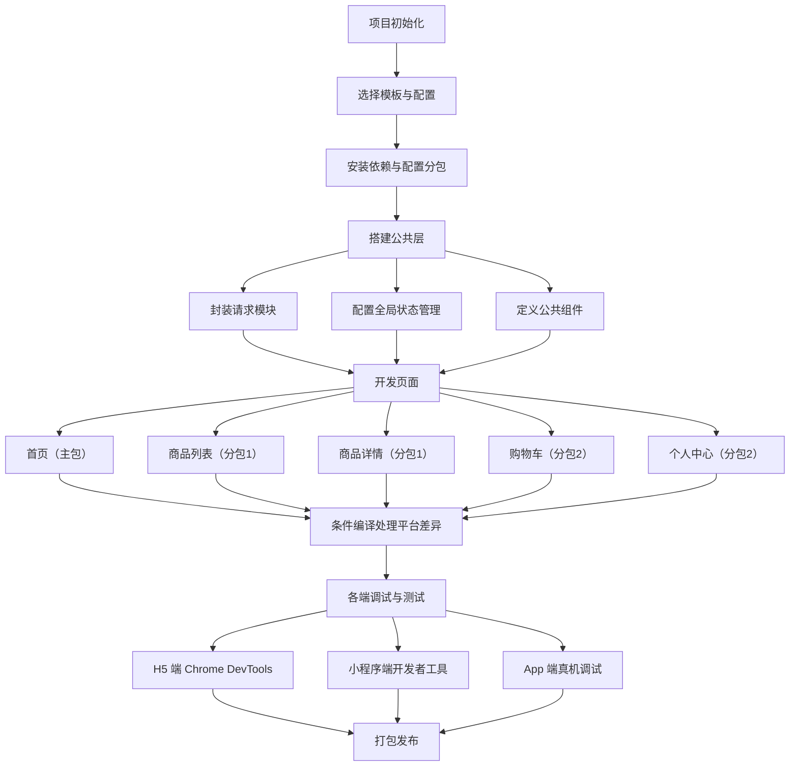
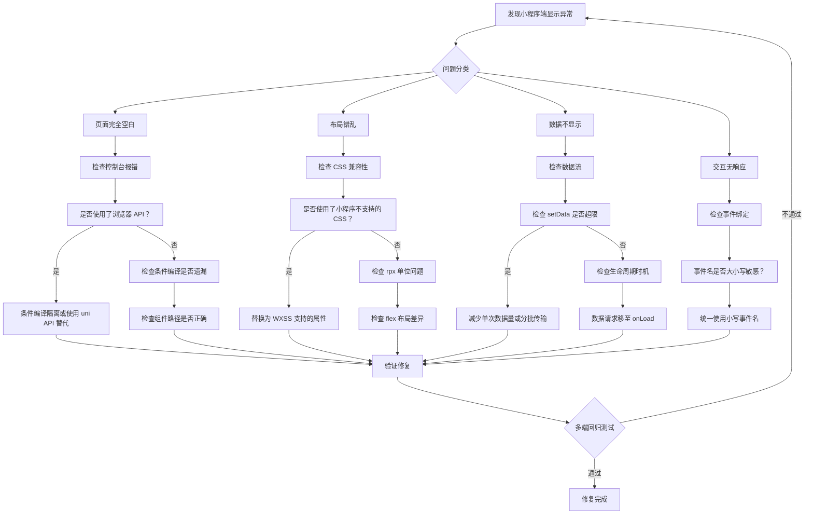

# uni-app 跨端开发 - 综合场景串联

---

## 场景一：跨端电商项目从零搭建

### 场景描述

从零搭建一个支持 H5、微信小程序、App（Android/iOS）三端的电商项目，包含首页、商品列表、商品详情、购物车、个人中心五个核心页面，要求实现统一的代码架构、分包策略、请求封装和状态管理。



> 上图展示了跨端电商项目从零搭建到发布上线的完整流程，核心环节包括项目初始化、公共层搭建、页面开发、平台差异处理和多端测试。

### 涉及知识点

- [uniapp跨端开发基础](./01-uniapp跨端开发基础.md)：项目初始化、pages.json 配置、条件编译、页面路由、uni API 调用、生命周期管理
- [渲染差异与性能优化](./02-uniapp渲染差异与性能优化.md)：首屏渲染优化、图片加载优化、分包加载策略、长列表性能优化

### 协作流程

1. **项目初始化**：使用 HBuilderX 或 CLI 创建 uni-app 项目（选择默认模板或 uni-ui 模板），生成基础目录结构（pages、components、static、store、utils 等）。

2. **分包策略规划**：在 `pages.json` 中配置主包和分包。主包包含首页（`pages/index/index`）和公共资源；分包一（`subpkg/goods`）包含商品列表和商品详情；分包二（`subpkg/cart`）包含购物车和个人中心。配置 `preloadRule` 实现分包预加载，在首页加载完成后预加载分包一。

3. **请求模块封装**：在 `utils/request.js` 中封装 `uni.request`，统一处理请求拦截（添加 token、loading 状态）、响应拦截（统一错误处理、token 过期处理）、请求重试和超时设置。使用 `uni.addInterceptor('request', {})` 实现全局拦截器。

4. **状态管理搭建**：使用 Vuex（或 Pinia）管理全局状态。核心模块包括：`user`（用户信息和登录状态）、`cart`（购物车数据）、`goods`（商品浏览缓存）。购物车数据通过 `uni.setStorageSync` 持久化，保证各端数据一致。

5. **页面开发与条件编译**：首页使用 swiper 轮播和 grid 宫格导航；商品列表使用 scroll-view 实现上拉加载更多；商品详情使用 nvue 页面（App 端）或 vue 页面（H5/小程序），通过条件编译选择页面类型；购物车使用 Vuex 管理状态，提交订单时通过条件编译调用不同平台的支付 API（微信支付、支付宝支付、H5 支付）。

6. **多端调试**：H5 端使用 Chrome DevTools 调试；小程序端使用微信开发者工具调试；App 端使用 HBuilderX 真机调试或自定义基座调试。重点关注各端渲染差异和 API 兼容性。

7. **打包发布**：H5 端打包为静态资源部署到 Web 服务器；小程序端在 HBuilderX 中发布到微信开发者工具后上传审核；App 端使用云打包或离线打包生成 APK 和 IPA。

### 代码示例

#### 1. pages.json 分包配置

```json
{
  "pages": [
    {
      "path": "pages/index/index",
      "style": {
        "navigationBarTitleText": "首页"
      }
    }
  ],
  "subPackages": [
    {
      "root": "subpkg/goods",
      "pages": [
        {
          "path": "list/list",
          "style": {
            "navigationBarTitleText": "商品列表",
            "enablePullDownRefresh": true
          }
        },
        {
          "path": "detail/detail",
          "style": {
            "navigationBarTitleText": "商品详情"
          }
        }
      ]
    },
    {
      "root": "subpkg/cart",
      "pages": [
        {
          "path": "cart/cart",
          "style": {
            "navigationBarTitleText": "购物车"
          }
        },
        {
          "path": "profile/profile",
          "style": {
            "navigationBarTitleText": "个人中心"
          }
        }
      ]
    }
  ],
  // 预加载策略：进入首页后预加载商品分包
  "preloadRule": {
    "pages/index/index": {
      "network": "all",
      "packages": ["subpkg/goods"]
    }
  }
}
```

#### 2. utils/request.js 封装（兼容 uni.request）

```javascript
// utils/request.js —— 跨端统一的请求封装
const BASE_URL = 'https://api.example.com';

// 请求拦截器：自动携带 token
uni.addInterceptor('request', {
  invoke(args) {
    const token = uni.getStorageSync('token');
    if (token) {
      args.header = {
        ...args.header,
        Authorization: `Bearer ${token}`,
      };
    }
    // 请求前显示 loading
    if (!args.hideLoading) {
      uni.showNavigationBarLoading();
    }
  },
  complete() {
    uni.hideNavigationBarLoading();
  },
});

// 响应拦截器：统一错误处理
uni.addInterceptor('request', {
  success(res) {
    const { statusCode, data } = res;
    if (statusCode === 401) {
      // token 过期，跳转登录页
      uni.removeStorageSync('token');
      uni.reLaunch({ url: '/pages/login/login' });
      return false; // 阻止后续处理
    }
    if (statusCode !== 200 || data.code !== 0) {
      uni.showToast({ title: data.message || '请求失败', icon: 'none' });
      return false;
    }
    return data;
  },
  fail(err) {
    uni.showToast({ title: '网络异常，请稍后重试', icon: 'none' });
    return Promise.reject(err);
  },
});

// 封装 GET / POST 方法
const request = {
  get(url, params = {}) {
    return new Promise((resolve, reject) => {
      uni.request({
        url: BASE_URL + url,
        method: 'GET',
        data: params,
        success: (res) => resolve(res),
        fail: (err) => reject(err),
      });
    });
  },
  post(url, data = {}) {
    return new Promise((resolve, reject) => {
      uni.request({
        url: BASE_URL + url,
        method: 'POST',
        data,
        success: (res) => resolve(res),
        fail: (err) => reject(err),
      });
    });
  },
};

export default request;
```

#### 3. 条件编译 #ifdef 示例（H5 / 小程序 / App 三端差异化）

```vue
<template>
  <view class="container">
    <!-- 各端共用的轮播 -->
    <swiper :indicator-dots="true" autoplay>
      <swiper-item v-for="banner in banners" :key="banner.id">
        <image :src="banner.image" mode="aspectFill" />
      </swiper-item>
    </swiper>

    <!-- #ifdef H5 -->
    <!-- H5 端特有：WebSocket 实时推送 -->
    <view class="live-notify" v-if="liveMessage">
      {{ liveMessage }}
    </view>
    <!-- #endif -->

    <!-- #ifdef MP-WEIXIN -->
    <!-- 小程序端特有：获取用户授权 -->
    <button class="auth-btn" open-type="getUserInfo" @getuserinfo="handleAuth">
      微信一键登录
    </button>
    <!-- #endif -->

    <!-- #ifdef APP-PLUS -->
    <!-- App 端特有：原生扫码功能 -->
    <button class="scan-btn" @click="scanQRCode">
      扫码查价
    </button>
    <!-- #endif -->
  </view>
</template>

<script>
export default {
  data() {
    return {
      banners: [],
      // #ifdef H5
      liveMessage: '',
      // #endif
    };
  },
  methods: {
    // #ifdef APP-PLUS
    scanQRCode() {
      // App 端调用原生扫码能力
      uni.scanCode({
        success: (res) => {
          uni.navigateTo({ url: `/subpkg/goods/detail/detail?code=${res.result}` });
        },
      });
    },
    // #endif

    // #ifdef MP-WEIXIN
    handleAuth(e) {
      const { userInfo } = e.detail;
      this.login(userInfo);
    },
    // #endif

    login(userInfo) {
      // 各端统一的登录逻辑
      uni.login({
        provider: this.getProvider(),
        success: (res) => {
          // 后端通过 code 换取 openid / unionid
          this.doLogin(res.code, userInfo);
        },
      });
    },

    getProvider() {
      // #ifdef MP-WEIXIN
      return 'weixin';
      // #endif
      // #ifdef APP-PLUS
      return 'apple'; // 或 'weixin'
      // #endif
      // #ifdef H5
      return 'weixin';
      // #endif
    },
  },
};
</script>
```

> **生活类比**：uniapp 就像一个翻译官——你用中文（Vue 代码）写一篇文章，翻译官把它分别翻译成英文（H5）、日文（微信小程序）、法文（App）。但有些中文成语（Web 专属 API）在日文和法文里没有对应表达，这时候翻译官会用注释标记（条件编译），让你为不同语言写不同的表达方式。

### 关键要点

- 分包策略应尽早规划，避免后期大规模重构。主包体积直接影响启动速度，尽量控制在 1.5MB 以内。
- 请求封装是跨端项目的基础设施，需要处理各端差异（如小程序端 Cookie 管理、App 端 SSL 证书校验）。
- 支付模块是平台差异最大的部分，必须通过条件编译分别处理，且需要在各平台后台配置支付参数。
- 使用 `uni.scss` 统一管理全局样式变量（主题色、字体大小、间距），结合 rpx 单位实现多端适配。
- 登录模块建议使用 `uni.login` 统一获取各端登录凭证，后端通过 code 换取 openid/unionid 实现账号互通。

---

## 场景二：H5 / 小程序渲染差异排查流程

### 场景描述

一个跨端项目在 H5 端显示正常，但在微信小程序端出现页面空白、布局错乱、数据不显示等多个问题。需要按照系统化的排查流程，定位并解决这些渲染差异问题。



> 上图展示了 H5/小程序渲染差异的系统化排查流程，按照"页面空白 → 布局错乱 → 数据不显示 → 交互无响应"四个维度逐层排查，帮助开发者快速定位跨端渲染问题的根因。

### 涉及知识点

- [uniapp跨端开发基础](./01-uniapp跨端开发基础.md)：条件编译、页面生命周期、uni API 调用、rpx 单位
- [渲染差异与性能优化](./02-uniapp渲染差异与性能优化.md)：H5 渲染机制、小程序双线程架构、setData 通信机制、CSS 兼容性

### 协作流程

1. **问题分类与优先级排序**：首先确定问题类型，按优先级排查：页面完全空白（阻断性问题）> 布局错乱（视觉问题）> 数据不显示（功能问题）> 交互无响应（体验问题）。

2. **页面空白排查**：检查小程序开发者工具控制台是否有报错。常见原因包括：使用了浏览器专属 API（如 `document.querySelector`、`window.location`）导致 JS 执行中断；条件编译遗漏导致小程序端执行了不兼容代码；组件路径大小写错误（小程序端大小写敏感，H5 端不敏感）。

3. **布局错乱排查**：对比 H5 和小程序端的 CSS 支持差异。常见原因：使用了 `background-attachment`、`filter`、`backdrop-filter` 等小程序不支持的 CSS 属性；rpx 换算后产生非整数像素导致模糊；flex 布局在小程序端表现与 H5 端不一致（如 `flex-shrink` 默认值差异）；`position: fixed` 在 iOS 小程序键盘弹出时行为异常。

4. **数据不显示排查**：检查数据请求和渲染流程。常见原因：数据请求放在 `mounted` 中，小程序端 mounted 触发时机不稳定；setData 数据量超过 256KB 限制导致传输失败；组件数据未正确初始化导致模板渲染报错；`v-if` 条件判断依赖的数据在模板渲染时还未获取到。

5. **交互无响应排查**：检查事件绑定和响应。常见原因：事件名大小写不一致（小程序端 `@longpress` 与 H5 端 `@longPress` 行为不同）；`@click` 在小程序端有 300ms 延迟；`catchtouchmove` 等小程序特有事件在 H5 端不生效；`uni.navigateTo` 页面栈已满导致静默失败。

6. **修复验证**：每修复一个问题后，在 H5 和小程序端分别验证，确保修复不引入新的问题。使用条件编译将修复代码隔离到目标平台，避免影响其他平台。

7. **多端回归测试**：全部问题修复后，在 H5（Chrome、Safari、微信内置浏览器）、微信小程序（iOS、Android）、App（iOS、Android）上进行完整的回归测试，确保所有平台表现一致。

### 代码示例

#### 1. H5 vs 小程序 CSS 差异对比

以下代码展示了同一布局在 H5 和小程序端的常见 CSS 差异及修复方案：

```css
/* ============================================
   场景：底部固定导航栏
   ============================================ */

/* ❌ 错误写法：H5 正常，小程序端 fixed 层级异常 */
.fixed-bottom {
  position: fixed;
  bottom: 0;
  left: 0;
  width: 100%;
  z-index: 999;
  background: #fff;
}

/* ✓ 正确写法：使用条件编译隔离 */
/* #ifdef H5 */
.fixed-bottom {
  position: fixed;
  bottom: 0;
  left: 0;
  width: 100%;
  z-index: 999;
  background: #fff;
}
/* #endif */

/* #ifdef MP-WEIXIN */
.fixed-bottom {
  position: fixed;
  bottom: 0;
  left: 0;
  width: 100%;
  /* 小程序端 z-index 上限较低，避免与原生组件冲突 */
  z-index: 99;
  background: #fff;
  /* 小程序端需要处理 iPhone X 安全区域 */
  padding-bottom: constant(safe-area-inset-bottom);
  padding-bottom: env(safe-area-inset-bottom);
}
/* #endif */


/* ============================================
   场景：滚动容器 overflow 差异
   ============================================ */

/* ❌ H5 可用，小程序端 scroll-view 外禁止使用 overflow:scroll */
.page-scroll {
  height: 100vh;
  overflow-y: scroll;    /* 小程序端无效 */
  -webkit-overflow-scrolling: touch; /* 小程序端不支持 */
}

/* ✓ 小程序端：使用 scroll-view 组件替代 CSS overflow */
/* 在模板中：
<scroll-view scroll-y="true" style="height: 100vh;" @scrolltolower="loadMore">
  <view class="content">...</view>
</scroll-view>
*/


/* ============================================
   场景：小程序不支持的 CSS 属性
   ============================================ */

/* ❌ 以下属性在小程序端不生效或被忽略 */
.unsupported-in-mp {
  background-attachment: fixed;  /* 不支持 */
  backdrop-filter: blur(10px);   /* 不支持 */
  filter: grayscale(50%);        /* 不支持 */
  position: sticky;              /* 部分支持，行为不一致 */
  mask-image: url('./mask.png'); /* 不支持 */
}

/* ✓ 替代方案：使用条件编译 */
/* #ifdef H5 */
.glass-effect {
  backdrop-filter: blur(10px);
  background: rgba(255, 255, 255, 0.6);
}
/* #endif */

/* #ifdef MP-WEIXIN */
.glass-effect {
  /* 小程序端使用纯色半透明作为降级方案 */
  background: rgba(255, 255, 255, 0.85);
}
/* #endif */
```

#### 2. 条件编译隔离样式代码

```vue
<template>
  <view class="product-detail">
    <!-- 商品图片区域 -->
    <!-- #ifdef H5 -->
    <view class="image-gallery-h5">
      <swiper :indicator-dots="true">
        <swiper-item v-for="img in images" :key="img">
          <image :src="img" mode="widthFix" class="gallery-img" />
        </swiper-item>
      </swiper>
    </view>
    <!-- #endif -->

    <!-- #ifdef MP-WEIXIN -->
    <view class="image-gallery-mp">
      <!-- 小程序端使用原生 swiper，性能更好 -->
      <swiper :indicator-dots="true" indicator-color="rgba(255,255,255,0.5)" indicator-active-color="#fff">
        <swiper-item v-for="img in images" :key="img">
          <image :src="img" mode="aspectFill" class="gallery-img" />
        </swiper-item>
      </swiper>
    </view>
    <!-- #endif -->

    <!-- 商品信息区域（各端共用） -->
    <view class="product-info">
      <text class="title">{{ product.name }}</text>
      <text class="price">¥{{ product.price }}</text>
    </view>
  </view>
</template>

<style scoped>
/* H5 端样式 */
/* #ifdef H5 */
.image-gallery-h5 {
  position: relative;
  width: 100%;
  height: 375px;
}
.gallery-img {
  width: 100%;
  height: 375px;
  object-fit: cover;
}
/* #endif */

/* 小程序端样式 */
/* #ifdef MP-WEIXIN */
.image-gallery-mp {
  width: 100%;
  height: 750rpx;
}
.gallery-img {
  width: 100%;
  height: 750rpx;
}
/* #endif */

/* 各端共用样式 */
.product-info {
  padding: 20rpx 30rpx;
}
.title {
  font-size: 32rpx;
  font-weight: bold;
  color: #333;
  /* 多行省略：小程序端需使用 line-clamp */
  display: -webkit-box;
  -webkit-box-orient: vertical;
  -webkit-line-clamp: 2;
  overflow: hidden;
}
.price {
  font-size: 36rpx;
  color: #e4393c;
  margin-top: 16rpx;
}
</style>
```

#### 3. 生命周期差异代码对比

```javascript
// ============================================
// 页面生命周期：H5 vs 小程序关键差异
// ============================================

export default {
  data() {
    return {
      list: [],
      page: 1,
      isReady: false,
    };
  },

  // ❌ 错误做法：在 mounted 中请求数据
  // H5 端 mounted 在 DOM 渲染后立即触发，没有问题
  // 小程序端 mounted 触发时机不稳定，可能页面还未渲染完毕
  // mounted() {
  //   this.fetchData(); // 小程序端可能报错
  // },

  // ✓ 正确做法：使用 onLoad 获取页面参数并触发初始请求
  onLoad(options) {
    // 小程序端：onLoad 是最早的页面生命周期，适合获取路由参数
    // H5 端：onLoad 同样会触发，行为一致
    const { id, source } = options;
    this.productId = id;
    this.fetchData();
  },

  // onReady：页面初次渲染完成
  onReady() {
    // 小程序端：onReady 在页面渲染完成后触发，适合获取节点信息
    // H5 端：等价于 mounted + nextTick 的执行时机
    this.isReady = true;
    // #ifdef MP-WEIXIN
    // 小程序端获取节点信息
    const query = uni.createSelectorQuery().in(this);
    query.select('.product-info').boundingClientRect((rect) => {
      this.infoHeight = rect.height;
    }).exec();
    // #endif
  },

  // onShow：页面显示/切入前台时触发
  onShow() {
    // 各端均会触发，适合刷新数据
    // 注意：onShow 在 onLoad 之后也会触发，避免重复请求
    if (this.isReady) {
      this.refreshData();
    }
  },

  // onHide：页面隐藏/切入后台时触发
  onHide() {
    // #ifdef H5
    // H5 端：用户切换标签页时触发
    // #endif
    // #ifdef MP-WEIXIN
    // 小程序端：用户点击右上角关闭或切换到后台时触发
    // 适合暂停动画、停止轮询等
    // #endif
    this.stopPolling();
  },

  // onUnload：页面卸载时触发
  onUnload() {
    // 各端均会触发，适合清理资源
    this.stopPolling();
    this.clearTimer();
  },

  // #ifdef MP-WEIXIN
  // 小程序端特有：页面触底事件
  onReachBottom() {
    // 上拉加载更多，H5 端需自行监听 scroll 事件
    this.page++;
    this.fetchData();
  },
  // #endif

  methods: {
    fetchData() {
      // 统一的数据请求逻辑
    },
    refreshData() {
      this.page = 1;
      this.fetchData();
    },
    stopPolling() {
      // 停止轮询等后台任务
    },
    clearTimer() {
      // 清理定时器
    },
  },
};
```

### 关键要点

- 排查顺序很重要：先解决阻断性问题（页面空白），再解决视觉和功能问题，最后处理体验问题。
- 小程序端对大小写敏感，文件路径、组件名、事件名必须与代码完全一致，不像 H5 端会自动容错。
- 使用 `uni.getSystemInfoSync()` 获取当前平台信息，在开发阶段通过 `console.log` 输出平台标识，方便快速判断当前运行环境。
- 建议在项目中维护一份"平台差异检查清单"，每次新增功能时进行对照检查，减少后期排查成本。
- 持续关注 uni-app 官方更新日志，框架升级可能修复部分兼容性问题，也可能引入新的差异。

---

## 常见错误

### 1. 条件编译写反导致功能在目标平台不可用

条件编译使用 `#ifdef`（仅在指定平台生效）和 `#ifndef`（排除指定平台），一旦写反，代码会在不该执行的平台上执行，改执行的平台反而被跳过。

**错误示例**：

```javascript
// ❌ 写反了：H5 端不需要微信支付，但条件编译标记写成了 H5
// #ifdef H5
wx.requestPayment({
  timeStamp: '',
  nonceStr: '',
  package: '',
  signType: 'MD5',
  paySign: '',
  success: () => console.log('支付成功'),
});
// #endif
```

**解决方案**：
- 在条件编译块的注释中明确标注目标平台，如 `<!-- #ifdef MP-WEIXIN --> 微信小程序专属支付逻辑 <!-- #endif -->`
- 在开发阶段利用 uni-app 的"运行到指定平台"功能逐端验证
- 团队 Review 时必须检查条件编译块是否正确对应目标平台
- 使用 `#ifndef` 反向思维：当某个功能不适合某平台时，用 `#ifndef` 排除该平台，其余平台均生效，减少遗漏

### 2. 分包配置中主包超过 2MB 限制

微信小程序主包体积限制为 2MB，超出后无法上传。很多开发者将大量公共组件、工具库、UI 库都放在主包中，导致主包体积超标。

**错误示例**：

```json
// ❌ 把所有大体积依赖都放在主包
{
  "pages": [
    "pages/index/index",
    "pages/product/list/list",
    "pages/product/detail/detail",
    "pages/cart/cart",
    "pages/user/profile/profile",
    "pages/user/order/list/list",
    "pages/user/order/detail/detail"
  ]
  // 所有页面都在主包，主包体积可能超过 2MB
}
```

**解决方案**：
- 主包只保留入口页面（首页、登录页）和全局公共资源（如请求封装、全局样式）
- 将非首屏页面按业务模块拆分到分包中（如商品模块、订单模块、用户模块）
- 大型静态资源（图片、字体）使用 CDN 外链，避免打包进主包
- 使用 `uni-app` 的 `preloadRule` 配置分包预加载策略，兼顾加载速度
- 在 CI 中加入包体积检查脚本，防止主包体积无声超标

### 3. 在非 H5 端使用了浏览器专属 API

小程序和 App 端没有浏览器环境，`window`、`document`、`localStorage`、`navigator` 等浏览器 API 在这些平台上不可用。直接使用会导致 JS 执行中断，页面白屏。

**错误示例**：

```javascript
// ❌ 小程序端报错：window is not defined
const baseUrl = window.location.origin;

// ❌ 小程序端报错：document is not defined
document.querySelector('.container');

// ❌ 小程序端报错：localStorage is not defined
localStorage.setItem('token', 'xxx');

// ❌ 小程序端报错：navigator is not defined
if (navigator.geolocation) {
  navigator.geolocation.getCurrentPosition();
}
```

**解决方案**：
- 使用 uni-app 提供的跨端 API 替代：`uni.getStorageSync` 替代 `localStorage`，`uni.getLocation` 替代 `navigator.geolocation`
- 使用 `uni.getSystemInfoSync()` 获取平台信息，必要时用条件编译隔离
- 在 ESLint 中配置 `no-restricted-globals` 规则，禁止直接使用 `window`、`document` 等浏览器专属全局变量
- 封装一个平台判断工具函数，在运行时动态选择 API 调用路径

### 4. 使用 rpx 时忽略各端渲染精度差异

uni-app 的 rpx 单位会根据屏幕宽度自动换算成 px，但不同平台的换算结果可能产生小数像素，导致渲染模糊或布局偏差。小程序端使用 `750rpx = 屏幕宽度` 的换算规则，而 App 端和 H5 端的换算策略略有不同。

**错误示例**：

```css
/* ❌ 1px 边框在小程序端可能被换算成小数，导致渲染模糊 */
.border {
  border: 1px solid #eee; /* 混用 px 和 rpx */
  border-radius: 50rpx;
  /* 不同平台上 1px 可能被换算为 0.5px 或 1.5px，边框粗细不一致 */
}
```

**解决方案**：
- 统一使用 rpx 作为布局单位，避免混用 px 和 rpx 导致比例失调
- 对于 1px 边框，使用 `uni-app` 提供的 `#ifdef` 在各端单独处理，或使用伪元素 + transform 模拟 1px 边框
- 在 UI 测试阶段，逐个平台检查关键元素的渲染效果，记录各端差异并做针对性适配
- 对于图标、小尺寸元素，使用 `transform: scale()` 来避免小数像素导致的模糊