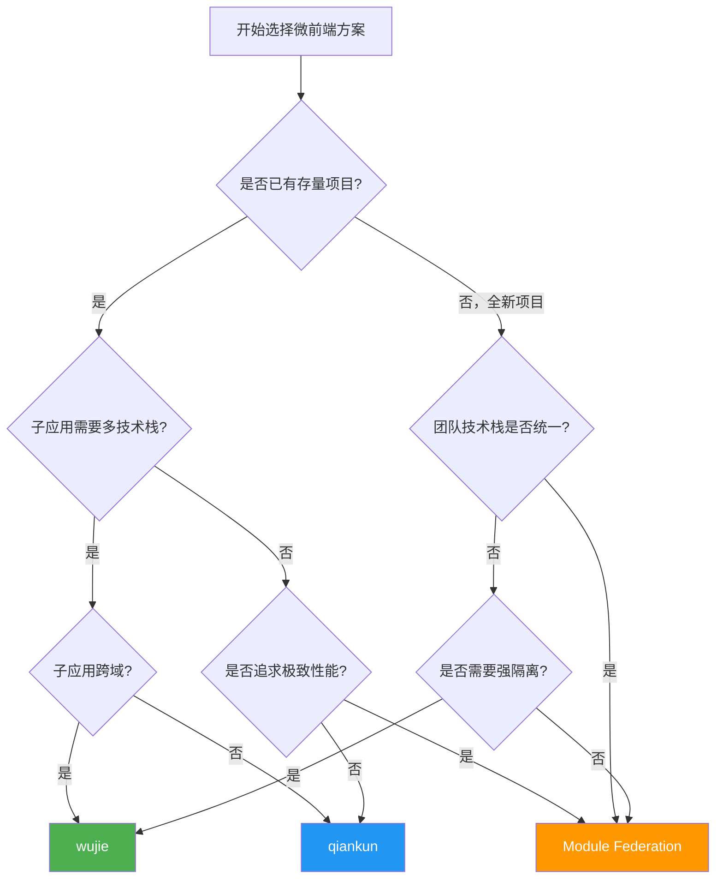

> 模块：13-architecture（架构师进阶 第13周 前端架构设计）
> 难度：★★★ 架构核心
> 前置知识：Vue 3 / React 18、Webpack/Vite 基础

---

# 01-微前端架构

---

## 一、核心概念

### 1.1 什么是微前端

**巨石应用的困境**：当一个中大型前端项目经过 2-3 年的迭代后，代码量膨胀到数十万行，构建时间从 30 秒飙升到 10 分钟，多团队并行开发时频繁产生 Git 冲突，发布上线时"一人上线全员待命"成为常态。

**微前端的诞生**：借鉴后端微服务的思想，将单一的前端应用拆分为多个独立开发、独立部署、独立运行的子应用，由主应用负责路由分发和生命周期管理。

**公司组织架构类比**：

| 传统巨石应用 | 微前端架构 |
|---|---|
| 一个大部门，所有人在一个仓库里协作 | 多个独立小团队，各自维护自己的仓库 |
| 代码耦合严重，改一处可能影响全局 | 团队间通过明确的接口（通信协议）交互 |
| 技术栈被锁定，升级框架需要全量迁移 | 每个团队可独立选择技术栈 |
| 发布节奏统一，一个团队阻塞全公司 | 独立发布，互不影响 |

**核心价值**：
- **技术栈无关**：主应用不限制子应用的技术栈（Vue 2 / Vue 3 / React / Angular 可共存）
- **独立开发部署**：各子应用仓库独立，CI/CD 独立
- **增量升级**：逐步迁移老项目，避免全量重写
- **团队自治**：不同团队负责不同业务模块，解耦组织架构

> **框架版本参考**：qiankun v2.10.x、wujie v1.0.x、micro-app v1.x

### 1.2 三种主流方案对比

| 维度 | qiankun | Module Federation | wujie |
|---|---|---|---|
| 隔离方式 | JS Proxy 沙箱 + CSS Scope | 无沙箱，依赖 shared 配置 | iframe + WebComponent 双保险 |
| 改造成本 | 主应用 + 子应用均需改造 | 仅需修改构建配置 | 子应用几乎零改造 |
| 运行时性能 | SnapshotSandbox 遍历消耗较大 | 极佳，共享依赖减少重复加载 | iframe 开销，但保活模式可优化 |
| 样式隔离 | strictStyleIsolation / experimentalStyleIsolation | 无内置隔离，依赖 CSS Modules | 天然的 iframe 隔离 |
| JS 隔离 | Proxy 沙箱（LegacySandbox / ProxySandbox） | 无隔离（依赖团队规范） | 天然的 iframe 隔离 |
| 适用场景 | 存量系统改造、多技术栈共存 | 全新项目、同技术栈、追求极致性能 | 快速接入、需要强隔离、跨域子应用 |
| 社区生态 | 阿里出品，中文文档完善 | Webpack 5 官方支持 | 腾讯出品，生态较新 |
| 子应用嵌套 | 不支持 | 支持 | 支持 |

### 1.3 核心术语

**主应用（Main Application）**：
- 负责路由分发、子应用注册与生命周期管理
- 通常承载公共模块（导航栏、登录态、全局状态）

**子应用（Micro Application）**：
- 独立的业务模块，可独立开发、构建、部署
- 必须暴露 `bootstrap`、`mount`、`unmount` 三个生命周期函数

**沙箱隔离（Sandbox）**：
- JS 沙箱：阻止子应用对全局变量（如 `window`）的污染
- CSS 沙箱：阻止子应用样式影响到主应用或其他子应用

**应用间通信（Cross-app Communication）**：
- 主应用与子应用之间、子应用与子应用之间的数据传递机制

**生命周期（Lifecycle）**：
- `bootstrap`：子应用初始化，只执行一次
- `mount`：子应用挂载到 DOM，每次进入路由时触发
- `unmount`：子应用卸载，每次离开路由时触发

---

## 二、底层原理

### 2.1 qiankun 的 JS Proxy 沙箱与 CSS 隔离原理

**JS Proxy 沙箱**：qiankun 使用 `Proxy` 创建 `window` 对象的代理，拦截子应用对全局变量的读写操作。

```javascript
// qiankun ProxySandbox 简化实现
class ProxySandbox {
  constructor(name) {
    this.name = name;
    this.updateValueMap = {}; // 记录子应用修改的全局变量

    // 创建 fakeWindow 代理
    this.proxy = new Proxy(window, {
      get: (target, prop) => {
        // 优先从子应用自己的修改记录中取值
        // 使用 in 操作符而非 !== undefined，以区分"属性不存在"和"属性值为 undefined"
        if (prop in this.updateValueMap) {
          return this.updateValueMap[prop];
        }

        // 处理 window 上的 getter/setter 属性（如 window.top、window.location、window.document 等）
        // 使用 Object.getOwnPropertyDescriptor 检查属性描述符，判断是否为访问器属性
        const descriptor = Object.getOwnPropertyDescriptor(target, prop);
        if (descriptor) {
          // 若属性定义了 getter，则通过 Reflect.get 调用 getter 并绑定正确的 this 上下文
          // 避免直接访问 target[prop] 时丢失 getter 的副作用或触发错误的 this 指向
          if (typeof descriptor.get === 'function') {
            return Reflect.get(target, prop);
          }
          // 若属性不可写（如 window.top），直接返回当前值，防止子应用尝试修改
          if (!descriptor.writable && !descriptor.set) {
            return descriptor.value;
          }
        }

        // 否则返回 window 上的原始值
        const value = target[prop];
        // 对函数类型做 bind 处理，确保 this 指向 window
        if (typeof value === 'function') {
          return value.bind(target);
        }
        return value;
      },
      set: (target, prop, value) => {
        // 将子应用的修改记录在 updateValueMap 中
        this.updateValueMap[prop] = value;
        return true;
      },
    });
  }

  // 激活沙箱：将子应用记录的修改同步到 window
  active() {
    Object.keys(this.updateValueMap).forEach((prop) => {
      window[prop] = this.updateValueMap[prop];
    });
  }

  // 关闭沙箱：恢复 window 的原始值
  inactive() {
    Object.keys(this.updateValueMap).forEach((prop) => {
      delete window[prop];
    });
  }
}

// 使用示例
const sandbox = new ProxySandbox('app-vue2');
sandbox.active();
// 子应用代码在 sandbox.proxy 环境中执行，修改的是代理而非真实的 window
sandbox.proxy.myGlobalVar = '子应用的数据';
console.log(window.myGlobalVar); // undefined（真实的 window 未被污染）
sandbox.inactive();
```

**CSS 隔离**：

```javascript
// qiankun CSS 隔离的两种模式

// 模式一：strictStyleIsolation（严格模式，基于 Shadow DOM）
// 原理：将子应用挂载到 Shadow DOM 中，天然隔离样式
// 缺点：部分库（如 Ant Design 的弹窗挂载到 body）会出问题
// start({ sandbox: { strictStyleIsolation: true } });

// 模式二：experimentalStyleIsolation（实验性，基于样式前缀）
// 原理：遍历子应用所有样式规则，为选择器添加前缀
// 示例：.title { color: red; } → div[data-qiankun="app1"] .title { color: red; }
// start({ sandbox: { experimentalStyleIsolation: true } });
```

### 2.2 Module Federation 的 shared 依赖共享与 singleton 机制

Module Federation 是 Webpack 5 内置的模块联邦功能，允许多个独立构建的应用共享模块。

**核心配置**：

```javascript
// Rspack / Webpack 5 配置 - 主应用（host）
// rspack.config.js
const rspack = require('@rspack/core');

module.exports = {
  entry: './src/index',
  plugins: [
    new rspack.container.ModuleFederationPlugin({
      name: 'host',
      // 远程模块配置
      remotes: {
        // 子应用名称: 子应用入口地址
        app1: 'app1@http://localhost:3001/remoteEntry.js',
        app2: 'app2@http://localhost:3002/remoteEntry.js',
      },
      // 共享依赖配置
      shared: {
        react: {
          singleton: true,       // 全局只允许一个 react 实例
          requiredVersion: '^18.0.0', // 要求的版本范围
          eager: true,           // 是否立即加载（主应用通常设为 true）
        },
        'react-dom': {
          singleton: true,
          requiredVersion: '^18.0.0',
          eager: true,
        },
        'react-router-dom': {
          singleton: true,
          requiredVersion: '^6.0.0',
        },
        // 非 singleton 的共享依赖
        lodash: {
          requiredVersion: '^4.17.0',
        },
      },
    }),
  ],
};

// 子应用（remote）配置
// rspack.config.js
module.exports = {
  entry: './src/index',
  plugins: [
    new rspack.container.ModuleFederationPlugin({
      name: 'app1',
      filename: 'remoteEntry.js',
      // 暴露的模块
      exposes: {
        './App': './src/App',
        './routes': './src/routes',
        './store': './src/store',
      },
      shared: {
        react: { singleton: true, requiredVersion: '^18.0.0' },
        'react-dom': { singleton: true, requiredVersion: '^18.0.0' },
        'react-router-dom': { singleton: true, requiredVersion: '^6.0.0' },
      },
    }),
  ],
};
```

**singleton 机制原理**：
- 当 `singleton: true` 时，Module Federation 确保全局只有一个该模块的实例
- 如果 host 和 remote 的版本不一致，会以 `requiredVersion` 范围最高的版本为准
- 版本不匹配时会打印警告，但不会阻止应用运行

**共享依赖加载流程**：
1. 主应用加载时，初始化 `react` 和 `react-dom`
2. 子应用 `remoteEntry.js` 加载时，检测到 `react` 已存在于共享作用域
3. 子应用直接使用主应用的 `react` 实例，不再重复加载

### 2.3 wujie 的 iframe + WebComponent 双保险隔离原理

wujie 的核心创新在于将子应用的 JS 放入 iframe 中执行，而 DOM 渲染通过 WebComponent 挂载到主应用的 DOM 树中。

```javascript
// wujie 核心原理简化代码
class WujieApp {
  constructor({ name, url, el }) {
    this.name = name;
    this.url = url;
    this.el = el;
  }

  async start() {
    // 1. 创建隐藏的 iframe，用于执行子应用的 JS
    this.iframe = document.createElement('iframe');
    this.iframe.style.display = 'none';
    // 设置 src 为子应用地址，iframe 会加载子应用的 HTML
    this.iframe.src = this.url;
    document.body.appendChild(this.iframe);

    await this.waitForIframeLoad();

    // 2. 获取 iframe 的 window 作为沙箱环境
    const sandboxWindow = this.iframe.contentWindow;

    // 3. 创建 WebComponent 作为渲染容器
    this.wc = document.createElement('div');
    this.wc.id = `wujie-${this.name}`;
    this.el.appendChild(this.wc);

    // 4. 劫持 iframe 中的 DOM 操作，将渲染结果同步到 WebComponent
    this.hijackDOMOperations(sandboxWindow);

    // 5. 在 iframe 沙箱中执行子应用 JS
    await this.execScriptsInSandbox(sandboxWindow);
  }

  hijackDOMOperations(sandboxWindow) {
    const wc = this.wc;
    // 劫持 document.body.appendChild 等 DOM 操作
    const originalAppend = sandboxWindow.document.body.appendChild.bind(
      sandboxWindow.document.body
    );
    sandboxWindow.document.body.appendChild = function (node) {
      // 将 DOM 节点渲染到 WebComponent 容器中，而非 iframe 中
      wc.appendChild(node);
      return node;
    };
    // 类似的劫持还包括 querySelector、getElementById 等
  }
}

// 使用示例
const app = new WujieApp({
  name: 'app-vue3',
  url: 'http://localhost:3001',
  el: document.getElementById('container'),
});
app.start();
```

**双保险隔离的优势**：
- **iframe 提供 JS 隔离**：子应用的 JS 代码在 iframe 的独立 window 上下文中执行，天然隔离全局变量
- **WebComponent 提供 DOM 隔离**：子应用的 DOM 渲染到主应用的指定容器中，保持样式和结构的独立性
- **路由同步**：通过劫持 `history.pushState` 和 `popstate` 事件，实现主子应用路由同步

### 2.4 应用间通信机制对比

**方案一：qiankun 的 globalState（发布-订阅模式）**

```javascript
// 主应用中初始化
import { initGlobalState } from 'qiankun';

const actions = initGlobalState({
  user: { name: 'Guest', token: '' },
  theme: 'light',
});

// 监听全局状态变化
actions.onGlobalStateChange((state, prev) => {
  console.log('主应用监听到状态变化:', state, prev);
  // 同步到主应用的 store
  mainStore.setState(state);
});

// 设置全局状态
actions.setGlobalState({
  user: { name: 'Admin', token: 'abc123' },
});

// 子应用中获取和修改
// 在 mount 生命周期中接收 props
export async function mount(props) {
  // props 中包含 onGlobalStateChange 和 setGlobalState
  props.onGlobalStateChange((state, prev) => {
    console.log('子应用监听到状态变化:', state, prev);
    // 同步到子应用的 store
    subAppStore.setState(state);
  }, true); // true 表示立即触发一次回调

  // 子应用修改全局状态
  props.setGlobalState({ theme: 'dark' });
}
```

**方案二：Custom Events（自定义事件）**

```javascript
// 主应用发送事件
window.dispatchEvent(
  new CustomEvent('app:user-login', {
    detail: { userId: '123', name: 'Admin' },
  })
);

// 任何子应用监听事件
window.addEventListener('app:user-login', (event) => {
  console.log('收到用户登录事件:', event.detail);
  // 同步登录状态
  userStore.login(event.detail);
});

// 子应用发送事件
window.dispatchEvent(
  new CustomEvent('app:order-created', {
    detail: { orderId: 'ORD-001', amount: 99.99 },
  })
);
```

**方案三：共享模块（Shared Module）**

```javascript
// shared/eventBus.js - 独立发布的事件总线库
class EventBus {
  constructor() {
    this.events = {};
  }

  on(event, callback) {
    if (!this.events[event]) {
      this.events[event] = [];
    }
    this.events[event].push(callback);
    return () => this.off(event, callback);
  }

  off(event, callback) {
    if (!this.events[event]) return;
    this.events[event] = this.events[event].filter((cb) => cb !== callback);
  }

  emit(event, data) {
    if (!this.events[event]) return;
    this.events[event].forEach((cb) => cb(data));
  }
}

// 挂载到 window 上，所有应用共享
window.eventBus = new EventBus();

// 主应用发布
window.eventBus.emit('user:logout', { timestamp: Date.now() });

// 子应用订阅
const unsubscribe = window.eventBus.on('user:logout', (data) => {
  console.log('用户已登出:', data);
  // 清理本地状态
  clearUserState();
});
```

**三种通信方案对比**：

| 特性 | globalState | Custom Events | 共享模块 |
|---|---|---|---|
| 类型安全 | 弱（无 TS 类型约束） | 弱 | 强（可定义 TS 接口） |
| 解耦程度 | 中（依赖 qiankun API） | 高（纯浏览器 API） | 高（不依赖框架） |
| 调试难度 | 低（qiankun devtools） | 高（需自行追踪） | 中 |
| 适用场景 | qiankun 体系内 | 简单的事件通知 | 复杂的跨应用数据共享 |

> 📖 **参考链接**：
> - [qiankun官方文档](https://qiankun.umijs.org/zh/guide)
> - [Module Federation - Webpack中文文档](https://webpack.docschina.org/concepts/module-federation/)
> - [wujie官方文档](https://wujie-micro.github.io/doc/)

---

## 三、实战应用

### 3.1 qiankun 接入实战

**主应用（Vue 3）完整代码**：

```typescript
// main-app/src/micro-apps.ts
import { registerMicroApps, start, addGlobalUncaughtErrorHandler } from 'qiankun';

// 子应用注册配置
const apps = [
  {
    name: 'app-vue2',           // 子应用唯一标识
    entry: '//localhost:8001',  // 子应用入口地址
    container: '#sub-app-viewport', // 挂载容器
    activeRule: '/app-vue2',    // 激活路由规则
    // 传递给子应用的 props
    props: {
      getGlobalState: () => globalState,
      mainRouter: router,
    },
  },
  {
    name: 'app-react',
    entry: '//localhost:8002',
    container: '#sub-app-viewport',
    activeRule: '/app-react',
  },
];

// 注册子应用
registerMicroApps(apps, {
  beforeLoad: [
    (app) => {
      console.log(`[qiankun] ${app.name} 开始加载`);
      NProgress.start();
    },
  ],
  beforeMount: [
    (app) => {
      console.log(`[qiankun] ${app.name} 挂载前`);
    },
  ],
  afterUnmount: [
    (app) => {
      console.log(`[qiankun] ${app.name} 卸载后`);
      NProgress.done();
    },
  ],
});

// 全局异常捕获
addGlobalUncaughtErrorHandler((event) => {
  console.error('[qiankun] 全局异常:', event);
  if (event.message?.includes('died in status LOADING_SOURCE_CODE')) {
    console.error('子应用加载失败，请检查子应用是否正常运行');
  }
});

// 启动 qiankun
start({
  sandbox: {
    // 严格样式隔离（Shadow DOM）
    // strictStyleIsolation: true,
    // 实验性样式隔离（CSS 前缀）
    experimentalStyleIsolation: true,
  },
  prefetch: 'all', // 预加载所有子应用
});
```

```vue
<!-- main-app/src/App.vue -->
<template>
  <div id="main-app">
    <header class="main-header">
      <nav>
        <router-link to="/home">首页</router-link>
        <router-link to="/app-vue2">Vue2 子应用</router-link>
        <router-link to="/app-react">React 子应用</router-link>
      </nav>
    </header>
    <main>
      <!-- 主应用自己的路由视图 -->
      <router-view v-if="isMainRoute" />
      <!-- 子应用挂载容器 -->
      <div id="sub-app-viewport" />
    </main>
  </div>
</template>

<script setup lang="ts">
import { computed } from 'vue';
import { useRoute } from 'vue-router';

const route = useRoute();
const isMainRoute = computed(() => {
  return !route.path.startsWith('/app-');
});
</script>
```

**子应用（Vue 2）改造**：

```javascript
// sub-app-vue2/src/public-path.js
// 动态设置 webpack publicPath
if (window.__POWERED_BY_QIANKUN__) {
  // eslint-disable-next-line no-undef
  __webpack_public_path__ = window.__INJECTED_PUBLIC_PATH_BY_QIANKUN__;
}

// sub-app-vue2/src/main.js
import Vue from 'vue';
import App from './App.vue';
import router from './router';
import store from './store';
import './public-path';

let instance = null;

// 渲染函数
function render(props = {}) {
  const { container } = props;
  instance = new Vue({
    router,
    store,
    render: (h) => h(App),
  }).$mount(container ? container.querySelector('#app') : '#app');
}

// 独立运行时直接渲染
if (!window.__POWERED_BY_QIANKUN__) {
  render();
}

// 必须暴露三个生命周期函数
export async function bootstrap() {
  console.log('[app-vue2] bootstrap');
}

export async function mount(props) {
  console.log('[app-vue2] mount', props);
  // 监听全局状态变化
  props.onGlobalStateChange?.((state, prev) => {
    console.log('[app-vue2] 全局状态变化:', state, prev);
  });
  render(props);
}

export async function unmount() {
  console.log('[app-vue2] unmount');
  instance.$destroy();
  instance.$el.innerHTML = '';
  instance = null;
}

// webpack 配置修改
// vue.config.js
module.exports = {
  devServer: {
    port: 8001,
    headers: {
      'Access-Control-Allow-Origin': '*', // 允许跨域
    },
  },
  configureWebpack: {
    output: {
      library: 'app-vue2',              // 暴露为 UMD 格式
      libraryTarget: 'umd',
      globalObject: 'window',
      jsonpFunction: 'webpackJsonp_app-vue2', // 避免与其他子应用冲突
    },
  },
};
```

### 3.2 Module Federation 实战

**主应用（Host）完整 Rspack 配置**：

```javascript
// host/rspack.config.js
const rspack = require('@rspack/core');
const { ModuleFederationPlugin } = rspack.container;

module.exports = {
  entry: './src/index.tsx',
  resolve: {
    extensions: ['.ts', '.tsx', '.js', '.jsx'],
  },
  module: {
    rules: [
      {
        test: /\.tsx?$/,
        use: {
          loader: 'builtin:swc-loader',
          options: {
            jsc: { parser: { syntax: 'typescript', tsx: true } },
          },
        },
      },
    ],
  },
  plugins: [
    new rspack.HtmlRspackPlugin({
      template: './public/index.html',
    }),
    new ModuleFederationPlugin({
      name: 'host',
      remotes: {
        app1: 'app1@http://localhost:3001/remoteEntry.js',
        app2: 'app2@http://localhost:3002/remoteEntry.js',
      },
      shared: {
        react: { singleton: true, eager: true, requiredVersion: '^18.2.0' },
        'react-dom': { singleton: true, eager: true, requiredVersion: '^18.2.0' },
        'react-router-dom': { singleton: true, requiredVersion: '^6.20.0' },
        zustand: { singleton: true, requiredVersion: '^4.4.0' },
      },
    }),
  ],
  devServer: {
    port: 3000,
    historyApiFallback: true,
  },
};
```

**主应用路由加载远程模块**：

```tsx
// host/src/App.tsx
import React, { Suspense, lazy } from 'react';
import { BrowserRouter, Routes, Route, Link } from 'react-router-dom';

// 懒加载远程模块
// @ts-ignore - Module Federation 类型声明
const App1App = lazy(() => import('app1/App'));
// @ts-ignore
const App2App = lazy(() => import('app2/App'));

const Loading = () => <div>加载中...</div>;

export default function App() {
  return (
    <BrowserRouter>
      <div className="host-app">
        <nav>
          <Link to="/">首页</Link>
          <Link to="/app1">子应用1</Link>
          <Link to="/app2">子应用2</Link>
        </nav>
        <main>
          <Suspense fallback={<Loading />}>
            <Routes>
              <Route path="/" element={<h1>主应用首页</h1>} />
              <Route path="/app1/*" element={<App1App />} />
              <Route path="/app2/*" element={<App2App />} />
            </Routes>
          </Suspense>
        </main>
      </div>
    </BrowserRouter>
  );
}
```

**子应用（Remote）配置**：

```javascript
// remote-app1/rspack.config.js
const rspack = require('@rspack/core');
const { ModuleFederationPlugin } = rspack.container;

module.exports = {
  entry: './src/index',
  plugins: [
    new ModuleFederationPlugin({
      name: 'app1',
      filename: 'remoteEntry.js',
      exposes: {
        './App': './src/App',
        './routes': './src/routes',
        './store': './src/store',
      },
      shared: {
        react: { singleton: true, requiredVersion: '^18.2.0' },
        'react-dom': { singleton: true, requiredVersion: '^18.2.0' },
        'react-router-dom': { singleton: true, requiredVersion: '^6.20.0' },
        zustand: { singleton: true, requiredVersion: '^4.4.0' },
      },
    }),
  ],
  devServer: {
    port: 3001,
    historyApiFallback: true,
  },
};
```

### 3.3 wujie 接入实战

```typescript
// main-app/src/wujie-setup.ts
import { setupApp, preloadApp, startApp, bus } from 'wujie';

// 全局配置
setupApp({
  name: '.*', // 对所有子应用生效
  // 保活模式：子应用卸载后不销毁，下次进入时直接激活
  alive: true,
  // 预执行模式：子应用预加载时执行到 mount 之前
  exec: true,
  // 同步路由
  sync: true,
  // 子应用生命周期钩子
  beforeLoad: (appWindow) => {
    console.log('子应用加载前');
    // 可注入全局变量
    appWindow.__WUJIE = true;
  },
  afterMount: (appWindow) => {
    console.log('子应用挂载完成');
  },
  afterUnmount: (appWindow) => {
    console.log('子应用卸载完成');
  },
});

// 预加载子应用
preloadApp({
  name: 'app-vue3',
  url: 'http://localhost:3001',
});

preloadApp({
  name: 'app-react',
  url: 'http://localhost:3002',
});

// 应用间通信
// 主应用监听
bus.$on('sub-app:ready', (data) => {
  console.log('子应用就绪:', data);
});

// 主应用发送消息
bus.$emit('main:theme-change', { theme: 'dark' });
```

```vue
<!-- main-app/src/components/WujieContainer.vue -->
<template>
  <div class="wujie-container">
    <WujieVue
      v-if="appName"
      :name="appName"
      :url="appUrl"
      :alive="true"
      :sync="true"
      :props="appProps"
      @beforeLoad="handleBeforeLoad"
      @afterMount="handleAfterMount"
    />
  </div>
</template>

<script setup lang="ts">
import { computed } from 'vue';
import { useRoute } from 'vue-router';
import WujieVue from 'wujie-vue3';

const route = useRoute();

const appName = computed(() => {
  if (route.path.startsWith('/app-vue3')) return 'app-vue3';
  if (route.path.startsWith('/app-react')) return 'app-react';
  return '';
});

const appUrl = computed(() => {
  if (appName.value === 'app-vue3') return 'http://localhost:3001';
  if (appName.value === 'app-react') return 'http://localhost:3002';
  return '';
});

const appProps = computed(() => ({
  user: { name: 'Admin', role: 'admin' },
  sharedStore: window.__sharedStore,
}));

function handleBeforeLoad() {
  console.log(`[wujie] ${appName.value} 加载前`);
}

function handleAfterMount() {
  console.log(`[wujie] ${appName.value} 挂载完成`);
}
</script>
```

### 3.4 micro-app 接入实战

micro-app 是京东推出的零依赖、零改造的微前端框架，基于 WebComponent 思想实现，子应用无需暴露生命周期即可接入。

**核心特点**：
- **零改造接入**：子应用无需修改任何代码，不需要暴露 `bootstrap`/`mount`/`unmount` 生命周期
- **类 WebComponent 渲染**：将子应用渲染到 WebComponent 中，天然实现样式隔离
- **JS 沙箱**：基于 Proxy 实现，拦截子应用对 `window` 的访问
- **插件系统**：支持资源地址补全、样式隔离、预加载等插件

```bash
# 安装 micro-app
pnpm add @micro-zoe/micro-app
```

**主应用完整接入代码**：

```typescript
// main-app/src/main.ts（Vue 3 主应用入口）
import { createApp } from 'vue';
import microApp from '@micro-zoe/micro-app';
import App from './App.vue';
import router from './router';

// 1. 初始化 micro-app（全局配置）
microApp.start({
  // 预加载策略：所有子应用静态资源
  preFetchApps: [
    { name: 'app-vue2', url: 'http://localhost:8001' },
    { name: 'app-react', url: 'http://localhost:8002' },
  ],
  // 全局生命周期钩子
  lifeCycles: {
    created(e, appName) {
      console.log(`[micro-app] ${appName} 子应用创建完成`);
    },
    beforemount(e, appName) {
      console.log(`[micro-app] ${appName} 即将挂载`);
    },
    mounted(e, appName) {
      console.log(`[micro-app] ${appName} 挂载完成`);
    },
    unmount(e, appName) {
      console.log(`[micro-app] ${appName} 已卸载`);
    },
    error(e, appName) {
      console.error(`[micro-app] ${appName} 加载异常:`, e);
    },
  },
  // 全局数据：所有子应用共享
  globalData: {
    user: null,
    theme: 'light',
  },
  // 样式隔离配置
  'disable-scopecss': false,           // 默认开启样式隔离
  'disable-sandbox': false,            // 默认开启 JS 沙箱
  // 插件系统
  plugins: {
    // 资源地址补全：自动将子应用的相对路径资源补全为完整 URL
    modules: {
      app1: [{
        loader(code, url) {
          if (url.endsWith('.css')) {
            // 对子应用 CSS 进行额外处理
            return code;
          }
          return code;
        },
      }],
    },
  },
});

// 2. 监听全局数据变化
microApp.addGlobalDataListener((data, prev) => {
  console.log('[micro-app] 全局数据变更:', data, prev);
});

const app = createApp(App);
app.use(router);
app.mount('#app');
```

**主应用路由配置**：

```typescript
// main-app/src/router/index.ts
import { createRouter, createWebHistory } from 'vue-router';

const router = createRouter({
  history: createWebHistory(),
  routes: [
    {
      path: '/',
      name: 'Home',
      component: () => import('@/views/Home.vue'),
    },
    // 子应用路由：使用通配符匹配所有子应用路径
    {
      path: '/app-vue2/:page*',
      name: 'app-vue2',
      component: () => import('@/views/SubAppContainer.vue'),
      meta: {
        appName: 'app-vue2',
        appUrl: 'http://localhost:8001',
      },
    },
    {
      path: '/app-react/:page*',
      name: 'app-react',
      component: () => import('@/views/SubAppContainer.vue'),
      meta: {
        appName: 'app-react',
        appUrl: 'http://localhost:8002',
      },
    },
  ],
});

export default router;
```

```vue
<!-- main-app/src/views/SubAppContainer.vue -->
<template>
  <div class="sub-app-container">
    <!-- micro-app 标签：name 为子应用名称，url 为子应用入口地址 -->
    <micro-app
      :name="appName"
      :url="appUrl"
      :baseroute="baseRoute"
      :data="microAppData"
      :keep-alive="true"
      @created="handleCreated"
      @beforemount="handleBeforeMount"
      @mounted="handleMounted"
      @unmount="handleUnmount"
      @datachange="handleDataChange"
    />
  </div>
</template>

<script setup lang="ts">
import { computed } from 'vue';
import { useRoute } from 'vue-router';

const route = useRoute();

const appName = computed(() => route.meta.appName as string);
const appUrl = computed(() => route.meta.appUrl as string);
const baseRoute = computed(() => `/${appName.value}`);

// 向子应用传递的数据
const microAppData = computed(() => ({
  user: { name: 'Admin', role: 'admin' },
  theme: 'light',
  mainRouter: '/', // 主应用路由前缀，子应用跳转主应用路由时使用
}));

function handleCreated() {
  console.log(`[micro-app] ${appName.value} 创建`);
}
function handleBeforeMount() {
  console.log(`[micro-app] ${appName.value} 挂载前`);
}
function handleMounted() {
  console.log(`[micro-app] ${appName.value} 挂载完成`);
}
function handleUnmount() {
  console.log(`[micro-app] ${appName.value} 卸载`);
}
function handleDataChange(e: CustomEvent) {
  console.log(`[micro-app] ${appName.value} 子应用数据变更:`, e.detail.data);
}
</script>

<style scoped>
.sub-app-container {
  width: 100%;
  min-height: calc(100vh - 60px);
}
</style>
```

**主子应用通信方式**：

```typescript
// ========== 方式一：data 属性传递（主应用 → 子应用）==========
// 主应用通过 micro-app 标签的 data 属性传递数据，子应用通过 window.microApp.getData() 获取

// 主应用：修改传递给子应用的数据
microApp.setData('app-vue2', { user: { name: 'Admin', token: 'abc123' } });

// 子应用（Vue 2）：监听并获取数据
// 在子应用的入口文件中
function handleMicroAppDataChange() {
  console.log('主应用传递的数据:', window.microApp?.getData());
}

// 监听数据变化
if (window.__MICRO_APP_ENVIRONMENT__) {
  window.microApp?.addDataListener((data) => {
    console.log('收到主应用数据:', data);
    // 同步到子应用的 store
    store.dispatch('updateUser', data.user);
  }, true); // true 表示立即触发一次回调
}


// ========== 方式二：dispatch 自定义事件（子应用 → 主应用）==========
// 子应用向主应用发送事件

// 子应用（React）中发送事件
window.microApp?.dispatch({ type: 'sub-app:ready', payload: { loaded: true } });
window.microApp?.dispatch({ type: 'order:created', payload: { orderId: 'ORD-001' } });

// 主应用中监听事件
microApp.addDataListener('app-vue2', (data) => {
  // 监听子应用通过 dispatch 发送的数据
  console.log('子应用事件:', data);
});


// ========== 方式三：全局数据共享（双向通信）==========
// 主应用设置全局数据
microApp.setGlobalData({
  user: { name: 'Admin', role: 'admin' },
  theme: 'dark',
  locale: 'zh-CN',
});

// 子应用获取全局数据
const globalData = window.microApp?.getGlobalData();
console.log('全局数据:', globalData);

// 子应用修改全局数据（所有子应用都会收到变更通知）
window.microApp?.setGlobalData({ theme: 'light' });

// 主应用监听全局数据变更
microApp.addGlobalDataListener((data, prev) => {
  console.log('全局数据变更:', data, prev);
  if (data.theme !== prev.theme) {
    // 切换主题
    document.documentElement.setAttribute('data-theme', data.theme);
  }
});
```

**子应用配置（Vue 2 子应用示例）**：

```javascript
// sub-app-vue2/vue.config.js
module.exports = {
  devServer: {
    port: 8001,
    // 关键：设置跨域头，允许主应用加载子应用资源
    headers: {
      'Access-Control-Allow-Origin': '*',
    },
  },
  // 可选：配置 publicPath
  publicPath: process.env.NODE_ENV === 'production'
    ? 'https://sub-app-vue2.example.com/'
    : '/',
};

// sub-app-vue2/src/main.js
// 子应用无需暴露生命周期，正常启动即可
import Vue from 'vue';
import App from './App.vue';
import router from './router';
import store from './store';

// 判断是否在 micro-app 环境中运行
if (window.__MICRO_APP_ENVIRONMENT__) {
  console.log('运行在 micro-app 环境中');

  // 如果需要在路由初始化时同步主应用路由
  // micro-app 会自动处理路由同步，无需额外配置
  // 若需要自定义路由前缀，可通过 __MICRO_APP_BASE_ROUTE__ 获取
  const baseRoute = window.__MICRO_APP_BASE_ROUTE__ || '/';
  console.log('子应用基础路由:', baseRoute);
}

// 正常启动 Vue 应用（micro-app 会自动处理挂载和卸载）
new Vue({
  router,
  store,
  render: (h) => h(App),
}).$mount('#app');
```

**micro-app 与 qiankun / wujie 对比**：

| 维度 | micro-app | qiankun | wujie |
|---|---|---|---|
| 改造成本 | 零改造（子应用无需修改代码） | 需要暴露生命周期 | 几乎零改造 |
| 隔离方式 | Proxy 沙箱 + WebComponent 样式隔离 | Proxy 沙箱 + CSS Scope | iframe + WebComponent |
| 接入方式 | 声明式 `<micro-app>` 标签 | 编程式 `registerMicroApps` + `start` | 声明式 `<WujieVue>` 组件 |
| 预加载 | 内置 `preFetchApps` 配置 | 内置 `prefetch: 'all'` | 内置 `preloadApp` API |
| 通信方式 | data 属性 + dispatch 事件 + globalData | globalState + props | bus 事件总线 |
| 保活模式 | 支持 `keep-alive` | 不支持 | 支持 `alive: true` |
| 子应用嵌套 | 支持 | 不支持 | 支持 |
| 社区生态 | 京东出品，文档完善 | 阿里出品，生态最成熟 | 腾讯出品，生态较新 |

### 3.5 选型决策树



**决策辅助表**：

| 场景 | 推荐方案 | 理由 |
|---|---|---|
| 存量巨石 Vue 2 项目，逐步迁移到 Vue 3 | qiankun | 改造成本适中，多技术栈支持好 |
| 全新 React 项目，多个团队并行开发 | Module Federation | 性能最优，同技术栈优势明显 |
| 需要接入第三方不信任的子应用 | wujie | 强隔离，iframe 天然安全 |
| 子应用部署在独立域名 | wujie | 原生跨域支持 |
| 追求极致构建速度和开发体验 | Module Federation + Rspack | 按需加载，共享依赖 |

> 📖 **参考链接**：
> - [micro-app官方文档](https://micro-zoe.github.io/micro-app/)
> - [qiankun官方文档](https://qiankun.umijs.org/zh/guide)

---

## 四、常见面试题

**Q1：微前端的核心价值是什么？解决了什么问题？**

**答案要点**：
- 解决巨石应用难以维护、构建缓慢、发布耦合的问题
- 实现技术栈无关（Vue 2/Vue 3/React 共存）
- 独立开发、独立部署、独立运行
- 支持增量升级，逐步迁移老项目
- 团队自治，解耦组织架构

**Q2：qiankun 的 JS 沙箱是如何实现的？有哪些类型？**

**答案要点**：
- SnapshotSandbox（快照沙箱）：激活时记录 window 快照，失活时恢复快照，适用于单子应用场景
- LegacySandbox（单例代理沙箱）：通过 Proxy 拦截 window 操作，使用三个变量池（addedPropsMapInSandbox、modifiedPropsOriginalValueMapInSandbox、currentUpdatedPropsValueMap）
- ProxySandbox（多例代理沙箱）：为每个子应用创建独立的 fakeWindow，通过 Proxy 实现完全隔离，支持多子应用同时运行

**Q3：Module Federation 的 shared 配置中 singleton 的作用是什么？**

**答案要点**：
- `singleton: true` 确保全局只有一个该依赖的实例
- 避免多个 React/Vue 实例导致的 hooks 冲突、context 断裂等问题
- 版本协商：以 `requiredVersion` 范围最高的版本为准
- 对于状态管理库（如 zustand、redux），singleton 是实现跨应用状态共享的关键

**Q4：wujie 相比 qiankun 的核心优势是什么？**

**答案要点**：
- 隔离更彻底：iframe + WebComponent 双保险，无需 Proxy 沙箱
- 改造成本更低：子应用几乎零改造，不需要暴露生命周期
- 跨域支持：原生支持子应用部署在独立域名
- 保活模式：子应用切换时保持状态不丢失
- 子应用嵌套：支持多级子应用嵌套

**Q5：微前端架构中子应用之间的通信有哪些方案？各有什么优缺点？**

**答案要点**：
- globalState（qiankun 内置）：简单易用，但耦合 qiankun 框架
- Custom Events：浏览器原生 API，解耦但类型不安全
- 共享状态管理（如 zustand singleton）：类型安全，适合复杂场景
- URL 参数传递：最简单，适合简单数据传递
- LocalStorage / SessionStorage：持久化，但需注意命名冲突

---

## 五、避坑指南

| 坑点 | 现象 | 原因 | 解决方案 |
|---|---|---|---|
| 子应用 CSS 污染 | 子应用样式影响主应用或其他子应用，全局样式错乱 | 未启用 CSS 隔离，或全局样式选择器未带前缀 | qiankun 启用 `experimentalStyleIsolation`；子应用使用 CSS Modules 或 BEM 命名；wujie 天然隔离 |
| MF shared 未设置 singleton | React hooks 报错 "Invalid hook call"，多个 React 实例冲突 | 主应用和子应用各自加载了独立的 React 副本 | 所有 shared 依赖必须设置 `singleton: true`，尤其是 react、react-dom、vue 等框架库 |
| qiankun 子应用无法卸载 | 子应用切换后内存泄漏，页面卡顿，定时器仍在运行 | 子应用 unmount 未清理全局事件监听、定时器、WebSocket 连接 | 在 unmount 生命周期中彻底清理：`clearInterval`、`removeEventListener`、`ws.close()` |
| wujie 子应用路由 404 | 子应用内部路由跳转后刷新页面出现 404 | 子应用路由与主应用路由冲突，或子应用未配置 historyApiFallback | 主应用配置通配路由捕获子应用路径；子应用 devServer 配置 `historyApiFallback: true` |
| 公共依赖版本不一致 | 子应用运行时出现奇怪的 undefined 错误 | 主应用和子应用使用了不同版本的共享依赖 | 统一 `package.json` 中的依赖版本；使用 Module Federation 的 `shared` + `singleton` 机制 |
| 子应用资源加载 404 | 子应用 JS/CSS 加载失败 | 子应用 publicPath 配置不正确，或跨域头未设置 | 动态设置 `__webpack_public_path__`；配置 CORS 头 `Access-Control-Allow-Origin: *` |

---

## 本章学习自检

- [ ] 能够用自己的话解释微前端的核心价值与适用场景
- [ ] 能够对比 qiankun、Module Federation、wujie 三种方案的优缺点
- [ ] 理解 qiankun Proxy 沙箱的实现原理，能手写简化版沙箱代码
- [ ] 理解 Module Federation 的 singleton 机制和 shared 配置
- [ ] 理解 wujie 的 iframe + WebComponent 双保险隔离原理
- [ ] 能够完成 qiankun 主应用 + 子应用的完整接入
- [ ] 能够完成 Module Federation 的 Host + Remote 配置
- [ ] 能够根据业务场景做出合理的微前端选型决策

---

## 学习导航

- 上一章：无（本章为 13-architecture 第一章）
- 下一章：[02-设计系统与组件库架构](./02-设计系统与组件库架构.md)
- 导览文件：[01-微前端架构-导览](./01-微前端架构-导览.md)
- 常见错误：[常见错误汇总](./常见错误汇总.md)
- 概念对比：[概念对比速查](./概念对比速查.md)
- 综合场景：[综合场景](./综合场景.md)