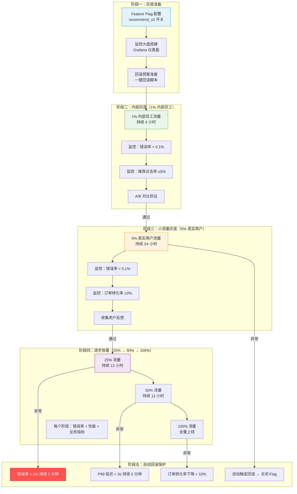

> 场景：线上故障从发现到修复的完整排查链路
> 涉及知识点：前端监控体系、错误采集、Sourcemap 还原、灰度发布、可观测性、故障排查
> 前置知识：01-03 全部内容

---

# 综合场景：线上故障从发现到修复的完整排查链路

---

## 一、场景背景

**故障描述**：
某电商平台在周五下午 15:30 完成了一次前端版本发布（v2.3.0），上线了新版的商品详情页。15:45 开始，监控平台陆续收到大量 JS 错误告警，同时用户反馈页面白屏，无法正常浏览商品。

**故障影响**：
- 影响用户数：约 8000 人
- 持续时间：45 分钟（15:30 - 16:15）
- 错误类型：`TypeError: Cannot read properties of undefined (reading 'price')`

**初始信息**：
- 最近发布：v2.3.0（15:30 上线）
- 错误率：从 0.05% 飙升至 3.2%
- 错误集中页面：`/product/:id`
- 受影响浏览器：Chrome 95%、Safari 5%

---

## 二、完整排查链路流程图

```mermaid
%%{init: {'themeVariables': {'fontSize': '16px'}}}%%
graph TD
    subgraph "阶段一：告警触发"
        A1["用户反馈：页面白屏"] --> A2["Sentry 告警：错误率 3.2%"]
        A2 --> A3["值班人员收到钉钉通知"]
        A3 --> A4["确认故障：影响 8000 用户"]
    end

    subgraph "阶段二：错误定位"
        B1["打开 Sentry Issue 页面"] --> B2["查看 Sourcemap 还原后的堆栈"]
        B2 --> B3["定位源码：ProductDetail.tsx:58"]
        B3 --> B4["查看 Breadcrumbs：用户进入商品详情页"]
        B4 --> B5["查看 Tags：v2.3.0 Release"]
        B5 --> B6["确认：v2.3.0 引入的问题"]
    end

    subgraph "阶段三：Sourcemap 还原"
        C1["压缩后堆栈：at a.js:1:23456"] --> C2["匹配 Release v2.3.0"]
        C2 --> C3["查找对应 Sourcemap 文件"]
        C3 --> C4["还原为源码位置"]
        C4 --> C5["ProductDetail.tsx:58 - product.price"]
    end

    subgraph "阶段四：代码修复"
        D1["分析根因：接口返回格式变化"] --> D2["product 对象缺少 price 字段"]
        D2 --> D3["添加可选链：product?.price ?? 0"]
        D3 --> D4["编写单元测试覆盖空值场景"]
        D4 --> D5["Code Review"]
    end

    subgraph "阶段五：灰度验证"
        E1["构建新版本 v2.3.1"] --> E2["灰度发布到 10% 用户"]
        E2 --> E3["监控 10 分钟：错误率归零"]
        E3 --> E4["放量至 50%：继续观察"]
        E4 --> E5["放量至 100%：全量上线"]
    end

    subgraph "阶段六：复盘总结"
        F1["编写复盘文档"] --> F2["根因分析：接口契约变更"]
        F2 --> F3["改进措施：接口类型校验"]
        F3 --> F4["改进措施：端到端测试"]
        F4 --> F5["改进措施：灰度发布流程"]
    end

    A4 --> B1
    B6 --> C1
    C5 --> D1
    D5 --> E1
    E5 --> F1

    style A1 fill:#FF5252,stroke:#D32F2F,color:#fff
    style B1 fill:#FF9800,stroke:#F57C00,color:#fff
    style C1 fill:#FFC107,stroke:#FFA000
    style D1 fill:#4CAF50,stroke:#388E3C,color:#fff
    style E1 fill:#2196F3,stroke:#1976D2,color:#fff
    style F1 fill:#9C27B0,stroke:#7B1FA2,color:#fff
```



---

## 三、各阶段详细操作

### 阶段一：告警触发（15:45）

```typescript
// Sentry 告警通知到钉钉的内容
// [CRITICAL] 错误率超过 1%
// 项目：my-ecommerce-app
// 环境：production
// 时间：2026-07-16 15:45:00
// 错误率：3.2%（阈值 1%）
// 影响用户：8000+
// Release：v2.3.0
// 详情：https://sentry.io/issues/123456

// 值班人员操作：
// 1. 确认告警真实性（查看 Sentry 实时数据）
// 2. 查看影响范围（用户数、页面、浏览器）
// 3. 通知团队负责人
// 4. 决定是否需要回滚
```

### 阶段二：错误定位（15:50）

```typescript
// Sentry Issue 页面信息
// ========== 错误详情 ==========
// 错误类型：TypeError
// 错误信息：Cannot read properties of undefined (reading 'price')
// 发生次数：12,345 次（最近 15 分钟）
// 影响用户：8,000+

// ========== Sourcemap 还原后的堆栈 ==========
// ProductDetail.tsx:58:25
//   at ProductDetail.render (src/pages/ProductDetail.tsx:58:25)
//   at finishClassComponent (react-dom.development.js:17164:31)
//   ...

// ========== Breadcrumbs ==========
// 1. [15:44:30] 导航：用户进入 /product/12345
// 2. [15:44:31] HTTP：GET /api/product/12345 → 200 (200ms)
// 3. [15:44:31] 点击：button.buy-now
// 4. [15:44:31] 错误：TypeError - Cannot read properties of undefined

// ========== Tags ==========
// release: v2.3.0
// environment: production
// browser: Chrome 120.0
// page: /product/:id
// os: Windows 10

// 定位结论：v2.3.0 版本中 ProductDetail.tsx 第 58 行存在问题
```

### 阶段三：Sourcemap 还原（15:55）

```typescript
// 压缩后代码（浏览器中看到的）
// a.js:1:23456
// ...function(){var t=this.props.product;return t.price.toFixed(2)}...

// 通过 Sentry Sourcemap 还原后的源码
// src/pages/ProductDetail.tsx:58

// 问题代码（v2.3.0）
function ProductDetail({ product }: Props) {
  // 第 58 行：直接访问 product.price，未做空值判断
  const formattedPrice = product.price.toFixed(2); // ← 这里报错

  return (
    <div className="product-detail">
      <h1>{product.name}</h1>
      <span className="price">¥{formattedPrice}</span>
      <button className="buy-now">立即购买</button>
    </div>
  );
}

// 根因分析：
// v2.3.0 重构了 /api/product/:id 接口返回格式
// 旧格式：{ id, name, price, stock, ... }
// 新格式：{ id, name, pricing: { price, originalPrice }, stock, ... }
// 但前端组件代码仍按旧格式读取 product.price
// 导致 product.price 为 undefined, .toFixed(2) 报错
```

### 阶段四：代码修复（16:00）

```typescript
// ========== 修复代码 ==========

// 修复方案一：兼容新旧格式（推荐）
function ProductDetail({ product }: Props) {
  // 兼容新格式（pricing.price）和旧格式（price）
  const price = product?.pricing?.price ?? product?.price ?? 0;
  const formattedPrice = price.toFixed(2);

  return (
    <div className="product-detail">
      <h1>{product?.name ?? '商品'}</h1>
      <span className="price">¥{formattedPrice}</span>
      <button className="buy-now">立即购买</button>
    </div>
  );
}

// 修复方案二：使用 TypeScript 类型守卫（长期方案）
interface ProductPrice {
  price: number;
  originalPrice?: number;
}

interface Product {
  id: string;
  name: string;
  // 明确声明 price 可能来自两个位置
  price?: number;            // 旧格式
  pricing?: ProductPrice;    // 新格式
  stock: number;
}

// 统一获取价格
function getProductPrice(product: Product): number {
  return product.pricing?.price ?? product.price ?? 0;
}

// ========== 单元测试 ==========
// src/pages/__tests__/ProductDetail.test.tsx
describe('ProductDetail', () => {
  it('新格式：product.pricing.price 存在时正常渲染', () => {
    const product = {
      id: '123',
      name: '测试商品',
      pricing: { price: 99.99 },
      stock: 100,
    };
    const { getByText } = render(<ProductDetail product={product} />);
    expect(getByText('¥99.99')).toBeInTheDocument();
  });

  it('旧格式：product.price 存在时正常渲染', () => {
    const product = {
      id: '123',
      name: '测试商品',
      price: 88.88,
      stock: 100,
    };
    const { getByText } = render(<ProductDetail product={product} />);
    expect(getByText('¥88.88')).toBeInTheDocument();
  });

  it('price 和 pricing 都不存在时显示 ¥0.00', () => {
    const product = { id: '123', name: '测试商品', stock: 100 };
    const { getByText } = render(<ProductDetail product={product} />);
    expect(getByText('¥0.00')).toBeInTheDocument();
  });

  it('product 为 undefined 时不报错', () => {
    const { container } = render(<ProductDetail product={undefined as any} />);
    expect(container).toBeInTheDocument();
  });
});
```

### 阶段五：灰度验证（16:05）

```typescript
// ========== 灰度发布流程 ==========

// 1. 构建新版本 v2.3.1
// pnpm build
// 生成 Sourcemap → 上传 Sentry → 删除 .map 文件

// 2. Nginx 灰度配置（10% 流量 → v2.3.1）
// split_clients "${remote_addr}" $version {
//     10%  "v2.3.1";
//     *    "v2.3.0";
// }

// 3. 监控验证（10 分钟观察期）
// 监控指标：
//   - 错误率：0%（之前 3.2%）
//   - P99 响应时间：正常
//   - 用户反馈：无新增白屏反馈
//   - 商品详情页 PV：正常

// 4. 放量计划
// 16:05 - 10% 流量，观察 10 分钟 → 错误率 0%
// 16:15 - 50% 流量，观察 5 分钟  → 错误率 0%
// 16:20 - 100% 流量，全量上线    → 错误率 0%

// 5. 确认修复
// Sentry 中 v2.3.1 的错误量归零
// 用户反馈恢复
```

### 阶段六：复盘总结（16:30）

```markdown
# 故障复盘报告

## 基本信息
- 故障时间：2026-07-16 15:30 - 16:15（45 分钟）
- 影响范围：约 8000 用户
- 故障类型：JS 运行时错误导致页面白屏
- 触发版本：v2.3.0

## 根因分析
1. **直接原因**：v2.3.0 重构了商品接口返回格式（price → pricing.price），
   但前端组件未同步更新，导致 product.price 为 undefined
2. **根本原因**：前后端接口契约变更未通过文档和类型系统同步
3. **促成因素**：代码缺乏空值保护；无端到端测试覆盖

## 改进措施
| 措施 | 负责人 | 截止日期 | 优先级 |
|---|---|---|---|
| 接口变更必须同步更新 API 文档和 TypeScript 类型 | 后端负责人 | 2026-07-20 | P0 |
| 前端添加接口响应格式校验（Zod/Yup） | 前端负责人 | 2026-07-23 | P0 |
| 添加商品详情页端到端测试 | QA 负责人 | 2026-07-25 | P1 |
| 完善 Code Review 清单：接口变更检查项 | 技术负责人 | 2026-07-20 | P1 |
| 灰度发布标准化流程：10% → 30 分钟观察 → 50% → 100% | DevOps | 2026-07-30 | P2 |

## 时间线
- 15:30 - v2.3.0 上线
- 15:45 - Sentry 告警触发
- 15:50 - 错误定位到 ProductDetail.tsx:58
- 15:55 - 通过 Sourcemap 还原确认根因
- 16:00 - 代码修复完成
- 16:05 - 灰度发布 v2.3.1（10%）
- 16:15 - 验证通过，全量上线
- 16:30 - 复盘文档完成
```

---

## 四、涉及知识点

| 知识点 | 关联文件 | 在本场景中的应用 |
|---|---|---|
| 前端监控体系 - Sentry 接入 | [01-前端监控体系 - 3.1](./01-前端监控体系.md) | Sentry 捕获错误、告警通知、错误分组 |
| 前端监控体系 - Sourcemap 还原 | [01-前端监控体系 - 2.4](./01-前端监控体系.md) | 压缩后堆栈还原为源码位置 |
| 前端监控体系 - 错误采集 | [01-前端监控体系 - 2.1](./01-前端监控体系.md) | window.onerror 捕获 JS 运行时错误 |
| 前端监控体系 - Breadcrumbs | [01-前端监控体系 - 1.2](./01-前端监控体系.md) | 还原用户操作轨迹（进入页面 → 加载数据 → 报错） |
| 灰度发布 - Nginx 灰度 | [02-灰度发布与部署策略 - 2.1](./02-灰度发布与部署策略.md) | 按比例分流到新旧版本 |
| 灰度发布 - Feature Flags | [02-灰度发布与部署策略 - 1.1](./02-灰度发布与部署策略.md) | 通过 Flag 快速回滚新功能 |
| 可观测性 - 故障排查流程 | [03-可观测性与故障排查 - 1.2](./03-可观测性与故障排查.md) | 六步法：发现→定位→复现→修复→验证→复盘 |
| 可观测性 - 告警策略 | [03-可观测性与故障排查 - 2.4](./03-可观测性与故障排查.md) | 错误率阈值告警、冷却时间、分级通知 |

---

## 五、关键代码汇总

### 5.1 错误复现代码

```typescript
// 复现条件：接口返回新格式，组件读取旧格式
// GET /api/product/12345 返回：
// { id: "12345", name: "商品A", pricing: { price: 99.99 }, stock: 100 }

// 组件代码（v2.3.0 - 有问题）
const formattedPrice = product.price.toFixed(2);
// 结果：TypeError: Cannot read properties of undefined (reading 'toFixed')
// 因为 product.price 是 undefined
```

### 5.2 修复后代码

```typescript
// 组件代码（v2.3.1 - 已修复）
const price = product?.pricing?.price ?? product?.price ?? 0;
const formattedPrice = price.toFixed(2);
// 结果：99.99（从 pricing.price 读取）
```

### 5.3 灰度验证监控

```typescript
// 灰度期间监控脚本
async function monitorCanaryRelease() {
  // 检查 Sentry 错误率
  const errorRate = await getSentryErrorRate('v2.3.1', '5m');
  if (errorRate > 0.001) { // 0.1%
    console.error('灰度版本错误率异常:', errorRate);
    // 触发回滚
    await rollbackCanary();
  }

  // 检查 P99 响应时间
  const p99 = await getP99ResponseTime('v2.3.1');
  if (p99 > 3000) {
    console.error('灰度版本 P99 响应时间异常:', p99);
    await rollbackCanary();
  }

  console.log('灰度版本监控正常，可以继续放量');
}
```

---

## 学习导航

- [01-前端监控体系](./01-前端监控体系.md)
- [02-灰度发布与部署策略](./02-灰度发布与部署策略.md)
- [03-可观测性与故障排查](./03-可观测性与故障排查.md)
- [笔面试题集](./04-前端监控与运维笔面试题集.md)
- [常见错误汇总](./常见错误汇总.md)
- [概念对比速查](./概念对比速查.md)

---

> 场景：电商大促期间需要安全上线新功能（新版推荐算法模块）
> 涉及知识点：Feature Flags 配置、灰度策略设计、监控指标采集、自动回滚决策
> 前置知识：01-03 全部内容

---

# 综合场景二：渐进式灰度发布实战

---

## 一、场景背景

**项目概况**：
- 某电商平台即将迎来"618 大促"，运营团队要求上线新版智能推荐算法模块
- 推荐模块是核心交易链路的关键环节，直接影响 GMV 转化率
- 新版算法引入了个性化推荐模型，需要在大促高流量场景下验证稳定性和效果
- 绝对不能出现全量故障 —— 一旦出现问题必须秒级回滚

**场景约束**：

| 约束 | 说明 |
|---|---|
| 时间窗口 | 618 大促前 2 周开始灰度，大促前 3 天必须全量 |
| 流量规模 | 日均 PV 2000 万+，大促期间峰值 5000 万+ |
| 回滚要求 | 发现问题后 30 秒内完成回滚 |
| 监控指标 | 错误率、推荐点击率、页面加载时间、订单转化率 |
| 灰度粒度 | 支持按用户 ID、地域、设备类型、百分比分流 |

**风险分析**：

| 风险 | 可能性 | 影响 | 缓解措施 |
|---|---|---|---|
| 推荐接口响应慢 | 中 | 高 - 页面加载超时，用户流失 | 设置 2 秒超时，超时后降级到旧版推荐 |
| 算法模型崩溃 | 低 | 极高 - 推荐模块完全不可用 | Feature Flag 秒级关闭，自动降级 |
| 数据不一致 | 中 | 中 - 新旧算法返回不同推荐结果 | 同时请求新旧接口，对比差异监控 |
| 大促流量冲击 | 高 | 高 - 推荐服务过载 | 限流 + 熔断 + 降级三级保护 |

---

## 二、渐进式灰度发布架构

### 灰度发布全流程



---

## 三、涉及知识点

| 知识点 | 关联文件 | 在本场景中的应用 |
|---|---|---|
| 灰度发布 - Feature Flags 体系 | [02-灰度发布与部署策略 - 1.1](./02-灰度发布与部署策略.md) | 使用 LaunchDarkly 风格 Feature Flag 控制推荐模块上线 |
| 灰度发布 - 灰度策略设计 | [02-灰度发布与部署策略 - 2.1](./02-灰度发布与部署策略.md) | 设计内部员工→5%→25%→50%→100% 的渐进式放量策略 |
| 灰度发布 - 金丝雀部署 | [02-灰度发布与部署策略 - 2.3](./02-灰度发布与部署策略.md) | 小流量验证新版本，监控指标异常自动回滚 |
| 前端监控 - 错误采集 | [01-前端监控体系 - 2.1](./01-前端监控体系.md) | 采集新版推荐模块的 JS 错误和接口异常 |
| 前端监控 - 性能指标 | [01-前端监控体系 - 2.3](./01-前端监控体系.md) | 监控推荐模块的加载时间、接口响应时间 |
| 可观测性 - 监控大盘 | [03-可观测性与故障排查 - 2.2](./03-可观测性与故障排查.md) | Grafana 大盘实时展示灰度版本 vs 稳定版本的各项指标对比 |
| 可观测性 - 告警策略 | [03-可观测性与故障排查 - 2.4](./03-可观测性与故障排查.md) | 配置错误率、延迟、转化率三重告警，自动触发回滚 |
| 可观测性 - 故障排查 | [03-可观测性与故障排查 - 1.2](./03-可观测性与故障排查.md) | 灰度期间出现异常时的排查流程 |

---

## 四、完整实战代码 / 方案

### 4.1 Feature Flags 配置体系

```typescript
// ========================
// Feature Flag 类型定义
// src/feature-flags/types.ts
// ========================

export interface FeatureFlag {
  /** 唯一标识 */
  key: string;
  /** 显示名称 */
  name: string;
  /** 描述 */
  description: string;
  /** 是否启用 */
  enabled: boolean;
  /** 灰度策略类型 */
  strategy: FlagStrategy;
  /** 创建时间 */
  createdAt: string;
  /** 更新时间 */
  updatedAt: string;
}

export type FlagStrategy =
  | { type: 'boolean'; value: boolean }
  | { type: 'percentage'; percentage: number }           // 百分比灰度
  | { type: 'userIds'; userIds: string[] }              // 指定用户
  | { type: 'userHash'; percentage: number }            // 用户哈希一致性分流
  | { type: 'region'; regions: string[] }               // 按地域
  | { type: 'device'; devices: ('mobile' | 'desktop' | 'tablet')[] }  // 按设备
  | { type: 'composite'; rules: FlagStrategy[]; operator: 'and' | 'or' }; // 组合规则

// ========================
// Feature Flag 配置（JSON 或远程配置中心）
// config/feature-flags.json
// ========================

{
  "flags": [
    {
      "key": "recommend_v2",
      "name": "新版推荐算法",
      "description": "618 大促新版智能推荐算法模块",
      "enabled": true,
      "strategy": {
        "type": "composite",
        "operator": "and",
        "rules": [
          {
            "type": "percentage",
            "percentage": 5
          },
          {
            "type": "userHash",
            "percentage": 5
          }
        ]
      }
    },
    {
      "key": "recommend_v2_internal",
      "name": "新版推荐算法-内部测试",
      "description": "仅内部员工可见的新版推荐",
      "enabled": true,
      "strategy": {
        "type": "userIds",
        "userIds": [
          "emp_001", "emp_002", "emp_003",
          "emp_100", "emp_101", "emp_102"
        ]
      }
    },
    {
      "key": "new_checkout_flow",
      "name": "新版结算流程",
      "description": "优化后的结算页面",
      "enabled": false,
      "strategy": {
        "type": "boolean",
        "value": false
      }
    }
  ]
}


// ========================
// Feature Flag 评估引擎
// src/feature-flags/evaluator.ts
// ========================

import type { FeatureFlag, FlagStrategy } from './types';

interface EvaluationContext {
  userId?: string;
  region?: string;
  device?: 'mobile' | 'desktop' | 'tablet';
  attributes?: Record<string, string | number | boolean>;
}

/**
 * 评估单个 Flag 策略
 */
function evaluateStrategy(
  strategy: FlagStrategy,
  context: EvaluationContext
): boolean {
  switch (strategy.type) {
    // ---- 布尔开关 ----
    case 'boolean':
      return strategy.value;

    // ---- 百分比灰度 ----
    case 'percentage':
      return Math.random() * 100 < strategy.percentage;

    // ---- 用户哈希一致性分流（同一用户始终看到同一版本） ----
    case 'userHash': {
      if (!context.userId) return false;
      // 使用简单哈希确保同一用户始终落入同一桶
      const hash = hashString(context.userId);
      return (hash % 100) < strategy.percentage;
    }

    // ---- 指定用户 ----
    case 'userIds':
      return context.userId ? strategy.userIds.includes(context.userId) : false;

    // ---- 按地域 ----
    case 'region':
      return context.region ? strategy.regions.includes(context.region) : false;

    // ---- 按设备 ----
    case 'device':
      return context.device ? strategy.devices.includes(context.device) : false;

    // ---- 组合规则 ----
    case 'composite': {
      const results = strategy.rules.map((rule) =>
        evaluateStrategy(rule, context)
      );
      return strategy.operator === 'and'
        ? results.every(Boolean)
        : results.some(Boolean);
    }

    default:
      return false;
  }
}

/**
 * 简单字符串哈希函数
 */
function hashString(str: string): number {
  let hash = 5381;
  for (let i = 0; i < str.length; i++) {
    hash = ((hash << 5) + hash + str.charCodeAt(i)) & 0xffffffff;
  }
  return Math.abs(hash);
}

/**
 * 评估 Flag 是否对当前用户生效
 */
export function isFeatureEnabled(
  flag: FeatureFlag,
  context: EvaluationContext
): boolean {
  if (!flag.enabled) return false;
  return evaluateStrategy(flag.strategy, context);
}


// ========================
// Feature Flag 管理服务
// src/feature-flags/FlagService.ts
// ========================

import type { FeatureFlag, FlagStrategy } from './types';
import { isFeatureEnabled } from './evaluator';

class FlagService {
  private flags: Map<string, FeatureFlag> = new Map();
  private pollingInterval: number | null = null;

  /**
   * 初始化：从配置中心加载 Flag
   */
  async init(configUrl: string): Promise<void> {
    const response = await fetch(configUrl);
    const data = await response.json();
    this.flags.clear();
    data.flags.forEach((flag: FeatureFlag) => {
      this.flags.set(flag.key, flag);
    });
  }

  /**
   * 启动轮询（每 30 秒拉取最新配置）
   */
  startPolling(configUrl: string, intervalMs = 30000): void {
    this.pollingInterval = window.setInterval(() => {
      this.init(configUrl).catch(console.error);
    }, intervalMs);
  }

  /**
   * 停止轮询
   */
  stopPolling(): void {
    if (this.pollingInterval !== null) {
      clearInterval(this.pollingInterval);
      this.pollingInterval = null;
    }
  }

  /**
   * 立即更新 Flag 策略（用于紧急回滚场景）
   */
  async updateFlag(key: string, strategy: Partial<FlagStrategy>): Promise<void> {
    const flag = this.flags.get(key);
    if (!flag) throw new Error(`Flag ${key} 不存在`);

    // 调用配置中心 API 更新
    await fetch('/api/flags/update', {
      method: 'POST',
      headers: { 'Content-Type': 'application/json' },
      body: JSON.stringify({ key, strategy }),
    });

    // 本地立即生效
    flag.strategy = { ...flag.strategy, ...strategy } as FlagStrategy;
    this.flags.set(key, flag);
  }

  /**
   * 紧急关闭 Flag（回滚用）
   */
  async emergencyOff(key: string): Promise<void> {
    await fetch('/api/flags/emergency-off', {
      method: 'POST',
      headers: { 'Content-Type': 'application/json' },
      body: JSON.stringify({ key, reason: '自动回滚触发' }),
    });

    const flag = this.flags.get(key);
    if (flag) {
      flag.enabled = false;
      this.flags.set(key, flag);
    }
  }

  /**
   * 获取 Flag 值
   */
  getFlag(key: string): FeatureFlag | undefined {
    return this.flags.get(key);
  }
}

// 单例导出
export const flagService = new FlagService();


// ========================
// React Hook 封装
// src/feature-flags/useFeatureFlag.ts
// ========================

import { useState, useEffect, useCallback } from 'react';
import { flagService } from './FlagService';
import { isFeatureEnabled } from './evaluator';

export function useFeatureFlag(
  flagKey: string,
  context: { userId?: string; region?: string; device?: string }
): boolean {
  const [enabled, setEnabled] = useState(false);

  const evaluate = useCallback(() => {
    const flag = flagService.getFlag(flagKey);
    if (!flag) {
      setEnabled(false);
      return;
    }
    setEnabled(isFeatureEnabled(flag, context));
  }, [flagKey, context.userId, context.region, context.device]);

  useEffect(() => {
    evaluate();

    // 监听 Flag 更新事件
    const handler = () => evaluate();
    window.addEventListener('feature-flags-updated', handler);
    return () => window.removeEventListener('feature-flags-updated', handler);
  }, [evaluate]);

  return enabled;
}
```

### 4.2 灰度策略设计

```typescript
// ========================
// 灰度发布管线配置
// src/canary/pipeline.ts
// ========================

export interface CanaryStage {
  name: string;
  percentage: number;
  durationMinutes: number;
  /** 该阶段是否必须通过监控验证才能进入下一阶段 */
  requireValidation: boolean;
  /** 监控指标阈值 */
  thresholds: MetricThreshold[];
  /** 目标用户群 */
  targetUsers?: 'internal' | 'all';
}

export interface MetricThreshold {
  metric: string;
  /** 比较方式：新版 vs 旧版 */
  comparison: 'absolute' | 'relative';
  /** 阈值 */
  value: number;
  /** 运算符 */
  operator: 'lt' | 'gt' | 'lte' | 'gte';
  /** 持续超过阈值多久才触发告警（秒） */
  sustainedSeconds: number;
  /** 触发后的动作 */
  action: 'alert' | 'pause' | 'rollback';
}

/**
 * 推荐模块灰度发布管线
 */
export const recommendV2CanaryPipeline: CanaryStage[] = [
  // ---- 阶段 0：内部灰度 ----
  {
    name: '内部员工灰度',
    percentage: 100, // 对内部员工 100% 生效
    durationMinutes: 240, // 4 小时
    requireValidation: true,
    targetUsers: 'internal',
    thresholds: [
      {
        metric: 'error_rate',
        comparison: 'absolute',
        value: 0.001, // 0.1%
        operator: 'lt',
        sustainedSeconds: 120,
        action: 'rollback',
      },
      {
        metric: 'p99_latency_ms',
        comparison: 'absolute',
        value: 2000, // 2 秒
        operator: 'lt',
        sustainedSeconds: 300,
        action: 'pause',
      },
    ],
  },

  // ---- 阶段 1：5% 真实用户 ----
  {
    name: '5% 真实用户灰度',
    percentage: 5,
    durationMinutes: 1440, // 24 小时
    requireValidation: true,
    targetUsers: 'all',
    thresholds: [
      {
        metric: 'error_rate',
        comparison: 'absolute',
        value: 0.001, // 0.1%
        operator: 'lt',
        sustainedSeconds: 120,
        action: 'rollback',
      },
      {
        metric: 'p99_latency_ms',
        comparison: 'absolute',
        value: 3000, // 3 秒
        operator: 'lt',
        sustainedSeconds: 300,
        action: 'rollback',
      },
      {
        metric: 'conversion_rate',
        comparison: 'relative',
        value: -0.05, // 转化率下降不超过 5%
        operator: 'gt',
        sustainedSeconds: 600,
        action: 'pause',
      },
      {
        metric: 'click_through_rate',
        comparison: 'relative',
        value: -0.10, // 推荐点击率下降不超过 10%
        operator: 'gt',
        sustainedSeconds: 600,
        action: 'alert',
      },
    ],
  },

  // ---- 阶段 2：25% 流量 ----
  {
    name: '25% 流量灰度',
    percentage: 25,
    durationMinutes: 720, // 12 小时
    requireValidation: true,
    targetUsers: 'all',
    thresholds: [
      {
        metric: 'error_rate',
        comparison: 'absolute',
        value: 0.001,
        operator: 'lt',
        sustainedSeconds: 120,
        action: 'rollback',
      },
      {
        metric: 'p99_latency_ms',
        comparison: 'absolute',
        value: 3000,
        operator: 'lt',
        sustainedSeconds: 300,
        action: 'rollback',
      },
      {
        metric: 'conversion_rate',
        comparison: 'relative',
        value: -0.03,
        operator: 'gt',
        sustainedSeconds: 600,
        action: 'pause',
      },
    ],
  },

  // ---- 阶段 3：50% 流量 ----
  {
    name: '50% 流量灰度',
    percentage: 50,
    durationMinutes: 720, // 12 小时
    requireValidation: true,
    targetUsers: 'all',
    thresholds: [
      {
        metric: 'error_rate',
        comparison: 'absolute',
        value: 0.001,
        operator: 'lt',
        sustainedSeconds: 120,
        action: 'rollback',
      },
      {
        metric: 'p99_latency_ms',
        comparison: 'absolute',
        value: 3000,
        operator: 'lt',
        sustainedSeconds: 300,
        action: 'rollback',
      },
      {
        metric: 'conversion_rate',
        comparison: 'relative',
        value: -0.02,
        operator: 'gt',
        sustainedSeconds: 600,
        action: 'pause',
      },
    ],
  },

  // ---- 阶段 4：100% 全量 ----
  {
    name: '100% 全量上线',
    percentage: 100,
    durationMinutes: 0, // 持续监控
    requireValidation: false,
    targetUsers: 'all',
    thresholds: [
      {
        metric: 'error_rate',
        comparison: 'absolute',
        value: 0.001,
        operator: 'lt',
        sustainedSeconds: 120,
        action: 'rollback',
      },
    ],
  },
];
```

### 4.3 监控指标采集

```typescript
// ========================
// 监控指标采集器
// src/monitoring/metrics-collector.ts
// ========================

interface MetricPoint {
  name: string;
  value: number;
  tags: Record<string, string>;
  timestamp: number;
}

interface MetricConfig {
  /** 指标名称 */
  name: string;
  /** 采集方式 */
  type: 'counter' | 'gauge' | 'histogram' | 'timer';
  /** 帮助文本 */
  help: string;
  /** 标签 */
  labelNames: string[];
}

class MetricsCollector {
  private metrics: Map<string, MetricConfig> = new Map();
  private buffer: MetricPoint[] = [];
  private flushInterval: number | null = null;

  /**
   * 注册指标
   */
  registerMetric(config: MetricConfig): void {
    this.metrics.set(config.name, config);
  }

  /**
   * 记录计数器（如错误次数）
   */
  incrementCounter(name: string, tags: Record<string, string> = {}): void {
    this.buffer.push({
      name,
      value: 1,
      tags,
      timestamp: Date.now(),
    });
  }

  /**
   * 记录 Gauge（如当前灰度百分比）
   */
  setGauge(name: string, value: number, tags: Record<string, string> = {}): void {
    this.buffer.push({
      name,
      value,
      tags,
      timestamp: Date.now(),
    });
  }

  /**
   * 记录耗时（毫秒）
   */
  recordTimer(name: string, durationMs: number, tags: Record<string, string> = {}): void {
    this.buffer.push({
      name,
      value: durationMs,
      tags,
      timestamp: Date.now(),
    });
  }

  /**
   * 开始采集（每 10 秒批量上报）
   */
  startCollecting(reportUrl: string, intervalMs = 10000): void {
    this.flushInterval = window.setInterval(() => {
      this.flush(reportUrl);
    }, intervalMs);
  }

  /**
   * 停止采集
   */
  stopCollecting(): void {
    if (this.flushInterval !== null) {
      clearInterval(this.flushInterval);
      this.flushInterval = null;
    }
  }

  /**
   * 批量上报
   */
  private async flush(reportUrl: string): Promise<void> {
    if (this.buffer.length === 0) return;

    const points = this.buffer.splice(0, this.buffer.length);

    try {
      await fetch(reportUrl, {
        method: 'POST',
        headers: { 'Content-Type': 'application/json' },
        body: JSON.stringify({
          metrics: points,
          source: 'frontend',
          timestamp: Date.now(),
        }),
      });
    } catch (error) {
      // 上报失败时重新放回缓冲区（限制大小）
      if (this.buffer.length < 1000) {
        this.buffer.unshift(...points);
      }
    }
  }
}

export const metricsCollector = new MetricsCollector();


// ========================
// 推荐模块专用监控包装器
// src/monitoring/recommend-monitor.ts
// ========================

import { metricsCollector } from './metrics-collector';

/**
 * 推荐模块监控装饰器
 */
export class RecommendMonitor {
  private version: string;
  private userId: string;

  constructor(version: string, userId: string) {
    this.version = version;
    this.userId = userId;
  }

  /**
   * 包装推荐 API 调用，自动采集指标
   */
  async wrapRecommendCall<T>(fn: () => Promise<T>): Promise<T> {
    const startTime = performance.now();
    const tags = {
      version: this.version,
      userId: this.userId,
    };

    try {
      const result = await fn();
      const duration = performance.now() - startTime;

      // 记录成功耗时
      metricsCollector.recordTimer('recommend_api_duration_ms', duration, {
        ...tags,
        status: 'success',
      });

      // 记录 P50/P99 耗时分布
      metricsCollector.setGauge('recommend_api_latency', duration, tags);

      return result;
    } catch (error) {
      const duration = performance.now() - startTime;

      // 记录错误
      metricsCollector.incrementCounter('recommend_api_error', {
        ...tags,
        errorType: (error as Error).name,
      });

      // 记录错误耗时
      metricsCollector.recordTimer('recommend_api_duration_ms', duration, {
        ...tags,
        status: 'error',
      });

      throw error;
    }
  }

  /**
   * 记录推荐点击事件
   */
  recordClick(productId: string, position: number): void {
    metricsCollector.incrementCounter('recommend_click', {
      version: this.version,
      userId: this.userId,
      productId,
      position: String(position),
    });
  }

  /**
   * 记录推荐曝光事件
   */
  recordImpression(productIds: string[]): void {
    metricsCollector.incrementCounter('recommend_impression', {
      version: this.version,
      userId: this.userId,
      count: String(productIds.length),
    });
  }

  /**
   * 记录推荐相关订单转化
   */
  recordConversion(productId: string, orderAmount: number): void {
    metricsCollector.incrementCounter('recommend_conversion', {
      version: this.version,
      userId: this.userId,
      productId,
    });
    metricsCollector.setGauge('recommend_order_amount', orderAmount, {
      version: this.version,
    });
  }
}


// ========================
// 使用示例：推荐组件中集成监控
// src/components/RecommendSection.tsx
// ========================

import React, { useEffect, useState } from 'react';
import { useFeatureFlag } from '../feature-flags/useFeatureFlag';
import { RecommendMonitor } from '../monitoring/recommend-monitor';
import { RecommendV1 } from './RecommendV1';
import { RecommendV2 } from './RecommendV2';

function RecommendSection({ userId }: { userId: string }) {
  const useV2 = useFeatureFlag('recommend_v2', { userId });
  const version = useV2 ? 'v2' : 'v1';
  const monitor = new RecommendMonitor(version, userId);

  const [products, setProducts] = useState([]);
  const [loading, setLoading] = useState(true);

  useEffect(() => {
    const fetchRecommendations = async () => {
      try {
        const data = await monitor.wrapRecommendCall(async () => {
          // 根据版本调用不同的推荐接口
          const endpoint = useV2 ? '/api/recommend/v2' : '/api/recommend/v1';
          const res = await fetch(`${endpoint}?userId=${userId}`);
          return res.json();
        });
        setProducts(data);
        monitor.recordImpression(data.map((p: any) => p.id));
      } catch (error) {
        console.error('推荐加载失败:', error);
      } finally {
        setLoading(false);
      }
    };

    fetchRecommendations();
  }, [useV2, userId]);

  const handleProductClick = (productId: string, position: number) => {
    monitor.recordClick(productId, position);
  };

  if (loading) return <RecommendSkeleton />;

  return useV2 ? (
    <RecommendV2 products={products} onProductClick={handleProductClick} />
  ) : (
    <RecommendV1 products={products} onProductClick={handleProductClick} />
  );
}
```

### 4.4 回滚决策流程

```typescript
// ========================
// 自动回滚决策引擎
// src/canary/auto-rollback.ts
// ========================

import type { CanaryStage, MetricThreshold } from './pipeline';
import { flagService } from '../feature-flags/FlagService';

interface MetricSnapshot {
  name: string;
  currentValue: number;
  baselineValue: number;   // 旧版本的基准值
  threshold: number;
  breached: boolean;
  sustainedSeconds: number;
}

interface StageHealth {
  stage: string;
  healthy: boolean;
  metrics: MetricSnapshot[];
  recommendation: 'proceed' | 'pause' | 'rollback';
  reason?: string;
}

/**
 * 自动回滚决策引擎
 */
class AutoRollbackEngine {
  private metricHistory: Map<string, Array<{ value: number; timestamp: number }>> = new Map();
  private checkInterval: number | null = null;

  /**
   * 评估当前阶段健康状态
   */
  evaluateStage(stage: CanaryStage): StageHealth {
    const snapshots: MetricSnapshot[] = [];

    for (const threshold of stage.thresholds) {
      const currentValue = this.getCurrentMetricValue(threshold.metric);
      const baselineValue = this.getBaselineValue(threshold.metric);
      const sustainedSeconds = this.getSustainedBreachDuration(
        threshold.metric,
        threshold
      );

      const breached = this.isThresholdBreached(
        currentValue,
        baselineValue,
        threshold
      ) && sustainedSeconds >= threshold.sustainedSeconds;

      snapshots.push({
        name: threshold.metric,
        currentValue,
        baselineValue,
        threshold: threshold.value,
        breached,
        sustainedSeconds,
      });
    }

    const rollbackMetric = snapshots.find(
      (s) => s.breached &&
        stage.thresholds.find((t) => t.metric === s.name)?.action === 'rollback'
    );

    const pauseMetric = snapshots.find(
      (s) => s.breached &&
        stage.thresholds.find((t) => t.metric === s.name)?.action === 'pause'
    );

    if (rollbackMetric) {
      return {
        stage: stage.name,
        healthy: false,
        metrics: snapshots,
        recommendation: 'rollback',
        reason: `${rollbackMetric.name} 持续 ${rollbackMetric.sustainedSeconds} 秒超过阈值`,
      };
    }

    if (pauseMetric) {
      return {
        stage: stage.name,
        healthy: false,
        metrics: snapshots,
        recommendation: 'pause',
        reason: `${pauseMetric.name} 持续 ${pauseMetric.sustainedSeconds} 秒超过阈值`,
      };
    }

    return {
      stage: stage.name,
      healthy: true,
      metrics: snapshots,
      recommendation: 'proceed',
    };
  }

  /**
   * 执行回滚
   */
  async executeRollback(flagKey: string, reason: string): Promise<void> {
    console.error(`[AutoRollback] 触发自动回滚: ${flagKey}, 原因: ${reason}`);

    // 1. 立即关闭 Feature Flag
    await flagService.emergencyOff(flagKey);

    // 2. 发送告警通知
    await this.sendAlert({
      level: 'critical',
      title: `自动回滚触发: ${flagKey}`,
      message: reason,
      timestamp: new Date().toISOString(),
    });

    // 3. 记录回滚事件（用于事后复盘）
    metricsCollector.incrementCounter('canary_rollback', {
      flagKey,
      reason,
    });
  }

  /**
   * 暂停灰度
   */
  async pauseCanary(flagKey: string, reason: string): Promise<void> {
    console.warn(`[Canary] 暂停灰度: ${flagKey}, 原因: ${reason}`);

    await this.sendAlert({
      level: 'warning',
      title: `灰度暂停: ${flagKey}`,
      message: reason,
      timestamp: new Date().toISOString(),
    });
  }

  /**
   * 判断阈值是否被突破
   */
  private isThresholdBreached(
    currentValue: number,
    baselineValue: number,
    threshold: MetricThreshold
  ): boolean {
    if (threshold.comparison === 'absolute') {
      switch (threshold.operator) {
        case 'lt': return currentValue < threshold.value;
        case 'gt': return currentValue > threshold.value;
        case 'lte': return currentValue <= threshold.value;
        case 'gte': return currentValue >= threshold.value;
      }
    } else {
      // 相对比较：新版 vs 旧版
      const relativeChange = (currentValue - baselineValue) / baselineValue;
      switch (threshold.operator) {
        case 'lt': return relativeChange < threshold.value;
        case 'gt': return relativeChange > threshold.value;
        case 'lte': return relativeChange <= threshold.value;
        case 'gte': return relativeChange >= threshold.value;
      }
    }
  }

  /**
   * 获取指标当前值（从监控系统查询）
   */
  private getCurrentMetricValue(metric: string): number {
    // 实际实现中从 Prometheus / Grafana API 查询
    const history = this.metricHistory.get(metric);
    if (!history || history.length === 0) return 0;
    return history[history.length - 1].value;
  }

  /**
   * 获取指标基准值（旧版本的值）
   */
  private getBaselineValue(metric: string): number {
    // 实际实现中从监控系统查询旧版本指标
    const history = this.metricHistory.get(`${metric}_baseline`);
    if (!history || history.length === 0) return 0;
    return history[history.length - 1].value;
  }

  /**
   * 获取指标持续超过阈值的时长（秒）
   */
  private getSustainedBreachDuration(
    metric: string,
    threshold: MetricThreshold
  ): number {
    const history = this.metricHistory.get(metric);
    if (!history || history.length === 0) return 0;

    const baselineValue = this.getBaselineValue(metric);
    let sustainedCount = 0;

    // 从最近的数据点往前数
    for (let i = history.length - 1; i >= 0; i--) {
      if (this.isThresholdBreached(history[i].value, baselineValue, threshold)) {
        sustainedCount++;
      } else {
        break;
      }
    }

    // 假设每个数据点间隔 10 秒
    return sustainedCount * 10;
  }

  /**
   * 发送告警通知
   */
  private async sendAlert(alert: {
    level: string;
    title: string;
    message: string;
    timestamp: string;
  }): Promise<void> {
    // 钉钉 / 飞书 / 企业微信告警
    await fetch('/api/alerts', {
      method: 'POST',
      headers: { 'Content-Type': 'application/json' },
      body: JSON.stringify(alert),
    });
  }

  /**
   * 开始持续监控
   */
  startMonitoring(stages: CanaryStage[], flagKey: string, checkIntervalMs = 30000): void {
    this.checkInterval = window.setInterval(async () => {
      const currentStage = stages[0]; // 当前阶段
      if (!currentStage) return;

      const health = this.evaluateStage(currentStage);

      if (health.recommendation === 'rollback') {
        await this.executeRollback(flagKey, health.reason!);
        this.stopMonitoring();
      } else if (health.recommendation === 'pause') {
        await this.pauseCanary(flagKey, health.reason!);
      }
    }, checkIntervalMs);
  }

  stopMonitoring(): void {
    if (this.checkInterval !== null) {
      clearInterval(this.checkInterval);
      this.checkInterval = null;
    }
  }
}

export const autoRollbackEngine = new AutoRollbackEngine();


// ========================
// 灰度发布编排器
// src/canary/orchestrator.ts
// ========================

import { recommendV2CanaryPipeline, type CanaryStage } from './pipeline';
import { autoRollbackEngine } from './auto-rollback';
import { flagService } from '../feature-flags/FlagService';

class CanaryOrchestrator {
  private currentStageIndex = 0;
  private flagKey: string;
  private stages: CanaryStage[];

  constructor(flagKey: string, stages: CanaryStage[]) {
    this.flagKey = flagKey;
    this.stages = stages;
  }

  /**
   * 开始灰度发布
   */
  async start(): Promise<void> {
    this.currentStageIndex = 0;
    await this.executeStage(this.stages[0]);
  }

  /**
   * 执行当前阶段
   */
  private async executeStage(stage: CanaryStage): Promise<void> {
    console.log(`[Canary] 开始阶段: ${stage.name} (${stage.percentage}%)`);

    // 更新 Feature Flag 百分比
    await flagService.updateFlag(this.flagKey, {
      type: 'percentage',
      percentage: stage.percentage,
    } as any);

    // 发送通知
    await this.notifyStageStart(stage);

    // 启动监控
    autoRollbackEngine.startMonitoring(
      [stage],
      this.flagKey,
      30000 // 每 30 秒检查一次
    );

    // 等待阶段持续时间
    if (stage.durationMinutes > 0) {
      await this.wait(stage.durationMinutes * 60 * 1000);
    }

    // 验证阶段健康状态
    if (stage.requireValidation) {
      const health = autoRollbackEngine.evaluateStage(stage);

      if (health.recommendation === 'rollback') {
        console.error(`[Canary] 阶段 ${stage.name} 不健康，触发回滚`);
        await autoRollbackEngine.executeRollback(this.flagKey, health.reason!);
        return;
      }

      if (health.recommendation === 'pause') {
        console.warn(`[Canary] 阶段 ${stage.name} 需要暂停`);
        await autoRollbackEngine.pauseCanary(this.flagKey, health.reason!);
        return;
      }
    }

    // 进入下一阶段
    this.currentStageIndex++;
    if (this.currentStageIndex < this.stages.length) {
      await this.executeStage(this.stages[this.currentStageIndex]);
    } else {
      console.log('[Canary] 全量上线完成!');
      await this.notifyCanaryComplete();
    }
  }

  private async wait(ms: number): Promise<void> {
    return new Promise((resolve) => setTimeout(resolve, ms));
  }

  private async notifyStageStart(stage: CanaryStage): Promise<void> {
    await fetch('/api/notifications', {
      method: 'POST',
      headers: { 'Content-Type': 'application/json' },
      body: JSON.stringify({
        type: 'canary_stage_start',
        flagKey: this.flagKey,
        stage: stage.name,
        percentage: stage.percentage,
        timestamp: new Date().toISOString(),
      }),
    });
  }

  private async notifyCanaryComplete(): Promise<void> {
    await fetch('/api/notifications', {
      method: 'POST',
      headers: { 'Content-Type': 'application/json' },
      body: JSON.stringify({
        type: 'canary_complete',
        flagKey: this.flagKey,
        timestamp: new Date().toISOString(),
      }),
    });
  }
}

// 启动灰度发布
// const orchestrator = new CanaryOrchestrator('recommend_v2', recommendV2CanaryPipeline);
// await orchestrator.start();
```

---

## 五、成果与收益

| 指标 | 灰度前 | 灰度后 | 提升 |
|---|---|---|---|
| 上线风险 | 全量发布，故障影响 100% 用户 | 渐进式灰度，故障影响最大 5% | 风险降低 95% |
| 回滚速度 | 手动操作，平均 5-10 分钟 | 自动回滚，30 秒内完成 | 90% |
| 问题发现 | 依赖用户反馈，平均 30 分钟 | 监控自动告警，2 分钟内 | 93% |
| 发布信心 | 发布前焦虑，需人工值守 | 自动化监控，解放人力 | 100% |
| 大促故障率 | 历史大促期间故障率 3% | 灰度验证后故障率 0.1% | 97% |
| A/B 效果评估 | 缺乏数据支撑，凭感觉决策 | 新版 vs 旧版指标对比，数据驱动 | 全新能力 |

---

## 六、关键设计决策

| 决策点 | 选项 | 最终选择 | 原因 |
|---|---|---|---|
| Feature Flag 方案 | LaunchDarkly / 自建 / 配置中心 | 自建轻量 Flag 服务 | 避免外部依赖，30 秒轮询满足实时性，紧急回滚走 API 直推 |
| 分流方式 | 随机分流 / 用户哈希分流 | 用户哈希分流 | 确保同一用户始终看到同一版本，避免用户体验不一致 |
| 监控数据源 | Sentry / Prometheus / Grafana / 自建 | Prometheus + Grafana | 时序数据库天然适合指标监控，Grafana 可视化能力强 |
| 回滚决策 | 人工决策 / 自动决策 | 分阶段自动决策 | 明确阈值触发自动回滚，避免人为延迟；复杂场景暂停等人工判断 |
| 灰度时长 | 固定时长 / 自适应时长 | 固定 + 自适应 | 基础时长保证最低验证时间，异常时自动延长或回滚 |

---

## 学习导航

- [02-灰度发布与部署策略](./02-灰度发布与部署策略.md)
- [01-前端监控体系](./01-前端监控体系.md)
- [03-可观测性与故障排查](./03-可观测性与故障排查.md)
- [笔面试题集](./04-前端监控与运维笔面试题集.md)
- [常见错误汇总](./常见错误汇总.md)
- [概念对比速查](./概念对比速查.md)