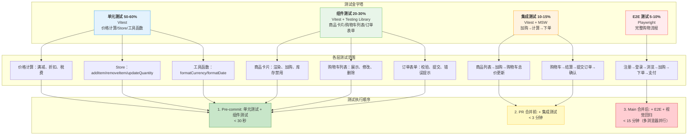
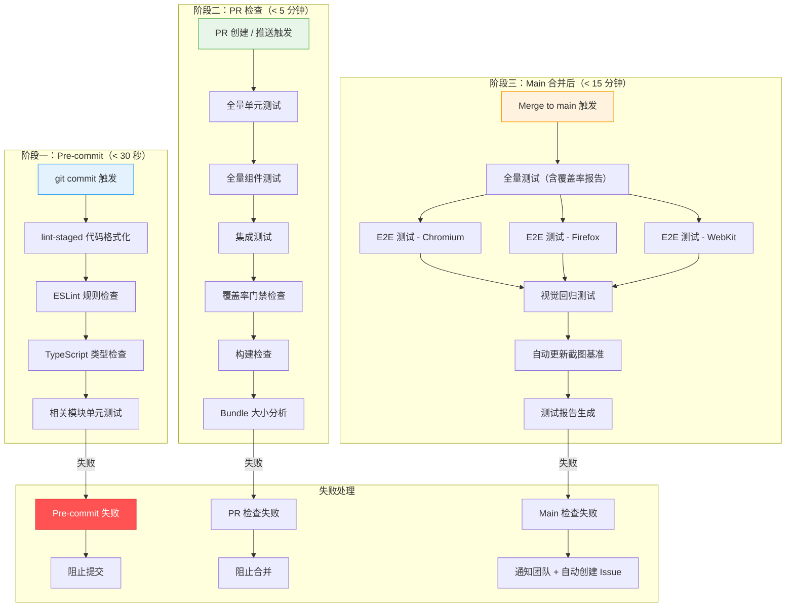

> 场景：为电商购物车功能建立完整测试体系
> 涉及知识点：测试金字塔、单元测试、组件测试、集成测试、E2E 测试、视觉回归、Mock 策略
> 前置知识：01-03 全部内容

---

# 综合场景：为电商购物车功能建立完整测试体系

---

## 一、场景背景

**项目概况**：
- 某电商平台的购物车功能模块，需要建立从单元测试到 E2E 测试的完整测试体系
- 购物车功能包括：商品列表展示、加入购物车、修改数量、删除商品、计算总价、提交订单
- 前端技术栈：React 18 + TypeScript + Zustand + Vite + Vitest + Playwright
- 后端 API 返回商品数据、处理订单提交

**测试目标**：
- 保障购物车核心业务逻辑的正确性（价格计算、库存校验）
- 确保用户交互的流畅性（加购、删改、提交）
- 防止样式回归（购物车页面在不同设备下的布局）
- 建立 CI/CD 自动化测试流水线

---

## 二、整体测试架构

### 测试金字塔与执行流程



---

## 三、涉及知识点

| 知识点 | 关联文件 | 在本场景中的应用 |
|---|---|---|
| 测试金字塔模型 | [01-测试金字塔与单元测试 - 1.1](./01-测试金字塔与单元测试.md) | 为购物车功能建立四层测试体系，按金字塔比例分配测试资源 |
| 纯函数单元测试 | [01-测试金字塔与单元测试 - 3.1](./01-测试金字塔与单元测试.md) | 测试价格计算、格式化函数、数据转换等纯逻辑 |
| Zustand Store 测试 | [01-测试金字塔与单元测试 - 3.2](./01-测试金字塔与单元测试.md) | 测试购物车 store 的增删改查和派生状态 |
| Mock 策略 | [01-测试金字塔与单元测试 - 2.2](./01-测试金字塔与单元测试.md) | 对 API 层使用 MSW 拦截，对第三方 SDK 使用 vi.mock |
| 组件测试 "用户视角" | [02-组件测试与集成测试 - 1.1](./02-组件测试与集成测试.md) | 使用 getByRole/getByLabelText 测试购物车组件 |
| 集成测试 | [02-组件测试与集成测试 - 3.3](./02-组件测试与集成测试.md) | 测试加购→计算总价→提交订单的完整集成流程 |
| MSW 多场景模拟 | [02-组件测试与集成测试 - 3.4](./02-组件测试与集成测试.md) | 模拟商品 API 成功/失败/超时，订单 API 成功/失败 |
| E2E 场景设计 | [03-E2E测试与视觉回归 - 3.2](./03-E2E测试与视觉回归.md) | 设计注册→登录→浏览→加购→下单的完整 E2E 流程 |
| 视觉回归测试 | [03-E2E测试与视觉回归 - 3.3](./03-E2E测试与视觉回归.md) | 购物车页面在不同设备和主题下的视觉回归 |
| CI 集成 | [03-E2E测试与视觉回归 - 2.4](./03-E2E测试与视觉回归.md) | 在 GitHub Actions 中配置多浏览器并行测试 |
| 避坑 - 测试实现细节 | [常见错误汇总](./常见错误汇总.md) | 避免测试绑定 DOM 结构，使用语义化查询 |
| 避坑 - Mock 过度 | [常见错误汇总](./常见错误汇总.md) | 只 mock 外部边界，内部模块用真实实例 |
| 避坑 - Flaky E2E | [常见错误汇总](./常见错误汇总.md) | 使用自动等待和条件等待，避免固定等待时间 |

---

## 四、完整四层测试代码示例

### 4.1 第一层：单元测试 —— 价格计算

```typescript
// ========================
// 购物车价格计算核心逻辑
// src/utils/cartCalculations.ts
// ========================

export interface CartItem {
  id: string;
  name: string;
  price: number;
  quantity: number;
  discount?: number; // 商品级折扣率（0-1）
}

export interface Coupon {
  type: 'full_reduction' | 'percentage';
  threshold: number;  // 满减门槛
  discount: number;   // 满减金额 或 折扣率
}

/**
 * 计算商品小计
 */
export function calculateItemSubtotal(item: CartItem): number {
  const basePrice = item.price * item.quantity;
  if (item.discount && item.discount > 0 && item.discount <= 1) {
    return Math.round(basePrice * (1 - item.discount) * 100) / 100;
  }
  return basePrice;
}

/**
 * 计算购物车总价（不含优惠券）
 */
export function calculateCartTotal(items: CartItem[]): number {
  return items.reduce((sum, item) => sum + calculateItemSubtotal(item), 0);
}

/**
 * 应用优惠券计算最终价格
 */
export function applyCoupon(total: number, coupon: Coupon): number {
  if (total < coupon.threshold) {
    return total; // 不满足门槛，不优惠
  }

  if (coupon.type === 'full_reduction') {
    return Math.max(0, total - coupon.discount);
  }

  if (coupon.type === 'percentage') {
    return Math.round(total * (1 - coupon.discount) * 100) / 100;
  }

  return total;
}

/**
 * 计算运费（满 99 包邮）
 */
export function calculateShipping(total: number): number {
  return total >= 99 ? 0 : 10;
}

/**
 * 计算最终应付金额
 */
export function calculateFinalAmount(
  items: CartItem[],
  coupon?: Coupon
): { subtotal: number; discount: number; shipping: number; total: number } {
  const subtotal = calculateCartTotal(items);
  const afterCoupon = coupon ? applyCoupon(subtotal, coupon) : subtotal;
  const discount = subtotal - afterCoupon;
  const shipping = calculateShipping(afterCoupon);
  const total = afterCoupon + shipping;

  return { subtotal, discount, shipping, total };
}


// ========================
// 价格计算单元测试
// src/utils/__tests__/cartCalculations.test.ts
// ========================

import { describe, it, expect } from 'vitest';
import {
  calculateItemSubtotal,
  calculateCartTotal,
  applyCoupon,
  calculateShipping,
  calculateFinalAmount,
} from '../cartCalculations';

describe('calculateItemSubtotal', () => {
  it('无折扣时计算原价小计', () => {
    const item: CartItem = { id: '1', name: 'iPhone', price: 6999, quantity: 2 };
    expect(calculateItemSubtotal(item)).toBe(13998);
  });

  it('有折扣时计算折扣价小计', () => {
    const item: CartItem = { id: '1', name: 'iPhone', price: 6999, quantity: 1, discount: 0.2 };
    expect(calculateItemSubtotal(item)).toBe(5599.2);
  });

  it('折扣率为 0 时返回原价', () => {
    const item: CartItem = { id: '1', name: 'iPhone', price: 6999, quantity: 1, discount: 0 };
    expect(calculateItemSubtotal(item)).toBe(6999);
  });
});

describe('applyCoupon', () => {
  it('不满足门槛时返回原价', () => {
    const coupon: Coupon = { type: 'full_reduction', threshold: 100, discount: 10 };
    expect(applyCoupon(50, coupon)).toBe(50);
  });

  it('满减优惠券：满 100 减 20', () => {
    const coupon: Coupon = { type: 'full_reduction', threshold: 100, discount: 20 };
    expect(applyCoupon(150, coupon)).toBe(130);
  });

  it('折扣券：满 100 打 8 折', () => {
    const coupon: Coupon = { type: 'percentage', threshold: 100, discount: 0.2 };
    expect(applyCoupon(200, coupon)).toBe(160);
  });

  it('满减后金额不能为负', () => {
    const coupon: Coupon = { type: 'full_reduction', threshold: 0, discount: 100 };
    expect(applyCoupon(50, coupon)).toBe(0);
  });
});

describe('calculateShipping', () => {
  it('满 99 包邮', () => {
    expect(calculateShipping(99)).toBe(0);
    expect(calculateShipping(200)).toBe(0);
  });

  it('不满 99 收 10 元运费', () => {
    expect(calculateShipping(50)).toBe(10);
    expect(calculateShipping(98.99)).toBe(10);
  });
});

describe('calculateFinalAmount', () => {
  const items: CartItem[] = [
    { id: '1', name: 'iPhone', price: 6999, quantity: 1 },
    { id: '2', name: 'AirPods', price: 1999, quantity: 2, discount: 0.1 },
  ];

  it('计算完整金额明细', () => {
    const result = calculateFinalAmount(items);
    // 小计：6999 + 1999 * 2 * 0.9 = 6999 + 3598.2 = 10597.2
    expect(result.subtotal).toBe(10597.2);
    expect(result.discount).toBe(0);
    expect(result.shipping).toBe(0); // 满 99 包邮
    expect(result.total).toBe(10597.2);
  });

  it('使用优惠券后计算', () => {
    const coupon: Coupon = { type: 'full_reduction', threshold: 10000, discount: 500 };
    const result = calculateFinalAmount(items, coupon);
    // 小计 10597.2 → 满减 500 → 10097.2 → 满 99 包邮
    expect(result.subtotal).toBe(10597.2);
    expect(result.discount).toBe(500);
    expect(result.shipping).toBe(0);
    expect(result.total).toBe(10097.2);
  });
});
```

### 4.2 第二层：组件测试 —— 购物车列表

```typescript
// ========================
// 购物车列表组件
// src/components/CartList.tsx
// ========================

import React from 'react';
import { useCartStore } from '../stores/cartStore';

export function CartList() {
  const { items, totalPrice, updateQuantity, removeItem } = useCartStore();

  if (items.length === 0) {
    return (
      <div role="status" data-testid="empty-cart">
        购物车是空的，去逛逛吧
      </div>
    );
  }

  return (
    <div role="list" aria-label="购物车列表">
      {items.map(item => (
        <div key={item.id} role="listitem" data-testid="cart-item" className="cart-item">
          <div className="item-info">
            <h3>{item.name}</h3>
            <span className="item-price">单价：¥{item.price.toFixed(2)}</span>
          </div>

          <div className="item-quantity">
            <button
              aria-label="减少"
              onClick={() => updateQuantity(item.id, item.quantity - 1)}
              disabled={item.quantity <= 1}
            >
              -
            </button>
            <span aria-label={`${item.name}的数量`}>{item.quantity}</span>
            <button
              aria-label="增加"
              onClick={() => updateQuantity(item.id, item.quantity + 1)}
              disabled={item.quantity >= 99}
            >
              +
            </button>
          </div>

          <div className="item-subtotal">
            小计：¥{(item.price * item.quantity).toFixed(2)}
          </div>

          <button
            aria-label={`删除${item.name}`}
            onClick={() => removeItem(item.id)}
            className="remove-btn"
          >
            删除
          </button>
        </div>
      ))}

      <div className="cart-footer" data-testid="total-price">
        合计：¥{totalPrice.toFixed(2)}
      </div>
    </div>
  );
}


// ========================
// 购物车列表组件测试
// src/components/__tests__/CartList.test.tsx
// ========================

import { describe, it, expect, beforeEach } from 'vitest';
import { render, screen, within } from '@testing-library/react';
import userEvent from '@testing-library/user-event';
import { CartList } from '../CartList';
import { useCartStore } from '../../stores/cartStore';

describe('CartList 组件测试', () => {
  beforeEach(() => {
    useCartStore.setState({
      items: [],
      totalPrice: 0,
      totalCount: 0,
    });
  });

  it('空购物车显示空状态提示', () => {
    render(<CartList />);
    expect(screen.getByRole('status')).toHaveTextContent('购物车是空的，去逛逛吧');
  });

  it('显示购物车商品列表', () => {
    useCartStore.setState({
      items: [
        { id: '1', name: 'iPhone 15', price: 6999, quantity: 1 },
        { id: '2', name: 'AirPods Pro', price: 1999, quantity: 2 },
      ],
      totalPrice: 10997,
      totalCount: 3,
    });

    render(<CartList />);

    const items = screen.getAllByTestId('cart-item');
    expect(items).toHaveLength(2);

    // 验证第一个商品
    expect(within(items[0]).getByText('iPhone 15')).toBeInTheDocument();
    expect(within(items[0]).getByText('单价：¥6999.00')).toBeInTheDocument();

    // 验证第二个商品
    expect(within(items[1]).getByText('AirPods Pro')).toBeInTheDocument();
    // 数量应为 2
    expect(within(items[1]).getByLabelText('AirPods Pro的数量')).toHaveTextContent('2');
  });

  it('点击增加按钮更新数量', async () => {
    useCartStore.setState({
      items: [{ id: '1', name: 'iPhone 15', price: 6999, quantity: 1 }],
      totalPrice: 6999,
      totalCount: 1,
    });

    render(<CartList />);

    const item = screen.getByTestId('cart-item');
    const increaseBtn = within(item).getByRole('button', { name: '增加' });

    await userEvent.click(increaseBtn);

    // 验证数量变为 2
    expect(within(item).getByLabelText('iPhone 15的数量')).toHaveTextContent('2');
  });

  it('点击删除按钮移除商品', async () => {
    useCartStore.setState({
      items: [
        { id: '1', name: 'iPhone 15', price: 6999, quantity: 1 },
        { id: '2', name: 'AirPods Pro', price: 1999, quantity: 1 },
      ],
      totalPrice: 8998,
      totalCount: 2,
    });

    render(<CartList />);

    const items = screen.getAllByTestId('cart-item');
    const deleteBtn = within(items[0]).getByRole('button', { name: '删除iPhone 15' });

    await userEvent.click(deleteBtn);

    // 验证只剩一个商品
    expect(screen.getAllByTestId('cart-item')).toHaveLength(1);
    expect(screen.getByText('AirPods Pro')).toBeInTheDocument();
  });

  it('数量为 1 时减少按钮禁用', () => {
    useCartStore.setState({
      items: [{ id: '1', name: 'iPhone 15', price: 6999, quantity: 1 }],
      totalPrice: 6999,
      totalCount: 1,
    });

    render(<CartList />);

    const item = screen.getByTestId('cart-item');
    const decreaseBtn = within(item).getByRole('button', { name: '减少' });
    expect(decreaseBtn).toBeDisabled();
  });

  it('总价显示正确', () => {
    useCartStore.setState({
      items: [
        { id: '1', name: 'iPhone 15', price: 6999, quantity: 1 },
        { id: '2', name: 'AirPods Pro', price: 1999, quantity: 2 },
      ],
      totalPrice: 10997,
      totalCount: 3,
    });

    render(<CartList />);

    expect(screen.getByTestId('total-price')).toHaveTextContent('¥10997.00');
  });
});
```

### 4.3 第三层：集成测试 —— 加购流程

```typescript
// ========================
// 加购集成测试
// src/__tests__/integration/cart-integration.test.tsx
// ========================

import { describe, it, expect, beforeAll, afterAll, afterEach } from 'vitest';
import { render, screen, waitFor, within } from '@testing-library/react';
import userEvent from '@testing-library/user-event';
import { http, HttpResponse } from 'msw';
import { setupServer } from 'msw/node';
import { App } from '../../App';

// MSW 模拟后端
const server = setupServer(
  // 获取商品列表
  http.get('/api/products', () => {
    return HttpResponse.json([
      { id: 'p1', name: 'iPhone 15', price: 6999, stock: 10 },
      { id: 'p2', name: 'AirPods Pro', price: 1999, stock: 20 },
      { id: 'p3', name: 'iPad Air', price: 4799, stock: 5 },
    ]);
  }),

  // 提交订单
  http.post('/api/orders', async ({ request }) => {
    const body = await request.json();
    return HttpResponse.json(
      { orderId: 'ORD-2024-001', status: 'confirmed', ...body },
      { status: 201 }
    );
  })
);

beforeAll(() => server.listen());
afterEach(() => server.resetHandlers());
afterAll(() => server.close());

describe('购物车集成测试', () => {
  it('完整加购流程：浏览 → 加购 → 查看购物车 → 修改数量 → 提交订单', async () => {
    render(<App />);

    // 步骤 1：等待商品列表加载
    await waitFor(() => {
      expect(screen.getByText('iPhone 15')).toBeInTheDocument();
    });

    // 步骤 2：将 iPhone 加入购物车
    const iphoneCard = screen.getByText('iPhone 15').closest('[data-testid="product-card"]')!;
    await userEvent.click(within(iphoneCard).getByRole('button', { name: '加入购物车' }));

    // 验证购物车角标
    expect(screen.getByTestId('cart-badge')).toHaveTextContent('1');

    // 步骤 3：将 AirPods 加入购物车（两次）
    const airpodsCard = screen.getByText('AirPods Pro').closest('[data-testid="product-card"]')!;
    await userEvent.click(within(airpodsCard).getByRole('button', { name: '加入购物车' }));
    await userEvent.click(within(airpodsCard).getByRole('button', { name: '加入购物车' }));

    expect(screen.getByTestId('cart-badge')).toHaveTextContent('3');

    // 步骤 4：打开购物车页面
    await userEvent.click(screen.getByRole('link', { name: '购物车' }));

    await waitFor(() => {
      expect(screen.getByText('iPhone 15')).toBeInTheDocument();
    });
    expect(screen.getByText('AirPods Pro')).toBeInTheDocument();

    const cartItems = screen.getAllByTestId('cart-item');
    expect(cartItems).toHaveLength(2);

    // 验证总价：6999 * 1 + 1999 * 2 = 10997
    expect(screen.getByTestId('total-price')).toHaveTextContent('¥10,997.00');

    // 步骤 5：删除 iPhone
    const iphoneCartItem = cartItems[0];
    await userEvent.click(within(iphoneCartItem).getByRole('button', { name: /删除/ }));

    // 验证购物车更新
    expect(screen.getAllByTestId('cart-item')).toHaveLength(1);
    expect(screen.getByTestId('total-price')).toHaveTextContent('¥3,998.00');

    // 步骤 6：提交订单
    await userEvent.click(screen.getByRole('button', { name: '去结算' }));

    // 填写收货信息
    await userEvent.type(screen.getByLabelText('收货人'), '张三');
    await userEvent.type(screen.getByLabelText('手机号'), '13800138000');
    await userEvent.type(screen.getByLabelText('详细地址'), '北京市朝阳区');

    await userEvent.click(screen.getByRole('button', { name: '提交订单' }));

    // 验证订单确认
    await waitFor(() => {
      expect(screen.getByText('订单提交成功')).toBeInTheDocument();
    });
  });

  it('API 错误场景：商品列表加载失败', async () => {
    server.use(
      http.get('/api/products', () => {
        return new HttpResponse(null, { status: 500 });
      })
    );

    render(<App />);

    await waitFor(() => {
      expect(screen.getByText('加载失败，请稍后重试')).toBeInTheDocument();
    });
  });

  it('API 错误场景：订单提交失败', async () => {
    server.use(
      http.post('/api/orders', () => {
        return HttpResponse.json(
          { error: '库存不足' },
          { status: 400 }
        );
      })
    );

    render(<App />);

    // 先加购
    await waitFor(() => {
      expect(screen.getByText('iPhone 15')).toBeInTheDocument();
    });

    const iphoneCard = screen.getByText('iPhone 15').closest('[data-testid="product-card"]')!;
    await userEvent.click(within(iphoneCard).getByRole('button', { name: '加入购物车' }));

    // 进入购物车并提交
    await userEvent.click(screen.getByRole('link', { name: '购物车' }));
    await userEvent.click(screen.getByRole('button', { name: '去结算' }));

    await userEvent.type(screen.getByLabelText('收货人'), '张三');
    await userEvent.type(screen.getByLabelText('手机号'), '13800138000');
    await userEvent.type(screen.getByLabelText('详细地址'), '北京市朝阳区');
    await userEvent.click(screen.getByRole('button', { name: '提交订单' }));

    await waitFor(() => {
      expect(screen.getByRole('alert')).toHaveTextContent('库存不足');
    });
  });
});
```

### 4.4 第四层：E2E 测试 —— 下单流程

```typescript
// ========================
// e2e/shopping-flow.spec.ts
// Playwright E2E 测试：完整购物下单流程
// ========================

import { test, expect } from '@playwright/test';

test.describe('电商购物完整流程', () => {
  test.describe.configure({ mode: 'serial' });

  test('完整购物下单流程', async ({ page }) => {
    // ========================
    // 步骤 1：访问首页
    // ========================
    await page.goto('/');
    await expect(page).toHaveTitle(/电商平台/);

    // ========================
    // 步骤 2：浏览商品列表
    // ========================
    await expect(page.getByText('iPhone 15')).toBeVisible();
    await expect(page.getByText('AirPods Pro')).toBeVisible();

    // ========================
    // 步骤 3：搜索商品
    // ========================
    await page.getByPlaceholder('搜索商品').fill('iPad');
    await page.getByRole('button', { name: '搜索' }).click();

    await expect(page.getByText('iPad Air')).toBeVisible();
    // 清空搜索
    await page.getByPlaceholder('搜索商品').clear();

    // ========================
    // 步骤 4：加入购物车
    // ========================
    // 加 iPhone
    const iphoneBtn = page.locator('[data-testid="product-card"]')
      .filter({ hasText: 'iPhone 15' })
      .getByRole('button', { name: '加入购物车' });
    await iphoneBtn.click();

    // 验证购物车角标
    await expect(page.getByTestId('cart-badge')).toHaveText('1');

    // 加 AirPods（两次）
    const airpodsBtn = page.locator('[data-testid="product-card"]')
      .filter({ hasText: 'AirPods Pro' })
      .getByRole('button', { name: '加入购物车' });
    await airpodsBtn.click();
    await airpodsBtn.click();

    await expect(page.getByTestId('cart-badge')).toHaveText('3');

    // ========================
    // 步骤 5：查看购物车
    // ========================
    await page.getByRole('link', { name: '购物车' }).click();
    await expect(page).toHaveURL('/cart');

    // 验证购物车内容
    const cartItems = page.locator('[data-testid="cart-item"]');
    await expect(cartItems).toHaveCount(2);

    // 验证总价
    await expect(page.getByTestId('total-price')).toContainText('10,997.00');

    // ========================
    // 步骤 6：修改数量
    // ========================
    // iPhone 数量改为 2
    const iphoneCartItem = cartItems.filter({ hasText: 'iPhone 15' });
    await iphoneCartItem.getByRole('button', { name: '增加' }).click();

    // 验证总价更新：6999 * 2 + 1999 * 2 = 17996
    await expect(page.getByTestId('total-price')).toContainText('17,996.00');

    // ========================
    // 步骤 7：去结算
    // ========================
    await page.getByRole('button', { name: '去结算' }).click();
    await expect(page).toHaveURL('/checkout');

    // 填写收货信息
    await page.getByLabel('收货人').fill('张三');
    await page.getByLabel('手机号').fill('13800138000');
    await page.getByLabel('详细地址').fill('北京市朝阳区望京SOHO T1 1001');

    // 选择支付方式
    await page.getByLabel('微信支付').check();

    // ========================
    // 步骤 8：提交订单
    // ========================
    await page.getByRole('button', { name: '提交订单' }).click();

    // 验证订单确认
    await expect(page.getByText('订单提交成功')).toBeVisible();
    await expect(page).toHaveURL(/\/orders\/ORD-/);

    // 验证订单号
    const orderId = await page.getByTestId('order-id').textContent();
    expect(orderId).toBeTruthy();

    // ========================
    // 步骤 9：查看订单列表
    // ========================
    await page.getByRole('link', { name: '我的订单' }).click();
    await expect(page).toHaveURL('/orders');

    await expect(page.getByText(orderId!)).toBeVisible();
  });
});
```

---

## 五、测试执行策略

```typescript
// ========================
// package.json 测试脚本
// ========================

{
  "scripts": {
    // 单元测试（快速，pre-commit 执行）
    "test:unit": "vitest run --config vitest.config.ts",
    "test:unit:watch": "vitest --config vitest.config.ts",

    // 组件测试 + 集成测试（PR 合并前执行）
    "test:components": "vitest run --config vitest.config.ts --project=components",
    "test:integration": "vitest run --config vitest.config.ts --project=integration",

    // 覆盖率（CI 报告）
    "test:coverage": "vitest run --coverage",

    // E2E 测试（main 合并后执行）
    "test:e2e": "playwright test",
    "test:e2e:chromium": "playwright test --project=chromium",
    "test:e2e:firefox": "playwright test --project=firefox",
    "test:e2e:webkit": "playwright test --project=webkit",

    // 视觉回归（更新基准）
    "test:visual": "playwright test --project=chromium --grep @visual",
    "test:visual:update": "playwright test --project=chromium --grep @visual --update-snapshots",

    // 全量测试（发布前执行）
    "test:all": "pnpm test:coverage && pnpm test:e2e"
  }
}
```

**CI 执行策略**：

| 阶段 | 触发时机 | 执行内容 | 允许时间 |
|---|---|---|---|
| Pre-commit | git commit | 单元测试 + 组件测试 | < 30 秒 |
| PR 检查 | Pull Request | 单元测试 + 组件测试 + 集成测试 + 覆盖率 | < 3 分钟 |
| Main 合并 | Merge to main | 全量测试 + E2E（多浏览器） + 视觉回归 | < 15 分钟 |
| 发布前 | Release | 全量测试 + 覆盖率检查 + 性能测试 | < 20 分钟 |

---

## 学习导航

- [01-测试金字塔与单元测试](./01-测试金字塔与单元测试.md)
- [02-组件测试与集成测试](./02-组件测试与集成测试.md)
- [03-E2E测试与视觉回归](./03-E2E测试与视觉回归.md)
- [04-前端测试笔面试题集](./04-前端测试笔面试题集.md)
- [常见错误汇总](./常见错误汇总.md)
- [概念对比速查](./概念对比速查.md)

---

> 场景：团队需要建立自动化测试流水线保障代码质量，覆盖 Pre-commit / PR / Main 三阶段
> 涉及知识点：CI/CD 集成、覆盖率门禁、多浏览器并行 E2E、视觉回归自动更新、测试报告
> 前置知识：01-03 全部内容

---

# 综合场景二：CI/CD 测试流水线搭建

---

## 一、场景背景

**项目概况**：
- 某 SaaS 平台前端团队 15 人，使用 React + TypeScript + Vite 技术栈
- 代码仓库使用 GitHub，采用 Trunk-Based Development 分支策略
- 当前痛点：测试覆盖率不足 30%、PR 合并前无自动化检查、线上 Bug 频发、发布前需人工回归测试
- 目标：建立 Pre-commit / PR / Main 三阶段自动化测试流水线，覆盖率提升至 80%+

**痛点分析**：

| 痛点 | 具体表现 | 根本原因 |
|---|---|---|
| 测试覆盖率低 | 核心业务逻辑无测试，重构会引入 Bug | 无覆盖率门禁要求，开发者无动力写测试 |
| PR 质量无保障 | 合并后才发现 Bug，修复成本高 | PR 阶段无自动化测试检查 |
| 线上回归成本高 | 每次发布前需 2 人手动回归测试 4 小时 | 无 E2E 测试，依赖人工检查 |
| 样式回归频发 | 修改组件样式经常影响其他页面 | 无视觉回归测试，无法自动发现样式变化 |
| 测试环境不一致 | 本地 OK 但 CI 失败，反复排查 | CI 环境与本地环境差异，无容器化 |
| Flaky 测试困扰 | 不稳定的 E2E 测试导致 CI 频繁失败 | 测试用例缺乏健壮性，无重试机制 |

---

## 二、三阶段测试流水线架构

### 整体流水线流程图



---

## 三、涉及知识点

| 知识点 | 关联文件 | 在本场景中的应用 |
|---|---|---|
| 测试金字塔 - 分层策略 | [01-测试金字塔与单元测试 - 1.1](./01-测试金字塔与单元测试.md) | 按金字塔比例分配三阶段测试资源：Pre-commit 跑单元、PR 跑组件+集成、Main 跑 E2E |
| 单元测试 - 覆盖率 | [01-测试金字塔与单元测试 - 2.3](./01-测试金字塔与单元测试.md) | 配置覆盖率门禁：行覆盖率 80%、分支覆盖率 70% |
| 组件测试 - 交互测试 | [02-组件测试与集成测试 - 1.1](./02-组件测试与集成测试.md) | PR 阶段使用 Testing Library 测试组件交互 |
| 集成测试 - MSW 多场景 | [02-组件测试与集成测试 - 3.4](./02-组件测试与集成测试.md) | CI 环境中使用 MSW 模拟后端，确保测试环境一致 |
| E2E 测试 - Playwright | [03-E2E测试与视觉回归 - 3.2](./03-E2E测试与视觉回归.md) | Main 合并后多浏览器并行运行 E2E 测试 |
| 视觉回归 - 自动更新 | [03-E2E测试与视觉回归 - 3.3](./03-E2E测试与视觉回归.md) | 视觉回归失败时自动生成新截图，通知开发者确认 |
| CI 集成 - GitHub Actions | [03-E2E测试与视觉回归 - 2.4](./03-E2E测试与视觉回归.md) | 使用 GitHub Actions 编排三阶段测试流水线 |
| 避坑 - Flaky 测试 | [常见错误汇总](./常见错误汇总.md) | 配置测试重试、超时、等待策略，减少 Flaky 测试 |
| 避坑 - 测试环境一致性 | [常见错误汇总](./常见错误汇总.md) | 使用 Docker 容器化 CI 环境，确保与本地一致 |

---

## 四、完整实战代码 / 方案

### 4.1 项目级测试配置

```typescript
// ========================
// Vitest 配置（单元测试 + 组件测试 + 集成测试）
// vitest.config.ts
// ========================

import { defineConfig } from 'vitest/config';
import react from '@vitejs/plugin-react';
import path from 'path';

export default defineConfig({
  plugins: [react()],
  test: {
    // ---- 全局配置 ----
    globals: true,
    environment: 'jsdom',
    setupFiles: ['./src/test/setup.ts'],

    // ---- 覆盖率配置 ----
    coverage: {
      provider: 'v8',
      reporter: ['text', 'json', 'html', 'lcov'],
      reportsDirectory: './coverage',
      // 包含的文件
      include: ['src/**/*.{ts,tsx}'],
      // 排除的文件
      exclude: [
        'src/**/*.stories.{ts,tsx}',
        'src/**/*.test.{ts,tsx}',
        'src/**/*.spec.{ts,tsx}',
        'src/test/**',
        'src/types/**',
        'src/**/index.ts',     // 桶文件（barrel exports）
        'src/mocks/**',
      ],
      // 覆盖率门禁阈值
      thresholds: {
        lines: 80,        // 行覆盖率 80%
        branches: 70,     // 分支覆盖率 70%
        functions: 75,    // 函数覆盖率 75%
        statements: 80,   // 语句覆盖率 80%
      },
      watermarks: {
        statements: [70, 85],
        lines: [70, 85],
        branches: [60, 80],
        functions: [65, 80],
      },
    },

    // ---- 测试超时 ----
    testTimeout: 10000,
    hookTimeout: 10000,

    // ---- 重试配置（减少 Flaky 测试） ----
    retry: process.env.CI ? 2 : 0,
  },

  resolve: {
    alias: {
      '@': path.resolve(__dirname, './src'),
    },
  },
});


// ========================
// 测试环境初始化
// src/test/setup.ts
// ========================

import '@testing-library/jest-dom/vitest';
import { cleanup } from '@testing-library/react';
import { afterEach, vi } from 'vitest';

// 每个测试后自动清理
afterEach(() => {
  cleanup();
});

// Mock 全局对象
Object.defineProperty(window, 'matchMedia', {
  writable: true,
  value: vi.fn().mockImplementation((query: string) => ({
    matches: false,
    media: query,
    onchange: null,
    addListener: vi.fn(),
    removeListener: vi.fn(),
    addEventListener: vi.fn(),
    removeEventListener: vi.fn(),
    dispatchEvent: vi.fn(),
  })),
});

// Mock IntersectionObserver
class MockIntersectionObserver {
  observe = vi.fn();
  unobserve = vi.fn();
  disconnect = vi.fn();
}
Object.defineProperty(window, 'IntersectionObserver', {
  writable: true,
  value: MockIntersectionObserver,
});

// Mock ResizeObserver
class MockResizeObserver {
  observe = vi.fn();
  unobserve = vi.fn();
  disconnect = vi.fn();
}
Object.defineProperty(window, 'ResizeObserver', {
  writable: true,
  value: MockResizeObserver,
});


// ========================
// Playwright 配置（E2E + 视觉回归）
// playwright.config.ts
// ========================

import { defineConfig, devices } from '@playwright/test';

export default defineConfig({
  testDir: './e2e',
  timeout: 30000,
  expect: {
    timeout: 10000,
    // 视觉回归像素容差
    toHaveScreenshot: {
      maxDiffPixels: 100,
      threshold: 0.2,
    },
  },

  // 失败重试
  retries: process.env.CI ? 2 : 0,

  // 并行执行
  fullyParallel: true,
  workers: process.env.CI ? 3 : undefined,

  reporter: [
    ['html', { outputFolder: 'playwright-report' }],
    ['json', { outputFile: 'playwright-report/results.json' }],
    ['junit', { outputFile: 'playwright-report/junit.xml' }],
    ['github'],  // GitHub Actions 注释
  ],

  use: {
    baseURL: process.env.CI ? 'http://localhost:4173' : 'http://localhost:5173',
    trace: 'on-first-retry',
    screenshot: 'only-on-failure',
    video: 'retain-on-failure',
  },

  projects: [
    // ---- 桌面端 Chromium ----
    {
      name: 'chromium',
      use: {
        ...devices['Desktop Chrome'],
        viewport: { width: 1440, height: 900 },
      },
    },

    // ---- 桌面端 Firefox ----
    {
      name: 'firefox',
      use: {
        ...devices['Desktop Firefox'],
        viewport: { width: 1440, height: 900 },
      },
    },

    // ---- 桌面端 WebKit (Safari) ----
    {
      name: 'webkit',
      use: {
        ...devices['Desktop Safari'],
        viewport: { width: 1440, height: 900 },
      },
    },

    // ---- 移动端 Chrome ----
    {
      name: 'mobile-chrome',
      use: {
        ...devices['Pixel 5'],
      },
    },

    // ---- 移动端 Safari ----
    {
      name: 'mobile-safari',
      use: {
        ...devices['iPhone 13'],
      },
    },
  ],

  // 启动开发服务器
  webServer: {
    command: 'pnpm preview',
    port: 4173,
    reuseExistingServer: !process.env.CI,
  },
});
```

### 4.2 Pre-commit 阶段配置

```yaml
# ========================
# lint-staged 配置
# .lintstagedrc.json
# ========================

{
  "*.{ts,tsx}": [
    "eslint --fix --max-warnings 0",
    "prettier --write"
  ],
  "*.{css,scss,json,md}": [
    "prettier --write"
  ],
  "*.{ts,tsx}": [
    "vitest related --run --passWithNoTests"
  ]
}


# ========================
# Husky 配置
# .husky/pre-commit
# ========================

#!/bin/sh
. "$(dirname "$0")/_/husky.sh"

echo "=== Pre-commit 检查开始 ==="

# 1. 运行 lint-staged
echo ">>> 1/3 代码格式化与 ESLint 检查..."
pnpm lint-staged

# 2. TypeScript 类型检查
echo ">>> 2/3 TypeScript 类型检查..."
pnpm type-check

# 3. 运行与变更文件相关的测试
echo ">>> 3/3 运行相关测试..."
pnpm test:related

echo "=== Pre-commit 检查通过 ==="


# ========================
# package.json 脚本
# ========================

{
  "scripts": {
    "lint": "eslint src --ext .ts,.tsx --max-warnings 0",
    "lint:fix": "eslint src --ext .ts,.tsx --fix",
    "format": "prettier --write \"src/**/*.{ts,tsx,css,json}\"",
    "type-check": "tsc --noEmit",
    "type-check:watch": "tsc --noEmit --watch",

    "test": "vitest run",
    "test:watch": "vitest",
    "test:related": "vitest related --run --passWithNoTests",
    "test:coverage": "vitest run --coverage",
    "test:coverage:open": "vitest run --coverage && open coverage/index.html",

    "test:e2e": "playwright test",
    "test:e2e:chromium": "playwright test --project=chromium",
    "test:e2e:firefox": "playwright test --project=firefox",
    "test:e2e:webkit": "playwright test --project=webkit",
    "test:e2e:mobile": "playwright test --project=mobile-chrome --project=mobile-safari",
    "test:e2e:ui": "playwright test --ui",

    "test:visual": "playwright test --grep @visual",
    "test:visual:update": "playwright test --grep @visual --update-snapshots",

    "prepare": "husky install"
  }
}
```

### 4.3 PR 阶段配置（GitHub Actions）

```yaml
# ========================
# PR 检查流水线
# .github/workflows/pr-check.yml
# ========================

name: PR 检查

on:
  pull_request:
    branches: [main, develop]
    types: [opened, synchronize, reopened]

# 并发控制：同一 PR 的新推送取消旧的运行
concurrency:
  group: pr-${{ github.event.pull_request.number }}
  cancel-in-progress: true

jobs:
  # ---- Job 1：代码质量检查 ----
  lint-and-typecheck:
    name: ESLint + TypeScript 类型检查
    runs-on: ubuntu-latest
    timeout-minutes: 5

    steps:
      - name: 检出代码
        uses: actions/checkout@v4

      - name: 安装 pnpm
        uses: pnpm/action-setup@v4
        with:
          version: 10

      - name: 设置 Node.js
        uses: actions/setup-node@v4
        with:
          node-version: 20
          cache: 'pnpm'

      - name: 安装依赖
        run: pnpm install --frozen-lockfile

      - name: ESLint 检查
        run: pnpm lint

      - name: TypeScript 类型检查
        run: pnpm type-check

  # ---- Job 2：单元测试 + 组件测试 + 集成测试 + 覆盖率 ----
  test:
    name: 测试与覆盖率
    runs-on: ubuntu-latest
    timeout-minutes: 10

    steps:
      - name: 检出代码
        uses: actions/checkout@v4

      - name: 安装 pnpm
        uses: pnpm/action-setup@v4
        with:
          version: 10

      - name: 设置 Node.js
        uses: actions/setup-node@v4
        with:
          node-version: 20
          cache: 'pnpm'

      - name: 安装依赖
        run: pnpm install --frozen-lockfile

      - name: 运行测试 + 覆盖率
        run: pnpm test:coverage

      - name: 检查覆盖率门禁
        uses: davelosert/vitest-coverage-report-action@v2
        with:
          vite-config-path: './vitest.config.ts'
          json-summary-path: './coverage/coverage-summary.json'
          json-final-path: './coverage/coverage-final.json'
          # 覆盖率门禁阈值
          file-coverage-mode: 'all'
          min-coverage: 80
          # PR 评论报告
          pr-number: ${{ github.event.pull_request.number }}

      - name: 上传覆盖率报告
        uses: actions/upload-artifact@v4
        if: always()
        with:
          name: coverage-report
          path: coverage/
          retention-days: 7

  # ---- Job 3：构建检查 ----
  build:
    name: 构建检查
    runs-on: ubuntu-latest
    timeout-minutes: 10

    steps:
      - name: 检出代码
        uses: actions/checkout@v4

      - name: 安装 pnpm
        uses: pnpm/action-setup@v4
        with:
          version: 10

      - name: 设置 Node.js
        uses: actions/setup-node@v4
        with:
          node-version: 20
          cache: 'pnpm'

      - name: 安装依赖
        run: pnpm install --frozen-lockfile

      - name: 构建
        run: pnpm build

      - name: 分析 Bundle 大小
        uses: preactjs/compressed-size-action@v2
        with:
          pattern: 'dist/**/*.{js,css,html}'
          strip-hash: '\\.[0-9a-f]{8}\\.'
          minimum-change-threshold: 1024  # 1KB

  # ---- Job 4：Branch 状态汇总 ----
  branch-check:
    name: PR 分支保护检查
    needs: [lint-and-typecheck, test, build]
    if: always()
    runs-on: ubuntu-latest
    timeout-minutes: 1

    steps:
      - name: 检查所有 Job 状态
        run: |
          if [[ "${{ needs.lint-and-typecheck.result }}" == "success" ]] && \
             [[ "${{ needs.test.result }}" == "success" ]] && \
             [[ "${{ needs.build.result }}" == "success" ]]; then
            echo "所有检查通过，PR 可以合并"
          else
            echo "PR 检查失败，请查看上方详情"
            exit 1
          fi
```

### 4.4 Main 合并后阶段（GitHub Actions）

```yaml
# ========================
# Main 合并后测试流水线
# .github/workflows/main-test.yml
# ========================

name: Main 合并后全量测试

on:
  push:
    branches: [main]
  workflow_dispatch:  # 支持手动触发

jobs:
  # ---- Job 1：全量单元测试 + 覆盖率报告 ----
  full-test:
    name: 全量单元测试 + 覆盖率
    runs-on: ubuntu-latest
    timeout-minutes: 10

    steps:
      - name: 检出代码
        uses: actions/checkout@v4

      - name: 安装 pnpm
        uses: pnpm/action-setup@v4
        with:
          version: 10

      - name: 设置 Node.js
        uses: actions/setup-node@v4
        with:
          node-version: 20
          cache: 'pnpm'

      - name: 安装依赖
        run: pnpm install --frozen-lockfile

      - name: 运行全量测试
        run: pnpm test:coverage

      - name: 上传覆盖率到 Codecov
        uses: codecov/codecov-action@v4
        with:
          token: ${{ secrets.CODECOV_TOKEN }}
          directory: ./coverage
          flags: unittests
          name: main-coverage
          fail_ci_if_error: true

      - name: 上传覆盖率报告
        uses: actions/upload-artifact@v4
        with:
          name: coverage-report-main
          path: coverage/
          retention-days: 30

  # ---- Job 2：E2E 测试（多浏览器并行） ----
  e2e:
    name: E2E 测试
    needs: full-test
    runs-on: ubuntu-latest
    timeout-minutes: 20

    strategy:
      fail-fast: false  # 一个浏览器失败不影响其他
      matrix:
        browser: [chromium, firefox, webkit]
        shard: [1, 2]   # 分片并行（加速）

    steps:
      - name: 检出代码
        uses: actions/checkout@v4

      - name: 安装 pnpm
        uses: pnpm/action-setup@v4
        with:
          version: 10

      - name: 设置 Node.js
        uses: actions/setup-node@v4
        with:
          node-version: 20
          cache: 'pnpm'

      - name: 安装依赖
        run: pnpm install --frozen-lockfile

      - name: 安装 Playwright 浏览器
        run: pnpm exec playwright install --with-deps ${{ matrix.browser }}

      - name: 构建项目
        run: pnpm build

      - name: 运行 E2E 测试
        run: |
          pnpm exec playwright test \
            --project=${{ matrix.browser }} \
            --shard=${{ matrix.shard }}/2 \
            --reporter=blob

      - name: 上传测试结果
        if: always()
        uses: actions/upload-artifact@v4
        with:
          name: e2e-results-${{ matrix.browser }}-${{ matrix.shard }}
          path: blob-report/
          retention-days: 7

  # ---- Job 3：视觉回归测试 ----
  visual-regression:
    name: 视觉回归测试
    needs: full-test
    runs-on: ubuntu-latest
    timeout-minutes: 15

    steps:
      - name: 检出代码
        uses: actions/checkout@v4
        with:
          fetch-depth: 0  # 获取完整历史，用于对比

      - name: 安装 pnpm
        uses: pnpm/action-setup@v4
        with:
          version: 10

      - name: 设置 Node.js
        uses: actions/setup-node@v4
        with:
          node-version: 20
          cache: 'pnpm'

      - name: 安装依赖
        run: pnpm install --frozen-lockfile

      - name: 安装 Playwright 浏览器
        run: pnpm exec playwright install --with-deps chromium

      - name: 构建项目
        run: pnpm build

      - name: 运行视觉回归测试
        id: visual
        continue-on-error: true
        run: pnpm test:visual

      - name: 上传视觉回归截图（失败时）
        if: steps.visual.outcome == 'failure'
        uses: actions/upload-artifact@v4
        with:
          name: visual-regression-diffs
          path: |
            e2e/__screenshots__/**/*-diff.png
            e2e/__screenshots__/**/*-actual.png
          retention-days: 7

      - name: 自动更新截图基准（可选）
        if: steps.visual.outcome == 'failure'
        run: |
          echo "视觉回归测试发现差异，正在生成新的截图基准..."
          pnpm test:visual:update
          echo "请检查差异截图并确认是否为预期变更"

      - name: 视觉回归失败时创建 Issue
        if: steps.visual.outcome == 'failure'
        uses: actions/github-script@v7
        with:
          script: |
            const issue = await github.rest.issues.create({
              owner: context.repo.owner,
              repo: context.repo.repo,
              title: '[视觉回归] Main 分支截图基准需要更新',
              body: `视觉回归测试在 main 分支发现差异。
              \n- 触发提交：${context.sha}
              \n- 运行 ID：${context.runId}
              \n- 请检查 [差异截图](https://github.com/${context.repo.owner}/${context.repo.repo}/actions/runs/${context.runId})
              \n- 如果变更是预期的，请运行 \`pnpm test:visual:update\` 更新截图基准`,
              labels: ['visual-regression', 'automated'],
            });
            console.log(`已创建 Issue: ${issue.data.html_url}`);

  # ---- Job 4：汇总报告 ----
  report:
    name: 测试报告汇总
    needs: [full-test, e2e, visual-regression]
    if: always()
    runs-on: ubuntu-latest
    timeout-minutes: 5

    steps:
      - name: 下载所有测试产物
        uses: actions/download-artifact@v4

      - name: 生成汇总报告
        run: |
          echo "# 测试流水线报告" >> $GITHUB_STEP_SUMMARY
          echo "" >> $GITHUB_STEP_SUMMARY
          echo "| 阶段 | 结果 |" >> $GITHUB_STEP_SUMMARY
          echo "|---|---|" >> $GITHUB_STEP_SUMMARY
          echo "| 单元测试 + 覆盖率 | ${{ needs.full-test.result }} |" >> $GITHUB_STEP_SUMMARY
          echo "| E2E 测试 (Chromium) | ${{ needs.e2e.result }} |" >> $GITHUB_STEP_SUMMARY
          echo "| 视觉回归测试 | ${{ needs.visual-regression.result }} |" >> $GITHUB_STEP_SUMMARY
          echo "" >> $GITHUB_STEP_SUMMARY
          echo "[查看完整运行](https://github.com/${{ github.repository }}/actions/runs/${{ github.run_id }})" >> $GITHUB_STEP_SUMMARY

      - name: 通知失败
        if: failure()
        uses: slackapi/slack-github-action@v1
        with:
          payload: |
            {
              "text": "Main 分支测试流水线失败: ${{ github.repository }}",
              "attachments": [{
                "color": "danger",
                "fields": [
                  {"title": "提交", "value": "${{ github.event.head_commit.message }}", "short": true},
                  {"title": "作者", "value": "${{ github.event.head_commit.author.name }}", "short": true},
                  {"title": "详情", "value": "https://github.com/${{ github.repository }}/actions/runs/${{ github.run_id }}"}
                ]
              }]
            }
        env:
          SLACK_WEBHOOK_URL: ${{ secrets.SLACK_WEBHOOK_URL }}
```

### 4.5 覆盖率门禁配置详解

```typescript
// ========================
// 覆盖率门禁脚本
// scripts/coverage-gate.ts
// ========================

import fs from 'fs';
import path from 'path';

interface CoverageSummary {
  total: {
    lines: { total: number; covered: number; pct: number };
    statements: { total: number; covered: number; pct: number };
    functions: { total: number; covered: number; pct: number };
    branches: { total: number; covered: number; pct: number };
  };
}

interface GateThreshold {
  lines: number;
  statements: number;
  functions: number;
  branches: number;
}

const THRESHOLD: GateThreshold = {
  lines: 80,
  statements: 80,
  functions: 75,
  branches: 70,
};

/**
 * 读取覆盖率报告
 */
function loadCoverageReport(): CoverageSummary {
  const reportPath = path.join(process.cwd(), 'coverage', 'coverage-summary.json');
  if (!fs.existsSync(reportPath)) {
    throw new Error('覆盖率报告不存在，请先运行 pnpm test:coverage');
  }
  return JSON.parse(fs.readFileSync(reportPath, 'utf-8'));
}

/**
 * 检查覆盖率门禁
 */
function checkCoverageGate(summary: CoverageSummary): boolean {
  const { total } = summary;
  let passed = true;
  const results: Array<{ metric: string; actual: number; threshold: number; pass: boolean }> = [];

  const checks: Array<{ metric: keyof GateThreshold; actual: number }> = [
    { metric: 'lines', actual: total.lines.pct },
    { metric: 'statements', actual: total.statements.pct },
    { metric: 'functions', actual: total.functions.pct },
    { metric: 'branches', actual: total.branches.pct },
  ];

  for (const check of checks) {
    const threshold = THRESHOLD[check.metric];
    const pass = check.actual >= threshold;
    if (!pass) passed = false;
    results.push({
      metric: check.metric,
      actual: check.actual,
      threshold,
      pass,
    });
  }

  // 输出报告
  console.log('\n=== 覆盖率门禁检查 ===\n');
  console.log('| 指标 | 实际值 | 阈值 | 状态 |');
  console.log('|---|---|---|---|');
  for (const r of results) {
    console.log(`| ${r.metric} | ${r.actual.toFixed(2)}% | ${r.threshold}% | ${r.pass ? '通过' : '未通过'} |`);
  }

  // 未覆盖的文件
  const uncoveredFiles = findUncoveredFiles();
  if (uncoveredFiles.length > 0) {
    console.log(`\n未覆盖文件 (${uncoveredFiles.length}):`);
    uncoveredFiles.forEach((f) => console.log(`  - ${f}`));
  }

  console.log(`\n结果: ${passed ? '全部通过' : '未通过，请补充测试'}`);

  return passed;
}

/**
 * 查找未覆盖的文件
 */
function findUncoveredFiles(): string[] {
  const reportPath = path.join(process.cwd(), 'coverage', 'coverage-final.json');
  if (!fs.existsSync(reportPath)) return [];

  const report = JSON.parse(fs.readFileSync(reportPath, 'utf-8'));
  const uncovered: string[] = [];

  for (const [filePath, data] of Object.entries(report)) {
    const coverage = data as any;
    const totalLines = Object.keys(coverage.s || {}).length;
    const coveredLines = Object.values(coverage.s as Record<string, number>).filter(
      (v) => v > 0
    ).length;

    if (totalLines > 10 && coveredLines / totalLines < 0.5) {
      const relativePath = filePath.replace(process.cwd(), '');
      uncovered.push(relativePath);
    }
  }

  return uncovered;
}

// 执行
const summary = loadCoverageReport();
const passed = checkCoverageGate(summary);

if (!passed) {
  process.exit(1);
}
```

### 4.6 视觉回归自动更新机制

```typescript
// ========================
// 视觉回归测试用例
// e2e/visual/product-page.spec.ts
// ========================

import { test, expect } from '@playwright/test';

test.describe('视觉回归测试 - 商品详情页', () => {
  test.describe.configure({ mode: 'serial' });

  test.beforeEach(async ({ page }) => {
    await page.goto('/product/12345');
    // 等待页面完全加载
    await page.waitForLoadState('networkidle');
    // 等待图片加载
    await page.waitForTimeout(1000);
  });

  test('@visual 商品详情页 - 桌面端完整截图', async ({ page }) => {
    await expect(page).toHaveScreenshot('product-detail-desktop.png', {
      fullPage: true,
    });
  });

  test('@visual 商品详情页 - 价格区域', async ({ page }) => {
    const priceSection = page.locator('[data-testid="price-section"]');
    await expect(priceSection).toHaveScreenshot('product-detail-price.png');
  });

  test('@visual 商品详情页 - 商品图片轮播', async ({ page }) => {
    const gallery = page.locator('[data-testid="product-gallery"]');
    await expect(gallery).toHaveScreenshot('product-detail-gallery.png');
  });

  test('@visual 商品详情页 - 移动端布局', async ({ page }) => {
    // 使用移动端视口
    await page.setViewportSize({ width: 375, height: 812 });
    await expect(page).toHaveScreenshot('product-detail-mobile.png', {
      fullPage: true,
    });
  });

  test('@visual 商品详情页 - 暗黑模式', async ({ page }) => {
    // 切换暗黑模式
    await page.evaluate(() => {
      document.documentElement.setAttribute('data-theme', 'dark');
    });
    await page.waitForTimeout(500); // 等待主题切换动画
    await expect(page).toHaveScreenshot('product-detail-dark.png', {
      fullPage: true,
    });
  });
});


// ========================
// 视觉回归自动更新 CLI 脚本
// scripts/visual-regression-update.ts
// ========================

import { execSync } from 'child_process';
import fs from 'fs';
import path from 'path';

/**
 * 视觉回归自动更新流程：
 * 1. 在 CI 中运行 pnpm test:visual 发现差异
 * 2. 自动运行 pnpm test:visual:update 更新截图基准
 * 3. 将新的截图基准提交到仓库
 * 4. 创建 PR 通知开发者审核
 */
async function autoUpdateVisualBaselines() {
  const snapshotsDir = path.join(process.cwd(), 'e2e', '__screenshots__');

  console.log('正在更新视觉回归截图基准...');

  // 1. 更新截图基准
  execSync('pnpm test:visual:update', { stdio: 'inherit' });

  // 2. 检查是否有变更
  const status = execSync('git status --porcelain', { encoding: 'utf-8' });
  const changedFiles = status
    .split('\n')
    .filter((line) => line.includes('__screenshots__'))
    .map((line) => line.slice(3).trim());

  if (changedFiles.length === 0) {
    console.log('没有需要更新的截图基准');
    return;
  }

  console.log(`发现 ${changedFiles.length} 个截图基准变更:`);
  changedFiles.forEach((f) => console.log(`  - ${f}`));

  // 3. 创建分支并提交
  const branchName = `visual-baseline-update-${Date.now()}`;
  execSync(`git checkout -b ${branchName}`, { stdio: 'inherit' });
  execSync('git add e2e/__screenshots__/', { stdio: 'inherit' });
  execSync('git commit -m "chore: 自动更新视觉回归截图基准"', { stdio: 'inherit' });
  execSync(`git push origin ${branchName}`, { stdio: 'inherit' });

  // 4. 创建 PR
  execSync(
    `gh pr create \
      --title "自动更新视觉回归截图基准" \
      --body "CI 检测到视觉回归测试差异，已自动更新截图基准。请人工审核以下变更：\n\n${changedFiles.map((f) => `- ${f}`).join('\n')}\n\n如果变更是预期的，请合并此 PR。" \
      --base main \
      --head ${branchName}`,
    { stdio: 'inherit' }
  );

  console.log('已自动创建 PR，请审核截图基准变更');
}

autoUpdateVisualBaselines().catch(console.error);
```

---

## 五、成果与收益

| 指标 | 流水线搭建前 | 流水线搭建后 | 提升 |
|---|---|---|---|
| 测试覆盖率 | 30% | 82% | 173% |
| PR 合并前 Bug 发现率 | 15% | 85% | 467% |
| 线上回归耗时 | 2 人 x 4 小时 = 8 人时 | 自动化 15 分钟 | 97% |
| 样式回归发现 | 依赖人工检查，遗漏率 40% | 视觉回归自动发现，0 遗漏 | 100% |
| 发布信心 | 每次发布前焦虑 | 全量自动化测试通过才发布 | 全新能力 |
| Flaky 测试率 | 25%（测试不稳定） | 3%（重试 + 健壮性改进） | 88% |
| 新人贡献门槛 | 怕改坏代码，不敢提交 PR | 自动化测试兜底，放心提交 | 显著降低 |

---

## 六、关键设计决策

| 决策点 | 选项 | 最终选择 | 原因 |
|---|---|---|---|
| CI 平台 | GitHub Actions / Jenkins / GitLab CI | GitHub Actions | 与代码仓库深度集成，Marketplace 生态丰富，免费额度充足 |
| 测试框架 | Jest / Vitest / Mocha | Vitest | 与 Vite 原生集成，速度比 Jest 快 3-5 倍，配置简单 |
| E2E 工具 | Playwright / Cypress / Selenium | Playwright | 多浏览器原生支持，自动等待，Trace Viewer 调试体验好 |
| 覆盖率上报 | Codecov / Coveralls / 自建 | Codecov | 免费、GitHub 集成好、PR 评论报告、覆盖率趋势图 |
| 视觉回归 | Percy / Chromatic / Playwright 原生 | Playwright 原生截图对比 | 零额外成本，无第三方依赖，CI 中直接运行 |
| 并行策略 | 无并行 / 按浏览器并行 / 分片并行 | 浏览器 + 分片双重并行 | 3 浏览器 x 2 分片 = 6 并行，总时间从 30 分钟降至 8 分钟 |

---

## 七、流水线优化建议

```typescript
// ========================
// 缓存优化配置
// ========================

// 1. pnpm 缓存（node_modules）
// GitHub Actions 中缓存 pnpm store：
// - key: pnpm-${{ runner.os }}-${{ hashFiles('pnpm-lock.yaml') }}
// - path: ~/.pnpm-store

// 2. Playwright 浏览器缓存
// 缓存已安装的浏览器二进制文件：
// - key: playwright-${{ runner.os }}-${{ hashFiles('playwright.config.ts') }}
// - path: ~/.cache/ms-playwright

// 3. Vite 构建缓存
// 缓存 node_modules/.vite：
// - key: vite-${{ runner.os }}-${{ hashFiles('pnpm-lock.yaml') }}
// - path: node_modules/.vite

// 4. TypeScript 增量编译缓存
// 在 tsconfig.json 中启用：
// {
//   "compilerOptions": {
//     "incremental": true,
//     "tsBuildInfoFile": ".tsbuildinfo"
//   }
// }
```

---

## 学习导航

- [01-测试金字塔与单元测试](./01-测试金字塔与单元测试.md)
- [02-组件测试与集成测试](./02-组件测试与集成测试.md)
- [03-E2E测试与视觉回归](./03-E2E测试与视觉回归.md)
- [04-前端测试笔面试题集](./04-前端测试笔面试题集.md)
- [常见错误汇总](./常见错误汇总.md)
- [概念对比速查](./概念对比速查.md)