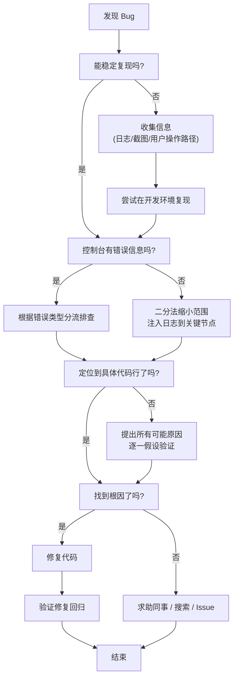
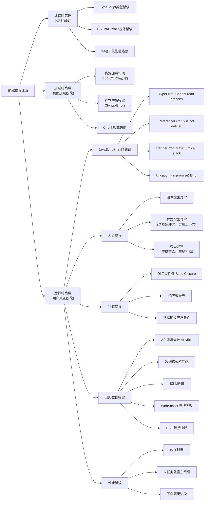
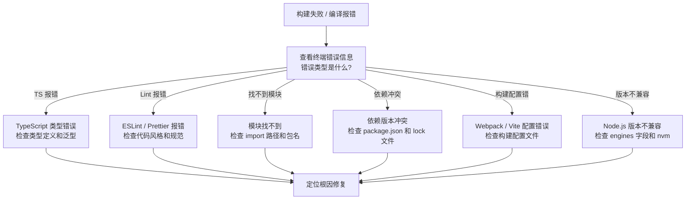
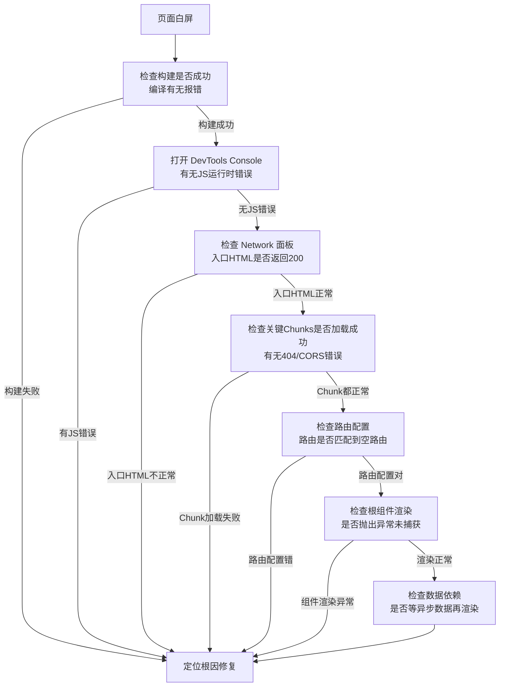
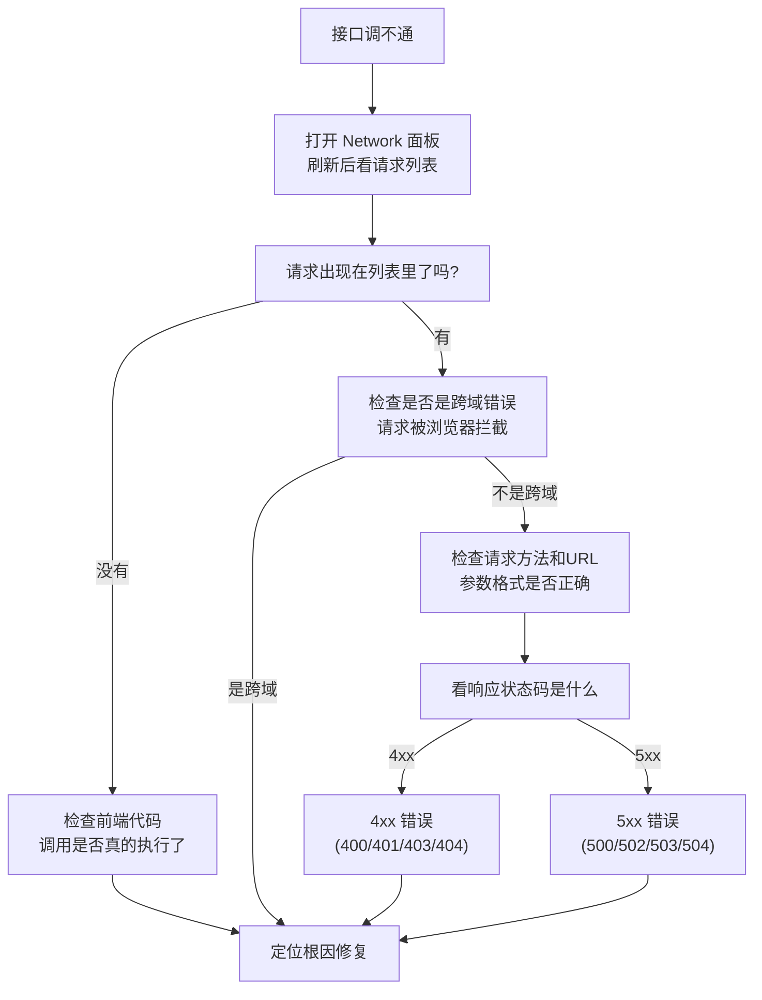
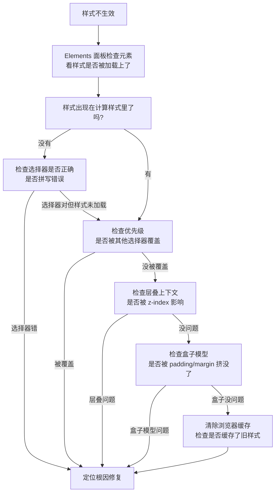
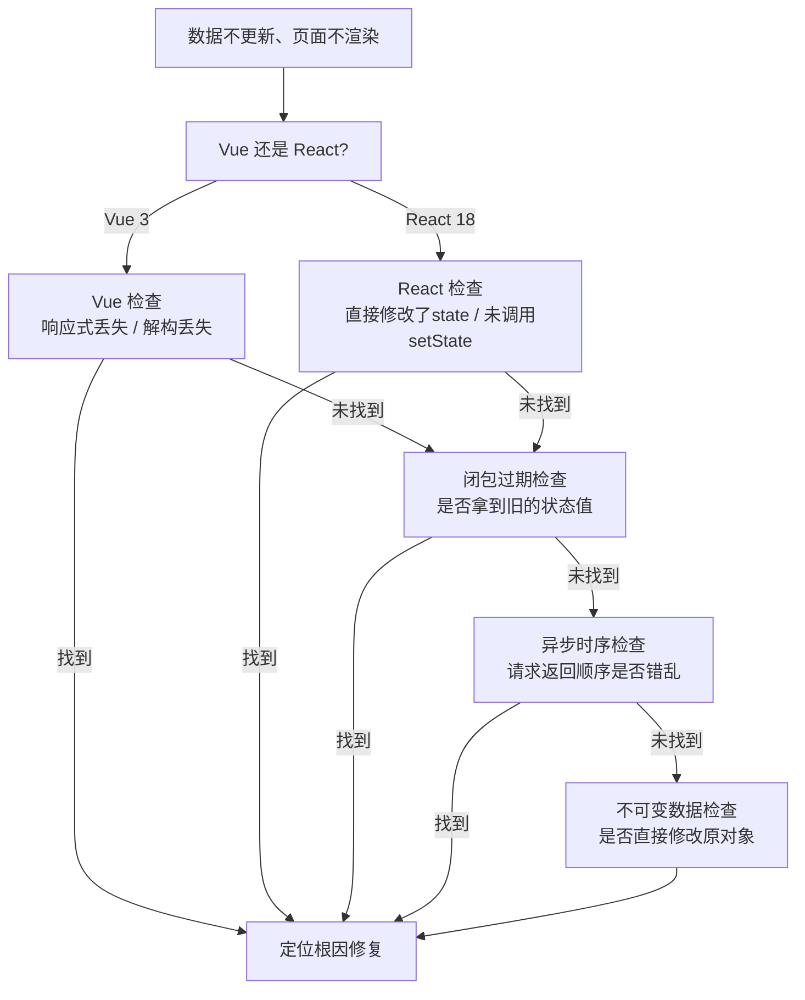
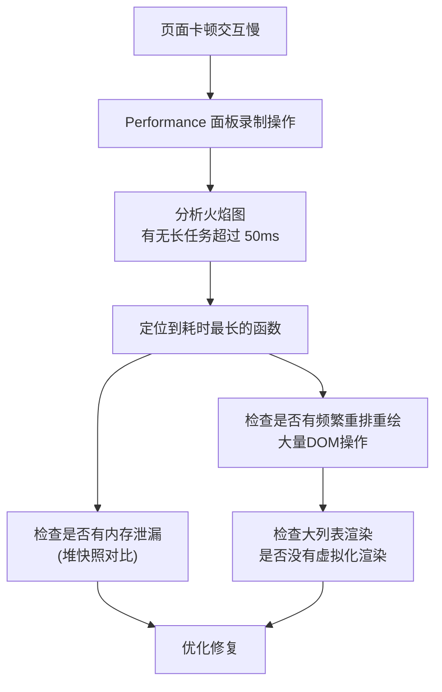
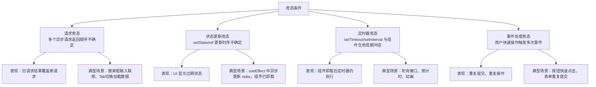
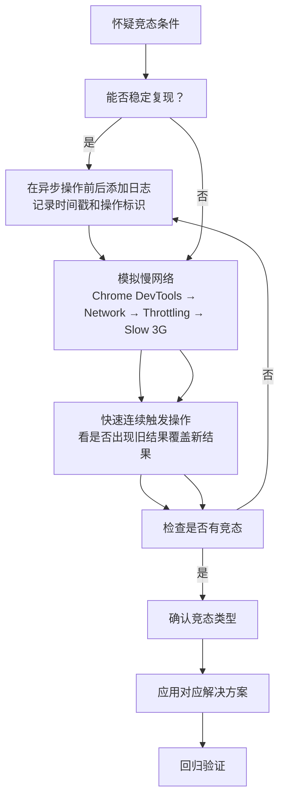

# 万能通用 Bug 定位查找逻辑

> 提供跨技术栈的通用调试方法论、系统化排查流程和工具链实战指南。
> 与各模块的 **常见错误汇总.md** 互补：本文教你「怎么排查」，各模块文件列出「已知错误」。

---

## 一、调试思维模型

调试不是玄学，而是一套可系统化遵循的思维方法。无论遇到什么未知问题，遵循固定流程总能定位到根因。

### 调试五步法

调试的核心流程可以归纳为五步：

1. **稳定复现**：找到能够稳定触发问题的操作路径，不可稳定复现的问题无法系统化调试
2. **二分定位**：将问题范围对半分割，通过验证确定问题在左半还是右半，重复直至锁定范围
3. **假设验证**：对可能的原因逐一提出假设，并设计实验验证或排除
4. **根因确定**：找到导致问题的真正根源，确认修复方案能够解决
5. **修复回归**：修复后验证问题解决，检查是否引入新问题

### 通用排查决策树

遇到未知 Bug 时，按照以下决策树逐步排查：



> 上图是通用排查的核心决策框架。大部分问题在这一流程中都能定位到根因。

### 思维转变路径

从依赖经验到系统化调试：

- **初级**：靠猜测改代码，改一改跑一跑，改对了就结束
- **中级**：掌握二分法和断点调试，能够快速缩小范围
- **高级**：建立完整错误分类体系，看到错误现象就能大致预判根因位置，复用成熟排查路径
- **专家**：通过代码逻辑推导直接定位，善于发现跨模块的隐性问题

> 📖 **参考链接**：
> - [Chrome DevTools 官方文档](https://developer.chrome.com/docs/devtools/)
> - [MDN - Console](https://developer.mozilla.org/zh-CN/docs/Web/API/console)

---

## 二、前端错误分类体系

前端错误按发生阶段可以分为三层，每层有不同的排查入口。



### 错误类型与工具映射

| 错误大类 | 常见表现 | 排查工具面板 |
|---------|---------|-------------|
| 编译时错误 | 构建失败、CI/CD红了 | 终端日志、IDE提示 |
| 资源加载错误 | 图片裂了、脚本没加载 | Network面板 |
| SyntaxError | 控制台直接报语法错 | Console面板 + Sources行号定位 |
| TypeError / ReferenceError | 访问undefined属性、变量未定义 | Sources断点、Call Stack分析 |
| Unhandled Rejection | Promise未捕获异常 | Sources异步断点 |
| 渲染样式异常 | DOM不对、样式不对 | Elements面板检查 |
| 网络请求错误 | 返回不对、调不通 | Network面板 |
| WebSocket 错误 | 连接失败、消息丢失 | Network面板 WS 标签页 |
| SSE 连接中断 | 推送数据停止、自动重连失败 | Network面板 EventStream 标签页 |
| 页面卡顿 | 滚动不流畅、点击响应慢 | Performance火焰图 |
| 内存泄漏 | 页面开久了越来越卡 | Memory堆快照对比 |

---

## 三、六种通用调试方法

以下六种方法适用于绝大多数场景，可以组合使用。

### 二分法调试

**原理**：每次将问题范围对半分割，通过中间点验证确定问题所在区间，时间复杂度 O(log n)。对于 1000 行代码最多只需要 10 次验证就能定位。

**适用场景**：大范围代码中定位未知错误、Git 提交历史引入的Bug排查。

**操作步骤**：

1. 确定当前怀疑区间的起止点
2. 在区间中点位置注入断点或日志
3. 验证中点位置数据是否正常
4. 根据结果缩小一半范围
5. 重复上述步骤直至定位到具体行

**实战技巧**：Git 二分定位使用 `git bisect` 命令，可以自动在提交历史中定位是哪一次引入了 Bug。

### 断点调试

**原理**：让代码执行到指定位置暂停，逐行单步执行，观察每个步骤的变量变化和调用栈。

**适用场景**：逻辑流问题、异步时序问题、需要观察每一步执行结果的场景。

Chrome DevTools Sources 面板支持五种断点：

| 断点类型 | 使用场景 |
|---------|---------|
| 普通断点 | 已知在哪一行出问题，直接暂停 |
| 条件断点 | 循环中只需要某个特定值满足时暂停（如 `i === 520`） |
| 日志断点 Logpoint | 不暂停执行，仅在控制台打印日志，比 `console.log` 更方便，不需要改代码 |
| DOM 断点 | DOM 子树修改、属性修改、节点移除时暂停，排查样式和DOM被意外修改问题 |
| XHR/fetch 断点 | 网络请求满足 URL 过滤条件时暂停，排查接口请求问题 |
| 事件监听断点 | 指定事件类型触发时暂停，排查点击/滚动等事件处理问题 |

**单步执行三指令**：

- **Step Over**（F10）：执行下一行，不进入函数内部
- **Step Into**（F11）：进入当前调用的函数内部
- **Step Out**（Shift+F11）：跳出当前函数，回到调用位置

### 日志驱动调试

**原理**：在关键节点打印结构化日志，追踪代码执行路径和变量变化，通过"足迹"反推问题位置。

**适用场景**：生产环境无法断点调试、异步执行流、需要复现现场的情况。

**结构化日志规范**：

```javascript
// 推荐格式：[模块名][操作] 描述, 变量名=值
console.log('[API][request] url=', url, 'params=', params);
console.log('[Component][mount] userId=', userId);
```

**进阶技巧**：

- `console.table(array)`：用表格形式打印数组，比逐个打印清晰
- `console.group('label')` / `console.groupEnd()`：对日志分组折叠，避免控制台混乱
- `console.trace('message')`：打印当前调用栈，方便知道是从哪调用过来的
- 避免使用 `console.log(obj)` 直接打对象，因为控制台展开时可能已经被修改，建议 `console.log(JSON.stringify(obj))` 或分步打印

### 假设驱动调试

**原理**：用科学方法解决问题，观察现象提出假设，设计实验验证假设，排除错误保留正确。

**适用场景**：问题原因不明确，可能有多种原因，需要逐一排除。

**四步闭环**：

1. **观察现象**：精确描述问题，记录复现步骤和环境信息
2. **提出假设**：列出所有可能的原因，不做预判，不轻易排除
3. **设计实验**：为每个假设设计可验证的测试，能通过实验结果确定该假设是否成立
4. **验证结论**：根据实验结果排除错误假设，保留正确假设，确定根因

### 橡皮鸭调试法

**原理**：向一个橡皮鸭（或任何物体）逐行解释代码逻辑，在组织语言解释的过程中，大脑被迫梳理逻辑，往往能自己发现漏洞。

据统计，约 80% 的问题可以通过这种方法自行发现。

**适用场景**：逻辑问题、为什么这里不生效、为什么结果不对。

**操作要点**：必须出声说出来，不能只在脑子里想。说出来的过程就是强迫自己重新梳理逻辑的过程。

### 对比分析法

**原理**：通过对比"正常"和"异常"的差异，发现问题根源。差异即线索。

**三个对比维度**：

1. **代码对比**：正常版本 vs 异常版本，用 `git diff` 查看变更，问题往往就在变更范围内
2. **环境对比**：开发环境正常 vs 生产环境异常，对比 Node 版本、浏览器版本、依赖包版本、配置差异
3. **数据对比**：正常输入 vs 异常输入，找到触发问题的边界条件和特殊数据

---

## 四、工具链实战指南

### Chrome DevTools 九大面板速查

| 面板 | 核心用途 |
|------|---------|
| Elements | 检查 DOM 结构、编辑 HTML/CSS、查看盒模型、调试样式 |
| Console | 查看错误日志、执行任意 JavaScript、打印调试信息 |
| Sources | 断点调试、查看源文件、单步执行、调用栈分析 |
| Network | 查看网络请求、分析请求时序、检查请求头响应头 |
| Performance | 分析运行时性能、查看火焰图、定位长任务 |
| Memory | 堆快照分析、检测内存泄漏 |
| Application | 查看 Storage（LocalStorage/SessionStorage/Cookie/IndexedDB）、Cache Storage |
| Lighthouse | 性能、可访问性、SEO 自动化检测 |
| Security | 检查 HTTPS 证书、混合内容问题 |

### Sources 面板核心操作

Sources 面板是调试 JavaScript 逻辑的核心阵地。

**关键区域**：

- **Call Stack**：调用栈，查看当前函数是从哪一层调用过来的
- **Scope**：作用域，查看当前函数的 Local、Closure、Global 变量
- **Watch**：添加表达式监视，实时查看表达式值
- **Breakpoints**：断点列表，可以勾选启用/禁用断点

**实用技巧**：

- 右键点击行号添加断点，再次点击移除
- 条件断点：右键 → Add conditional breakpoint，输入条件表达式
- 日志断点：右键 → Add logpoint，输入要打印的内容，不会暂停执行
- Blackboxing：可以把第三方库（如React、Vue）加入黑名单，单步调试时不会进入它们的代码

### Network 面板分析请求

Network 面板是排查接口问题的主战场。

**核心功能**：

- **过滤**：可以按类型过滤（XHR/JS/CSS/Img/...），也可以按关键词搜索URL
- **瀑布图**：查看请求从开始到结束各阶段的时间（DNS查询、TCP连接、Request发送、Waiting、Content下载）
- **重发**：右键 → Replay XHR 可以重新发送请求，方便复现
- **拦截修改**：可以重发并修改请求参数和头，快速验证假设
- **禁用缓存**：勾选 Disable cache 禁用缓存，排查缓存问题

### Performance 性能分析

排查页面卡顿、交互慢等性能问题使用 Performance 面板。

**操作流程**：

1. 点击录制按钮（圆点）
2. 在页面执行你要分析的操作
3. 点击停止录制
4. 分析火焰图：长条块表示长任务，过长的长任务会阻塞主线程导致卡顿
5. 查看 Summary：找到占用时间最多的任务，定位到具体函数

### Memory 内存泄漏定位三步法

页面运行时间越长越卡，很可能是内存泄漏，按以下三步定位：

1. **拍堆快照**：操作前拍一次快照 Heap Snapshot
2. **执行可疑操作**：重复执行你怀疑会导致泄漏的操作多次
3. **再拍快照对比**：看内存占用是否持续增长，搜索分离的 DOM 节点，定位泄漏源头

### 其他工具速览

**VS Code 调试配置**：在项目 `.vscode/launch.json` 中配置调试，可以直接在 VS Code 中断点调试 Node.js 或前端代码。

**框架调试工具**：

- Vue DevTools：查看组件树、检查 props/state、观察状态变化、时间旅行回退
- React DevTools：查看组件树、检查 Props/State、分析重渲染原因

**移动端调试**：

- vConsole：在页面内嵌调试面板，适合移动端真机调试查看日志
- Chrome 远程调试：PC Chrome 连接手机，直接用 DevTools 调试手机上的页面
- Charles / Fiddler：代理抓包，查看移动端请求和响应

> 📖 **参考链接**：
> - [MDN - 调试 JavaScript](https://developer.mozilla.org/zh-CN/docs/Learn/JavaScript/First_steps/What_went_wrong)
> - [Chrome DevTools 官方文档](https://developer.chrome.com/docs/devtools/)

---

## 五、常见场景排查手册

以下是开发者最常遇到的几种场景，按这个流程排查，大多数问题都能快速定位。

### 构建失败

执行 `pnpm dev` 或 `pnpm build` 时报错，无法启动项目：



**排查要点**：

- TypeScript 类型错误 → 从终端定位到具体文件和行号，检查类型定义是否正确
- 找不到模块 → 检查 `import` 路径拼写、包是否已 `pnpm install`、导出方式是否匹配（default vs named）
- 依赖版本冲突 → 删除 `node_modules` 和 lock 文件后重新安装；检查 `package.json` 中的版本范围
- 构建配置错误 → 对比项目模板或官方文档检查配置项；注意 Vite/Webpack 配置语法差异
- Node.js 版本 → 执行 `node -v` 确认版本，检查 `package.json` 中 `engines` 字段要求

相关模块常见错误：

- 工程化模块 → [07-engineering/常见错误汇总.md](./07-engineering/常见错误汇总.md)

---

### 页面白屏

页面打开后一片空白，什么都不显示：



相关模块常见错误：

- HTML/CSS 模块 → [01-html-css/常见错误汇总.md](./01-html-css/常见错误汇总.md)
- JavaScript 模块 → [02-javascript-core/常见错误汇总.md](./02-javascript-core/常见错误汇总.md)

---

### 接口调不通

发送了请求但是拿不到正确响应：



**排查要点**：

- 401/403 → 检查 Token、身份认证信息是否正确
- 404 → 检查 URL 路径是否写错，后端服务是否部署正确
- 500 → 看后端日志，后端代码报错
- 502/504 → 后端服务不可用或超时，检查服务是否启动、网络是否连通

相关模块常见错误：

- 浏览器模块 → [04-browser/常见错误汇总.md](./04-browser/常见错误汇总.md)

---

### 样式不生效

写了 CSS 但是不生效，或者不是预期效果：



相关模块常见错误：

- HTML/CSS 模块 → [01-html-css/常见错误汇总.md](./01-html-css/常见错误汇总.md)

---

### 数据不更新、页面不渲染

修改了数据但是页面没反应，不重新渲染：



相关模块常见错误：

- Vue 模块 → [05-vue/常见错误汇总.md](./05-vue/常见错误汇总.md)
- React 模块 → [06-react/常见错误汇总.md](./06-react/常见错误汇总.md)
- JavaScript 模块 → [02-javascript-core/常见错误汇总.md](./02-javascript-core/常见错误汇总.md)

---

### 页面卡顿

页面滚动不流畅，点击响应慢：



相关模块常见错误：

- 性能优化模块 → [08-performance/常见错误汇总.md](./08-performance/常见错误汇总.md)

---

### 竞态条件（Race Condition）

竞态条件是指**多个异步操作的执行顺序不确定，导致最终结果依赖于操作完成的时序**。这是前端开发中最隐蔽、最难复现的 Bug 类型之一。

#### 竞态条件分类



#### 排查流程



#### 请求竞态解决方案

```javascript
// 方案一：AbortController 取消旧请求（推荐）
class SearchController {
  constructor() {
    this.abortController = null;
  }

  async search(keyword) {
    // 取消上一次未完成的请求
    if (this.abortController) {
      this.abortController.abort();
    }

    this.abortController = new AbortController();

    try {
      const response = await fetch(`/api/search?q=${keyword}`, {
        signal: this.abortController.signal,
      });
      return await response.json();
    } catch (err) {
      if (err.name === 'AbortError') {
        console.log('请求已取消（正常行为）');
        return null;
      }
      throw err;
    }
  }
}

// 方案二：请求序列化（队列）
class RequestQueue {
  constructor() {
    this.queue = [];
    this.processing = false;
  }

  async enqueue(requestFn) {
    return new Promise((resolve, reject) => {
      this.queue.push({ requestFn, resolve, reject });
      this.process();
    });
  }

  async process() {
    if (this.processing) return;
    this.processing = true;

    while (this.queue.length > 0) {
      const { requestFn, resolve, reject } = this.queue.shift();
      try {
        const result = await requestFn();
        resolve(result);
      } catch (err) {
        reject(err);
      }
    }

    this.processing = false;
  }
}

// 方案三：版本号机制（适合无法取消的请求）
let requestId = 0;

async function fetchDataWithVersion(keyword) {
  const currentId = ++requestId;

  const data = await fetch(`/api/search?q=${keyword}`).then(r => r.json());

  // 只处理最新请求的结果
  if (currentId !== requestId) {
    console.log(`丢弃过期请求 #${currentId}，最新请求是 #${requestId}`);
    return null;
  }

  return data;
}
```

#### 状态更新竞态解决方案

```javascript
// React：useEffect cleanup 函数
useEffect(() => {
  let cancelled = false; // 竞态标记

  async function fetchData() {
    const data = await api.getUser(id);
    // 组件已卸载或 id 已变化，不更新状态
    if (!cancelled) {
      setUser(data);
    }
  }

  fetchData();

  return () => {
    cancelled = true; // cleanup：标记为已取消
  };
}, [id]);

// Vue 3：watchEffect + onBeforeUnmount
import { watchEffect, onBeforeUnmount } from 'vue';

let active = true;

watchEffect(async () => {
  const data = await api.getUser(id.value);
  if (active) {
    user.value = data;
  }
});

onBeforeUnmount(() => {
  active = false;
});
```

#### 代码审查检测清单

在 Code Review 中检查以下信号，它们可能是竞态条件的隐患：

| 检测项 | 信号 | 风险 |
|--------|------|------|
| 异步函数是否处理了取消 | 没有 AbortController 或 cancelled 标记 | 高 |
| useEffect 是否有 cleanup | cleanup 函数为空或未处理异步取消 | 高 |
| 多个异步操作是否有顺序保证 | 同时发起多个请求，无排队/版本号机制 | 中 |
| 定时器是否在组件卸载时清除 | `setInterval` 无对应的 `clearInterval` | 中 |
| 事件处理是否有防抖/节流 | 按钮点击直接触发异步操作，无防抖 | 中 |
| Promise 是否处理了 rejection | 缺少 `.catch()` 或 `try/catch` | 中 |

#### ESLint 自动检测配置

```javascript
// eslint.config.mjs 中配置竞态条件相关规则
import promise from 'eslint-plugin-promise';
import reactHooks from 'eslint-plugin-react-hooks';

export default [
  {
    plugins: {
      promise,
      'react-hooks': reactHooks,
    },
    rules: {
      // 要求 async 函数必须有 await 表达式
      'require-await': 'error',

      // 禁止 Promise 执行器函数中使用 async
      'no-async-promise-executor': 'error',

      // 要求 Promise 有错误处理
      'promise/catch-or-return': 'warn',
      'promise/no-nesting': 'warn',

      // 要求 useEffect 有依赖数组
      'react-hooks/exhaustive-deps': 'warn',
    },
  },
];
```

---

## 六、调试习惯与工程化

好的调试习惯和工程化配置可以大幅降低调试成本。

### 代码预埋调试信息

在代码编写阶段就为调试做好准备：

- 关键流程节点添加结构化日志，方便排查时快速定位
- 异步错误一定要捕获，不要让错误吞掉，至少打个错误日志
- React 使用 Error Boundary，Vue 使用 errorCaptured，避免一个组件错导致整个页面白屏

```javascript
// React Error Boundary 示例
class ErrorBoundary extends React.Component {
  state = { hasError: false, error: null };
  static getDerivedStateFromError(error) {
    return { hasError: true, error };
  }
  componentDidCatch(error, errorInfo) {
    console.error('[ErrorBoundary]', error, errorInfo);
    // 上报到 Sentry
  }
  render() {
    if (this.state.hasError) {
      return <h1>Something went wrong.</h1>;
    }
    return this.props.children;
  }
}
// 使用：<ErrorBoundary><YourComponent /></ErrorBoundary>
```

```javascript
// Vue errorCaptured 示例
export default {
  errorCaptured(err, instance, info) {
    console.error('[errorCaptured]', err, info);
    // 上报到 Sentry，返回 false 阻止错误继续向上传播
    return false;
  }
};
// Vue 3 全局错误处理：app.config.errorHandler = (err, instance, info) => { ... }
```
- 性能敏感操作添加 performance.mark 标记，方便 Performance 面板识别

### Source Map 配置

Source Map 能将压缩打包后的代码映射回原始源代码，即使在生产环境也能调试。

配置要点：

- 开发环境：默认开启 Source Map，方便调试
- 生产环境：根据安全需求选择，可以配置 `source-map` 或 `hidden-source-map`，只在需要时上传调试
- 注意：不要把 Source Map 部署到公网，否则等于把源代码公开

### 错误监控与日志上报

生产环境用户遇到的问题，前端需要错误监控系统：

- 使用 Sentry 收集前端错误，包含错误信息、调用栈、用户操作路径、浏览器环境信息
- 关键业务流程添加自定义 breadcrumb，帮助复现用户操作
- 统计错误发生率，优先解决高频问题

### 调试复盘模板

修复 Bug 后，可以简单记录：

- 问题现象是什么
- 根因是什么（为什么会发生）
- 怎么修复的
- 如何避免同类问题

积累复盘，下次遇到同类问题就能更快定位。

---

## 附录：速查表

### Chrome DevTools 常用快捷键

| 操作 | Windows/Linux | Mac |
|------|---------------|-----|
| 打开 DevTools | F12 / Ctrl+Shift+I | Cmd+Opt+I |
| 打开控制台 | Ctrl+Shift+J | Cmd+Opt+J |
| 继续执行 | F8 | Cmd+\ |
| 单步跳过 | F10 | Cmd+' |
| 单步进入 | F11 | Cmd+; |
| 单步跳出 | Shift+F11 | Shift+Cmd+; |

### 错误类型与排查入口映射

| 错误 | 入口面板 |
|------|---------|
| SyntaxError: Unexpected token | Console → 点击行号跳转到 Sources |
| TypeError: Cannot read property 'x' of undefined | Sources 断点 |
| ReferenceError: x is not defined | Console 行号定位 |
| CORS error | Network 面板检查请求头 |
| 资源 404 | Network 面板 |
| 跨域报错 | Network 面板查看响应头 |
| 样式不生效 | Elements 面板检查计算样式 |
| DOM 被意外修改 | DOM 断点 |
| 页面卡顿 | Performance 火焰图 |
| 内存泄漏 | Memory 堆快照对比 |

### 各模块常见错误汇总交叉引用

| 模块 | 文件路径 |
|------|---------|
| HTML/CSS | [01-html-css/常见错误汇总.md](./01-html-css/常见错误汇总.md) |
| JavaScript 核心 | [02-javascript-core/常见错误汇总.md](./02-javascript-core/常见错误汇总.md) |
| TypeScript | [03-typescript/常见错误汇总.md](./03-typescript/常见错误汇总.md) |
| 浏览器原理 | [04-browser/常见错误汇总.md](./04-browser/常见错误汇总.md) |
| Vue3 | [05-vue/常见错误汇总.md](./05-vue/常见错误汇总.md) |
| React18 | [06-react/常见错误汇总.md](./06-react/常见错误汇总.md) |
| 前端工程化 | [07-engineering/常见错误汇总.md](./07-engineering/常见错误汇总.md) |
| 性能优化 | [08-performance/常见错误汇总.md](./08-performance/常见错误汇总.md) |
| Node.js | [09-nodejs/常见错误汇总.md](./09-nodejs/常见错误汇总.md) |
| 综合项目实战 | [10-project/常见错误汇总.md](./10-project/常见错误汇总.md) |
| AI 辅助开发 | [11-ai-assisted/常见错误汇总.md](./11-ai-assisted/常见错误汇总.md) |
| 跨端开发 | [12-cross-platform/常见错误汇总.md](./12-cross-platform/常见错误汇总.md) |
| 前端架构设计 | [13-architecture/常见错误汇总.md](./13-architecture/常见错误汇总.md) |
| 前端监控与运维 | [14-monitoring/常见错误汇总.md](./14-monitoring/常见错误汇总.md) |
| 前端测试策略 | [15-testing/常见错误汇总.md](./15-testing/常见错误汇总.md) |

---

> [返回 README](./README.md) | [返回知识导览](./知识导览.md)
