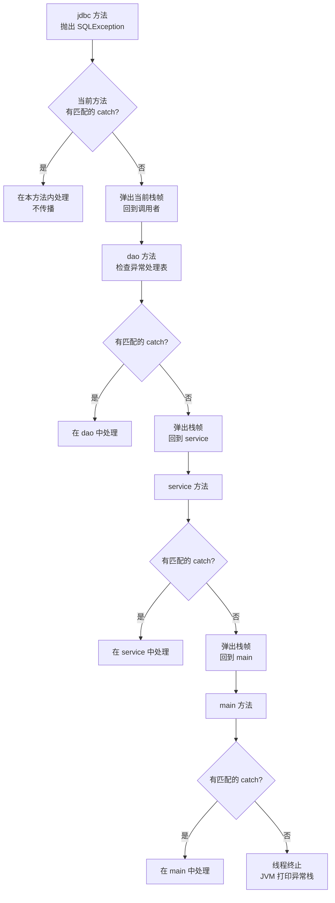

# 异常处理

> 学习路线对应：第1周 -- Java 语言核心
> 前置知识：Java 基本语法（变量、流程控制、面向对象基础）
> 预计学习时间：1-2 天

> **视频章节对应**：尚硅谷宋红康《Java零基础入门教程》第06章-异常处理。本章涵盖 Java 异常体系、常见异常类型、try-catch-finally、throws/throw 关键字、自定义异常、finally 中 return 陷阱以及 try-with-resources 自动资源管理。

---

## 一、核心概念

### 1.1 异常是什么

> **生活化类比：餐厅异常处置预案** —— 程序的异常就像餐厅运营中的突发情况：客人食物过敏（编译期必须处理的受检异常，必须事先准备预案）、客人滑倒摔伤（运行时不可预见的 RuntimeException，事后紧急处置）、餐厅失火（Error 级别，店员无法处理只能报警撤退）。try-catch 是"现场应急处置流程"，throws 是"挂出告示牌告知客人本店可能发生的风险"，throw 是"主动按下紧急按钮"。

异常（Exception）是程序在运行过程中发生的意外情况，它会中断正常的指令流。Java 通过异常处理机制（Exception Handling）将异常处理代码与正常业务逻辑分离，提高程序的可读性、可维护性和健壮性。

**异常处理的核心价值：**

| 价值 | 说明 |
|------|------|
| **分离关注点** | 正常业务逻辑与错误处理逻辑分离，代码更清晰 |
| **错误传播** | 可以沿着调用栈向上传播异常，直到找到合适的处理器 |
| **错误分类** | 通过异常类型层次结构，对不同类型的错误进行差异化处理 |
| **资源管理** | 通过 finally 和 try-with-resources 确保资源正确释放 |

### 1.2 异常体系：Throwable / Error / Exception

> **生活化类比：医院分诊体系** —— Throwable 是"所有急诊病人的总称"；Error 是"心梗、车祸等危重病人"（医生无能为力，只能转入ICU 或宣告不治）；Exception 是"普通急诊病人"（可治疗），其中受检异常像"传染病"（必须事先报告并隔离预案），RuntimeException 像"急诊常见病"（不强制事先预案，但需及时处置）。

Java 异常体系的根类是 `java.lang.Throwable`，其下分为两大分支：

```
java.lang.Throwable
├── java.lang.Error                         -- 错误（不可处理）
│   ├── VirtualMachineError                 -- 虚拟机错误
│   │   ├── OutOfMemoryError                -- 堆内存溢出
│   │   └── StackOverflowError              -- 栈溢出
│   ├── LinkageError                        -- 链接错误
│   │   └── NoClassDefFoundError            -- 类定义未找到
│   └── AssertionError                      -- 断言错误
│
└── java.lang.Exception                     -- 异常（可处理）
    ├── java.lang.RuntimeException          -- 运行时异常（非受检异常）
    │   ├── NullPointerException            -- 空指针异常
    │   ├── ArrayIndexOutOfBoundsException  -- 数组索引越界
    │   ├── ClassCastException              -- 类型转换异常
    │   ├── ArithmeticException             -- 算术异常（如除零）
    │   ├── NumberFormatException           -- 数字格式异常
    │   └── IllegalArgumentException        -- 非法参数异常
    │
    └── 其他 Exception（非 RuntimeException）-- 编译时异常（受检异常）
        ├── IOException                     -- IO 异常
        │   └── FileNotFoundException       -- 文件未找到
        ├── SQLException                    -- 数据库异常
        ├── ClassNotFoundException          -- 类未找到异常
        └── InterruptedException            -- 线程中断异常
```

**三大分支对比：**

| 分支 | 定义 | 可处理性 | 是否必须显式处理 | 典型场景 |
|------|------|---------|----------------|---------|
| **Error** | JVM 级别的严重错误 | 无法处理，不应捕获 | 否 | OOM、StackOverflow |
| **受检异常（Checked）** | 编译器强制检查的异常 | 必须处理 | 是（try-catch 或 throws） | IO 操作、SQL 操作、反射 |
| **非受检异常（Unchecked）** | RuntimeException 及其子类 | 可选择处理 | 否 | 空指针、数组越界、类型转换 |

**记忆口诀：**
- Error：天灾，人力无法改变，不用管
- 受检异常（Checked）：天气预报有雨，必须带伞（编译器强制处理）
- 非受检异常（Unchecked）：可能踩到坑，走路小心即可（编译器不强制，但程序猿自己要注意）

> 📖 **参考链接**：
> - [Oracle - Throwable API](https://docs.oracle.com/en/java/javase/17/docs/api/java.base/java/lang/Throwable.html) -- Throwable 类官方 API
> - [Oracle - Exception API](https://docs.oracle.com/en/java/javase/17/docs/api/java.base/java/lang/Exception.html) -- Exception 类官方 API
> - [Oracle - Error API](https://docs.oracle.com/en/java/javase/17/docs/api/java.base/java/lang/Error.html) -- Error 类官方 API
> - [JLS - Chapter 11. Exceptions](https://docs.oracle.com/javase/specs/jls/se17/html/jls-11.html) -- Java 语言规范第 11 章"异常"

### 1.3 常见异常类型速查表

| 异常类 | 中文名 | 触发条件 | 代码示例 |
|--------|--------|---------|---------|
| `NullPointerException` | 空指针异常 | 对 null 引用调用方法或属性 | `String s = null; s.length();` |
| `ArrayIndexOutOfBoundsException` | 数组下标越界 | 访问不存在的数组索引 | `int[] arr = new int[3]; arr[3];` |
| `ClassCastException` | 类型转换异常 | 将对象强制转换为不兼容的类型 | `Object o = "abc"; (Integer) o;` |
| `ArithmeticException` | 算术异常 | 整数除以零 | `int a = 1 / 0;` |
| `NumberFormatException` | 数字格式异常 | 将非数字字符串解析为数字 | `Integer.parseInt("abc");` |
| `IllegalArgumentException` | 非法参数异常 | 向方法传递了不合适的参数 | `new Thread(null);` |
| `FileNotFoundException` | 文件未找到异常 | 尝试打开不存在的文件 | `new FileInputStream("x.txt");` |
| `IOException` | IO 异常 | 输入输出操作失败 | 磁盘满、网络断开等 |
| `SQLException` | 数据库异常 | 数据库操作失败 | SQL 语法错误、连接失败 |
| `ClassNotFoundException` | 类未找到异常 | 反射加载不存在的类 | `Class.forName("com.X");` |
| `OutOfMemoryError` | 内存溢出错误 | 堆空间不足 | 创建大量对象导致堆满 |
| `StackOverflowError` | 栈溢出错误 | 递归过深无终止条件 | `void f() { f(); }` |

> 📖 **参考链接**：
> - [Oracle - RuntimeException API](https://docs.oracle.com/en/java/javase/17/docs/api/java.base/java/lang/RuntimeException.html) -- RuntimeException 官方 API
> - [Oracle - NullPointerException API](https://docs.oracle.com/en/java/javase/17/docs/api/java.base/java/lang/NullPointerException.html) -- NullPointerException 官方 API
> - [Oracle - IOException API](https://docs.oracle.com/en/java/javase/17/docs/api/java.base/java/io/IOException.html) -- IOException 官方 API

### 1.4 try-catch-finally 基本语法

> **生活化类比：消防演练三步骤** —— try 是"演练可能出问题的环节"，catch 是"消防员赶到按预案处置"，finally 是"演练结束后无论是否出事都要清场关闭水电"。即使 catch 中又出错或方法 return，finally 也会执行（除非 JVM 退出或线程被杀）。

#### 标准结构

```java
try {
    // 可能抛出异常的代码
    // 一旦抛出异常，try 块中后续代码不再执行
} catch (异常类型1 变量名) {
    // 处理异常类型1的代码
} catch (异常类型2 变量名) {
    // 处理异常类型2的代码
} finally {
    // 无论是否发生异常，都会执行的代码（通常用于资源释放）
}
```

#### 三种基本形式

```java
// 形式一：try-catch（最常用）
try { ... } catch (Exception e) { ... }

// 形式二：try-finally（不捕获异常，只保证资源释放）
try { ... } finally { ... }

// 形式三：try-catch-finally（完整形式）
try { ... } catch (Exception e) { ... } finally { ... }
```

#### 多重 catch 的匹配规则

```java
try {
    // 可能抛出多种异常的代码
    int[] arr = new int[3];
    arr[5] = 10;              // ArrayIndexOutOfBoundsException
    int result = 10 / 0;      // ArithmeticException
} catch (ArithmeticException e) {
    // 处理算术异常
    System.out.println("算术异常：" + e.getMessage());
} catch (ArrayIndexOutOfBoundsException e) {
    // 处理数组越界异常
    System.out.println("数组越界：" + e.getMessage());
} catch (Exception e) {
    // 兜底：处理其他所有异常
    // 注意：父类异常必须放在子类异常之后，否则编译错误
    System.out.println("其他异常：" + e.getMessage());
}
```

**catch 匹配规则：**
- 从上到下依次匹配，找到第一个匹配的 catch 块后不再继续匹配
- 子类异常必须写在父类异常前面，否则编译错误（后面的 catch 永不可达）
- JDK 7+ 支持**多异常捕获**：`catch (IOException | SQLException e) { ... }`

#### 异常对象的常用方法

```java
catch (Exception e) {
    e.getMessage();       // 获取异常简要描述信息（String）
    e.toString();         // 获取异常类名 + 简要描述（String）
    e.printStackTrace();  // 打印异常类名、描述信息、调用栈到标准错误流（最常用）
}
```

> 📖 **参考链接**：
> - [JLS - Chapter 14.20. The try Statement](https://docs.oracle.com/javase/specs/jls/se17/html/jls-14.html#jls-14.20) -- Java 语言规范"try 语句"
> - [Oracle - Throwable.printStackTrace API](https://docs.oracle.com/en/java/javase/17/docs/api/java.base/java/lang/Throwable.html#printStackTrace()) -- printStackTrace 官方 API
> - [Oracle - Java Tutorial: Catching and Handling Exceptions](https://docs.oracle.com/javase/tutorial/essential/exceptions/handling.html) -- Oracle 官方"捕获与处理异常"

### 1.5 throws 关键字：声明抛出异常

`throws` 用在方法签名上，声明该方法可能抛出的异常，将异常处理责任**向上推给调用者**。

```java
// 语法：返回值类型 方法名(参数列表) throws 异常类型1, 异常类型2 { ... }

// 声明抛出单个异常
public void readFile() throws IOException {
    FileInputStream fis = new FileInputStream("test.txt");
    // 这里不处理异常，交给调用者处理
}

// 声明抛出多个异常
public void loadData() throws IOException, SQLException {
    // 可能抛出多种受检异常
}

// 子类重写方法时，throws 规则：
// 1. 子类重写方法抛出的异常类型不能比父类更宽泛
// 2. 子类可以不抛出异常（比父类更严格）
// 3. 子类可以抛出父类异常的子类异常
```

> 📖 **参考链接**：
> - [JLS - Chapter 8.4.6. Method Throws](https://docs.oracle.com/javase/specs/jls/se17/html/jls-8.html#jls-8.4.6) -- Java 语言规范"方法 throws 子句"
> - [JLS - Chapter 11.2. Compile-Time Checking of Exceptions](https://docs.oracle.com/javase/specs/jls/se17/html/jls-11.html#jls-11.2) -- Java 语言规范"异常编译期检查"
> - [Oracle - Java Tutorial: Specifying the Exceptions Thrown by a Method](https://docs.oracle.com/javase/tutorial/essential/exceptions/declaring.html) -- Oracle 官方"声明方法抛出异常"

### 1.6 throw 关键字：手动抛出异常

`throw` 用在方法体内部，用于**手动创建并抛出一个异常对象**。

```java
// 语法：throw new 异常类型(描述信息);

// 示例：参数校验
public void setAge(int age) {
    if (age < 0 || age > 150) {
        throw new IllegalArgumentException("年龄不合法：" + age);
    }
    this.age = age;
}

// 示例：业务逻辑异常
public void transfer(Account from, Account to, double amount) {
    if (from.getBalance() < amount) {
        throw new RuntimeException("余额不足，转账失败");
    }
    // 执行转账逻辑...
}
```

**throw 与 throws 的区别：**

| 对比维度 | throw | throws |
|---------|-------|--------|
| **位置** | 方法体内部 | 方法签名上 |
| **作用** | 手动创建并抛出异常对象 | 声明方法可能抛出的异常类型 |
| **数量** | 一次只能抛出一个异常对象 | 可以声明多个异常类型（逗号分隔） |
| **语法** | `throw new 异常类型();` | `throws 异常类型1, 异常类型2` |
| **本质** | 动作（抛出异常） | 声明（告知调用者） |
| **类比** | 扔出一个球 | 门口贴的告示牌："注意：内有恶犬" |

> 📖 **参考链接**：
> - [JLS - Chapter 14.18. The throw Statement](https://docs.oracle.com/javase/specs/jls/se17/html/jls-14.html#jls-14.18) -- Java 语言规范"throw 语句"
> - [Oracle - Java Tutorial: Throwing Exceptions](https://docs.oracle.com/javase/tutorial/essential/exceptions/throwing.html) -- Oracle 官方"抛出异常"

### 1.7 自定义异常

> **生活化类比：企业自定义报警级别** —— 自定义异常像企业自定义报警级别：继承 Exception 像"红色一级警报"（必须上报处理，编译器强制），继承 RuntimeException 像"黄色二级提醒"（业务方自行决定是否处理）。每种异常还应在构造器中调用 `super(message)`，像填写报警单的"事件描述"字段。

#### 自定义受检异常（继承 Exception）

```java
/**
 * 自定义业务异常：用户未找到异常
 */
public class UserNotFoundException extends Exception {
    public UserNotFoundException() {
        super();
    }

    public UserNotFoundException(String message) {
        super(message);
    }

    public UserNotFoundException(String message, Throwable cause) {
        super(message, cause);
    }
}

// 使用
public User findUser(String id) throws UserNotFoundException {
    User user = userDao.findById(id);
    if (user == null) {
        throw new UserNotFoundException("用户不存在，ID：" + id);
    }
    return user;
}
```

#### 自定义非受检异常（继承 RuntimeException）

```java
/**
 * 自定义业务异常：余额不足异常（非受检）
 */
public class InsufficientBalanceException extends RuntimeException {
    public InsufficientBalanceException() {
        super();
    }

    public InsufficientBalanceException(String message) {
        super(message);
    }

    public InsufficientBalanceException(String message, Throwable cause) {
        super(message, cause);
    }
}

// 使用
public void withdraw(double amount) {
    if (amount > balance) {
        throw new InsufficientBalanceException("余额不足，当前余额：" + balance);
    }
    balance -= amount;
}
```

**自定义异常选择指南：**

| 场景 | 继承哪个 | 原因 |
|------|---------|------|
| 业务异常，希望调用者必须处理 | `Exception` | 受检异常，编译器强制调用者处理 |
| 业务异常，调用者无法/无需处理 | `RuntimeException` | 非受检异常，不强制处理 |
| 与数据库操作相关的异常 | `SQLException` 或 `RuntimeException` | 具体看异常是否可恢复 |
| 参数校验失败 | `IllegalArgumentException` 或自定义 `RuntimeException` | 非受检，通常由框架统一处理 |

**自定义异常最佳实践：**
1. 提供至少两个构造器：无参构造器和带 `String message` 的构造器
2. 提供带 `Throwable cause` 的构造器，用于异常链（记录原始异常）
3. 异常类名要见名知意，以 `Exception` 结尾
4. 提供清晰的错误信息，包含关键业务数据

> 📖 **参考链接**：
> - [Oracle - Exception API](https://docs.oracle.com/en/java/javase/17/docs/api/java.base/java/lang/Exception.html) -- Exception 类官方 API
> - [Oracle - Java Tutorial: Creating Exception Classes](https://docs.oracle.com/javase/tutorial/essential/exceptions/creating.html) -- Oracle 官方"创建自定义异常"
> - [JLS - Chapter 11.1.1. The Kinds of Throwable](https://docs.oracle.com/javase/specs/jls/se17/html/jls-11.html#jls-11.1.1) -- Java 语言规范"Throwable 的种类"

### 1.8 try-with-resources（自动资源管理）

JDK 7 引入的语法糖，用于自动关闭实现了 `AutoCloseable` 接口的资源。

#### 传统方式 vs try-with-resources

```java
// 传统方式（JDK 7 之前）：冗长且容易出错
BufferedReader br = null;
try {
    br = new BufferedReader(new FileReader("test.txt"));
    String line;
    while ((line = br.readLine()) != null) {
        System.out.println(line);
    }
} catch (IOException e) {
    e.printStackTrace();
} finally {
    if (br != null) {
        try {
            br.close();  // close() 本身也可能抛异常
        } catch (IOException e) {
            e.printStackTrace();
        }
    }
}

// try-with-resources（JDK 7+）：简洁优雅
try (BufferedReader br = new BufferedReader(new FileReader("test.txt"))) {
    String line;
    while ((line = br.readLine()) != null) {
        System.out.println(line);
    }
} catch (IOException e) {
    e.printStackTrace();
}
// br 会被自动关闭，无论是否抛出异常
```

#### 管理多个资源

```java
// 多个资源用分号分隔
try (
    FileInputStream fis = new FileInputStream("input.txt");
    FileOutputStream fos = new FileOutputStream("output.txt");
    BufferedReader br = new BufferedReader(new InputStreamReader(fis))
) {
    String line;
    while ((line = br.readLine()) != null) {
        fos.write(line.getBytes());
        fos.write('\n');
    }
} catch (IOException e) {
    e.printStackTrace();
}
// 三个资源按声明顺序的逆序自动关闭：br -> fos -> fis
```

#### JDK 9 增强

```java
// JDK 9+：可以使用已声明的 final 或 effectively final 变量
BufferedReader br = new BufferedReader(new FileReader("test.txt"));
// br 是 effectively final 的（声明后未重新赋值）
try (br) {  // 直接使用已声明的变量
    // 使用 br...
} catch (IOException e) {
    e.printStackTrace();
}
```

> 📖 **参考链接**：
> - [JLS - Chapter 14.20.3. try-with-resources](https://docs.oracle.com/javase/specs/jls/se17/html/jls-14.html#jls-14.20.3) -- Java 语言规范"try-with-resources"
> - [Oracle - AutoCloseable API](https://docs.oracle.com/en/java/javase/17/docs/api/java.base/java/lang/AutoCloseable.html) -- AutoCloseable 接口官方 API
> - [Oracle - Java Tutorial: The try-with-resources Statement](https://docs.oracle.com/javase/tutorial/essential/exceptions/tryResourceClose.html) -- Oracle 官方"try-with-resources"

---

## 二、底层原理

### 2.1 异常处理机制底层原理

#### 异常处理表（Exception Table）

Java 编译器为每个可能抛出异常的方法生成一张**异常处理表**（Exception Table），存储在字节码的 `Code` 属性中。JVM 在运行时通过这张表查找匹配的异常处理器。

```java
// 源代码
public void test() {
    try {
        int a = 1 / 0;
    } catch (ArithmeticException e) {
        System.out.println("捕获异常");
    }
}
```

编译后生成的异常处理表结构（伪代码）：

```
Exception Table:
  from    to    target    type
  ─────────────────────────────────
    0      6      8      ArithmeticException
    (try块)        (catch块入口)  (捕获的异常类型)
```

**异常处理表字段说明：**

| 字段 | 含义 |
|------|------|
| `from` | try 块的起始字节码偏移量（含） |
| `to` | try 块的结束字节码偏移量（不含） |
| `target` | 匹配成功时跳转到的 catch 块入口字节码偏移量 |
| `type` | 需要捕获的异常类型（常量池索引） |

**运行时异常匹配流程：**
1. 抛出异常时，JVM 在当前方法的异常处理表中查找匹配的条目
2. 从 `from` 到 `to` 范围内抛出的异常，检查 `type` 是否匹配（`instanceof` 判断）
3. 若匹配，将异常对象压入操作数栈，跳转到 `target` 偏移量执行 catch 块
4. 若无一匹配，弹出当前栈帧，在调用者的异常处理表中继续查找（异常传播）
5. 若所有栈帧都未找到匹配的处理器，线程终止

#### 异常传播机制



```
调用栈                         异常传播方向
─────────────────────────────────────────────
main()                          异常最终到达 → 线程终止
  └── service()                 未捕获，继续向上传播
        └── dao()               未捕获，继续向上传播
              └── jdbc()        抛出异常，从这里开始
```

**传播规则：**
- 抛出异常的方法中若有匹配的 catch 块，则在此处处理，不再传播
- 若没有匹配的 catch 块，异常沿调用栈向上传播
- 若传播到 main 方法仍未处理，线程终止，JVM 打印异常栈信息

> 📖 **参考链接**：
> - [Oracle - JVM Specification - Chapter 3.12. Exception Handling](https://docs.oracle.com/javase/specs/jvms/se17/html/jvms-3.html#jvms-3.12) -- JVM 规范"异常处理"
> - [JLS - Chapter 11.3. Run-Time Handling of an Exception](https://docs.oracle.com/javase/specs/jls/se17/html/jls-11.html#jls-11.3) -- Java 语言规范"异常运行时处理"

### 2.2 finally 的执行原理与 return 陷阱

#### finally 一定会执行吗？

**绝大多数情况下会执行**，但以下情况不会执行 `finally` 块：

```java
// 场景一：在 finally 执行前调用了 System.exit()
try {
    System.out.println("try 块");
    System.exit(0);  // JVM 直接退出，finally 不会执行
} finally {
    System.out.println("finally 块");  // 不会打印！
}

// 场景二：JVM 崩溃（如断电、kill -9）
// 场景三：守护线程中所有非守护线程都已结束
// 场景四：try 或 catch 块中发生无限循环
```

#### finally 和 return 的执行顺序

这是面试最高频考点之一。核心规则是：**finally 中的 return 会覆盖 try/catch 中的 return 值**。

```java
// 案例一：finally 中有 return
public static int test1() {
    try {
        return 1;
    } finally {
        return 2;  // 覆盖了 try 中的 return 1
    }
}
// 返回值：2

// 案例二：finally 中修改变量（基本类型）
public static int test2() {
    int x = 1;
    try {
        return x;  // 此时 x 的值 1 已经被缓存到返回地址中
    } finally {
        x = 2;     // 修改的是局部变量，不影响已缓存的返回值
    }
}
// 返回值：1（不是 2！）

// 案例三：finally 中修改对象属性（引用类型）
public static Person test3() {
    Person p = new Person("张三");
    try {
        return p;
    } finally {
        p.setName("李四");  // 修改的是对象内容，返回的引用指向同一对象
    }
}
// 返回值：Person(name="李四")（对象内容被修改了！）

// 案例四：catch 中有 return，finally 中也有 return
public static int test4() {
    try {
        int a = 1 / 0;  // 抛出异常
        return 1;
    } catch (Exception e) {
        return 2;       // 先执行 catch 的 return 2
    } finally {
        return 3;       // 覆盖 catch 的 return 2
    }
}
// 返回值：3
```

#### finally 执行机制总结

```
执行流程（伪代码表示的字节码行为）：

1. 执行 try 块
2. 若 try 块正常执行完毕：
   a. 遇到 return 时，计算返回值并暂存
   b. 执行 finally 块
   c. 若 finally 中有 return → 以 finally 的值为准
   d. 若 finally 中无 return → 返回暂存的 try 返回值
3. 若 try 块抛出异常：
   a. 查找匹配的 catch 块
   b. 执行 catch 块
   c. 执行 finally 块
   d. 若 finally 有 return → 覆盖异常和 catch 的 return
```

> **重要原则：** finally 块中不要写 return 语句！这会吞掉异常，让调用者无法感知错误。

### 2.3 try-with-resources 的字节码原理

try-with-resources 是编译器的语法糖，编译后会被展开为传统的 try-catch-finally 结构。

```java
// 源码
try (BufferedReader br = new BufferedReader(new FileReader("test.txt"))) {
    return br.readLine();
}

// 编译后等价于（伪代码，简化版）
BufferedReader br = new BufferedReader(new FileReader("test.txt"));
Throwable primaryExc = null;
try {
    return br.readLine();
} catch (Throwable t) {
    primaryExc = t;
    throw t;
} finally {
    if (br != null) {
        if (primaryExc != null) {
            try {
                br.close();
            } catch (Throwable suppressedExc) {
                primaryExc.addSuppressed(suppressedExc);  // 压制异常
            }
        } else {
            br.close();
        }
    }
}
```

**关键机制：压制异常（Suppressed Exceptions）**

当 try 块和 close() 都抛出异常时，close() 的异常不会被丢弃，而是作为"被压制异常"附加到 try 块抛出的主异常上。

```java
// 自定义一个会抛出异常的 AutoCloseable
class MyResource implements AutoCloseable {
    @Override
    public void close() throws Exception {
        throw new Exception("close 异常");
    }
}

try (MyResource r = new MyResource()) {
    throw new Exception("try 异常");  // 主异常
} catch (Exception e) {
    System.out.println("主异常：" + e.getMessage());
    // 获取被压制的异常
    Throwable[] suppressed = e.getSuppressed();
    for (Throwable t : suppressed) {
        System.out.println("压制异常：" + t.getMessage());
    }
}
// 输出：
// 主异常：try 异常
// 压制异常：close 异常
```

---

## 三、实战应用

### 3.1 try-catch 与 throws 使用场景对比

这是实际开发中需要反复权衡的决策点。

#### 使用 try-catch 的场景

```java
// 场景一：可以自行恢复或提供降级方案
public String readConfig(String key) {
    try {
        return Files.readString(Path.of("config.properties"));
    } catch (IOException e) {
        log.warn("读取配置文件失败，使用默认配置", e);
        return "default_value";  // 降级方案
    }
}

// 场景二：与用户交互，需要给用户友好的错误提示
public void uploadFile(MultipartFile file) {
    try {
        storageService.store(file);
        response.setMessage("上传成功");
    } catch (StorageException e) {
        response.setMessage("上传失败，请重试");  // 用户友好的提示
    }
}

// 场景三：底层通用异常转换为业务异常
public User getUser(Long id) {
    try {
        return userRepository.findById(id);
    } catch (DataAccessException e) {
        // 将底层数据访问异常转换为业务异常
        throw new BusinessException("查询用户失败", e);
    }
}

// 场景四：循环/批量操作中个别失败不影响整体
public void batchProcess(List<Item> items) {
    for (Item item : items) {
        try {
            processItem(item);
        } catch (Exception e) {
            log.error("处理失败，跳过：{}", item.getId(), e);
            failedItems.add(item);  // 记录失败项，继续处理
        }
    }
}
```

#### 使用 throws 的场景

```java
// 场景一：调用者比当前方法更清楚如何处理异常
public byte[] readFile(String path) throws IOException {
    // 这里不知道是重试、降级还是直接报错，交给调用者决定
    return Files.readAllBytes(Path.of(path));
}

// 场景二：框架约定需要抛出特定异常
// Spring 事务管理：非受检异常才会回滚
@Transactional(rollbackFor = Exception.class)
public void transferMoney() throws InsufficientBalanceException {
    // 抛出受检异常，配合 rollbackFor 触发事务回滚
    if (balance < amount) {
        throw new InsufficientBalanceException("余额不足");
    }
}

// 场景三：工具类/底层库不应自行处理异常
public class FileUtils {
    public static String readText(String path) throws IOException {
        // 工具类不应吞掉异常，让调用者决定
        return new String(Files.readAllBytes(Path.of(path)));
    }
}
```

#### 决策矩阵

| 判断条件 | 用 try-catch | 用 throws |
|---------|-------------|-----------|
| 当前方法能处理异常吗？ | 能（有降级方案、重试逻辑） | 不能（没有上下文信息） |
| 当前方法有责任处理吗？ | 有（UI 层、Controller 层） | 无（工具类、底层库） |
| 异常需要转换为业务异常吗？ | 是（catch 后 throw 新异常） | 否（原样传播） |
| 调用者需要感知异常吗？ | 不需要（静默处理） | 需要（让调用者决定） |
| 当前是循环/批量操作吗？ | 是（个别失败不影响整体） | 否（单次操作） |

**核心原则：** 谁能处理异常谁就 catch，谁处理不了就向上 throws。不要为了"省事"吞掉异常。

> 📖 **参考链接**：
> - [Oracle - Java Tutorial: Advantages of Exceptions](https://docs.oracle.com/javase/tutorial/essential/exceptions/advantages.html) -- Oracle 官方"异常的优势"
> - [Oracle - Java Tutorial: Catching Multiple Exception Types](https://docs.oracle.com/javase/tutorial/essential/exceptions/catch.html) -- Oracle 官方"多异常捕获"
> - [Oracle - Java Tutorial: Chained Exceptions](https://docs.oracle.com/javase/tutorial/essential/exceptions/chained.html) -- Oracle 官方"异常链"

### 3.2 finally 中 return 陷阱详解

#### 陷阱一：finally 中的 return 吞掉异常

```java
// 危险写法：异常被 silently 吞掉
public int dangerousMethod() {
    try {
        int result = 10 / 0;  // 抛出 ArithmeticException
        return result;
    } finally {
        return -1;  // 异常被吞掉，返回 -1，调用者完全不知道发生了异常！
    }
}
// 调用 dangerousMethod() 得到 -1，无法区分是正常返回还是异常返回
```

#### 陷阱二：基本类型值的"假修改"

```java
public static int returnValueTrap() {
    int x = 1;
    try {
        return x;  // 步骤1：将 x 当前值 1 复制到返回值暂存区
    } finally {
        x = 2;     // 步骤2：修改局部变量 x，不影响暂存区
        // 步骤3：finally 执行完毕，返回暂存区的值 1
    }
}
// 返回值：1
```

**字节码层面的解释：**
- `return x` 编译后先把 `x` 的值压入操作数栈，再执行 finally，最后从操作数栈弹出返回值
- finally 中修改 `x` 只改变了局部变量表，不影响已经压入操作数栈的返回值

#### 陷阱三：引用类型对象的"真修改"

```java
// 返回的是对象引用，finally 修改了对象内部状态
public static Person objectTrap() {
    Person p = new Person("张三");
    try {
        return p;  // 返回的是引用（地址），不是对象副本
    } finally {
        p.setName("李四");  // 修改了引用指向的对象内容
    }
}
// 返回值：Person(name="李四")，对象内容被修改了！
```

#### 正确做法

```java
// 正确：finally 中只做资源释放，不写 return
public String readFileContent(String path) {
    BufferedReader br = null;
    String result = null;
    try {
        br = new BufferedReader(new FileReader(path));
        result = br.readLine();
        return result;
    } catch (IOException e) {
        log.error("读取文件失败", e);
        return null;
    } finally {
        // finally 只做一件事：关闭资源
        if (br != null) {
            try {
                br.close();
            } catch (IOException e) {
                log.warn("关闭资源失败", e);
            }
        }
    }
}

// 更好：使用 try-with-resources 彻底避免手动 finally
public String readFileContentBetter(String path) {
    try (BufferedReader br = new BufferedReader(new FileReader(path))) {
        return br.readLine();
    } catch (IOException e) {
        log.error("读取文件失败", e);
        return null;
    }
}
```

> 📖 **参考链接**：
> - [JLS - Chapter 14.20.2. Execution of try-finally and try-catch-finally](https://docs.oracle.com/javase/specs/jls/se17/html/jls-14.html#jls-14.20.2) -- Java 语言规范"try-finally 执行"
> - [JLS - Chapter 14.1. Normal and Abrupt Completion of Statements](https://docs.oracle.com/javase/specs/jls/se17/html/jls-14.html#jls-14.1) -- Java 语言规范"语句正常与异常完成（含 return）"
> - [Oracle - Java Tutorial: Putting It All Together](https://docs.oracle.com/javase/tutorial/essential/exceptions/putItTogether.html) -- Oracle 官方"异常处理综合"

### 3.3 完整代码示例

```java
import java.io.*;
import java.sql.SQLException;

/**
 * 异常处理综合示例
 * 涵盖：try-catch-finally、throws、throw、自定义异常、try-with-resources
 */
public class ExceptionHandlingDemo {

    // ========== 1. 自定义异常类 ==========
    static class BusinessException extends Exception {
        public BusinessException(String message) {
            super(message);
        }
        public BusinessException(String message, Throwable cause) {
            super(message, cause);
        }
    }

    static class ValidationException extends RuntimeException {
        public ValidationException(String message) {
            super(message);
        }
    }

    // ========== 2. try-catch 基本用法 ==========
    public static void tryCatchDemo() {
        System.out.println("===== 2. try-catch 基本用法 =====");
        try {
            int[] arr = new int[3];
            arr[5] = 10;
            System.out.println("这行不会执行");
        } catch (ArrayIndexOutOfBoundsException e) {
            System.out.println("捕获到异常：" + e.getClass().getSimpleName());
            System.out.println("异常信息：" + e.getMessage());
        }
        System.out.println("程序继续执行");
    }

    // ========== 3. 多重 catch 示例 ==========
    public static void multiCatchDemo(int type) {
        System.out.println("\n===== 3. 多重 catch 示例 =====");
        try {
            if (type == 1) {
                int a = 1 / 0;
            } else if (type == 2) {
                String s = null;
                s.length();
            } else {
                Object obj = "hello";
                Integer num = (Integer) obj;
            }
        } catch (ArithmeticException e) {
            System.out.println("捕获算术异常");
        } catch (NullPointerException e) {
            System.out.println("捕获空指针异常");
        } catch (ClassCastException e) {
            System.out.println("捕获类型转换异常");
        } catch (Exception e) {
            System.out.println("兜底：捕获其他异常");
        }
    }

    // ========== 4. finally 陷阱示例 ==========
    public static int finallyReturnTrap(boolean withFinallyReturn) {
        System.out.println("\n===== 4. finally 陷阱示例 =====");
        try {
            System.out.println("try 块执行，准备返回 1");
            return 1;
        } finally {
            System.out.println("finally 块执行");
            if (withFinallyReturn) {
                System.out.println("finally 中有 return 2，覆盖了 try 的 return 1");
                return 2;
            }
        }
    }

    // ========== 5. throw 与 throws 示例 ==========
    public static void validateAge(int age) throws BusinessException {
        if (age < 0) {
            throw new BusinessException("年龄不能为负数：" + age);
        }
        if (age > 150) {
            throw new BusinessException("年龄超出合理范围：" + age);
        }
        System.out.println("年龄验证通过：" + age);
    }

    public static void callValidateAge(int age) {
        System.out.println("\n===== 5. throw 与 throws 示例 =====");
        try {
            validateAge(age);
        } catch (BusinessException e) {
            System.out.println("业务异常：" + e.getMessage());
        }
    }

    // ========== 6. try-with-resources 示例 ==========
    public static void tryWithResourcesDemo() {
        System.out.println("\n===== 6. try-with-resources 示例 =====");
        // 创建临时文件用于演示
        try (BufferedWriter writer = new BufferedWriter(new FileWriter("temp.txt"))) {
            writer.write("Hello, Java 异常处理！");
            writer.newLine();
            writer.write("try-with-resources 自动关闭资源");
        } catch (IOException e) {
            System.out.println("写入文件异常：" + e.getMessage());
        }

        // 读取文件
        try (BufferedReader reader = new BufferedReader(new FileReader("temp.txt"))) {
            String line;
            while ((line = reader.readLine()) != null) {
                System.out.println("读取内容：" + line);
            }
        } catch (IOException e) {
            System.out.println("读取文件异常：" + e.getMessage());
        }
    }

    // ========== 7. 异常转换示例 ==========
    public static void exceptionTranslation() {
        System.out.println("\n===== 7. 异常转换示例 =====");
        try {
            // 模拟底层异常
            throw new SQLException("数据库连接失败");
        } catch (SQLException e) {
            // 将底层异常转换为高层业务异常，保留原始异常链
            throw new RuntimeException("用户查询失败", e);
        }
    }

    // ========== 8. 非受检异常（参数校验） ==========
    public static void validateInput(String input) {
        System.out.println("\n===== 8. 非受检异常 示例 =====");
        if (input == null || input.isEmpty()) {
            throw new ValidationException("输入不能为空");
        }
        System.out.println("输入内容：" + input);
    }

    public static void main(String[] args) {
        // 2. try-catch 基本用法
        tryCatchDemo();

        // 3. 多重 catch
        multiCatchDemo(1);
        multiCatchDemo(2);

        // 4. finally 陷阱
        int result1 = finallyReturnTrap(false);
        System.out.println("finally 中无 return，返回值：" + result1);
        int result2 = finallyReturnTrap(true);
        System.out.println("finally 中有 return，返回值：" + result2);

        // 5. throw 与 throws
        callValidateAge(25);   // 正常
        callValidateAge(-1);   // 异常

        // 6. try-with-resources
        tryWithResourcesDemo();

        // 7. 异常转换
        try {
            exceptionTranslation();
        } catch (RuntimeException e) {
            System.out.println("捕获转换后的异常：" + e.getMessage());
            System.out.println("原始异常：" + e.getCause().getMessage());
        }

        // 8. 非受检异常
        try {
            validateInput("Hello");
            validateInput(null);
        } catch (ValidationException e) {
            System.out.println("校验异常：" + e.getMessage());
        }
    }
}
```

**编译运行输出：**

```
===== 2. try-catch 基本用法 =====
捕获到异常：ArrayIndexOutOfBoundsException
异常信息：Index 5 out of bounds for length 3
程序继续执行

===== 3. 多重 catch 示例 =====
捕获算术异常

===== 3. 多重 catch 示例 =====
捕获空指针异常

===== 4. finally 陷阱示例 =====
try 块执行，准备返回 1
finally 块执行
finally 中无 return，返回值：1

===== 4. finally 陷阱示例 =====
try 块执行，准备返回 1
finally 块执行
finally 中有 return 2，覆盖了 try 的 return 1
finally 中有 return，返回值：2

===== 5. throw 与 throws 示例 =====
年龄验证通过：25

===== 5. throw 与 throws 示例 =====
业务异常：年龄不能为负数：-1

===== 6. try-with-resources 示例 =====
读取内容：Hello, Java 异常处理！
读取内容：try-with-resources 自动关闭资源

===== 7. 异常转换示例 =====
捕获转换后的异常：用户查询失败
原始异常：数据库连接失败

===== 8. 非受检异常 示例 =====
输入内容：Hello
校验异常：输入不能为空
```

---

## 四、常见面试题（附答案）

### 1. Java 异常体系是怎样的？Error 和 Exception 有什么区别？

**异常体系：** `Throwable` 是所有异常和错误的根类，其下分为 `Error` 和 `Exception` 两大分支。`Exception` 又分为 `RuntimeException`（非受检异常）和其他 `Exception`（受检异常）。

**Error 与 Exception 的区别：**

| 维度 | Error | Exception |
|------|-------|-----------|
| 严重程度 | JVM 级别严重错误 | 程序级别问题 |
| 可恢复性 | 无法恢复，不应捕获 | 可以捕获并处理 |
| 典型场景 | OOM、StackOverflow | IO 异常、SQL 异常、空指针 |
| 是否必须处理 | 否 | 受检异常必须处理，非受检可选 |

> 📖 **参考链接**：
> - [JLS §11.1: The Kinds of Throwable](https://docs.oracle.com/javase/specs/jls/se17/html/jls-11.html#jls-11.1) -- Throwable 的种类
> - [Oracle - Throwable API](https://docs.oracle.com/en/java/javase/17/docs/api/java.base/java/lang/Throwable.html) -- Throwable 类官方 API
> - [Oracle - Error API](https://docs.oracle.com/en/java/javase/17/docs/api/java.base/java/lang/Error.html) -- Error 类官方 API

### 2. 受检异常（Checked）和非受检异常（Unchecked）有什么区别？

| 维度 | 受检异常（Checked） | 非受检异常（Unchecked） |
|------|-------------------|------------------------|
| 父类 | `Exception`（非 RuntimeException） | `RuntimeException` |
| 编译检查 | 编译器强制处理（try-catch 或 throws） | 编译不检查 |
| 设计理念 | 调用者可以预期并恢复（如文件不存在） | 通常是编程错误，应修复代码 |
| 典型场景 | IOException、SQLException | NullPointerException、ArrayIndexOutOfBoundsException |
| Spring 事务 | 默认不回滚 | 默认回滚 |

> 📖 **参考链接**：
> - [JLS §11.2: Compile-Time Checking of Exceptions](https://docs.oracle.com/javase/specs/jls/se17/html/jls-11.html#jls-11.2) -- 编译期异常检查
> - [Oracle - Exception API](https://docs.oracle.com/en/java/javase/17/docs/api/java.base/java/lang/Exception.html) -- Exception 类官方 API
> - [Oracle - RuntimeException API](https://docs.oracle.com/en/java/javase/17/docs/api/java.base/java/lang/RuntimeException.html) -- RuntimeException 类官方 API

### 3. throw 和 throws 的区别？

`throw` 用在方法体内，手动抛出一个异常对象。`throws` 用在方法签名上，声明该方法可能抛出的异常类型，将处理责任交给调用者。

```java
// throw：抛出异常
public void setAge(int age) {
    if (age < 0) throw new IllegalArgumentException("年龄不能为负数");
}

// throws：声明可能抛出的异常
public void readFile() throws IOException {
    // 这里不处理，由调用者处理
}
```

| 对比维度 | throw | throws |
|---------|-------|--------|
| 位置 | 方法体内部 | 方法签名上 |
| 作用 | 创建并抛出异常对象 | 声明可能抛出的异常类型 |
| 数量 | 一次一个异常对象 | 可声明多个（逗号分隔） |
| 本质 | 动作 | 声明 |

> 📖 **参考链接**：
> - [JLS §14.18: The throw Statement](https://docs.oracle.com/javase/specs/jls/se17/html/jls-14.html#jls-14.18) -- throw 语句规范
> - [JLS §8.4.6: Method Throws](https://docs.oracle.com/javase/specs/jls/se17/html/jls-8.html#jls-8.4.6) -- throws 子句规范

### 4. finally 一定会执行吗？finally 中的 return 会怎样？

**finally 不一定执行**的情况：调用 `System.exit(0)`、JVM 崩溃、守护线程中所有非守护线程结束、try/catch 中发生无限循环。

**finally 中 return 的行为：** finally 中的 `return` 会覆盖 try 或 catch 块中的返回值，并且会吞掉异常（异常不会被传播出去）。因此**强烈不建议在 finally 中写 return 语句**。

> 📖 **参考链接**：
> - [JLS §14.20.2: Execution of try-finally and try-catch-finally](https://docs.oracle.com/javase/specs/jls/se17/html/jls-14.html#jls-14.20.2) -- try-finally 执行机制
> - [JLS §14.1: Normal and Abrupt Completion of Statements](https://docs.oracle.com/javase/specs/jls/se17/html/jls-14.html#jls-14.1) -- 语句的正常完成与突然完成

### 5. try-with-resources 的原理是什么？和传统 try-finally 相比有什么优势？

**原理：** try-with-resources 是编译器的语法糖，编译后会被展开为传统的 try-catch-finally 结构。资源必须实现 `AutoCloseable` 接口。当 try 块和 close() 都抛出异常时，close() 的异常作为"被压制异常"（suppressed exception）附加到主异常上，可通过 `getSuppressed()` 获取。

**优势：**
1. 代码更简洁，减少样板代码
2. 自动正确关闭资源，避免忘记关闭
3. 正确处理 close() 抛出的异常（压制而非丢弃）
4. 资源关闭顺序确定（声明顺序的逆序）

> 📖 **参考链接**：
> - [JLS §14.20.3: try-with-resources](https://docs.oracle.com/javase/specs/jls/se17/html/jls-14.html#jls-14.20.3) -- try-with-resources 规范
> - [Oracle - AutoCloseable API](https://docs.oracle.com/en/java/javase/17/docs/api/java.base/java/lang/AutoCloseable.html) -- AutoCloseable 接口官方 API

### 6. 自定义异常应该继承 Exception 还是 RuntimeException？

- **继承 Exception**：希望调用者必须显式处理该异常（受检异常）
- **继承 RuntimeException**：调用者无需强制处理，通常表示不可恢复的编程错误

实际项目中，多数自定义异常继承 `RuntimeException`，因为 Spring 事务默认只对非受检异常回滚，而且现代框架倾向于使用非受检异常避免代码污染。

> 📖 **参考链接**：
> - [Oracle Tutorial - Creating Exception Classes](https://docs.oracle.com/javase/tutorial/essential/exceptions/creating.html) -- 自定义异常类创建指南
> - [JLS §11.1.1: The Kinds of Throwable](https://docs.oracle.com/javase/specs/jls/se17/html/jls-11.html#jls-11.1.1) -- Throwable 种类的详细说明

---

## 五、避坑指南

| 常见错误 | 现象 | 原因 | 解决方案 |
|---------|------|------|---------|
| 吞掉异常（空 catch 块） | 异常被静默忽略，程序继续运行，后续出现难以排查的 bug | `catch (Exception e) { }` 空处理 | 至少要记录日志：`catch (Exception e) { log.error("...", e); }` |
| catch 中使用父类在前 | 编译错误：`unreachable catch block` | 子类 catch 块永远无法到达 | 子类异常 catch 放在父类之前 |
| finally 中写 return | 异常被吞掉，返回值被覆盖 | finally 的 return 优先级最高 | finally 中只做资源释放，不写 return |
| 循环中包裹过大的 try-catch | 一次异常导致整个循环终止 | try 块包裹了整个循环体 | 将 try-catch 放在循环内部，只包裹可能失败的单次操作 |
| 异常信息不具体 | 排查困难，无法定位根因 | 只记录了 `e.getMessage()` 或简单的 "操作失败" | 记录完整的异常栈：`log.error("用户 {} 查询失败", userId, e)` |
| 滥用受检异常 | 代码充满 try-catch，方法签名冗长 | 对不应强制处理的场景使用了受检异常 | 非强制处理的场景使用 RuntimeException |
| 异常转换丢失原始异常 | 排查时无法找到根因 | `throw new BusinessException("失败")` 丢失了 cause | 始终传递原始异常：`throw new BusinessException("失败", e)` |
| try-with-resources 资源未实现 AutoCloseable | 编译错误 | 只有实现了 `AutoCloseable` 接口的类才能使用 | 确认资源类实现了 `AutoCloseable`（绝大多数 JDK 资源类都已实现） |
| 在 finally 中抛出异常 | 原始异常被覆盖 | finally 块中关闭资源时抛出了异常 | 使用 try-with-resources 替代手动 finally；必须手动时在 finally 内部再加 try-catch |

---

## 本章学习自检

完成本章学习后，应该能够：
- [ ] 画出 Java 异常体系结构图，区分 Error、受检异常、非受检异常
- [ ] 列举至少 8 种常见异常类型及其触发场景
- [ ] 掌握 try-catch-finally 的三种组合形式及多重 catch 的匹配规则
- [ ] 区分 throw 和 throws 的语法位置、作用和本质区别
- [ ] 独立编写自定义异常类（受检和非受检各一个）
- [ ] 解释 finally 中 return 的陷阱，说明基本类型和引用类型的差异
- [ ] 使用 try-with-resources 优雅地管理 IO 资源
- [ ] 根据实际场景正确选择 try-catch 或 throws 处理异常
- [ ] 回答常见的异常处理面试题（异常体系、受检/非受检、finally 执行机制等）

---

> **学习导航**：
> - 返回 [学习路线总览](../../README.md)
> - 前置学习：[02-变量与运算符](./02-变量与运算符.md) | [03-流程控制语句](./03-流程控制语句.md)
> - 后续学习：[08-面向对象与集合框架](./08-面向对象与集合框架.md)
> - 本模块其他文件：[17-Java核心笔面试题集](../jvm-juc/17-Java核心笔面试题集.md)