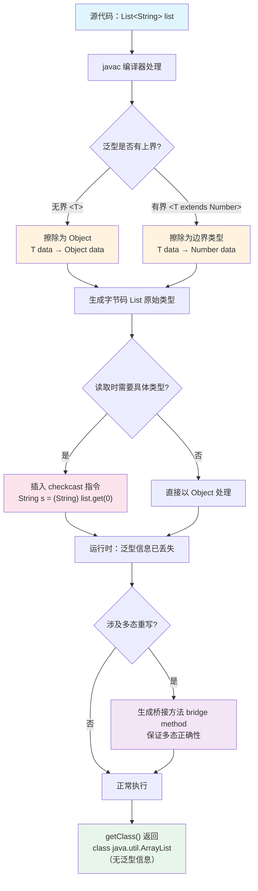

# 泛型

> 学习路线对应：第2周 -- Java 语言核心
> 前置知识：Java 面向对象（继承、多态）、集合框架基本使用
> 预计学习时间：1-2 天

> **视频章节对应**：尚硅谷宋红康《Java零基础入门教程》第10章 -- 泛型
> 本章是 Java 类型系统的核心进阶内容，泛型让代码在编译期就能发现类型错误，避免运行时 ClassCastException，同时提升代码的复用性和可读性。重点掌握 PECS 原则和通配符的使用场景。

---

## 一、核心概念

### 1.1 泛型概述

#### 1.1.1 为什么需要泛型？

在没有泛型的时代，集合中存储的元素都是 `Object` 类型，取出时需要强制类型转换：

```java
// JDK 1.4 及之前：没有泛型
List list = new ArrayList();
list.add("hello");
list.add(123);           // 可以混入任何类型，编译期不报错
list.add(new Date());

// 取出时必须强制转换
String s = (String) list.get(0);  // 需要手动强转

// 运行时才发现类型不匹配！
String s2 = (String) list.get(1); // 抛出 ClassCastException
```

**没有泛型的痛点：**

| 问题 | 说明 |
|------|------|
| **类型不安全** | 集合中可以混入任意类型，编译期无法发现错误 |
| **强制转换繁琐** | 每次取出元素都要手动强转，代码冗长 |
| **运行时异常** | `ClassCastException` 在运行时才暴露，排查困难 |
| **代码可读性差** | 无法从代码中直接看出集合存储的是什么类型 |

#### 1.1.2 泛型是什么？

泛型（Generics）是 JDK 5 引入的**参数化类型**机制，允许在定义类、接口、方法时使用类型参数，在使用时再指定具体类型。

```java
// 有了泛型之后
List<String> list = new ArrayList<>();
list.add("hello");
// list.add(123);  // 编译错误！类型不匹配，编译期就能发现
String s = list.get(0);  // 无需强转，直接取出就是 String 类型
```

**泛型的核心价值：**

```
泛型 = 编译期类型检查 + 消除强制类型转换 + 代码复用
```

| 价值 | 说明 |
|------|------|
| **编译期类型安全** | 类型错误在编译阶段就能被发现，而非运行时爆炸 |
| **消除强制转型** | 取出元素时自动就是正确的类型，代码更简洁 |
| **代码复用** | 一套代码适用于多种类型，无需为每种类型写重复代码 |
| **可读性增强** | `List<String>` 一眼就能看出存储的是字符串 |

#### 1.1.3 泛型与 Python/JS 的对比

| 语言 | 类型机制 | 泛型支持 |
|------|---------|---------|
| **Java** | 编译期强类型 + 运行时泛型擦除 | 编译期检查，运行时擦除 |
| **Python** | 动态类型，运行时检查 | typing 模块（3.5+），仅用于类型提示，不强制 |
| **JavaScript** | 动态类型，运行时检查 | TypeScript 提供泛型，编译为 JS 后擦除 |

> **生活化类比：泛型 = 快递柜的"规格标签"**
> - 没有泛型时，快递柜是一个"万能大箱子"（`Object`），什么都能塞，取件时不知道拿到的是书还是杯子，每次都要"开箱验货"（强制转型），偶尔还会拿到错的物品（`ClassCastException`）。
> - 有了泛型后，柜子门上贴了标签 `Box<String>`、`Box<Integer>`——存的时候标签不符就拒收（编译期报错），取的时候直接按标签拿，无需验货（自动类型转换）。
> - 泛型类就像"通用储物柜图纸"——同一份图纸可以造出装书、装杯子、装衣服的柜子，只是 `T` 这个占位符被具体类型替换。
> - 泛型方法就像"打包服务"——服务员不知道你要打包什么，但他能处理任何物品（`<T> void pack(T item)`），具体类型由顾客带来的物品决定。

> 📖 **参考链接**：
> - [Oracle Java Tutorial: Generics 概览](https://docs.oracle.com/javase/tutorial/java/generics/index.html)
> - [Oracle Java Tutorial: Generic Types](https://docs.oracle.com/javase/tutorial/java/generics/types.html)
> - [JLS §4.5: Parameterized Types（参数化类型）](https://docs.oracle.com/javase/specs/jls/se17/html/jls-4.html#jls-4.5)
> - [JLS §4.6: Type Erasure（类型擦除）](https://docs.oracle.com/javase/specs/jls/se17/html/jls-4.html#jls-4.6)

### 1.2 泛型在集合中的使用

#### 1.2.1 List 中使用泛型

```java
// 泛型 List
List<String> names = new ArrayList<>();
names.add("张三");
names.add("李四");

// 遍历时无需强转
for (String name : names) {
    System.out.println(name.length());  // 直接调用 String 的方法
}

// 泛型嵌套
List<List<Integer>> matrix = new ArrayList<>();
matrix.add(Arrays.asList(1, 2, 3));
matrix.add(Arrays.asList(4, 5, 6));
```

#### 1.2.2 Map 中使用泛型

```java
// Map<K, V> 需要两个类型参数
Map<String, Integer> scores = new HashMap<>();
scores.put("张三", 95);
scores.put("李四", 88);

// 遍历 Map
for (Map.Entry<String, Integer> entry : scores.entrySet()) {
    String name = entry.getKey();      // 自动是 String
    Integer score = entry.getValue();   // 自动是 Integer
    System.out.println(name + " : " + score);
}
```

#### 1.2.3 Set 中使用泛型

```java
Set<Integer> numbers = new HashSet<>();
numbers.add(1);
numbers.add(2);
numbers.add(3);
// numbers.add("四");  // 编译错误

// 集合泛型的使用规则：左右两边类型必须一致
List<Object> list1 = new ArrayList<Object>();  // 正确
// List<Object> list2 = new ArrayList<String>(); // 编译错误！泛型没有继承关系
```

> **生活化类比：集合泛型 = 超市购物袋的分类标签**
> - `List<String>` 就像标了"水果袋"——只能装水果（String），塞进一本书（Integer）会被收银员（编译器）拦下。
> - `Map<K, V>` 就像"会员卡号 → 会员信息"的对照表——卡号（K）唯一，对应一份信息（V），双列存储。
> - `Set<Integer>` 就像"红包编号集合"——编号不能重复，加了重复编号会被自动忽略。
> - **泛型没有继承关系**：哪怕"苹果"是"水果"的子类，`装苹果的袋子` 也不能当成 `装水果的袋子` 用——否则别人会往里塞香蕉，破坏了"只装苹果"的契约。

> 📖 **参考链接**：
> - [Oracle Java Tutorial: Generic Types（集合泛型示例）](https://docs.oracle.com/javase/tutorial/java/generics/types.html)
> - [Java SE 17 API: List 接口](https://docs.oracle.com/javase/17/docs/api/java.base/java/util/List.html)
> - [Java SE 17 API: Map 接口](https://docs.oracle.com/javase/17/docs/api/java.base/java/util/Map.html)
> - [Java SE 17 API: Set 接口](https://docs.oracle.com/javase/17/docs/api/java.base/java/util/Set.html)

### 1.3 自定义泛型类与泛型方法

#### 1.3.1 自定义泛型类

```java
/**
 * 自定义泛型类：可以用一个类处理多种类型的数据
 * <T> 是类型参数，习惯上用单个大写字母表示
 * 常用字母：T(Type)、E(Element)、K(Key)、V(Value)、N(Number)
 */
public class Box<T> {
    private T data;

    public Box() {}

    public Box(T data) {
        this.data = data;
    }

    public T getData() {
        return data;
    }

    public void setData(T data) {
        this.data = data;
    }

    // 使用示例
    public static void main(String[] args) {
        Box<String> strBox = new Box<>("hello");
        String s = strBox.getData();  // 无需强转

        Box<Integer> intBox = new Box<>(123);
        int i = intBox.getData();     // 自动拆箱为 int
    }
}
```

**泛型类的类型参数在实例化时确定：**

```java
// 同一个泛型类，不同泛型参数的实例之间没有关系
Box<String> strBox = new Box<>("hello");
Box<Integer> intBox = new Box<>(123);
// strBox = intBox;  // 编译错误！Box<String> 和 Box<Integer> 是不同类型

// 泛型类可以有多个类型参数
public class Pair<K, V> {
    private K key;
    private V value;

    public Pair(K key, V value) {
        this.key = key;
        this.value = value;
    }

    public K getKey() { return key; }
    public V getValue() { return value; }
}

// 使用
Pair<String, Integer> pair = new Pair<>("age", 25);
```

#### 1.3.2 自定义泛型方法

泛型方法可以定义在普通类中，类型参数在方法声明时确定：

```java
/**
 * 泛型方法：在方法返回值前声明类型参数
 * 修饰符 <T> 返回值类型 方法名(参数列表)
 */
public class GenericMethodDemo {

    /**
     * 泛型方法：交换数组中两个元素的位置
     * <T> 声明这是一个泛型方法，T 是类型参数
     */
    public static <T> void swap(T[] array, int i, int j) {
        T temp = array[i];
        array[i] = array[j];
        array[j] = temp;
    }

    /**
     * 泛型方法：将数组转为 List
     */
    public static <T> List<T> arrayToList(T[] array) {
        List<T> list = new ArrayList<>();
        for (T item : array) {
            list.add(item);
        }
        return list;
    }

    /**
     * 泛型方法：查找数组中是否包含某个元素
     */
    public static <T> boolean contains(T[] array, T target) {
        for (T item : array) {
            if (item.equals(target)) {
                return true;
            }
        }
        return false;
    }

    public static void main(String[] args) {
        String[] strArray = {"A", "B", "C", "D"};
        swap(strArray, 0, 3);  // 类型自动推断
        System.out.println(Arrays.toString(strArray));  // [D, B, C, A]

        Integer[] intArray = {1, 2, 3, 4};
        swap(intArray, 0, 1);  // 类型自动推断
        System.out.println(Arrays.toString(intArray));  // [2, 1, 3, 4]
    }
}
```

**泛型类 vs 泛型方法的关键区别：**

| 对比维度 | 泛型类 | 泛型方法 |
|---------|--------|---------|
| 类型参数声明位置 | 类名后面 `<T>` | 返回值前面 `<T>` |
| 类型参数确定时机 | 创建实例时 | 调用方法时（自动推断） |
| 类级泛型参数 | 整个类共享同一个 T | 与类级泛型无关 |
| 静态方法 | 不能使用类的泛型参数 | 可以定义自己的泛型参数 |

```java
// 重要：静态方法中不能使用类的泛型类型参数
public class Demo<T> {
    // public static void method(T t) {}  // 编译错误！
    // 原因：静态方法在类加载时就存在，此时 T 尚未确定

    // 正确：静态方法定义自己的泛型参数
    public static <E> void method(E e) {
        // 可行
    }
}
```

> **生活化类比：泛型类 vs 泛型方法 = 工厂模板 vs 流水线工具**
> - **泛型类**就像"通用储物柜的图纸"——你按图纸造柜子时告诉它装什么（`new Box<String>()`），整个柜子的所有抽屉都是这个类型。
> - **泛型方法**就像"流水线上的一把万能扳手"——每次调用时根据工件尺寸自动调整（类型推断），与柜子本身的类型无关。
> - **静态方法不能用类的泛型参数**：因为静态方法在柜子还没造出来时就存在了（类加载时），那时还不知道 `T` 是什么——就像工厂还没下订单，"通用扳手"不能假设要拧多大的螺丝。
> - **类型参数命名约定**：`T`（Type 类型）、`E`（Element 元素）、`K`/`V`（Key/Value 键值）、`N`（Number 数字）、`R`（Result 结果）——就像螺丝刀标了"十字/一字/六角"，一看就知道用途。

> 📖 **参考链接**：
> - [Oracle Java Tutorial: Generic Methods](https://docs.oracle.com/javase/tutorial/java/generics/methods.html)
> - [Oracle Java Tutorial: Bounded Type Parameters](https://docs.oracle.com/javase/tutorial/java/generics/bounded.html)
> - [JLS §8.1.2: Generic Classes and Type Parameters](https://docs.oracle.com/javase/specs/jls/se17/html/jls-8.html#jls-8.1.2)
> - [JLS §8.4.4: Generic Methods](https://docs.oracle.com/javase/specs/jls/se17/html/jls-8.html#jls-8.4.4)

### 1.4 泛型在继承上的体现

#### 1.4.1 泛型类之间没有继承关系

这是初学者最容易犯错的地方：

```java
// 虽然 String 是 Object 的子类
// 但 List<String> 不是 List<Object> 的子类！
List<String> strList = new ArrayList<>();
// List<Object> objList = strList;  // 编译错误！

// 原因：如果允许这样做，类型安全就会失效
// 假设上面的赋值合法，那么：
// objList.add(123);  // 向 List<String> 中放入了 Integer，类型安全被破坏
```

**关键结论：** 泛型没有"协变" -- 即使 `A` 是 `B` 的父类，`List<A>` 和 `List<B>` 也没有父子关系，它们是并列的两个类型。

```java
// 可以这样理解：List<Object> 和 List<String> 是两种完全不同的类型
// 它们共享同一个原始类型 List（擦除后），但泛型类型参数不同
```

#### 1.4.2 泛型类本身可以继承

```java
// 父类指定泛型，子类继承父类的泛型
class Father<T> {
    private T data;

    public T getData() { return data; }
    public void setData(T data) { this.data = data; }
}

// 情况一：子类保留泛型 -- 子类也是泛型类
class Son1<T> extends Father<T> {
    // Son1 仍然是泛型类
}

// 情况二：子类指定具体类型 -- 子类不再是泛型类
class Son2 extends Father<String> {
    // Son2 中 T 已被确定为 String
    // 父类的方法 getData() 返回 String 类型
}

// 情况三：子类增加自己的泛型参数
class Son3<T, E> extends Father<T> {
    private E extra;
    // Son3 有两个类型参数
}
```

> **生活化类比：泛型继承 = "立遗嘱"的三种方式**
> - **`List<String>` 不是 `List<Object>` 子类**：就像"装苹果的袋子"不是"装水果的袋子"的特例——如果允许这样赋值，别人会把香蕉塞进苹果袋，破坏契约。这就是 Java 泛型"不协变"的核心原因。
> - **子类保留泛型 `Son1<T> extends Father<T>`**：就像父亲说"我的财产给一个孩子"，孩子还没指定是谁（T 未确定），继续保留"待定"状态。
> - **子类指定具体类型 `Son2 extends Father<String>`**：就像父亲说"我的财产给老二"，老二已确定，所有继承的财产都按"老二能用的方式"使用。
> - **子类增加新泛型 `Son3<T, E> extends Father<T>`**：就像孩子除了继承父亲的财产（T），还自己创业赚了一份（E），两份财产并存。

> 📖 **参考链接**：
> - [Oracle Java Tutorial: Generics, Inheritance, and Subtypes](https://docs.oracle.com/javase/tutorial/java/generics/inheritance.html)
> - [JLS §4.10: Subtyping](https://docs.oracle.com/javase/specs/jls/se17/html/jls-4.html#jls-4.10)
> - [JLS §4.5.2: Members and Constructors of Parameterized Types](https://docs.oracle.com/javase/specs/jls/se17/html/jls-4.html#jls-4.5.2)

### 1.5 通配符

通配符 `?` 用于解决泛型之间的"共容"问题，让方法能接受更多类型的泛型参数。

#### 1.5.1 无限定通配符 `?`

```java
/**
 * 无限定通配符：可以接受任何泛型类型的参数
 * 但是只能读取，不能写入（null 除外）
 */
public class UnboundedWildcard {

    // 可以接受 List<?> 即任意类型的 List
    public static void printList(List<?> list) {
        for (Object obj : list) {
            System.out.println(obj);  // 可以读取，元素都是 Object
        }
        // list.add("hello");  // 编译错误！不能写入
        // list.add(new Object());  // 编译错误！
        list.add(null);  // 只能添加 null
    }

    public static void main(String[] args) {
        List<String> strList = Arrays.asList("A", "B", "C");
        List<Integer> intList = Arrays.asList(1, 2, 3);
        List<Double> dblList = Arrays.asList(1.1, 2.2, 3.3);

        printList(strList);  // 可以！
        printList(intList);  // 可以！
        printList(dblList);  // 可以！
    }
}
```

**无限定通配符的限制：能读不能写。** 因为编译器不知道实际的类型是什么，所以禁止写入（null 除外）。

#### 1.5.2 上界通配符 `? extends T`

`? extends T` 表示 T 及其所有子类。通常用于**读取**场景。

```java
/**
 * 上界通配符：? extends T -- 可以接受 T 及 T 的所有子类
 */
public class UpperBoundedWildcard {

    // 计算数字列表的总和
    // List<? extends Number> 可以接受 List<Integer>, List<Double>, List<Long> 等
    public static double sum(List<? extends Number> list) {
        double total = 0.0;
        for (Number num : list) {
            total += num.doubleValue();  // 可以安全地读取为 Number
        }
        return total;
    }

    public static void main(String[] args) {
        List<Integer> intList = Arrays.asList(1, 2, 3, 4, 5);
        List<Double> dblList = Arrays.asList(1.1, 2.2, 3.3);
        List<Long> longList = Arrays.asList(10L, 20L, 30L);

        System.out.println(sum(intList));   // 15.0
        System.out.println(sum(dblList));   // 6.6
        System.out.println(sum(longList));  // 60.0

        // List<String> strList = ...;
        // sum(strList);  // 编译错误！String 不是 Number 的子类
    }
}
```

**`? extends T` 的含义和限制：**

```
? extends T  ==>  T 的上界，表示 T 或 T 的子类
读取：可以安全地读取为 T 类型（或 T 的父类）
写入：不能写入（除了 null）
```

```java
List<? extends Number> list = new ArrayList<Integer>();
// 可以读
Number n = list.get(0);   // 正确，取出来至少是 Number

// 不能写（除了 null）
// list.add(10);          // 编译错误！不知道实际类型
// list.add(10.5);        // 编译错误！
// list.add(new Integer(10)); // 编译错误！
list.add(null);            // 只能添加 null
```

#### 1.5.3 下界通配符 `? super T`

`? super T` 表示 T 及其所有父类。通常用于**写入**场景。

```java
/**
 * 下界通配符：? super T -- 可以接受 T 及 T 的所有父类
 */
public class LowerBoundedWildcard {

    // 向集合中添加多个 Integer 元素
    // List<? super Integer> 可以接受 List<Integer>, List<Number>, List<Object>
    public static void addNumbers(List<? super Integer> list) {
        for (int i = 1; i <= 5; i++) {
            list.add(i);  // 可以安全地写入 Integer 及其子类
        }
    }

    public static void main(String[] args) {
        List<Integer> intList = new ArrayList<>();
        List<Number> numList = new ArrayList<>();
        List<Object> objList = new ArrayList<>();

        addNumbers(intList);  // 可以
        addNumbers(numList);  // 可以
        addNumbers(objList);  // 可以

        // List<Double> dblList = new ArrayList<>();
        // addNumbers(dblList);  // 编译错误！Double 不是 Integer 的父类
    }
}
```

**`? super T` 的含义和限制：**

```
? super T  ==>  T 的下界，表示 T 或 T 的父类
写入：可以安全地写入 T 类型（及 T 的子类）
读取：只能读取为 Object 类型
```

```java
List<? super Integer> list = new ArrayList<Number>();
// 可以写
list.add(10);             // 正确，Integer 是 T 自身
list.add(20);             // 正确

// 不能读为具体类型
Object obj = list.get(0);  // 只能读取为 Object
// Integer i = list.get(0); // 编译错误！可能取到 Number 或其他父类
```

#### 1.5.4 三种通配符对比

| 通配符 | 含义 | 读取 | 写入 | 典型场景 |
|--------|------|------|------|---------|
| `?` | 任意类型 | 作为 Object 读取 | 不能写入（除 null） | 仅遍历、不修改 |
| `? extends T` | T 及其子类 | 安全读取为 T | 不能写入（除 null） | 生产者（只读） |
| `? super T` | T 及其父类 | 只能读取为 Object | 安全写入 T（及子类） | 消费者（只写） |

> **生活化类比：三种通配符 = 三种"快递收发站"**
> - **`?`（无限定通配符）**就像"匿名快递暂存柜"——只知道里面是快递（Object），但不知道具体是什么；只能看不能往里塞（除了空包裹 null），因为怕塞错类型。
> - **`? extends T`（上界通配符）**就像"水果展示柜"——柜子里的东西保证是水果（T 或子类如苹果/香蕉），可以安全拿出来当水果吃（读为 T）；但不能往里塞新水果，因为不知道柜子到底是装苹果的还是装香蕉的，塞错了就破坏了类型。
> - **`? super T`（下界通配符）**就像"苹果回收箱"——箱子的"底线"是能装苹果（T 或父类如水果箱/杂物箱），所以可以放心往里扔苹果（写 T 及子类）；但往外拿时只能当"杂物"（Object）拿，因为可能是更大的箱子装着各种东西。
> - **一句话记忆**：extends 是"装小不装大"（只能读不能写），super 是"装大不装小"（只能写不能读）。

> 📖 **参考链接**：
> - [Oracle Java Tutorial: Wildcards](https://docs.oracle.com/javase/tutorial/java/generics/wildcards.html)
> - [Oracle Java Tutorial: Upper Bounded Wildcards](https://docs.oracle.com/javase/tutorial/java/generics/upperBounded.html)
> - [Oracle Java Tutorial: Lower Bounded Wildcards](https://docs.oracle.com/javase/tutorial/java/generics/lowerBounded.html)
> - [Oracle Java Tutorial: Unbounded Wildcards](https://docs.oracle.com/javase/tutorial/java/generics/unboundedWildcards.html)

### 1.6 PECS 原则（重点）

**PECS** 是泛型通配符使用的黄金法则，由 Joshua Bloch 在《Effective Java》中提出：

> **PECS = Producer Extends, Consumer Super**

```
Producer（生产者）-- 从集合中读取数据 --> 使用 ? extends T
Consumer（消费者）-- 向集合中写入数据 --> 使用 ? super T
```

#### 1.6.1 PECS 原则的直观理解

```java
/**
 * PECS 原则的经典示例
 */
public class PECSDemo {

    /**
     * 生产者（Producer）：只从 src 中读取数据
     * 使用 ? extends T：只要能读取到 T 类型的数据即可
     */
    public static <T> void copyFrom(List<? extends T> src, List<? super T> dest) {
        for (T item : src) {      // 从 src 读取（生产者）
            dest.add(item);       // 向 dest 写入（消费者）
        }
    }

    public static void main(String[] args) {
        List<Integer> src = Arrays.asList(1, 2, 3);
        List<Number> dest = new ArrayList<>();

        copyFrom(src, dest);  // 从 Integer 列表复制到 Number 列表
        System.out.println(dest);  // [1, 2, 3]
    }
}
```

**PECS 原则的推导逻辑：**

```
问题：为什么 "生产者" 用 extends？
答：你想从集合中读取数据。如果集合是 List<Number>，你希望也能读取
    List<Integer>、List<Double> 等。extends 让类型参数可以接受子类型，
    满足了 "只读" 时的灵活性。

问题：为什么 "消费者" 用 super？
答：你想向集合中写入数据。如果你要写入 Integer，你希望不仅能写入
    List<Integer>，还能写入 List<Number>、List<Object>（父类集合能容纳子类数据）。
    super 让类型参数可以接受父类型，满足了 "只写" 时的灵活性。
```

#### 1.6.2 PECS 原则的应用场景

```java
/**
 * PECS 原则的典型应用场景
 */
public class PECSApplications {

    // ==================== 场景一：Collections.copy() ====================
    // JDK 源码中 Collections.copy() 就是 PECS 的经典应用
    // public static <T> void copy(List<? super T> dest, List<? extends T> src)

    // src 是生产者（从中读取数据） --> ? extends T
    // dest 是消费者（向其中写入数据） --> ? super T


    // ==================== 场景二：数据合并 ====================
    public static <T> void merge(List<? extends T> list1,
                                  List<? extends T> list2,
                                  List<? super T> result) {
        result.addAll(list1);  // list1 是生产者
        result.addAll(list2);  // list2 是生产者
    }


    // ==================== 场景三：比较器 ====================
    // Collections.sort() 的签名：
    // public static <T> void sort(List<T> list, Comparator<? super T> c)

    // Comparator 是消费者（消费 T 类型的数据进行比较）
    // 所以使用 ? super T，让比较器可以用于父类型
    public static void sortDemo() {
        List<Integer> list = Arrays.asList(3, 1, 4, 1, 5);

        // Comparator<Number> 可以用于 List<Integer>，因为 Number 是 Integer 的父类
        Comparator<Number> comparator = (a, b) -> Double.compare(a.doubleValue(), b.doubleValue());
        Collections.sort(list, comparator);  // 合法！因为 Comparator<? super Integer>
    }


    // ==================== 场景四：集合的 addAll 方法 ====================
    // ArrayList.addAll() 的签名：
    // public boolean addAll(Collection<? extends E> c)

    // 参数 c 是生产者（从中读取数据添加进来） --> ? extends E
    public static void addAllDemo() {
        List<Number> numList = new ArrayList<>();
        List<Integer> intList = Arrays.asList(1, 2, 3);
        List<Double> dblList = Arrays.asList(1.1, 2.2);

        numList.addAll(intList);  // 合法！Collection<? extends Number>
        numList.addAll(dblList);  // 合法！
    }
}
```

#### 1.6.3 PECS 原则速记表

```
+----------------------+---------------------+---------------------+
|                      |  ? extends T        |  ? super T          |
+----------------------+---------------------+---------------------+
|  角色                |  生产者（Producer）   |  消费者（Consumer）   |
|  操作                |  只读（get/read）     |  只写（add/write）    |
|  安全读取类型         |  T                   |  Object              |
|  安全写入类型         |  null 以外都不能写     |  T 及其子类           |
|  可接受参数           |  T 及 T 的子类         |  T 及 T 的父类         |
|  典型 JDK 方法        |  List.get(),         |  List.add(),         |
|                      |  Collections.copy()  |  Collections.sort()  |
|                      |  src 参数             |  dest 参数            |
+----------------------+---------------------+---------------------+
```

**PECS 原则的一句话总结：** 当你只需要从集合中**读取**数据时，用 `? extends T`；当你只需要向集合中**写入**数据时，用 `? super T`；如果既要读又要写，那就不要用通配符，直接用 `<T>`。

> **生活化类比：PECS 原则 = 超市"供货商"与"采购员"的对接**
> - **Producer Extends（生产者用 extends）**：超市从农场进货（农场是生产者），农场可能是苹果园、葡萄园、橘子园（都是 `? extends Fruit`）——超市只要能拿到"水果"就能卖，不关心具体哪种。
> - **Consumer Super（消费者用 super）**：超市把水果送到各种容器（容器是消费者），容器可能是"水果筐"、"食品袋"、"杂物箱"（都是 `? super Apple`）——只要能装苹果的容器都行，越大越通用越好。
> - **`Collections.copy(dest, src)`**：src 是"供货农场"用 extends（读出），dest 是"采购容器"用 super（写入）——经典的双向对接。
> - **`Comparator<? super T>`**：比较器是"裁判"，裁判可以评判 T 及其父类的比赛——比如"水果裁判"也能评苹果，所以用 super。

> 📖 **参考链接**：
> - [Oracle Java Tutorial: Wildcard Guidelines（PECS 实践）](https://docs.oracle.com/javase/tutorial/java/generics/wildcardGuidelines.html)
> - [Oracle Java Tutorial: Generics 概览（PECS 原则参考 Effective Java）](https://docs.oracle.com/javase/tutorial/java/generics/index.html)
> - [Java SE 17 API: Collections.copy](https://docs.oracle.com/javase/17/docs/api/java.base/java/util/Collections.html#copy(java.util.List,java.util.List))
> - [Java SE 17 API: Collections.sort](https://docs.oracle.com/javase/17/docs/api/java.base/java/util/Collections.html#sort(java.util.List,java.util.Comparator))

---

## 二、底层原理

### 2.1 类型擦除

#### 2.1.1 什么是类型擦除？

Java 的泛型是**编译期**的概念，在编译后，所有泛型类型信息都会被"擦除"（Type Erasure），字节码中只保留**原始类型（Raw Type）**。

```java
// 源代码：处处可见泛型
List<String> strList = new ArrayList<>();
List<Integer> intList = new ArrayList<>();

// 编译后的字节码中：泛型全部消失
// List strList = new ArrayList();
// List intList = new ArrayList();

// 验证：两个 List 的 Class 对象是同一个
System.out.println(strList.getClass() == intList.getClass());  // true
// 输出：class java.util.ArrayList（没有泛型信息）
```

**泛型擦除的三个步骤：**

```
1. 擦除泛型类型参数，替换为原始类型
   - 无界泛型 <T> --> Object
   - 有界泛型 <T extends Number> --> Number

2. 在需要类型转换的地方自动插入强制类型转换
   - String s = strList.get(0);  --> String s = (String) strList.get(0);

3. 生成桥接方法（bridge method）保证多态性
```

#### 2.1.2 类型擦除的具体规则

```java
// ========== 规则一：无界泛型擦除为 Object ==========
public class Box<T> {
    private T data;
    // 擦除后：private Object data;

    public T getData() { return data; }
    // 擦除后：public Object getData() { return data; }

    public void setData(T data) { this.data = data; }
    // 擦除后：public void setData(Object data) { this.data = data; }
}


// ========== 规则二：有界泛型擦除为边界类型 ==========
public class NumberBox<T extends Number> {
    private T data;
    // 擦除后：private Number data;

    public T getData() { return data; }
    // 擦除后：public Number getData() { return data; }
}


// ========== 规则三：泛型方法擦除 ==========
public static <T extends Comparable<T>> T max(T a, T b) {
    return a.compareTo(b) > 0 ? a : b;
}
// 擦除后：public static Comparable max(Comparable a, Comparable b) {
//     return a.compareTo(b) > 0 ? a : b;
// }
```

#### 2.1.3 类型擦除带来的限制

```java
/**
 * 由于类型擦除，泛型有以下使用限制
 */
public class EraseLimitations {

    // 限制一：不能使用基本类型作为泛型参数
    // List<int> list = new ArrayList<>();  // 编译错误！
    List<Integer> list = new ArrayList<>(); // 正确，使用包装类

    // 限制二：不能创建泛型类型的实例
    // T obj = new T();  // 编译错误！运行时不知道 T 是什么

    // 限制三：不能创建泛型数组
    // T[] array = new T[10];  // 编译错误！
    // 但可以声明泛型数组引用
    // 实际中通常通过反射创建泛型数组

    // 限制四：不能 instanceof 泛型类型
    // if (list instanceof List<String>)  // 编译错误！
    // 只能使用原始类型
    // if (list instanceof List)  // 正确（但有警告）

    // 限制五：不能声明泛型异常类
    // class MyException<T> extends Exception {}  // 编译错误！

    // 限制六：泛型类型的静态变量不能共享
    // class Demo<T> {
    //     private static T data;  // 编译错误！静态变量是所有实例共享的
    // }
}
```

#### 2.1.4 类型擦除后的自动类型转换

```java
// 编译器在擦除泛型后，会在需要的地方自动插入强制类型转换
List<String> list = new ArrayList<>();
list.add("hello");
String s = list.get(0);  // 编译器自动插入：(String) list.get(0)

// 等价于编译器生成：
// List list = new ArrayList();
// list.add("hello");
// String s = (String) list.get(0);
```

**类型擦除流程图：**



> 上图展示了 Java 泛型类型擦除的完整流程：编译期检查泛型类型安全 → 擦除为原始类型 → 在读取点插入 checkcast → 必要时生成桥接方法。这就是为什么 `List<String>` 和 `List<Integer>` 在运行时 `getClass()` 返回相同的 `class java.util.ArrayList`。

> **生活化类比：类型擦除 = 精装样板房交付毛坯房**
> - **编译期**：销售时展示各种"精装风格"——`List<String>` 是"书柜风格"、`List<Integer>` 是"酒柜风格"（编译器检查你不会把书塞进酒柜）。
> - **擦除后**：交房时全部变回"毛坯白墙"（原始类型 `List`），所有风格信息都丢了——这就是为什么运行时 `getClass()` 看不出泛型参数。
> - **checkcast 强制转换**：每次你按"书柜风格"取东西时，物业（JVM）会帮你确认"这确实是书"，如果不是就报 `ClassCastException`。
> - **桥接方法**：当子类把"通用柜"升级为"专用书柜"时，物业会偷偷在背后加一个"通用入口"（桥接方法），让你通过父类的"通用接口"也能调用到子类的"专用接口"。
> - **类型擦除的代价**：你不能 `new T()`（运行时不知道造哪种柜子）、不能 `instanceof List<String>`（毛坯房看不出风格）、不能用基本类型 `int`（只能用 `Integer` 这种"成品家具"）。

> 📖 **参考链接**：
> - [Oracle Java Tutorial: Type Erasure](https://docs.oracle.com/javase/tutorial/java/generics/erasure.html)
> - [Oracle Java Tutorial: Effects of Type Erasure and Bridge Methods](https://docs.oracle.com/javase/tutorial/java/generics/bridgeMethods.html)
> - [JLS §4.6: Type Erasure](https://docs.oracle.com/javase/specs/jls/se17/html/jls-4.html#jls-4.6)
> - [JVM Spec §4.10.1: Verification by Type Checking（checkcast 指令）](https://docs.oracle.com/javase/specs/jvms/se17/html/jvms-4.html#jvms-4.10.1)

### 2.2 桥接方法

#### 2.2.1 为什么要桥接方法？

当泛型类被继承并指定具体类型后，**方法签名**可能与父类不同，导致多态失效。桥接方法（Bridge Method）就是编译器自动生成的**合成方法**，用于保持多态的正确性。

```java
/**
 * 桥接方法的经典示例
 */
public class BridgeMethodDemo {

    // 父类：泛型类
    static class Node<T> {
        private T data;

        public Node(T data) {
            this.data = data;
        }

        public void setData(T data) {
            System.out.println("Node.setData");
            this.data = data;
        }
    }

    // 子类：指定具体类型
    static class MyNode extends Node<Integer> {
        public MyNode(Integer data) {
            super(data);
        }

        // 子类重写了 setData 方法
        @Override
        public void setData(Integer data) {
            System.out.println("MyNode.setData");
            super.setData(data);
        }
    }

    public static void main(String[] args) {
        MyNode node = new MyNode(5);
        Node<Integer> parent = node;

        // 调用 setData
        parent.setData(10);  // 输出：MyNode.setData
        // 多态生效了！但为什么？
        // 因为编译器为 MyNode 生成了桥接方法
    }
}
```

#### 2.2.2 桥接方法的工作原理

**类型擦除后的方法签名：**

```
父类 Node 擦除后：
    public void setData(Object data)    // 注意：参数是 Object！

子类 MyNode 中：
    public void setData(Integer data)   // 参数是 Integer
    // 方法签名不同，这不是重写！
    // 多态会失效！
```

**桥接方法的作用：**

```java
// 编译器为 MyNode 自动生成的桥接方法（简化版）
static class MyNode extends Node<Integer> {
    // ... 原有代码 ...

    // 编译器生成的桥接方法（不可见，但存在于字节码中）
    // @Override
    // public void setData(Object data) {   // 桥接方法，参数类型与父类一致
    //     this.setData((Integer) data);    // 调用子类中参数为 Integer 的版本
    // }
}
```

```
调用 parent.setData(10) 时的流程：
1. parent 的静态类型是 Node<Integer>，擦除后 setData 的参数是 Object
2. 10 被自动装箱为 Integer，然后向上转型为 Object
3. 由于运行时类型是 MyNode，JVM 查找 MyNode 中的 setData(Object) 方法
4. 找到桥接方法 setData(Object)，内部调用 setData(Integer)
5. 最终执行子类中我们写的 setData(Integer) 方法
```

#### 2.2.3 桥接方法的验证

```java
// 通过反射验证桥接方法的存在
public class BridgeMethodValidator {
    public static void main(String[] args) {
        Method[] methods = MyNode.class.getMethods();
        for (Method method : methods) {
            if (method.getName().equals("setData")) {
                System.out.println("方法名: " + method.getName());
                System.out.println("参数类型: " + Arrays.toString(method.getParameterTypes()));
                System.out.println("返回类型: " + method.getReturnType());
                System.out.println("是否是桥接方法: " + method.isBridge());
                System.out.println("---");
            }
        }
    }
}
// 输出：
// 方法名: setData
// 参数类型: [class java.lang.Integer]
// 返回类型: void
// 是否是桥接方法: false
// ---
// 方法名: setData
// 参数类型: [class java.lang.Object]
// 返回类型: void
// 是否是桥接方法: true     <-- 编译器自动生成的桥接方法
// ---
```

#### 2.2.4 桥接方法的其他场景

桥接方法不仅在泛型覆盖中出现，在**协变返回类型**中也会生成：

```java
// 协变返回类型也会产生桥接方法
class Parent {
    public Parent copy() {
        return new Parent();
    }
}

class Child extends Parent {
    @Override
    public Child copy() {  // 返回类型更具体（协变返回类型）
        return new Child();
    }
    // 编译器生成桥接方法：
    // public Parent copy() { return this.copy(); }  // 调用返回 Child 的版本
}
```

> **生活化类比：桥接方法 = 物业偷偷加的"通用前台"**
> - 父类的方法签名是 `setData(Object)`（通用前台接收任何物品），子类重写的是 `setData(Integer)`（专用窗口只收数字）——签名不一致，多态失效。
> - 编译器偷偷给子类加一个"通用前台" `setData(Object)`，里面写"如果是数字请转交专用窗口"——这样通过父类引用调用时，先到通用前台（桥接方法），再转交给专用窗口（实际方法），多态恢复。
> - 协变返回类型也类似：父类 `copy()` 返回 `Parent`，子类返回 `Child`——编译器给子类加一个返回 `Parent` 的桥接方法，内部调用返回 `Child` 的版本。
> - 桥接方法是 `synthetic`（合成）的，源码看不见，但反射 `method.isBridge()` 能识别。

> 📖 **参考链接**：
> - [Oracle Java Tutorial: Bridge Methods（桥接方法详解）](https://docs.oracle.com/javase/tutorial/java/generics/bridgeMethods.html)
> - [JLS §15.12.4.5: Method Invocation - Bridge Method](https://docs.oracle.com/javase/specs/jls/se17/html/jls-15.html#jls-15.12.4.5)
> - [Java SE 17 API: Method.isBridge()](https://docs.oracle.com/javase/17/docs/api/java.base/java/lang/reflect/Method.html#isBridge())
> - [JVM Spec §4.7.8: The Synthetic Attribute（合成方法属性）](https://docs.oracle.com/javase/specs/jvms/se17/html/jvms-4.html#jvms-4.7.8)

---

## 三、实战应用

### 3.1 泛型 DAO 层设计

泛型最经典的实战应用就是 DAO（Data Access Object）层的泛型设计：

```java
/**
 * 泛型 DAO 基类：一套代码处理所有实体类的增删改查
 */
public class BaseDAO<T> {

    // 模拟数据库存储
    private Map<Long, T> storage = new HashMap<>();
    private AtomicLong idGenerator = new AtomicLong(1);

    /**
     * 新增
     */
    public T save(T entity) {
        long id = idGenerator.getAndIncrement();
        // 通过反射设置 ID（简化示例）
        setId(entity, id);
        storage.put(id, entity);
        return entity;
    }

    /**
     * 根据 ID 查询
     */
    public T findById(long id) {
        return storage.get(id);
    }

    /**
     * 查询所有
     */
    public List<T> findAll() {
        return new ArrayList<>(storage.values());
    }

    /**
     * 更新
     */
    public T update(long id, T entity) {
        if (storage.containsKey(id)) {
            setId(entity, id);
            storage.put(id, entity);
            return entity;
        }
        return null;
    }

    /**
     * 删除
     */
    public boolean delete(long id) {
        return storage.remove(id) != null;
    }

    /**
     * 条件查询（示例：使用 Predicate）
     */
    public List<T> findByCondition(Predicate<T> condition) {
        List<T> result = new ArrayList<>();
        for (T entity : storage.values()) {
            if (condition.test(entity)) {
                result.add(entity);
            }
        }
        return result;
    }

    // 通过反射设置 ID 的辅助方法
    private void setId(T entity, long id) {
        try {
            Field field = entity.getClass().getDeclaredField("id");
            field.setAccessible(true);
            field.set(entity, id);
        } catch (Exception e) {
            // 忽略，实体类可能没有 id 字段
        }
    }
}

// ========== 具体 DAO 实现 ==========

// 用户 DAO
public class UserDAO extends BaseDAO<User> {
    // 继承所有增删改查方法，无需重复编写
    // 可以添加 User 特有的查询方法
    public List<User> findByAgeGreaterThan(int age) {
        return findByCondition(user -> user.getAge() > age);
    }
}

// 订单 DAO
public class OrderDAO extends BaseDAO<Order> {
    // 同样继承所有增删改查方法
    public List<Order> findByStatus(String status) {
        return findByCondition(order -> order.getStatus().equals(status));
    }
}
```

> 📖 **参考链接**：
> - [Oracle Java Tutorial: Generics - Real-world Use Cases](https://docs.oracle.com/javase/tutorial/java/generics/index.html)
> - [Java SE 17 API: Function 接口（泛型函数式接口）](https://docs.oracle.com/javase/17/docs/api/java.base/java/util/function/Function.html)
> - [Java SE 17 API: Predicate 接口](https://docs.oracle.com/javase/17/docs/api/java.base/java/util/function/Predicate.html)

### 3.2 泛型工具类实战

```java
/**
 * 泛型工具类综合示例
 */
public class GenericUtils {

    /**
     * 安全地合并两个列表（PECS 原则）
     */
    public static <T> List<T> merge(List<? extends T> list1, List<? extends T> list2) {
        List<T> result = new ArrayList<>();
        result.addAll(list1);
        result.addAll(list2);
        return result;
    }

    /**
     * 将列表转换为 Map（使用函数式接口）
     */
    public static <T, K> Map<K, T> toMap(List<T> list, Function<T, K> keyExtractor) {
        Map<K, T> map = new HashMap<>();
        for (T item : list) {
            map.put(keyExtractor.apply(item), item);
        }
        return map;
    }

    /**
     * 最大值查找（泛型方法 + 有界类型参数）
     */
    public static <T extends Comparable<? super T>> T max(List<T> list) {
        if (list.isEmpty()) {
            return null;
        }
        T max = list.get(0);
        for (T item : list) {
            if (item.compareTo(max) > 0) {
                max = item;
            }
        }
        return max;
    }

    /**
     * 列表分页
     */
    public static <T> List<T> paginate(List<T> list, int page, int pageSize) {
        int fromIndex = (page - 1) * pageSize;
        int toIndex = Math.min(fromIndex + pageSize, list.size());
        if (fromIndex >= list.size()) {
            return Collections.emptyList();
        }
        return new ArrayList<>(list.subList(fromIndex, toIndex));
    }

    // ========== 使用示例 ==========
    public static void main(String[] args) {
        // 合并不同类型列表
        List<Integer> list1 = Arrays.asList(1, 2, 3);
        List<Double> list2 = Arrays.asList(1.1, 2.2);
        List<Number> merged = merge(list1, list2);  // 类型推断为 Number

        // 转换为 Map
        List<User> users = Arrays.asList(
            new User(1L, "张三"),
            new User(2L, "李四")
        );
        Map<Long, User> userMap = toMap(users, User::getId);

        // 最大值
        List<Integer> nums = Arrays.asList(1, 5, 3, 9, 2);
        System.out.println(max(nums));  // 9

        // 分页
        List<String> items = Arrays.asList("A", "B", "C", "D", "E", "F", "G");
        System.out.println(paginate(items, 2, 3));  // [D, E, F]
    }
}
```

> 📖 **参考链接**：
> - [Oracle Java Tutorial: Generic Methods（泛型工具方法）](https://docs.oracle.com/javase/tutorial/java/generics/methods.html)
> - [Java SE 17 API: Comparable 接口](https://docs.oracle.com/javase/17/docs/api/java.base/java/lang/Comparable.html)
> - [Java SE 17 API: Collections 工具类](https://docs.oracle.com/javase/17/docs/api/java.base/java/util/Collections.html)

### 3.3 泛型 + 工厂模式

```java
/**
 * 泛型工厂模式：创建任意类型的对象
 */
public class GenericFactory {

    private static final Map<String, Object> registry = new HashMap<>();

    /**
     * 注册类型
     */
    public static <T> void register(String key, Class<T> clazz) {
        registry.put(key, clazz);
    }

    /**
     * 创建实例
     */
    @SuppressWarnings("unchecked")
    public static <T> T create(String key) {
        Class<T> clazz = (Class<T>) registry.get(key);
        if (clazz == null) {
            throw new IllegalArgumentException("未注册的类型: " + key);
        }
        try {
            return clazz.getDeclaredConstructor().newInstance();
        } catch (Exception e) {
            throw new RuntimeException("创建实例失败", e);
        }
    }

    public static void main(String[] args) {
        register("user", User.class);
        register("order", Order.class);

        User user = create("user");
        Order order = create("order");
    }
}
```

> 📖 **参考链接**：
> - [Oracle Java Tutorial: Type Inference（类型推断）](https://docs.oracle.com/javase/tutorial/java/generics/genTypeInference.html)
> - [Java SE 17 API: Class.getDeclaredConstructor().newInstance()（反射创建实例）](https://docs.oracle.com/javase/17/docs/api/java.base/java/lang/Class.html)
> - [JLS §15.12.2: Compile-Time Method Resolution（编译期方法解析）](https://docs.oracle.com/javase/specs/jls/se17/html/jls-15.html#jls-15.12.2)

### 3.4 泛型方法返回值类型推导

```java
/**
 * 泛型方法的类型推导与灵活使用
 */
public class TypeInferenceDemo {

    // 返回类型由调用者决定
    public static <T> T pick(T a, T b, boolean first) {
        return first ? a : b;
    }

    // 从参数推导泛型类型
    public static <T> List<T> singletonList(T element) {
        List<T> list = new ArrayList<>();
        list.add(element);
        return list;
    }

    // JDK 7 的钻石操作符
    public static void diamondOperator() {
        // JDK 7 之前：必须重复写泛型参数
        Map<String, List<Integer>> map1 = new HashMap<String, List<Integer>>();

        // JDK 7+：钻石操作符，类型自动推导
        Map<String, List<Integer>> map2 = new HashMap<>();
    }

    public static void main(String[] args) {
        // 类型推导：根据返回值的赋值目标自动确定 T
        String s = pick("hello", "world", true);  // T = String
        Integer i = pick(1, 2, false);             // T = Integer

        // 类型推导：根据参数类型自动确定 T
        List<String> list1 = singletonList("hello");  // T = String
        List<Integer> list2 = singletonList(123);     // T = Integer
    }
}
```

> 📖 **参考链接**：
> - [Oracle Java Tutorial: Type Inference（Java 8 类型推断增强）](https://docs.oracle.com/javase/tutorial/java/generics/genTypeInference.html)
> - [JEP 101: Generalized Target-Type Inference](https://openjdk.org/jeps/101)
> - [JLS §18: Type Inference（类型推断规范）](https://docs.oracle.com/javase/specs/jls/se17/html/jls-18.html)

---

## 四、常见面试题

### 1. Java 泛型是什么？有什么好处？

**答案要点：**

- 泛型是 JDK 5 引入的参数化类型机制，允许在定义类、接口、方法时使用类型参数
- **好处：** (1) 编译期类型检查，避免 `ClassCastException`；(2) 消除强制类型转换，代码更简洁；(3) 提高代码复用性，一套代码处理多种类型；(4) 增强代码可读性

### 2. 泛型中的 `? extends T` 和 `? super T` 有什么区别？

**答案要点：**

| 通配符 | 含义 | 读取 | 写入 | 适用场景 |
|--------|------|------|------|---------|
| `? extends T` | T 及其子类 | 安全读取为 T | 不能写入（除 null） | 生产者（只读） |
| `? super T` | T 及其父类 | 只能读取为 Object | 安全写入 T 及子类 | 消费者（只写） |

- 这对应 PECS 原则（Producer Extends, Consumer Super）

### 3. 什么是 PECS 原则？请举例说明。

**答案要点：**

- PECS = Producer Extends, Consumer Super
- **生产者（从集合中读取数据）**：使用 `? extends T`，例如 `Collections.copy()` 的 src 参数
- **消费者（向集合中写入数据）**：使用 `? super T`，例如 `Collections.copy()` 的 dest 参数
- 经典示例：`Collections.copy(List<? super T> dest, List<? extends T> src)`，dest 是消费者用 super，src 是生产者用 extends
- 如果既要读又要写，直接用 `<T>`，不用通配符

### 4. 泛型是如何实现的？什么是类型擦除？

**答案要点：**

- Java 泛型通过**类型擦除**实现，泛型信息只存在于编译期
- 编译后，所有泛型类型参数被替换为原始类型（无界泛型替换为 Object，有界泛型替换为边界类型）
- 在需要的地方，编译器自动插入强制类型转换
- 优点：与旧代码兼容，不增加 JVM 负担
- 缺点：运行时无法获取泛型类型信息，不能使用基本类型作为泛型参数

### 5. 什么是桥接方法？为什么需要它？

**答案要点：**

- 桥接方法是编译器自动生成的合成方法，用于保持多态的正确性
- 原因：泛型类被继承并指定具体类型后，子类方法的参数类型与父类擦除后的方法签名不同
- 例如：父类 `Node<T>` 有 `setData(T)` 方法擦除后为 `setData(Object)`，子类 `MyNode extends Node<Integer>` 中 `setData(Integer)` 方法签名不同，不是重写
- 编译器自动生成 `setData(Object)` 桥接方法，内部调用 `setData(Integer)`，保证多态
- 通过反射的 `method.isBridge()` 可以识别桥接方法

### 6. 为什么 `List<String>` 不能赋值给 `List<Object>`？

**答案要点：**

- 泛型没有继承关系（协变），`List<String>` 不是 `List<Object>` 的子类
- 如果允许赋值，类型安全会被破坏：通过 `List<Object>` 引用可以向集合中添加非 String 元素，导致取出时 `ClassCastException`
- 这是 Java 泛型设计为保证类型安全而做出的关键约束

### 7. 泛型有哪些使用限制？

**答案要点：**

1. 不能使用基本类型（如 `int`），必须使用包装类（如 `Integer`）
2. 不能创建泛型类型的实例（`new T()`）
3. 不能创建泛型数组（`new T[10]`）
4. 不能使用 `instanceof` 检查泛型类型（`instanceof List<String>`）
5. 不能声明泛型异常类
6. 静态变量不能使用类的泛型类型参数
7. 这些限制的根本原因都是**类型擦除**

> 📖 **参考链接**：
> - [Oracle Java Tutorial: Restrictions on Generics（泛型使用限制）](https://docs.oracle.com/javase/tutorial/java/generics/restrictions.html)
> - [JLS §4.7: Raw Types（原始类型）](https://docs.oracle.com/javase/specs/jls/se17/html/jls-4.html#jls-4.7)
> - [JLS §4.11: Where Types Are Used（类型使用场景）](https://docs.oracle.com/javase/specs/jls/se17/html/jls-4.html#jls-4.11)

---

## 五、避坑指南

| 常见错误 | 现象 | 原因 | 解决方案 |
|---------|------|------|---------|
| 认为 `List<String>` 是 `List<Object>` 的子类 | 编译错误：类型不兼容 | 泛型没有继承关系，`List<String>` 和 `List<Object>` 是并列类型 | 根据需求使用通配符：`List<? extends Object>` 或 `List<?>` |
| 在 `List<? extends T>` 中尝试添加元素 | 编译错误 | extends 通配符限制写入，编译器不知道集合实际类型 | 读取场景用 extends，写入场景用 super，遵循 PECS 原则 |
| 在 `List<? super T>` 中读取元素并赋值给 T 类型 | 编译错误：类型不兼容 | super 通配符限制读取，只能读为 Object | 写入场景用 super，如需读取则用 `<T>` 而非通配符 |
| 使用基本类型作为泛型参数 | 编译错误 | 泛型参数必须是引用类型，基本类型不行 | 使用对应的包装类：`List<Integer>` 而非 `List<int>` |
| 试图用 `instanceof` 检查泛型类型 | 编译错误 | 泛型信息在运行时被擦除，无法检查 | 使用原始类型 `instanceof List`，或通过其他方式判断 |
| 静态方法中使用类的泛型参数 | 编译错误 | 静态方法在类加载时存在，此时泛型参数尚未确定 | 静态方法需要定义自己的泛型参数：`static <T> void method(T t)` |
| 创建泛型数组 | 编译错误 | 类型擦除后无法在运行时保证数组类型安全 | 使用 `ArrayList<T>` 代替数组；或通过反射 `Array.newInstance()` |
| `List` 和 `List<?>` 混淆 | 前者有原始类型警告，后者无警告 | 原始类型 `List` 绕过了泛型检查，不安全 | 始终使用 `List<?>` 而非原始类型 `List` |
| 在循环中错误地使用 `Collections.sort()` 的比较器泛型 | 编译错误 | 比较器泛型不匹配 | 遵循 `Comparator<? super T>` 的设计，比较器可以接收父类型 |
| 泛型方法的类型参数与类的类型参数重名 | 编译错误或行为不符合预期 | 方法级泛型参数会隐藏（shadow）类级泛型参数 | 避免重名，方法级泛型使用不同的字母 |

---

## 本章学习自检

完成本章学习后，应该能够：

- [ ] 理解泛型的设计目的：编译期类型安全 + 消除强制转型 + 代码复用
- [ ] 熟练在集合中使用泛型（`List<T>`、`Map<K,V>`、`Set<T>`），理解泛型没有继承关系
- [ ] 独立编写自定义泛型类和泛型方法，区分泛型类与泛型方法的类型参数声明位置
- [ ] 理解并正确使用三种通配符：`?`、`? extends T`、`? super T`
- [ ] 掌握 PECS 原则（Producer Extends, Consumer Super），能判断何时用 extends 何时用 super
- [ ] 理解类型擦除的机制和带来的限制，能解释为什么不能 `new T()`、不能 `instanceof List<String>`
- [ ] 理解桥接方法的作用和生成原理，能通过反射验证桥接方法的存在
- [ ] 能回答常见面试题（PECS 原则、类型擦除、桥接方法、泛型限制等）
- [ ] 在实际项目中运用泛型设计可复用的 DAO 层、工具类、工厂类

---

> **学习导航**：
> - 返回 [学习路线总览](../../README.md)
> - 前置学习：[08-面向对象与集合框架](./08-面向对象与集合框架.md)
> - 后续学习：[13-多线程与并发编程](../jvm-juc/13-多线程与并发编程.md)
> - 本模块其他文件：[01-Java语言概述](./01-Java语言概述.md) | [07-常用类与基础API](./07-常用类与基础API.md) | [14-JVM原理与调优](../jvm-juc/14-JVM原理与调优.md) | [16-设计模式](../jvm-juc/16-设计模式.md) | [17-Java核心笔面试题集](../jvm-juc/17-Java核心笔面试题集.md)