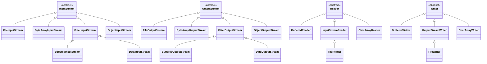
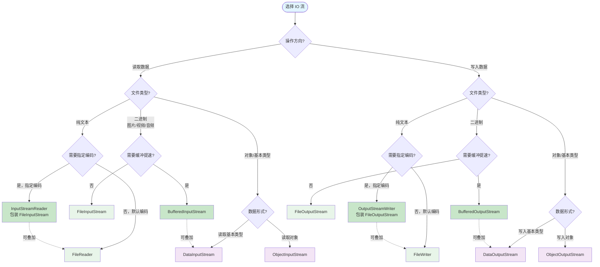

# IO 流

> 学习路线对应：第2周 -- Java 语言核心
> 前置知识：Java 基本语法、异常处理、常用类与基础 API
> 预计学习时间：2-3 天

> **视频章节对应**：尚硅谷宋红康《Java零基础入门教程》第13章 -- IO 流。本章涵盖 File 类、IO 流分类、字节流与字符流节点流、缓冲流/转换流/对象流等处理流、对象序列化机制以及 NIO 基础。重点深入理解装饰器设计模式在 IO 流体系中的应用，以及 serialVersionUID 在序列化版本控制中的核心作用。

---

## 一、核心概念

### 1.1 IO 流概述

#### 1.1.1 什么是 IO 流

IO（Input/Output）是计算机与外部世界进行数据交换的通道。在 Java 中，IO 流是一个抽象概念，代表了**从数据源到目标的有序数据序列**。Java 将数据的输入输出抽象为"流"（Stream），使得程序可以以统一的方式处理来自不同数据源（文件、网络、内存、键盘等）的数据。

**IO 流的核心价值：**

| 价值 | 说明 |
|------|------|
| **统一抽象** | 无论是文件、网络还是内存，都通过统一的流接口操作 |
| **屏蔽底层差异** | 开发者无需关心底层硬件的具体实现细节 |
| **链式处理** | 通过装饰器模式，可以将多个流组合成功能强大的处理链 |
| **资源管理** | 配合 try-with-resources 实现自动资源释放 |

#### 1.1.2 输入流与输出流

输入流和输出流是相对于**程序（内存）**而言的：

```
输入流（Input）：
数据源 ──────────> 程序（内存）
文件/网络/键盘      读取数据

输出流（Output）：
程序（内存） ──────────> 数据目标
写入数据               文件/网络/控制台
```

**记忆口诀：**
- 输入流（Input）：从外部**读入**内存，相当于"吸"进来
- 输出流（Output）：从内存**写出**到外部，相当于"吐"出去
- 站在程序的角度：读入 = Input，写出 = Output

> **生活化类比：IO 流 = 自来水管道系统**
> - **输入流**就像"进水管"——把水（数据）从水源（文件/网络/键盘）引进你家（程序内存），你只需拧开水龙头（`read()`）就有水来。
> - **输出流**就像"排水管"——把水（数据）从你家（程序内存）排到目的地（文件/网络/控制台），你只需按下冲水键（`write()`）。
> - **流的方向永远以"程序"为参照**：水进来是 Input，水出去是 Output——就像超市"进货"和"出货"都以超市本身为视角。
> - **流是单向的**：一根管子要么进要么出，不能既进又出——所以 `InputStream` 不能 `write`，`OutputStream` 不能 `read`。

> 📖 **参考链接**：
> - [Oracle Java Tutorial: I/O Streams 概览](https://docs.oracle.com/javase/tutorial/essential/io/index.html)
> - [Java SE 17 API: java.io 包](https://docs.oracle.com/javase/17/docs/api/java.base/java/io/package-summary.html)
> - [JLS §7.1: Package java.io（IO 包结构）](https://docs.oracle.com/javase/specs/jls/se17/html/jls-7.html)

### 1.2 File 类

#### 1.2.1 File 类概述

`java.io.File` 类是文件和目录路径名的抽象表示。**注意：File 类不负责文件的读写，只负责文件和目录的元信息操作**（创建、删除、重命名、判断属性等）。实际的文件内容读写由 IO 流完成。

#### 1.2.2 File 类的三种构造方式

```java
// 方式一：直接传入路径字符串
File file1 = new File("D:\\data\\test.txt");
File file1b = new File("D:/data/test.txt");  // 也支持正斜杠

// 方式二：父路径 + 子路径
File file2 = new File("D:\\data", "test.txt");

// 方式三：父 File 对象 + 子路径
File parent = new File("D:\\data");
File file3 = new File(parent, "test.txt");
```

#### 1.2.3 File 类常用方法速查

**获取功能：**

| 方法 | 说明 |
|------|------|
| `getAbsolutePath()` | 获取绝对路径 |
| `getPath()` | 获取构造时传入的路径 |
| `getName()` | 获取文件或目录名 |
| `getParent()` | 获取父目录路径 |
| `length()` | 获取文件字节数（目录返回 0 或不准确） |
| `lastModified()` | 获取最后修改时间戳 |

**判断功能：**

| 方法 | 说明 |
|------|------|
| `exists()` | 文件或目录是否存在 |
| `isFile()` | 是否为文件 |
| `isDirectory()` | 是否为目录 |
| `canRead()` | 是否可读 |
| `canWrite()` | 是否可写 |
| `isHidden()` | 是否隐藏 |

**创建与删除：**

| 方法 | 说明 |
|------|------|
| `createNewFile()` | 创建新文件（若不存在），返回是否创建成功 |
| `mkdir()` | 创建单级目录 |
| `mkdirs()` | 创建多级目录（含不存在的父目录） |
| `delete()` | 删除文件或空目录（不进入回收站，不可恢复） |

**遍历功能：**

| 方法 | 说明 |
|------|------|
| `list()` | 返回目录下所有文件名（String[]） |
| `listFiles()` | 返回目录下所有文件对象（File[]） |
| `listFiles(FileFilter)` | 按过滤器返回文件对象 |

#### 1.2.4 File 类使用示例

```java
// 递归遍历目录下所有文件
public static void listAllFiles(File dir) {
    if (dir == null || !dir.exists()) {
        return;
    }
    if (dir.isFile()) {
        System.out.println("文件：" + dir.getAbsolutePath());
        return;
    }
    File[] files = dir.listFiles();
    if (files != null) {
        for (File file : files) {
            listAllFiles(file);  // 递归
        }
    }
}

// 递归删除目录（含所有子文件和子目录）
public static boolean deleteDirectory(File dir) {
    if (dir == null || !dir.exists()) {
        return false;
    }
    if (dir.isDirectory()) {
        File[] files = dir.listFiles();
        if (files != null) {
            for (File file : files) {
                deleteDirectory(file);  // 先删除子文件和子目录
            }
        }
    }
    return dir.delete();  // 再删除自身
}
```

> **生活化类比：File 类 = 房产证（不是房子本身）**
> - `File` 类就像"房产证"——上面记录了房子的地址（path）、面积（length）、性质（isFile/isDirectory）、是否抵押（canWrite）等信息，但房产证本身不是房子，你不能从房产证里搬出家具（不能读写文件内容）。
> - `mkdir()` vs `mkdirs()`：前者像"只能盖一间房"（父目录必须已存在），后者像"可以盖整栋楼"（连带盖好所有不存在的父楼层）。
> - `delete()` 只能删空目录：就像拆迁时必须先搬空住户（删子文件），才能拆除楼本身。
> - `listFiles()` 像查户口：列出当前目录下所有"住户"（子文件/子目录）。

> 📖 **参考链接**：
> - [Oracle Java Tutorial: File 类（NIO.2 之前的 API）](https://docs.oracle.com/javase/tutorial/essential/io/file.html)
> - [Java SE 17 API: File 类](https://docs.oracle.com/javase/17/docs/api/java.base/java/io/File.html)
> - [Oracle Java Tutorial: Legacy File I/O Code](https://docs.oracle.com/javase/tutorial/essential/io/legacy.html)

### 1.3 IO 流分类体系

Java IO 流是一个庞大的类族，可以从多个维度进行分类：

#### 1.3.1 按流向分

| 流向 | 基类 | 说明 |
|------|------|------|
| 输入流 | `InputStream` / `Reader` | 从外部读取数据到程序 |
| 输出流 | `OutputStream` / `Writer` | 从程序写出数据到外部 |

#### 1.3.2 按数据单位分

| 数据单位 | 基类 | 最小读写单位 | 适用场景 |
|---------|------|------------|---------|
| 字节流 | `InputStream` / `OutputStream` | 1 字节（byte） | 图片、视频、音频、所有文件 |
| 字符流 | `Reader` / `Writer` | 2 字节（char） | 纯文本文件（.txt、.java、.json 等） |

#### 1.3.3 按功能角色分

| 角色 | 说明 | 典型代表 |
|------|------|---------|
| **节点流** | 直接连接数据源的流，是 IO 操作的"底层管道" | `FileInputStream`、`FileOutputStream`、`FileReader`、`FileWriter` |
| **处理流** | 包装在节点流之上，提供增强功能，是 IO 操作的"功能增强器" | `BufferedInputStream`、`InputStreamReader`、`ObjectInputStream` |

#### 1.3.4 IO 流全貌图

```
                            IO 流体系
                  ┌──────────────┴──────────────┐
               字节流（byte）                   字符流（char）
                  │                                │
        ┌─────────┴─────────┐            ┌─────────┴─────────┐
    输入流                输出流          输入流              输出流
  InputStream         OutputStream      Reader              Writer
        │                   │              │                  │
  ┌─────┴──────┐      ┌─────┴──────┐  ┌────┴─────┐     ┌────┴─────┐
  │ 节点流     │      │ 节点流     │  │ 节点流   │     │ 节点流   │
  ├───────────┤      ├───────────┤  ├──────────┤     ├──────────┤
  │FileInput  │      │FileOutput  │  │FileReader│     │FileWriter│
  │ByteArray  │      │ByteArray   │  │CharArray │     │CharArray │
  │PipedInput │      │PipedOutput │  │StringRdr │     │StringWtr │
  └───────────┘      └───────────┘  └──────────┘     └──────────┘
        │                   │              │                  │
  ┌─────┴──────┐      ┌─────┴──────┐  ┌────┴─────┐     ┌────┴─────┐
  │ 处理流     │      │ 处理流     │  │ 处理流   │     │ 处理流   │
  ├───────────┤      ├───────────┤  ├──────────┤     ├──────────┤
  │Buffered   │      │Buffered    │  │Buffered  │     │Buffered  │
  │DataInput  │      │DataOutput  │  │InputStrm │     │OutputStrm│
  │ObjectInput│      │ObjectOutput│  │Reader    │     │Writer    │
  └───────────┘      └───────────┘  └──────────┘     └──────────┘
```

**IO 流类继承关系图：**



> 上图展示了 Java IO 流四大基类及其主要子类的继承关系。`InputStream`/`OutputStream` 为字节流体系的根，`Reader`/`Writer` 为字符流体系的根。`FilterInputStream`/`FilterOutputStream` 作为抽象装饰器，其子类（如 `BufferedInputStream`、`DataInputStream`）通过装饰器模式为节点流增强功能。`InputStreamReader`/`OutputStreamWriter` 是字节流与字符流之间的转换桥梁。

**IO 流选型决策流程图：**



> 上图展示了 IO 流选型的决策流程：先按"读/写"分流，再按"二进制/文本/对象"分流，最后按"是否需要缓冲/指定编码"决定使用节点流还是处理流。处理流可以叠加（虚线箭头），如 `BufferedInputStream` 可以包装 `FileInputStream`，`DataInputStream` 又可以包装 `BufferedInputStream`，形成多层装饰链。

> **生活化类比：IO 流分类 = 物流公司的分拣系统**
> - **节点流 vs 处理流**：节点流像"基础运输车"（直接连接发货点），处理流像"加挂的车厢"（包装在基础车上，提供冷藏、保险、追踪等增值服务）。
> - **字节流 vs 字符流**：字节流像"通用集装箱"（什么货都能装，按箱单位运输），字符流像"图书专用箱"（专门装文字，自动按书页单位整理）。
> - **缓冲流**：像物流公司的"中转仓库"——不直接发车，而是先把货集中到仓库（缓冲区），凑满一车再发，减少发车次数（磁盘 IO）。
> - **转换流**：像"翻译海关"——货物从"字节国"进入"字符国"必须经过翻译（编码/解码），转换流就是这座桥梁。

> 📖 **参考链接**：
> - [Oracle Java Tutorial: Byte Streams](https://docs.oracle.com/javase/tutorial/essential/io/bytestreams.html)
> - [Oracle Java Tutorial: Character Streams](https://docs.oracle.com/javase/tutorial/essential/io/charstreams.html)
> - [Oracle Java Tutorial: Buffered Streams](https://docs.oracle.com/javase/tutorial/essential/io/buffers.html)
> - [Java SE 17 API: InputStream](https://docs.oracle.com/javase/17/docs/api/java.base/java/io/InputStream.html)

### 1.4 节点流：字节流

字节流是 IO 操作的基础，所有文件都可以通过字节流来处理。

#### 1.4.1 FileInputStream（文件字节输入流）

```java
// 基本用法
try (FileInputStream fis = new FileInputStream("test.txt")) {
    int b;
    while ((b = fis.read()) != -1) {   // 每次读取一个字节，返回 -1 表示结束
        System.out.print((char) b);
    }
} catch (IOException e) {
    e.printStackTrace();
}

// 使用 byte[] 缓冲区批量读取（推荐，效率远高于逐字节读取）
try (FileInputStream fis = new FileInputStream("test.txt")) {
    byte[] buffer = new byte[1024];
    int len;
    while ((len = fis.read(buffer)) != -1) {
        // 处理 buffer[0] 到 buffer[len-1]
        System.out.print(new String(buffer, 0, len));
    }
}
```

#### 1.4.2 FileOutputStream（文件字节输出流）

```java
// 覆盖写入（默认）
try (FileOutputStream fos = new FileOutputStream("output.txt")) {
    fos.write("Hello, IO 流！".getBytes());
    fos.write(97);  // 写入字节 'a'（ASCII 码 97）
} catch (IOException e) {
    e.printStackTrace();
}

// 追加写入（第二个参数为 true）
try (FileOutputStream fos = new FileOutputStream("output.txt", true)) {
    fos.write("\n追加的内容".getBytes());
} catch (IOException e) {
    e.printStackTrace();
}
```

#### 1.4.3 文件拷贝示例

```java
public static void copyFile(String srcPath, String destPath) {
    try (FileInputStream fis = new FileInputStream(srcPath);
         FileOutputStream fos = new FileOutputStream(destPath)) {
        byte[] buffer = new byte[8192];  // 8KB 缓冲区
        int len;
        while ((len = fis.read(buffer)) != -1) {
            fos.write(buffer, 0, len);
        }
        System.out.println("文件拷贝完成！");
    } catch (IOException e) {
        e.printStackTrace();
    }
}
```

> **生活化类比：字节流 = 万能集装箱**
> - `FileInputStream` 就像"从仓库取货的传送带"——每次取一个字节（一个最小包裹），返回 -1 表示仓库空了。
> - `byte[] buffer` 缓冲区就像"叉车托盘"——一次搬一托盘（8KB）比一次搬一个包裹效率高几百倍。
> - `read()` 返回 `int` 而不是 `byte`：因为要用 0-255 表示字节，再用 -1 表示"没货了"，`byte` 范围 -128~127 不够用，必须用 `int`。
> - `FileOutputStream(path, true)` 中的 `true`：像"快递柜选择'追加'还是'覆盖'模式"，true 是追加，false/默认是覆盖。

> 📖 **参考链接**：
> - [Oracle Java Tutorial: Byte Streams（字节流详解）](https://docs.oracle.com/javase/tutorial/essential/io/bytestreams.html)
> - [Java SE 17 API: FileInputStream](https://docs.oracle.com/javase/17/docs/api/java.base/java/io/FileInputStream.html)
> - [Java SE 17 API: FileOutputStream](https://docs.oracle.com/javase/17/docs/api/java.base/java/io/FileOutputStream.html)

### 1.5 节点流：字符流

字符流专门用于处理文本文件，自动处理字符编码问题。

#### 1.5.1 FileReader（文件字符输入流）

```java
// 逐字符读取
try (FileReader fr = new FileReader("test.txt")) {
    int c;
    while ((c = fr.read()) != -1) {
        System.out.print((char) c);
    }
} catch (IOException e) {
    e.printStackTrace();
}

// 使用 char[] 缓冲区批量读取
try (FileReader fr = new FileReader("test.txt")) {
    char[] buffer = new char[1024];
    int len;
    while ((len = fr.read(buffer)) != -1) {
        System.out.print(new String(buffer, 0, len));
    }
}
```

#### 1.5.2 FileWriter（文件字符输出流）

```java
// 覆盖写入
try (FileWriter fw = new FileWriter("output.txt")) {
    fw.write("Hello, 字符流！");
    fw.write("这是第二行内容");
    fw.flush();  // 强制刷新缓冲区
} catch (IOException e) {
    e.printStackTrace();
}

// 追加写入
try (FileWriter fw = new FileWriter("output.txt", true)) {
    fw.write("\n追加的文本内容");
} catch (IOException e) {
    e.printStackTrace();
}
```

#### 1.5.3 字节流与字符流选择指南

| 场景 | 推荐流 | 原因 |
|------|--------|------|
| 图片、视频、音频、PDF 等二进制文件 | 字节流 | 字符流会破坏二进制数据 |
| 纯文本文件（.txt、.java、.json、.xml 等） | 字符流 | 自动处理编码，方便操作字符 |
| 不确定文件类型 | 字节流 | 字节流是万能的，什么文件都能处理 |
| 需要指定编码时 | 转换流 | 见下文转换流章节 |

> **生活化类比：字节流 vs 字符流 = 货运 vs 客运**
> - **字节流**像"货运火车"——只管把"箱子"（字节）从 A 搬到 B，不管箱子里装的是什么；图片、视频、可执行文件都是箱子，原样搬运不损坏。
> - **字符流**像"客运巴士"——会主动帮"乘客"（字符）翻译身份证（编码/解码），中文乘客占 3 个座位（UTF-8）也能正确识别。
> - **关键区别**：用字节流读中文文件，可能把一个汉字切成两半导致乱码——就像把一位乘客的腿和上半身分到两辆车。字符流自动按字符边界读取，不会切错。
> - **`FileReader` 默认用系统编码**：就像机场海关默认用"当地语言"翻译——在中国是 GBK，在 Linux 服务器常是 UTF-8，跨平台时容易出乱码，所以推荐用 `InputStreamReader` 指定编码。

> 📖 **参考链接**：
> - [Oracle Java Tutorial: Character Streams](https://docs.oracle.com/javase/tutorial/essential/io/charstreams.html)
> - [Java SE 17 API: Reader](https://docs.oracle.com/javase/17/docs/api/java.base/java/io/Reader.html)
> - [Java SE 17 API: Writer](https://docs.oracle.com/javase/17/docs/api/java.base/java/io/Writer.html)
> - [Oracle Java Tutorial: Scanning and Formatting（文本格式化）](https://docs.oracle.com/javase/tutorial/essential/io/scanning.html)

### 1.6 处理流之一：缓冲流

缓冲流（Buffered Stream）是典型的处理流，通过内部缓冲区减少实际的磁盘 IO 次数，显著提升读写性能。

#### 1.6.1 缓冲流类及作用

| 类名 | 包装对象 | 默认缓冲区大小 | 作用 |
|------|---------|-------------|------|
| `BufferedInputStream` | `InputStream` | 8192 字节（8KB） | 字节输入缓冲 |
| `BufferedOutputStream` | `OutputStream` | 8192 字节（8KB） | 字节输出缓冲 |
| `BufferedReader` | `Reader` | 8192 字符（16KB） | 字符输入缓冲，提供 `readLine()` |
| `BufferedWriter` | `Writer` | 8192 字符（16KB） | 字符输出缓冲，提供 `newLine()` |

#### 1.6.2 缓冲流使用示例

```java
// 字节缓冲流 -- 文件拷贝（性能对比见下文）
try (BufferedInputStream bis = new BufferedInputStream(
            new FileInputStream("source.mp4"));
     BufferedOutputStream bos = new BufferedOutputStream(
            new FileOutputStream("dest.mp4"))) {
    byte[] buffer = new byte[8192];
    int len;
    while ((len = bis.read(buffer)) != -1) {
        bos.write(buffer, 0, len);
    }
} catch (IOException e) {
    e.printStackTrace();
}

// 字符缓冲流 -- 按行读取文本文件
try (BufferedReader br = new BufferedReader(new FileReader("test.txt"))) {
    String line;
    while ((line = br.readLine()) != null) {
        System.out.println(line);
    }
} catch (IOException e) {
    e.printStackTrace();
}

// 字符缓冲流 -- 按行写入
try (BufferedWriter bw = new BufferedWriter(new FileWriter("output.txt"))) {
    bw.write("第一行");
    bw.newLine();  // 跨平台换行符
    bw.write("第二行");
    bw.newLine();
} catch (IOException e) {
    e.printStackTrace();
}
```

#### 1.6.3 缓冲流性能对比

| 方式 | 1MB 文件拷贝耗时 | 缓冲区大小 | 说明 |
|------|---------------|-----------|------|
| 逐字节读写 | 非常慢（数秒甚至数十秒） | 无 | 每次都触发磁盘 IO |
| byte[] 缓冲区（1024） | 较快 | 1KB | 手动管理缓冲区 |
| BufferedInputStream + BufferedOutputStream | 快 | 默认 8KB | 内置缓冲区，代码更简洁 |
| 缓冲区调大（8192 或更大） | 最快 | 8KB 以上 | 减少 IO 次数 |

> **生活化类比：缓冲流 = 物流中转仓**
> - 没有缓冲流时，每读一个字节就跑一趟磁盘——就像每收一个快递就跑一趟快递站，体力活多到爆。
> - 有缓冲流后，先把数据批量读到内存"中转仓"（默认 8KB），程序从中转仓取数据——就像快递员一次拉一车到小区门口，居民从门口取件，省了几百趟奔波。
> - `BufferedReader.readLine()` 像快递员帮你"按地址分拣"——自动按行切分，不用你逐字符找换行符。
> - `flush()` 像"强制发货"——即使仓库没满，也立刻把现有货发出去，避免收件人等太久；不 flush 的话数据可能还堆在中转仓没真写到磁盘。
> - 关闭流时会自动 flush：就像快递站下班前把所有未发货的件全部发出去。

> 📖 **参考链接**：
> - [Oracle Java Tutorial: Buffered Streams](https://docs.oracle.com/javase/tutorial/essential/io/buffers.html)
> - [Java SE 17 API: BufferedInputStream](https://docs.oracle.com/javase/17/docs/api/java.base/java/io/BufferedInputStream.html)
> - [Java SE 17 API: BufferedReader](https://docs.oracle.com/javase/17/docs/api/java.base/java/io/BufferedReader.html)

### 1.7 处理流之二：转换流

转换流是**字节流与字符流之间的桥梁**，核心作用是指定字符编码。

#### 1.7.1 InputStreamReader 与 OutputStreamWriter

```java
// InputStreamReader：字节输入流 -> 字符输入流
// 读取 GBK 编码的文件
try (InputStreamReader isr = new InputStreamReader(
            new FileInputStream("gbk_file.txt"), "GBK");
     BufferedReader br = new BufferedReader(isr)) {
    String line;
    while ((line = br.readLine()) != null) {
        System.out.println(line);
    }
} catch (IOException e) {
    e.printStackTrace();
}

// OutputStreamWriter：字符输出流 -> 字节输出流
// 以 UTF-8 编码写入文件
try (OutputStreamWriter osw = new OutputStreamWriter(
            new FileOutputStream("utf8_file.txt"), StandardCharsets.UTF_8);
     BufferedWriter bw = new BufferedWriter(osw)) {
    bw.write("以 UTF-8 编码写入的文本");
} catch (IOException e) {
    e.printStackTrace();
}
```

#### 1.7.2 编码问题说明

**FileReader 和 FileWriter 的局限性：** 它们使用系统默认编码（通常是 GBK 或 UTF-8，取决于操作系统），无法指定编码方式。当需要处理非默认编码的文件时，必须使用转换流。

```java
// 错误做法：FileReader 无法指定编码
FileReader fr = new FileReader("utf8_file.txt");  // 可能乱码

// 正确做法：通过转换流指定编码
InputStreamReader isr = new InputStreamReader(
    new FileInputStream("utf8_file.txt"), StandardCharsets.UTF_8);
```

> **生活化类比：转换流 = 国际机场的"翻译海关"**
> - `InputStreamReader` 像"入境海关翻译"——外国货物（字节）进来时，按指定语言（编码）翻译成本国文字（字符），否则中文显示成乱码。
> - `OutputStreamWriter` 像"出境海关翻译"——本国文字（字符）出口时，按指定语言（编码）翻译成外国货物（字节）。
> - `FileReader` 的局限：像"只会当地语言的本地海关"——只能用系统默认编码，遇到外国文件就抓瞎。
> - `StandardCharsets.UTF_8` 是常量：比直接写字符串 `"UTF-8"` 更安全，避免拼写错（`"UTF-8"` vs `"UTF8"` vs `"utf-8"` 可能引发异常）。

> 📖 **参考链接**：
> - [Oracle Java Tutorial: Character Streams（含转换流）](https://docs.oracle.com/javase/tutorial/essential/io/charstreams.html)
> - [Java SE 17 API: InputStreamReader](https://docs.oracle.com/javase/17/docs/api/java.base/java/io/InputStreamReader.html)
> - [Java SE 17 API: OutputStreamWriter](https://docs.oracle.com/javase/17/docs/api/java.base/java/io/OutputStreamWriter.html)
> - [Java SE 17 API: StandardCharsets](https://docs.oracle.com/javase/17/docs/api/java.base/java/nio/charset/StandardCharsets.html)

### 1.8 处理流之三：对象流与序列化

#### 1.8.1 序列化概述

**序列化（Serialization）** 是将对象的状态转换为字节序列的过程，以便存储到文件、数据库或在网络中传输。**反序列化（Deserialization）** 则是将字节序列恢复为对象的过程。

**序列化的核心用途：**

| 用途 | 场景 |
|------|------|
| 持久化存储 | 将对象保存到磁盘文件 |
| 网络传输 | 在分布式系统中传输对象（RMI、RPC） |
| 深拷贝 | 通过序列化/反序列化实现对象的深拷贝 |
| 缓存 | 将对象序列化后存入 Redis 等缓存 |

#### 1.8.2 Serializable 接口

要使一个类的对象可序列化，该类必须实现 `java.io.Serializable` 接口：

```java
import java.io.Serializable;

public class Person implements Serializable {
    // serialVersionUID 用于版本控制（详见底层原理章节）
    private static final long serialVersionUID = 1L;

    private String name;
    private int age;
    // transient 修饰的字段不会被序列化
    private transient String password;

    public Person(String name, int age, String password) {
        this.name = name;
        this.age = age;
        this.password = password;
    }

    // getter、setter、toString 省略
}
```

#### 1.8.3 ObjectOutputStream 与 ObjectInputStream

```java
// 序列化：将对象写入文件
try (ObjectOutputStream oos = new ObjectOutputStream(
            new FileOutputStream("person.dat"))) {
    Person p = new Person("张三", 25, "123456");
    oos.writeObject(p);
    System.out.println("对象序列化成功！");
} catch (IOException e) {
    e.printStackTrace();
}

// 反序列化：从文件读取对象
try (ObjectInputStream ois = new ObjectInputStream(
            new FileInputStream("person.dat"))) {
    Person p = (Person) ois.readObject();
    System.out.println("反序列化得到的对象：" + p);
    System.out.println("密码字段（transient）：" + p.getPassword());  // null
} catch (IOException | ClassNotFoundException e) {
    e.printStackTrace();
}
```

#### 1.8.4 transient 关键字

`transient` 关键字用于修饰不需要序列化的字段：

```java
public class User implements Serializable {
    private static final long serialVersionUID = 1L;
    private String username;
    private transient String password;   // 不会被序列化，反序列化后为 null
    private transient int loginAttempts; // 运行时状态，无需持久化
    // static 字段本身不参与序列化（属于类而非对象）
}
```

**使用 transient 的典型场景：** 密码等敏感信息、临时计算结果、缓存数据、可从其他字段推导出的值。

> 📖 **参考链接**：
> - [Oracle Java Tutorial: Object Streams（对象流与序列化）](https://docs.oracle.com/javase/tutorial/essential/io/objectstreams.html)
> - [Java SE 17 API: Serializable 接口](https://docs.oracle.com/javase/17/docs/api/java.base/java/io/Serializable.html)
> - [Java SE 17 API: ObjectOutputStream](https://docs.oracle.com/javase/17/docs/api/java.base/java/io/ObjectOutputStream.html)
> - [Java SE 17 API: ObjectInputStream](https://docs.oracle.com/javase/17/docs/api/java.base/java/io/ObjectInputStream.html)

#### 1.8.5 序列化中的注意事项

```java
// 1. 序列化多个对象
try (ObjectOutputStream oos = new ObjectOutputStream(
            new FileOutputStream("objects.dat"))) {
    oos.writeObject(new Person("张三", 25, "pwd1"));
    oos.writeObject(new Person("李四", 30, "pwd2"));
    oos.writeObject(new Person("王五", 28, "pwd3"));
}

// 读取时必须按写入顺序读取
try (ObjectInputStream ois = new ObjectInputStream(
            new FileInputStream("objects.dat"))) {
    Person p1 = (Person) ois.readObject();
    Person p2 = (Person) ois.readObject();
    Person p3 = (Person) ois.readObject();
}

// 2. 自定义序列化（通过 writeObject/readObject 方法）
public class Person implements Serializable {
    private static final long serialVersionUID = 1L;
    private String name;
    private int age;

    // 自定义序列化逻辑
    private void writeObject(ObjectOutputStream oos) throws IOException {
        oos.defaultWriteObject();  // 先执行默认序列化
        // 可以在这里添加额外的自定义逻辑
    }

    // 自定义反序列化逻辑
    private void readObject(ObjectInputStream ois)
            throws IOException, ClassNotFoundException {
        ois.defaultReadObject();  // 先执行默认反序列化
        // 可以在这里添加额外的自定义逻辑（如校验、解密等）
    }
}
```

### 1.9 NIO 基础

#### 1.9.1 NIO 概述

NIO（New IO / Non-Blocking IO）是 JDK 1.4 引入的新 IO API，与传统的 BIO（Blocking IO）相比有本质区别。

**BIO 与 NIO 核心对比：**

| 对比维度 | BIO（传统 IO） | NIO（新 IO） |
|---------|--------------|-------------|
| 数据单位 | 流（Stream） | 块（Block） |
| 处理方式 | 单向、顺序 | 双向、随机 |
| 是否阻塞 | 阻塞（读不到数据就等待） | 非阻塞（可配置） |
| 核心组件 | InputStream / OutputStream | Channel + Buffer |
| 选择器 | 无 | Selector（多路复用） |
| 性能 | 低（大量线程） | 高（少量线程处理大量连接） |

#### 1.9.2 NIO 三大核心组件

```
┌─────────────────────────────────────────────────┐
│                    NIO 核心组件                    │
├───────────────┬───────────────┬─────────────────┤
│    Channel    │    Buffer     │    Selector     │
│    通道        │    缓冲区      │    选择器        │
├───────────────┼───────────────┼─────────────────┤
│ 负责数据传输  │ 负责数据存储   │ 负责多路复用     │
│ 双向通信      │ 可读可写       │ 单线程管理多通道  │
│ 与 Buffer 配合 │ 与 Channel 配合 │ 监控 Channel 事件 │
└───────────────┴───────────────┴─────────────────┘
```

**Channel（通道）：** 相当于传统 IO 中的"流"，但是**双向**的，既可以读也可以写。常见实现有 `FileChannel`、`SocketChannel`、`ServerSocketChannel`。

**Buffer（缓冲区）：** 本质上是一块内存区域，用于暂存数据。NIO 中所有数据都必须通过 Buffer 读写。常见实现有 `ByteBuffer`、`CharBuffer`、`IntBuffer` 等。

**Selector（选择器）：** 允许单个线程监控多个 Channel 的事件（连接、读、写），实现 IO 多路复用。这是 NIO 实现高性能网络编程的关键。

#### 1.9.3 Buffer 详解

Buffer 有四个核心属性：

```java
// Buffer 的内部状态
public abstract class Buffer {
    private int mark = -1;      // 标记位置
    private int position = 0;   // 当前读写位置
    private int limit;          // 可读写数据的边界
    private int capacity;       // 缓冲区总容量
}
```

**Buffer 四种属性的关系：**

```
mark <= position <= limit <= capacity

初始状态：[________________________]  capacity=10
                   ↑              ↑
               position=0      limit=10

写入 5 字节后：[#####_______________]  capacity=10
                       ↑          ↑
                   position=5   limit=10

调用 flip() 后：[#####_______________]  capacity=10
               ↑       ↑
           position=0  limit=5

调用 clear()：[________________________]  capacity=10
                   ↑              ↑
               position=0      limit=10
```

**Buffer 常用操作：**

```java
ByteBuffer buffer = ByteBuffer.allocate(1024);  // 分配 1024 字节的缓冲区

// 写入数据
buffer.put("hello".getBytes());         // 写入字节数组
buffer.put((byte) 97);                  // 写入单个字节

// 切换读写模式
buffer.flip();    // 写模式 -> 读模式（position=0, limit=原来position）
buffer.clear();   // 重置所有状态（position=0, limit=capacity）
buffer.rewind();  // 重新读（position=0, limit 不变）

// 读取数据
byte b = buffer.get();                  // 读取一个字节
buffer.get(bytes, 0, buffer.remaining());  // 批量读取

// 判断
buffer.hasRemaining();  // 是否还有未读数据
buffer.remaining();     // 剩余可读字节数
```

#### 1.9.4 FileChannel 基本使用

```java
// 文件拷贝（使用 FileChannel）
try (FileChannel inChannel = new FileInputStream("source.txt").getChannel();
     FileChannel outChannel = new FileOutputStream("dest.txt").getChannel()) {

    ByteBuffer buffer = ByteBuffer.allocate(1024);
    while (inChannel.read(buffer) != -1) {
        buffer.flip();  // 切换到读模式
        outChannel.write(buffer);
        buffer.clear();  // 切换到写模式，准备下一次读取
    }
    System.out.println("NIO 文件拷贝完成！");
} catch (IOException e) {
    e.printStackTrace();
}

// 更高效的方式：使用 transferTo / transferFrom（零拷贝）
try (FileChannel inChannel = new FileInputStream("source.txt").getChannel();
     FileChannel outChannel = new FileOutputStream("dest.txt").getChannel()) {
    // transferTo：将数据从当前通道传输到目标通道
    long transferred = inChannel.transferTo(0, inChannel.size(), outChannel);
    // 或使用 transferFrom：
    // long transferred = outChannel.transferFrom(inChannel, 0, inChannel.size());
    System.out.println("传输了 " + transferred + " 字节");
} catch (IOException e) {
    e.printStackTrace();
}
```

#### 1.9.5 NIO.2（JDK 7+）：Path、Paths、Files 工具类

JDK 7 引入了 NIO.2，提供了更便捷的文件操作 API：

```java
import java.nio.file.*;

// 创建 Path 对象
Path path = Paths.get("D:\\data\\test.txt");
Path path2 = Paths.get("D:", "data", "test.txt");

// 路径信息
path.getFileName();       // test.txt
path.getParent();         // D:\data
path.getRoot();           // D:\
path.getNameCount();      // 路径元素数量

// Files 工具类常用方法
Files.exists(path);                        // 判断文件是否存在
Files.createFile(path);                    // 创建文件
Files.createDirectory(path);               // 创建单级目录
Files.createDirectories(path);             // 创建多级目录

// 读取与写入
byte[] bytes = Files.readAllBytes(path);                       // 读取所有字节
List<String> lines = Files.readAllLines(path);                 // 读取所有行
List<String> lines2 = Files.readAllLines(path, StandardCharsets.UTF_8);  // 指定编码
Files.write(path, "content".getBytes());                       // 写入字节
Files.write(path, Arrays.asList("line1", "line2"));            // 写入行

// 复制与移动
Files.copy(srcPath, destPath);                                 // 复制文件
Files.copy(srcPath, destPath, StandardCopyOption.REPLACE_EXISTING);  // 覆盖
Files.move(srcPath, destPath);                                 // 移动/重命名

// 删除
Files.delete(path);                                            // 删除（不存在抛异常）
Files.deleteIfExists(path);                                    // 删除（不存在不抛异常）

// 遍历目录
try (DirectoryStream<Path> stream = Files.newDirectoryStream(dirPath)) {
    for (Path p : stream) {
        System.out.println(p.getFileName());
    }
}

// JDK 8+：使用 Files.walk() 递归遍历
Files.walk(Paths.get("D:\\data"))
    .filter(Files::isRegularFile)
    .forEach(System.out::println);
```

> **生活化类比：NIO = 高速公路 vs BIO = 单行道**
> - **BIO 像单行道收费站**：一辆车通过时后面全部排队等（阻塞），一个连接要一个线程盯着，几千连接就要几千线程，CPU 上下文切换累死。
> - **NIO 像多车道高速公路 + 智能监控**：`Selector` 是"监控中心"（一个线程监控多个通道），`Channel` 是"多车道"（双向通行，可读可写），`Buffer` 是"缓冲服务区"（数据必须先停在这里再进出）。
> - **Buffer 的四个指针**像"停车场标记"：`capacity` 是总车位，`limit` 是当前可用车位，`position` 是下一辆车停哪，`mark` 是临时记住的位置（可 `reset` 回去）。
> - **`flip()` 像"翻面"**：写完一面翻过来读，`position` 归零、`limit` 锁定已写范围；`clear()` 像"清空"重置为初始状态（实际数据没删，只是指针重置）。
> - **`transferTo` 零拷贝**：像"货物直接从一辆车换装到另一辆车"，不用先卸到仓库（用户态缓冲区）再装车，省了一次搬运。

> 📖 **参考链接**：
> - [Oracle Java Tutorial: File I/O (NIO.2)](https://docs.oracle.com/javase/tutorial/essential/io/fileio.html)
> - [Java SE 17 API: java.nio.channels 包](https://docs.oracle.com/javase/17/docs/api/java.base/java/nio/channels/package-summary.html)
> - [Java SE 17 API: java.nio.file 包](https://docs.oracle.com/javase/17/docs/api/java.base/java/nio/file/package-summary.html)
> - [Java SE 17 API: ByteBuffer](https://docs.oracle.com/javase/17/docs/api/java.base/java/nio/ByteBuffer.html)

---

## 二、底层原理

### 2.1 装饰器模式在 IO 流中的应用

#### 2.1.1 什么是装饰器模式

**装饰器模式（Decorator Pattern）** 是一种结构型设计模式，允许在不修改原有类的情况下，动态地为对象添加新的功能。它通过创建一个包装对象（装饰器）来包裹真实对象，从而在保持原有接口不变的前提下扩展功能。

**装饰器模式的四个角色：**

| 角色 | 说明 | IO 流体系中的对应 |
|------|------|-----------------|
| **抽象组件（Component）** | 定义被装饰对象的接口 | `InputStream` / `OutputStream` / `Reader` / `Writer` |
| **具体组件（ConcreteComponent）** | 被装饰的具体对象 | `FileInputStream` / `FileOutputStream` / `FileReader` / `FileWriter` |
| **抽象装饰器（Decorator）** | 持有组件引用，实现组件接口 | `FilterInputStream` / `FilterOutputStream` / `FilterReader` / `FilterWriter` |
| **具体装饰器（ConcreteDecorator）** | 添加具体增强功能 | `BufferedInputStream` / `DataInputStream` / `ObjectInputStream` 等 |

#### 2.1.2 IO 流中的装饰器模式结构

```
                        InputStream（抽象组件）
                             │
              ┌──────────────┼──────────────┐
              │              │              │
     FileInputStream     FilterInputStream   ByteArrayInputStream
     (具体组件)          (抽象装饰器)          (具体组件)
                              │
              ┌───────────────┼───────────────┬────────────────┐
              │               │               │                │
   BufferedInputStream  DataInputStream  PushbackInputStream  ObjectInputStream
   (具体装饰器)         (具体装饰器)      (具体装饰器)          (具体装饰器)
```

#### 2.1.3 装饰器模式的核心代码逻辑

以 `FilterInputStream`（抽象装饰器）为例：

```java
public class FilterInputStream extends InputStream {
    // 持有被装饰的 InputStream 引用
    protected volatile InputStream in;

    protected FilterInputStream(InputStream in) {
        this.in = in;
    }

    // 默认实现：直接委托给被装饰的对象
    public int read() throws IOException {
        return in.read();
    }

    public int read(byte b[]) throws IOException {
        return read(b, 0, b.length);
    }

    public int read(byte b[], int off, int len) throws IOException {
        return in.read(b, off, len);
    }

    // ... 其他方法类似，都是委托给 in
}
```

以 `BufferedInputStream`（具体装饰器）为例，它重写了 `read` 方法，添加了缓冲功能：

```java
public class BufferedInputStream extends FilterInputStream {
    protected volatile byte[] buf;  // 内部缓冲区

    public synchronized int read() throws IOException {
        if (pos >= count) {
            fill();  // 缓冲区空了，从底层流批量读取填充
            if (pos >= count) return -1;
        }
        return buf[pos++] & 0xff;
    }

    private void fill() throws IOException {
        // 从底层 InputStream 批量读取数据到缓冲区
        // 减少实际的磁盘 IO 调用次数
    }
}
```

#### 2.1.4 装饰器模式的优势

**为什么 IO 流使用装饰器模式，而非继承？**

如果使用继承方式，每增加一种功能组合都要创建一个新类，会导致"类爆炸"：

```
继承方式（假设）：
BufferedFileInputStream
BufferedByteArrayInputStream
BufferedDataFileInputStream
BufferedDataByteArrayInputStream
ObjectBufferedFileInputStream
...（组合爆炸）
```

装饰器模式的优势：

```java
// 装饰器模式：任意组合，灵活装配
InputStream in = new FileInputStream("data.txt");           // 基础：文件读取
in = new BufferedInputStream(in);                           // 增强：添加缓冲
in = new DataInputStream(in);                               // 增强：读取基本类型
// 或者
InputStream in2 = new ObjectInputStream(
    new BufferedInputStream(
        new FileInputStream("data.dat")));                   // 对象+缓冲+文件
// 可以任意嵌套组合，无需创建新类
```

**装饰器模式的核心优势总结：**

| 优势 | 说明 |
|------|------|
| **避免类爆炸** | 无需为每种组合创建新类，装饰器可以任意嵌套 |
| **动态扩展** | 可以在运行时动态添加或移除功能，比继承更灵活 |
| **单一职责** | 每个装饰器只负责一种增强功能，符合单一职责原则 |
| **开闭原则** | 对扩展开放，对修改封闭。新增功能只需新增装饰器类 |
| **透明性** | 客户代码无需感知被装饰对象与装饰器的区别 |

> **生活化类比：装饰器模式 = 俄罗斯套娃**
> - **抽象组件** `InputStream` 是"最内层的小娃"（核心功能：读字节）。
> - **具体组件** `FileInputStream` 是"装着小娃的中娃"（具体实现：从文件读）。
> - **抽象装饰器** `FilterInputStream` 是"带凹槽的大娃"——凹槽里能塞任何娃（持有 `InputStream in` 引用），自己只是"传话筒"（默认委托）。
> - **具体装饰器** `BufferedInputStream`、`DataInputStream` 是"有特殊功能的套娃"——除了传话，还能"批量读"（缓冲）或"读 int/double"（数据类型）。
> - **任意嵌套**：`new DataInputStream(new BufferedInputStream(new FileInputStream(...)))` 就是三层套娃——文件娃外面包缓冲娃，缓冲娃外面包数据娃，每层加一个功能。
> - **vs 继承**：继承要"为每种组合造一个新娃"（BufferedFileInputStream、BufferedByteArrayInputStream...组合爆炸）；装饰器只需"造几种功能娃"，自由组合不爆炸。

> 📖 **参考链接**：
> - [Oracle Java Tutorial: Buffered Streams（装饰器实践）](https://docs.oracle.com/javase/tutorial/essential/io/buffers.html)
> - [Java SE 17 API: FilterInputStream](https://docs.oracle.com/javase/17/docs/api/java.base/java/io/FilterInputStream.html)
> - [Java SE 17 API: FilterOutputStream](https://docs.oracle.com/javase/17/docs/api/java.base/java/io/FilterOutputStream.html)
> - [Refactoring Guru: Decorator Pattern（设计模式详解）](https://refactoring.guru/design-patterns/decorator)

### 2.2 serialVersionUID 的底层原理与作用

#### 2.2.1 serialVersionUID 是什么

`serialVersionUID` 是序列化版本控制的核心机制。它是一个 `static final long` 类型的字段，用于标识类的序列化版本。

```java
public class Person implements Serializable {
    private static final long serialVersionUID = 1L;  // 序列化版本号
    // ...
}
```

#### 2.2.2 serialVersionUID 的生成机制

**自动生成（JDK 默认）：**

如果可序列化类没有显式声明 `serialVersionUID`，JVM 会根据类的各种特征（类名、接口、方法签名、字段等）通过 SHA-1 算法自动生成一个哈希值。

```java
// 自动生成的 serialVersionUID 依赖于：
// 1. 类名
// 2. 类修饰符
// 3. 实现的接口列表
// 4. 所有非 transient 的字段（包括字段名、类型、修饰符）
// 5. 所有非 private 的方法（包括方法名、返回值、参数类型）
// 6. 构造器
// 凡是类定义的任何变化，都会导致自动生成的 serialVersionUID 不同
```

**显式声明（推荐）：**

```java
private static final long serialVersionUID = 1L;
```

#### 2.2.3 serialVersionUID 在反序列化时的校验流程

```
反序列化流程：
                                    开始
                                      │
                                      ▼
                        从字节流中读取序列化数据
                                      │
                                      ▼
                    读取数据中记录的 serialVersionUID
                                      │
                                      ▼
                    加载目标类的 Class 对象
                                      │
                                      ▼
                    获取目标类的 serialVersionUID
                                      │
                                      ▼
                    ┌─────────────────────────────────┐
                    │ 两个 serialVersionUID 是否相等？  │
                    └──────────────┬──────────────────┘
                          │                    │
                       相等                  不等
                          │                    │
                          ▼                    ▼
                   继续反序列化    抛出 InvalidClassException
                   恢复对象状态     "local class incompatible:
                                     stream classdesc
                                     serialVersionUID = X,
                                     local class
                                     serialVersionUID = Y"
```

#### 2.2.4 为什么不显式声明 serialVersionUID 会出问题

**场景演示：**

```java
// 版本 1：最初的 Person 类
public class Person implements Serializable {
    // 没有显式声明 serialVersionUID
    private String name;
    private int age;
}
// 序列化一个 Person 对象保存到文件 person.dat

// --- 几个月后，需求变更 ---

// 版本 2：修改后的 Person 类（添加了 email 字段）
public class Person implements Serializable {
    // 没有显式声明 serialVersionUID
    private String name;
    private int age;
    private String email;  // 新增字段
}
// 尝试从 person.dat 反序列化 -> InvalidClassException！
// 因为新增字段导致自动生成的 serialVersionUID 发生变化
```

**解决方案：显式声明 serialVersionUID**

```java
public class Person implements Serializable {
    private static final long serialVersionUID = 1L;
    private String name;
    private int age;
    private String email;  // 新增字段，但由于 serialVersionUID 不变，可以反序列化
    // 反序列化时 email 字段为 null（因为没有对应的序列化数据）
}
```

#### 2.2.5 serialVersionUID 最佳实践

| 规则 | 说明 |
|------|------|
| **始终显式声明** | 每个实现了 `Serializable` 的类都应该显式声明 `serialVersionUID` |
| **默认值用 1L** | 初始版本通常设为 `1L` |
| **版本兼容时不变** | 如果类的新增字段对旧数据的兼容性没问题，保持 `serialVersionUID` 不变 |
| **不兼容时修改** | 当类的修改导致与旧序列化数据完全无法兼容时，应修改 `serialVersionUID`（如删除字段、改变字段类型） |
| **IDE 自动生成** | 使用 IDE 的 `serialVersionUID` 生成功能（IntelliJ IDEA: Alt+Enter 选择 "Add 'serialVersionUID' field"） |

#### 2.2.6 序列化兼容性规则

**兼容的修改（serialVersionUID 可以保持不变）：**

- 添加新的字段（反序列化时新字段为默认值）
- 添加或删除 `writeObject` / `readObject` 方法
- 将字段从 `static` 改为非 `static` 或反之
- 将字段从 `transient` 改为非 `transient` 或反之

**不兼容的修改（必须修改 serialVersionUID）：**

- 删除字段（旧数据中有的字段，新类中不存在）
- 改变字段的数据类型（如 `int` 改为 `long`）
- 改变类的继承层次结构
- 将 `Serializable` 接口移除
- 改变字段的 `static` 到非 `static` 或反之（在某些情况下）

> **生活化类比：serialVersionUID = 货物的"批次条码"**
> - 每个序列化对象都贴着一个"批次条码"（`serialVersionUID`），反序列化时海关（JVM）会扫描这个条码，与本地类的条码对比。
> - **条码一致** → 放行（即使货物有些字段对不上，能填的填默认值，不能填的忽略）。
> - **条码不一致** → 直接没收销毁（抛 `InvalidClassException`），防止"假货"（不兼容版本）流入。
> - **不显式声明的风险**：JVM 会根据"货物的所有特征"自动算条码（类名、字段、方法都参与哈希），哪怕你只加了一个无关字段，条码也变了——旧货（旧序列化数据）全部进不了海关。
> - **显式声明 = 固定条码**：像厂商主动给所有批次打上"V1"标签，即使产品迭代加功能，只要兼容就保持"V1"标签，老客户（旧数据）仍能识别。
> - **transient 字段**：像"贴了免检标签的货物"——序列化时直接跳过不打包，反序列化时该字段为默认值（null/0/false）。

> 📖 **参考链接**：
> - [Oracle Java Tutorial: Object Streams（serialVersionUID 章节）](https://docs.oracle.com/javase/tutorial/essential/io/objectstreams.html)
> - [Java SE 17 API: Serializable（版本控制规范）](https://docs.oracle.com/javase/17/docs/api/java.base/java/io/Serializable.html)
> - [Java Object Serialization Specification（对象序列化规范）](https://docs.oracle.com/javase/8/docs/platform/serialization/spec/serial-arch.html)

### 2.3 字节流与字符流的底层转换原理

字节流和字符流之间的转换是通过**编码/解码**实现的：

```
写入过程（编码）：
字符（char） --[编码器]--> 字节（byte）
Writer 写入 --> OutputStreamWriter 编码 --> OutputStream 写出

读取过程（解码）：
字节（byte） --[解码器]--> 字符（char）
InputStream 读取 --> InputStreamReader 解码 --> Reader 读取
```

```java
// 底层原理简化代码
public class OutputStreamWriter extends Writer {
    private final StreamEncoder se;  // 编码器

    public OutputStreamWriter(OutputStream out, String charsetName) {
        se = StreamEncoder.forOutputStreamWriter(out, this, charsetName);
    }

    public void write(char[] cbuf, int off, int len) throws IOException {
        se.write(cbuf, off, len);  // 将字符通过编码器转换为字节写入底层流
    }
}

public class InputStreamReader extends Reader {
    private final StreamDecoder sd;  // 解码器

    public InputStreamReader(InputStream in, String charsetName) {
        sd = StreamDecoder.forInputStreamReader(in, this, charsetName);
    }

    public int read(char[] cbuf, int offset, int length) throws IOException {
        return sd.read(cbuf, offset, length);  // 从底层字节流读取并解码为字符
    }
}
```

> 📖 **参考链接**：
> - [Oracle Java Tutorial: Character Streams（编码转换底层）](https://docs.oracle.com/javase/tutorial/essential/io/charstreams.html)
> - [Java SE 17 API: Charset（字符集规范）](https://docs.oracle.com/javase/17/docs/api/java.base/java/nio/charset/Charset.html)
> - [Java SE 17 API: StreamDecoder](https://docs.oracle.com/javase/17/docs/api/java.base/java/nio/charset/package-summary.html)

### 2.4 NIO Buffer 的 flip / clear / compact 机制

这是 NIO 中最容易出错的地方，理解其原理至关重要：

#### 2.4.1 flip() -- 写模式切换为读模式

```java
// 写入数据后，要读取时必须调用 flip()
buffer.put("hello".getBytes());  // 写入 5 个字节
// 此时：position=5, limit=10

buffer.flip();
// flip() 执行后：
// limit = position (5)        -- 限定可读范围
// position = 0                -- 从头开始读
// mark = -1                   -- 清除标记
```

#### 2.4.2 clear() -- 重置为写模式

```java
// 读完数据后，要重新写入时必须调用 clear()
buffer.clear();
// clear() 执行后：
// position = 0
// limit = capacity
// mark = -1
// 注意：clear() 不会清除缓冲区中的数据，只是重置指针位置
```

#### 2.4.3 compact() -- 保留未读数据，准备继续写入

```java
// 场景：读到一半，需要切换到写模式但保留未读完的数据
// 此时 position=3, limit=5（还有 2 个字节未读）
buffer.compact();
// compact() 执行后：
// 1. 将 position 到 limit 之间的未读数据复制到缓冲区开头
// 2. position = 未读数据的长度
// 3. limit = capacity
// 这样就可以继续写入，同时保留了未读数据
```

#### 2.4.4 flip/clear/compact 对比

| 操作 | position | limit | 使用场景 |
|------|----------|-------|---------|
| `flip()` | 0 | 原 position | 写完后准备读 |
| `clear()` | 0 | capacity | 读完后准备重新写 |
| `rewind()` | 0 | 不变 | 重新读取 |
| `compact()` | 剩余字节数 | capacity | 部分读取后切换为写模式 |

> **生活化类比：Buffer 四指针 = 停车场管理**
> - `capacity` 是"总车位"（停车场大小，固定不变）。
> - `limit` 是"当前可用车位"——`flip()` 后等于已停车数（限定只能取这么多），`clear()` 后等于总车位（全部可用）。
> - `position` 是"下一辆车停哪"——写模式下指向下一个空位，读模式下指向下一个要取的车。
> - `mark` 是"临时记住的位置"——像用粉笔在地上画个记号，`reset()` 可以回到记号处。
> - **关系链**：`mark ≤ position ≤ limit ≤ capacity`，永远不变。
> - **`flip()` 像"翻面"**：写完一面翻过来读，把"已写位置"变成"可读边界"。
> - **`clear()` 名不副实**：实际数据没清，只是重置指针——就像停车场把"已用车位"指示牌全归零，但车还在原地（下次写入会覆盖）。
> - **`compact()` 像"往前挪车"**：把未读的车挪到停车场入口，腾出后面空间继续停新车——既保留未读数据，又能继续写。

> 📖 **参考链接**：
> - [Oracle Java Tutorial: Buffer Operations](https://docs.oracle.com/javase/tutorial/essential/io/buffers.html)
> - [Java SE 17 API: Buffer](https://docs.oracle.com/javase/17/docs/api/java.base/java/nio/Buffer.html)
> - [Java SE 17 API: ByteBuffer](https://docs.oracle.com/javase/17/docs/api/java.base/java/nio/ByteBuffer.html)

---

## 三、实战应用

### 3.1 文件复制工具类（支持多种方式）

```java
import java.io.*;
import java.nio.ByteBuffer;
import java.nio.channels.FileChannel;
import java.nio.file.*;

/**
 * 文件复制工具类，提供多种复制方式
 */
public class FileCopyUtils {

    /**
     * 方式一：传统字节流复制（带缓冲区）
     */
    public static void copyByStream(String srcPath, String destPath) throws IOException {
        try (FileInputStream fis = new FileInputStream(srcPath);
             FileOutputStream fos = new FileOutputStream(destPath)) {
            byte[] buffer = new byte[8192];
            int len;
            while ((len = fis.read(buffer)) != -1) {
                fos.write(buffer, 0, len);
            }
        }
    }

    /**
     * 方式二：缓冲流复制（推荐日常使用）
     */
    public static void copyByBufferedStream(String srcPath, String destPath)
            throws IOException {
        try (BufferedInputStream bis = new BufferedInputStream(
                    new FileInputStream(srcPath));
             BufferedOutputStream bos = new BufferedOutputStream(
                    new FileOutputStream(destPath))) {
            byte[] buffer = new byte[8192];
            int len;
            while ((len = bis.read(buffer)) != -1) {
                bos.write(buffer, 0, len);
            }
        }
    }

    /**
     * 方式三：NIO FileChannel 复制
     */
    public static void copyByChannel(String srcPath, String destPath) throws IOException {
        try (FileChannel inChannel = new FileInputStream(srcPath).getChannel();
             FileChannel outChannel = new FileOutputStream(destPath).getChannel()) {
            ByteBuffer buffer = ByteBuffer.allocate(8192);
            while (inChannel.read(buffer) != -1) {
                buffer.flip();
                outChannel.write(buffer);
                buffer.clear();
            }
        }
    }

    /**
     * 方式四：NIO transferTo 零拷贝（大文件推荐）
     */
    public static void copyByTransferTo(String srcPath, String destPath)
            throws IOException {
        try (FileChannel inChannel = new FileInputStream(srcPath).getChannel();
             FileChannel outChannel = new FileOutputStream(destPath).getChannel()) {
            long size = inChannel.size();
            long position = 0;
            while (position < size) {
                position += inChannel.transferTo(position, size - position, outChannel);
            }
        }
    }

    /**
     * 方式五：NIO.2 Files.copy（最简洁，推荐日常使用）
     */
    public static void copyByFiles(String srcPath, String destPath) throws IOException {
        Files.copy(Paths.get(srcPath), Paths.get(destPath),
            StandardCopyOption.REPLACE_EXISTING);
    }
}
```

> 📖 **参考链接**：
> - [Oracle Java Tutorial: File I/O - Reading, Writing, and Creating Files](https://docs.oracle.com/javase/tutorial/essential/io/file.html)
> - [Java SE 17 API: FileChannel](https://docs.oracle.com/javase/17/docs/api/java.base/java/nio/channels/FileChannel.html)
> - [Java SE 17 API: Files.copy](https://docs.oracle.com/javase/17/docs/api/java.base/java/nio/file/Files.html#copy(java.nio.file.Path,java.nio.file.Path,java.nio.file.CopyOption...))

### 3.2 文本文件读取与写入工具类

```java
import java.io.*;
import java.nio.charset.StandardCharsets;
import java.nio.file.*;
import java.util.ArrayList;
import java.util.List;
import java.util.stream.Stream;

/**
 * 文本文件操作工具类
 */
public class TextFileUtils {

    /**
     * 读取文件全部内容（按行）
     */
    public static List<String> readLines(String path) throws IOException {
        List<String> lines = new ArrayList<>();
        try (BufferedReader br = new BufferedReader(new FileReader(path))) {
            String line;
            while ((line = br.readLine()) != null) {
                lines.add(line);
            }
        }
        return lines;
    }

    /**
     * 读取文件全部内容（指定编码）
     */
    public static List<String> readLines(String path, String charset)
            throws IOException {
        List<String> lines = new ArrayList<>();
        try (BufferedReader br = new BufferedReader(
                    new InputStreamReader(
                        new FileInputStream(path), charset))) {
            String line;
            while ((line = br.readLine()) != null) {
                lines.add(line);
            }
        }
        return lines;
    }

    /**
     * 读取文件全部内容为单个字符串
     */
    public static String readAll(String path) throws IOException {
        return new String(Files.readAllBytes(Paths.get(path)));
    }

    /**
     * 写入文本（覆盖）
     */
    public static void writeFile(String path, List<String> lines) throws IOException {
        try (BufferedWriter bw = new BufferedWriter(new FileWriter(path))) {
            for (String line : lines) {
                bw.write(line);
                bw.newLine();
            }
        }
    }

    /**
     * 追加文本
     */
    public static void appendFile(String path, String content) throws IOException {
        try (BufferedWriter bw = new BufferedWriter(
                    new FileWriter(path, true))) {
            bw.write(content);
            bw.newLine();
        }
    }

    /**
     * 使用 NIO.2 读取所有行（JDK 8+）
     */
    public static List<String> readAllLinesNIO(String path) throws IOException {
        return Files.readAllLines(Paths.get(path), StandardCharsets.UTF_8);
    }
}
```

> 📖 **参考链接**：
> - [Oracle Java Tutorial: Scanning and Formatting（文本处理）](https://docs.oracle.com/javase/tutorial/essential/io/scanning.html)
> - [Java SE 17 API: Files.readAllLines](https://docs.oracle.com/javase/17/docs/api/java.base/java/nio/file/Files.html#readAllLines(java.nio.file.Path,java.nio.charset.Charset))

### 3.3 对象序列化工具类

```java
import java.io.*;

/**
 * 对象序列化/反序列化工具类
 */
public class SerializationUtils {

    /**
     * 将对象序列化到文件
     */
    public static void serialize(Object obj, String filePath) throws IOException {
        try (ObjectOutputStream oos = new ObjectOutputStream(
                    new FileOutputStream(filePath))) {
            oos.writeObject(obj);
        }
    }

    /**
     * 从文件反序列化对象
     */
    @SuppressWarnings("unchecked")
    public static <T> T deserialize(String filePath)
            throws IOException, ClassNotFoundException {
        try (ObjectInputStream ois = new ObjectInputStream(
                    new FileInputStream(filePath))) {
            return (T) ois.readObject();
        }
    }

    /**
     * 通过序列化实现深拷贝
     */
    @SuppressWarnings("unchecked")
    public static <T extends Serializable> T deepClone(T obj) {
        try {
            // 序列化到字节数组
            ByteArrayOutputStream baos = new ByteArrayOutputStream();
            ObjectOutputStream oos = new ObjectOutputStream(baos);
            oos.writeObject(obj);
            oos.close();

            // 从字节数组反序列化
            ByteArrayInputStream bais = new ByteArrayInputStream(baos.toByteArray());
            ObjectInputStream ois = new ObjectInputStream(bais);
            return (T) ois.readObject();
        } catch (IOException | ClassNotFoundException e) {
            throw new RuntimeException("深拷贝失败", e);
        }
    }
}
```

> 📖 **参考链接**：
> - [Oracle Java Tutorial: Object Streams（序列化工具）](https://docs.oracle.com/javase/tutorial/essential/io/objectstreams.html)
> - [Java SE 17 API: Serializable](https://docs.oracle.com/javase/17/docs/api/java.base/java/io/Serializable.html)

### 3.4 综合示例：文件管理器

```java
import java.io.*;
import java.nio.file.*;
import java.nio.file.attribute.BasicFileAttributes;
import java.time.LocalDateTime;
import java.time.ZoneId;
import java.time.format.DateTimeFormatter;
import java.util.Comparator;
import java.util.stream.Stream;

/**
 * 综合示例：文件管理器
 * 涵盖：File 类操作、IO 流读写、NIO 文件遍历、文件属性读取
 */
public class FileManager {

    private static final DateTimeFormatter DT_FORMATTER =
        DateTimeFormatter.ofPattern("yyyy-MM-dd HH:mm:ss");

    /**
     * 列出目录下所有文件（按修改时间倒序）
     */
    public static void listFilesSorted(String dirPath) throws IOException {
        System.out.println("===== 目录内容（按修改时间倒序）=====");
        System.out.println("路径：" + dirPath);
        System.out.println();

        try (Stream<Path> stream = Files.list(Paths.get(dirPath))) {
            stream.sorted(Comparator.comparing(p -> {
                try {
                    return Files.getLastModifiedTime(p).toMillis();
                } catch (IOException e) {
                    return 0L;
                }
            }).reversed()).forEach(p -> {
                try {
                    BasicFileAttributes attr = Files.readAttributes(p,
                        BasicFileAttributes.class);
                    String type = attr.isDirectory() ? "[目录]" : "[文件]";
                    String size = attr.isDirectory() ? "-" :
                        formatSize(attr.size());
                    String time = LocalDateTime.ofInstant(
                        attr.lastModifiedTime().toInstant(),
                        ZoneId.systemDefault()).format(DT_FORMATTER);
                    System.out.printf("%s %-10s %-30s %s%n",
                        time, size, type, p.getFileName());
                } catch (IOException e) {
                    System.out.println("无法读取：" + p.getFileName());
                }
            });
        }
    }

    /**
     * 递归搜索文件（按文件名关键字）
     */
    public static void searchFiles(String dirPath, String keyword) throws IOException {
        System.out.println("===== 搜索包含 '" + keyword + "' 的文件 =====");
        // 使用 Files.walk 递归遍历
        Files.walk(Paths.get(dirPath))
            .filter(Files::isRegularFile)
            .filter(p -> p.getFileName().toString().contains(keyword))
            .forEach(p -> System.out.println(p.toAbsolutePath()));
    }

    /**
     * 统计目录大小（递归）
     */
    public static long calculateDirectorySize(String dirPath) throws IOException {
        Path path = Paths.get(dirPath);
        if (!Files.isDirectory(path)) {
            return Files.size(path);
        }
        try (Stream<Path> stream = Files.walk(path)) {
            return stream.filter(Files::isRegularFile)
                .mapToLong(p -> {
                    try {
                        return Files.size(p);
                    } catch (IOException e) {
                        return 0L;
                    }
                }).sum();
        }
    }

    /**
     * 合并多个文本文件
     */
    public static void mergeFiles(List<String> filePaths, String outputPath)
            throws IOException {
        try (BufferedWriter bw = new BufferedWriter(new FileWriter(outputPath))) {
            for (String filePath : filePaths) {
                bw.write("===== 文件：" + Paths.get(filePath).getFileName() + " =====");
                bw.newLine();
                try (BufferedReader br = new BufferedReader(new FileReader(filePath))) {
                    String line;
                    while ((line = br.readLine()) != null) {
                        bw.write(line);
                        bw.newLine();
                    }
                }
                bw.newLine();
            }
        }
        System.out.println("合并完成，输出文件：" + outputPath);
    }

    /**
     * 格式化文件大小
     */
    private static String formatSize(long bytes) {
        if (bytes < 1024) return bytes + " B";
        if (bytes < 1024 * 1024) return String.format("%.1f KB", bytes / 1024.0);
        if (bytes < 1024 * 1024 * 1024)
            return String.format("%.1f MB", bytes / (1024.0 * 1024.0));
        return String.format("%.1f GB", bytes / (1024.0 * 1024.0 * 1024.0));
    }
}
```

> 📖 **参考链接**：
> - [Oracle Java Tutorial: Walking the File Tree](https://docs.oracle.com/javase/tutorial/essential/io/walk.html)
> - [Oracle Java Tutorial: Finding Files](https://docs.oracle.com/javase/tutorial/essential/io/find.html)
> - [Java SE 17 API: Files.walk](https://docs.oracle.com/javase/17/docs/api/java.base/java/nio/file/Files.html#walk(java.nio.file.Path,int,java.nio.file.FileVisitOption...))

---

## 四、常见面试题（附答案）

### 1. Java IO 流分为哪几种？它们之间有什么区别？

**答案要点：**

Java IO 流可以从多个维度分类：

- **按流向分：** 输入流（`InputStream` / `Reader`）和输出流（`OutputStream` / `Writer`）
- **按数据单位分：** 字节流（`InputStream` / `OutputStream`，以字节为单位）和字符流（`Reader` / `Writer`，以字符为单位）
- **按功能角色分：** 节点流（直接连接数据源，如 `FileInputStream`）和处理流（包装其他流，如 `BufferedInputStream`）

**字节流与字符流的区别：**

| 维度 | 字节流 | 字符流 |
|------|--------|--------|
| 基类 | InputStream / OutputStream | Reader / Writer |
| 数据单位 | 1 字节 | 2 字节（char） |
| 适用场景 | 所有文件（图片、视频、音频等） | 纯文本文件 |
| 缓冲 | 需手动处理 | 内部自带缓冲 |
| 编码 | 需通过转换流处理 | 直接处理字符 |

### 2. 什么是装饰器模式？Java IO 流中如何体现？

**答案要点：**

装饰器模式是一种结构型设计模式，允许在不修改原有类的情况下，动态地为对象添加新功能。

**在 Java IO 流中的体现：**
- `InputStream` 是抽象组件（Component）
- `FileInputStream` 是具体组件（ConcreteComponent）
- `FilterInputStream` 是抽象装饰器（Decorator），持有 `InputStream` 引用
- `BufferedInputStream`、`DataInputStream`、`ObjectInputStream` 是具体装饰器（ConcreteDecorator）

**优势：** 避免继承带来的类爆炸问题，可以任意组合装饰器实现不同功能。例如：
```java
new DataInputStream(new BufferedInputStream(new FileInputStream("data.txt")));
```

### 3. 什么是序列化？serialVersionUID 的作用是什么？

**答案要点：**

- **序列化：** 将对象的状态转换为字节序列的过程，用于存储或网络传输。反序列化则是将字节序列恢复为对象。
- **serialVersionUID 的作用：** 用于版本控制。在反序列化时，JVM 会对比字节流中的 `serialVersionUID` 和目标类的 `serialVersionUID`，如果不一致则抛出 `InvalidClassException`，防止因类版本不兼容导致的反序列化错误。

**最佳实践：** 每个 `Serializable` 类都应该显式声明 `serialVersionUID`。如果不显式声明，JVM 会根据类的结构自动生成，但类的任何微小修改都会导致自动生成的 ID 变化，破坏向前兼容性。

### 4. transient 关键字的作用是什么？

**答案要点：**

`transient` 关键字用于修饰不需要序列化的字段。被 `transient` 修饰的字段在序列化时会被忽略，反序列化后恢复为默认值（引用类型为 `null`，基本类型为 `0`/`false`）。

**典型使用场景：**
- 密码等敏感信息
- 临时计算结果或缓存数据
- 可从其他字段推导出的值
- `static` 字段（本身就不参与序列化，属于类而非对象）

### 5. BIO（传统 IO）和 NIO 的区别是什么？

**答案要点：**

| 维度 | BIO | NIO |
|------|-----|-----|
| 数据单位 | 流（Stream），单向 | 块（Block），双向 |
| 是否阻塞 | 阻塞 IO | 非阻塞 IO（可配置） |
| 核心组件 | InputStream / OutputStream | Channel + Buffer + Selector |
| 缓冲区 | 无内置缓冲区 | 所有数据通过 Buffer 读写 |
| 多路复用 | 不支持 | 支持（Selector） |
| 使用场景 | 连接数少、数据量大的场景 | 连接数多、高并发场景 |

### 6. FileReader 和 BufferedReader 有什么区别？

**答案要点：**

- `FileReader` 是节点流，直接连接文件数据源，以字符为单位读取
- `BufferedReader` 是处理流（装饰器），包装在 `Reader` 之上，提供内部缓冲区和 `readLine()` 方法
- `BufferedReader` 的核心优势：通过内部缓冲区批量读取数据，减少实际的磁盘 IO 次数，显著提升性能；同时提供 `readLine()` 方法，方便按行读取文本

### 7. Files.copy() 和传统 IO 流复制有什么区别？

**答案要点：**

- `Files.copy()` 是 JDK 7 NIO.2 引入的简便方法，一行代码即可完成文件复制
- 底层会根据文件大小自动选择最优策略（小文件直接复制，大文件使用 transferTo 零拷贝）
- 提供了 `StandardCopyOption` 参数控制复制行为（如 REPLACE_EXISTING）
- 传统 IO 流复制需要手动管理缓冲区和流关闭，代码更冗长

> 📖 **参考链接**：
> - [Oracle Java Tutorial: I/O Streams 总结](https://docs.oracle.com/javase/tutorial/essential/io/summary.html)
> - [Oracle Java Tutorial: Legacy File I/O Code](https://docs.oracle.com/javase/tutorial/essential/io/legacy.html)
> - [Java SE 17 API: java.io 包概览](https://docs.oracle.com/javase/17/docs/api/java.base/java/io/package-summary.html)

---

## 五、避坑指南

| 常见错误 | 现象 | 原因 | 解决方案 |
|---------|------|------|---------|
| 未关闭 IO 流 | 文件被占用无法删除、内存泄漏、文件句柄耗尽 | 流对象持有底层操作系统资源 | 始终使用 try-with-resources 自动关闭流（JDK 7+） |
| 用字节流读取文本文件 | 中文字符乱码 | 字节流按字节读取，一个中文字符占 2-3 字节，被拆分后乱码 | 文本文件使用字符流（FileReader/FileWriter）或转换流指定编码 |
| FileReader 未指定编码 | 读取非默认编码文件时乱码 | FileReader 使用系统默认编码，无法指定 | 使用 InputStreamReader + FileInputStream 指定编码 |
| 序列化类未声明 serialVersionUID | 反序列化时抛出 InvalidClassException | 类修改后自动生成的 serialVersionUID 变化 | 始终显式声明 serialVersionUID |
| 序列化大对象 | 文件体积巨大，反序列化慢 | 对象内部引用了大量不需要序列化的数据 | 使用 transient 排除不需要的字段，或使用自定义序列化 |
| NIO Buffer 未调用 flip() | 读取到的数据为空或错误 | 写入数据后 position 在末尾，直接读取当然读不到数据 | 读取前必须调用 flip()，写入前调用 clear() 或 compact() |
| 在 finally 中手动关闭流但未判空 | NullPointerException | 流对象可能未初始化成功 | 使用 try-with-resources 彻底避免手动关闭 |
| 序列化非 Serializable 对象 | NotSerializableException | 类或其引用的某个对象未实现 Serializable | 确保所有参与序列化的类都实现了 Serializable 接口 |
| File.delete() 删除非空目录 | 删除失败，返回 false | delete() 只能删除文件或空目录 | 递归删除：先删除所有子文件和子目录，再删除自身 |
| 大文件一次性读入内存 | OutOfMemoryError | 将整个文件内容读入 byte[] 或 String | 使用流式读取，分批处理；或使用 Files.lines() 流式读取行 |
| 字节流/字符流混用 | 数据损坏或乱码 | 在字节流和字符流之间直接切换，丢失编码信息 | 始终通过转换流（InputStreamReader/OutputStreamWriter）进行转换 |
| Paths.get() 路径拼接错误 | FileNotFoundException | 单个 Path 参数拼接逻辑不直观 | 使用 Paths.get(dir, file) 多参数形式，或使用 Path.resolve() |

---

## 本章学习自检

完成本章学习后，应该能够：

- [ ] 画出 Java IO 流体系结构图，区分字节流、字符流、节点流、处理流
- [ ] 熟练使用 File 类进行文件和目录的创建、删除、遍历操作
- [ ] 使用 FileInputStream / FileOutputStream 完成文件复制
- [ ] 使用 FileReader / FileWriter 处理文本文件
- [ ] 理解缓冲流的工作原理，能使用 BufferedReader / BufferedWriter 高效读写文本
- [ ] 理解转换流的作用，能使用 InputStreamReader / OutputStreamWriter 指定编码
- [ ] 理解装饰器模式，能用自己的话解释 IO 流体系中装饰器模式的应用
- [ ] 掌握对象序列化/反序列化，理解 serialVersionUID 的作用和最佳实践
- [ ] 理解 transient 关键字的使用场景
- [ ] 了解 NIO 三大核心组件（Channel、Buffer、Selector），能使用 FileChannel 进行文件操作
- [ ] 能使用 NIO.2 的 Path、Paths、Files 工具类简化文件操作
- [ ] 回答常见面试题（IO 流分类、装饰器模式、serialVersionUID 作用、BIO 与 NIO 区别等）

---

> **学习导航**：
> - 返回 [学习路线总览](../../README.md)
> - 前置学习：[06-异常处理](./06-异常处理.md) | [07-常用类与基础API](./07-常用类与基础API.md)
> - 后续学习：[13-多线程与并发编程](../jvm-juc/13-多线程与并发编程.md)
> - 本模块其他文件：[14-JVM原理与调优](../jvm-juc/14-JVM原理与调优.md) | [16-设计模式](../jvm-juc/16-设计模式.md) | [17-Java核心笔面试题集](../jvm-juc/17-Java核心笔面试题集.md)