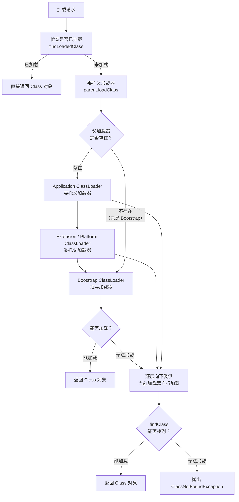

# 反射机制

> 学习路线对应：第1周 -- Java 语言核心
> 前置知识：面向对象基础、类与对象、异常处理
> 预计学习时间：2 天

> **视频章节对应**：尚硅谷宋红康《Java零基础入门教程》第15章-反射机制。本章涵盖反射的基本理解、Class 类的 4 种获取方式、类加载过程与类加载器（含双亲委派模型）、通过反射创建运行时对象、获取类的完整结构（属性、方法、构造器、注解、泛型等）、调用指定属性/方法/构造器、动态代理的原理与实现，以及反射在 Spring IOC/AOP 中的核心应用。

---

## 一、核心概念

### 1.1 反射是什么

反射（Reflection）是 Java 提供的一套运行时（Runtime）类型信息机制，允许程序在运行期间动态地获取任意类的内部信息（属性、方法、构造器、注解、泛型等），并且能够动态地操作这些信息（创建对象、调用方法、修改属性值）。

> **生活化类比：X光透视** -- 正常情况下，你只能看到人的外表，无法看到骨骼、内脏等内部结构（就像正常情况下只能访问对象的 public 成员，私有成员被隐藏）。而X光（反射）可以穿透皮肤，让你看到内部的一切（获取私有属性、方法、构造器），甚至可以进行操作（修改私有字段值、调用私有方法）。`setAccessible(true)` 就像打开了X光机的增强模式，连最深层的结构都能触及。

**核心思想：** 将 Java 类的各个组成部分（属性、方法、构造器等）抽象为对应的 Class 对象（`Field`、`Method`、`Constructor` 等），在运行时通过 Class 对象来读取和操作这些组成部分。

> 📖 **参考链接**：
> - [Oracle Java Tutorial: The Reflection API](https://docs.oracle.com/javase/tutorial/reflect/index.html)
> - [Oracle Java Tutorial: Uses of Reflection（反射的应用场景）](https://docs.oracle.com/javase/tutorial/reflect/index.html)
> - [Java SE 17 API: java.lang.reflect 包](https://docs.oracle.com/javase/17/docs/api/java.base/java/lang/reflect/package-summary.html)

### 1.2 反射核心类体系

```
java.lang.Class<T>                    -- 类的字节码对象，反射的入口
├── java.lang.reflect.Field           -- 类的属性（成员变量）
├── java.lang.reflect.Method          -- 类的方法
├── java.lang.reflect.Constructor<T>  -- 类的构造器
├── java.lang.reflect.Modifier        -- 修饰符工具类（public/private/static 等）
├── java.lang.reflect.Parameter       -- 方法参数信息
├── java.lang.reflect.Array           -- 动态创建和操作数组
│
├── java.lang.reflect.AnnotatedElement（接口）
│   ├── Class
│   ├── Field
│   ├── Method
│   ├── Constructor
│   └── Parameter
│
└── java.lang.reflect.Proxy           -- 动态代理
    └── java.lang.reflect.InvocationHandler  -- 代理调用处理器
```

**反射 API 常用方法速查：**

| 类 | 获取方法 | 作用 |
|------|---------|------|
| **Class** | `forName()` / `.class` / `getClass()` | 获取类对象 |
| **Class** | `newInstance()` / `getDeclaredConstructor().newInstance()` | 创建对象 |
| **Class** | `getFields()` / `getDeclaredFields()` | 获取属性 |
| **Class** | `getMethods()` / `getDeclaredMethods()` | 获取方法 |
| **Class** | `getConstructors()` / `getDeclaredConstructors()` | 获取构造器 |
| **Field** | `set(obj, value)` / `get(obj)` | 读写属性值 |
| **Method** | `invoke(obj, args...)` | 调用方法 |
| **Constructor** | `newInstance(args...)` | 通过构造器创建对象 |

> 📖 **参考链接**：
> - [Oracle Java Tutorial: Classes（Class 对象 API）](https://docs.oracle.com/javase/tutorial/reflect/class/index.html)
> - [Oracle Java Tutorial: Members（Field/Method/Constructor）](https://docs.oracle.com/javase/tutorial/reflect/member/index.html)
> - [Java SE 17 API: Class 类](https://docs.oracle.com/javase/17/docs/api/java.base/java/lang/Class.html)

### 1.3 反射的优缺点

| 维度 | 优点 | 缺点 |
|------|------|------|
| **灵活性** | 运行时动态操作类，无需在编译时确定类型 | 失去了编译期类型检查的安全性 |
| **扩展性** | 框架的核心能力（Spring IOC、MyBatis ORM 等） | 代码可读性下降，调试困难 |
| **通用性** | 编写通用工具（对象拷贝、序列化、ORM 映射） | 性能开销较大（约为直接调用的 10~100 倍） |
| **封装性** | 可以访问私有成员（`setAccessible(true)`） | 破坏封装性，存在安全风险 |

> 📖 **参考链接**：
> - [Oracle Java Tutorial: Drawbacks of Reflection（反射的缺点）](https://docs.oracle.com/javase/tutorial/reflect/index.html)
> - [JLS §7.3: Package java.lang.reflect](https://docs.oracle.com/javase/specs/jls/se17/html/jls-7.html)

### 1.4 与 Python/JS 动态特性对比

| 维度 | Java 反射 | Python | JavaScript |
|------|----------|--------|------------|
| **动态性** | 静态语言 + 反射机制补充 | 天然动态语言 | 天然动态语言 |
| **获取属性** | `field.get(obj)` | `getattr(obj, 'attr')` | `obj['attr']` 或 `obj.attr` |
| **调用方法** | `method.invoke(obj, args)` | `getattr(obj, 'method')(args)` | `obj['method'](args)` |
| **创建对象** | `clazz.newInstance()` | `type(name, bases, dict)()` | `new Function()` / 工厂函数 |
| **类型安全** | 编译期类型检查 + 运行时反射 | 运行时检查 | 运行时检查 |
| **性能** | 反射有额外开销（可优化） | 动态调用有一定开销 | 动态调用有一定开销 |

> 📖 **参考链接**：
> - [Oracle Java Tutorial: The Reflection API（动态特性对比）](https://docs.oracle.com/javase/tutorial/reflect/index.html)
> - [JLS §12: Execution（运行时执行机制）](https://docs.oracle.com/javase/specs/jls/se17/html/jls-12.html)

---

## 二、底层原理

### 2.1 Class 类的 4 种获取方式

```java
// 方式一：Class.forName("全限定类名") -- 最常用，会触发类初始化
Class<?> clazz1 = Class.forName("com.example.Person");

// 方式二：类名.class -- 类字面常量，编译时确定，不会触发初始化
Class<Person> clazz2 = Person.class;

// 方式三：对象.getClass() -- 运行时通过已有对象获取
Person person = new Person();
Class<? extends Person> clazz3 = person.getClass();

// 方式四：类加载器.loadClass() -- 不会触发类初始化
Class<?> clazz4 = ClassLoader.getSystemClassLoader().loadClass("com.example.Person");
```

**四种方式对比：**

| 方式 | 是否触发初始化 | 使用场景 | 泛型支持 |
|------|-------------|---------|---------|
| `Class.forName()` | 是（执行静态代码块） | JDBC 驱动加载等需要初始化的场景 | 通配符 |
| `类名.class` | 否 | 编译时已知类型 | 精确泛型 |
| `对象.getClass()` | 否（对象已存在） | 运行时已有对象实例 | 未知 |
| `ClassLoader.loadClass()` | 否 | 仅加载类不初始化 | 通配符 |

**关键区别：`Class.forName()` vs `ClassLoader.loadClass()`**

```java
// Class.forName()：加载 + 链接 + 初始化（执行 static 代码块）
Class.forName("com.mysql.cj.jdbc.Driver");  // 驱动 static 代码块注册到 DriverManager

// ClassLoader.loadClass()：仅加载（不链接、不初始化）
ClassLoader.getSystemClassLoader().loadClass("com.example.Person"); // static 代码块不执行
```

> 📖 **参考链接**：
> - [Oracle Java Tutorial: Retrieving Class Objects（4 种获取方式）](https://docs.oracle.com/javase/tutorial/reflect/class/classNew.html)
> - [Java SE 17 API: Class.forName](https://docs.oracle.com/javase/17/docs/api/java.base/java/lang/Class.html#forName(java.lang.String))
> - [Java SE 17 API: ClassLoader.loadClass](https://docs.oracle.com/javase/17/docs/api/java.base/java/lang/ClassLoader.html#loadClass(java.lang.String))
> - [JVM Spec §5.3: Loading and the Class Loader Subsystem](https://docs.oracle.com/javase/specs/jvms/se17/html/jvms-5.html#jvms-5.3)

### 2.2 类加载过程

Java 类的完整生命周期：

```
加载（Loading） -> 验证（Verification） -> 准备（Preparation）
    -> 解析（Resolution） -> 初始化（Initialization）
    -> 使用（Using） -> 卸载（Unloading）
```

**各阶段详解：**

| 阶段 | 做什么 | 内存变化 |
|------|--------|---------|
| **加载** | 通过全限定名获取类的二进制字节流；将字节流转换为方法区的运行时数据结构；在堆中生成 `Class` 对象 | 方法区存入类元数据，堆中创建 Class 对象 |
| **验证** | 确保 Class 文件格式正确（魔数 0xCAFEBABE）、字节码语义合法、符号引用可验证 | 无变化 |
| **准备** | 为类变量（static 变量）分配内存并设置零值（如 `int` 为 0，引用为 null） | 方法区分配静态变量内存 |
| **解析** | 将常量池中的符号引用替换为直接引用（内存地址） | 符号引用 -> 直接引用 |
| **初始化** | 执行类构造器 `<clinit>()` 方法：static 变量赋值、static 代码块 | 静态变量赋值 |

**初始化时机（主动引用）：**
- `new` 关键字创建实例
- 访问类的静态变量（非 final 常量）
- 调用类的静态方法
- 反射调用（`Class.forName()`）
- 初始化子类时，父类必须先初始化
- 启动类（main 方法所在类）

> 📖 **参考链接**：
> - [JVM Spec §5: Loading, Linking, and Initializing（类加载全过程）](https://docs.oracle.com/javase/specs/jvms/se17/html/jvms-5.html)
> - [JLS §12.4: Initialization of Classes and Interfaces](https://docs.oracle.com/javase/specs/jls/se17/html/jls-12.html#jls-12.4)
> - [JVM Spec §5.5: Initialization（初始化触发条件）](https://docs.oracle.com/javase/specs/jvms/se17/html/jvms-5.html#jvms-5.5)

### 2.3 类加载器层次结构

```
Bootstrap ClassLoader（启动类加载器）          -- 加载 <JAVA_HOME>/jre/lib/rt.jar 等核心类库
    ↑ 父加载器
Extension / Platform ClassLoader（扩展/平台类加载器） -- 加载 <JAVA_HOME>/jre/lib/ext/ 或 java.ext.dirs
    ↑ 父加载器
Application ClassLoader（应用程序类加载器）     -- 加载 classpath 下的类
    ↑ 父加载器
自定义 ClassLoader（用户自定义类加载器）        -- 加载自定义路径（网络、加密、数据库等）
```

**双亲委派模型（Parent Delegation Model）：**

```
加载流程：
1. 检查该类是否已经被加载过（findLoadedClass）
2. 若未加载，委托父加载器尝试加载（parent.loadClass()）
3. 若父加载器无法加载（返回 ClassNotFoundException），才由当前加载器自行加载（findClass()）
4. 层层向上委托，最终到达 Bootstrap ClassLoader

核心代码（ClassLoader.loadClass()）：
protected Class<?> loadClass(String name, boolean resolve) {
    synchronized (getClassLoadingLock(name)) {
        // 1. 检查是否已加载
        Class<?> c = findLoadedClass(name);
        if (c == null) {
            try {
                // 2. 委托父加载器加载
                if (parent != null) {
                    c = parent.loadClass(name, false);
                } else {
                    c = findBootstrapClassOrNull(name);
                }
            } catch (ClassNotFoundException e) { /* 忽略 */ }
            if (c == null) {
                // 3. 父加载器无法加载，自行加载
                c = findClass(name);
            }
        }
        return c;
    }
}
```

**双亲委派模型的意义：**

| 意义 | 说明 |
|------|------|
| **避免重复加载** | 每个类只被加载一次，由最顶层的加载器加载 |
| **安全隔离** | 核心类库（如 `java.lang.String`）只能由 Bootstrap ClassLoader 加载，防止恶意代码替换核心类 |
| **版本统一** | 确保同一个类在 JVM 中只有一份，避免类型转换异常 |

**打破双亲委派模型：**
- **JDBC（SPI 机制）：** 使用线程上下文类加载器（`Thread.currentThread().getContextClassLoader()`）加载第三方驱动
- **Tomcat：** 每个 Web 应用使用独立的 WebAppClassLoader，优先自行加载，父加载器无法加载时才委托（破坏双亲委派）
- **OSGi：** 网状类加载器结构，每个 Bundle 有独立的类加载器

**双亲委派模型流程图：**



> 上图展示了双亲委派模型的完整流程：加载请求首先检查类是否已被加载，若未加载则逐层向上委托给父加载器，直到顶层的 `Bootstrap ClassLoader`。如果顶层加载器无法加载，则逐层向下委派，由当前加载器自行尝试加载。这种机制确保了核心类库的安全性（如 `java.lang.String` 只能由 `Bootstrap ClassLoader` 加载），同时避免了类的重复加载。

> 📖 **参考链接**：
> - [JVM Spec §5.3: Creating Array Classes & Class Loaders](https://docs.oracle.com/javase/specs/jvms/se17/html/jvms-5.html#jvms-5.3)
> - [Java SE 17 API: ClassLoader（双亲委派实现）](https://docs.oracle.com/javase/17/docs/api/java.base/java/lang/ClassLoader.html)
> - [Oracle Java Tutorial: The ClassLoader Mechanism](https://docs.oracle.com/javase/tutorial/ext/basics/load.html)

### 2.4 通过反射创建运行时对象

```java
// 方式一：Class.newInstance() -- JDK 9 已废弃
Person p1 = Person.class.newInstance();  // 仅调用无参构造器

// 方式二：Constructor.newInstance() -- 推荐方式
// 无参构造器
Constructor<Person> constructor1 = Person.class.getDeclaredConstructor();
Person p2 = constructor1.newInstance();

// 有参构造器
Constructor<Person> constructor2 = Person.class.getDeclaredConstructor(String.class, int.class);
Person p3 = constructor2.newInstance("张三", 25);

// 私有构造器（需要 setAccessible(true)）
Constructor<Person> privateConstructor = Person.class.getDeclaredConstructor(String.class);
privateConstructor.setAccessible(true);  // 突破访问权限
Person p4 = privateConstructor.newInstance("李四");
```

**`newInstance()` 底层原理（以 `Constructor.newInstance()` 为例）：**

1. 检查访问权限（`checkAccess()`），若无权限且 `setAccessible(true)` 被调用过，则通过 `Reflection.getCallerClass()` 验证调用者
2. 获取构造器的参数类型和数量
3. 通过 native 方法 `Unsafe.allocateInstance()` 或 JNI 调用在堆中分配内存
4. 调用构造器方法体初始化对象
5. 返回创建的对象引用

**`setAccessible(true)` 原理：**

```java
// AccessibleObject.setAccessible() 内部逻辑
public void setAccessible(boolean flag) {
    // 将 override 字段设置为 true
    // 后续调用 checkAccess() 时会跳过权限检查
    this.override = flag;
    // 若开启了安全管理器，会调用 ReflectPermission 检查
}
```

`setAccessible(true)` 并非修改了 Java 语言的访问修饰符，而是在反射调用时，告诉 JVM **跳过访问权限检查**。该标志位存储在 `AccessibleObject.override` 字段中。

> 📖 **参考链接**：
> - [Oracle Java Tutorial: Creating Objects via Reflection](https://docs.oracle.com/javase/tutorial/reflect/member/ctorInstance.html)
> - [Java SE 17 API: Constructor.newInstance](https://docs.oracle.com/javase/17/docs/api/java.base/java/lang/reflect/Constructor.html#newInstance(java.lang.Object...))
> - [Java SE 17 API: AccessibleObject.setAccessible](https://docs.oracle.com/javase/17/docs/api/java.base/java/lang/reflect/AccessibleObject.html#setAccessible(boolean))

### 2.5 获取类的完整结构

#### 获取属性（Field）

```java
Class<?> clazz = Person.class;

// 获取所有 public 属性（含继承的）
Field[] publicFields = clazz.getFields();

// 获取本类声明的所有属性（含 private，不含继承的）
Field[] declaredFields = clazz.getDeclaredFields();

// 获取指定名称的 public 属性
Field nameField = clazz.getField("name");

// 获取指定名称的声明属性（含 private）
Field ageField = clazz.getDeclaredField("age");

// 获取属性信息
String fieldName = ageField.getName();                        // 属性名
Class<?> fieldType = ageField.getType();                      // 属性类型
int modifiers = ageField.getModifiers();                      // 修饰符
boolean isPrivate = Modifier.isPrivate(modifiers);            // 判断是否为 private
```

#### 获取方法（Method）

```java
// 获取所有 public 方法（含继承的，含 Object 类方法）
Method[] publicMethods = clazz.getMethods();

// 获取本类声明的所有方法（含 private，不含继承的）
Method[] declaredMethods = clazz.getDeclaredMethods();

// 获取指定方法（需指定方法名和参数类型）
Method method = clazz.getDeclaredMethod("setName", String.class);

// 获取方法信息
String methodName = method.getName();                         // 方法名
Class<?> returnType = method.getReturnType();                 // 返回类型
Class<?>[] paramTypes = method.getParameterTypes();           // 参数类型列表
int methodModifiers = method.getModifiers();                  // 修饰符
Annotation[] annotations = method.getAnnotations();           // 注解
```

#### 获取构造器（Constructor）

```java
// 获取所有 public 构造器
Constructor<?>[] publicConstructors = clazz.getConstructors();

// 获取所有声明的构造器（含 private）
Constructor<?>[] declaredConstructors = clazz.getDeclaredConstructors();

// 获取指定构造器
Constructor<?> constructor = clazz.getDeclaredConstructor(String.class, int.class);
```

#### 获取其他信息

```java
// 注解
Annotation[] classAnnotations = clazz.getAnnotations();
MyAnnotation annotation = clazz.getAnnotation(MyAnnotation.class);

// 父类与接口
Class<?> superClass = clazz.getSuperclass();                  // 父类
Class<?>[] interfaces = clazz.getInterfaces();                 // 实现的接口

// 泛型信息（ParameterizedType）
Type genericSuperclass = clazz.getGenericSuperclass();
if (genericSuperclass instanceof ParameterizedType) {
    Type[] actualTypes = ((ParameterizedType) genericSuperclass).getActualTypeArguments();
    // actualTypes[0] 即为实际的泛型类型参数
}

// 包信息
Package pkg = clazz.getPackage();
String packageName = pkg.getName();
```

> 📖 **参考链接**：
> - [Oracle Java Tutorial: Fields（反射获取属性）](https://docs.oracle.com/javase/tutorial/reflect/member/fieldValues.html)
> - [Oracle Java Tutorial: Methods（反射获取方法）](https://docs.oracle.com/javase/tutorial/reflect/member/methodInvocation.html)
> - [Java SE 17 API: Field](https://docs.oracle.com/javase/17/docs/api/java.base/java/lang/reflect/Field.html)
> - [Java SE 17 API: Method](https://docs.oracle.com/javase/17/docs/api/java.base/java/lang/reflect/Method.html)

### 2.6 调用指定属性、方法、构造器

```java
// ========== 操作属性 ==========
Person person = new Person();
Field nameField = Person.class.getDeclaredField("name");
nameField.setAccessible(true);                   // 突破 private 限制
nameField.set(person, "张三");                    // 设置属性值
String name = (String) nameField.get(person);    // 获取属性值

// 静态属性：obj 参数传 null
Field staticField = Person.class.getDeclaredField("SPECIES");
staticField.setAccessible(true);
staticField.set(null, "Homo Sapiens");

// ========== 调用方法 ==========
Method setNameMethod = Person.class.getDeclaredMethod("setName", String.class);
setNameMethod.invoke(person, "李四");  // 调用实例方法

Method sayHelloMethod = Person.class.getDeclaredMethod("sayHello");
sayHelloMethod.setAccessible(true);
String result = (String) sayHelloMethod.invoke(person);  // 获取返回值

// 静态方法：obj 参数传 null
Method staticMethod = Person.class.getDeclaredMethod("staticMethod");
staticMethod.invoke(null);

// ========== 调用构造器 ==========
Constructor<Person> constructor = Person.class.getDeclaredConstructor(String.class, int.class);
constructor.setAccessible(true);
Person p = constructor.newInstance("王五", 30);
```

**`Method.invoke()` 底层实现：**

```
1. 检查访问权限（checkAccess）
2. 通过 MethodAccessor 进行方法调用
3. MethodAccessor 的实现：
   - 前 15 次调用（默认）：使用 NativeMethodAccessorImpl（JNI 调用，慢）
   - 第 16 次起：自动生成 MethodAccessorImpl 字节码（类似直接调用，快）
   - 阈值可通过 -Dsun.reflect.inflationThreshold=N 调整
4. 最终通过 JNI 调用目标方法
```

> 📖 **参考链接**：
> - [Oracle Java Tutorial: Method Invocation（Method.invoke 原理）](https://docs.oracle.com/javase/tutorial/reflect/member/methodInvocation.html)
> - [Java SE 17 API: Method.invoke](https://docs.oracle.com/javase/17/docs/api/java.base/java/lang/reflect/Method.html#invoke(java.lang.Object,java.lang.Object...))
> - [JVM Spec §5.4.3.3: Method Resolution（方法解析）](https://docs.oracle.com/javase/specs/jvms/se17/html/jvms-5.html#jvms-5.4.3.3)

### 2.7 动态代理原理

#### JDK 动态代理

动态代理（Dynamic Proxy）是 Java 反射的核心应用之一，它允许在运行时动态创建代理类和代理对象，对目标对象的方法调用进行拦截和增强。

**核心角色：**

| 角色 | 说明 |
|------|------|
| **目标对象（Target）** | 被代理的真实对象 |
| **代理对象（Proxy）** | 运行时动态生成的代理实例 |
| **InvocationHandler** | 调用处理器，拦截所有方法调用并执行增强逻辑 |
| **Proxy 类** | 通过 `Proxy.newProxyInstance()` 创建代理对象 |

```java
// 接口
interface UserService {
    void save(String name);
    String findById(int id);
}

// 目标对象
class UserServiceImpl implements UserService {
    public void save(String name) {
        System.out.println("保存用户：" + name);
    }
    public String findById(int id) {
        return "用户" + id;
    }
}

// 动态代理
UserService target = new UserServiceImpl();
UserService proxy = (UserService) Proxy.newProxyInstance(
    target.getClass().getClassLoader(),     // 类加载器
    target.getClass().getInterfaces(),      // 目标对象实现的接口
    new InvocationHandler() {               // 调用处理器
        @Override
        public Object invoke(Object proxy, Method method, Object[] args) throws Throwable {
            System.out.println("【前置增强】日志记录：" + method.getName());
            long start = System.currentTimeMillis();

            Object result = method.invoke(target, args);  // 调用目标方法

            long end = System.currentTimeMillis();
            System.out.println("【后置增强】耗时：" + (end - start) + "ms");
            return result;
        }
    }
);

proxy.save("张三");
// 输出：
// 【前置增强】日志记录：save
// 保存用户：张三
// 【后置增强】耗时：0ms
```

**JDK 动态代理底层原理：**

```
1. Proxy.newProxyInstance() 调用流程：
   - 查找或生成代理类 Class 对象（getProxyClass0）
   - 通过 ProxyClassFactory 生成代理类字节码
   - 使用 native 方法 defineClass0 加载代理类
   - 通过代理类的构造器（参数为 InvocationHandler）创建实例

2. 生成的代理类结构（$Proxy0 反编译）：
   public final class $Proxy0 extends Proxy implements UserService {
       private static Method m3;  // save 方法
       private static Method m4;  // findById 方法

       static {
           m3 = Class.forName("UserService").getMethod("save", String.class);
           m4 = Class.forName("UserService").getMethod("findById", int.class);
       }

       public $Proxy0(InvocationHandler h) { super(h); }

       public final void save(String name) {
           // 调用 InvocationHandler.invoke()
           h.invoke(this, m3, new Object[]{name});
       }

       public final String findById(int id) {
           return (String) h.invoke(this, m4, new Object[]{id});
       }
   }

3. 代理类继承 Proxy 类，实现目标接口
4. 所有方法调用都转发到 InvocationHandler.invoke()
```

**JDK 动态代理的限制：** 只能代理实现了接口的类，不能代理没有接口的类。

> 📖 **参考链接**：
> - [Oracle Java Tutorial: Proxy Class（动态代理）](https://docs.oracle.com/javase/8/docs/technotes/guides/reflection/proxy.html)
> - [Java SE 17 API: Proxy.newProxyInstance](https://docs.oracle.com/javase/17/docs/api/java.base/java/lang/reflect/Proxy.html#newProxyInstance(java.lang.ClassLoader,java.lang.Class[],java.lang.reflect.InvocationHandler))
> - [Java SE 17 API: InvocationHandler](https://docs.oracle.com/javase/17/docs/api/java.base/java/lang/reflect/InvocationHandler.html)

#### CGLIB 动态代理

CGLIB（Code Generation Library）通过继承目标类来生成代理子类，不需要接口。

```java
// 不需要接口
class UserService {
    public void save(String name) {
        System.out.println("保存用户：" + name);
    }
}

// CGLIB 代理
Enhancer enhancer = new Enhancer();
enhancer.setSuperclass(UserService.class);       // 设置父类
enhancer.setCallback(new MethodInterceptor() {    // 方法拦截器
    @Override
    public Object intercept(Object obj, Method method, Object[] args,
                            MethodProxy proxy) throws Throwable {
        System.out.println("【前置增强】");
        Object result = proxy.invokeSuper(obj, args);  // 调用父类方法
        System.out.println("【后置增强】");
        return result;
    }
});

UserService proxy = (UserService) enhancer.create();
proxy.save("张三");
```

**JDK 动态代理 vs CGLIB 动态代理：**

| 维度 | JDK 动态代理 | CGLIB 动态代理 |
|------|------------|--------------|
| **实现原理** | 基于接口，生成实现接口的代理类 | 基于继承，生成目标类的子类 |
| **要求** | 目标类必须实现接口 | 目标类不能是 final（`final` 类无法继承） |
| **代理方法** | 仅代理接口中定义的方法 | 代理所有非 final 方法 |
| **性能** | 创建代理对象快，调用略慢 | 创建代理对象慢（生成字节码），调用快 |
| **Spring 选择** | 默认策略：有接口用 JDK 代理，无接口用 CGLIB |
| **Spring Boot** | Spring Boot 2.x 起默认使用 CGLIB（`spring.aop.proxy-target-class=true`） |

> 📖 **参考链接**：
> - [Spring Framework Reference: AOP - Proxying Mechanisms](https://docs.spring.io/spring-framework/reference/core/aop/proxying.html)
> - [CGLIB GitHub Repository](https://github.com/cglib/cglib)
> - [Java SE 17 API: Proxy 类](https://docs.oracle.com/javase/17/docs/api/java.base/java/lang/reflect/Proxy.html)

---

## 三、实战应用

### 3.1 通用对象属性拷贝工具

```java
public class BeanUtils {
    /**
     * 通过反射实现对象属性拷贝（浅拷贝）
     */
    public static void copyProperties(Object source, Object target) {
        Class<?> sourceClass = source.getClass();
        Class<?> targetClass = target.getClass();

        for (Field sourceField : sourceClass.getDeclaredFields()) {
            try {
                String fieldName = sourceField.getName();
                Field targetField = targetClass.getDeclaredField(fieldName);

                // 类型必须匹配
                if (!sourceField.getType().equals(targetField.getType())) {
                    continue;
                }

                sourceField.setAccessible(true);
                targetField.setAccessible(true);

                Object value = sourceField.get(source);
                targetField.set(target, value);
            } catch (NoSuchFieldException | IllegalAccessException e) {
                // 忽略不匹配的字段
            }
        }
    }
}
```

> 📖 **参考链接**：
> - [Oracle Java Tutorial: Setting Field Values（属性拷贝）](https://docs.oracle.com/javase/tutorial/reflect/member/fieldValues.html)
> - [Spring Framework: BeanUtils.copyProperties](https://docs.spring.io/spring-framework/docs/current/javadoc-api/org/springframework/beans/BeanUtils.html)

### 3.2 配置文件驱动的工厂模式

```java
// config.properties
// userService=com.example.UserServiceImpl
// orderService=com.example.OrderServiceImpl

public class BeanFactory {
    private static Properties props = new Properties();

    static {
        try (InputStream in = BeanFactory.class
                .getClassLoader().getResourceAsStream("config.properties")) {
            props.load(in);
        } catch (IOException e) {
            throw new RuntimeException("加载配置文件失败", e);
        }
    }

    /**
     * 根据配置文件中的类名，通过反射创建对象
     */
    public static Object getBean(String name) {
        String className = props.getProperty(name);
        if (className == null) {
            throw new RuntimeException("未找到 Bean 配置：" + name);
        }
        try {
            Class<?> clazz = Class.forName(className);
            return clazz.getDeclaredConstructor().newInstance();
        } catch (Exception e) {
            throw new RuntimeException("创建 Bean 失败：" + className, e);
        }
    }
}

// 使用
UserService userService = (UserService) BeanFactory.getBean("userService");
```

> 📖 **参考链接**：
> - [Oracle Java Tutorial: Creating Objects via Reflection（工厂模式）](https://docs.oracle.com/javase/tutorial/reflect/member/ctorInstance.html)
> - [Spring Framework: BeanFactory](https://docs.spring.io/spring-framework/docs/current/javadoc-api/org/springframework/beans/factory/BeanFactory.html)

### 3.3 注解处理器（模拟 @Autowired 注入）

```java
// 自定义注解
@Retention(RetentionPolicy.RUNTIME)
@Target(ElementType.FIELD)
@interface AutoWired { }

// 简易 IOC 容器
class SimpleIocContainer {
    private Map<String, Object> beans = new HashMap<>();

    public void registerBean(String name, Object bean) {
        beans.put(name, bean);
    }

    @SuppressWarnings("unchecked")
    public <T> T getBean(Class<T> clazz) {
        // 通过反射创建对象并注入依赖
        try {
            T instance = clazz.getDeclaredConstructor().newInstance();
            injectDependencies(instance);
            return instance;
        } catch (Exception e) {
            throw new RuntimeException("创建 Bean 失败", e);
        }
    }

    /**
     * 通过反射扫描 @AutoWired 注解并注入依赖
     */
    private void injectDependencies(Object bean) throws Exception {
        Class<?> clazz = bean.getClass();
        for (Field field : clazz.getDeclaredFields()) {
            if (field.isAnnotationPresent(AutoWired.class)) {
                field.setAccessible(true);
                Class<?> fieldType = field.getType();
                Object dependency = beans.values().stream()
                    .filter(b -> fieldType.isAssignableFrom(b.getClass()))
                    .findFirst()
                    .orElseThrow(() -> new RuntimeException("未找到依赖：" + fieldType));
                field.set(bean, dependency);
            }
        }
    }
}
```

> 📖 **参考链接**：
> - [Oracle Java Tutorial: Annotations（注解处理）](https://docs.oracle.com/javase/tutorial/reflect/member/fieldValues.html)
> - [Spring Framework: @Autowired 实现原理](https://docs.spring.io/spring-framework/reference/core/beans/annotation-config/autowired.html)
> - [Java SE 17 API: Field.getAnnotation](https://docs.oracle.com/javase/17/docs/api/java.base/java/lang/reflect/Field.html#getAnnotation(java.lang.Class))

### 3.4 反射在 Spring IOC 中的应用

Spring IOC（控制反转）容器是整个 Spring 框架的核心，其底层大量依赖反射机制。理解反射在 Spring 中的应用，有助于深入理解 Spring 的工作原理。

#### Spring IOC 中反射的应用场景

| 场景 | 反射 API | 说明 |
|------|---------|------|
| **Bean 实例化** | `Class.forName()` / `Constructor.newInstance()` | 根据配置的类名创建 Bean 实例 |
| **依赖注入** | `Field.set()` / `Method.invoke()` | 通过反射将依赖对象注入到目标 Bean 中 |
| **@Autowired 处理** | `Field.getAnnotation()` / `Method.getAnnotation()` | 扫描注解标记的字段和方法 |
| **@PostConstruct 处理** | `Method.invoke()` | 调用初始化方法 |
| **@PreDestroy 处理** | `Method.invoke()` | 调用销毁方法 |
| **BeanFactory 后处理** | 动态代理 + 反射 | 创建 AOP 代理、处理 BeanPostProcessor |

**Spring Bean 实例化核心流程（简化版）：**

```java
// 模拟 Spring 的 Bean 创建过程
public class SpringBeanFactory {
    private final Map<String, BeanDefinition> beanDefinitionMap = new ConcurrentHashMap<>();
    private final Map<String, Object> singletonObjects = new ConcurrentHashMap<>();

    /**
     * 创建 Bean 的核心流程（简化版）
     */
    public Object createBean(String beanName, BeanDefinition bd) {
        // 1. 加载类
        Class<?> beanClass = Class.forName(bd.getBeanClassName());

        // 2. 实例化（通过反射调用构造器）
        Object bean = beanClass.getDeclaredConstructor().newInstance();

        // 3. 属性填充（依赖注入）
        for (PropertyValue pv : bd.getPropertyValues()) {
            Field field = beanClass.getDeclaredField(pv.getName());
            field.setAccessible(true);
            // 若属性是引用类型，递归创建依赖 Bean
            Object value = pv.isRef() ? getBean(pv.getRefBeanName()) : pv.getValue();
            field.set(bean, value);
        }

        // 4. 初始化（调用 @PostConstruct 方法）
        invokeInitMethods(bean, beanClass);

        // 5. 注册到单例池
        singletonObjects.put(beanName, bean);

        return bean;
    }

    private void invokeInitMethods(Object bean, Class<?> beanClass) {
        for (Method method : beanClass.getDeclaredMethods()) {
            if (method.isAnnotationPresent(PostConstruct.class)) {
                method.setAccessible(true);
                method.invoke(bean);
            }
        }
    }
}
```

> 📖 **参考链接**：
> - [Spring Framework Reference: Bean Lifecycle & IOC](https://docs.spring.io/spring-framework/reference/core/beans/definition.html)
> - [Spring Framework: BeanDefinition](https://docs.spring.io/spring-framework/docs/current/javadoc-api/org/springframework/beans/factory/config/BeanDefinition.html)
> - [Oracle Java Tutorial: Class.forName（Bean 实例化）](https://docs.oracle.com/javase/tutorial/reflect/class/classNew.html)

### 3.5 反射在 Spring AOP 中的应用

Spring AOP（面向切面编程）是反射和动态代理的经典应用。Spring AOP 在运行时通过动态代理为目标对象创建代理，将横切关注点（日志、事务、权限等）织入目标方法。

#### Spring AOP 代理选择策略

```
AopProxy 接口
├── JdkDynamicAopProxy       -- 基于 JDK 动态代理（目标类实现了接口）
└── CglibAopProxy            -- 基于 CGLIB 代理（目标类无接口）
```

**Spring AOP 核心流程（简化版）：**

```java
// 模拟 Spring AOP 的代理创建与拦截过程
public class SimpleAopProxy {
    /**
     * 创建 AOP 代理
     */
    public static Object createProxy(Object target, List<MethodInterceptor> interceptors) {
        Class<?> targetClass = target.getClass();

        if (targetClass.getInterfaces().length > 0) {
            // 有接口 -> JDK 动态代理
            return Proxy.newProxyInstance(
                targetClass.getClassLoader(),
                targetClass.getInterfaces(),
                (proxy, method, args) -> {
                    // 执行拦截器链
                    return invokeInterceptorChain(target, method, args, interceptors);
                }
            );
        } else {
            // 无接口 -> CGLIB 代理（此处简化为 JDK 代理示意）
            // 实际 Spring 使用 CGLIB Enhancer
            throw new UnsupportedOperationException("需要 CGLIB 支持");
        }
    }

    /**
     * 执行拦截器链（责任链模式）
     */
    private static Object invokeInterceptorChain(Object target, Method method,
                                                  Object[] args,
                                                  List<MethodInterceptor> interceptors)
            throws Throwable {
        // 构建调用链：拦截器1 -> 拦截器2 -> ... -> 目标方法
        MethodInvocation invocation = new MethodInvocation(target, method, args, interceptors);
        return invocation.proceed();
    }
}

class MethodInvocation {
    private final Object target;
    private final Method method;
    private final Object[] args;
    private final List<MethodInterceptor> interceptors;
    private int currentIndex = -1;

    MethodInvocation(Object target, Method method, Object[] args,
                     List<MethodInterceptor> interceptors) {
        this.target = target;
        this.method = method;
        this.args = args;
        this.interceptors = interceptors;
    }

    public Object proceed() throws Throwable {
        currentIndex++;
        if (currentIndex == interceptors.size()) {
            // 所有拦截器执行完毕，调用目标方法
            return method.invoke(target, args);
        }
        // 执行下一个拦截器
        return interceptors.get(currentIndex).invoke(this);
    }
}
```

**Spring AOP 中反射的完整调用链：**

```
1. 客户端调用代理对象的方法
2. JdkDynamicAopProxy.invoke() 拦截调用
3. 获取 Advisor 链（切面通知列表）
4. 构建 ReflectiveMethodInvocation（含 Method 对象）
5. 递归执行拦截器链（proceed()）
6. 最终通过 method.invoke(target, args) 调用目标方法（反射调用）
7. 返回结果
```

**Spring 事务管理的 AOP 实现（核心原理）：**

```java
// Spring @Transactional 的底层实现依赖 AOP + 反射
// 简化示意：
@Around("@annotation(transactional)")
public Object around(ProceedingJoinPoint joinPoint) throws Throwable {
    // 1. 开启事务（通过反射获取 DataSource）
    Connection conn = dataSource.getConnection();
    conn.setAutoCommit(false);
    try {
        // 2. 执行目标方法（通过反射调用）
        Object result = joinPoint.proceed();
        // 3. 提交事务
        conn.commit();
        return result;
    } catch (Exception e) {
        // 4. 回滚事务
        conn.rollback();
        throw e;
    }
}
```

> 📖 **参考链接**：
> - [Spring Framework Reference: AOP（Spring AOP 实现）](https://docs.spring.io/spring-framework/reference/core/aop.html)
> - [Spring Framework Reference: Transactions（@Transactional 实现）](https://docs.spring.io/spring-framework/reference/data-access/transaction/declarative.html)
> - [Oracle Java Tutorial: Proxy Class（动态代理原理）](https://docs.oracle.com/javase/8/docs/technotes/guides/reflection/proxy.html)

---

## 四、常见面试题（附答案）

### 1. 什么是反射？反射的原理是什么？优缺点？

**反射**是 Java 提供的一种运行时机制，允许程序在运行期间动态获取类的信息（属性、方法、构造器等）并操作它们。

**原理：** JVM 在加载类时会在方法区存储类的元数据，并在堆中创建对应的 `Class` 对象。反射通过 `Class` 对象读取方法区中的元数据，通过 `Field`、`Method`、`Constructor` 等类封装这些元数据，并提供操作接口。

**优点：**
- 运行时动态性：无需编译时确定类型
- 框架核心能力：Spring IOC、MyBatis ORM、JSON 序列化等框架的基础
- 编写通用工具：对象拷贝、Bean 映射、注解处理

**缺点：**
- 性能开销：反射调用比直接调用慢 10~100 倍（可通过 `setAccessible(true)` 和缓存优化）
- 破坏封装性：可以访问私有成员
- 失去编译期类型检查：运行时才能发现类型错误
- 代码可读性：反射代码晦涩难懂，调试困难

### 2. `Class.forName()` 和 `ClassLoader.loadClass()` 的区别？

| 维度 | `Class.forName()` | `ClassLoader.loadClass()` |
|------|-------------------|--------------------------|
| **是否初始化** | 会执行类的初始化（执行 static 代码块） | 仅加载类，不执行初始化 |
| **参数** | 全限定类名 | 全限定类名 |
| **典型场景** | JDBC 驱动加载（需要 static 代码块注册驱动） | Spring IOC 延迟加载 Bean 类 |
| **底层实现** | 调用 `forName0(className, true, classLoader)`（第二个参数 true 表示初始化） | 调用 `loadClass(name, false)`（第二个参数 false 表示不解析） |

**JDBC 驱动为何用 `Class.forName()`：**

```java
// MySQL 驱动类中的 static 代码块
public class Driver extends NonRegisteringDriver implements java.sql.Driver {
    static {
        try {
            DriverManager.registerDriver(new Driver());  // 注册驱动
        } catch (SQLException e) {
            throw new RuntimeException("注册驱动失败");
        }
    }
}

// 使用 Class.forName() 触发 static 代码块，完成驱动注册
Class.forName("com.mysql.cj.jdbc.Driver");
```

### 3. JDK 动态代理和 CGLIB 动态代理的区别？Spring 如何选择？

| 维度 | JDK 动态代理 | CGLIB 动态代理 |
|------|------------|--------------|
| **实现原理** | 基于接口，生成实现接口的 `$Proxy` 类 | 基于继承，生成目标类的子类 |
| **要求** | 目标类必须实现至少一个接口 | 目标类不能是 `final` 类，方法不能是 `final` |
| **代理范围** | 仅代理接口中定义的方法 | 代理所有非 `final` 方法 |
| **创建速度** | 快（无需生成字节码类） | 慢（需要生成和加载字节码） |
| **调用速度** | 略慢（反射调用接口方法） | 快（直接调用父类方法） |
| **底层依赖** | JDK 内置 `java.lang.reflect.Proxy` | 第三方库（Spring 已内嵌） |

**Spring 选择策略：**
- Spring 4.x：默认 JDK 动态代理（有接口时），`proxy-target-class="true"` 切换为 CGLIB
- Spring Boot 2.x：默认 CGLIB 代理（`spring.aop.proxy-target-class=true` 为默认值）

### 4. 反射在 Spring 框架中有哪些应用？

| Spring 模块 | 反射应用 |
|------------|---------|
| **IOC 容器** | 通过 `Class.forName()` 加载 Bean 类；通过 `Constructor.newInstance()` 创建 Bean 实例；通过 `Field.set()` 实现依赖注入 |
| **AOP** | 通过 JDK 动态代理 / CGLIB 创建代理对象；通过 `Method.invoke()` 调用目标方法 |
| **@Autowired** | 通过反射扫描 `@Autowired` 注解标记的字段和方法，自动注入依赖 |
| **@Transactional** | 通过 AOP + 反射拦截方法调用，在方法前后开启/提交/回滚事务 |
| **Spring MVC** | 通过反射将 HTTP 请求参数绑定到 Controller 方法参数（`@RequestParam`、`@PathVariable`） |
| **Bean 生命周期** | 通过反射调用 `@PostConstruct` 和 `@PreDestroy` 标记的方法 |
| **Spring Data JPA** | 通过反射解析实体类的注解（`@Entity`、`@Table`、`@Column`），生成 SQL 并映射结果集 |

### 5. 如何通过反射破坏单例？如何防御？

```java
// 单例类
public class Singleton {
    private static final Singleton INSTANCE = new Singleton();
    private Singleton() {
        // 防御反射攻击
        if (INSTANCE != null) {
            throw new RuntimeException("单例已存在，不允许反射创建");
        }
    }
    public static Singleton getInstance() {
        return INSTANCE;
    }
}

// 反射攻击
Constructor<Singleton> constructor = Singleton.class.getDeclaredConstructor();
constructor.setAccessible(true);
Singleton instance2 = constructor.newInstance();  // 破坏单例！

// 防御方式一：在构造器中抛异常（如上）
// 防御方式二：使用枚举实现单例（JVM 层面禁止反射创建枚举实例）
public enum EnumSingleton {
    INSTANCE;
    public void doSomething() { }
}
// 枚举单例反射攻击时会抛出 IllegalArgumentException
```

**枚举单例防御原理：** `Constructor.newInstance()` 源码中会检查是否为枚举类型，若是则抛出 `IllegalArgumentException("Cannot reflectively create enum objects")`。

> 📖 **参考链接**：
> - [Oracle Java Tutorial: The Reflection API（面试题核心知识）](https://docs.oracle.com/javase/tutorial/reflect/index.html)
> - [JLS §8.9: Enum Types（枚举单例防御）](https://docs.oracle.com/javase/specs/jls/se17/html/jls-8.html#jls-8.9)
> - [Java SE 17 API: Constructor.newInstance（枚举检查逻辑）](https://docs.oracle.com/javase/17/docs/api/java.base/java/lang/reflect/Constructor.html#newInstance(java.lang.Object...))

---

## 五、避坑指南

| 常见错误 | 现象 | 原因 | 解决方案 |
|---------|------|------|---------|
| `ClassNotFoundException` | 反射加载类失败 | 类名拼写错误、类不在 classpath 中、依赖未引入 | 检查全限定类名是否正确；确认依赖已引入 Maven/Gradle；使用 `ClassLoader.getResource()` 验证类路径 |
| `NoSuchMethodException` | 获取方法/构造器失败 | 方法名或参数类型不匹配；`getMethod()` 只能获取 public 方法 | 使用 `getDeclaredMethod()` 获取私有方法；确认参数类型完全匹配（`int.class` 与 `Integer.class` 不同） |
| `IllegalAccessException` | 无权限访问私有成员 | 未调用 `setAccessible(true)` | 在访问私有成员前调用 `field.setAccessible(true)` 或 `method.setAccessible(true)` |
| `InvocationTargetException` | 反射调用的方法内部抛出异常 | 目标方法内部出现异常，被反射包装 | 调用 `InvocationTargetException.getTargetException()` 获取原始异常 |
| 反射性能问题 | 高频调用反射时代码变慢 | 反射调用比直接调用慢 10~100 倍 | 缓存 `Class`/`Method`/`Field` 对象；调用 `setAccessible(true)` 关闭安全检查；考虑使用 `MethodHandle`（JDK 7+）或 `LambdaMetafactory`（JDK 8+）替代 |
| 泛型擦除 | 反射获取不到泛型实际类型 | Java 泛型在编译后擦除，运行时不可见 | 通过 `ParameterizedType` 获取继承/实现场景中的泛型信息；无法获取局部变量的泛型 |
| JDK 9+ 模块化限制 | `setAccessible(true)` 失败，抛出 `InaccessibleObjectException` | Java 模块系统（JPMS）限制了对内部 API 的反射访问 | 添加 JVM 参数 `--add-opens java.base/java.lang=ALL-UNNAMED`；避免反射访问 JDK 内部 API |
| `Class.newInstance()` 已废弃 | JDK 9+ 编译器警告 | `newInstance()` 将异常包装为 `InstantiationException`，丢失原始异常 | 使用 `clazz.getDeclaredConstructor().newInstance()` 替代（JDK 9+） |
| 反射修改 `final` 字段失效 | 通过反射修改 `final` 字段后值未变 | JIT 编译器将 `final` 字段内联为常量，修改不生效 | 避免反射修改 `final` 字段；若必须修改，先通过反射获取 Field 并修改 `modifiers`（极端做法，不推荐） |

---

## 本章学习自检

完成本章学习后，应该能够：
- [ ] 用自己的话解释反射的本质：运行时读取元数据并操作类的组成
- [ ] 手写 Class 的 4 种获取方式并说明其区别（`forName` / `.class` / `getClass` / `loadClass`）
- [ ] 画出类加载器的层次结构图，解释双亲委派模型的流程和意义
- [ ] 手写通过反射创建对象、调用方法、访问属性的代码
- [ ] 手写 JDK 动态代理示例，理解 `Proxy` 和 `InvocationHandler` 的工作原理
- [ ] 解释反射在 Spring IOC（Bean 创建、依赖注入）和 AOP（动态代理、方法拦截）中的应用
- [ ] 说出 JDK 动态代理和 CGLIB 代理的区别和适用场景
- [ ] 回答常见面试题（反射原理、`forName` vs `loadClass`、动态代理、Spring 中的应用等）

---

> **学习导航**：
> - 返回 [学习路线总览](../../README.md)
> - 前置学习：[05-面向对象基础](./05-面向对象基础.md) | [07-常用类与基础API](./07-常用类与基础API.md)
> - 后续学习：[13-多线程与并发编程](../jvm-juc/13-多线程与并发编程.md) | [14-JVM原理与调优](../jvm-juc/14-JVM原理与调优.md)
> - 本模块其他文件：[17-Java核心笔面试题集](../jvm-juc/17-Java核心笔面试题集.md)
> - 实战应用：[电商订单实时统计分析平台](../../extensions/project/01-电商订单实时统计分析平台.md)