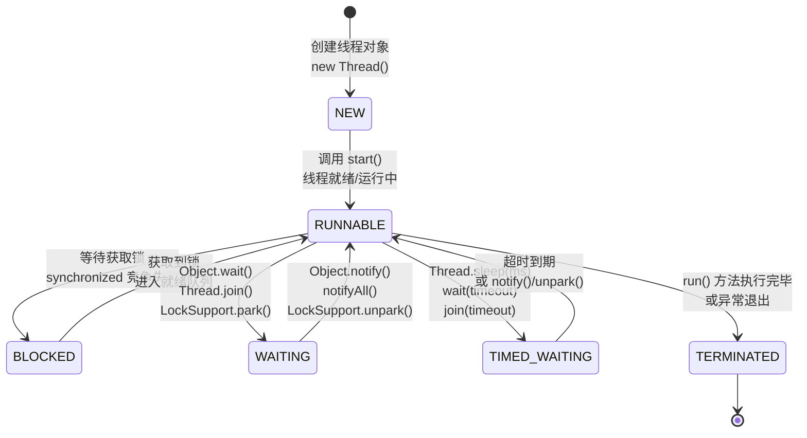
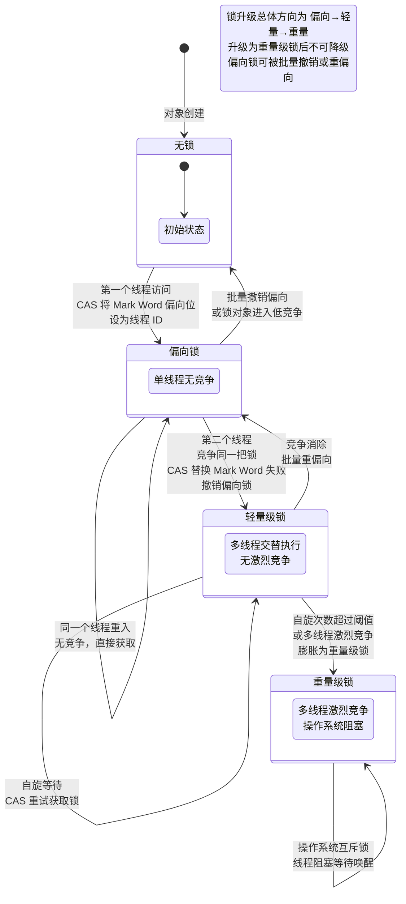

# 多线程与并发编程

> 学习路线对应：第1周 -- Java 语言核心
> 前置知识：面向对象、集合框架
> 预计学习时间：2-3 天

## 一、核心概念

### 1.1 线程创建方式

| 方式 | 说明 | 使用场景 |
|------|------|---------|
| 继承 `Thread` | 重写 `run()` 方法 | 简单任务，不需要返回值 |
| 实现 `Runnable` | 实现 `run()` 方法，传入 Thread | 需要共享资源，无返回值 |
| 实现 `Callable` | 实现 `call()` 方法，返回 `Future` | 需要返回值或抛出异常 |
| 线程池 | 通过 `ThreadPoolExecutor` 管理 | 生产环境推荐，复用线程 |

```java
// 推荐方式：使用线程池
ExecutorService executor = Executors.newFixedThreadPool(5);
Future<String> future = executor.submit(() -> {
    // 有返回值的任务
    return "result";
});
```

> 📖 **参考链接**：
> - [Oracle Java Concurrency Tutorial: Defining and Starting a Thread](https://docs.oracle.com/javase/tutorial/essential/concurrency/runthread.html)
> - [Java SE 17 API: java.lang.Thread](https://docs.oracle.com/javase/17/docs/api/java.base/java/lang/Thread.html)
> - [JEP 444: Virtual Threads](https://openjdk.org/jeps/444) -- JDK 21 虚拟线程，线程创建的新范式

### 1.2 线程状态（6 种）

```
NEW -> RUNNABLE -> BLOCKED -> WAITING -> TIMED_WAITING -> TERMINATED
```

| 状态 | 说明 | 进入方式 |
|------|------|---------|
| **NEW** | 线程创建但未启动 | `new Thread()` |
| **RUNNABLE** | 可运行（包括运行中 + 就绪） | `thread.start()` |
| **BLOCKED** | 等待获取锁 | `synchronized` 竞争失败 |
| **WAITING** | 无限期等待 | `Object.wait()`、`Thread.join()`、`LockSupport.park()` |
| **TIMED_WAITING** | 限时等待 | `Thread.sleep()`、`wait(timeout)`、`join(timeout)` |
| **TERMINATED** | 线程执行完毕 | `run()` 方法结束 |

**线程状态转换图：**



> 上图展示了 Java 线程的 6 种状态及其转换关系。线程从 `NEW` 状态开始，调用 `start()` 后进入 `RUNNABLE` 状态。`RUNNABLE` 是核心状态，既可以因锁竞争进入 `BLOCKED`，也可以因主动等待进入 `WAITING` 或 `TIMED_WAITING`，最终执行完毕后进入 `TERMINATED` 状态。其中 `WAITING` 和 `TIMED_WAITING` 的区别在于是否有超时限制。

> 📖 **参考链接**：
> - [Java SE 17 API: Thread.State 枚举](https://docs.oracle.com/javase/17/docs/api/java.base/java/lang/Thread.State.html)
> - [Oracle Java Concurrency Tutorial: Thread Objects](https://docs.oracle.com/javase/tutorial/essential/concurrency/threads.html)
> - [JLS §17: Threads and Locks](https://docs.oracle.com/javase/specs/jls/se17/html/jls-17.html)

### 1.3 与 Node.js 对比

| 维度 | Java | Node.js |
|------|------|---------|
| 并发模型 | 多线程（操作系统线程） | 单线程事件循环 + Worker Threads |
| CPU 密集型 | 利用多核，线程并行 | 需要 Worker Threads 或 child_process |
| I/O 密集型 | 线程池处理 | 天然异步非阻塞 |
| 数据共享 | 共享内存（需同步） | 消息传递（无共享状态） |
| 上下文切换 | 有开销 | 事件循环，几乎无开销 |

> 📖 **参考链接**：
> - [Oracle Java Concurrency Tutorial: Processes and Threads](https://docs.oracle.com/javase/tutorial/essential/concurrency/procthread.html)
> - [JEP 444: Virtual Threads](https://openjdk.org/jeps/444) -- 虚拟线程缩小了 Java 与 Node.js 在 I/O 密集型场景的差距

---

## 二、底层原理

### 2.1 synchronized 原理

**对象头与 Monitor：**

- 每个 Java 对象都有一个 Monitor 锁，存储在对象头（Mark Word）中
- `synchronized` 代码块编译后对应 `monitorenter` 和 `monitorexit` 指令

**锁升级过程（JDK 6+）：**

```
无锁 -> 偏向锁 -> 轻量级锁 -> 重量级锁
```

| 锁状态 | 说明 | 触发条件 |
|--------|------|---------|
| **无锁** | 初始状态 | 对象刚创建 |
| **偏向锁** | 偏向第一个获取锁的线程，CAS 设置线程 ID | 单线程反复获取锁 |
| **轻量级锁** | 线程通过 CAS 自旋获取锁 | 多线程交替执行（无竞争） |
| **重量级锁** | 操作系统的互斥锁（Mutex Lock） | 多线程激烈竞争，自旋超过阈值 |

> **生活化类比：小区门禁系统** -- 把锁升级过程想象成小区门禁的三种模式：
> - **偏向锁**：就像你家只有你一个人住，门禁系统记住你的脸，每次你进出自动开门，不需要任何验证（无竞争，极低开销）。
> - **轻量级锁**：就像家里来了室友，两个人轮流进出。门禁需要确认"当前谁在里面"，通过快速刷卡（CAS自旋）来切换，但不用叫保安（不阻塞线程）。
> - **重量级锁**：就像办公楼大堂，很多人排队进出。需要保安（操作系统互斥锁）来管理，排队的人要在旁边等着（线程阻塞），保安叫到你才能进（线程唤醒），开销大但能保证秩序。

**锁升级方向：** 偏向锁 -> 轻量级锁 -> 重量级锁，其中升级为重量级锁后不可降级（但偏向锁可被批量撤销或重偏向）。

**锁升级状态机：**



> 上图展示了 synchronized 锁升级的状态机：对象初始为无锁状态，第一个线程访问时升级为偏向锁（仅记录线程 ID，无实际同步开销）；出现竞争时撤销偏向锁、升级为轻量级锁（CAS 自旋重试）；竞争激烈或自旋超限时进一步膨胀为重量级锁（操作系统互斥锁，线程阻塞唤醒）。锁升级是单向不可逆的，但偏向锁可被批量撤销。

> 📖 **参考链接**：
> - [JLS §17.1: Synchronization](https://docs.oracle.com/javase/specs/jls/se17/html/jls-17.html#jls-17.1)
> - [Oracle Java Concurrency Tutorial: Intrinsic Locks and Synchronization](https://docs.oracle.com/javase/tutorial/essential/concurrency/locksync.html)
> - [JVM Specification §2.11.10: Synchronization](https://docs.oracle.com/javase/specs/jvms/se17/html/jvms-2.html#jvms-2.11.10)
> - [JEP 374: Disable and Deprecate Biased Locking](https://openjdk.org/jeps/374) -- JDK 15 废弃偏向锁

### 2.2 AQS（AbstractQueuedSynchronizer）原理

AQS 是 Java 并发包（JUC）的基石，`ReentrantLock`、`Semaphore`、`CountDownLatch`、`ReentrantReadWriteLock` 等都基于 AQS 实现。

> **生活化类比：银行排队叫号系统** -- AQS 就像银行大堂的排队叫号系统：
> - **state 状态变量**：记录当前还有多少个叫号（可用许可数），或者哪个窗口正在办理业务（独占锁）。
> - **CLH 等待队列**：就像叫号机拉出的排队队列，先来先服务。叫到号的去办理业务，剩下的在座位上坐着等（线程阻塞）。
> - **唤醒机制**：当前一个人办完业务，叫号机叫下一个人进来（唤醒队列中第一个等待线程）。不管是独占模式（一个窗口只服务一个人）还是共享模式（多个窗口同时服务），都能有序处理。

**核心三要素：**

```
1. state 变量（volatile int）：表示同步状态
   - ReentrantLock：0 = 未锁，1 = 已锁，>1 = 重入次数
   - Semaphore：当前可用许可数
   - CountDownLatch：剩余计数

2. CLH 队列（双向链表）：存储等待获取锁的线程
   - 队首节点是正在运行的线程
   - 后续节点是等待的线程

3. 独占/共享模式：
   - 独占模式（EXCLUSIVE）：同时只有一个线程能获取锁（ReentrantLock）
   - 共享模式（SHARED）：多个线程可以同时获取（Semaphore、CountDownLatch）
```

**AQS 内部 CLH 队列结构（ASCII 示意图）：**

```
    AQS 同步器
+---------------------------------------------------------------+
|  state (volatile int)  -- 同步状态                             |
|  exclusiveOwnerThread  -- 当前持有独占锁的线程                   |
|  head  -- 指向 CLH 队列头部（哨兵节点 / 当前持有锁的线程）          |
|  tail  -- 指向 CLH 队列尾部（最后入队的等待线程）                  |
+---------------------------------------------------------------+
                              |
                              v
    CLH 双向队列（FIFO）
+-------------------+       +-------------------+       +-------------------+
|     Node A        |       |     Node B        |       |     Node C        |
|   (head 哨兵)     | <---> |   (等待线程 T2)    | <---> |   (等待线程 T3)    |
|                   |       |                   |       |                   |
| waitStatus: 0/-1  |       | waitStatus: -1    |       | waitStatus: 0     |
| thread: null      |       | thread: T2        |       | thread: T3        |
|  --> 唤醒后继节点  |       |  --> 处于 SIGNAL   |       |  --> 正在入队      |
+-------------------+       +-------------------+       +-------------------+
   ^                                                         ^
   |  head                                                    |  tail
   |                                                          |
+---------------------------------------------------------------+

节点状态 (waitStatus) 说明：
  SIGNAL (-1)  : 后继节点需要被唤醒，当前节点释放锁时唤醒后继
  CANCELLED (1): 节点因超时/中断被取消，等待被 GC 回收
  CONDITION(-2): 节点在 Condition 条件队列中等待
  PROPAGATE(-3): 共享模式下，释放锁需传播到下一个节点
  0 (默认)      : 初始状态

获取锁流程：
  tryAcquire(arg) 尝试获取锁
    --> 成功：设置 exclusiveOwnerThread = 当前线程，返回
    --> 失败：addWaiter() 将当前线程包装为 Node 加入队尾
              --> acquireQueued() 自旋尝试获取锁
                  --> 前驱是 head 且 tryAcquire 成功：设自己为 head
                  --> 否则：shouldParkAfterFailedAcquire() 检查是否需要 park
                      --> 需要：parkAndCheckInterrupt() 阻塞当前线程
```

**ReentrantLock 基于 AQS 的实现：**

```java
// ReentrantLock 内部类 Sync 继承 AQS
abstract static class Sync extends AbstractQueuedSynchronizer {
    // 非公平锁尝试获取
    final boolean nonfairTryAcquire(int acquires) {
        final Thread current = Thread.currentThread();
        int c = getState();
        if (c == 0) {
            if (compareAndSetState(0, acquires)) {
                setExclusiveOwnerThread(current);
                return true;
            }
        } else if (current == getExclusiveOwnerThread()) {
            // 重入：state + acquires
            int nextc = c + acquires;
            setState(nextc);
            return true;
        }
        return false;
    }
}
```

> 📖 **参考链接**：
> - [Java SE 17 API: AbstractQueuedSynchronizer](https://docs.oracle.com/javase/17/docs/api/java.base/java/util/concurrent/locks/AbstractQueuedSynchronizer.html)
> - [Java SE 17 API: ReentrantLock](https://docs.oracle.com/javase/17/docs/api/java.base/java/util/concurrent/locks/ReentrantLock.html)
> - [Oracle Java Concurrency Tutorial: Lock Objects](https://docs.oracle.com/javase/tutorial/essential/concurrency/newlocks.html)

### 2.3 volatile 原理

**volatile 三大特性：**

> **生活化类比：公司公告栏** -- 把 volatile 想象成公司的公告栏：
> - 一个员工（线程）更新了公告（修改了 volatile 变量），所有其他员工（其他线程）立即就能看到最新内容（可见性）。
> - 如果没有公告栏，每个员工自己记笔记，信息可能还是旧的。公告栏保证所有人看到的都是最新版本。
> - 公告栏不允许多人同时写公告的时候打乱顺序写（禁止指令重排序），保证写的内容是连贯完整的。

| 特性 | 说明 |
|------|------|
| **可见性** | 一个线程修改 volatile 变量后，其他线程立即可见 |
| **禁止指令重排序** | 通过内存屏障（Memory Barrier）防止指令重排 |
| **不保证原子性** | `i++` 这样的复合操作不是原子的 |

**内存屏障（Memory Barrier）：**

- **StoreStore 屏障：** 禁止前面的普通写与后面的 volatile 写重排序
- **StoreLoad 屏障：** 禁止前面的 volatile 写与后面的 volatile 读重排序
- **LoadLoad 屏障：** 禁止后面的普通读与前面的 volatile 读重排序
- **LoadStore 屏障：** 禁止后面的普通写与前面的 volatile 读重排序

**经典应用：DCL（双重检查锁定）中的 volatile**

```java
public class Singleton {
    // volatile 禁止指令重排序
    private static volatile Singleton instance;

    public static Singleton getInstance() {
        if (instance == null) {                    // 第一次检查
            synchronized (Singleton.class) {
                if (instance == null) {            // 第二次检查
                    instance = new Singleton();     // 可能发生指令重排
                }
            }
        }
        return instance;
    }
}
```

`new Singleton()` 实际分为三步：① 分配内存空间 ② 调用构造器初始化对象 ③ 将 instance 引用指向内存空间。若无 volatile，步骤 ② 和 ③ 可能被重排序，导致其他线程获取到未初始化的对象。

> 📖 **参考链接**：
> - [JLS §17.4: Memory Model](https://docs.oracle.com/javase/specs/jls/se17/html/jls-17.html#jls-17.4)
> - [JLS §8.3.1.4: volatile Fields](https://docs.oracle.com/javase/specs/jls/se17/html/jls-8.html#jls-8.3.1.4)
> - [Oracle Java Concurrency Tutorial: Atomic Access](https://docs.oracle.com/javase/tutorial/essential/concurrency/atomic.html)

### 2.4 CAS 原理

**CAS（Compare And Swap，比较并交换）：**

> **生活化类比：停车场抢车位** -- CAS 就像停车场抢车位：
> - 你开车去停车场，看到一个空位（预期值A）。你告诉停车场系统"我要占这个位置"，系统检查一下，如果位置确实还是空的（当前值还是A），就给你占了（更新为新值B），CAS 成功。
> - 如果刚好被别人抢先停了（当前值变成了C），系统告诉你"被占了"，你得重新找位置（CAS 失败，一般自旋重试）。
> - 整个抢车位过程由停车场管理系统原子保证，不会两个人同时抢到同一个车位。

```java
// Unsafe 类中的 CAS 方法（native 实现）
public final native boolean compareAndSwapInt(Object o, long offset,
                                               int expected, int x);
```

**三个操作数：**
- 内存位置 V
- 预期原值 A
- 新值 B

**执行逻辑：** 如果 V 的值等于 A，则将 V 更新为 B；否则不做任何操作。整个过程由 CPU 的 CMPXCHG 指令保证原子性。

**ABA 问题：**

```
初始值 A -> 线程1 读取到 A -> 线程2 改为 B -> 线程2 改回 A -> 线程1 CAS 成功
线程1 不知道值曾经变为 B，可能产生错误！
```

**解决方案：** 使用 `AtomicStampedReference`（版本号）或 `AtomicMarkableReference`（布尔标记）。

> 📖 **参考链接**：
> - [Java SE 17 API: java.util.concurrent.atomic 包](https://docs.oracle.com/javase/17/docs/api/java.base/java/util/concurrent/atomic/package-summary.html)
> - [Oracle Java Concurrency Tutorial: Atomic Variables](https://docs.oracle.com/javase/tutorial/essential/concurrency/atomicvars.html)
> - [JEP 193: Variable Handles](https://openjdk.org/jeps/193) -- JDK 9 增强的原子操作 API

### 2.5 ThreadLocal 原理

**数据结构：**

```
每个 Thread 对象内部有一个 ThreadLocalMap
ThreadLocalMap 的 key 是 ThreadLocal 的弱引用（WeakReference）
ThreadLocalMap 的 value 是存储的值（强引用）
```

```java
// Thread 类
public class Thread {
    ThreadLocal.ThreadLocalMap threadLocals = null;
}

// ThreadLocalMap 内部
static class ThreadLocalMap {
    static class Entry extends WeakReference<ThreadLocal<?>> {
        Object value; // 强引用
        Entry(ThreadLocal<?> k, Object v) {
            super(k);
            value = v;
        }
    }
}
```

**内存泄漏风险：**

```
ThreadLocal 被 GC 回收后（弱引用 key 变为 null）
   -> Entry 的 key = null
   -> value 无法被回收（强引用）
   -> 只要 Thread 存活，value 就一直存在
   -> 内存泄漏！
```

**解决方案：** 每次使用完 ThreadLocal 后，在 `finally` 块中调用 `remove()` 方法。

```java
ThreadLocal<SimpleDateFormat> tl = ThreadLocal.withInitial(
    () -> new SimpleDateFormat("yyyy-MM-dd"));
try {
    return tl.get().format(date);
} finally {
    tl.remove(); // 必须清理！
}
```

**ThreadLocal 使用场景：**
- 数据库连接管理（每个线程持有独立的 Connection）
- Session 管理
- 链路追踪（TraceId 传递）
- 避免 SimpleDateFormat 线程安全问题

> 📖 **参考链接**：
> - [Java SE 17 API: ThreadLocal](https://docs.oracle.com/javase/17/docs/api/java.base/java/lang/ThreadLocal.html)
> - [JEP 446: Scoped Values (Preview)](https://openjdk.org/jeps/446) -- JDK 21 引入 Scoped Values 作为 ThreadLocal 的现代替代方案
> - [Oracle Java Concurrency Tutorial: High Level Concurrency Objects](https://docs.oracle.com/javase/tutorial/essential/concurrency/highlevel.html)

---

## 三、实战应用

### 3.1 线程池参数配置

> **生活化类比：外卖骑手团队** -- 线程池就像外卖平台的骑手团队：
> - **核心线程数**：就是平台养的全职骑手，不管有没有单，都一直待命，随时可以接单。
> - **最大线程数**：平台允许的最大骑手总数，高峰期可以临时招兼职骑手帮忙，但总人数不能超过上限。
> - **工作队列**：就是待配送订单的排队队列，骑手都忙的时候，新来的订单先排队等。
> - **keepAliveTime**：兼职骑手如果一直没单，超过这个时间就可以下班了，省成本。
> - **拒绝策略**：订单太多，队列满了，骑手也不够了，怎么处理（直接拒单让顾客自己等，还是商家自己送）。

```java
// 注意：ThreadFactoryBuilder 来自 Guava 库（com.google.common.util.concurrent）
// 若未引入 Guava，可自定义 ThreadFactory 或使用 Executors.defaultThreadFactory()
ThreadPoolExecutor executor = new ThreadPoolExecutor(
    corePoolSize,          // 核心线程数
    maximumPoolSize,       // 最大线程数
    keepAliveTime,         // 非核心线程空闲存活时间
    TimeUnit.SECONDS,      // 时间单位
    new ArrayBlockingQueue<>(1000), // 有界队列
    new ThreadFactoryBuilder().setNameFormat("my-pool-%d").build(),
    new ThreadPoolExecutor.CallerRunsPolicy() // 拒绝策略
);
```

**参数调优公式：**

| 任务类型 | 线程数公式 |
|---------|-----------|
| CPU 密集型 | `CPU 核心数 + 1` |
| I/O 密集型 | `CPU 核心数 * 2` |
| 精确公式 | `CPU 核心数 * 目标利用率 * (1 + 等待时间/计算时间)` |

> 📖 **参考链接**：
> - [Java SE 17 API: ThreadPoolExecutor](https://docs.oracle.com/javase/17/docs/api/java.base/java/util/concurrent/ThreadPoolExecutor.html)
> - [Oracle Java Concurrency Tutorial: Thread Pools](https://docs.oracle.com/javase/tutorial/essential/concurrency/pools.html)
> - [JEP 266: More Concurrency Updates](https://openjdk.org/jeps/266) -- JDK 9 并发更新

### 3.2 4 种线程池及适用场景

| 线程池 | 特点 | 风险 | 适用场景 |
|--------|------|------|---------|
| **FixedThreadPool** | 固定大小，无界队列 | 队列可能 OOM | 负载稳定的场景 |
| **CachedThreadPool** | 可扩容，SynchronousQueue | 线程数可能 OOM | 短时大量任务 |
| **SingleThreadExecutor** | 单线程，无界队列 | 队列可能 OOM | 顺序执行场景 |
| **ScheduledThreadPool** | 支持定时/周期执行 | 线程数可能 OOM | 定时任务 |

**重要：** 阿里规约禁止使用 `Executors` 工厂方法创建线程池，必须使用 `ThreadPoolExecutor` 构造器显式指定有界队列。

> 📖 **参考链接**：
> - [Java SE 17 API: Executors](https://docs.oracle.com/javase/17/docs/api/java.base/java/util/concurrent/Executors.html)
> - [Oracle Java Concurrency Tutorial: Executors](https://docs.oracle.com/javase/tutorial/essential/concurrency/executors.html)

### 3.3 CompletableFuture 异步编程

```java
// 1. 异步执行
CompletableFuture<String> future = CompletableFuture.supplyAsync(() -> {
    return "Hello";
}, executor);

// 2. 链式处理
future.thenApply(String::toUpperCase)        // 转换结果
      .thenAccept(System.out::println)        // 消费结果
      .thenRun(() -> System.out.println("完成")); // 不关心结果

// 3. 组合多个异步任务
CompletableFuture<String> f1 = CompletableFuture.supplyAsync(() -> "Hello");
CompletableFuture<String> f2 = CompletableFuture.supplyAsync(() -> "World");
CompletableFuture<String> combined = f1.thenCombine(f2, (s1, s2) -> s1 + " " + s2);

// 4. 异常处理
future.exceptionally(ex -> {
    log.error("任务失败", ex);
    return "默认值";
});

// 5. 等待所有任务完成
CompletableFuture.allOf(f1, f2, f3).join();
```

> 📖 **参考链接**：
> - [Java SE 17 API: CompletableFuture](https://docs.oracle.com/javase/17/docs/api/java.base/java/util/concurrent/CompletableFuture.html)
> - [JEP 266: More Concurrency Updates](https://openjdk.org/jeps/266) -- CompletableFuture 的增强
> - [Oracle Java Concurrency Tutorial: High Level Concurrency Objects](https://docs.oracle.com/javase/tutorial/essential/concurrency/highlevel.html)

---

## 四、常见面试题（附答案）

### 1. synchronized 和 Lock 的区别？

| 维度 | synchronized | Lock（ReentrantLock） |
|------|-------------|----------------------|
| 层面 | JVM 关键字 | API 层面（java.util.concurrent） |
| 锁释放 | 自动释放（代码块退出或异常） | 需手动 `unlock()`（finally 块） |
| 可中断 | 不可中断 | 可中断（`lockInterruptibly()`） |
| 公平锁 | 非公平 | 可选公平/非公平 |
| 超时获取 | 不支持 | 支持（`tryLock(timeout)`） |
| 多条件 | 单一条件 | 多个 Condition |
| 性能 | JDK 6+ 优化后接近 | 略高但差距不大 |

> 📖 **参考链接**：
> - [Java SE 17 API: ReentrantLock](https://docs.oracle.com/javase/17/docs/api/java.base/java/util/concurrent/locks/ReentrantLock.html)
> - [JLS §17.1: Synchronization](https://docs.oracle.com/javase/specs/jls/se17/html/jls-17.html#jls-17.1)

### 2. volatile 能保证原子性吗？DCL 为什么需要 volatile？

**volatile 不能保证原子性。** `i++` 是三步操作（读 -> 加 -> 写），volatile 只保证可见性和禁止重排序，不保证原子性。

**DCL 需要 volatile 的原因：** `instance = new Singleton()` 可能被指令重排序。若无 volatile，步骤二（初始化对象）和步骤三（引用指向内存）可能颠倒，导致其他线程获取到未初始化的对象。

> 📖 **参考链接**：
> - [JLS §17.4: Memory Model](https://docs.oracle.com/javase/specs/jls/se17/html/jls-17.html#jls-17.4)
> - [JLS §8.3.1.4: volatile Fields](https://docs.oracle.com/javase/specs/jls/se17/html/jls-8.html#jls-8.3.1.4)

### 3. 线程池的 7 个参数？拒绝策略有哪些？

**7 个参数：** `corePoolSize`、`maximumPoolSize`、`keepAliveTime`、`unit`、`workQueue`、`threadFactory`、`handler`

**执行流程：** 核心线程 -> 工作队列 -> 最大线程 -> 拒绝策略

**4 种拒绝策略：**

| 策略 | 行为 |
|------|------|
| **AbortPolicy**（默认） | 抛出 `RejectedExecutionException` |
| **CallerRunsPolicy** | 由调用者线程执行任务 |
| **DiscardPolicy** | 静默丢弃任务 |
| **DiscardOldestPolicy** | 丢弃队首任务，重新提交 |

> 📖 **参考链接**：
> - [Java SE 17 API: ThreadPoolExecutor](https://docs.oracle.com/javase/17/docs/api/java.base/java/util/concurrent/ThreadPoolExecutor.html)
> - [Oracle Java Concurrency Tutorial: Thread Pools](https://docs.oracle.com/javase/tutorial/essential/concurrency/pools.html)

### 4. ThreadLocal 内存泄漏的原因和解决方案？

**原因：** ThreadLocalMap 的 Entry 中 key 是 ThreadLocal 的弱引用，value 是强引用。当 ThreadLocal 被 GC 回收后，key 变为 null，但 value 作为强引用无法被回收。只要线程存活，这些 value 就一直占用内存。

**解决方案：**
1. 每次使用完 ThreadLocal 后，在 `finally` 块中调用 `remove()` 方法
2. ThreadLocal 本身也检查并清理 key 为 null 的 Entry（expungeStaleEntry），但不保证完全清理

> 📖 **参考链接**：
> - [Java SE 17 API: ThreadLocal](https://docs.oracle.com/javase/17/docs/api/java.base/java/lang/ThreadLocal.html)
> - [JEP 446: Scoped Values (Preview)](https://openjdk.org/jeps/446) -- ThreadLocal 的现代替代方案

---

## 五、避坑指南

| 常见错误 | 现象 | 原因 | 解决方案 |
|---------|------|------|---------|
| 使用 Executors 创建线程池 | 高并发时 OOM | newFixedThreadPool 使用无界 LinkedBlockingQueue；newCachedThreadPool 的 maximumPoolSize 为 Integer.MAX_VALUE | 使用 ThreadPoolExecutor 构造器 + 有界队列（如 ArrayBlockingQueue）+ 合理拒绝策略 |
| 静态共享 SimpleDateFormat | 日期解析结果错乱 | SimpleDateFormat 非线程安全，多线程共享会出错 | 使用 ThreadLocal 包装；使用 DateTimeFormatter（Java 8+，线程安全）；每次创建新实例 |
| submit() 不处理 Future | 任务异常被静默吞没，无日志 | submit() 的异常封装在 Future 中，不调用 get() 则异常无法感知 | 调用 future.get() 并捕获 ExecutionException；在任务内部 try-catch 并记录日志 |
| 线程池未优雅关闭 | 应用停止时任务丢失或线程泄漏 | 直接 shutdownNow() 可能中断正在执行的任务 | 先 shutdown() 不再接受新任务，awaitTermination 等待完成，超时后再 shutdownNow() 强制关闭 |

---

> **学习导航**：
> - 返回 [学习路线总览](../../README.md)
> - 前置学习：[05-面向对象基础](../java-core/05-面向对象基础.md) | [08-面向对象与集合框架](../java-core/08-面向对象与集合框架.md)
> - 本模块其他文件：[17-Java核心笔面试题集](./17-Java核心笔面试题集.md)
> - 实战应用：[电商订单实时统计分析平台](../../extensions/project/01-电商订单实时统计分析平台.md)

