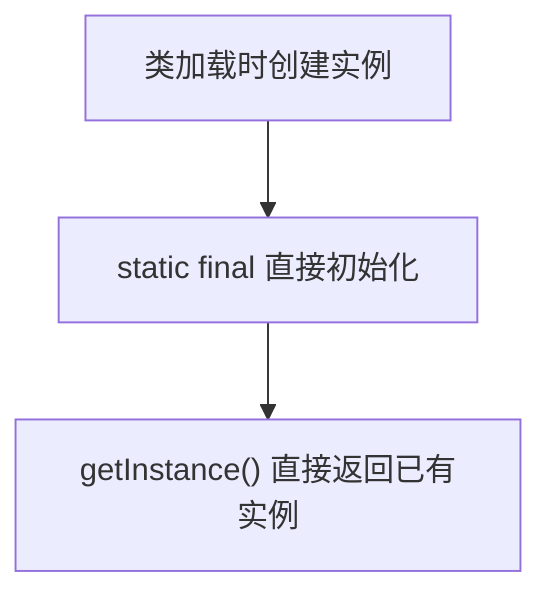
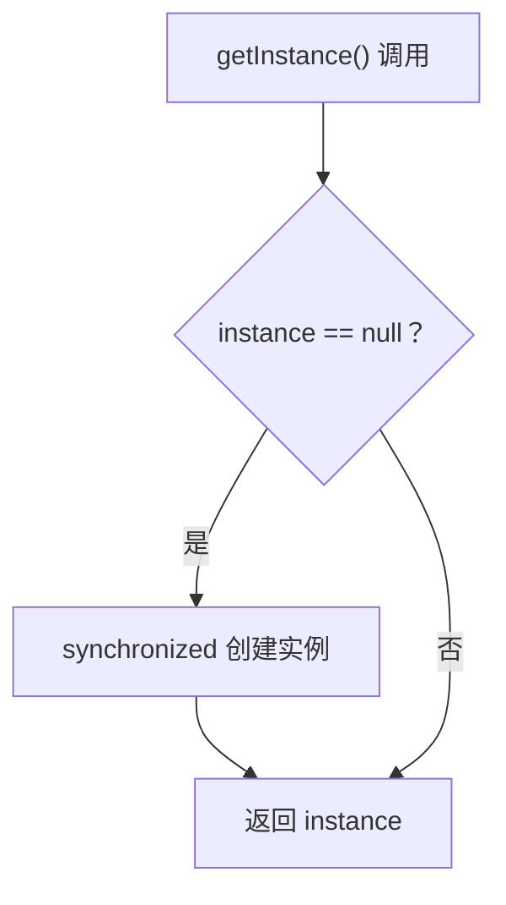
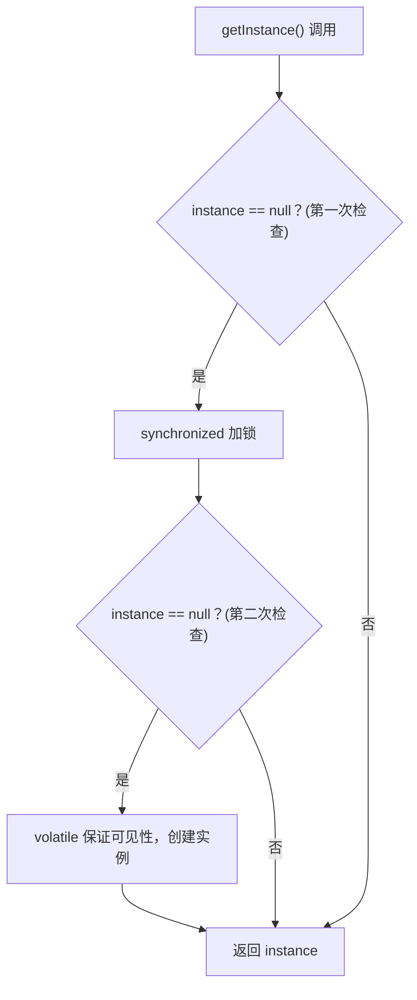
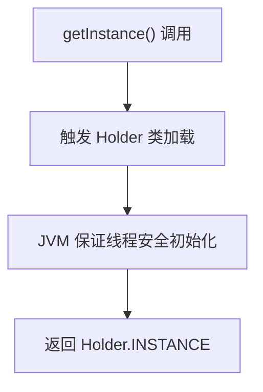
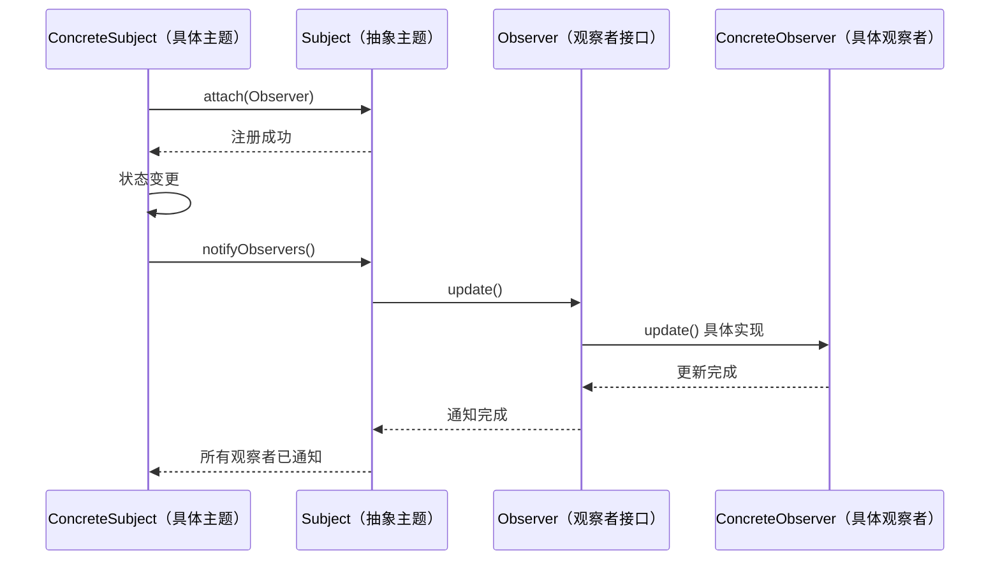

# 设计模式与 Spring 框架应用

> 模块：01-java-core（第1周 Java 核心）
> 定位：Java 后端面试高频考点，理解设计模式在 Spring 框架中的应用

---

## 一、核心概念

### 1.1 什么是设计模式

设计模式是软件开发中反复出现的问题的通用解决方案。GoF（Gang of Four）总结了 23 种经典设计模式，分为三类：创建型、结构型、行为型。Java 后端面试中最高频考察的是**单例、工厂、策略、代理、模板方法**五种模式。

> **生活化类比：菜谱与烹饪** -- 设计模式就像菜谱：
> - 创建型模式（5 种）= 食材准备方式：怎么把食材组合在一起做成一道菜（怎么创建对象）。
> - 结构型模式（7 种）= 摆盘与装盘技巧：如何把不同的菜品组合摆放在餐桌上，既美观又实用（如何组合类和对象）。
> - 行为型模式（11 种）= 烹饪流程与分工：谁负责切菜、谁负责炒菜、上菜的顺序和规则（对象之间的职责分配和交互）。
> - 你不需要每次做菜都从零发明配方，前人总结的经典菜谱（设计模式）能帮你少走弯路。

> 📖 **参考链接**：
> - [Refactoring Guru: Design Patterns 入门](https://refactoring.guru/design-patterns/what-is-pattern)
> - [Refactoring Guru: Pattern Classification](https://refactoring.guru/design-patterns/classification)
> - [Refactoring Guru: Pattern Catalog](https://refactoring.guru/design-patterns/catalog)

### 1.2 为什么面试必考设计模式

- 设计模式是衡量代码设计能力的核心指标
- Spring 框架本身就是设计模式的最佳实践集合
- 实际项目中合理的模式应用能大幅提升代码可维护性

> 📖 **参考链接**：
> - [Refactoring Guru: Why Learn Patterns](https://refactoring.guru/design-patterns/why-learn-patterns)
> - [Refactoring Guru: Pattern History](https://refactoring.guru/design-patterns/history)

---

## 二、五种核心设计模式

### 2.1 单例模式（Singleton）

**定义**：确保一个类只有一个实例，并提供一个全局访问点。

> **生活化类比：国家总统** -- 单例模式就像一个国家的总统：
> - 一个国家（JVM）只能有一位总统（实例），不管你在哪个城市访问，拿到的都是同一个人。
> - 总统不是随时都站在那等你（懒加载），但一旦选出（初始化），所有人都能找到他（全局访问点）。
> - 选举过程必须严格防作弊（线程安全），不能选出两个总统。DCL 的双重检查就像"先看有没有总统（第一次检查），没有才启动选举程序（synchronized），进去后再确认一次（第二次检查）"。

**五种实现方式对比**：

| 实现方式 | 线程安全 | 懒加载 | 反序列化安全 | 推荐度 |
|---------|:---:|:---:|:---:|:---:|
| 饿汉式 | ✅ | ❌ | ❌ | ★★ |
| 懒汉式（synchronized） | ✅ | ✅ | ❌ | ★ |
| 双重检查锁定（DCL） | ✅ | ✅ | ❌ | ★★★★ |
| 静态内部类 | ✅ | ✅ | ❌ | ★★★★★ |
| 枚举 | ✅ | ❌ | ✅ | ★★★★★ |

**双重检查锁定（DCL）代码**：

```java
public class Singleton {
    // volatile 防止指令重排序
    private static volatile Singleton instance;

    private Singleton() {
        // 防止反射破坏单例
        if (instance != null) {
            throw new RuntimeException("单例已存在");
        }
    }

    public static Singleton getInstance() {
        if (instance == null) {              // 第一次检查：避免不必要的同步
            synchronized (Singleton.class) {
                if (instance == null) {      // 第二次检查：确保只创建一个实例
                    instance = new Singleton();
                }
            }
        }
        return instance;
    }
}
```

**为什么需要 volatile**：`new Singleton()` 不是原子操作，分为三步：分配内存 → 初始化对象 → 将引用指向内存。JVM 可能指令重排序为 1→3→2，导致其他线程拿到未初始化的对象。volatile 禁止指令重排序。

**静态内部类实现**：

```java
public class Singleton {
    private Singleton() {}
    
    private static class Holder {
        private static final Singleton INSTANCE = new Singleton();
    }
    
    public static Singleton getInstance() {
        return Holder.INSTANCE;  // 类加载时初始化，天然线程安全
    }
}
```

**Spring 中的单例**：Spring 容器管理的 Bean 默认是单例（singleton scope），通过 ConcurrentHashMap 缓存单例对象。

**四种单例模式创建流程对比：**

### 饿汉式

> 类加载时即创建实例，通过 static final 直接初始化，getInstance() 直接返回已有实例。



### 懒汉式（synchronized）

> 首次调用 getInstance() 时才创建实例，通过 synchronized 保证线程安全，但每次调用都需要同步。



### DCL 双重检查锁定

> 双重检查锁定在性能和懒加载间取得平衡，第一次检查避免不必要的同步，第二次检查确保只创建一个实例，volatile 防止指令重排序。



### 静态内部类

> 利用 JVM 类加载机制实现延迟加载和线程安全，Holder 类在首次使用时才被加载，JVM 保证类初始化过程的线程安全。



> 四种单例模式各有适用场景：饿汉式简单但可能浪费内存；懒汉式按需创建但性能差；DCL 双重检查锁定在性能和懒加载间取得平衡，需要 volatile 防止指令重排序；静态内部类利用 JVM 类加载机制实现延迟加载和线程安全，是最推荐的实现方式之一。

> 📖 **参考链接**：
> - [Refactoring Guru: Singleton Pattern](https://refactoring.guru/design-patterns/singleton)
> - [JLS §17.7: Non-atomic Treatment of double and long](https://docs.oracle.com/javase/specs/jls/se17/html/jls-17.html#jls-17.7) -- volatile 与可见性
> - [JEP 374: Disable and Deprecate Biased Locking](https://openjdk.org/jeps/374) -- JDK 15 锁优化变化

### 2.2 工厂模式（Factory）

> **生活化类比：汽车制造厂** -- 工厂模式就像汽车 $4S$ 店的订车流程：
> - **简单工厂**：你到 $4S$ 店说"我要一辆SUV"，店员直接从仓库给你提一辆（根据参数决定创建哪种产品）。但店里来了新款就得改流程（违反开闭原则）。
> - **工厂方法**：每个品牌有自己的专卖店。你到大众店买大众，到丰田店买丰田（每个工厂只负责一种产品）。新增品牌只需新开一家店，不用改其他店。
> - **抽象工厂**：你到一家"汽车集团旗舰店"，可以一次买齐一整套"大众系列"（轿车+SUV+MPV）或"丰田系列"（轿车+SUV+MPV）。一个工厂创建一整族相关产品。

**三种工厂模式对比**：

| 模式 | 产品等级 | 产品族 | 复杂度 | 典型场景 |
|------|:---:|:---:|:---:|------|
| 简单工厂 | 单一 | 无 | 低 | 根据参数创建不同产品 |
| 工厂方法 | 单一 | 无 | 中 | 延迟到子类决定创建哪个产品 |
| 抽象工厂 | 多个 | 多个 | 高 | 创建一系列相关产品 |

**简单工厂示例**：

```java
// 违反开闭原则：新增产品需修改工厂类
public class AnimalFactory {
    public static Animal create(String type) {
        switch (type) {
            case "dog": return new Dog();
            case "cat": return new Cat();
            default: throw new IllegalArgumentException();
        }
    }
}
```

**工厂方法示例**：

```java
// 符合开闭原则：新增产品只需新增工厂子类
public interface AnimalFactory {
    Animal create();
}

public class DogFactory implements AnimalFactory {
    public Animal create() { return new Dog(); }
}
```

**Spring 中的工厂**：`BeanFactory` 和 `FactoryBean` 是工厂方法的经典应用。`BeanFactory` 是 IoC 容器的顶层接口，定义了获取 Bean 的工厂方法。`FactoryBean<T>` 允许自定义 Bean 的创建逻辑。

> 📖 **参考链接**：
> - [Refactoring Guru: Factory Method Pattern](https://refactoring.guru/design-patterns/factory-method)
> - [Refactoring Guru: Abstract Factory Pattern](https://refactoring.guru/design-patterns/abstract-factory)
> - [Java SE 17 API: java.util.function.Supplier](https://docs.oracle.com/javase/17/docs/api/java.base/java/util/function/Supplier.html) -- 函数式工厂

### 2.3 策略模式（Strategy）

**定义**：定义一系列算法，把它们封装起来，使它们可以相互替换。

> **生活化类比：出行方式选择** -- 策略模式就像手机上的出行 App：
> - 你要从家到公司，可以选择骑共享单车（AliPayStrategy）、坐地铁（WeChatPayStrategy）、打网约车（UnionPayStrategy）。
> - 无论选哪种方式，最终目的都是"到达公司"（策略接口 `pay()`），但具体的路线和体验完全不同。
> - 不需要每次出门都写一堆 if-else 判断"天气好骑车、赶时间打车、下雨坐地铁"——你只需要在 App 上切换一个按钮（注入不同策略），出行逻辑就自动变了。
> - 新增"直升机出行"也不用改原有代码，新建一个策略类即可（开闭原则）。

**代码示例**：

```java
// 策略接口
public interface PaymentStrategy {
    void pay(BigDecimal amount);
}

// 具体策略
public class AliPayStrategy implements PaymentStrategy {
    public void pay(BigDecimal amount) {
        System.out.println("支付宝支付：" + amount);
    }
}

public class WeChatPayStrategy implements PaymentStrategy {
    public void pay(BigDecimal amount) {
        System.out.println("微信支付：" + amount);
    }
}

// 上下文
public class PaymentContext {
    private PaymentStrategy strategy;
    
    public PaymentContext(PaymentStrategy strategy) {
        this.strategy = strategy;
    }
    
    public void pay(BigDecimal amount) {
        strategy.pay(amount);
    }
}

// 使用：消除 if-else
PaymentStrategy strategy = new AliPayStrategy();
PaymentContext context = new PaymentContext(strategy);
context.pay(new BigDecimal("100"));
```

**Spring 中的策略模式**：
- `Resource` 接口：不同资源类型（ClassPath、FileSystem、URL）有不同的实现策略
- `InstantiationStrategy`：Bean 实例化策略（SimpleInstantiationStrategy、CglibSubclassingInstantiationStrategy）
- Spring Security 的 `AuthenticationProvider`：不同认证方式（DaoAuthenticationProvider、LdapAuthenticationProvider）

> 📖 **参考链接**：
> - [Refactoring Guru: Strategy Pattern](https://refactoring.guru/design-patterns/strategy)
> - [Java SE 17 API: java.util.Comparator](https://docs.oracle.com/javase/17/docs/api/java.base/java/util/Comparator.html) -- JDK 中的策略模式经典应用
> - [Java SE 17 API: java.util.function 包](https://docs.oracle.com/javase/17/docs/api/java.base/java/util/function/package-summary.html) -- 函数式接口与策略

### 2.4 代理模式（Proxy）

**定义**：为其他对象提供一个代理，以控制对这个对象的访问。

> **生活化类比：房产中介与明星经纪人** -- 代理模式就像租房时的房产中介：
> - 你想租房（目标对象），但不直接找房东，而是通过中介（代理）。中介帮你看房、谈价格、签合同——你在中介这里享受的服务和直接找房东一样（实现相同接口）。
> - 中介可以在看房前帮你筛选房源（前置增强），签合同后帮你验房（后置增强），这些是房东自己做不了或不愿意做的。
> - **静态代理**：你专门找了一个固定的中介公司，每次都找同一个中介（手动编写代理类）。
> - **JDK 动态代理**：中介平台根据你的需求临时指派一个中介（运行时生成代理），但要求房东必须有营业执照（必须实现接口）。
> - **CGLIB 代理**：黑中介直接克隆一个房东帮你办事（通过继承生成子类），不需要营业执照（不要求接口）。

**静态代理 vs 动态代理**：

| 维度 | 静态代理 | JDK 动态代理 | CGLIB 动态代理 |
|------|---------|------------|--------------|
| 实现方式 | 手动编写代理类 | Proxy.newProxyInstance | Enhancer + MethodInterceptor |
| 代理对象 | 编译期生成 | 运行时生成 | 运行时生成（字节码） |
| 要求 | 实现相同接口 | 必须实现接口 | 不要求接口 |
| 性能 | 高 | 反射调用，略低 | 生成字节码，略低 |

**JDK 动态代理示例**：

```java
public class JdkProxy implements InvocationHandler {
    private Object target;
    
    public Object getProxy(Object target) {
        this.target = target;
        return Proxy.newProxyInstance(
            target.getClass().getClassLoader(),
            target.getClass().getInterfaces(),
            this
        );
    }
    
    @Override
    public Object invoke(Object proxy, Method method, Object[] args) throws Throwable {
        System.out.println("前置增强");
        Object result = method.invoke(target, args);
        System.out.println("后置增强");
        return result;
    }
}
```

**Spring AOP 中的代理**：
- 默认使用 **JDK 动态代理**（目标类实现了接口）
- 如果目标类没有实现接口，使用 **CGLIB 代理**
- Spring Boot 2.x 默认使用 CGLIB（`proxy-target-class: true`）
- `@Transactional`、`@Async`、`@Cacheable` 都是通过 AOP 代理实现

> 📖 **参考链接**：
> - [Refactoring Guru: Proxy Pattern](https://refactoring.guru/design-patterns/proxy)
> - [Java SE 17 API: java.lang.reflect.Proxy](https://docs.oracle.com/javase/17/docs/api/java.base/java/lang/reflect/Proxy.html) -- JDK 动态代理
> - [Java SE 17 API: java.lang.reflect.InvocationHandler](https://docs.oracle.com/javase/17/docs/api/java.base/java/lang/reflect/InvocationHandler.html)

### 2.5 模板方法模式（Template Method）

**定义**：定义一个操作中的算法骨架，将某些步骤延迟到子类中实现。

> **生活化类比：做菜的标准流程** -- 模板方法模式就像一份标准做菜流程：
> - 大厨写了一份"做菜四步曲"：① 准备食材 → ② 腌制 → ③ 烹饪 → ④ 装盘。这个流程是**固定的**（`final` 方法，子类不能改顺序）。
> - 但是每一步具体怎么做，交给不同厨师自己发挥：川菜厨师放辣椒腌制，粤菜厨师放生抽腌制（抽象方法由子类实现）。
> - 好处是不管做川菜还是粤菜，整体流程都一样，不会出现"先装盘再腌制"的低级错误。Spring 的 `JdbcTemplate` 就是这个思路：获取连接→执行SQL→处理结果→释放资源的流程固定，具体 SQL 和结果处理由你决定。

**代码示例**：

```java
public abstract class DataProcessor {
    // 模板方法：定义算法骨架
    public final void process() {
        readData();
        transformData();
        writeData();
    }
    
    protected abstract void readData();
    protected abstract void transformData();
    protected abstract void writeData();
}

public class CSVProcessor extends DataProcessor {
    protected void readData() { /* 读取 CSV */ }
    protected void transformData() { /* 转换 CSV */ }
    protected void writeData() { /* 写入 CSV */ }
}
```

**Spring 中的模板方法**：
- `JdbcTemplate`：封装了获取连接、创建 Statement、处理结果集、释放资源的模板
- `RestTemplate`：封装了 HTTP 请求的模板
- `TransactionTemplate`：封装了事务管理的模板
- `AbstractApplicationContext.refresh()`：定义了 IoC 容器初始化的 12 步模板

> 📖 **参考链接**：
> - [Refactoring Guru: Template Method Pattern](https://refactoring.guru/design-patterns/template-method)
> - [Java SE 17 API: java.util.AbstractList](https://docs.oracle.com/javase/17/docs/api/java.base/java/util/AbstractList.html) -- JDK 模板方法经典应用
> - [Java SE 17 API: java.io.InputStream](https://docs.oracle.com/javase/17/docs/api/java.base/java/io/InputStream.html) -- `read(byte[])` 模板方法

---

## 三、设计模式在 Spring 中的全景应用

| 设计模式 | Spring 中的体现 | 作用 |
|---------|----------------|------|
| 单例模式 | Bean 默认 scope=singleton | 减少对象创建开销 |
| 工厂方法 | BeanFactory、FactoryBean | 解耦 Bean 创建 |
| 代理模式 | AOP（@Transactional、@Async） | 无侵入增强 |
| 模板方法 | JdbcTemplate、RestTemplate | 复用通用流程 |
| 策略模式 | Resource、AuthenticationProvider | 灵活切换算法 |
| 观察者模式 | ApplicationEvent、ApplicationListener | 事件驱动解耦 |
| 适配器模式 | HandlerAdapter（DispatcherServlet） | 适配不同处理器 |
| 装饰器模式 | BeanDefinitionDecorator | 动态增强 Bean 定义 |

**观察者模式订阅发布时序图：**

> **生活化类比：微信公众号订阅** -- 观察者模式就像微信公众号的关注与推送：
> - 你关注（`attach`）了一个公众号（Subject），就进入了它的粉丝列表（Observer 列表）。
> - 公众号发文（状态变更）时，微信服务器自动通知所有粉丝（`notifyObservers`），每个粉丝收到推送后自行阅读处理（`update`）。
> - 你可以随时取关（`detach`），之后就不会再收到推送。
> - 公众号不需要知道每个粉丝是谁、怎么处理文章——它只负责"发文+通知"，粉丝自己决定怎么消化内容。这就是**发布者和订阅者之间的松耦合**。



> 观察者模式通过 Subject 维护观察者列表，状态变更时遍历通知所有已注册的 Observer。在 Spring 中，ApplicationEventPublisher 发布事件后，所有匹配的 ApplicationListener 会自动收到通知并执行相应逻辑，实现了业务模块之间的松耦合。

> 📖 **参考链接**：
> - [Refactoring Guru: Observer Pattern](https://refactoring.guru/design-patterns/observer)
> - [Refactoring Guru: Adapter Pattern](https://refactoring.guru/design-patterns/adapter) -- Spring HandlerAdapter 对应模式
> - [Refactoring Guru: Decorator Pattern](https://refactoring.guru/design-patterns/decorator) -- Java I/O 流经典应用
> - [Refactoring Guru: Chain of Responsibility](https://refactoring.guru/design-patterns/chain-of-responsibility) -- Spring Filter/Interceptor 对应模式

---

## 四、常见面试题

### 1. ★★★ 单例模式的双重检查锁定为什么需要 volatile？

**要点**：`new Singleton()` 非原子操作，JVM 指令重排序可能导致对象引用先于初始化步骤暴露给其他线程，volatile 禁止指令重排序，保证对象完全初始化后才被其他线程访问。volatile 还保证可见性，一个线程修改后其他线程立即可见。

> 📖 **参考链接**：
> - [Refactoring Guru: Singleton Pattern](https://refactoring.guru/design-patterns/singleton)
> - [JLS §17.4: Memory Model](https://docs.oracle.com/javase/specs/jls/se17/html/jls-17.html#jls-17.4) -- 指令重排序与 volatile

### 2. ★★ 工厂方法和抽象工厂的区别？

**要点**：工厂方法针对单一产品等级（一个抽象产品类），每个具体工厂创建一个具体产品；抽象工厂针对多个产品等级（多个抽象产品类），每个具体工厂创建一系列相关产品。工厂方法通过继承实现，抽象工厂通过组合实现。

> 📖 **参考链接**：
> - [Refactoring Guru: Factory Method](https://refactoring.guru/design-patterns/factory-method)
> - [Refactoring Guru: Abstract Factory](https://refactoring.guru/design-patterns/abstract-factory)

### 3. ★★ Spring AOP 使用 JDK 动态代理还是 CGLIB？

**要点**：Spring 默认根据目标类是否实现接口来决定。如果目标类实现了接口，使用 JDK 动态代理；如果没有实现接口，使用 CGLIB 代理。Spring Boot 2.x 默认配置 `spring.aop.proxy-target-class=true`，始终使用 CGLIB。JDK 代理基于接口，CGLIB 基于继承。

> 📖 **参考链接**：
> - [Java SE 17 API: java.lang.reflect.Proxy](https://docs.oracle.com/javase/17/docs/api/java.base/java/lang/reflect/Proxy.html) -- JDK 动态代理
> - [Refactoring Guru: Proxy Pattern](https://refactoring.guru/design-patterns/proxy)

### 4. ★★ 策略模式如何消除 if-else？

**要点**：将 if-else 中的每个分支封装为一个策略类，通过工厂模式或 Spring 依赖注入获取对应的策略实现。Spring 中可将所有策略实现注入 Map（key=策略类型，value=策略实现），运行时根据 key 获取策略。

> 📖 **参考链接**：
> - [Refactoring Guru: Strategy Pattern](https://refactoring.guru/design-patterns/strategy)
> - [Java SE 17 API: java.util.Map](https://docs.oracle.com/javase/17/docs/api/java.base/java/util/Map.html) -- 策略注入容器

### 5. ★★ 模板方法模式和策略模式的区别？

**要点**：模板方法模式通过继承，在父类定义算法骨架，子类实现具体步骤，侧重"复用"；策略模式通过组合，定义策略接口，运行时切换不同策略实现，侧重"替换"。模板方法更刚性（算法骨架固定），策略模式更灵活（整体算法可替换）。

> 📖 **参考链接**：
> - [Refactoring Guru: Template Method](https://refactoring.guru/design-patterns/template-method)
> - [Refactoring Guru: Strategy](https://refactoring.guru/design-patterns/strategy)
> - [Refactoring Guru: Inheritance vs Composition](https://refactoring.guru/design-patterns/strategy#comparison-with-template-method)

---

## 五、避坑指南

| 常见错误 | 现象 | 原因 | 解决方案 |
|---------|------|------|---------|
| 单例用懒汉式+synchronized | 高并发时性能差 | synchronized 锁整个方法 | 改用 DCL 或静态内部类 |
| 工厂模式滥用 | 类爆炸，调试困难 | 不区分场景滥用工厂 | 仅当创建逻辑复杂或需要解耦时使用 |
| AOP 代理失效 | @Transactional 不生效 | 同类方法调用不走代理 | 将方法拆分到不同类，或注入自身代理 |
| 策略模式定义过多类 | 维护成本高 | 策略数量过多 | 可用枚举或函数式接口简化 |

---

> **学习导航**：
> - 返回 [学习路线总览](../../README.md)
> - 前置学习：[05-面向对象基础](../java-core/05-面向对象基础.md) | [08-面向对象与集合框架](../java-core/08-面向对象与集合框架.md)
> - 本模块其他文件：[17-Java核心笔面试题集](./17-Java核心笔面试题集.md)
> - 实战应用：[电商订单实时统计分析平台](../../extensions/project/01-电商订单实时统计分析平台.md)

