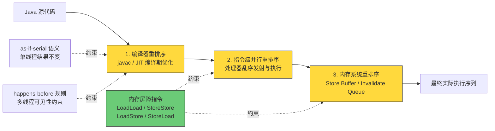

# JMM 与 happens-before

> 学习路线对应：第1周 -- Java 语言核心
> 前置知识：多线程与并发编程、JVM 原理与调优
> 预计学习时间：2 天

## 一、核心概念

### 1.1 什么是 JMM

**JMM（Java Memory Model，Java 内存模型）** 是 Java 虚拟机规范中定义的一套并发编程的抽象规范，它描述了在多线程程序中，共享变量（实例字段、静态字段、数组元素）的读写行为，以及**在什么条件下，一个线程对共享变量的写入对另一个线程可见**。

JMM 是理解 `volatile`、`synchronized`、`final`、`Atomic` 类、`ConcurrentHashMap` 等所有并发设施的**共同底座**。不掌握 JMM，这些工具就只是「背下来的用法」，遇到线上可见性问题时无法定位。

> **生活化类比：多人协作的共享文档** -- 把 JMM 想象成一个团队共用的在线文档系统：
> - **主内存（云端文档）**：所有数据的权威版本，放在服务器上，所有人最终都以它为准。
> - **工作内存（本地缓存）**：每个人电脑上打开的本地副本。你看到的、编辑的都是本地副本，不是云端。编辑完不点「同步」，别人看到的还是旧内容（**可见性问题**）。
> - **JMM 规范（协作规范）**：规定「什么时候必须同步」「什么操作之间有先后约束」。它不规定你用哪个网盘、哪种传输协议（**实现自由**），只规定行为边界。
> - **volatile（强制实时同步）**：相当于把这份文档设为「实时协作模式」，你一改，别人立刻看到。
> - **synchronized（加编辑锁）**：相当于「同一时刻只有一个人能编辑，进入时先拉取最新版本，退出时自动上传」。

**一个必须建立的认知：JMM 是规范，不是实现。**

| 维度 | JMM（规范） | HotSpot（实现） |
|------|------------|----------------|
| 定义位置 | JLS 第 17 章（JSR 133 修订） | 虚拟机源码（C++） |
| 约束对象 | 程序语义：什么行为**必须**被保证 | 具体如何用指令实现该语义 |
| 是否允许差异 | 不关心实现细节 | x86 / ARM 实现方式不同（ARM 更弱的内存模型） |
| 违反的后果 | 违反规范的 JVM 不合法 | 实现可以在规范允许范围内自由优化 |

> 📖 **参考链接**：
> - [JLS §17.4: Memory Model](https://docs.oracle.com/javase/specs/jls/se17/html/jls-17.html#jls-17.4)
> - [JSR 133: Java Memory Model and Thread Specification Revision](https://jcp.org/en/jsr/detail?id=133) -- JDK 5 起生效的 JMM 修订
> - [JEP 188: Java Memory Model Update](https://openjdk.org/jeps/188) -- JMM 现代化修订（含 final 域与 volatile 语义澄清）

### 1.2 JMM 要解决的三个问题

并发编程的一切混乱，最终都可归入原子性、可见性、有序性三类。JMM 就是针对这三类问题给出的规范级承诺。

| 特性 | 含义 | JMM 提供的保证手段 | 被破坏后的典型现象 |
|------|------|------------------|------------------|
| **原子性（Atomicity）** | 一个或多个操作要么全部执行且不被中断，要么全部不执行 | 8 种内存交互操作本身原子；`synchronized`、`Lock` 保证代码块整体原子；`Atomic*` 类基于 CAS | `i++` 结果丢失、账户余额少扣 |
| **可见性（Visibility）** | 一个线程修改变量后，其他线程能立即读到最新值 | `volatile`、`synchronized`、`final`、`Lock` | 线程 A 改了标志位，线程 B 死循环读不到 |
| **有序性（Ordering）** | 程序执行的顺序符合预期，不被编译器/处理器随意重排 | `volatile`（禁止重排）、`synchronized`（临界区内串行）、happens-before 规则 | DCL 单例拿到半初始化对象 |

**三类问题的边界（容易踩坑）：**

- `volatile` 只解决**可见性 + 有序性**，**不解决原子性**。`volatile int i; i++` 依然是线程不安全的。
- `synchronized` 三者全包，但代价是互斥（性能与死锁风险）。
- JMM 保证**单个变量的读写是原子的**（除 `long` / `double` 的非 volatile 情况），但**不保证复合操作原子**。

> 📖 **参考链接**：
> - [JLS §17.4.1: Shared Variables](https://docs.oracle.com/javase/specs/jls/se17/html/jls-17.html#jls-17.4.1)
> - [Oracle Concurrency Tutorial: Atomic Access](https://docs.oracle.com/javase/tutorial/essential/concurrency/atomic.html)

### 1.3 主内存与工作内存

JMM 的核心抽象是**主内存 + 工作内存**两层结构。

```
+--------------------------- 主内存（Main Memory） ---------------------------+
|   所有变量（实例字段、静态字段、数组元素）的「诞生地」，线程间传值的唯一中转站   |
+----------------------------------------------------------------------------+
        ^                    ^                    ^
        | read / write        | read / write        | read / write
        v                    v                    v
+------------------+  +------------------+  +------------------+
| 线程 T1 工作内存  |  | 线程 T2 工作内存  |  | 线程 T3 工作内存  |
|  变量的本地副本    |  |  变量的本地副本    |  |  变量的本地副本    |
|  load / store    |  |  load / store    |  |  load / store    |
|  use  / assign   |  |  use  / assign   |  |  use  / assign   |
+------------------+  +------------------+  +------------------+
        ^                    ^                    ^
   +---------+          +---------+          +---------+
   | 执行引擎 |          | 执行引擎 |          | 执行引擎 |
   +---------+          +---------+          +---------+

  关键约束：① 线程对变量的所有操作都必须在工作内存中进行，不能直接读写主内存
            ② 线程之间不能直接访问对方的工作内存
            ③ 线程间传递变量值，必须经由主内存中转
```

**规范原文要点（JLS §17.4）：**

- 所有变量都存储在主内存中。
- 每条线程都有自己的工作内存，其中保存了被该线程使用的变量的**主内存副本拷贝**。
- 线程对变量的所有操作（读取、赋值）都必须在工作内存中进行，不能直接读写主内存。
- 不同线程之间无法直接访问对方工作内存中的变量，**线程间变量值的传递均需通过主内存来完成**。

> ⚠️ **重大辨析：JMM 的主内存/工作内存 ≠ JVM 运行时数据区的堆/栈/方法区。**
>
> 这是初学者最容易混淆的一点。二者属于**不同层次的抽象**，基本没有对应关系：
>
> | 对比项 | JMM 主内存 / 工作内存 | JVM 运行时数据区 |
> |--------|---------------------|-----------------|
> | 抽象层次 | 并发语义层（谁何时看到谁的值） | 内存布局层（对象放哪里） |
> | 对应硬件 | 主内存（RAM）/ 寄存器 + 各级缓存 | 堆、栈、方法区、PC 寄存器 |
> | 是否真实存在 | 概念模型，非物理区域 | 是真实的内存区域划分 |
> | 硬要对应 | 主内存 ≈ 堆中对象实例数据；工作内存 ≈ 栈中部分区域 | -- |
>
> 从更低层次看：**主内存对应物理硬件的内存，工作内存优先存储于寄存器和高速缓存中**，因为程序运行时主要访问读写的是高速缓存。

> 📖 **参考链接**：
> - [JLS §17.4.1: Shared Variables](https://docs.oracle.com/javase/specs/jls/se17/html/jls-17.html#jls-17.4.1)
> - [JVM Specification §2.5: Run-Time Data Areas](https://docs.oracle.com/javase/specs/jvms/se17/html/jvms-2.html#jvms-2.5)

### 1.4 JMM 与硬件内存架构的区别

JMM 之所以存在，根本原因是**硬件的内存访问行为天然不可靠**：CPU 与主内存之间存在多级缓存，写入可能停留在 Store Buffer 里，读取可能命中过期的缓存行。

**现代多核 CPU 的实际内存层次：**

```
     CPU 0                                CPU 1
 +------------------+               +------------------+
 |  寄存器 Register  |               |  寄存器 Register  |
 |  L1 / L2 Cache   |               |  L1 / L2 Cache   |
 |  Store Buffer    |  <- 写缓冲     |  Store Buffer    |  <- 写缓冲
 |  Invalidate Q    |  <- 失效队列   |  Invalidate Q    |  <- 失效队列
 +--------+---------+               +---------+--------+
          |                                   |
          +----------------+------------------+
                           v
              +--------------------------+
              |   L3 Cache（共享）        |
              +------------+-------------+
                           v
              +--------------------------+
              |  主内存 Main Memory(RAM)  |
              +--------------------------+
      缓存一致性协议：MESI / MESIF / MOESI
```

**JMM 与硬件内存架构的对比：**

| 维度 | 硬件内存架构 | JMM |
|------|-------------|-----|
| 层次 | 寄存器 → L1/L2/L3 → 主内存（+ Store Buffer / Invalidate Queue） | 工作内存 → 主内存 |
| 一致性 | 由 MESI 等缓存一致性协议 + 内存屏障指令保证 | 由 happens-before 规则 + 内存屏障规范保证 |
| 是否跨平台 | 不同 CPU（x86 / ARM / POWER）差异极大 | 统一抽象，屏蔽平台差异 |
| 重排序来源 | 处理器乱序执行、Store Buffer 延迟提交、Invalidate Queue 延迟失效 | 编译器重排序、指令级并行重排序、内存系统重排序 |
| 优化自由度 | 硬件厂商决定 | 规范划定边界，JVM 实现自由优化 |

**x86 与 ARM 的关键差异：**

- **x86 采用 TSO（Total Store Order，全存储顺序）**：只允许「写 → 读」重排序（因为 Store Buffer 的存在），其余三种重排序都被硬件禁止。因此 x86 上 `volatile` 只需要一条 `lock` 前缀指令（等价于 StoreLoad 屏障），LoadLoad / LoadStore / StoreStore 在 x86 上是**空操作**。
- **ARM 采用弱内存模型（Weak Memory Model）**：四种重排序都可能发生，需要显式插入 `dmb` / `isb` 屏障指令。这就是为什么**同一份并发代码在 x86 上跑得好好的，迁到 ARM 服务器（如鲲鹏、Apple M 系列）就偶发可见性 Bug**——JMM 规范保证的是「规范内的行为一致」，如果你的代码本身就依赖了 x86 的额外约束（未使用 volatile），那它本来就是错的，只是在 x86 上碰巧没暴露。

> 💡 **实战提示**：线上「偶发、难复现、换机器就没了」的并发 Bug，十有八九是可见性/有序性问题，而不是逻辑问题。排查这类问题的第一反应应该是「哪个共享变量缺了 `volatile` 或 `synchronized`」，而不是加日志（加日志本身可能改变时序，让 Bug 消失）。

> 📖 **参考链接**：
> - [JLS §17.4: Memory Model](https://docs.oracle.com/javase/specs/jls/se17/html/jls-17.html#jls-17.4)
> - [JEP 188: Java Memory Model Update](https://openjdk.org/jeps/188)
> - [Java SE 17 API: java.lang.invoke.VarHandle](https://docs.oracle.com/javase/17/docs/api/java.base/java/lang/invoke/VarHandle.html) -- JMM 语义在 API 层的直接暴露（含 acquire/release 栅栏）

---

## 二、底层原理

### 2.1 内存间交互的 8 种原子操作

JMM 定义了 8 种**原子操作**来描述主内存与工作内存之间的交互协议。这 8 种操作两两配对，构成完整的读写链路。

| 操作 | 作用对象 | 说明 |
|------|---------|------|
| **lock（锁定）** | 主内存变量 | 把变量标识为一条线程独占的状态 |
| **unlock（解锁）** | 主内存变量 | 释放处于锁定状态的变量，释放后才能被其他线程锁定 |
| **read（读取）** | 主内存变量 | 把变量的值从主内存传输到线程的工作内存，供 `load` 使用 |
| **load（载入）** | 工作内存变量 | 把 `read` 操作得到的值放入工作内存的变量副本中 |
| **use（使用）** | 工作内存变量 | 把工作内存中变量的值传递给执行引擎（用到变量值的字节码指令会执行该操作） |
| **assign（赋值）** | 工作内存变量 | 把执行引擎接收到的值赋给工作内存中的变量（给变量赋值的字节码指令会执行该操作） |
| **store（存储）** | 工作内存变量 | 把工作内存中变量的值传输到主内存，供 `write` 使用 |
| **write（写入）** | 主内存变量 | 把 `store` 操作传输来的值放入主内存的变量中 |

**读写链路（两条链路必须成对）：**

```
【读链路】 主内存 --read--> 工作内存 --load--> 变量副本 --use--> 执行引擎
【写链路】 执行引擎 --assign--> 变量副本 --store--> 工作内存 --write--> 主内存
```

**8 条执行规则（必须遵守的约束）：**

| 编号 | 规则内容 | 解读 |
|------|---------|------|
| 1 | 不允许 `read` 和 `load`、`store` 和 `write` 操作之一单独出现 | 读必须「读到就装」，写必须「存了就落」，不允许中间态 |
| 2 | 不允许线程丢弃它最近的 `assign` 操作 | 工作内存改了就必须同步回主内存，不能只改本地 |
| 3 | 不允许线程无原因地把数据从工作内存同步回主内存 | 没有发生过 `assign` 就不许 `store`+`write`，防止无谓刷新 |
| 4 | 新变量只能在主内存中「诞生」 | 不允许在工作内存中直接使用未被 `load` 或 `assign` 初始化的变量 |
| 5 | 一个变量同一时刻只允许一条线程 `lock`，但同一线程可重复 `lock` | 可重入性；`lock` 几次就要 `unlock` 几次才真正解锁 |
| 6 | 对变量执行 `lock` 会清空工作内存中此变量的值 | 加锁后必须重新 `load` 或 `assign` 初始化才能使用 —— **这是 synchronized 可见性的来源** |
| 7 | 未 `lock` 的变量不允许 `unlock`，也不允许 `unlock` 别的线程锁定的变量 | 锁只能由持有者释放 |
| 8 | `unlock` 之前必须先把变量同步回主内存（`store` + `write`） | 解锁前必须把修改刷回主内存 —— **这是 synchronized 可见性的另一半** |

> ⚠️ **认知升级：8 种操作是「旧版 JMM」，happens-before 才是现行主线。**
>
> 这 8 种操作定义于 JSR 133 之前的 JMM 草案，描述粒度偏「实现指导」。JSR 133（JDK 5 起）重构了 JMM，**以 happens-before 规则作为判断数据是否存在竞争、线程是否安全的主要依据**。8 种操作仍然出现在规范与教材中，用于解释 `synchronized` 的可见性来源（规则 6 + 规则 8），但**做并发正确性推导时应该用 happens-before**，因为它更抽象、更贴近程序语义、更容易跨平台推导。

> 📖 **参考链接**：
> - [JLS §17.4.2: Actions](https://docs.oracle.com/javase/specs/jls/se17/html/jls-17.html#jls-17.4.2)
> - [JLS §17.4.4: Synchronization Order](https://docs.oracle.com/javase/specs/jls/se17/html/jls-17.html#jls-17.4.4)
> - [JSR 133: Java Memory Model and Thread Specification Revision](https://jcp.org/en/jsr/detail?id=133)

### 2.2 重排序

**重排序（Reordering）** 是指编译器和处理器为了优化程序性能，在不改变单线程程序执行结果的前提下，对指令执行顺序进行调整的行为。

重排序是**性能优化的必然结果**，不是 Bug。问题在于：**「不改变单线程执行结果」这个前提，在多线程下会失效**。

#### 2.2.1 三种重排序

| 重排序类型 | 发生位置 | 典型原因 | 是否受 JMM 约束 |
|-----------|---------|---------|----------------|
| **编译器重排序** | 编译期（javac / JIT C1/C2） | 指令调度、公共子表达式消除、死代码消除 | 是，JMM 禁止特定类型的编译器重排序 |
| **指令级并行重排序** | 处理器乱序执行 | 超标量流水线、乱序发射、多发射 | 是，JMM 通过内存屏障指令禁止 |
| **内存系统重排序** | 处理器 ↔ 主内存 | Store Buffer 延迟提交、Invalidate Queue 延迟失效、缓存一致性协议的时序差 | 是，JMM 通过内存屏障指令禁止 |

**三类重排序的执行链（从源码到执行）：**



> 上图展示了从 Java 源码到实际执行的三层重排序链条。编译器重排序受 as-if-serial 语义与 happens-before 规则约束；处理器与内存系统的重排序则依靠插入内存屏障指令来禁止。**JMM 的整套机制，本质上就是「用规范划定哪些重排序允许、用屏障指令禁止哪些重排序」。**

**重排序的真实案例（DCL 半初始化）：**

```java
// 源码顺序
instance = new Singleton();

// 实际可能被重排序为（伪指令序列）
// 步骤 ① 分配内存空间
memory = allocate();
// 步骤 ③ 将引用指向内存空间  <-- 被提前到步骤 ② 之前！
instance = memory;
// 步骤 ② 调用构造器初始化对象
ctorInstance(memory);
```

重排后，另一个线程在第一次检查时看到 `instance != null`，直接返回这个**尚未调用构造器**的对象，后续使用其字段就会读到 `0` / `null`。

#### 2.2.2 as-if-serial 语义

**as-if-serial 语义**：不管怎么重排序（编译器和处理器为了提高并行度），**单线程程序的执行结果不能被改变**。

编译器、Runtime 和处理器都必须遵守 as-if-serial 语义。因此，编译器和处理器**不会对存在数据依赖关系的操作做重排序**，因为这种重排序会改变执行结果。

```java
// 示例：as-if-serial 保证的结果
double pi = 3.14;                  // A
double r  = 1.0;                   // B
double area = pi * r * r;          // C

// A 和 B 之间没有数据依赖，可以任意重排序
// 但 C 依赖 A 和 B，所以 C 必须在 A、B 之后执行
// 可能的合法顺序：A -> B -> C，B -> A -> C
// 非法的顺序：C 在 A 或 B 之前
```

> ⚠️ **as-if-serial 的边界：它只管单线程。**
>
> as-if-serial 语义**只为单线程程序提供保证**，它没有（也无法）保证多线程程序的正确性。如果多线程之间没有正确的同步（happens-before 关系），那么重排序在多线程视角下就可能产生「看似荒谬」的结果。**这就是为什么需要 JMM 的 happens-before 规则来补充约束。**

#### 2.2.3 数据依赖性与控制依赖性

**数据依赖性（Data Dependency）**：如果两个操作访问同一个变量，且其中一个操作是写操作，那么这两个操作之间就存在数据依赖性。

| 依赖类型 | 示例 | 说明 |
|---------|------|------|
| **写后读（RAW）** | `a = 1; b = a;` | 写 a 后读 a，真依赖，不可重排序 |
| **写后写（WAW）** | `a = 1; a = 2;` | 写 a 后再写 a，输出依赖，不可重排序 |
| **读后写（WAR）** | `b = a; a = 1;` | 读 a 后写 a，反依赖，不可重排序 |

编译器和处理器**会遵守数据依赖性**，不会改变存在数据依赖关系的两个操作的执行顺序（仅针对**单处理器和单线程**中执行的指令序列，多处理器和多线程间的数据依赖性不被考虑）。

**控制依赖性（Control Dependency）**：如果操作 B 的执行取决于操作 A 的结果（例如 A 是条件判断），则 B 与 A 之间存在控制依赖。

```java
int flag = 0;
int x = 0;

// 线程 T1
flag = 1;            // A
if (flag == 1) {     // B（控制依赖 A）
    x = 2;           // C（控制依赖 B）
}
```

**关键结论：控制依赖允许被重排序。** 编译器与处理器在**单线程语义不变**的前提下，可以把 C 提到 B 之前执行（用「分支预测 + 投机执行」实现，若预测失败则丢弃结果）。这在单线程下没问题，但多线程下就可能导致 `x = 2` 先于 `flag = 1` 被其他线程观察到。

> 💡 **这就是为什么「用一个普通变量当标志位」不可靠。** 要建立可靠的可见性，必须把 `flag` 声明为 `volatile`——`volatile` 写之前的 StoreStore 屏障会禁止 `x = 2` 被重排到 `flag = 1` 之后，`volatile` 读之后的 LoadLoad 屏障会禁止后续读取被重排到读之前。

> 📖 **参考链接**：
> - [JLS §17.4.3: Programs and Program Order](https://docs.oracle.com/javase/specs/jls/se17/html/jls-17.html#jls-17.4.3)
> - [JLS §17.4.5: Happens-before Order](https://docs.oracle.com/javase/specs/jls/se17/html/jls-17.html#jls-17.4.5)
> - [JVM Specification §2.11.10: Synchronization](https://docs.oracle.com/javase/specs/jvms/se17/html/jvms-2.html#jvms-2.11.10)

### 2.3 happens-before 规则

**happens-before（先行发生）** 是 JMM 中判断数据是否存在竞争、线程是否安全的核心依据。

**定义**：如果操作 A happens-before 操作 B，那么 A 的执行结果对 B 可见，且 A 的执行顺序在 B 之前（在 JMM 的语义视角下）。

**核心作用**：如果一个操作的结果需要对另一个操作可见，那么这两个操作之间**必须存在 happens-before 关系**。这两个操作可以是在同一个线程内，也可以是不同线程。

#### 2.3.1 八条规则（附代码示例）

**规则 1：程序顺序规则（Program Order Rule）**

> 在一个线程内，按照程序代码顺序，书写在前面的操作 happens-before 于书写在后面的操作。

```java
// 单线程内
int a = 1;        // A
int b = 2;        // B
int c = a + b;    // C
// A happens-before B，B happens-before C
// 注意：如果 B 对 C 不可见（如 B 无副作用），JMM 允许 B 被重排序到 A 之前
//       happens-before 保证的是「A 的结果对 C 可见」，不是「A 物理上先执行」
```

**规则 2：监视器锁规则（Monitor Lock Rule）**

> 对一个锁的解锁（unlock）happens-before 于随后对这个锁的加锁（lock）。

```java
// 线程 T1
synchronized (lock) {
    x = 42;              // A：写共享变量
}                        // B：unlock
// 线程 T2
synchronized (lock) {    // C：lock（与 B 是同一把锁）
    int r = x;           // D：读到 42，A happens-before D
}
```

**规则 3：volatile 变量规则（Volatile Variable Rule）**

> 对一个 volatile 变量的写操作 happens-before 于后面对这个变量的读操作。

```java
volatile boolean flag = false;
int data = 0;

// 线程 T1
data = 42;               // A：普通写
flag = true;             // B：volatile 写
// 线程 T2
if (flag) {              // C：volatile 读（读到 true）
    int r = data;        // D：保证读到 42
}
// B happens-before C，A happens-before B，C happens-before D
// 由传递性：A happens-before D，所以 data = 42 对 T2 可见
```

**规则 4：线程启动规则（Thread Start Rule）**

> Thread 对象的 `start()` 方法 happens-before 于此线程的每一个动作。

```java
int x = 0;

Thread t = new Thread(() -> {
    // B：子线程读取
    System.out.println(x);   // 保证读到 42
});
x = 42;                      // A：主线程在 start 之前写
t.start();                   // start() happens-before 子线程的所有动作
```

**规则 5：线程终止规则（Thread Termination Rule）**

> 线程中的所有操作都 happens-before 于对此线程的终止检测。可通过 `Thread.join()` 结束、`Thread.isAlive()` 的返回值检测到线程已经终止执行。

```java
int x = 0;

Thread t = new Thread(() -> {
    x = 42;                  // A：子线程写
});                          // 线程内所有操作 happens-before 终止检测
t.start();
t.join();                    // B：join 返回后
System.out.println(x);       // C：保证读到 42
```

**规则 6：线程中断规则（Thread Interruption Rule）**

> 对线程 `interrupt()` 方法的调用 happens-before 于被中断线程的代码检测到中断事件的发生。可以通过 `Thread.interrupted()` 方法检测到是否有中断发生。

```java
Thread t = new Thread(() -> {
    while (!Thread.currentThread().isInterrupted()) {  // B：检测中断
        // 干活
    }
    // 中断标志位、以及中断前写入的其他共享变量，在此处均可见
});

t.start();
sharedState = 100;      // A：中断前写
t.interrupt();          // interrupt() happens-before 检测到中断
```

**规则 7：对象终结规则（Finalizer Rule）**

> 一个对象的初始化完成（构造函数执行结束）happens-before 于它的 `finalize()` 方法的开始。

```java
public class Resource {
    private final int size;

    public Resource(int size) {
        this.size = size;    // A：构造器执行结束
    }

    @Override
    protected void finalize() throws Throwable {
        // B：finalize() 开始执行
        System.out.println(size);  // 保证能看到构造器中赋的值
    }
}
```

> ⚠️ **注意**：`finalize()` 在 JDK 9 起被标记为废弃（deprecated），JDK 18 起标记为 `forRemoval`。这条规则主要出现在面试与规范阅读中，**生产代码不要依赖 `finalize()`**，应使用 `Cleaner` 或 `try-with-resources`。

**规则 8：传递性（Transitivity）**

> 如果 A happens-before B，且 B happens-before C，那么 A happens-before C。

```java
volatile boolean flag = false;
int data = 0;

// 线程 T1
data = 42;          // A
flag = true;        // B（volatile 写）

// 线程 T2
if (flag) {         // C（volatile 读，与 B 构成 volatile 规则）
    int r = data;   // D（与 C 构成程序顺序规则）
}

// B hb C（volatile 规则），C hb D（程序顺序规则）
// 由传递性：B hb D
// 又 A hb B（程序顺序规则），故 A hb D —— data = 42 对 D 可见
```

#### 2.3.2 辨析：happens-before 是否等于「时间上先发生」？

**答案：不等于。这是本主题最重要的一条辨析。**

**happens-before 的本质是「可见性 + 顺序约束」，而不是「物理时间上的先后」。**

| 对比维度 | happens-before（先行发生） | 时间上先发生（Time Order） |
|---------|--------------------------|--------------------------|
| 定义域 | JMM 规范定义的**偏序关系** | 物理世界的**全序关系** |
| 判定依据 | 是否满足 8 条规则之一 | 比较时间戳 / 时钟 |
| 能否推导 | 可以严格推导（含传递性） | 需要全局时钟，分布式下不可靠 |
| 与重排序的关系 | 允许物理执行顺序与 hb 顺序不同（只要结果正确） | 物理执行顺序即时间顺序 |
| 适用范围 | 只覆盖 JMM 关心的共享变量读写 | 覆盖所有操作 |

**反例 1：happens-before 成立，但物理上未必「先执行」。**

```java
int a = 1;    // A
int b = 2;    // B

// 规则 1 保证 A happens-before B
// 但 A 和 B 之间没有数据依赖，JIT 完全可以把 B 的赋值先执行
// 对单线程来说结果一样；JMM 也允许这种重排序
// 结论：A hb B ≠ A 物理上先于 B 执行
```

**反例 2：时间上先发生，但不存在 happens-before 关系。**

```java
int x = 0;
// 线程 T1（时刻 t1 = 100ms）
x = 42;
// 线程 T2（时刻 t2 = 200ms，物理上晚于 T1）
System.out.println(x);   // 可能输出 0！
```

线程 T2 虽然在**物理时间上**晚于 T1 执行，但两者之间**没有任何 happens-before 关系**（没有锁、没有 volatile、没有 join），因此 JMM **不保证** T2 能看到 `x = 42`。T2 完全可能读到工作内存中过期的 `0`。

> 💡 **一句话记忆**：**happens-before 是「可见性契约」，不是「时间戳比较」。** 它回答的是「A 的结果对 B 可见吗」，而不是「A 在钟表上更早吗」。
>
> 另一个角度的表述：如果 A happens-before B，那么 A 的结果对 B 可见；如果 A 和 B 之间没有 happens-before 关系，那么 JMM 对它们的可见性**不作任何保证**（读到的值是不确定的）。

> 📖 **参考链接**：
> - [JLS §17.4.5: Happens-before Order](https://docs.oracle.com/javase/specs/jls/se17/html/jls-17.html#jls-17.4.5) -- 八条规则的规范定义
> - [JLS §17.4.4: Synchronization Order](https://docs.oracle.com/javase/specs/jls/se17/html/jls-17.html#jls-17.4.4)
> - [JLS §17.5: final Field Semantics](https://docs.oracle.com/javase/specs/jls/se17/html/jls-17.html#jls-17.5)

### 2.4 内存屏障

**内存屏障（Memory Barrier / Memory Fence）** 是 JMM 用来**禁止特定类型的重排序**、**强制刷新/失效缓存**的指令级手段。它是 happens-before 规则在实现层面的落地方式。

#### 2.4.1 四种屏障

| 屏障类型 | 指令示例（伪代码） | 作用 | 在 x86 上的实现 |
|---------|-----------------|------|---------------|
| **LoadLoad** | `Load1; LoadLoad; Load2` | 确保 Load1 的数据装载先于 Load2 及所有后续装载指令 | 空操作（x86 天然保证） |
| **StoreStore** | `Store1; StoreStore; Store2` | 确保 Store1 的数据先刷新到内存（对其他处理器可见），先于 Store2 及后续存储指令 | 空操作（x86 天然保证） |
| **LoadStore** | `Load1; LoadStore; Store2` | 确保 Load1 的数据装载先于 Store2 及所有后续存储指令 | 空操作（x86 天然保证） |
| **StoreLoad** | `Store1; StoreLoad; Load2` | 确保 Store1 的数据先刷新到内存，先于 Load2 及所有后续装载指令 | **非空操作**，需 `mfence` 或带 `lock` 前缀的指令 |

> 💡 **StoreLoad 是开销最大的屏障**，因为它兼具其他三种屏障的效果，并且需要清空 Store Buffer、等待所有未完成的写操作提交。x86 的 `volatile` 写就是通过 `lock addl $0x0,(%rsp)` 这条带 `lock` 前缀的空操作指令实现的（JIT 会把 `lock` 前缀指令插在 volatile 写之后），`lock` 前缀会隐式触发全内存栅栏语义。

#### 2.4.2 屏障插入位置

**JMM 针对 volatile 的内存屏障插入策略（保守策略）：**

| 场景 | 屏障组合 | 插入位置 | 效果 |
|------|---------|---------|------|
| **volatile 写** | `StoreStore` + volatile 写 + `StoreLoad` | 写操作**前**插 StoreStore，写操作**后**插 StoreLoad | 前面的普通写不会被重排到 volatile 写之后；volatile 写不会被重排到后面的 volatile 读写之前 |
| **volatile 读** | volatile 读 + `LoadLoad` + `LoadStore` | 读操作**后**插 LoadLoad 和 LoadStore | 后面的普通读/写不会被重排到 volatile 读之前 |

**volatile 写前后的屏障组合（示意图）：**

```
普通写 Store1  ──┐
普通写 Store2  ──┤
                 ├──> 【StoreStore 屏障】禁止上面的普通写与下面的 volatile 写重排序
volatile 写     ──┤
                 └──> 【StoreLoad 屏障】禁止上面的 volatile 写与下面任意 volatile 读写重排序
volatile 读     ──┐
普通读 Load1   ──┤
普通写 Store3  ──┴──> 【LoadLoad + LoadStore 屏障】禁止下面的普通读写与上面的 volatile 读重排序
```

**保守策略的取舍：**

- **保守**：JMM 的屏障插入策略偏保守（如 volatile 读后插入 LoadLoad + LoadStore，其实某些场景下可以省略），这是为了保证在**任何处理器平台**上都能得到正确的语义。
- **实践**：由于 x86 只对 StoreLoad 有实际指令开销，所以「保守策略」在 x86 上的额外成本主要体现在 volatile 写（需要 `lock` 前缀指令），volatile 读的开销几乎可以忽略（只需保证编译器不重排即可）。

```java
// volatile 内存屏障的实际体现（伪汇编视角，x86）
public class MemoryBarrierDemo {
    private int a = 0;
    private volatile boolean flag = false;

    public void writer() {
        a = 42;              // 普通写
        // [StoreStore 屏障]  -> x86 空操作
        flag = true;         // volatile 写
        // [StoreLoad 屏障]   -> x86: lock addl $0x0,(%rsp)
    }

    public void reader() {
        if (flag) {          // volatile 读
            // [LoadLoad 屏障] -> x86 空操作
            // [LoadStore 屏障]-> x86 空操作
            int r = a;       // 保证读到 42
        }
    }
}
```

> 📖 **参考链接**：
> - [JLS §17.4.5: Happens-before Order](https://docs.oracle.com/javase/specs/jls/se17/html/jls-17.html#jls-17.4.5)
> - [JEP 193: Variable Handles](https://openjdk.org/jeps/193) -- `VarHandle` 提供 `fullFence()` / `acquireFence()` / `releaseFence()` / `loadLoadFence()` / `storeStoreFence()`
> - [Java SE 17 API: java.lang.invoke.VarHandle](https://docs.oracle.com/javase/17/docs/api/java.base/java/lang/invoke/VarHandle.html)

### 2.5 volatile 的内存语义

**volatile 的内存语义 = 可见性 + 禁止重排序（有序性），不含原子性。**

| 语义 | 实现机制 | 效果 |
|------|---------|------|
| **可见性** | volatile 写后插 StoreLoad 屏障，强制把工作内存的值刷新到主内存；volatile 读后插 LoadLoad/LoadStore，强制从主内存重新读取 | 一个线程写 volatile 变量后，其他线程读该变量能立即看到最新值 |
| **禁止重排序** | volatile 写前插 StoreStore，写后插 StoreLoad；volatile 读后插 LoadLoad、LoadStore | 保证 volatile 变量前后的普通变量读写不会被重排跨越 volatile 操作 |
| **不保证原子性** | 无互斥机制，`i++` 编译为「读 → 加 → 写」三条指令，中间可被其他线程插入 | 多线程 `i++` 结果丢失 |

**为什么不保证原子性？**

```java
public class VolatileNotAtomic {
    private volatile int count = 0;

    public void increment() {
        count++;   // 等价于：
                   //   int tmp = count;   // 1. read + load + use
                   //   tmp = tmp + 1;     // 2. 执行引擎计算
                   //   count = tmp;       // 3. assign + store + write
                   // 三个步骤之间，其他线程可以插入执行，导致丢失更新
    }
}
```

**正确做法（需要原子性时）：**

| 方案 | 说明 | 适用场景 |
|------|------|---------|
| `synchronized` / `ReentrantLock` | 加锁互斥，保证复合操作整体原子 | 临界区逻辑复杂、需要多个变量一致 |
| `AtomicInteger` / `LongAdder` | 基于 CAS 的无锁原子操作 | 单变量计数，高并发用 `LongAdder` 更好 |
| 只做「写后读」的单向通信 | 用 volatile 做状态标志位，不做复合运算 | 停止标志、初始化完成标志 |

> ⚠️ **`volatile` 的适用边界**：`volatile` 变量本身**适合作为状态标志位**（一个线程写、其他线程读，或读写不依赖当前值），**不适合作为计数器**（读-改-写模式）。判断标准很简单：**如果操作依赖于变量的当前值，就必须加锁或使用原子类。**

> 📖 **参考链接**：
> - [JLS §8.3.1.4: volatile Fields](https://docs.oracle.com/javase/specs/jls/se17/html/jls-8.html#jls-8.3.1.4)
> - [JLS §17.4.5: Happens-before Order](https://docs.oracle.com/javase/specs/jls/se17/html/jls-17.html#jls-17.4.5)
> - [Oracle Concurrency Tutorial: Atomic Access](https://docs.oracle.com/javase/tutorial/essential/concurrency/atomic.html)
> - [Java SE 17 API: java.util.concurrent.atomic.LongAdder](https://docs.oracle.com/javase/17/docs/api/java.base/java/util/concurrent/atomic/LongAdder.html) -- 高并发计数优于 `AtomicLong`

### 2.6 synchronized 的内存语义

**synchronized 的内存语义 = 原子性 + 可见性 + 有序性。**

**可见性的来源（对应 2.1 节的两条规则）：**

| 时机 | JMM 操作 | 效果 |
|------|---------|------|
| **加锁（monitorenter）** | `lock` 操作（规则 6：清空工作内存中该变量的值） | 加锁后必须从主内存重新 `read` + `load`，保证看到的是最新值 |
| **解锁（monitorexit）** | `unlock` 操作（规则 8：解锁前必须 `store` + `write`） | 解锁前把工作内存中的修改刷新回主内存，保证其他线程能看到 |

**有序性的来源：** 临界区内的代码相对于临界区外的代码是**串行**的。即 `synchronized` 块内的操作与块外的操作之间存在 happens-before 关系（监视器锁规则 + 程序顺序规则 + 传递性）。

```java
public class SynchronizedSemantics {
    private int x = 0;
    private final Object lock = new Object();

    public void writer() {
        x = 42;                        // A：临界区外写
        synchronized (lock) {
            // B：lock —— 清空工作内存，重新从主内存读
            x = 100;                   // C：临界区内写
        }                              // D：unlock —— 把 x=100 刷新回主内存
    }

    public void reader() {
        synchronized (lock) {          // E：lock —— 重新读主内存
            int r = x;                 // F：保证读到 100，不会是 42 或 0
        }
    }
    // D hb E（监视器锁规则），C hb D（程序顺序规则）
    // 由传递性：C hb F，所以 F 一定读到 C 写入的 100
}
```

**JVM 实现层面：** JIT 编译器会在 `monitorenter` 之后、`monitorexit` 之前插入内存屏障（在 x86 上体现为带 `lock` 前缀的指令），实际效果与 volatile 类似，但 `synchronized` 通过**对象头的 Mark Word + Monitor** 提供了互斥能力，因此额外获得了原子性。

**volatile 与 synchronized 的内存语义对比：**

| 维度 | volatile | synchronized |
|------|----------|--------------|
| 原子性 | ❌ 不保证（`i++` 不安全） | ✅ 保证（临界区整体原子） |
| 可见性 | ✅ 保证（写刷新 + 读重取） | ✅ 保证（unlock 刷新 + lock 重取） |
| 有序性 | ✅ 禁止特定重排序（内存屏障） | ✅ 临界区串行 + 内存屏障 |
| 互斥 | ❌ 无 | ✅ 有（同一时刻单线程进入） |
| 阻塞 | ❌ 不阻塞 | ✅ 竞争时阻塞 |
| 适用 | 状态标志位、DCL | 复合操作、多变量一致性 |

> 📖 **参考链接**：
> - [JLS §17.1: Synchronization](https://docs.oracle.com/javase/specs/jls/se17/html/jls-17.html#jls-17.1)
> - [JVM Specification §2.11.10: Synchronization](https://docs.oracle.com/javase/specs/jvms/se17/html/jvms-2.html#jvms-2.11.10)
> - [Oracle Concurrency Tutorial: Intrinsic Locks and Synchronization](https://docs.oracle.com/javase/tutorial/essential/concurrency/locksync.html)

### 2.7 final 域的内存语义

`final` 域的内存语义是 JMM 为「不可变对象安全发布」提供的规范级保证。它由两条重排序规则组成。

**规则 1：写 final 域的重排序规则**

> JSR-133 禁止把 final 域的写重排序到构造函数之外。编译器会在 final 域写入之后、构造函数 return 之前，插入一个 **StoreStore 屏障**。

```java
public class FinalWriteRule {
    private final int x;              // final 域
    private int y;                    // 普通域

    public FinalWriteRule() {
        x = 42;                       // A：写 final 域
        // 【StoreStore 屏障】—— 禁止 x 的写被重排到构造函数之外
        y = 100;                      // B：写普通域
    }
}
// 效果：任何线程只要看到对象引用，就一定能看到 x = 42（final 域保证初始化完成）
//       但不保证看到 y = 100（普通域没有这个保证）
```

**规则 2：读 final 域的重排序规则**

> 在一个线程中，初次读对象引用与初次读该对象包含的 final 域，JMM 禁止处理器重排序这两个操作。编译器会在读 final 域操作的前面插入一个 **LoadLoad 屏障**。

```java
public class FinalReadRule {
    private final int x;
    public FinalReadRule() { x = 42; }

    public static void main(String[] args) {
        FinalReadRule obj = new FinalReadRule();   // A：初次读对象引用
        // 【LoadLoad 屏障】—— 禁止读 x 被重排到读 obj 引用之前
        int r = obj.x;                              // B：初次读 final 域，保证读到 42
    }
}
// 效果：不会出现「obj 引用已读到，但 obj.x 还是默认值 0」的情况
```

**规则 3：final 引用不能从构造函数内「逸出」（this escape）**

> 在构造函数内部，不能让这个被构造对象的引用（`this`）为其他线程所见，也就是对象引用不能在构造函数中「逸出」。

```java
// ❌ 错误示范：this 逸出
public class ThisEscape {
    private final int x;
    private static ThisEscape instance;      // 静态字段，其他线程可见

    public ThisEscape() {
        instance = this;                     // 危险！this 在构造完成前逸出
        x = 42;                              // 此时 x 可能还是 0
    }
}

// ✅ 正确做法：构造完成后再发布
public class SafePublish {
    private final int x;

    private SafePublish() {                  // 构造器私有
        x = 42;                              // 构造完成后才允许发布
    }

    public static SafePublish create() {
        SafePublish obj = new SafePublish();
        // 构造已完成，可以安全发布
        return obj;
    }
}
```

**其他逸出场景：**

| 逸出场景 | 示例 | 风险 |
|---------|------|------|
| 构造函数中赋值给静态字段 | `instance = this;` | 其他线程可能拿到半初始化对象 |
| 构造函数中注册监听器 | `eventBus.register(this);` | 事件可能在构造完成前触发 |
| 构造函数中启动线程 | `new Thread(this::run).start();` | 子线程可能在构造完成前访问字段 |
| 构造函数中调用可被重写的实例方法 | `this.doInit();` | 子类重写的方法可能访问未初始化的子类字段 |

**final 域内存语义小结：**

| 规则 | 屏障 | 保证 |
|------|------|------|
| 写 final 域 | final 写之后、构造器 return 前插 StoreStore | final 域的写不会被重排到构造器外，对象发布时 final 域已初始化完成 |
| 读 final 域 | 读 final 域之前插 LoadLoad | 不会读到「引用有效但 final 域还是默认值」的对象 |
| 引用不逸出 | 无屏障，属编程约束 | 保证上述两条规则真正生效的前提 |

> 💡 **实战价值：`final` 域的内存语义让「不可变对象」成为最安全的并发共享方式。** 一个所有字段都是 `final` 且构造期间未逸出的对象，可以被任意多个线程安全读取，**无需任何同步**。这是 `String`、`Integer`、`LocalDate` 等不可变类天然线程安全的规范级原因。

> 📖 **参考链接**：
> - [JLS §17.5: final Field Semantics](https://docs.oracle.com/javase/specs/jls/se17/html/jls-17.html#jls-17.5)
> - [JLS §8.3.1.2: final Fields](https://docs.oracle.com/javase/specs/jls/se17/html/jls-8.html#jls-8.3.1.2)
> - [JEP 188: Java Memory Model Update](https://openjdk.org/jeps/188)

---

## 三、实战应用

### 3.1 DCL 为什么必须加 volatile

**DCL（Double-Checked Locking，双重检查锁定）** 是 JMM 最经典的应用场景，也是面试最高频的考点。

#### 3.1.1 错误的 DCL 写法（漏加 volatile）

```java
// ❌ 错误示范：instance 没有 volatile
public class Singleton {
    private static Singleton instance;          // 缺少 volatile！

    public static Singleton getInstance() {
        if (instance == null) {                 // 第一次检查（无锁，性能关键路径）
            synchronized (Singleton.class) {
                if (instance == null) {         // 第二次检查（加锁后复核）
                    instance = new Singleton(); // 危险：可能被重排序
                }
            }
        }
        return instance;
    }
}
```

#### 3.1.2 重排序的完整解释

`instance = new Singleton()` 这一行源码，**实际会被编译为三步操作**：

```
① memory = allocate();          // 分配对象的内存空间
② ctorInstance(memory);         // 调用构造器，初始化对象
③ instance = memory;            // 将 instance 引用指向刚分配的内存地址
```

**关键在于：步骤 ② 和 ③ 之间没有数据依赖关系**（② 写的是对象内部字段，③ 写的是 `instance` 引用），因此 **JIT 编译器与处理器都允许把 ③ 重排序到 ② 之前**：

```
实际可能的执行顺序（重排序后）：
① memory = allocate();          // 分配内存
③ instance = memory;            // 引用指向内存（此时对象内部字段还是默认值！）
② ctorInstance(memory);         // 初始化对象
```

**多线程下的致命后果（时间线）：**

```
时间轴    线程 A（写者）                          线程 B（读者）
  |       ─────────────                        ─────────────
  t1      ① 分配内存
  t2      ③ instance = memory  ────────────>   ① 第一次检查：instance != null ！
  t3      （对象尚未初始化，                    ② 直接 return instance
           x = 0 / 引用字段 = null）            ③ 使用 instance.x  →  拿到 0 或 null
  t4      ② ctorInstance()                     ④ 空指针异常 / 业务数据错误
```

**线程 B 在 t2 时刻通过了第一次检查**（因为 `instance` 引用已经非 null），直接返回了这个**构造器还没执行完**的对象，随后访问其字段就会读到默认值（`0`、`false`、`null`）。这类 Bug 的可怕之处在于：**发生概率极低（窗口只有几条指令的时间），且表现为偶发的 NPE 或数据错乱，难以复现**。

#### 3.1.3 加上 volatile 后为什么就安全了

```java
// ✅ 正确写法
public class Singleton {
    private static volatile Singleton instance;  // 关键：volatile

    public static Singleton getInstance() {
        if (instance == null) {
            synchronized (Singleton.class) {
                if (instance == null) {
                    instance = new Singleton();
                }
            }
        }
        return instance;
    }
}
```

**volatile 生效的完整链条：**

| 步骤 | 机制 | 效果 |
|------|------|------|
| 1 | `instance` 是 volatile 变量，其**写操作前**会插入 **StoreStore 屏障** | 禁止步骤 ②（构造器初始化）被重排序到步骤 ③（volatile 写）之后 |
| 2 | `instance` 的**写操作后**会插入 **StoreLoad 屏障** | 强制把 `instance` 的引用值刷新到主内存，并禁止与后续 volatile 读重排序 |
| 3 | 线程 B 的**第一次检查**是 volatile 读 | 读操作后插 LoadLoad / LoadStore 屏障，强制从主内存读取最新值 |
| 4 | volatile 变量规则（规则 3）+ 传递性 | 线程 A 的构造器内所有写操作，对线程 B 后续读取该对象字段时**均可见** |

**用 happens-before 严格推导：**

```
线程 A：ctorInstance(memory)      // 操作 P（写对象内部字段）
        instance = memory         // 操作 Q（volatile 写）

线程 B：读取 instance != null     // 操作 R（volatile 读）
        访问 instance.x           // 操作 S（读对象字段）

推导：
  P hb Q      （程序顺序规则，且 StoreStore 屏障禁止二者重排序）
  Q hb R      （volatile 变量规则）
  R hb S      （程序顺序规则）
  --------------------------------
  P hb S      （传递性）  ⇒  线程 B 一定能看到对象已完整初始化
```

**一句话总结：`volatile` 用 StoreStore 屏障堵死了「引用先于初始化」这条重排序路径，用 happens-before 传递性把「构造器内的写」传递给了读者线程。**

#### 3.1.4 其他修复方案（不依赖 volatile）

如果不想用 `volatile`，还有两种基于**类加载机制**的正确写法。类加载的初始化阶段由 JVM 保证线程安全（`<clinit>()` 方法加锁），且类初始化天然满足 happens-before。

```java
// 方案 A：静态内部类（推荐，无锁且懒加载）
public class Singleton {
    private Singleton() {}

    private static class Holder {
        // 类加载时才初始化，JVM 保证线程安全
        private static final Singleton INSTANCE = new Singleton();
    }

    public static Singleton getInstance() {
        return Holder.INSTANCE;   // 首次调用触发 Holder 类初始化
    }
}

// 方案 B：枚举单例（Effective Java 推荐，防反射/防反序列化破坏）
public enum Singleton {
    INSTANCE;

    public void doSomething() { /* ... */ }
}
```

| 单例写法 | 线程安全 | 懒加载 | 防反射 | 防反序列化 | 内存语义依赖 |
|---------|---------|-------|-------|-----------|------------|
| 饿汉式 | ✅ | ❌ | ❌ | ❌ | 类初始化 |
| 懒汉式 + synchronized | ✅ | ✅ | ❌ | ❌ | 监视器锁规则 |
| **DCL + volatile** | ✅ | ✅ | ❌ | ❌ | volatile 规则 + 传递性 |
| **静态内部类** | ✅ | ✅ | ❌ | ❌ | 类初始化 |
| **枚举** | ✅ | ❌ | ✅ | ✅ | 类初始化 |

> 📖 **参考链接**：
> - [JLS §17.5: final Field Semantics](https://docs.oracle.com/javase/specs/jls/se17/html/jls-17.html#jls-17.5)
> - [JLS §8.3.1.4: volatile Fields](https://docs.oracle.com/javase/specs/jls/se17/html/jls-8.html#jls-8.3.1.4)
> - [JLS §12.4.2: Detailed Initialization Procedure](https://docs.oracle.com/javase/specs/jls/se17/html/jls-12.html#jls-12.4.2) -- 类初始化由 JVM 保证线程安全

### 3.2 用 happens-before 推导可见性（三个案例）

**案例 1：用 volatile 发布不可变配置（安全）**

```java
public class ConfigHolder {
    private volatile Map<String, String> config;   // volatile 引用

    public void refresh() {
        Map<String, String> newConfig = loadFromRemote();  // A：构建新配置（耗时）
        newConfig = Collections.unmodifiableMap(newConfig);
        config = newConfig;                                // B：volatile 写（一次性发布）
    }

    public String get(String key) {
        Map<String, String> snapshot = config;   // C：volatile 读（只读一次，避免多次读不一致）
        return snapshot == null ? null : snapshot.get(key);
    }
}
// A hb B（程序顺序），B hb C（volatile 规则），C hb 后续读取（程序顺序）
// 传递性 ⇒ A hb 后续读取，config 中所有内容对读者可见
// 技巧：读一次 volatile 到局部变量，避免循环中多次读 volatile 导致快照不一致
```

**案例 2：用 join 汇总子任务结果（安全）**

```java
public class ParallelSum {
    private long result = 0;                 // 普通变量，靠 join 建立 hb

    public long compute(int[] data) throws InterruptedException {
        Thread t = new Thread(() -> {
            long sum = 0;
            for (int v : data) sum += v;
            result = sum;                    // A：子线程写普通变量
        });
        t.start();
        t.join();                            // 线程终止规则：A hb join 返回
        return result;                       // B：保证读到子线程写入的 sum
    }
}
// 若去掉 t.join()，result 的读取是不确定的（可能读到 0）
```

**案例 3：用 synchronized 保护复合操作（安全）**

```java
public class Counter {
    private int count = 0;

    public synchronized void increment() {   // 加锁：lock 清空工作内存副本
        count++;                             // 读-改-写，整体原子
    }                                        // 解锁：unlock 前 store + write 刷回主内存

    public synchronized int get() {
        return count;                        // 保证读到最新值，不会丢失更新
    }
}
// 监视器锁规则 + 程序顺序规则 + 传递性
```

**对照：三个「看起来对，其实错」的写法**

```java
// ❌ 错误 1：普通变量当标志位
boolean stop = false;                        // 应加 volatile
// 线程 A: stop = true;
// 线程 B: while (!stop) { ... }             // 可能永远看不到 true，死循环

// ❌ 错误 2：用 volatile 做计数
volatile int count = 0;
count++;                                     // 复合操作，仍会丢失更新

// ❌ 错误 3：多个 volatile 变量的原子性
volatile int a = 0, b = 0;
a = 1; b = 1;                                // 两个写各自可见，但不保证读者看到 (1,1) 同时成立
// 需要「一起可见」时，必须用锁，或把两个值合并为一个不可变对象用 volatile 发布
```

> 💡 **推导可见性的三步法**：
> 1. **找共享变量**：哪些变量被多个线程读写？
> 2. **找同步点**：它们之间有没有锁、volatile、start、join、中断、final？
> 3. **连 hb 链**：用八条规则 + 传递性，把「写者」和「读者」连起来。连不上，就是 Bug。

### 3.3 排查可见性问题的实战套路

线上遇到「偶发、难复现、逻辑上说不通」的并发问题，按以下顺序排查：

```
步骤 1：确认是否为可见性/有序性问题
  现象是否「偶发」且「重试就好了」？换机器 / 换 JDK / 换负载后表现不同？加日志后 Bug 消失？
  以上任意一条命中，都高度可疑为时序敏感的可见性问题。

步骤 2：列出所有跨线程共享的可变状态
  静态字段、实例字段、集合、缓存；特别关注配置缓存、状态标志、懒加载对象、单例。

步骤 3：逐个检查同步手段
  状态标志位是否漏了 volatile？复合操作是否只用了 volatile 没加锁？
  对象是否在构造器内逸出（this 逃逸）？不可变对象是否所有字段都是 final？

步骤 4：用 jcstress 验证
  OpenJDK 官方并发正确性测试框架，用 @JCStressTest 编写用例，
  以 @Outcome(expect = Expect.FORBIDDEN) 断言非法结果不会出现，跑大量迭代复现竞态。

步骤 5：修复并回归
  优先选择「不可变对象 + volatile 一次性发布」这一最简模型；
  其次用 synchronized 包裹复合操作；避免「既想省锁又想正确」的中间态设计。
```

**jcstress 用例（验证 volatile 的可见性保证）：**

```java
@JCStressTest
@Outcome(id = "0, 0", expect = Expect.ACCEPTABLE, desc = "读到未初始化状态")
@Outcome(id = "1, 1", expect = Expect.ACCEPTABLE, desc = "读到完整初始化状态")
@Outcome(id = "0, 1", expect = Expect.FORBIDDEN,  desc = "禁止：看到 flag 却看不到 data")
@State
public class VolatileVisibilityTest {
    int data = 0;
    volatile boolean flag = false;

    @Actor
    public void writer() { data = 1; flag = true; }      // B：volatile 写

    @Actor
    public void reader(I_Result r) {
        if (flag) { r.r1 = 1; r.r2 = data; }             // C：volatile 读 + 读 data
        else      { r.r1 = 0; r.r2 = 0; }
    }
}
// 若把 flag 的 volatile 去掉，"0, 1" 这个非法结果就会以一定概率出现
```

> 📖 **参考链接**：
> - [OpenJDK: jcstress -- Java Concurrency Stress Tests](https://openjdk.org/projects/code-tools/jcstress/)
> - [JEP 188: Java Memory Model Update](https://openjdk.org/jeps/188)
> - [JLS §17.4.5: Happens-before Order](https://docs.oracle.com/javase/specs/jls/se17/html/jls-17.html#jls-17.4.5)

---

## 四、常见面试题（附答案）

### 1. 什么是 JMM？为什么需要 JMM？

**JMM（Java Memory Model，Java 内存模型）** 是 Java 虚拟机规范中定义的一套并发编程抽象规范，用于描述多线程程序中共享变量的读写行为，以及一个线程的写入在什么条件下对另一个线程可见。

**为什么需要：**
1. **屏蔽硬件与操作系统差异**：不同 CPU（x86 / ARM / POWER）的内存模型强弱不同，JMM 提供统一抽象，保证「一次编写，到处运行」在并发语义层同样成立。
2. **给编译器/处理器优化划定边界**：允许重排序以提升性能，但必须遵守 JMM 规定的约束（as-if-serial + happens-before）。
3. **为并发工具提供统一底座**：`volatile`、`synchronized`、`final`、`Atomic`、`AQS` 的语义都建立在 JMM 之上。

> **关键点**：JMM 是**规范**而非实现，它规定「必须保证什么」，不规定「怎么实现」。

### 2. JMM 的主内存/工作内存，和 JVM 运行时数据区的堆/栈是一回事吗？

**不是。二者属于不同层次的抽象，基本没有对应关系。**

| 对比 | JMM 主内存/工作内存 | JVM 堆/栈/方法区 |
|------|------------------|----------------|
| 层次 | 并发语义层 | 内存布局层 |
| 是否物理存在 | 概念模型 | 真实内存区域 |
| 对应硬件 | 主内存 / 寄存器 + 各级缓存 | 堆、栈、方法区、PC |
| 硬要对应 | 主内存 ≈ 堆中对象实例数据；工作内存 ≈ 栈中部分区域 | -- |

从更低层次看：**主内存对应物理内存，工作内存优先存储于寄存器和高速缓存**。

### 3. 内存间交互有哪 8 种原子操作？执行规则中哪两条解释了 synchronized 的可见性？

**8 种操作**：`lock`、`unlock`、`read`、`load`、`use`、`assign`、`store`、`write`。

**解释 synchronized 可见性的两条规则：**
- **规则 6**：对变量执行 `lock` 操作会清空工作内存中此变量的值，执行引擎使用前必须重新 `load` 或 `assign` 初始化 —— 对应**加锁时强制从主内存重读**。
- **规则 8**：对一个变量执行 `unlock` 操作之前，必须先把此变量同步回主内存（`store` + `write`）—— 对应**解锁时强制刷新到主内存**。

这两条一进一出，构成了 `synchronized` 的可见性保证。注意 JSR 133 之后，**做正确性推导应以 happens-before 为主**，8 种操作更多用于解释机制来源。

### 4. 什么是重排序？有哪几种？

**重排序**是指编译器和处理器为了优化性能，在不改变单线程执行结果的前提下调整指令执行顺序。

**三种类型：**
1. **编译器重排序**：javac / JIT 的指令调度、优化（受 as-if-serial 与 JMM 约束）
2. **指令级并行重排序**：处理器乱序执行、超标量流水线（由内存屏障指令禁止）
3. **内存系统重排序**：Store Buffer 延迟提交、Invalidate Queue 延迟失效（由内存屏障指令禁止）

**重要**：重排序是性能优化的必然产物，不是 Bug；问题在于「不改变单线程结果」这个前提**在多线程下失效**。

### 5. 什么是 as-if-serial 语义？它的边界在哪里？

**as-if-serial 语义**：不管怎么重排序，**单线程程序的执行结果不能被改变**。编译器、Runtime、处理器都必须遵守。

因此，编译器和处理器**不会对存在数据依赖关系的操作做重排序**（因为会改变结果）。

**边界**：as-if-serial **只为单线程程序提供保证**，它没有也无法保证多线程的正确性。多线程下若没有正确的 happens-before 关系，重排序就可能产生「看似荒谬」的结果。这正是需要 happens-before 规则补充约束的原因。

### 6. 什么是数据依赖性和控制依赖性？控制依赖能被重排序吗？

**数据依赖性**：两个操作访问同一变量，且其中一个是写操作。

| 类型 | 示例 | 能否重排序 |
|------|------|-----------|
| 写后读 RAW | `a=1; b=a;` | ❌ 不可 |
| 写后写 WAW | `a=1; a=2;` | ❌ 不可 |
| 读后写 WAR | `b=a; a=1;` | ❌ 不可 |

**控制依赖性**：操作 B 的执行取决于操作 A 的结果（A 是条件判断）。

**控制依赖允许被重排序。** 处理器可用分支预测 + 投机执行，把控制依赖下的操作提前执行（预测失败则丢弃结果），这在单线程下结果不变，但多线程下可能导致顺序倒挂。

**结论**：这就是为什么用普通变量当标志位不可靠，必须用 `volatile` —— volatile 的内存屏障会禁止这类重排序。

### 7. happens-before 的八条规则分别是什么？

| 编号 | 规则 | 内容 |
|------|------|------|
| 1 | 程序顺序规则 | 单线程内，书写在前 hb 书写在后 |
| 2 | 监视器锁规则 | unlock hb 后续对同一锁的 lock |
| 3 | volatile 变量规则 | volatile 写 hb 后续对该变量的读 |
| 4 | 线程启动规则 | `start()` hb 该线程的所有动作 |
| 5 | 线程终止规则 | 线程内所有操作 hb 终止检测（`join()` / `isAlive()`） |
| 6 | 线程中断规则 | `interrupt()` hb 被中断线程检测到中断 |
| 7 | 对象终结规则 | 构造器结束 hb `finalize()` 开始 |
| 8 | 传递性 | A hb B，B hb C ⇒ A hb C |

### 8. happens-before 是不是「时间上先发生」？请举例说明。

**不是。这是最容易答错的一题。**

happens-before 是 JMM 定义的**可见性 + 顺序约束的偏序关系**，不是物理时间上的先后。

**反例 A：hb 成立，但物理上未必先执行。**

```java
int a = 1;   // A
int b = 2;   // B
// 规则 1 保证 A hb B，但二者无数据依赖，JIT 可先执行 B
```

**反例 B：时间上先发生，但不存在 hb 关系。**

```java
// 线程 T1（物理时刻更早）: x = 42;
// 线程 T2（物理时刻更晚）: System.out.println(x);  // 可能输出 0
// 两者无锁、无 volatile、无 join ⇒ 无 hb 关系 ⇒ 可见性无保证
```

**一句话**：happens-before 是「可见性契约」，不是「时间戳比较」。没有 hb 关系时，JMM 对可见性**不作任何保证**。

### 9. volatile 的内存语义是什么？为什么不保证原子性？

**内存语义 = 可见性 + 禁止重排序，不含原子性。**

- **可见性**：volatile 写后插 StoreLoad 屏障，强制刷新到主内存；volatile 读后插 LoadLoad/LoadStore，强制从主内存重读。
- **禁止重排序**：写前插 StoreStore，写后插 StoreLoad；读后插 LoadLoad、LoadStore。
- **不保证原子性**：`count++` 编译为「read + load + use → 计算 → assign + store + write」多条指令，中间可被其他线程插入，导致丢失更新。

**修复**：需要原子性时用 `synchronized` / `ReentrantLock`（复合操作）或 `AtomicInteger` / `LongAdder`（单变量计数）。

### 10. 内存屏障有哪四种？volatile 写前后分别插什么屏障？

**四种屏障：** `LoadLoad`、`StoreStore`、`LoadStore`、`StoreLoad`。

**volatile 写的屏障组合：**
- volatile 写**之前**插 **StoreStore**（禁止前面的普通写被重排到 volatile 写之后）
- volatile 写**之后**插 **StoreLoad**（禁止 volatile 写与后续 volatile 读写重排序，强制刷新主内存）

**volatile 读的屏障组合：**
- volatile 读**之后**插 **LoadLoad** + **LoadStore**（禁止后续普通读写被重排到 volatile 读之前）

**x86 差异**：只有 StoreLoad 需要真实指令（`lock` 前缀），其余三种是空操作，因为 x86 的 TSO 模型天然保证。

### 11. final 域的内存语义是什么？为什么 final 引用不能从构造器逸出？

**两条重排序规则 + 一条编程约束：**

1. **写 final 域**：JSR-133 禁止把 final 域的写重排序到构造器之外。编译器在 final 域写之后、构造器 `return` 之前插 **StoreStore** 屏障。
2. **读 final 域**：初次读对象引用与初次读该对象的 final 域，禁止重排序。编译器在读 final 域之前插 **LoadLoad** 屏障。
3. **引用不逸出**：构造器内不能让 `this` 被其他线程所见。

**为什么不能逸出**：如果 `this` 在构造完成前逸出（如赋给静态字段、注册监听器、启动线程），其他线程可能拿到半初始化对象，**上述两条规则的前提被破坏**——规则保证的是「对象发布时 final 域已初始化完成」，而不是「逸出时已初始化完成」。

**实战价值**：所有字段都是 final 且构造期未逸出的对象，可被任意多线程安全读取，无需同步。

### 12. DCL 为什么必须加 volatile？请用重排序解释。

`instance = new Singleton()` 实际分三步：

```
① memory = allocate();       // 分配内存
② ctorInstance(memory);      // 调用构造器初始化
③ instance = memory;         // 引用指向内存
```

步骤 ② 和 ③ **没有数据依赖**，因此可能被重排序为 ①→③→②。

**后果**：线程 B 在 ③ 执行后通过第一次检查（`instance != null`），直接返回一个**构造器尚未执行**的对象，访问其字段读到默认值（`0` / `null`），导致偶发 NPE 或数据错乱。

**加 volatile 后的推导：**

```
线程 A：ctorInstance()   --P
        instance = memory --Q（volatile 写，前有 StoreStore 屏障）
线程 B：读 instance != null --R（volatile 读）
        读 instance.x      --S
P hb Q（程序顺序 + StoreStore 禁止重排）
Q hb R（volatile 变量规则）
R hb S（程序顺序）
⇒ P hb S（传递性）⇒ 读者一定能看到完整初始化
```

### 13. x86 架构下 volatile 是怎么实现的？

**x86 采用 TSO（Total Store Order）内存模型**，硬件只允许「写 → 读」重排序（因 Store Buffer 的存在），其余三种重排序被硬件天然禁止。因此：

| 屏障 | x86 实现 |
|------|---------|
| LoadLoad | 空操作 |
| StoreStore | 空操作 |
| LoadStore | 空操作 |
| **StoreLoad** | **需 `mfence` 或带 `lock` 前缀的指令** |

HotSpot 在 x86 上对 volatile 写的实现是插入 `lock addl $0x0,(%rsp)`（一条带 `lock` 前缀的空操作指令）。`lock` 前缀会锁住总线/缓存行并触发全内存栅栏语义，等价于 StoreLoad 屏障，开销远大于普通写。

**对比 ARM**：ARM 是弱内存模型，四种重排序都可能发生，需要显式 `dmb` / `isb` 指令，因此 volatile 在 ARM 上开销更明显。这也解释了为什么「x86 上没问题的并发代码，迁到 ARM 就出 Bug」。

### 14. 单例模式有哪几种写法？各自的内存语义依赖是什么？

| 写法 | 线程安全 | 懒加载 | 依赖的内存语义 |
|------|---------|-------|--------------|
| 饿汉式 | ✅ | ❌ | 类初始化（JVM 保证线程安全） |
| 懒汉式 + synchronized | ✅ | ✅ | 监视器锁规则 |
| **DCL + volatile** | ✅ | ✅ | volatile 变量规则 + 传递性 |
| **静态内部类** | ✅ | ✅ | 类初始化 |
| **枚举** | ✅ | ❌ | 类初始化（额外防反射、防反序列化） |

**推荐顺序**：枚举 > 静态内部类 > DCL + volatile > 懒汉式 + synchronized > 饿汉式（视是否接受提前初始化而定）。

**为什么类初始化安全**：JLS §12.4.2 规定类初始化由 JVM 加锁执行 `<clinit>()`，且类初始化完成 happens-before 后续对类的使用。

### 15. 为什么 long / double 的读写可能不是原子的？

JLS 允许 JVM 把 64 位的 `long` / `double` 读写拆分为**两次 32 位操作**（历史原因：32 位架构上无 64 位原子指令）。这被称为 **word tearing（字撕裂）**。

**规范要求**：
- 非 volatile 的 `long` / `double`：允许非原子读写，可能读到「高 32 位是旧值、低 32 位是新值」的中间态。
- **volatile 的 `long` / `double`：必须保证原子性**（JMM 明确要求）。
- 其他所有类型（除 long/double）的读写本身就是原子的。

**实践建议**：多线程共享的 `long` / `double` 字段，要么加 `volatile`，要么用 `AtomicLong` / `LongAdder`。

### 16. 什么是伪共享（False Sharing）？如何避免？

**伪共享**：多个线程分别修改**位于同一缓存行（Cache Line，通常 64 字节）**的不同变量时，由于缓存一致性协议（MESI）以缓存行为单位失效，导致彼此的缓存行反复失效、频繁从主内存重载，性能急剧下降。

```java
// ❌ 伪共享：a 和 b 极可能落在同一缓存行
class Counter {
    volatile long a;
    volatile long b;
}

// ✅ 填充隔离（Padding），让变量独占缓存行
class PaddedCounter {
    volatile long a;
    long p1, p2, p3, p4, p5, p6, p7;   // 填充 56 字节
    volatile long b;
}
```

**避免方式：**
1. **手动填充**：在变量前后插入无用的 long 字段（老办法）。
2. **`@Contended` 注解**（JDK 8+，需开启 `-XX:-RestrictContended`）：JVM 自动填充。
3. **线程本地聚合**：如 `LongAdder` 把计数分散到多个 Cell（`Cell` 类就带 `@Contended`），最后汇总，从设计上规避竞争。

> 💡 伪共享是**性能问题**而非**正确性问题**，不会导致数据错误，只会导致性能抖动。定位手段：`perf` 观察 cache-misses 指标异常高。

### 17. 一个线程写普通变量 A 再写 volatile B，另一线程读 volatile B 再读 A，A 一定可见吗？

**是的，一定可见。** 这正是 volatile 最典型的「发布-订阅」用法。

推导：

```
线程 T1：写 A --P
        写 volatile B --Q
线程 T2：读 volatile B --R
        读 A --S

P hb Q    （程序顺序规则；且 volatile 写前的 StoreStore 屏障禁止 P 被重排到 Q 之后）
Q hb R    （volatile 变量规则）
R hb S    （程序顺序规则）
⇒ P hb S  （传递性）⇒ T2 在读到 B 的新值后，一定能读到 A 的新值
```

**前提条件（必须同时满足）：**
1. T2 必须**真的读到了 T1 写入的 B 的新值**（如果 T2 读到的是旧值，则 Q hb R 不成立，后续推导失效）。
2. A 的写入必须在 volatile 写**之前**（程序顺序），不能在其之后。

**常见错误**：把 `A` 的赋值写在 volatile 写之后，此时 A 与 volatile 写之间没有 hb 链，可见性无保证。

### 18. volatile 和 synchronized 在内存语义上的区别？

| 维度 | volatile | synchronized |
|------|----------|--------------|
| 原子性 | ❌ 不保证（`i++` 不安全） | ✅ 保证（临界区整体原子） |
| 可见性 | ✅ 保证（写刷主存 + 读重取） | ✅ 保证（unlock 刷 + lock 重取） |
| 有序性 | ✅ 禁止特定重排序（内存屏障） | ✅ 临界区串行 + 内存屏障 |
| 互斥 | ❌ 无 | ✅ 有 |
| 阻塞 | ❌ 不阻塞 | ✅ 竞争时阻塞 |
| 开销 | 极小（x86 上仅 volatile 写有 `lock` 前缀开销） | 有锁开销（JDK 6+ 锁升级后已优化） |
| 适用 | 状态标志位、DCL、一次性发布 | 复合操作、多变量一致性、临界区 |

**选择原则**：能用 volatile 解决就不用 synchronized（性能更好）；涉及复合操作或多变量一致性时必须用 synchronized / Lock。

---

## 五、避坑指南

| 常见错误 | 现象 | 原因 | 解决方案 |
|---------|------|------|---------|
| 用普通变量做线程间状态标志 | 线程死循环读不到新值，偶发不退出 | 无 happens-before 关系，工作内存副本未刷新 | 标志位声明为 `volatile`；或用 `AtomicBoolean` |
| DCL 单例漏加 volatile | 偶发 NPE、字段读到默认值 | `new` 的三步操作中「引用赋值」被重排序到「构造器初始化」之前，半初始化对象逸出 | `instance` 加 `volatile`；或改用静态内部类 / 枚举单例 |
| 用 volatile 做计数器 | 高并发下计数偏小 | volatile 不保证原子性，`i++` 是读-改-写复合操作 | 用 `AtomicInteger` / `LongAdder`（高并发推荐）或加锁 |
| 构造函数中让 this 逸出 | 其他线程读到未初始化字段，偶发 NPE | 对象引用在构造完成前被发布，final 域内存语义的前提被破坏 | 构造器内不赋值静态字段、不注册监听器、不启动线程、不调用可重写方法 |
| 构造器内启动线程访问自身字段 | 子线程读到默认值 | `start()` 的 hb 规则只保证「start 之前的写」对子线程可见，构造器内的写可能在 start 之后 | 构造器内不启动线程；改为构造完成后再启动 |
| 误以为「代码写在前面就一定先执行」 | 依赖顺序的逻辑偶发失败 | 存在数据依赖才禁止重排序；无依赖时编译器和处理器可自由重排 | 用 volatile / synchronized 建立明确的 hb 关系，不要依赖书写顺序 |
| 误以为「时间上晚执行就能看到早执行的结果」 | 后启动的线程读到旧值 | happens-before 不等于时间先后；无同步则无可见性保证 | 明确建立 hb 关系（volatile / 锁 / join / start） |
| 用 volatile 保证多个变量的一致性 | 读到「一半新一半旧」的中间态 | 多个 volatile 变量各自独立可见，不构成原子快照 | 合并为一个不可变对象用 volatile 一次性发布；或用锁保护 |
| 循环中反复读 volatile 变量 | 快照不一致，逻辑判断错乱 | 每次读 volatile 可能拿到不同值，循环内多次读不构成一致快照 | 读一次到局部变量：`Map m = this.config;` 然后循环用 `m` |
| 非 volatile 的 long / double 共享字段 | 读到「高 32 位新、低 32 位旧」的撕裂值 | JLS 允许把 64 位读写拆成两次 32 位操作 | 加 `volatile`（规范要求保证原子）或使用 `AtomicLong` |
| 忽视伪共享导致性能抖动 | 吞吐量远低于预期，cache-misses 异常高 | 多线程修改同一缓存行内的不同变量，缓存行反复失效 | 填充隔离；用 `@Contended`；用 `LongAdder` 等线程本地聚合结构 |
| 依赖 x86 的额外内存约束写并发代码 | 本地/测试环境正常，迁到 ARM 服务器后偶发 Bug | x86 的 TSO 模型禁止了三种重排序，掩盖了代码缺陷；ARM 是弱内存模型 | 严格按 JMM 规范写代码，该加 volatile 就加；在 ARM 环境做回归测试 |
| 期望 `finalize()` 保证清理时机 | 资源迟迟不释放，甚至不释放 | `finalize()` 由 GC 触发、不保证执行时机与是否执行；JDK 9 起已废弃 | 用 `try-with-resources` 或 `Cleaner`；显式 `close()` |
| 用 `Thread.stop()` / 无同步方式停止线程 | 对象处于不一致状态，数据损坏 | 强制终止不释放锁、不建立 hb 关系 | 用 `volatile` 停止标志 + `interrupt()` 协作式中断 |
| 只加日志不分析就修并发 Bug | 加了日志 Bug 消失，上线后复现 | 日志（IO / 同步）改变了时序，掩盖了竞态 | 按「找共享变量 → 找同步点 → 连 hb 链」三步法定向分析；用 jcstress 复现 |

---

> **学习导航**：
> - 返回 [学习路线总览](../../README.md)
> - 前置学习：[13-多线程与并发编程](./13-多线程与并发编程.md) | [14-JVM原理与调优](./14-JVM原理与调优.md)
> - 配套导读：[19-JMM与happens-before-导览](./19-JMM与happens-before-导览.md)
> - 本模块其他文件：[17-Java核心笔面试题集](./17-Java核心笔面试题集.md)
> - 实战应用：[电商订单实时统计分析平台](../../extensions/project/01-电商订单实时统计分析平台.md)
