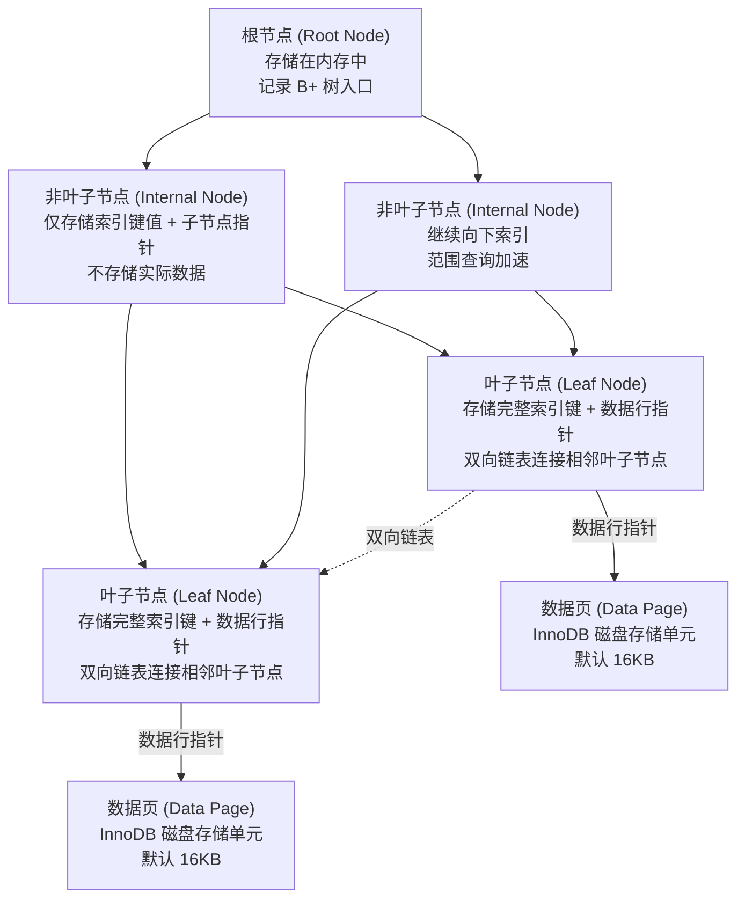

# MySQL 基础与 SQL 核心

> 学习路线对应：第3周 -- 数据访问与 ORM
> 前置知识：计算机基础、Linux 基本操作
> 预计学习时间：2 天

## 一、核心概念

### 1.1 MySQL 安装配置

**Windows 安装（MSI 方式）：**

| 步骤 | 操作 | 注意事项 |
|------|------|---------|
| 下载安装包 | 官网下载 MySQL Community Server 的 MSI 安装包 | 选择 8.x 版本 |
| 选择安装类型 | 选 `Server only` 或 `Custom` | `Custom` 可自定义安装路径 |
| 配置类型 | 选 `Development Computer`（开发机） | 生产环境选 `Server Computer` |
| 认证方式 | 选 `Use Strong Password Encryption` | 即 caching_sha2_password |
| 设置 root 密码 | 输入 root 密码并确认 | 生产环境使用强密码 |
| 配置为服务 | 勾选 `Configure MySQL Server as a Windows Service` | 开机自启 |

**Linux 安装（yum 方式）：**

```bash
# 1. 下载并安装 MySQL 官方 yum 仓库
wget https://dev.mysql.com/get/mysql80-community-release-el7-5.noarch.rpm
sudo rpm -ivh mysql80-community-release-el7-5.noarch.rpm

# 2. 安装 MySQL 服务
sudo yum install mysql-community-server -y

# 3. 启动服务并设置开机自启
sudo systemctl start mysqld
sudo systemctl enable mysqld

# 4. 获取 root 初始密码
sudo grep 'temporary password' /var/log/mysqld.log
# 输出示例：A temporary password is generated for root@localhost: xxxxxx

# 5. 修改 root 密码
mysql -u root -p
ALTER USER 'root'@'localhost' IDENTIFIED BY 'NewPassword123!';
```

**Docker 安装（推荐用于开发环境）：**

```bash
docker run -d \
  --name mysql8 \
  -p 3306:3306 \
  -e MYSQL_ROOT_PASSWORD=123456 \
  -e MYSQL_DATABASE=shop \
  -v /opt/mysql/data:/var/lib/mysql \
  mysql:8.0
```

> 📖 **参考链接**：
> - [MySQL 8.0 Reference Manual: Installing MySQL](https://dev.mysql.com/doc/refman/8.0/en/installing.html)
> - [MySQL 8.0: Installing MySQL on Linux using the MySQL Yum Repository](https://dev.mysql.com/doc/refman/8.0/en/linux-installation-yum-repo.html)
> - [MySQL Docker Hub: Official Image](https://hub.docker.com/_/mysql)

### 1.2 客户端工具对比

| 工具 | 定位 | 优点 | 缺点 | 适用场景 |
|------|------|------|------|---------|
| **MySQL Workbench** | 官方图形客户端 | 免费、官方维护、支持建模 | 启动慢、界面笨重 | 入门学习、数据建模 |
| **DataGrip** | JetBrains 出品 IDE | 智能补全、跨数据库、重构强大 | 收费、内存占用高 | 日常开发首选 |
| **命令行 mysql** | 官方 CLI | 轻量、可在服务器直接使用、适合脚本 | 无图形界面、自动补全弱 | 服务器运维、自动化脚本 |
| **Navicat** | 老牌图形客户端 | 操作直观、数据传输方便 | 收费、对部分语法高亮不全 | 数据库管理、数据迁移 |
| **DBeaver** | 开源通用客户端 | 免费、支持多种数据库 | 大数据量查询较慢 | 多数据库环境 |

**命令行连接与基本操作：**

```bash
# 连接数据库
mysql -h 127.0.0.1 -P 3306 -u root -p

# 常用连接参数
# -h 主机地址  -P 端口  -u 用户名  -p 密码  -D 默认数据库

mysql> SHOW DATABASES;                  -- 查看所有数据库
mysql> USE shop;                        -- 切换数据库
mysql> SHOW TABLES;                     -- 查看当前库所有表
mysql> DESC t_user;                     -- 查看表结构
mysql> SELECT VERSION();                -- 查看 MySQL 版本
mysql> exit;                            -- 退出
```

> 📖 **参考链接**：
> - [MySQL 8.0: MySQL Client Programs（mysql 命令行）](https://dev.mysql.com/doc/refman/8.0/en/mysql.html)
> - [MySQL 8.0: Connecting to the MySQL Server](https://dev.mysql.com/doc/refman/8.0/en/connecting.html)

### 1.3 数据库/表/记录基本概念

| 概念 | 说明 | 对应关系型术语 |
|------|------|---------------|
| **数据库（Database）** | 存储数据的容器，一个 MySQL 实例可有多个库 | Schema |
| **表（Table）** | 数据库中存储数据的逻辑结构，由行和列组成 | Relation / Entity |
| **记录（Record）** | 表中的一行数据，代表一个实体实例 | Row / Tuple |
| **字段（Field）** | 表中的一列，描述实体的某个属性 | Column / Attribute |
| **主键（Primary Key）** | 唯一标识一条记录的字段或字段组合 | PK |
| **外键（Foreign Key）** | 引用其他表主键的字段，用于建立关联 | FK |
| **索引（Index）** | 提高查询效率的数据结构 | Index |

> 📖 **参考链接**：
> - [MySQL 8.0: Database & Table Concepts](https://dev.mysql.com/doc/refman/8.0/en/database-use.html)
> - [MySQL 8.0: CREATE DATABASE Statement](https://dev.mysql.com/doc/refman/8.0/en/create-database.html)

### 1.4 数据类型

**整型：**

| 类型 | 字节 | 有符号范围 | 无符号范围 | 说明 |
|------|------|----------|-----------|------|
| `TINYINT` | 1 | -128 ~ 127 | 0 ~ 255 | 布尔/枚举值 |
| `SMALLINT` | 2 | -32768 ~ 32767 | 0 ~ 65535 | 小范围整数 |
| `MEDIUMINT` | 3 | -8388608 ~ 8388607 | 0 ~ 16777215 | 中等范围 |
| `INT` | 4 | -2^31 ~ 2^31-1 | 0 ~ 2^32-1 | 最常用 |
| `BIGINT` | 8 | -2^63 ~ 2^63-1 | 0 ~ 2^64-1 | 自增主键、雪花 ID |

> 提示：`INT(11)` 中的 11 是显示宽度，不影响存储范围，MySQL 8.0 已废弃该用法。

**浮点型与定点型：**

| 类型 | 字节 | 说明 |
|------|------|------|
| `FLOAT` | 4 | 单精度浮点，存在精度损失 |
| `DOUBLE` | 8 | 双精度浮点，存在精度损失 |
| `DECIMAL(M,D)` | M+2 | 定点数，精确存储；M 总位数（最大 65），D 小数位 |

> 金额、汇率等对精度敏感的场景必须使用 `DECIMAL`，避免 `FLOAT/DOUBLE` 的精度误差。

**字符串类型：**

| 类型 | 最大长度 | 存储方式 | 适用场景 |
|------|---------|---------|---------|
| `CHAR(N)` | 255 字符 | 定长，不足补空格 | 定长编码、哈希值 |
| `VARCHAR(N)` | 65535 字节（行大小上限） | 变长，+1~2 字节长度前缀 | 绝大多数字符串字段 |
| `TINYTEXT` | 255 | 文本，不能有默认值 | 短文本 |
| `TEXT` | 65535 | 文本 | 文章正文 |
| `MEDIUMTEXT` | 16MB | 文本 | 长文本 |
| `LONGTEXT` | 4GB | 文本 | 超大文本 |
| `BLOB` | 65535 | 二进制 | 图片、文件二进制 |

> `CHAR` 与 `VARCHAR` 对比：`CHAR(10)` 存储 "abc" 占用 10 字节；`VARCHAR(10)` 仅占用 4 字节（3 字符 + 1 字节长度）。

**日期时间类型：**

| 类型 | 字节 | 格式 | 范围 | 说明 |
|------|------|------|------|------|
| `YEAR` | 1 | YYYY | 1901 ~ 2155 | 年份 |
| `DATE` | 3 | YYYY-MM-DD | 1000-01-01 ~ 9999-12-31 | 仅日期 |
| `TIME` | 3 | HH:MM:SS | -838:59:59 ~ 838:59:59 | 时间或时间差 |
| `DATETIME` | 8 | YYYY-MM-DD HH:MM:SS | 1000-01-01 ~ 9999-12-31 | 日期+时间，与时区无关 |
| `TIMESTAMP` | 4 | YYYY-MM-DD HH:MM:SS | 1970-01-01 ~ 2038-01-19 | 自动转换为当前时区，范围小 |

> `TIMESTAMP` 存在 2038 年问题；记录创建/更新时间常用 `DATETIME` 或 `TIMESTAMP DEFAULT CURRENT_TIMESTAMP`。

**JSON 类型（MySQL 5.7+）：**

```sql
CREATE TABLE t_config (
    id INT PRIMARY KEY AUTO_INCREMENT,
    config JSON,
    extra JSON
);

INSERT INTO t_config (config) VALUES
('{"name": "张三", "age": 20, "tags": ["vip", "active"]}');

-- JSON 函数查询
SELECT config->'$.name' AS name,
       config->>'$.name' AS name_unquoted,
       JSON_EXTRACT(config, '$.tags[0]') AS first_tag
FROM t_config;

-- 更新 JSON 字段
UPDATE t_config SET config = JSON_SET(config, '$.age', 21) WHERE id = 1;
```

> 📖 **参考链接**：
> - [MySQL 8.0: Data Types（数据类型完整参考）](https://dev.mysql.com/doc/refman/8.0/en/data-types.html)
> - [MySQL 8.0: Numeric Data Types](https://dev.mysql.com/doc/refman/8.0/en/numeric-types.html)
> - [MySQL 8.0: String Data Types](https://dev.mysql.com/doc/refman/8.0/en/string-types.html)
> - [MySQL 8.0: JSON Data Type](https://dev.mysql.com/doc/refman/8.0/en/json.html)

---

## 二、底层原理

### 2.1 SQL 分类

| 分类 | 全称 | 说明 | 关键字 |
|------|------|------|--------|
| **DDL** | Data Definition Language | 定义/修改库表结构 | `CREATE`、`ALTER`、`DROP`、`TRUNCATE` |
| **DML** | Data Manipulation Language | 操作表中的数据 | `INSERT`、`UPDATE`、`DELETE` |
| **DQL** | Data Query Language | 查询数据 | `SELECT` |
| **DCL** | Data Control Language | 控制权限和事务 | `GRANT`、`REVOKE`、`COMMIT`、`ROLLBACK` |

> **生活化类比：事务 ACID = 银行转账** -- 把事务的四大特性想象成银行转账的全过程：
> - **原子性（Atomicity）**：张三给李四转1000元，两步操作（张三扣款 + 李四到账）必须全部成功或全部失败。不能出现张三扣了钱但李四没收到。就像转账要么完全成功，要么完全取消。
> - **一致性（Consistency）**：转账前后，银行的总存款必须不变（张三扣1000，李四加1000，总和不变）。就像能量守恒，数据必须满足所有业务规则约束。
> - **隔离性（Isolation）**：张三同时给李四转账1000元，又给王五转账500元，两笔转账互不干扰。就像银行的不同窗口同时办理业务，彼此看不到对方未完成的操作。
> - **持久性（Durability）**：转账成功后，即使银行系统突然断电，重启后数据依然存在。就像银行给你开了转账凭证，钱已经实实在在到账了，不会丢失。

> 📖 **参考链接**：
> - [MySQL 8.0: SQL Statement Syntax（SQL 语句分类）](https://dev.mysql.com/doc/refman/8.0/en/sql-statements.html)
> - [MySQL 8.0: Transaction Isolation Levels（事务隔离级别）](https://dev.mysql.com/doc/refman/8.0/en/innodb-transaction-isolation-levels.html)
> - [MySQL 8.0: ACID Compliance](https://dev.mysql.com/doc/refman/8.0/en/mysql-acid.html)

### 2.2 DDL 语法

```sql
-- 创建数据库
CREATE DATABASE IF NOT EXISTS shop
    DEFAULT CHARACTER SET utf8mb4
    DEFAULT COLLATE utf8mb4_general_ci;

-- 创建表
CREATE TABLE IF NOT EXISTS t_user (
    id          BIGINT       NOT NULL AUTO_INCREMENT COMMENT '主键ID',
    username    VARCHAR(50) NOT NULL COMMENT '用户名',
    email       VARCHAR(100) DEFAULT NULL COMMENT '邮箱',
    age         TINYINT UNSIGNED DEFAULT 0 COMMENT '年龄',
    balance     DECIMAL(10,2) DEFAULT 0.00 COMMENT '余额',
    status      TINYINT      NOT NULL DEFAULT 1 COMMENT '状态 0禁用 1启用',
    created_at  DATETIME     NOT NULL DEFAULT CURRENT_TIMESTAMP COMMENT '创建时间',
    updated_at  DATETIME     NOT NULL DEFAULT CURRENT_TIMESTAMP ON UPDATE CURRENT_TIMESTAMP COMMENT '更新时间',
    PRIMARY KEY (id),
    UNIQUE KEY uk_username (username),
    KEY idx_email (email)
) ENGINE=InnoDB DEFAULT CHARSET=utf8mb4 COMMENT='用户表';

-- 修改表结构
ALTER TABLE t_user ADD COLUMN phone VARCHAR(20) COMMENT '手机号';       -- 添加列
ALTER TABLE t_user MODIFY COLUMN age SMALLINT UNSIGNED;                  -- 修改列类型
ALTER TABLE t_user CHANGE COLUMN age user_age SMALLINT UNSIGNED;        -- 修改列名+类型
ALTER TABLE t_user DROP COLUMN phone;                                   -- 删除列
ALTER TABLE t_user RENAME TO t_member;                                  -- 重命名表

-- 删除表（结构+数据）
DROP TABLE IF EXISTS t_member;

-- 清空表数据（保留结构，重置自增，比 DELETE 快）
TRUNCATE TABLE t_user;
```

> `DROP`、`TRUNCATE`、`DELETE` 区别：`DROP` 删表结构和数据且不可回滚；`TRUNCATE` 清空数据重置自增，不可回滚（DDL 自动提交）；`DELETE` 按条件删除数据，可回滚，不重置自增。

> 📖 **参考链接**：
> - [MySQL 8.0: CREATE TABLE Statement](https://dev.mysql.com/doc/refman/8.0/en/create-table.html)
> - [MySQL 8.0: ALTER TABLE Statement](https://dev.mysql.com/doc/refman/8.0/en/alter-table.html)
> - [MySQL 8.0: TRUNCATE TABLE Statement](https://dev.mysql.com/doc/refman/8.0/en/truncate-table.html)
> - [MySQL 8.0: DROP TABLE Statement](https://dev.mysql.com/doc/refman/8.0/en/drop-table.html)

### 2.3 DML 语法

```sql
-- INSERT：插入数据
INSERT INTO t_user (username, email, age) VALUES ('zhangsan', 'zs@xx.com', 20);

-- 批量插入（推荐，减少网络往返）
INSERT INTO t_user (username, email, age) VALUES
('lisi', 'ls@xx.com', 22),
('wangwu', 'ww@xx.com', 25);

-- INSERT ... ON DUPLICATE KEY UPDATE（存在则更新，不存在则插入）
INSERT INTO t_user (id, username, balance) VALUES (1, 'zhangsan', 100)
ON DUPLICATE KEY UPDATE balance = VALUES(balance);

-- UPDATE：更新数据（务必带 WHERE）
UPDATE t_user SET age = 21, balance = balance + 50 WHERE id = 1;

-- DELETE：删除数据（务必带 WHERE）
DELETE FROM t_user WHERE id = 1;
```

> 📖 **参考链接**：
> - [MySQL 8.0: INSERT Statement](https://dev.mysql.com/doc/refman/8.0/en/insert.html)
> - [MySQL 8.0: INSERT ... ON DUPLICATE KEY UPDATE](https://dev.mysql.com/doc/refman/8.0/en/insert-on-duplicate.html)
> - [MySQL 8.0: UPDATE Statement](https://dev.mysql.com/doc/refman/8.0/en/update.html)
> - [MySQL 8.0: DELETE Statement](https://dev.mysql.com/doc/refman/8.0/en/delete.html)

### 2.4 DQL 语法（SELECT）

**完整执行顺序：**

```
FROM → JOIN → ON → WHERE → GROUP BY → HAVING → SELECT → DISTINCT → ORDER BY → LIMIT
```

| 子句 | 作用 | 示例 |
|------|------|------|
| `FROM` | 指定数据源 | `FROM t_user u` |
| `JOIN ... ON` | 表关联 | `LEFT JOIN t_order o ON u.id = o.user_id` |
| `WHERE` | 行级过滤（分组前） | `WHERE u.age > 18` |
| `GROUP BY` | 分组 | `GROUP BY u.status` |
| `HAVING` | 组级过滤（分组后） | `HAVING COUNT(o.id) > 5` |
| `SELECT` | 选择列 | `SELECT u.id, u.username` |
| `DISTINCT` | 去重 | `SELECT DISTINCT u.status` |
| `ORDER BY` | 排序 | `ORDER BY u.created_at DESC` |
| `LIMIT` | 分页限制 | `LIMIT 10 OFFSET 20` |

**聚合函数：**

| 函数 | 说明 | 示例 |
|------|------|------|
| `COUNT(*)` | 统计行数（含 NULL） | `COUNT(*) AS total` |
| `COUNT(col)` | 统计非 NULL 行数 | `COUNT(email) AS has_email` |
| `SUM(col)` | 求和（忽略 NULL） | `SUM(balance) AS total_balance` |
| `AVG(col)` | 平均值 | `AVG(age) AS avg_age` |
| `MAX(col)` | 最大值 | `MAX(balance) AS max_balance` |
| `MIN(col)` | 最小值 | `MIN(created_at) AS earliest` |

```sql
SELECT
    status,
    COUNT(*)                       AS user_count,
    COUNT(email)                   AS has_email,
    AVG(age)                       AS avg_age,
    MAX(balance)                   AS max_balance,
    SUM(balance)                   AS total_balance
FROM t_user
GROUP BY status
HAVING COUNT(*) > 10
ORDER BY user_count DESC;
```

> 📖 **参考链接**：
> - [MySQL 8.0: SELECT Statement](https://dev.mysql.com/doc/refman/8.0/en/select.html)
> - [MySQL 8.0: Aggregate Functions](https://dev.mysql.com/doc/refman/8.0/en/aggregate-functions.html)
> - [MySQL 8.0: GROUP BY Optimization](https://dev.mysql.com/doc/refman/8.0/en/group-by-optimization.html)

### 2.5 多表 JOIN

| 类型 | 说明 | 图示 |
|------|------|------|
| `INNER JOIN` | 内连接，取两表交集 | 两圆相交部分 |
| `LEFT JOIN` | 左连接，左表全保留，右表无匹配补 NULL | 左圆全部 |
| `RIGHT JOIN` | 右连接，右表全保留，左表无匹配补 NULL | 右圆全部 |
| `CROSS JOIN` | 交叉连接（笛卡尔积） | 两圆所有组合 |

```sql
-- 建表准备：用户表、订单表
CREATE TABLE t_order (
    id BIGINT PRIMARY KEY AUTO_INCREMENT,
    user_id BIGINT NOT NULL,
    amount DECIMAL(10,2) NOT NULL,
    created_at DATETIME DEFAULT CURRENT_TIMESTAMP,
    KEY idx_user_id (user_id)
);

-- INNER JOIN：查询有下单的用户及其订单
SELECT u.username, o.amount, o.created_at
FROM t_user u
INNER JOIN t_order o ON u.id = o.user_id;

-- LEFT JOIN：查询所有用户，没下单的也显示（订单字段为 NULL）
SELECT u.username, o.amount
FROM t_user u
LEFT JOIN t_order o ON u.id = o.user_id;

-- 查询从未下单的用户（LEFT JOIN + IS NULL）
SELECT u.username
FROM t_user u
LEFT JOIN t_order o ON u.id = o.user_id
WHERE o.id IS NULL;

-- 三表 JOIN：用户-订单-商品
SELECT u.username, o.amount, p.product_name
FROM t_user u
JOIN t_order o ON u.id = o.user_id
JOIN t_order_item oi ON o.id = oi.order_id
JOIN t_product p ON oi.product_id = p.id;
```

> 📖 **参考链接**：
> - [MySQL 8.0: JOIN Syntax（多表连接详解）](https://dev.mysql.com/doc/refman/8.0/en/join.html)
> - [MySQL 8.0: Nested Join Optimization](https://dev.mysql.com/doc/refman/8.0/en/nested-join-optimization.html)

### 2.6 子查询

| 子查询类型 | 说明 | 示例 |
|----------|------|------|
| **标量子查询** | 返回单行单列，可用在 `= > <` 之后 | `WHERE age > (SELECT AVG(age) FROM t_user)` |
| **列子查询** | 返回一列多行，配合 `IN/ANY/ALL` | `WHERE user_id IN (SELECT id FROM t_user WHERE status=1)` |
| **行子查询** | 返回一行多列 | `WHERE (age, balance) = (SELECT MAX(age), MAX(balance) FROM t_user)` |
| **表子查询** | 返回多行多列，作为临时表放在 FROM 后 | `FROM (SELECT ... ) tmp` |
| **EXISTS 子查询** | 判断是否存在，返回布尔 | `WHERE EXISTS (SELECT 1 FROM t_order WHERE user_id = u.id)` |

```sql
-- 标量子查询：查询比平均年龄大的用户
SELECT * FROM t_user WHERE age > (SELECT AVG(age) FROM t_user);

-- 列子查询：查询有订单的用户
SELECT * FROM t_user WHERE id IN (SELECT DISTINCT user_id FROM t_order);

-- 表子查询：每个用户最新一笔订单
SELECT u.username, t.amount, t.created_at
FROM t_user u
JOIN (
    SELECT user_id, amount, created_at
    FROM t_order o1
    WHERE created_at = (SELECT MAX(created_at) FROM t_order o2 WHERE o1.user_id = o2.user_id)
) t ON u.id = t.user_id;

-- EXISTS：查询有订单的用户（通常比 IN 高效）
SELECT * FROM t_user u
WHERE EXISTS (SELECT 1 FROM t_order o WHERE o.user_id = u.id);
```

> `IN` vs `EXISTS`：小表驱动大表时，`IN` 适合子查询结果小；`EXISTS` 适合主查询结果小（对外层每行执行子查询判断）。

> 📖 **参考链接**：
> - [MySQL 8.0: Subquery Syntax（子查询详解）](https://dev.mysql.com/doc/refman/8.0/en/subqueries.html)
> - [MySQL 8.0: Subquery Optimization](https://dev.mysql.com/doc/refman/8.0/en/subquery-optimization.html)

### 2.7 视图

```sql
-- 创建视图：封装复杂查询，简化访问
CREATE OR REPLACE VIEW v_user_order_stats AS
SELECT
    u.id,
    u.username,
    COUNT(o.id)       AS order_count,
    IFNULL(SUM(o.amount), 0) AS total_amount
FROM t_user u
LEFT JOIN t_order o ON u.id = o.user_id
GROUP BY u.id, u.username;

-- 使用视图（像查表一样）
SELECT * FROM v_user_order_stats WHERE order_count > 0;

-- 查看视图定义
SHOW CREATE VIEW v_user_order_stats;

-- 删除视图
DROP VIEW IF EXISTS v_user_order_stats;
```

> 视图是逻辑上的虚拟表，不存储数据，只存储 SQL 定义。适合简化复杂查询、控制权限，但不适合做复杂计算或频繁更新。

> 📖 **参考链接**：
> - [MySQL 8.0: CREATE VIEW Statement](https://dev.mysql.com/doc/refman/8.0/en/create-view.html)
> - [MySQL 8.0: View Restrictions](https://dev.mysql.com/doc/refman/8.0/en/view-restrictions.html)

### 2.8 索引基础

```sql
-- 创建索引
CREATE INDEX idx_email ON t_user(email);                       -- 普通索引
CREATE UNIQUE INDEX uk_username ON t_user(username);           -- 唯一索引
ALTER TABLE t_user ADD INDEX idx_status_age (status, age);    -- 联合索引

-- 查看索引
SHOW INDEX FROM t_user;

-- 删除索引
DROP INDEX idx_email ON t_user;
ALTER TABLE t_user DROP INDEX idx_status_age;
```

| 索引类型 | 关键字 | 说明 |
|---------|--------|------|
| 主键索引 | `PRIMARY KEY` | 唯一且非空，一张表一个 |
| 唯一索引 | `UNIQUE` | 值唯一，可为 NULL |
| 普通索引 | `INDEX/KEY` | 加速查询，无约束 |
| 联合索引 | `INDEX(a,b,c)` | 遵循最左前缀原则 |
| 全文索引 | `FULLTEXT` | 用于文本搜索 |

> 索引底层为 B+ 树，详细原理见 [06-MySQL深度优化](../../03-distributed-microservices/mysql-advanced/06-MySQL深度优化.md)。



> 上图展示了 InnoDB B+ 树索引的经典结构：根节点和非叶子节点仅存储索引键值用于导航，实际数据存储在叶子节点中，叶子节点之间通过双向链表连接以支持高效的范围查询。这一设计使得 B+ 树索引在等值查询和范围查询场景下均能保持 O(log n) 的时间复杂度。

> **生活化类比：图书馆索书号** -- 索引（B+树）就像图书馆的索书号系统：
> - 你想要找一本《Java编程思想》，不是从第一排书架一本本翻（全表扫描），而是先在电脑上查索书号（走索引），然后直接去对应的书架位置找到那本书（回表或覆盖索引）。
> - B+树的非叶子节点就像图书馆的楼层导航牌（只告诉你"计算机类在3楼"），叶子节点就像具体书架上的排列（按索书号有序排列，形成链表），可以快速定位到具体的一本书。
> - 联合索引就像按"楼层-区域-书架号"的层级索书号，你必须从最左的层级开始查（最左前缀原则），不能跳过楼层直接查书架号。

> 📖 **参考链接**：
> - [MySQL 8.0: CREATE INDEX Statement](https://dev.mysql.com/doc/refman/8.0/en/create-index.html)
> - [MySQL 8.0: InnoDB Indexes（B+ 树索引）](https://dev.mysql.com/doc/refman/8.0/en/innodb-indexes.html)
> - [MySQL 8.0: Multiple-Column Indexes（联合索引最左前缀）](https://dev.mysql.com/doc/refman/8.0/en/multiple-column-indexes.html)
> - [MySQL 8.0: B-Tree Index Characteristics](https://dev.mysql.com/doc/refman/8.0/en/index-btree-hash.html)

---

## 三、实战应用

### 3.1 完整建库建表演练

以电商系统核心三表（用户、商品、订单）为例：

```sql
-- 1. 创建数据库
CREATE DATABASE IF NOT EXISTS shop
    DEFAULT CHARACTER SET utf8mb4 COLLATE utf8mb4_general_ci;
USE shop;

-- 2. 用户表
CREATE TABLE t_user (
    id          BIGINT       NOT NULL AUTO_INCREMENT,
    username    VARCHAR(50) NOT NULL,
    email       VARCHAR(100),
    phone       VARCHAR(20),
    balance     DECIMAL(10,2) DEFAULT 0.00,
    status      TINYINT      NOT NULL DEFAULT 1 COMMENT '0禁用 1启用',
    created_at  DATETIME     NOT NULL DEFAULT CURRENT_TIMESTAMP,
    updated_at  DATETIME     NOT NULL DEFAULT CURRENT_TIMESTAMP ON UPDATE CURRENT_TIMESTAMP,
    PRIMARY KEY (id),
    UNIQUE KEY uk_username (username),
    UNIQUE KEY uk_phone (phone),
    KEY idx_email (email)
) ENGINE=InnoDB DEFAULT CHARSET=utf8mb4 COMMENT='用户表';

-- 3. 商品表
CREATE TABLE t_product (
    id           BIGINT        NOT NULL AUTO_INCREMENT,
    product_name VARCHAR(100)  NOT NULL,
    price        DECIMAL(10,2) NOT NULL,
    stock        INT           NOT NULL DEFAULT 0,
    category     VARCHAR(50),
    created_at   DATETIME      NOT NULL DEFAULT CURRENT_TIMESTAMP,
    PRIMARY KEY (id),
    KEY idx_category (category),
    KEY idx_product_name (product_name)
) ENGINE=InnoDB DEFAULT CHARSET=utf8mb4 COMMENT='商品表';

-- 4. 订单表
CREATE TABLE t_order (
    id         BIGINT        NOT NULL AUTO_INCREMENT,
    order_no   VARCHAR(32)  NOT NULL COMMENT '订单号',
    user_id    BIGINT        NOT NULL,
    amount     DECIMAL(10,2) NOT NULL,
    status     TINYINT       NOT NULL DEFAULT 0 COMMENT '0待支付 1已支付 2已取消',
    created_at DATETIME      NOT NULL DEFAULT CURRENT_TIMESTAMP,
    PRIMARY KEY (id),
    UNIQUE KEY uk_order_no (order_no),
    KEY idx_user_id (user_id),
    KEY idx_status_created (status, created_at)
) ENGINE=InnoDB DEFAULT CHARSET=utf8mb4 COMMENT='订单表';

-- 5. 插入测试数据
INSERT INTO t_user (username, email, phone, balance) VALUES
('zhangsan', 'zs@qq.com', '13800000001', 1000.00),
('lisi', 'ls@qq.com', '13800000002', 500.00),
('wangwu', null, '13800000003', 0.00);

INSERT INTO t_product (product_name, price, stock, category) VALUES
('iPhone 15', 5999.00, 100, '手机'),
('MacBook Pro', 12999.00, 50, '电脑'),
('AirPods', 1299.00, 200, '配件');

INSERT INTO t_order (order_no, user_id, amount, status) VALUES
('NO20250101001', 1, 5999.00, 1),
('NO20250101002', 1, 1299.00, 1),
('NO20250102001', 2, 12999.00, 0),
('NO20250102002', 3, 1299.00, 2);
```

> 📖 **参考链接**：
> - [MySQL 8.0: CREATE TABLE Examples（建表实战）](https://dev.mysql.com/doc/refman/8.0/en/create-table.html)
> - [MySQL 8.0: Data Type Best Practices](https://dev.mysql.com/doc/refman/8.0/en/data-type-defaults.html)

### 3.2 分页查询（LIMIT）

```sql
-- 标准分页：page=2, size=10
-- 公式：LIMIT (page-1)*size, size
SELECT id, username, created_at
FROM t_user
ORDER BY id ASC
LIMIT 10 OFFSET 10;          -- 等价于 LIMIT 10, 10

-- 深分页优化（百万级数据，LIMIT 1000000, 10 很慢）
-- 方案：子查询先定位主键，再 JOIN
SELECT u.* FROM t_user u
INNER JOIN (
    SELECT id FROM t_user ORDER BY id LIMIT 1000000, 10
) t ON u.id = t.id;
```

> 📖 **参考链接**：
> - [MySQL 8.0: LIMIT Optimization（分页优化）](https://dev.mysql.com/doc/refman/8.0/en/limit-optimization.html)

### 3.3 分组统计

```sql
-- 统计各状态用户数量及平均余额
SELECT
    status,
    COUNT(*)                 AS user_count,
    ROUND(AVG(balance), 2)   AS avg_balance,
    SUM(balance)             AS total_balance
FROM t_user
GROUP BY status;

-- 统计每个用户的订单数和总消费（仅统计已支付订单）
SELECT
    u.username,
    COUNT(o.id)              AS order_count,
    IFNULL(SUM(o.amount), 0) AS total_spent
FROM t_user u
LEFT JOIN t_order o ON u.id = o.user_id AND o.status = 1
GROUP BY u.id, u.username
ORDER BY total_spent DESC;

-- 按天统计订单量（按日期分组）
SELECT
    DATE(created_at)         AS order_date,
    COUNT(*)                 AS daily_count,
    SUM(amount)              AS daily_amount
FROM t_order
GROUP BY DATE(created_at)
ORDER BY order_date DESC;
```

> 📖 **参考链接**：
> - [MySQL 8.0: GROUP BY Optimization（分组优化）](https://dev.mysql.com/doc/refman/8.0/en/group-by-optimization.html)
> - [MySQL 8.0: Date and Time Functions](https://dev.mysql.com/doc/refman/8.0/en/date-and-time-functions.html)

### 3.4 多表关联查询

```sql
-- 查询用户与其所有已支付订单（用户全保留）
SELECT u.username, u.phone, o.order_no, o.amount, o.created_at
FROM t_user u
LEFT JOIN t_order o ON u.id = o.user_id AND o.status = 1
ORDER BY u.id, o.created_at DESC;

-- 查询消费总额 TOP3 用户（子查询 + 排序 + 分页）
SELECT u.username, t.total_spent
FROM t_user u
JOIN (
    SELECT user_id, SUM(amount) AS total_spent
    FROM t_order WHERE status = 1
    GROUP BY user_id
) t ON u.id = t.user_id
ORDER BY t.total_spent DESC
LIMIT 3;

-- 查询从未下单的用户（LEFT JOIN + IS NULL）
SELECT u.username
FROM t_user u
LEFT JOIN t_order o ON u.id = o.user_id
WHERE o.id IS NULL;
```

> 📖 **参考链接**：
> - [MySQL 8.0: JOIN Examples（多表查询实战）](https://dev.mysql.com/doc/refman/8.0/en/join.html)
> - [MySQL 8.0: Subquery with EXISTS](https://dev.mysql.com/doc/refman/8.0/en/exists-and-not-exists-subqueries.html)

---

## 四、常见面试题（附答案）

### 1. CHAR 和 VARCHAR 的区别？

`CHAR(N)` 是定长字符串，无论实际存储多少字符都占用 N 个字符空间，不足部分用空格填充，适合长度固定的字段（如 MD5 哈希值、性别编码）。`VARCHAR(N)` 是变长字符串，按实际长度存储并额外占用 1~2 字节记录长度，适合长度不固定的字段（如用户名、邮箱）。`CHAR` 读取效率略高（无长度计算），`VARCHAR` 节省空间，绝大多数场景使用 `VARCHAR`。

### 2. DROP、TRUNCATE、DELETE 的区别？

`DELETE` 是 DML，按条件删除数据，可回滚，不重置自增值，会记录到 binlog，速度较慢；`TRUNCATE` 是 DDL，清空整表数据并重置自增，不可回滚（自动提交），速度快；`DROP` 是 DDL，删除表结构和数据，不可回滚，速度最快。删除部分数据用 `DELETE`，清空整表用 `TRUNCATE`，不再需要该表用 `DROP`。

### 3. WHERE 和 HAVING 的区别？

执行时机不同：`WHERE` 在分组前过滤行，不能使用聚合函数；`HAVING` 在分组后过滤组，可以使用聚合函数。例如 `WHERE age > 18` 过滤年龄大于 18 的行后再分组，`HAVING COUNT(*) > 5` 过滤组内行数大于 5 的分组。两者可共存，`WHERE` 先过滤基础数据，`HAVING` 再过滤聚合结果。

### 4. INNER JOIN 和 LEFT JOIN 的区别？

`INNER JOIN` 只返回两表中匹配的记录（交集），不匹配的行被丢弃。`LEFT JOIN` 以左表为基准，左表所有行都保留，右表无匹配时右表字段补 NULL。查询"所有用户及其订单"（包括没下单的用户）必须用 `LEFT JOIN`；查询"有下单的用户"两者皆可但 `INNER JOIN` 更直观。结合 `IS NULL` 可查询"未下单用户"（`LEFT JOIN ... WHERE o.id IS NULL`）。

### 5. COUNT(*)、COUNT(1)、COUNT(列) 的区别？

在 InnoDB 中三者性能基本相同，MySQL 8.0 已优化。`COUNT(*)` 和 `COUNT(1)` 统计所有行（含 NULL），不会取具体列值；`COUNT(列)` 统计该列非 NULL 的行数。`COUNT(*)` 是 SQL 标准写法，推荐使用。如果列上有索引，`COUNT(列)` 可能走覆盖索引略快；无索引时三者差异极小。需要注意 `COUNT(列)` 会忽略 NULL 行，结果可能与预期不符。

> 📖 **参考链接**：
> - [MySQL 8.0: Aggregate Functions (COUNT)](https://dev.mysql.com/doc/refman/8.0/en/aggregate-functions.html#function_count)
> - [MySQL 8.0: CHAR vs VARCHAR](https://dev.mysql.com/doc/refman/8.0/en/char.html)
> - [MySQL 8.0: InnoDB Row Formats](https://dev.mysql.com/doc/refman/8.0/en/innodb-row-format.html)

---

## 五、避坑指南

| 常见错误 | 现象 | 原因 | 解决方案 |
|---------|------|------|---------|
| UPDATE/DELETE 不带 WHERE | 全表数据被修改/删除 | 忘记加条件或先执行了语句 | 执行前用 SELECT 验证条件；开启安全模式 `SET sql_safe_updates=1` |
| VARCHAR 长度设置过大 | 创建表失败或行数据超限 | MySQL 单行最大 65535 字节，多个 VARCHAR 累加超限 | 评估实际需求；超长文本用 TEXT 类型 |
| 金额使用 FLOAT/DOUBLE | 计算结果出现精度误差 | 浮点数采用二进制存储，无法精确表示十进制小数 | 金额使用 `DECIMAL(10,2)`，应用层使用 BigDecimal |
| DATETIME 与 TIMESTAMP 混用 | 跨时区显示异常或 2038 年溢出 | TIMESTAMP 自动转时区且范围仅到 2038 | 业务时间用 DATETIME；自动记录时间可用 TIMESTAMP |
| 分页深翻页慢 | `LIMIT 1000000,10` 查询耗时数秒 | 扫描并丢弃前 100 万行后才取 10 行 | 子查询先定位主键再 JOIN；或用游标分页（记录上一页最大 id） |
| GROUP BY 后直接 SELECT 非聚合列 | 结果不确定或报错 | SQL 模式 `ONLY_FULL_GROUP_BY` 禁止非聚合列随意出现 | SELECT 只包含分组列或聚合列；或调整业务逻辑 |
| 隐式类型转换导致索引失效 | 字符串列与数字比较时全表扫描 | MySQL 对列做类型转换使索引失效 | 比较值与列类型一致：`WHERE phone = '13800000001'` |
| 索引列上使用函数 | 索引失效 | 函数破坏索引有序性 | 把函数移到值一侧：`WHERE created_at >= '2025-01-01'` |

## 本章学习自检

完成本章学习后，应该能够：
- [ ] 用自己的话解释 SQL 四大分类、MySQL 数据类型选择、JOIN 类型与子查询类型
- [ ] 手写建库建表语句、分页查询、分组统计、多表关联查询
- [ ] 回答常见面试题（CHAR vs VARCHAR、DROP/TRUNCATE/DELETE、WHERE vs HAVING、JOIN 区别、COUNT 区别）
- [ ] 在实战项目中完成数据库设计与 SQL 编写
- [ ] 识别并避免常见错误（忘加 WHERE、金额精度、深分页、隐式类型转换等）

---

> **学习导航**：
> - 返回 [学习路线总览](../../README.md)
> - 本模块其他文件：[02-JDBC核心原理](./02-JDBC核心原理.md) | [03-MyBatis原生框架](../../02-javaweb-monolith/mybatis/03-MyBatis原生框架.md) | [04-Spring-Data-JPA深度](../../02-javaweb-monolith/mybatis/04-Spring-Data-JPA深度.md) | [05-MyBatis-Plus实战](../../02-javaweb-monolith/mybatis/05-MyBatis-Plus实战.md) | [06-MySQL深度优化](../../03-distributed-microservices/mysql-advanced/06-MySQL深度优化.md) | [07-数据库笔面试题集](../../03-distributed-microservices/mysql-advanced/07-数据库笔面试题集.md)
> - 实战应用：[电商订单实时统计分析平台](../../extensions/project/01-电商订单实时统计分析平台.md)
