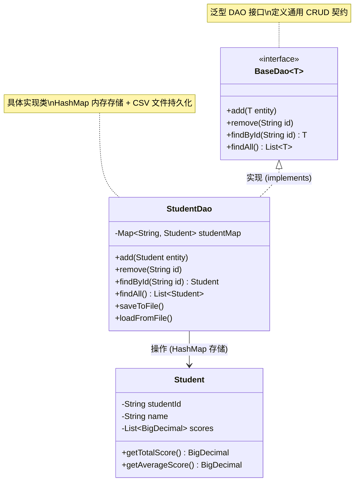

# mysql-jdbc - 综合场景串联

---

## 场景一：从零实现用户注册登录系统

### 场景描述

构建一个简易的用户注册与登录模块，使用 MySQL 存储用户数据，通过 JDBC 实现数据访问层，包含注册时的密码加密存储、登录时的安全校验，以及注册时赠送初始余额的事务操作。

### 涉及知识点

- [MySQL 建表与数据类型选择](./01-MySQL基础与SQL核心.md#14-数据类型)：设计用户表，合理选择字段类型（BIGINT 主键、VARCHAR 用户名、DECIMAL 余额、DATETIME 时间）
- [JDBC 编程六步骤](./02-JDBC核心原理.md#12-jdbc-编程六步骤)：加载驱动、获取连接、创建 PreparedStatement、执行 SQL、处理结果集、释放资源
- [PreparedStatement 防 SQL 注入](./02-JDBC核心原理.md#21-preparedstatement-vs-statement)：登录查询使用参数化查询，避免拼接字符串
- [JDBC 事务管理](./02-JDBC核心原理.md#25-事务管理)：注册时同时创建用户和初始化余额账户，使用事务保证原子性
- [获取自增主键](./02-JDBC核心原理.md#31-完整-jdbc-crud-示例)：插入用户后获取数据库生成的用户 ID

### 协作流程

```
1. MySQL 建表                          2. 用户注册
   CREATE TABLE t_user (                  conn.setAutoCommit(false)
     id BIGINT AUTO_INCREMENT,            INSERT INTO t_user (username, password_hash)
     username VARCHAR(50) UNIQUE,         INSERT INTO t_account (user_id, balance)
     password_hash VARCHAR(64),           conn.commit()
     ...
   ) ENGINE=InnoDB;                    3. 用户登录
                                          SELECT * FROM t_user
                                          WHERE username=? AND password_hash=?
                                       4. 资源释放
                                          try-with-resources 自动关闭
```

### 关键要点

- 密码存储使用哈希算法（如 BCrypt），不存储明文
- 登录查询必须使用 PreparedStatement 的 `?` 占位符，防止 `' OR '1'='1'` 注入
- 注册插入用户和初始化账户必须在同一事务中，任一步骤失败则整体回滚
- 连接在 finally 块中恢复 autoCommit 并关闭，防止连接泄漏
- 用户名设置 UNIQUE 约束，防止重复注册，捕获 DuplicateKeyException 给用户友好提示



> 上图展示了泛型 DAO 设计模式中 BaseDao 接口与 StudentDao 实现类的继承关系。BaseDao 通过泛型参数 `<T>` 定义了通用的 CRUD 操作契约，StudentDao 实现该接口并基于 HashMap 完成内存存储，同时扩展了文件持久化能力。

---

## 场景二：批量导入 10 万条数据的最优方案

### 场景描述

某电商系统需要从外部 CSV 文件批量导入 10 万条商品数据到 MySQL，要求尽可能快且保证数据一致性，中途失败时整体回滚，同时不能影响现有在线业务的正常查询。

### 涉及知识点

- [MySQL 索引优化](./01-MySQL基础与SQL核心.md#28-索引基础)：导入前临时删除非必要索引，导入后重建，避免逐行维护索引的巨大开销
- [JDBC 批处理](./02-JDBC核心原理.md#五避坑指南)：使用 `addBatch()` + `executeBatch()` 批量提交，配合 `rewriteBatchedStatements=true` 将多条 INSERT 合并为一条 SQL
- [JDBC 事务管理](./02-JDBC核心原理.md#25-事务管理)：分批提交事务，每 5000 条为一个批次提交一次，避免单事务过大导致 undo 日志膨胀
- [连接池配置](./02-JDBC核心原理.md#22-连接池原理)：使用 HikariCP 配置合理的连接池参数，控制最大连接数避免影响在线业务
- [MySQL 数据类型与 DDL](./01-MySQL基础与SQL核心.md#22-ddl-语法)：建表时选择合适的数据类型和存储引擎，设置合理的字段默认值

### 协作流程

```
1. 建表与准备
   创建 t_product 表，ENGINE=InnoDB
   暂不创建二级索引（仅保留主键）

2. 配置连接池
   HikariCP: maximumPoolSize=10
   URL 添加 rewriteBatchedStatements=true

3. 分批导入
   conn.setAutoCommit(false)
   for (每 5000 条) {
       ps.addBatch()
       ps.executeBatch()
       conn.commit()
   }

4. 重建索引
   ALTER TABLE t_product ADD INDEX idx_category (category)
   ALTER TABLE t_product ADD INDEX idx_product_name (product_name)

5. 异常处理
   catch 时 conn.rollback()
   记录失败批次号，支持断点续传
```

### 关键要点

- 单条 INSERT 逐条执行 10 万次网络往返耗时数分钟，批量 + 合并改写后可在数秒内完成
- 导入前删除索引可减少 50% 以上写入开销，导入后一次性重建索引比逐行维护快得多
- 每 5000 条提交一次事务，平衡事务大小与提交频率，避免单事务过大或提交过于频繁
- `rewriteBatchedStatements=true` 是 MySQL JDBC 驱动的关键参数，将多条 VALUES 合并为 `INSERT INTO t VALUES (...), (...), (...)` 形式
- 连接池的 maximumPoolSize 不宜过大，避免导入任务占满连接影响在线用户请求
- 分批提交后若中途失败，已提交的批次不会回滚，需记录进度支持断点续传

### 完整可运行示例代码

以下代码展示了基于 HikariCP 连接池的 JDBC 操作，覆盖用户注册登录（事务）和批量导入两大场景。

**步骤一：Maven 依赖配置（pom.xml）**

```xml
<dependencies>
    <!-- MySQL 驱动 -->
    <dependency>
        <groupId>com.mysql</groupId>
        <artifactId>mysql-connector-j</artifactId>
        <version>8.0.33</version>
    </dependency>

    <!-- HikariCP 连接池 -->
    <dependency>
        <groupId>com.zaxxer</groupId>
        <artifactId>HikariCP</artifactId>
        <version>5.0.1</version>
    </dependency>

    <!-- BCrypt 密码加密 -->
    <dependency>
        <groupId>org.mindrot</groupId>
        <artifactId>jbcrypt</artifactId>
        <version>0.4</version>
    </dependency>

    <!-- SLF4J 日志 -->
    <dependency>
        <groupId>org.slf4j</groupId>
        <artifactId>slf4j-api</artifactId>
        <version>2.0.9</version>
    </dependency>
    <dependency>
        <groupId>ch.qos.logback</groupId>
        <artifactId>logback-classic</artifactId>
        <version>1.4.11</version>
    </dependency>
</dependencies>
```

**步骤二：MySQL 建表 SQL**

```sql
-- 用户表
CREATE TABLE IF NOT EXISTS t_user (
    id BIGINT AUTO_INCREMENT PRIMARY KEY COMMENT '用户ID',
    username VARCHAR(50) NOT NULL COMMENT '用户名',
    password_hash VARCHAR(256) NOT NULL COMMENT '密码哈希(Bcrypt)',
    created_at DATETIME NOT NULL DEFAULT CURRENT_TIMESTAMP COMMENT '注册时间',
    UNIQUE KEY uk_username (username)
) ENGINE=InnoDB DEFAULT CHARSET=utf8mb4 COMMENT='用户表';

-- 账户表
CREATE TABLE IF NOT EXISTS t_account (
    id BIGINT AUTO_INCREMENT PRIMARY KEY COMMENT '账户ID',
    user_id BIGINT NOT NULL COMMENT '用户ID',
    balance DECIMAL(18,2) NOT NULL DEFAULT 0.00 COMMENT '余额',
    created_at DATETIME NOT NULL DEFAULT CURRENT_TIMESTAMP COMMENT '创建时间',
    UNIQUE KEY uk_user_id (user_id)
) ENGINE=InnoDB DEFAULT CHARSET=utf8mb4 COMMENT='账户表';

-- 商品表（批量导入场景）
CREATE TABLE IF NOT EXISTS t_product (
    id BIGINT AUTO_INCREMENT PRIMARY KEY COMMENT '商品ID',
    product_code VARCHAR(50) NOT NULL COMMENT '商品编码',
    product_name VARCHAR(200) NOT NULL COMMENT '商品名称',
    category VARCHAR(50) NOT NULL COMMENT '分类',
    price DECIMAL(18,2) NOT NULL COMMENT '价格',
    stock INT NOT NULL DEFAULT 0 COMMENT '库存',
    UNIQUE KEY uk_product_code (product_code)
) ENGINE=InnoDB DEFAULT CHARSET=utf8mb4 COMMENT='商品表';
```

**步骤三：HikariCP 连接池工具类**

```java
package com.example.jdbc.util;

import com.zaxxer.hikari.HikariConfig;
import com.zaxxer.hikari.HikariDataSource;

import java.sql.Connection;
import java.sql.SQLException;

/**
 * 基于 HikariCP 的数据库连接池工具类
 */
public class HikariCPDataSource {

    private static HikariDataSource dataSource;

    static {
        HikariConfig config = new HikariConfig();
        // 数据库连接配置
        config.setJdbcUrl("jdbc:mysql://localhost:3306/test_db"
                + "?useSSL=false&allowPublicKeyRetrieval=true"
                + "&serverTimezone=Asia/Shanghai&characterEncoding=utf8mb4"
                + "&rewriteBatchedStatements=true");  // 关键：启用批量改写
        config.setUsername("root");
        config.setPassword("your_password");
        config.setDriverClassName("com.mysql.cj.jdbc.Driver");

        // 连接池配置
        config.setMaximumPoolSize(10);           // 最大连接数
        config.setMinimumIdle(2);               // 最小空闲连接数
        config.setConnectionTimeout(30000);     // 连接超时 30s
        config.setIdleTimeout(600000);          // 空闲连接超时 10min
        config.setMaxLifetime(1800000);         // 连接最大存活时间 30min
        config.setConnectionTestQuery("SELECT 1"); // 连接有效性检测

        // 连接池名称
        config.setPoolName("HikariCP-Main");

        dataSource = new HikariDataSource(config);
    }

    /**
     * 获取数据库连接
     */
    public static Connection getConnection() throws SQLException {
        return dataSource.getConnection();
    }

    /**
     * 关闭连接池
     */
    public static void shutdown() {
        if (dataSource != null && !dataSource.isClosed()) {
            dataSource.close();
        }
    }
}
```

**步骤四：用户注册登录 -- 事务 + PreparedStatement 防注入**

```java
package com.example.jdbc.service;

import com.example.jdbc.util.HikariCPDataSource;
import org.mindrot.jbcrypt.BCrypt;

import java.sql.*;

/**
 * 用户服务 -- 注册（事务） + 登录（防SQL注入）
 */
public class UserService {

    /**
     * 用户注册：同时创建用户和初始化账户，使用事务保证原子性
     */
    public boolean register(String username, String rawPassword) {
        // 密码哈希加密
        String passwordHash = BCrypt.hashpw(rawPassword, BCrypt.gensalt(12));

        Connection conn = null;
        PreparedStatement psUser = null;
        PreparedStatement psAccount = null;
        ResultSet rs = null;

        try {
            conn = HikariCPDataSource.getConnection();
            // 关闭自动提交，开启事务
            conn.setAutoCommit(false);

            // 步骤一：插入用户记录，并获取自增主键
            String sqlUser = "INSERT INTO t_user (username, password_hash) VALUES (?, ?)";
            psUser = conn.prepareStatement(sqlUser, Statement.RETURN_GENERATED_KEYS);
            psUser.setString(1, username);
            psUser.setString(2, passwordHash);
            psUser.executeUpdate();

            // 获取自增主键
            rs = psUser.getGeneratedKeys();
            long userId;
            if (rs.next()) {
                userId = rs.getLong(1);
            } else {
                throw new SQLException("创建用户失败，未获取到用户ID");
            }

            // 步骤二：初始化账户余额（新用户赠送 100.00 元）
            String sqlAccount = "INSERT INTO t_account (user_id, balance) VALUES (?, ?)";
            psAccount = conn.prepareStatement(sqlAccount);
            psAccount.setLong(1, userId);
            psAccount.setBigDecimal(2, new java.math.BigDecimal("100.00"));
            psAccount.executeUpdate();

            // 提交事务
            conn.commit();
            System.out.println("用户注册成功: " + username + " (ID: " + userId + ")");
            return true;

        } catch (SQLException e) {
            // 事务回滚
            if (conn != null) {
                try {
                    conn.rollback();
                    System.err.println("注册失败，事务已回滚: " + e.getMessage());
                } catch (SQLException ex) {
                    System.err.println("回滚失败: " + ex.getMessage());
                }
            }
            return false;
        } finally {
            // 释放资源并恢复 autoCommit
            closeQuietly(rs);
            closeQuietly(psAccount);
            closeQuietly(psUser);
            if (conn != null) {
                try {
                    conn.setAutoCommit(true);
                    conn.close();
                } catch (SQLException e) {
                    System.err.println("关闭连接失败: " + e.getMessage());
                }
            }
        }
    }

    /**
     * 用户登录：使用 PreparedStatement 参数化查询防止 SQL 注入
     */
    public boolean login(String username, String rawPassword) {
        String sql = "SELECT id, password_hash FROM t_user WHERE username = ?";

        try (Connection conn = HikariCPDataSource.getConnection();
             PreparedStatement ps = conn.prepareStatement(sql)) {

            // 参数化查询，防止 SQL 注入
            ps.setString(1, username);

            try (ResultSet rs = ps.executeQuery()) {
                if (rs.next()) {
                    String storedHash = rs.getString("password_hash");
                    // 使用 BCrypt 验证密码
                    boolean matched = BCrypt.checkpw(rawPassword, storedHash);
                    if (matched) {
                        System.out.println("登录成功: " + username);
                        return true;
                    } else {
                        System.out.println("密码错误: " + username);
                    }
                } else {
                    System.out.println("用户不存在: " + username);
                }
            }
        } catch (SQLException e) {
            System.err.println("登录查询异常: " + e.getMessage());
        }
        return false;
    }

    private static void closeQuietly(AutoCloseable closeable) {
        if (closeable != null) {
            try {
                closeable.close();
            } catch (Exception ignored) {
            }
        }
    }
}
```

**步骤五：批量导入商品数据 -- 分批提交 + 索引优化**

```java
package com.example.jdbc.service;

import com.example.jdbc.util.HikariCPDataSource;

import java.sql.Connection;
import java.sql.PreparedStatement;
import java.sql.SQLException;
import java.sql.Statement;
import java.util.List;

/**
 * 商品批量导入服务
 * 策略：导入前删除二级索引 → 分批提交(每5000条) → 导入后重建索引
 */
public class ProductImportService {

    private static final int BATCH_SIZE = 5000; // 每批提交条数

    /**
     * 批量导入商品数据
     * @param products 商品数据列表
     * @return 成功导入的条数
     */
    public int batchImport(List<Product> products) {
        int totalImported = 0;
        Connection conn = null;

        try {
            conn = HikariCPDataSource.getConnection();
            conn.setAutoCommit(false);

            // 第一步：导入前删除二级索引（提高写入速度）
            dropSecondaryIndexes(conn);

            // 第二步：分批导入
            String sql = "INSERT INTO t_product (product_code, product_name, category, price, stock) "
                       + "VALUES (?, ?, ?, ?, ?)";
            int batchCount = 0;

            try (PreparedStatement ps = conn.prepareStatement(sql)) {
                for (int i = 0; i < products.size(); i++) {
                    Product p = products.get(i);
                    ps.setString(1, p.getProductCode());
                    ps.setString(2, p.getProductName());
                    ps.setString(3, p.getCategory());
                    ps.setBigDecimal(4, p.getPrice());
                    ps.setInt(5, p.getStock());
                    ps.addBatch(); // 添加到批处理

                    batchCount++;

                    // 每达到 BATCH_SIZE 条，执行一次批量提交
                    if (batchCount >= BATCH_SIZE) {
                        int[] results = ps.executeBatch(); // 批量执行
                        conn.commit();                      // 提交事务
                        totalImported += results.length;
                        System.out.printf("已导入: %d / %d%n", totalImported, products.size());
                        batchCount = 0;
                    }
                }

                // 处理剩余不足一批的数据
                if (batchCount > 0) {
                    int[] results = ps.executeBatch();
                    conn.commit();
                    totalImported += results.length;
                    System.out.printf("已导入: %d / %d%n", totalImported, products.size());
                }
            }

            // 第三步：导入后重建索引
            createSecondaryIndexes(conn);

            System.out.println("批量导入完成，共导入 " + totalImported + " 条数据");

        } catch (SQLException e) {
            System.err.println("批量导入异常: " + e.getMessage());
            if (conn != null) {
                try {
                    conn.rollback();
                    System.out.println("当前批次已回滚，已成功导入: " + totalImported + " 条");
                } catch (SQLException ex) {
                    System.err.println("回滚失败: " + ex.getMessage());
                }
            }
        } finally {
            if (conn != null) {
                try {
                    conn.setAutoCommit(true);
                    conn.close();
                } catch (SQLException e) {
                    System.err.println("关闭连接失败: " + e.getMessage());
                }
            }
        }
        return totalImported;
    }

    /**
     * 删除二级索引（保留主键索引）
     */
    private void dropSecondaryIndexes(Connection conn) {
        try (Statement stmt = conn.createStatement()) {
            // 索引可能不存在，忽略异常
            try {
                stmt.execute("ALTER TABLE t_product DROP INDEX uk_product_code");
            } catch (SQLException ignored) { }
            try {
                stmt.execute("ALTER TABLE t_product DROP INDEX idx_category");
            } catch (SQLException ignored) { }
            try {
                stmt.execute("ALTER TABLE t_product DROP INDEX idx_product_name");
            } catch (SQLException ignored) { }
            System.out.println("二级索引已删除");
        } catch (SQLException e) {
            System.err.println("删除索引失败: " + e.getMessage());
        }
    }

    /**
     * 重建二级索引
     */
    private void createSecondaryIndexes(Connection conn) {
        try (Statement stmt = conn.createStatement()) {
            stmt.execute("ALTER TABLE t_product ADD UNIQUE INDEX uk_product_code (product_code)");
            stmt.execute("ALTER TABLE t_product ADD INDEX idx_category (category)");
            stmt.execute("ALTER TABLE t_product ADD INDEX idx_product_name (product_name)");
            System.out.println("二级索引已重建");
        } catch (SQLException e) {
            System.err.println("重建索引失败: " + e.getMessage());
        }
    }

    /**
     * 商品实体类（内部类）
     */
    public static class Product {
        private String productCode;
        private String productName;
        private String category;
        private java.math.BigDecimal price;
        private int stock;

        public Product(String productCode, String productName, String category,
                       java.math.BigDecimal price, int stock) {
            this.productCode = productCode;
            this.productName = productName;
            this.category = category;
            this.price = price;
            this.stock = stock;
        }

        public String getProductCode() { return productCode; }
        public String getProductName() { return productName; }
        public String getCategory() { return category; }
        public java.math.BigDecimal getPrice() { return price; }
        public int getStock() { return stock; }
    }
}
```

**步骤六：Main 入口 -- 测试注册登录与批量导入**

```java
package com.example.jdbc;

import com.example.jdbc.service.ProductImportService;
import com.example.jdbc.service.UserService;
import com.example.jdbc.util.HikariCPDataSource;

import java.math.BigDecimal;
import java.util.ArrayList;
import java.util.List;

/**
 * JDBC + HikariCP 连接池综合示例入口
 */
public class Main {

    public static void main(String[] args) {
        // ========== 场景一：用户注册登录 ==========
        System.out.println("========== 用户注册登录测试 ==========");
        UserService userService = new UserService();

        // 注册用户
        userService.register("zhangsan", "Password123");
        userService.register("lisi", "Password456");

        // 正常登录
        userService.login("zhangsan", "Password123");
        // 错误密码
        userService.login("zhangsan", "wrong_password");
        // SQL 注入测试（恶意输入会被参数化查询安全处理）
        userService.login("' OR '1'='1", "anything");

        // ========== 场景二：批量导入商品 ==========
        System.out.println("\n========== 批量导入商品测试 ==========");
        ProductImportService importService = new ProductImportService();

        // 模拟生成 10000 条商品数据
        List<ProductImportService.Product> products = new ArrayList<>();
        for (int i = 1; i <= 10000; i++) {
            products.add(new ProductImportService.Product(
                    "PROD-" + String.format("%06d", i),
                    "商品名称-" + i,
                    "CATEGORY-" + (i % 20),
                    new BigDecimal(String.format("%.2f", Math.random() * 1000)),
                    (int) (Math.random() * 1000)
            ));
        }

        int count = importService.batchImport(products);
        System.out.println("最终导入结果: " + count + " 条");

        // 关闭连接池
        HikariCPDataSource.shutdown();
    }
}
```

**步骤七：HikariCP 连接池关键参数说明**

| 参数 | 推荐值 | 说明 |
|-----|-------|------|
| maximumPoolSize | CPU核数 * 2 + 1 | 最大连接数，过大影响数据库性能 |
| minimumIdle | 2 ~ 5 | 最小空闲连接，维持连接池热度 |
| connectionTimeout | 30000 (30s) | 获取连接超时，避免请求堆积 |
| idleTimeout | 600000 (10min) | 空闲连接超时回收 |
| maxLifetime | 1800000 (30min) | 连接最大存活时间，应小于数据库 wait_timeout |
| rewriteBatchedStatements | true | 将多条 INSERT 合并为一条，批量导入必开 |

---

> [返回模块目录](../../README.md) | [返回知识导览](../../知识导览.md)