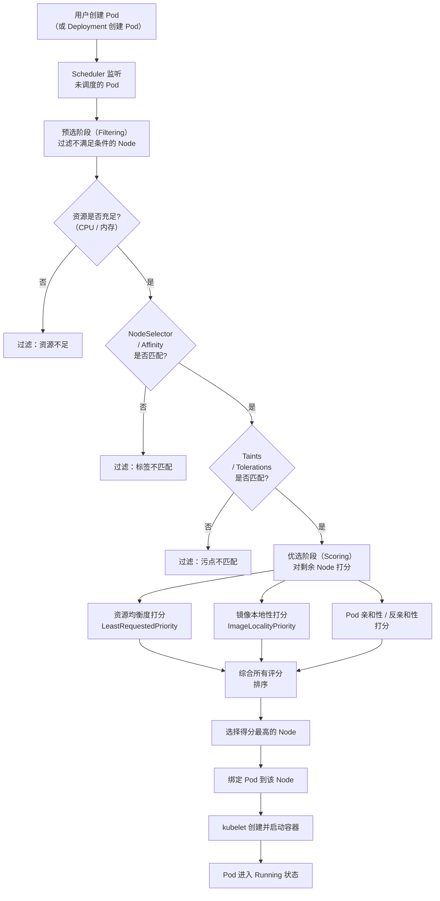
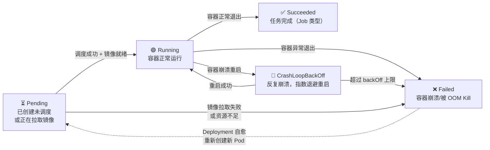

# Kubernetes 核心概念

> 学习路线对应：第6周 -- 容器化与 K8s
> 前置知识：Docker 基础
> 对比 Node.js：K8s 管理容器 约等于 PM2 管理 Node 进程，但更强大

> 📖 **参考链接**：
> - [Kubernetes 官方文档（中文）](https://kubernetes.io/zh-cn/docs/) -- Kubernetes 官方中文文档总站，涵盖概念、任务、教程、参考手册
> - [Kubernetes 概念](https://kubernetes.io/zh-cn/docs/concepts/) -- 官方概念详解：Pod、Deployment、Service、ConfigMap、Volume 等核心对象
> - [Kubernetes 调度器](https://kubernetes.io/zh-cn/docs/concepts/scheduling-eviction/) -- 调度与驱逐：kube-scheduler 预选优选、节点亲和性、污点容忍
> - [Kubernetes 服务网络](https://kubernetes.io/zh-cn/docs/concepts/services-networking/) -- Service、Ingress、网络策略、DNS
> - [Kubernetes 存储卷](https://kubernetes.io/zh-cn/docs/concepts/storage/) -- Volume、PersistentVolume、StorageClass、CSI

---

## 一、核心概念

### 1.1 K8s 架构

Kubernetes 集群由 Master 节点（控制平面）和 Node 节点（工作节点）组成：

**Master 节点组件：**

| 组件 | 职责 |
|------|------|
| **API Server** | 集群统一入口，处理所有 REST 请求，将资源状态存入 etcd |
| **Scheduler** | 调度器，为新创建的 Pod 选择最合适的 Node 运行 |
| **Controller Manager** | 控制器管理器，维护集群期望状态（Deployment、ReplicaSet 等） |
| **etcd** | 分布式键值存储，保存集群所有配置和状态数据 |

**Node 节点组件：**

| 组件 | 职责 |
|------|------|
| **kubelet** | Node 上的代理，管理 Pod 生命周期，上报 Node 状态 |
| **kube-proxy** | 网络代理，实现 Service 的负载均衡（iptables/IPVS） |
| **Container Runtime** | 容器运行时（containerd、CRI-O 等），运行容器 |

> **生活化类比：** Kubernetes 编排就像施工现场的项目经理。工地上有几十个工人（容器），项目经理（K8s）不需要亲自搬砖，但需要统筹全局：哪个工人闲着就给他派活（Scheduler 调度 Pod），工人受伤了马上换人顶上（Deployment 自愈），物料不够了就叫供应商补货（HPA 自动扩缩容），工地入口统一设一个前台接待处（Service 提供统一入口），外部来访客要登记才能进（Ingress 管理外部访问）。每个 Node 上还有 kubelet 作为"现场监工"，负责接收项目经理的指令并在本地执行。工人不需要知道项目经理在哪儿，只要按分配的任务干活就行。项目经理的核心工作就是"看着图纸（声明式 YAML），确保工地实际状态和图纸一致"。

### 1.2 核心资源对象

| 资源 | 说明 | 类比 |
|------|------|------|
| **Pod** | K8s 最小调度单位，包含一个或多个容器 | 豌豆荚（Pod = 豆荚，容器 = 豆子） |
| **Deployment** | 管理 Pod 副本数量、滚动更新、回滚 | 部署管理器 |
| **Service** | 为一组 Pod 提供稳定的网络访问入口 | 负载均衡器 |
| **Ingress** | 管理外部 HTTP/HTTPS 访问 | 反向代理 / Nginx |
| **ConfigMap** | 存储非敏感配置 | 配置文件 |
| **Secret** | 存储敏感信息（密码、Token、证书） | base64 编码的配置（需配合 RBAC 和 etcd 加密才能真正安全） |
| **StatefulSet** | 管理有状态应用（数据库等） | 类似 Deployment 但有状态：每个 Pod 有固定身份标识、有序部署（0→1→2）、独立持久存储 |
| **DaemonSet** | 确保每个 Node 运行一个 Pod 副本 | 守护进程 |

> **生活化类比：Pod = "豌豆荚（最小调度单元）"** —— K8s 不直接调度容器，而是调度 Pod，这就像农业上不按"粒"卖豆子而是按"荚"卖。一个豌豆荚（Pod）里可以有一颗豆子（单容器，最常见）或几颗豆子（多容器，如主应用 + sidecar 日志代理）。同一荚里的豆子共享同一份"营养供给"——Pod 内所有容器共享网络命名空间（相同 IP、端口空间，互相 localhost 通信）和存储卷，就像荚内豆子共生根茎。但不同荚之间相互隔离，各自有独立 IP。为什么 K8s 不直接管容器而要套一层 Pod？因为有些应用天生需要"紧耦合"——比如业务容器和日志收集容器必须同生共死、共享存储，把它们放在一个 Pod 里调度最自然。Pod 是 K8s 调度的最小粒度：要么整个荚一起调度到某台 Node，要么一起走，不会出现"豆子分家"的情况。记住：**Pod 是临时的、可丢弃的**（豆荚摘了还能再长），Pod 的 IP 会随重建而变化，所以才需要 Service 给它一个"固定门牌号"。

### 1.3 声明式 API

K8s 采用声明式 API：用户描述期望状态（如"运行 3 个副本"），K8s 自动调谐（Reconciliation Loop），确保实际状态与期望状态一致。

```
用户提交 YAML（期望状态: 3 个副本）
  -> Controller Manager 读取期望状态
  -> 对比实际状态（当前只有 2 个副本）
  -> 调谐：创建 1 个新 Pod
  -> 实际状态 = 期望状态
```

---

## 二、底层原理

### 2.1 Pod 调度流程

```
1. 用户创建 Pod（或 Deployment 创建 Pod）
2. Scheduler 监听未调度的 Pod
3. 预选（Filtering）：过滤掉不满足条件的 Node
   - 资源不足（CPU/内存不够）
   - NodeSelector/NodeAffinity 不匹配
   - Taints/Tolerations 不匹配
4. 优选（Scoring）：对剩余 Node 打分
   - 资源均衡度（LeastRequestedPriority）
   - 镜像本地性（ImageLocalityPriority）
   - Pod 亲和性/反亲和性
5. 选择得分最高的 Node，绑定 Pod
6. kubelet 创建并启动容器
```

**Pod 调度全流程（预选 -> 优选 -> 绑定）Mermaid 图：**



**Pod 生命周期状态流转（Mermaid 图）：**



> 上图展示 Pod 的生命周期状态流转：**Pending**（已提交但未就绪，可能在等调度或拉镜像）→ **Running**（容器启动并运行）→ **Succeeded**（正常完成，如 Job/CronJob）或 **Failed**（异常退出，如崩溃、OOM）。若容器反复崩溃，进入 **CrashLoopBackOff** 状态，kubelet 按指数退避（10s→20s→40s…最大 5 分钟）重试启动。Deployment 控制器监测到 Pod Failed 后会自动创建新 Pod 替代（自愈）。排查 CrashLoopBackOff 的常用命令：`kubectl describe pod <pod>` 看 Events、`kubectl logs <pod> --previous` 看上次崩溃时的日志。

### 2.2 Service 负载均衡

Service 为一组 Pod 提供稳定的网络访问入口（固定 ClusterIP 和 DNS 名称），解决 Pod 动态创建/销毁导致 IP 变化的问题。

> **生活化类比：Service = "公司的固定门牌号"** —— Pod 像公司里搬来搬去的工位（每次重建 IP 都变），员工（客户端）想找"技术部"办事，总不能每次都去查工位号（Pod IP）——太麻烦了。于是公司在大厅设了一个固定门牌号"技术部前台"（Service 的 ClusterIP + DNS 名 `tech-svc.default.svc.cluster.local`），这个门牌号永远不变。不管技术部搬到几楼、换了几拨人（Pod 扩缩容、滚动更新重建），前台（Service）始终在原地，通过背后的一张"员工座位表"（Endpoints，记录当前 Pod IP 列表）把来访者路由到具体工位。kube-proxy 就是"前台路由员"，它在每个 Node 上维护 iptables/IPVS 规则，把发往 Service IP 的流量按轮询/会话保持转发到后端 Pod。Pod 一旦重建 IP 变了，Endpoints 控制器自动更新座位表，前台无感知——这就是 Service 解耦"访问入口"与"后端实例"的精髓。NodePort 是"在公司大门外也挂个同样的牌子"，LoadBalancer 是"直接向电信局申请个公网号码"。

**三种 Service 类型：**

| 类型 | 访问范围 | 说明 |
|------|----------|------|
| **ClusterIP**（默认） | 集群内部 | 分配集群内部 IP，只能在集群内访问 |
| **NodePort** | 集群外部 | 在每个 Node 上开放端口（30000-32767），通过 NodeIP:Port 访问 |
| **LoadBalancer** | 集群外部 | 云厂商提供的负载均衡器，分配公网 IP |

**kube-proxy 工作模式：**

| 模式 | 原理 | 性能 |
|------|------|------|
| **iptables** | 通过 iptables 规则实现流量转发 | 规则数量多时性能下降 |
| **IPVS** | 使用 Linux 内核 IPVS 模块，支持多种调度算法 | 高性能，推荐 |

### 2.3 Deployment 滚动更新

Deployment 通过 ReplicaSet 控制 Pod 副本数量，支持滚动更新和回滚。

> **生活化类比：Deployment = "牧场管理员"** —— 你是牧场主，在羊圈里养着一群羊（Pod 副本）。你告诉牧场管理员（Deployment）"我要 5 只澳洲白绵羊"（期望状态 replicas=5），管理员就照办：数一数圈里，只有 3 只就再买 2 只补齐，有 7 只就卖掉 2 只。某天一只羊病死了（Pod 崩溃），管理员发现圈里只剩 4 只，立刻补买 1 只——这就是**自愈**。后来你想把品种从"澳洲白"换成"杜泊"（镜像版本升级），管理员不会一次性把 5 只全杀了再买新的（那样牧场就空了），而是**滚动更新**：先买 1 只杜泊羊放进去（+1），等它适应环境后再卖掉 1 只澳洲白（-1），逐步替换直到 5 只全是杜泊——业务零中断。如果新买的杜泊羊水土不服集体生病，管理员还能**回滚**——把之前的澳洲白羊买回来。maxSurge 是"换种期间圈里最多多养几只"（临时超额），maxUnavailable 是"换种期间最多少养几只"（临时缺额）。管理员手里还留着历次品种变更记录（revision history），随时能回退到任意历史版本。

**滚动更新参数：**

| 参数 | 说明 | 默认值 |
|------|------|--------|
| **maxSurge** | 滚动更新期间允许超出期望副本数的最大数量 | 25% |
| **maxUnavailable** | 滚动更新期间允许不可用的最大 Pod 数量 | 25% |

```
滚动更新示例（期望 4 个副本，maxSurge=25%, maxUnavailable=25%）：
  Step 1: 创建 1 个新版本 Pod（总数 5，maxSurge 允许 1 个超出）
  Step 2: 新 Pod 就绪后，删除 1 个旧版本 Pod（总数 4）
  Step 3: 重复直到所有 Pod 都是新版本
```

### 2.4 HPA 自动扩缩容

HPA（Horizontal Pod Autoscaler）根据 CPU/内存等指标自动调整 Pod 副本数：

```yaml
apiVersion: autoscaling/v2
kind: HorizontalPodAutoscaler
metadata:
  name: app-hpa
spec:
  scaleTargetRef:
    apiVersion: apps/v1
    kind: Deployment
    name: app-deployment
  minReplicas: 2
  maxReplicas: 10
  metrics:
    - type: Resource
      resource:
        name: cpu
        target:
          type: Utilization
          averageUtilization: 70
```

---

## 三、实战应用

### 3.1 Spring Boot 微服务部署到 K8s

**Deployment YAML：**

```yaml
apiVersion: apps/v1
kind: Deployment
metadata:
  name: order-service
spec:
  replicas: 3
  selector:
    matchLabels:
      app: order-service
  template:
    metadata:
      labels:
        app: order-service
    spec:
      containers:
        - name: order-service
          image: registry.example.com/order-service:1.0.0
          ports:
            - containerPort: 8080
          envFrom:
            - configMapRef:
                name: order-service-config
          resources:
            requests:
              cpu: "200m"
              memory: "256Mi"
            limits:
              cpu: "500m"
              memory: "512Mi"
          livenessProbe:
            httpGet:
              path: /actuator/health/liveness
              port: 8080
            initialDelaySeconds: 30
            periodSeconds: 10
          readinessProbe:
            httpGet:
              path: /actuator/health/readiness
              port: 8080
            initialDelaySeconds: 10
            periodSeconds: 5
```

**Service YAML：**

```yaml
apiVersion: v1
kind: Service
metadata:
  name: order-service
spec:
  type: ClusterIP
  selector:
    app: order-service
  ports:
    - port: 8080
      targetPort: 8080
```

**ConfigMap YAML：**

```yaml
apiVersion: v1
kind: ConfigMap
metadata:
  name: order-service-config
data:
  application.yml: |
    server:
      port: 8080
    spring:
      datasource:
        url: jdbc:mysql://mysql-service:3306/order_db
```

### 3.2 Ingress 配置

```yaml
apiVersion: networking.k8s.io/v1
kind: Ingress
metadata:
  name: app-ingress
spec:
  tls:
    - hosts:
        - api.example.com
      secretName: tls-secret
  rules:
    - host: api.example.com
      http:
        paths:
          - path: /order
            pathType: Prefix
            backend:
              service:
                name: order-service
                port:
                  number: 8080
          - path: /user
            pathType: Prefix
            backend:
              service:
                name: user-service
                port:
                  number: 8080
```

### 3.3 健康检查（livenessProbe vs readinessProbe）

| 探针类型 | 作用 | 失败后果 |
|----------|------|----------|
| **livenessProbe** | 检查容器是否存活 | 重启容器 |
| **readinessProbe** | 检查容器是否就绪 | 从 Service 端点移除，不接收流量 |
| **startupProbe** | 检查容器是否启动完成 | 启动完成前，livenessProbe 和 readinessProbe 不生效 |

**配置建议：**
- livenessProbe 检查简单的存活状态（如 HTTP 200）
- readinessProbe 检查依赖服务是否可用（如数据库连接）
- 给 livenessProbe 设置较长的 initialDelaySeconds，避免启动过程中被误杀

### 3.4 CI/CD 流水线集成

前面 3.1~3.3 讲的是"手工 `kubectl apply`"的部署方式，真实项目里从代码提交到 Pod 上线全流程应由 CI/CD 流水线自动完成：**提交代码 → 跑测试 → 构建镜像 → 推送镜像仓库 → 更新 Deployment → 验证滚动更新**。

> **生活化类比：CI/CD 流水线 = 餐厅的中央厨房** —— 厨师长（开发者）把菜谱（代码）交给中央厨房（流水线），厨房不会直接端给客人，而是先按标准流程走一遍：验货（拉取代码）、试吃（自动化测试）、统一封装（构建镜像）、贴标签入库（推送镜像仓库，标签就是"生产批次号"）、再由配送员送到各门店（K8s 集群）按批次逐步替换旧菜（滚动更新）。如果哪一批菜口味不对（新版本异常），门店可以立刻换回上一批（`rollout undo`）。关键点在于：**门店（生产集群）永远不自己炒菜（不在生产机上编译）**，只接收标准化的成品（镜像），这样才能保证"我本地能跑"和"线上能跑"是同一份东西。

**GitLab CI 与 Jenkins 对比：**

| 维度 | GitLab CI（主线） | Jenkins |
|------|------------------|---------|
| 配置方式 | 仓库内 `.gitlab-ci.yml`，与代码同版本管理 | Jenkinsfile（流水线即代码）或 Web UI 配置 |
| 执行器 | GitLab Runner（Docker/Shell/K8s Executor） | Master + Agent 节点，插件生态丰富 |
| 与仓库集成 | 原生集成，提交/MR/标签自动触发 | 需配置 Webhook 触发 |
| 密钥管理 | 项目级 CI/CD Variables（可设为 Masked/Protected） | Credentials 插件 + 凭据绑定 |
| 维护成本 | SaaS 或自建，运维负担低 | 插件与版本升级维护成本高 |
| 适用场景 | 代码托管在 GitLab 的团队，开箱即用 | 异构仓库（SVN/GitHub/多平台）或需要复杂自定义流程 |

**完整流水线示例（`.gitlab-ci.yml`）：**

```yaml
stages: [test, build, deploy]

variables:
  IMAGE: registry.example.com/order-service
  # 镜像标签策略：用 commit 短 SHA，天然唯一且可追溯到具体提交
  TAG: $CI_COMMIT_SHORT_SHA

# 阶段一：自动化测试与质量门禁
unit-test:
  stage: test
  image: maven:3.9-eclipse-temurin-17
  script:
    - mvn -B clean verify          # 执行单测 + 集成测试，失败即中断流水线
  artifacts:
    reports:
      junit: target/surefire-reports/TEST-*.xml

# 阶段二：构建并推送镜像（Dockerfile 与流水线的衔接点）
build-image:
  stage: build
  image: docker:24
  services: [docker:24-dind]
  script:
    - docker login -u "$CI_REGISTRY_USER" -p "$CI_REGISTRY_PASSWORD" registry.example.com
    - docker build -t "$IMAGE:$TAG" -t "$IMAGE:$CI_COMMIT_REF_SLUG" .
    - docker push "$IMAGE:$TAG"
    - docker push "$IMAGE:$CI_COMMIT_REF_SLUG"

# 阶段三：滚动发布到 K8s
deploy-prod:
  stage: deploy
  image: bitnami/kubectl:1.29
  environment:
    name: prod
  rules:
    - if: '$CI_COMMIT_TAG'        # 仅打 tag 时才发布生产
  script:
    - kubectl config use-context prod-cluster
    - kubectl set image deployment/order-service order-service="$IMAGE:$TAG"
    - kubectl rollout status deployment/order-service --timeout=120s
```

**Dockerfile 与流水线的衔接：**

| 衔接点 | 做法 | 目的 |
|--------|------|------|
| 构建上下文 | 流水线中 `docker build` 的上下文就是仓库根目录 | Dockerfile 里的 `COPY pom.xml` / `COPY src` 才能命中，配合 `.dockerignore` 排除 target、.git |
| 构建阶段划分 | 用多阶段构建，编译在 `maven` 镜像里完成 | 流水线节点无需预装 JDK/Maven，构建环境与本地一致 |
| 跳过测试的位置 | Dockerfile 内 `mvn package -DskipTests` | 测试已在流水线 test 阶段执行，镜像内不重复跑，避免双重耗时 |
| 缓存复用 | 先 `COPY pom.xml` 再 `COPY src` | 依赖不变时复用层缓存，构建耗时从数分钟降到数十秒 |
| 版本注入 | `--build-arg VERSION=$TAG` 或构建时写入 build-info | 镜像内可查询构建来源，便于回溯问题版本 |

**镜像标签策略（避免 `latest`）：**

| 策略 | 示例 | 特点 |
|------|------|------|
| Git commit 短 SHA | `order-service:a1b2c3d` | 唯一、可追溯到提交，回滚时明确知道回到哪个版本（推荐） |
| 语义化版本 | `order-service:1.4.2` | 可读性好，适合正式发布，需配合 tag 触发 |
| 分支名 + 构建号 | `order-service:main-137` | 适合 dev/test 环境持续集成 |
| 环境后缀 | `order-service:1.4.2-prod` | 便于区分同一版本在不同环境的镜像 |
| `latest` | `order-service:latest` | **禁用**：内容随构建漂移，无法复现、无法精确回滚 |

> **为什么必须禁用 `latest`**：Deployment 里写 `latest` 时，`imagePullPolicy` 默认会退化为 `Always`，每次重启都去拉一次镜像；更糟的是同一个 `latest` 在不同时间指向不同内容，"回滚"时拉到的可能还是最新版本，导致回滚失效、问题无法复现。标签一旦不可变，`kubectl rollout undo` 才有意义。

**多环境（dev / test / prod）配置隔离：**

| 隔离维度 | 做法 |
|----------|------|
| 命名空间 | 每个环境一个 Namespace（`dev` / `test` / `prod`），资源互不干扰 |
| 配置文件 | 按环境拆分 Kustomize overlay（`overlays/dev`、`overlays/prod`）或 Helm values 文件 |
| 非敏感配置 | 各环境独立的 ConfigMap，如日志级别、线程池大小、下游地址 |
| 敏感配置 | 各环境独立的 Secret，绝不提交到 Git，由流水线从 CI 变量注入 |
| 镜像来源 | 同一镜像（同一 commit SHA）逐级晋级：dev 验证通过后才 promote 到 prod，保证"测过的就是上的" |
| 资源规格 | dev 用小 requests/limits 与 1 副本，prod 用 3 副本 + 反亲和性 + HPA |
| 发布触发 | dev 每次提交自动发布，test 合并到 release 分支触发，prod 打 tag 且需人工审批 |

**流水线中的自动化测试与质量门禁：**

| 门禁 | 检查内容 | 失败后果 |
|------|---------|---------|
| 单元测试 | `mvn verify`，覆盖率低于阈值（如 60%）则失败 | 中断流水线，不进入构建阶段 |
| 静态扫描 | SonarQube / SpotBugs 检查严重缺陷、代码重复率 | 严重级别问题阻塞合并 |
| 依赖漏洞扫描 | OWASP Dependency-Check / Trivy 扫描依赖与镜像 | 高危漏洞禁止推送生产镜像 |
| 镜像扫描 | 扫描基础镜像 CVE 与是否以 root 运行 | 阻断发布 |
| 冒烟测试 | 发布后在 dev/test 环境跑核心接口用例 | 失败立即回滚 |

**kubectl 滚动更新与回滚：**

```bash
# 触发滚动更新（只改镜像，其余 spec 不动，触发一次新的 revision）
kubectl set image deployment/order-service order-service=registry.example.com/order-service:a1b2c3d

# 观察滚动更新进度（阻塞直到完成或超时）
kubectl rollout status deployment/order-service --timeout=120s

# 查看历史版本（CHANGE-CAUSE 需在 apply 时加 --record 或写注解）
kubectl rollout history deployment/order-service

# 回滚到上一版本
kubectl rollout undo deployment/order-service

# 回滚到指定版本（先 history 确认序号）
kubectl rollout undo deployment/order-service --to-revision=3

# 暂停/恢复滚动更新（灰度时先暂停，验证后再继续）
kubectl rollout pause deployment/order-service
kubectl rollout resume deployment/order-service
```

> 回滚能成功的前提是**历史 ReplicaSet 还在**。`revisionHistoryLimit` 默认保留 10 个，若设得过小，久一点的问题版本就回不去了；同时 Deployment 的 Pod 模板一旦被大幅改动（如改 selector），旧 ReplicaSet 可能已不可用，回滚前务必用 `rollout history` 确认目标 revision。

**流水线中的密钥管理：**

| 方式 | 适用场景 | 要点 |
|------|---------|------|
| CI/CD Variables | 镜像仓库密码、集群 kubeconfig | 开启 Masked 防止日志泄露，Protected 限制只在受保护分支可用 |
| K8s Secret | 应用运行期需要的数据库密码、API Key | 用 `kubectl create secret generic` 创建，Deployment 通过 `envFrom`/volume 引用，**不要写进 YAML 提交仓库** |
| 外部密钥管理 | 合规要求高的生产环境 | 对接 Vault / 云厂商 KMS，用 External Secrets Operator 同步为 K8s Secret |
| 集群凭据 | 流水线部署权限 | 为流水线单独建 ServiceAccount，按 Namespace 授予最小 RBAC 权限，避免使用集群管理员 kubeconfig |

> **生活化类比：密钥管理 = 保险柜钥匙分级保管** —— 镜像仓库密码、数据库密码、集群凭据是三把不同的钥匙，绝不该写在纸条上贴门口（硬编码在 YAML）。正确做法是把它们放进保险柜（CI Variables / Secret），谁需要哪把就按最小权限单独授权（RBAC），并且用外部托管保险柜（Vault）定期换锁。日志是"公共走廊的监控录像"，所以密钥必须开启 Masked——不然等于把钥匙照片挂在走廊里。

> 📖 **参考链接**：
> - [Kubernetes 官方文档 - 滚动更新 Deployment](https://kubernetes.io/zh-cn/docs/concepts/workloads/controllers/deployment/#rolling-update-deployment) -- 滚动更新与回滚机制官方说明
> - [Kubernetes 官方文档 - kubectl rollout](https://kubernetes.io/zh-cn/docs/reference/kubectl/generated/kubectl_rollout/) -- rollout status/history/undo/pause 命令参考
> - [Kubernetes 官方文档 - Secret](https://kubernetes.io/zh-cn/docs/concepts/configuration/secret/) -- Secret 创建、挂载与安全最佳实践
> - [Kubernetes 官方文档 - 为 Pod 配置服务账号](https://kubernetes.io/zh-cn/docs/tasks/configure-pod-container/configure-service-account/) -- ServiceAccount 与最小权限 RBAC
> - [GitLab 官方文档 - CI/CD YAML 语法](https://docs.gitlab.com/ee/ci/yaml/) -- `.gitlab-ci.yml` 完整语法（stages/rules/artifacts/environment）

---

## 四、常见面试题

### 1. Pod 和 Container 的关系？

**答案：** Pod 是 K8s 最小调度单位，可以包含一个或多个容器。同一 Pod 内的容器共享网络命名空间（同一 IP 和端口空间）和存储卷，可以通过 localhost 通信。Pod 内的容器作为一个整体被调度到同一 Node 上。

### 2. Deployment 和 StatefulSet 的区别？

| 维度 | Deployment | StatefulSet |
|------|-----------|-------------|
| Pod 标识 | 随机名称（如 order-7d5f8b9c-abc） | 固定序号（如 mysql-0, mysql-1） |
| 网络标识 | 无固定 DNS | 固定 DNS（如 mysql-0.mysql-svc） |
| 启动/停止顺序 | 并行 | 顺序（0->1->2） |
| 持久化存储 | 共享 PVC | 每个 Pod 独立 PVC |
| 适用场景 | 无状态应用 | 有状态应用（数据库、消息队列） |

### 3. Service 的 ClusterIP、NodePort、LoadBalancer 三种类型区别？

**答案：** ClusterIP：默认类型，分配集群内部 IP，只能集群内访问。NodePort：在每个 Node 上开放端口（30000-32767），通过 NodeIP:Port 可从外部访问。LoadBalancer：云厂商提供的外部负载均衡器，分配公网 IP，自动转发流量到 NodePort。

### 4. 如何排查 Pod 一直处于 Pending 状态？

**答案：** 排查步骤：1）`kubectl describe pod <pod-name>` 查看 Events 信息；2）常见原因：资源不足（CPU/内存不够）、PVC 无法绑定、NodeSelector 不匹配、Taints/Tolerations 不匹配、镜像拉取失败；3）根据 Events 信息针对性解决。

---

## 五、避坑指南

| 常见错误 | 现象 | 原因 | 解决方案 |
|---------|------|------|---------|
| Pod 中硬编码配置 | 镜像和环境绑定，无法复用 | 配置写在镜像中 | 使用 ConfigMap 存储非敏感配置，Secret 存储敏感信息 |
| 未设置 resources 资源限制 | Pod 被 OOM Killer 杀死，或抢占其他 Pod 资源 | 未设置 requests 和 limits | 设置 resources.requests（调度决策）和 resources.limits（运行时限制） |
| Pod 未优雅关闭 | 请求被中断，数据不一致 | Pod 删除时先 SIGTERM，超时后 SIGKILL 强制终止 | 应用正确处理 SIGTERM 信号，完成正在处理的请求后再退出 |
| 使用 latest 标签 | 镜像版本不确定，回滚困难 | latest 标签版本不确定 | 使用明确的版本号或 Git commit hash |
| 健康检查配置不当 | Pod 频繁重启或被错误摘除 | livenessProbe 检查外部依赖导致重启雪崩；未设置 initialDelaySeconds | livenessProbe 不检查外部依赖；readinessProbe 可检查依赖；设置合理的 initialDelaySeconds |

---

> **学习导航**：
> - 返回 [学习路线总览](../../README.md)
> - 本模块其他文件：[03-容器与K8s笔面试题集](./03-容器与K8s笔面试题集.md)
> - 实战应用：[电商订单实时统计分析平台](../../extensions/project/01-电商订单实时统计分析平台.md)

