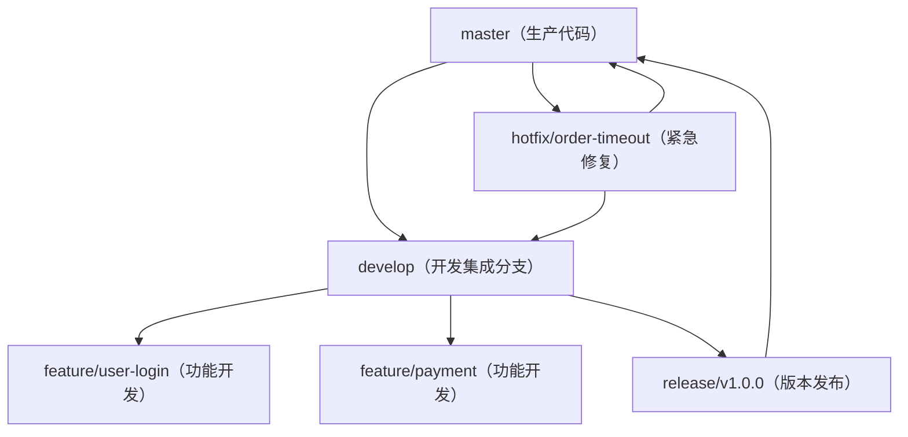

# Git - 综合场景串联

---

## 场景一：GitFlow 工作流完整流程

### 场景描述
团队采用 GitFlow 分支策略管理一个企业级项目，需要同时支持版本发布、功能开发、紧急修复。演示从需求到上线的完整 GitFlow 流程。

### 涉及知识点
- [Git分支策略与协作工作流](02-Git分支策略与协作工作流.md)：GitFlow 分支模型、merge 的三种模式、Pull Request 流程
- [Git核心概念与常用命令](01-Git核心概念与常用命令.md)：分支操作、标签管理、远程协作

### 协作流程

**GitFlow 分支模型图：**



> Git Flow 工作流定义了五种核心分支：master 存放生产代码，develop 作为开发集成分支，feature 分支从 develop 拉取用于功能开发，release 分支用于版本发布准备，hotfix 分支从 master 拉取用于紧急修复。所有分支最终合并回主干。

1. 项目初始化：创建 main 和 develop 分支，main 存放生产代码，develop 为开发集成分支
2. 功能开发：从 develop 拉取 feature/user-login 分支，开发完成后提交 Pull Request 合并回 develop
3. 功能分支合并时使用 `--no-ff` 强制保留分支轨迹，便于追溯和回滚
4. 版本发布准备：从 develop 拉取 release/v1.0.0 分支，进行发布前测试、版本号更新、文档完善
5. release 分支测试通过后，合并到 main 并打 tag v1.0.0，同时合并回 develop 同步修复
6. 部署 main 到生产环境
7. 线上紧急修复：从 main 拉取 hotfix/order-timeout 分支，修复紧急问题
8. hotfix 修复完成后，合并到 main 打 tag v1.0.1，同时合并回 develop 避免开发分支缺失修复
9. 删除已合并的 feature、release、hotfix 分支，保持仓库整洁

### 关键要点
- main 分支始终对应生产环境，每个提交对应一个发布版本
- develop 是集成分支，所有功能开发最终合并到这里
- 使用 `--no-ff` 合并保留分支拓扑，即使可以快进也强制生成合并提交
- hotfix 必须从 main 拉取（基于生产代码），修复后同时合并到 main 和 develop
- 标签使用语义化版本号（MAJOR.MINOR.PATCH），发布时打附注标签

### 完整可运行命令示例

#### 第一步：项目初始化

```bash
# 1. 创建空仓库并克隆到本地
git clone https://github.com/your-org/your-project.git
cd your-project

# 2. 初始化项目，创建 main 和 develop 分支
# 注意：如果远程仓库已有 main 分支，使用 git checkout main 切换即可
# 如果是新仓库首次提交，使用 git branch -M main 重命名当前分支
git checkout -b main
git commit --allow-empty -m "Initial commit: project setup"
git checkout -b develop
git push -u origin develop
git push -u origin main
```

#### 第二步：功能开发流程

```bash
# 1. 从 develop 拉取功能分支
git checkout develop
git pull origin develop
git checkout -b feature/user-login

# 2. 开发过程中频繁提交
git add .
git commit -m "feat: add login page UI"
git commit -m "feat: implement username/password validation"
git commit -m "fix: fix captcha refresh issue"

# 3. 推送到远程准备 Pull Request
git push -u origin feature/user-login

# 4. 代码审查通过后，合并回 develop（使用 --no-ff 保留分支历史）
git checkout develop
git pull origin develop
git merge --no-ff feature/user-login
git push origin develop

# 5. 删除已合并的功能分支
git branch -d feature/user-login
git push origin --delete feature/user-login
```

#### 第三步：版本发布流程

```bash
# 1. 从 develop 拉取 release 分支
git checkout develop
git pull origin develop
git checkout -b release/v1.0.0

# 2. 发布前准备：更新版本号、完善文档、修复测试问题
vim package.json  # 更新版本号到 1.0.0
vim CHANGELOG.md # 更新变更日志
git add package.json CHANGELOG.md
git commit -m "chore: bump version to 1.0.0 and update changelog"

# 3. 测试通过后，合并到 main 并打 tag
git checkout main
git pull origin main
git merge --no-ff release/v1.0.0
git tag -a v1.0.0 -m "Release v1.0.0: add user login system"
git push origin main
git push origin v1.0.0

# 4. 将发布中的修复同步回 develop
git checkout develop
git merge --no-ff release/v1.0.0
git push origin develop

# 5. 删除已合并的 release 分支
git branch -d release/v1.0.0
git push origin --delete release/v1.0.0
```

#### 第四步：线上紧急修复流程

```bash
# 1. 从 main 拉取 hotfix 分支
git checkout main
git pull origin main
git checkout -b hotfix/order-timeout

# 2. 定位问题并修复
git add src/OrderService.java
git commit -m "fix: resolve order processing timeout issue"

# 3. 验证修复后，合并到 main 并打新 tag
git checkout main
git merge --no-ff hotfix/order-timeout
git tag -a v1.0.1 -m "Release v1.0.1: fix order timeout bug"
git push origin main
git push origin v1.0.1

# 4. 同步修复到 develop
git checkout develop
git merge --no-ff hotfix/order-timeout
git push origin develop

# 5. 删除 hotfix 分支
git branch -d hotfix/order-timeout
git push origin --delete hotfix/order-timeout
```

#### 第五步：代码审查与 Pull Request 常用命令

```bash
# 1. 开发者：推送功能分支后创建 PR
git checkout feature/payment-integration
git push -u origin feature/payment-integration
# 在 GitHub/GitLab 上创建 Pull Request

# 2. 审查者：本地拉取 PR 分支测试
git fetch origin pull/123/head:pr-123
git checkout pr-123
# 运行测试，检查代码

# 3. 审查通过后，在网页端合并，或本地合并
git checkout develop
git merge --no-ff pr-123
git push origin develop

# 4. 如果需要本地修改 PR
git checkout feature/payment-integration
# 修改代码后提交推送
git add .
git commit -m "address review comments: fix null pointer"
git push origin feature/payment-integration
```

---

## 场景二：解决 Git 合并冲突

### 场景描述
两个开发者同时修改了同一文件的同一区域，在合并分支时产生冲突。演示从冲突发生到解决的完整流程，以及预防冲突的最佳实践。

### 涉及知识点
- [Git分支策略与协作工作流](02-Git分支策略与协作工作流.md)：冲突产生原因、冲突标记解读、冲突解决流程、rerere 机制
- [Git核心概念与常用命令](01-Git核心概念与常用命令.md)：merge 与 rebase 操作、git status 与 git diff

### 协作流程
1. 开发者 A 在 feature-a 分支修改了 OrderService.java 的 processOrder 方法
2. 开发者 B 在 feature-b 分支也修改了同一文件的同一方法
3. 开发者 A 先将 feature-a 合并到 develop
4. 开发者 B 尝试将 feature-b 合并到 develop 时，Git 检测到冲突
5. Git 在冲突文件中插入标记：`<<<<<<< HEAD`（当前分支内容）、`=======`（分隔符）、`>>>>>>> feature-b`（被合并分支内容）
6. 开发者 B 使用 `git status` 查看冲突文件列表，`git diff` 查看冲突详情
7. 开发者 B 手动编辑文件，保留正确的代码，删除所有冲突标记
8. 执行 `git add OrderService.java` 标记冲突已解决
9. 执行 `git commit` 完成合并提交
10. 若想放弃合并，执行 `git merge --abort` 恢复到合并前状态

### 关键要点
- 冲突标记以 `<<<<<<<`、`=======`、`>>>>>>>` 三组界定，需手动编辑删除
- 解决冲突后必须 `git add` 标记已解决，再 `git commit` 完成合并
- 启用 `git rerere` 记录冲突解决方案，相同冲突再次出现时自动应用
- 预防冲突：频繁拉取最新代码、小粒度分支、及时沟通分工
- 二进制文件冲突无法自动合并，只能选择保留其中一方的版本
- 使用 VS Code 或 IDEA 等可视化工具辅助解决冲突

---

## 场景三：`--force` 误推覆盖远端分支后的灾难恢复

### 场景描述
发版收尾阶段，开发者 A 在 `release/v2.3.0` 分支上做了一次 `rebase` 清理提交历史，随后误用 `git push --force origin release/v2.3.0` 推送，把开发者 B 已经推到远端的 3 个提交（`feat: 支持分批退款` 等）从远端历史中直接抹掉了。B 的本地分支后来也被一次 `reset --hard` 重置，两人一度以为这 3 个提交彻底丢失。本场景演示如何用 `git reflog` + `git fsck` 找回被覆盖的提交、把远端历史恢复回来，并通过分支保护与 `pre-push` hook 从根上杜绝再次发生。

### 涉及知识点
- [Git分支策略与协作工作流](02-Git分支策略与协作工作流.md)：rebase 黄金法则、`--force` 与 `--force-with-lease` 的区别、detached HEAD 与游离提交
- [Git核心概念与常用命令](01-Git核心概念与常用命令.md)：`reflog` 操作记录、`reset` 三种模式、`fsck` 悬空对象、远程协作与分支删除

### 协作流程
1. 事故发生后**立即停止一切写操作**——不要再 `rebase` / `reset` / `gc`，未被引用的提交只靠 reflog 与悬空对象暂存，一旦被回收就真的找不回了
2. 先做只读排查：`git fetch origin` 后用 `git log --oneline --graph origin/release/v2.3.0` 确认远端到底少了哪些提交
3. 在**误操作者 A 的本地仓库**执行 `git reflog show release/v2.3.0`，找到 `rebase (start)` 之前的那条记录，即 force push 前的分支指向
4. 同时查 `git reflog show origin/release/v2.3.0`，这里能看到远端跟踪引用被 `forced update` 的记录
5. 用 `git log --oneline <旧哈希>` 核对找回的提交是否就是 B 丢失的那几个
6. 若 A 的本地也已被重置，改用 `git fsck --lost-found` 扫描悬空（dangling）提交对象，逐个辨认
7. 从找到的提交创建救援分支 `git branch rescue/release-v2.3.0 <哈希>`，把救援分支推到远端，让提交重新进入远端历史
8. 按团队决策把救援分支的提交合回正式分支（`merge` 保留轨迹），通知 B 以远端为准重新对齐自己的分支
9. 善后：开启受保护分支、团队统一改用 `--force-with-lease`、在 `pre-push` hook 中拦截对受保护分支的推送

### 关键要点
- **第一时间冻结仓库**：只要没执行 `git gc`（且未超过 `gc.reflogExpire`，默认 90 天），被覆盖的提交几乎总能找回
- `git reflog` 记录的是**本地引用的移动历史**，只能看到本机发生过的操作；A 的 reflog 里有 force push 前的分支指向，B 的 reflog 里有他自己提交时的记录，**两边都要查**
- `git fsck --lost-found` 是 reflog 也查不到时的兜底手段，它列出所有无引用指向的提交对象，需配合 `git log --oneline --graph <哈希>` 人工辨认
- **`--force` 是无条件覆盖，`--force-with-lease` 会在远程被他人更新时拒绝推送**——这是防止此类事故最直接的一道保险
- 恢复完成前绝不要清理 reflog：`git reflog expire --expire=now --all` 与 `git gc --prune=now` 会让恢复窗口彻底关闭
- 根因治理比事后恢复更重要：`main` / `release/*` 必须开启分支保护禁止强推，本地再用 `pre-push` hook 兜一层

### 完整可运行命令示例

#### 第一步：冻结现场，确认远端被覆盖的范围

```bash
# 1. 只读排查：拉取远端最新引用
git fetch origin

# 2. 查看远端分支当前历史
git log --oneline --graph origin/release/v2.3.0 -n 6
```

预期输出（B 的 3 个提交已不在远端历史里）：

```text
* 9f3c1a2 (origin/release/v2.3.0) chore: bump version to 2.3.0
* 4d8e7b1 refactor: 拆分订单结算逻辑
* 2a6c9f0 fix: 修正发票金额精度
* 11a2b3c feat: 新增退款入口
```

#### 第二步：在误操作者本地用 reflog 定位被覆盖前的提交

```bash
# 1. 查看该分支的引用移动历史（越靠上越新）
git reflog show release/v2.3.0
```

预期输出：

```text
9f3c1a2 release/v2.3.0@{0}: rebase (finish): returning to refs/heads/release/v2.3.0
9f3c1a2 release/v2.3.0@{1}: rebase (pick): chore: bump version to 2.3.0
4d8e7b1 release/v2.3.0@{2}: rebase (start): checkout 11a2b3c
7e2b8d4 release/v2.3.0@{3}: commit: feat: 支持分批退款
6c1f2a9 release/v2.3.0@{4}: commit: test: 补充退款分批的单元测试
5b0e3d7 release/v2.3.0@{5}: commit: docs: 更新退款接口文档
```

`rebase (start)` 之前的那条 `release/v2.3.0@{3}`（哈希 `7e2b8d4`）就是 force push 前的分支指向。

```bash
# 2. 查看远端跟踪引用的强制更新记录，交叉验证
git reflog show origin/release/v2.3.0
```

预期输出：

```text
9f3c1a2 origin/release/v2.3.0@{0}: update by push (forced update)
7e2b8d4 origin/release/v2.3.0@{1}: fetch: fast-forward
```

```bash
# 3. 核对找回的提交内容
git log --oneline 7e2b8d4 -n 6
```

预期输出：

```text
7e2b8d4 feat: 支持分批退款
6c1f2a9 test: 补充退款分批的单元测试
5b0e3d7 docs: 更新退款接口文档
4d8e7b1 refactor: 拆分订单结算逻辑
2a6c9f0 fix: 修正发票金额精度
11a2b3c feat: 新增退款入口
```

确认无误：顶部 3 条正是 B 丢失的提交。

#### 第三步：reflog 不可用时用 fsck 兜底

```bash
# 当本地分支已被 reset --hard、reflog 里也翻不到时，扫描悬空对象
git fsck --lost-found
```

预期输出：

```text
Checking object directories: 100% (256/256), done.
Checking objects: 100% (4096/4096), done.
dangling commit 7e2b8d4b1c9e0a3f5d2c8e7a1b4f6d9c0e3a2b5f
dangling commit 6c1f2a9d4e8b7c0a5f3d1e9b2c8a7f4d6e0b3c1a
dangling blob 3d1e9b2c8a7f4d6e0b3c1a5f3d1e9b2c8a7f4d6e
```

```bash
# 逐个查看悬空提交的提交信息，辨认出目标提交
git log --oneline -n 3 7e2b8d4b1c9e0a3f5d2c8e7a1b4f6d9c0e3a2b5f
```

预期输出：

```text
7e2b8d4 feat: 支持分批退款
6c1f2a9 test: 补充退款分批的单元测试
5b0e3d7 docs: 更新退款接口文档
```

#### 第四步：创建救援分支并恢复远端历史

```bash
# 1. 从找到的提交创建救援分支（用完整哈希更稳妥）
git branch rescue/release-v2.3.0 7e2b8d4

# 2. 切换过去确认内容完整
git switch rescue/release-v2.3.0
git log --oneline -n 5

# 3. 把救援分支推到远端（普通推送，不是强推）
git push -u origin rescue/release-v2.3.0
```

预期输出：

```text
 * [new branch]      rescue/release-v2.3.0 -> rescue/release-v2.3.0
branch 'rescue/release-v2.3.0' set up to track 'origin/rescue/release-v2.3.0'.
```

#### 第五步：把丢失的提交合回正式分支

```bash
# 方案 A（推荐）：保留 A 的 rebase 结果，同时把 B 的提交合并回来
git switch release/v2.3.0
git pull --rebase origin release/v2.3.0
git merge --no-ff rescue/release-v2.3.0 -m "recover: 找回被 force push 覆盖的退款相关提交"

# 这次是正常推送，不需要 --force
git push origin release/v2.3.0
```

预期输出（merge 正常完成，没有历史分叉冲突）：

```text
Merge made by the 'ort' strategy.
 src/refund/RefundService.java | 86 +++++++++++++++++++++
 test/RefundServiceTest.java   | 42 ++++++++++
 2 files changed, 128 insertions(+)
```

#### 第六步：验证恢复结果并清理救援分支

```bash
# 1. 确认 B 的 3 个提交重新出现在远端历史里
git log --oneline --graph origin/release/v2.3.0 -n 8

# 2. 通知 B 以远端为准重新对齐本地分支（B 侧执行）
# git fetch origin && git reset --hard origin/release/v2.3.0

# 3. 确认无误后删除救援分支
git push origin --delete rescue/release-v2.3.0
git branch -d rescue/release-v2.3.0
```

预期输出：

```text
*   8a7c2e1 (origin/release/v2.3.0) recover: 找回被 force push 覆盖的退款相关提交
|\
| * 7e2b8d4 feat: 支持分批退款
| * 6c1f2a9 test: 补充退款分批的单元测试
| * 5b0e3d7 docs: 更新退款接口文档
|/
* 9f3c1a2 chore: bump version to 2.3.0
* 4d8e7b1 refactor: 拆分订单结算逻辑
```

#### 第七步：善后配置，杜绝复发

```bash
# 1. 团队统一：强推一律走 --force-with-lease（远程被他人更新时会拒绝）
git config --global alias.pushf "push --force-with-lease"

# 2. 确认恢复窗口仍然开着之前，不要执行以下两条清理命令
# git reflog expire --expire=now --all
# git gc --prune=now

# 3. 在托管平台为 main / release/* 开启"受保护分支 + 禁止强制推送"（GitHub/GitLab 控制台设置）
```

### 可复用脚本一：批量清理已合并分支

```bash
#!/bin/bash
# ============================================================
# clean-merged-branches.sh：批量清理已合并的本地（可选远程）分支
# 文件路径：scripts/clean-merged-branches.sh
# 用法：
#   bash scripts/clean-merged-branches.sh            # 只清理本地已合并分支
#   bash scripts/clean-merged-branches.sh --remote   # 同时清理远程已合并分支
#   BASE_BRANCH=develop bash scripts/clean-merged-branches.sh
# ============================================================

set -euo pipefail

BASE_BRANCH="${BASE_BRANCH:-main}"           # 以哪个分支为基准判断"已合并"
PROTECTED="main|master|develop|release/.*"   # 受保护分支，永不删除
CLEAN_REMOTE=false
[ "${1:-}" = "--remote" ] && CLEAN_REMOTE=true

# 1. 同步远端最新引用，保证 --merged 判断准确
echo ">>> 同步远端引用..."
git fetch --prune origin

# 2. 基准分支不能是待删除分支，先切回基准分支
CURRENT=$(git symbolic-ref --short HEAD)
if [ "$CURRENT" != "$BASE_BRANCH" ]; then
    echo ">>> 当前在 $CURRENT，切换到 $BASE_BRANCH"
    git switch "$BASE_BRANCH"
    git pull --ff-only origin "$BASE_BRANCH"
fi

# 3. 找出已合并进基准分支的本地分支（排除受保护分支与当前分支）
MERGED=$(git branch --merged "$BASE_BRANCH" \
    | sed 's/^[* ] //' \
    | grep -vE "^($PROTECTED)$" || true)

if [ -z "$MERGED" ]; then
    echo ">>> 没有可清理的已合并分支"
    exit 0
fi

echo ">>> 以下本地分支已合并进 $BASE_BRANCH，将被清理："
echo "$MERGED" | sed 's/^/  /'

# 4. 逐个删除：本地一律用 -d（未合并会被拦下，绝不用 -D）
for br in $MERGED; do
    git branch -d "$br"
    echo "  [已删除本地] $br"

    if [ "$CLEAN_REMOTE" = true ]; then
        if git ls-remote --exit-code --heads origin "$br" > /dev/null 2>&1; then
            git push origin --delete "$br"
            echo "  [已删除远程] origin/$br"
        fi
    fi
done

echo ">>> 清理完成，当前分支列表："
git branch -v
```

### 可复用脚本二：pre-push 拦截受保护分支的推送

```bash
#!/bin/bash
# ============================================================
# pre-push hook：拦截对受保护分支的直接推送与强推
# 文件路径：.git/hooks/pre-push
# 启用方式：chmod +x .git/hooks/pre-push
# ============================================================

set -euo pipefail

PROTECTED_BRANCHES="^(main|master|release/.*)$"
CURRENT_BRANCH=$(git symbolic-ref --short HEAD)

echo ">>> pre-push 检查开始（当前分支：$CURRENT_BRANCH）"

# git push 会把每个待推送引用按 "<local ref> <local sha> <remote ref> <remote sha>" 传给 hook
while read -r local_ref local_sha remote_ref remote_sha; do
    REMOTE_BRANCH=${remote_ref#refs/heads/}

    if [[ "$REMOTE_BRANCH" =~ $PROTECTED_BRANCHES ]]; then
        echo ">>> [拦截] 禁止推送到受保护分支 $REMOTE_BRANCH，请走 Pull Request。"
        exit 1
    fi

    # 非快进推送（强推）即使目标不是受保护分支也给出警告
    if [ "$remote_sha" != "0000000000000000000000000000000000000000" ] \
       && ! git merge-base --is-ancestor "$remote_sha" "$local_sha" 2>/dev/null; then
        echo ">>> [警告] 本次推送会重写 $REMOTE_BRANCH 的历史，建议改用 --force-with-lease。"
    fi
done

echo ">>> pre-push 检查通过"
exit 0
```

> 提示：`commit-msg` 提交信息规范校验钩子（Conventional Commits）的完整实现见 [Git笔面试题集](03-Git笔面试题集.md) 中的「commit-msg Hook：校验提交信息格式」，可直接复制到 `.git/hooks/commit-msg` 并 `chmod +x` 启用。

---

> [返回模块目录](../../README.md) | [返回知识导览](../../知识导览.md)