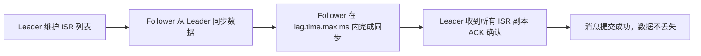

# 消息队列笔面试题集

> 模块：04-message-queue（第4周 消息队列）
> 覆盖：Kafka、RabbitMQ、消息队列通用原理
> 题量：15 道选择题 + 8 道简答题 + 3 道场景设计题
> 专题：消息积压治理（扩容分区 → 转存新 Topic → 丢弃 三级处置策略）

---

## 一、选择题（15 题，每题附解析）

**Kafka ISR 同步机制流程图：**



> Kafka 的 ISR（In-Sync Replicas）机制是保证数据可靠性的核心设计。Leader 维护 ISR 列表，Follower 在限定时间内完成同步并返回 ACK，确保所有同步副本数据一致。

> 📖 **参考链接**：
> - [Kafka Documentation](https://kafka.apache.org/documentation/) -- Kafka 官方文档总入口
> - [RabbitMQ Documentation](https://www.rabbitmq.com/docs/) -- RabbitMQ 官方文档总入口

### 1. ★ 以下关于消息队列作用的描述，错误的是（ ）

A. 削峰填谷，将瞬间高并发请求暂存到队列
B. 系统解耦，生产者和消费者不直接依赖
C. 异步处理，非关键路径异步化
D. 消息队列可以完全替代数据库的事务保证

**答案：D**

**解析：** 消息队列不能替代数据库事务。消息队列提供的是"最终一致性"而非"强一致性"，在需要 ACID 事务的场景（如银行转账）仍需数据库事务保证。A、B、C 均为消息队列的核心作用。

---

### 2. ★ Kafka 中最小的并行处理单位是（ ）

A. Broker
B. Topic
C. Partition
D. Consumer Group

**答案：C**

**解析：** Partition 是 Kafka 并行处理的基本单位。每个 Partition 是一个有序、不可变的消息序列，独立进行读写。Broker 是服务节点，Topic 是逻辑分类，Consumer Group 是消费者组。

---

### 3. ★ Kafka 中 ISR 的全称和含义是（ ）

A. In-Sync Replicas，与 Leader 保持同步的副本集合
B. Internal Service Registry，内部服务注册
C. Indexed Storage Record，索引存储记录
D. Integrated Stream Router，集成流路由器

**答案：A**

**解析：** ISR（In-Sync Replicas）是 Kafka 高可靠的核心机制。只有 ISR 中的副本才有资格被选为新 Leader。Follower 在 `replica.lag.time.max.ms`（默认 30s）内有同步记录则属于 ISR。

---

### 4. ★ Kafka 中 acks=all 的含义是（ ）

A. 生产者不等待任何确认
B. Leader 写入成功即确认
C. 所有 ISR 副本写入成功才确认
D. 所有 Broker 写入成功才确认

**答案：C**

**解析：** acks=all（或 -1）表示所有 ISR 中的副本写入成功后，生产者才收到确认。这是 Kafka 最高可靠性级别。acks=0 表示不等待确认，acks=1 表示仅 Leader 确认。

---

### 5. ★ 以下哪项不是 Kafka 高吞吐的原因？（ ）

A. 顺序写磁盘
B. 零拷贝（sendfile）
C. 内存数据库存储
D. Page Cache 利用

**答案：C**

**解析：** Kafka 不依赖内存数据库，消息存储在磁盘上。其高吞吐得益于：顺序写磁盘、零拷贝 sendfile、Page Cache、批量压缩、分区并行、批量发送。Kafka 是磁盘存储，不是内存数据库。

> 📖 **参考链接**：[Kafka 设计原理](https://kafka.apache.org/documentation/#design) -- 高吞吐六大设计官方说明

---

### 6. ★★ RabbitMQ 中，将消息广播到所有绑定队列的 Exchange 类型是（ ）

A. Direct
B. Topic
C. Fanout
D. Headers

**答案：C**

**解析：** Fanout Exchange 忽略 Routing Key，将消息广播到所有绑定的队列。Direct 精确匹配 Routing Key，Topic 通配符匹配，Headers 根据 Header 属性匹配。

---

### 7. ★★ RabbitMQ 中消息成为死信的条件不包括（ ）

A. 消息 TTL 过期
B. 队列已满，消息被拒绝
C. 消费者调用 basic.nack 且 requeue=false
D. 消息成功被消费

**答案：D**

**解析：** 消息成功被消费后从队列中删除，不会进入死信队列。死信的三种情况：消息 TTL 过期、队列满被拒绝、消费者拒绝消息且不重新入队。

---

### 8. ★★ 以下关于 Kafka 消费者组的描述，正确的是（ ）

A. 一个 Partition 可以被组内多个消费者同时消费
B. 消费者数量超过 Partition 数量时，多余的消费者会消费部分消息
C. 不同消费者组之间独立消费，互不影响
D. 一个消费者只能属于一个消费者组

**答案：C**

**解析：** A 错误，一个 Partition 只能被组内一个消费者消费；B 错误，多余消费者空闲；C 正确，不同消费者组各自独立消费；D 错误，一个消费者可以订阅多个 Topic，但属于一个消费者组。

---

### 9. ★★ Kafka 的 Rebalance 触发条件不包括（ ）

A. 消费者组成员变更
B. Topic 的 Partition 数量变更
C. 消费者心跳超时
D. 消息消费积压超过阈值

**答案：D**

**解析：** Rebalance 触发条件：消费者成员变更、Partition 数量变更、心跳超时。消息积压本身不会触发 Rebalance，但积压可能导致消费者处理时间过长，间接触发心跳超时。

---

### 10. ★★ RabbitMQ 中实现延迟队列的常用方式是（ ）

A. 使用 DelayExchange 内置类型
B. TTL + 死信队列（DLX）组合
C. 使用 ScheduledExecutorService 定时任务
D. 使用 Priority Queue

**答案：B**

**解析：** RabbitMQ 不原生支持延迟队列。常用方案是 TTL + DLX 组合：消息设置 TTL 过期后进入死信队列，消费者监听死信队列实现延迟消费。也可使用 rabbitmq-delayed-message-exchange 插件。

---

### 11. ★★★ 以下关于 Kafka 幂等生产者的描述，正确的是（ ）

A. 幂等生产者可以保证跨分区的消息不重复
B. 幂等生产者通过 PID + Sequence Number 去重
C. 幂等生产者不需要配置 acks 参数
D. 幂等生产者可以保证跨会话的消息不重复

**答案：B**

**解析：** Broker 为每个 Producer 分配 PID，每条消息携带 PID + Sequence Number，Broker 据此去重。A 错误，幂等只能保证单分区内不重复；C 错误，开启幂等必须 acks=all；D 错误，跨会话（Producer 重启）PID 会变化。

---

### 12. ★★★ RabbitMQ 中，消息持久化需要设置的属性是（ ）

A. deliveryMode=1
B. deliveryMode=2
C. persistent=true
D. durable=true

**答案：B**

**解析：** 消息持久化通过设置 `deliveryMode=2` 实现。注意：仅设置消息持久化还不够，还需要队列持久化（durable=true）和 Exchange 持久化，三者缺一不可。

---

### 13. ★★★ 以下关于 Kafka 零拷贝的描述，错误的是（ ）

A. 使用 sendfile() 系统调用实现
B. 数据从 Page Cache 直接 DMA 拷贝到网卡
C. 需要将数据先拷贝到用户态缓冲区
D. 减少了 CPU 参与数据拷贝

**答案：C**

**解析：** 零拷贝的核心就是数据不经过用户态，从 Page Cache 直接 DMA 拷贝到网卡。C 描述的是传统 I/O 方式，需要 4 次拷贝（含 2 次 CPU 拷贝到用户态）。

---

### 14. ★★★ RabbitMQ 镜像队列中，读写操作发生在（ ）

A. 所有 Mirror 节点同时处理
B. 随机一个 Mirror 节点处理
C. Master 节点处理
D. 负载均衡分配到各节点

**答案：C**

**解析：** 镜像队列中所有操作（发布、消费、确认）都经过 Master 节点处理，Mirror 节点仅做数据同步。镜像队列不提供负载均衡，只提供高可用。

---

### 15. ★★★ Kafka 3.0+ 版本中，替代 ZooKeeper 的元数据管理方案是（ ）

A. etcd
B. Consul
C. KRaft
D. Nacos

**答案：C**

**解析：** Kafka 3.0+ 引入了 KRaft（Kafka Raft）模式，使用 Kafka 自身的 Raft 协议管理元数据，不再依赖 ZooKeeper。这简化了部署架构，提升了可扩展性。

---

## 二、简答题（8 题，每题附完整解析）

### 1. 简述消息队列在分布式系统中的三大核心作用，并举例说明。

**答案：**

1. **削峰填谷**：将瞬间高并发请求暂存到队列，后端按自身处理能力消费。例如：秒杀活动时，前端请求先进入消息队列，后端服务按固定速率消费，避免系统崩溃。
2. **系统解耦**：生产者和消费者不直接依赖，通过队列间接通信。例如：订单系统创建订单后，无需直接调用库存、物流、通知系统，而是发送消息到队列，各系统独立消费。
3. **异步处理**：非关键路径操作异步化，提升响应速度。例如：用户注册后，核心流程是保存用户数据并返回成功，发送欢迎邮件和短信可以异步处理。

---

### 2. 解释 Kafka 的 ISR 机制，并说明 Leader 选举如何保证数据不丢失。

**答案：**

ISR（In-Sync Replicas）是与 Leader 保持同步的副本集合。Follower 在 `replica.lag.time.max.ms`（默认 30s）内有同步记录则属于 ISR。

Leader 选举保证数据不丢失的机制：
- 当 Leader 宕机时，Controller 从 ISR 中选举新 Leader
- 通过设置 `unclean.leader.election.enable=false`，禁止从非 ISR 副本中选举 Leader
- 配合 `acks=all`（所有 ISR 确认）和 `min.insync.replicas >= 2`，确保新 Leader 拥有所有已提交的消息

---

### 3. 对比 Kafka 和 RabbitMQ 的核心区别，分别适用于什么场景？

**答案：**

| 维度 | Kafka | RabbitMQ |
|------|-------|----------|
| 消息模型 | 基于日志，消费后保留 | 基于队列，消费后删除 |
| 吞吐量 | 极高（100w+ TPS） | 中等（1w-2w TPS） |
| 路由能力 | 弱（仅 Topic 级别） | 强（四种 Exchange 类型） |
| 消息回溯 | 支持 | 不支持 |
| 协议 | 自定义二进制协议 | AMQP 标准协议 |

**适用场景：**
- Kafka：日志收集、流处理、大数据管道、高吞吐场景
- RabbitMQ：业务消息、复杂路由、低延迟 RPC 通信

> **生活化类比：Kafka = 高铁，RabbitMQ = 快递，RocketMQ = 特快专递** —— 三种消息队列就像三种运输方式。**Kafka 是高铁**：载客量极大（百万级 TPS）、速度极快（顺序写+零拷贝），适合大批量运输（日志收集、数据管道），但停靠站少（路由能力弱）。**RabbitMQ 是普通快递**：灵活多变（四种 Exchange 路由）、送到即签收（消费后删除），适合精细配送（业务消息、复杂路由），但单次运量有限（吞吐量中等）。**RocketMQ 是特快专递**：支持货到付款（事务消息）、定时派送（延迟消息）、按标签分拣（Tag 过滤），适合高可靠配送（电商订单、金融交易）。

> 📖 **参考链接**：
> - [Kafka Documentation](https://kafka.apache.org/documentation/) -- Kafka 官方文档
> - [RabbitMQ Documentation](https://www.rabbitmq.com/docs/) -- RabbitMQ 官方文档
> - [RocketMQ Documentation](https://rocketmq.apache.org/docs/) -- RocketMQ 官方文档

---

### 4. 简述 RabbitMQ 中消息确认机制（Confirm 和 Ack）的作用。

**答案：**

**Producer Confirm（生产者确认）：**
- 生产者发送消息后，Broker 返回 ack（成功）或 nack（失败）
- 消息成功路由到所有持久化队列后返回 ack
- 如果消息无法路由，返回 nack 或触发 Return 回调

**Consumer Ack（消费者确认）：**
- 手动确认模式（manual ack）：消费者处理成功后显式调用 `basic.ack`，失败调用 `basic.nack`
- 自动确认模式（auto ack）：消息投递后立即确认，可能丢失消息
- 建议生产环境使用手动确认，确保消息被正确处理

**完整代码示例（基于 RabbitMQ Java Client）：**

```java
import com.rabbitmq.client.*;

import java.io.IOException;
import java.util.concurrent.TimeoutException;

public class MessageConfirmExample {

    private static final String QUEUE_NAME = "order_queue";
    private Connection connection;
    private Channel channel;

    public void init() throws IOException, TimeoutException {
        ConnectionFactory factory = new ConnectionFactory();
        factory.setHost("localhost");
        factory.setUsername("guest");
        factory.setPassword("guest");
        factory.setAutomaticRecoveryEnabled(true); // 自动恢复连接
        connection = factory.newConnection();
        channel = connection.createChannel();
        
        // 声明队列
        channel.queueDeclare(QUEUE_NAME, true, false, false, null);
        
        // 关键配置：关闭自动确认，使用手动确认模式
        // prefetchCount=1 ：告诉RabbitMQ不要一次性给消费者多个消息，处理完一个再投放下一个
        // 这样可以实现公平调度，均衡负载
        channel.basicQos(1);
    }

    public void startConsumer() throws IOException {
        // 使用手动确认模式：autoAck = false
        DeliverCallback deliverCallback = (consumerTag, delivery) -> {
            String message = new String(delivery.getBody(), "UTF-8");
            long deliveryTag = delivery.getEnvelope().getDeliveryTag();
            
            try {
                // 1. 处理消息（业务逻辑）
                System.out.println("处理消息: " + message);
                processMessage(message);
                
                // 2. 处理成功：发送 ACK
                // multiple=false：只确认当前这一条消息
                // multiple=true：确认所有小于等于当前deliveryTag的消息（批量确认）
                channel.basicAck(deliveryTag, false);
                System.out.println("消息处理成功，已ACK");
                
            } catch (Exception e) {
                // 3. 处理失败：发送 NACK
                // requeue=false：不重新入队，消息会被丢弃或进入死信队列
                // requeue=true：消息重新入队，可能会被再次消费（如果死信队列配置了，会进入死信队列）
                System.err.println("消息处理失败，发送NACK: " + e.getMessage());
                channel.basicNack(deliveryTag, false, false);
            }
        };

        CancelCallback cancelCallback = consumerTag -> {
            System.out.println("消费者被取消: " + consumerTag);
        };

        // 启动消费：autoAck=false 手动确认
        channel.basicConsume(QUEUE_NAME, false, deliverCallback, cancelCallback);
    }

    private void processMessage(String message) throws Exception {
        // 模拟业务处理，这里可能抛出异常
        if (message.contains("error")) {
            throw new RuntimeException("消息处理异常");
        }
        // ... 实际业务逻辑
    }

    public void close() throws IOException, TimeoutException {
        if (channel != null && channel.isOpen()) {
            channel.close();
        }
        if (connection != null && connection.isOpen()) {
            connection.close();
        }
    }

    // 生产者确认（Publisher Confirms）示例
    public void publishWithConfirm(String message) throws IOException, InterruptedException {
        channel.confirmSelect(); // 开启发布确认模式
        
        channel.basicPublish("", QUEUE_NAME, 
            MessageProperties.PERSISTENT_TEXT_PLAIN, 
            message.getBytes());
        
        // 同步等待确认
        boolean confirmed = channel.waitForConfirms(5000); // 超时5秒
        if (confirmed) {
            System.out.println("消息发送成功，Broker已确认");
        } else {
            System.err.println("消息发送失败，Broker未确认");
            // 处理失败：重试或存入数据库待重试
        }
    }

    // 异步确认方式（推荐，性能更好）
    public void publishWithConfirmAsync(String message) throws IOException {
        channel.confirmSelect();
        long seqNo = channel.getNextPublishSeqNo();
        
        channel.basicPublish("", QUEUE_NAME, 
            MessageProperties.PERSISTENT_TEXT_PLAIN, 
            message.getBytes());
        
        // 添加确认监听器
        channel.addConfirmListener(new ConfirmListener() {
            @Override
            public void handleAck(long deliveryTag, boolean multiple) {
                System.out.println("消息被ACK: " + deliveryTag);
                // 确认成功，移除待确认记录
            }

            @Override
            public void handleNack(long deliveryTag, boolean multiple) {
                System.err.println("消息被NACK: " + deliveryTag);
                // 处理失败：重试
            }
        });
    }
}
```

**关键总结：**
- `basicAck(deliveryTag, multiple)`：确认成功，multiple 控制批量确认
- `basicNack(deliveryTag, multiple, requeue)`：确认失败，requeue 控制是否重新入队
- `basicReject(deliveryTag, requeue)`：只拒绝单条消息，`basicNack` 支持批量
- 开启 `channel.basicQos(1)` 实现公平调度，避免个别消费者过载

---

### 5. 什么是死信队列？列举三个常见使用场景。

**答案：**

死信队列（DLX/DLQ）用于接收和处理无法正常消费的消息。

消息成为死信的三种情况：
1. 消息 TTL 过期
2. 队列已满，消息被拒绝
3. 消费者调用 basic.nack/reject 且 requeue=false

**三个常见场景：**
1. **消息重试**：消费失败的消息进入死信队列，定时任务重新投递
2. **延迟队列**：利用 TTL + DLX 实现延迟消息（如订单超时取消）
3. **异常分析**：收集无法消费的异常消息，分析原因并修复

**完整代码示例（死信队列声明 + 异常消息处理 + 重试机制）：**

```java
import com.rabbitmq.client.*;
import java.io.IOException;
import java.util.HashMap;
import java.util.Map;
import java.util.concurrent.TimeoutException;

public class DeadLetterQueueExample {

    // 交换机名称
    private static final String BUSINESS_EXCHANGE = "business.exchange";
    private static final String DEAD_LETTER_EXCHANGE = "dead.letter.exchange";
    
    // 队列名称
    private static final String BUSINESS_QUEUE = "business.order.queue";
    private static final String DEAD_LETTER_QUEUE = "dead.letter.order.queue";
    
    // 路由键
    private static final String BUSINESS_ROUTING_KEY = "order.create";
    private static final String DEAD_LETTER_ROUTING_KEY = "dead.order";
    
    // 最大重试次数
    private static final int MAX_RETRY_COUNT = 3;

    private Connection connection;
    private Channel channel;

    public void init() throws IOException, TimeoutException {
        ConnectionFactory factory = new ConnectionFactory();
        factory.setHost("localhost");
        connection = factory.newConnection();
        channel = connection.createChannel();

        // ========== 1. 声明死信交换机 ==========
        channel.exchangeDeclare(DEAD_LETTER_EXCHANGE, BuiltinExchangeType.DIRECT, true);
        
        // ========== 2. 声明死信队列 ==========
        // 死信队列不需要特殊配置，就是一个普通队列
        channel.queueDeclare(DEAD_LETTER_QUEUE, true, false, false, null);
        channel.queueBind(DEAD_LETTER_QUEUE, DEAD_LETTER_EXCHANGE, DEAD_LETTER_ROUTING_KEY);

        // ========== 3. 声明业务交换机 ==========
        channel.exchangeDeclare(BUSINESS_EXCHANGE, BuiltinExchangeType.DIRECT, true);

        // ========== 4. 声明业务队列（关键：绑定死信交换机）==========
        Map<String, Object> arguments = new HashMap<>();
        // 4.1 指定死信交换机
        arguments.put("x-dead-letter-exchange", DEAD_LETTER_EXCHANGE);
        // 4.2 指定死信路由键（消息进入死信队列时使用的路由键）
        arguments.put("x-dead-letter-routing-key", DEAD_LETTER_ROUTING_KEY);
        // 4.3 可选：设置队列中消息的 TTL（毫秒），超时后自动进入死信队列
        arguments.put("x-message-ttl", 30000); // 30秒
        // 4.4 可选：设置队列最大长度，超出后最旧的消息进入死信队列
        arguments.put("x-max-length", 10000);
        // 4.5 可选：设置队列最大字节数
        arguments.put("x-max-length-bytes", 104857600L); // 100MB

        channel.queueDeclare(BUSINESS_QUEUE, true, false, false, arguments);
        channel.queueBind(BUSINESS_QUEUE, BUSINESS_EXCHANGE, BUSINESS_ROUTING_KEY);
        
        System.out.println("死信队列初始化完成");
    }

    // ========== 业务消费者：处理失败时发送 NACK ==========
    public void startBusinessConsumer() throws IOException {
        channel.basicQos(1);
        
        DeliverCallback deliverCallback = (consumerTag, delivery) -> {
            String message = new String(delivery.getBody(), "UTF-8");
            long deliveryTag = delivery.getEnvelope().getDeliveryTag();
            
            // 从消息头获取重试次数
            Map<String, Object> headers = delivery.getProperties().getHeaders();
            int retryCount = 0;
            if (headers != null && headers.containsKey("x-retry-count")) {
                retryCount = (int) headers.get("x-retry-count");
            }
            
            try {
                System.out.println("处理消息 [重试次数=" + retryCount + "]: " + message);
                processBusinessMessage(message);
                
                // 处理成功：ACK
                channel.basicAck(deliveryTag, false);
                System.out.println("消息处理成功");
                
            } catch (Exception e) {
                System.err.println("消息处理失败: " + e.getMessage());
                
                if (retryCount < MAX_RETRY_COUNT) {
                    // 未达到最大重试次数：重新发布消息，增加重试次数
                    System.out.println("重新发布消息，重试次数: " + (retryCount + 1));
                    
                    Map<String, Object> retryHeaders = new HashMap<>();
                    retryHeaders.put("x-retry-count", retryCount + 1);
                    
                    AMQP.BasicProperties retryProps = new AMQP.BasicProperties.Builder()
                        .headers(retryHeaders)
                        .deliveryMode(2) // 持久化
                        .build();
                    
                    channel.basicPublish(BUSINESS_EXCHANGE, BUSINESS_ROUTING_KEY, 
                        retryProps, message.getBytes());
                    
                    // 确认当前消息（已重新发布，不需要再处理）
                    channel.basicAck(deliveryTag, false);
                    
                } else {
                    // 达到最大重试次数：发送 NACK 且不重新入队，消息进入死信队列
                    System.err.println("达到最大重试次数，消息进入死信队列");
                    // requeue=false：不重新入队，消息自动进入死信队列
                    channel.basicNack(deliveryTag, false, false);
                }
            }
        };

        channel.basicConsume(BUSINESS_QUEUE, false, deliverCallback, consumerTag -> {});
        System.out.println("业务消费者已启动");
    }

    // ========== 死信队列消费者：处理失败消息 ==========
    public void startDeadLetterConsumer() throws IOException {
        channel.basicQos(1);
        
        DeliverCallback deliverCallback = (consumerTag, delivery) -> {
            String message = new String(delivery.getBody(), "UTF-8");
            long deliveryTag = delivery.getEnvelope().getDeliveryTag();
            
            // 死信消息的元信息
            // 死信原因可以从 x-death 头中获取
            Map<String, Object> headers = delivery.getProperties().getHeaders();
            
            try {
                System.out.println("=== 死信队列消息 ===");
                System.out.println("消息内容: " + message);
                System.out.println("路由键: " + delivery.getEnvelope().getRoutingKey());
                
                if (headers != null) {
                    // 打印死信原因
                    System.out.println("死信原因头信息: " + headers.get("x-death"));
                }
                
                // 死信处理策略：
                // 1. 记录到数据库，供人工排查
                saveToDatabase(message);
                // 2. 发送告警通知
                sendAlert("消息进入死信队列: " + message);
                // 3. 确认处理
                channel.basicAck(deliveryTag, false);
                
            } catch (Exception e) {
                // 死信处理也失败了，记录日志
                System.err.println("死信处理失败: " + e.getMessage());
                channel.basicAck(deliveryTag, false); // 仍然确认，避免无限循环
            }
        };

        channel.basicConsume(DEAD_LETTER_QUEUE, false, deliverCallback, consumerTag -> {});
        System.out.println("死信队列消费者已启动");
    }

    private void processBusinessMessage(String message) throws Exception {
        // 模拟业务处理
        if (message.contains("fail")) {
            throw new RuntimeException("业务处理失败");
        }
    }

    private void saveToDatabase(String message) {
        // 将死信消息保存到数据库
        System.out.println("死信消息已保存到数据库: " + message);
    }

    private void sendAlert(String alertMsg) {
        // 发送告警（钉钉、邮件、短信等）
        System.out.println("告警通知: " + alertMsg);
    }

    // ========== 延迟队列方案：TTL + DLX ==========
    public void setupDelayQueueExample() throws IOException {
        // 延迟队列的本质：消息在普通队列中等待 TTL 过期，然后自动进入死信队列
        // 死信队列的消费者就是"延迟消费者"
        
        // 创建延迟 Exchange（实际就是普通 Exchange）
        channel.exchangeDeclare("delay.exchange", BuiltinExchangeType.DIRECT, true);
        
        // 创建延迟缓存队列（消息在这里等待过期）
        Map<String, Object> delayArgs = new HashMap<>();
        delayArgs.put("x-dead-letter-exchange", "delay.exchange");
        delayArgs.put("x-dead-letter-routing-key", "delay.process");
        delayArgs.put("x-message-ttl", 60000); // 60秒后过期
        
        channel.queueDeclare("delay.queue", true, false, false, delayArgs);
        channel.queueBind("delay.queue", "delay.exchange", "delay.pending");
        
        // 创建延迟处理队列（消息 TTL 过期后路由到这里）
        channel.queueDeclare("delay.process.queue", true, false, false, null);
        channel.queueBind("delay.process.queue", "delay.exchange", "delay.process");
        
        System.out.println("延迟队列设置完成（60秒延迟）");
    }

    public void close() throws IOException, TimeoutException {
        if (channel != null && channel.isOpen()) channel.close();
        if (connection != null && connection.isOpen()) connection.close();
    }
}
```

**关键总结：**
- 死信队列配置三要素：`x-dead-letter-exchange`、`x-dead-letter-routing-key`、消费者 NACK 且 `requeue=false`
- 延迟队列本质：`TTL + DLX` 组合，消息在普通队列中等待过期，自动进入死信队列
- 重试机制：在消息头中携带 `x-retry-count`，逐次递增，达到上限后 NACK 进入死信队列
- 死信消息处理：入库记录、告警通知、人工排查，避免死信无限循环

---

### 6. 简述 Kafka Rebalance 的触发条件和优化措施。

**答案：**

**触发条件：**
1. 消费者组成员变更（新增/下线消费者）
2. Topic 的 Partition 数量变更
3. 消费者心跳超时（`session.timeout.ms` 默认 45s）

**优化措施：**
1. 增大 `session.timeout.ms` 和 `heartbeat.interval.ms`，减少网络抖动导致的误判
2. 使用 Cooperative Sticky 分配策略（Kafka 2.4+），分阶段 Rebalance，不停止消费
3. 避免频繁启停消费者
4. 消费者处理逻辑不要长时间阻塞，避免超过 `max.poll.interval.ms`

---

### 7. 解释 Kafka 的 Exactly-Once 语义是如何实现的。

**答案：**

Exactly-Once 语义通过两层保障实现：

**1. 幂等生产者：**
- Broker 为每个 Producer 分配唯一 PID
- 每条消息携带 PID + Sequence Number（递增）
- Broker 维护每个 PID 的最近 5 个 Sequence Number
- 如果收到的 Sequence Number 小于等于已记录的，则丢弃

**2. 事务生产者：**
- 流程：`initTransactions() -> beginTransaction() -> send() -> sendOffsetsToTransaction() -> commitTransaction()`
- 将"消费 offset 提交"和"生产消息发送"放在同一个事务中
- 消费者使用 `read_committed` 隔离级别，只消费已提交事务的消息

> **生活化类比：幂等生产者 = 防重复盖章** —— Kafka 幂等生产者就像邮局的"防重复盖章"机制。每封信（消息）都盖一个唯一编号（PID + Sequence Number），如果同一编号的信被投递两次，邮局（Broker）会识别出重复并丢弃后者。但这个防重复只在同一个寄件人（同一 PID）内有效，换了寄件人（Producer 重启，PID 变化）就不管用了——这就需要事务生产者来保证跨会话的原子性。

> 📖 **参考链接**：[Kafka Exactly-Once 语义](https://kafka.apache.org/documentation/#semantics) -- 幂等生产者与事务机制官方说明

---

### 8. 简述 RabbitMQ 延迟队列的实现原理和典型应用场景。

**答案：**

**实现原理：**

方案一（TTL + DLX 组合）：
1. 消息发送到普通队列，设置 TTL 过期时间
2. 消息过期后自动转发到死信队列
3. 消费者监听死信队列，实现延迟消费

方案二（插件）：
- 安装 rabbitmq-delayed-message-exchange 插件
- 使用 x-delayed-type 类型的 Exchange
- 消息携带 x-delay 头部指定延迟时间

**典型应用场景：**
- 订单超时取消：下单后 30 分钟检查订单是否支付
- 定时提醒：会议开始前 15 分钟推送提醒
- 重试退避：失败消息按指数退避策略延迟重试

---

## 三、场景设计题（3 题，每题附完整解析）

### 1. 设计一个"订单超时取消"系统

**场景描述：** 电商平台用户下单后，如果在 30 分钟内未支付，系统需要自动取消订单并释放库存。

**设计方案：**

**方案一：基于 RabbitMQ 延迟队列（推荐）**

```
1. 用户下单 -> 创建订单（状态：UNPAID）-> 扣减库存
2. 发送延迟消息到 RabbitMQ（延迟 30 分钟）
3. 30 分钟后，消费者收到延迟消息
4. 查询订单状态：
   - 仍为 UNPAID -> 取消订单 -> 恢复库存 -> 发送取消通知
   - 已支付 -> 忽略
```

**方案二：基于 Kafka + 定时任务**

```
1. 用户下单 -> 创建订单 -> 发送消息到 Kafka
2. 定时任务每分钟扫描创建时间超过 30 分钟且状态为 UNPAID 的订单
3. 批量取消订单并恢复库存
```

**方案对比：**
- RabbitMQ 方案更精确，30 分钟整触发，但需要额外维护延迟队列
- Kafka 方案更简单，但扫描有延迟（最多 1 分钟），数据库压力大

**关键技术点：**
- 幂等性：取消订单操作需幂等（防止重复取消）
- 分布式锁：多个消费者同时处理同一订单时需要加锁
- 监控告警：延迟消息积压告警

---

### 2. 设计一个"跨服务数据同步"方案

**场景描述：** 用户服务修改了用户信息（如手机号），需要同步到订单服务、物流服务、营销服务三个下游服务。

**设计方案：**

**架构设计：**

```
用户服务 -> Kafka Topic (user-change-topic)
  -> 订单服务（Consumer Group: order-sync）
  -> 物流服务（Consumer Group: logistics-sync）
  -> 营销服务（Consumer Group: marketing-sync）
```

**关键设计点：**

1. **消息格式：**
```json
{
  "eventType": "USER_UPDATED",
  "userId": "12345",
  "changedFields": ["phone", "email"],
  "data": {
    "phone": "13800138000",
    "email": "new@example.com"
  },
  "timestamp": 1700000000000,
  "version": 2
}
```

2. **可靠性保障：**
   - Kafka acks=all，确保消息不丢失
   - 消费者手动提交 offset，处理成功后才提交
   - 消费者本地记录已处理的 eventId，实现幂等

3. **一致性保障：**
   - 使用版本号（version）防止乱序消费
   - 消费者只处理 version 大于本地记录的消息
   - 失败消息进入死信队列，人工介入处理

4. **监控：**
   - 监控各消费者组的消费 Lag
   - 记录同步延迟（消息时间戳 vs 消费时间）
   - 数据不一致定期对账

---

### 3. 设计一个"日志收集与分析"系统

**场景描述：** 某交通系统每天产生 10 亿条日志（车辆通行记录、设备状态、系统日志等），需要实时收集、存储和分析。

**设计方案：**

**架构设计：**

```
业务系统 -> Filebeat/Logstash -> Kafka -> Flink/Spark Streaming -> ES/HBase -> 可视化
                           |                    |
                           v                    v
                      原始日志备份         实时告警(钉钉/短信)
```

**各层设计：**

**1. 采集层（Filebeat/Logstash）：**
- Filebeat 部署在各业务服务器，轻量级采集
- 日志格式统一为 JSON，包含 timestamp、service、level、message 等字段
- 按服务类型路由到不同 Kafka Topic

**2. 缓冲层（Kafka）：**
- 按日志类型创建 Topic：`traffic-log`、`device-log`、`system-log`
- Partition 数量：30-50（根据吞吐量）
- 保留策略：7 天（原始日志），3 天（处理后的日志）
- 压缩：LZ4（高吞吐 + 低 CPU）

**3. 处理层（Flink）：**
- 实时聚合：每分钟通行量统计
- 异常检测：车辆速度异常、设备离线告警
- 数据清洗：格式校验、去重、补全

**4. 存储层：**
- 热数据（近 7 天）：Elasticsearch（全文检索）
- 温数据（近 3 个月）：HBase（按时间范围查询）
- 冷数据（3 个月以上）：HDFS/对象存储（压缩归档）

**5. 可视化层：**
- Grafana：实时流量大盘
- Kibana：日志检索和分析
- 告警：钉钉机器人 + 短信通知

**关键配置：**

```yaml
# Kafka 高吞吐配置
kafka:
  producer:
    batch.size: 65536        # 64KB
    linger.ms: 5
    compression.type: lz4
    buffer.memory: 134217728 # 128MB
  topic:
    traffic-log:
      partitions: 50
      replication.factor: 3
      retention.ms: 604800000  # 7 天
```

> 📖 **参考链接**：
> - [Kafka 运维与监控](https://kafka.apache.org/documentation/#ops) -- Kafka 运维操作官方指南
> - [RabbitMQ Tutorials](https://www.rabbitmq.com/getstarted.html) -- RabbitMQ 官方教程

---

## 四、消息积压治理专题

> 定位：消息积压是生产环境最高频、最紧急的故障之一，本节把散落在各中间件文档中的处置手段整合为一套可复用的方法论。
> 适用：Kafka / RabbitMQ / RocketMQ 通用，差异部分单独标注。

### 4.1 积压的本质与判定

**积压的本质：** 一段时间内「生产速率 > 消费速率」，消息在队列中净增长。常见诱因：

| 诱因 | 典型表现 |
|------|----------|
| 流量突增 | 大促、秒杀、批量导入导致生产速率翻数倍 |
| 消费能力不足 | 消费者实例少、分区数少、单条处理慢 |
| 消费逻辑变慢 | 下游接口超时、数据库慢查询、外部调用抖动 |
| 消费者异常 | 消费线程阻塞、频繁 Rebalance、消费者全部下线 |
| 顺序消费阻塞 | 单条异常消息卡住整个队列，后续消息无法推进 |
| 重试风暴 | 失败消息反复重投，有效吞吐被重试占用 |

**判定指标：**

- **Kafka**：Consumer Lag = Log-End-Offset − Current-Offset，用 `kafka-consumer-groups.sh --describe` 查看
- **RocketMQ**：Diff Total（积压总量），用 `mqadmin consumerProgress` 查看
- **RabbitMQ**：队列深度 messages、未确认消息数 messages_unacknowledged、消费者数 consumers，用 `rabbitmqctl list_queues` 查看

**关键判断：** 看的是「趋势」而不是「绝对值」。Lag 短暂冲高后回落属正常削峰；Lag 持续单调增长才说明消费能力存在硬缺口。

### 4.2 三级处置策略

处置遵循「先止血、再治本、最后兜底」的递进逻辑，禁止一上来就丢数据。

#### 第一级：扩容分区（提升消费并行度）

**适用场景：** 消费并行度不足，即「消费者实例数 < 分区数/队列数」，或分区数本身太小成为瓶颈。

**操作步骤：**

```
Kafka：
1. 先扩容消费者到分区数上限（消费者数 ≤ 分区数，多出的实例会空闲）
2. 若仍不足，扩容分区：
   kafka-topics.sh --bootstrap-server localhost:9092 \
     --alter --topic order-topic --partitions 48
3. 再按新分区数扩容消费者

RocketMQ：
1. 扩容消费者实例（消费者数 ≤ readQueueNums）
2. 若不足，修改 Broker 的 readQueueNums 并重启（写队列数不能小于读队列数）
3. 注意顺序消息的队列数调整需评估顺序性影响

RabbitMQ：
1. 队列无分区概念，直接增加消费者实例即可（同一队列多消费者竞争消费）
2. 适度调大 prefetch（如 10 → 50）提升单消费者吞吐
3. 启用惰性队列（磁盘优先）避免积压消息占满内存
```

**风险：**

- Kafka 分区数**只能增加不能减少**；分区过多增加元数据开销和故障恢复时间（单 Broker 建议不超过 2000-4000）
- Kafka 扩容分区后**已有消息不会重新分布**，只有新消息按新分区数路由，对已积压的旧消息帮助有限
- RabbitMQ 增加消费者会**破坏单队列顺序性**，仅适用于无需顺序的队列
- RocketMQ 修改 readQueueNums 需重启 Broker，属于有损操作

#### 第二级：转存新 Topic 再消费（消费逻辑本身是瓶颈）

**适用场景：** 分区数已到规划上限，或单条消息处理耗时（外部调用、复杂计算）导致并行度无法靠加机器解决。这是**最常用也最有效**的应急手段。

**操作步骤：**

```
Kafka：
1. 创建新 Topic（分区数设为原 Topic 的 4-8 倍），如 order-topic-retry
2. 部署「临时转存消费者」：只做拉取-转发，不执行业务逻辑
   （纯转发吞吐可达数十万 TPS），把原 Topic 快速消费并写入新 Topic
3. 原 Topic 消费者组暂停业务消费，Lag 快速清零
4. 启动大批量业务消费者消费新 Topic，按分区并行处理
5. 处理完成后下线临时消费者，业务切回原 Topic

RocketMQ：
1. 创建临时 ConsumerGroup，用普通消息模式快速消费积压数据
2. 转发到新 Topic（分区数/队列数设为原来的数倍）
3. 用大量消费者并行消费新 Topic
4. 注意顺序消息转存后需保证同一业务 Key 仍落到同一队列

RabbitMQ：
1. 创建新队列 notice.queue.retry，绑定新的交换机
2. 部署临时消费者做纯转发，把积压消息转存到新队列
3. 启动大批量业务消费者消费新队列
4. 处理完成后下线临时消费者，业务切回原队列
```

**风险：**

- 转存期间「已转发但位移未提交」会造成消息重复，消费端必须幂等
- 转存链路引入额外一跳，需监控新 Topic/队列的积压
- 临时消费者、临时 Topic 需在事后清理，否则遗留运维债
- 顺序消息转存时分区/队列的哈希规则必须与原规则一致，否则顺序被破坏

#### 第三级：丢弃（业务可容忍时）

**适用场景：** 消息已失去时效（如超过 24 小时的营销通知）、非核心数据、已有对账补偿机制兜底。**这是最后手段，必须经过业务确认。**

**操作步骤：**

```
Kafka：重置位移到最新
  kafka-consumer-groups.sh --bootstrap-server localhost:9092 \
    --reset-offsets --to-latest --group order-group --topic order-topic --execute
  或删除并重建 Topic 清空数据

RocketMQ：
  在控制台重置消费位点，或按时间戳跳过历史消息
  （mqadmin resetOffsetByTime）

RabbitMQ：
  管理台 purge 队列，或对队列设置消息 TTL 让其自然过期
  rabbitmqctl purge_queue notice.queue
```

**风险：** 操作**不可逆**，执行前必须停止消费者、备份必要数据、评估业务影响并留存审批记录。

**三级策略速查：**

| 级别 | 适用场景 | 见效速度 | 主要风险 | 是否丢数据 |
|------|----------|----------|----------|-----------|
| 扩容分区 | 并行度不足 | 快（分钟级） | 分区只增不减、旧消息不重分布、RabbitMQ 破坏顺序 | 否 |
| 转存新 Topic | 消费逻辑本身慢 | 中（需部署临时消费者） | 重复消费、额外运维、顺序需保持 | 否（需幂等） |
| 丢弃 | 数据可容忍丢失 | 立即 | 不可逆、业务影响大 | 是 |

### 4.3 Kafka / RabbitMQ / RocketMQ 积压处理差异

| 维度 | Kafka | RabbitMQ | RocketMQ |
|------|-------|----------|----------|
| 并行度上限 | 消费者数 ≤ Partition 数 | 无硬性限制，加消费者即可 | 消费者数 ≤ readQueueNums |
| 扩容手段 | 加消费者 + 增加 Partition | 加消费者 + 调大 prefetch + 转存新队列 | 加消费者 + 扩 readQueueNums + 转存新 Topic |
| 消息保留 | 按 offset 保留，可重置位移重放 | 消费后删除，不可重放 | 消费后保留，可按时间/offset 回溯 |
| 丢弃方式 | 重置 offset 到 latest、删除重建 Topic | purge 队列、设置 TTL 过期 | 重置消费位点、按时间跳过 |
| 积压存储压力 | 主要受磁盘限制，几乎无内存压力 | 内存优先模式易 OOM（惰性队列缓解） | CommitLog 顺序写，受磁盘限制 |
| 顺序性影响 | 加消费者不影响分区内顺序 | 加消费者破坏队列内顺序 | 加消费者不影响队列内顺序（顺序消费受队列数限制） |
| 监控指标 | Consumer Lag | 队列深度、未确认消息数、消费者数 | Diff Total |
| 排查命令 | `kafka-consumer-groups.sh --describe` | `rabbitmqctl list_queues name messages consumers` | `mqadmin consumerProgress` |

### 4.4 消费者扩容的正确做法

**核心原则：消费者数量不能超过可分配的并行单元数，超出部分只会空转。**

| 中间件 | 并行单元 | 扩容上限 | 超出后果 |
|--------|----------|----------|----------|
| Kafka | Partition | 消费者数 ≤ Partition 数 | 多余消费者分配不到分区，完全空闲 |
| RocketMQ | readQueueNums | 消费者数 ≤ readQueueNums | 多余消费者分配不到 MessageQueue，完全空闲 |
| RabbitMQ | 无（队列内竞争） | 无硬性上限 | 无空闲，但会破坏顺序性、加剧 Broker 推送压力 |

**正确扩容步骤：**

```
1. 先确认当前并行度：消费者实例数 vs 分区数/队列数
2. 若消费者数 < 分区数：直接加消费者实例（最快、零风险）
3. 若消费者数 = 分区数：先扩容分区，再扩容消费者
4. 扩容前后观察：Lag 下降速率、单分区消费耗时、Broker 负载
5. 切勿盲目加消费者：超过分区数的实例不会分担任何压力
```

**常见误区：**

- 盲目加消费者实例，实际并行度并未提升，只增加了连接数和 Rebalance 风险
- 只扩容消费者不扩容分区，误以为「加机器就能解决」
- 忽略单条处理耗时：若单条处理 500ms，即使 48 个分区，吞吐上限也只有 96 TPS/消费者

### 4.5 积压监控指标与告警阈值

| 指标 | 含义 | 采集方式 | 建议阈值 |
|------|------|----------|----------|
| Consumer Lag / Diff Total | 消费积压量 | Kafka: kafka-consumer-groups；RocketMQ: mqadmin consumerProgress | > 10 万或持续增长 5 分钟告警 |
| Lag 增长速率 | 单位时间净增量 | 时序数据库对 Lag 求导 | 持续为正 10 分钟告警 |
| 队列深度 | 待消费消息数 | RabbitMQ: `rabbitmqctl list_queues` | > 10 万告警，> 100 万严重 |
| 消费者数量 | 在线消费者数 | RabbitMQ: consumers 字段 | = 0 立即告警（无人消费） |
| 未确认消息数 | 已投递未 ack | RabbitMQ: messages_unacknowledged | 持续接近 prefetch × 消费者数时告警 |
| 入队/出队速率 | 生产与消费速率 | 各中间件管理台 | 入队速率持续大于出队速率告警 |
| 单批消费耗时 | 消费者处理一批的耗时 | 应用埋点 | 接近 max.poll.interval.ms（Kafka 默认 5min）告警 |
| 死信队列深度 | 死信堆积量 | 死信队列监控 | > 1000 告警 |
| Broker 磁盘使用率 | 存储水位 | Broker 指标 | > 75% 告警，> 85% 严重 |
| Broker 内存使用率 | 内存水位 | RabbitMQ / JVM 指标 | > 80% 告警 |

**告警设计原则：**

1. **分级告警**：Lag 10 万提醒、50 万预警、100 万严重（电话）
2. **看趋势不看瞬时**：用 5 分钟滑动窗口避免瞬时抖动误报
3. **配套 Runbook**：每条告警附处置手册（先扩容消费者还是先扩容分区）
4. **覆盖「无消费者」**：队列有消息但消费者数为 0 是最隐蔽也最致命的故障

### 4.6 真实案例

**案例一：大促期间 Kafka 订单 Topic 积压 800 万**

- **现象：** order-topic 12 分区、3 个消费者实例，大促开始后 Lag 从 1 万涨到 800 万，下游处理延迟超 1 小时
- **根因：** 消费者实例数（3）远小于分区数（12），9 个分区无人消费，并行度只有 1/4
- **处置：** 第一级策略——把消费者扩容到 12 个实例，Lag 增长速率立刻转为下降；两小时后 Lag 清零
- **改进：** 大促前按峰值 TPS 重新规划分区至 48，消费者数按分区数预留，配置 Lag 分级告警

**案例二：RabbitMQ 通知队列积压 200 万，内存告警**

- **现象：** 通知队列积压 200 万条，Broker 内存使用率冲到 90%，随时可能 OOM
- **根因：** 通知服务消费者因下游短信网关限流而处理变慢，队列使用内存优先存储，积压消息全部驻留内存
- **处置：** 先对队列启用惰性模式（`rabbitmqctl set_policy lazy-queue "^(notice)\." '{"queue-mode":"lazy"}'`）把消息落到磁盘缓解内存压力；再用临时消费者把积压消息转存到新队列，由扩容后的消费者并行消费
- **改进：** 队列统一设置 x-max-length + x-message-ttl 双保险，队列深度与内存使用率纳入监控

**案例三：RocketMQ 顺序消费被单条异常消息卡死**

- **现象：** 账户流水 Topic 的某个 MessageQueue 积压持续增长，其他队列正常，消费者日志反复打印同一条消息的处理异常
- **根因：** ConsumeMode.ORDERLY 下单线程顺序消费，某条消息因数据格式异常反复重试，失败消息不跳过，阻塞了该队列后续所有消息
- **处置：** 调低 maxReconsumeTimes 让异常消息快速进入死信队列，恢复队列消费；把耗时与非核心逻辑从顺序链路中剥离，异步化处理
- **改进：** 顺序消息统一设置 3-5 次重试上限 + 死信兜底；对「同一队列 Lag 显著高于其他队列」单独告警

### 4.7 积压排查清单

```
□ 确认积压范围：全部 Topic/队列还是个别分区/队列？
□ 确认趋势：Lag 是短暂冲高还是持续增长？
□ 确认消费者：实例数是否 ≥ 分区数？是否有实例掉线或 Rebalance？
□ 确认处理耗时：单条/单批处理时间是否明显变长？下游是否变慢？
□ 确认生产侧：是否有流量突增、重试风暴或重复生产？
□ 确认顺序链路：是否有单条异常消息阻塞整个队列？
□ 选择处置级别：扩容分区 → 转存新 Topic → 丢弃
□ 事后复盘：容量规划是否合理？监控告警是否及时？
```

---

> **学习导航**：
> - 返回 [学习路线总览](../../README.md)
> - 本模块其他文件：[01-Kafka核心原理](./kafka/01-Kafka核心原理.md) | [02-RabbitMQ核心原理](./rabbitmq/02-RabbitMQ核心原理.md) | [01-RocketMQ核心原理](./rocketmq/01-RocketMQ核心原理.md)
> - 实战应用：[电商订单实时统计分析平台](../../extensions/project/01-电商订单实时统计分析平台.md)


