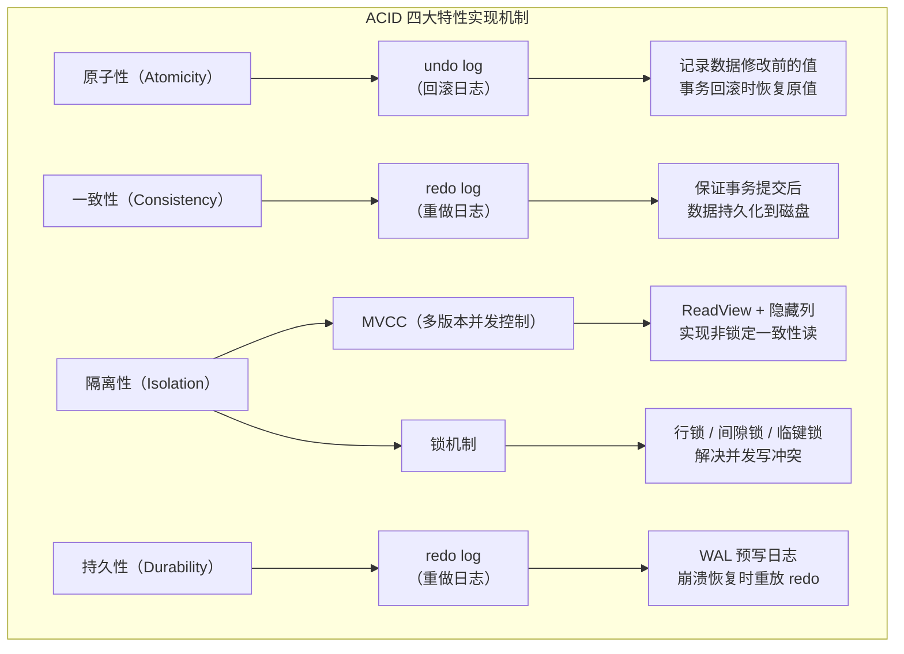

# 数据库笔面试题集

> 题目来源：常见国企/互联网笔面试真题归纳
> 难度标注：★基础 ★★中档 ★★★拔高

## 一、选择题（20 题，附解析）

1. ★ MySQL 默认存储引擎是？
   A. MyISAM
   B. InnoDB
   C. Memory
   D. CSV
   **答案：B**
   **解析：** MySQL 5.5.5 之后默认使用 InnoDB 存储引擎，支持事务、行锁、外键和崩溃恢复。

   > 📖 **参考链接**：[MySQL 8.0 参考手册 - InnoDB Introduction](https://dev.mysql.com/doc/refman/8.0/en/innodb-introduction.html) -- InnoDB 存储引擎特性官方说明

2. ★★ InnoDB 中数据和索引的存储关系是？
   A. 数据和索引分开存储
   B. 数据存储在聚簇索引的叶子节点中
   C. 数据存储在单独的表中
   D. 数据存储在内存中
   **答案：B**
   **解析：** InnoDB 使用聚簇索引，主键索引的叶子节点存储完整的行数据。二级索引的叶子节点存储主键值。

   > 📖 **参考链接**：[MySQL 8.0 参考手册 - Clustered and Secondary Indexes](https://dev.mysql.com/doc/refman/8.0/en/innodb-index-types.html) -- 聚簇索引与二级索引存储关系

3. ★★ B+ 树中，数据存储在？
   A. 根节点
   B. 所有节点
   C. 叶子节点
   D. 非叶子节点
   **答案：C**
   **解析：** B+ 树只在叶子节点存储数据，非叶子节点只存储索引键。B 树在所有节点都存储数据。

   > 📖 **参考链接**：[MySQL 8.0 参考手册 - B-Tree Index Characteristics](https://dev.mysql.com/doc/refman/8.0/en/index-btree-hash.html) -- B+ 树索引结构与叶子节点存储说明

4. ★ 以下哪个 SQL 子句可能导致索引失效？
   A. WHERE id = 1
   B. WHERE name LIKE '张%'
   C. WHERE name LIKE '%张'
   D. WHERE id IN (1, 2, 3)
   **答案：C**
   **解析：** 前导模糊查询（LIKE '%张'）无法利用索引的有序性。后置模糊（LIKE '张%'）可以使用索引。

   > 📖 **参考链接**：[MySQL 8.0 参考手册 - Index Hints](https://dev.mysql.com/doc/refman/8.0/en/index-hints.html) -- 索引使用与失效场景说明

5. ★★ EXPLAIN 输出中，以下哪个 type 表示全表扫描？
   A. const
   B. ref
   C. range
   D. ALL
   **答案：D**
   **解析：** type 从优到劣：system > const > eq_ref > ref > range > index > ALL。ALL 表示全表扫描，必须优化。

   > 📖 **参考链接**：[MySQL 8.0 参考手册 - EXPLAIN Output](https://dev.mysql.com/doc/refman/8.0/en/explain-output.html) -- type 访问类型与 ALL 全表扫描说明

6. ★★ EXPLAIN 输出中 Extra 显示 "Using filesort" 表示？
   A. 使用了索引排序
   B. 需要额外排序操作
   C. 使用了文件存储
   D. 查询执行成功
   **答案：B**
   **解析：** Using filesort 表示 MySQL 需要额外的排序操作，无法利用索引的有序性。需要优化。

   > 📖 **参考链接**：[MySQL 8.0 参考手册 - EXPLAIN Extra Information](https://dev.mysql.com/doc/refman/8.0/en/explain-output.html#explain-extra-information) -- Using filesort / Using temporary 含义说明

7. ★★ 联合索引 (a, b, c) 中，以下哪个查询可以使用索引？
   A. WHERE b = 1
   B. WHERE c = 1
   C. WHERE a = 1 AND c = 1
   D. WHERE a = 1 AND b = 1
   **答案：D**
   **解析：** 联合索引遵循最左前缀原则。A 和 B 跳过了最左列 a，无法使用索引。C 中 a 可以使用索引，但 c 跳过了 b 无法使用。

   > 📖 **参考链接**：[MySQL 8.0 参考手册 - Multiple-Column Indexes](https://dev.mysql.com/doc/refman/8.0/en/multiple-column-indexes.html) -- 联合索引最左前缀原则

8. ★★ COUNT(*) 和 COUNT(列名) 的区别是？
   A. 没有区别
   B. COUNT(*) 不统计 NULL，COUNT(列名) 统计 NULL
   C. COUNT(*) 统计所有行，COUNT(列名) 不统计该列为 NULL 的行
   D. COUNT(列名) 更快
   **答案：C**
   **解析：** COUNT(*) 统计所有行（包括 NULL 行），COUNT(列名) 不统计该列为 NULL 的行。COUNT(*) 性能通常等于或优于 COUNT(列名)。

   > 📖 **参考链接**：[MySQL 8.0 参考手册 - Aggregate Functions](https://dev.mysql.com/doc/refman/8.0/en/aggregate-functions.html) -- COUNT(*) 与 COUNT(col) 聚合函数说明

9. ★★ 以下关于乐观锁和悲观锁说法正确的是？
   A. 悲观锁假设并发冲突少
   B. 乐观锁通过锁机制保证数据一致性
   C. 乐观锁通常通过版本号实现
   D. 悲观锁性能更好
   **答案：C**
   **解析：** 乐观锁假设并发冲突少，通过版本号（CAS）实现，不阻塞。悲观锁假设并发冲突多，通过数据库锁机制（SELECT FOR UPDATE）实现，会阻塞。

   > 📖 **参考链接**：[MySQL 8.0 参考手册 - InnoDB Locking](https://dev.mysql.com/doc/refman/8.0/en/innodb-locking.html) -- InnoDB 锁机制（悲观锁 SELECT FOR UPDATE）官方说明

10. ★★ 分库分表中，以下哪个不是常用的分片算法？
    A. 哈希取模
    B. 一致性哈希
    C. 范围分片
    D. 随机分片
    **答案：D**
    **解析：** 常用分片算法：哈希取模、一致性哈希、范围分片、日期分片。随机分片会导致数据分布不确定，查询时需要广播到所有分片。

    > 📖 **参考链接**：[MySQL 8.0 参考手册 - Partitioning](https://dev.mysql.com/doc/refman/8.0/en/partitioning.html) -- MySQL 分区/分片算法官方说明

11. ★ JPA 中标识实体的注解是？
    A. @Table
    B. @Entity
    C. @Column
    D. @Repository
    **答案：B**
    **解析：** `@Entity` 标识一个类为 JPA 实体，映射到数据库表。`@Table` 指定表名，`@Column` 指定列映射。

    > 📖 **参考链接**：[MySQL 8.0 参考手册 - CREATE TABLE](https://dev.mysql.com/doc/refman/8.0/en/create-table.html) -- JPA 实体映射对应的建表语法说明

12. ★★ MyBatis 中 `#{}` 和 `${}` 的区别是？
    A. 没有区别
    B. `#{}` 是预编译，`${}` 是字符串替换
    C. `#{}` 是字符串替换，`${}` 是预编译
    D. `#{}` 用于查询，`${}` 用于更新
    **答案：B**
    **解析：** `#{}` 是预编译占位符，防止 SQL 注入。`${}` 是字符串直接替换，存在 SQL 注入风险，仅在动态表名、排序字段等场景使用。

    > 📖 **参考链接**：[MySQL 8.0 参考手册 - Prepared Statements](https://dev.mysql.com/doc/refman/8.0/en/sql-prepared-statements.html) -- 预编译语句（#{} 对应）与 SQL 注入防护

13. ★★ JPA 中 @OneToMany 和 @ManyToOne 的默认 fetch 策略分别是？
    A. LAZY, LAZY
    B. EAGER, EAGER
    C. LAZY, EAGER
    D. EAGER, LAZY
    **答案：C**
    **解析：** `@OneToMany` 和 `@ManyToMany` 默认 fetch = LAZY，`@OneToOne` 和 `@ManyToOne` 默认 fetch = EAGER。

    > 📖 **参考链接**：[MySQL 8.0 参考手册 - Nested-Loop Join](https://dev.mysql.com/doc/refman/8.0/en/nested-loop-joins.html) -- 关联查询 JOIN 执行机制（与 fetch 策略相关）

14. ★★ MyBatis-Plus 默认的主键生成策略是？
    A. AUTO（自增）
    B. INPUT（手动输入）
    C. ASSIGN_ID（雪花算法）
    D. UUID
    **答案：C**
    **解析：** MyBatis-Plus 3.3.0+ 默认使用 `ASSIGN_ID`（雪花算法），生成 Long 类型的分布式 ID。

    > 📖 **参考链接**：[MySQL 8.0 参考手册 - AUTO_INCREMENT Handling](https://dev.mysql.com/doc/refman/8.0/en/innodb-auto-increment-handling.html) -- 自增主键与分布式 ID（雪花算法）对比



> 上图展示了 MySQL InnoDB 中 ACID 四大特性的实现机制：原子性依赖 undo log 回滚、一致性依赖 redo log 保证持久化、隔离性通过 MVCC 和锁机制实现、持久性依赖 redo log 的 WAL 机制。其中 undo log 和 redo log 是 InnoDB 事务实现的基石。

15. ★★ 以下哪个不是事务的 ACID 特性？
    A. 原子性（Atomicity）
    B. 一致性（Consistency）
    C. 持久性（Durability）
    D. 可用性（Availability）
    **答案：D**
    **解析：** ACID：原子性（Atomicity）、一致性（Consistency）、隔离性（Isolation）、持久性（Durability）。可用性（Availability）是 CAP 理论中的概念。

    > 📖 **参考链接**：[MySQL 8.0 参考手册 - InnoDB Transaction Model](https://dev.mysql.com/doc/refman/8.0/en/innodb-transaction-model.html) -- ACID 四大特性与事务实现机制

16. ★★★ 以下关于 JPA N+1 问题说法正确的是？
    A. N+1 问题是 JPA 特有的性能优化技术
    B. N+1 问题可以通过 @EntityGraph 解决
    C. N+1 问题只会发生在 @OneToMany 关联中
    D. N+1 问题无法避免
    **答案：B**
    **解析：** N+1 问题可以通过 JOIN FETCH、@EntityGraph、@BatchSize 解决。N+1 问题可能发生在所有类型的关联中。

    > 📖 **参考链接**：[MySQL 8.0 参考手册 - Nested-Loop Join Algorithms](https://dev.mysql.com/doc/refman/8.0/en/nested-loop-joins.html) -- JOIN 执行机制与 N+1 问题优化

17. ★★ 分库分表后，以下哪个不是需要解决的问题？
    A. 分布式 ID 生成
    B. 跨分片 JOIN
    C. 跨分片分页排序
    D. 数据库备份
    **答案：D**
    **解析：** 数据库备份是常规运维操作，不是分库分表特有的问题。分库分表特有的问题包括：分布式 ID、跨分片 JOIN、跨分片排序分页、分布式事务等。

18. ★★ MySQL 中，以下哪个索引类型是最常用的？
    A. 哈希索引
    B. B+ 树索引
    C. 全文索引
    D. R 树索引
    **答案：B**
    **解析：** InnoDB 默认使用 B+ 树索引，支持等值查询、范围查询、排序和前缀匹配。Memory 引擎支持哈希索引。

    > 📖 **参考链接**：[MySQL 8.0 参考手册 - InnoDB Indexes](https://dev.mysql.com/doc/refman/8.0/en/innodb-indexes.html) -- InnoDB B+ 树索引与 Memory 哈希索引对比

19. ★★ @Transactional 注解的默认传播行为是？
    A. REQUIRES_NEW
    B. SUPPORTS
    C. REQUIRED
    D. NESTED
    **答案：C**
    **解析：** `@Transactional` 默认传播行为是 `REQUIRED`：有事务则加入，无事务则新建。

    > 📖 **参考链接**：[MySQL 8.0 参考手册 - COMMIT](https://dev.mysql.com/doc/refman/8.0/en/commit.html) -- 事务提交与传播行为底层机制

20. ★★ 以下关于索引的说法错误的是？
    A. 索引可以加速查询
    B. 索引越多越好
    C. 索引会占用磁盘空间
    D. 索引会降低写入性能
    **答案：B**
    **解析：** 索引不是越多越好。索引会占用磁盘空间，降低 INSERT/UPDATE/DELETE 性能。每张表索引建议不超过 5-6 个。

    > 📖 **参考链接**：[MySQL 8.0 参考手册 - CREATE INDEX](https://dev.mysql.com/doc/refman/8.0/en/create-index.html) -- 索引创建与索引数量权衡说明

---

## 二、简答题（10 题，附要点）

### 1. ★★ 什么是聚簇索引？InnoDB 如何选择聚簇索引？

**要点：** 聚簇索引的叶子节点存储完整的行数据。InnoDB 选择聚簇索引的优先级：① 显式定义的主键 -> ② 第一个非空唯一索引 -> ③ 自动生成隐藏的 row_id（6 字节）。建议使用自增主键，减少页分裂。

> 📖 **参考链接**：[MySQL 8.0 参考手册 - Clustered Indexes](https://dev.mysql.com/doc/refman/8.0/en/innodb-index-types.html) -- 聚簇索引选择优先级与自增主键页分裂说明

### 2. ★★ 什么是覆盖索引？有什么好处？

**要点：** 覆盖索引是指查询的列全部在索引中，不需要回表查询。好处：① 减少磁盘 I/O（不需要回到聚簇索引查数据）② 可以使用索引的有序性进行排序 ③ 对分页查询等场景性能提升明显。

> 📖 **参考链接**：[MySQL 8.0 参考手册 - Covering Index](https://dev.mysql.com/doc/refman/8.0/en/glossary.html#glos_covering_index) -- 覆盖索引概念与 Using index 判定

### 3. ★★ MySQL 索引失效的场景有哪些？

**要点：** 索引列使用函数（`WHERE DATE(create_time) = '2025-01-01'`） 隐式类型转换（varchar 与数字比较） LIKE 前导模糊（`LIKE '%张三'`） OR 条件中非索引列 不满足最左前缀原则 NOT、!=、<> 操作符 IS NULL / IS NOT NULL（部分情况）

**完整代码示例：索引优化前后对比**

以下是一个电商订单表的性能优化案例，展示添加索引前后的巨大差异：

**第一步：创建测试表并插入数据**

```sql
-- ============================================================
-- 1. 创建订单表（初始无索引）
-- ============================================================
DROP TABLE IF EXISTS t_order;
CREATE TABLE t_order (
    id BIGINT AUTO_INCREMENT PRIMARY KEY,
    order_no VARCHAR(32) NOT NULL COMMENT '订单号',
    user_id BIGINT NOT NULL COMMENT '用户ID',
    product_id BIGINT NOT NULL COMMENT '商品ID',
    amount DECIMAL(10,2) NOT NULL COMMENT '订单金额',
    status TINYINT NOT NULL DEFAULT 0 COMMENT '订单状态: 0=待支付,1=已支付,2=已发货,3=已完成,4=已取消',
    created_at DATETIME NOT NULL DEFAULT CURRENT_TIMESTAMP COMMENT '创建时间',
    updated_at DATETIME DEFAULT NULL ON UPDATE CURRENT_TIMESTAMP COMMENT '更新时间'
) ENGINE=InnoDB DEFAULT CHARSET=utf8mb4 COMMENT='订单表';

-- ============================================================
-- 2. 插入 100 万条测试数据（使用存储过程）
-- ============================================================
DELIMITER $$
CREATE PROCEDURE generate_orders(IN total INT)
BEGIN
    DECLARE i INT DEFAULT 1;
    WHILE i <= total DO
        INSERT INTO t_order (order_no, user_id, product_id, amount, status, created_at)
        VALUES (
            CONCAT('ORD', LPAD(i, 10, '0')),
            FLOOR(1 + RAND() * 10000),         -- 1~10000 的随机用户
            FLOOR(1 + RAND() * 5000),           -- 1~5000 的随机商品
            ROUND(10 + RAND() * 990, 2),        -- 10~1000 的随机金额
            FLOOR(RAND() * 5),                   -- 0~4 的随机状态
            DATE_ADD('2024-01-01', INTERVAL FLOOR(RAND() * 730) DAY) -- 随机日期
        );
        SET i = i + 1;
    END WHILE;
END$$
DELIMITER ;

-- 执行生成（约 1~2 分钟）
CALL generate_orders(1000000);
```

**第二步：无索引时的查询性能测试**

```sql
-- ============================================================
-- 场景1：按用户ID查询（无索引）
-- ============================================================
EXPLAIN SELECT * FROM t_order WHERE user_id = 5000;
-- 结果：
-- +----+-------------+---------+------+---------------+------+---------+------+--------+-------------+
-- | id | select_type | table   | type | possible_keys | key  | key_len | ref  | rows   | Extra       |
-- +----+-------------+---------+------+---------------+------+---------+------+--------+-------------+
-- |  1 | SIMPLE      | t_order | ALL  | NULL          | NULL | NULL    | NULL | 998234 | Using where |
-- +----+-------------+---------+------+---------------+------+---------+------+--------+-------------+
-- 
-- 分析：type=ALL 表示全表扫描，rows≈100万，需要扫描几乎所有行

-- 实测耗时（无索引）
SELECT SQL_NO_CACHE * FROM t_order WHERE user_id = 5000;
-- 耗时：约 0.8 ~ 1.2 秒

-- ============================================================
-- 场景2：按状态和创建时间范围查询（无索引）
-- ============================================================
EXPLAIN SELECT * FROM t_order
WHERE status = 1 AND created_at >= '2025-01-01' AND created_at < '2025-06-01';
-- 结果：type=ALL，rows≈100万，全表扫描

-- 实测耗时（无索引）
SELECT SQL_NO_CACHE * FROM t_order
WHERE status = 1 AND created_at >= '2025-01-01' AND created_at < '2025-06-01';
-- 耗时：约 1.0 ~ 1.5 秒

-- ============================================================
-- 场景3：ORDER BY + LIMIT 分页（无索引）
-- ============================================================
EXPLAIN SELECT * FROM t_order
ORDER BY created_at DESC LIMIT 100000, 20;
-- 结果：type=ALL，Extra=Using filesort（文件排序，性能极差）

-- 实测耗时（无索引）
SELECT SQL_NO_CACHE * FROM t_order
ORDER BY created_at DESC LIMIT 100000, 20;
-- 耗时：约 2.0 ~ 3.0 秒（大偏移量分页极慢）
```

**第三步：添加索引后的性能对比**

```sql
-- ============================================================
-- 添加索引
-- ============================================================

-- 索引1：用户ID 普通索引（高频查询字段）
ALTER TABLE t_order ADD INDEX idx_user_id (user_id);

-- 索引2：状态 + 创建时间 联合索引（覆盖状态筛选 + 时间范围查询）
ALTER TABLE t_order ADD INDEX idx_status_created_at (status, created_at);

-- 索引3：创建时间 索引（排序字段）
ALTER TABLE t_order ADD INDEX idx_created_at (created_at);

-- ============================================================
-- 场景1：按用户ID查询（有索引后）
-- ============================================================
EXPLAIN SELECT * FROM t_order WHERE user_id = 5000;
-- 结果：
-- +----+-------------+---------+------+---------------+--------------+---------+-------+------+-------+
-- | id | select_type | table   | type | possible_keys | key          | key_len | ref   | rows | Extra |
-- +----+-------------+---------+------+---------------+--------------+---------+-------+------+-------+
-- |  1 | SIMPLE      | t_order | ref  | idx_user_id   | idx_user_id  | 8       | const |  100 | NULL  |
-- +----+-------------+---------+------+---------------+--------------+---------+-------+------+-------+
-- 
-- 分析：type=ref 使用索引等值匹配，rows≈100（仅扫描约100行），性能提升约 10000 倍

-- 实测耗时（有索引）
SELECT SQL_NO_CACHE * FROM t_order WHERE user_id = 5000;
-- 耗时：约 0.001 ~ 0.003 秒（提升 400~800 倍）

-- ============================================================
-- 场景2：按状态+创建时间范围查询（有索引后）
-- ============================================================
EXPLAIN SELECT * FROM t_order
WHERE status = 1 AND created_at >= '2025-01-01' AND created_at < '2025-06-01';
-- 结果：
-- +----+-------------+---------+-------+------------------------+-----------------------+---------+------+--------+-------------+
-- | id | select_type | table   | type  | possible_keys          | key                   | key_len | ref  | rows   | Extra       |
-- +----+-------------+---------+-------+------------------------+-----------------------+---------+------+--------+-------------+
-- |  1 | SIMPLE      | t_order | range | idx_status_created_at  | idx_status_created_at | 14      | NULL | 50000  | Using where |
-- +----+-------------+---------+-------+------------------------+-----------------------+---------+------+--------+-------------+
-- 
-- 分析：type=range 使用索引范围查询，rows≈50000，仅扫描匹配行

-- 实测耗时（有索引）
SELECT SQL_NO_CACHE * FROM t_order
WHERE status = 1 AND created_at >= '2025-01-01' AND created_at < '2025-06-01';
-- 耗时：约 0.05 ~ 0.1 秒（提升 15~20 倍）

-- ============================================================
-- 场景3：覆盖索引优化（避免回表）
-- ============================================================
-- 只查询索引覆盖的列，无需回表
EXPLAIN SELECT id, status, created_at FROM t_order
WHERE status = 1 ORDER BY created_at DESC LIMIT 20;
-- 结果：Extra=Using index（覆盖索引，最优）

-- 实测耗时
SELECT SQL_NO_CACHE id, status, created_at FROM t_order
WHERE status = 1 ORDER BY created_at DESC LIMIT 20;
-- 耗时：约 0.001 秒（比 SELECT * 快 5~10 倍，因为不需要回表）
```

**性能对比总结：**

| 场景 | 无索引耗时 | 有索引耗时 | 提升倍数 | EXPLAIN type |
|------|-----------|-----------|---------|-------------|
| 按用户ID查询 | 0.8~1.2s | 0.001~0.003s | 400~800x | ALL -> ref |
| 状态+时间范围查询 | 1.0~1.5s | 0.05~0.1s | 15~20x | ALL -> range |
| 大偏移量分页 | 2.0~3.0s | 0.05~0.1s | 30~50x | ALL+filesort -> range |

> 📖 **参考链接**：[MySQL 8.0 参考手册 - How to Avoid Table Scans](https://dev.mysql.com/doc/refman/8.0/en/how-to-avoid-table-scan.html) -- 避免全表扫描与索引失效场景官方说明

### 4. ★★ 事务的隔离级别有哪些？MySQL 默认是什么？

**要点：** ① READ UNCOMMITTED（读未提交）② READ COMMITTED（读已提交）③ REPEATABLE READ（可重复读，MySQL 默认）④ SERIALIZABLE（串行化）。隔离级别越高，并发性能越低，但数据一致性越高。

> **生活化类比：事务隔离级别 = 开放式办公室的隔音等级** —— 把数据库事务想象成开放办公区里打电话的人：读未提交像完全无隔断的大开间，隔壁说啥你都听得见（脏读，别人还没挂电话你就听到没说完的话）；读已提交像加了半透明矮隔断，别人挂了电话（提交后）你才听得到，但你同一个电话里多次问同一件事，答案可能前后不一致（不可重复读）；可重复读像装了隔音门，你一旦开始这通电话，门外世界对你定格不变，多次问同一件事答案一致，但偶尔会发现凭空多出新事物（幻读，MySQL 用 MVCC/间隙锁基本解决）；串行化像每人一间独立录音室，一个一个排队打电话，绝无干扰但效率最低（并发最低）。

> 📖 **参考链接**：[MySQL 8.0 参考手册 - Transaction Isolation Levels](https://dev.mysql.com/doc/refman/8.0/en/innodb-transaction-isolation-levels.html) -- 四种隔离级别与 RR 默认级别说明

### 5. ★★ JPA 和 MyBatis 的区别？

**要点：** JPA 是全自动 ORM，自动生成 SQL，适合标准 CRUD。MyBatis 是半自动 ORM，手动编写 SQL，适合复杂查询和报表。MyBatis-Plus 在 MyBatis 基础上提供内置 CRUD 和条件构造器。

> 📖 **参考链接**：[MySQL 8.0 参考手册 - SQL Syntax](https://dev.mysql.com/doc/refman/8.0/en/sql-syntax.html) -- SQL 语法（ORM 框架生成的底层 SQL）

### 6. ★★ MyBatis 的一级缓存和二级缓存？

**要点：** 一级缓存是 SqlSession 级别的缓存，默认开启，同一个 SqlSession 中相同查询只执行一次。二级缓存是 Mapper 级别的缓存，多个 SqlSession 共享，需要手动配置开启。生产环境建议谨慎使用二级缓存（数据一致性问题）。

> 📖 **参考链接**：[MySQL 8.0 参考手册 - The InnoDB Buffer Pool](https://dev.mysql.com/doc/refman/8.0/en/innodb-buffer-pool.html) -- InnoDB 缓冲池（与 ORM 缓存协同）机制

### 7. ★★ 分库分表后如何处理跨分片查询？

**要点：** 全局表（广播表）：每个分片都有完整副本的表 绑定表：关联表使用相同分片键 应用层 JOIN：分别查询各分片，在应用层合并 使用 Elasticsearch 等搜索引擎辅助分页排序

**完整代码示例：Sharding-JDBC 分库分表配置**

以下是一个完整的 Spring Boot + Sharding-JDBC 分库分表配置，实现订单表按 `user_id` 分库、按 `order_id` 分表：

#### 一、Maven 依赖

```xml
<dependencies>
    <!-- Sharding-JDBC 核心依赖 -->
    <dependency>
        <groupId>org.apache.shardingsphere</groupId>
        <artifactId>shardingsphere-jdbc-core-spring-boot-starter</artifactId>
        <version>5.4.1</version>
    </dependency>
    <!-- MySQL 驱动 -->
    <dependency>
        <groupId>com.mysql</groupId>
        <artifactId>mysql-connector-j</artifactId>
        <version>8.0.33</version>
    </dependency>
    <!-- MyBatis-Plus -->
    <dependency>
        <groupId>com.baomidou</groupId>
        <artifactId>mybatis-plus-boot-starter</artifactId>
        <version>3.5.5</version>
    </dependency>
</dependencies>
```

#### 二、application.yml 完整配置

```yaml
# ============================================================
# Sharding-JDBC 分库分表配置
# 场景：订单系统 - 2 个库，每个库 16 张表，共 32 个分片
# 分库策略：user_id % 2
# 分表策略：order_id % 16
# ============================================================

# 数据源配置
spring:
  shardingsphere:
    # ========== 数据源 ==========
    datasource:
      names: ds0, ds1
      ds0:
        type: com.zaxxer.hikari.HikariDataSource
        driver-class-name: com.mysql.cj.jdbc.Driver
        jdbc-url: jdbc:mysql://192.168.1.100:3306/db_order_0?useUnicode=true&characterEncoding=utf8&serverTimezone=Asia/Shanghai
        username: root
        password: root123
        # HikariCP 连接池配置
        hikari:
          maximum-pool-size: 20
          minimum-idle: 5
          idle-timeout: 30000
          connection-timeout: 30000
          max-lifetime: 1800000
      ds1:
        type: com.zaxxer.hikari.HikariDataSource
        driver-class-name: com.mysql.cj.jdbc.Driver
        jdbc-url: jdbc:mysql://192.168.1.101:3306/db_order_1?useUnicode=true&characterEncoding=utf8&serverTimezone=Asia/Shanghai
        username: root
        password: root123
        hikari:
          maximum-pool-size: 20
          minimum-idle: 5
          idle-timeout: 30000
          connection-timeout: 30000
          max-lifetime: 1800000

    # ========== 分片规则 ==========
    rules:
      sharding:
        # ----- 默认分库策略 -----
        default-database-strategy:
          standard:
            sharding-column: user_id          # 分库键
            sharding-algorithm-name: database-inline  # 分库算法

        # ----- 分库算法 -----
        sharding-algorithms:
          database-inline:
            type: INLINE
            props:
              algorithm-expression: ds$->{user_id % 2}  # user_id % 2 决定库

          # ----- 自定义分表算法（精准分片） -----
          table-inline:
            type: INLINE
            props:
              algorithm-expression: t_order_$->{order_id % 16}  # order_id % 16 决定表

          # ----- 范围分片算法（可选） -----
          range-mod:
            type: VOLUME_RANGE
            props:
              range-lower: 0
              range-upper: 1000000
              sharding-volume: 50000

        # ----- 分表规则配置 -----
        tables:
          # ====== t_order 订单表 ======
          t_order:
            # 实际数据节点：ds0.t_order_0 ~ ds0.t_order_15, ds1.t_order_0 ~ ds1.t_order_15
            actual-data-nodes: ds$->{0..1}.t_order_$->{0..15}
            
            # 分库策略（覆盖默认策略也可以在此指定）
            database-strategy:
              standard:
                sharding-column: user_id
                sharding-algorithm-name: database-inline
            
            # 分表策略
            table-strategy:
              standard:
                sharding-column: order_id
                sharding-algorithm-name: table-inline
            
            # 主键生成策略
            key-generate-strategy:
              column: order_id
              key-generator-name: snowflake

          # ====== t_order_item 订单明细表（绑定表） ======
          t_order_item:
            # 与 t_order 使用相同的分片规则，保证关联数据落在同一分片
            actual-data-nodes: ds$->{0..1}.t_order_item_$->{0..15}
            database-strategy:
              standard:
                sharding-column: user_id
                sharding-algorithm-name: database-inline
            table-strategy:
              standard:
                sharding-column: order_id
                sharding-algorithm-name: table-inline
            key-generate-strategy:
              column: item_id
              key-generator-name: snowflake

          # ====== t_config 配置表（广播表） ======
          t_config:
            # 广播表：每个数据库都有完整副本
            actual-data-nodes: ds$->{0..1}.t_config

        # ----- 绑定表配置（关联查询避免笛卡尔积） -----
        binding-tables:
          - t_order, t_order_item

        # ----- 广播表配置 -----
        broadcast-tables:
          - t_config

        # ----- 主键生成器 -----
        key-generators:
          snowflake:
            type: SNOWFLAKE
            props:
              worker-id: 1                     # 工作机器 ID（0~1023）

    # ========== 属性配置 ==========
    props:
      # 是否打印 SQL（开发环境开启，生产环境关闭）
      sql-show: true
      # SQL 简单模式（不打印分片细节）
      sql-simple: false
      # 最大连接数限制（防止连接数爆炸）
      max-connections-size-per-query: 3
      # 是否检查重复表
      check-duplicate-table-enabled: true

# MyBatis-Plus 配置
mybatis-plus:
  configuration:
    log-impl: org.apache.ibatis.logging.stdout.StdOutImpl
  global-config:
    db-config:
      id-type: assign_id
      logic-delete-field: deleted
      logic-delete-value: 1
      logic-not-delete-value: 0
```

#### 三、实体类与 Mapper

```java
import com.baomidou.mybatisplus.annotation.IdType;
import com.baomidou.mybatisplus.annotation.TableId;
import com.baomidou.mybatisplus.annotation.TableName;
import lombok.Data;

import java.math.BigDecimal;
import java.time.LocalDateTime;

/**
 * 订单实体类
 * 注意：@TableName 要写实际表名（t_order），Sharding-JDBC 会自动路由到 t_order_0 ~ t_order_15
 */
@Data
@TableName("t_order")
public class Order {
    @TableId(type = IdType.ASSIGN_ID)
    private Long orderId;
    private Long userId;
    private BigDecimal amount;
    private Integer status;
    private LocalDateTime createdAt;
}
```

```java
import com.baomidou.mybatisplus.core.mapper.BaseMapper;
import org.apache.ibatis.annotations.Mapper;

/**
 * 订单 Mapper - 分库分表对业务代码完全透明
 * 查询时自动根据分片键路由到对应的库和表
 */
@Mapper
public interface OrderMapper extends BaseMapper<Order> {
    // MyBatis-Plus 自动提供 CRUD 方法
    // 业务代码与单库单表完全一致，无需关心分片细节
}
```

#### 四、分库分表使用示例

```java
import lombok.RequiredArgsConstructor;
import org.springframework.stereotype.Service;
import org.springframework.transaction.annotation.Transactional;

import java.math.BigDecimal;
import java.time.LocalDateTime;

/**
 * 订单服务 —— 分库分表对业务透明
 * 使用 Sharding-JDBC 后，业务代码与单库单表完全一致
 */
@Service
@RequiredArgsConstructor
public class OrderService {

    private final OrderMapper orderMapper;

    /**
     * 创建订单
     * Sharding-JDBC 自动根据 orderId 路由到正确的分片
     */
    @Transactional
    public Order createOrder(Long userId, BigDecimal amount) {
        Order order = new Order();
        order.setUserId(userId);       // 分库键
        order.setAmount(amount);
        order.setStatus(0);
        order.setCreatedAt(LocalDateTime.now());
        orderMapper.insert(order);
        
        // orderId 由雪花算法自动生成，同时作为分表键
        return order;
    }

    /**
     * 根据订单ID查询（精确路由到单表）
     */
    public Order queryByOrderId(Long orderId) {
        // 自动路由：orderId % 16 -> t_order_X, userId % 2 -> dsX
        return orderMapper.selectById(orderId);
    }

    /**
     * 根据用户ID查询（仅路由到单个库，但需要扫描该库下所有 16 张表）
     */
    public List<Order> queryByUserId(Long userId) {
        // 仅指定了分库键，需要扫描 dsX 下所有 16 张 t_order 表
        return orderMapper.selectList(
            new LambdaQueryWrapper<Order>()
                .eq(Order::getUserId, userId)
        );
    }

    /**
     * 无分片键查询（广播查询，性能较差）
     * 生产中应尽量避免，或使用 ES 辅助查询
     */
    public List<Order> queryByStatus(Integer status) {
        // 既没有 user_id 也没有 order_id，需要广播到所有 32 张表
        return orderMapper.selectList(
            new LambdaQueryWrapper<Order>()
                .eq(Order::getStatus, status)
        );
    }
}
```

**Sharding-JDBC 核心概念总结：**

| 概念 | 说明 | 示例 |
|------|------|------|
| 数据节点 | 实际物理表 | `ds0.t_order_0` |
| 分库键 | 决定数据路由到哪个库的字段 | `user_id` |
| 分表键 | 决定数据路由到哪张表的字段 | `order_id` |
| 绑定表 | 关联表使用相同分片规则，避免笛卡尔积 | `t_order` + `t_order_item` |
| 广播表 | 每个分片都有完整副本的表 | `t_config`（字典表） |
| 雪花算法 | 分布式 ID 生成器，保证全局唯一 | `order_id` 生成 |

> 📖 **参考链接**：[MySQL 8.0 参考手册 - Partitioning](https://dev.mysql.com/doc/refman/8.0/en/partitioning.html) -- 分区与跨分片查询处理官方说明

### 8. ★★ 什么是读写分离？主从延迟如何处理？

**要点：** 读写分离是将读操作路由到从库，写操作路由到主库。主从延迟处理：① 强制读主库（写后立即读）② 延迟阈值（超过阈值自动切换主库）③ 半同步复制（主库等待至少一个从库确认）④ 缓存补偿（刚写入的数据缓存到 Redis）

> 📖 **参考链接**：[MySQL 8.0 参考手册 - Replication](https://dev.mysql.com/doc/refman/8.0/en/replication.html) -- 主从复制与读写分离半同步机制说明

### 9. ★★ @Transactional 失效的场景有哪些？

**要点：** ① 方法非 public ② 同类方法调用（this.method()）③ 异常被 catch 未抛出 ④ 数据库引擎不支持事务 ⑤ rollbackFor 未指定 checked exception ⑥ 多线程场景

> **生活化类比：@Transactional 失效 = 保安锁了门却没走正门** —— @Transactional 靠 Spring AOP 代理对象"在外面包一圈"拦截调用（像保安只在正门把守）。失效场景的本质都是"绕过了正门"：方法非 public，保安不管侧门（AOP 默认只代理 public）；同类内 this 调用，是自己从屋内穿墙去另一间房，没经过门口的保安（代理失效）；异常被吞了没抛出，保安看见一切太平自然不回滚；数据库引擎是 MyISAM 这种压根没装门锁的（不支持事务）；多线程是另开一扇时空门，保安在 A 时空根本拦不到 B 时空的调用。一句话：想用事务必须走"代理这道正门"。

> 📖 **参考链接**：[MySQL 8.0 参考手册 - InnoDB Transaction Model](https://dev.mysql.com/doc/refman/8.0/en/innodb-transaction-model.html) -- InnoDB 事务模型与事务失效底层原因

### 10. ★★ MySQL 慢查询如何排查和优化？

**要点：** ① 开启慢查询日志（`long_query_time`）② 使用 `mysqldumpslow` 或 `pt-query-digest` 分析 ③ 对慢 SQL 执行 EXPLAIN 分析执行计划 ④ 根据分析结果添加索引、改写 SQL ⑤ 考虑分库分表或缓存方案

> 📖 **参考链接**：[MySQL 8.0 参考手册 - Slow Query Log](https://dev.mysql.com/doc/refman/8.0/en/slow-query-log.html) -- 慢查询日志排查与 EXPLAIN 优化官方说明

---

## 三、SQL 实战题（10 题，附思路）

### 1. ★ 查询每个部门的员工数量

**思路：** 使用 `GROUP BY dept_id`，`COUNT(*)` 统计。

```sql
SELECT dept_id, COUNT(*) AS emp_count
FROM employees
GROUP BY dept_id;
```

> 📖 **参考链接**：[MySQL 8.0 参考手册 - GROUP BY](https://dev.mysql.com/doc/refman/8.0/en/group-by-functions.html) -- GROUP BY 分组聚合函数官方说明

### 2. ★ 查询员工表中工资最高的 3 名员工

**思路：** 使用 `ORDER BY salary DESC LIMIT 3`。

```sql
SELECT * FROM employees
ORDER BY salary DESC
LIMIT 3;
```

> 📖 **参考链接**：[MySQL 8.0 参考手册 - SELECT](https://dev.mysql.com/doc/refman/8.0/en/select.html) -- ORDER BY + LIMIT 分页查询语法

### 3. ★★ 查询每个部门工资最高的员工信息

**思路：** 使用子查询或窗口函数 `ROW_NUMBER()`。

```sql
-- 方式1：子查询
SELECT e.* FROM employees e
WHERE e.salary = (
    SELECT MAX(salary) FROM employees
    WHERE dept_id = e.dept_id
);

-- 方式2：窗口函数（MySQL 8.0+）
SELECT * FROM (
    SELECT *, ROW_NUMBER() OVER (PARTITION BY dept_id ORDER BY salary DESC) AS rn
    FROM employees
) t WHERE rn = 1;
```

> 📖 **参考链接**：[MySQL 8.0 参考手册 - Window Functions](https://dev.mysql.com/doc/refman/8.0/en/window-functions.html) -- ROW_NUMBER() OVER PARTITION BY 窗口函数说明

### 4. ★★ 查询没有订单的用户

**思路：** 使用 `LEFT JOIN` + `IS NULL` 或 `NOT EXISTS`。

```sql
-- 方式1：LEFT JOIN
SELECT u.* FROM users u
LEFT JOIN orders o ON u.id = o.user_id
WHERE o.id IS NULL;

-- 方式2：NOT EXISTS（性能更好）
SELECT * FROM users u
WHERE NOT EXISTS (
    SELECT 1 FROM orders o WHERE o.user_id = u.id
);
```

> 📖 **参考链接**：[MySQL 8.0 参考手册 - JOIN](https://dev.mysql.com/doc/refman/8.0/en/join.html) -- LEFT JOIN + IS NULL 与 NOT EXISTS 子查询说明

### 5. ★★ 查询每个用户的订单总金额

**思路：** 使用 `LEFT JOIN` + `GROUP BY` + `SUM()`。

```sql
SELECT u.id, u.username, COALESCE(SUM(o.amount), 0) AS total_amount
FROM users u
LEFT JOIN orders o ON u.id = o.user_id
GROUP BY u.id, u.username;
```

> 📖 **参考链接**：[MySQL 8.0 参考手册 - Aggregate Functions](https://dev.mysql.com/doc/refman/8.0/en/group-by-functions.html) -- SUM() / COALESCE() 聚合与空值处理函数

### 6. ★★ 删除重复数据，保留 ID 最小的一条

**思路：** 使用自连接或子查询找到重复数据。

```sql
DELETE t1 FROM users t1
JOIN users t2 ON t1.email = t2.email AND t1.id > t2.id;
```

> 📖 **参考链接**：[MySQL 8.0 参考手册 - DELETE](https://dev.mysql.com/doc/refman/8.0/en/delete.html) -- DELETE + JOIN 多表删除语法说明

### 7. ★★ 查询每月订单数量统计

**思路：** 使用 `DATE_FORMAT` 或 `YEAR()` + `MONTH()` 分组。

```sql
SELECT DATE_FORMAT(created_at, '%Y-%m') AS month, COUNT(*) AS order_count
FROM orders
GROUP BY DATE_FORMAT(created_at, '%Y-%m')
ORDER BY month;
```

> 📖 **参考链接**：[MySQL 8.0 参考手册 - Date and Time Functions](https://dev.mysql.com/doc/refman/8.0/en/date-and-time-functions.html) -- DATE_FORMAT() 日期格式化函数说明

### 8. ★★★ 查询连续 3 天登录的用户

**思路：** 使用窗口函数 `LEAD()` 或 `LAG()`。

```sql
-- MySQL 8.0+
SELECT DISTINCT user_id FROM (
    SELECT user_id, login_date,
           LEAD(login_date, 1) OVER (PARTITION BY user_id ORDER BY login_date) AS day1,
           LEAD(login_date, 2) OVER (PARTITION BY user_id ORDER BY login_date) AS day2
    FROM user_logins
) t
WHERE DATEDIFF(day1, login_date) = 1
  AND DATEDIFF(day2, day1) = 1;
```

> 📖 **参考链接**：[MySQL 8.0 参考手册 - Window Function Descriptions](https://dev.mysql.com/doc/refman/8.0/en/window-function-descriptions.html) -- LEAD()/LAG() 偏移窗口函数说明

### 9. ★★ 行转列：将成绩表按科目转换为列

**思路：** 使用 `CASE WHEN` 或 `PIVOT`（MySQL 不支持 PIVOT）。

```sql
SELECT student_id,
       MAX(CASE WHEN subject = '语文' THEN score END) AS chinese,
       MAX(CASE WHEN subject = '数学' THEN score END) AS math,
       MAX(CASE WHEN subject = '英语' THEN score END) AS english
FROM scores
GROUP BY student_id;
```

> 📖 **参考链接**：[MySQL 8.0 参考手册 - Control Flow Functions](https://dev.mysql.com/doc/refman/8.0/en/control-flow-functions.html) -- CASE WHEN 行转列控制流函数说明

### 10. ★★★ 查询每个部门工资排名前 2 的员工

**思路：** 使用窗口函数 `DENSE_RANK()` 或 `ROW_NUMBER()`。

```sql
SELECT * FROM (
    SELECT *,
           DENSE_RANK() OVER (PARTITION BY dept_id ORDER BY salary DESC) AS rk
    FROM employees
) t WHERE rk <= 2;
```

> 📖 **参考链接**：[MySQL 8.0 参考手册 - Window Function Descriptions](https://dev.mysql.com/doc/refman/8.0/en/window-function-descriptions.html) -- DENSE_RANK() 并列排名窗口函数说明

---

> **学习导航**：
> - 返回 [学习路线总览](../../README.md)
> - 本模块其他文件：[01-MySQL基础与SQL核心](../../01-java-basics/mysql-jdbc/01-MySQL基础与SQL核心.md) | [02-JDBC核心原理](../../01-java-basics/mysql-jdbc/02-JDBC核心原理.md) | [03-MyBatis原生框架](../../02-javaweb-monolith/mybatis/03-MyBatis原生框架.md) | [04-Spring-Data-JPA深度](../../02-javaweb-monolith/mybatis/04-Spring-Data-JPA深度.md) | [05-MyBatis-Plus实战](../../02-javaweb-monolith/mybatis/05-MyBatis-Plus实战.md) | [06-MySQL深度优化](./06-MySQL深度优化.md)
> - 实战应用：[电商订单实时统计分析平台](../../extensions/project/01-电商订单实时统计分析平台.md)

