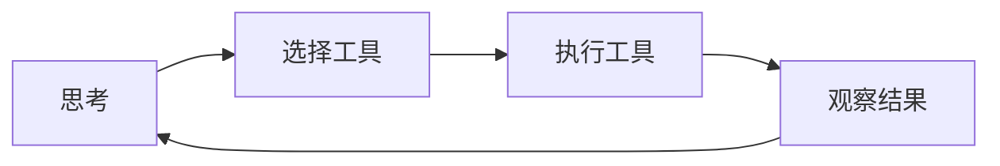

# Python与AI智能体笔面试题集

涵盖Python语法、LangChain架构、Agent设计、RAG流程、Prompt Engineering等核心知识点

> 📖 **参考链接**：
> - [Python 官方文档（中文）](https://docs.python.org/zh-cn/3/) -- Python 语法、标准库、语言参考的权威来源
> - [Python 标准库：copy](https://docs.python.org/zh-cn/3/library/copy.html) -- 浅拷贝与深拷贝的官方说明
> - [Python 标准库：functools](https://docs.python.org/zh-cn/3/library/functools.html) -- 装饰器相关工具（wraps、lru_cache 等）
> - [Python 术语表：GIL](https://docs.python.org/zh-cn/3/glossary.html#term-GIL) -- 全局解释器锁的官方定义
> - [Python HOWTO：协程与任务](https://docs.python.org/zh-cn/3/library/asyncio-task.html) -- asyncio 异步编程指南
> - [LangChain 官方文档](https://python.langchain.com/docs/) -- LangChain 框架完整文档
> - [LangChain 模块：Agents](https://python.langchain.com/docs/modules/agents/) -- Agent 与 ReAct 模式
> - [LangChain 模块：Retrieval](https://python.langchain.com/docs/modules/data_connection/) -- RAG 检索增强生成组件

---

## 一、选择题（15道）

### 1. Python语法 ★
**题目：** 在Python中，以下哪个选项是可变数据类型？
A. `tuple`  
B. `str`  
C. `list`  
D. `int`

**答案：C**

**解析：** Python中的不可变数据类型包括`int`、`float`、`bool`、`str`、`tuple`，可变数据类型包括`list`、`dict`、`set`。可变数据类型意味着可以在原地修改内容，而不可变数据类型修改时会创建新对象。

---

### 2. Python语法 ★
**题目：** 关于Python中的装饰器（Decorator），以下说法错误的是：
A. 装饰器本质上是一个高阶函数  
B. 装饰器可以在不修改原函数代码的情况下增加函数功能  
C. `@wraps`装饰器用于保留原函数的元信息  
D. 一个函数只能被一个装饰器装饰

**答案：D**

**解析：** Python中一个函数可以被多个装饰器装饰，装饰器会从内向外逐层应用。例如：
```python
@decorator1
@decorator2
def func():
    pass
```
`func`被`decorator1`和`decorator2`两个装饰器共同装饰。

---

### 3. Python语法 ★★
**题目：** 以下代码的输出结果是什么？
```python
def func(x = []):
    x.append(1)
    return x

print(func())
print(func())
```
A. `[1]` 和 `[1]`  
B. `[1]` 和 `[1, 1]`  
C. `[1]` 和 `[]`  
D. `None` 和 `[1]`

**答案：B**

**解析：** Python中默认参数在函数定义时被创建，而不是在每次调用时创建。因此第一次调用后`x`已经变为`[1]`，第二次调用时继续使用同一个列表对象，追加`1`后变为`[1, 1]`。这是Python常见的坑，正确做法是使用`None`作为默认值：
```python
def func(x = None):
    if x is None:
        x = []
    x.append(1)
    return x
```

---

### 4. Python语法 ★★
**题目：** 在Python中，`__init__`和`__new__`的区别是什么？以下描述正确的是：
A. `__init__`负责创建实例，`__new__`负责初始化实例  
B. `__new__`负责创建实例，`__init__`负责初始化实例  
C. 两者都负责创建实例  
D. 两者都负责初始化实例

**答案：B**

**解析：** `__new__`是一个静态方法，负责分配内存并返回类的新实例；`__init__`是一个实例方法，负责对已经创建好的实例进行属性初始化。`__new__`在`__init__`之前调用。

---

### 5. Python语法 ★★★
**题目：** 关于Python的GIL（全局解释器锁），以下说法正确的是：
A. GIL是Python多线程无法利用多核CPU的原因  
B. GIL在Python 3中已经被移除  
C. GIL不影响CPU密集型任务的多线程性能  
D. 多进程也无法利用多核CPU

**答案：A**

**解析：** CPython中GIL保证同一时刻只有一个线程执行字节码，导致CPU密集型任务无法利用多核CPU并行。解决方法是使用多进程而不是多线程。GIL至今仍然存在于CPython中。

---

### 6. LangChain架构 ★
**题目：** LangChain中的`Chain`组件主要作用是什么？
A. 存储向量数据  
B. 将多个组件按顺序组合起来完成特定任务  
C. 与大语言模型直接对话  
D. 管理文档加载

**答案：B**

**解析：** Chain是LangChain的核心抽象之一，用于将多个组件（如LLM、Prompt、工具等）按流程组合，形成端到端的应用逻辑。常见的Chain包括`LLMChain`、`SequentialChain`、`RetrievalQA`等。

---

### 7. LangChain架构 ★
**题目：** LangChain中`Embeddings`接口的作用是：
A. 生成文本的向量表示  
B. 存储嵌入向量到数据库  
C. 计算两个文本的相似度  
D. 调用大语言模型生成文本

**答案：A**

**解析：** `Embeddings`抽象封装了各种文本嵌入模型（如OpenAIEmbeddings、HuggingFaceEmbeddings），作用是将文本转换为向量表示，用于后续的相似度检索等任务。

---

### 8. LangChain架构 ★★
**题目：** LangChain中的`Memory`组件主要用于解决什么问题？
A. 加速LLM推理  
B. 持久化向量存储  
C. 在多轮对话中保存历史上下文  
D. 缓存LLM调用结果

**答案：C**

**解析：** Memory组件用于管理对话历史，使得Agent/Chain能够记住之前的交互内容，从而实现多轮对话。常见实现有`ConversationBufferMemory`、`ConversationSummaryMemory`等。

---

**LangChain Agent 决策执行循环流程图：**



> 上图展示了 LangChain Agent 的决策执行循环流程，Agent 通过"思考-行动-观察"的循环模式自主规划和调用工具，直至完成用户目标。

### 9. Agent设计 ★
**题目：** ReAct Prompting的核心思想是？
A. 直接让大模型输出答案  
B. 将推理（Reasoning）和行动（Acting）结合，让模型分步思考并调用工具  
C. 只做推理不调用工具  
D. 只调用工具不做推理

**答案：B**

**解析：** ReAct论文提出将Reasoning和Acting交替进行，模型先思考当前需要做什么，然后采取行动（调用工具）获得观察结果，再基于结果继续思考，最终得到答案。这种方式显著提高了复杂推理任务的表现。

---

### 10. Agent设计 ★
**题目：** 以下哪一项不是常见的Agent智能体类型？
A. ReAct Agent  
B. Plan-and-Execute Agent  
C. Vector Agent  
D. OpenAI Function Agent

**答案：C**

**解析：** 常见的Agent架构包括ReAct Agent、Plan-and-Execute Agent、OpenAI Function Agent等。Vector Agent并不是一个标准分类，向量存储一般用作检索工具而非完整Agent架构。

---

### 11. RAG流程 ★
**题目：** RAG（Retrieval-Augmented Generation）的主要优势是什么？
A. 提高生成速度  
B. 减少模型参数数量  
C. 引入外部知识减少幻觉，提升回答准确性和可追溯性  
D. 降低训练成本

**答案：C**

**解析：** RAG通过检索相关外部文档，将检索结果作为上下文注入Prompt让大模型生成回答，能够有效降低幻觉，提供可引用的来源，并且可以在不重新训练模型的情况下引入最新知识。

---

### 12. RAG流程 ★★
**题目：** 在RAG的预处理阶段，将长文档分块（chunking）的主要原因是：
A. 减少存储占用  
B. 嵌入模型有上下文长度限制，且分块能提高检索精度  
C. 加快模型训练  
D. 方便文档管理

**答案：B**

**解析：** 大多数嵌入模型对输入文本长度有限制，过长的文本无法直接处理。同时合理分块能保留更聚焦的语义，使得检索时更容易匹配到相关片段，提升准确性。分块大小需要根据具体场景调整。

---

### 13. RAG流程 ★★
**题目：** 关于向量数据库，以下说法错误的是：
A. 向量数据库支持高效的相似性搜索  
B. 向量数据库只能存储向量，不能存储原始文本  
C. 常见的向量数据库包括Pinecone、Chroma、Milvus等  
D. 向量数据库通常支持多种距离计算方式

**答案：B**

**解析：** 向量数据库不仅存储向量，通常还会存储对应的原始文本和元数据，检索后可以直接返回相关文档内容，不需要额外关联查询。

---

### 14. Prompt Engineering ★★
**题目：** 什么是Few-Shot Prompting？
A. 不提供任何示例，让模型直接回答  
B. 提供少量示例让模型学习任务格式和要求  
C. 提供上百个示例让模型微调  
D. 要求模型分步骤回答

**答案：B**

**解析：** Few-Shot Prompting是指在Prompt中给出几个任务示例，让大语言模型理解任务要求后再处理实际问题，不需要微调就能显著提升效果。如果只给一个示例称为One-Shot，不给示例称为Zero-Shot。

---

### 15. Prompt Engineering ★★★
**题目：** Chain-of-Thought（思维链）Prompting主要解决什么问题？
A. 减少Prompt长度  
B. 提升模型在复杂推理任务上的表现  
C. 加快推理速度  
D. 降低token消耗

**答案：B**

**解析：** CoT通过引导大语言模型输出逐步推理过程，而不直接输出答案，能够显著提升数学推理、逻辑推理等复杂任务的准确率。这是一种非常有效的Prompt工程技巧。

---

## 二、简答题（10道）

### 1. Python语法 ★
**题目：** 请简述Python中浅拷贝（shallow copy）和深拷贝（deep copy）的区别。

**参考答案与解析：**

- **浅拷贝**：创建一个新的对象，但它只拷贝原始对象的引用，不拷贝内部子对象。修改内部可变对象会影响原始对象。
- **深拷贝**：递归拷贝整个对象及其所有子对象，完全独立，修改不会影响原始对象。

使用场景：如果对象层次简单且全部不可变，可以用浅拷贝；如果对象包含嵌套可变结构，需要深拷贝保证独立性。Python中可通过`copy.copy()`和`copy.deepcopy()`实现。

> 📖 **参考链接**：
> - [Python 标准库：copy — 浅层与深层复制操作](https://docs.python.org/zh-cn/3/library/copy.html) -- 官方对浅拷贝与深拷贝行为的精确定义

> **生活化类比：浅拷贝/深拷贝=复印文件** —— 浅拷贝就像"只复印了文件的封面，里面的附件还是用原件"——你拿到一份新文件（新外壳对象），但翻开里面的附件袋（嵌套可变对象），发现还是原来那份，别人改了附件你也跟着变。深拷贝则是"逐页复印，连每个附件都重新复印一份"——你拿到的是完全独立的副本，怎么改都不影响原件。面试中常考的坑是：`list.copy()`、`dict.copy()`、切片 `[:]` 都是浅拷贝，嵌套 list 改了会互相影响；要彻底独立必须用 `copy.deepcopy()`。

---

### 2. Python语法 ★★
**题目：** 什么是闭包（Closure）？请举例说明闭包的用途。

**参考答案与解析：**

闭包是指一个函数内部定义了另一个函数，内部函数引用了外部函数的变量，并且外部函数返回内部函数，这样就形成了闭包。被捕获的变量会被保留在闭包中，不会被垃圾回收。

示例：
```python
def make_adder(n):
    def adder(x):
        return x + n
    return adder

add5 = make_adder(5)
print(add5(3))  # 输出 8
```

用途：实现数据封装、延迟计算、装饰器等。

> 📖 **参考链接**：
> - [Python 教程：9.4 闭包](https://docs.python.org/zh-cn/3/tutorial/classes.html) -- 官方教程对闭包概念的讲解
> - [Python HOWTO：闭包与装饰器](https://docs.python.org/zh-cn/3/howto/functional-programming.html) -- 函数式编程中的闭包应用

> **生活化类比：闭包=背包客的背包** —— 闭包就像一个背包客出发时打包的背包：外层函数是"出发前的准备阶段"，把需要的物资（变量 n）塞进背包；内层函数是"路上的自己"，即使出发结束了（外层函数已返回），背包里的物资依然随身携带（变量被捕获不被回收），路上随时能取用。`make_adder(5)` 就是出发前把"5"装进背包，之后无论走到哪（调用多少次），`adder` 都能从背包掏出"5"加上当前的值。装饰器能工作，靠的正是闭包这个"背包"机制——wrapper 函数背上了原函数这个"物资"。

---

### 3. Python语法 ★★
**题目：** 请描述Python中生成器（generator）是什么，以及它和普通列表相比的优势。

**参考答案与解析：**

生成器是一种特殊的迭代器，它使用`yield`关键字返回数据，每次调用`next()`时执行到下一个`yield`，暂停并返回值，保留当前执行状态。

优势：
1. **内存高效**：不需要一次性生成所有元素，适合处理大文件或无限序列
2. **延迟计算**：只在需要时生成下一个值，节省计算资源
3. 简化迭代逻辑，代码更简洁

---

### 4. LangChain架构 ★★
**题目：** LangChain主要由哪几个核心模块组成？分别简述它们的作用。

**参考答案与解析：**

LangChain核心模块：

1. **Models**：封装各种大语言模型（LLM）、聊天模型（Chat Model）和嵌入模型（Embeddings）
2. **Prompts**：提供Prompt模板管理、Prompt选择器等工具，方便动态构建Prompt
3. **Chains**：将多个组件按流程组合，形成可执行的任务管线
4. **Retrievers**：文档检索接口，支持从向量库等数据源检索相关内容
5. **Agents**：智能体架构，让LLM可以自主规划并调用工具完成任务
6. **Memory**：管理对话历史，支持多轮对话上下文记忆
7. **Tools/Toolkits**：封装各种工具供Agent调用，如搜索引擎、计算器、数据库查询等

---

### 5. Agent设计 ★
**题目：** 什么是Agent？智能体和普通的LLM应用相比有什么特点？

**参考答案与解析：**

Agent（智能体）是让大语言模型作为大脑，根据用户目标自主规划步骤、调用工具、与环境交互，最终完成任务的系统架构。

相比普通LLM应用的特点：
- **自主性**：能够自主分解任务和规划步骤，不需要人类一步步指导
- **工具使用**：可以调用外部工具获取额外信息或执行操作
- **反馈循环**：能够根据工具返回结果调整策略，持续迭代直到完成
- **适应性**：可以处理开放、复杂的任务，不局限于固定流程

---

### 6. Agent设计 ★★
**题目：** 请简述Plan-and-Execute Agent的工作流程。

**参考答案与解析：**

Plan-and-Execute是一种Agent架构，分为两个主要阶段：

1. **规划阶段（Planning）**：LLM根据用户目标生成一个整体计划，将复杂任务分解为多个子任务步骤
2. **执行阶段（Execution）**：按计划逐步执行每个步骤，调用相应工具获取结果，最后汇总结果得到最终答案

与ReAct每一步都重新思考不同，Plan-and-Execute先规划后执行，适合任务分解清晰、步骤较多的复杂任务，可以减少重复思考和工具调用。

---

### 7. RAG流程 ★
**题目：** 请简述RAG的完整工作流程。

**参考答案与解析：**

RAG分为两个阶段：

**离线处理阶段：**
1. 加载原始文档（PDF、网页、Word等）
2. 文档分块（chunking）
3. 使用嵌入模型对每个分块生成向量嵌入
4. 将向量和原始文本存储到向量数据库

**在线检索生成阶段：**
1. 接收用户查询
2. 将查询转为向量嵌入
3. 在向量数据库中检索与查询最相似的top-k个文档片段
4. 将检索到的文档片段插入Prompt作为上下文
5. 大语言模型结合上下文生成回答返回给用户

---

### 8. RAG流程 ★★
**题目：** 在RAG实践中，常见的优化方法有哪些？

**参考答案与解析：**

常见优化方法：

1. **分块策略优化**：调整分块大小，使用语义分块而非固定长度切割
2. **嵌入模型选择**：选择更适合当前领域的嵌入模型提升检索质量
3. **检索策略优化**：使用多路召回、重排序（如Reranker）、混合检索（关键词+向量）提升准确率
4. **上下文压缩**：只保留检索结果中与问题最相关的部分，减少冗余信息
5. **多层RAG**：先粗召回再精排，提升效率和精度
6. **检索结果融合**：将不同方法得到的检索结果合并，提高召回率
7. **大模型提炼检索内容**：让LLM先对检索结果进行总结压缩

---

### 9. Prompt Engineering ★★
**题目：** 什么是Zero-Shot、One-Shot、Few-Shot？它们分别适用于什么场景？

**参考答案与解析：**

- **Zero-Shot（零样本）**：Prompt中不提供任务示例，直接让模型完成任务。适用于模型已经具备相关能力、任务简单明确的场景，优点是节省token。
- **One-Shot（单样本）**：只提供一个示例。适用于需要展示任务格式，但任务本身简单的场景。
- **Few-Shot（少样本）**：提供少量示例（通常2-5个）。适用于复杂任务，帮助模型理解任务要求和输出格式，不需要微调就能获得不错效果。

示例数量越多，效果通常越好，但会消耗更多token和上下文空间。

> 📖 **参考链接**：
> - [LangChain 模块：Prompts](https://python.langchain.com/docs/modules/model_io/prompts/) -- FewShotPromptTemplate 等提示词模板的官方用法
> - [Python 标准库：itertools](https://docs.python.org/zh-cn/3/library/itertools.html) -- 示例选择器常配合的迭代工具

> **生活化类比：Few-Shot=给新员工看几个范例** —— Zero-Shot 就像跟新员工说"去把这个表格填了"，不给任何参考，他得靠自己理解（模型已有能力），简单任务没问题，复杂的就抓瞎。One-Shot 是"给他看一份填好的样表"，他照葫芦画瓢。Few-Shot 是"给他看三五份不同情况的样表"，他就能举一反三处理各种情况。给范例的好处是不用重新培训（无需微调），看几眼就上手；但范例太多也会"看花眼"（上下文超限、token 成本高）。这就是为什么 Few-Shot 通常 2-5 个范例最划算。

---

### 10. Prompt Engineering ★★
**题目：** 请简述什么是Self-Consistency，它能解决什么问题？

**参考答案与解析：**

Self-Consistency（自一致性）是一种后处理Prompt技巧：对同一个问题，让大语言模型生成多个不同的推理路径，然后通过投票选择最一致的答案。

作用：对于推理类任务（尤其是数学问题），大模型偶尔会在推理过程中出错，生成多个结果并选择多数答案能够显著提升准确率。这是一种简单有效的提升推理性能的方法。

---

## 三、场景设计题（3道）

### 1. RAG系统设计 ★★
**题目：** 公司有10万份历史技术文档，要求构建一个基于RAG的内部技术问答系统，工程师可以提问并获得答案和来源。请描述你的整体技术方案设计，包括数据流程、关键组件和选型考虑。

**参考答案与解析：**

**整体方案设计：**

**数据预处理流程：**
1. **文档加载**：支持PDF、Word、Markdown等多种格式，使用LangChain文档加载器批量加载
2. **文本清洗**：去除多余空格、页眉页脚、图片描述等噪声
3. **文档分割**：根据文档类型选择合适分块大小，一般技术文档512-1024 tokens比较合适，可以考虑使用语义分割
4. **嵌入生成**：选择开源嵌入模型如BGE-large-zh或OpenAI text-embedding-ada-002生成向量
5. **存储**：使用Milvus/Chroma/Pinecone存储向量和原始文本，建立索引

**在线查询流程：**
1. 用户提问 → 对问题生成向量嵌入
2. 向量数据库检索top-5最相关文档片段
3. （可选）使用reranker模型对检索结果重排序，选择最相关的3个
4. 构造Prompt：`基于以下上下文回答问题，如果不知道请说不知道，最后标注来源... [上下文] [问题]`
5. 调用大语言模型（GPT-3.5-turbo / 国产开源模型如Qwen、ChatGLM）生成回答
6. 返回回答给用户，并附带来源文档链接

**关键选型：**
- 数据量10万不算特别大，可以选择Chroma（轻量）或Milvus（高性能）
- 如果追求效果，用OpenAI嵌入；如果要求本地化部署，用BGE系列中文嵌入模型
- LLM根据预算和隐私要求选择API服务或本地部署开源模型

**可能的优化点：**
- 层级索引：先按文档分类粗筛，再向量检索
- 混合检索：结合关键词检索提高召回率
- 结果缓存：重复问题直接返回缓存答案

---

### 2. Agent智能体设计 ★★★
**题目：** 需要设计一个数据分析Agent，用户用自然语言提问关于数据库中的业务数据，Agent需要自动查询数据库并给出分析结果。请设计这个Agent的架构和工作流程，说明可能遇到的问题和解决方法。

**参考答案与解析：**

**Agent架构设计：**

1. **问题理解模块**：
   - 用户输入自然语言问题
   - LLM理解问题，确定需要查询哪些表、哪些字段，需要什么聚合操作

2. **Schema理解模块**：
   - 维护数据库表结构、字段说明、关系信息
   - 根据问题检索相关表结构，注入Prompt，减少上下文占用

3. **SQL生成模块**：
   - LLM结合问题和表结构生成SQL查询语句
   - 如果是复杂查询，可以分解为多个子查询逐步生成

4. **执行与反思模块**：
   - 执行生成的SQL，如果执行出错，将错误信息返回给LLM让它修正
   - 如果执行成功，检查结果是否合理，可能需要自我验证

5. **结果分析回答模块**：
   - 将查询结果交给LLM，生成自然语言分析和结论
   - 可选择生成可视化图表

**工作流程：**
```
用户问题 → 理解问题 → 获取相关表结构 → 生成SQL → 执行SQL → 
  → {出错 → 修正SQL} → 结果分析 → 自然语言回答
```

**可能遇到的问题与解决方法：**
1. **SQL生成错误**：加入错误反思循环，让LLM看到错误信息自行修正
2. **数据库表结构太多，放不下上下文**：基于问题检索相关表，只注入相关表结构
3. **结果过大无法放入上下文**：先让LLM对结果进行聚合或抽样
4. **结果错误或幻觉**：要求Agent展示原始查询数据，让用户验证，同时增加自我校验步骤

**技术选型：**
- 可以使用LangChain的SQL Database Agent作为基础
- LLM选择能力较强的模型（GPT-4级别），SQL生成对LLM能力要求较高

---

### 3. 客服智能体设计 ★★
**题目：** 设计一个电商客服智能体，需要处理用户咨询、退换货申请、查询物流等问题。要求能够对接知识库回答商品问题，能调用工具处理业务操作，需要识别无法解决的问题转人工。请设计整体方案。

**参考答案与解析：**

**整体架构设计：**

**1. 意图识别与分类**
- 用户输入首先经过意图分类，判断是哪类问题：
  - 知识库问答类（商品信息、售后政策等）
  - 业务操作类（查询订单、查询物流、申请退换货等）
  - 复杂争议问题（直接转人工）

**2. 知识问答处理（RAG）**
- 维护商品知识库、售后政策文档
- 使用RAG检索相关回答
- 如果置信度低或答案不确定，路由转人工

**3. 业务工具调用**
- 定义工具：`查询订单`、`查询物流`、`申请退换货`、`查询库存`等
- 使用Function Calling工具调用能力，让LLM识别需要调用哪个工具，提取正确参数
- 调用后端API获取结果，返回给LLM整理成自然语言回答

**4. 对话管理**
- 使用Memory保存对话历史和用户上下文（订单号、商品信息等）
- 多轮对话中可以指代上下文，比如用户说"这个订单"，Agent知道是指哪个订单

**5. 人工转接判断**
- 设置转人工触发条件：
  - 用户明确要求转人工
  - 连续两轮无法回答用户问题
  - 识别到用户情绪不满
  - 问题涉及复杂纠纷，超出Agent能力范围
- 转人工时自动传递对话历史和上下文给人工客服

**工作流程示例：**
```
用户：我的订单123456现在物流到哪了？
 → 意图识别：查询物流
 → 提取参数：订单号=123456
 → 调用查询物流工具 → 返回结果：正在派送，明天送达
 → LLM整理回答用户
```

**关键设计要点：**
- 清晰的路由机制：不同类型问题走不同处理流程
- 稳妥的转人工策略：不要硬答，该转就转，提升用户体验
- 上下文保持：记住用户前面提到的订单号等信息，不需要用户重复说
- 可解释性：记录Agent每一步判断，方便后续优化

---

## 🧭 学习导航栏

| 知识点 | 推荐学习路径 | 难度 |
|--------|-------------|------|
| Python语法基础 | 掌握列表推导式、生成器、装饰器、闭包、面向对象 | ★★ |
| LangChain基础 | 理解Chain、PromptTemplate、Retriever、Agent核心概念，搭建简单应用 | ★★ |
| RAG实战 | 完整实现从文档加载→分块→嵌入→检索→生成的端到端流程 | ★★ |
| Agent架构 | ReAct、Plan-and-Execute、Function Calling实践 | ★★★ |
| Prompt Engineering | 掌握Zero/Few-Shot、CoT、Self-Consistency等常用技巧 | ★★ |
| 系统设计 | 实际项目中RAG和Agent的工程优化、错误处理、性能调优 | ★★★ |

---

**推荐学习顺序：**
1. 巩固Python基础 → 2. 学习LangChain核心组件 → 3. 实现一个基础RAG问答系统 → 4. 学习Prompt工程技巧 → 5. 尝试构建简单Agent → 6. 深入系统设计和性能优化

> 本模块其他文件：[02-LangChain与AI智能体核心](./02-LangChain与AI智能体核心.md) | [03-RAG检索增强生成实战](./03-RAG检索增强生成实战.md)

> - 返回 [学习路线总览](../../README.md)
