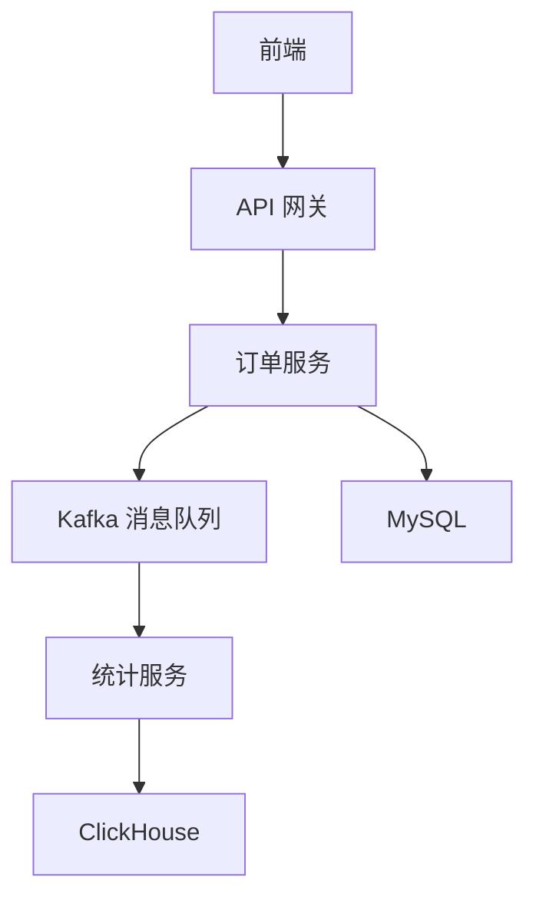

# project - 电商订单实时统计分析平台技术选型

> 基于电商订单实时统计分析平台场景，逐层拆解技术选型决策过程，对比不同方案优劣，理解为什么选择这套栈。

---

## 一、问题定义与约束

### 需求背景

电商平台需要：
1. 用户下单后实时同步数据到搜索引擎做商品搜索
2. 实时汇总各分类销售额、订单数做运营大屏展示
3. 发送订单确认通知给用户
4. 满足每日万级到百万级订单量
5. 数据不能丢失，重复消费不影响结果
6. 可弹性扩展应对促销流量高峰

### 技术约束

- 团队已有 Spring Boot + Spring Cloud 技术栈
- 运维资源有限，不能引入过多全新技术
- 预算有限，优先开源方案
- 需要快速上线验证需求



> 上图展示了电商订单实时统计分析平台的系统架构，前端请求经网关路由至订单服务，订单数据通过 Kafka 异步流入统计服务，分别写入 ClickHouse 做实时聚合分析和 MySQL 做业务持久化存储。

---

## 二、分层技术选型

### 1. 业务主存储：订单表存储在哪里

| 候选方案 | 优点 | 缺点 | 决策 |
|---------|------|------|------|
| MySQL | 支持事务，ACID，索引查询成熟，团队熟悉 | 不适合全文检索和聚合分析 | 选用 |
| PostgreSQL | JSONB 支持灵活字段，地理索引 | 团队经验不如 MySQL，订单场景不需要额外特性 | 不选 |
| MongoDB | 文档模型灵活，水平扩展容易 | 事务支持不如 MySQL，订单场景需要强一致 | 不选 |

**决策结论**：选 MySQL 作为订单业务主存储，满足事务 ACID 需求。

---

### 2. 消息队列：订单事件用什么中间件传递

| 候选方案 | 优点 | 缺点 | 决策 |
|---------|------|------|------|
| Kafka | 高吞吐（百万 TPS），磁盘持久化，分区并行，生态成熟，事务消息支持 | 不支持原生延迟队列，运维略复杂 | 选用 |
| RabbitMQ | 原生支持队列、延迟队列、死信队列 | 吞吐不如 Kafka（万级 TPS），不适合百万级订单 | 不选 |
| RocketMQ | 事务消息完善，延迟队列支持 | 国内生态不如 Kafka 通用，大数据集成度低 | 不选 |
| Pulsar | 多租户原生，存储计算分离，弹性好 | 运维三层架构（Broker+BookKeeper+ZK）复杂，生态不如 Kafka | 不选 |

**决策结论**：选 Kafka，高吞吐匹配订单写入场景，持久化支持消息回溯，生态成熟便于集成。

---

### 3. 全文检索：商品搜索用什么引擎

| 候选方案 | 优点 | 缺点 | 决策 |
|---------|------|------|------|
| Elasticsearch | 原生支持全文检索，倒排索引，分词高亮聚合，成熟稳定 | 运维复杂，分片规划影响扩展性 | 选用 |
| Solr | 全文检索成熟，Lucene 原生 | 实时更新性能不如 ES，社区活跃度下降 | 不选 |
| MySQL 全文索引 | 无需额外组件 | 分词效果差，性能差，不支持高亮聚合 | 不选 |

**决策结论**：选 Elasticsearch，商品搜索场景天然匹配倒排索引全文检索能力。

---

### 4. 统计分析：海量订单聚合分析用什么存储

| 候选方案 | 优点 | 缺点 | 决策 |
|---------|------|------|------|
| ClickHouse | 列式存储，百亿行秒级聚合，物化视图预聚合，压缩比高 | 更新性能差，不适合高频单条写入 | 选用 |
| Elasticsearch | 已有集群，聚合 API 可用 | 大数据量聚合性能远低于 ClickHouse，内存开销大 | 不选 |
| Druid | 时序数据聚合，OLAP 友好 | 运维复杂，社区活跃度低于 ClickHouse | 不选 |
| PostgreSQL + 索引 | 关系数据库，支持聚合 | 十亿行级聚合性能差，响应慢 | 不选 |
| Spark SQL 预计算 | 计算能力强 | 需要额外集群，延迟高，不适合实时查询 | 不选 |

**决策结论**：选 ClickHouse，列式存储天然适合订单聚合分析，物化视图预聚合实现毫秒级响应。

---

### 5. 服务发现与配置中心：微服务用什么注册发现

| 候选方案 | 优点 | 缺点 | 决策 |
|---------|------|------|------|
| Nacos | 同时支持服务发现 + 配置中心，减少组件数，阿里开源易用 | 单节点模式无法高可用，集群需多节点 | 选用 |
| Eureka + Spring Cloud Config | Netflix 生态，Spring 原生集成 | Eureka 停止维护，需要分开维护两个组件 | 不选 |
| Consul | 服务发现 + KV 存储配置，HashiCorp 出品 | 国内文档少，运维资源投入少，不如 Nacos 易用 | 不选 |
| etcd | KV 存储稳定 | 仅存储，服务发现需额外封装 | 不选 |

**决策结论**：选 Nacos，一站式解决服务发现 + 配置中心，减少组件数量降低运维复杂度。

---

### 6. API 网关：统一入口用什么网关

| 候选方案 | 优点 | 缺点 | 决策 |
|---------|------|------|------|
| Spring Cloud Gateway | Spring 官方下一代网关，响应式非阻塞，性能优于 Zuul | 调试排障比同步 Zuul 复杂 | 选用 |
| Zuul 1.x | 同步阻塞，简单成熟 | 性能差，Netflix 停止维护 | 不选 |
| Nginx + Lua | 高性能，OpenResty 生态 | 需要手写 Lua 业务逻辑，开发效率低 | 不选 |
| Kong | 开源网关，插件丰富 | 需要额外维护，和 Spring Cloud 集成不如 Gateway 自然 | 不选 |

**决策结论**：选 Spring Cloud Gateway，Spring Cloud 生态原生，响应式性能优于 Zuul。

---

### 7. 限流熔断：服务保护用什么方案

| 候选方案 | 优点 | 缺点 | 决策 |
|---------|------|------|------|
| Sentinel | 阿里开源，流量控制 + 熔断降级一体化，Dashboard 控制台友好 | 生态不如 Hystrix 老，但是活跃维护 | 选用 |
| Hystrix | Netflix 成熟方案，熔断隔离成熟 | Netflix 停止维护，不再更新 | 不选 |
| Resilience4j | 轻量模块化，函数式设计 | 文档和生态不如 Sentinel 完善 | 不选 |

**决策结论**：选 Sentinel，双重限流（网关层 + 服务层），控制台上直观查看流量，便于排查问题。

---

### 8. 容器化部署：开发和生产用什么编排

| 候选方案 | 优点 | 缺点 | 决策 |
|---------|------|------|------|
| Docker Compose（本地开发） | 单文件编排，一键启动全部服务 | 单机部署，无法高可用弹性 | 选用 |
| Kubernetes（生产） | 滚动更新，弹性伸缩（HPA），自愈，服务发现内置 | 运维复杂度高，要求团队有 K8s 经验 | 选用 |

**决策结论**：本地开发用 Docker Compose，生产环境用 Kubernetes。

---

## 三、最终技术栈汇总

| 层级 | 组件 | 版本 | 选型理由 |
|-----|------|------|---------|
| 后端框架 | Spring Boot | 3.x | 生态成熟，团队熟悉，和 Spring Cloud 集成无缝 |
| ORM | Spring Data JPA | 3.x | 快速开发，减少样板代码 |
| 业务主存储 | MySQL | 8.0 | 事务 ACID 保证，成熟稳定 |
| 消息队列 | Kafka | 3.x | 高吞吐订单事件流，持久化支持回溯 |
| 搜索引擎 | Elasticsearch | 7.17.x | 全文检索 + 聚合分析，商品搜索天然匹配 |
| 分析存储 | ClickHouse | 23.x | 列式存储，百亿行秒级聚合，物化视图预聚合 |
| 服务注册配置 | Nacos | 2.x | 一站式服务发现 + 配置中心，减少组件数 |
| API 网关 | Spring Cloud Gateway | 3.1.x | Spring Cloud 原生，响应式高性能 |
| 限流熔断 | Sentinel | 1.8.x | 双层限流熔断，控制台友好，活跃维护 |
| 容器编排 | Docker + K8s | 最新稳定 | Docker 镜像标准化，K8s 弹性扩缩容自愈 |

---

## 四、备选方案与演进路径

如果业务增长后遇到瓶颈，可以按顺序演进：
1. MySQL 读写分离，分库分表按用户分片
2. Kafka 增加 Broker 和分区扩展吞吐
3. ES 增加 Data Node 水平扩展，做冷热数据分离
4. ClickHouse 升级为分布式表，多分片集群
5. 引入 Flink 替换纯 Kafka 消费做更复杂流式计算
6. 引入 Prometheus + Grafana 做全链路监控

---

## 五、选型决策总结

1. **匹配场景优先**：搜索走 ES，统计走 ClickHouse，业务走 MySQL，分工明确比选一个全能组件更重要
2. **团队经验优先**：选用 Spring Boot + Spring Cloud 生态避免引入陌生技术栈降低开发运维成本
3. **成熟稳定优先**：Kafka、ES、ClickHouse 都是久经考验的开源方案，社区活跃坑少
4. **渐进式演进**：先满足当前需求，预留扩展点，业务增长后再逐步替换升级

---

## 六、完整代码实现

### 步骤一：项目结构与依赖配置

**项目结构：**

```
longjiang-trading/
├── order-service/                    # 订单服务
│   ├── pom.xml
│   └── src/main/java/com/longjiang/
│       ├── OrderApplication.java
│       ├── entity/Order.java
│       ├── repository/OrderRepository.java
│       ├── service/OrderService.java
│       └── controller/OrderController.java
├── stats-service/                    # 统计服务
│   ├── pom.xml
│   └── src/main/java/com/longjiang/
│       ├── StatsApplication.java
│       ├── consumer/OrderEventConsumer.java
│       ├── config/KafkaConfig.java
│       ├── service/ClickHouseService.java
│       └── controller/StatsController.java
├── docker-compose.yml
└── clickhouse-init.sql
```

### 步骤二：订单实体与数据访问层

```java
// entity/Order.java - 订单实体
package com.longjiang.entity;

import lombok.AllArgsConstructor;
import lombok.Builder;
import lombok.Data;
import lombok.NoArgsConstructor;
import org.hibernate.annotations.CreationTimestamp;
import org.hibernate.annotations.UpdateTimestamp;

import jakarta.persistence.*;
import java.math.BigDecimal;
import java.time.LocalDateTime;

@Data
@Builder
@NoArgsConstructor
@AllArgsConstructor
@Entity
@Table(name = "t_order", indexes = {
    @Index(name = "idx_user_id", columnList = "user_id"),
    @Index(name = "idx_order_status", columnList = "order_status"),
    @Index(name = "idx_created_at", columnList = "created_at"),
})
public class Order {

    @Id
    @GeneratedValue(strategy = GenerationType.IDENTITY)
    private Long id;

    @Column(name = "order_no", nullable = false, unique = true, length = 64)
    private String orderNo;

    @Column(name = "user_id", nullable = false)
    private Long userId;

    @Column(name = "product_id", nullable = false)
    private Long productId;

    @Column(name = "product_name", nullable = false, length = 256)
    private String productName;

    @Column(name = "category", nullable = false, length = 64)
    private String category;

    @Column(name = "quantity", nullable = false)
    private Integer quantity;

    @Column(name = "unit_price", nullable = false, precision = 12, scale = 2)
    private BigDecimal unitPrice;

    @Column(name = "total_amount", nullable = false, precision = 12, scale = 2)
    private BigDecimal totalAmount;

    @Column(name = "order_status", nullable = false, length = 32)
    @Enumerated(EnumType.STRING)
    private OrderStatus orderStatus;

    @Column(name = "channel", length = 32)
    private String channel;

    @CreationTimestamp
    @Column(name = "created_at", updatable = false)
    private LocalDateTime createdAt;

    @UpdateTimestamp
    @Column(name = "updated_at")
    private LocalDateTime updatedAt;

    public enum OrderStatus {
        PENDING, PAID, SHIPPED, DELIVERED, CANCELLED, REFUNDED
    }
}
```

```java
// repository/OrderRepository.java - 订单数据访问层
package com.longjiang.repository;

import com.longjiang.entity.Order;
import org.springframework.data.jpa.repository.JpaRepository;
import org.springframework.stereotype.Repository;
import java.util.Optional;

@Repository
public interface OrderRepository extends JpaRepository<Order, Long> {
    Optional<Order> findByOrderNo(String orderNo);
}
```

### 步骤三：订单服务 - 业务逻辑与 Kafka 消息发送

```java
// service/OrderService.java - 订单服务
package com.longjiang.service;

import com.fasterxml.jackson.core.JsonProcessingException;
import com.fasterxml.jackson.databind.ObjectMapper;
import com.longjiang.entity.Order;
import com.longjiang.repository.OrderRepository;
import lombok.RequiredArgsConstructor;
import lombok.extern.slf4j.Slf4j;
import java.util.concurrent.CompletableFuture;
import org.springframework.kafka.core.KafkaTemplate;
import org.springframework.stereotype.Service;
import org.springframework.transaction.annotation.Transactional;

import java.math.BigDecimal;
import java.time.LocalDateTime;
import java.util.HashMap;
import java.util.Map;
import java.util.UUID;

@Slf4j
@Service
@RequiredArgsConstructor
public class OrderService {

    private final OrderRepository orderRepository;
    private final KafkaTemplate<String, String> kafkaTemplate;
    private final ObjectMapper objectMapper;
    private static final String TOPIC = "order-events";

    /**
     * 创建订单并发送 Kafka 事件
     * @Transactional 保证订单保存和消息发送的事务一致性
     */
    @Transactional
    public Order createOrder(Long userId, Long productId, String productName,
                             String category, Integer quantity, BigDecimal unitPrice,
                             String channel) {
        // 1. 构建并持久化订单
        Order order = Order.builder()
            .orderNo("ORD" + System.currentTimeMillis() +
                UUID.randomUUID().toString().substring(0, 6).toUpperCase())
            .userId(userId)
            .productId(productId)
            .productName(productName)
            .category(category)
            .quantity(quantity)
            .unitPrice(unitPrice)
            .totalAmount(unitPrice.multiply(BigDecimal.valueOf(quantity)))
            .orderStatus(Order.OrderStatus.PENDING)
            .channel(channel)
            .build();

        Order saved = orderRepository.save(order);
        log.info("订单创建成功: orderNo={}, amount={}", saved.getOrderNo(), saved.getTotalAmount());

        // 2. 构建订单事件并发送到 Kafka
        Map<String, Object> event = new HashMap<>();
        event.put("eventType", "ORDER_CREATED");
        event.put("orderNo", saved.getOrderNo());
        event.put("userId", saved.getUserId());
        event.put("productId", saved.getProductId());
        event.put("productName", saved.getProductName());
        event.put("category", saved.getCategory());
        event.put("quantity", saved.getQuantity());
        event.put("totalAmount", saved.getTotalAmount());
        event.put("channel", saved.getChannel());
        event.put("timestamp", LocalDateTime.now().toString());

        try {
            String json = objectMapper.writeValueAsString(event);
            // 注意：Spring Kafka 2.x 的 ListenableFutureCallback 在 3.x 已废弃
            // Spring Kafka 3.x 推荐使用 CompletableFuture
            CompletableFuture<org.springframework.kafka.support.SendResult<String, String>> future = 
                kafkaTemplate.send(TOPIC, saved.getOrderNo(), json);
            future.whenComplete((result, ex) -> {
                if (ex != null) {
                    log.error("Kafka消息发送失败: orderNo={}", saved.getOrderNo(), ex);
                } else {
                    log.info("Kafka消息发送成功: orderNo={}, offset={}",
                        saved.getOrderNo(), result.getRecordMetadata().offset());
                }
            });
        } catch (JsonProcessingException e) {
            throw new RuntimeException("消息序列化异常", e);
        }

        return saved;
    }

    /**
     * 更新订单状态（支付成功、发货等）
     */
    @Transactional
    public Order updateStatus(String orderNo, Order.OrderStatus newStatus) {
        Order order = orderRepository.findByOrderNo(orderNo)
            .orElseThrow(() -> new RuntimeException("订单不存在: " + orderNo));
        order.setOrderStatus(newStatus);
        return orderRepository.save(order);
    }
}
```

```java
// controller/OrderController.java - 订单 API 接口
package com.longjiang.controller;

import com.longjiang.entity.Order;
import com.longjiang.service.OrderService;
import lombok.RequiredArgsConstructor;
import org.springframework.http.ResponseEntity;
import org.springframework.web.bind.annotation.*;

import java.math.BigDecimal;

@RestController
@RequestMapping("/api/orders")
@RequiredArgsConstructor
public class OrderController {

    private final OrderService orderService;

    @PostMapping
    public ResponseEntity<Order> createOrder(@RequestBody CreateOrderRequest req) {
        Order order = orderService.createOrder(
            req.getUserId(), req.getProductId(), req.getProductName(),
            req.getCategory(), req.getQuantity(), req.getUnitPrice(),
            req.getChannel()
        );
        return ResponseEntity.ok(order);
    }

    @PutMapping("/{orderNo}/status")
    public ResponseEntity<Order> updateStatus(
        @PathVariable String orderNo,
        @RequestParam Order.OrderStatus status
    ) {
        return ResponseEntity.ok(orderService.updateStatus(orderNo, status));
    }
}
```

### 步骤四：Kafka 配置（生产者 + 消费者）

```java
// config/KafkaConfig.java - Kafka 配置
package com.longjiang.config;

import org.apache.kafka.clients.admin.NewTopic;
import org.apache.kafka.clients.consumer.ConsumerConfig;
import org.apache.kafka.clients.producer.ProducerConfig;
import org.apache.kafka.common.serialization.StringDeserializer;
import org.apache.kafka.common.serialization.StringSerializer;
import org.springframework.context.annotation.Bean;
import org.springframework.context.annotation.Configuration;
import org.springframework.kafka.config.ConcurrentKafkaListenerContainerFactory;
import org.springframework.kafka.core.*;

import java.util.HashMap;
import java.util.Map;

@Configuration
public class KafkaConfig {

    private static final String BOOTSTRAP = "localhost:9092";

    // ========== Producer ==========
    @Bean
    public ProducerFactory<String, String> producerFactory() {
        Map<String, Object> props = new HashMap<>();
        props.put(ProducerConfig.BOOTSTRAP_SERVERS_CONFIG, BOOTSTRAP);
        props.put(ProducerConfig.KEY_SERIALIZER_CLASS_CONFIG, StringSerializer.class);
        props.put(ProducerConfig.VALUE_SERIALIZER_CLASS_CONFIG, StringSerializer.class);
        props.put(ProducerConfig.ENABLE_IDEMPOTENCE_CONFIG, true);  // 幂等
        props.put(ProducerConfig.ACKS_CONFIG, "all");               // 等待所有副本确认
        return new DefaultKafkaProducerFactory<>(props);
    }

    @Bean
    public KafkaTemplate<String, String> kafkaTemplate() {
        return new KafkaTemplate<>(producerFactory());
    }

    // ========== Consumer ==========
    @Bean
    public ConsumerFactory<String, String> consumerFactory() {
        Map<String, Object> props = new HashMap<>();
        props.put(ConsumerConfig.BOOTSTRAP_SERVERS_CONFIG, BOOTSTRAP);
        props.put(ConsumerConfig.KEY_DESERIALIZER_CLASS_CONFIG, StringDeserializer.class);
        props.put(ConsumerConfig.VALUE_DESERIALIZER_CLASS_CONFIG, StringDeserializer.class);
        props.put(ConsumerConfig.GROUP_ID_CONFIG, "stats-service-group");
        props.put(ConsumerConfig.AUTO_OFFSET_RESET_CONFIG, "earliest");
        props.put(ConsumerConfig.ENABLE_AUTO_COMMIT_CONFIG, false);  // 手动提交
        return new DefaultKafkaConsumerFactory<>(props);
    }

    @Bean
    public ConcurrentKafkaListenerContainerFactory<String, String> kafkaListenerContainerFactory() {
        ConcurrentKafkaListenerContainerFactory<String, String> factory =
            new ConcurrentKafkaListenerContainerFactory<>();
        factory.setConsumerFactory(consumerFactory());
        factory.setConcurrency(3);  // 3个并发消费线程
        return factory;
    }

    @Bean
    public NewTopic orderEventsTopic() {
        return new NewTopic("order-events", 6, (short) 2);
    }
}
```

### 步骤五：统计服务 - Kafka 消费者 + ClickHouse 写入

```java
// consumer/OrderEventConsumer.java - 订单事件消费者
package com.longjiang.consumer;

import com.fasterxml.jackson.databind.ObjectMapper;
import com.longjiang.service.ClickHouseService;
import lombok.RequiredArgsConstructor;
import lombok.extern.slf4j.Slf4j;
import org.apache.kafka.clients.consumer.ConsumerRecord;
import org.springframework.kafka.annotation.KafkaListener;
import org.springframework.kafka.support.Acknowledgment;
import org.springframework.stereotype.Component;

import java.math.BigDecimal;
import java.time.LocalDateTime;
import java.util.Map;

@Slf4j
@Component
@RequiredArgsConstructor
public class OrderEventConsumer {

    private final ClickHouseService clickHouseService;
    private final ObjectMapper objectMapper;

    @KafkaListener(topics = "order-events", groupId = "stats-service-group",
        concurrency = "3")
    public void consume(ConsumerRecord<String, String> record, Acknowledgment ack) {
        try {
            @SuppressWarnings("unchecked")
            Map<String, Object> event = objectMapper.readValue(record.value(), Map.class);

            String eventType = (String) event.get("eventType");
            if ("ORDER_CREATED".equals(eventType)) {
                String orderNo = (String) event.get("orderNo");
                Long userId = toLong(event.get("userId"));
                String category = (String) event.get("category");
                String channel = (String) event.get("channel");
                BigDecimal amount = toBigDecimal(event.get("totalAmount"));
                Integer quantity = toInt(event.get("quantity"));
                LocalDateTime ts = parseDateTime((String) event.get("timestamp"));

                clickHouseService.insertOrderEvent(orderNo, userId, category, channel,
                    amount, quantity, ts);
                log.debug("订单事件写入ClickHouse: orderNo={}, amount={}", orderNo, amount);
            }

            ack.acknowledge();  // 手动提交偏移量

        } catch (Exception e) {
            log.error("消费订单事件失败: offset={}, error={}", record.offset(), e.getMessage());
            // 不提交偏移量，消息会重新消费
        }
    }

    private BigDecimal toBigDecimal(Object v) {
        if (v == null) return BigDecimal.ZERO;
        return new BigDecimal(v.toString());
    }
    private Integer toInt(Object v) {
        return v == null ? 0 : Integer.parseInt(v.toString());
    }
    private Long toLong(Object v) {
        return v == null ? 0L : Long.parseLong(v.toString());
    }
    private LocalDateTime parseDateTime(String v) {
        try { return LocalDateTime.parse(v); } catch (Exception e) { return LocalDateTime.now(); }
    }
}
```

### 步骤六：ClickHouse 数据服务

```sql
-- clickhouse-init.sql - ClickHouse 建表语句
-- 订单事件表（ReplacingMergeTree 支持幂等去重）
CREATE TABLE IF NOT EXISTS order_events (
    order_no    String,
    user_id     UInt64,
    category    String,
    channel     String,
    status      String,  -- 订单状态: CREATED/PAID/CANCELLED/REFUNDED
    total_amount Decimal(12, 2),
    quantity    UInt32,
    event_time  DateTime,
    insert_time DateTime DEFAULT now()
) ENGINE = ReplacingMergeTree(insert_time)
PARTITION BY toYYYYMMDD(event_time)
ORDER BY (order_no, event_time);

-- 物化视图：按类别+渠道实时聚合（SummingMergeTree 自动预聚合）
CREATE MATERIALIZED VIEW IF NOT EXISTS order_stats_mv
ENGINE = SummingMergeTree()
PARTITION BY toYYYYMMDD(stat_date)
ORDER BY (stat_date, category, channel)
AS SELECT
    toDate(event_time)  AS stat_date,
    category,
    channel,
    count()             AS order_count,
    sum(total_amount)   AS total_sales,
    avg(total_amount)   AS avg_order_value,
    sum(quantity)       AS total_quantity
FROM order_events
WHERE status != 'CANCELLED' AND status != 'REFUNDED'
GROUP BY stat_date, category, channel;

-- 物化视图：按小时聚合（实时大屏用）
CREATE MATERIALIZED VIEW IF NOT EXISTS order_stats_hourly_mv
ENGINE = SummingMergeTree()
PARTITION BY toYYYYMMDD(stat_hour)
ORDER BY (stat_hour, category)
AS SELECT
    toStartOfHour(event_time) AS stat_hour,
    category,
    count()                   AS order_count,
    sum(total_amount)         AS total_sales
FROM order_events
WHERE status != 'CANCELLED'
GROUP BY stat_hour, category;
```

```java
// service/ClickHouseService.java - ClickHouse 数据服务
package com.longjiang.service;

import lombok.RequiredArgsConstructor;
import lombok.extern.slf4j.Slf4j;
import org.springframework.jdbc.core.JdbcTemplate;
import org.springframework.stereotype.Service;

import java.math.BigDecimal;
import java.time.LocalDateTime;
import java.util.List;
import java.util.Map;

@Slf4j
@Service
@RequiredArgsConstructor
public class ClickHouseService {

    private final JdbcTemplate clickHouseJdbcTemplate;

    /** 写入订单事件 */
    public void insertOrderEvent(String orderNo, Long userId, String category,
                                  String channel, BigDecimal amount, Integer quantity,
                                  LocalDateTime eventTime) {
        String sql = "INSERT INTO order_events " +
            "(order_no, user_id, category, channel, total_amount, quantity, event_time) " +
            "VALUES (?, ?, ?, ?, ?, ?, ?)";
        clickHouseJdbcTemplate.update(sql, orderNo, userId, category, channel,
            amount, quantity, eventTime);
    }

    /** 当日各类别销售额排行 */
    public List<Map<String, Object>> getTodayCategoryStats() {
        String sql = """
            SELECT category, sum(order_count) AS order_count,
                   sum(total_sales) AS total_sales,
                   round(avg(avg_order_value), 2) AS avg_order_value
            FROM order_stats_mv WHERE stat_date = today()
            GROUP BY category ORDER BY total_sales DESC LIMIT 20
            """;
        return clickHouseJdbcTemplate.queryForList(sql);
    }

    /** 各渠道销售额 */
    public List<Map<String, Object>> getChannelStats(String start, String end) {
        String sql = """
            SELECT channel, sum(order_count) AS order_count,
                   sum(total_sales) AS total_sales
            FROM order_stats_mv WHERE stat_date BETWEEN ? AND ?
            GROUP BY channel ORDER BY total_sales DESC
            """;
        return clickHouseJdbcTemplate.queryForList(sql, start, end);
    }

    /** 小时级实时趋势（最近24小时） */
    public List<Map<String, Object>> getHourlyTrend() {
        String sql = """
            SELECT stat_hour, sum(order_count) AS order_count,
                   sum(total_sales) AS total_sales
            FROM order_stats_hourly_mv
            WHERE stat_hour >= now() - INTERVAL 24 HOUR
            GROUP BY stat_hour ORDER BY stat_hour
            """;
        return clickHouseJdbcTemplate.queryForList(sql);
    }

    /** 运营大屏汇总数据 */
    public Map<String, Object> getDashboardSummary() {
        String sql = """
            SELECT count(DISTINCT order_no) AS total_orders,
                   sum(total_amount) AS total_sales,
                   round(avg(total_amount), 2) AS avg_order_value,
                   uniqExact(user_id) AS unique_users,
                   round(countIf(status = 'CANCELLED') * 100.0 / count(), 2) AS cancel_rate
            FROM order_events WHERE event_time >= today()
            """;
        return clickHouseJdbcTemplate.queryForMap(sql);
    }
}
```

### 步骤七：统计 API 接口

```java
// controller/StatsController.java - 统计 API
package com.longjiang.controller;

import com.longjiang.service.ClickHouseService;
import lombok.RequiredArgsConstructor;
import org.springframework.http.ResponseEntity;
import org.springframework.web.bind.annotation.*;

import java.util.HashMap;
import java.util.Map;

@RestController
@RequestMapping("/api/stats")
@RequiredArgsConstructor
public class StatsController {

    private final ClickHouseService clickHouseService;

    /** 运营大屏实时汇总 */
    @GetMapping("/dashboard")
    public ResponseEntity<Map<String, Object>> getDashboard() {
        Map<String, Object> result = new HashMap<>();
        result.put("code", 0);
        result.put("data", clickHouseService.getDashboardSummary());
        return ResponseEntity.ok(result);
    }

    /** 各类别实时销售额排行 */
    @GetMapping("/categories")
    public ResponseEntity<Map<String, Object>> getCategoryStats() {
        Map<String, Object> result = new HashMap<>();
        result.put("code", 0);
        result.put("data", clickHouseService.getTodayCategoryStats());
        return ResponseEntity.ok(result);
    }

    /** 小时级实时趋势 */
    @GetMapping("/trend/hourly")
    public ResponseEntity<Map<String, Object>> getHourlyTrend() {
        Map<String, Object> result = new HashMap<>();
        result.put("code", 0);
        result.put("data", clickHouseService.getHourlyTrend());
        return ResponseEntity.ok(result);
    }
}
```

### 步骤八：Docker Compose 一键启动

```yaml
# docker-compose.yml
version: '3.8'

services:
  mysql:
    image: mysql:8.0
    container_name: trading-mysql
    environment:
      MYSQL_ROOT_PASSWORD: root123
      MYSQL_DATABASE: longjiang_trading
    ports:
      - "3306:3306"
    volumes:
      - mysql-data:/var/lib/mysql
    command: --character-set-server=utf8mb4 --collation-server=utf8mb4_unicode_ci

  zookeeper:
    image: confluentinc/cp-zookeeper:7.5.0
    environment:
      ZOOKEEPER_CLIENT_PORT: 2181

  kafka:
    image: confluentinc/cp-kafka:7.5.0
    depends_on:
      - zookeeper
    ports:
      - "9092:9092"
    environment:
      KAFKA_BROKER_ID: 1
      KAFKA_ZOOKEEPER_CONNECT: zookeeper:2181
      KAFKA_ADVERTISED_LISTENERS: PLAINTEXT://localhost:9092
      KAFKA_OFFSETS_TOPIC_REPLICATION_FACTOR: 1

  clickhouse:
    image: clickhouse/clickhouse-server:23.8
    container_name: trading-clickhouse
    ports:
      - "8123:8123"
      - "9000:9000"
    volumes:
      - clickhouse-data:/var/lib/clickhouse
      - ./clickhouse-init.sql:/docker-entrypoint-initdb.d/init.sql
    environment:
      CLICKHOUSE_DB: longjiang_trading
      CLICKHOUSE_USER: default
      CLICKHOUSE_PASSWORD: clickhouse123

volumes:
  mysql-data:
  clickhouse-data:
```

```yaml
# application.yml - 统计服务配置
server:
  port: 8082

spring:
  application:
    name: stats-service
  datasource:
    clickhouse:
      jdbc-url: jdbc:clickhouse://localhost:8123/longjiang_trading
      username: default
      password: clickhouse123
      driver-class-name: com.clickhouse.jdbc.ClickHouseDriver
```

**运行方式：**

```bash
# 1. 启动基础设施
docker-compose up -d

# 2. 启动订单服务 (端口 8081)
cd order-service && mvn spring-boot:run

# 3. 启动统计服务 (端口 8082)
cd stats-service && mvn spring-boot:run

# 4. 创建订单测试
curl -X POST http://localhost:8081/api/orders \
  -H "Content-Type: application/json" \
  -d '{"userId":1001,"productId":2001,"productName":"iPhone 15","category":"电子产品","quantity":1,"unitPrice":6999.00,"channel":"天猫"}'

# 5. 查询实时统计
curl http://localhost:8082/api/stats/dashboard
curl http://localhost:8082/api/stats/categories
curl http://localhost:8082/api/stats/trend/hourly
```

---

> [返回模块目录](../../README.md) | [返回知识导览](../../知识导览.md)