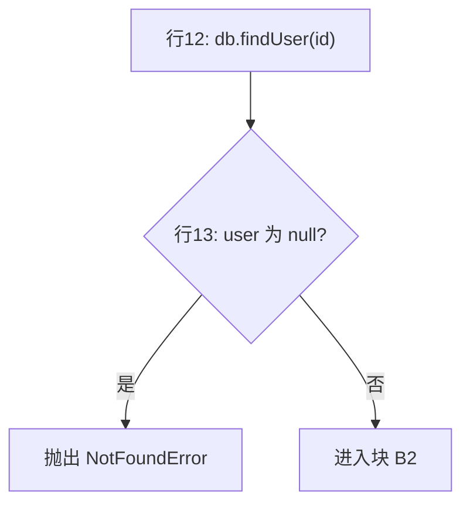
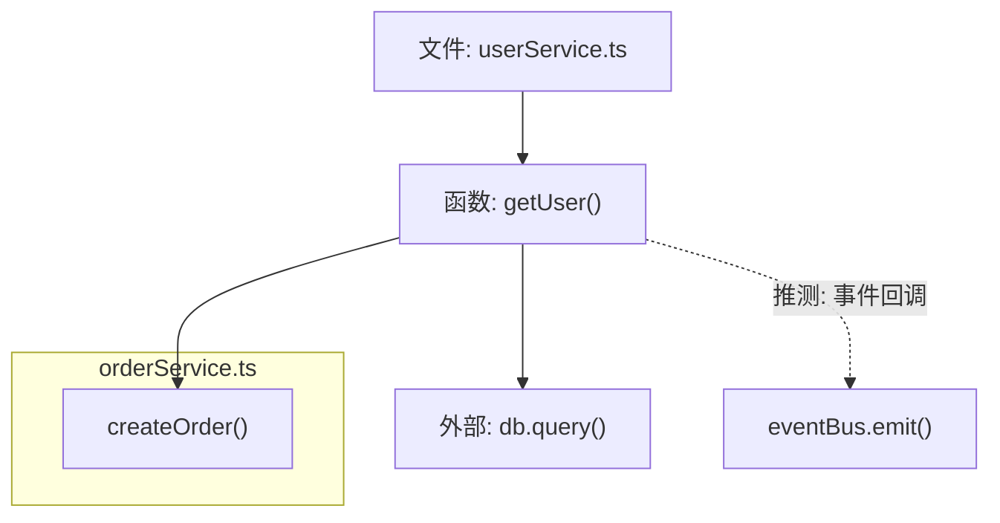

# 通用代码分析指令（CODE_ANALYSIS_GUIDE）

- **版本**：v1.5.1
- **版本规则**：语义化版本。新增语言/框架专项指引、新增章节或新阶段 → 次版本号 +1；修订措辞、修正错误 → 修订号 +1。每次变更须在 `_GUIDE_CHANGELOG.md` 登记（见第五部分）。

> **用途**：本文件是一份供 Agent 智能体加载的指令规范。Agent 读取本文件后，须对**用户指定的文件夹**下的代码文件逐一进行静态分析，并为每个代码文件生成对应的分析文档，包含：
> 1. **关系调用图**（Mermaid 图 + 调用明细表格）
> 2. **详细功能说明**（结构化模板）
>
> 目标：帮助开发者快速理解任意代码文件的结构、职责与调用关系。
>
> **自适应能力**：本指引内置"项目画像 + 迭代闭环"机制（见 2.0 节与第五部分），Agent 在分析每个新项目时须先探测项目特征并动态调整分析规则，分析完成后须输出迭代建议，使本指引随项目实践持续优化。
>
> **分工说明**：本文件负责"代码理解"（生成调用图与功能说明）；质量把关（diff 审查、分级意见、合入结论）由独立的 `CODE_REVIEW_GUIDE.md` 负责。两者通过 `_PROJECT_PROFILE.md` 与 `CODE_ANALYSIS_GUIDE.local.md` 共享项目上下文；本指南不出具合入结论，审查指南不生成分析文档。

---

## 第一部分：使用说明（面向人）

### 1.1 如何使用本文件

任选以下一种方式将本文件提供给 Agent：

- **方式 A（推荐）**：将本文件放入目标项目根目录，然后在对话中告知 Agent：
  > "请阅读项目根目录下的 CODE_ANALYSIS_GUIDE.md，并严格按照其中的规范，分析 `<目标文件夹路径>` 下的所有代码文件。"
- **方式 B**：将本文件全文粘贴到对话中，随后指定目标文件夹路径。
- **方式 C**：将本文件内容配置为 Agent 的系统提示词 / 自定义指令。

**最小可用提示词（可直接复制）**：

> 请阅读项目根目录下的 CODE_ANALYSIS_GUIDE.md（如存在 CODE_ANALYSIS_GUIDE.local.md 一并加载），严格按规范分析 `src/` 目录，使用标准模式。先输出项目画像摘要与待分析文件清单，经我确认后再生成。

### 1.2 如何指定分析范围

- **分析整个项目**：直接给出项目根目录路径。
- **分析子目录**：给出子目录路径，如 `src/services/`。
- **分析单个文件**：给出文件路径，Agent 仍按本规范生成单文件分析文档。

### 1.3 产出位置

所有分析文档统一输出到**项目根目录**下的 `docs/code-analysis/`（项目根判定：含 `package.json` / `CODE_ANALYSIS_GUIDE.md` / `.git` 等标志文件的目录；分析目标为子目录而无上述标志时，退化为相对分析目标文件夹的路径）：

```
<项目根目录>/docs/code-analysis/
├── _INDEX.md                  # 总览索引（必生成）
├── _PROJECT_PROFILE.md        # 项目画像（必生成，见 2.0 节）
├── _ITERATION_PROPOSAL.md     # 指引迭代建议（必生成，见第五部分）
├── _AUDIT_REPORT.md           # 产物校对报告（必生成，见第六部分）
├── <源文件相对项目根的路径>/<源文件名>.md               # 每个代码文件对应一份分析文档（按源码目录层级存放）
└── ...
```

> **画像与索引的固定位置**：`_PROJECT_PROFILE.md` 与 `_INDEX.md` 固定输出到**项目根目录**的 `docs/code-analysis/`（项目根判定：含 `package.json` / `CODE_ANALYSIS_GUIDE.md` / `.git` 等标志文件的目录），即使分析范围是子目录也如此——保证 CODE_REVIEW_GUIDE（其 2.0 节）能按固定路径加载共享画像。
>
> **单文件分析文档的存放规则（关键修正）**：每个源文件的分析文档**按其在项目中的目录层级存放**，输出路径为 `docs/code-analysis/<源文件相对项目根的路径>/<源文件名>.md`。例如项目根下存在 `src/utils/is.ts` 与 `src/services/user.ts`，其分析文档分别为 `docs/code-analysis/src/utils/is.ts.md` 与 `docs/code-analysis/src/services/user.ts.md`——**保留源码目录层级，使每份 md 落在代码所在文件夹对应的位置上，而非全部平铺在 `docs/code-analysis/` 根目录**。分析范围为子目录时仍按源文件相对项目根的路径存放（仅生成该子目录内的文件）；无法判定项目根时退化为相对分析目标文件夹的路径。同名文件因此天然隔离，**不再需要旧版"追加父目录名"的平铺去重手段**（如 `api/user.ts.md`）。

### 1.4 分析模式（三档，用户指令中指定，默认标准模式）

| 模式 | 适用场景 | 生成内容 | 相对成本 |
|---|---|---|---|
| **概览模式** | 快速了解项目结构、找入口 | 模板第 1–4、6、7、8 节（跳过第 5 节逐块详解） | 低 |
| **标准模式**（默认） | 常规理解代码 | 完整模板全部 8 节 | 中 |
| **逐行模式** | 精读核心文件 | 完整模板 + 每一行行内注释（单文件 ≤500 行，见 2.2 节） | 高 |

模式可在文件级混用：用户可指定"整体概览模式，但 `core/engine.ts` 用逐行模式"。

### 1.5 全量与增量

- **全量分析**（首次或用户明确要求时）：重新生成所有文件的分析文档。
- **增量分析**（默认，当 `docs/code-analysis/` 已存在时适用）：仅重新生成满足以下任一条件的文件文档——
  1. 源文件在上次分析后被修改（比对文件修改时间，或无法获取时比对内容哈希，哈希记录在 `_INDEX.md` 每行末尾）；
  2. 其依赖（被它 import 的文件）或被引用方发生了变化；
  3. 对应分析文档缺失。
  增量完成后同步更新 `_INDEX.md` 全景图与摘要；**不得覆盖用户在分析文档中手工添加的"笔记区"内容**（见第三部分模板第 8 节）。
- **依赖图持久化**：文件级依赖关系（import/require 边）须持久化在 `_INDEX.md` 的"依赖"列（或独立 `_DEP_GRAPH.md`），供上述条件 2 判定；增量时依据该图只重扫受影响文件，避免因缺少依赖图而退化为全量重扫。

---

## 第二部分：Agent 执行指令（核心）

> 以下内容是给 Agent 的**强制性执行规范**。Agent 必须逐条遵守。

### 2.0 阶段零：项目画像与规则自适应（每次分析前必做）

> 目的：本指引的通用规则不可能覆盖所有项目的特异性。Agent 必须先为当前项目建立"画像"，再据此**动态调整**后续阶段的执行规则，而非机械套用通用规则。

1. **探测项目特征**（只读操作）：
   - 构建与依赖配置：`package.json` / `pom.xml` / `build.gradle` / `go.mod` / `requirements.txt` / `pyproject.toml` / `Cargo.toml`
   - 框架与脚手架：`vue.config.js` / `vite.config.*` / `next.config.*` / `nuxt.config.*` / `angular.json` / `application.yml`（Spring）等
   - 目录约定：识别 `src/`、`pages/`、`components/`、`services/`、`api/`、`dao/`、`internal/`（Go）等目录的实际职责划分
   - 内部基础设施：自研框架、内部 SDK、统一封装层（如封装的 `request.ts`、自研 ORM、统一错误码），这些通常是调用链的关键枢纽，须重点识别
   - 已有文档：`README.md`、`docs/`、`AGENTS.md`、架构图——若与本指引推断冲突，以项目文档为准并在画像中注明
   - 代码风格线索：命名规范（如 `useXxx`、`XxxService`、`XxxMapper`）、分层模式（MVC / DDD / 整洁架构）
2. **生成项目画像** `docs/code-analysis/_PROJECT_PROFILE.md`，包含：
   - 技术栈清单（语言、框架及确切版本、构建工具）
   - 目录结构图及各目录职责推断
   - 项目特有的调用模式（如自研 RPC、事件总线、约定大于配置的路由扫描）——**这些模式须补充进 2.2/2.3 节的解析与分析规则中执行**
   - 通用规则的覆盖/豁免清单：本指引中不适用于本项目的规则（须逐条列出并说明理由）
3. **规则自适应**：后续阶段执行时，项目画像的优先级**高于**本指引的通用规则。画像未覆盖的部分回落到通用规则。
4. 画像生成后须向用户展示摘要，用户可纠正错误推断，Agent 按纠正结果更新画像后再进入阶段一。

### 2.1 阶段一：扫描

1. 接收用户指定的目标文件夹路径。
2. 递归扫描该文件夹，识别所有代码文件。
3. **语言 / 框架识别规则**（按文件扩展名 + 项目配置文件综合判断）：

   | 扩展名 | 判定 | 附加判定条件 |
   |---|---|---|
   | `.py` | Python | — |
   | `.java` | Java | — |
   | `.go` | Go | — |
   | `.ts` | TypeScript | 项目含 React 依赖时按 React 规则补充分析 |
   | `.js` / `.mjs` / `.cjs` | JavaScript / Node.js | 项目含 `package.json` 且无前端框架入口时按 Node.js 服务端规则解析 |
   | `.jsx` / `.tsx` | React | — |
   | `.vue` | Vue | 依据 `package.json` 中 `vue` 版本区分 Vue 2 / Vue 3 |
   | `.c` | C | 存在 `CMakeLists.txt` / `Makefile` / `meson.build` 时按对应构建系统补充分析 |
   | `.h` | C/C++ 头文件 | 结合同目录实现文件判断归属；含 `#ifdef __cplusplus` 的双用头文件按 C/C++ 双轨标注 |
   | `.cpp` / `.cc` / `.cxx` | C++ | — |
   | `.hpp` / `.hh` / `.hxx` | C++ 头文件 | — |

4. **框架版本确认**：存在 `package.json` 时，读取 `dependencies` / `devDependencies` 确认 `vue`、`react`、`express`、`nestjs` 等框架及其主版本号，并在分析文档中注明；C/C++ 项目存在 `CMakeLists.txt` / `Makefile` / `meson.build` 时，记录语言标准（`CMAKE_CXX_STANDARD`、`-std=c++17` 等）、编译器（gcc / clang / MSVC）与链接依赖库。
5. **排除规则**：以下路径一律跳过，不生成分析文档：
   - `node_modules/`、`dist/`、`build/`、`out/`、`.git/`、`.idea/`、`.vscode/`、`__pycache__/`、`vendor/`、`target/`、`coverage/`
   - 二进制文件、图片、字体、音视频资源；编译产物（`.o`、`.obj`、`.a`、`.so`、`.dylib`、`.lib`、`.dll`、`.exe`、`.out`、`.class`、`.pyc`、`.d`）
   - `.min.js`、`.map`、`.lock`、锁文件（`package-lock.json`、`yarn.lock`、`go.sum` 等）
   - 单文件超过 **3000 行** 的代码文件：不跳过，但仅在 `_INDEX.md` 中登记并标注"超大文件，建议人工分段分析"；若用户明确要求分析，则按 2.6 节分批策略处理。
6. 扫描完成后，先向用户输出一份**待分析文件清单**（路径 + 语言 + 行数），并说明将生成 `docs/code-analysis/` 目录。若文件数量超过 50 个，须先征得用户确认后再继续。**确认合并规则**：画像摘要（2.0.4）与文件清单可合并为一次确认输出，避免多轮往返；用户明确要求分步确认的除外。文件数 ≤50 且用户未要求确认时，可生成后统一汇报。

### 2.2 阶段二：解析（按语言/框架的识别要点）

#### 通用识别项（所有语言）

- 模块 / 包声明
- 导入依赖（区分：标准库、第三方库、项目内部模块）
- 函数 / 方法签名（名称、参数、返回类型）
- 类、接口、结构体及其继承 / 实现关系
- 导出符号（对外暴露的 API）
- 全局常量与配置项

#### Python

- `def` / `async def` / `class` 定义及行号
- `import` / `from ... import` 依赖
- 装饰器（`@property`、`@staticmethod`、自定义装饰器）及其语义
- `if __name__ == "__main__":` 入口
- 动态调用提示：`getattr`、`eval`、`exec`、`importlib`、字符串拼接的回调——标注为"推测"

#### Java

- `package` / `import`
- `class` / `interface` / `enum` / `record` 及 `extends` / `implements`
- 方法签名、注解（`@Override`、`@Autowired`、`@RestController` 等 Spring 注解须识别其路由/注入语义）
- 静态方法与实例方法的调用区分

#### JS / TS（通用前端/无框架场景）

- `import` / `export`（默认导出与具名导出）
- 函数声明、箭头函数、`class`
- 跨模块调用链（A 模块 import B 模块的函数 f → 记录 A→B.f）
- TS 额外项：`interface` / `type` / `enum` / 泛型约束

#### Node.js（服务端专项）

- **模块系统双轨识别**：CommonJS（`require()` / `module.exports` / `exports.x`）与 ESM（`import` / `export`）并存时分别标注；识别动态 `require(variable)` 与 `import()` 并标注"推测"
- **npm 依赖分析**：解析 `package.json` 的 `dependencies` / `devDependencies`，区分外部包调用与内部模块（相对路径 `require('./xx')`）调用
- **入口与进程模型**：识别 `main` / `bin` 入口文件；标注事件循环相关 API（`setImmediate`、`process.nextTick`、`setTimeout`）造成的异步边界；识别 `child_process` / `worker_threads` 的跨进程/线程调用
- **Web 框架路由**：Express / Koa / Fastify / NestJS 的路由注册（`app.get(...)`、`router.use(...)`、`@Controller()` / `@Get()` 装饰器）→ 建立 "HTTP 路由 → 中间件链 → 处理函数" 调用链
- **异步调用链**：追踪 Promise / `async-await` / 回调风格的调用关系；跨越事件循环的隐式调用（事件发射 `emit` / 监听 `on`）须标注"推测"
- **中间件与钩子**：按注册顺序列出中间件串联链、全局错误处理中间件

#### Go

- `package` 声明与 `import` 分组
- `func` 函数与方法接收者（`func (s *Server) Handler()` → 归属类型 `Server`）
- `struct` / `interface` 及接口的隐式实现（无法静态确定实现关系时标注"推测"）
- `go func()` 协程调用、channel 收发点——标注并发边界

#### C / C++

- **头文件与实现分离**：`.h` / `.hpp` 记录声明（函数原型、`struct` / `class`、宏、`extern`），`.c` / `.cpp` 记录定义；跨文件调用链按"声明所在头文件 + 定义所在实现文件"双向记录
- **包含依赖**：区分 `#include "..."`（项目内部）与 `#include <...>`（标准库 / 第三方）；标注头文件传递包含（A 包含 B、B 包含 C）造成的间接依赖
- **宏与条件编译**：`#define` / `#ifdef` / `#ifndef` / `#if` / `#pragma once`；宏展开与条件分支的结果静态不可靠，涉及宏的调用一律标注"推测"
- **类型与结构**：`typedef` / `struct` / `union` / `enum`；C++ 额外项：`class`、继承与虚函数（`virtual` / `override`）、模板（`template`）、命名空间（`namespace`）
- **函数签名**：返回类型、参数、`static`（内部链接）、`const` 限定、`extern "C"`（C++ 中调用 C 接口的边界）
- **内存与资源生命周期**：`malloc`/`free`、`new`/`delete`、智能指针（`unique_ptr` / `shared_ptr` / `weak_ptr`）、RAII——标注资源申请与释放边界，识别泄漏 / 悬垂风险点
- **C++ 特有**：STL 容器与算法、`auto`、lambda、移动语义（`std::move`）、异常（`try` / `catch` / `noexcept`）
- **并发边界**：`pthread_*`、`std::thread` / `std::mutex` / 条件变量、原子操作、信号处理（`signal`）——标注共享状态与临界区
- **动态调用提示**：函数指针、`dlopen` / `dlsym`、虚函数多态（vtable 分发）——静态无法确定目标实现时标注"推测"
- **构建系统**：识别 `CMakeLists.txt` / `Makefile` / `meson.build`，记录 target 与源文件清单、编译选项（`-std`、宏定义）与链接依赖库

#### Vue（Vue 2 / Vue 3 均覆盖）

- **SFC 结构解析**：`.vue` 文件按 `<template>` / `<script>` / `<script setup>` / `<style>` 分块解析；识别组件名、`props` / `emits` 定义
- **组件关系**：`components` 注册与 `import` 引用；父子组件 props 传递方向、`emit` 事件流、slot 分发关系
- **响应式数据流**：Options API 的 `data` / `computed` / `watch`；Composition API 的 `ref` / `reactive` / `computed` / `watchEffect`——追踪谁读谁写
- **组合式函数**：`useXxx` composable 的定义与复用位置
- **状态管理与路由**：Pinia / Vuex 的 `state` / `getter` / `action` / `mutation` 调用链；Vue Router 配置中 "路由路径 → 页面组件" 映射
- 分析文档中注明该文件是 Options API 还是 Composition API 风格

#### React（类组件与函数组件均覆盖）

- **组件识别**：函数组件 / class 组件 / HOC 高阶组件 / `forwardRef` / `memo` 包裹关系（如 `export default memo(withAuth(Home))` 须逐层拆解）
- **Hooks 分析**：`useState` / `useEffect` / `useMemo` / `useCallback` / `useContext` 的依赖数组与副作用；自定义 Hook（`useXxx`）的定义与复用关系
- **组件树与数据流**：JSX 中的组件嵌套结构、props 向下传递、回调函数向上传递、`Context.Provider` / `useContext` 的跨层数据流
- **状态管理与路由**：Redux / Zustand / Recoil 的 action / reducer / selector 调用链；React Router 配置中 "路由路径 → 页面组件" 映射
- **渲染副作用**：`useEffect` / `useLayoutEffect` 中触发的异步调用链（API 请求、事件订阅、定时器），须标注清理函数（cleanup）是否存在

#### 代码块切分规则（所有语言通用，强制执行）

> 目的：为"逐块详解"（第三部分模板第 5 节）提供统一的切分依据。代码块是讲解的最小单元。

1. **切分边界**（按优先级）：
   - 注释锚点：块首注释（如 `// 1. 校验参数`）天然标识一个块；
   - 控制流边界：`if/else`、`for/while`、`try/catch/finally`、`switch` 各自成块；
   - 逻辑内聚：连续完成同一子任务的语句（如同一次数据转换的多行赋值）；
   - 空行与 `return` / `break` / `continue` 出口点。
2. **块大小约束**：每块 **5–30 行**。超过 30 行必须按子逻辑再切分；不足 5 行的琐碎块与相邻块合并。
3. **块编号与命名**：函数内顺序编号 `B1、B2…`，命名格式 `B<编号>: <功能短语>`（如 `B2: 查询用户并校验状态`）。
4. **关键行标记**：块内含以下行时标记为"关键行"，须逐行注释：
   - 复杂表达式（三元嵌套、链式调用超过 3 层、正则、位运算）
   - 框架"魔法"（装饰器、反射、动态代理、元编程）
   - 易错点（类型强转、空值风险、并发读写、资源未释放）
5. **逐行模式**：用户在请求中声明"逐行模式"时，取消块级粒度限制，对指定文件的**每一行**生成行内注释；该模式下单文件超过 500 行须先经用户确认。

#### 其他语言

未列出的语言按"通用识别项"处理，并在分析文档"注意事项"中注明该语言未内置专项指引。

### 2.3 阶段三：分析

构建**两层调用关系**：

1. **文件级**：文件 A import/require 了文件 B → 记为 `A → B`
2. **符号级**：文件 A 中的函数 f 调用了（本文件或外部文件的）函数 g → 记为 `A.f → B.g`，并记录**调用所在行号**

要求：

- 行号必须基于真实文件内容，禁止编造。
- 动态调用（反射、字符串拼接、事件总线、依赖注入容器等无法静态确定目标的情况）一律在表格"说明"列标注 `（推测）`。
- 同时维护**反向索引**：每个文件被哪些文件引用（供输出模板第 6 节使用）。
- **只读约束**：整个分析过程不得修改、移动、重命名任何源文件。

#### 代码功能判定机制（逐块分析时执行）

对每个代码块，按以下信号判定其**功能类别**（一个块可兼属多类，取主要类别）：

| 功能类别 | 判定信号 | 解说重点 |
|---|---|---|
| 输入校验 | 判空、类型检查、正则匹配、断言、`throw` 前置检查 | 校验规则与失败后果 |
| 数据获取 | DB 查询、HTTP/RPC 请求、文件读取、缓存读取 | 数据来源、失败降级 |
| 数据转换 | map/filter/reduce、序列化、DTO 转换、字段拼接 | 输入结构 → 输出结构 |
| 业务计算 | 算术/聚合运算、状态机迁移、规则引擎分支 | 计算公式与业务含义 |
| 状态变更 | 全局/store/类成员赋值、DB 写入、事件发布 | 谁被改、谁受影响 |
| 流程编排 | 顺序调用多个子函数、条件分发、责任链 | 编排顺序与分支条件 |
| 异常处理 | `try/catch`、`except`、错误码封装、重试 | 捕获范围、恢复策略 |
| 资源管理 | 连接/句柄的打开与释放、`defer`/`finally`/上下文管理器 | 泄漏风险 |

判定结果写入模板块级解说的"功能类别"字段，作为文本解说的组织主线。

#### 跨文件解释能力（被调函数内联展开）

当某行代码调用/导入了**其他文件**的函数或方法时：

1. **一级展开（默认）**：在该块的 Mermaid 图中嵌入被调函数的**摘要子图**——列出其内部 3–5 个关键步骤（用 `subgraph` 包裹并注明来源文件），并在图后附"跨文件摘要卡"：

   | 字段 | 内容 |
   |---|---|
   | 被调函数 | `文件: 函数名`（含行号） |
   | 功能摘要 | 一句话 |
   | 关键步骤 | 3–5 步 |
   | 详细分析 | 指向该文件分析文档对应章节的相对链接 |

2. **深度限制**：默认展开 1 层；用户声明"深度展开"时最多 2 层。禁止无限递归。
3. **循环保护**：检测到循环调用（A→B→A）时，在图中用虚线回边标注"循环引用"，并停止该路径的继续展开。
4. **复用优先**：被调函数已在其所属文件的分析文档中详解过时，只放摘要卡 + 链接，不复制全文。
5. **外部依赖**：第三方库/标准库函数不展开内部实现，仅说明其契约（输入、输出、副作用）。

### 2.4 阶段四：生成

1. 在**项目根目录**下创建 `docs/code-analysis/` 目录（项目根判定见 1.3 节；单文件分析文档按源文件相对路径在该目录内分层存放，见本阶段第 3 步）。
2. 按用户指定的**分析模式**（见 1.4 节）与**全量/增量策略**（见 1.5 节）确定生成范围；增量模式下跳过未变更文件，并在汇报中列出"跳过 N 个未变更文件"。
3. 为每个源文件生成同名分析文档，输出路径 = `docs/code-analysis/<源文件相对项目根的路径>/<源文件名>.md`（如 `src/utils/is.ts` → `docs/code-analysis/src/utils/is.ts.md`）。**保留源码目录层级**，同名文件天然隔离，不再需要"追加父目录名"的平铺去重手段（旧版 `api/user.ts.md` 这类命名方式作废）。
4. 生成 `_INDEX.md` 总览索引（固定位于 `docs/code-analysis/` 根），包含：
   - 文件清单表（文件路径 | 语言/框架 | 行数 | 一句话职责 | 内容哈希 | 依赖 | 分析文档链接）——"依赖"列记录该文件的 import/require 边，供增量判定（见 1.5 节）；"分析文档链接"列指向 `docs/code-analysis/<相对路径>/<文件名>.md`（相对 `_INDEX.md` 所在目录的相对路径，如 `src/utils/is.ts.md`）
   - **模块依赖全景图**：文件级调用关系的 Mermaid 总图
   - 规模摘要：文件总数、总行数、各语言占比、识别出的框架及版本
5. 全部生成后向用户汇报：生成文件数、输出目录路径、超大文件/跳过项清单。

### 2.5 输出语言与格式约束

- 分析文档使用**简体中文**。
- 代码标识符（函数名、类名、路径）保持原文并用反引号包裹。
- Mermaid 代码块使用 ` ```mermaid ` 围栏；节点 ID 只用 ASCII 字母数字和下划线（禁止中文/特殊字符作为节点 ID，中文只允许出现在节点显示文本的引号内）。
- 所有相对链接（分析文档间互链）使用相对路径；分析文档已按源码目录层级嵌套存放，同目录互链用 `./x.ts.md`，跨目录用 `../<子目录>/x.ts.md`，禁止用绝对路径或平铺根目录的 `x.ts.md`。

### 2.6 大文件 / 超大项目分批策略

- 单文件 1000–3000 行：正常分析，"核心逻辑详解"只覆盖关键函数（不超过 10 个），其余在"结构清单"中列出。**逐块四要素取舍（与第三部分 §5 配套）**：第三部模板 §5 要求的逐块四要素（①带注释代码片段 ②块逻辑图 ③文本解说 ④跨文件摘要卡）只需对**所选关键函数**的**关键代码块**（每函数 ≤8 块，见下条）执行；其余非关键函数仅在 §3 结构清单列出签名与一句话功能，**不逐块展开**。关键函数以"导出类 / 插件入口（apply）+ 注册 / 装配 / 生命周期逻辑"为准。
- 逐块详解规模控制：每个函数最多详解 8 个代码块；超出时在函数级给出块清单（编号+功能短语+行号），仅详解关键块。逐行模式单文件上限 500 行（超出须用户确认）。
- 项目文件数 > 50：按目录分批，每批生成后更新 `_INDEX.md`；向用户汇报进度。
- 单个 Mermaid 图节点超过 30 个：拆分为"文件级总图"+"核心模块局部图"多张图；跨文件内联展开导致的节点膨胀优先裁剪摘要子图的步骤数。

### 2.7 阶段五：产物校对与质量自检（生成后强制执行）

> 目的：用大模型对刚生成的分析文档做**合规审计**，判断其是否符合本指引规定的产物标准，而非信任 Agent 的生成自检。详细校对规范见**第六部分**。

1. 对每份生成的分析文档执行第六部分的校对清单，逐份给出"通过 / 需修订 / 重新生成"结论。**校对规模控制**：结构类维度（第 1、5、6、7、9 维）逐份全量检查；证据类维度（第 2 维行号真实性、第 3 维调用关系准确性）按 ≥20% 抽样且跨文件均匀分布（单文件引用总数不足抽样数时全查），抽中不合格即该文件该维度全量复检。
2. **行号抽查自证**：每份文档随机抽取至少 3 处行号引用，展示源文件对应行的原文与文档描述的比对结果；任一处不符即判该文档"重新生成"。
3. **Mermaid 自检**：逐个检查 Mermaid 代码块语法（节点 ID 合规、箭头配对、subgraph 闭合）；无法通过自检的图修正后复检，仍失败的降级为"调用明细表格 + 文字描述"并在文档中注明。
4. 汇总输出 `docs/code-analysis/_AUDIT_REPORT.md`（格式见 6.3 节），向用户展示结论统计。
5. 判定"需修订"的文档由 Agent 直接修复并复检；判定"重新生成"的文档回到阶段二重做；全部通过后才允许进入第五部分的迭代闭环。

---

## 第三部分：单文件分析输出模板

> Agent 生成每份分析文档时，**必须严格使用以下章节结构**。某节无内容时写"无"而非省略章节。

````markdown
# <文件名> 代码分析

## 1. 文件概览
| 项目 | 内容 |
|---|---|
| 文件路径 | `<相对项目根目录的路径>` |
| 语言 / 框架 | 如 TypeScript / React 18 |
| 总行数 | N |
| 一句话职责 | （用一句话概括该文件做什么） |

## 2. 依赖关系
| 依赖 | 类型（标准库/第三方/内部） | 引入的符号 | 用途 |
|---|---|---|---|

## 3. 结构清单
| 名称 | 类型（类/函数/常量/接口/组件/插件(apply)/服务(Service)） | 行号 | 签名 | 一句话功能 |
|---|---|---|---|---|

## 4. 调用关系图

### 4.1 Mermaid 调用图


### 4.2 调用明细表
| # | 调用方 | 被调方 | 所在行号 | 说明 |
|---|---|---|---|---|
| 1 | `main()` | `initConfig()` | 15 | 启动时初始化配置 |
| 2 | `handler()` | `db.query()` | 42 | （推测）经依赖注入获取 |

## 5. 核心逻辑详解（逐代码块，图表+文本配对解说）
> 每个关键函数按 2.2 节"代码块切分规则"拆分为若干代码块，**每个块必须包含以下四要素，缺一不可**：
> ① 带行内注释的代码片段；② 该块的 Mermaid 逻辑图；③ 文本解说；④ 跨文件摘要卡（有外部调用时）。

### 5.1 `<函数名>` （行 xx–xx）
- **功能**：
- **参数**：
- **返回值**：
- **副作用**：（IO、网络请求、全局状态修改等，无则写"无"）

#### 块 B1: <功能短语> （行 xx–xx）
- **功能类别**：（输入校验 / 数据获取 / 数据转换 / 业务计算 / 状态变更 / 流程编排 / 异常处理 / 资源管理）

**① 代码片段（关键行逐行注释，普通行可整块注释）**
```<语言>
const user = await db.findUser(id);  // 行12【关键行】按 id 查询用户，不存在时返回 null
if (!user) throw new NotFoundError(); // 行13 校验：用户不存在直接中断流程
```

**② 块逻辑图**


**③ 文本解说**
（该块做什么、为什么这样做、输入 → 输出、与上下游块的关系，2–5 句）

**④ 跨文件摘要卡**（块内调用了其他文件的函数时必填，可多张）
| 字段 | 内容 |
|---|---|
| 被调函数 | `userRepository.ts: findUser()`（行 34–58） |
| 功能摘要 | 带缓存的用户查询：先读 Redis，未命中查 MySQL 并回填 |
| 关键步骤 | 1. 读缓存 2. 未命中查库 3. 回填缓存 4. 返回实体 |
| 详细分析 | [userRepository.ts.md 第 5.2 节](../repositories/userRepository.ts.md) |

（块 B2、B3… 按相同四要素结构重复）

## 6. 被引用情况
| 引用方文件 | 引用的符号 | 用途 |
|---|---|---|
（无任何文件引用时写"无——该文件为入口或孤立模块"）

## 7. 注意事项
- （潜在问题：错误处理缺失、并发风险、超大函数、重复代码等）
- （标注为"推测"的动态调用汇总）
- （代码中的 TODO / FIXME / HACK）

## 8. 笔记区（人工维护，增量更新时保留）
> Agent 生成时此节留空；用户可在此记录个人理解、疑问、评审结论。增量更新（见 1.5 节）时 Agent 不得覆盖本节内容。
````

---

## 第四部分：附录

### 附录 A：Mermaid 语法速查（供 Agent 保证输出可渲染）



要点：

- 节点 ID 只含 `[A-Za-z0-9_]`；含中文/特殊字符的文本必须放在 `["..."]` 内。
- 静态确定的调用用 `-->`，推测调用用 `-.->` 并附文字说明。
- 跨文件调用建议用 `subgraph` 按文件分组。
- 类继承/实现关系可用 `classDiagram`；组件树可用 `flowchart LR`。

### 附录 B：调用明细表示例（含框架场景）

Express 路由场景：

| # | 调用方 | 被调方 | 所在行号 | 说明 |
|---|---|---|---|---|
| 1 | HTTP `POST /api/users` | `userController.create()` | 23 | Express 路由注册 |
| 2 | `userController.create()` | `userService.insert()` | 45 | 业务逻辑层调用 |
| 3 | `authMiddleware()` | `jwt.verify()` | 12 | 前置中间件 |

Vue 组件场景：

| # | 调用方 | 被调方 | 所在行号 | 说明 |
|---|---|---|---|---|
| 1 | `UserList.vue` template | `<UserCard>` 组件 | 8 | props: `user` 向下传递 |
| 2 | `UserCard` | `emit('select', id)` | 31 | 子→父事件流 |
| 3 | `setup()` | `useUserStore().fetchList()` | 15 | Pinia action 调用 |

### 附录 C：超大项目分批策略细则

1. 按一级子目录分批，每批不超过 50 个文件。
2. 每批完成后再生成/更新 `_INDEX.md`，保证索引始终与已产出文档一致。
3. 跨批的调用关系：先记录目标文件路径，对尚未分析的批次在图中标记为"（待分析）"，全部批次完成后回填。

---

## 第五部分：指引自身的优化迭代机制（项目反馈闭环）

> 本部分定义"指引如何根据项目实践持续进化"。Agent 在**每次完成分析任务后**必须执行本闭环；用户负责审批迭代建议。

### 5.1 三层文件结构

| 文件 | 位置 | 作用 | 维护方 |
|---|---|---|---|
| `CODE_ANALYSIS_GUIDE.md`（本文件） | 通用存放处 | 通用规则基线，跨项目复用 | 用户审批后由 Agent 更新 |
| `_GUIDE_CHANGELOG.md` | 与本文件同目录 | 指引自身的版本变更日志 | Agent 追加，用户审批 |
| `CODE_ANALYSIS_GUIDE.local.md` | 各项目根目录 | **项目级覆盖层**：该项目沉淀的专属规则（自研框架解析要点、目录约定、豁免项） | Agent 在项目内自主维护 |

**覆盖层规则**：Agent 进入某项目时，若项目根目录存在 `CODE_ANALYSIS_GUIDE.local.md`，须与本指引一并加载；冲突时覆盖层优先。项目画像（2.0）中已验证稳定的项目特有规则，应沉淀进覆盖层，避免每次分析重复探测。

### 5.2 迭代闭环（每次分析任务完成后执行）

1. **差距记录**：分析过程中遇到的以下情况，Agent 须随时记录：
   - 本指引未覆盖的语言构造 / 框架模式（如发现项目使用 tRPC、GraphQL、Monorepo workspace 等）
   - 通用规则在本项目失效或产生误导的条目
   - 产出文档中被用户纠正过的错误（推断错误的职责、遗漏的调用关系）
2. **生成迭代建议** `docs/code-analysis/_ITERATION_PROPOSAL.md`，格式：

   | # | 类型（新增/修订/豁免） | 发现来源 | 建议内容 | 建议归属（通用指引 / 项目覆盖层） |
   |---|---|---|---|---|

   归属判定原则：**跨项目可复用的** → 建议进入通用指引；**仅本项目有效的** → 进入 `CODE_ANALYSIS_GUIDE.local.md`。
3. **用户审批**：向用户展示建议清单。用户批准后：
   - 项目覆盖层条目：Agent 直接写入 `CODE_ANALYSIS_GUIDE.local.md`；
   - 通用指引条目：Agent 更新本文件对应章节，版本号按头部规则递增，并在 `_GUIDE_CHANGELOG.md` 追加一条记录（版本号、日期、变更摘要、来源项目）。
4. 用户未审批前，Agent 不得擅自修改本通用指引。

### 5.3 变更日志格式（`_GUIDE_CHANGELOG.md`）

```markdown
| 版本 | 日期 | 变更摘要 | 来源项目 |
|---|---|---|---|
| v1.1.0 | 2026-08-13 | 新增阶段零（项目画像）与第五部分（迭代闭环） | 指引自检 |
```

---

## 第六部分：生成产物校对机制（合规审计规范）

> 本部分定义"如何用大模型校对已生成的分析文档，判定其是否符合本指引的产物标准"。校对由 2.7 节（阶段五）触发，**强制执行**，任何人（含生成者本人）不得跳过。

### 6.1 校对原则

1. **独立视角**：校对时以"审计员"角色重新审视文档，假设生成内容可能有错，逐条对照本指引取证，而非通读后凭印象放行。
2. **证据优先**：每项校对结论必须附证据（文档中的章节/行号、源文件原文对照），不允许"看起来没问题"式的结论。
3. **可复判**：校对报告须让第三人仅凭报告即可复核结论。

### 6.2 校对清单（逐文档执行）

| # | 校对维度 | 合格标准 | 不通过的处理 |
|---|---|---|---|
| 1 | 结构完整性 | 含模板全部 8 个章节（概览模式豁免第 5 节），无内容章节写"无" | 需修订 |
| 2 | 行号真实性 | 抽查 ≥3 处行号（行号引用总数不足 3 处时全查），与源文件原文逐字吻合 | 重新生成 |
| 3 | 调用关系准确性 | 抽查 ≥2 条调用明细（调用明细总数不足 2 条时全查），调用方/被调方/行号与源码一致 | 重新生成 |
| 4 | Mermaid 可渲染 | 节点 ID 仅 ASCII、箭头配对、subgraph 闭合、中文均在引号内 | 需修订（修正后复检；二次失败降级为表格+文字） |
| 5 | 逐块四要素 | 第 5 节每个块含①注释代码②块逻辑图③文本解说④摘要卡（有外部调用时） | 需修订 |
| 6 | 块切分合规 | 块大小 5–30 行；关键行已逐行注释；功能类别已标注且判定合理 | 需修订 |
| 7 | 推测标注 | 动态调用均有"（推测）"标注，无把推测写成确定事实的表述 | 需修订 |
| 8 | 跨文件展开 | 外部调用有摘要卡；深度 ≤2 层；循环引用已标注；第三方库仅述契约 | 需修订 |
| 9 | 语言与格式 | 简体中文；标识符反引号包裹；互链为相对路径且可达 | 需修订 |
| 10 | 内容真实性 | 无源文件中不存在的函数/参数/逻辑（幻觉检查，抽查 ≥2 个函数签名与源码比对） | 重新生成 |

**判定规则**：任一"重新生成"级维度不通过 → 整份文档重新生成；仅"需修订"级不通过 → 定点修复后对该维度复检；全部通过 → 标记"通过"。

### 6.3 校对报告格式（`_AUDIT_REPORT.md`）

```markdown
# 产物校对报告
- 校对时间：<ISO 时间> ｜ 指引版本：v<x.y.z> ｜ 分析模式：<概览/标准/逐行>

## 结论统计
| 通过 | 需修订（已修复） | 重新生成（已重做） | 总计 |
|---|---|---|---|

## 逐文档结论
| 文档 | 结论 | 不通过维度（#编号） | 证据摘要 |
|---|---|---|---|

## 行号抽查记录
| 文档 | 抽查行号 | 源文件原文 | 文档描述 | 是否吻合 |
|---|---|---|---|---|

## 遗留问题
（复检仍未通过项及降级处理说明；无则写"无"）
```

### 6.4 校对后的流程衔接

- 全部通过后：方可生成/更新 `_ITERATION_PROPOSAL.md`（第五部分闭环）。
- 校对中发现的**指引本身缺陷**（如某维度标准无法执行、模板字段不适用该项目）：记录进 `_ITERATION_PROPOSAL.md`，类型标"修订"。
- 同一文档连续 2 次"重新生成"仍不通过：停止重试，向用户报告并给出人工介入建议，禁止无限循环。

---

## 执行确认清单（Agent 完成后自检）

- [ ] 阶段零已完成：`_PROJECT_PROFILE.md` 已生成并经用户确认；存在 `CODE_ANALYSIS_GUIDE.local.md` 时已加载并优先适用
- [ ] 分析模式（概览/标准/逐行）与全量/增量策略已按用户指令执行；增量更新未覆盖任何"笔记区"
- [ ] 待分析文件清单已输出并经用户确认（文件数 > 50 时）
- [ ] 每个源文件均有对应分析文档，且严格使用第三部分模板（含第 8 节笔记区）
- [ ] 逐块详解四要素完整：带注释代码片段 + 块逻辑图 + 文本解说 + 跨文件摘要卡（有外部调用时）
- [ ] 代码块切分符合 5–30 行约束，关键行已逐行注释，功能类别已判定
- [ ] 跨文件调用已做一级内联展开；循环引用已标注；第三方库仅述契约
- [ ] 每份文档均含 Mermaid 图 + 调用明细表格，行号真实可查
- [ ] 推测性调用已全部标注
- [ ] `_INDEX.md` 已生成，含全景 Mermaid 图、规模摘要与内容哈希
- [ ] 未修改任何源文件
- [ ] 阶段五校对已执行：`_AUDIT_REPORT.md` 已生成，行号抽查与 Mermaid 自检全部完成，"需修订/重新生成"项已闭环处理
- [ ] `_ITERATION_PROPOSAL.md` 已生成并向用户展示；获批条目已写入覆盖层或通用指引（含版本号与变更日志更新）
- [ ] 已向用户汇报输出目录与跳过项
