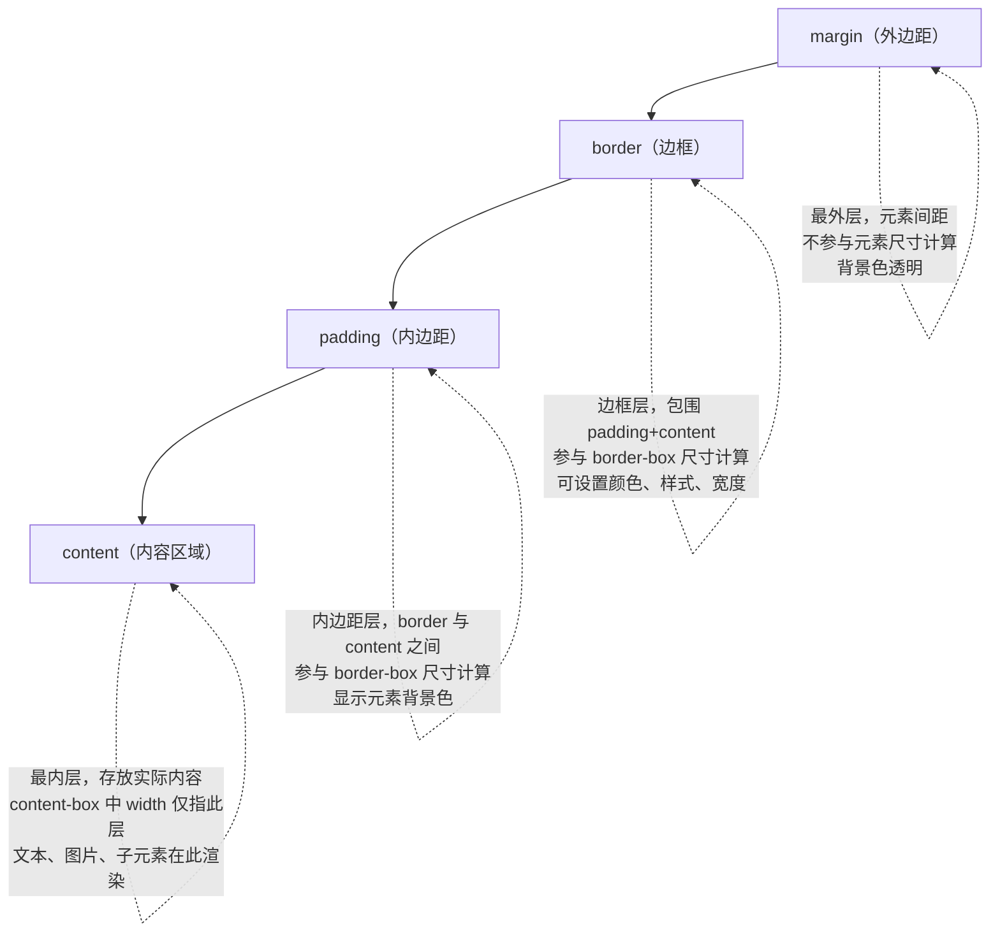
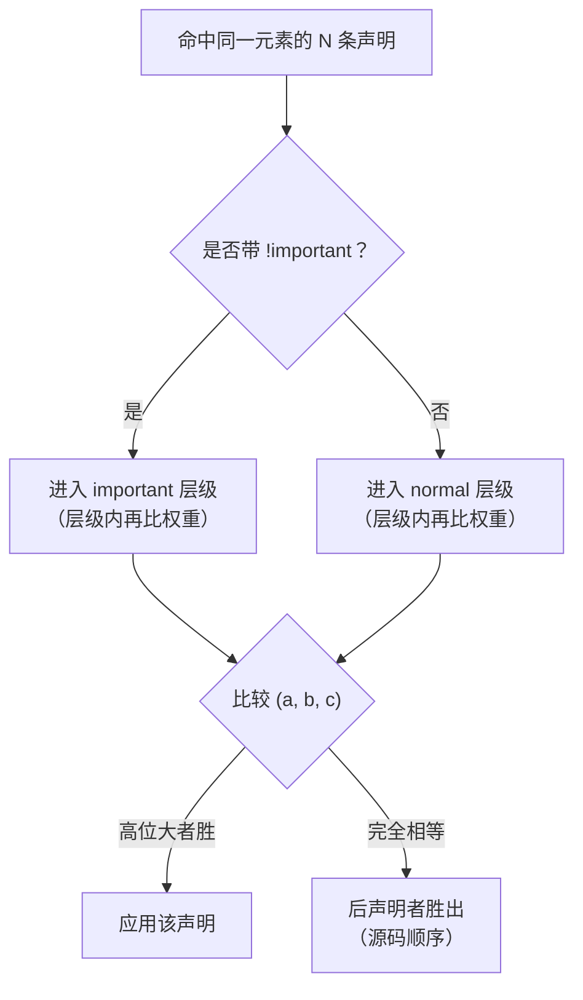
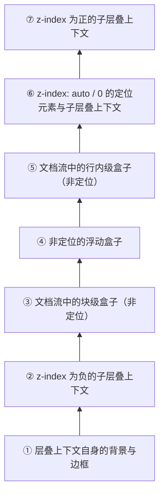

# CSS 布局核心

> 模块：01-html-css（第1周 HTML/CSS 基础）
> 定位：前端面试必考核心，掌握盒模型、BFC、Flex、Grid 等布局机制

---

## 一、核心概念

### 1.1 盒模型（Box Model）

CSS 盒模型是页面布局的基石，每个元素都被看作一个矩形盒子。盒模型由内到外分为四层：

```
margin（外边距） → border（边框） → padding（内边距） → content（内容）
```

> **生活化类比**：相框——照片（content）是核心内容，卡纸留白（padding）是照片与相框之间的空白区域，相框边框（border）是可见的装饰边框，墙上间距（margin）是相框与相框之间的距离。`content-box` 是照片尺寸，`border-box` 是含卡纸和边框的完整相框尺寸。

**两种盒模型对比**：

| 类型 | box-sizing 值 | width 包含范围 | 实际占用宽度计算公式 |
|------|:---:|------|------|
| 标准盒模型 | `content-box`（默认） | 仅 content | `width + padding + border + margin` |
| 替代盒模型 | `border-box` | content + padding + border | `width + margin` |

```css
/* 标准盒模型：元素实际宽度 = 200 + 20*2 + 5*2 = 250px */
.box-content {
    box-sizing: content-box;
    width: 200px;
    padding: 20px;
    border: 5px solid #333;
}

/* 替代盒模型：元素实际宽度 = 200px（content 自动缩小为 150px） */
.box-border {
    box-sizing: border-box;
    width: 200px;
    padding: 20px;
    border: 5px solid #333;
}
```

**最佳实践**：全局设置 `box-sizing: border-box`，避免复杂布局中尺寸计算困难。

```css
*,
*::before,
*::after {
    box-sizing: border-box;
}
```

**盒模型四层结构图：**



> 上图展示了 CSS 盒模型由外到内的四层结构：`margin`（外边距）、`border`（边框）、`padding`（内边距）和 `content`（内容区域）。`content-box` 模式下 `width` 仅指 `content` 层宽度，而 `border-box` 模式下 `width` 包含 `content + padding + border` 三层。理解这四层结构是掌握 CSS 布局的基础。

### 1.2 BFC（块级格式化上下文）

**BFC（Block Formatting Context）** 是一个独立的渲染区域，内部元素的布局不会影响外部元素。

> **生活化类比**：一个独立房间，房间里的家具摆放不会影响隔壁房间。BFC 就是这样一个"独立房间"，里面的元素无论怎么浮动都不会影响外部。

**BFC 的触发方式**：

| 触发方式 | 示例 |
|---------|------|
| 根元素 `<html>` | 默认触发 |
| `float` 不为 `none` | `float: left` |
| `position` 为 `absolute` 或 `fixed` | `position: absolute` |
| `display` 为 `inline-block` / `flex` / `grid` / `table-cell` | `display: flex` |
| `overflow` 不为 `visible` | `overflow: hidden` |
| `contain` 为 `layout` / `content` / `paint` | `contain: layout` |

**BFC 的应用场景**：

1. **清除浮动（解决父元素高度塌陷）**：给父元素设置 `overflow: hidden` 触发 BFC
2. **防止外边距折叠（margin 合并）**：将两个元素分别放入不同 BFC 容器
3. **防止元素被浮动元素覆盖**：让非浮动元素触发 BFC，实现自适应两栏布局

```css
/* 场景1：清除浮动 - 父元素高度塌陷 */
.clearfix {
    overflow: hidden; /* 触发 BFC，包裹浮动子元素 */
}

/* 场景2：防止 margin 合并 */
.bfc-container {
    overflow: hidden; /* 创建独立 BFC */
}

/* 场景3：两栏自适应布局 */
.left {
    float: left;
    width: 200px;
}
.right {
    overflow: hidden; /* 触发 BFC，不与浮动元素重叠 */
}
```

---

## 二、Flex 布局

### 2.1 容器属性（父元素）

设置 `display: flex` 后，元素成为 Flex 容器，其直接子元素成为 Flex 项目。

> **生活化类比**：抽屉里的可伸缩分隔板——分隔板的方向（flex-direction）决定物品是横排还是竖排。分隔板之间的物品可以随空间自动伸缩——空间多了就变宽（flex-grow），空间少了就变窄（flex-shrink）。justify-content 决定物品在分隔方向的分布方式，align-items 决定物品在垂直方向的对齐方式。默认情况下，物品会拉伸填满整个分隔板高度（align-items: stretch）。

| 属性 | 可选值 | 默认值 | 说明 |
|------|------|:---:|------|
| `flex-direction` | row / row-reverse / column / column-reverse | `row` | 主轴方向 |
| `flex-wrap` | nowrap / wrap / wrap-reverse | `nowrap` | 是否换行 |
| `justify-content` | flex-start / flex-end / center / space-between / space-around / space-evenly | `flex-start` | 主轴对齐方式 |
| `align-items` | stretch / flex-start / flex-end / center / baseline | `stretch` | 交叉轴对齐方式 |
| `align-content` | stretch / flex-start / flex-end / center / space-between / space-around | `stretch` | 多行时的交叉轴对齐 |
| `gap` | 长度值 | `0` | 项目间距（推荐替代 margin） |

```css
.container {
    display: flex;
    flex-direction: row;          /* 主轴水平，从左到右 */
    flex-wrap: wrap;              /* 允许换行 */
    justify-content: space-between; /* 两端对齐，中间均匀分布 */
    align-items: center;           /* 交叉轴居中 */
    gap: 16px;                    /* 项目间距 16px */
}
```

### 2.2 项目属性（子元素）

| 属性 | 说明 | 默认值 |
|------|------|:---:|
| `flex-grow` | 放大比例（剩余空间分配权重） | `0` |
| `flex-shrink` | 缩小比例（空间不足时收缩权重） | `1` |
| `flex-basis` | 项目在主轴上的初始大小 | `auto` |
| `flex` | grow / shrink / basis 的简写 | `0 1 auto` |
| `align-self` | 单独设置某个项目的交叉轴对齐 | `auto` |
| `order` | 项目排列顺序（数值越小越靠前） | `0` |

```css
/* flex: 1 等价于 flex: 1 1 0% — 等分剩余空间 */
.item-equal {
    flex: 1;
}

/* flex: auto 等价于 flex: 1 1 auto — 按内容大小分配剩余空间 */
.item-auto {
    flex: auto;
}

/* flex: none 等价于 flex: 0 0 auto — 不伸缩，保持原始大小 */
.item-fixed {
    flex: none;
}

/* 单独控制某个项目的对齐 */
.item-special {
    align-self: flex-end;
}
```

**flex 常见值速查**：

| 简写 | 展开 | 含义 |
|------|------|------|
| `flex: 1` | `flex-grow: 1; flex-shrink: 1; flex-basis: 0%` | 等分剩余空间 |
| `flex: auto` | `flex-grow: 1; flex-shrink: 1; flex-basis: auto` | 按内容比例分配 |
| `flex: none` | `flex-grow: 0; flex-shrink: 0; flex-basis: auto` | 不伸缩 |
| `flex: initial` | `flex-grow: 0; flex-shrink: 1; flex-basis: auto` | 默认值 |

> 📖 **参考链接**：
> - [MDN - Flexbox 布局](https://developer.mozilla.org/zh-CN/docs/Web/CSS/CSS_flexible_box_layout)
> - [MDN - flex](https://developer.mozilla.org/zh-CN/docs/Web/CSS/flex)

---

## 三、Grid 布局

Grid 是二维布局系统，同时控制行和列，适合复杂页面布局。

### 3.1 容器属性

```css
.grid-container {
    display: grid;
    /* 定义三列：两侧固定 200px，中间自适应 */
    grid-template-columns: 200px 1fr 200px;
    /* 定义行：第一行 60px，后续自动 */
    grid-template-rows: 60px auto;
    /* 行列间距 */
    gap: 16px;
    /* 隐式行的高度 */
    grid-auto-rows: 100px;
}
```

**fr 单位**：弹性系数，表示剩余空间中的等分比例。`1fr 2fr 1fr` 表示将剩余空间分为 4 份，三列分别占 1/4、2/4、1/4。

**auto-fill 与 auto-fit**：

```css
/* auto-fill：尽可能多创建列，即使有空列 */
.grid-fill {
    display: grid;
    grid-template-columns: repeat(auto-fill, minmax(200px, 1fr));
}

/* auto-fit：拉伸现有项目填满整行 */
.grid-fit {
    display: grid;
    grid-template-columns: repeat(auto-fit, minmax(200px, 1fr));
}
```

### 3.2 项目属性

```css
/* 按网格线编号定位（从 1 开始） */
.item {
    grid-column-start: 1;
    grid-column-end: 3;     /* 跨越 2 列 */
    grid-row-start: 1;
    grid-row-end: 3;        /* 跨越 2 行 */
}

/* 简写 */
.item {
    grid-column: 1 / 3;     /* 等价于 grid-column: 1 / span 2 */
    grid-row: 1 / 3;
}

/* grid-area 命名区域 */
.item-banner {
    grid-area: header;  /* 配合 grid-template-areas 使用 */
}

.grid-container {
    grid-template-areas:
        "header header header"
        "sidebar main main"
        "footer footer footer";
}
```

### 3.3 Flex vs Grid 选择指南

| 场景 | 推荐方案 | 原因 |
|------|---------|------|
| 一维排列（导航栏、列表） | Flex | 简单直观，单轴控制 |
| 二维布局（整体页面结构） | Grid | 同时控制行列，语义清晰 |
| 内容驱动（元素大小不固定） | Flex | 自动适应内容宽度 |
| 布局驱动（网格固定） | Grid | 精确控制网格结构 |
| 居中对齐 | Flex | `justify-content + align-items` 最简洁 |

> 📖 **参考链接**：
> - [MDN - Grid 布局](https://developer.mozilla.org/zh-CN/docs/Web/CSS/CSS_grid_layout)
> - [MDN - grid](https://developer.mozilla.org/zh-CN/docs/Web/CSS/grid)

---

## 四、元素居中方案

### 4.1 水平居中

| 方案 | 适用场景 | 代码 |
|------|---------|------|
| `text-align: center` | 行内元素/文本 | 父元素设置 |
| `margin: 0 auto` | 定宽块级元素 | 自身设置 |
| Flex | 任意元素 | 父元素 `display: flex; justify-content: center` |
| Grid | 任意元素 | 父元素 `display: grid; place-items: center` |
| `position + transform` | 任意元素 | `left: 50%; transform: translateX(-50%)` |

### 4.2 垂直居中

| 方案 | 适用场景 | 代码 |
|------|---------|------|
| `line-height` | 单行文本 | `line-height` 等于容器高度 |
| `vertical-align: middle` | 行内块/表格单元格 | 配合 `display: table-cell` |
| Flex | 任意元素 | 父元素 `display: flex; align-items: center` |
| Grid | 任意元素 | 父元素 `display: grid; align-items: center` |
| `position + transform` | 任意元素 | `top: 50%; transform: translateY(-50%)` |

### 4.3 水平垂直居中（完整方案）

```css
/* 方案1：Flex（推荐，最简洁） */
.parent-flex {
    display: flex;
    justify-content: center;
    align-items: center;
}

/* 方案2：Grid（一行搞定） */
.parent-grid {
    display: grid;
    place-items: center; /* place-items 是 align-items 和 justify-items 的简写 */
}

/* 方案3：absolute + transform（无需知道宽高） */
.parent-relative {
    position: relative;
}
.child-absolute {
    position: absolute;
    top: 50%;
    left: 50%;
    transform: translate(-50%, -50%);
}

/* 方案4：absolute + margin:auto（需知道宽高） */
.child-auto {
    position: absolute;
    top: 0;
    left: 0;
    right: 0;
    bottom: 0;
    width: 200px;
    height: 100px;
    margin: auto;
}
```

---

## 五、定位（Position）

| 值 | 参照物 | 是否脱离文档流 | 典型场景 |
|------|------|:---:|------|
| `static` | 无（默认值） | 否 | 默认布局 |
| `relative` | 自身原有位置 | 否（保留占位） | 微调位置、为 absolute 子元素建立定位上下文 |
| `absolute` | 最近的已定位祖先（非 static） | 是 | 弹窗、下拉菜单、Tooltip |
| `fixed` | 浏览器视口 | 是 | 固定导航栏、返回顶部按钮 |
| `sticky` | 最近的滚动祖先 | 否（达到阈值后固定） | 吸顶导航、表格表头固定 |

```css
/* sticky 典型用法：吸顶导航 */
.sticky-nav {
    position: sticky;
    top: 0;
    z-index: 100;
    background: #fff;
}

/* 场景：固定底部栏 */
.fixed-footer {
    position: fixed;
    bottom: 0;
    left: 0;
    right: 0;
    height: 60px;
}

/* 场景：绝对定位弹窗居中 */
.modal-overlay {
    position: fixed;
    top: 0;
    left: 0;
    right: 0;
    bottom: 0;
    background: rgba(0, 0, 0, 0.5);
}
.modal {
    position: absolute;
    top: 50%;
    left: 50%;
    transform: translate(-50%, -50%);
}
```

> 📖 **参考链接**：
> - [MDN - position](https://developer.mozilla.org/zh-CN/docs/Web/CSS/position)

---

## 六、浮动（Float）与清除浮动

### 6.1 浮动的特点

- 元素脱离正常文档流，向左或向右移动，直到碰到父容器边界或另一个浮动元素
- 浮动元素之后的块级元素会"无视"浮动元素，但行内元素会环绕浮动元素
- 父容器不会自动撑开以包含浮动子元素（高度塌陷）

### 6.2 清除浮动的方案

```css
/* 方案1：clearfix 伪元素（推荐，最常用） */
.clearfix::after {
    content: '';
    display: block;
    clear: both;
}

/* 方案2：触发父元素 BFC */
.parent-bfc {
    overflow: hidden; /* 或 overflow: auto */
}

/* 方案3：空标签法（不推荐，增加无意义标签） */
<div style="clear: both;"></div>

/* 方案4：父元素设置固定高度（不灵活） */
.parent {
    height: 300px;
}
```

**推荐方案**：clearfix 伪元素法，语义清晰、不污染 DOM 结构。

---

## 七、常见面试题

### 1. ★★ 标准盒模型和 IE 盒模型的区别？

**要点**：标准盒模型（content-box）width 只包含 content 区域；IE 盒模型（border-box）width 包含 content + padding + border。推荐全局使用 border-box，避免布局计算复杂。

### 2. ★★ BFC 是什么？如何触发？有哪些应用场景？

**要点**：BFC 是独立的渲染区域，触发方式包括 overflow: hidden、float、position: absolute/fixed、display: flex/grid 等。应用场景：清除浮动、防止 margin 折叠、自适应两栏布局。

### 3. ★★ Flex: 1 代表什么？和 flex: auto 有什么区别？

**要点**：flex: 1 等价于 flex-grow: 1; flex-shrink: 1; flex-basis: 0%，按剩余空间等分；flex: auto 等价于 flex-grow: 1; flex-shrink: 1; flex-basis: auto，按内容大小按比例分配。

### 4. ★★ Flex 和 Grid 的区别？各自适用场景？

**要点**：Flex 是一维布局，适合导航栏、列表等单方向排列；Grid 是二维布局，适合整体页面结构、复杂网格。Flex 内容驱动，Grid 布局驱动。

---

## 八、避坑指南

| 常见错误 | 现象 | 原因 | 解决方案 |
|---------|------|------|---------|
| 忘记设置 box-sizing | 加了 padding 后元素变宽撑破布局 | 默认 content-box，padding 额外增加宽度 | 全局设置 `*, *::before, *::after { box-sizing: border-box; }` |
| 浮动元素导致父容器高度塌陷 | 父容器高度为 0，下方元素上移 | 浮动元素脱离文档流 | 使用 clearfix 伪元素或触发父元素 BFC |
| Flex 布局中 align-items 不生效 | 交叉轴方向上元素没有对齐 | 忘记设置容器高度（交叉轴方向无可用空间） | 给 Flex 容器设置明确的高度 |
| position: absolute 参照物错误 | 元素定位到错误位置 | 最近的非 static 祖先不是预期的元素 | 检查祖先链，在正确的父元素上设置 `position: relative` |
| sticky 不生效 | 元素没有粘性定位效果 | 父元素设置了 overflow: hidden（sticky 需要滚动容器） | 确保 sticky 元素的祖先没有 overflow: hidden/auto/scroll |
| 使用 margin 做间距导致布局溢出 | 最后一个元素有额外 margin | margin 会参与盒模型计算 | 使用 gap 属性（Flex/Grid）或 `:last-child { margin: 0 }` |

---

## 补充：选择器优先级、层叠上下文与外边距合并

> 本节补齐布局中的三条"隐形规则"：样式为什么没生效（优先级）、元素为什么被遮挡（层叠上下文）、间距为什么算不对（外边距合并）。这三者是 CSS 布局排错的高频考点。

### 1. 选择器与优先级（Specificity）

#### 1.1 选择器种类速查

| 分类 | 语法 | 示例 | 权重贡献 (a, b, c) |
|------|------|------|:---:|
| 通配符 | `*` | `*` | (0, 0, 0) |
| 类型（标签） | `标签名` | `div` | (0, 0, 1) |
| 类 | `.类名` | `.btn` | (0, 1, 0) |
| ID | `#id` | `#app` | (1, 0, 0) |
| 属性 | `[attr]` / `[attr="值"]` | `[type="text"]` | (0, 1, 0) |
| 伪类 | `:伪类` | `:hover`、`:first-child` | (0, 1, 0) |
| 伪元素 | `::伪元素` | `::before`、`::marker` | (0, 0, 1) |
| 组合器 | 空格 / `>` / `+` / `~` | `.nav > a` | (0, 0, 0) |
| 逻辑伪类 | `:is()` / `:not()` / `:has()` | `:is(.a, .b)` | 取参数中权重最高者 |
| 零权重伪类 | `:where()` | `:where(.a, .b)` | (0, 0, 0) |
| 带 `of` 的结构伪类 | `:nth-child(An+B of S)` | `:nth-child(2 of .item)` | (0, 1, 0) + S 的权重 |
| 内联样式 | `style="..."` | `<p style="color: red">` | 特殊，见 1.5 |

#### 1.2 权重（Specificity）计算规则

**概念定义**：权重是浏览器用来决定"多条规则同时命中同一元素时谁生效"的三段式计数器，记为 `(a, b, c)`：

- **a**：ID 选择器（`#id`）的数量
- **b**：类选择器、属性选择器、伪类的数量
- **c**：类型选择器（标签）、伪元素的数量

**底层原理**：权重按**位**比较，从 a 到 c 逐位对比，高位大者胜出，**不存在进位**。也就是说，11 个类选择器 `(0, 11, 0)` 依然小于 1 个 ID `(1, 0, 0)`。如果 `(a, b, c)` 完全相同，则**后声明的规则胜出**（源码顺序决定）。

```css
/* 常见选择器权重速查 */
* { }                     /* (0, 0, 0) */
li { }                    /* (0, 0, 1) */
ul li { }                 /* (0, 0, 2) */
ul ol + li { }            /* (0, 0, 3) */
h1 + *[rel="up"] { }      /* (0, 1, 1) —— 属性选择器贡献 b */
.menu a { }               /* (0, 1, 1) */
li.red.level { }          /* (0, 2, 1) */
#app { }                  /* (1, 0, 0) */
#app .menu a { }          /* (1, 1, 1) */

/* 权重相同时，后声明的生效 */
.box { color: red; }
.box { color: blue; }     /* 最终是 blue */
```

**权重比较流程图：**



#### 1.3 `!important` 的层级

**概念定义**：`!important` 是写在声明值后面的标记（`color: red !important;`），它**不增加权重**，而是把该声明提升到更高的**级联来源层级**（Cascade Origin）。

**底层原理**：CSS 级联在比较权重之前，先按"来源 + 重要性"排序。完整顺序（优先级从低到高，高者覆盖低者）：

| 顺序 | 层级 | 说明 |
|:---:|------|------|
| 1 | 用户代理（浏览器默认）普通声明 | 如 `h1` 的默认字号 |
| 2 | 用户普通声明 | 用户在浏览器设置里写的样式 |
| 3 | 作者（页面）普通声明 | 我们写的绝大多数 CSS，**含内联样式** |
| 4 | CSS 动画声明 | `@keyframes` 在动画期间产生的值 |
| 5 | 作者 `!important` | 我们写的 `!important` |
| 6 | 用户 `!important` | 用户设置的 `!important`（无障碍优先） |
| 7 | 用户代理 `!important` | 浏览器内置的 `!important` |
| 8 | 过渡（`transition`）声明 | 过渡进行中的值，优先级最高 |

> **关键点**：用户 `!important` 高于作者 `!important`，这是规范刻意为之——保证用户的阅读偏好（如强制放大字号、高对比配色）不会被页面作者覆盖。

```css
/* 同一层级（作者 !important）内，仍然按权重比较 */
#app .title { color: red !important; }  /* 权重 (1, 1, 0) → 生效 */
.title { color: blue !important; }      /* 权重 (0, 1, 0) */

/* 内联样式中的 !important 是最强的作者声明 */
/* <p style="color: green !important"> */
```

#### 1.4 `:is()` / `:where()` / `:not()` 对优先级的影响

**概念定义**：这三个伪类用于"选择器列表的逻辑组合"，但它们对权重的贡献规则完全不同：

| 伪类 | 权重规则 | 典型用途 |
|------|---------|---------|
| `:is()` | 取括号内**权重最高**的那个参数，自身不计权重 | 简化重复的分组选择器 |
| `:not()` | 取括号内**权重最高**的那个参数，自身不计权重 | 排除某些元素 |
| `:has()` | 取括号内**权重最高**的那个参数，自身不计权重 | 父选择器 / 条件选择 |
| `:where()` | **恒为 (0, 0, 0)** | 编写易被覆盖的基础样式 |

```css
/* 传统写法：权重 (0, 2, 0) */
.card .title,
.panel .title {
    font-weight: 600;
}

/* :is() 写法：权重同样是 (0, 2, 0) —— 参数中最高者 .card 是 (0, 1, 0) */
:is(.card, .panel) .title {
    font-weight: 600;
}

/* :where() 写法：权重只有 (0, 1, 0) —— :where() 不贡献权重 */
:where(.card, .panel) .title {
    font-weight: 600;
}

/* :not() 只贡献参数的权重 */
:not(.item--disabled) { opacity: 0.6; }  /* 权重 (0, 1, 0) */

/* 实用技巧：用 :where() 写"零权重"基础样式，组件可轻松覆盖 */
:where(h1, h2, h3) {
    margin: 0;
    font-size: 1em;
}
```

#### 1.5 内联样式与继承的权重

**内联样式（`style` 属性）**：它属于"元素附加样式"（element-attached style），在级联排序中位于 **权重比较之前**，因此：

- 内联**普通**样式 > 任何**普通**作者选择器（哪怕权重是 `(1, 0, 0)`）
- 内联**普通**样式 < 作者 `!important` 声明
- `style="color: red !important"` 是最强的作者声明

**继承（Inheritance）**：继承值**完全不参与级联**，可以理解为权重为"零"。任何直接声明在元素上的值（哪怕来自权重为 `(0, 0, 0)` 的通配符 `*`）都会覆盖继承值。

```css
body {
    color: red;
}

/* 权重为 (0, 0, 0)，但它是"直接声明"，依然覆盖从 body 继承来的 red */
* {
    color: #333;
}

/* <p> 最终颜色是 #333，而不是继承的 red —— 高频易错点 */
```

**面试常见问法**：

- **`!important` 能提升多少权重？** 不能提升权重。它不参与权重计算，只是把声明提升到更高的级联来源层级；在同一层级内依然按 `(a, b, c)` 比较。
- **内联样式和 `!important` 谁赢？** 作者 `!important` 胜出。内联样式只是在"元素附加样式"这一步提前，仍属于普通作者声明。
- **权重相同怎么办？** 后声明者胜出（源码顺序），与选择器写法无关。
- **11 个类选择器能覆盖 1 个 ID 吗？** 不能，权重按位比较、不进位。
- **`:where()` 有什么实际价值？** 提供零权重的选择能力，适合写"可被任意组件覆盖"的基础样式或第三方库的默认样式。
- **为什么 `*` 能覆盖继承值？** 因为继承值不参与级联，任何直接声明都优先于继承。

**易错点**：

| 常见错误 | 现象 | 原因 | 解决方案 |
|---------|------|------|---------|
| 用 `!important` 堆叠解决覆盖问题 | 样式表越来越难维护，只能靠更多 `!important` 压制 | 误以为 `!important` 提升权重，实际是改变级联层级 | 用 `@layer` 管理层级或提高选择器权重，只在覆盖第三方库时使用 `!important` |
| 误以为 `:is()` 会累加参数权重 | 以为 `:is(.a, .b)` 是 `(0, 2, 0)` | `:is()` 只取参数中最高者，不累加 | 需要高权重时显式写出选择器，或理解"取最高"规则 |
| 以为内联样式万能 | 内联样式被组件库的 `!important` 覆盖 | 作者 `!important` 层级高于普通内联样式 | 优先在样式表中通过权重解决，避免内联样式 |
| 用 `*` 重置样式后继承失效 | 全局字号、颜色被统一覆盖 | 通配符是直接声明，覆盖继承值 | 通配符只用于 `box-sizing`、`margin: 0` 等，避免设置可继承的 `color`、`font-size` |

> 📖 **参考链接**：
> - [MDN - 优先级（Specificity）](https://developer.mozilla.org/zh-CN/docs/Web/CSS/Specificity)
> - [MDN - 层叠（Cascade）](https://developer.mozilla.org/zh-CN/docs/Web/CSS/Cascade)
> - [MDN - :where()](https://developer.mozilla.org/zh-CN/docs/Web/CSS/:where)

---

### 2. 层叠上下文与 z-index

#### 2.1 层叠上下文（Stacking Context）

**概念定义**：层叠上下文是 HTML 元素在三维空间（Z 轴）上分层渲染的一个**独立作用域**。它决定了同一"层叠世界"内元素的绘制顺序。`z-index` **只在同一个层叠上下文内部比较**，不同层叠上下文之间比较的是上下文本身的层级。

**底层原理**：浏览器绘制页面时并非按 DOM 顺序简单叠加，而是维护一棵层叠上下文树。每个层叠上下文内部维护自己的层叠顺序表，子元素的 `z-index` 只能在这个上下文内部排序；一旦某个祖先创建了新的层叠上下文，它就成为一个"结界"，把内部所有元素的层级封闭起来。

**层叠上下文的形成条件**：

| 类型 | 触发条件 | 说明 |
|------|---------|------|
| 根元素 | `<html>` | 页面的根层叠上下文 |
| 定位 + z-index | `position: relative/absolute` 且 `z-index` 不为 `auto` | 最常见、最显式的方式 |
| 固定 / 粘性定位 | `position: fixed` 或 `sticky` | **即使 `z-index: auto` 也会创建** |
| Flex / Grid 子项 | 子项的 `z-index` 不为 `auto` | 父元素为 `display: flex/grid` |
| **透明度** | `opacity` 小于 `1` | 隐式创建，极易被忽略 |
| **变换** | `transform` 不为 `none` | 隐式创建 |
| **滤镜** | `filter` / `backdrop-filter` 不为 `none` | 隐式创建 |
| **裁剪** | `clip-path` 不为 `none` | 隐式创建 |
| **遮罩** | `mask` / `mask-image` / `mask-border` 不为 `none` | 隐式创建 |
| **混合模式** | `mix-blend-mode` 不为 `normal` | 隐式创建 |
| **透视** | `perspective` 不为 `none` | 隐式创建 |
| **显式隔离** | `isolation: isolate` | 主动创建，无副作用 |
| **渲染优化** | `will-change` 指定了会创建层叠上下文的属性（如 `transform`、`opacity`） | 隐式创建，性能优化时的副作用 |
| **包含隔离** | `contain: layout` / `paint` / `strict` / `content`，`container-type: size` / `inline-size` | 隐式创建 |
| **顶层** | Popover、`<dialog>` 全屏模态 | 浏览器提升到 top layer，位于所有 z-index 之上 |

> **面试要点**：把 `transform`、`opacity`、`filter`、`will-change` 称为"**隐式创建层叠上下文**"的四剑客。它们的共同点是会触发 GPU 合成层，而合成层天然是独立的层叠上下文。

```css
/* 隐式创建层叠上下文：只想做动画，却意外改变了层级关系 */
.card {
    position: relative;   /* 只是定位 */
    z-index: 1;           /* 创建层叠上下文 A */
    transform: translateZ(0); /* 又创建了一个新的层叠上下文 */
}

/* 只想创建层叠上下文、不产生其他副作用时用 isolation */
.isolate-me {
    isolation: isolate;   /* 唯一的用途就是创建层叠上下文 */
}
```

#### 2.2 层叠顺序（7 阶层级）

**概念定义**：在同一个层叠上下文内部，元素的绘制顺序被规范固定为 7 个层级。**注意：这 7 层与 `z-index` 数值无关的层级是"背景层"，定位元素才有 `z-index`。**

| 层级（从底到顶） | 内容 | 是否受 z-index 影响 |
|:---:|------|:---:|
| ① | 层叠上下文**自身**的背景与边框 | 否 |
| ② | `z-index` 为**负**的子层叠上下文 | 是 |
| ③ | 文档流中的**块级**盒子（非定位） | 否 |
| ④ | **非定位的浮动**盒子 | 否 |
| ⑤ | 文档流中的**行内级**盒子（非定位） | 否 |
| ⑥ | `z-index: auto` 或 `0` 的定位元素 / 子层叠上下文 | 是 |
| ⑦ | `z-index` 为**正**的子层叠上下文 | 是 |



> 上图从下往上表示绘制顺序：负 `z-index` 的定位元素会**被普通块级元素的背景遮挡**，因为它在第 ② 层，低于第 ③ 层的块级盒子。这是"负 z-index 元素消失"的经典原因。

```css
/* 经典验证：负 z-index 的定位元素被父级的兄弟块遮挡 */
.parent {
    position: relative;
    /* 未创建层叠上下文（z-index: auto），子元素的负 z-index 会跑到父级上下文里 */
}
.behind {
    position: absolute;
    z-index: -1;      /* 落到第 ② 层，被文档流块级元素（第 ③ 层）覆盖 */
}
```

#### 2.3 `z-index` 失效的典型场景与排查

| 失效场景 | 现象 | 根本原因 | 解决方案 |
|---------|------|---------|---------|
| 给 `static` 元素设 `z-index` | 完全不生效 | `z-index` 只作用于定位元素或 Flex/Grid 子项 | 加 `position: relative`，或改用 `isolation: isolate` |
| 祖先创建了层叠上下文 | 子元素 `z-index: 9999` 仍被兄弟元素遮挡 | 子元素的 `z-index` 只在祖先的上下文内比较 | 提升祖先的 `z-index`，或把元素移出该上下文（挂到 `body` / Portal） |
| 祖先有 `opacity` / `transform` | 弹窗层级突然错乱 | 隐式创建了新的层叠上下文，形成"结界" | 用 DevTools 排查，避免在容器上使用这些属性，或改用 `isolation` 显式管理 |
| 祖先有 `overflow: hidden` | 元素被裁掉，看起来像层级问题 | 裁剪与层级无关，是溢出隐藏 | 检查祖先链上的 `overflow`，把弹窗挂到 `body` |
| `position: fixed` 失效 | 元素不相对视口定位 | 祖先有 `transform` / `filter` / `will-change`，为其创建了包含块 | 把 `fixed` 元素移出该祖先，或移除祖先的 `transform` |
| `z-index` 数值混乱 | 全站 `z-index: 9999` 满天飞 | 没有层级规范 | 用 CSS 变量定义层级阶梯（见下） |

**排查流程（DevTools）**：

1. 在 **Elements** 面板选中元素，看 **Computed** 面板中 `z-index` 是否显示为有效值（`static` 元素会显示 `auto`）。
2. 用 **Layers** 面板（Chrome 的 More tools → Layers）查看页面被划分为哪些合成层。
3. 从目标元素**逐级向上**检查祖先链，寻找创建层叠上下文的属性：`position + z-index`、`opacity < 1`、`transform`、`filter`、`will-change`、`isolation`、`contain`。
4. 找到"结界"后，判断是提升祖先层级，还是把元素移出该上下文。

```css
/* 最佳实践：用 CSS 变量维护全站层级阶梯，避免 9999 满天飞 */
:root {
    --z-base: 1;
    --z-sticky: 100;
    --z-drawer: 200;
    --z-modal: 300;
    --z-toast: 400;
}

.sticky-nav { position: sticky; top: 0; z-index: var(--z-sticky); }
.modal      { position: fixed; z-index: var(--z-modal); }
.toast      { position: fixed; z-index: var(--z-toast); }
```

**面试常见问法**：

- **`z-index` 什么时候生效？** 元素是定位元素（`position` 不为 `static`）时；Flex/Grid 子项的 `z-index` 也生效（即使 `position: static`）。
- **`z-index: 9999` 为什么不生效？** 因为父级创建了层叠上下文，子元素的 `z-index` 只能在该上下文内排序，无法跨越父级与外部元素比较。
- **`opacity: 0.99` 会有什么副作用？** 会创建层叠上下文（并触发合成层），可能破坏既有层级关系，也会影响性能。
- **`position: fixed` 为什么不相对视口定位了？** 祖先元素有 `transform` / `filter` / `will-change` 时，会成为 `fixed` 元素的包含块。
- **什么是隐式创建层叠上下文？** 由 `opacity < 1`、`transform`、`filter`、`will-change` 等属性"顺带"创建的层叠上下文，是层级错乱的主要来源。

**易错点**：

| 常见错误 | 现象 | 原因 | 解决方案 |
|---------|------|------|---------|
| 在容器上随意使用 `transform` | 弹窗被遮挡、`fixed` 定位失效 | `transform` 同时创建层叠上下文和包含块 | 动画元素与定位容器分离，或把弹窗渲染到 `body` 下 |
| 用 `z-index: -1` 让元素垫底 | 元素直接消失 | 负 `z-index` 位于第 ② 层，被父级/祖先的背景遮挡 | 改为 `z-index: 0` 并调整背景层级，或给元素设置背景 |
| 用 `will-change` 做性能优化后层级错乱 | 优化后层级变化 | `will-change: transform` 会创建层叠上下文 | 动画结束后移除 `will-change`，或用 `isolation` 统一管理 |
| 用 `overflow: hidden` 当层级问题的解法 | 问题"消失"但内容被裁 | 实际是裁剪掩盖了层级问题 | 定位问题本质，用层叠上下文而非裁剪解决 |

> 📖 **参考链接**：
> - [MDN - 层叠上下文](https://developer.mozilla.org/zh-CN/docs/Web/CSS/CSS_positioned_layout/Stacking_context)
> - [MDN - z-index](https://developer.mozilla.org/zh-CN/docs/Web/CSS/z-index)

---

### 3. 外边距合并（Margin Collapse）

#### 3.1 核心概念

**外边距合并**（Margin Collapse，也叫外边距折叠）指的是：在**块级格式化上下文（BFC）**中，**垂直方向**相邻的两个或多个外边距会合并成一个外边距。合并后的值遵循以下规则：

| 参与合并的边距 | 合并结果 |
|--------------|---------|
| 都是正值 | 取**较大者** |
| 一正一负 | 取**两者之和** |
| 都是负值 | 取**绝对值最大者**（即最负的那个） |

**关键限制**：外边距合并**只发生在垂直方向**，只发生在**普通文档流的块级盒子**之间。水平方向（左右 `margin`）永远不会合并。

#### 3.2 三种合并情形

**情形一：相邻兄弟元素**

前一个元素的 `margin-bottom` 与后一个元素的 `margin-top` 合并。

```css
/* 相邻兄弟：实际间距是 30px，而不是 20 + 30 = 50px */
.a { margin-bottom: 20px; }
.b { margin-top: 30px; }

/* 一正一负：合并结果为 20 + (-10) = 10px */
.a { margin-bottom: 20px; }
.b { margin-top: -10px; }

/* 都是负值：取最负的 -30px */
.a { margin-bottom: -20px; }
.b { margin-top: -30px; }
```

**情形二：父子元素**

父元素的 `margin-top` 与**第一个**在流中的子元素的 `margin-top` 合并；父元素的 `margin-bottom` 与**最后一个**在流中的子元素的 `margin-bottom` 合并。

合并的**必要条件**（满足其一即可阻断合并）：

- 父元素与子元素之间**没有** `border`
- 父元素与子元素之间**没有** `padding`
- 父元素**没有**行内内容（`inline content`）或清除浮动（`clearance`）分隔
- 父元素**没有**创建 BFC（`overflow: hidden`、`display: flow-root` 等）

```css
/* 现象：子元素的 margin-top 溢出到父元素外部，父元素整体下移 */
.parent {
    /* 没有 padding-top / border-top，也没有创建 BFC */
    background: #eef;
}
.child {
    margin-top: 20px;   /* 结果是父元素整体下移 20px，而不是子元素在父元素内下移 */
}

/* 修复 1：用 padding 阻隔（注意会增加 1px 高度） */
.parent { padding-top: 1px; }

/* 修复 2：用透明 border 阻隔 */
.parent { border-top: 1px solid transparent; }

/* 修复 3（推荐）：让父元素成为 BFC 根，语义最纯粹、无副作用 */
.parent { display: flow-root; }
```

**情形三：空元素（自身首尾合并）**

一个没有 `border`、`padding`、行内内容、`height` / `min-height` 的空元素，其自身的 `margin-top` 和 `margin-bottom` 会合并。

```css
/* 空元素：自身只产生 30px 的外边距，而不是 20 + 30 = 50px */
.empty {
    margin-top: 20px;
    margin-bottom: 30px;
    /* 没有 height / min-height / border / padding / 行内内容 */
}

/* 更隐蔽的连锁合并：三个空元素会合并成一个 30px 的外边距 */
```

#### 3.3 不会发生合并的情形

| 情形 | 说明 |
|------|------|
| 水平方向 | 左右 `margin` 永远不合并 |
| 浮动元素 | `float` 不为 `none` 的元素外边距不合并 |
| 绝对定位元素 | `position: absolute` / `fixed` 的元素不参与合并 |
| Flex 项目 | Flex 容器内子项的 `margin` **不会**合并（也不会与容器合并） |
| Grid 项目 | Grid 容器内子项的 `margin` **不会**合并 |
| 行内块 / 表格单元格 | `display: inline-block`、`table-cell` 元素不合并 |
| BFC 根元素内部 | BFC 根元素与其子元素之间的外边距不合并（这正是用 BFC 解决合并问题的原理） |
| 有阻隔时 | 存在 `border` / `padding` / 行内内容 / `clearance` 时不合并 |

#### 3.4 如何规避外边距合并

```css
/* 方案 1（推荐）：display: flow-root —— 专门为"创建 BFC"而生，无任何副作用 */
.parent {
    display: flow-root;   /* 阻断父子合并，且不裁剪溢出内容、不影响定位 */
}

/* 方案 2：触发 BFC（兼容性最好，但注意副作用） */
.parent {
    overflow: hidden;     /* 会裁剪溢出内容 */
    /* 或 overflow: auto，可能出现滚动条 */
}

/* 方案 3：用 padding / border 阻隔 */
.parent {
    padding-top: 1px;                    /* 会额外增加 1px 高度 */
    border-top: 1px solid transparent;   /* 会增加 1px 边框，配合 box-sizing: border-box 更可控 */
}

/* 方案 4（最推荐的做法）：用 gap 替代 margin 做间距 */
.flex-column {
    display: flex;
    flex-direction: column;
    gap: 16px;            /* Flex/Grid 项目之间不会发生外边距合并 */
}
```

**面试常见问法**：

- **什么是外边距合并？** 垂直方向上相邻的块级盒子的外边距合并为一个，取较大者；它是 CSS 规范定义的正常行为，不是 bug。
- **哪三种情形会发生？** 相邻兄弟、父子（首/末子元素）、空元素自身首尾。
- **一正一负的 margin 怎么合并？** 相加。例如 `20px` 与 `-10px` 合并为 `10px`。
- **Flex 布局中会有 margin 合并吗？** 不会。Flex 项目之间、Flex 项目与容器之间的外边距都不合并，这也是推荐用 `gap` 的原因之一。
- **怎么解决父子 margin 合并？** 首选 `display: flow-root`；兼容旧浏览器可用 `overflow: hidden` 或加 `padding` / `border`。
- **为什么两个元素之间的间距不是两个 margin 相加？** 因为外边距合并取较大者，这是高频的"间距算不对"原因。

**易错点**：

| 常见错误 | 现象 | 原因 | 解决方案 |
|---------|------|------|---------|
| 用 margin 累加做列表间距 | 元素间距比预期小 | 相邻兄弟的 `margin` 合并取较大者 | 用 Flex/Grid 的 `gap` 统一间距 |
| 子元素 `margin-top` 顶不动 | 父元素整体下移，子元素没动 | 父子外边距合并 | 父元素加 `display: flow-root` 或 `padding-top` |
| 用 `overflow: hidden` 解决合并 | 问题解决但下拉菜单被裁 | `overflow: hidden` 会裁剪溢出内容 | 改用 `display: flow-root` |
| 给父元素设 `height: auto` 却发现高度不含子元素 `margin-bottom` | 父元素高度比预期小 | 父元素 `margin-bottom` 与末子元素合并 | 触发父元素 BFC，或给父元素设 `padding-bottom` |
| 以为设置 `border: 0` 也能阻隔合并 | 合并依然发生 | `border-width` 为 0 不构成阻隔，必须实际存在边框 | 使用 `padding` 或 `display: flow-root` |

> 📖 **参考链接**：
> - [MDN - 外边距合并](https://developer.mozilla.org/zh-CN/docs/Web/CSS/CSS_box_model/Mastering_margin_collapsing)
> - [MDN - display: flow-root](https://developer.mozilla.org/zh-CN/docs/Web/CSS/display)

---

## 本章学习自检

完成本章学习后，应该能够：
- [ ] 用自己的话解释 content-box 和 border-box 的区别
- [ ] 说出至少 3 种触发 BFC 的方式及其应用场景
- [ ] 手写 Flex 布局实现水平垂直居中
- [ ] 使用 Grid 布局实现三栏布局（两侧固定、中间自适应）
- [ ] 区分 static / relative / absolute / fixed / sticky 五种定位
- [ ] 写出至少 3 种清除浮动的方法
- [ ] 在面试中清晰回答 Flex vs Grid 的选择依据
- [ ] 口算常见选择器的权重 `(a, b, c)`，并说出权重相同时的判定规则
- [ ] 解释 `!important` 的级联层级，以及为什么它不提升权重
- [ ] 说出 `:is()` / `:where()` / `:not()` 对优先级的不同影响
- [ ] 列举至少 5 种创建层叠上下文的方式（含隐式创建）
- [ ] 默写层叠顺序的 7 个层级，并解释负 `z-index` 元素为什么会被遮挡
- [ ] 在面试中分析一个 `z-index` 失效的场景并给出排查思路
- [ ] 说出外边距合并的三种情形及合并值的计算规则
- [ ] 用 `display: flow-root` 解决父子外边距合并，并解释它与 `overflow: hidden` 的区别

---

> **学习导航**：
> - 返回 [学习路线总览](../README.md)
> - 本模块其他文件：[01-HTML核心与语义化](./01-HTML核心与语义化.md) | [03-CSS进阶与性能](./03-CSS进阶与性能.md) | [04-HTMLCSS笔面试题集](./04-HTMLCSS笔面试题集.md)
> - 实战应用：[企业后台管理系统](../10-project/01-企业后台管理系统实战.md)