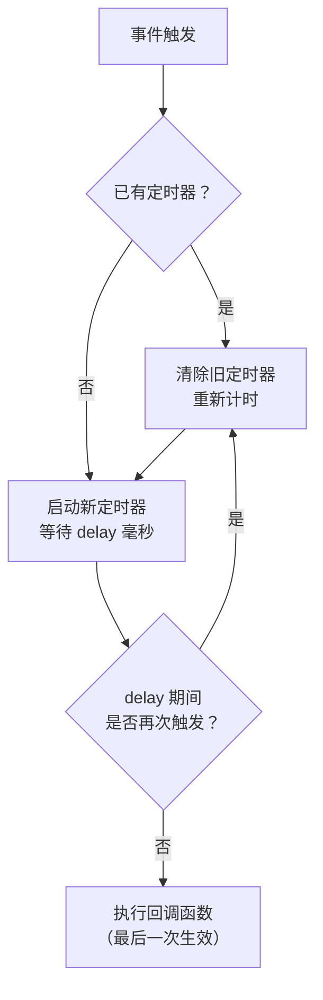
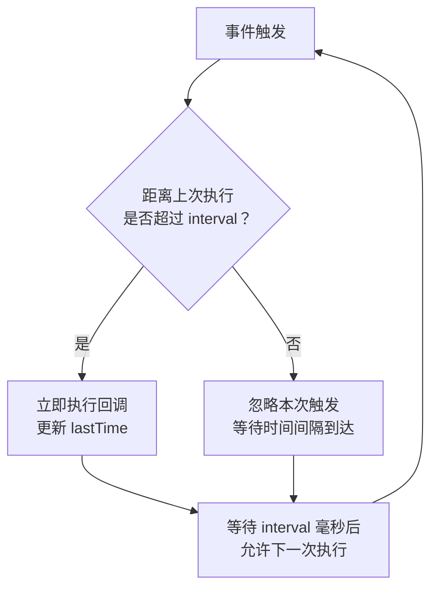

# 03-常用API与手写原理

> 模块：02-javascript-core（第2周 JavaScript 核心）
> 难度：★★★ 面试高频
> 前置知识：掌握 JavaScript 基本语法、原型、this、闭包

---

## 一、防抖（Debounce）与节流（Throttle）

> **本主题权威章节**（其他模块的同主题内容均指向此处）。

### 1.1 核心概念

**防抖**和**节流**都是优化高频事件触发性能的手段，但策略不同：

- **防抖（Debounce）**：在事件触发后等待一段时间，如果期间事件再次触发，则重新计时。只有**最后一次触发**生效。
- **节流（Throttle）**：在固定时间间隔内，事件**只执行一次**。无论触发多频繁，按固定频率执行。

### 1.2 底层原理与手写实现

#### 防抖（Debounce）

```javascript
/**
 * 防抖函数
 * @param {Function} fn - 需要防抖的函数
 * @param {number} delay - 延迟时间（毫秒）
 * @param {boolean} immediate - 是否立即执行
 * @returns {Function} 防抖后的函数
 */
function debounce(fn, delay = 300, immediate = false) {
  let timer = null;
  
  return function (...args) {
    const context = this;
    
    // 如果定时器存在，清除重新计时
    if (timer) clearTimeout(timer);
    
    if (immediate) {
      // 立即执行模式：第一次触发立即执行，之后在 delay 内不再执行
      const callNow = !timer;
      timer = setTimeout(() => {
        timer = null;
      }, delay);
      if (callNow) fn.apply(context, args);
    } else {
      // 延迟执行模式：最后一次触发后 delay 毫秒执行
      timer = setTimeout(() => {
        fn.apply(context, args);
        timer = null;
      }, delay);
    }
  };
}

// 使用示例
const handleInput = debounce((e) => {
  console.log('搜索:', e.target.value);
}, 500);

// 适用场景：搜索框输入、窗口 resize、按钮防止重复点击
```

#### 节流（Throttle）

```javascript
/**
 * 节流函数（时间戳版本）
 * @param {Function} fn - 需要节流的函数
 * @param {number} interval - 时间间隔（毫秒）
 * @returns {Function} 节流后的函数
 */
function throttle(fn, interval = 300) {
  let lastTime = 0;
  
  return function (...args) {
    const now = Date.now();
    if (now - lastTime >= interval) {
      lastTime = now;
      fn.apply(this, args);
    }
  };
}

/**
 * 节流函数（定时器版本，保证最后一次也执行）
 */
function throttleTimer(fn, interval = 300) {
  let timer = null;
  
  return function (...args) {
    const context = this;
    if (!timer) {
      timer = setTimeout(() => {
        fn.apply(context, args);
        timer = null;
      }, interval);
    }
  };
}

// 适用场景：滚动事件、鼠标移动、页面 resize
```

### 1.3 防抖 vs 节流 对比

| 对比维度 | 防抖（Debounce） | 节流（Throttle） |
|---------|-----------------|-----------------|
| 核心策略 | 重新计时，最后一次生效 | 固定频率，按时间间隔执行 |
| 执行次数 | 高频触发只执行一次 | 高频触发按固定间隔执行 |
| 典型场景 | 搜索框输入、表单验证、按钮防重复 | 滚动加载、鼠标拖拽、resize |
| 用户体验 | 等待用户操作完成 | 持续反馈 |

### 1.4 避坑指南

| 常见错误 | 现象 | 原因 | 解决方案 |
|---------|------|------|---------|
| 防抖和节流选错场景 | 搜索框每次输入都发请求 | 将节流用于搜索框 | 搜索框用防抖，滚动事件用节流 |
| 防抖函数中 this 丢失 | 回调函数中 this 为 undefined | 未绑定 this 上下文 | 保存 this 并使用 apply/call |
| 节流导致最后一次操作丢失 | 用户停止滚动后未加载最后数据 | 时间戳版本不保证最后一次执行 | 使用定时器版节流 |

**防抖与节流执行流程对比图：**

**防抖（Debounce）执行流程：**



> 防抖的核心逻辑是"每次触发都重置计时器"，只有事件停止触发超过 `delay` 毫秒后才执行回调。适用于搜索框输入等"等待用户操作完成"的场景。

**节流（Throttle）执行流程：**



> 节流的核心逻辑是"固定间隔检查"，每次触发时判断距离上次执行是否超过 `interval`，超过则执行，否则忽略。适用于滚动事件等"需要持续反馈"的场景。


> 📖 **参考链接**：
> - [MDN - setTimeout](https://developer.mozilla.org/zh-CN/docs/Web/API/setTimeout)
> - [MDN - window.requestAnimationFrame](https://developer.mozilla.org/zh-CN/docs/Web/API/Window/requestAnimationFrame)

---

## 二、深浅拷贝

### 2.1 核心概念

- **浅拷贝**（Shallow Copy）：只复制对象的第一层属性。如果属性是引用类型，则复制的是引用地址，原对象和副本共享同一个引用。
- **深拷贝**（Deep Copy）：递归复制对象的所有层级，创建完全独立的对象副本，修改副本不会影响原对象。

### 2.2 底层原理与手写实现

#### 浅拷贝实现

```javascript
// 方式1：Object.assign
const shallow1 = Object.assign({}, source);

// 方式2：展开运算符
const shallow2 = { ...source };

// 方式3：数组 slice/concat
const arrCopy = sourceArr.slice();

// 浅拷贝的局限性
const obj = { a: 1, b: { c: 2 } };
const copy = { ...obj };
copy.b.c = 999;
console.log(obj.b.c); // 999（原对象被修改！）
```

#### 深拷贝实现

```javascript
// 方式1：JSON 序列化（最简单但有局限性）
const deep1 = JSON.parse(JSON.stringify(source));

// JSON 方式的局限性：
// - 无法处理函数（被忽略）
// - 无法处理 undefined（被忽略）
// - 无法处理 Symbol（被忽略）
// - 无法处理 Date（转为字符串）
// - 无法处理 RegExp（转为空对象 {}）
// - 无法处理循环引用（直接报错）
// - 无法处理 Map/Set

// 方式2：手写递归深拷贝（处理循环引用、Date、RegExp、Map、Set）
function deepClone(obj, hash = new WeakMap()) {
  // null 和基本类型直接返回
  if (obj === null || typeof obj !== 'object') return obj;
  
  // 处理 Date
  if (obj instanceof Date) return new Date(obj);
  
  // 处理 RegExp
  if (obj instanceof RegExp) return new RegExp(obj);
  
  // 处理循环引用
  if (hash.has(obj)) return hash.get(obj);
  
  // 处理 Map
  if (obj instanceof Map) {
    const mapClone = new Map();
    hash.set(obj, mapClone);
    obj.forEach((value, key) => {
      mapClone.set(deepClone(key, hash), deepClone(value, hash));
    });
    return mapClone;
  }
  
  // 处理 Set
  if (obj instanceof Set) {
    const setClone = new Set();
    hash.set(obj, setClone);
    obj.forEach(value => {
      setClone.add(deepClone(value, hash));
    });
    return setClone;
  }
  
  // 处理数组和普通对象
  const cloneObj = Array.isArray(obj) ? [] : {};
  hash.set(obj, cloneObj);
  
  // 处理 Symbol 类型的 key
  Reflect.ownKeys(obj).forEach(key => {
    cloneObj[key] = deepClone(obj[key], hash);
  });
  
  return cloneObj;
}

// 测试
const test = {
  name: 'test',
  date: new Date(),
  reg: /test/gi,
  map: new Map([['key', 'value']]),
  set: new Set([1, 2, 3]),
  fn: function () { return 'hello'; },
  arr: [1, 2, { nested: true }],
};
test.self = test; // 循环引用

const cloned = deepClone(test);
console.log(cloned.name);      // 'test'
console.log(cloned.date);      // Date 对象
console.log(cloned.reg);       // RegExp 对象
console.log(cloned.map);       // Map 对象
console.log(cloned.self === cloned); // true（循环引用正确处理）
```

### 2.3 避坑指南

| 常见错误 | 现象 | 原因 | 解决方案 |
|---------|------|------|---------|
| 使用 JSON 方式深拷贝含函数的对象 | 函数丢失 | JSON 不支持函数序列化 | 使用手写递归深拷贝 |
| 深拷贝遇到循环引用导致栈溢出 | RangeError 错误 | 无限递归 | 使用 WeakMap 记录已拷贝对象 |
| 误以为 Object.assign 是深拷贝 | 修改嵌套属性影响原对象 | 只拷贝第一层 | 使用递归深拷贝 |
| 深拷贝丢失 Symbol 属性 | Symbol 属性丢失 | Object.keys 不遍历 Symbol | 使用 Reflect.ownKeys |

> 📖 **参考链接**：
> - [MDN - structuredClone](https://developer.mozilla.org/zh-CN/docs/Web/API/structuredClone)
> - [MDN - JSON](https://developer.mozilla.org/zh-CN/docs/Web/JavaScript/Reference/Global_Objects/JSON)

---

## 三、数组去重

### 3.1 核心概念

数组去重是前端开发中的常见需求，有多种实现方案，各有优劣。选择合适的方案取决于数据类型和对性能的要求。

### 3.2 多种方案对比

```javascript
const arr = [1, 2, 2, 3, 3, NaN, NaN, {}, {}, null, null, undefined, undefined];

// 方案1：Set（最简洁，推荐）
const unique1 = [...new Set(arr)];
// 优点：简洁高效；缺点：无法去重对象（引用不同），NaN 可以正确去重

// 方案2：filter + indexOf
const unique2 = arr.filter((item, index) => arr.indexOf(item) === index);
// 缺点：NaN 无法去重（indexOf 对 NaN 始终返回 -1），时间复杂度 O(n²)

// 方案3：Map（最强大，能处理 NaN）
function uniqueByMap(arr) {
  const map = new Map();
  return arr.filter(item => !map.has(item) && map.set(item, true));
}
// 优点：能处理 NaN；缺点：代码稍长

// 方案4：reduce + includes
const unique4 = arr.reduce((acc, cur) => {
  return acc.includes(cur) ? acc : [...acc, cur];
}, []);
// 优点：语义清晰；缺点：includes 能处理 NaN，但时间复杂度 O(n²)

// 方案5：对象属性去重（适用于基本类型）
function uniqueByObject(arr) {
  const seen = {};
  return arr.filter(item => {
    const key = typeof item + JSON.stringify(item);
    return seen[key] ? false : (seen[key] = true);
  });
}
// 优点：速度快；缺点：对于对象来说 JSON.stringify 可能不可靠（因为对象属性枚举顺序在 ES2015 后大部分有序，但跨引擎行为可能不一致，且新增属性后顺序会变化，导致 JSON.stringify 结果不稳定）

// 方案6：对象数组按属性去重
function uniqueByProperty(arr, key) {
  const seen = new Set();
  return arr.filter(item => {
    const value = item[key];
    if (seen.has(value)) return false;
    seen.add(value);
    return true;
  });
}
```

### 3.3 方案对比总结

| 方案 | 时间复杂度 | NaN 处理 | 对象去重 | 推荐场景 |
|------|-----------|---------|---------|---------|
| Set | O(n) | 正确 | 按引用 | 基本类型数组去重（首选） |
| filter + indexOf | O(n²) | 错误 | 按引用 | 不推荐 |
| Map | O(n) | 正确 | 按引用 | 需要兼容 NaN 时 |
| reduce + includes | O(n²) | 正确 | 按引用 | 小数组，语义优先 |
| 对象属性 | O(n) | 需处理 | 可自定义 | 需要自定义去重逻辑 |

> 📖 **参考链接**：
> - [MDN - Array](https://developer.mozilla.org/zh-CN/docs/Web/JavaScript/Reference/Global_Objects/Array)
> - [MDN - Array.prototype.map()](https://developer.mozilla.org/zh-CN/docs/Web/JavaScript/Reference/Global_Objects/Array/map)
> - [MDN - Array.prototype.reduce()](https://developer.mozilla.org/zh-CN/docs/Web/JavaScript/Reference/Global_Objects/Array/reduce)

---

## 四、函数柯里化（Currying）

### 4.1 核心概念

**函数柯里化**（Currying）是将一个接受多个参数的函数，转换成一系列每次只接受一个参数的函数的技术。核心思想是**利用闭包保存已传入的参数**，等参数收集完毕后执行原函数。

### 4.2 底层原理与手写实现

```javascript
/**
 * 通用柯里化函数
 * @param {Function} fn - 需要柯里化的函数
 * @returns {Function} 柯里化后的函数
 */
function curry(fn) {
  return function curried(...args) {
    // 参数数量足够时，直接执行原函数
    if (args.length >= fn.length) {
      return fn.apply(this, args);
    }
    // 参数不足时，返回一个新函数继续收集参数
    return function (...nextArgs) {
      return curried.apply(this, [...args, ...nextArgs]);
    };
  };
}

// 使用示例
const add = (a, b, c) => a + b + c;
const curriedAdd = curry(add);

console.log(curriedAdd(1)(2)(3));  // 6
console.log(curriedAdd(1, 2)(3));  // 6
console.log(curriedAdd(1)(2, 3));  // 6
console.log(curriedAdd(1, 2, 3));  // 6

// 实战：无限累加器
function sum(...args) {
  const total = args.reduce((a, b) => a + b, 0);
  
  function adder(...nextArgs) {
    if (nextArgs.length === 0) return total;
    return sum(...args, ...nextArgs);
  }
  
  return adder;
}

console.log(sum(1)(2)(3)(4)()); // 10
console.log(sum(1, 2)(3, 4)()); // 10
```

### 4.3 实战应用

```javascript
// 1. 参数复用
const multiply = (a, b) => a * b;
const double = curry(multiply)(2);
console.log(double(5)); // 10
console.log(double(10)); // 20

// 2. 延迟执行
const log = (date, type, message) => {
  console.log(`[${date}] ${type}: ${message}`);
};
const todayLog = curry(log)('2026-01-01');
const todayError = todayLog('ERROR');
todayError('服务器连接失败'); // [2026-01-01] ERROR: 服务器连接失败

// 3. 函数组合
const compose = (...fns) => (x) => fns.reduceRight((v, f) => f(v), x);
const pipe = (...fns) => (x) => fns.reduce((v, f) => f(v), x);
```

> 📖 **参考链接**：
> - [MDN - Function.prototype.bind()](https://developer.mozilla.org/zh-CN/docs/Web/JavaScript/Reference/Global_Objects/Function/bind)
> - [MDN - 闭包](https://developer.mozilla.org/zh-CN/docs/Web/JavaScript/Closures)

---

## 五、继承实现

### 5.1 核心概念

JavaScript 的继承本质上是**原型链**的扩展。ES5 和 ES6 提供了多种继承方式，各有优劣。

### 5.2 五种继承方式

```javascript
// 1. 原型链继承
function Parent() {
  this.colors = ['red', 'blue'];
}
Parent.prototype.getColors = function () {
  return this.colors;
};

function Child() {}
Child.prototype = new Parent();

// 问题：所有实例共享引用类型属性，无法向父类构造函数传参

// 2. 构造函数继承（借用构造函数）
function Child2(name) {
  Parent.call(this);
  this.name = name;
}
// 问题：无法继承父类原型上的方法

// 3. 组合继承（原型链 + 构造函数）
function Child3(name) {
  Parent.call(this); // 第二次调用 Parent
  this.name = name;
}
Child3.prototype = new Parent(); // 第一次调用 Parent
Child3.prototype.constructor = Child3;
// 问题：父类构造函数被调用两次

// 4. 寄生组合继承（最优方案）
function Child4(name) {
  Parent.call(this);
  this.name = name;
}
Child4.prototype = Object.create(Parent.prototype);
Child4.prototype.constructor = Child4;
// 优点：只调用一次父类构造函数，原型链正确

// 5. ES6 class extends（语法糖）
class Animal {
  constructor(name) {
    this.name = name;
  }
  
  speak() {
    console.log(`${this.name} 发出声音`);
  }
}

class Dog extends Animal {
  constructor(name, breed) {
    super(name); // 必须先调用 super
    this.breed = breed;
  }
  
  speak() {
    super.speak();
    console.log(`${this.name} 汪汪叫`);
  }
}

const dog = new Dog('旺财', '金毛');
dog.speak();
// 输出：
// 旺财 发出声音
// 旺财 汪汪叫
```

### 5.3 继承方式对比

| 继承方式 | 原型方法 | 实例属性 | 传参 | 父类调用次数 | 推荐度 |
|---------|---------|---------|------|-----------|--------|
| 原型链继承 | 继承 | 共享引用 | 不支持 | 1 | 低 |
| 构造函数继承 | 不继承 | 独立 | 支持 | 1 | 低 |
| 组合继承 | 继承 | 独立 | 支持 | 2 | 中 |
| 寄生组合继承 | 继承 | 独立 | 支持 | 1 | 高 |
| ES6 class | 继承 | 独立 | 支持 | 1 | 最高 |

---

## 六、JavaScript 垃圾回收

### 6.1 核心概念

**垃圾回收**（Garbage Collection, GC）是 JavaScript 引擎自动管理内存的机制。开发者不需要手动分配和释放内存。主要算法有两种：

- **引用计数**：跟踪每个值的引用次数，引用数为 0 时回收。无法处理循环引用。
- **标记清除**：从根对象（全局对象）出发，标记所有可达对象，清除未标记的对象。现代 JavaScript 引擎均使用此算法。

### 6.2 底层原理

#### V8 分代回收

V8 引擎将内存分为**新生代**（Young Generation）和**老生代**（Old Generation）：

| 分代 | 特点 | 算法 | 触发条件 |
|------|------|------|---------|
| 新生代 | 存储生命周期短的对象，1-8MB | **Scavenge**（Cheney 算法），复制存活对象到另一半空间 | 空间快满时触发 |
| 老生代 | 存储生命周期长的对象 | **Mark-Sweep**（标记清除）+ **Mark-Compact**（标记整理） | 老生代空间不足时触发 |

**对象晋升**：新生代中经历过一次 Scavenge 仍存活的对象，或 To 空间使用率超过 25% 时的对象，会晋升到老生代。

### 6.3 实战应用

```javascript
// 避免内存泄漏的实践

// 1. 及时清除定时器
let timer = setInterval(() => { /* ... */ }, 1000);
// 不再需要时
clearInterval(timer);
timer = null;

// 2. 移除事件监听
const handler = () => { /* ... */ };
element.addEventListener('click', handler);
// 组件销毁时
element.removeEventListener('click', handler);

// 3. 避免意外的全局变量
function badPractice() {
  leakedVar = '我会成为全局变量'; // 缺少 let/const/var
}
// 正确做法
function goodPractice() {
  const localVar = '我是局部变量';
}

// 4. 解除 DOM 引用
const elements = {
  button: document.getElementById('myButton'),
};
// 即使 DOM 元素从页面移除，elements.button 仍然持有引用
// 不再需要时
elements.button = null;
```

---

## 七、内存泄漏场景

> **本主题权威章节**（其他模块的同主题内容均指向此处）。

### 7.1 常见内存泄漏场景

| 泄漏场景 | 原因 | 示例 | 解决方案 |
|---------|------|------|---------|
| 全局变量 | 全局变量不会被 GC 回收 | `window.data = largeData` | 避免使用全局变量，使用 let/const |
| 未清理的定时器 | 定时器持有回调函数引用 | `setInterval` 未 clear | 组件销毁时清除定时器 |
| 闭包不当使用 | 闭包保留了外部函数的整个作用域 | 闭包引用大对象但只使用其中一小部分 | 用完后将引用置为 null |
| DOM 引用 | JavaScript 引用已移除的 DOM 元素 | 变量保存了 DOM 引用 | 移除 DOM 后同步清除 JS 引用 |
| 事件监听未移除 | 事件监听器持有函数引用 | addEventListener 未 remove | 组件销毁时移除所有监听器 |
|  detached DOM 树 | JS 引用了 DOM 节点但该节点已从 DOM 树移除 | 父节点被移除但子节点引用仍在 | 避免缓存 DOM 引用 |
| WebSocket/EventSource 未关闭 | 长连接持有引用 | 页面切换后 WebSocket 未关闭 | 页面离开时关闭连接 |

### 7.2 内存泄漏排查

```javascript
// 使用 Chrome DevTools 排查内存泄漏

// 1. Performance 面板：录制内存使用情况，观察是否存在持续上升的内存曲线
// 2. Memory 面板：
//    - Heap Snapshot：对比操作前后的堆快照，查找未释放的对象
//    - Allocation instrumentation on timeline：记录内存分配时间线
//    - Allocation sampling：按函数采样内存分配

// 3. Performance Monitor：实时监控 JS Heap Size、DOM Nodes 等指标

// 使用 WeakMap/WeakSet 避免内存泄漏
// WeakMap 的键是弱引用，不会阻止垃圾回收
const wm = new WeakMap();
let element = document.getElementById('app');
wm.set(element, { data: 'some data' });
element = null; // WeakMap 中的条目可以被 GC 回收
```

### 7.3 避坑指南

| 常见错误 | 现象 | 原因 | 解决方案 |
|---------|------|------|---------|
| 在 SPA 页面切换后内存持续增长 | 页面越来越卡 | 组件销毁时未清理副作用 | 在 useEffect/componentWillUnmount 中清理 |
| console.log 大对象导致内存泄漏 | 内存占用异常 | console 保留对象引用 | 生产环境移除 console.log |
| 闭包引用整个外部作用域 | 大对象无法被回收 | 闭包保存了整个作用域链 | 只保留需要的变量引用 |
| 使用普通 Map 存储 DOM 关联数据 | DOM 移除后数据仍在 | Map 的键是强引用 | 使用 WeakMap 替换 |

---

> **学习导航**：
> - 返回 [学习路线总览](../README.md)
> - 上一章：[02-异步编程与ES6+特性](./02-异步编程与ES6+特性.md)
> - 本模块上一篇：[01-语法基础与执行机制](./01-语法基础与执行机制.md)
> - 本模块后续：[04-JavaScript核心笔面试题集](./04-JavaScript核心笔面试题集.md)
> - 实战应用：[企业后台管理系统](../10-project/01-企业后台管理系统实战.md)

---

## 本章学习自检

- [ ] 能手写防抖函数（含立即执行选项）
- [ ] 能手写节流函数（时间戳版和定时器版）
- [ ] 能清晰区分防抖和节流的适用场景
- [ ] 能手写递归深拷贝（处理循环引用、Date、RegExp、Map、Set）
- [ ] 能列举 JSON 深拷贝的至少 5 个局限性
- [ ] 能用至少 3 种方案实现数组去重
- [ ] 能手写通用柯里化函数并理解其原理
- [ ] 能写出 5 种继承方式的完整代码
- [ ] 能解释寄生组合继承为何是最优方案
- [ ] 能解释 V8 分代回收的机制
- [ ] 能列举至少 5 种常见内存泄漏场景及解决方案
- [ ] 能解释 WeakMap 为何适合存储 DOM 关联数据
- [ ] 能手写简化版 EventEmitter 类
- [ ] 能区分纯函数与非纯函数并举例说明
- [ ] 能理解 compose 与 pipe 的函数组合思想
- [ ] 能区分声明式与命令式编程风格
- [ ] 能列举 Proxy 的 13 种 trap 及其拦截的操作
- [ ] 能解释 `Reflect` 相比 `Object` 的三个优势，并说出 `receiver` 参数的作用
- [ ] 能写出 `Proxy.revocable` 的使用方式与典型场景
- [ ] 能说出 Vue 3 用 Proxy 替代 `Object.defineProperty` 的至少 4 个理由
- [ ] 能列举 Proxy 的局限（私有字段、原始值、不变式、性能、身份比较）
- [ ] 能手写一个同时满足可迭代协议与迭代器协议的对象
- [ ] 能解释生成器 `next()` / `return()` / `throw()` 的行为与 `yield*` 委托
- [ ] 能说出 `for...of` 提前退出时调用 `return()` 的时机与用途
- [ ] 能使用 `async function*` + `for await...of` 处理异步迭代
- [ ] 能完整描述 Heap Snapshot 三快照法的步骤与"为什么要拍三次"
- [ ] 能说出 Detached DOM 的三种识别方法
- [ ] 能按"观测 → 分类 → 复现 → 拍摄 → 溯源 → 修复 → 验证"描述内存泄漏定位流程

---

## 补充：EventEmitter 模式与函数式编程

### 1. EventEmitter 模式（发布-订阅）

#### 1.1 核心概念

**EventEmitter** 是**发布-订阅模式**（Publish-Subscribe Pattern）的经典实现，在 Node.js 的 `events` 模块中广泛应用。其核心思想是：**事件发布者（Publisher）与事件消费者（Subscriber）之间通过事件名称进行解耦**，发布者只管触发事件，不需要知道谁在监听。

EventEmitter 提供的核心 API：

| API | 功能 | 说明 |
|-----|------|------|
| `on(event, listener)` | 注册事件监听 | 同一事件可注册多个监听函数，按注册顺序依次执行 |
| `emit(event, ...args)` | 触发事件 | 将参数传递给所有注册的监听函数 |
| `once(event, listener)` | 单次监听 | 监听函数执行一次后自动移除 |
| `removeListener(event, listener)` | 移除指定监听 | 移除指定事件的某个监听函数 |
| `removeAllListeners(event)` | 移除全部监听 | 移除指定事件的所有监听函数（不传参数则移除所有事件） |

#### 1.2 底层原理与手写实现

下面是一个简化版的 EventEmitter 类实现，用于教学说明发布-订阅模式的核心原理（与笔试题集中的完整手写题不同，此处侧重教学拆解）：

```javascript
/**
 * 简化版 EventEmitter 实现
 * 用于理解发布-订阅模式的核心原理
 */
class EventEmitter {
  constructor() {
    // 存储事件与监听函数列表的映射关系
    // 结构: { eventName: [ { fn, once }, ... ] }
    this._events = Object.create(null);
  }

  /**
   * 注册事件监听
   * @param {string} event - 事件名称
   * @param {Function} listener - 监听函数
   * @param {boolean} once - 是否只监听一次
   */
  _addListener(event, listener, once = false) {
    if (!this._events[event]) {
      this._events[event] = [];
    }
    this._events[event].push({ fn: listener, once });
    return this;
  }

  on(event, listener) {
    return this._addListener(event, listener, false);
  }

  once(event, listener) {
    return this._addListener(event, listener, true);
  }

  /**
   * 触发事件
   * @param {string} event - 事件名称
   * @param {...any} args - 传递给监听函数的参数
   */
  emit(event, ...args) {
    const listeners = this._events[event];
    if (!listeners || listeners.length === 0) return false;

    // 拷贝一份再遍历，避免在回调中修改监听列表导致遍历异常
    const listenersCopy = [...listeners];

    for (const item of listenersCopy) {
      item.fn.apply(this, args);

      // 如果是一次性监听，执行后从原始列表中移除
      if (item.once) {
        this.removeListener(event, item.fn);
      }
    }
    return true;
  }

  /**
   * 移除指定监听函数
   * 注意：需要匹配的是同一个函数引用
   */
  removeListener(event, listener) {
    const listeners = this._events[event];
    if (!listeners) return this;

    const index = listeners.findIndex(item => item.fn === listener);
    if (index !== -1) {
      listeners.splice(index, 1);
    }
    return this;
  }

  /**
   * 移除指定事件的所有监听函数
   * 不传 event 则清空所有事件
   */
  removeAllListeners(event) {
    if (event) {
      delete this._events[event];
    } else {
      this._events = Object.create(null);
    }
    return this;
  }
}

// 使用示例
const emitter = new EventEmitter();

// 注册普通监听
emitter.on('data', (msg) => {
  console.log('收到数据:', msg);
});

// 注册单次监听
emitter.once('ready', () => {
  console.log('初始化完成（只触发一次）');
});

emitter.emit('data', 'Hello');   // 输出: 收到数据: Hello
emitter.emit('ready');           // 输出: 初始化完成（只触发一次）
emitter.emit('ready');           // 无输出（已自动移除）
```

#### 1.3 使用场景

| 场景 | 说明 | 示例 |
|------|------|------|
| 组件间通信 | 非父子组件之间的数据传递 | Vue 2.x 的 `$on` / `$emit` / `$off`，React 中的事件总线 |
| 事件总线（EventBus） | 全局事件的发布与订阅 | 跨模块通信、全局状态变更通知 |
| Node.js 内置模块 | 大量 Node.js 核心模块基于 EventEmitter | `http.Server`、`fs.ReadStream`、`process` 等 |
| 自定义事件系统 | 第三方库或框架中的事件机制 | WebSocket 消息分发、游戏引擎中的事件系统 |

#### 1.4 与 DOM 事件的区别

| 对比维度 | EventEmitter | DOM 事件 |
|---------|-------------|---------|
| 事件传播 | 直接触发对应的监听函数，无传播过程 | 有捕获阶段、目标阶段、冒泡阶段 |
| 事件委托 | 不支持，监听器绑定在实例上 | 支持事件委托（利用冒泡机制） |
| 默认行为 | 无默认行为概念 | 可调用 `preventDefault()` 阻止默认行为 |
| 运行环境 | 主要在 Node.js 中使用，浏览器也可使用 | 仅限于浏览器环境 |
| 设计目的 | 解耦代码模块，实现异步通信 | 处理用户交互（点击、键盘、滚动等） |

> 📖 **参考链接**：
> - [MDN - EventTarget](https://developer.mozilla.org/zh-CN/docs/Web/API/EventTarget)
> - [MDN - Event](https://developer.mozilla.org/zh-CN/docs/Web/API/Event)

---

### 2. 函数式编程基础

#### 2.1 纯函数（Pure Function）

**纯函数**是函数式编程的基石，必须满足两个条件：
1. **相同输入始终产生相同输出**：不依赖任何外部可变状态，返回值仅由输入参数决定。
2. **无副作用**：不修改外部状态，不修改入参，不进行 I/O 操作等。

```javascript
// ===== 纯函数 vs 非纯函数对比 =====

// 非纯函数示例
let count = 0;
function impureIncrement() {
  count++;              // 修改了外部状态（副作用）
  return count;         // 返回值依赖外部变量 count
}
// 问题：相同调用 impureIncrement() 每次返回不同结果，不可预测

// 纯函数示例
function pureIncrement(num) {
  return num + 1;       // 仅依赖输入参数，不修改外部状态
}
// 优势：pureIncrement(5) 永远返回 6，完全可预测、可测试

// 非纯函数：修改了入参
function impureAddItem(arr, item) {
  arr.push(item);       // 直接修改了原数组！（副作用）
  return arr;
}
const original = [1, 2, 3];
impureAddItem(original, 4);
console.log(original);  // [1, 2, 3, 4] — 原数组被修改了

// 纯函数：返回新数组
function pureAddItem(arr, item) {
  return [...arr, item]; // 不修改原数组，返回新数组
}
const original2 = [1, 2, 3];
const newArr = pureAddItem(original2, 4);
console.log(original2); // [1, 2, 3] — 原数组不变
console.log(newArr);    // [1, 2, 3, 4]
```

#### 2.2 不可变性（Immutability）

**不可变性**是指数据一旦创建就不能被修改。如果需要变更，则创建一个新的数据副本。在 JavaScript 中实现不可变性的常用手段：

```javascript
// 1. Object.freeze — 浅冻结，禁止修改对象属性
const config = Object.freeze({
  apiUrl: 'https://api.example.com',
  timeout: 5000,
});
// config.timeout = 3000; // 严格模式下报错，非严格模式下静默失败

// 2. 展开运算符 — 创建浅拷贝而非修改原对象
const user = { name: 'Alice', age: 25 };
const updatedUser = { ...user, age: 26 }; // 新对象，user 不变

// 3. 数组的非破坏性方法（不修改原数组）
const nums = [1, 2, 3, 4, 5];

// map: 映射转换，返回新数组
const doubled = nums.map(n => n * 2);        // [2, 4, 6, 8, 10]

// filter: 过滤筛选，返回新数组
const evens = nums.filter(n => n % 2 === 0); // [2, 4]

// reduce: 累积计算，返回单一值
const sum = nums.reduce((acc, n) => acc + n, 0); // 15

// concat: 合并数组，返回新数组
const extended = nums.concat([6, 7]);        // [1,2,3,4,5,6,7]

// 4. 数组的破坏性方法（会修改原数组）— 函数式编程中应避免
// push、pop、shift、unshift、splice、sort、reverse 等
```

#### 2.3 高阶函数（Higher-Order Function）

**高阶函数**是指满足以下至少一个条件的函数：
- 接受一个或多个函数作为参数
- 返回一个函数作为结果

JavaScript 内置的数组方法 `map`、`filter`、`reduce` 就是典型的高阶函数——它们接受一个回调函数作为参数，对数组元素进行变换。

```javascript
// 高阶函数示例：自定义一个批量处理函数
function withLogging(fn) {
  // 返回一个新函数，给原函数包裹日志功能
  return function (...args) {
    console.log(`调用函数 ${fn.name}，参数:`, args);
    const result = fn.apply(this, args);
    console.log(`返回结果:`, result);
    return result;
  };
}

const loggedAdd = withLogging((a, b) => a + b);
loggedAdd(3, 5);
// 输出:
// 调用函数 ，参数: [3, 5]
// 返回结果: 8

// 另一个例子：once — 确保函数只执行一次
function once(fn) {
  let called = false;
  let result;
  return function (...args) {
    if (!called) {
      called = true;
      result = fn.apply(this, args);
    }
    return result;
  };
}
```

#### 2.4 函数组合：compose 与 pipe

函数组合是函数式编程的核心思想——**将多个小函数组合成一个新函数，数据依次流经每个函数进行变换**。

在本文第四章（函数柯里化）中已经给出了 `compose` 和 `pipe` 的实现代码（见 [实战应用](#43-实战应用) 第 3 点），此处不再重复。下面重点说明它们的概念和使用场景：

- **`compose`**：从右到左执行函数组合。`compose(f, g, h)(x)` 等价于 `f(g(h(x)))`，数据先经过 `h`，再经过 `g`，最后经过 `f`。
- **`pipe`**：从左到右执行函数组合。`pipe(f, g, h)(x)` 等价于 `h(g(f(x)))`，数据按书写顺序依次流经各个函数，更符合直觉的阅读顺序。

```javascript
// 基于已有的 compose 和 pipe 的使用示例

// 场景：处理用户输入字符串
const trim = (str) => str.trim();
const toLowerCase = (str) => str.toLowerCase();
const removeSpaces = (str) => str.replace(/\s+/g, '-');

// compose: 从右到左执行
// removeSpaces -> toLowerCase -> trim
const sanitizeWithCompose = compose(removeSpaces, toLowerCase, trim);
console.log(sanitizeWithCompose('  Hello World  ')); // "hello-world"

// pipe: 从左到右执行（阅读顺序更直观）
// trim -> toLowerCase -> removeSpaces
const sanitizeWithPipe = pipe(trim, toLowerCase, removeSpaces);
console.log(sanitizeWithPipe('  Hello World  ')); // "hello-world"

// 函数组合的核心价值：
// 1. 每个函数只做一件事，职责单一
// 2. 通过组合现有函数创建新功能，无需重复编写逻辑
// 3. 数据流清晰可追踪，易于调试和维护
```

#### 2.5 声明式 vs 命令式编程

函数式编程推崇**声明式**风格，与传统的**命令式**风格形成鲜明对比：

```javascript
const numbers = [1, 2, 3, 4, 5, 6, 7, 8, 9, 10];

// ===== 命令式编程 =====
// 强调"如何做"：一步步告诉计算机执行步骤
function getEvenDoubledImperative(arr) {
  const result = [];
  for (let i = 0; i < arr.length; i++) {
    if (arr[i] % 2 === 0) {
      result.push(arr[i] * 2);
    }
  }
  return result;
}
console.log(getEvenDoubledImperative(numbers)); // [4, 8, 12, 16, 20]

// ===== 声明式编程 =====
// 强调"做什么"：描述想要的结果，不关心内部实现细节
function getEvenDoubledDeclarative(arr) {
  return arr
    .filter(n => n % 2 === 0)  // 筛选偶数
    .map(n => n * 2);           // 翻倍
}
console.log(getEvenDoubledDeclarative(numbers)); // [4, 8, 12, 16, 20]
```

| 对比维度 | 命令式编程 | 声明式编程 |
|---------|-----------|-----------|
| 关注点 | **如何做**（How） | **做什么**（What） |
| 代码风格 | 逐步指令，手动控制流程 | 表达意图，组合已有抽象 |
| 可读性 | 需要跟踪每一步状态变化 | 语义清晰，一目了然 |
| 可维护性 | 修改逻辑需要调整流程控制 | 增删变换步骤即可 |
| 副作用 | 通常有中间变量和状态变更 | 函数式风格下无副作用 |
| 典型代码 | `for` 循环、`if-else` 分支、手动变量累积 | `map`、`filter`、`reduce` 链式调用 |

**函数式编程的核心价值总结：**

1. **可预测性**：纯函数保证相同输入始终产生相同输出，易于测试和调试。
2. **可维护性**：每个函数职责单一、无副作用，修改一处不影响其他地方。
3. **可组合性**：通过 compose/pipe 将小函数组合成复杂逻辑，代码复用率极高。

---

## 补充：Proxy、迭代器与内存排查方法论

> 本节补齐三个高频但前文未覆盖的主题：`Proxy` / `Reflect` 元编程、迭代器与生成器协议、DevTools Memory 内存排查方法论。前两者是框架底层原理（Vue 3 响应式、redux-saga）的基础，后者是内存泄漏章节的实操延伸。

### 1. Proxy 与 Reflect 原理

#### 1.1 核心概念

**`Proxy`** 是 ES6 提供的**元编程**能力：它包装一个目标对象（`target`），通过处理器（`handler`）中定义的**陷阱（trap）**拦截对目标对象的底层操作（读属性、写属性、`in`、`delete`、`new` 等）。

```javascript
const proxy = new Proxy(target, handler);
// target：被代理的目标对象（可以是对象、数组、函数）
// handler：定义各种 trap 的对象，未定义的 trap 走默认行为
```

**`Reflect`** 是一个内置对象，提供 13 个与 trap **一一对应**的静态方法，用于在 trap 中执行被拦截操作的**默认行为**。它常与 `Proxy` 配合使用，是"转发默认行为"的标准写法。

#### 1.2 底层原理：13 种 trap

| # | Trap | 拦截的操作 | 方法签名 |
|:---:|------|-----------|---------|
| 1 | `get` | 读取属性 | `(target, property, receiver)` |
| 2 | `set` | 写入属性 | `(target, property, value, receiver)` |
| 3 | `has` | `in` 操作符 | `(target, property)` |
| 4 | `deleteProperty` | `delete` 操作符 | `(target, property)` |
| 5 | `ownKeys` | `Object.keys` / `getOwnPropertyNames` / `getOwnPropertySymbols` / `Reflect.ownKeys` / `for...in` | `(target)` |
| 6 | `getOwnPropertyDescriptor` | `Object.getOwnPropertyDescriptor` | `(target, property)` |
| 7 | `defineProperty` | `Object.defineProperty` / `Object.defineProperties` | `(target, property, descriptor)` |
| 8 | `getPrototypeOf` | `Object.getPrototypeOf` / `instanceof` / `__proto__` | `(target)` |
| 9 | `setPrototypeOf` | `Object.setPrototypeOf` | `(target, prototype)` |
| 10 | `isExtensible` | `Object.isExtensible` | `(target)` |
| 11 | `preventExtensions` | `Object.preventExtensions` / `Object.seal` / `Object.freeze` | `(target)` |
| 12 | `apply` | 函数调用（`target` 必须是可调用对象） | `(target, thisArg, argumentsList)` |
| 13 | `construct` | `new` 操作（`target` 必须是构造函数） | `(target, argumentsList, newTarget)` |

> 记忆技巧：13 种 trap 恰好覆盖了 `Reflect` 的 13 个方法，也覆盖了 `Object` 上所有"内部方法"（`[[Get]]`、`[[Set]]`、`[[HasProperty]]` 等）暴露出来的接口。

**`Reflect` 相比 `Object` 的三个优势**：

1. **返回值更合理**：`Reflect.defineProperty` / `Reflect.set` / `Reflect.deleteProperty` 返回布尔值表示成功与否；而 `Object.defineProperty` 失败时直接抛 `TypeError`。
2. **参数顺序统一**：所有方法都是 `(target, ...)` 开头，便于封装转发；而 `Object` 的方法签名各不相同（`Object.defineProperty(obj, key, desc)` 与 `Object.getOwnPropertyDescriptor(obj, key)`）。
3. **`receiver` 参数**：`Reflect.get(target, key, receiver)` / `Reflect.set(...)` 支持指定 `receiver`，从而正确转发原型链上访问器（getter / setter）中的 `this`。

```javascript
// Reflect 是"函数式"的 Object：用返回值替代抛异常，便于条件判断
const ok = Reflect.defineProperty(obj, 'a', { value: 1 });
if (!ok) {
  // 处理失败，而不是捕获异常
}

// Reflect.ownKeys 一次性拿到字符串键 + Symbol 键 + 不可枚举键
const obj2 = { a: 1, [Symbol('s')]: 2 };
console.log(Reflect.ownKeys(obj2));        // ['a', Symbol(s)]
console.log(Object.keys(obj2));            // ['a']（只有可枚举的字符串键）
```

**`receiver` 参数的作用**：当通过代理访问一个**继承来的 getter** 时，getter 内部的 `this` 应当指向代理对象，否则 getter 内部对属性的访问会绕过代理，导致拦截失效（Vue 3 的依赖收集正是依赖这一点）。

```javascript
const target = {
  _count: 0,
  get count() {
    return this._count;   // this 指向谁，决定了 _count 的读取能否被代理拦截
  },
};

const proxy = new Proxy(target, {
  get(t, key, receiver) {
    console.log('拦截 get:', key);
    return Reflect.get(t, key, receiver);   // 传 receiver，让 getter 中的 this 指向 proxy
  },
});

console.log(proxy.count);
// 输出：拦截 get: count → 拦截 get: _count → 0

// 如果写成 Reflect.get(t, key)（不传 receiver）：
// getter 中的 this 是 target，_count 的读取绕过代理，
// 只会打印一次 "拦截 get: count"，依赖收集会漏掉 _count
```

#### 1.3 可撤销代理（`Proxy.revocable`）

`Proxy.revocable(target, handler)` 返回 `{ proxy, revoke }`。调用 `revoke()` 后代理失效，任何操作都会抛 `TypeError`。

```javascript
const { proxy, revoke } = Proxy.revocable({ name: 'Alice' }, {});

console.log(proxy.name);   // 'Alice'
revoke();
// proxy.name;             // TypeError: Cannot perform 'get' on a proxy that has been revoked

// 典型用途：把对象临时交给第三方库，用完立即收回访问权
function withTempAccess(resource, task) {
  const { proxy, revoke } = Proxy.revocable(resource, {});
  try {
    return task(proxy);
  } finally {
    revoke();   // 无论成功失败都收回权限
  }
}
```

#### 1.4 实战应用：Vue 3 为什么用 Proxy 替代 `Object.defineProperty`

Vue 2 用 `Object.defineProperty` 逐个劫持属性的 `get` / `set`，Vue 3 改用 `Proxy` 代理整个对象。核心差异如下：

| 对比维度 | Vue 2（`Object.defineProperty`） | Vue 3（`Proxy`） |
|---------|--------------------------------|-----------------|
| 新增属性 | **无法监听**，必须用 `Vue.set` / `$set` | 自动监听，直接赋值即可响应 |
| 删除属性 | **无法监听**，必须用 `Vue.delete` / `$delete` | 自动监听 `delete` |
| 数组索引赋值 / 修改 `length` | **无法监听**，只能重写 `push` / `pop` 等 7 个数组方法 | 自动监听 |
| `Map` / `Set` / `WeakMap` / `WeakSet` | 不支持 | 原生支持 |
| 初始化开销 | 必须递归遍历所有属性逐个劫持，属性越多越慢 | **惰性代理**，访问到嵌套对象时才递归代理 |
| 拦截能力 | 只能拦截 `get` / `set` | 13 种 trap，覆盖 `in`、`delete`、`ownKeys` 等 |
| 浏览器兼容 | ES5，可兼容 IE9+ | ES6，**无法 polyfill**（Vue 3 因此不支持 IE11）（历史兼容场景，2026 年新项目按现代浏览器基线） |

```javascript
/**
 * 简化版响应式系统：用 Proxy 的 get / set / deleteProperty 实现
 * 依赖收集 + 派发更新（真实 Vue 3 使用 targetMap + effect 栈，此处为教学简化版）
 */
let activeEffect = null;

function effect(fn) {
  activeEffect = fn;
  fn();                 // 立即执行一次，触发 get 完成依赖收集
  activeEffect = null;
}

function reactive(target) {
  const depsMap = new Map();   // key -> Set<effect>

  return new Proxy(target, {
    get(t, key, receiver) {
      // 依赖收集：记录当前正在执行的 effect
      if (activeEffect) {
        let deps = depsMap.get(key);
        if (!deps) depsMap.set(key, (deps = new Set()));
        deps.add(activeEffect);
      }
      // 用 receiver 保证 getter 中的 this 指向代理，嵌套属性也能被拦截
      const value = Reflect.get(t, key, receiver);
      // 惰性代理：只在访问到嵌套对象时才递归创建代理
      return typeof value === 'object' && value !== null ? reactive(value) : value;
    },

    set(t, key, value, receiver) {
      const oldValue = t[key];
      const result = Reflect.set(t, key, value, receiver);
      if (oldValue !== value) {
        // 派发更新：通知该 key 对应的所有 effect 重新执行
        depsMap.get(key)?.forEach(fn => fn());
      }
      return result;   // set trap 必须返回布尔值，返回 false 在严格模式下抛 TypeError
    },

    deleteProperty(t, key) {
      const hadKey = Object.prototype.hasOwnProperty.call(t, key);
      const result = Reflect.deleteProperty(t, key);
      if (hadKey && result) {
        depsMap.get(key)?.forEach(fn => fn());
      }
      return result;
    },
  });
}

// 使用示例
const state = reactive({ count: 0 });
effect(() => console.log('count =', state.count));
state.count++;        // 打印 "count = 1"（自动触发更新）
state.newField = 1;   // Vue 2 需要 $set，Proxy 方案自动监听
delete state.count;   // Vue 2 需要 $delete，Proxy 方案自动监听
```

#### 1.5 Proxy 的局限

| 局限 | 说明 | 影响 |
|------|------|------|
| **无法拦截内部私有访问** | class 的私有字段 `#x` 完全不可拦截（规范规定私有字段访问不触发 trap）；闭包中保存的变量访问也不经过代理 | 使用 `#private` 的类无法被完整代理 |
| **无法代理原始值** | `new Proxy('str', {})` 抛 `TypeError`，`target` 必须是对象 | 需要包装成对象才能代理 |
| **必须满足不变式（invariants）** | trap 返回值必须与 `target` 真实状态一致，否则抛 `TypeError`。例如 `target` 不可扩展时 `ownKeys` 必须返回全部键 | 不当实现会直接报错，而非静默失败 |
| **性能开销** | 每次属性访问多一层函数调用，比原生访问慢；代理层级越深越明显 | 不适合高频访问的热路径（如逐帧遍历大数组） |
| **身份比较问题** | `proxy !== target`，作为 `Map` / `Set` 的键时会与 `target` 视为不同键 | 需要统一使用代理对象作为键 |
| **`this` 指向问题** | 直接调用代理上的方法时 `this` 是代理；若方法内部访问 `#private` 字段会抛 `TypeError` | 私有字段 + Proxy 组合需要 `bind` 或改写为闭包变量 |
| **无法 polyfill** | ES6 特性，IE 完全不支持 | 这是 Vue 3 放弃 IE11 支持的原因之一（历史兼容场景，2026 年新项目按现代浏览器基线） |

```javascript
// 不变式违反示例：target 不可扩展，ownKeys 不能报告不存在的键
const frozen = Object.freeze({ a: 1 });
const badProxy = new Proxy(frozen, {
  ownKeys() {
    return ['a', 'b'];   // 'b' 不存在，违反不变式
  },
});
// Object.keys(badProxy);   // TypeError: 'ownKeys' on proxy: trap returned extra keys...

// 私有字段 + Proxy 的典型报错
class Counter {
  #count = 0;
  increment() {
    return ++this.#count;   // this 必须是真正的实例
  }
}
const counterProxy = new Proxy(new Counter(), {});
// counterProxy.increment();
// TypeError: Cannot read private member #count from an object whose class did not declare it
// 解决：new Proxy(instance, { get: (t, k) => (typeof t[k] === 'function' ? t[k].bind(t) : t[k]) })
```

> 📖 **参考链接**：
> - [MDN - Proxy](https://developer.mozilla.org/zh-CN/docs/Web/JavaScript/Reference/Global_Objects/Proxy)
> - [MDN - Reflect](https://developer.mozilla.org/zh-CN/docs/Web/JavaScript/Reference/Global_Objects/Reflect)

---

### 2. 迭代器与生成器协议

#### 2.1 核心概念

| 协议 | 要求 | 说明 |
|------|------|------|
| **可迭代协议**（Iterable） | 对象实现 `[Symbol.iterator]()`，返回一个迭代器 | 使对象能被 `for...of`、展开运算符、解构消费 |
| **迭代器协议**（Iterator） | 对象有 `next()` 方法，返回 `{ value, done }` | 可选实现 `return(value)` 与 `throw(error)` |
| **异步可迭代协议** | 对象实现 `[Symbol.asyncIterator]()` | 配合 `for await...of` 使用 |

**内置可迭代对象**：`Array`、`String`、`Map`、`Set`、`TypedArray`、`arguments`、`NodeList`、生成器对象。**普通对象不是可迭代对象**（没有实现 `Symbol.iterator`）。

#### 2.2 底层原理

**`for...of` 的执行流程**：

1. 调用 `obj[Symbol.iterator]()` 获取迭代器
2. 反复调用 `iterator.next()`，把返回的 `value` 赋给循环变量
3. `done` 为 `true` 时退出循环
4. **提前退出（`break` / `return` / 抛异常）时，会调用迭代器的 `return()` 方法**用于资源清理

**生成器函数（`function*`）的机制**：

- 调用生成器函数**不会执行函数体**，而是返回一个**生成器对象**；该对象同时是迭代器和可迭代对象
- 执行到 `yield` 时**暂停**并交出一个值；下次 `next(v)` 时从暂停处恢复，且 `v` 会成为**上一个 `yield` 表达式的求值结果**（双向通信）
- `yield*` 把执行**委托**给另一个可迭代对象，逐个产出其值，并把该可迭代对象的**返回值**作为 `yield*` 表达式的值
- `return(v)`：在暂停处注入 `return`，触发 `finally` 块，返回 `{ value: v, done: true }`
- `throw(e)`：在暂停处抛出错误，若生成器内部未捕获则传播到调用方
- 生成器内部 `return v` 时，返回 `{ value: v, done: true }`

**消费可迭代对象的 API**：`for...of`、`for await...of`、展开运算符 `[...x]`、数组解构 `const [a, b] = x`、`Array.from(x)`、`new Map(entries)`、`new Set(arr)`、`Promise.all(iterable)`、`yield*`。

**手写可迭代对象**：

```javascript
/**
 * 手写可迭代对象：同时实现可迭代协议与迭代器协议
 */
const range = {
  from: 1,
  to: 5,

  [Symbol.iterator]() {
    let current = this.from;      // 闭包保存迭代状态
    const last = this.to;

    return {
      next() {
        return current <= last
          ? { value: current++, done: false }
          : { value: undefined, done: true };
      },
      // 让迭代器自身也可迭代：这样 [...range] 与连续 for...of 都能工作
      [Symbol.iterator]() { return this; },
    };
  },
};

console.log([...range]);              // [1, 2, 3, 4, 5]
console.log(Array.from(range));       // [1, 2, 3, 4, 5]
const [first, second] = range;        // 解构同样消费迭代器协议
console.log(first, second);           // 1 2
```

**生成器与 `next()` 双向通信**：

```javascript
function* gen() {
  console.log('开始执行');
  const a = yield 1;          // 第一次 next() 执行到这里暂停，返回 { value: 1 }
  console.log('收到 a =', a); // a 来自第二次 next(v) 的实参
  const b = yield 2;
  console.log('收到 b =', b);
  return a + b;               // 生成器内 return 的值作为最后一次的 value
}

const it = gen();
it.next();       // 打印 "开始执行"，返回 { value: 1, done: false }
it.next(10);     // 打印 "收到 a = 10"，返回 { value: 2, done: false }
it.next(20);     // 打印 "收到 b = 20"，返回 { value: 30, done: true }
it.next();       // { value: undefined, done: true } —— done 后固定返回该结果
```

**`yield*` 委托**：

```javascript
function* inner() {
  yield 'a';
  yield 'b';
  return 'inner-done';        // 该返回值会成为 yield* 表达式的结果
}

function* outer() {
  const result = yield* inner();   // 委托：依次产出 'a'、'b'
  console.log('inner 的返回值：', result);   // 'inner-done'
  yield 'c';
}

console.log([...outer()]);
// 打印 "inner 的返回值：inner-done"
// 输出 ['a', 'b', 'c']
```

**`return()` / `throw()` 与资源清理**：

```javascript
function* cleanup() {
  try {
    yield 1;
    yield 2;
  } finally {
    console.log('执行清理逻辑');   // 无论正常结束还是提前终止都会执行
  }
}

// 1. 显式调用 return()：注入 return，触发 finally
const g1 = cleanup();
g1.next();            // { value: 1, done: false }
g1.return(99);        // 打印 "执行清理逻辑"，返回 { value: 99, done: true }

// 2. throw()：在暂停处抛出错误，finally 仍会执行，错误传播到调用方
const g2 = cleanup();
g2.next();
try {
  g2.throw(new Error('外部注入的错误'));
} catch (e) {
  console.log('捕获到：', e.message);
}

// 3. for...of 提前 break：自动调用迭代器的 return()
for (const v of cleanup()) {
  if (v === 1) break;   // 打印 "执行清理逻辑"
}
```

**异步迭代（`Symbol.asyncIterator`）**：

```javascript
/**
 * 异步生成器：async function* 产出的对象实现 Symbol.asyncIterator
 */
async function* fetchPages(urls) {
  for (const url of urls) {
    const res = await fetch(url);
    yield res.json();          // 每次 yield 产出一个 Promise
  }
}

// 消费：for await...of 会自动 await 每个 next() 的结果
for await (const page of fetchPages(['/api/p1', '/api/p2'])) {
  console.log(page);
}

// 手动消费：next() 返回 Promise<{ value, done }>
const asyncIt = fetchPages(['/api/p1'])[Symbol.asyncIterator]();
const { value, done } = await asyncIt.next();
```

#### 2.3 实战应用

| 场景 | 说明 |
|------|------|
| 惰性求值 / 无限序列 | 生成器按需产出，不会一次性占用内存（如分页加载、ID 生成器） |
| 可中断的遍历 | 用 `next()` 手动控制推进节奏，适合动画帧、游戏循环 |
| 递归结构遍历 | 用 `yield*` 递归委托遍历树，代码接近深度优先搜索的自然写法 |
| 异步流程控制 | redux-saga、早期 `co` 库都基于生成器实现"用同步写法写异步逻辑" |
| 自定义数据结构 | 为链表、树、矩阵实现 `Symbol.iterator`，使其支持 `for...of` 与展开运算符 |

```javascript
/**
 * 用 yield* 递归遍历树：无需手动维护栈
 */
function* walk(node) {
  yield node.value;
  for (const child of node.children || []) {
    yield* walk(child);        // 递归委托给子树的迭代器
  }
}

const tree = {
  value: 1,
  children: [
    { value: 2, children: [{ value: 4 }] },
    { value: 3 },
  ],
};

console.log([...walk(tree)]);   // [1, 2, 4, 3]
```

#### 2.4 面试常见问法

- **什么是可迭代对象？** 实现了 `[Symbol.iterator]()` 并返回迭代器的对象。数组、字符串、`Map`、`Set`、`arguments`、`NodeList` 都是内置可迭代对象，**普通对象不是**。
- **`for...of` 和 `for...in` 的区别？** `for...of` 走迭代器协议，遍历**值**；`for...in` 遍历**可枚举属性键**（字符串键，且会沿原型链查找）。
- **普通对象为什么不能用 `for...of`？** 没有实现 `Symbol.iterator`。可以改用 `Object.entries(obj)` / `Object.values(obj)`，或手动为对象实现 `Symbol.iterator`。
- **生成器函数和普通函数的区别？** 调用生成器函数不执行函数体，而是返回生成器对象；可通过 `next` / `return` / `throw` 双向通信；支持暂停与恢复，天然适合惰性求值。
- **`yield` 和 `return` 的区别？** `yield` 可以多次暂停并交出值，生成器仍可继续；`return` 直接结束生成器，其值作为 `{ value, done: true }`。
- **`next()` 的参数有什么作用？** 作为**上一个 `yield` 表达式**的求值结果；第一次 `next()` 的实参会被丢弃（此时没有"上一个 `yield`"）。
- **迭代器的 `return()` 什么时候被调用？** `for...of` 提前退出（`break` / `return` / 抛异常）或显式调用时；用于资源清理，在生成器内部表现为执行 `finally` 块。
- **如何让一个对象支持展开运算符？** 实现 `Symbol.iterator`。展开运算符消费的是可迭代协议，不是迭代器协议。

#### 2.5 避坑指南

| 常见错误 | 现象 | 原因 | 解决方案 |
|---------|------|------|---------|
| 普通对象直接用 `for...of` | `TypeError: obj is not iterable` | 普通对象未实现 `Symbol.iterator` | 用 `Object.keys` / `entries` / `values` 转换，或为对象实现 `Symbol.iterator` |
| 迭代器未实现 `Symbol.iterator` | 迭代器无法被展开运算符消费 | 展开运算符要求参数是**可迭代对象**，而非仅迭代器 | 在迭代器上补 `[Symbol.iterator]() { return this; }` |
| 首次 `next()` 传参 | 参数"凭空消失" | 第一次 `next` 没有对应的 `yield` 表达式接收 | 首次调用不传参，或改用外部变量初始化 |
| `done` 之后继续 `next()` | 结果与预期不符 | 规范要求 `done` 后持续返回 `{ value: undefined, done: true }` | 迭代器实现中固定返回该结果 |
| 提前退出时资源未释放 | 连接、定时器泄漏 | 未实现 `return()` 或生成器内没有 `try/finally` | 用生成器 + `try/finally`，或手动实现 `return()` |
| 把生成器对象当可复用迭代器 | 第二次遍历结果为空 | 生成器对象是**一次性**的，遍历完即 `done` | 每次遍历重新调用生成器函数获取新对象 |

> 📖 **参考链接**：
> - [MDN - 迭代协议](https://developer.mozilla.org/zh-CN/docs/Web/JavaScript/Reference/Iteration_protocols)
> - [MDN - function*](https://developer.mozilla.org/zh-CN/docs/Web/JavaScript/Reference/Statements/function*)

---

### 3. DevTools Memory 内存排查方法论

#### 3.1 核心概念

Chrome DevTools 的 **Memory** 面板提供三种分析工具，配合 **Performance Monitor** 形成完整的内存排查链路：

| 工具 | 特点 | 适用场景 |
|------|------|---------|
| **Heap Snapshot**（堆快照） | 记录某一时刻堆中所有对象的完整信息 | 精确定位泄漏对象与引用链 |
| **Allocation instrumentation on timeline**（分配时间线） | 记录每次内存分配及其调用栈，开销大 | 短时间、需要精确调用栈的排查 |
| **Allocation sampling**（分配采样） | 按间隔采样，开销小 | 长时间录制，找出"分配大户" |

**关键指标**：

- **Shallow Size**：对象自身占用的内存，不含其引用的对象
- **Retained Size**：释放该对象后可回收的**总内存**（含其独占引用的所有对象）——判断泄漏影响看这个
- **Distance**：从 GC 根到该对象的最短引用层级
- **Detached DOM tree**：节点已从文档树移除，但 JS 仍持有引用，导致整棵子树无法回收

#### 3.2 底层原理：Heap Snapshot 三快照法

**为什么必须拍三次？** 单张快照无法区分"**一次性缓存**"和"**真正的泄漏**"。缓存只在第一次操作时增长，第二次不再增长；泄漏则每次操作都留下无法回收的对象。三快照法用"**两次增量**"过滤掉缓存噪音。

**操作步骤**：

1. 打开页面，完成基础操作后，点击 Memory 面板左上角的**垃圾桶图标**（Collect garbage）强制 GC，拍摄 **Snapshot 1**（基线）
2. 执行**一次**可疑操作（打开并关闭弹窗 / 路由往返切换一次），再次强制 GC，拍摄 **Snapshot 2**
3. **重复同样的操作**，再次强制 GC，拍摄 **Snapshot 3**
4. 在 Snapshot 3 顶部的视图下拉框中选择 **Comparison**，与 Snapshot 2 对比；或直接在 **Summary** 视图查看 `# Delta` / `Size Delta` 列
5. **判定规则**：只有在两次增量中都**持续增长**的 Constructor 才是泄漏
6. 选中可疑 Constructor，展开 **Retainers**（引用持有者）面板，**从下往上**追溯引用链直到 GC 根（`Window` / `Document` / 全局变量），找到"是谁在持有它"

```javascript
// ===== 在 DevTools Console 中执行（需保持 DevTools 打开）=====

// 1. 统计当前存活的 DOM 元素对象数量
//    反复执行可疑操作后若数量只增不减，即为泄漏
queryObjects(HTMLElement).length;

// 2. 统计已经脱离文档树的"孤儿节点"数量（detached DOM）
queryObjects(HTMLElement).filter(el => !document.contains(el)).length;
```

#### 3.3 Allocation Timeline 与 Detached DOM 识别

**Allocation instrumentation on timeline**：录制期间，**蓝条**表示新分配且仍存活的内存，**灰条**表示已被回收的分配。

- 蓝条持续堆积且不回落 → 存在泄漏
- 点击蓝条可查看分配时的**函数调用栈**，直接定位到代码行
- 缺点：记录每次分配，开销大，只适合短时间录制

**Allocation sampling**：按间隔采样，开销小，适合长时间录制；结果按函数维度汇总内存分配量，用于找出"分配大户"（注意：分配多不等于泄漏）。

**Detached DOM 识别方法**：

| 方法 | 操作 | 判断依据 |
|------|------|---------|
| Heap Snapshot 搜索 | 在 Summary 视图的过滤框中输入 `Detached` | 出现 `Detached HTMLDivElement` 等条目即为孤儿节点 |
| Console API | 执行 `queryObjects(HTMLElement).filter(el => !document.contains(el)).length` | 反复操作后数值持续增长 |
| Performance Monitor | 观察 `DOM Nodes` 计数 | 操作后不回落、持续增长 |
| Retainers 面板 | 选中 detached 节点后展开引用链 | 定位持有引用的 JS 变量 / Map / 闭包 |

```javascript
// 用 WeakMap 存储 DOM 关联数据：键是弱引用，DOM 被回收时数据自动释放
const dataCache = new WeakMap();

function bindData(element, data) {
  dataCache.set(element, data);   // 不会阻止 element 被 GC 回收
}

// 反例：用 Map 或直接挂在元素属性上，都会形成强引用
const badCache = new Map();       // 必须手动 delete 才能释放，否则一直持有

// 反例：缓存 DOM 引用后未清理，造成 detached DOM
const refs = {
  button: document.getElementById('submit'),
};
document.body.removeChild(document.getElementById('submit'));   // DOM 已移除
// 但 refs.button 仍持有引用 → 该节点及整棵子树无法回收
refs.button = null;               // 必须手动解除引用
```

#### 3.4 内存泄漏定位流程（闭环）

| 步骤 | 操作 | 产出 |
|:---:|------|------|
| 1. 观测 | 打开 **Performance Monitor**，观察 JS heap size、DOM Nodes、JS event listeners 三条曲线 | 确认是否存在持续增长 |
| 2. 分类 | 按增长的指标判断泄漏类型 | DOM Nodes → detached DOM / 未移除节点；Event Listeners → 监听未移除；JS heap → 闭包 / 缓存 / 定时器 / 大对象 |
| 3. 复现 | 确定最小复现操作（打开-关闭弹窗、路由切换、列表增删） | 可稳定复现的操作序列 |
| 4. 拍摄 | 用**三快照法**拍摄并对比 | 锁定 Delta 持续为正的 Constructor |
| 5. 溯源 | 查看 **Retainers** 链，从下往上追到 GC 根 | 定位持有引用的根路径（全局变量 / 闭包 / 监听 / 定时器 / Map） |
| 6. 修复 | 移除监听、清理定时器、置 `null`、改用 `WeakMap`、在卸载钩子中清理 | 代码修复 |
| 7. 验证 | 重复步骤 1-2，确认曲线不再持续上升 | 泄漏已消除 |

#### 3.5 面试常见问法

- **怎么排查内存泄漏？** 先用 Performance Monitor 观察曲线判断泄漏类型（DOM / 监听 / JS heap），再用 Memory 面板的三快照法定位对象，通过 Retainers 链找到持有引用的根路径，修复后复测验证。
- **为什么要拍三次快照？** 单次快照无法区分"一次性缓存"和"真泄漏"；只有两次增量都持续增长才是泄漏。
- **什么是 Retained Size？为什么比 Shallow Size 更重要？** Retained Size 是释放该对象后能回收的总内存（含其独占引用的对象），直接反映泄漏的实际影响；Shallow Size 只反映对象自身。
- **什么是 Detached DOM？** 节点已从文档树移除，但 JS 仍持有引用，导致整棵子树无法回收。常见于把 DOM 缓存到变量或 `Map` 后未清理。
- **Allocation Timeline 和 Allocation Sampling 怎么选？** 需要精确调用栈、短时间排查用 Timeline；长时间、低开销监控用 Sampling。
- **为什么 `console.log` 会导致"假泄漏"？** DevTools 的 console 会保留打印对象的强引用，使对象无法回收；排查前应清空 console。
- **修复后怎么验证？** 重复同样操作并观察 Performance Monitor 曲线，或再拍快照对比 Delta 是否归零。

#### 3.6 避坑指南

| 常见错误 | 现象 | 原因 | 解决方案 |
|---------|------|------|---------|
| 只拍一张快照就下结论 | 把正常缓存误判为泄漏 | 单张快照无法区分缓存与泄漏 | 用三快照法，比较两次增量 |
| 快照前未强制 GC | 快照中全是待回收的临时对象，噪音极大 | 未触发 GC | 每次拍摄前点击垃圾桶图标（Collect garbage） |
| 排查时保留 `console.log` | 对象始终被 DevTools 持有，看起来像泄漏 | console 持有对象的强引用 | 排查前清空 console，生产环境移除日志 |
| 只看 Shallow Size | 找不到真正的泄漏点 | 泄漏影响由 Retained Size 体现 | 按 Retained Size 排序，结合 Retainers 链分析 |
| 只盯 JS heap 指标 | 漏掉 detached DOM 问题 | detached DOM 的内存占用主要体现在 DOM 计数上 | 同时观察 JS heap、DOM Nodes、Event Listeners 三条曲线 |
| 用 `Map` 缓存 DOM 关联数据 | DOM 移除后数据无法释放 | `Map` 的键是强引用 | 改用 `WeakMap` / `WeakSet` |
| 在热路径上频繁创建大对象 | GC 频繁触发，页面卡顿 | 短生命周期对象大量产生，新生代压力大 | 复用对象、避免循环内创建闭包与临时数组 |

> 📖 **参考链接**：
> - [Chrome DevTools - 解决内存问题](https://developer.chrome.com/docs/devtools/memory-problems)
> - [MDN - WeakMap](https://developer.mozilla.org/zh-CN/docs/Web/JavaScript/Reference/Global_Objects/WeakMap)
4. **并发友好**：无共享状态、无副作用，天然适合并行执行，无需担心竞态条件。