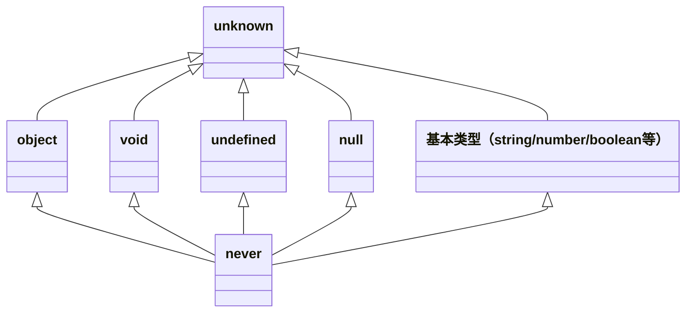

# 高级类型与工程配置

> 模块：03-typescript（第3周 TypeScript）
> 定位：高级原理篇
> 推荐阅读时间：90分钟

---

## 核心概念

TypeScript 的高级类型建立在基础类型系统之上，通过类型组合、条件判断、类型推导等能力实现复杂的类型变换。这些特性让 TypeScript 能够精确描述复杂的数据结构，实现更强的类型安全。

同时，合理配置 `tsconfig.json` 是 TypeScript 工程化实践的基础，正确的配置可以帮助我们在开发阶段提前发现更多问题。

> **生活化类比（泛型）**：超市储物柜——柜子本身不关心你存什么（类型参数 `T`），但取出来时知道是什么东西（类型推断）。你存的是包，取出来就是包；你存的是手机，取出来就是手机。泛型让代码在保持类型安全的同时支持多种类型。

---

## 底层原理

### 1. 条件类型

条件类型的语法是 `T extends U ? X : Y`，如果 `T` 能赋值给 `U`，结果就是 `X`，否则就是 `Y`。

```typescript
// 基础用法
type IsString<T> = T extends string ? true : false;

type A = IsString<string>; // true
type B = IsString<number>; // false
```

**分布式条件类型**：当 `T` 是联合类型时，条件类型会自动分发到每个成员上计算，最终结果是所有结果的联合。

```typescript
type ToArray<T> = T extends unknown ? T[] : never;

// 分布式计算：(string[] | number[])
type C = ToArray<string | number>;
// 相当于 string[] | number[]，而不是 (string | number)[]
```

如果不想分发，可以用 `[T] extends [U]` 包裹：

```typescript
type ToArrayNonDistributed<T> = [T] extends [any] ? T[] : never;
type D = ToArrayNonDistributed<string | number>;
// 结果是 (string | number)[]
```

### 2. 映射类型

映射类型可以遍历一个类型的所有属性，然后对每个属性做变换。

```typescript
// 基础语法：把 T 的所有属性都变成可选
type MyPartial<T> = {
  [K in keyof T]?: T[K];
};
```

TypeScript 内置了几个常用的映射类型：

- `Partial<T>` - 所有属性变成可选
- `Required<T>` - 所有属性变成必选
- `Readonly<T>` - 所有属性变成只读
- `Pick<T, K>` - 挑选出指定属性

```typescript
// Partial 的实现原理
type Partial<T> = {
  [P in keyof T]?: T[P];
};

// Required 的实现原理
type Required<T> = {
  [P in keyof T]-?: T[P];
};

// Readonly 的实现原理
type Readonly<T> = {
  readonly [P in keyof T]: T[P];
};

// Pick 的实现原理
type Pick<T, K extends keyof T> = {
  [P in K]: T[P];
};
```

### 3. infer 关键字

`infer` 关键字用于在条件类型中推导类型，最常用于提取嵌套类型。

```typescript
// 提取函数返回类型
type ReturnType<T extends (...args: any) => any> = 
  T extends (...args: any) => infer R ? R : any;

// 提取函数参数类型
type Parameters<T extends (...args: any) => any> = 
  T extends (...args: infer P) => any ? P : never;
```

示例使用：

```typescript
function foo(x: number, y: string) {
  return { x, y };
}

type FooReturn = ReturnType<typeof foo>; 
// { x: number; y: string }

type FooParams = Parameters<typeof foo>;
// [x: number, y: string]
```

### 4. 常用工具类型详解

这里给出所有常用内置工具类型的实现和用法：

```typescript
// Partial<T> - 将所有属性变为可选
type MyPartial<T> = { [K in keyof T]?: T[K] };
// 用法：interface User { name: string; age: number; }
// type PartialUser = Partial<User>; // { name?: string; age?: number }

// Required<T> - 将所有属性变为必选
type MyRequired<T> = { [K in keyof T]-?: T[K] };
// -? 移除可选标记

// Readonly<T> - 将所有属性变为只读
type MyReadonly<T> = { readonly [K in keyof T]: T[K] };

// Pick<T, K> - 从 T 中挑选出 K 属性
type MyPick<T, K extends keyof T> = { [P in K]: T[P] };

// Omit<T, K> - 从 T 中移除 K 属性，剩下的返回
type MyOmit<T, K extends keyof T> = Pick<T, Exclude<keyof T, K>>;

// Record<K, V> - 构造一个对象类型，键是 K，值是 V
type MyRecord<K extends keyof any, V> = { [P in K]: V };
// 用法：type UserMap = Record<string, User>;

// Exclude<T, U> - 从 T 中排除可以赋值给 U 的成员
type MyExclude<T, U> = T extends U ? never : T;
// 用法：type T = Exclude<'a' | 'b' | 'c', 'a' | 'b'>; // 'c'

// Extract<T, U> - 从 T 中提取可以赋值给 U 的成员
type MyExtract<T, U> = T extends U ? T : never;
// 用法：type T = Extract<'a' | 'b' | 'c', 'a' | 'b'>; // 'a' | 'b'

// NonNullable<T> - 排除 null 和 undefined
type MyNonNullable<T> = Exclude<T, null | undefined>;

// ReturnType<T> - 获取函数返回类型
type MyReturnType<T extends (...args: any) => any> = 
  T extends (...args: any) => infer R ? R : any;

// Parameters<T> - 获取函数参数组成的元组类型
type MyParameters<T extends (...args: any) => any> = 
  T extends (...args: infer P) => any ? P : never;
```

### 5. 类型体操入门

这里展示几个经典的类型体操题目：

**题目1：实现 DeepReadonly，将对象所有层级的属性都变为只读**

```typescript
type DeepReadonly<T> = {
  readonly [P in keyof T]: T[P] extends object 
    ? T[P] extends Function 
      ? T[P] 
      : DeepReadonly<T[P]> 
    : T[P];
};

// 测试
type Obj = { a: { b: string } };
type DeepReadonlyObj = DeepReadonly<Obj>;
// { readonly a: { readonly b: string } }
```

**题目2：实现 TupleToUnion，将元组转为联合类型**

```typescript
type TupleToUnion<T extends any[]> = T[number];

// 测试
type T1 = TupleToUnion<[string, number, boolean]>;
// T1 = string | number | boolean
```

**题目3：实现 IsEqual，判断两个类型是否相等**

```typescript
type IsEqual<A, B> = (<T>() => T extends A ? 1 : 2) extends 
  (<T>() => T extends B ? 1 : 2) ? true : false;

// 测试
type E1 = IsEqual<string, string>; // true
type E2 = IsEqual<string, number>; // false
```

### 6. 装饰器

> **版本说明**：TypeScript 支持两种装饰器语法：（1）**实验性装饰器**（legacy，需 `experimentalDecorators: true`），使用 `target`、`propertyKey`、`descriptor` 三参数模式；（2）**Stage 3 标准装饰器**（TS 5.0+），使用 `context` 对象模式，语法有显著差异。以下示例基于实验性装饰器。

装饰器是一种特殊类型的声明，可以附加到类、方法、属性、参数上，用来修改类的行为。

```typescript
// 类装饰器
function loggedClass<T extends { new(...args: any[]): {} }>(constructor: T) {
  return class extends constructor {
    newProperty = "new property";
    hello = "override";
  };
}

@loggedClass
class Person {
  name: string;
  constructor(name: string) {
    this.name = name;
  }
}
```

```typescript
// 方法装饰器
function log(target: any, propertyKey: string, descriptor: PropertyDescriptor) {
  const original = descriptor.value;
  descriptor.value = function(...args: any[]) {
    console.log(`Calling ${propertyKey} with`, args);
    return original.apply(this, args);
  };
  return descriptor;
}

class Calculator {
  @log
  add(a: number, b: number) {
    return a + b;
  }
}

new Calculator().add(1, 2); // 会打印日志
```

```typescript
// 属性装饰器
function defaultValue(value: any) {
  return function (target: any, propertyKey: string) {
    target[propertyKey] = value;
  };
}

class Settings {
  @defaultValue(true)
  enableCache!: boolean;
}
```

```typescript
// 装饰器工厂
function Enumerable(value: boolean) {
  return function (target: any, propertyKey: string, descriptor: PropertyDescriptor) {
    descriptor.enumerable = value;
    return descriptor;
  };
}

// 使用
class MyClass {
  @Enumerable(false)
  get something() { return 1; }
}
```

### 7. tsconfig.json 核心配置

```json
{
  "compilerOptions": {
    // 严格模式，开启所有严格类型检查选项
    "strict": true,
    
    // 指定编译后的 JavaScript 版本
    "target": "ES2020",
    
    // 指定模块生成方式
    "module": "ESNext",
    
    // 路径别名
    "paths": {
      "@/*": ["./src/*"]
    },
    
    // 是否生成 .d.ts 声明文件
    "declaration": true,
    
    // 是否允许从 CommonJS 模块默认导入，解决兼容性问题
    "esModuleInterop": true,
    
    // 报告未使用的局部变量错误
    "noUnusedLocals": true,
    
    // 报告未使用的参数错误
    "noUnusedParameters": true
  },
  
  // 包含哪些文件
  "include": ["src/**/*"],
  
  // 排除哪些文件
  "exclude": ["node_modules", "dist"]
}
```

**关键配置说明：**

- `strict: true`：开启所有严格类型检查，新项目建议始终开启。包含 `noImplicitAny`、`strictNullChecks`、`strictFunctionTypes`、`strictBindCallApply`、`strictPropertyInitialization`、`noImplicitThis`、`alwaysStrict` 等选项。
- `target`：控制输出 JS 的语法版本，现代项目推荐 `ES2020`+。
- `module`：指定模块系统，使用 bundler（Vite/Webpack）时推荐 `ESNext`。
- `paths`：配置路径别名，需要和打包工具配合使用。
- `declaration`：是否生成 `.d.ts` 文件，开发库时需要开启。
- `esModuleInterop`：开启后可以 `import React from 'react'` 代替 `import * as React from 'react'`，解决 CommonJS 和 ESModule 互操作性问题。
- `noUnusedLocals` / `noUnusedParameters`：检查未使用的变量和参数，帮助保持代码整洁。

### TypeScript 类型层级结构



`unknown` 位于类型层级的最顶端，是 TypeScript 的**顶层类型**（Top Type），任何类型都可以赋值给 `unknown`；而 `never` 位于最底端，是**底层类型**（Bottom Type），`never` 可以赋值给任何类型。`object`、`void`、`undefined`、`null` 以及所有基本类型都处于中间层级，它们各自是 `unknown` 的子类型，同时又是 `never` 的父类型。

### 8. TypeScript 4.9+ 新特性

#### 8.1 `satisfies` 关键字（TS 4.9+）

`satisfies` 关键字用于验证表达式的类型是否匹配某个类型，同时保留该表达式更精确的推断类型。与 `as` 类型断言不同，`satisfies` 不会丢失类型信息。

**核心区别**：`as` 是"强制断言"，告诉编译器"相信我，就是这个类型"；`satisfies` 是"类型检查+保留推断"，告诉编译器"请检查我的类型是否满足这个约束，但请保留我实际更精确的类型"。

```typescript
// 问题场景：使用 as 会丢失精确类型信息
type Color = 'red' | 'green' | 'blue';
type RGB = [number, number, number];

const palette1 = {
  red: [255, 0, 0],
  green: '#00ff00',
  blue: [0, 0, 255],
} as Record<Color, RGB | string>;
// palette1.red 的类型是 RGB | string，丢失了数组的精确类型
// palette1.red[0]  // 类型为 number | string，访问时类型变宽

// 使用 satisfies：类型检查 + 类型推断保留
const palette2 = {
  red: [255, 0, 0],
  green: '#00ff00',
  blue: [0, 0, 255],
} satisfies Record<Color, RGB | string>;
// palette2.red 的类型被保留为 number[]（而非 RGB | string 联合类型）
// palette2.red[0]  // 类型为 number（而非 number | string）
// palette2.green 的类型被保留为 string（而非 RGB | string 联合类型）
// 同时 palette2 仍然满足 Record<Color, RGB | string> 约束

// 如果某个属性不满足约束，编译时会报错
const palette3 = {
  red: [255, 0, 0],
  green: '#00ff00',
  // blue: 42,  // 编译错误：42 不满足 RGB | string
} satisfies Record<Color, RGB | string>;
```

**`satisfies` vs `as` 对比**：

| 特性 | `as` 断言 | `satisfies` |
|------|----------|-------------|
| 类型检查 | 宽松，可强制转换 | 严格，必须满足约束 |
| 类型推断 | 丢失精确类型 | 保留精确类型 |
| 类型安全 | 低，可能绕过检查 | 高，编译时保证 |
| 适用场景 | 需要强制类型转换 | 需要验证类型同时保留精确类型 |

**常见使用场景**：

```typescript
// 场景1：定义配置对象，同时保留字面量类型
type Config = {
  [key: string]: { timeout: number; retries: number };
};

const appConfig = {
  api: { timeout: 3000, retries: 3 },
  cache: { timeout: 1000, retries: 1 },
} satisfies Config;
// appConfig.api.timeout 的类型是 number（保留推断类型），同时 appConfig 满足 Config 约束

// 场景2：定义联合类型的值映射，保持每个值的精确类型
type Status = 'pending' | 'active' | 'done';
const statusMap = {
  pending: { label: '待处理', color: 'orange' },
  active: { label: '进行中', color: 'blue' },
  done: { label: '已完成', color: 'green' },
} satisfies Record<Status, { label: string; color: string }>;
// statusMap.pending.color 的类型是 string（保留推断类型），而非 RGB | string 联合类型
```

#### 8.2 `const` 类型参数（TS 5.0+）

`const` 类型参数允许在泛型函数中声明 const 修饰的类型参数，使得传入的字面量参数被推断为它们最窄（const）的类型，而不是被拓宽为基本类型。

```typescript
// 传统写法：使用 as const 断言
function getValues<T>(items: T[]): T[] {
  return items;
}
// 调用时需要手动 as const
const result1 = getValues(['a', 'b', 'c'] as const);
// 结果类型：readonly ['a', 'b', 'c']

// 如果不加 as const，类型会被拓宽
const result2 = getValues(['a', 'b', 'c']);
// 结果类型：string[]，丢失了字面量信息

// TS 5.0+ const 类型参数：函数声明时指定
// 注意：参数类型必须是 T 本身（而非 T[]），才能推断出元组类型
function getValuesConst<const T extends readonly string[]>(items: T): T {
  return items;
}
const result3 = getValuesConst(['a', 'b', 'c']);
// 结果类型：readonly ['a', 'b', 'c']，无需手动 as const！
```

**实际应用场景**：

```typescript
// 场景1：实现类似 Object.keys 但保留精确键类型
function objectKeys<const T extends Record<string, unknown>>(obj: T): (keyof T)[] {
  return Object.keys(obj) as (keyof T)[];
}

const user = { name: '张三', age: 18, email: 'zhangsan@example.com' };
const keys = objectKeys(user);
// keys 的类型是 ('name' | 'age' | 'email')[]，而不是 string[]

// 场景2：创建类型安全的枚举映射函数
function createEnum<const T extends readonly string[]>(values: T): { [K in T[number]]: K } {
  const result = {} as { [K in T[number]]: K };
  for (const value of values) {
    result[value as T[number]] = value;
  }
  return result;
}
const statusEnum = createEnum(['pending', 'active', 'done'] as const);
// 老写法：需要手动 as const
// 新写法（如果用 const 类型参数）：const statusEnum = createEnum(['pending', 'active', 'done']);
// statusEnum 的类型：{ pending: 'pending'; active: 'active'; done: 'done' }

// 场景3：防止数组字面量被推断为可变数组
function useTuple<const T extends readonly unknown[]>(tuple: T): T {
  return tuple;
}
const coords = useTuple([10, 20]);
// coords 的类型是 readonly [10, 20]，而不是 number[]
```

#### 8.3 `noInfer<T>` 工具类型（TS 5.4+）

`noInfer<T>` 用于阻止 TypeScript 从泛型参数中推断类型。当你希望某个泛型参数的类型由其他参数或显式注解决定，而不是从当前参数推断时，使用 `noInfer`。

```typescript
// 问题场景：泛型参数被意外推断
function createLogger<T>(levels: T[], defaultLevel: T): { levels: T[]; default: T } {
  return { levels, default: defaultLevel };
}

// 调用时，T 从 levels 和 defaultLevel 同时推断
const logger = createLogger(['error', 'warn', 'info'], 'info');
// T 被推断为 'error' | 'warn' | 'info'
// 这是期望的行为，但有时我们不希望这样

// 使用 noInfer：阻止从 defaultLevel 推断 T
function createLoggerSafe<T>(levels: T[], defaultLevel: noInfer<T>): { levels: T[]; default: T } {
  return { levels, default: defaultLevel };
}

const logger2 = createLoggerSafe(['error', 'warn', 'info'], 'info');
// T 仅从 levels 推断为 'error' | 'warn' | 'info'
// defaultLevel 本身不参与推断，只被检查是否满足 T
// 如果 defaultLevel 不在 T 的范围内，编译报错
// createLoggerSafe(['error', 'warn'], 'info'); // 错误：'info' 不在 'error' | 'warn' 中
```

**常见使用场景**：

```typescript
// 场景1：函数参数中某个参数不参与类型推断
function select<T>(items: T[], predicate: (item: noInfer<T>) => boolean): T[] {
  return items.filter(predicate);
}

const items = [{ id: 1, name: 'A' }, { id: 2, name: 'B' }];
const result = select(items, item => item.id > 1);
// T 从 items 推断为 { id: number; name: string }
// predicate 参数不参与 T 的推断

// 场景2：确保回调参数类型由外部注入而非内部推断
interface EventMap {
  click: { x: number; y: number };
  keydown: { key: string };
}
function onEvent<K extends keyof EventMap>(type: K, handler: (e: noInfer<EventMap[K]>) => void): void {
  // ...
}
// handler 的类型由 type 决定，不会从 handler 回调中意外推断 K
onEvent('click', (e) => {
  console.log(e.x, e.y); // e 的类型由 'click' 确定
});
```

#### 8.4 `using` 声明（TS 5.2+，Explicit Resource Management）

`using` 声明是 TypeScript 5.2 引入的显式资源管理语法，基于 TC39 的 Explicit Resource Management 提案。它允许声明一个在作用域结束时自动清理的资源，类似于 C# 的 `using` 或 Python 的 `with` 语句。

```typescript
// 使用 using 声明：资源在离开作用域时自动释放
{
  using file = new MyFileHandle('path/to/file');
  // 使用 file 进行操作...
  file.write('hello');
  // 当离开这个代码块时，file[Symbol.dispose]() 会自动被调用
}
// 此时 file 已经被自动释放

// 等价于传统 try-finally 写法
{
  const file = new MyFileHandle('path/to/file');
  try {
    file.write('hello');
  } finally {
    file[Symbol.dispose]();
  }
}
```

**实现 `Symbol.dispose` 接口**：

```typescript
// 使用 Symbol.dispose 实现同步清理
class MyFileHandle implements Disposable {
  private fd: number;

  constructor(path: string) {
    this.fd = openFile(path);
    console.log(`文件已打开：${path}`);
  }

  write(data: string): void {
    console.log(`写入数据：${data}`);
  }

  [Symbol.dispose](): void {
    closeFile(this.fd);
    console.log('文件已关闭（自动清理）');
  }
}

// 使用 using 声明
function processFile() {
  using file = new MyFileHandle('data.txt');
  file.write('hello world');
  // 函数结束时自动调用 file[Symbol.dispose]()
}
```

**异步资源清理：`await using`**：

```typescript
// 使用 Symbol.asyncDispose 实现异步清理
class DatabaseConnection implements AsyncDisposable {
  private connected: boolean = false;

  async connect(): Promise<void> {
    this.connected = true;
    console.log('数据库连接已建立');
  }

  async query(sql: string): Promise<void> {
    console.log(`执行查询：${sql}`);
  }

  async [Symbol.asyncDispose](): Promise<void> {
    if (this.connected) {
      console.log('数据库连接已关闭（异步清理）');
      this.connected = false;
    }
  }
}

// 使用 await using 声明异步资源
async function queryDatabase() {
  await using db = new DatabaseConnection();
  await db.connect();
  await db.query('SELECT * FROM users');
  // 函数结束时自动调用 await db[Symbol.asyncDispose]()
}
```

**DisposableStack：组合多个资源**：

```typescript
// 使用 DisposableStack 管理多个资源
function processMultipleResources() {
  using stack = new DisposableStack();

  const file1 = stack.use(new MyFileHandle('file1.txt'));
  const file2 = stack.use(new MyFileHandle('file2.txt'));
  // 当 stack 被释放时，file1 和 file2 的 dispose 都会按 LIFO 顺序被调用
  // 释放顺序：file2 → file1 → stack
}
```

**核心优势**：

| 传统 try-finally | `using` 声明 |
|------------------|-------------|
| 需要手动编写 try-finally 模板代码 | 编译器自动生成清理代码 |
| 多个资源时嵌套层级深 | 多个 using 声明平铺，可读性好 |
| 容易遗漏 finally 清理 | 编译时强制实现 Disposable 接口 |
| 清理顺序需要手动管理 | DisposableStack 自动按 LIFO 顺序清理 |

> 📖 **参考链接**：
> - [TypeScript官方文档 - 条件类型（Conditional Types）](https://www.typescriptlang.org/docs/handbook/2/conditional-types.html)
> - [TypeScript官方文档 - 映射类型（Mapped Types）](https://www.typescriptlang.org/docs/handbook/2/mapped-types.html)
> - [TypeScript官方文档 - tsconfig.json](https://www.typescriptlang.org/docs/handbook/tsconfig-json.html)
> - [TypeScript官方文档 - 模块解析](https://www.typescriptlang.org/docs/handbook/module-resolution.html)

---

---

## 实战应用

### 1. 在实际项目中使用工具类型

```typescript
// 定义用户接口
interface User {
  id: number;
  name: string;
  email: string;
  password: string;
}

// 创建用户时不需要 id，用 Omit 移除
type CreateUserRequest = Omit<User, 'id'>;

// 更新用户时所有字段都是可选，用 Partial
type UpdateUserRequest = Partial<User>;

// 用户字典，用 Record
type UserMap = Record<number, User>;

// 从 User 中挑选出安全字段（不包含密码）
type SafeUser = Pick<User, 'id' | 'name' | 'email'>;
```

### 2. 使用映射类型批量转换类型

```typescript
// 将所有字段变成 Promise
type ToPromise<T> = {
  [K in keyof T]: Promise<T[K]>;
};

// 所有方法都变成异步
type AsyncApi<T> = {
  [K in keyof T]: T[K] extends (...args: infer Args) => infer Ret
    ? (...args: Args) => Promise<Ret>
    : never;
};
```

### 3. 工程化配置最佳实践

新项目推荐配置：

```json
{
  "compilerOptions": {
    "strict": true,
    "target": "ES2020",
    "module": "ESNext",
    "moduleResolution": "bundler",
    "skipLibCheck": true,
    "esModuleInterop": true,
    "forceConsistentCasingInFileNames": true,
    "resolveJsonModule": true,
    "isolatedModules": true,
    "noUnusedLocals": true,
    "noUnusedParameters": true,
    "noFallthroughCasesInSwitch": true
  },
  "include": ["src"],
  "exclude": ["node_modules"]
}
```

---

## 常见面试题

### Q1: 什么是分布式条件类型？什么时候会触发？

A: 当条件类型的第一个参数是联合类型，并且是裸类型（没有被数组/元组包裹）时，TypeScript 会自动分发条件类型到联合类型的每个成员分别计算，最后把结果合并成联合类型。这就是分布式条件类型。如果不想分发，可以用 `[T] extends [U]` 包裹。

### Q2: Partial 和 Required 的实现原理是什么？

A: 使用映射类型遍历 `keyof T`，对每个属性进行变换。`Partial` 加上 `?` 变成可选，`Required` 用 `-?` 移除可选标记。

### Q3: infer 关键字的作用是什么？

A: `infer` 用于在条件类型中推导类型，可以提取出嵌套在其他类型中的子类型，比如提取函数返回类型、参数类型等。这是实现很多高级工具类型的基础。

### Q4: tsconfig 中 strict 模式都包含哪些内容？为什么建议开启？

A: strict 是一组严格类型检查选项的集合，包括 `noImplicitAny`、`strictNullChecks`、`strictFunctionTypes`、`strictBindCallApply`、`strictPropertyInitialization`、`noImplicitThis`、`alwaysStrict`。开启 strict 可以让 TypeScript 提供更强的类型检查，提前发现更多潜在错误，提升代码质量。新项目强烈建议始终开启。

### Q5: 装饰器的使用场景有哪些？

A: 装饰器可以用来在不修改原代码的情况下给类/方法/属性添加额外功能，常见场景：日志记录、性能监控、缓存、权限控制、依赖注入、数据校验等。

---

## 避坑指南

| 常见错误 | 现象 | 原因 | 解决方案 |
|---------|------|------|----------|
| 不理解分布式条件类型 | 得到的是联合类型而不是元组，和预期不符 | 不知道裸联合类型会自动分发 | 需要整体判断时用 `[T] extends [U]` 包裹 |
| infer 位置写错 | 不能推导，报语法错误 | 不理解 infer 只能在条件类型的 extends 子句中使用 | 把 infer 放在 extends 那边 |
| 映射类型中 keyof 使用错误 | 遍历得不到正确的键 | 混淆了 `T` 和 `keyof T` | 映射遍历的是 `keyof T`，不是 `T` |
| 开启 strict 后一堆错误 | 项目升级 TS 后，strictNullChecks 报错很多 | 老项目没有严格的类型习惯 | 逐步修复，对于确实可能为 null 的地方加上空检查 |
| paths 不生效 | IDE 找不到路径别名对应的文件 | 只配置了 TS，没配置打包工具 | tsconfig 配置 paths 后，还需要在 vite/webpack 中也配置别名 |
| 装饰器不生效 | 编译报错，找不到装饰器语法 | 没有开启 experimentalDecorators | 在 tsconfig 中开启 `experimentalDecorators: true` |
| 声明文件 d.ts 不会写 | 不知道怎么给第三方 JS 库写类型定义 | 不理解 ambient declaration 语法 | 使用 `declare module 'xxx' { ... }` 声明模块 |
| exclude 不生效 | node_modules 里的文件还是被编译了 | exclude 写法不正确 | 写成 `"exclude": ["node_modules"]` 就够了，不需要 `node_modules/**/*` |

---

## TypeScript 5.7 / 5.8 新特性

TypeScript 持续演进，以下是 5.7 和 5.8 版本中值得关注的重要新特性。

### TypeScript 5.7 新特性

#### 1. `--erasableSyntaxOnly` 选项

用于阻止使用 `enum`、`namespace`、`constructor parameter properties` 等在编译后需要生成运行时代码的 TypeScript 特有语法，确保源文件只包含可被简单擦除的类型注解。

```jsonc
// tsconfig.json
{
  "compilerOptions": {
    "erasableSyntaxOnly": true
    // 开启后，使用 enum 或 namespace 将报错
  }
}
```

```typescript
// ❌ erasableSyntaxOnly 模式下报错
enum Color { Red, Green, Blue }        // enum 不是"可擦除"语法
namespace Utils { }                     // namespace 不是"可擦除"语法

// ✅ 使用替代方案
const Color = { Red: 0, Green: 1, Blue: 2 } as const;
type Color = (typeof Color)[keyof typeof Color];
```

> **适用场景**：项目使用 Node.js 原生 TypeScript 剥离（如 Node.js 的 `--experimental-strip-types`）、使用 `@swc` 或 `esbuild` 等仅做类型擦除的编译器时，该选项可以确保代码不会意外引入需要运行时转换的 TS 语法。

#### 2. 未初始化变量检查增强

TypeScript 5.7 对未初始化变量的检查更加严格，特别是对数组方法的闭包中的变量。

```typescript
// TypeScript 5.7 之前：不报错（但运行时可能为 undefined）
// TypeScript 5.7：对未初始化变量的检查更精确
let result: number[];
[1, 2, 3].forEach(() => {
  result.push(0); // 5.7 中会报错：变量 'result' 在赋值前被使用
});
```

#### 3. 相对路径重写的改进

`--module nodenext` 模式下，TypeScript 5.7 改进了相对路径的导入重写逻辑，更好地匹配 Node.js 的模块解析行为。

```typescript
// 使用 --module nodenext 时，导入路径需要明确写出文件扩展名
import { helper } from './utils.js';  // 需要 .js 扩展名（即使源文件是 .ts）
```

### TypeScript 5.8 新特性

#### 1. `--module nodenext` 增强

TypeScript 5.8 进一步强化了 `--module nodenext` 的输出稳定性，改进了 `package.json` 中 `"exports"` 字段的条件解析，更好地支持 Node.js ESM 和 CJS 双模式。

```jsonc
// package.json - 条件导出
{
  "exports": {
    ".": {
      "import": "./dist/index.mjs",
      "require": "./dist/index.cjs",
      "types": "./dist/index.d.ts"
    }
  }
}
```

#### 2. 条件类型推断优化

TypeScript 5.8 对条件类型的推断算法进行了优化，减少了某些边界情况下的"循环"检测误报。

```typescript
// 5.8 中，以下复杂条件类型能够正确推断，不再触发"类型实例化过深"错误
type DeepExtract<T> = T extends object
  ? { [K in keyof T]: DeepExtract<T[K]> }
  : T;
```

#### 3. 性能提升

TypeScript 5.8 在 `--watch` 模式和增量编译方面有显著性能提升，特别是在大型项目中：

- `--watch` 模式下重新编译速度提升约 20%
- `--incremental` 构建时 `.tsbuildinfo` 文件体积更小
- 类型检查内存占用优化

#### 4. `--strictBuiltinIteratorReturn` 选项

新增的严格模式选项，确保 `Iterator` 的 `next()` 方法返回值类型正确。

```typescript
// tsconfig.json
{
  "compilerOptions": {
    "strictBuiltinIteratorReturn": true
  }
}
```

### TypeScript 5.9 新特性（2025 年 8 月发布）

TypeScript 5.9 于 2025 年 8 月 1 日正式发布，引入了多项重要特性。

#### 1. `import defer` 支持（Stage 3 提案）

`import defer` 是 ECMAScript Stage 3 提案，TypeScript 5.9 率先支持。它允许延迟执行导入的模块，直到模块被实际使用：

```typescript
// import defer：延迟加载重型模块，首屏不阻塞
import defer * as heavyModule from './heavy-module.js';

// 只有在实际调用时才执行模块代码
const result = heavyModule.heavyCalculation(data); // 此时才加载并执行 heavy-module
```

**适用场景**：
- 首屏不需要的辅助功能模块（如反馈表单、聊天组件）
- 条件渲染的组件（如 Modal、Drawer）
- 性能敏感场景下的代码分割优化

#### 2. `--module node20` 选项

新增 `--module node20` 选项，支持 Node.js 20+ 的原生 ESM 解析规则：

```json
{
  "compilerOptions": {
    "module": "node20",
    "moduleResolution": "node20"
  }
}
```

#### 3. `ArrayBuffer` 类型增强

TypeScript 5.9 改进了 `ArrayBuffer` 的类型定义，更好地支持 ES2024 中引入的可调整大小的 ArrayBuffer：

```typescript
// 可调整大小的 ArrayBuffer
const buffer = new ArrayBuffer(8, { maxByteLength: 16 });
// buffer.byteLength: 8, buffer.maxByteLength: 16

buffer.resize(12);
// buffer.byteLength: 12
```

### 版本升级建议

| 当前版本 | 建议升级路径 | 注意事项 |
|----------|------------|---------|
| < 5.4 | 5.4 → 5.5 → 5.7 | 渐进式升级，每个版本验证一次 |
| 5.4 - 5.6 | 直接升级到 5.7 | 需关注 `erasableSyntaxOnly` 相关警告 |
| 5.7 | 直接升级到 5.8 | 性能提升明显，推荐升级 |
| 5.8 | 直接升级到 5.9 | 新增 import defer、--module node20 等特性 |

> **升级前检查**：
> 1. 运行 `pnpm exec tsc --noEmit` 确保无类型错误
> 2. 检查 `tsconfig.json` 中 `strict` 相关选项是否兼容
> 3. 如果使用了 `enum` 或 `namespace`，评估是否迁移到替代方案
> 4. 在 CI 环境中先做一次完整的类型检查

---

## 补充：.d.ts 声明文件系统

### 1. 概念定义

**声明文件（declaration file）** 是以 `.d.ts` 结尾、只描述类型不包含实现的文件，用来告诉 TypeScript「某个运行时存在的东西长什么样」。

项目中的类型来源一共有三处：

| 来源 | 位置 | 由谁维护 | 加载方式 |
|------|------|---------|---------|
| 内置声明 | TypeScript 自带的 `lib.*.d.ts` | TS 官方 | 由 `target` + `lib` 决定加载哪些（如 `lib.dom.d.ts`、`lib.es2022.d.ts`） |
| 第三方声明 | `node_modules/@types/*` | DefinitelyTyped 社区 | 默认从 `typeRoots`（`node_modules/@types`）自动加载，可用 `types` 收窄 |
| 自写声明 | 项目里的 `*.d.ts` 或 `.ts` 中的 `declare` | 自己 | 通过 `include` 纳入编译范围 |

### 2. 底层原理

- **环境声明（ambient declaration）**：`.d.ts` 文件中的所有顶层声明都隐含 `declare`，只声明类型、不产生运行时代码。在 `.ts` 文件里写 `declare const x: number` 同样只加类型、不生成变量。
- **模块判定规则**：一个文件只要含有顶层 `import` 或 `export`，它就是一个**模块**，其中的声明只在模块内可见；否则它是一个**全局脚本**，其中的声明会注入全局作用域。想让 `declare global {}` 合法，文件必须先成为模块——加一行 `export {}` 是最常见的做法。
- **`declare module 'x'` 的两种语义**：
  - 在**全局脚本**（无顶层 import/export）里写，它是**环境模块声明**，用于给「没有类型的包」补类型，不要求目标模块真实存在；
  - 在**模块文件**里写，它是**模块增强（module augmentation）**，要求目标模块必须能被解析到，否则报 `Invalid module name in augmentation`。
- **类型查找顺序**：`node_modules/<pkg>/package.json` 的 `types` / `typings` 字段 → `exports` 中的 `types` 条件 → `node_modules/@types/<pkg>`。
- **`types` 与 `typeRoots` 的区别**：`typeRoots` 改变「去哪些目录找 `@types`」，`types` 则是一个白名单，只加载列出的包（`"types": []` 表示一个都不自动加载），两者都能显著影响编译速度与全局类型污染。
- **资源声明**：`declare module '*.css'` 这类**通配符模块声明**，让 TS 接受 `import styles from './a.css'`。注意 Vite 项目已经通过 `vite/client` 内置了 `*.css`、`*.svg`、`*.png` 等声明，自己再写一份可能产生冲突。

### 3. 代码示例

```typescript
// ========== 1. declare：为运行时已存在的值补充类型 ==========
// 假设构建工具会把版本号注入为全局变量
declare const __BUILD_VERSION__: string;
declare function gtag(command: string, ...args: unknown[]): void;
declare class LegacySDK {
  init(token: string): void;
}
declare namespace MyLib {
  interface Options {
    debug?: boolean;
  }
}
```

```typescript
// ========== 2. 全局声明：扩展 Window / 注入全局常量 ==========
// global.d.ts
export {}; // 关键：让本文件成为模块，declare global 才合法

declare global {
  interface Window {
    __APP_CONFIG__: { apiBase: string };
    __reportError?: (err: unknown) => void;
  }
  const __DEV__: boolean;
}

// 使用处无需 import
window.__APP_CONFIG__.apiBase;
```

```typescript
// ========== 3. 模块声明：为无类型的第三方库手写声明 ==========
// types/legacy-chart.d.ts（独立文件，不要写在有 import 的模块文件里）
declare module "legacy-chart" {
  export interface ChartOptions {
    width: number;
    height: number;
    theme?: "light" | "dark";
  }

  export class Chart {
    constructor(el: HTMLElement, options: ChartOptions);
    render(data: number[]): void;
    destroy(): void;
  }

  export default Chart;
}

// 使用：import Chart from "legacy-chart";
```

```typescript
// ========== 4. 给 CommonJS 模块写声明 ==========
declare module "old-utils" {
  function format(value: unknown): string;
  namespace format {
    const version: string;
  }
  // CommonJS 的整体导出用 export =
  export = format;
}

// 使用：import format = require("old-utils");
// 或开启 esModuleInterop 后：import format from "old-utils";
```

```typescript
// ========== 5. 资源声明（非 Vite 项目必备）==========
// src/types/assets.d.ts
declare module "*.css" {
  // CSS Modules：导出一个「类名 -> 编译后类名」的映射
  const classes: { readonly [key: string]: string };
  export default classes;
}

declare module "*.svg" {
  const src: string;
  export default src;
}

declare module "*.png" {
  const src: string;
  export default src;
}

declare module "*.vue" {
  import type { DefineComponent } from "vue";
  // ⚠️ 仅纯 tsc 项目需要；使用 vue-tsc / Volar 时不要加这个 shim，
  // 否则组件的 props / emits 类型会全部退化为 any
  const component: DefineComponent<{}, {}, any>;
  export default component;
}
```

```jsonc
// ========== 6. 用 paths 给无类型包挂上本地声明 ==========
// tsconfig.json
{
  "compilerOptions": {
    "paths": {
      "legacy-chart": ["./types/legacy-chart.d.ts"]
    }
  }
}
```

```typescript
// ========== 7. 生成声明文件（写库时）==========
```
```jsonc
// 库项目的 tsconfig.json
{
  "compilerOptions": {
    "declaration": true,          // 生成 .d.ts
    "declarationMap": true,       // 生成 .d.ts.map，支持跳转到源码
    "emitDeclarationOnly": false, // 只产出声明时设为 true（配合 bundler 打包 JS）
    "outDir": "dist"
  }
}
```

### 4. 面试常见问法

- **Q1：声明文件有哪三种来源？**
  A：TS 内置的 `lib.*.d.ts`（由 `target` / `lib` 控制）、第三方 `@types/*`（DefinitelyTyped，默认从 `typeRoots` 自动加载）、自己写的 `*.d.ts`（通过 `include` 纳入）。

- **Q2：为什么 `declare global` 需要 `export {}`？**
  A：只有模块里的声明才能做全局增强。文件没有顶层 import/export 时是全局脚本，写 `declare global` 会报「Augmentations for the global scope can only be directly nested in external modules or ambient module declarations」，加 `export {}` 让它成为模块即可。

- **Q3：`declare module '*.css'` 有什么作用？**
  A：通配符模块声明，让 TS 把 `import styles from './x.css'` 当作有类型（默认导出）的模块处理，否则会报「找不到模块」。Vite 项目通过 `vite/client` 已内置类似声明。

- **Q4：`types` 和 `typeRoots` 有什么区别？**
  A：`typeRoots` 决定去哪几个目录找 `@types` 包；`types` 是白名单，只加载列出的包。用 `"types": ["node", "vite/client"]` 可以避免加载全部 `@types`，既提速又避免全局类型污染。

- **Q5：第三方库没有类型怎么办？**
  A：优先看库是否自带 `types` 字段或社区有没有 `@types/xxx`；都没有就自己写 `declare module 'xxx'` 的最小声明，只声明实际用到的 API。

### 5. 易错点

| 易错点 | 现象 | 原因 | 解决方案 |
|--------|------|------|----------|
| 在 `.d.ts` 里写实现代码 | 报错「环境上下文中不能有实现」 | `.d.ts` 只描述类型 | 把实现留在 `.ts` 里，声明文件只写签名 |
| 全局声明文件里写了 `import` | 声明不再注入全局，其他文件找不到 | 有顶层 import 就变成模块 | 加 `declare global { }` 包住全局声明 |
| 忘记 `export {}` | `declare global` 直接报错 | 文件还是全局脚本 | 首行加 `export {}` |
| 在模块文件里写 `declare module '不存在的包'` | 报 `Invalid module name in augmentation` | 模块文件里的 `declare module` 是模块增强 | 补类型要新建独立的 `.d.ts`（全局脚本形态） |
| 手写 `*.vue` shim | 组件 props 类型全变 `any` | 与 vue-tsc / Volar 的原生 `.vue` 支持冲突 | 用 vue-tsc 的项目删掉该 shim |
| `@types` 版本与库版本不匹配 | 报类型错误或 API 不存在 | 类型定义滞后于库 | 对齐版本，或用 `overrides` 固定 `@types` 版本 |
| `types` 配成 `[]` 后 `process` 报未定义 | 找不到 Node 全局类型 | 白名单把 `@types/node` 也排除了 | 显式加入 `"types": ["node"]`，或用 `/// <reference types="node" />` |
| 自己写的 `*.css` 声明与 `vite/client` 冲突 | 重复声明报错 | 两处都声明了同名通配符模块 | 二选一，Vite 项目直接引用 `vite/client` |
| 发布库时声明文件缺失 | 使用方没有类型提示 | 没开 `declaration`，或 `types` 字段没指向入口声明 | 开启 `declaration` 并在 `package.json` 里配置 `types` |

---

## 补充：paths 路径别名实战

### 1. 概念定义

`baseUrl` 与 `paths` 是 `tsconfig.json` 中的模块解析配置：`baseUrl` 指定非相对导入的解析基准目录，`paths` 在其之上建立「别名 → 实际路径」的映射。

**最重要的前提：`paths` 只影响类型解析（tsc 与 IDE），不会改写生成的 import 语句，也不参与运行时/打包时的模块解析。** 因此别名必须在构建工具里同步配置一份。

### 2. 底层原理

- **TS 4.1 起 `paths` 不再要求 `baseUrl`**：没有 `baseUrl` 时，`paths` 的取值相对于声明它的 `tsconfig.json` 所在目录解析。
- **相对路径的解析基准**：
  - `extends` 继承时，`compilerOptions` 里的相对路径（含 `paths`）相对于**被继承的那个配置文件**解析；
  - `files` / `include` / `exclude` 里的相对路径相对于**当前（子）配置文件**解析。
  这个差异是多环境配置里最容易出错的地方。
- **`extends` 支持数组**（TS 5.0+）：`"extends": ["./base.json", "./strict.json"]`，后写者覆盖前者。
- **`moduleResolution: bundler`**（TS 5.0+）：为 Vite / Webpack / esbuild 这类打包器设计的解析模式，允许不带扩展名的相对导入，并支持 `package.json` 的 `exports` 条件导出。
- **运行时的三类补位方案**：
  1. 构建工具别名（Vite `resolve.alias`、Webpack `resolve.alias`）；
  2. 测试运行器别名（Jest `moduleNameMapper`、Vitest `test.alias`）；
  3. Node 直接运行源码时用 `tsc-alias` / `tsup` / `esbuild` 等改写产物中的路径。

### 3. 代码示例

```jsonc
// ========== 1. 最基础的 paths 配置 ==========
// tsconfig.json
{
  "compilerOptions": {
    "baseUrl": ".",
    "paths": {
      "@/*": ["src/*"],
      "@components/*": ["src/components/*"],
      "@types/*": ["src/types/*"]
    }
  }
}
```

```typescript
// 配置后即可用别名导入
import Button from "@components/Button";
import type { User } from "@types/user";
```

```typescript
// ========== 2. Vite：必须与 tsconfig.paths 同步 ==========
// vite.config.ts
import { defineConfig } from "vite";
import vue from "@vitejs/plugin-vue";
import { fileURLToPath, URL } from "node:url";

export default defineConfig({
  plugins: [vue()],
  resolve: {
    alias: {
      // 用 URL + import.meta.url 而不是 __dirname，兼容 ESM 形式的配置文件
      "@": fileURLToPath(new URL("./src", import.meta.url)),
    },
  },
});
```

```javascript
// ========== 3. Webpack ==========
// webpack.config.js
const path = require("path");

module.exports = {
  resolve: {
    alias: {
      "@": path.resolve(__dirname, "src"),
    },
  },
};
```

```javascript
// ========== 4. Jest / Vitest ==========
// jest.config.js
module.exports = {
  moduleNameMapper: {
    "^@/(.*)$": "<rootDir>/src/$1",
  },
};

// vitest.config.ts：直接复用 Vite 的 resolve.alias 即可
// import { defineConfig } from "vitest/config";
// export default defineConfig({ test: { alias: { "@": "./src" } } });
```

```jsonc
// ========== 5. tsconfig 继承：base + 多环境 ==========
// tsconfig.base.json：只放与环境无关的严格性、类型规则与别名
{
  "compilerOptions": {
    "strict": true,
    "target": "ES2020",
    "module": "ESNext",
    "moduleResolution": "bundler",
    "isolatedModules": true,
    "skipLibCheck": true,
    "forceConsistentCasingInFileNames": true,
    "baseUrl": ".",
    "paths": {
      "@/*": ["src/*"]
    }
  }
}

// tsconfig.app.json：浏览器端代码
{
  "extends": "./tsconfig.base.json",
  "compilerOptions": {
    "lib": ["ES2022", "DOM", "DOM.Iterable"],
    "types": ["vite/client"],
    "noEmit": true
  },
  "include": ["src/**/*.ts", "src/**/*.tsx", "src/**/*.vue"]
}

// tsconfig.node.json：构建脚本、Node 侧代码
{
  "extends": "./tsconfig.base.json",
  "compilerOptions": {
    "lib": ["ES2023"],
    "types": ["node"],
    "noEmit": true
  },
  "include": ["vite.config.ts", "scripts/**/*.ts"]
}
```

```jsonc
// ========== 6. 用项目引用组织多环境（Vite / Vue 官方模板的组织方式）==========
// tsconfig.json：只做入口，本身不含任何文件
{
  "files": [],
  "references": [
    { "path": "./tsconfig.app.json" },
    { "path": "./tsconfig.node.json" }
  ]
}
// 注意：被 references 引用的子项目需要开启 "composite": true（会隐式开启 declaration）。
// 若只是想"按环境分别检查、不产出文件"，更简单的做法是不用 references，
// 在 package.json 脚本里分别执行：
//   tsc -p tsconfig.app.json --noEmit
//   tsc -p tsconfig.node.json --noEmit
```

```jsonc
// ========== 7. 发布库时的别名处理 ==========
// 问题：tsc 不会改写 import 路径，@/utils 会被原样写进 .d.ts，使用方无法解析
// 解决：用 tsc-alias 重写产物路径，或用 tsup / vite-plugin-dts 统一处理
// package.json
{
  "scripts": {
    "build": "tsc -p tsconfig.build.json && tsc-alias -p tsconfig.build.json"
  }
}
```

### 4. 面试常见问法

- **Q1：为什么配了 `paths` 还是报「找不到模块」？**
  A：`paths` 只影响 TS 的类型解析。运行时/打包时的解析由构建工具负责，必须在 Vite `resolve.alias`、Webpack `resolve.alias`、Jest `moduleNameMapper` 里同步配置一份。

- **Q2：`baseUrl` 和 `paths` 是什么关系？现在还需要 `baseUrl` 吗？**
  A：`baseUrl` 是非相对导入的解析基准，`paths` 在其之上做别名映射。TS 4.1 起 `paths` 可以脱离 `baseUrl` 单独使用，此时取值相对于 tsconfig 所在目录解析。

- **Q3：`extends` 继承时相对路径以谁为基准？**
  A：`compilerOptions` 中的相对路径（包括 `paths`）相对于被继承的配置文件；`files` / `include` / `exclude` 相对于当前子配置文件。这个差异是继承配置出错的高频原因。

- **Q4：多环境配置怎么组织？**
  A：抽一个 `tsconfig.base.json` 放公共严格性规则，再用 `tsconfig.app.json`（DOM 环境）与 `tsconfig.node.json`（Node 环境）通过 `extends` 分别覆盖 `lib` 与 `types`，避免在浏览器代码里误用 Node 全局类型。

- **Q5：发布 npm 包时别名会有什么问题？**
  A：`tsc` 不会重写 import 路径，产物和 `.d.ts` 里会残留 `@/xxx`，使用方无法解析。需要用 `tsc-alias`、`tsup`、`vite-plugin-dts` 等工具把路径改写为相对路径。

### 5. 易错点

| 易错点 | 现象 | 原因 | 解决方案 |
|--------|------|------|----------|
| 只配 tsconfig 不配打包工具 | 编辑器不报错，`vite build` 失败 | `paths` 不影响运行时解析 | 同步配置 `resolve.alias` / `moduleNameMapper` |
| 继承配置里的 `paths` 解析错目录 | 别名指向不存在的路径 | `paths` 相对于被继承的配置文件解析 | 用 `baseUrl` 固定基准，或在子配置里重新声明 `paths` |
| 忘了给测试环境配别名 | 单元测试里 import 报错 | Jest/Vitest 不读 tsconfig 的 paths | 配 `moduleNameMapper` 或 `test.alias` |
| 通配符顺序写反 | 更具体的别名不生效 | 别名按声明顺序匹配 | 更具体的规则写在前面 |
| 浏览器配置里混入 Node 类型 | `process`、`Buffer` 在浏览器代码里也能通过检查 | 子配置没有收窄 `types` / `lib` | 浏览器配置里显式声明 `types: ["vite/client"]`、`lib: ["DOM"]` |
| 发布库时别名残留 | 使用方报「找不到模块 @/utils」 | tsc 不改写 import 路径 | 用 `tsc-alias` / bundler 改写产物 |
| `references` 未开 `composite` | `tsc -b` 报错 | 被引用的子项目必须能产出声明文件 | 给子项目加 `"composite": true` |
| 把别名用在与打包无关的纯 Node 脚本上 | 直接 `node script.ts` 无法解析别名 | Node 不认识 tsconfig 的 paths | 改用相对路径，或用 bundler/`tsc-alias` 产物运行 |

---

## 补充：与 Vue / React 的类型集成

### 1. 概念定义

- **Vue 侧**：`.vue` 单文件组件不是标准 TS 文件，需要 `vue-tsc`（Volar 的 CLI 封装）才能类型检查；`defineProps` / `defineEmits` / `defineSlots` / `defineExpose` 是**编译宏**，无需 import。
- **React 侧**：组件就是普通函数，类型集成的核心是「如何精确描述 props、children、ref、事件与泛型」。

### 2. 底层原理

**Vue：**

- Vite 只做**转译**不做**类型检查**：`<script setup lang="ts">` 里的类型在构建时被擦除，类型错误不会让 `vite build` 失败。因此 CI 里必须单独跑 `vue-tsc --noEmit`。
- `defineProps<Props>()` 的类型参数会被编译器**静态分析**并生成运行时的 props 声明，所以它必须是「类型字面量或可静态解析的类型引用」。Vue 3.3 之前不支持引用导入的类型（必须写在同文件），3.3 起支持导入类型。
- `withDefaults(defineProps<Props>(), {...})` 为可选 props 提供默认值，并让这些 props 在结果类型中变为「有值」（不再是 `T | undefined`）。
- `defineEmits` 有两种写法：调用签名 `{ (e: 'change', id: number): void }` 与 Vue 3.3+ 的命名元组 `{ change: [id: number] }`。
- 泛型组件：Vue 3.3+ 的 `<script setup lang="ts" generic="T extends { id: number }">`，类型参数可用于 props、emits 与模板。
- `InjectionKey<T>` 为 `provide` / `inject` 提供类型安全的键；`PropType<T>` 用于运行时 props 声明中的复杂类型断言。

**React：**

- `ComponentProps<T>` / `ComponentPropsWithRef<T>` / `ComponentPropsWithoutRef<T>` 从「组件类型」或「内置元素名」提取 props 类型，是组合原生元素属性的标准做法。
- `React.FC<P>` 与普通函数组件的差别：`FC` 会额外声明 `displayName`、`defaultProps` 等静态属性；在 `@types/react` 18 之前它还隐含 `children?: ReactNode`（18 起移除）。因此推荐直接用普通函数组件，需要 children 时显式写 `PropsWithChildren<P>`。
- 泛型组件在 React 里就是泛型函数：`function List<T>(props: Props<T>) {}`，JSX 中可用 `<List<string> ... />` 显式指定类型参数。
- 事件对象类型由 JSX 属性自动推断，无需手写；需要单独声明处理函数时用 `React.ChangeEventHandler<T>` 这类现成类型。

### 3. 代码示例

```vue
<!-- ========== 1. defineProps + withDefaults ========== -->
<script setup lang="ts">
interface Props {
  title: string;
  count?: number;
  tags?: string[];
}

// withDefaults 让带默认值的 props 在类型上不再可能为 undefined
const props = withDefaults(defineProps<Props>(), {
  count: 0,
  tags: () => [], // 对象/数组默认值必须用工厂函数
});

// props.count 的类型是 number（而不是 number | undefined）
console.log(props.count + 1);
</script>

<template>
  <h2>{{ title }}</h2>
</template>
```

```vue
<!-- ========== 2. defineEmits：两种写法 ========== -->
<script setup lang="ts">
// 写法一：调用签名（Vue 3.2+）
const emit = defineEmits<{
  (e: "change", id: number): void;
  (e: "submit", payload: { ok: boolean }): void;
}>();

// 写法二：命名元组（Vue 3.3+，更简洁）
// const emit = defineEmits<{
//   change: [id: number];
//   submit: [payload: { ok: boolean }];
// }>();

emit("change", 1); // ✅
// emit("change", "1"); // ❌ 类型不匹配
</script>
```

```vue
<!-- ========== 3. 泛型组件（Vue 3.3+）========== -->
<script setup lang="ts" generic="T extends { id: number }">
const props = defineProps<{
  items: T[];
  selected?: T;
}>();

const emit = defineEmits<{
  select: [item: T];
}>();
</script>

<template>
  <ul>
    <li v-for="item in items" :key="item.id" @click="emit('select', item)">
      <slot :item="item" />
    </li>
  </ul>
</template>
```

```vue
<!-- ========== 4. 类型化的 provide / inject 与复杂 prop 类型 ========== -->
<script setup lang="ts">
import { provide, inject, ref, type InjectionKey, type Ref, type PropType } from "vue";

interface User {
  id: number;
  name: string;
}

// 用 InjectionKey 约束 provide/inject 的类型一致性
const userKey: InjectionKey<Ref<User>> = Symbol("user");
provide(userKey, ref({ id: 1, name: "张三" }));

const user = inject(userKey); // Ref<User> | undefined

// 运行时 props 声明中的复杂类型用 PropType 断言
const props = defineProps({
  config: {
    type: Object as PropType<{ debug: boolean }>,
    required: true,
  },
});
</script>
```

```tsx
// ========== 5. React：从原生元素/组件提取 props ==========
import type { ComponentProps, ComponentPropsWithoutRef, PropsWithChildren, ReactNode } from "react";

// 组合原生 button 的属性
type ButtonProps = ComponentPropsWithoutRef<"button"> & {
  variant?: "primary" | "ghost";
};

function Button({ variant = "primary", children, ...rest }: PropsWithChildren<ButtonProps>) {
  return <button data-variant={variant} {...rest}>{children}</button>;
}

// 从已有组件提取 props 类型
function IconButton(props: ComponentProps<typeof Button>) {
  return <Button {...props} />;
}
```

```tsx
// ========== 6. React：普通函数组件 vs FC ==========
import type { FC, PropsWithChildren } from "react";

// ✅ 推荐：普通函数组件，泛型更自然，props 语义显式
interface ListProps<T> {
  items: readonly T[];
  renderItem: (item: T, index: number) => ReactNode;
}
function List<T>({ items, renderItem }: ListProps<T>) {
  return <ul>{items.map((item, i) => <li key={i}>{renderItem(item, i)}</li>)}</ul>;
}
// JSX 中可显式指定类型参数：<List<string> items={["a"]} renderItem={(s) => s} />

// FC：会带上 displayName 等静态属性；需要 children 时必须显式声明
const Badge: FC<PropsWithChildren<{ tone?: "info" | "warn" }>> = ({ tone = "info", children }) => (
  <span data-tone={tone}>{children}</span>
);
```

```tsx
// ========== 7. React：事件处理类型 ==========
import { useState, type ChangeEvent, type FormEvent, type MouseEvent } from "react";

function SearchBox() {
  const [keyword, setKeyword] = useState("");

  // 事件类型由 JSX 属性自动推断，无需手写
  const onChange = (e: ChangeEvent<HTMLInputElement>) => setKeyword(e.target.value);

  const onSubmit = (e: FormEvent<HTMLFormElement>) => {
    e.preventDefault();
    console.log(keyword);
  };

  const onClick = (e: MouseEvent<HTMLButtonElement>) => {
    console.log(e.currentTarget.disabled); // currentTarget 已带具体元素类型
  };

  return (
    <form onSubmit={onSubmit}>
      <input value={keyword} onChange={onChange} />
      <button onClick={onClick}>搜索</button>
    </form>
  );
}
```

```tsx
// ========== 8. React：ref 与 useImperativeHandle ==========
import { forwardRef, useImperativeHandle, useRef, type Ref } from "react";

export interface InputHandle {
  focus: () => void;
}

// React 19 起 ref 可以直接作为普通 prop 传递，不再必须 forwardRef
const FancyInput = forwardRef<InputHandle, { placeholder?: string }>(
  function FancyInput({ placeholder }, ref: Ref<InputHandle>) {
    const inputRef = useRef<HTMLInputElement>(null);

    useImperativeHandle(ref, () => ({
      focus: () => inputRef.current?.focus(),
    }));

    return <input ref={inputRef} placeholder={placeholder} />;
  },
);

function Form() {
  const handle = useRef<InputHandle>(null);
  return (
    <>
      <FancyInput ref={handle} />
      <button onClick={() => handle.current?.focus()}>聚焦</button>
    </>
  );
}
```

### 4. 面试常见问法

- **Q1：`vue-tsc` 和 `tsc` 有什么区别？为什么 Vite 项目需要它？**
  A：`vue-tsc` 在 `tsc` 之上增加了对 `.vue` 单文件组件的解析（Volar 提供），能检查 `<script setup>` 与模板中的类型。Vite 只做转译不做类型检查，所以类型错误不会导致构建失败，CI 里要单独跑 `vue-tsc --noEmit`。

- **Q2：`defineProps` 为什么不能随便用外部类型？**
  A：`defineProps<Props>()` 的类型参数需要被编译器静态分析以生成运行时 props 声明，Vue 3.3 之前只支持同文件内可解析的类型；3.3 起支持引用导入的类型。

- **Q3：`withDefaults` 做了什么？**
  A：为可选 props 提供默认值，同时把带默认值的 props 在类型上变为「一定有值」，省去调用方与组件内部的 `undefined` 判断。对象/数组默认值必须写成工厂函数。

- **Q4：`ComponentProps` 系列有什么用途？**
  A：从内置元素名或组件类型提取 props 类型。组合原生元素属性时用 `ComponentPropsWithoutRef<'button'>`（避免与自己的 ref 转发冲突）；需要把 ref 一起带上时用 `ComponentPropsWithRef`。

- **Q5：`React.FC` 和普通函数组件怎么选？**
  A：推荐普通函数组件：泛型组件写法更自然、props 语义显式、不受 `@types/react` 版本变化影响。`FC` 的价值在于静态属性类型（`displayName`、`defaultProps`），且从 `@types/react` 18 起不再隐含 `children`。

- **Q6：React 里事件对象类型要手写吗？**
  A：不需要。`onChange={(e) => ...}` 中的 `e` 会由 JSX 属性类型自动推断为 `ChangeEvent<HTMLInputElement>`。只有把处理函数抽出去单独声明时才需要 `React.ChangeEventHandler<T>` 这类类型。

### 5. 易错点

| 易错点 | 现象 | 原因 | 解决方案 |
|--------|------|------|----------|
| 只跑 `vite build` 不做类型检查 | `.vue` 里的类型错误不影响构建 | Vite 用 esbuild 转译，只擦除类型 | CI 增加 `vue-tsc --noEmit`（或 `vue-tsc -b`） |
| `defineProps` 引用外部复杂类型 | Vue 3.2 及以前编译报错 | 编译器需要静态分析类型 | 升级到 Vue 3.3+，或把类型写在同文件 |
| 数组/对象默认值直接写字面量 | 所有实例共享同一个对象 | 默认值只求值一次 | 用工厂函数 `tags: () => []` |
| `withDefaults` 默认值类型不匹配 | 编译报错 | 默认值必须能赋值给对应 prop 类型 | 修正默认值或 props 类型 |
| 依赖 `FC` 的隐式 `children` | 升级 `@types/react` 18 后报错 | 18 起移除了隐式 children | 显式写 `PropsWithChildren<P>` |
| 用 `ComponentProps<'button'>` 后自己的 ref 冲突 | ref 类型不匹配 | `ComponentProps` 包含原生 ref 类型 | 改用 `ComponentPropsWithoutRef<'button'>` |
| 事件处理函数参数手写 `any` | 失去类型保护 | 没有利用 JSX 推断 | 交给推断，或用 `React.ChangeEventHandler<T>` |
| 在 React 19 继续用 `forwardRef` | 代码冗余 | React 19 中 `ref` 已是普通 prop | 直接接收 `ref` prop；需要兼容旧版本时再保留 `forwardRef` |
| `useRef` 的 `current` 直接使用 | 报错「对象可能为 null」 | `current` 类型包含 `null` | 用可选链 `current?.focus()` 或判空 |
| 用 `ReactNode` 顶替需要 `ReactElement` 的位置 | 类型不兼容 | `ReactNode` 包含 `string` / `number` / `null` 等 | 按目标 API 的要求选择 `ReactElement` 或 `ReactNode` |

---

## 补充：TS 编译性能

### 1. 概念定义

| 配置 | 作用 |
|------|------|
| `isolatedModules` | 让 tsc 报出「单文件转译器（esbuild / swc / Babel）会处理错」的写法 |
| `verbatimModuleSyntax`（TS 5.0+） | 让「导入导出写法」与「生成的 JS」一一对应，取代 `importsNotUsedAsValues` 与 `preserveValueImports` |
| `references` + `composite` | 项目引用，`tsc -b` 按依赖图增量构建 |
| `incremental` | 单项目增量编译，产出 `.tsbuildinfo` |
| `skipLibCheck` | 跳过所有 `.d.ts` 内部的类型检查 |

### 2. 底层原理

- **为什么需要 `isolatedModules`**：esbuild / swc / Babel 是**逐文件转译**的，无法知道某个 import 是「类型」还是「值」，也无法跨文件内联 `const enum`。开启 `isolatedModules` 后，tsc 会把这些「单文件转译下会出问题」的写法报成错误，例如类型再导出必须写 `export type`、不能访问环境 `const enum` 的成员。
- **`verbatimModuleSyntax` 做了什么**：它取消了两类「隐式改写」——类型导入不再需要猜测（必须显式写 `import type`），未被使用的值导入也不会被自动删除（保留副作用导入）。它与 `module` 输出格式强绑定：如果文件被判定为 CommonJS（`.cts` 或 `package.json` 的 `"type": "commonjs"`），在其中使用 ESM 的 `import` / `export` 会直接报错，需要改用 `import x = require("x")`。
- **`importsNotUsedAsValues` 的历史**：可选值有 `remove`（默认，删除未使用的导入）、`preserve`（保留）、`error`（报错）。TS 5.0 起被 `verbatimModuleSyntax` 取代并标记废弃，5.5 中移除。
- **项目引用的价值**：把 monorepo 拆成多个 `composite` 子项目后，`tsc -b` 会按依赖顺序构建，并利用 `.tsbuildinfo` 只重新检查受影响的子项目；引用方只读取被引用项目的 `.d.ts`，不必重复检查其源码。
- **`skipLibCheck` 的取舍**：它跳过**所有** `.d.ts` 文件内部的类型检查，但**不会**跳过业务代码对这些类型的**使用**检查。收益是省掉大量第三方声明的检查时间（`@types` 越多收益越明显），代价是自己手写的 `types/*.d.ts` 里的错误也会被静默跳过。
- **类型检查的成本来源**：主要是**类型实例化（instantiation）**。递归映射类型、深层条件类型、超大联合类型会产生指数级的实例化次数，表现为编译变慢、编辑器卡顿，甚至报 `Type instantiation is excessively deep and possibly infinite`。
- **排查工具**：`tsc --extendedDiagnostics` 输出各阶段耗时与统计；`tsc --generateTrace <dir>` 生成 trace，再用 `@typescript/analyze-trace` 分析热点类型。

### 3. 代码示例

```jsonc
// ========== 1. isolatedModules：用打包器转译时建议开启 ==========
{
  "compilerOptions": {
    "isolatedModules": true
  }
}
```
```typescript
// ❌ 类型再导出没有标记：单文件转译器无法判断 User 是类型还是值
// export { User } from "./types";
// ✅ 显式声明只导出类型
export type { User } from "./types";

// ✅ 混合导出时用行内 type 修饰符（TS 4.5+）
export { type User, createUser } from "./user";
```

```typescript
// ========== 2. verbatimModuleSyntax：写法即产物 ==========
// tsconfig: "verbatimModuleSyntax": true

// ✅ 只作类型使用 → 必须写 import type，编译后整行被删除
import type { User } from "./types";

// ✅ 混合导入：行内 type 只标记类型部分
import { type User, createUser } from "./user";

// ⚠️ 纯副作用导入不要写成 import type，否则副作用会丢失
import "./polyfill";
```

```typescript
// ========== 3. verbatimModuleSyntax + CommonJS 输出的约束 ==========
// 若文件被判定为 CJS（.cts 或 package.json 的 "type": "commonjs"），
// 在其中使用 ESM 语法会报：
// "ESM syntax is not allowed in a CommonJS module when 'verbatimModuleSyntax' is enabled"
// 此时应改写为 CommonJS 的导入语法：
import fs = require("node:fs");

const content = fs.readFileSync("package.json", "utf8");
```

```jsonc
// ========== 4. 项目引用 + 增量构建（monorepo）==========
// packages/utils/tsconfig.json
{
  "compilerOptions": {
    "composite": true,           // 被引用的项目必须开启，会隐式开启 declaration
    "incremental": true,
    "tsBuildInfoFile": "./node_modules/.tmp/utils.tsbuildinfo",
    "rootDir": "src",
    "outDir": "dist"
  },
  "include": ["src"]
}

// packages/app/tsconfig.json
{
  "compilerOptions": {
    "composite": true,
    "outDir": "dist"
  },
  "include": ["src"],
  "references": [{ "path": "../utils" }] // 只读取 utils 的 .d.ts
}
```
```bash
# 按依赖顺序构建，并复用 .tsbuildinfo 做增量
pnpm exec tsc -b packages/app
# 监听模式
pnpm exec tsc -b packages/app --watch
# 清理构建产物与缓存
pnpm exec tsc -b --clean
```

```jsonc
// ========== 5. skipLibCheck 的取舍 ==========
{
  "compilerOptions": {
    "skipLibCheck": true
  }
}
```
```text
开启后：
✅ 不再检查 node_modules/@types 下各声明文件之间的一致性，@types 多的项目提速明显
✅ 不再因为某个库的 .d.ts 使用了较新的 TS 语法而编译失败
❌ 自己手写的 types/*.d.ts 内部的类型错误也会被跳过
❌ 库之间的类型不兼容被掩盖，问题会以"莫名其妙的类型不匹配"形式出现在业务代码里
```

```bash
# ========== 6. 编译慢的排查流程 ==========
pnpm exec tsc --noEmit --extendedDiagnostics
```
```text
输出中重点关注：
Files                 文件数量（过大说明 include 范围失控）
Types                 类型总数
Instantiations        类型实例化次数（异常大 = 存在复杂条件类型或递归类型）
Memory used           检查器内存占用
Parse / Bind / Check / Emit time   各阶段耗时
Total time            总耗时
```
```bash
# 生成 trace 并用官方工具分析"最贵的类型"
pnpm exec tsc --noEmit --generateTrace ./trace
pnpm dlx @typescript/analyze-trace ./trace
```

```jsonc
// ========== 7. 常见提速配置 ==========
{
  "compilerOptions": {
    "incremental": true,
    "skipLibCheck": true,
    "types": ["node", "vite/client"], // 白名单：不再加载全部 @types
    "moduleResolution": "bundler"
  },
  "include": ["src"],
  "exclude": ["node_modules", "dist", "coverage", "**/*.spec.ts"]
}
```

### 4. 面试常见问法

- **Q1：`isolatedModules` 解决什么问题？**
  A：打包器（esbuild / swc / Babel）是逐文件转译的，无法判断导入是类型还是值。开启后 tsc 会报出这些「单文件转译会出错」的写法，例如类型再导出必须写 `export type`、不能访问环境 `const enum` 的成员。

- **Q2：`verbatimModuleSyntax` 和 `importsNotUsedAsValues` 是什么关系？**
  A：`importsNotUsedAsValues` 已被废弃（TS 5.0 起）并在 5.5 中移除，由 `verbatimModuleSyntax` 取代。后者更严格：类型导入必须写 `import type`，且不再自动删除未使用的值导入，导入写法与输出结果一一对应。

- **Q3：`skipLibCheck` 能开吗？有什么风险？**
  A：大型项目普遍开启，能显著减少对 `@types` 声明的检查。风险是掩盖自己手写 `.d.ts` 中的错误，以及库之间类型冲突被推迟到业务代码里暴露。业务代码本身的类型检查不受影响。

- **Q4：`references` 和 `incremental` 有什么区别？**
  A：`incremental` 是单项目的增量编译（跳过未变更文件的检查，靠 `.tsbuildinfo`）；`references` 是项目级拆分，`tsc -b` 按依赖图只重建受影响的子项目，适合 monorepo。被引用的项目必须开 `composite`。

- **Q5：TS 编译慢怎么排查？**
  A：先用 `tsc --extendedDiagnostics` 看 `Files`、`Types`、`Instantiations` 与各阶段耗时，再用 `--generateTrace` + `@typescript/analyze-trace` 定位最昂贵的类型。常见原因是 `include` 范围过大、`types` 未收窄、复杂条件类型/递归类型过多。

- **Q6：为什么 `tsc --noEmit` 通过，`vite build` 也通过，但线上还是出类型问题？**
  A：`vite build` 不做类型检查，它只保证语法能转译。类型安全必须由 `tsc --noEmit`（或 `vue-tsc`）保证，两者是互补关系。

### 5. 易错点

| 易错点 | 现象 | 原因 | 解决方案 |
|--------|------|------|----------|
| 只依赖 `vite build` 做质量门禁 | 类型错误不影响构建 | 打包器只擦除类型 | CI 单独跑 `tsc --noEmit` / `vue-tsc --noEmit` |
| `isolatedModules` 下类型再导出 | 报错 TS1205 | 单文件转译无法判断类型 | 用 `export type` 或行内 `type` 修饰符 |
| `verbatimModuleSyntax` 下漏写 `import type` | 编译报错或产物里残留无效导入 | 语法要求类型导入显式标记 | 统一使用 `import type`，用 ESLint 的 `consistent-type-imports` 自动修复 |
| CJS 文件里用 ESM 语法 | 报「ESM syntax is not allowed in a CommonJS module」 | `verbatimModuleSyntax` 不再做格式转换 | 改用 `import x = require("x")`，或把 `module` 调整为 ESM |
| 误以为 `skipLibCheck` 会跳过业务代码检查 | 疑惑「为什么还是报错」 | 它只跳过 `.d.ts` 内部检查 | 业务代码类型错误仍会报；同时留意自己写的 `.d.ts` |
| `include` 范围过大 | tsc 越来越慢 | 把 `dist`、测试产物、`node_modules` 也纳入 | 精确限定 `include` / `exclude` |
| `types` 未收窄 | 加载全部 `@types`，检查慢且全局类型被污染 | 默认自动加载 `node_modules/@types` 下所有包 | 显式 `"types": ["node", "vite/client"]` |
| 滥用深层条件类型 | 报「Type instantiation is excessively deep」或编辑器卡顿 | 递归类型产生大量实例化 | 拆解类型、用中间类型缓存、必要时降低精度 |
| `references` 未开 `composite` | `tsc -b` 报错 | 被引用项目必须能产出声明文件 | 给子项目加 `"composite": true` |
| 增量缓存未持久化 | 每次都是全量检查 | `.tsbuildinfo` 未纳入 CI 缓存或被清理 | 固定 `tsBuildInfoFile` 路径并在 CI 中缓存 |
| 用 `const enum` 跨文件 | 打包器行为与 tsc 不一致 | 单文件转译无法跨文件内联 | 用 `as const` 对象 + `typeof` 取值的写法替代 |

---

> **学习导航**：
> - 返回 [学习路线总览](../README.md)
> - 上一篇：[01-TypeScript基础与类型系统](./01-TypeScript基础与类型系统.md)
> - 面试练习：[TypeScript笔面试题集](./03-TypeScript笔面试题集.md)

---

## 本章学习自检

请检查你是否掌握了以下知识点：

- [ ] 理解条件类型语法和分布式条件类型的特性
- [ ] 理解映射类型的工作原理，能看懂 Partial/Required/Pick 的实现
- [ ] 掌握 infer 关键字的用法，能实现 ReturnType 这样的工具类型
- [ ] 能说出 10 个以上常用内置工具类型，并知道它们的实现原理
- [ ] 能独立完成简单的类型体操题目（DeepReadonly、TupleToUnion 等）
- [ ] 了解装饰器的基本用法（类装饰器、方法装饰器、属性装饰器）
- [ ] 掌握 tsconfig.json 核心配置项的含义
- [ ] 理解 strict 模式包含哪些选项，为什么要开启
- [ ] 能在实际项目中合理使用高级类型处理复杂场景
- [ ] 能说清 `.d.ts` 的三种类型来源，会写 `declare` / `declare global` / `declare module`
- [ ] 理解全局声明与模块声明的区别，知道 `declare global` 为什么需要 `export {}`
- [ ] 会为无类型的第三方库与 `*.css` 等资源手写声明
- [ ] 掌握 `baseUrl` / `paths` 配置，并知道必须与 Vite / Webpack / Jest 的别名同步
- [ ] 会用 `extends` 拆分多环境 tsconfig，理解继承时相对路径的解析基准
- [ ] 掌握 `vue-tsc` 与 `defineProps` / `withDefaults` / `defineEmits` 的类型用法
- [ ] 会用 `ComponentPropsWithoutRef` 提取 props 类型，能说清 `FC` 与普通函数组件的差异
- [ ] 理解 `isolatedModules` / `verbatimModuleSyntax` 的作用，能说出 `skipLibCheck` 的取舍
- [ ] 会用 `references` / `incremental` 做增量构建，并能用 `--extendedDiagnostics` 排查编译慢
