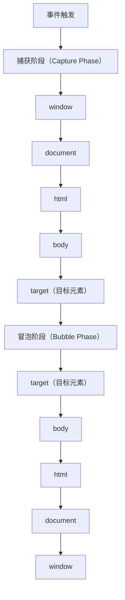

# 事件循环与Web安全

> 模块：04-browser（第4周 浏览器原理）
> 知识点：事件循环、跨域、Web存储、XSS、CSRF、CSP
> 前置知识：[浏览器渲染与V8原理](./01-浏览器渲染与V8原理-导览.md)

---

## 一、核心概念

浏览器是前端代码的运行环境，理解事件循环（Event Loop）能帮助我们写出正确的异步代码，理解 Web 安全能帮助我们构建安全的前端应用。

**核心概念要点：**

1. **事件循环**：JavaScript 单线程环境下的异步任务调度机制，通过宏任务和微任务队列实现非阻塞 IO。
2. **跨域**：浏览器的同源策略限制了不同源之间的资源访问，CORS 是最常用的跨域解决方案。
3. **Web 存储**：Cookie、localStorage、sessionStorage、IndexedDB 各有适用场景，需要根据需求选择。
4. **XSS 攻击**：跨站脚本攻击，攻击者通过注入恶意脚本窃取用户信息。
5. **CSRF 攻击**：跨站请求伪造，攻击者利用用户的登录状态发起恶意请求。
6. **CSP**：内容安全策略，通过 HTTP 头限制页面可以加载的资源来源，是防御 XSS 的强力手段。

---

## 二、底层原理

### 2.1 浏览器事件循环（Event Loop）

> **本主题权威章节**（其他模块的同主题内容均指向此处）。

JavaScript 是单线程语言，但能处理异步操作，靠的就是事件循环机制。

**两个核心队列：**

1. **宏任务队列（MacroTask Queue）**，存放：
   - `script`（整体代码段）
   - `setTimeout` / `setInterval`
   - `setImmediate`（Node.js 环境）
   - `I/O` 操作

2. **微任务队列（MicroTask Queue）**，存放：
   - `Promise.then` / `Promise.catch` / `Promise.finally`
   - `MutationObserver`（监听 DOM 变化）
   - `queueMicrotask` 显式添加微任务
   - `process.nextTick`（Node.js 环境，优先级高于其他微任务）

**执行顺序（核心规则）：**

```
1. 执行同步代码（script 整体是一个宏任务）
       ↓
2. 清空微任务队列（所有微任务全部执行完，包括执行过程中新产生的微任务）
       ↓
3. 取出一个宏任务执行
       ↓
4. 清空微任务队列
       ↓
5. 取出下一个宏任务执行
       ↓
... 循环往复
```

**关键规则：**
- 微任务队列必须完全清空后才能执行下一个宏任务
- 一个宏任务执行完后，如果微任务队列不为空，优先执行微任务
- 微任务执行过程中产生的新微任务，也会在当前轮次执行
- **UI 渲染时机**：在宏任务之间，浏览器可能执行 UI 渲染（渲染不属于宏任务或微任务队列，而是在事件循环的特定阶段由浏览器调度）

**事件循环全貌（一张图看懂）：**

```
┌─────────────────────────────────────────────────────┐
│                    JavaScript 主线程                  │
│                                                     │
│  ┌──────────────────┐                               │
│  │   调用栈 Call Stack │  ← 同步代码在这里执行           │
│  │  ┌─────────────┐  │                               │
│  │  │  func3()     │  │                               │
│  │  │  func2()     │  │                               │
│  │  │  func1()     │  │                               │
│  │  └─────────────┘  │                               │
│  └──────────────────┘                               │
│           ↓ 调用栈清空后                              │
│  ┌──────────────────┐                               │
│  │  微任务队列 (VIP)  │  ← Promise.then / Mutation   │
│  │  [task1][task2]  │    必须全部清空才能执行宏任务     │
│  └──────────────────┘                               │
│           ↓ 微任务清空后                              │
│  ┌──────────────────┐                               │
│  │  宏任务队列 (普通)  │  ← setTimeout / I/O           │
│  │  [task1][task2]  │    每次只取一个执行              │
│  └──────────────────┘                               │
│           ↓ 取一个宏任务 → 回到调用栈                   │
│  ┌──────────────────┐                               │
│  │   UI 渲染 (可选)   │  ← 在宏任务之间可能执行          │
│  └──────────────────┘                               │
└─────────────────────────────────────────────────────┘

执行顺序记忆口诀：
同步先跑 → 微任务清空 → 取一个宏任务 → 微任务再清空 → 取下一个宏任务 → 循环往复
```

> 把事件循环想象成**银行叫号**：你正在柜台办理业务（同步代码），VIP 客户（微任务，如 Promise.then）可以直接插队到柜台前等待，但必须等你办完才能开始。你办完后，所有排队的 VIP 一次性全部处理完——哪怕 VIP 办业务时又带了新 VIP（微任务嵌套），也得当场处理干净。全部 VIP 清空后，才叫下一个普通号（一个宏任务，如 setTimeout）。普通号办完，又检查有没有新 VIP，有就再清空，然后叫下一个普通号。这就是为什么微任务（VIP）永远比宏任务（普通号）先执行。

**经典面试题演示：**

```javascript
console.log('1'); // 同步

setTimeout(() => {
  console.log('2'); // 宏任务
}, 0);

Promise.resolve().then(() => {
  console.log('3'); // 微任务
});

console.log('4'); // 同步

// 输出顺序：1 → 4 → 3 → 2
```

带微任务嵌套的复杂情况：

```javascript
console.log('1');

setTimeout(() => {
  console.log('2');
  Promise.resolve().then(() => {
    console.log('3');
  });
}, 0);

new Promise((resolve) => {
  console.log('4'); // Promise 构造函数是同步执行的
  resolve();
}).then(() => {
  console.log('5');
  setTimeout(() => {
    console.log('6');
  }, 0);
});

console.log('7');

// 输出顺序：1 → 4 → 7 → 5 → 2 → 3 → 6
// 解析：
// 1. 同步：1, 4, 7
// 2. 清空微任务：5（同时产生宏任务 setTimeout 6）
// 3. 执行宏任务：2（同时产生微任务 3）
// 4. 清空微任务：3
// 5. 执行宏任务：6
```

### 2.2 requestAnimationFrame vs requestIdleCallback

**requestAnimationFrame（rAF）**：
- 在浏览器下次重绘之前执行回调
- 频率与屏幕刷新率同步（通常 60fps，即 16.6ms 一次）
- 适合动画、视觉更新，保证不掉帧
- 页面不可见时自动暂停，节省资源

**requestIdleCallback（rIC）**：
- 在浏览器空闲时执行回调（即一帧内剩余时间）
- 适合低优先级任务：数据上报、日志记录、预加载
- 不保证一定会执行（如果一直很忙）

```javascript
// rAF：做动画
function animate() {
  box.style.transform = `translateX(${x++}px)`;
  requestAnimationFrame(animate);
}
requestAnimationFrame(animate);

// rIC：做低优先级任务
requestIdleCallback((deadline) => {
  while (deadline.timeRemaining() > 0 && tasks.length > 0) {
    const task = tasks.shift();
    task();
  }
});
```

### 2.3 跨域原理与解决方案

**同源策略（Same-Origin Policy）**：
浏览器最基本的安全策略，限制不同源之间的交互。同源指**协议 + 域名 + 端口**三者完全相同。

| 对比项 | 是否同源 |
|-------|---------|
| https://a.com:443 与 https://a.com:443 | 同源 |
| http://a.com 与 https://a.com | 不同源（协议不同） |
| https://a.com 与 https://b.com | 不同源（域名不同） |
| https://a.com:3000 与 https://a.com:4000 | 不同源（端口不同） |

**常见跨域解决方案：**

#### (1) CORS（跨域资源共享）

最标准的跨域方案，由服务器设置响应头。

```http
Access-Control-Allow-Origin: https://example.com
# 或通配符（生产环境慎用）
Access-Control-Allow-Origin: *
```

**简单请求**：同时满足以下条件：
- 请求方法为 GET、HEAD、POST 之一
- Content-Type 限于 `text/plain`、`multipart/form-data`、`application/x-www-form-urlencoded`
- 没有自定义请求头

简单请求浏览器直接发送请求，服务器返回是否允许跨域。

**预检请求（Preflight）**：不满足简单请求条件时，浏览器先发送 OPTIONS 请求确认服务器是否允许跨域，通过后再发送实际请求。

```http
OPTIONS /api/data HTTP/1.1
Origin: https://example.com
Access-Control-Request-Method: PUT
Access-Control-Request-Headers: X-Custom-Header

# 服务器响应：
Access-Control-Allow-Origin: https://example.com
Access-Control-Allow-Methods: PUT, DELETE
Access-Control-Allow-Headers: X-Custom-Header
Access-Control-Max-Age: 86400  # 预检结果缓存时间（秒）
```

**携带 Cookie 的跨域请求**：需要同时设置：
- 服务器：`Access-Control-Allow-Credentials: true`（且 `Access-Control-Allow-Origin` 不能为 `*`）
- 客户端：`withCredentials: true`（xhr）或 `credentials: 'include'`（fetch）

#### (2) JSONP（JSON with Padding）

利用 `<script>` 标签不受同源策略限制的特性，只支持 GET 请求。

```javascript
// 前端定义回调函数
function handleResponse(data) {
  console.log(data);
}

// 动态创建 script 标签
const script = document.createElement('script');
script.src = 'https://api.example.com/data?callback=handleResponse';
document.body.appendChild(script);

// 服务器返回：handleResponse({"name": "test"})
// 浏览器执行后，handleResponse 函数被调用
```

**局限性：**
- 只支持 GET 请求
- 不支持请求头自定义
- 安全性差，容易受 XSS 攻击
- 错误处理困难

#### (3) 代理服务器

通过同源服务器转发请求，前端请求同源服务，服务端代理请求到目标服务器。

```javascript
// 开发环境：Vite / Webpack 配置 proxy
// vite.config.js
export default {
  server: {
    proxy: {
      '/api': {
        target: 'https://api.example.com',
        changeOrigin: true,
        rewrite: (path) => path.replace(/^\/api/, '')
      }
    }
  }
}
```

生产环境通常用 Nginx 反向代理：
```nginx
location /api/ {
    proxy_pass https://api.example.com/;
    proxy_set_header Host $host;
}
```

#### (4) postMessage（跨窗口通信）

HTML5 提供的跨窗口通信 API，可以安全地实现跨源通信。

```javascript
// 父页面发送消息
iframe.contentWindow.postMessage('hello', 'https://child.com');

// 子页面接收消息
window.addEventListener('message', (event) => {
  // 验证来源
  if (event.origin !== 'https://parent.com') return;
  console.log(event.data);
});
```

#### (5) WebSocket

WebSocket 协议不受同源策略限制，但握手阶段会携带 Origin 头，服务器可以验证。

#### (6) document.domain + iframe

仅适用于主域名相同、子域名不同的情况。将两个页面的 `document.domain` 设置为相同的主域名。

> **重要提示**：Chrome 115+ 已默认禁用 `document.domain` 赋值能力（除非服务器发送 `Origin-Agent-Cluster: ?0` 头选择退出），Firefox 也已跟进禁用该 API。现代浏览器中设置 `document.domain` 将静默失败或抛出异常。推荐使用 `postMessage` 或 CORS 替代。

```javascript
// a.example.com 和 b.example.com 都设置
// 注意：此 API 在 Chrome 115+ / Firefox 中已禁用，以下代码仅作历史参考
document.domain = 'example.com';
```

### 2.4 Web 存储机制对比

| 特性 | Cookie | localStorage | sessionStorage | IndexedDB |
|------|--------|-------------|---------------|-----------|
| 容量 | 约 4KB | 约 5MB | 约 5MB | 无上限（受磁盘限制） |
| 生命周期 | 可设置过期时间 | 永久存储（除非手动清除） | 关闭标签页后清除 | 永久存储 |
| 通信方式 | 每次 HTTP 请求自动携带 | 仅客户端存储 | 仅客户端存储 | 仅客户端存储 |
| 访问范围 | 同源，可设置 path | 同源 | 同源 + 同一标签页 | 同源 |
| 数据类型 | 字符串 | 字符串 | 字符串 | 结构化数据（对象、数组、文件） |
| API 方式 | 繁琐 | 简单 | 简单 | 异步，支持事务、索引 |
| 适用场景 | 用户认证、偏好设置 | 长期缓存、用户偏好 | 表单临时数据 | 大量结构化数据、离线应用 |

**代码示例：**

```javascript
// Cookie 操作
document.cookie = 'token=abc123; max-age=3600; path=/; secure; samesite=lax';

// localStorage
localStorage.setItem('theme', 'dark');
const theme = localStorage.getItem('theme');
localStorage.removeItem('theme');

// sessionStorage
sessionStorage.setItem('formData', JSON.stringify({ name: 'test' }));
const data = JSON.parse(sessionStorage.getItem('formData'));

// IndexedDB
const request = indexedDB.open('myDB', 1);
request.onsuccess = (event) => {
  const db = event.target.result;
  const transaction = db.transaction('users', 'readwrite');
  const store = transaction.objectStore('users');
  store.add({ id: 1, name: 'test' });
};
```

### 2.5 XSS（跨站脚本攻击）原理与防御

XSS（Cross-Site Scripting）是攻击者将恶意脚本注入到页面中，当用户访问该页面时，脚本在用户浏览器中执行。

**三种类型：**

1. **存储型 XSS（Stored XSS）**
   - 恶意脚本存储在服务器端（数据库、评论、留言等）
   - 用户访问页面时，脚本从服务器加载并执行
   - 危害最大，所有访问者都会被攻击

2. **反射型 XSS（Reflected XSS）**
   - 恶意脚本通过 URL 参数等方式传递
   - 服务器将参数直接反射到页面中
   - 需要诱导用户点击恶意链接

3. **DOM 型 XSS（DOM-based XSS）**
   - 纯粹在客户端发生，不经过服务器
   - 前端 JS 代码不当地将用户输入插入到 DOM 中

```javascript
// 反射型 XSS 示例
// URL: https://example.com/search?q=<script>alert('xss')</script>
// 服务器直接输出：<div>搜索结果：<script>alert('xss')</script></div>

// DOM 型 XSS 示例
const query = new URLSearchParams(location.search).get('q');
document.getElementById('result').innerHTML = query; // 危险！
```

**防御措施：**

1. **输入校验 + 输出编码**
   - 对用户输入进行校验，对特殊字符进行转义
   - 使用 `textContent` 代替 `innerHTML`，使用安全的方法操作 DOM

```javascript
// 不安全
element.innerHTML = userInput;

// 安全
element.textContent = userInput;

// 如果必须用 innerHTML，使用 DOMPurify 等库进行清理
import DOMPurify from 'dompurify';
element.innerHTML = DOMPurify.sanitize(userInput);
```

2. **CSP（内容安全策略）**
   - 通过 HTTP 响应头限制脚本来源
   ```http
   Content-Security-Policy: script-src 'self'; object-src 'none'
   ```
   - 禁止内联脚本，必须从可信来源加载

3. **HttpOnly Cookie**
   - 设置 HttpOnly 属性后，JavaScript 无法读取 Cookie
   ```http
   Set-Cookie: token=abc123; HttpOnly; Secure; SameSite=Strict
   ```

4. **X-XSS-Protection**
   - 浏览器内置的 XSS 过滤器（已逐渐被 CSP 取代）
   ```http
   X-XSS-Protection: 1; mode=block
   ```

### 2.6 CSRF（跨站请求伪造）原理与防御

CSRF（Cross-Site Request Forgery）利用用户的登录状态，诱导用户点击恶意链接或访问恶意页面，以用户身份发起非预期的请求。

**攻击原理：**
1. 用户登录了 A 网站，浏览器保存了 A 网站的 Cookie
2. 用户访问了恶意网站 B
3. B 网站发送请求到 A 网站，浏览器自动携带 A 网站的 Cookie
4. A 网站以为是用户自己发起的请求，执行操作

```html
<!-- 恶意网站中的代码 -->

<!-- GET 请求，浏览器自动携带 Cookie -->
```

**防御措施：**

1. **CSRF Token**
   - 服务器生成随机 Token，嵌入表单或请求头
   - 提交时验证 Token，攻击者无法获取 Token

2. **SameSite Cookie 属性**
   ```http
   Set-Cookie: token=abc123; SameSite=Strict
   ```
   - `Strict`：完全禁止第三方请求携带 Cookie（最安全）
   - `Lax`：允许部分安全的第三方请求携带（如 GET 表单提交、链接跳转）
   - `None`：所有请求都携带（需要配合 `Secure` 属性）

3. **Referer / Origin 校验**
   - 服务器检查请求来源，拒绝来自非许可域名的请求

4. **双重 Cookie 验证**
   - 请求中携带自定义请求头，并读取 Cookie 中的值，两者一致才通过
   - 攻击者无法读取 Cookie，所以无法设置相同的请求头

> **生活化类比**：XSS 就像有人在你的日记本里偷偷夹了一段"自动化指令"——当你翻开日记本时，这段指令自动执行（比如把你的秘密拍照发给别人）。存储型 XSS 是纸条被胶水粘在日记里（存在服务器），每个翻到这一页的人都会触发；反射型 XSS 是纸条夹在信封里（URL 参数），只有打开那封信的人才触发；DOM 型 XSS 是纸条直接塞进你手里（前端 JS 直接插入），根本不经过邮局。防御方式：把纸条和正文分开存放（HttpOnly Cookie 防止 JS 读取），对任何夹带的纸条都先消毒再放入（输入过滤/输出编码），明确告诉浏览器哪些指令可以执行（CSP 内容安全策略）。

### 2.7 点击劫持（Clickjacking）防御

**攻击原理：** 攻击者在一个透明的 iframe 中加载目标页面，覆盖在用户看到的内容上面。用户以为点击的是看到的按钮，实际点击的是透明 iframe 中的按钮。

**防御措施：**

1. **X-Frame-Options**
   ```http
   X-Frame-Options: DENY           # 禁止任何页面嵌入
   X-Frame-Options: SAMEORIGIN     # 允许同源页面嵌入
   ```

2. **CSP frame-ancestors**
   ```http
   Content-Security-Policy: frame-ancestors 'self'
   Content-Security-Policy: frame-ancestors https://trusted.com
   ```

### 2.8 内容安全策略（CSP）

CSP 通过 HTTP 响应头或 `<meta>` 标签，告诉浏览器哪些资源可以加载和执行。

**响应头配置：**

```http
Content-Security-Policy: default-src 'self'; script-src 'self' https://trusted-cdn.com; style-src 'self' 'unsafe-inline'; img-src *; connect-src 'self' https://api.example.com; font-src 'self'; object-src 'none'; frame-ancestors 'self'; base-uri 'self'; form-action 'self'
```

**常用指令说明：**

| 指令 | 控制内容 | 常用值 |
|------|---------|--------|
| `default-src` | 默认源，其他指令未设置时的回退值 | `'self'` |
| `script-src` | JavaScript 脚本来源 | `'self'` `'nonce-xxx'` `'strict-dynamic'` |
| `style-src` | CSS 样式来源 | `'self'` `'unsafe-inline'` |
| `img-src` | 图片来源 | `*` `'self'` |
| `connect-src` | AJAX、WebSocket 等连接来源 | `'self'` |
| `font-src` | 字体来源 | `'self'` |
| `object-src` | 插件来源（如 Flash） | `'none'` |
| `frame-ancestors` | 可嵌入当前页面的域名 | `'self'` |
| `form-action` | 表单提交目标 | `'self'` |

### DOM 事件捕获与冒泡流程



DOM 事件传播分为三个阶段：**捕获阶段**事件从 `window` 向下逐层传递到目标元素，**目标阶段**在目标元素上触发，**冒泡阶段**事件从目标元素向上逐层回溯到 `window`。默认情况下，`addEventListener` 在冒泡阶段执行，设置第三个参数为 `true` 则可在捕获阶段执行。理解这一流程有助于正确处理事件委托和阻止事件传播。

> 📖 **参考链接**：
> - [MDN - 事件循环（Event Loop）](https://developer.mozilla.org/zh-CN/docs/Web/JavaScript/EventLoop)
> - [MDN - 跨站脚本攻击（XSS）](https://developer.mozilla.org/zh-CN/docs/Glossary/Cross-site_scripting)
> - [MDN - 跨站请求伪造（CSRF）](https://developer.mozilla.org/zh-CN/docs/Glossary/CSRF)
> - [MDN - 内容安全策略（CSP）](https://developer.mozilla.org/zh-CN/docs/Web/HTTP/CSP)
> - [MDN - 跨域资源共享（CORS）](https://developer.mozilla.org/zh-CN/docs/Web/HTTP/CORS)

---

## 三、实战应用

### 3.1 事件循环实战：异步任务调度

```javascript
// 优化：将耗时操作拆分，避免阻塞主线程
function processLargeArray(items) {
  const chunkSize = 1000;
  let index = 0;

  function processChunk() {
    const end = Math.min(index + chunkSize, items.length);
    for (; index < end; index++) {
      // 处理每个元素
      heavyProcess(items[index]);
    }
    if (index < items.length) {
      // 用 setTimeout 将控制权交还给浏览器，避免阻塞渲染
      setTimeout(processChunk, 0);
    }
  }
  setTimeout(processChunk, 0);
}
```

### 3.2 安全编码实践

```javascript
// 1. 防止 XSS：安全地渲染用户内容
function safeRender(userContent) {
  // 使用 textContent 而非 innerHTML
  const div = document.createElement('div');
  div.textContent = userContent;
  return div;
}

// 2. 使用 CSP 的非内联脚本方式
// 不给内联脚本添加 nonce 属性，只允许外部脚本

// 3. 设置安全的 Cookie
// 后端设置：
// Set-Cookie: session=xxx; HttpOnly; Secure; SameSite=Lax; Path=/

// 4. 前端 CSRF Token 实现
fetch('/api/data', {
  method: 'POST',
  headers: {
    'Content-Type': 'application/json',
    'X-CSRF-Token': getCsrfToken() // 从 Cookie 或 meta 标签获取
  },
  body: JSON.stringify(data)
});
```

### 3.3 跨域开发实践

```javascript
// 开发环境代理配置（Vite）
// vite.config.js
export default {
  server: {
    proxy: {
      '/api': {
        target: 'http://localhost:3000',
        changeOrigin: true
      }
    }
  }
};

// 生产环境 CORS 配置（Express 示例）
const express = require('express');
const cors = require('cors');

app.use(cors({
  origin: 'https://your-frontend.com',
  credentials: true,
  methods: ['GET', 'POST', 'PUT', 'DELETE'],
  allowedHeaders: ['Content-Type', 'Authorization']
}));
```

---

## 四、常见面试题

**Q1：事件循环中，宏任务和微任务优先级是什么？**
A：微任务优先级高于宏任务。每次执行完一个宏任务，都会立即清空微任务队列，微任务队列未清空前，不会执行下一个宏任务。微任务中产生的新微任务也会在当前轮次执行。

**Q2：requestAnimationFrame 和 setTimeout 做动画哪个更好？为什么？**
A：requestAnimationFrame 更好。原因：（1）与屏幕刷新率同步，保证不掉帧；（2）页面不可见时自动暂停，节省资源；（3）浏览器会优化，将多个 rAF 合并到同一帧执行。

**Q3：CORS 预检请求是什么？什么情况下触发？**
A：浏览器在发送跨域请求前，先发送 OPTIONS 请求询问服务器是否允许跨域。触发条件：请求方法不是 GET/HEAD/POST 之一，或 Content-Type 不在简单类型中，或包含自定义请求头。

**Q4：Cookie 的 SameSite 属性有哪些值？**
A：Strict（完全禁止第三方 Cookie）、Lax（允许安全的第三方请求，如链接跳转）、None（所有请求都发送，需配合 Secure）。

**Q5：XSS 和 CSRF 的区别是什么？**
A：XSS 是攻击者将恶意脚本注入页面，在用户浏览器执行，目标是窃取用户信息；CSRF 是攻击者利用用户登录状态，诱导用户执行非预期操作，目标是以用户身份发起请求。

---

## 五、避坑指南

| 常见错误 | 现象 | 原因 | 解决方案 |
|---------|------|------|---------|
| 用 innerHTML 渲染用户输入 | 页面被注入恶意脚本 | innerHTML 会执行 HTML 中的脚本 | 使用 textContent 或 DOMPurify 清理 |
| 不知道 Promise 构造函数是同步执行的 | 输出顺序对不上预期 | new Promise 的回调参数是同步的 | 只把异步操作放在 Promise 构造函数中 |
| 在微任务中无限递归 | 页面卡死，无法响应 | 微任务不断产生新微任务，永远清空不完 | 微任务中不要递归产生微任务，改用 setTimeout |
| Cookie 不设置 SameSite | Chrome 默认 SameSite=Lax，可能影响跨站请求 | 浏览器默认行为变化 | 明确设置 SameSite 属性 |
| 跨域请求没带 Cookie | 后端拿不到 session | 跨域请求默认不带 Cookie | 服务器设置 `Access-Control-Allow-Credentials`，客户端设置 `withCredentials` |
| CORS 使用 `*` 且带 Cookie | 请求失败 | 带 Cookie 时 `Access-Control-Allow-Origin` 不能为 `*` | 必须指定具体域名 |
| CSRF Token 放在 Cookie 中 | Token 失效 | Cookie 会被自动携带，攻击者也能利用 | Token 放在请求头或表单中，不在 Cookie 中 |
| 忘记移除事件监听 | 内存泄漏，逻辑混乱 | 元素已删但监听还在，或监听多次触发 | 组件卸载时 removeEventListener |
| 使用 document.domain 跨域 | 部分浏览器不支持 | 该 API 已被 Chrome 115+ 和 Firefox 默认禁用，不再可用 | 使用 postMessage 或 CORS 替代 |
| 大量使用 localStorage 存敏感数据 | 数据泄露风险 | localStorage 是明文存储，XSS 可读取 | 敏感数据存 HttpOnly Cookie，或加密存储 |

---

> **学习导航**：
> - 返回 [学习路线总览](../README.md)
> - 本模块其他内容：[01-浏览器渲染与V8原理](./01-浏览器渲染与V8原理.md) | [03-浏览器笔面试题集](./03-浏览器笔面试题集.md)
> - 实战应用：[企业后台管理系统](../10-project/01-企业后台管理系统实战.md)

---

## 本章学习自检

- [ ] 能完整描述浏览器事件循环的执行顺序（宏任务 + 微任务 + UI 渲染）
- [ ] 能区分宏任务和微任务，知道各自包含哪些类型
- [ ] 理解 requestAnimationFrame 和 requestIdleCallback 的适用场景
- [ ] 能说出同源策略的定义和常见的跨域方案（至少 4 种）
- [ ] 理解 CORS 简单请求和预检请求的区别
- [ ] 能说出 Cookie、localStorage、sessionStorage、IndexedDB 的容量和生命周期差异
- [ ] 能区分 XSS 的三种类型和防御手段
- [ ] 理解 CSRF 原理和防御措施，尤其是 SameSite Cookie
- [ ] 知道点击劫持的原理和防御方法
- [ ] 能正确配置 CSP 头来限制资源加载来源
- [ ] 会用 `navigator.storage.estimate()` 查询用量与配额，理解它为什么只是估计值
- [ ] 理解 `navigator.storage.persist()` 的作用与各浏览器的授权策略
- [ ] 能说出各存储方案的容量量级，以及淘汰策略的粒度与 LRU 依据
- [ ] 会处理 `QuotaExceededError`（localStorage 同步抛出、IndexedDB 事务 abort）
- [ ] 能说清 IndexedDB 三种事务模式与事务自动提交的时机
- [ ] 会建索引、用游标与 `IDBKeyRange` 做范围查询，并知道 `continue()` 的必要性
- [ ] 会写版本升级逻辑（`onupgradeneeded` 增量迁移）并处理多标签页 `onblocked`
- [ ] 能对比 IndexedDB 与 localStorage 的选型依据

---

## 补充：WebSocket 基础

### 1. WebSocket 概念

WebSocket 是一种在单个 TCP 连接上实现**全双工通信**的协议，由 HTML5 提出并由 IETF 标准化为 RFC 6455。与传统的 HTTP 请求-响应模式不同，WebSocket 在完成握手后，客户端与服务器之间会建立一条持久化的双向通道，双方都可以随时主动发送数据，无需等待对方请求。

**HTTP 与 WebSocket 的核心区别：**

| 维度 | HTTP（传统模式） | WebSocket |
|------|-----------------|-----------|
| 通信模式 | 请求-响应（客户端主动，服务器被动） | 全双工（双方均可主动发送） |
| 连接方式 | 每次请求建立连接，响应后关闭（HTTP/1.1 默认短连接） | 一次握手后保持长连接，持续复用 |
| 数据方向 | 单向（客户端请求，服务器响应） | 双向（客户端与服务器均可随时推送） |
| 头部开销 | 每次请求携带完整 HTTP 头（几百字节到几 KB） | 握手后数据帧头部仅 2-14 字节 |
| 适用场景 | 常规页面请求、RESTful API、静态资源 | 实时推送、聊天、协作编辑、游戏、金融行情 |

**形象理解：** HTTP 像是**打电话问问题**，问一句答一句，每次都要重新拨号；WebSocket 像是**开着对讲机聊天**，接通后双方随时可以说话和收听，不需要反复拨号。

### 2. ws:// 与 wss:// 协议

WebSocket 协议在 URL 中使用自有协议标识符：

| 协议标识 | 对应 HTTP | 说明 |
|---------|----------|------|
| `ws://` | `http://` | 非加密 WebSocket 连接，默认端口 80 |
| `wss://` | `https://` | 基于 TLS 加密的 WebSocket 连接，默认端口 443 |

生产环境必须使用 `wss://`，原因与 HTTP 必须升级为 HTTPS 一致——避免中间人攻击和数据窃听：

```javascript
// 开发环境
const ws = new WebSocket('ws://localhost:3000/chat');

// 生产环境
const ws = new WebSocket('wss://api.example.com/chat');
```

### 3. 客户端 API

#### 3.1 创建连接

```javascript
const ws = new WebSocket('wss://api.example.com/chat');
```

构造函数接受一个 URL 参数，可选第二个参数为子协议（如 `'soap'`、`'wamp'`）。调用后浏览器立即发起握手请求。

#### 3.2 readyState 状态

`WebSocket.readyState` 表示连接当前所处的状态，有四个常量值：

| 常量 | 数值 | 含义 |
|------|------|------|
| `WebSocket.CONNECTING` | 0 | 正在建立连接（握手阶段） |
| `WebSocket.OPEN` | 1 | 连接已建立，可以通信 |
| `WebSocket.CLOSING` | 2 | 正在关闭连接（挥手阶段） |
| `WebSocket.CLOSED` | 3 | 连接已关闭或无法打开 |

```javascript
if (ws.readyState === WebSocket.OPEN) {
  ws.send('连接已就绪，可以发送消息');
}
```

#### 3.3 事件处理

WebSocket 通过事件驱动的方式处理通信，提供四个核心事件：

| 事件 | 触发时机 | 典型用途 |
|------|---------|---------|
| `onopen` | 连接成功建立时触发 | 发送初始请求、订阅频道、启动心跳 |
| `onmessage` | 收到服务器消息时触发 | 解析并处理服务端推送的数据 |
| `onerror` | 连接发生错误时触发 | 记录错误日志、触发重连 |
| `onclose` | 连接关闭时触发 | 清理资源、触发重连逻辑 |

```javascript
const ws = new WebSocket('wss://api.example.com/chat');

ws.onopen = (event) => {
  console.log('WebSocket 连接已建立');
  // 连接成功后可以发送欢迎消息或订阅
  ws.send(JSON.stringify({ type: 'subscribe', channel: 'room-1' }));
};

ws.onmessage = (event) => {
  // event.data 为服务器发送的数据（字符串形式）
  const message = JSON.parse(event.data);
  console.log('收到消息：', message);
  renderMessage(message);
};

ws.onerror = (event) => {
  console.error('WebSocket 发生错误：', event);
};

ws.onclose = (event) => {
  console.log(`WebSocket 连接已关闭，code: ${event.code}, reason: ${event.reason}`);
  // event.code 为标准关闭码，如 1000=正常关闭，1001=端点离开，1006=异常关闭
  if (event.code !== 1000) {
    // 非正常关闭，触发重连
    reconnect();
  }
};
```

#### 3.4 send() 方法

`send()` 方法用于向服务器发送数据，支持文本和二进制两种格式：

```javascript
// 发送文本（JSON 字符串是最常见的做法）
ws.send(JSON.stringify({ type: 'message', content: 'Hello!' }));

// 发送二进制数据 - ArrayBuffer
const buffer = new ArrayBuffer(8);
const view = new DataView(buffer);
view.setInt32(0, 42);
ws.send(buffer);

// 发送二进制数据 - Blob（适合发送图片、文件等）
const blob = new Blob(['Hello World'], { type: 'text/plain' });
ws.send(blob);

// 注意：send() 只能在 readyState === OPEN 时调用，否则会抛出异常
function safeSend(data) {
  if (ws.readyState === WebSocket.OPEN) {
    ws.send(data);
  } else {
    console.warn('WebSocket 尚未连接，消息放入待发送队列');
    pendingQueue.push(data);
  }
}
```

#### 3.5 close() 方法

```javascript
// 正常关闭（可选传入关闭码和原因描述）
ws.close(1000, '用户主动断开');

// 常用关闭码
// 1000 - 正常关闭
// 1001 - 端点离开（页面关闭、导航离开）
// 1006 - 异常关闭（连接丢失，框架自动设置，无法手动指定）
// 1008 - 协议错误
// 1011 - 服务器内部错误
```

### 4. WebSocket vs HTTP 对比

| 对比维度 | HTTP | WebSocket |
|---------|------|-----------|
| 通信模式 | 请求-响应，半双工 | 全双工双向通信 |
| 连接方式 | 每次请求/响应后断开（HTTP/1.1 keep-alive 可复用但仍为请求-响应模式） | 一次握手后保持持久连接 |
| 适用场景 | RESTful API、静态资源请求、表单提交 | 实时聊天、股票行情、协作编辑、多人游戏、监控面板 |
| 头部开销 | 每次请求 200-2000+ 字节 | 握手后每帧仅 2-14 字节 |
| 协议标识 | `http://` / `https://` | `ws://` / `wss://` |
| 服务端推送 | 不支持原生推送（需轮询、长轮询或 SSE） | 原生支持服务器主动推送 |
| 浏览器支持 | 全平台 | 所有现代浏览器（IE 10+） |
| 同源策略 | 严格受同源策略限制 | 不受同源策略限制（服务器可验证 Origin 头） |

### 5. WebSocket vs SSE 对比

SSE（Server-Sent Events）是另一种服务端推送技术，两者各有适用场景：

| 对比维度 | WebSocket | SSE（Server-Sent Events） |
|---------|-----------|--------------------------|
| 通信方向 | **双向**（客户端和服务器均可发送） | **单向**（仅服务器推送给客户端） |
| 底层协议 | WebSocket 协议（`ws://` / `wss://`） | HTTP 协议（`text/event-stream`） |
| 自动重连 | 需手动实现重连逻辑 | 浏览器原生支持自动重连（`EventSource` 默认行为） |
| 二进制支持 | 支持（ArrayBuffer、Blob） | 仅支持文本（UTF-8），二进制需 Base64 编码 |
| 浏览器支持 | 所有现代浏览器 | 所有现代浏览器（IE 不支持） |
| 连接数限制 | 无同源限制，受服务器能力限制 | HTTP/1.1 下同源最多 6 个连接（HTTP/2 无此限制） |
| 自定义头部 | 无原生支持（需借助第三方库） | 支持通过 `EventSource` 构造函数第二个参数（部分浏览器） |
| 适用场景 | 聊天、游戏、协作编辑等需要双向通信 | 新闻推送、股票行情、通知、日志流等服务器推送 |

**选择建议：**
- 需要客户端频繁发送数据到服务器、或双向低延迟通信 → 使用 WebSocket
- 仅需服务器向客户端推送数据、客户端偶尔发送请求 → 使用 SSE（更简单，HTTP 兼容性好，天然支持断线重连）

### 6. 代码示例

#### 6.1 简易聊天室客户端

```javascript
class ChatClient {
  constructor(url) {
    this.url = url;
    this.ws = null;
    this.reconnectAttempts = 0;
    this.maxReconnectAttempts = 5;
    this.reconnectDelay = 1000; // 初始重连延迟 1s
    this.heartbeatTimer = null;
    this.heartbeatTimeout = 30000; // 心跳间隔 30s
    this.pendingQueue = []; // 待发送消息队列
  }

  connect() {
    this.ws = new WebSocket(this.url);

    this.ws.onopen = () => {
      console.log('[Chat] 连接成功');
      this.reconnectAttempts = 0;
      this.startHeartbeat();
      // 连接成功后发送队列中的待发消息
      this.flushPendingQueue();
    };

    this.ws.onmessage = (event) => {
      try {
        const msg = JSON.parse(event.data);
        this.handleMessage(msg);
      } catch (err) {
        console.error('[Chat] 消息解析失败：', err);
      }
    };

    this.ws.onerror = (error) => {
      console.error('[Chat] 连接错误：', error);
    };

    this.ws.onclose = (event) => {
      console.log(`[Chat] 连接关闭，code: ${event.code}`);
      this.stopHeartbeat();
      if (event.code !== 1000 && event.code !== 1001) {
        this.reconnect();
      }
    };
  }

  // 发送消息
  send(type, payload) {
    const data = JSON.stringify({ type, payload, timestamp: Date.now() });
    if (this.ws && this.ws.readyState === WebSocket.OPEN) {
      this.ws.send(data);
    } else {
      console.warn('[Chat] 未连接，消息加入待发送队列');
      this.pendingQueue.push(data);
    }
  }

  // 处理收到的消息
  handleMessage(msg) {
    switch (msg.type) {
      case 'chat':
        console.log(`[${msg.nickname}]: ${msg.content}`);
        break;
      case 'system':
        console.log(`[系统]: ${msg.content}`);
        break;
      case 'pong':
        // 心跳响应，连接正常
        break;
      default:
        console.log('[未知消息类型]:', msg);
    }
  }

  // 心跳检测
  startHeartbeat() {
    this.stopHeartbeat();
    this.heartbeatTimer = setInterval(() => {
      if (this.ws && this.ws.readyState === WebSocket.OPEN) {
        this.ws.send(JSON.stringify({ type: 'ping' }));
      }
    }, this.heartbeatTimeout);
  }

  stopHeartbeat() {
    if (this.heartbeatTimer) {
      clearInterval(this.heartbeatTimer);
      this.heartbeatTimer = null;
    }
  }

  // 断线重连（指数退避策略）
  reconnect() {
    if (this.reconnectAttempts >= this.maxReconnectAttempts) {
      console.error('[Chat] 重连次数已达上限，停止重连');
      return;
    }
    const delay = Math.min(
      this.reconnectDelay * Math.pow(2, this.reconnectAttempts),
      30000 // 最大延迟 30s
    );
    this.reconnectAttempts++;
    console.log(`[Chat] 将在 ${delay / 1000}s 后尝试第 ${this.reconnectAttempts} 次重连...`);
    setTimeout(() => this.connect(), delay);
  }

  // 发送待发送队列中的消息
  flushPendingQueue() {
    while (this.pendingQueue.length > 0) {
      const data = this.pendingQueue.shift();
      this.ws.send(data);
    }
  }

  // 断开连接
  disconnect() {
    this.stopHeartbeat();
    if (this.ws) {
      this.ws.close(1000, '用户主动断开');
      this.ws = null;
    }
  }
}

// 使用示例
const chat = new ChatClient('wss://api.example.com/chat');
chat.connect();
chat.send('chat', { content: '大家好！', nickname: '小明' });
```

#### 6.2 心跳检测机制

WebSocket 连接可能因为网络波动、代理超时等原因变为"僵尸连接"（TCP 连接存在但已无法通信），因此必须实现心跳检测：

```javascript
class HeartbeatManager {
  constructor(ws, options = {}) {
    this.ws = ws;
    this.pingInterval = options.pingInterval || 30000;  // 发送心跳间隔
    this.pongTimeout = options.pongTimeout || 10000;    // 等待 pong 超时时间
    this.pingTimer = null;
    this.pongTimer = null;
    this.onTimeout = options.onTimeout || (() => {
      console.warn('心跳超时，主动关闭连接');
      this.ws.close();
    });
  }

  start() {
    this.stop();
    this.schedulePing();
  }

  schedulePing() {
    this.pingTimer = setTimeout(() => {
      if (this.ws.readyState === WebSocket.OPEN) {
        this.ws.send(JSON.stringify({ type: 'ping' }));
        // 设置 pong 超时计时器
        this.pongTimer = setTimeout(() => {
          this.onTimeout();
        }, this.pongTimeout);
      }
      this.schedulePing(); // 安排下一次心跳
    }, this.pingInterval);
  }

  // 收到 pong 响应时调用，清除超时计时器
  handlePong() {
    if (this.pongTimer) {
      clearTimeout(this.pongTimer);
      this.pongTimer = null;
    }
  }

  stop() {
    if (this.pingTimer) {
      clearTimeout(this.pingTimer);
      this.pingTimer = null;
    }
    if (this.pongTimer) {
      clearTimeout(this.pongTimer);
      this.pongTimer = null;
    }
  }
}

// 在 WebSocket 的 onmessage 中集成
ws.onmessage = (event) => {
  const msg = JSON.parse(event.data);
  if (msg.type === 'pong') {
    heartbeat.handlePong();
    return;
  }
  // 处理其他业务消息...
};
```

### 7. 避坑要点

| 常见问题 | 现象 | 原因 | 解决方案 |
|---------|------|------|---------|
| 未实现断线重连 | 网络波动后连接断开，无法恢复 | 未监听 `onclose` 事件或未实现重连逻辑 | 监听 `onclose`，实现指数退避重连策略（见上方代码示例） |
| 未实现心跳保活 | 连接看似正常但消息收发失败（僵尸连接） | 中间代理、NAT 设备可能因空闲超时断开 TCP 连接 | 客户端定期发送 ping，服务器响应 pong，超时后主动关闭重连 |
| 消息序列化错误 | 接收方无法解析消息，或报 JSON 解析错误 | 发送复杂对象时忘记 `JSON.stringify`，或接收方忘记 `JSON.parse` | 统一约定消息格式，发送前序列化，接收后反序列化，并加 try-catch 保护 |
| 在连接未就绪时调用 send() | 消息发送失败，抛出 `InvalidStateError` | readyState 不为 OPEN 时调用 send() | 封装 safeSend() 方法检查 readyState，或使用消息队列暂存 |
| 未处理 onerror 事件 | 连接异常时无任何提示，排查困难 | 没有监听 onerror 事件 | 始终监听 onerror 并记录日志，便于排查 |
| 大量连接未关闭 | 内存泄漏，服务器连接数耗尽 | 页面卸载时未关闭 WebSocket | 在 `beforeunload` 或组件卸载时调用 `ws.close()` |
| 未设置合理的重连上限 | 无限重连导致服务器压力过大 | 没有重连次数限制 | 设置最大重连次数（如 5 次），超过后停止重连并通知用户 |
| 生产环境使用 ws:// | 数据明文传输，存在中间人攻击风险 | 使用非加密协议 | 生产环境必须使用 `wss://` |
| 未处理服务端主动关闭 | 客户端仍尝试发送消息，但连接已断开 | 未监听 `onclose` 或未正确处理关闭码 | 在 `onclose` 中根据 `event.code` 判断是否需要重连 |
| 消息量大时未压缩 | 带宽占用高，延迟增加 | 未对消息体进行压缩 | 对大型消息体使用压缩算法（如 per-message-deflate 扩展），或使用二进制格式代替 JSON |

---

## 补充：存储配额与持久化

### 1. 概念定义

- **配额（quota）**：浏览器为每个源（origin）分配的存储额度上限。
- **用量（usage）**：当前源已经占用的字节数。
- **持久化存储（persistent storage）**：一种「不会被浏览器在磁盘压力下自动清理」的存储状态，通过 `navigator.storage.persist()` 申请。
- **淘汰（eviction）**：磁盘空间紧张时，浏览器清理某些源的全部本地数据的行为。
- **QuotaExceededError**：写入超出配额时抛出的 `DOMException`。

同一个源下的 localStorage、sessionStorage、IndexedDB、Cache Storage、OPFS 共享**同一个配额池**。

### 2. 底层原理

- **`navigator.storage.estimate()`**：返回 `Promise<{ quota, usage, usageDetails? }>`，`usage` 为已用字节数、`quota` 为可用上限的估计值。为了防止通过存储数值做指纹追踪，浏览器会对结果**取整/桶化**（Chrome 会归整到较大的粒度），所以它只是估计值，不能用来做精确的容量判断。部分浏览器（如 Chrome）还会额外提供 `usageDetails`。
- **`navigator.storage.persist()` / `persisted()`**：前者申请持久化并返回 `Promise<boolean>`，后者查询当前状态。授权策略由浏览器决定：Chrome 依据站点参与度、是否安装为 PWA、是否有通知权限等启发式规则**自动授予**（不弹窗）；Firefox 会**弹窗询问用户**；Safari 有自己的规则。持久化的唯一意义就是**免于被 eviction 清理**。
- **淘汰策略**：默认的 best-effort 存储会在磁盘压力下被清理，清理粒度是**整个源**（要么全部保留、要么全部清除），选择依据是 **LRU（Least Recently Used，最久未使用的源优先被清）**。所以「用户数据只存在浏览器里」是不可靠的。
- **Safari 的额外限制（ITP）**：对脚本可写入的存储（localStorage、IndexedDB、Cache 等）实施 7 天无交互清理（Safari 13.1+ 引入，后续版本有调整）。
- **配额上限量级**（各浏览器数值随版本调整，这里只给量级与相对关系，精确值以 MDN 与浏览器官方文档为准）：

| 存储 | 容量量级 | 说明 |
|------|---------|------|
| Cookie | 单条约 4KB，单域名数量有限（几十个） | 每次请求自动携带，只适合存会话标识 |
| localStorage / sessionStorage | 约 5MB / 源 | 同步 API，只存字符串 |
| IndexedDB / Cache Storage / OPFS | 共享源配额 | Chrome 全浏览器池约为磁盘的 80%、单源约为磁盘的 60%；Firefox 单组（eTLD+1）约为磁盘的 10%、全局约 50%；Safari 初始约 1GB，超出后需用户授权 |

- **QuotaExceededError 的表现形式**：
  - `localStorage.setItem` **同步抛出** `DOMException`（`name === "QuotaExceededError"`，`code === 22`）；
  - IndexedDB 的写入超限会让**事务被 abort**，请求的 `error` 是 `QuotaExceededError`；
  - Cache API / OPFS 写入同样会抛出该错误；
  - Safari 无痕模式下 localStorage 配额为 0，`setItem` 会直接抛 `QuotaExceededError`。

### 3. 代码示例

```javascript
// ========== 1. 查询用量与配额 ==========
async function reportStorage() {
  // 注意：StorageManager 只在安全上下文（HTTPS / localhost）可用
  if (!navigator.storage?.estimate) {
    console.warn("当前浏览器不支持 StorageManager.estimate()");
    return;
  }

  const { quota = 0, usage = 0 } = await navigator.storage.estimate();
  const usedMB = (usage / 1024 / 1024).toFixed(2);
  const quotaGB = (quota / 1024 / 1024 / 1024).toFixed(2);
  const percent = quota ? ((usage / quota) * 100).toFixed(2) : "0.00";
  console.log(`已用 ${usedMB} MB / 配额约 ${quotaGB} GB（${percent}%）`);

  // 结果被浏览器取整过，只能当量级参考
}

reportStorage();
```

```javascript
// ========== 2. 申请持久化存储 ==========
async function ensurePersistent() {
  if (!navigator.storage?.persist) return false;

  // 先看是否已经是持久化状态
  if (await navigator.storage.persisted()) {
    console.log("已经是持久化存储");
    return true;
  }

  // Chrome 按启发式规则直接给出结果（不弹窗）；Firefox 会弹窗询问用户
  const granted = await navigator.storage.persist();
  console.log(
    granted
      ? "已获得持久化存储，磁盘压力下不会被自动清理"
      : "仍是 best-effort 存储，磁盘紧张时可能被整体清理",
  );
  return granted;
}

// 典型调用时机：用户开启"离线可用"、导入重要数据之后
document.querySelector("#enable-offline")?.addEventListener("click", ensurePersistent);
```

```javascript
// ========== 3. localStorage 超限处理 ==========
function safeSetItem(key, value) {
  try {
    localStorage.setItem(key, value);
    return true;
  } catch (err) {
    // 配额超限、Safari 无痕模式（配额为 0）都会走到这里
    if (err instanceof DOMException && (err.name === "QuotaExceededError" || err.code === 22)) {
      // 策略一：清掉过期 / 低优先级的缓存后重试
      clearLowPriorityCache();
      try {
        localStorage.setItem(key, value);
        return true;
      } catch {
        // 策略二：降级，只保留必要的元数据，其余走内存
        console.warn("本地存储已满，本次写入被丢弃");
        return false;
      }
    }
    throw err; // 其它错误（如禁用存储）继续抛出
  }
}
```

```javascript
// ========== 4. IndexedDB 写入超限：事务被 abort ==========
const tx = db.transaction("blobs", "readwrite");
tx.objectStore("blobs").put(largeBlob);

tx.onabort = () => {
  const err = tx.error;
  if (err?.name === "QuotaExceededError") {
    console.error("磁盘配额不足，写入已中止，请清理旧数据或申请持久化存储");
  }
};

tx.oncomplete = () => console.log("写入成功");
```

```javascript
// ========== 5. 用"失败驱动"替代"容量预判" ==========
// 不推荐：用 estimate() 判断"还能不能写"——quota 会随磁盘剩余空间变化，判断不可靠
// 推荐：直接写，失败后再降级，并给出用户可理解的提示
async function saveDraft(draft) {
  try {
    await idbPut("drafts", draft);
  } catch (err) {
    if (err?.name === "QuotaExceededError") {
      await navigator.storage.persist(); // 尝试申请持久化
      await cleanupOldDrafts();          // 清理最旧的草稿
      await idbPut("drafts", draft);     // 重试一次
    } else {
      throw err;
    }
  }
}
```

### 4. 面试常见问法

- **Q1：怎么查询当前源的存储用量和配额？**
  A：`await navigator.storage.estimate()` 返回 `{ quota, usage }`。它是估计值（浏览器为防指纹会取整），且只在安全上下文可用，不能用来做精确的容量判断。

- **Q2：`persist()` 有什么作用？浏览器怎么决定给不给？**
  A：申请「持久化存储」，被授予后数据不会被浏览器在磁盘压力下自动清理。Chrome 按站点参与度、PWA 安装状态、通知权限等启发式规则自动授予；Firefox 会弹窗询问用户。

- **Q3：浏览器在磁盘紧张时会怎么清理数据？粒度是什么？**
  A：清理 best-effort 存储，粒度是**整个源**（全留或全清），按 LRU 选择最久未使用的源。Safari 还对脚本可写存储有 7 天无交互清理。因此关键数据必须同步到服务端。

- **Q4：localStorage 满了会怎样？怎么处理？**
  A：`setItem` 会同步抛出 `QuotaExceededError`。处理方式是 try/catch 后清理低优先级缓存并重试，仍失败则降级（内存兜底或提示用户），同时考虑申请 `persist()`。

- **Q5：各存储方案的容量上限分别是什么量级？**
  A：Cookie 单条约 4KB、单域名几十个；localStorage / sessionStorage 约 5MB 每源；IndexedDB、Cache Storage、OPFS 共享源配额（Chrome 单源约为磁盘的 60%，Firefox 单组约 10%，Safari 初始约 1GB 后需授权）。

- **Q6：为什么说 estimate() 的返回值是「估计值」？**
  A：浏览器为了防指纹追踪会对数值做取整/桶化，同时 `quota` 会随磁盘剩余空间动态变化，所以只能当量级参考。

### 5. 易错点

| 易错点 | 现象 | 原因 | 解决方案 |
|--------|------|------|----------|
| 把 `estimate()` 的数值当精确值 | 容量判断出错 | 浏览器为防指纹会取整，`quota` 还会动态变化 | 只当量级参考，用「写入失败再降级」的失败驱动策略 |
| 以为 localStorage 一定不会丢 | 用户数据莫名消失 | best-effort 存储会被 LRU 淘汰，Safari 还有 7 天无交互清理 | 关键数据同步到服务端；必要时申请 `persist()` |
| 只给 localStorage 加 try/catch | IndexedDB / Cache 写入失败无人处理 | IDB 的超限表现为事务 abort | 监听 `transaction.onabort` 与 `request.onerror` |
| 在 Safari 无痕模式依赖 localStorage | `setItem` 直接抛 `QuotaExceededError` | 无痕模式下配额为 0 | 用内存兜底或直接降级提示 |
| 期望 `persist()` 一定返回 true | 忽略返回值，逻辑假设数据安全 | 授权由浏览器启发式规则决定，可能被拒 | 无论结果如何都要有降级方案 |
| 用 localStorage 存大文件 | 直接超限 | 单源仅约 5MB | 大文件用 IndexedDB / Cache Storage / OPFS |
| 淘汰粒度理解错 | 以为"只会清掉旧记录" | 淘汰以整个源为单位 | 把关键数据放服务端，本地只放可重建的缓存 |
| 在非安全上下文调用 StorageManager | API 不存在 | 需要 HTTPS 或 localhost | 做能力检测并降级 |

---

## 补充：IndexedDB 事务与索引

### 1. 概念定义

- **对象仓库（object store）**：IndexedDB 中存放记录的容器，类似关系库里的「表」。
- **事务（transaction）**：一组原子操作，三种模式 `readonly` / `readwrite` / `versionchange`。
- **索引（index）**：按某个属性排序的辅助查找结构，用于按非主键字段查询与排序。
- **游标（cursor）**：逐条遍历记录或索引项的迭代器。
- **版本升级（`onupgradeneeded`）**：数据库结构变更的唯一入口。

### 2. 底层原理

**三种事务模式：**

| 模式 | 能力 | 并发行为 |
|------|------|---------|
| `readonly` | 只读 | 多个只读事务可以并发执行 |
| `readwrite` | 读写 | **同一对象仓库上的写事务会被串行化**，长事务会阻塞其他写入 |
| `versionchange` | 建 / 删对象仓库与索引 | 由「以更高版本号调用 `indexedDB.open()`」自动触发，期间不允许其他事务并发 |

**事务的生命周期（最容易踩坑的地方）：** 事务是**自动提交**的——当所有请求都完成、且「当前任务及其微任务」结束时没有新的请求入队，事务就提交并触发 `oncomplete`。关键推论：**在事务中 `await` 一个非 IndexedDB 的 Promise（如 `fetch`）之后，事务已经失活**，再用它就会抛 `TransactionInactiveError`。

**请求与事件：** `get` / `add` / `put` / `delete` / `count` / `getAll` / `openCursor` 都返回 `IDBRequest`，结果通过 `onsuccess` / `onerror` 事件返回；事务本身有 `oncomplete` / `onerror` / `onabort`。事务内的请求按入队顺序串行执行。**请求成功不等于事务提交成功**，必须等 `oncomplete`。

**键与索引：**

- 内联键：`createObjectStore(name, { keyPath: "id" })`；外联键：`add(value, key)`；`autoIncrement: true` 在键缺失时生成递增键（若同时指定 `keyPath`，生成的键会写回对象）。
- `createIndex(name, keyPath, { unique, multiEntry })`：`unique: true` 在键重复时抛 `ConstraintError`；`multiEntry: true` 会把数组值的每个元素各建一条索引项。

**游标与范围：** `openCursor(range, direction)` 逐条遍历、`openKeyCursor` 只取键（更省内存）；`IDBKeyRange.only / bound / lowerBound / upperBound` 限定范围；direction 有 `next` / `nextunique` / `prev` / `prevunique`；游标上可 `update()` / `delete()`（需要 `readwrite` 事务），且**必须调用 `continue()` 才会推进**。

**版本升级与多标签页：** 升级期间其他标签页的旧连接会收到 `versionchange` 事件，应在其中 `db.close()`；否则新页面会一直停在 `onblocked`。用 `open()` 打开一个低于当前版本的库会抛 `VersionError`。

**与 localStorage 的选型对比：**

| 维度 | localStorage | IndexedDB |
|------|-------------|-----------|
| API 形态 | 同步、字符串键值 | 异步、事件驱动（可用 `idb` 等库 Promise 化） |
| 数据类型 | 仅字符串（对象需 JSON 序列化） | 结构化克隆支持的类型（对象、数组、`Date`、`RegExp`、`Blob`、`File`、`ArrayBuffer`、TypedArray、`Map`、`Set` 等） |
| 容量 | 约 5MB | 共享源配额，量级远大于 5MB |
| 事务 | 无 | 支持事务、索引、游标 |
| 阻塞主线程 | 会（同步 API） | 不会（异步） |
| 适用 | 少量配置、开关、主题 | 大量结构化数据、离线缓存、需要索引查询的场景 |

### 3. 代码示例

```javascript
// ========== 1. 打开数据库 + 版本升级 ==========
const DB_NAME = "notes";
const DB_VERSION = 2;

function openDB() {
  return new Promise((resolve, reject) => {
    const request = indexedDB.open(DB_NAME, DB_VERSION);

    // 只有"数据库不存在"或"版本号高于当前"时才会触发
    request.onupgradeneeded = (event) => {
      const db = request.result;
      const tx = request.transaction; // 这是一个 versionchange 事务
      // event.oldVersion === 0 表示数据库是新建的

      if (event.oldVersion < 1) {
        // keyPath：用对象的 id 属性作主键；autoIncrement：缺失时自动生成
        const store = db.createObjectStore("notes", { keyPath: "id", autoIncrement: true });
        store.createIndex("by_tag", "tag", { unique: false });
        store.createIndex("by_updated", "updatedAt", { unique: false });
      }

      if (event.oldVersion < 2) {
        // 增量迁移：老库补建索引，不重建已有数据
        tx.objectStore("notes").createIndex("by_title", "title", { unique: false });
      }

      console.log(`数据库已升级：${event.oldVersion} → ${event.newVersion}`);
    };

    request.onsuccess = () => {
      const db = request.result;
      // 其它标签页发起升级时，本连接必须让路，否则对方会一直 blocked
      db.onversionchange = () => {
        db.close();
        console.warn("数据库已被其它标签页升级，当前连接已关闭，请刷新页面");
      };
      resolve(db);
    };

    request.onerror = () => reject(request.error);
    request.onblocked = () => console.warn("升级被其它标签页的连接阻塞");
  });
}
```

```javascript
// ========== 2. 事务的三种模式 ==========
const db = await openDB();

// readonly（默认）：只读，多个只读事务可并发
const readTx = db.transaction(["notes"], "readonly");
readTx.objectStore("notes").get(1);

// readwrite：同一仓库上的写事务会被串行化，应尽量缩短事务时长
const writeTx = db.transaction(["notes"], "readwrite");
writeTx.objectStore("notes").put({ id: 1, title: "今天", tag: "life", updatedAt: Date.now() });

// versionchange：只在版本升级流程中获得，用来建 / 删仓库与索引，
// 一般不需要手动创建
```

```javascript
// ========== 3. Promise 封装：注意事务的生命周期 ==========
function requestToPromise(request) {
  return new Promise((resolve, reject) => {
    request.onsuccess = () => resolve(request.result);
    request.onerror = () => reject(request.error);
  });
}

function txDone(tx) {
  return new Promise((resolve, reject) => {
    tx.oncomplete = () => resolve(); // 以 oncomplete 为准
    tx.onerror = () => reject(tx.error);
    tx.onabort = () => reject(tx.error);
  });
}

// ✅ 正确：事务内的请求一次性入队，然后等事务完成
async function addNote(note) {
  const db = await openDB();
  const tx = db.transaction("notes", "readwrite");
  const store = tx.objectStore("notes");
  store.add(note);  // 请求入队
  store.count();    // 同一事务内继续入队
  await txDone(tx); // 等 oncomplete 才算真正写入
}

// ❌ 错误：在事务中 await 非 IndexedDB 的 Promise，事务会先自动提交
async function addNoteWrong(note) {
  const db = await openDB();
  const tx = db.transaction("notes", "readwrite");
  const store = tx.objectStore("notes");
  await fetch("/api/validate", { method: "POST", body: JSON.stringify(note) }); // 事务在这里已失活
  store.add(note); // 💥 TransactionInactiveError
}
```

```javascript
// ========== 4. 索引查询：getAll 与游标两种写法 ==========
async function queryByTag(tag) {
  const db = await openDB();
  const tx = db.transaction("notes", "readonly");
  const index = tx.objectStore("notes").index("by_tag");

  // 方式一：索引 + getAll（一次性取回，适合结果集不大）
  return requestToPromise(index.getAll(IDBKeyRange.only(tag)));

  // 方式二：索引 + 游标（逐条处理，内存友好）
  // return new Promise((resolve, reject) => {
  //   const result = [];
  //   const cursorReq = index.openCursor(IDBKeyRange.only(tag), "next");
  //   cursorReq.onsuccess = () => {
  //     const cursor = cursorReq.result;
  //     if (!cursor) return resolve(result); // 游标走完时 result 为 null
  //     result.push(cursor.value);
  //     cursor.continue();                   // 必须调用，否则只拿到第一条
  //   };
  //   cursorReq.onerror = () => reject(cursorReq.error);
  // });
}
```

```javascript
// ========== 5. 范围查询与倒序取最近数据 ==========
const range = IDBKeyRange.bound(100, 200);         // 闭区间 [100, 200]
const only = IDBKeyRange.only("life");             // 等于
const upper = IDBKeyRange.upperBound(200, true);   // 小于 200（true 表示排除边界）
const lower = IDBKeyRange.lowerBound(100);         // 大于等于 100

// 按更新时间索引倒序取最近 20 条
async function latestNotes(limit = 20) {
  const db = await openDB();
  const tx = db.transaction("notes", "readonly");
  const index = tx.objectStore("notes").index("by_updated");

  return new Promise((resolve, reject) => {
    const result = [];
    const req = index.openCursor(null, "prev"); // null 表示全范围
    req.onsuccess = () => {
      const cursor = req.result;
      if (!cursor || result.length >= limit) return resolve(result);
      result.push(cursor.value);
      cursor.continue();
    };
    req.onerror = () => reject(req.error);
  });
}
```

```javascript
// ========== 6. add / put 的差异与常见错误码 ==========
async function addUnique(store, value) {
  return new Promise((resolve, reject) => {
    const req = store.add(value); // add：主键已存在时报错；put：覆盖
    req.onsuccess = () => resolve(req.result);
    req.onerror = () => {
      const name = req.error?.name;
      if (name === "ConstraintError") {
        reject(new Error("主键或唯一索引冲突"));
      } else if (name === "DataCloneError") {
        reject(new Error("值无法被结构化克隆（例如包含了函数）"));
      } else {
        reject(req.error);
      }
    };
  });
}
```

### 4. 面试常见问法

- **Q1：IndexedDB 事务有哪三种模式？分别用在什么场景？**
  A：`readonly` 只读，可并发，用于查询；`readwrite` 读写，同一仓库上的写事务串行化，用于增删改；`versionchange` 由版本升级自动触发，用于创建/删除对象仓库与索引，期间不允许其他事务并发。

- **Q2：事务什么时候提交？为什么 `await fetch()` 之后再用事务会报 `TransactionInactiveError`？**
  A：事务在所有请求完成、且当前任务及其微任务结束时没有新请求入队就自动提交。`await fetch()` 会让出到宏任务，事务在此之前已提交并失活。正确做法是先把需要的数据取出来，再开新事务写入。

- **Q3：索引和游标分别解决什么问题？**
  A：索引让非主键字段的查询与排序变快（`createIndex`）；游标用于逐条遍历，内存友好，适合大结果集。`multiEntry` 支持数组值多键索引，`unique` 保证唯一性。

- **Q4：版本升级怎么处理？多标签页同时打开时会怎样？**
  A：在 `onupgradeneeded` 中做结构变更（建/删仓库与索引），用 `event.oldVersion` 做增量迁移；其他标签页的旧连接会收到 `versionchange` 事件，必须在其中 `db.close()`，否则新页面会停在 `onblocked`。

- **Q5：IndexedDB 和 localStorage 怎么选？**
  A：少量字符串配置用 localStorage（同步、简单）；大量结构化数据、需要索引查询、需要存二进制或不想阻塞主线程时用 IndexedDB。

- **Q6：游标为什么必须调用 `continue()`？**
  A：游标是手动推进的迭代器，处理完当前记录后必须调用 `continue()`（或 `advance()`）才会移到下一条，否则只会处理第一条就结束。

### 5. 易错点

| 易错点 | 现象 | 原因 | 解决方案 |
|--------|------|------|----------|
| 在事务中 `await` 非 IDB Promise | `TransactionInactiveError` | 事务在当前任务与微任务结束后自动提交 | 先取出所需数据，再开新事务写入；或拆成两个事务 |
| 忘记 `cursor.continue()` | 只拿到第一条数据 | 游标需要手动推进 | 处理完当前项后调用 `continue()` / `advance()` |
| 用 `add` 更新已有数据 | `ConstraintError` | `add` 在键冲突时报错 | 新增用 `add`，更新用 `put` |
| 升级时其它标签页占用连接 | 新页面卡在 `onblocked` | 旧连接未关闭 | 在 `db.onversionchange` 中 `db.close()` |
| 用 `open()` 打开低于当前版本的库 | `VersionError` | 版本号只能升不能降 | 统一维护版本常量；需要降级时先 `deleteDatabase` |
| 在 `onupgradeneeded` 里做耗时操作 | 其它标签页被长时间阻塞 | versionchange 事务期间不允许并发事务 | 升级只做结构变更，数据迁移分批执行 |
| 用 `getAll` 取超大结果集 | 内存峰值高、页面卡顿 | 结果集全部驻留内存 | 改用游标分批处理 |
| 在 `readwrite` 事务里做重计算 | 其它写事务被阻塞 | 同一仓库的写事务串行化 | 缩短事务时长，把计算移到事务外 |
| 存入函数 / DOM 节点 | `DataCloneError` | 只能存结构化克隆支持的类型 | 只存可序列化的数据（含 `Map` / `Set` / `Blob` / `ArrayBuffer` 等） |
| 只看请求成功不看事务完成 | 以为写入成功其实被回滚 | 请求成功 ≠ 事务提交成功 | 以 `transaction.oncomplete` 为成功标志 |
| 用内联键却额外传 key | `DataError` | `keyPath` 与显式 key 冲突 | 内联键与 `add(value, key)` 不要混用 |