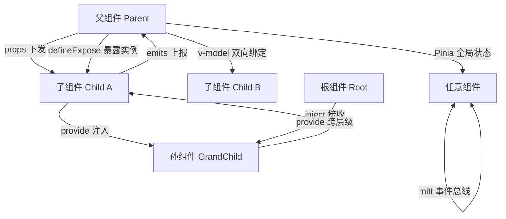
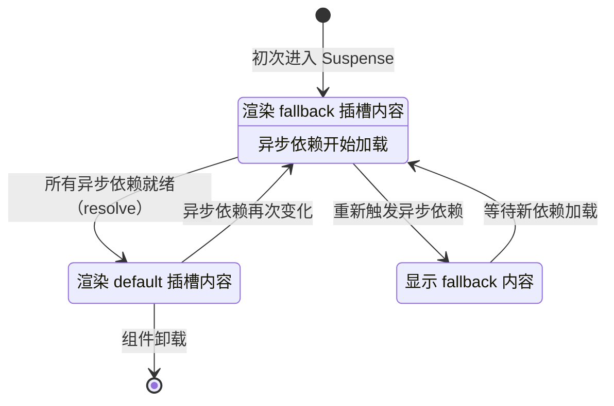

# Vue 3 核心语法

> 模块：05-vue（第5周 Vue 3 生态）
> 定位：核心基础原理篇

---

## 核心概念

Vue 3 是 Vue.js 的下一个主要版本，于 2020 年 9 月正式发布。相比 Vue 2，Vue 3 进行了全面的重构，带来了更好的性能、更小的包体积、更好的 TypeScript 支持，以及全新的 Composition API。（Vue 2 已于 2023-12-31 停止维护（EOL），新项目请使用 Vue 3）

Vue 3 的核心设计目标：
1. **更好的代码组织**：通过 Composition API 解决大型项目代码维护问题
2. **更好的类型支持**：原生支持 TypeScript，提供更好的类型推断
3. **更小的包体积**：支持 Tree Shaking，按需编译，减少打包体积
4. **更好的性能**：编译器优化 + 更高效的响应式系统

### Vue 3 与 Vue 2 的核心变化

| 特性 | Vue 2 | Vue 3 |
|------|-------|-------|
| API 风格 | Options API 为主 | Composition API + Options API |
| 响应式实现 | Object.defineProperty | Proxy |
| TypeScript 支持 | 有限，需要额外声明 | 原生支持，完全类型推断 |
| 包体积 | ~100KB (min+gzip) | ~50KB (min+gzip) |
| Tree Shaking | 不支持，核心代码全部打包 | 支持，按需引入 |
| 新组件 | 无 | Fragment、Teleport、Suspense |

**Composition API**：
- 取代 Options API 的更好的代码组织方式
- 可以按逻辑关注点组织代码，便于提取和复用逻辑
- 解决了大型项目中代码分散在 options 各个选项中的问题

**更好的 TypeScript 支持**：
- 源码使用 TypeScript 重写
- 提供更好的类型定义和推断
- defineComponent 自动推导 props 类型

**Tree Shaking**：
- 编译器可以摇掉未使用的代码
- 只有用到的模块才会被打包
- 大幅减小生产环境包体积

**新组件**：
- `Fragment`：支持多个根节点
- `Teleport`：将组件传送到 DOM 任意位置
- `Suspense`：处理异步依赖加载

---

## 底层原理

### setup 函数和 `<script setup>`

**setup 函数**：
- 是 Composition API 的入口点
- 在 `beforeCreate` 之前执行
- 接收 `props` 和 `context`（attrs、slots、emit）
- 返回的对象可以在模板中使用

```javascript
export default {
  props: {
    title: String
  },
  setup(props, context) {
    // 可以访问 props
    console.log(props.title)

    // 解构 context 获取 emit、attrs、slots
    const { emit, attrs, slots } = context

    // 返回的变量和函数可以在模板中使用
    const count = ref(0)
    const increment = () => count.value++

    return {
      count,
      increment
    }
  }
}
```

**`<script setup>` 语法糖**：
- 是 SFC（单文件组件）中使用 Composition API 的语法糖
- 更简洁的代码，更好的性能
- 顶层变量自动暴露给模板
- `defineProps` 和 `defineEmits` 声明 props 和 emits

```vue
<script setup>
// 声明 props
const props = defineProps({
  title: String
})

// 声明 emits
const emit = defineEmits(['update'])

// 顶层变量自动暴露给模板
const count = ref(0)
const increment = () => count.value++

// import 导入的组件直接可用，不需要注册
import MyComponent from './MyComponent.vue'
</script>
<template>
  <h1>{{ props.title }}</h1>
  <MyComponent />
  <button @click="increment">{{ count }}</button>
</template>
```

> 📖 **参考链接**：
> - [Vue 3官方文档 - Composition API FAQ](https://cn.vuejs.org/guide/extras/composition-api-faq)
> - [Vue 3官方文档 - setup 函数](https://cn.vuejs.org/api/composition-api-setup)

### 响应式 API：ref vs reactive

> **生活化类比**：自动记账本——你改了余额（数据），账本自动更新总支出（视图），不需要手动重新计算。Vue 的响应式系统就是这本"自动记账本"，数据一变，视图自动跟着变。

**ref**：
- 用于创建响应式的基本类型值，也可以用于对象
- 返回一个包装对象，通过 `.value` 访问值
- 内部如果是对象，会自动调用 `reactive` 转为响应式

```javascript
import { ref } from 'vue'

const count = ref(0)
console.log(count.value) // 0

count.value++
console.log(count.value) // 1

// 对象也可以用 ref
const user = ref({ name: '张三' })
user.value.name = '李四' // 响应式
```

**reactive**：
- 用于创建响应式的对象或数组
- 直接访问属性，不需要 `.value`
- 返回的是代理对象，始终保持对原对象的引用

```javascript
import { reactive } from 'vue'

const user = reactive({ name: '张三', age: 18 })
user.age++ // 直接修改，响应式

// 直接解构会丢失响应性
const { age } = user
age++ // 不是响应式
```

**核心区别**：
| 特性 | ref | reactive |
|------|-----|----------|
| 支持基本类型 | ✅ | ❌ |
| 需要 .value 访问 | ✅ | ❌ |
| 替换整个对象 | ✅（直接替换 .value） | ❌（需要重新赋值或展开） |
| 解构响应式 | 需要 toRef/toRefs | 需要 toRef/toRefs |

**toRef / toRefs**：
- 用于解构响应式对象同时保持响应性
- toRef 为单个属性创建 ref
- toRefs 为所有属性创建 refs

```javascript
import { reactive, toRef, toRefs } from 'vue'

const user = reactive({ name: '张三', age: 18 })

// 单个属性
const age = toRef(user, 'age')
age.value++ // 保持响应式，同时修改原对象

// 批量转换
const { name, age } = toRefs(user)
name.value = '李四' // 保持响应性
```

> 📖 **参考链接**：
> - [Vue 3官方文档 - 响应式基础](https://cn.vuejs.org/guide/essentials/reactivity-fundamentals)

### 计算属性 vs 方法

**computed 计算属性**：
- 基于依赖缓存，只有依赖变化时才会重新计算
- 适合需要复杂计算的场景，避免不必要的重复计算

```javascript
import { ref, computed } from 'vue'

const todos = ref([
  { text: '学习 Vue', done: true },
  { text: '写代码', done: false }
])

// 计算未完成任务数量
const undoneCount = computed(() => {
  return todos.value.filter(todo => !todo.done).length
})

// 可写计算属性
const doubleCount = computed({
  get() {
    return count.value * 2
  },
  set(value) {
    count.value = value / 2
  }
})
```

**methods 方法**：
- 每次组件重新渲染都会重新执行
- 适合需要在每次渲染都重新计算的场景，或者事件处理

```javascript
methods: {
  getUndoneCount() {
    return this.todos.filter(todo => !todo.done).length
  }
}
```

**关键区别**：
- `computed`：依赖不变，返回缓存结果，性能更好
- `methods`：每次渲染都重新执行，没有缓存

### 侦听器：watch vs watchEffect

**watch**：
- 明确指定监听的数据源
- 惰性执行，初始不执行，变化时才执行
- 可以获取新旧值

```javascript
import { ref, watch } from 'vue'

const count = ref(0)
const user = ref({ name: '张三' })

// 监听单个 ref
watch(count, (newVal, oldVal) => {
  console.log(`count 从 ${oldVal} 变为 ${newVal}`)
})

// 监听多个源
watch([count, user], ([newCount, newUser], [oldCount, oldUser]) => {
  // ...
})

// 深度监听
watch(user, (newVal) => {
  console.log('user 变化了', newVal)
}, { deep: true })

// 立即执行
watch(count, (newVal) => {
  console.log('初始执行，count =', newVal)
}, { immediate: true })
```

**watchEffect**：
- 自动追踪回调中使用的响应式依赖
- 立即执行，依赖变化时重新执行
- 不需要手动指定监听源

```javascript
import { ref, watchEffect } from 'vue'

const count = ref(0)
const user = ref({ name: '张三' })

watchEffect(() => {
  console.log(`count = ${count.value}, name = ${user.value.name}`)
})
// 初始立即执行，count 或 name 变化时重新执行
```

**flush 选项**：
- `pre`（默认）：在 DOM 更新前执行，此时 DOM 还没更新
- `post`：在 DOM 更新后执行，可以访问更新后的 DOM
- `sync`：同步执行，性能较差，不推荐

```javascript
watchEffect(() => {
  // ...
}, { flush: 'post' })
```

**关键区别**：
| 特性 | watch | watchEffect |
|------|-------|-------------|
| 监听源 | 需要显式指定 | 自动追踪 |
| 初始执行 | 默认惰性，可选 immediate | 立即执行 |
| 获取新旧值 | 支持 | 不支持 |
| 使用场景 | 需要回调执行时机控制，或需要新旧值对比 | 简单的副作用，依赖自动追踪 |

### 生命周期钩子变化

Vue 3 生命周期全部改为Composition API形式，命名以 `on` 开头：

| Vue 2 | Vue 3 Composition API | 说明 |
|-------|------------------------|------|
| beforeCreate | 不需要（setup 替代） | 组件实例创建之前 |
| created | 不需要（setup 替代） | 组件实例创建完成 |
| beforeMount | onBeforeMount | 挂载到 DOM 之前 |
| mounted | onMounted | 挂载完成 |
| beforeUpdate | onBeforeUpdate | DOM 更新之前 |
| updated | onUpdated | DOM 更新完成 |
| beforeDestroy | onBeforeUnmount | 组件卸载之前 |
| destroyed | onUnmounted | 组件卸载完成 |
| errorCaptured | onErrorCaptured | 捕获后代组件错误 |
| - | onRenderTracked | 调试，追踪渲染依赖 |
| - | onRenderTriggered | 调试，追踪触发重新渲染 |

**示例**：
```vue
<script setup>
import { onMounted, onUnmounted } from 'vue'

onMounted(() => {
  console.log('组件挂载完成')
  window.addEventListener('resize', onResize)
})

onUnmounted(() => {
  console.log('组件卸载')
  window.removeEventListener('resize', onResize)
})
</script>
```

> 📖 **参考链接**：
> - [Vue 3官方文档 - 生命周期钩子](https://cn.vuejs.org/guide/essentials/lifecycle)

### 组件通信方式

**Vue 3 组件通信关系图：**



> 上图展示了 Vue 3 中六种主流的组件通信方式及其适用层级：props/emits 和 defineExpose 用于父子组件直接通信；provide/inject 适合跨层级透传数据；v-model 实现父子双向绑定；mitt 事件总线和 Pinia 则适用于任意组件间的全局通信。

| 通信方式 | 使用场景 |
|----------|----------|
| `props` / `emits` | 父子组件通信 |
| `defineExpose` | 父组件访问子组件实例 |
| `provide` / `inject` | 跨层级组件通信 |
| `v-model` | 双向绑定 |
| `mitt` / 事件总线 | 任意组件通信 |
| Pinia | 全局状态管理 |

**props / emits**：
```vue
<!-- 父组件 -->
<Child :title="title" @update="onUpdate" />

<!-- 子组件 script setup -->
const props = defineProps({
  title: String
})
const emit = defineEmits(['update'])

const click = () => {
  emit('update', 'new value')
}
```

**defineExpose**：
```vue
<!-- 子组件 -->
<script setup>
import { ref } from 'vue'
const count = ref(0)
const increment = () => count.value++

// 暴露给父组件
defineExpose({
  count,
  increment
})
</script>

<!-- 父组件 -->
<script setup>
import { ref, onMounted } from 'vue'

const childRef = ref(null)

// 注意：不能在 setup 顶层直接调用 childRef.value.increment()
// 因为此时子组件尚未挂载，childRef.value 为 null
onMounted(() => {
  // 子组件挂载后，访问其暴露的方法
  childRef.value.increment()
})
</script>

<Child ref="childRef" />
```

**provide / inject**：
```vue
<!-- 祖先组件 -->
<script setup>
import { provide, ref } from 'vue'
const theme = ref('light')
provide('theme', theme) // 可以提供响应式数据
</script>

<!-- 后代组件 -->
<script setup>
import { inject } from 'vue'
const theme = inject('theme', 'light') // 默认值
</script>
```

**v-model 双向绑定**：
```vue
<!-- 父组件 -->
<Child v-model:title="title" />
<!-- 相当于 -->
<Child :title="title" @update:title="title = $event" />

<!-- 子组件 -->
<script setup>
defineProps(['title'])
defineEmits(['update:title'])
</script>
```

> 📖 **参考链接**：
> - [Vue 3官方文档 - 模板语法](https://cn.vuejs.org/guide/essentials/template-syntax)
> - [Vue 3官方文档 - 内置指令](https://cn.vuejs.org/api/built-in-directives)

---

## 实战应用

### 1. 组合式函数复用逻辑

提取复用的逻辑到单独的函数中：

```javascript
// useMouse.js
import { ref, onMounted, onUnmounted } from 'vue'

export function useMouse() {
  const x = ref(0)
  const y = ref(0)

  function update(e) {
    x.value = e.pageX
    y.value = e.pageY
  }

  onMounted(() => {
    window.addEventListener('mousemove', update)
  })

  onUnmounted(() => {
    window.removeEventListener('mousemove', update)
  })

  return { x, y }
}

// 组件中使用
<script setup>
import { useMouse } from './useMouse.js'
const { x, y } = useMouse()
</script>

<template>
  鼠标位置：{{ x }}, {{ y }}
</template>
```

### 2. 响应式解构

**Vue 3.5+ 推荐方案**：响应式 Props 解构（直接解构 `defineProps` 返回值，自动保持响应式）。

```javascript
<script setup>
// Vue 3.5+：直接解构即可保持响应性
const { count, title } = defineProps<{
  count: number;
  title: string;
}>();

// count 和 title 直接是响应式的，无需 .value 或 toRefs
const doubleCount = computed(() => count * 2); // ✅ 自动追踪
</script>
```

**Vue 3.4 及以下降级方案**：使用 `toRefs` 保持响应性。

```javascript
<script setup>
import { reactive, toRefs } from 'vue'

const user = reactive({
  name: '张三',
  age: 18,
  address: {
    city: '北京'
  }
})

// 使用 toRefs 解构，保持响应性
const { name, age } = toRefs(user)
console.log(name.value) // '张三'
name.value = '李四' // 修改原对象，响应式

// 错误：直接解构 reactive 会丢失响应性
// const { name, age } = user
// name = '李四' // 不会触发更新

// 嵌套对象解构也需要保持响应性
const { city } = toRefs(user.address)
</script>
```

### 3. 合理使用计算属性

避免在模板中进行复杂计算：

```vue
<template>
  <!-- 不推荐 -->
  <div>未完成：{{ todos.filter(t => !t.done).length }}</div>

  <!-- 推荐 -->
  <div>未完成：{{ undoneCount }}</div>
</template>

<script setup>
import { computed } from 'vue'

const undoneCount = computed(() => {
  return todos.value.filter(todo => !todo.done).length
})
</script>
```

### 4. 正确使用 watch 和 watchEffect

```javascript
// 需要获取新旧值 → 使用 watch
watch(count, (newVal, oldVal) => {
  console.log(`变化：${oldVal} → ${newVal}`)
})

// 需要立即执行，且依赖自动追踪 → 使用 watchEffect
watchEffect(async () => {
  const data = await fetchUser(userId.value)
  user.value = data
})
```

### 5. `defineModel` 宏（Vue 3.4+）

`defineModel` 是 Vue 3.4 引入的编译宏，用于简化 v-model 双向绑定的声明。它自动创建 `modelValue` prop 和 `update:modelValue` emit，让子组件中 v-model 的使用更加简洁。

**传统写法 vs defineModel**：

```vue
<!-- 传统写法：需要手动声明 prop 和 emit -->
<script setup>
// 父组件：<Child v-model="count" />
const props = defineProps<{ modelValue: number }>()
const emit = defineEmits<{ (e: 'update:modelValue', value: number): void }>()

const updateValue = (value: number) => {
  emit('update:modelValue', value)
}
</script>

<!-- defineModel 简化写法 -->
<script setup>
// 父组件：<Child v-model="count" />
const model = defineModel<number>()
// model 是一个 ref，直接读写即可
// 读取：model.value
// 修改：model.value = newValue（自动触发 emit）
</script>
```

**带名称的 v-model**：

```vue
<!-- 父组件 -->
<Child v-model:title="title" v-model:content="content" />

<!-- 子组件：使用 defineModel('name') 指定名称 -->
<script setup>
const title = defineModel<string>('title')
const content = defineModel<string>('content', { required: true })

// title 和 content 都是 ref，直接读写即可
title.value = '新标题' // 自动触发 emit('update:title', '新标题')
</script>
```

**完整使用示例**：

```vue
<template>
  <div>
    <!-- 双向绑定：直接读写 model ref -->
    <input v-model="model" />
    <p>当前值：{{ model }}</p>
  </div>
</template>

<script setup lang="ts">
// 基础用法：绑定默认 v-model
const model = defineModel<number>({ default: 0 })

// 带名称的 v-model
const firstName = defineModel<string>('firstName')
const lastName = defineModel<string>('lastName')

// 带校验的 v-model
const age = defineModel<number>('age', {
  validator: (value) => value >= 0 && value <= 150
})
</script>
```

**`defineModel` 的本质**：

`defineModel` 是编译宏，在编译时展开为传统的 `defineProps` + `defineEmits` 组合。它返回一个 `ref`，对该 ref 的读写操作会自动映射到对应的 prop 和 emit：

```javascript
// defineModel 编译后等价于：
const props = defineProps<{ modelValue: number }>()
const emit = defineEmits<{ (e: 'update:modelValue', value: number): void }>()

const model = computed({
  get: () => props.modelValue,
  set: (value) => emit('update:modelValue', value)
})
```

### 6. `useTemplateRef()`（Vue 3.5+）

`useTemplateRef()` 是 Vue 3.5 引入的新 API，用于获取模板中 DOM 元素或组件实例的引用。它是传统 `ref` 模板引用的类型安全替代方案。

**传统 ref 模板引用 vs useTemplateRef()**：

```vue
<template>
  <!-- 传统方式：ref 名称与变量名一致 -->
  <input ref="inputRef" />
  <ChildComponent ref="childRef" />
</template>

<script setup>
// 传统方式：需要手动声明 ref 变量，变量名必须与模板 ref 一致
import { ref } from 'vue'
const inputRef = ref<HTMLInputElement | null>(null)
const childRef = ref<InstanceType<typeof ChildComponent> | null>(null)
// 访问：inputRef.value?.focus()
</script>
```

```vue
<template>
  <!-- Vue 3.5 useTemplateRef：通过 key 关联 -->
  <input ref="input" />
  <ChildComponent ref="child" />
</template>

<script setup>
// Vue 3.5：使用 useTemplateRef，传入模板 ref 属性名
import { useTemplateRef } from 'vue'

const inputRef = useTemplateRef<HTMLInputElement>('input')
const childRef = useTemplateRef<InstanceType<typeof ChildComponent>>('child')
// 访问：inputRef.value?.focus()
</script>
```

**核心优势**：

| 特性 | 传统 ref | useTemplateRef |
|------|----------|----------------|
| 变量名约束 | 必须与模板 ref 属性名完全一致 | 变量名自由，通过字符串参数关联 |
| 类型安全 | 需要手动注解泛型 | 泛型类型统一在调用处声明 |
| 解构友好 | 不能解构（变量名变了） | 可以自由解构 |
| 代码可读性 | 变量名隐式关联模板 | 字符串参数显式关联模板 |

**动态 ref 引用**：

```vue
<template>
  <div v-for="item in items" :key="item.id" :ref="`item-${item.id}`">
    {{ item.name }}
  </div>
</template>

<script setup>
// useTemplateRef 支持动态 ref 名称
function getItemRef(id: number) {
  return useTemplateRef<HTMLDivElement>(`item-${id}`)
}
</script>
```

### 7. `onWatcherCleanup()`（Vue 3.5+）

`onWatcherCleanup()` 是 Vue 3.5 引入的新 API，用于在 `watch` 或 `watchEffect` 回调中注册清理函数。当 watcher 重新执行或停止时，清理函数会被自动调用，用于取消上一次的异步操作（如取消请求、清除定时器等）。

**传统方式 vs onWatcherCleanup()**：

```javascript
// 传统方式：使用 onInvalidate 回调参数
watchEffect((onInvalidate) => {
  let cancelled = false
  const timer = setTimeout(() => {
    if (!cancelled) {
      console.log('定时器执行')
    }
  }, 1000)

  onInvalidate(() => {
    cancelled = true
    clearTimeout(timer)
  })
})
```

```javascript
// Vue 3.5：使用 onWatcherCleanup
import { watchEffect, onWatcherCleanup } from 'vue'

watchEffect(() => {
  const timer = setTimeout(() => {
    console.log('定时器执行')
  }, 1000)

  // 注册清理函数：当 watcher 重新执行或停止时自动调用
  onWatcherCleanup(() => {
    clearTimeout(timer)
  })
})
```

**异步请求场景**：

```javascript
import { watch, onWatcherCleanup } from 'vue'

// 根据 userId 请求用户数据，自动处理竞态
watch(userId, async (newId) => {
  let cancelled = false

  onWatcherCleanup(() => {
    cancelled = true
  })

  const data = await fetchUser(newId)
  if (!cancelled) {
    user.value = data
  }
})
```

**watch 和 watchEffect 均支持**：

```javascript
// watch 中使用
watch(count, (newVal, oldVal) => {
  const timer = setInterval(() => {
    console.log('监听中...')
  }, 1000)

  onWatcherCleanup(() => {
    clearInterval(timer)
    console.log('清理完成')
  })
})

// watchEffect 中使用
watchEffect(() => {
  const controller = new AbortController()

  fetch(`/api/data?id=${userId.value}`, {
    signal: controller.signal
  }).then(res => res.json()).then(data => {
    result.value = data
  })

  onWatcherCleanup(() => {
    controller.abort()
  })
})
```

**核心优势**：

| 传统 onInvalidate | onWatcherCleanup |
|-------------------|------------------|
| 需要回调参数 `onInvalidate` | 直接从 `vue` 导入，无需参数 |
| 嵌套函数中传递 onInvalidate 不方便 | 在任何嵌套层级都可调用 |
| 参数命名不统一 | API 名称一致，语义更清晰 |
| 仅在 watchEffect 可用 | watch 和 watchEffect 均可使用 |

---

## 常见面试题

### 1. Vue 3 中 ref 和 reactive 有什么区别？

**回答要点**：
- ref 可以声明基本类型和对象，需要通过 .value 访问，reactive 只能声明对象，直接访问
- ref 内部对对象会自动调用 reactive 做代理
- 解构时，两者都需要用 toRef/toRefs 保持响应性
- 当需要替换整个对象时，ref 更方便（直接替换 .value）

### 2. computed 和 watch 有什么区别？

**回答要点**：
- computed 是计算衍生值，有缓存，依赖不变不重新计算
- watch 是监听变化执行副作用，没有缓存，变化就执行回调
- computed 默认只读，可以创建可写的计算属性
- watch 可以获取新旧值，支持深度监听和惰性执行

### 3. v-if 和 v-show 有什么区别？

**回答要点**：
- v-if：条件渲染，条件为 false 时不会渲染到 DOM 中，惰性渲染（第一次为 true 才渲染），切换开销大，适合不频繁切换的场景
- v-show：始终渲染到 DOM，只是通过 display CSS 属性切换显示，初始渲染开销大，切换开销小，适合频繁切换的场景

### 4. v-for 中为什么需要 key？

**回答要点**：
- Vue 的 Diff 算法需要 key 来识别 VNode，进行最小化 DOM 操作
- key 帮助 Vue 跟踪每个节点的身份，复用已有节点
- 如果不使用 key，Vue 会复用相同类型的节点，可能导致状态错误
- 推荐使用唯一 id 作为 key，不推荐使用数组索引作为 key（数据顺序变化时会导致问题）

### 5. Composition API 相比 Options API 有什么优势？

**回答要点**：
- 更好的代码组织：可以按逻辑关注点聚合代码，而不是分散在 data、methods、computed 各个选项中
- 更好的逻辑复用：可以轻松提取复用逻辑（组合式函数），比 mixins 更清晰，没有命名冲突
- 更好的 TypeScript 支持：Composition API 原生适配类型推断
- 更好的 Tree Shaking：未使用的代码更容易被摇掉

---

## 避坑指南

| 常见错误 | 现象 | 原因 | 解决方案 |
|---------|------|------|----------|
| 在 setup 中直接解构 reactive | 修改后视图不更新 | 解构后得到的是普通变量，丢失响应式连接 | Vue 3.5+ 可直接解构 defineProps；reactive 需使用 toRef 或 toRefs 包装后再解构 |
| 忘记给 ref 添加 .value | 拿到的是 ref 对象而不是实际值，报错或逻辑错误 | ref 返回包装对象，必须通过 .value 访问值 | 记住 ref 需要 .value，reactive 不需要 |
| 在 watch 中修改监听的值导致无限循环 | 内存溢出，栈溢出 | watch 监听的值变化 → 触发回调 → 修改该值 → 再次触发变化 | 避免在回调中修改监听的值，或者使用 immediate 时注意判断 |
| 直接给 reactive 赋值整个对象导致丢失响应式 | 新赋值的对象不是响应式 | reactive 是对原对象的代理，直接替换整个对象会丢失代理 | 展开替换：`Object.assign(state, newState)`，或者使用 ref 存储对象 |
| v-for 中使用数组索引作为 key | 数据增删导致组件状态错误，性能差 | 索引不能唯一标识节点，数据顺序变化时 key 变化，Diff 算法无法复用 | 使用数据的唯一 id 作为 key |
| 在模板中大量使用复杂表达式 | 模板杂乱难以维护，每次渲染都重新计算 | 开发者习惯把所有计算写在模板里 | 把复杂计算提取到计算属性中，利用缓存优化性能 |
| watchEffect 中使用异步没有正确清理 | 多次触发导致多个请求竞争 | 异步请求返回顺序不确定，可能导致数据错乱 | 使用可取消的请求，或者使用 watch 配合防抖 |
| 生命周期中忘记移除事件监听 | 内存泄漏，多次触发 | 组件卸载后事件监听还在，继续引用组件 | 在 onUnmounted 中移除所有事件监听和定时器 |

---

## 补充：useId()（Vue 3.5+）

`useId()` 用于生成在服务端和客户端保持一致的唯一 ID，适用于无障碍属性（`aria-labelledby`、`for`/`id` 关联）和 SSR 场景。

```vue
<script setup>
import { useId } from 'vue'

const id = useId() // 生成唯一 ID，如 'v-0'、'v-1'
const labelId = useId() // 每次调用生成不同 ID
</script>

<template>
  <div>
    <label :for="id">用户名</label>
    <input :id="id" type="text" />

    <!-- 多个 ID 的场景 -->
    <label :id="labelId">描述</label>
    <div :aria-labelledby="labelId">
      内容区域...
    </div>
  </div>
</template>
```

**SSR 安全性**：`useId()` 在服务端和客户端生成相同的 ID 序列，避免 hydration 不匹配错误。注意 `useId()` 必须在 `setup()` 或 `<script setup>` 中同步调用，不能在条件语句或异步回调中使用。

---

## 补充：Teleport 与 Suspense

### Teleport 详解

#### 基本概念

Teleport 是 Vue 3 引入的内置组件，用于将组件模板中的 DOM 内容"传送"到 DOM 树中的任意位置，同时保持组件的逻辑层级不变。这对于模态框、弹窗、通知等需要脱离父组件 CSS 上下文（如 `overflow: hidden`、`z-index` 限制）的场景至关重要。

**核心机制**：组件逻辑（props、事件、状态）仍在父组件中管理，但渲染的 DOM 节点被移动到 `to` 属性指定的目标位置。

#### to 属性

`to` 接受 CSS 选择器字符串，指定传送目标：

```vue
<template>
  <!-- 传送到 body 末尾 -->
  <Teleport to="body">
    <div class="modal">模态框内容</div>
  </Teleport>

  <!-- 传送到指定 id 元素 -->
  <Teleport to="#modal-container">
    <div class="modal">模态框内容</div>
  </Teleport>

  <!-- 传送到指定 class 元素（第一个匹配的元素） -->
  <Teleport to=".overlay-target">
    <div class="overlay">遮罩层</div>
  </Teleport>
</template>
```

**注意**：`to` 指定的目标元素必须在 Teleport 组件挂载之前已经存在于 DOM 中。如果目标不存在，Vue 会在开发环境发出警告。

#### disabled 属性

`disabled` 属性用于动态控制 Teleport 是否生效。当 `disabled` 为 `true` 时，内容渲染在组件原本的位置，不会被传送：

```vue
<template>
  <Teleport to="body" :disabled="isMobile">
    <div class="modal">
      <p>当前设备：{{ isMobile ? '移动端' : '桌面端' }}</p>
    </div>
  </Teleport>
</template>

<script setup>
import { ref } from 'vue';

// 移动端不需要传送到 body，直接在组件位置渲染
const isMobile = ref(window.innerWidth < 768);
</script>
```

**适用场景**：响应式布局中，桌面端弹窗需要传送到 body 避免层级问题，移动端全屏弹窗在组件内渲染即可。

#### 多个 Teleport 到同一目标

多个 Teleport 可以传送到同一个目标元素，内容按挂载顺序依次追加：

```vue
<template>
  <!-- 通知中心：多个通知都传送到 #notifications -->
  <Teleport to="#notifications">
    <div class="toast toast-success">操作成功</div>
  </Teleport>
  <Teleport to="#notifications">
    <div class="toast toast-error">操作失败</div>
  </Teleport>
</template>

<!-- HTML 中需要预先放置目标容器 -->
<div id="notifications" style="position: fixed; top: 16px; right: 16px; z-index: 9999;"></div>
```

#### 模态框完整示例

```vue
<template>
  <div>
    <button @click="showModal = true">打开模态框</button>

    <!-- Teleport 将模态框传送到 body，避免父元素 overflow/z-index 影响 -->
    <Teleport to="body">
      <Transition name="modal">
        <div v-if="showModal" class="modal-overlay" @click.self="showModal = false">
          <div class="modal-content">
            <h2>{{ title }}</h2>
            <p>模态框内容区域</p>
            <button @click="showModal = false">关闭</button>
          </div>
        </div>
      </Transition>
    </Teleport>
  </div>
</template>

<script setup>
import { ref } from 'vue';

const showModal = ref(false);
const title = ref('提示');
</script>

<style scoped>
/* 样式写在组件内，但 DOM 在 body 下 */
.modal-overlay {
  position: fixed;
  top: 0; left: 0; right: 0; bottom: 0;
  background: rgba(0, 0, 0, 0.5);
  display: flex;
  align-items: center;
  justify-content: center;
  z-index: 1000;
}
.modal-content {
  background: #fff;
  border-radius: 8px;
  padding: 24px;
  min-width: 400px;
  box-shadow: 0 4px 24px rgba(0, 0, 0, 0.15);
}
</style>
```

> **为什么用 Teleport 而不是直接在组件中渲染模态框？** 父组件可能设置了 `overflow: hidden`、`filter`、`transform` 等属性，这些属性会创建新的层叠上下文，导致模态框的 `z-index` 失效或内容被裁剪。Teleport 将 DOM 移出父组件的 CSS 上下文，从根源上避免这些问题。

#### 与 v-if / v-show 的区别

| 对比维度 | Teleport | v-if / v-show |
|---------|---------|--------------|
| 作用 | 改变 DOM 在文档中的挂载位置 | 控制 DOM 是否渲染 / 显示 |
| 组件逻辑位置 | 不变（仍在父组件中） | 不变 |
| 适用场景 | 脱离父组件 CSS 上下文 | 条件渲染内容 |

#### Teleport 实现原理

Teleport 的核心原理是 **DOM 层级分离**：

1. 组件实例和响应式数据仍然挂载在父组件的虚拟 DOM 树中（逻辑层级不变）
2. 渲染时，Teleport 内部的 VNode 被挂载到 `to` 属性指定的目标 DOM 节点下（DOM 层级分离）
3. 事件冒泡仍然遵循虚拟 DOM 树的结构，而不是 DOM 层级

这意味着：在 Teleport 内部的元素上触发的事件，会冒泡到 Teleport 所在的父组件，而不是 `to` 目标元素的父级。

---

### Suspense 详解

#### 基本概念

Suspense 是 Vue 3 提供的内置组件，用于协调组件树中异步依赖的加载状态。它允许你在等待异步组件或异步数据时显示一个优雅的 fallback 内容，等异步依赖就绪后再渲染实际内容。

#### 两个插槽

Suspense 提供两个插槽：

- **`default`（默认插槽）**：放置需要异步加载的组件内容
- **`fallback`（后备插槽）**：在异步内容加载期间显示占位内容

```vue
<template>
  <Suspense>
    <!-- 异步加载完成后显示 -->
    <template #default>
      <AsyncDashboard />
    </template>

    <!-- 加载中显示 -->
    <template #fallback>
      <div class="loading-skeleton">
        <div class="skeleton-card"></div>
        <div class="skeleton-card"></div>
        <div class="skeleton-card"></div>
      </div>
    </template>
  </Suspense>
</template>

<script setup>
import { defineAsyncComponent } from 'vue';

const AsyncDashboard = defineAsyncComponent(() =>
  import('./components/Dashboard.vue')
);
</script>
```

#### 异步组件加载流程

Suspense 的异步加载过程分为三个阶段：

**Suspense 异步组件加载状态流转图：**



> 上图展示了 Suspense 的三态流转机制：初始进入时处于 pending 状态渲染 fallback，所有异步依赖 resolve 后切换到 resolved 状态渲染 default 内容；若异步依赖再次变化会重新回到 pending，形成循环切换。

```
初始状态（pending）
  → 渲染 fallback 插槽内容
  → 异步依赖开始加载
  → 异步依赖全部就绪（resolve）
  → 渲染 default 插槽内容
```

**关键行为**：
- 初次进入 Suspense 时，会同时渲染 `default` 和 `fallback` 的内核 VNode，但只显示 `fallback`
- 当 `default` 中的所有异步依赖都 resolve 后，切换到 `default` 显示
- 如果 `default` 中的异步依赖再次变化（如重新触发），会重新进入 pending 状态

#### 事件钩子

Suspense 提供三个事件钩子，用于监听加载状态变化：

```vue
<template>
  <Suspense
    @pending="onPending"
    @resolve="onResolve"
    @fallback="onFallback"
  >
    <template #default>
      <AsyncContent />
    </template>
    <template #fallback>
      <Loading />
    </template>
  </Suspense>
</template>

<script setup>
const onPending = () => {
  console.log('进入 pending 状态，显示 fallback');
};
const onResolve = () => {
  console.log('异步依赖就绪，开始渲染 default 内容');
};
const onFallback = () => {
  console.log('fallback 内容已显示');
};
</script>
```

**事件触发顺序**：
- **初次加载**：`pending` → `fallback` → `resolve`
- **重新进入 pending**：`pending` → `fallback` → `resolve`

#### 与 defineAsyncComponent 配合

Suspense 最常见的用法是与 `defineAsyncComponent` 配合实现代码分割的组件懒加载：

```vue
<template>
  <Suspense>
    <template #default>
      <AsyncUserProfile :userId="userId" />
    </template>
    <template #fallback>
      <ProfileSkeleton />
    </template>
  </Suspense>
</template>

<script setup>
import { defineAsyncComponent } from 'vue';

const AsyncUserProfile = defineAsyncComponent({
  loader: () => import('./components/UserProfile.vue'),
  // 加载中显示的组件（可选，Suspense 已提供 fallback 时可不设置）
  loadingComponent: ProfileSkeleton,
  // 加载失败时显示的组件
  errorComponent: ErrorDisplay,
  // 展示 loadingComponent 前的延迟时间（ms），避免闪烁
  delay: 200,
  // 超时时间（ms），超时后显示 errorComponent
  timeout: 10000,
});
</script>
```

#### 多个异步组件并发加载

Suspense 可以包含多个异步组件，它会等待**所有异步依赖**都 resolve 后才显示 `default` 内容：

```vue
<template>
  <Suspense>
    <template #default>
      <AsyncHeader />
      <AsyncSidebar />
      <AsyncMainContent />
      <AsyncFooter />
    </template>
    <template #fallback>
      <FullPageSkeleton />
    </template>
  </Suspense>
</template>
```

**注意**：如果其中一个异步组件加载失败，整个 Suspense 会进入错误状态。建议配合 `onErrorCaptured` 或 `defineAsyncComponent` 的 `errorComponent` 处理错误。

#### 嵌套 Suspense

Suspense 支持嵌套使用，可以实现更精细的加载控制：

```vue
<template>
  <!-- 外层：等待整个页面加载 -->
  <Suspense>
    <template #default>
      <PageLayout>
        <!-- 内层：仅等待侧边栏加载 -->
        <Suspense>
          <template #default>
            <AsyncSidebar />
          </template>
          <template #fallback>
            <SidebarSkeleton />
          </template>
        </Suspense>

        <!-- 内层：仅等待主内容加载 -->
        <Suspense>
          <template #default>
            <AsyncMainContent />
          </template>
          <template #fallback>
            <ContentSkeleton />
          </template>
        </Suspense>
      </PageLayout>
    </template>
    <template #fallback>
      <FullPageSkeleton />
    </template>
  </Suspense>
</template>
```

#### 实际使用场景

| 场景 | 说明 |
|------|------|
| **路由级代码分割** | 配合 `defineAsyncComponent` 实现路由懒加载，Suspense 提供统一的加载状态 |
| **数据仪表盘** | 多个异步数据组件并发加载，统一显示骨架屏，数据齐了再一起展示 |
| **条件异步加载** | 用户点击"展开"后再加载详情组件，首次加载时显示 placeholder |
| **A/B 测试** | 不同实验组加载不同组件，Suspense 提供统一的加载体验 |

---

> **学习导航**：
> - 返回 [学习路线总览](../README.md)
> - 本模块其他原理文件：[02-响应式与编译优化](./02-响应式与编译优化.md) | [03-路由与状态管理](./03-路由与状态管理.md) | [04-Vue3笔面试题集](./04-Vue3笔面试题集.md)
> - 实战应用：[企业后台管理系统](../10-project/01-企业后台管理系统实战.md)

## 补充：自定义指令原理

### 概念定义

自定义指令（Custom Directive）是 Vue 提供的第三种代码复用方式，它的定位非常明确：**复用涉及普通元素底层 DOM 访问的逻辑**。

Vue 中三种复用方式的职责划分如下：

| 复用方式 | 复用的是什么 | 典型场景 |
|---------|-------------|---------|
| 组件 | UI 结构与交互 | 按钮、表格、表单控件 |
| 组合式函数 | 有状态的逻辑 | `useMouse()`、`useRequest()` |
| 自定义指令 | 对 DOM 的底层操作 | 自动聚焦、防抖绑定、权限移除、图片懒加载 |

自定义指令的形态是一个包含若干「指令钩子」的对象，钩子函数会接收到指令所绑定的元素 `el` 以及描述绑定信息的 `binding` 对象：

```javascript
// 指令的定义对象就是一个普通的 JS 对象
const vHighlight = {
  mounted(el) {
    el.classList.add('is-highlight')
  }
}
```

**使用时机**：官方明确建议，只有当所需功能**只能通过直接 DOM 操作实现**时才使用自定义指令。能用 `v-bind` 等内置指令表达的模板，应优先使用内置指令——内置指令在编译期优化更充分，且对服务端渲染更友好。

### 底层原理

#### 编译阶段

模板中的 `v-focus` 在编译期会被转换为 `withDirectives` 辅助函数调用，同时把指令对象从组件上下文（或全局上下文）中解析出来：

```javascript
// 模板：<input v-focus:foo.bar="value" />
// 编译产物（简化）
import { resolveDirective as _resolveDirective, withDirectives as _withDirectives,
  createElementVNode as _createElementVNode, vModelText as _vModelText } from 'vue'

export function render(_ctx) {
  const _directive_focus = _resolveDirective('focus') // 局部注册优先，其次查全局注册表
  return _withDirectives(_createElementVNode('input', null, null, 512 /* NEED_PATCH */), [
    [_directive_focus, _ctx.value, 'foo', { bar: true }]
  ])
}
```

- `resolveDirective('focus')` 的查找顺序是：**当前组件实例的 `directives` 选项 → 应用级 `app.directive()` 注册表**。
- 带指令的 VNode 会被打上 `NEED_PATCH` 标记，确保后续 `patch` 阶段会处理它。
- 指令信息最终挂载在 VNode 的 `dirs` 属性上，结构为 `[dir, value, arg, modifiers]` 的数组。

#### 运行时阶段

渲染器在 `patch` 流程的关键节点调用 `invokeDirectiveHook`，把 VNode 上的 `dirs` 逐个派发到指令定义对象的对应钩子：

```
mountElement：
  1. 创建 DOM 元素
  2. invokeDirectiveHook(vnode, null, 'created')      // 属性/事件应用前
  3. 设置 props、挂载事件监听器
  4. 插入父节点之前 → invokeDirectiveHook(..., 'beforeMount')
  5. 插入到容器中
  6. → 'mounted'

patchElement（更新）：
  1. invokeDirectiveHook(n2, n1, 'beforeUpdate')
  2. 更新 props、子节点
  3. → 'updated'

unmount：
  1. invokeDirectiveHook(..., 'beforeUnmount')
  2. 移除 DOM、解绑事件
  3. → 'unmounted'
```

值得注意的是，指令钩子的**触发时机与它所在元素的生命周期绑定**，而组件的 `updated` 钩子则在所有子元素更新完成之后触发。这解释了下面这条常见结论：**父组件中指令的 `updated` 比父组件自身的 `onUpdated` 更早执行**。

#### 指令钩子（7 个）

```javascript
const myDirective = {
  // 在绑定元素的 attribute 前，或事件监听器应用前调用
  created(el, binding, vnode) {},
  // 在元素被插入到 DOM 前调用
  beforeMount(el, binding, vnode) {},
  // 在绑定元素的父组件及它自己的所有子节点都挂载完成后调用
  mounted(el, binding, vnode) {},
  // 绑定元素的父组件更新前调用
  beforeUpdate(el, binding, vnode, prevVnode) {},
  // 在绑定元素的父组件及它自己的所有子节点都更新后调用
  updated(el, binding, vnode, prevVnode) {},
  // 绑定元素的父组件卸载前调用
  beforeUnmount(el, binding, vnode) {},
  // 绑定元素的父组件卸载后调用
  unmounted(el, binding, vnode) {}
}
```

指令钩子与组件生命周期的对应关系：

| 指令钩子 | 对应组件生命周期 | 此时 DOM 状态 | 常见用途 |
|---------|----------------|--------------|---------|
| `created` | `created` / setup 根作用域 | 元素已创建，未挂载 | 初始化与元素无关的数据 |
| `beforeMount` | `beforeMount` | 元素已创建，尚未插入文档 | 在插入前设置初始属性（避免闪烁） |
| `mounted` | `mounted` | 元素已在文档中 | 聚焦、绑定事件、测量尺寸 |
| `beforeUpdate` | `beforeUpdate` | 更新前的旧 DOM | 记录更新前状态 |
| `updated` | `updated` | 更新后的新 DOM | 根据新值重新操作 DOM |
| `beforeUnmount` | `beforeUnmount` | 元素仍在文档中 | 保存状态、解绑自定义资源 |
| `unmounted` | `unmounted` | 元素已被移除 | 移除事件监听、清理定时器 |

**易错点**：`beforeUpdate` / `updated` 的 `prevVnode` 参数是「上一次渲染中指令所绑定元素的 VNode」，它是钩子参数，**不是** `binding` 的字段。

#### binding 对象

`binding` 是描述指令绑定信息的只读对象，除 `el` 外的所有钩子参数都不应该被修改：

| 字段 | 类型 | 说明 | 示例 |
|------|------|------|------|
| `value` | `any` | 传递给指令的值，可以是任意 JS 表达式 | `v-my="1 + 1"` → `2` |
| `oldValue` | `any` | 上一次的值，**仅在 `beforeUpdate` 和 `updated` 中可用**，且无论值是否改变都可用 | 上一次的 `2` |
| `arg` | `string \| undefined` | 指令参数 | `v-my:foo` → `'foo'` |
| `modifiers` | `Record<string, boolean>` | 修饰符对象 | `v-my.foo.bar` → `{ foo: true, bar: true }` |
| `instance` | `ComponentInternalInstance \| null` | 使用该指令的组件实例 | 可通过 `binding.instance.proxy` 访问组件代理 |
| `dir` | `ObjectDirective` | 指令的定义对象本身 | 便于在钩子间复用内部方法 |

```javascript
// 模板：<div v-example:foo.bar="baz">
// 对应 binding 对象：
{
  arg: 'foo',
  modifiers: { bar: true },
  value: /* baz 的值 */,
  oldValue: /* 上一次更新时 baz 的值 */
}
```

指令的参数也支持动态写法，`v-example:[arg]="value"` 会随组件的 `arg` 响应式变化。

**在不同钩子间共享信息的正确姿势**：`binding` 是只读的，不能往上面挂东西。文档推荐用元素的 `dataset` 共享**数据**；如果需要在 `mounted` 与 `unmounted` 之间共享**函数引用**（如包装后的事件处理函数），推荐使用模块级 `WeakMap`，既不污染 DOM，也能随元素回收自动释放。

#### 注册方式

**全局注册**（`app.directive`）：

```javascript
import { createApp } from 'vue'
import App from './App.vue'

const app = createApp(App)

// 使 v-focus 在所有组件中可用
app.directive('focus', {
  mounted(el) {
    el.focus()
  }
})

app.mount('#app')
```

**局部注册（Options API）**：

```javascript
const focus = {
  mounted: (el) => el.focus()
}

export default {
  directives: {
    // 在模板中启用 v-focus
    focus
  }
}
```

**局部注册（`<script setup>`）**：任何以 `v` 开头的驼峰式命名变量都会被当作自定义指令使用，无需显式注册：

```vue
<script setup>
// 变量名必须以 v 开头，模板中使用 v-focus
const vFocus = {
  mounted: (el) => el.focus()
}

// 也可以从外部导入并重命名
import { vHighlight } from '@/directives/highlight'
</script>

<template>
  <input v-focus />
  <p v-highlight>这段文字会被高亮</p>
</template>
```

**两种注册方式的取舍**：

| 维度 | 全局注册 | 局部注册 |
|------|---------|---------|
| 作用范围 | 整个应用 | 单个组件 |
| 是否可 Tree Shaking | 不可（指令对象始终被打包） | 可以（未使用则被摇掉） |
| 适用场景 | 项目内高频通用指令 | 仅个别组件使用的指令 |

**为全局指令补充类型**（TypeScript）：扩展 `vue` 的 `GlobalDirectives` 接口，即可让模板中获得类型提示：

```typescript
// src/types/directives.d.ts
import type { ObjectDirective } from 'vue'

declare module 'vue' {
  interface GlobalDirectives {
    vFocus: ObjectDirective<HTMLInputElement, boolean>
    vPermission: ObjectDirective<HTMLElement, string[]>
  }
}

export {}
```

#### 简化形式与对象字面量

当只在 `mounted` 和 `updated` 上实现相同行为时，可以直接用函数定义指令：

```javascript
app.directive('color', (el, binding) => {
  // 该函数会在 mounted 和 updated 时都被调用
  el.style.color = binding.value
})
```

需要传递多个值时，传入对象字面量即可：

```javascript
// 模板：<div v-demo="{ color: 'white', text: 'hello!' }"></div>
app.directive('demo', (el, binding) => {
  console.log(binding.value.color) // => "white"
  console.log(binding.value.text)  // => "hello!"
})
```

#### SSR 注意事项

因为大多数自定义指令都包含对 DOM 的直接操作，**它们在服务端渲染时会被忽略**。这带来几个必须注意的结论：

1. **`mounted` 不会在 SSR 期间执行**。SSR 期间只有 `created`（以及组件的 `beforeCreate` / `created` / setup 根作用域）会被调用，`mounted` / `updated` / `unmounted` 全部只在客户端执行。因此 `v-focus` 这类依赖 `mounted` 的指令在 SSR 首屏是**无效**的，焦点会在客户端水合（hydration）完成后才被设置。
2. **需要产出 HTML 属性时使用 `getSSRProps`**。如果指令在客户端会修改元素属性，服务端也必须输出同样的属性，否则会造成水合不匹配。`getSSRProps` **只接收一个 `binding` 参数**，返回一个属性对象：

```javascript
const vId = {
  mounted(el, binding) {
    // 客户端实现：直接更新 DOM
    el.id = binding.value
  },
  getSSRProps(binding) {
    // 服务端实现：返回需要渲染到元素上的属性
    return {
      id: binding.value
    }
  }
}
```

3. **`data-allow-mismatch`**（Vue 3.5+）可以有选择性地消除无法避免的水合不匹配警告，适合确实只能在客户端确定的属性。
4. **不要在指令的 `created` 中访问 `window` / `document`**。`created` 在服务端会被调用，而 Node.js 环境没有这些全局变量，会直接抛错。需要在服务端参与渲染的逻辑统一走 `getSSRProps`。
5. **不要在指令中直接 `useXxxStore()` 后修改状态**。SSR 下模块级单例会被多个请求复用，可能造成跨请求状态污染；应通过 `app.provide()` 提供的实例访问。
6. **不推荐在组件上使用自定义指令**。当组件有多个根节点时指令会被忽略并抛出警告；单根节点时指令始终作用于根节点，和透传 attribute 行为类似，且**不能通过 `v-bind="$attrs"` 转发**。

### 实战应用

#### 案例一：v-focus（自动聚焦）

```javascript
// directives/focus.js
export const vFocus = {
  mounted(el, binding) {
    // 允许通过 v-focus="false" 关闭自动聚焦
    if (binding.value === false) return

    // 必须在 mounted 中执行：此时元素才真正位于文档中，focus() 才会生效
    el.focus()

    // 可选：通过修饰符控制是否选中已有内容
    if (binding.modifiers.select) {
      el.select?.()
    }
  }
}
```

`v-focus` 比原生 `autofocus` 属性更有用：`autofocus` 只在页面加载时生效，而 `v-focus` 在 Vue **动态插入元素**时同样有效。

```vue
<template>
  <!-- 打开弹窗后自动聚焦输入框 -->
  <input v-focus.select v-if="visible" v-model="keyword" />
</template>
```

#### 案例二：v-debounce（事件防抖）

```javascript
// directives/debounce.js
// 用 WeakMap 在 mounted 与 unmounted 之间共享包装后的处理函数
const handlerMap = new WeakMap()

export const vDebounce = {
  mounted(el, binding) {
    // binding.arg 指定事件名，默认 click：v-debounce:input="onInput"
    const event = binding.arg || 'click'
    // binding.value 是真正的事件处理函数
    const handler = binding.value
    // 修饰符中第一个纯数字修饰符作为延迟时间：v-debounce:input.500="onInput"
    const delayKey = Object.keys(binding.modifiers).find((key) => /^\d+$/.test(key))
    const delay = delayKey ? Number(delayKey) : 300
    // .immediate 修饰符表示首次触发立即执行
    const immediate = !!binding.modifiers.immediate

    let timer = null
    let called = false

    const wrapped = (...args) => {
      if (immediate && !called) {
        called = true
        handler(...args)
        return
      }
      clearTimeout(timer)
      timer = setTimeout(() => handler(...args), delay)
    }

    el.addEventListener(event, wrapped)
    // 记录事件名与处理函数，供 unmounted 清理
    handlerMap.set(el, { event, wrapped })
  },

  unmounted(el) {
    const record = handlerMap.get(el)
    if (!record) return
    // 组件卸载时必须移除监听，否则元素与闭包都无法被回收
    el.removeEventListener(record.event, record.wrapped)
    handlerMap.delete(el)
  }
}
```

```vue
<script setup>
import { ref } from 'vue'
import { vDebounce } from '@/directives/debounce'

const keyword = ref('')

function handleInput(e) {
  keyword.value = e.target.value
  // 300ms 内的连续输入只会执行最后一次
  search(keyword.value)
}
</script>

<template>
  <!-- 监听 input 事件，延迟 500ms，首次立即执行 -->
  <input v-debounce:input.500.immediate="handleInput" />
</template>
```

#### 案例三：v-permission（按钮级权限控制）

```javascript
// directives/permission.js
import { useUserStore } from '@/stores/user'

export const vPermission = {
  mounted(el, binding) {
    // 用法：v-permission="['admin', 'editor']"
    const required = Array.isArray(binding.value) ? binding.value : [binding.value]
    const userStore = useUserStore()

    // binding.modifiers.any 表示「满足任一角色即可」，默认也是任一
    const hasPermission = required.some((role) => userStore.roles.includes(role))

    if (!hasPermission) {
      // 方案一：直接从 DOM 树中移除元素（不可恢复）
      el.parentNode?.removeChild(el)
      // 方案二：隐藏元素（可恢复，但用户仍可通过开发者工具看到结构）
      // el.style.display = 'none'
    }
  }
}
```

```vue
<script setup>
import { vPermission } from '@/directives/permission'
</script>

<template>
  <!-- 只有 admin 或 editor 角色能看到这个按钮 -->
  <button v-permission="['admin', 'editor']" @click="handleDelete">删除</button>
</template>
```

**该方案的三个关键取舍**：

1. **移除 vs 隐藏**：`removeChild` 会让元素彻底消失，无法在角色变化后恢复；如果权限可能动态变化，应改用 `v-if` 配合权限判断函数。
2. **指令不是安全边界**：前端权限指令只是 UI 层拦截，**后端必须重新校验**，否则绕过前端即可越权。
3. **SSR 兼容性**：在 SSR 下 `useUserStore()` 需要拿到当前请求对应的 Pinia 实例，否则会读到错误的用户状态。更稳妥的做法是通过 `binding.instance.appContext.config.globalProperties.$auth` 或 `app.provide()` 注入的鉴权对象读取权限。

#### 案例四：组合使用（带清理的图片懒加载）

```javascript
// directives/lazy.js
const observerMap = new WeakMap()

export const vLazy = {
  mounted(el, binding) {
    // 用 IntersectionObserver 替代 scroll 监听，性能更好
    const observer = new IntersectionObserver((entries) => {
      const entry = entries[0]
      if (!entry.isIntersecting) return
      el.src = binding.value
      // 加载一次后立即取消观察，避免重复触发
      observer.unobserve(el)
    })
    observer.observe(el)
    observerMap.set(el, observer)
  },

  updated(el, binding) {
    // 图片地址变化时重新赋值（若已加载过则直接替换）
    if (binding.value !== binding.oldValue && el.src) {
      el.src = binding.value
    }
  },

  unmounted(el) {
    // 组件卸载时断开观察器，防止内存泄漏
    observerMap.get(el)?.disconnect()
    observerMap.delete(el)
  }
}
```

### 面试常见问法

**Q1：自定义指令有哪些钩子？和组件生命周期怎么对应？**

共 7 个：`created`、`beforeMount`、`mounted`、`beforeUpdate`、`updated`、`beforeUnmount`、`unmounted`。它们按元素的生命周期触发，而非组件的生命周期——`mounted` 在绑定元素的父组件及自身所有子节点都挂载完成后调用，`beforeUnmount` 在绑定元素的父组件卸载前调用。因此组件内指令的 `updated` 会早于组件自身的 `onUpdated`。

**Q2：`binding` 对象包含哪些字段？**

`value`（当前值）、`oldValue`（上一次的值，仅 `beforeUpdate` / `updated` 可用）、`arg`（指令参数）、`modifiers`（修饰符对象）、`instance`（使用该指令的组件实例）、`dir`（指令定义对象）。钩子还会额外接收 `vnode` 和 `prevVnode`，但这两个不是 `binding` 的字段。

**Q3：自定义指令和组合式函数怎么选？**

组合式函数复用**有状态的逻辑**，可以创建响应式数据、注册生命周期钩子、返回值给模板使用；自定义指令只复用**对单个元素的底层 DOM 操作**，没有返回值，逻辑绑定在元素上。需要复用状态与逻辑时用组合式函数，需要复用 DOM 操作时用指令。能用内置指令或组合式函数实现的，优先不用自定义指令。

**Q4：自定义指令在 SSR 下有什么注意事项？**

大多数指令在 SSR 时被忽略，`mounted` 等钩子不会在服务端执行。如果指令会修改元素属性，需要实现 `getSSRProps(binding)`（只接收一个参数）返回服务端应渲染的属性，否则可能水合不匹配。另外，`created` 在服务端会被调用，不能在其中访问 `window` / `document`。

**Q5：如何实现一个按钮级权限指令？**

在 `mounted` 中读取 `binding.value` 声明的角色列表，与当前用户角色求交集，无权限时移除或隐藏元素。要注意三点：移除不可恢复，权限动态变化时应改用 `v-if`；前端指令只是 UI 层拦截，后端必须二次校验；SSR 下要确保拿到当前请求的鉴权上下文，避免跨请求状态污染。

### 易错点

| 易错点 | 现象 | 原因 | 正确做法 |
|-------|------|------|---------|
| 在 `beforeMount` 中调用 `el.focus()` | 聚焦无效 | 元素此时尚未插入文档，`focus()` 不生效 | 放到 `mounted` 中执行 |
| 在 `beforeUpdate` 中读取 `binding.value` 当作旧值 | 拿到的是新值 | `binding.value` 始终是当前值，旧值在 `oldValue` 中 | 用 `binding.oldValue` 比较 |
| 指令只写 `mounted`，忘记 `unmounted` 清理 | 内存泄漏，事件被重复触发 | 组件卸载后监听器仍持有元素与闭包引用 | 成对编写 `mounted` / `unmounted`，或使用 WeakMap 记录句柄 |
| 在 `created` 中访问 `window` / `document` | SSR 构建或请求时报错 | `created` 在服务端也会执行，Node.js 没有浏览器全局对象 | 平台相关逻辑放到 `mounted`，服务端属性走 `getSSRProps` |
| 把 `binding` 当可变对象使用 | 数据错乱、警告 | 除 `el` 外的钩子参数都是只读的 | 用 `dataset` 或 WeakMap 在钩子间共享数据 |
| `<script setup>` 中指令变量名不以 `v` 开头 | 模板中无法使用该指令 | `<script setup>` 仅把 `v` 开头的驼峰变量识别为指令 | 命名为 `vFocus`、`vPermission` |
| 在多根节点组件上使用自定义指令 | 指令被忽略并抛出警告 | 指令只能作用于单一根节点，且无法通过 `$attrs` 转发 | 改为在具体元素上使用指令 |
| 用自定义指令替代 `v-if` 做权限控制 | 权限变化后按钮无法恢复显示 | `removeChild` 是不可逆操作 | 权限动态变化时使用 `v-if` + 权限判断函数 |

---

## 本章学习自检

- [ ] 我能说出 Vue 3 相比 Vue 2 的几个核心变化
- [ ] 我理解 setup 函数和 `<script setup>` 的用法和优势
- [ ] 我能清晰说明 ref 和 reactive 的区别，什么时候用哪个
- [ ] 我知道 toRef 和 toRefs 的作用，什么时候需要使用它们
- [ ] 我理解 computed 和 methods 的区别，知道什么时候用 computed
- [ ] 我理解 watch 和 watchEffect 的区别，能说出它们各自的使用场景
- [ ] 我能说出 Vue 3 生命周期相比 Vue 2 的变化
- [ ] 我能说出至少 5 种 Vue 3 组件通信的方式
- [ ] 我能说出 v-if 和 v-show 的区别和各自适用场景
- [ ] 我理解 v-for 中 key 的作用，知道为什么不推荐索引用作 key
