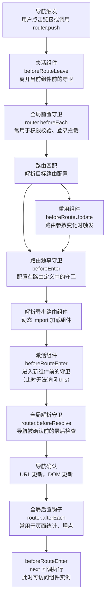
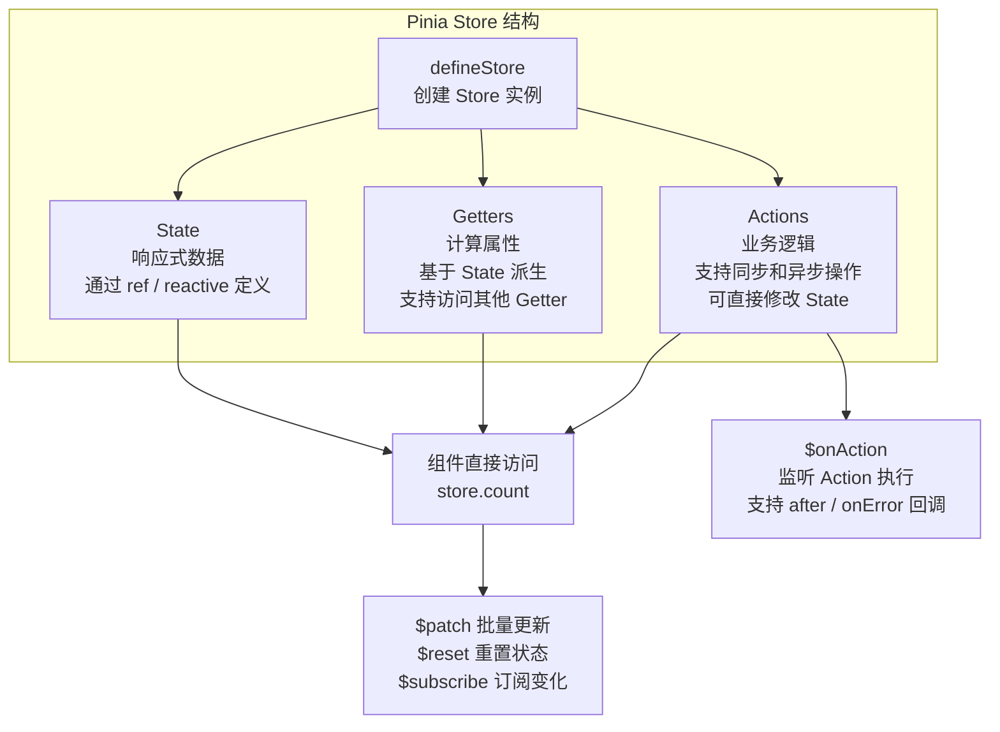

# Vue 3 路由与状态管理

> 模块：05-vue（第5周 Vue 3 生态）
> 定位：路由与状态管理原理篇

---

## 核心概念

在单页应用（SPA）中，路由负责管理页面导航，状态管理负责管理全局数据。Vue Router 和 Pinia 是 Vue 3 生态中官方推荐的路由和状态管理方案，它们共同构成了企业级 Vue 应用的基础架构。

### 为什么需要路由和状态管理？

- **路由**：SPA 只有一个 HTML 页面，路由负责根据 URL 变化切换显示不同组件，实现页面导航效果
- **状态管理**：当多个组件需要共享数据时，需要将状态提升到全局，避免 props 逐层传递（prop drilling）

---

## 底层原理

### Vue Router 路由模式

Vue Router 支持两种路由模式：

#### Hash 模式

URL 使用 `#` 分隔，`#` 后面的部分不会发送给服务器：

```
https://example.com/#/user/profile
```

- 通过 `hashchange` 事件监听 URL 变化
- `#` 后面的内容不会发送到服务器，不需要服务器配置
- 兼容性好，所有浏览器都支持

```javascript
// hash 模式原理
window.addEventListener('hashchange', () => {
  console.log('路由变化：', location.hash)
})

// 手动触发
location.hash = '/user/profile'
```

#### History 模式

使用 HTML5 History API（`pushState` / `replaceState`）修改 URL，配合 `popstate` 事件监听：

```
https://example.com/user/profile
```

- 使用 `pushState` 和 `replaceState` 修改 URL 而不刷新页面
- 通过 `popstate` 事件监听浏览器前进后退
- URL 看起来像正常的路径，对 SEO 友好
- **需要服务器配置**：所有路径都返回 index.html，否则刷新会 404

```javascript
// history 模式原理
// 修改 URL 不刷新页面
history.pushState(null, '', '/user/profile')

// 手动调用 pushState/replaceState 不会触发 popstate
// 只有浏览器前进后退按钮会触发 popstate
window.addEventListener('popstate', () => {
  console.log('浏览器前进后退：', location.pathname)
})
```

**服务器配置（Nginx 示例）**：
```nginx
location / {
  try_files $uri $uri/ /index.html;
}
```

**两种模式对比**：
| 特性 | Hash 模式 | History 模式 |
|------|-----------|--------------|
| URL 格式 | `/#/path` | `/path` |
| 服务器配置 | 不需要 | 需要 fallback |
| SEO | 差（搜索引擎不索引 # 后内容，不适合 SEO 场景） | 较好 |
| 兼容性 | 所有浏览器 | IE10+（历史兼容场景，2026 年新项目按现代浏览器基线） |
| 适用场景 | 不需要 SEO 的中后台应用 | 需要 SEO 的前台应用 |

### 动态路由匹配

通过路由参数实现动态匹配：

```javascript
const routes = [
  {
    path: '/user/:id',
    component: UserDetail
  }
]

// 在组件中获取参数
<script setup>
import { useRoute } from 'vue-router'

const route = useRoute()
console.log(route.params.id) // 来自 URL: /user/123
</script>
```

**动态路由响应**：
- 当从 `/user/123` 导航到 `/user/456` 时，组件会被复用（不会重新创建）
- 可以使用 `watch` 监听 `$route.params` 变化，或者使用 `beforeRouteUpdate` 守卫

```javascript
// 方式1：watch 监听路由参数变化
watch(() => route.params.id, (newId) => {
  fetchUser(newId)
})

// 方式2：使用路由守卫
onBeforeRouteUpdate((to, from) => {
  fetchUser(to.params.id)
})
```

### 嵌套路由

路由嵌套配置，通过 `<router-view>` 实现嵌套渲染：

```javascript
const routes = [
  {
    path: '/user/:id',
    component: UserLayout,
    children: [
      {
        // /user/:id/profile
        path: 'profile',
        component: UserProfile
      },
      {
        // /user/:id/posts
        path: 'posts',
        component: UserPosts
      }
    ]
  }
]
```

```vue
<!-- UserLayout.vue -->
<template>
  <div class="user-layout">
    <h2>用户信息</h2>
    <!-- 嵌套路由出口 -->
    <router-view />
  </div>
</template>
```

### 路由守卫

路由守卫用于控制导航访问权限，分为全局守卫、路由独享守卫和组件内守卫。

#### 全局守卫

```javascript
import router from './router'

// 全局前置守卫：每次导航开始时触发
router.beforeEach((to, from, next) => {
  // 检查登录状态
  if (to.meta.requiresAuth && !isLoggedIn()) {
    next('/login')
  } else {
    next()
  }
})

// 全局解析守卫：在导航被确认之前，组件内守卫和异步路由组件解析之后
router.beforeResolve((to, from, next) => {
  // 适合在确认路由前做最后的检查
  next()
})

// 全局后置守卫：导航完成后触发
router.afterEach((to, from) => {
  // 适合做页面统计、埋点等
  console.log('页面切换：', to.fullPath)
})
```

#### 路由独享守卫

```javascript
const routes = [
  {
    path: '/admin',
    component: AdminLayout,
    beforeEnter: (to, from, next) => {
      // 只对 /admin 路由生效
      if (!isAdmin()) {
        next('/403')
      } else {
        next()
      }
    }
  }
]
```

#### 组件内守卫

```vue
<script setup>
import { onBeforeRouteLeave, onBeforeRouteUpdate } from 'vue-router'

// 注意：onBeforeRouteEnter 在 Composition API 中不可用
// beforeRouteEnter 需要在组件创建前执行，而 setup() 时组件已创建
// 如需使用 beforeRouteEnter，请用 Options API：
// export default {
//   beforeRouteEnter(to, from, next) {
//     next(vm => { /* 通过 vm 访问组件实例 */ })
//   }
// }

// 路由参数变化时，组件被复用
onBeforeRouteUpdate((to, from) => {
  // 重新获取数据
  fetchData(to.params.id)
})

// 离开此组件前
onBeforeRouteLeave((to, from) => {
  const answer = window.confirm('确定离开吗？未保存的数据将丢失')
  if (!answer) return false
})
</script>
```

#### 完整导航解析流程

1. 导航被触发
2. 在失活的组件中调用 `beforeRouteLeave` 守卫
3. 调用全局 `beforeEach` 守卫
4. 在重用的组件中调用 `beforeRouteUpdate` 守卫
5. 在路由配置中调用 `beforeEnter` 守卫
6. 解析异步路由组件
7. 在被激活的组件中调用 `beforeRouteEnter` 守卫
8. 调用全局 `beforeResolve` 守卫
9. 导航被确认
10. 调用全局 `afterEach` 钩子
11. 触发 DOM 更新
12. 调用 `beforeRouteEnter` 中传给 `next` 的回调



> 上图展示了 Vue Router 完整的导航守卫执行链：从导航触发开始，依次经过组件离开守卫、全局前置守卫、路由匹配、路由独享守卫、组件进入守卫，最后通过全局解析守卫确认导航。这条守卫链的设计使得开发者可以在导航的各个阶段插入权限校验、数据预加载、页面埋点等逻辑，形成一道灵活且严密的导航控制屏障。

### 路由懒加载

使用动态 import 实现路由级别的代码分割，减少首屏加载体积：

```javascript
// 未使用懒加载：所有组件都打包在一起
import Home from './views/Home.vue'
import About from './views/About.vue'

// 使用懒加载：按路由拆分 chunk
const routes = [
  {
    path: '/',
    component: () => import('./views/Home.vue')
  },
  {
    path: '/about',
    // webpackChunkName 给 chunk 命名，方便调试
    component: () => import(/* webpackChunkName: "about" */ './views/About.vue')
  },
  {
    path: '/settings',
    // 将多个路由的组件打包到同一个 chunk
    component: () => import(/* webpackChunkName: "group-settings" */ './views/Settings.vue')
  },
  {
    path: '/profile',
    component: () => import(/* webpackChunkName: "group-settings" */ './views/Profile.vue')
  }
]
```

> 📖 **参考链接**：
> - [Vue Router 官方文档](https://router.vuejs.org/zh/guide/)

---

## Pinia 状态管理

### 为什么 Pinia 替代 Vuex

| 对比维度 | Vuex 4 | Pinia |
|---------|--------|-------|
| API 设计 | store/state/getters/mutations/actions/modules | store/state/getters/actions，无 mutations |
| TypeScript 支持 | 需要额外类型声明，体验一般 | 原生完整支持，类型自动推断 |
| 模块化 | 嵌套模块，命名空间复杂 | 独立的 store，扁平化 |
| 组合式 API | 不支持 | 原生支持，可选择 setup 写法 |
| 代码量 | 模板代码较多 | 代码更简洁 |
| 开发体验 | 需要 commit mutations | 直接修改 state，更直观 |

**Vuex 4 的问题**：
- `mutations` 概念冗余，所有状态变更必须通过 commit，增加代码量
- 嵌套 module 导致命名空间复杂，跨模块访问困难
- TypeScript 类型推导不完善，需要手写大量类型声明

### Pinia 核心概念

```javascript
import { defineStore } from 'pinia'

// 1. Options API 风格
export const useCounterStore = defineStore('counter', {
  state: () => ({
    count: 0,
    user: null
  }),
  getters: {
    doubleCount: (state) => state.count * 2,
    // getter 可以访问其他 getter
    doubleCountPlusOne() {
      return this.doubleCount + 1
    }
  },
  actions: {
    increment() {
      // 直接修改 state，不需要 commit
      this.count++
    },
    async fetchUser(id) {
      const user = await api.getUser(id)
      this.user = user
    }
  }
})

// 2. Composition API 风格（setup 写法）
export const useUserStore = defineStore('user', () => {
  const user = ref(null)
  const token = ref('')

  // 相当于 getters
  const isLoggedIn = computed(() => !!token.value)

  // 相当于 actions
  async function login(credentials) {
    const res = await api.login(credentials)
    token.value = res.token
    user.value = res.user
  }

  function logout() {
    token.value = ''
    user.value = null
  }

  return { user, token, isLoggedIn, login, logout }
})
```

### Pinia 常用 API

```javascript
// 组件中使用
<script setup>
import { useCounterStore } from '@/stores/counter'

const counter = useCounterStore()

// 直接访问 state
console.log(counter.count)

// 直接修改 state
counter.count++

// $patch 批量更新
counter.$patch({
  count: 100,
  user: { name: '张三' }
})

// $patch 函数式更新（适合复杂更新）
counter.$patch((state) => {
  state.count++
  state.user.name = '李四'
})

// $reset 重置 state 到初始值
// 注意：仅 Options API 风格支持；setup 风格需要手动实现
counter.$reset()

// $subscribe 订阅 state 变化
counter.$subscribe((mutation, state) => {
  console.log('state 变化了', mutation.type, state)
})

// 在 action 完成前获取状态
counter.$onAction(({ name, store, args, after, onError }) => {
  after((result) => {
    console.log(`action ${name} 完成`, result)
  })
  onError((error) => {
    console.error(`action ${name} 失败`, error)
  })
})
```

### Pinia 模块化

```javascript
// stores/counter.js
export const useCounterStore = defineStore('counter', { /* ... */ })

// stores/user.js
export const useUserStore = defineStore('user', { /* ... */ })

// 组件中互相引用
<script setup>
import { useCounterStore } from '@/stores/counter'
import { useUserStore } from '@/stores/user'

const counter = useCounterStore()
const user = useUserStore()

// store 之间可以互相引用
function doSomething() {
  if (user.isLoggedIn) {
    counter.increment()
  }
}
</script>
```



> 上图展示了 Pinia Store 的核心结构：一个 Store 由 State（响应式数据）、Getters（计算属性）和 Actions（业务逻辑）三部分组成。与 Vuex 最大的不同在于，Pinia 去掉了 Mutations 这一层，Actions 可以直接修改 State，使得代码更加简洁直观。同时，Pinia 内置了 $patch、$reset、$subscribe、$onAction 等实用 API，方便开发者对状态进行批量更新、重置和订阅监听。

> 📖 **参考链接**：
> - [Pinia 官方文档](https://pinia.vuejs.org/zh/introduction.html)
> - [Vue 3官方文档 - 状态管理](https://cn.vuejs.org/guide/scaling-up/state-management)

---

## 实战应用

### 1. 权限路由控制

```javascript
// router/index.js
const routes = [
  {
    path: '/login',
    component: () => import('@/views/Login.vue'),
    meta: { requiresAuth: false }
  },
  {
    path: '/dashboard',
    component: () => import('@/views/Dashboard.vue'),
    meta: { requiresAuth: true, roles: ['admin', 'editor'] }
  }
]

router.beforeEach((to, from, next) => {
  const userStore = useUserStore()

  if (to.meta.requiresAuth && !userStore.isLoggedIn) {
    next('/login')
  } else if (to.meta.roles && !to.meta.roles.includes(userStore.role)) {
    next('/403')
  } else {
    next()
  }
})
```

### 2. 动态路由注册

```javascript
// 根据后端返回的权限动态添加路由
async function addDynamicRoutes() {
  const permissionRoutes = await api.getPermissionRoutes()
  permissionRoutes.forEach(route => {
    router.addRoute(route)
  })
}
```

### 3. Pinia 持久化

```javascript
// 自定义插件实现 localStorage 持久化
function localStoragePlugin({ store }) {
  const key = `pinia-${store.$id}`

  // 恢复状态
  const saved = localStorage.getItem(key)
  if (saved) {
    store.$patch(JSON.parse(saved))
  }

  // 保存状态
  store.$subscribe((mutation, state) => {
    localStorage.setItem(key, JSON.stringify(state))
  })
}

// 注册插件
const pinia = createPinia()
pinia.use(localStoragePlugin)
```

---

## 常见面试题

### 1. hash 模式和 history 模式的区别

**回答要点**：
- hash 模式 URL 带 `#`，`#` 后的内容不发送给服务器；history 模式 URL 看起来像正常路径
- hash 模式通过 `hashchange` 事件监听；history 模式通过 `pushState`/`replaceState` + `popstate` 事件
- hash 模式兼容性好，不需要服务器配置；history 模式需要服务器配置 fallback，否则刷新 404
- history 模式对 SEO 更友好

### 2. 路由守卫有哪些？执行顺序是什么？

**回答要点**：
- 全局守卫：beforeEach、beforeResolve、afterEach
- 路由独享守卫：beforeEnter
- 组件内守卫：beforeRouteEnter、beforeRouteUpdate、beforeRouteLeave
- 执行顺序：beforeRouteLeave → beforeEach → beforeRouteUpdate → beforeEnter → 解析组件 → beforeRouteEnter → beforeResolve → afterEach → DOM 更新 → beforeRouteEnter 的 next 回调

### 3. Pinia 和 Vuex 的区别

**回答要点**：
- Pinia 去掉了 mutations，可以直接修改 state
- Pinia 有完整的 TypeScript 支持，类型自动推断
- Pinia 支持多个独立的 store，不需要嵌套模块
- Pinia 支持 Options API 和 Composition API 两种写法
- Pinia 代码更简洁，模板代码更少

### 4. 路由懒加载的原理

**回答要点**：
- 使用动态 import 语法 `() => import('./Component.vue')`
- 构建工具将动态 import 的模块拆分为独立的 chunk
- 只有路由被访问时才加载对应的 chunk
- 减少首屏加载体积，提升页面加载速度

---

## 避坑指南

| 常见错误 | 现象 | 原因 | 解决方案 |
|---------|------|------|----------|
| history 模式刷新页面 404 | 页面空白，显示 404 错误 | 服务器找不到对应路径，因为没有真正的 HTML 文件 | 配置服务器 fallback，Nginx 使用 `try_files $uri $uri/ /index.html` |
| 动态路由参数变化时组件不更新 | 从 /user/1 到 /user/2 时页面数据不变 | 组件被复用，不会重新创建 | 使用 `watch` 监听 `route.params` 变化，或使用 `onBeforeRouteUpdate` 守卫 |
| 在 Pinia 中直接替换整个 state | 响应式丢失，视图不更新 | 直接替换 state 对象的引用，丢失了 Proxy 代理 | 使用 `$patch` 方法更新，或使用 `$reset` 重置 |
| 路由守卫中忘记调用 next | 路由卡住，无法导航 | 守卫中缺少 `next()` 调用 | 检查每个守卫分支都调用了 `next()` |
| 在 Pinia action 中返回 Promise 但未处理 | 错误未捕获，可能静默失败 | 异步操作可能抛出异常 | 在调用 action 时使用 `try/catch` 或 `.catch()` 处理错误 |
| 滥用路由守卫做大量异步操作 | 页面切换卡顿 | 守卫中同步执行大量异步操作会阻塞导航 | 将非必要的异步操作放到 `afterEach` 中，或使用懒加载 |
| 在多个 store 中循环引用 | 无限循环或报错 | store A 依赖 store B，store B 又依赖 store A | 在 action 或 getter 内部按需引入，避免顶层 import 导致循环依赖 |

---

> **学习导航**：
> - 返回 [学习路线总览](../README.md)
> - 本模块其他原理文件：[01-Vue3核心语法](./01-Vue3核心语法.md) | [02-响应式与编译优化](./02-响应式与编译优化.md) | [04-Vue3笔面试题集](./04-Vue3笔面试题集.md)
> - 实战应用：[企业后台管理系统](../10-project/01-企业后台管理系统实战.md)

## 补充：路由进阶

### 概念定义

基础篇讲的是「静态路由表 + 守卫拦截」，而企业级应用通常还需要解决另外四个问题：

| 问题 | 方案 |
|------|------|
| 路由表要按用户权限动态生成 | `addRoute` / `removeRoute` 动态路由 |
| 首屏体积要小，但切页又不能等太久 | 路由懒加载 + 预加载策略 |
| 切页后滚动位置要符合预期 | `scrollBehavior` 滚动行为 |
| `meta` 字段在 TypeScript 中要有类型提示 | `RouteMeta` 接口扩展 |
| 需要在路由出口处做过渡、缓存、传参 | `<RouterView>` 的 `v-slot` 用法 |

### 动态路由与权限路由

#### 核心 API

```javascript
import { createRouter, createWebHistory } from 'vue-router'

const router = createRouter({
  history: createWebHistory(),
  routes: [
    { path: '/login', name: 'login', component: () => import('@/views/Login.vue') }
  ]
})

// 1. 添加顶级路由：router.addRoute(route)
//    返回一个「移除该路由」的回调函数
const removeRoute = router.addRoute({
  path: '/dashboard',
  name: 'dashboard',
  component: () => import('@/views/Dashboard.vue'),
  meta: { requiresAuth: true, roles: ['admin'] }
})

// 2. 添加为某个命名路由的子路由：router.addRoute(parentName, route)
router.addRoute('dashboard', {
  path: 'analytics', // 最终路径为 /dashboard/analytics
  name: 'dashboard-analytics',
  component: () => import('@/views/Analytics.vue')
})

// 3. 按名称移除路由
router.removeRoute('dashboard-analytics')

// 4. 调用 addRoute 返回的回调也能移除
removeRoute()

// 5. 判断路由是否存在（常用于「是否已注入动态路由」的幂等判断）
router.hasRoute('dashboard') // false

// 6. 获取所有已注册路由（含动态添加的）
router.getRoutes()
```

**`addRoute` 的三个关键细节**：

1. 如果新路由的 `name` 与已存在的路由重名，**旧路由会先被删除**再添加新路由。
2. `addRoute` 的返回值是一个移除函数，等价于 `removeRoute(name)`，适合在「退出登录」时批量撤销。
3. 新添加的路由**不会自动触发导航**。如果当前已经在目标路径上（例如从 `/dashboard` 退出后重新登录再进 `/dashboard`），必须手动 `router.replace(to.fullPath)` 或 `next(to.fullPath)` 重新触发一次导航。

#### 完整的权限路由流程

```javascript
// router/index.js
import { createRouter, createWebHistory } from 'vue-router'
import { useUserStore } from '@/stores/user'

// 静态路由：无需权限即可访问
export const constantRoutes = [
  { path: '/login', name: 'login', component: () => import('@/views/Login.vue') },
  { path: '/403', name: 'forbidden', component: () => import('@/views/Forbidden.vue') },
  { path: '/', name: 'layout', component: () => import('@/layouts/BasicLayout.vue'), children: [] }
]

const router = createRouter({
  history: createWebHistory(),
  routes: constantRoutes
})

// 后端返回的路由配置 → 前端组件映射
// 后端只返回字符串标识，避免把组件路径暴露给前端配置
const viewModules = import.meta.glob('../views/**/*.vue')

function toRoute(record) {
  return {
    path: record.path,
    name: record.name,
    component: viewModules[`../views/${record.component}.vue`],
    meta: record.meta ?? {},
    children: record.children?.map(toRoute)
  }
}

// 幂等注入：避免重复添加导致路由重复
let injected = false
export async function setupDynamicRoutes() {
  if (injected) return
  const userStore = useUserStore()
  const records = await userStore.fetchPermissionRoutes() // 调后端接口
  records.forEach((record) => router.addRoute('layout', toRoute(record)))

  // 关键：通配路由必须最后添加
  // 否则它会在动态路由注册前先匹配掉 /dashboard 等路径
  router.addRoute({ path: '/:pathMatch(.*)*', name: 'not-found', component: () => import('@/views/NotFound.vue') })

  injected = true
}

// 退出登录时撤销动态路由
export function resetDynamicRoutes() {
  const names = router.getRoutes()
    .filter((route) => route.meta?.dynamic)
    .map((route) => route.name)
    .filter(Boolean)
  names.forEach((name) => router.removeRoute(name))
  injected = false
}

router.beforeEach(async (to, from, next) => {
  const userStore = useUserStore()

  // 未登录：只放行白名单
  if (!userStore.isLoggedIn) {
    if (to.name === 'login') return next()
    return next({ name: 'login', query: { redirect: to.fullPath } })
  }

  // 已登录但路由未注入：先注入再重新导航
  if (!injected) {
    try {
      await setupDynamicRoutes()
      // replace: true 避免在历史记录中留下一条被中断的记录
      return next({ ...to, replace: true })
    } catch (error) {
      userStore.logout()
      return next({ name: 'login' })
    }
  }

  next()
})
```

**四个必须注意的坑**：

| 坑 | 现象 | 原因与对策 |
|----|------|-----------|
| 刷新页面后动态路由丢失 | 刷新后进入 404 或空白页 | 动态路由是运行时注册的，刷新即丢失。必须在 `beforeEach` 中根据登录态重新注入，并用 `injected` 标志保证幂等 |
| 404 通配路由先于动态路由匹配 | 动态路由全部跳到 404 | `/:pathMatch(.*)*` 必须在所有动态路由注册完成后再添加 |
| 重复添加路由 | 控制台出现重复路由警告，`getRoutes()` 中同一路由出现多次 | 用 `injected` 标志或 `hasRoute(name)` 做幂等判断 |
| 添加路由后页面不刷新 | 已处于目标路径时页面仍是旧内容 | `addRoute` 不触发导航，需 `next({ ...to, replace: true })` 重新导航 |

### 路由懒加载与预加载策略

#### 懒加载

懒加载解决「首屏体积」，核心是动态 `import()` 让构建工具做代码分割：

```javascript
const routes = [
  { path: '/', component: () => import('@/views/Home.vue') },
  {
    path: '/settings',
    // Webpack：同名 webpackChunkName 的多个组件会被打包到同一个 chunk
    component: () => import(/* webpackChunkName: "group-settings" */ '@/views/Settings.vue')
  }
]
```

#### 预加载

懒加载的代价是「切换路由时需要等待 chunk 下载」，预加载解决的就是这个等待。预加载有四种常见策略：

**策略一：声明式预取（Webpack 的 magic comments）**

```javascript
// webpackPrefetch：浏览器空闲时下载，优先级最低（<link rel="prefetch">）
// webpackPreload：与父 chunk 并行下载，优先级高（<link rel="preload">）
const routes = [
  {
    path: '/dashboard',
    component: () => import(/* webpackPrefetch: true */ '@/views/Dashboard.vue')
  },
  {
    path: '/report',
    component: () => import(/* webpackPreload: true */ '@/views/Report.vue')
  }
]
```

> 注意：magic comments 是 Webpack 特有语法，**Vite 不支持**。Vite 中可以用 `build.modulePreload` 控制模块预加载提示，或使用下面的手动策略。

**策略二：进入页面后预取「下一步最可能访问」的路由**

```javascript
// composables/usePrefetchRoute.js
import { onMounted } from 'vue'
import { useRouter } from 'vue-router'

/**
 * 进入当前页面后，在浏览器空闲时预取指定路由的组件 chunk
 * @param {string[]} names 需要预取的路由 name 列表
 */
export function usePrefetchRoute(names) {
  const router = useRouter()

  onMounted(() => {
    const run = () => {
      names.forEach((name) => {
        const route = router.getRoutes().find((r) => r.name === name)
        // 懒加载路由的 component 是 () => import(...) 函数，
        // 直接调用即可触发 chunk 下载，且 vue-router 会复用同一 Promise 缓存
        route?.components?.default?.()
      })
    }
    // requestIdleCallback 让预取在浏览器空闲时进行，避免抢占首屏资源
    if ('requestIdleCallback' in window) window.requestIdleCallback(run)
    else setTimeout(run, 2000)
  })
}
```

**策略三：鼠标悬停时预取（命中率最高）**

```vue
<script setup>
import { useRouter } from 'vue-router'

const router = useRouter()
const prefetched = new Set()

function prefetch(name) {
  if (prefetched.has(name)) return // 同一路由只预取一次
  prefetched.add(name)
  const route = router.getRoutes().find((r) => r.name === name)
  route?.components?.default?.()
}
</script>

<template>
  <RouterLink
    to="/report"
    @mouseenter="prefetch('report')"
    @focus="prefetch('report')"
  >
    报表中心
  </RouterLink>
</template>
```

**策略四：全局兜底预取（在 `afterEach` 中处理）**

```javascript
router.afterEach((to) => {
  // 导航完成后预取 meta 中声明的兄弟路由
  const names = to.meta.prefetch ?? []
  names.forEach((name) => {
    const route = router.getRoutes().find((r) => r.name === name)
    route?.components?.default?.()
  })
})
```

**四种策略对比**：

| 策略 | 触发时机 | 优点 | 缺点 |
|------|---------|------|------|
| `webpackPrefetch` | 浏览器空闲时 | 零代码成本 | 仅 Webpack 支持；无法控制优先级 |
| 页面内预取 | 进入页面后 | 命中率高，可控 | 需要手工维护预取清单 |
| 悬停预取 | 鼠标移入链接 | 命中率最高，浪费最少 | 移动端无 hover，需补 `focus` 事件 |
| `afterEach` 兜底 | 每次导航后 | 统一配置，易维护 | 配置错误会造成无谓下载 |

### 滚动行为（scrollBehavior）

`scrollBehavior` 用于控制路由切换后的滚动位置，返回 `false` 表示不滚动。

```javascript
const router = createRouter({
  history: createWebHistory(),
  routes,
  scrollBehavior(to, from, savedPosition) {
    // 1. 浏览器前进/后退：savedPosition 是上次离开时的位置，直接恢复
    if (savedPosition) {
      return savedPosition
    }

    // 2. 目标路由带锚点：滚动到锚点，top 是相对该元素的偏移（用于避开固定头部）
    if (to.hash) {
      return { el: to.hash, behavior: 'smooth', top: 80 }
    }

    // 3. 路由 meta 声明保持当前位置（如列表页返回详情页）
    if (to.meta.keepScroll) {
      return false
    }

    // 4. 默认回到顶部
    return { top: 0 }
  }
})
```

**返回值的五种形态**：

| 返回值 | 含义 |
|--------|------|
| `{ left, top }` | 滚动到指定坐标 |
| `{ el: '#id', behavior: 'smooth', top: 80 }` | 滚动到元素，`top` / `left` 是相对该元素的偏移 |
| `false` | 保持当前滚动位置不变化 |
| `savedPosition` | 恢复浏览器前进后退时的历史位置（`popstate` 导航时才有值） |
| `Promise` | 异步返回上述任意值，Vue Router 会等待它 resolve 后再滚动 |

**三个要点**：

1. 使用 `scrollBehavior` 时，Vue Router 会把 `history.scrollRestoration` 设为 `'manual'`，避免浏览器自身的滚动恢复与路由逻辑冲突。
2. `savedPosition` **只在浏览器前进后退（`popstate`）导航时有值**，`router.push()` 触发的新导航拿不到。
3. 异步返回（Promise）常用于「等异步组件渲染完成后再滚动」——如果目标元素是懒加载组件渲染出来的，同步滚动会找不到元素而失效。

```javascript
// 异步滚动：等待懒加载组件渲染完成后再滚动到锚点
scrollBehavior(to, from, savedPosition) {
  if (!to.hash) return { top: 0 }
  return new Promise((resolve) => {
    // 等一帧，确保目标元素已渲染到 DOM
    requestAnimationFrame(() => {
      resolve({ el: to.hash, behavior: 'smooth' })
    })
  })
}
```

### 路由元信息（meta）的类型扩展

`meta` 是路由配置上唯一可以自由扩展的字段，路由守卫、过渡动画、缓存策略都依赖它。在 TypeScript 中，直接使用 `to.meta.xxx` 会报错，需要扩展 `RouteMeta` 接口：

```typescript
// src/types/router.d.ts
// 必须有 import 或 export，否则会被当作全局脚本，接口合并失效
import 'vue-router'

declare module 'vue-router' {
  // 通过接口合并扩展，而不是重新定义 RouteMeta
  interface RouteMeta {
    /** 页面标题，用于 document.title 与面包屑 */
    title?: string
    /** 是否需要登录 */
    requiresAuth?: boolean
    /** 允许访问的角色列表，为空表示不限制 */
    roles?: string[]
    /** 是否使用 KeepAlive 缓存该页面 */
    keepAlive?: boolean
    /** 切换路由时是否保持滚动位置 */
    keepScroll?: boolean
    /** 进入该页面后需要预取的路由 name 列表 */
    prefetch?: string[]
    /** 过渡动画名称 */
    transition?: string
  }
}

export {}
```

扩展之后，`to.meta.roles` 会自动推导为 `string[] | undefined`，`to.meta.notExist` 会直接报错。

**两个易错点**：

1. **必须使用 `interface` 合并，不能写成 `export interface RouteMeta { ... }` 或重新 `type RouteMeta = ...`**，否则会覆盖官方定义，导致 `path`、`fullPath` 等字段类型丢失。
2. **`.d.ts` 文件必须是模块**（含 `import` / `export`），否则 `declare module` 会被当成全局声明，扩展不生效。

配合守卫统一设置标题：

```javascript
router.afterEach((to) => {
  // meta.title 已通过接口扩展获得类型提示
  document.title = to.meta.title ? `${to.meta.title} - 管理系统` : '管理系统'
})
```

### `<RouterView>` 的 `v-slot` 用法

`<RouterView>` 通过作用域插槽暴露两个 prop：

| prop | 说明 |
|------|------|
| `Component` | 当前匹配到的路由组件（未匹配时为 `undefined`） |
| `route` | 当前路由的规范化对象，等价于 `useRoute()` 的返回值 |

这让你可以在路由出口外层包裹过渡、缓存、条件渲染等逻辑：

```vue
<template>
  <RouterView v-slot="{ Component, route }">
    <!-- 过渡动画：name 由 meta.transition 决定 -->
    <Transition :name="route.meta.transition || 'fade'" mode="out-in">
      <!-- KeepAlive：只缓存 meta.keepAlive 为 true 的页面 -->
      <KeepAlive :include="cachedViews">
        <component :is="Component" :key="route.path" />
      </KeepAlive>
    </Transition>
  </RouterView>
</template>

<script setup>
import { computed } from 'vue'
import { useRouter } from 'vue-router'

const router = useRouter()

// KeepAlive 的 include 匹配的是组件的 name，
// 因此页面组件需要通过 defineOptions({ name: 'UserList' }) 显式声明 name
const cachedViews = computed(() =>
  router.getRoutes()
    .filter((r) => r.meta?.keepAlive && r.name)
    .map((r) => String(r.name))
)
</script>
```

**三个关键点**：

1. **`:key` 的取值决定组件是否复用**。用 `route.path` 可以保证同组件不同参数时重新创建（避免状态残留）；不写 `:key` 则同组件复用、参数变化只触发 `onBeforeRouteUpdate`。
2. **`KeepAlive` 的 `include` 匹配组件名**，而 `route.name` 是路由名，两者通常需要手动对齐（约定同名，或在页面中 `defineOptions({ name: 'UserList' })`）。
3. **`v-slot` 与 `props` 不能混用**。`<RouterView>` 的 `v-slot` 是唯一能拿到 `Component` 的方式；如果只是想把参数透传给路由组件，应使用 `props` 选项，而不是在插槽里手动传。

---

## 补充：Pinia 进阶

### 概念定义

基础篇覆盖了 `defineStore` 与 `$patch` / `$reset` / `$subscribe` 等内置 API，进阶部分要解决的是「工程化」问题：

| 问题 | 方案 |
|------|------|
| 需要在多个 store 上统一做日志、埋点、错误上报 | Pinia 插件机制 |
| 刷新页面后要保留 token、偏好设置 | `pinia-plugin-persistedstate` |
| 解构 store 后响应式丢失 | `storeToRefs` |
| 从 Vuex 迁移到 Pinia | 迁移要点与 API 映射 |
| 大型项目 store 如何划分与协作 | 模块化 store 设计 |

### Pinia 插件机制

插件是一个函数，通过 `pinia.use()` 注册，在每个 store 被创建时执行：

```javascript
// plugins/logger.js
// 插件签名：({ pinia, app, store, options }) => void | Partial<store>
export function loggerPlugin({ store, options }) {
  // 1. 通过 $onAction 统一记录 action 的执行耗时与错误
  store.$onAction(({ name, args, after, onError }) => {
    const start = Date.now()
    console.log(`[Pinia] ${store.$id} → ${name}`, args)

    after((result) => {
      console.log(`[Pinia] ${store.$id} ← ${name} (${Date.now() - start}ms)`, result)
    })

    onError((error) => {
      console.error(`[Pinia] ${store.$id} !! ${name}`, error)
      // 这里可以接错误上报
    })
  })

  // 2. 读取 defineStore 的第三个参数，实现「按 store 配置插件行为」
  if (options.debug === false) {
    store.$subscribe = () => () => {} // 按需禁用订阅
  }

  // 3. 也可以直接返回一个对象，会被合并到 store 上
  return {
    logSomething() {
      console.log('from plugin')
    }
  }
}
```

```javascript
// main.js
import { createApp } from 'vue'
import { createPinia } from 'pinia'
import { loggerPlugin } from './plugins/logger'

const app = createApp(App)
const pinia = createPinia()

pinia.use(loggerPlugin)
app.use(pinia)
app.mount('#app')
```

**插件中的三个注意事项**：

1. **给 store 添加响应式属性必须用 `ref()` / `reactive()` 包裹**，否则不会成为响应式数据：

```javascript
import { ref } from 'vue'
import { markRaw } from 'vue'
import router from '@/router'

export function extendPlugin({ store }) {
  // ✅ 用 ref 包裹，成为响应式属性
  store.requestCount = ref(0)

  // ✅ 非响应式的实例（如 router）用 markRaw，避免被代理后行为异常
  store.router = markRaw(router)
}
```

2. **不要在插件中直接返回非响应式的新属性**（如 `store.foo = 1`），它会是一个普通属性，改动不会触发视图更新。
3. **插件中可以使用 `pinia` 参数**：`pinia.state.value` 可以拿到所有 store 的 state，适合做统一的持久化或状态快照。

### 持久化：pinia-plugin-persistedstate

社区方案 `pinia-plugin-persistedstate` 是 Pinia 生态中最常用的持久化插件，把「手写 `$subscribe` + `localStorage`」的模板代码收敛成声明式配置。

```javascript
// stores/user.js（Options 风格）
import { defineStore } from 'pinia'

export const useUserStore = defineStore('user', {
  state: () => ({
    token: '',
    profile: null,
    theme: 'light'
  }),
  actions: {
    setToken(token) {
      this.token = token
    }
  },
  // 简写：persist: true 等价于全部 state 存到 localStorage
  persist: {
    key: 'app-user',            // 存储键名，默认是 store 的 id
    storage: localStorage,      // 默认 localStorage，可改为 sessionStorage
    pick: ['token', 'theme'],   // v4：只持久化部分字段（v3 中该选项名为 paths）
    // omit: ['profile'],       // v4：反向排除某些字段
    serializer: {               // 自定义序列化（如配合加密）
      serialize: (state) => JSON.stringify(state),
      deserialize: (raw) => JSON.parse(raw)
    }
  }
})
```

```javascript
// stores/cart.js（Setup 风格）
import { defineStore } from 'pinia'
import { ref } from 'vue'

export const useCartStore = defineStore(
  'cart',
  () => {
    const items = ref([])
    function addItem(item) {
      items.value.push(item)
    }
    return { items, addItem }
  },
  // Setup 风格把持久化配置作为第三个参数
  { persist: true }
)
```

```javascript
// main.js 全局配置（可选）
import { createPinia } from 'pinia'
import { createPersistedState } from 'pinia-plugin-persistedstate'

const pinia = createPinia()
pinia.use(
  createPersistedState({
    key: (id) => `app-${id}`,        // 统一键名前缀
    storage: localStorage,
    auto: true                        // 未显式配置 persist 的 store 也自动持久化
  })
)
```

**持久化的五个坑**：

| 坑 | 现象 | 原因与对策 |
|----|------|-----------|
| 把 `loading` / `error` 等瞬态字段也持久化 | 刷新后页面卡在 loading 状态 | 用 `pick` 白名单只持久化需要保留的字段 |
| 持久化了函数、`Date`、`Map`、`Set` | 刷新后类型变成字符串或直接丢失 | 持久化只支持 JSON 可序列化的数据，非 JSON 类型需自定义 `serializer` |
| 存了 `token` 等敏感信息到 `localStorage` | XSS 可直接读取 | 敏感凭证优先放 `HttpOnly` Cookie；必须存前端时考虑加密并设置合理过期 |
| 多标签页状态不一致 | 一个标签页退出登录，另一个仍是登录态 | 监听 `storage` 事件同步状态，或改用 BroadcastChannel |
| 版本升级后数据结构变化 | 旧数据导致运行时错误 | 在 `key` 中加入版本号（如 `app-user-v2`），或读取后做迁移与校验 |

### storeToRefs 与响应式丢失

Pinia 的 store 本身是一个 `reactive` 对象（state 是 `reactive`，getters 是 `computed`），**直接解构会丢失响应性**：

```javascript
import { storeToRefs } from 'pinia'
import { useUserStore } from '@/stores/user'

const userStore = useUserStore()

// ❌ 错误：解构出来的是普通值，后续 userStore.token 变化时不会同步
const { token, isLoggedIn, logout } = userStore

// ❌ 错误：用 reactive 包裹 store 会破坏其响应性
const bad = reactive(userStore)

// ✅ 正确：用 storeToRefs 把 state 与 getters 转成 ref
const { token, isLoggedIn } = storeToRefs(userStore)

// ✅ 正确：actions 是普通函数，直接解构即可，不需要 storeToRefs
const { logout } = userStore

// 在模板中 ref 会自动解包，JS 中需要 .value
console.log(token.value)
```

**`storeToRefs` 与 `toRefs` 的区别**：

| 维度 | `storeToRefs(store)` | `toRefs(reactiveObj)` |
|------|---------------------|----------------------|
| 处理 state | ✅ 转成 ref | ✅ 转成 ref |
| 处理 getters | ✅ 转成 ref（内部是 computed） | ✅ 转成 ref |
| 处理 actions | ❌ 跳过（只返回 state 与 getters） | ✅ 也会转成 ref，导致必须写 `logout.value()` |
| 是否创建新对象 | 是，返回一个包含 ref 的普通对象 | 是 |

**为什么 `storeToRefs` 要跳过 actions？** 因为 actions 本来就是普通函数，转成 ref 后调用方式会变成 `action.value()`，反直觉且容易出错。`storeToRefs` 通过只处理 `isRef` / `isReactive` 的属性来规避这一点。

**其它三个响应式丢失场景**：

```javascript
// 1. 解构后再解构嵌套对象（如 profile 是对象）
const { profile } = storeToRefs(userStore)
const { name } = profile.value // ❌ 解构 .value 内部的属性，仍会丢失响应性
// ✅ 保持 profile.value.name 的访问方式，或对该对象单独用 toRefs

// 2. 把 state 赋值给普通变量
let token = userStore.token // ❌ 普通变量，无响应式连接
// ✅ 始终通过 store.token 或 storeToRefs 得到的 ref 访问

// 3. 在 store 外部缓存了 state 的引用后整体替换 state
//    $patch 会就地合并，不会破坏引用；但直接替换 store.$state 需要谨慎
userStore.$state = { token: 'new', profile: null } // 合法但会丢失未声明的字段
```

### Pinia vs Vuex 的迁移要点

#### API 映射表

| Vuex 4 | Pinia | 说明 |
|--------|-------|------|
| `createStore({ state, mutations, actions, modules })` | `defineStore(id, { state, getters, actions })` | 去掉 mutations，getters 对应 Vuex 的 getters |
| `commit('increment')` | 直接调用 `store.increment()` 或直接改 state | 不需要 commit |
| `dispatch('fetchUser')` | 直接调用 `store.fetchUser()` | dispatch 概念消失 |
| `state: { count: 0 }` | `state: () => ({ count: 0 })` | state 必须是返回对象的函数，避免模块级单例污染 |
| `getters: { double(state) {} }` | `getters: { double: (state) => {} }` | 需要访问其他 getter 时用 `this` 或改用 Setup 风格 |
| `modules` + `namespaced` | 多个独立的 `defineStore` | 扁平化，不再有命名空间 |
| `rootState` / `rootGetters` | 在内部调用其他 `useXxxStore()` | 按需引入，无需根上下文 |
| `mapState` / `mapGetters` / `mapActions` | `storeToRefs` + 直接调用 action | 组合式 API 下不再需要辅助函数 |
| `plugins: [fn]` | `pinia.use(fn)` | 插件签名不同（Pinia 插件在每个 store 创建时执行） |
| `strict: true` | 无对应概念 | Pinia 依赖 DevTools 追踪，不再提供严格模式 |
| `useStore()` | `useUserStore()` | 每个 store 有独立的 Hook |
| `store.subscribe` | `store.$subscribe` | 订阅 state 变化 |
| `store.subscribeAction` | `store.$onAction` | 订阅 action 执行，支持 `after` / `onError` |

#### 迁移步骤

1. **替换安装方式**：`createStore` → `createPinia()`，`app.use(store)` → `app.use(pinia)`。
2. **逐个模块改写**：一个 Vuex module 对应一个 Pinia store，`mutations` 中的逻辑并入 `actions`。
3. **统一 state 为函数**：`state: () => ({ ... })`，这是 SSR 与多实例场景的前提。
4. **替换调用点**：`commit` / `dispatch` 直接改为方法调用，`mapXxx` 改为 `storeToRefs`。
5. **改写插件**：Vuex 插件基于 `store.subscribe`，Pinia 插件基于 `pinia.use` + `$onAction`。
6. **删除 `namespaced` 与 `rootState`**：改为按需 `useXxxStore()`。

#### 迁移中的三个注意点

- **`this` 的差异**：Options 风格中 `actions` 与 `getters` 的 `this` 指向 store 实例，可以 `this.otherAction()`；但**箭头函数中的 `this` 不指向 store**，必须用普通方法简写。
- **`state` 必须是函数**：直接写对象会在 SSR 下造成跨请求状态污染，也会让多个 store 实例共享同一份初始数据。
- **不要再引入 `vuex` 的辅助函数**：`mapState` 等依赖 Options API 的 `this`，在 `<script setup>` 中不可用，应统一改为 `storeToRefs`。

### 模块化 store 设计

#### 拆分原则

```
stores/
├── index.js          # 统一导出，便于统一 import
├── app.js            # 应用级状态：主题、语言、侧边栏折叠
├── user.js           # 用户域：token、profile、roles
├── permission.js     # 权限域：动态路由、菜单树
├── cart.js           # 业务域：购物车
└── order.js          # 业务域：订单列表、筛选条件
```

| 原则 | 说明 |
|------|------|
| 按业务域拆分 | 一个 store 对应一个业务域，而不是按数据类型（不要建 `listStore`、`formStore`） |
| 命名统一 | 文件 `user.js`，store id `'user'`，Hook 名 `useUserStore` |
| 状态就近 | 只被单个组件使用的状态不要放进 store，留在组件内部 |
| 不持有实例 | 不要往 store 里放 DOM 元素、组件实例、图表实例；必要时用 `markRaw` |
| 职责分层 | `state` 存纯数据，`getters` 做纯派生，`actions` 是唯一允许修改 state 的地方 |

#### store 之间的协作

```javascript
// stores/cart.js
import { defineStore } from 'pinia'
import { useUserStore } from './user'

export const useCartStore = defineStore('cart', {
  state: () => ({ items: [] }),

  getters: {
    // ✅ 在 getter / action 内部调用其他 store
    // 避免在模块顶层 import 后立即调用，防止循环依赖与「pinia 尚未安装」错误
    canCheckout() {
      const userStore = useUserStore()
      return userStore.isLoggedIn && this.items.length > 0
    },
    totalPrice: (state) => state.items.reduce((sum, item) => sum + item.price * item.count, 0)
  },

  actions: {
    async checkout() {
      const userStore = useUserStore()
      if (!userStore.isLoggedIn) throw new Error('请先登录')

      const order = await api.createOrder({
        userId: userStore.id,
        items: this.items
      })

      // ✅ 跨 store 修改状态要通过对方的 action，而不是直接改对方的 state
      userStore.addOrderCount()
      this.items = []
      return order
    }
  }
})
```

**跨 store 协作的四条约定**：

1. **调用位置**：只在 `getters` / `actions` / 组件 `setup` 内部调用 `useXxxStore()`，不要在模块顶层调用。
2. **修改方式**：修改其他 store 的状态时，优先调用对方暴露的 action，保持「状态变更入口唯一」。
3. **循环依赖**：A 依赖 B、B 又依赖 A 时，只要都在函数内部调用就没问题；如果出现顶层互相 `import` 并立即调用，会触发初始化顺序错误。
4. **数据边界**：跨域共享的数据（如当前用户）应归属于最基础的 store（`user`），其他 store 通过引用读取，而不是各自复制一份。

#### 状态与请求层的边界

```
组件（视图）
  ↓ 触发
store action（业务编排：校验、调用 API、更新状态、错误处理）
  ↓ 调用
service / api（纯请求：拼参数、发请求、返回数据）
  ↓
后端接口
```

- **API 层不碰 store**：`api/user.js` 只负责发请求，便于单测与复用。
- **store 不碰视图**：不要在 store 里操作 DOM、`router.push`（如需跳转应由组件在 action 返回后执行，或把 router 作为参数传入）。
- **组件不直接发请求后写 store**：把「请求 + 写状态」收敛到 action，避免同一份逻辑在多个组件中重复。

---

## 本章学习自检

- [ ] 我能说出 hash 模式和 history 模式的区别，以及各自的原理
- [ ] 我理解动态路由匹配的用法，以及参数变化时组件的处理方式
- [ ] 我能配置嵌套路由，理解 `<router-view>` 的嵌套机制
- [ ] 我能说出全局守卫、路由独享守卫、组件内守卫的类别和区别
- [ ] 我能画出完整的导航解析流程图
- [ ] 我理解路由懒加载的原理，能正确使用动态 import
- [ ] 我能说出 Pinia 相比 Vuex 的核心改进
- [ ] 我理解 Pinia 的 defineStore、state、getters、actions 的用法
- [ ] 我能使用 $patch、$reset、$subscribe 等 Pinia 内置 API
- [ ] 我能实现基于 Pinia 的权限路由控制方案