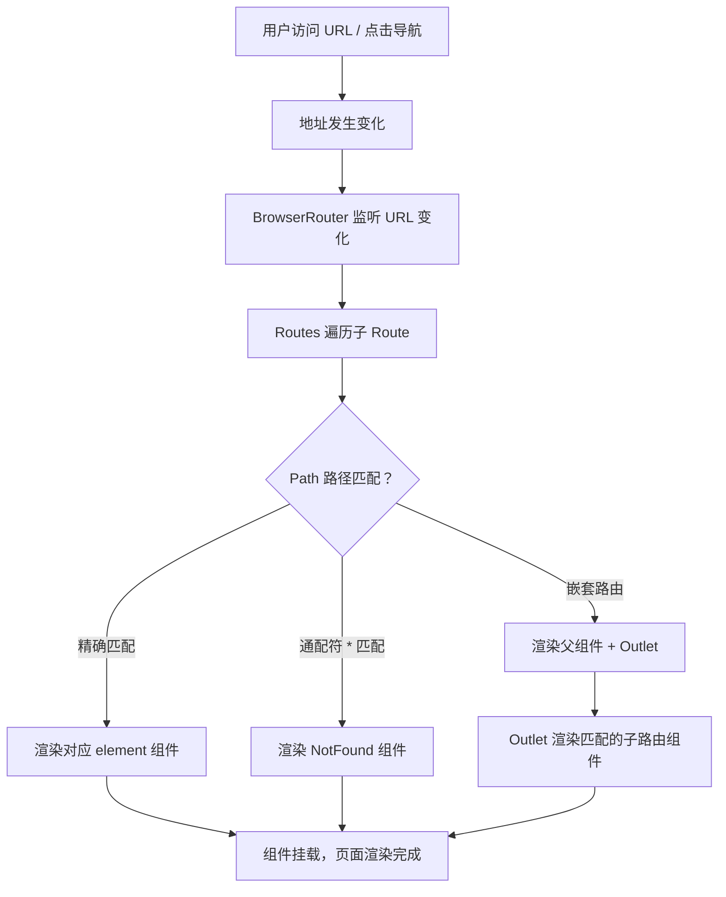

# 路由与状态管理

> 模块：06-react（第6周 React 19/20 生态）
> 本文涵盖 React Router v6 路由方案和 Redux / Zustand 等主流状态管理方案，帮助你选择合适的架构方案。

---

## 一、核心概念

### 1.1 前端路由的本质

前端路由的核心是**在不刷新页面的前提下，根据 URL 变化切换显示不同的页面内容**。这依赖于两个关键能力：

- **监听 URL 变化**：通过 History API 或 hashchange 事件
- **匹配路由规则**：根据 URL 路径渲染对应的组件

### 1.2 状态管理的必要性

当应用规模增长，组件间的状态共享变得越来越复杂。状态管理库提供：
- **单一数据源**：全局状态集中管理，避免 prop drilling
- **可预测的状态变化**：通过明确的 action/reducer 控制状态变更
- **状态与 UI 分离**：业务逻辑与视图解耦

---

## 二、底层原理

### 2.1 React Router v6 核心变化

React Router v6 带来了显著的 API 变化：

| v5 写法 | v6 写法 | 说明 |
|---------|---------|------|
| `<Switch>` | `<Routes>` | 路由匹配容器 |
| `<Route component={Home}>` | `<Route element={<Home />}>` | 使用 element 属性 |
| `useHistory()` | `useNavigate()` | 编程式导航 |
| `<Route children>` | 嵌套路由 + `<Outlet>` | 嵌套路由渲染 |
| `useRouteMatch()` | `useMatch()` | 路由匹配 Hook |
| `<Redirect>` | `<Navigate>` | 重定向组件 |
| `<Prompt>` | `useBlocker` | 路由拦截 |

**React Router 路由匹配流程图**：



> React Router v6 的路由匹配基于**路径模式匹配**算法，Routes 组件会遍历所有子 Route 并选择第一个匹配的路径。与 v5 的 Switch 不同，v6 的匹配顺序不再依赖书写顺序，而是智能选择最精确的匹配项，避免了因路由顺序不当导致的匹配错误。

**基本使用示例**：

```jsx
import { BrowserRouter, Routes, Route, Outlet, useNavigate, useParams } from 'react-router-dom';

function App() {
  return (
    <BrowserRouter>
      <Routes>
        <Route path="/" element={<Layout />}>
          {/* 嵌套路由 */}
          <Route index element={<Home />} />
          <Route path="about" element={<About />} />
          <Route path="users/:id" element={<UserDetail />} />
          <Route path="*" element={<NotFound />} />
        </Route>
      </Routes>
    </BrowserRouter>
  );
}

// Layout 组件使用 Outlet 渲染子路由
function Layout() {
  return (
    <div>
      <nav>导航栏</nav>
      <Outlet /> {/* 子路由在此渲染 */}
    </div>
  );
}

// 获取路由参数
function UserDetail() {
  const { id } = useParams();
  const navigate = useNavigate();

  return (
    <div>
      <p>用户 ID：{id}</p>
      <button onClick={() => navigate('/')}>返回首页</button>
    </div>
  );
}
```

**useRoutes 配置式路由**：

```jsx
import { useRoutes } from 'react-router-dom';

const routes = [
  {
    path: '/',
    element: <Layout />,
    children: [
      { index: true, element: <Home /> },
      { path: 'about', element: <About /> },
      { path: 'users/:id', element: <UserDetail /> },
      { path: '*', element: <NotFound /> },
    ],
  },
];

// 注意：useRoutes 必须用在 Router 组件内部（如 <BrowserRouter>）
function App() {
  return useRoutes(routes);
}
```

### 2.2 路由模式

**BrowserRouter（HTML5 History API）**：

```jsx
import { BrowserRouter } from 'react-router-dom';

// URL 形式：http://example.com/users/123
// 原理：使用 history.pushState / replaceState API
// 要求：服务器需要配置 fallback（所有路由返回 index.html）

// Nginx 配置示例：
// location / {
//   try_files $uri $uri/ /index.html;
// }
```

**HashRouter（Hash 模式）**：

```jsx
import { HashRouter } from 'react-router-dom';

// URL 形式：http://example.com/#/users/123
// 原理：监听 window.onhashchange 事件
// 优势：不需要服务器配置，兼容性好
// 缺点：URL 不美观，SEO 不友好
```

**两种模式对比**：

| 特性 | BrowserRouter | HashRouter |
|------|--------------|------------|
| URL 形式 | `/users/123` | `/#/users/123` |
| 实现原理 | History API | hashchange 事件 |
| 服务器配置 | 需要 | 不需要 |
| SEO | 友好 | 差（hash 部分不会被搜索引擎抓取） |
| 兼容性 | IE10+（历史兼容场景，2026 年新项目按现代浏览器基线） | 全兼容 |

### 2.3 路由守卫实现

**高阶组件方式**：

```jsx
import { Navigate } from 'react-router-dom';

// 路由守卫：需要登录才能访问
function ProtectedRoute({ children }) {
  const isAuthenticated = useAuth(); // 自定义 Hook，检查登录状态

  if (!isAuthenticated) {
    // 未登录，重定向到登录页
    return <Navigate to="/login" replace />;
  }

  return children;
}

// 使用
function App() {
  return (
    <Routes>
      <Route path="/login" element={<Login />} />
      <Route
        path="/dashboard"
        element={
          <ProtectedRoute>
            <Dashboard />
          </ProtectedRoute>
        }
      />
    </Routes>
  );
}
```

**Hook 方式**：

```jsx
function useAuthGuard() {
  const navigate = useNavigate();
  const isAuthenticated = useAuth();

  useEffect(() => {
    if (!isAuthenticated) {
      navigate('/login', { replace: true });
    }
  }, [isAuthenticated, navigate]);
}
```

> 📖 **参考链接**：
> - [React Router 官方文档](https://reactrouter.com/)

### 2.4 Redux 工作流程

Redux 遵循严格的**单向数据流**：

```
┌─────────┐    dispatch(action)    ┌──────────┐
│  View   │ ─────────────────────→ │  Store   │
│  (UI)   │                        │          │
└─────────┘                        │  ┌─────┐ │
     ↑                             │  │Reducer│← 纯函数，生成新 state
     │  subscribe                  │  └─────┘ │
     │  重新渲染                   └──────────┘
```

**核心概念**：

| 概念 | 说明 | 示例 |
|------|------|------|
| Store | 全局唯一的状态容器 | `createStore(rootReducer)` |
| Action | 描述"发生了什么"的普通对象 | `{ type: 'ADD_TODO', payload: '学习' }` |
| Reducer | 纯函数，根据 action 返回新 state | `(state, action) => newState` |
| Dispatch | 发送 action 的唯一方式 | `store.dispatch(action)` |

**Redux 三大原则**：
1. **单一数据源**：整个应用只有一个 Store
2. **State 只读**：唯一改变 state 的方式是 dispatch action
3. **纯函数修改**：Reducer 必须是纯函数

### 2.5 Redux Toolkit（RTK）

Redux Toolkit 是 Redux 官方推荐的工具集，大幅简化了 Redux 的使用：

**createSlice**：

```javascript
import { createSlice } from '@reduxjs/toolkit';

const counterSlice = createSlice({
  name: 'counter',
  initialState: { value: 0 },
  reducers: {
    increment: (state) => {
      // 可以直接"修改" state（得益于 immer 集成）
      state.value += 1;
    },
    decrement: (state) => {
      state.value -= 1;
    },
    incrementByAmount: (state, action) => {
      state.value += action.payload;
    },
  },
});

// 自动生成 action creators
export const { increment, decrement, incrementByAmount } = counterSlice.actions;
export default counterSlice.reducer;
```

**configureStore**：

```javascript
import { configureStore } from '@reduxjs/toolkit';
import counterReducer from './counterSlice';

const store = configureStore({
  reducer: {
    counter: counterReducer,
    // ... 其他 slice reducers
  },
  // 默认集成 Redux DevTools 和 redux-thunk
});

export default store;
```

**createAsyncThunk 处理异步**：

```javascript
import { createAsyncThunk, createSlice } from '@reduxjs/toolkit';

// 创建异步 thunk
export const fetchUsers = createAsyncThunk(
  'users/fetchUsers',
  async (userId, thunkAPI) => {
    const response = await fetch(`/api/users/${userId}`);
    return response.json();
  }
);

const usersSlice = createSlice({
  name: 'users',
  initialState: { list: [], status: 'idle', error: null },
  reducers: {},
  extraReducers: (builder) => {
    builder
      .addCase(fetchUsers.pending, (state) => {
        state.status = 'loading';
      })
      .addCase(fetchUsers.fulfilled, (state, action) => {
        state.status = 'succeeded';
        state.list = action.payload;
      })
      .addCase(fetchUsers.rejected, (state, action) => {
        state.status = 'failed';
        state.error = action.error.message;
      });
  },
});
```

**在 React 组件中使用**：

```jsx
import { useSelector, useDispatch } from 'react-redux';
import { increment, fetchUsers } from './store';

function Counter() {
  const count = useSelector((state) => state.counter.value);
  const dispatch = useDispatch();

  return (
    <div>
      <span>{count}</span>
      <button onClick={() => dispatch(increment())}>+1</button>
    </div>
  );
}
```

> 📖 **参考链接**：
> - [Redux 官方文档 - Getting Started](https://redux.js.org/introduction/getting-started)

### 2.6 Zustand 轻量状态管理

Zustand 是一个极简的状态管理库，API 简洁，无需 Provider 包裹：

```javascript
import { create } from 'zustand';

// 创建 store
const useStore = create((set) => ({
  count: 0,
  increment: () => set((state) => ({ count: state.count + 1 })),
  decrement: () => set((state) => ({ count: state.count - 1 })),
  reset: () => set({ count: 0 }),
}));

// 在组件中使用
function Counter() {
  const count = useStore((state) => state.count); // 精确订阅
  const increment = useStore((state) => state.increment);

  return (
    <div>
      <span>{count}</span>
      <button onClick={increment}>+1</button>
    </div>
  );
}
```

**Zustand 高级特性**：

```javascript
// 中间件支持
import { persist, devtools } from 'zustand/middleware';

const useStore = create(
  devtools(
    persist(
      (set) => ({
        count: 0,
        increment: () => set((state) => ({ count: state.count + 1 })),
      }),
      { name: 'counter-storage' } // 自动同步到 localStorage
    )
  )
);

// 异步操作
const useStore = create((set) => ({
  users: [],
  fetchUsers: async () => {
    const response = await fetch('/api/users');
    const users = await response.json();
    set({ users });
  },
}));
```

> 📖 **参考链接**：
> - [Zustand GitHub 仓库](https://github.com/pmndrs/zustand)

### 2.7 状态管理方案对比

| 特性 | Redux | MobX | Zustand | Jotai |
|------|-------|------|---------|-------|
| 包体积 | ~12KB | ~16KB | ~1KB | ~2KB |
| 学习曲线 | 陡峭 | 中等 | 低 | 低 |
| 样板代码 | 多（RTK 减少） | 少 | 极少 | 极少 |
| 不可变数据 | 是 | 可变 | 不可变 | 不可变 |
| 中间件生态 | 丰富 | 一般 | 支持 | 支持 |
| DevTools | 完善 | 支持 | 支持 | 支持 |
| Provider | 需要 | 需要 | 不需要 | 需要 |
| 适用场景 | 大型应用 | 数据密集型 | 中小型应用 | 细粒度状态 |

**选择建议**：
- **Redux Toolkit**：大型企业应用，需要丰富的中间件和可预测的状态管理
- **Zustand**：中小型应用，追求简洁 API 和极小的包体积
- **Jotai**：需要细粒度状态更新，避免不必要的重渲染
- **MobX**：数据密集型应用，习惯面向对象编程风格

> 📖 **参考链接**：
> - [React官方文档 - Managing State](https://react.dev/learn/managing-state)

---

## 三、实战应用

### 3.1 多层级路由配置

```jsx
const routes = [
  {
    path: '/',
    element: <Layout />,
    children: [
      { index: true, element: <Home /> },
      {
        path: 'dashboard',
        element: <ProtectedRoute><Dashboard /></ProtectedRoute>,
        children: [
          { index: true, element: <Overview /> },
          { path: 'analytics', element: <Analytics /> },
          { path: 'settings', element: <Settings /> },
        ],
      },
      { path: 'login', element: <Login /> },
      { path: '*', element: <NotFound /> },
    ],
  },
];
```

### 3.2 全局 Loading 状态管理

```javascript
// store/loadingSlice.js
import { createSlice } from '@reduxjs/toolkit';

const loadingSlice = createSlice({
  name: 'loading',
  initialState: { global: false, requests: {} },
  reducers: {
    startLoading: (state, action) => {
      state.requests[action.payload] = true;
      state.global = true;
    },
    stopLoading: (state, action) => {
      delete state.requests[action.payload];
      state.global = Object.keys(state.requests).length > 0;
    },
  },
});
```

---

## 四、常见面试题

**Q1：React Router v5 和 v6 的主要区别？**

v6 使用 `<Routes>` 替代 `<Switch>`，`element` 替代 `component/render`，`useNavigate` 替代 `useHistory`，嵌套路由通过 `<Outlet>` 实现，移除了 `<Redirect>` 和 `<Prompt>`。

**Q2：Redux 的数据流是怎样的？**

单向数据流：View dispatch Action → Store 将 Action 交给 Reducer → Reducer 生成新的 State → Store 更新 → View 通过 subscribe 重新渲染。

**Q3：Zustand 相比 Redux 有什么优势？**

无需 Provider 包裹、API 极简（一个 create 函数）、不需要 action creator 和 reducer 样板代码、支持 selector 精确订阅避免不必要的重渲染、包体积仅约 1KB。

---

## 五、避坑指南

| 常见错误 | 现象 | 原因 | 解决方案 |
|---------|------|------|---------|
| BrowserRouter 刷新后 404 | 非首页路径刷新后页面 404 | 服务器未配置 fallback，找不到对应 HTML | Nginx 配置 `try_files $uri /index.html` |
| Redux state 直接修改 | state 被修改但 UI 不更新 | 直接修改破坏了不可变性，React 无法检测变化 | 始终返回新对象，或使用 RTK 的 immer 集成 |
| selector 返回整个 state | 任何字段变化都触发重渲染 | useSelector 默认使用严格相等比较 | 精确选择需要的字段，使用 shallowEqual |
| 路由守卫未处理异步状态 | 未登录时短暂显示受保护页面 | 异步检查登录状态，初始状态为 null | 添加 loading 状态判断 |
| Zustand selector 返回新引用 | 组件频繁重渲染 | selector 每次返回新对象，浅比较判定为变化 | 选择基本类型值，或使用 shallow 比较 |
| 嵌套路由忘记 Outlet | 子路由不显示 | 缺少 Outlet 作为子路由渲染出口 | 在父组件中放置 `<Outlet />` |
| createAsyncThunk 未处理错误 | 异常未被捕获，应用崩溃 | thunk 内部抛出异常未处理 | 使用 extraReducers 处理 rejected 状态 |

---

> **学习导航**：
> - 返回 [学习路线总览](../README.md)
> - 本模块原理文件：[01-React核心与Hooks](./01-React核心与Hooks.md) | [02-Diff算法与性能优化](./02-Diff算法与性能优化.md)
> - 实战应用：[企业后台管理系统](../10-project/01-企业后台管理系统实战.md)
> - 笔面试题集：[04-React笔面试题集](./04-React笔面试题集.md)

---

## 补充：React Router 数据路由

### 概念定义

前面 2.1 节讲的是 React Router v6 的**组件式路由**（`<Routes>` + `element`），数据获取仍然写在组件的 `useEffect` 里。React Router 6.4 起引入了**数据路由（Data Router）**：把「路由」和「数据加载 / 提交」绑定在一起，由路由在渲染前执行 `loader` 拉取数据、在提交时执行 `action` 处理写操作。

启用数据路由需要把 `<BrowserRouter>` 换成 `createBrowserRouter` + `<RouterProvider>`：

```jsx
import { createBrowserRouter, RouterProvider } from 'react-router-dom';

const router = createBrowserRouter([
  {
    path: '/',
    element: <Root />,
    errorElement: <ErrorPage />,
    children: [
      { index: true, element: <Home /> },
      {
        path: 'users/:id',
        loader: userLoader,      // 读取数据
        element: <UserDetail />,
      },
      {
        path: 'users/:id/edit',
        action: updateUserAction, // 写入数据
        element: <UserEdit />,
      },
    ],
  },
]);

function App() {
  return <RouterProvider router={router} />;
}
```

> React Router v7 已将包名统一为 `react-router`（`react-router-dom` 作为兼容层保留），下列 API 在 v6.4+ / v7 中均可用。

### `loader` / `action` 的用法与执行时机

| API | 用途 | 执行时机 | 读取方式 |
|-----|------|---------|---------|
| `loader` | 读取数据（GET） | 导航开始时、**组件渲染之前**，多个匹配路由的 loader 并行执行 | `useLoaderData()` |
| `action` | 写入数据（POST / PUT / DELETE） | `<Form method="post">` 提交或 `useSubmit` 触发时 | `useActionData()` |

```jsx
// loader：接收 { request, params, context }
export async function userLoader({ params, request }) {
  const url = new URL(request.url);
  const tab = url.searchParams.get('tab') ?? 'profile';

  const res = await fetch(`/api/users/${params.id}?tab=${tab}`, {
    // request.signal 在导航被取消（用户点了别的链接）时触发 abort
    signal: request.signal,
  });

  // 抛出 Response，会被最近的 errorElement 捕获
  if (!res.ok) throw new Response('用户不存在', { status: 404 });

  return { user: await res.json(), tab };
}

// action：接收 { request, params }
export async function updateUserAction({ request, params }) {
  const formData = await request.formData();
  const name = formData.get('name');

  if (!name) {
    // action 也可以直接 return，返回值由 useActionData 读取，用于表单校验提示
    return { errors: { name: '姓名不能为空' } };
  }

  await fetch(`/api/users/${params.id}`, { method: 'PUT', body: formData });

  // 提交成功后重定向
  return redirect(`/users/${params.id}`);
}

// 组件中读取
function UserDetail() {
  const { user, tab } = useLoaderData(); // loader 的返回值
  return <h1>{user.name}（{tab}）</h1>;
}

function UserEdit() {
  const actionData = useActionData(); // action 的返回值
  return (
    <Form method="post">
      <input name="name" />
      {actionData?.errors?.name && <p>{actionData.errors.name}</p>}
      <button type="submit">保存</button>
    </Form>
  );
}
```

**为什么这是进步**：`loader` 默认在**渲染前** resolve，因此不会出现「先渲染空状态 → 再请求 → 再填充」的闪烁与瀑布流；同时 `loader` 与路由懒加载天然配合，可以在导航前就把数据准备好。这也让「路由切换」变成一个原子的、可被取消的操作（`request.signal` 会在导航中断时 abort）。

### `<Form>` 与渐进增强

`<Form>` 是 React Router 对原生 `<form>` 的增强封装。它渲染出来的**仍然是标准 `<form>` 标签**，因此具备渐进增强（Progressive Enhancement）能力：

```jsx
import { Form } from 'react-router-dom';

function UserEdit() {
  return (
    <Form method="post">
      <input name="name" defaultValue="张三" />
      <button type="submit">保存</button>
    </Form>
  );
}

// 渲染结果：<form method="post" action="/users/1/edit">
// - JS 已加载：React Router 拦截原生提交事件，调用匹配路由的 action，不刷新页面
// - JS 未加载 / 加载失败：浏览器原生提交到同一 URL，由服务端处理（需 SSR 配合）
```

要点：

- `method` 只支持 `get`（提交到 `loader`）和 `post` / `put` / `patch` / `delete`（提交到 `action`）。
- `action` 属性可指定提交到其它路由的 `action`（如列表页提交到详情页的 action）。
- 配合 `useNavigation()` 可以拿到提交中的状态：`const navigation = useNavigation(); navigation.state === 'submitting'`。
- 多个提交按钮可以用 `name="intent" value="delete"` 区分意图，在 `action` 里读 `formData.get('intent')`。

### 错误处理：`errorElement` / `useRouteError`

`loader`、`action` 中抛出的错误（包括 `throw new Response(...)`、`throw redirect(...)` 之外的异常）会被**最近的 `errorElement`** 捕获并替换该路由的渲染结果。

```jsx
import { useRouteError, isRouteErrorResponse, Link } from 'react-router-dom';

function ErrorPage() {
  const error = useRouteError();

  // 判断是否为「路由响应错误」（loader/action 中 throw 的 Response）
  if (isRouteErrorResponse(error)) {
    return (
      <div>
        <h1>{error.status} {error.statusText}</h1>
        <p>{error.data}</p>
        <Link to="/">返回首页</Link>
      </div>
    );
  }

  // 其它运行时错误
  return <h1>未知错误：{error instanceof Error ? error.message : String(error)}</h1>;
}
```

`errorElement` 与 React 错误边界的**分工**：

| 维度 | 路由 `errorElement` | React 错误边界 |
|------|--------------------|---------------|
| 捕获范围 | `loader` / `action` 中的错误 + 该路由子树的渲染错误 | 子组件树在渲染 / 生命周期 / 构造函数中的错误 |
| 能否捕获数据加载错误 | ✅（loader 在渲染前执行） | ❌（此时组件还没渲染） |
| 作用粒度 | 路由级 | 组件级 |
| 是否参与导航 | 是，出错时路由停在错误页，可继续导航 | 否，仅替换局部 UI |

实践上两者互补：路由级用 `errorElement` 兜住数据错误，组件级用错误边界兜住交互密集区域的渲染错误。

### `defer` 与 `<Await>` 流式加载

默认 `loader` 会阻塞导航直到所有数据返回。对非关键数据，可以用 `defer` 把 Promise 直接交给组件，让页面先渲染骨架，慢数据到达后再流式填充：

```jsx
import { defer, Await, useLoaderData } from 'react-router-dom';
import { Suspense } from 'react';

// loader：关键数据 await，非关键数据交给 defer
export async function pageLoader() {
  const critical = await fetchCriticalData(); // 阻塞渲染
  const slowPromise = fetchSlowData();        // 不 await，直接透传

  return defer({
    critical,
    slow: slowPromise, // defer 会识别其中的 Promise，不阻塞导航
  });
}

function Page() {
  const { critical, slow } = useLoaderData();

  return (
    <div>
      <h1>{critical.title}</h1>
      {/* 必须包在 Suspense 中，fallback 在慢数据到达前显示 */}
      <Suspense fallback={<p>加载中...</p>}>
        <Await resolve={slow} errorElement={<p>这部分加载失败</p>}>
          {(data) => <SlowSection data={data} />}
        </Await>
      </Suspense>
    </div>
  );
}
```

要点：

- `defer` 只对「返回对象中的 Promise 值」生效，对象本身同步返回。
- `<Await>` 必须被 `<Suspense>` 包裹（底层基于 React 的 Suspense）。
- `errorElement` 属性处理该 Promise reject 的情况；`useAsyncValue()` / `useAsyncError()` 可在子组件中读取。
- 适用场景：页面主数据 + 侧边推荐位 / 评论区 / 统计面板这类「不阻塞首屏」的数据。

### 路由懒加载（`lazy`）

数据路由提供了函数式 `lazy`，可以在**路由匹配到时**才下载模块，并且把 `loader` / `action` / `Component` 一起懒加载：

```jsx
const router = createBrowserRouter([
  {
    path: '/dashboard',
    // 匹配到该路由时才下载 chunk，并返回该路由所需的全部定义
    lazy: async () => {
      const { Component, loader, action, ErrorBoundary } = await import('./Dashboard');
      return { Component, loader, action, ErrorBoundary };
    },
  },
]);

// Dashboard.jsx
export async function loader() {
  return fetch('/api/dashboard').then((r) => r.json());
}
export function Component() {
  const data = useLoaderData();
  return <div>{data.title}</div>;
}
```

与 `React.lazy` 的差异：

| 维度 | `React.lazy` | 路由 `lazy` |
|------|-------------|------------|
| 分割粒度 | 组件 | 整个路由（组件 + loader + action + errorElement） |
| loader 位置 | 必须写在路由表里，随主包同步加载 | 可随 chunk 一起延迟加载 |
| 导航行为 | 先进入路由再等待组件 | 导航时并行下载 chunk 并执行 loader |
| 失败处理 | 依赖外层错误边界 | 可用路由级 `errorElement` / `ErrorBoundary` |

> 注意：v6.4 之前 `lazy` 的写法是 `lazy: () => import('./Dashboard')`（只懒加载组件），6.4+ 推荐使用上面返回对象 / 函数式 `lazy` 的写法。

### TanStack Router 的定位与差异

TanStack Router 是 TanStack 团队（TanStack Query、TanStack Table 的作者）推出的类型安全路由库。它的定位不是「另一个 React Router」，而是**把类型安全、search params 和数据加载/缓存作为一等公民**的路由框架，通常与 TanStack Query 配套使用。

最核心的差异是**端到端类型推导**。路由路径、`params`、search params、`loader` 返回值都由 TypeScript 精确推导，写错路由名或参数在编译期就会报错：

```tsx
// TanStack Router：路径参数用 $id 而非 :id
const userRoute = createRoute({
  path: '/users/$id',
  validateSearch: (search) => ({ tab: (search.tab as string) ?? 'profile' }),
  loader: ({ params }) => fetchUser(params.id), // params.id 类型为 string
});

// 类型安全的导航：to / params 都会被编译期校验
navigate({ to: '/users/$id', params: { id: '42' }, search: { tab: 'posts' } });
```

第二个差异是 **search params 的处理**。React Router 的 `useSearchParams()` 返回的永远是 `URLSearchParams`，需要手动解析和校验；TanStack Router 内置 `validateSearch`（可接 Zod / Valibot）与 `useSearch()`，把「筛选条件即 URL」这类场景做成了类型安全的常规操作。

第三个差异是**数据加载与缓存的内建程度**。TanStack Router 的 `loader` 与 TanStack Query 深度集成，支持 `staleTime`、`preload`（在鼠标悬停链接时预取数据）、`beforeLoad`（前置守卫，可在此做鉴权重定向），并且会把 loader 的缓存键纳入路由树管理；React Router 的 loader 更像「一次性数据准备」，缓存与失效需要自己接 Query 或手写。

选型建议：React Router 生态更大、文档更全、与 Remix / Next.js 等框架绑定更深，社区问答和招聘要求中出现频率更高，是**默认选择**；TanStack Router 的类型体验和 search params 支持明显更好，适合 TypeScript 重度使用、筛选条件复杂的中大型 SPA，但生态与心智成本更高，团队需要额外学习成本。从学习角度，**先掌握 React Router 的数据路由模型，再了解 TanStack Router 的差异**即可。

### 面试常见问法

- `loader` 和 `action` 分别在什么时机执行？和组件里 `useEffect` 取数相比有什么优势？
- 数据路由为什么能避免「先渲染空状态再加载」的闪烁和瀑布式请求？
- `<Form>` 的渐进增强是怎么实现的？没有 JS 时会发生什么？
- `errorElement` 和 React 错误边界分别能捕获什么错误？为什么要同时使用？
- `defer` + `<Await>` 解决什么问题？为什么必须包在 `<Suspense>` 里？
- 路由 `lazy` 和 `React.lazy` 有什么区别？
- TanStack Router 和 React Router 的核心差异是什么？

### 易错点

| 常见错误 | 现象 | 原因 | 解决方案 |
|---------|------|------|---------|
| 用 `<BrowserRouter>` 却写 `loader` | loader 完全不执行，组件里拿不到数据 | `loader` / `action` 只属于数据路由，必须用 `createBrowserRouter` + `<RouterProvider>` | 迁移到数据路由，或把取数逻辑放回组件 |
| `loader` 抛出的 `Response` 在 `errorElement` 中按普通 Error 读取 | `error.message` 为 `undefined`，拿不到状态码与错误体 | `throw new Response(...)` 抛出的是 `Response` 对象，不是 `Error` | 先用 `isRouteErrorResponse(error)` 判断，再读取 `error.status` / `error.statusText` / `error.data` |
| `loader` 中不传 `request.signal` | 用户快速切换路由后，旧请求仍返回并写回状态 | 导航取消不会中止自定义的 `fetch` | `fetch(url, { signal: request.signal })` |
| 在 `loader` 中访问 `localStorage` / `document` | SSR 下报错 | `loader` 可能在服务端执行，没有浏览器 API | 浏览器相关逻辑移到组件或 `action` 中，或用 `typeof window !== 'undefined'` 守卫 |
| 在 `loader` 中 `setState` / 操作 DOM | 报错或行为异常 | `loader` 是纯数据函数，执行时组件尚未挂载 | 只返回数据，把副作用留在组件里 |
| `loader` 抛普通 Error 却不配 `errorElement` | 整个应用崩溃，显示 React Router 默认错误页 | 没有就近的错误边界 | 在路由层级配置 `errorElement` |
| `<Await>` 外面没包 `<Suspense>` | 抛错或 fallback 不生效 | `<Await>` 依赖 React Suspense 机制 | 用 `<Suspense fallback={...}>` 包裹 |
| `defer` 的对象里对 Promise 做了 `await` | 退化为阻塞导航，流式加载失效 | `await` 会等待 Promise resolve 后再构造对象 | 只 `await` 关键数据，非关键 Promise 直接透传给 `defer` |
| 在 `action` 中忘了 `redirect` | 提交成功后 URL 不变，刷新页面回到旧数据 | action 只负责写，导航需要显式返回 `redirect()` | 写操作成功后 `return redirect(path)` |
| 用旧式 `lazy: () => import('./X')` 却期望 loader 一起懒加载 | loader 仍在主包中，分割效果不理想 | 旧式 `lazy` 只懒加载组件 | 改用返回 `{ Component, loader, action }` 的函数式 `lazy` |

---

## 本章学习自检

- [ ] 掌握 React Router v6 的核心 API 变化（Routes / element / useNavigate / Outlet）
- [ ] 理解 BrowserRouter 和 HashRouter 的区别及适用场景
- [ ] 能实现路由守卫（登录鉴权、权限控制）
- [ ] 理解 Redux 的单向数据流（Store / Reducer / Action / Dispatch）
- [ ] 能使用 Redux Toolkit 的 createSlice 和 createAsyncThunk
- [ ] 掌握 Zustand 的基本用法和与 Redux 的对比
- [ ] 了解主流状态管理方案的适用场景和选型建议
- [ ] 能处理嵌套路由和多层级路由配置