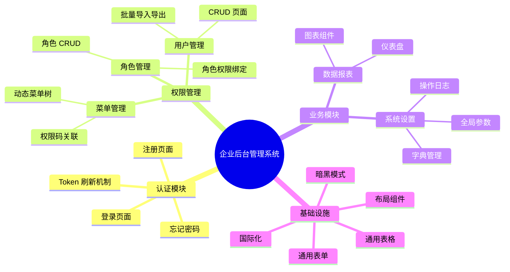
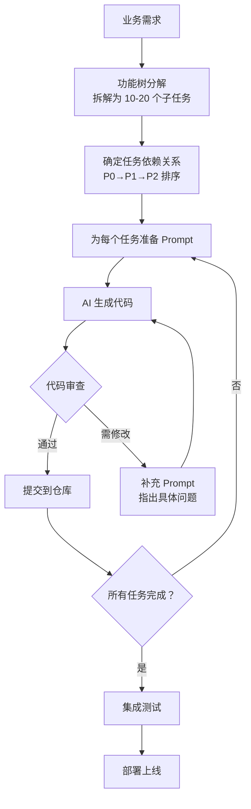

# 工程规范与流程

> 模块：07-engineering（第7周 前端工程化）
> 定位：核心基础原理篇

---

## 一、核心概念

前端工程化不仅仅是会用 Webpack 和 Vite，更重要的是建立一套完整、规范的开发流程和质量保障体系。工程规范涵盖代码规范、Git 工作流、CI/CD 流水线、Monorepo 架构和部署方案，这些是团队协作和项目长期维护的基础。

**工程规范体系的核心目标**：

1. **统一代码风格**：消除因个人习惯导致的代码差异，降低 Code Review 成本
2. **自动化质量保障**：通过工具链自动检查代码质量，在提交前拦截问题
3. **规范化协作流程**：统一 Git 分支管理、Commit Message 规范，提升协作效率
4. **持续集成与部署**：自动化构建、测试、部署流程，减少人工操作失误
5. **可维护性**：保证代码库长期健康，新成员可快速上手

---

## 二、底层原理

### 代码规范工具

#### ESLint

ESLint 是 JavaScript/TypeScript 生态中最主流的代码检查工具，它通过静态分析源码，发现潜在的错误和不符合规范的代码。

> **重要变化**：ESLint 10.x 已正式发布，**彻底移除了**对 `.eslintrc.*` 格式配置文件的支持（包括 `.eslintrc.js`、`.eslintrc.cjs`、`.eslintrc.yaml`、`.eslintrc.json`）。这意味着所有项目必须迁移到 **Flat Config**（`eslint.config.mjs` / `eslint.config.js`）格式。ESLint 9.x 已经将旧格式标记为废弃（deprecated），10.x 已完全移除旧格式的解析逻辑。尚未迁移的项目应尽快升级，推荐使用 `pnpm dlx @eslint/migrate-config` 工具自动转换旧配置。

```javascript
// eslint.config.mjs — ESLint 9+ Flat Config（ESLint 10.x 已移除 .eslintrc.* 格式支持）
// 注意：旧版 .eslintrc.js / .eslintrc.cjs 格式在 ESLint 9+ 中已废弃，10.x 已移除
import js from '@eslint/js';
import tseslint from 'typescript-eslint';
import pluginVue from 'eslint-plugin-vue';
import eslintConfigPrettier from 'eslint-config-prettier';

export default [
  // 忽略文件
  { ignores: ['dist/', 'node_modules/'] },
  // 基础配置
  js.configs.recommended,
  // TypeScript 配置
  ...tseslint.configs.recommended,
  // Vue 3 配置
  ...pluginVue.configs['flat/recommended'],
  // Prettier — 关闭冲突规则，必须放最后
  eslintConfigPrettier,
  // 自定义规则
  {
    rules: {
      'no-console': process.env.NODE_ENV === 'production' ? 'warn' : 'off',
      'no-debugger': process.env.NODE_ENV === 'production' ? 'error' : 'off',
      'vue/multi-word-component-names': 'off',
      '@typescript-eslint/no-unused-vars': ['error', { argsIgnorePattern: '^_' }],
      'no-var': 'error',
      'prefer-const': 'error'
    }
  }
];
```

**ESLint 工作原理**：
1. **解析**：使用 parser（如 `@typescript-eslint/parser`）将源码解析为 AST（抽象语法树）
2. **遍历 AST**：按照规则遍历 AST 节点，每个规则监听特定的节点类型
3. **报告问题**：对不符合规则的节点生成错误或警告信息

> 📖 **参考链接**：
> - [ESLint官方文档 - Flat Config](https://eslint.org/docs/latest/use/configure/configuration-files)
> - [ESLint官方文档 - 迁移到9.0.0](https://eslint.org/docs/latest/use/configure/migration-guide)

#### Prettier

Prettier 是"有主见的"代码格式化工具，它不考虑你原有的代码风格，而是按照统一规则重新格式化。

```javascript
// .prettierrc.js 配置示例
module.exports = {
  printWidth: 100,        // 每行最大字符数
  tabWidth: 2,            // 缩进空格数
  useTabs: false,         // 使用空格缩进
  semi: false,            // 语句末尾不加分号
  singleQuote: true,      // 使用单引号
  trailingComma: 'none',  // 不使用尾逗号
  bracketSpacing: true,   // 对象花括号内加空格
  arrowParens: 'avoid',   // 箭头函数单参数省略括号
  endOfLine: 'lf',        // 换行符统一为 LF
  vueIndentScriptAndStyle: false // Vue 文件中 script/style 不缩进
}
```

**ESLint 与 Prettier 的分工**：

| 工具 | 职责 | 关注点 | 可自动修复 |
|------|------|--------|:--:|
| ESLint | 代码质量检查 | 逻辑错误、潜在 bug、最佳实践 | 部分支持 |
| Prettier | 代码格式化 | 缩进、引号、分号、换行等纯格式问题 | 完全支持 |

**配合使用**：
- `eslint-config-prettier`：关闭 ESLint 中与 Prettier 冲突的格式规则
- `eslint-plugin-prettier`：将 Prettier 作为 ESLint 规则运行（可选，推荐直接分开运行）

> 📖 **参考链接**：
> - [Prettier官方文档](https://prettier.io/docs/)

#### Husky + lint-staged

Husky 用于管理 Git Hooks，在 Git 操作（如 commit、push）时自动触发脚本。lint-staged 只对 Git 暂存区的文件执行检查，避免全量检查。

```bash
# 安装
pnpm add -D husky lint-staged

# 初始化 husky（Husky 9.x，推荐使用 pnpm exec husky init 或手动创建 .husky/ 目录）
pnpm exec husky init
```

```json
// package.json 中的 lint-staged 配置
{
  "lint-staged": {
    "*.{js,jsx,ts,tsx,vue}": [
      "eslint --fix",
      "prettier --write"
    ],
    "*.{css,scss,less,html,json,md}": [
      "prettier --write"
    ]
  }
}
```

```bash
# .husky/pre-commit 文件内容
pnpm lint-staged
```

> 📖 **参考链接**：
> - [Husky官方文档](https://typicode.github.io/husky/)
> - [lint-staged官方文档](https://github.com/lint-staged/lint-staged)

#### commitlint

commitlint 用于规范化 Git Commit Message，确保提交信息符合团队约定的格式。

```bash
# 安装
pnpm add -D @commitlint/cli @commitlint/config-conventional

# .husky/commit-msg 文件内容
pnpm exec commitlint --edit $1
```

```javascript
// commitlint.config.js
module.exports = {
  extends: ['@commitlint/config-conventional'],
  rules: {
    'type-enum': [2, 'always', [
      'feat',     // 新功能
      'fix',      // 修复 bug
      'docs',     // 文档变更
      'style',    // 代码格式（不影响功能）
      'refactor', // 重构
      'perf',     // 性能优化
      'test',     // 测试
      'chore',    // 构建/工具变更
      'ci',       // CI 配置变更
      'revert'    // 回滚
    ]],
    'subject-case': [0]
  }
}
```

> 📖 **参考链接**：
> - [commitlint官方文档](https://commitlint.js.org/)

### Git 工作流

#### Git Flow

Git Flow 是最经典的分支模型，适合有明确版本发布周期的项目：

```
master (main)     ●────●────────────●────
                   \              / 
develop            ●──●──●──●──●─●──●──
                     \    / \    /
feature/login        ●──●   ●──●
                     \    /
release/1.0.0          ●──●
                            \
hotfix/critical-bug            ●──●
```

| 分支 | 用途 | 来源 | 合并到 |
|------|------|------|--------|
| `master` / `main` | 生产环境代码，只接受合并 | release / hotfix | - |
| `develop` | 开发主线，集成各 feature 分支 | - | release |
| `feature/xxx` | 功能开发 | develop | develop |
| `release/x.x.x` | 版本发布准备（修 bug、改版本号） | develop | master + develop |
| `hotfix/xxx` | 紧急修复线上 bug | master | master + develop |

#### GitHub Flow

GitHub Flow 更简洁，适合持续部署的项目：

```
main     ●──●──●──●──●
         \    /    /
feature/a  ●──●    /
feature/b      ●──●
```

- 只有一个长期分支 `main`，始终保持可部署状态
- 开发新功能时从 `main` 创建 feature 分支
- 完成后通过 Pull Request 合并回 `main`
- 合并后立即部署

#### 分支命名规范

| 前缀 | 用途 | 示例 |
|------|------|------|
| `feature/` | 新功能开发 | `feature/user-login` |
| `bugfix/` | 修复非紧急 bug | `bugfix/header-style` |
| `hotfix/` | 紧急修复线上问题 | `hotfix/payment-error` |
| `release/` | 版本发布准备 | `release/1.2.0` |
| `refactor/` | 代码重构 | `refactor/api-layer` |
| `docs/` | 文档更新 | `docs/api-guide` |

### Commit Message 规范

Conventional Commits 是目前最主流的 Commit Message 规范，格式为：

```
<type>(<scope>): <subject>

<body>

<footer>
```

**type 类型**：

| Type | 说明 | 示例 |
|------|------|------|
| `feat` | 新功能 | `feat(auth): 添加 JWT 登录功能` |
| `fix` | 修复 bug | `fix(table): 修复分页参数错误` |
| `docs` | 文档变更 | `docs(readme): 更新安装说明` |
| `style` | 代码格式（不影响功能） | `style(header): 统一缩进格式` |
| `refactor` | 重构（不新增功能，不修复 bug） | `refactor(api): 提取公共请求拦截器` |
| `perf` | 性能优化 | `perf(list): 使用虚拟列表优化渲染` |
| `test` | 测试相关 | `test(login): 添加登录表单单元测试` |
| `chore` | 构建/工具/依赖变更 | `chore(deps): 升级 Vue 到 3.4` |
| `ci` | CI/CD 配置变更 | `ci(github): 添加自动部署流程` |
| `revert` | 回滚之前的提交 | `revert: 回滚 feat(auth): 添加 JWT 登录功能` |

### CI/CD 流程

CI（持续集成）和 CD（持续部署/持续交付）是自动化软件交付的核心实践。

```
代码提交 → 自动构建 → 自动化测试 → 代码检查 → 构建产物 → 部署测试环境 → 部署生产环境
|_______________ CI 持续集成 _______________|  |___________ CD 持续部署 ___________|
```

**完整流程详解**：

1. **CI 阶段**：
   - 开发者推送代码到远程仓库
   - 触发 CI 流水线，自动拉取代码
   - 安装依赖、执行 lint 检查
   - 运行单元测试和集成测试
   - 执行构建，生成产物
2. **CD 阶段**：
   - 将构建产物部署到测试/预发布环境
   - 执行自动化端到端测试
   - 人工审批或自动发布到生产环境

**GitHub Actions 示例**：

```yaml
# .github/workflows/ci-cd.yml
name: CI/CD Pipeline

on:
  push:
    branches: [main, develop]
  pull_request:
    branches: [main]

jobs:
  lint-and-test:
    runs-on: ubuntu-latest
    steps:
      - uses: actions/checkout@v4
      - uses: pnpm/action-setup@v5
        with:
          version: 10
      - uses: actions/setup-node@v4
        with:
          node-version: 22
          cache: 'pnpm'
      - run: pnpm install --frozen-lockfile
      - run: pnpm lint
      - run: pnpm test

  build-and-deploy:
    needs: lint-and-test
    if: github.ref == 'refs/heads/main'
    runs-on: ubuntu-latest
    steps:
      - uses: actions/checkout@v4
      - uses: pnpm/action-setup@v5
        with:
          version: 10
      - uses: actions/setup-node@v4
        with:
          node-version: 22
          cache: 'pnpm'
      - run: pnpm install --frozen-lockfile
      - run: pnpm build
      - name: Deploy to Server
        uses: easingthemes/ssh-deploy@v4
        with:
          SSH_PRIVATE_KEY: ${{ secrets.SSH_PRIVATE_KEY }}
          REMOTE_HOST: ${{ secrets.REMOTE_HOST }}
          REMOTE_USER: ${{ secrets.REMOTE_USER }}
          TARGET: /var/www/app
          SOURCE: 'dist/'
```

### Monorepo 架构

Monorepo（单一仓库）是一种将多个项目/包放在同一个 Git 仓库中管理的策略。

**什么是 Monorepo**：一个仓库中管理多个相关的包/项目，共享配置、依赖和工具链。

**Monorepo 的核心优势**：

| 优势 | 说明 |
|------|------|
| 统一配置 | 一份 ESLint、Prettier、TypeScript 配置，所有包共享 |
| 代码共享 | 公共代码放在 `packages/shared` 中，所有应用直接引用 |
| 原子提交 | 一次提交可以同时修改多个包，确保一致性 |
| 依赖管理 | 统一管理依赖版本，避免版本冲突 |
| 简化协作 | 新成员只需克隆一个仓库，不需要分别配置多个仓库 |

**pnpm workspaces 配置**：

```yaml
# pnpm-workspace.yaml
packages:
  - 'packages/*'
  - 'apps/*'
```

```json
// 根 package.json
{
  "scripts": {
    "dev:web": "pnpm --filter @my-app/web dev",
    "dev:admin": "pnpm --filter @my-app/admin dev",
    "build:all": "pnpm -r build",
    "lint": "pnpm -r lint"
  }
}
```

**典型 Monorepo 目录结构**：

```
my-monorepo/
├── pnpm-workspace.yaml
├── package.json               # 根配置，workspace 脚本
├── tsconfig.base.json         # 共享 TypeScript 配置
├── eslint.config.mjs          # 共享 ESLint Flat Config 配置
├── .prettierrc.js             # 共享 Prettier 配置
├── packages/
│   ├── shared/                # 公共工具库、类型定义
│   │   ├── src/
│   │   ├── package.json       # "name": "@my-app/shared"
│   │   └── tsconfig.json
│   ├── ui/                    # 公共 UI 组件库
│   │   ├── src/
│   │   └── package.json       # "name": "@my-app/ui"
│   └── utils/                 # 公共工具函数
│       └── package.json
└── apps/
    ├── web/                   # 主站应用
    │   ├── src/
    │   ├── vite.config.ts
    │   └── package.json       # "name": "@my-app/web"
    └── admin/                 # 后台管理应用
        ├── src/
        ├── vite.config.ts
        └── package.json       # "name": "@my-app/admin"
```

**Turborepo**：Vercel 出品的 Monorepo 管理工具，核心特性：
- **增量构建**：只构建变更的包及其依赖方
- **远程缓存**：将构建缓存上传到云端，团队成员共享
- **并行执行**：自动分析依赖关系，并行执行无依赖的任务

```json
// turbo.json
{
  "tasks": {
    "build": {
      "dependsOn": ["^build"],
      "outputs": ["dist/**"]
    },
    "lint": {},
    "test": {
      "dependsOn": ["build"]
    },
    "dev": {
      "cache": false,
      "persistent": true
    }
  }
}
```

**Nx**：Google 出品的构建系统，核心特性：
- **依赖图分析**：自动分析项目依赖关系，可视化展示
- **只构建受影响的项目**：根据 Git 变更自动计算需要构建的项目
- **分布式任务执行**：支持在多台机器上并行执行任务

### 部署方案

#### 静态托管

适合纯前端 SPA 项目，零运维成本。

| 平台 | 特点 | 适用场景 |
|------|------|----------|
| Vercel | 零配置部署，自动 HTTPS，Serverless Functions | Next.js 项目首选 |
| Netlify | 自动构建部署，表单处理，Split Testing | 静态站点和 Jamstack |
| GitHub Pages | 免费，与 GitHub 深度集成 | 个人项目、文档站点 |
| Cloudflare Pages | 全球 CDN，免费计划慷慨 | 需要全球加速的项目 |

#### Nginx 配置

自建服务器部署时，Nginx 是最常用的 Web 服务器和反向代理。

```nginx
# /etc/nginx/sites-available/my-app
server {
    listen 80;
    server_name example.com;
    return 301 https://$server_name$request_uri;  # HTTP 强制跳转 HTTPS
}

server {
    listen 443 ssl http2;
    server_name example.com;

    root /var/www/my-app/dist;
    index index.html;

    # gzip 压缩
    gzip on;
    gzip_types text/plain text/css application/json application/javascript text/xml;
    gzip_min_length 1024;
    gzip_comp_level 6;

    # 静态资源缓存
    location /assets/ {
        expires 1y;
        add_header Cache-Control "public, immutable";
    }

    # API 反向代理
    location /api/ {
        proxy_pass http://localhost:8080/api/;
        proxy_set_header Host $host;
        proxy_set_header X-Real-IP $remote_addr;
        proxy_set_header X-Forwarded-For $proxy_add_x_forwarded_for;
        proxy_set_header X-Forwarded-Proto $scheme;
    }

    # SPA 路由 fallback：所有非文件请求返回 index.html
    location / {
        try_files $uri $uri/ /index.html;
    }
}
```

**Nginx 配置要点**：
- **SPA 路由 fallback**：`try_files $uri $uri/ /index.html` 确保前端路由正常工作
- **gzip 压缩**：减少传输体积，提升加载速度
- **静态资源缓存**：对带 hash 的静态资源设置长期缓存
- **反向代理**：将 API 请求转发到后端服务，解决跨域问题

#### Docker 部署

```dockerfile
# Dockerfile - 多阶段构建
# 阶段 1：构建
FROM node:20-alpine AS builder
WORKDIR /app
COPY package.json pnpm-lock.yaml ./
RUN corepack enable && pnpm install --frozen-lockfile
COPY . .
RUN pnpm build

# 阶段 2：生产环境
FROM nginx:alpine
COPY --from=builder /app/dist /usr/share/nginx/html
COPY nginx.conf /etc/nginx/conf.d/default.conf
EXPOSE 80
CMD ["nginx", "-g", "daemon off;"]
```

```yaml
# docker-compose.yml（Compose V2 不再需要 version 字段）
services:
  frontend:
    build: .
    ports:
      - '80:80'
    restart: unless-stopped
  backend:
    image: my-app-backend:latest
    ports:
      - '8080:8080'
    environment:
      - NODE_ENV=production
```

---

## 三、实战应用

### 1. 从零搭建前端工程规范

```bash
# 1. 初始化项目
pnpm init

# 2. 安装 ESLint + Prettier
pnpm add -D eslint prettier \
  eslint-config-prettier \
  eslint-plugin-vue \
  @typescript-eslint/parser \
  @typescript-eslint/eslint-plugin

# 3. 安装 Husky + lint-staged
pnpm add -D husky lint-staged
pnpm exec husky init

# 4. 安装 commitlint
pnpm add -D @commitlint/cli @commitlint/config-conventional

# 5. 配置 .husky/pre-commit
echo "pnpm lint-staged" > .husky/pre-commit

# 6. 配置 .husky/commit-msg
# 注意：双引号中的 \$1 需要转义，否则会被 shell 展开为空字符串
echo "pnpm exec commitlint --edit \$1" > .husky/commit-msg
```

### 2. Monorepo 项目搭建

```bash
# 创建 pnpm workspace
mkdir my-monorepo && cd my-monorepo

# 创建 pnpm-workspace.yaml
# Linux/Mac 使用 heredoc：
# cat > pnpm-workspace.yaml << EOF
# packages:
#   - 'packages/*'
#   - 'apps/*'
# EOF

# Windows PowerShell 等效写法（跨平台推荐直接创建文件）：
@"
packages:
  - 'packages/*'
  - 'apps/*'
"@ | Out-File -FilePath pnpm-workspace.yaml -Encoding UTF8

# 创建共享包
mkdir -p packages/shared/src
mkdir -p apps/web/src

# 初始化各包
cd packages/shared && pnpm init
cd ../../apps/web && pnpm init
```

### 3. 完整的 CI/CD 流水线配置

```yaml
# .github/workflows/deploy.yml
name: Deploy

on:
  push:
    branches: [main]

jobs:
  deploy:
    runs-on: ubuntu-latest
    steps:
      - uses: actions/checkout@v4
      - uses: pnpm/action-setup@v5
      - uses: actions/setup-node@v4
        with:
          node-version: 22
          cache: 'pnpm'
      - run: pnpm install --frozen-lockfile
      - run: pnpm build
      - run: pnpm test
      - name: Deploy
        run: |
          scp -r dist/* user@server:/var/www/app/
```

---

## 四、常见面试题

### 1. ESLint 和 Prettier 的区别是什么？如何配合使用？

**回答要点**：ESLint 关注代码质量（逻辑错误、潜在 bug、最佳实践），Prettier 关注代码格式（缩进、引号、分号、换行等）。配合方式：使用 `eslint-config-prettier` 关闭 ESLint 中与 Prettier 冲突的格式规则，让 ESLint 只负责质量检查，Prettier 只负责格式化。

### 2. Husky 和 lint-staged 的作用是什么？

**回答要点**：Husky 用于管理 Git Hooks，在 Git 操作时自动触发脚本。lint-staged 只对 Git 暂存区的文件执行检查（ESLint、Prettier），避免全量检查，提升速度。二者结合实现提交前自动检查。

### 3. Git Flow 和 GitHub Flow 有什么区别？

**回答要点**：Git Flow 有多个长期分支（master、develop）和临时分支（feature、release、hotfix），适合有明确版本发布周期的项目。GitHub Flow 只有一个长期分支 main，通过 feature 分支开发，PR 合并后立即部署，适合持续部署的项目。

### 4. Conventional Commits 规范是什么？有哪些 type 类型？

**回答要点**：Conventional Commits 是 Commit Message 规范，格式为 `type(scope): subject`。常用 type：feat（新功能）、fix（修复）、docs（文档）、style（格式）、refactor（重构）、perf（性能）、test（测试）、chore（构建/工具）、ci（CI/CD）、revert（回滚）。

### 5. Monorepo 的优缺点是什么？

**回答要点**：优点：统一配置、代码共享、原子提交、依赖管理统一。缺点：仓库体积大（克隆慢）、构建时间长（需要工具优化）、权限管理困难（所有人能看到所有代码）、对工具链要求高（需要 Turborepo/Nx 等）。

---

## 五、避坑指南

| 常见错误 | 现象 | 原因 | 解决方案 |
|---------|------|------|----------|
| ESLint 和 Prettier 规则冲突 | 格式化后 ESLint 报错，保存时来回切换 | 两个工具的规则重叠，互相覆盖 | 安装 `eslint-config-prettier`，在 extends 最后添加 `'prettier'` |
| lint-staged 检查所有文件而不是暂存文件 | 提交时执行慢，检查了未修改的文件 | lint-staged 配置不正确，没有使用文件参数 | 确保配置中命令格式正确，如 `"eslint --fix"` 而非 `"eslint --fix ."` |
| commitlint 不生效 | 提交信息未被检查 | Husky 钩子未正确安装或未被 Git 识别 | 运行 `pnpm exec husky install`，确保 `.husky/commit-msg` 文件可执行 |
| Monorepo 中包之间循环依赖 | 构建失败或构建顺序错误 | 包 A 依赖包 B，包 B 又依赖包 A | 使用 Turborepo 或 Nx 进行依赖分析，重构代码消除循环依赖 |
| Nginx SPA 路由刷新 404 | 刷新页面后显示 Nginx 404 | 缺少 SPA 路由 fallback 配置 | 添加 `try_files $uri $uri/ /index.html` |
| Docker 构建产物过大 | 镜像体积超过 1GB | 多阶段构建时未清理，或基础镜像过大 | 使用多阶段构建，生产阶段只复制必要文件，使用 `alpine` 基础镜像 |
| Monorepo 中共享依赖版本不一致 | 运行时出现多种版本冲突 | 不同包依赖了不同版本的同一个库 | 在根 package.json 中统一管理公共依赖版本，使用 pnpm 的 `overrides` 字段 |
| CI/CD 中忘记锁定依赖版本 | 生产环境构建结果与本地不一致 | `pnpm install` 可能安装不同的小版本 | 使用 `pnpm install --frozen-lockfile`，确保 lockfile 被提交到仓库 |

---

> **学习导航**：
> - 返回 [学习路线总览](../README.md)
> - 本模块其他原理文件：[01-构建工具原理](./01-构建工具原理.md) | [03-前端工程化笔面试题集](./03-前端工程化笔面试题集.md)
> - 实战应用：[企业后台管理系统](../10-project/01-企业后台管理系统实战.md)

## 六、本章学习自检

- [ ] 我能说出 ESLint 和 Prettier 的区别，以及如何配合使用
- [ ] 我理解 Husky 和 lint-staged 的工作原理和配置方式
- [ ] 我能说出 Git Flow 和 GitHub Flow 的区别和适用场景
- [ ] 我掌握了 Conventional Commits 规范，能写出规范的 Commit Message
- [ ] 我能描述 CI/CD 的完整流程（lint → test → build → deploy）
- [ ] 我能写出一个完整的 GitHub Actions 流水线配置
- [ ] 我理解 Monorepo 的优势和劣势，知道何时使用
- [ ] 我能配置 pnpm workspaces 来搭建 Monorepo 项目
- [ ] 我能写出 Nginx 的 SPA 部署配置（路由 fallback、gzip、反向代理、缓存）
- [ ] 我能使用 Docker 多阶段构建来部署前端应用
- [ ] 我能说出测试金字塔的三层结构及其投入产出比关系
- [ ] 我掌握了 Jest/Vitest 的核心语法（describe/it/expect/匹配器/Mock）
- [ ] 我能使用 Vue Test Utils 或 React Testing Library 编写组件测试
- [ ] 我了解 Cypress 和 Playwright 的区别和各自适用场景
- [ ] 我能区分观察者模式和发布-订阅模式的核心差异
- [ ] 我理解单例模式在前端全局状态管理中的应用
- [ ] 我掌握策略模式在表单验证中的实际应用
- [ ] 我能解释 Vue 3 的 Proxy 响应式系统如何体现代理模式
- [ ] 我能说出装饰器模式在前端中的三种体现形式（TS装饰器/HOC/AOP）

---

## 补充内容1：前端测试体系

> **交叉引用**：本节为测试体系速览，完整的测试集成与质量门禁见 [04-测试集成与质量门禁.md](./04-测试集成与质量门禁.md)，测试策略的系统性讲解见 [15-testing 模块](../15-testing/)

前端测试是保障代码质量和项目稳定性的核心环节。一个完善的前端测试体系应该覆盖从最小粒度的函数单元到完整用户交互流程的各个层级，形成"测试金字塔"结构。

### 测试金字塔

测试金字塔是 Mike Cohn 提出的测试分层模型，它描述了不同测试类型的理想比例关系：

```
          /\
         /  \       E2E 测试（端到端）
        /    \      - 数量最少
       /------\     - 速度最慢
      /        \    - 成本最高
     / 集成测试  \   - 模拟真实用户操作
    /            \
   /--------------\
  /                \
 /   单元测试（最多）  \
/____________________\
```

| 层级 | 测试类型 | 数量占比 | 执行速度 | 维护成本 | 覆盖范围 | 典型工具 |
|------|---------|:------:|:------:|:------:|---------|----------|
| 顶层 | E2E 测试 | ~10% | 慢（分钟级） | 高 | 完整用户流程 | Cypress、Playwright |
| 中层 | 集成测试 | ~20% | 中（秒级） | 中 | 模块间交互 | Jest + RTL、Vitest |
| 底层 | 单元测试 | ~70% | 快（毫秒级） | 低 | 函数/组件级别 | Jest、Vitest |

**投入产出比分析**：

- **单元测试**：投入低、回报高。编写快速，执行迅速，定位问题精准，是性价比最高的测试类型，应该占据测试体系的主体。
- **集成测试**：投入中等、回报中等。验证模块间协作是否正确，能发现单元测试无法覆盖的接口问题和数据流问题。
- **E2E 测试**：投入高、回报高但风险大。模拟真实用户操作，最容易发现业务逻辑缺陷，但执行慢、维护成本高、环境依赖复杂，应控制数量，只覆盖核心业务流程。

### 单元测试（Jest / Vitest）

单元测试验证代码中最小可测试单元（函数、方法、类）的正确性。Jest 是 Facebook 开源的测试框架，Vitest 是基于 Vite 的新一代测试框架，API 与 Jest 高度兼容。

#### 核心语法

```javascript
// 测试套件：将相关测试用例分组
describe('MathUtils', () => {
  // 测试用例：验证一个具体行为
  it('should add two numbers correctly', () => {
    // 断言：验证结果是否符合预期
    expect(add(1, 2)).toBe(3)
  })

  it('should throw error when dividing by zero', () => {
    expect(() => divide(10, 0)).toThrow('Cannot divide by zero')
  })
})
```

#### 常用匹配器

```javascript
// 精确匹配
expect(value).toBe(42)                          // 严格相等（===）
expect(value).toEqual({ name: 'Alice' })        // 深度相等（对象/数组）
expect(value).toStrictEqual({ name: 'Alice' })  // 严格深度相等（含 undefined 属性）

// 真假判断
expect(value).toBeTruthy()                      // 真值
expect(value).toBeFalsy()                       // 假值
expect(value).toBeNull()                        // null
expect(value).toBeUndefined()                   // undefined
expect(value).toBeDefined()                     // 已定义

// 数值比较
expect(value).toBeGreaterThan(3)                // 大于
expect(value).toBeGreaterThanOrEqual(3)         // 大于等于
expect(value).toBeLessThan(5)                   // 小于
expect(value).toBeLessThanOrEqual(5)            // 小于等于
expect(value).toBeCloseTo(0.3)                  // 浮点数近似（避免精度问题）

// 字符串/数组/对象包含
expect('hello world').toContain('world')        // 字符串包含
expect([1, 2, 3]).toContain(2)                  // 数组包含
expect({ a: 1, b: 2 }).toMatchObject({ a: 1 })  // 对象部分匹配

// 异常
expect(() => fn()).toThrow()                    // 抛出任意异常
expect(() => fn()).toThrow('error message')     // 抛出特定消息的异常
expect(() => fn()).toThrow(Error)               // 抛出特定类型的异常
```

#### Mock 函数

Mock 函数用于隔离被测代码、模拟外部依赖、验证函数调用行为。

```javascript
// 基础 Mock 函数
const mockFn = jest.fn()
mockFn('hello', 42)

// 验证调用行为
expect(mockFn).toHaveBeenCalled()                  // 被调用过
expect(mockFn).toHaveBeenCalledTimes(1)            // 调用次数
expect(mockFn).toHaveBeenCalledWith('hello', 42)   // 调用参数
expect(mockFn).toHaveBeenLastCalledWith('hello', 42) // 最后一次调用参数

// 控制返回值
const mockFetch = jest.fn().mockReturnValue({ data: [] })           // 固定返回值
const mockAsync = jest.fn().mockResolvedValue({ data: 'success' })  // Promise resolve
const mockError = jest.fn().mockRejectedValue(new Error('fail'))    // Promise reject

// 模拟模块
jest.mock('./api', () => ({
  fetchUser: jest.fn().mockResolvedValue({ id: 1, name: 'Alice' })
}))

// 模拟实现
const mockCb = jest.fn().mockImplementation((a, b) => a + b)
expect(mockCb(1, 2)).toBe(3)
```

#### 测试覆盖率

```bash
# 运行测试并生成覆盖率报告
pnpm exec jest --coverage
# 或使用 vitest
pnpm exec vitest run --coverage
```

覆盖率指标及其含义：

| 指标 | 说明 | 推荐阈值 |
|------|------|:------:|
| 语句覆盖率（Statement） | 被执行的代码语句比例 | >= 80% |
| 分支覆盖率（Branch） | 被覆盖的条件分支比例（if/else、switch） | >= 80% |
| 函数覆盖率（Function） | 被调用的函数比例 | >= 80% |
| 行覆盖率（Line） | 被执行的代码行比例 | >= 80% |

> **注意**：覆盖率是衡量测试充分性的参考指标，但 100% 覆盖率不等于没有 bug。应关注核心业务逻辑的覆盖质量，而非盲目追求数字。

### 组件测试（Vue Test Utils / React Testing Library）

组件测试验证组件渲染、交互和状态变化的正确性，介于单元测试和集成测试之间。

#### Vue Test Utils 示例

```javascript
import { mount } from '@vue/test-utils'
import UserProfile from '@/components/UserProfile.vue'

describe('UserProfile', () => {
  // mount：完整挂载组件（包含子组件）
  // shallowMount：浅层挂载（不渲染子组件，仅 stub）
  it('should render user name and email', () => {
    const wrapper = mount(UserProfile, {
      props: {
        user: { name: 'Alice', email: 'alice@example.com' }
      }
    })

    // 查询元素
    expect(wrapper.text()).toContain('Alice')
    expect(wrapper.find('[data-testid="email"]').text()).toBe('alice@example.com')
  })

  it('should emit edit event when button is clicked', async () => {
    const wrapper = mount(UserProfile, {
      props: { user: { name: 'Alice', email: 'alice@example.com' } }
    })

    // 触发事件
    await wrapper.find('button.edit-btn').trigger('click')

    // 断言自定义事件
    expect(wrapper.emitted('edit')).toBeTruthy()
    expect(wrapper.emitted('edit')[0]).toEqual([{ name: 'Alice' }])
  })

  it('should toggle detail visibility', async () => {
    const wrapper = mount(UserProfile, {
      props: { user: { name: 'Alice', email: 'alice@example.com' } }
    })

    // 初始状态：详情不可见
    expect(wrapper.find('.detail').exists()).toBe(false)

    // 点击展开按钮
    await wrapper.find('button.toggle-btn').trigger('click')
    expect(wrapper.find('.detail').exists()).toBe(true)

    // 再次点击收起
    await wrapper.find('button.toggle-btn').trigger('click')
    expect(wrapper.find('.detail').exists()).toBe(false)
  })
})
```

#### React Testing Library 示例

```javascript
import { render, screen, fireEvent, waitFor } from '@testing-library/react'
import UserProfile from '@/components/UserProfile'

describe('UserProfile', () => {
  it('should render user name and email', () => {
    render(<UserProfile user={{ name: 'Alice', email: 'alice@example.com' }} />)

    // 按文本内容查询
    expect(screen.getByText('Alice')).toBeInTheDocument()
    // 按 role 查询
    expect(screen.getByRole('button', { name: '编辑' })).toBeInTheDocument()
    // 按 testid 查询
    expect(screen.getByTestId('email')).toHaveTextContent('alice@example.com')
  })

  it('should call onEdit callback when button is clicked', () => {
    const handleEdit = jest.fn()
    render(<UserProfile user={{ name: 'Alice' }} onEdit={handleEdit} />)

    // 触发点击事件
    fireEvent.click(screen.getByRole('button', { name: '编辑' }))

    expect(handleEdit).toHaveBeenCalledTimes(1)
    expect(handleEdit).toHaveBeenCalledWith({ name: 'Alice' })
  })

  it('should load and display user data', async () => {
    render(<UserProfile userId={1} />)

    // 等待异步渲染完成
    await waitFor(() => {
      expect(screen.getByText('Alice')).toBeInTheDocument()
    })
  })
})
```

#### 常用查询方法

| 查询方式 | Vue Test Utils | React Testing Library | 说明 |
|---------|---------------|----------------------|------|
| CSS 选择器 | `wrapper.find('.class')` | `container.querySelector('.class')` | 通过 CSS 选择器查找 |
| 文本内容 | `wrapper.text()` 判断 | `screen.getByText('text')` | 按文本内容查找 |
| 角色 | 需自定义属性 | `screen.getByRole('button')` | 按 ARIA 角色查找 |
| 测试 ID | `wrapper.find('[data-testid="id"]')` | `screen.getByTestId('id')` | 最稳定的查找方式 |
| 组件名 | `wrapper.findComponent(Comp)` | N/A | 按组件引用查找 |

### 端到端测试（Cypress / Playwright）

端到端测试模拟真实用户在浏览器中的操作，验证完整业务流程的正确性。

#### Cypress 示例

```javascript
// cypress/e2e/login.cy.js
describe('用户登录流程', () => {
  beforeEach(() => {
    // 访问页面
    cy.visit('/login')
  })

  it('应该成功登录并跳转到首页', () => {
    // 获取表单元素并输入
    cy.get('[data-testid="username"]').type('admin')
    cy.get('[data-testid="password"]').type('password123')

    // 点击登录按钮
    cy.get('[data-testid="login-btn"]').click()

    // 断言页面跳转
    cy.url().should('include', '/dashboard')

    // 断言页面内容
    cy.contains('欢迎回来').should('be.visible')
    cy.get('[data-testid="user-avatar"]').should('exist')
  })

  it('应该显示错误提示当密码错误时', () => {
    cy.get('[data-testid="username"]').type('admin')
    cy.get('[data-testid="password"]').type('wrong-password')
    cy.get('[data-testid="login-btn"]').click()

    // 断言错误提示
    cy.get('[data-testid="error-message"]')
      .should('be.visible')
      .and('contain', '用户名或密码错误')
  })

  it('应该拦截 API 请求并模拟登录成功', () => {
    // 拦截 API 请求，返回模拟数据
    cy.intercept('POST', '/api/login', {
      statusCode: 200,
      body: {
        token: 'fake-jwt-token',
        user: { id: 1, name: '管理员' }
      }
    }).as('loginRequest')

    cy.get('[data-testid="username"]').type('admin')
    cy.get('[data-testid="password"]').type('password123')
    cy.get('[data-testid="login-btn"]').click()

    // 等待请求完成
    cy.wait('@loginRequest')

    cy.url().should('include', '/dashboard')
  })
})
```

#### Playwright 示例

```javascript
// tests/login.spec.ts
import { test, expect } from '@playwright/test'

test.describe('用户登录流程', () => {
  test.beforeEach(async ({ page }) => {
    await page.goto('/login')
  })

  test('应该成功登录并跳转到首页', async ({ page }) => {
    // 获取表单元素并输入
    await page.locator('[data-testid="username"]').fill('admin')
    await page.locator('[data-testid="password"]').fill('password123')

    // 点击登录按钮
    await page.locator('[data-testid="login-btn"]').click()

    // 断言页面跳转
    await expect(page).toHaveURL(/\/dashboard/)

    // 断言页面内容
    await expect(page.getByText('欢迎回来')).toBeVisible()
    await expect(page.locator('[data-testid="user-avatar"]')).toBeVisible()
  })

  test('应该显示错误提示当密码错误时', async ({ page }) => {
    await page.locator('[data-testid="username"]').fill('admin')
    await page.locator('[data-testid="password"]').fill('wrong-password')
    await page.locator('[data-testid="login-btn"]').click()

    const errorMsg = page.locator('[data-testid="error-message"]')
    await expect(errorMsg).toBeVisible()
    await expect(errorMsg).toContainText('用户名或密码错误')
  })

  test('应该拦截 API 请求并模拟登录成功', async ({ page }) => {
    // 拦截 API 请求，返回模拟数据
    await page.route('**/api/login', async (route) => {
      await route.fulfill({
        status: 200,
        contentType: 'application/json',
        body: JSON.stringify({
          token: 'fake-jwt-token',
          user: { id: 1, name: '管理员' }
        })
      })
    })

    await page.locator('[data-testid="username"]').fill('admin')
    await page.locator('[data-testid="password"]').fill('password123')
    await page.locator('[data-testid="login-btn"]').click()

    await expect(page).toHaveURL(/\/dashboard/)
  })
})
```

#### Cypress 与 Playwright 对比

| 特性 | Cypress | Playwright |
|------|---------|------------|
| 浏览器支持 | Chrome 系、Firefox、Edge | Chrome、Firefox、Safari、Edge |
| 语言支持 | JavaScript/TypeScript | JavaScript/TypeScript、Python、Java、.NET |
| 运行机制 | 在浏览器内运行，与页面同进程 | 通过 CDP 协议远程控制浏览器 |
| 多标签页 | 支持有限 | 原生支持 |
| 移动端模拟 | 有限 | 原生支持 |
| 网络拦截 | `cy.intercept()` | `page.route()` |
| 社区生态 | 成熟，插件丰富 | 快速增长，微软维护 |

---

## 补充内容2：前端设计模式

> **交叉引用**：本节偏 JS 语言层面的设计模式实现，与 [02-javascript-core 模块](../02-javascript-core/) 的编程范式内容互补

设计模式是软件开发中反复出现的、经过验证的解决方案。在前端领域，许多框架和库的底层实现都基于经典设计模式。理解这些模式有助于写出更优雅、可维护的代码，同时也能更深入地理解框架的设计思想。

### 观察者模式（Observer Pattern）

**定义**：定义对象间一对多的依赖关系，当一个对象（Subject）状态发生变化时，所有依赖它的对象（Observer）都会得到通知并自动更新。

**前端场景**：Vue 的响应式系统、React 的状态管理（useState/useReducer）、MobX 的 observable 都是观察者模式的实现。当数据变化时，依赖该数据的视图自动重新渲染。

**结构**：Subject（被观察者）维护一个 Observer（观察者）列表，状态变化时遍历列表通知所有 Observer。

```javascript
// 观察者模式实现
class Subject {
  constructor() {
    this.observers = []  // 观察者列表
  }

  // 订阅：添加观察者
  subscribe(observer) {
    this.observers.push(observer)
    // 返回取消订阅函数
    return () => {
      this.observers = this.observers.filter(obs => obs !== observer)
    }
  }

  // 通知：状态变化时通知所有观察者
  notify(data) {
    this.observers.forEach(observer => observer.update(data))
  }
}

class Observer {
  constructor(name) {
    this.name = name
  }

  update(data) {
    console.log(`${this.name} 收到通知，新数据：`, data)
  }
}

// 使用示例
const store = new Subject()
const componentA = new Observer('ComponentA')
const componentB = new Observer('ComponentB')

// 组件订阅数据变化
store.subscribe(componentA)
store.subscribe(componentB)

// 数据变化时自动通知
store.notify({ count: 1 })  // ComponentA 和 ComponentB 都会收到通知
```

### 发布-订阅模式（Pub-Sub Pattern）

**定义**：发布者（Publisher）不直接将消息发送给订阅者（Subscriber），而是通过一个中间调度中心（Event Channel）来分发消息。发布者和订阅者互相不知道对方的存在。

**与观察者模式的区别**：

| 对比维度 | 观察者模式 | 发布-订阅模式 |
|---------|-----------|-------------|
| 耦合度 | Subject 和 Observer 直接通信，有一定耦合 | 通过中间调度中心解耦，双方互不知晓 |
| 通知方式 | Subject 直接调用 Observer 的 update 方法 | 通过事件名称/频道进行分发 |
| 适用场景 | 组件内部状态管理（Vue 响应式） | 跨组件、跨模块通信（事件总线） |

```javascript
// 发布-订阅模式实现（EventEmitter）
class EventEmitter {
  constructor() {
    this.events = {}  // 事件频道：{ eventName: [callback1, callback2] }
  }

  // 订阅事件
  on(eventName, callback) {
    if (!this.events[eventName]) {
      this.events[eventName] = []
    }
    this.events[eventName].push(callback)
    // 返回取消订阅函数
    return () => {
      this.events[eventName] = this.events[eventName].filter(cb => cb !== callback)
    }
  }

  // 只订阅一次
  once(eventName, callback) {
    const wrapper = (...args) => {
      callback(...args)
      this.off(eventName, wrapper)
    }
    this.on(eventName, wrapper)
  }

  // 发布事件
  emit(eventName, ...args) {
    const callbacks = this.events[eventName]
    if (callbacks) {
      callbacks.forEach(callback => callback(...args))
    }
  }

  // 取消订阅
  off(eventName, callback) {
    if (this.events[eventName]) {
      this.events[eventName] = this.events[eventName].filter(cb => cb !== callback)
    }
  }
}

// 使用示例：跨组件通信
const bus = new EventEmitter()

// 组件 A 订阅用户登录事件
bus.on('user:login', (user) => {
  console.log('组件 A：更新用户头像为', user.avatar)
})

// 组件 B 订阅同一个事件
bus.on('user:login', (user) => {
  console.log('组件 B：加载用户权限', user.role)
})

// 登录成功后发布事件
bus.emit('user:login', { id: 1, name: 'Alice', avatar: 'avatar.png', role: 'admin' })
```

### 单例模式（Singleton Pattern）

**定义**：确保一个类只有一个实例，并提供全局访问点。

**前端场景**：全局状态管理（Vuex/Pinia store）、全局弹窗管理器、全局缓存、WebSocket 连接管理、日志收集器。

```javascript
// 单例模式：全局弹窗管理器
class ModalManager {
  // 静态私有属性（ES2022+）
  static #instance = null

  constructor() {
    // 如果已有实例，直接返回
    if (ModalManager.#instance) {
      return ModalManager.#instance
    }

    this.modals = new Map()
    this.zIndex = 1000
    ModalManager.#instance = this
  }

  static getInstance() {
    if (!ModalManager.#instance) {
      ModalManager.#instance = new ModalManager()
    }
    return ModalManager.#instance
  }

  open(id, component, props) {
    if (this.modals.has(id)) {
      console.warn(`弹窗 ${id} 已打开`)
      return
    }
    this.modals.set(id, { component, props, zIndex: ++this.zIndex })
    console.log(`打开弹窗 ${id}`)
  }

  close(id) {
    this.modals.delete(id)
    console.log(`关闭弹窗 ${id}`)
  }

  closeAll() {
    this.modals.clear()
    console.log('关闭所有弹窗')
  }
}

// 使用：无论在哪里调用，拿到的都是同一个实例
const manager1 = ModalManager.getInstance()
const manager2 = ModalManager.getInstance()
console.log(manager1 === manager2) // true

manager1.open('login', LoginModal, { title: '登录' })
manager2.open('register', RegisterModal, { title: '注册' })
// manager1 和 manager2 操作的是同一个弹窗管理器
```

### 工厂模式（Factory Pattern）

**定义**：定义一个创建对象的接口，让子类决定实例化哪个类。工厂方法使一个类的实例化延迟到其子类。

**前端场景**：根据类型动态创建不同组件、`document.createElement` 根据标签名创建不同的 DOM 元素、根据 API 响应数据创建不同 UI 组件。

```javascript
// 工厂模式：根据类型创建不同表单组件
class InputComponent {
  render() { return '<input type="text" />' }
}

class SelectComponent {
  render() { return '<select><option>请选择</option></select>' }
}

class DatePickerComponent {
  render() { return '<input type="date" />' }
}

class TextareaComponent {
  render() { return '<textarea></textarea>' }
}

// 组件工厂
class FormComponentFactory {
  static create(type, config) {
    switch (type) {
      case 'input':
        return new InputComponent(config)
      case 'select':
        return new SelectComponent(config)
      case 'datepicker':
        return new DatePickerComponent(config)
      case 'textarea':
        return new TextareaComponent(config)
      default:
        throw new Error(`未知的组件类型: ${type}`)
    }
  }
}

// 使用示例：根据后端返回的字段类型动态渲染表单
const fields = [
  { type: 'input', name: 'username', label: '用户名' },
  { type: 'select', name: 'role', label: '角色' },
  { type: 'datepicker', name: 'birthday', label: '生日' },
  { type: 'textarea', name: 'remark', label: '备注' }
]

fields.forEach(field => {
  const component = FormComponentFactory.create(field.type, field)
  console.log(component.render())
})
```

### 策略模式（Strategy Pattern）

**定义**：定义一系列算法，把它们一个个封装起来，并且使它们可以互相替换。策略模式让算法的变化独立于使用算法的客户端。

**前端场景**：表单验证策略（不同字段不同验证规则）、条件渲染策略、排序策略、数据格式化策略。

```javascript
// 策略模式：表单验证
// 定义验证策略（策略函数应为纯函数，不依赖外部状态，便于测试和复用）
const validationStrategies = {
  // 必填验证
  required: (value, message = '此字段为必填项') => {
    if (value === undefined || value === null || value === '') {
      return message
    }
    return null  // null 表示验证通过
  },

  // 最小长度验证
  minLength: (value, min, message) => {
    if (value && value.length < min) {
      return message || `最少需要 ${min} 个字符`
    }
    return null
  },

  // 最大长度验证
  maxLength: (value, max, message) => {
    if (value && value.length > max) {
      return message || `最多允许 ${max} 个字符`
    }
    return null
  },

  // 正则验证
  pattern: (value, regex, message) => {
    if (value && !regex.test(value)) {
      return message || '格式不正确'
    }
    return null
  },

  // 邮箱验证
  email: (value, message) => {
    const emailRegex = /^[^\s@]+@[^\s@]+\.[^\s@]+$/
    if (value && !emailRegex.test(value)) {
      return message || '请输入有效的邮箱地址'
    }
    return null
  },

  // 自定义验证
  custom: (value, validatorFn, message) => {
    if (!validatorFn(value)) {
      return message || '验证失败'
    }
    return null
  }
}

// 验证器：使用策略模式
class FormValidator {
  constructor(rules) {
    this.rules = rules  // { fieldName: [{ strategy: 'required', args: [...] }] }
  }

  // 验证单个字段
  validateField(fieldName, value) {
    const fieldRules = this.rules[fieldName] || []
    for (const rule of fieldRules) {
      const strategy = validationStrategies[rule.strategy]
      if (!strategy) continue

      const error = strategy(value, ...(rule.args || []))
      if (error) {
        return { field: fieldName, error }
      }
    }
    return null
  }

  // 验证所有字段
  validateAll(formData) {
    const errors = []
    for (const fieldName of Object.keys(this.rules)) {
      const result = this.validateField(fieldName, formData[fieldName])
      if (result) {
        errors.push(result)
      }
    }
    return errors.length === 0 ? { valid: true } : { valid: false, errors }
  }
}

// 使用示例
const validator = new FormValidator({
  username: [
    { strategy: 'required', args: ['请输入用户名'] },
    { strategy: 'minLength', args: [3, '用户名至少需要3个字符'] },
    { strategy: 'maxLength', args: [20, '用户名最多20个字符'] }
  ],
  email: [
    { strategy: 'required', args: ['请输入邮箱地址'] },
    { strategy: 'email', args: ['邮箱格式不正确'] }
  ],
  password: [
    { strategy: 'required', args: ['请输入密码'] },
    { strategy: 'minLength', args: [6, '密码至少需要6个字符'] },
    { strategy: 'custom', args: [
      (value) => /^(?=.*[a-z])(?=.*[A-Z])(?=.*\d)/.test(value),
      '密码必须包含大小写字母和数字'
    ]}
  ]
})

const result = validator.validateAll({
  username: 'ab',
  email: 'invalid-email',
  password: '123'
})

console.log(result)
// { valid: false, errors: [
//   { field: 'username', error: '用户名至少需要3个字符' },
//   { field: 'email', error: '邮箱格式不正确' },
//   { field: 'password', error: '密码至少需要6个字符' }
// ]}
```

### 代理模式（Proxy Pattern）

**定义**：为其他对象提供一种代理，以控制对这个对象的访问。代理对象在客户端和目标对象之间起到中介作用。

**前端场景**：Vue 3 的响应式系统（基于 ES6 Proxy）、图片懒加载、请求缓存代理、权限校验代理。

```javascript
// 代理模式：Vue 3 响应式核心原理简化版
function reactive(target) {
  return new Proxy(target, {
    // 读取属性时拦截（依赖收集）
    get(target, key, receiver) {
      console.log(`[Proxy] 读取属性 ${String(key)}，收集依赖`)
      // 这里可以收集当前正在渲染的组件（effect）
      track(target, key)
      const result = Reflect.get(target, key, receiver)
      // 如果值是对象，递归代理（深层响应式）
      if (typeof result === 'object' && result !== null) {
        return reactive(result)
      }
      return result
    },

    // 设置属性时拦截（触发更新）
    set(target, key, value, receiver) {
      const oldValue = target[key]
      const result = Reflect.set(target, key, value, receiver)
      if (oldValue !== value) {
        console.log(`[Proxy] 设置属性 ${String(key)} = ${value}，触发更新`)
        // 这里可以通知所有依赖该属性的组件重新渲染
        trigger(target, key)
      }
      return result
    },

    // 删除属性时拦截
    deleteProperty(target, key) {
      const hadKey = Object.prototype.hasOwnProperty.call(target, key)
      const result = Reflect.deleteProperty(target, key)
      if (hadKey && result) {
        console.log(`[Proxy] 删除属性 ${String(key)}，触发更新`)
        trigger(target, key)
      }
      return result
    }
  })
}

// 模拟依赖收集和触发
const targetMap = new WeakMap()

function track(target, key) {
  // 实际 Vue 3 中会将当前 effect 添加到 target[key] 的依赖集合中
}

function trigger(target, key) {
  // 实际 Vue 3 中会取出 target[key] 的所有依赖 effect 并执行
}

// 使用示例
const state = reactive({ count: 0, user: { name: 'Alice' } })
state.count         // [Proxy] 读取属性 count，收集依赖
state.count = 1     // [Proxy] 设置属性 count = 1，触发更新
state.user.name     // [Proxy] 读取属性 user，收集依赖 → [Proxy] 读取属性 name，收集依赖
```

```javascript
// 代理模式：图片懒加载代理
class ImageLoader {
  constructor(url) {
    this.url = url
  }

  load() {
    console.log(`加载图片：${this.url}`)
    const img = new Image()
    img.src = this.url
    return img
  }
}

// 懒加载代理：在图片即将进入视口时才加载
class LazyImageProxy {
  constructor(url) {
    this.url = url
    this.realLoader = null
    this.placeholder = 'data:image/svg+xml,...' // 占位图
  }

  // 创建占位元素
  createPlaceholder() {
    const img = new Image()
    img.src = this.placeholder
    img.dataset.src = this.url
    return img
  }

  // 真正加载图片
  load() {
    if (!this.realLoader) {
      this.realLoader = new ImageLoader(this.url)
    }
    return this.realLoader.load()
  }
}

// 使用 IntersectionObserver 实现懒加载
function setupLazyLoading() {
  const observer = new IntersectionObserver((entries) => {
    entries.forEach(entry => {
      if (entry.isIntersecting) {
        const img = entry.target
        const proxy = new LazyImageProxy(img.dataset.src)
        const realImg = proxy.load()
        img.src = realImg.src
        observer.unobserve(img)
      }
    })
  })

  document.querySelectorAll('img[data-src]').forEach(img => {
    observer.observe(img)
  })
}
```

### 装饰器模式（Decorator Pattern）

**定义**：动态地给一个对象添加一些额外的职责。装饰器模式是继承的一种替代方案，比继承更灵活。

**前端场景**：TypeScript 装饰器（类装饰器、方法装饰器、属性装饰器）、React 高阶组件（HOC）、AOP 面向切面编程（日志、权限、性能监控）。

```javascript
// 装饰器模式：AOP 面向切面编程 - 日志装饰器
// 核心函数：在目标函数前后插入横切逻辑
function createDecorator(beforeFn, afterFn) {
  return function (target, propertyKey, descriptor) {
    const originalMethod = descriptor.value

    descriptor.value = async function (...args) {
      // 前置处理
      beforeFn && beforeFn.call(this, propertyKey, args)

      // 执行原方法（支持 async 函数）
      const result = await originalMethod.apply(this, args)

      // 后置处理
      afterFn && afterFn.call(this, propertyKey, args, result)

      return result
    }

    return descriptor
  }
}

// 日志装饰器
const log = createDecorator(
  (name, args) => console.log(`[LOG] 调用方法 ${name}，参数：`, args),
  (name, args, result) => console.log(`[LOG] 方法 ${name} 执行完毕，结果：`, result)
)

// 性能监控装饰器
const measure = createDecorator(
  function (name) { this._startTime = performance.now() },
  function (name) {
    const duration = performance.now() - this._startTime
    console.log(`[PERF] 方法 ${name} 耗时：${duration.toFixed(2)}ms`)
  }
)

// 使用示例（使用装饰器语法模拟）
class UserService {
  // @log - 在 TypeScript 中可直接使用装饰器语法
  async getUser(id) {
    await new Promise(resolve => setTimeout(resolve, 100))
    return { id, name: 'Alice' }
  }
}

// JavaScript 中手动应用装饰器
const descriptor = Object.getOwnPropertyDescriptor(UserService.prototype, 'getUser')
const decoratedDescriptor = log(UserService.prototype, 'getUser', descriptor)
Object.defineProperty(UserService.prototype, 'getUser', decoratedDescriptor)

const service = new UserService()
service.getUser(1)
// 输出：
// [LOG] 调用方法 getUser，参数： [1]
// [LOG] 方法 getUser 执行完毕，结果： { id: 1, name: 'Alice' }
```

```javascript
// 装饰器模式：React 高阶组件（HOC）
// 高阶组件是一个函数，接收一个组件，返回一个新组件
// 本质上就是对原组件的"装饰"

// 权限校验 HOC
function withAuth(WrappedComponent) {
  return function AuthComponent(props) {
    const { isAuthenticated, user } = useAuth()

    if (!isAuthenticated) {
      return <Redirect to="/login" />
    }

    // 为原组件注入额外的 props
    return <WrappedComponent {...props} user={user} />
  }
}

// 加载状态 HOC
function withLoading(WrappedComponent) {
  return function LoadingComponent({ isLoading, ...props }) {
    if (isLoading) {
      return <div className="loading-spinner">加载中...</div>
    }
    return <WrappedComponent {...props} />
  }
}

// 错误边界 HOC
function withErrorBoundary(WrappedComponent) {
  return class ErrorBoundary extends React.Component {
    state = { hasError: false, error: null }

    static getDerivedStateFromError(error) {
      return { hasError: true, error }
    }

    componentDidCatch(error, errorInfo) {
      console.error('[ErrorBoundary]', error, errorInfo)
    }

    render() {
      if (this.state.hasError) {
        return <div className="error-fallback">组件加载失败，请刷新重试</div>
      }
      return <WrappedComponent {...this.props} />
    }
  }
}

// 组合使用多个 HOC
// const UserDashboard = withAuth(withLoading(withErrorBoundary(Dashboard)))
```

---

---

## 补充内容3：业务拆解与 AI 任务流

> **交叉引用**：AI 辅助开发的完整工作流见 [11-ai-assisted 模块](../11-ai-assisted/)，本节聚焦"业务拆解 → AI 任务流"的落地方法

> 当面对一个复杂的前端项目时，如何将业务需求高效拆解为结构化任务，并通过 AI 辅助逐个完成，是 2025-2026 年前端工程师的核心效率技能。

### 复杂业务拆解方法

| 方法 | 适用场景 | 操作步骤 |
|------|---------|---------|
| **功能树分解** | 功能明确的系统（如后台管理） | 按功能模块 → 子功能 → 具体页面逐层分解 |
| **数据流分析** | 数据驱动的系统（如报表平台） | 追踪数据从产生到展示的完整链路，按节点拆解 |
| **用户故事映射** | 用户体验优先的系统（如 C 端产品） | 按用户旅程拆解，每个触点对应一个任务 |

**功能树分解示例**：



### 将脑图转换为 AI 可执行任务流

**任务描述模板**：

```markdown
## 任务：[任务名称]
- **优先级**：P0/P1/P2
- **预估工时**：2h
- **前置依赖**：无 / [依赖任务名称]
- **验收标准**：
  1. [可验证的条件 1]
  2. [可验证的条件 2]
- **技术栈**：Vue 3 + TypeScript + Element Plus
- **上下文文件**：
  - 参考组件：[路径]
  - 参考 API：[路径]
- **输出文件**：
  - [预期的文件路径]
```

**实战：将企业后台管理系统拆解为 AI 可执行的任务**：

```markdown
## 任务 1：项目初始化与基础配置
- **优先级**：P0
- **预估工时**：1h
- **前置依赖**：无
- **验收标准**：
  1. `pnpm dev` 能正常启动开发服务器
  2. ESLint + Prettier + Husky 已配置
  3. Element Plus 按需引入正常工作
  4. UnoCSS 能正常使用

## 任务 2：布局组件开发
- **优先级**：P0
- **预估工时**：3h
- **前置依赖**：任务 1
- **验收标准**：
  1. 侧边栏可折叠，支持多级菜单
  2. 顶部导航栏显示用户信息和退出按钮
  3. 主内容区自适应高度
  4. 暗黑模式切换正常工作

## 任务 3：路由与权限系统
- **优先级**：P0
- **预估工时**：4h
- **前置依赖**：任务 2
- **验收标准**：
  1. 动态路由根据后端返回的菜单数据生成
  2. 路由守卫拦截未登录用户
  3. 按钮级权限指令 v-permission 正常工作
  4. Token 过期自动刷新

## 任务 4：用户管理页面
- **优先级**：P0
- **预估工时**：4h
- **前置依赖**：任务 3
- **验收标准**：
  1. 表格展示用户列表，支持分页和搜索
  2. 新增/编辑弹窗，表单校验完整
  3. 批量删除和导出功能正常
  4. 状态切换（启用/禁用）即时生效

## 任务 5：角色管理页面
- **优先级**：P1
- **预估工时**：3h
- **前置依赖**：任务 3
- **验收标准**：
  1. 角色列表与增删改查
  2. 角色权限树绑定（勾选菜单和权限码）
  3. 角色删除前检查是否有关联用户
- **上下文文件**：参考任务 4 的表格组件实现

## 任务 6：菜单管理页面
- **优先级**：P1
- **预估工时**：3h
- **前置依赖**：任务 3
- **验收标准**：
  1. 树形表格展示菜单层级
  2. 新增/编辑菜单时选择父级菜单和权限码
  3. 支持外链菜单和隐藏菜单
  4. 菜单排序功能

## 任务 7：数据报表仪表盘
- **优先级**：P1
- **预估工时**：4h
- **前置依赖**：任务 2
- **验收标准**：
  1. 集成 ECharts，至少包含折线图、柱状图、饼图
  2. 数据从 Mock API 获取
  3. 图表自适应容器大小
  4. 支持时间范围筛选

## 任务 8：通用表格组件封装
- **优先级**：P2
- **预估工时**：3h
- **前置依赖**：任务 2
- **验收标准**：
  1. 支持列的动态配置（显示/隐藏、排序、宽度）
  2. 支持前端分页和后端分页两种模式
  3. 支持多选和行操作按钮
  4. 支持导出当前页/全部数据

## 任务 9：通用表单组件封装
- **优先级**：P2
- **预估工时**：3h
- **前置依赖**：任务 2
- **验收标准**：
  1. 支持 JSON Schema 驱动动态渲染
  2. 支持字段联动（显示/隐藏/必填/值联动）
  3. 支持分步表单
  4. 表单校验规则可配置
- **上下文文件**：参考 [超大规模表单管理](../10-project/01-企业后台管理系统实战.md#补充内容超大规模表单管理)

## 任务 10：系统设置页面
- **优先级**：P2
- **预估工时**：2h
- **前置依赖**：任务 3
- **验收标准**：
  1. 全局参数配置（键值对形式）
  2. 字典管理（字典类型 + 字典项）
  3. 操作日志列表（只读，支持搜索）

## 任务 11：国际化
- **优先级**：P2
- **预估工时**：2h
- **前置依赖**：任务 2
- **验收标准**：
  1. 中英文切换，菜单和页面内容同步切换
  2. 语言偏好保存到 localStorage
  3. 至少覆盖登录页、用户管理页、系统设置页

## 任务 12：打包部署配置
- **优先级**：P2
- **预估工时**：1h
- **前置依赖**：任务 1-11
- **验收标准**：
  1. `pnpm build` 构建成功
  2. Docker 部署配置完成
  3. Nginx 配置完成
  4. CI/CD 流水线配置完成
```

### 为每个任务生成 AI Prompt

以"任务 4：用户管理页面"为例，向 AI 发送的 Prompt：

```markdown
## 角色设定
你是一位资深 Vue 3 + TypeScript 前端开发工程师，精通 Element Plus 组件库。

## 任务描述
在已有的企业后台管理系统中，开发用户管理页面，包含以下功能：
1. 表格展示用户列表（字段：ID、用户名、邮箱、角色、状态、创建时间）
2. 顶部搜索栏（用户名模糊搜索、角色下拉筛选、状态筛选）
3. 新增/编辑用户弹窗（表单校验：用户名必填 2-20 字符，邮箱格式校验）
4. 批量删除（已选中的用户）
5. 导出功能（导出当前搜索结果到 Excel）
6. 状态切换（Switch 组件，启用/禁用）

## 上下文
- 项目使用 Vue 3 + `<script setup>` + TypeScript
- 组件库：Element Plus（按需引入）
- 状态管理：Pinia
- HTTP 请求：已封装的 Axios 实例（@/utils/request.ts）
- 参考组件：`src/components/ProTable.vue`（通用表格组件）
- API 接口：`GET /api/users`（分页查询）、`POST /api/users`（新增）、`PUT /api/users/:id`（编辑）、`DELETE /api/users/:id`（删除）、`PATCH /api/users/:id/status`（状态切换）

## 输出格式
- 输出完整的 Vue 3 SFC 组件代码（`<script setup lang="ts">` + `<template>` + `<style scoped>`）
- 使用 TypeScript 类型定义
- 代码中包含适当的注释

## 约束条件
- 不要引入 Element Plus 以外的第三方 UI 库
- 表单校验使用 Element Plus 的 Form 组件内置校验规则
- 所有 API 调用使用项目封装的 request 实例
- 错误处理：API 调用失败时使用 ElMessage.error 提示
```

### AI 任务流执行策略



**执行要点**：

| 阶段 | 关键操作 | AI 协作要点 |
|------|---------|------------|
| 拆解 | 输出 Mermaid mindmap，确保每个任务粒度在 2-4 小时 | 让 AI 帮忙检查是否有遗漏的功能点 |
| 排序 | 标注 P0/P1/P2 优先级和依赖关系 | 让 AI 建议最优执行顺序 |
| Prompt | 每个任务提供完整的上下文（技术栈、参考代码、API 接口） | 使用 Few-shot 示例提高生成质量 |
| 审查 | 检查生成的代码是否符合项目规范 | 使用 AI 做第一轮审查，人工做第二轮 |
| 集成 | 逐一合并任务代码，解决冲突 | 让 AI 帮忙解决合并冲突 |

---

## 本章学习自检（补充2）