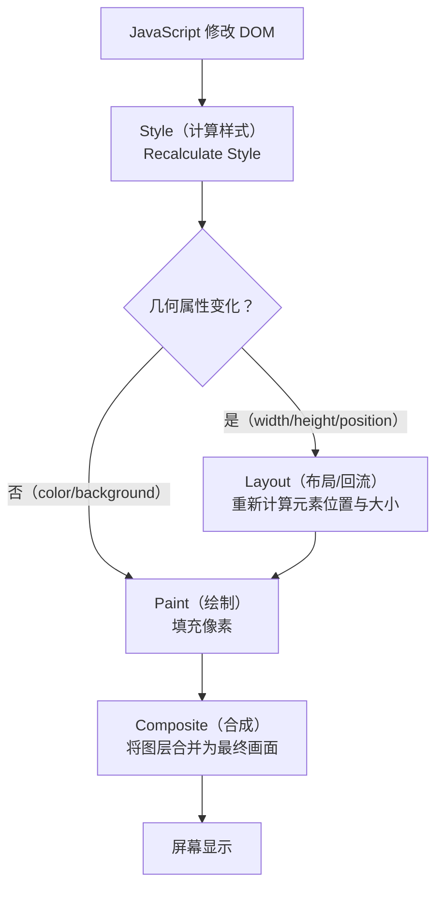

# 02-运行时优化

> 模块：08-performance（第8周 前端性能优化）
> 内容：防抖节流、回流重绘优化、虚拟列表、大文件分片上传、内存泄漏排查、Web Worker、SSR/SSG/ISR、框架级性能优化
> 格式：五段式（核心概念 → 底层原理 → 实战应用 → 常见面试题 → 避坑指南）

---

## 一、核心概念

运行时优化（Runtime Optimization）关注的是页面加载完成后，用户操作过程中的性能表现。与加载性能优化不同，运行时优化直接影响用户与页面交互的流畅度。

运行时性能问题的核心在于 **JavaScript 主线程的阻塞**。浏览器的主线程同时负责 JavaScript 执行、样式计算、布局、绘制和合成，任何长时间占用主线程的操作都会导致页面卡顿、响应延迟。

运行时优化的核心目标：**保持 60fps 的流畅帧率（每帧约 16.6ms），避免主线程长任务（Long Task > 50ms），确保用户交互的即时响应**。

---

## 二、底层原理

### 2.1 防抖（Debounce）与节流（Throttle）

> **本主题权威章节**：[完整讲解见 02-javascript-core/03-常用API与手写原理.md](../02-javascript-core/03-常用API与手写原理.md)；此处从运行时性能视角展开要点。

两者的核心目的都是**控制高频事件的触发频率**，减少不必要的计算和 DOM 操作。

#### 2.1.1 防抖（Debounce）

**原理**：在事件被连续触发时，只执行最后一次。每次触发都重置计时器，直到停止触发后延迟 N 毫秒才执行。

```javascript
function debounce(fn, delay = 300) {
  let timer = null;
  return function (...args) {
    clearTimeout(timer);
    timer = setTimeout(() => {
      fn.apply(this, args);
      timer = null;
    }, delay);
  };
}

// 使用场景：搜索输入
searchInput.addEventListener('input', debounce((e) => {
  fetchSearchResults(e.target.value);
}, 300));
```

**适用场景**：
- 搜索框输入联想（等待用户停止输入后再请求）
- 窗口 resize 事件（等用户调整完窗口后再计算）
- 表单验证（等用户停止输入后再校验）
- 按钮防重复提交（只响应最后一次点击）

#### 2.1.2 节流（Throttle）

**原理**：无论事件触发多频繁，在固定时间间隔内只执行一次。

```javascript
function throttle(fn, interval = 300) {
  let lastTime = 0;
  return function (...args) {
    const now = Date.now();
    if (now - lastTime >= interval) {
      lastTime = now;
      fn.apply(this, args);
    }
  };
}

// 使用场景：滚动事件
window.addEventListener('scroll', throttle(() => {
  updateScrollProgress();
}, 100));
```

**适用场景**：
- 滚动事件处理（scroll）
- 鼠标移动事件（mousemove）
- 页面 resize 监听
- 无限滚动加载更多

#### 2.1.3 防抖与节流对比

| 特性 | 防抖（Debounce） | 节流（Throttle） |
|------|-----------------|-----------------|
| 执行时机 | 停止触发后延迟执行 | 固定间隔定期执行 |
| 触发频率 | 最后执行一次 | 每 N 毫秒执行一次 |
| 典型场景 | 搜索输入、按钮防重复 | 滚动监听、鼠标移动 |
| 实现核心 | 每次重置定时器 | 记录上次执行时间 |

### 2.2 回流（Reflow）与重绘（Repaint）优化

> **本主题权威章节**：[完整讲解见 04-browser/01-浏览器渲染与V8原理.md](../04-browser/01-浏览器渲染与V8原理.md)；此处从运行时性能视角展开要点。

#### 2.2.1 概念区分

**回流（Reflow）**：当元素的几何属性（位置、尺寸）发生变化时，浏览器需要重新计算元素的几何属性，然后重新布局页面。回流一定触发重绘。

**重绘（Repaint）**：当元素的外观属性（颜色、背景、阴影等）发生变化，但不影响布局时，浏览器只需重新绘制元素。

**触发回流的操作**：
- 添加/删除可见 DOM 元素
- 元素位置/尺寸变化（width、height、padding、margin、border、top、left）
- 浏览器窗口大小变化
- 读取某些属性（offsetTop、offsetLeft、scrollTop、clientWidth、getComputedStyle）
- 修改字体大小
- 激活 CSS 伪类（如 `:hover`）

**触发重绘的操作**：
- 修改 color、background-color、box-shadow、visibility 等

#### 2.2.2 优化策略

**1. 批量修改 DOM**：
```javascript
// 错误做法：多次触发回流
const el = document.getElementById('box');
el.style.width = '100px';
el.style.height = '100px';
el.style.margin = '10px';
el.style.padding = '5px';

// 正确做法：使用 className 一次性修改
el.className = 'new-style';
```

**2. 使用 DocumentFragment**：
```javascript
const fragment = document.createDocumentFragment();
for (let i = 0; i < 1000; i++) {
  const li = document.createElement('li');
  li.textContent = `Item ${i}`;
  fragment.appendChild(li); // 不在 DOM 树中，不触发回流
}
document.getElementById('list').appendChild(fragment); // 一次性插入，只触发一次回流
```

**3. 离线 DOM 操作**：
```javascript
const list = document.getElementById('list');
list.style.display = 'none'; // 从渲染树中移除
// 执行大量 DOM 操作...
for (let i = 0; i < 1000; i++) {
  const li = document.createElement('li');
  li.textContent = `Item ${i}`;
  list.appendChild(li);
}
list.style.display = 'block'; // 恢复，只触发一次回流
```

**4. 使用 transform 代替 top/left**：
```css
/* 错误做法：触发回流 */
.box { position: absolute; top: 0; transition: top 0.3s; }
.box:hover { top: 100px; }

/* 正确做法：只触发合成，不触发回流 */
.box { transform: translateY(0); transition: transform 0.3s; }
.box:hover { transform: translateY(100px); }
```

**5. 读写分离**：
```javascript
// 错误做法：读写交替触发强制同步布局
elements.forEach(el => {
  const height = el.offsetHeight; // 读
  el.style.height = height + 10 + 'px'; // 写
});

// 正确做法：批量读，再批量写
const heights = elements.map(el => el.offsetHeight); // 先全部读取
elements.forEach((el, i) => {
  el.style.height = heights[i] + 10 + 'px'; // 再全部写入
});
```

**6. requestAnimationFrame 批量更新**：
```javascript
let ticking = false;
window.addEventListener('scroll', () => {
  if (!ticking) {
    requestAnimationFrame(() => {
      updatePosition();
      ticking = false;
    });
    ticking = true;
  }
});
```

**浏览器渲染流水线流程图**：



> 浏览器渲染流水线按**样式计算 -> 布局 -> 绘制 -> 合成**依次执行。回流（Reflow）发生在几何属性变化时需要重新布局，开销最大；重绘（Repaint）仅更新外观属性，跳过布局步骤；合成（Composite）利用 GPU 加速，仅涉及 transform/opacity 变化时性能最优。优化核心在于**减少回流次数、优先使用合成属性**。

> 📖 **参考链接**：
> - [MDN - requestAnimationFrame](https://developer.mozilla.org/zh-CN/docs/Web/API/Window/requestAnimationFrame)

### 2.3 虚拟列表（Virtual List）

**原理**：虚拟列表的核心思想是**只渲染可视区域内的 DOM 节点**，而非渲染全部数据。当用户滚动时，动态计算当前应该显示哪些数据项，并相应地更新 DOM。

**核心变量**：
- `startIndex`：可视区域起始数据索引
- `endIndex`：可视区域结束数据索引
- `offsetY`：列表容器的偏移量，用于模拟滚动位置
- `itemHeight`：每项高度（固定高度场景）
- `visibleCount`：可视区域可容纳的项数 = `Math.ceil(containerHeight / itemHeight)`

**实现原理**：
1. 计算可视区域可容纳的项数 `visibleCount`
2. 根据 `scrollTop` 计算 `startIndex = Math.floor(scrollTop / itemHeight)`
3. 计算 `endIndex = startIndex + visibleCount + bufferSize`（bufferSize 为缓冲区，避免快速滚动白屏）
4. 只渲染 `[startIndex, endIndex]` 范围内的数据
5. 通过 `padding-top` 或 `transform: translateY` 模拟滚动偏移

**常用库**：
- **react-window**：React 虚拟列表，轻量级（约 2KB (gzipped)），支持固定/可变高度
- **react-virtuoso**：功能更丰富的 React 虚拟列表，支持分组、粘性头部
- **vue-virtual-scroller**：Vue 官方推荐的虚拟滚动组件
- **vxe-table**：Vue 表格组件，内置虚拟滚动

**使用示例（react-window）**：
```javascript
import { FixedSizeList } from 'react-window';

function VirtualList({ items }) {
  return (
    <FixedSizeList
      height={600}
      itemCount={items.length}
      itemSize={50}
      width="100%"
    >
      {({ index, style }) => (
        <div style={style}>第 {index} 项：{items[index]}</div>
      )}
    </FixedSizeList>
  );
}
```

> **生活类比**：
> - **虚拟列表**：就像电影院——当前在播的场次坐满观众（可视区域渲染），上一场和下一场的观众在休息区等候（非可视区域不渲染，用占位元素撑开高度）。如果所有场次的观众都挤在放映厅里（全量渲染），再大的电影院也装不下（浏览器卡死）。
> - **防抖（debounce）**：就像电梯关门——连续有人进电梯（连续触发事件），门就一直不关（不执行），最后一个人进来后等几秒，门才关上（执行一次）。适合搜索框输入联想、窗口 resize 事件。
> - **节流（throttle）**：就像地铁发车——无论站台上来了多少乘客（触发多少次事件），地铁固定间隔发一班车（固定频率执行）。适合滚动事件、鼠标移动等高频触发场景。

> 📖 **参考链接**：
> - [MDN - IntersectionObserver](https://developer.mozilla.org/zh-CN/docs/Web/API/IntersectionObserver)

### 2.4 大文件分片上传

**核心原理**：利用 `Blob.slice()` 将大文件切分为多个小块，分片上传，支持断点续传和秒传。

**实现要点**：
1. **文件分片**：使用 `Blob.slice(start, end)` 将文件切分为固定大小的分片（如 5MB/片）
2. **文件哈希**：使用 `spark-md5` 计算文件 MD5 哈希，作为文件唯一标识
3. **并发上传**：控制同时上传的分片数量（如 3-5 个并发）
4. **断点续传**：上传前查询服务端已上传的分片列表，跳过已上传的分片
5. **秒传**：根据文件哈希查询服务端是否已有相同文件，有则直接返回

```javascript
// 核心实现示例
async function uploadFile(file, chunkSize = 5 * 1024 * 1024) {
  const chunks = Math.ceil(file.size / chunkSize);
  const fileHash = await calculateHash(file); // spark-md5 计算哈希

  // 检查秒传
  const { uploaded } = await checkFileExists(fileHash);
  if (uploaded) return { url: uploaded };

  // 获取已上传分片
  const uploadedChunks = await getUploadedChunks(fileHash);

  // 并发上传未完成的分片
  const pendingChunks = [];
  for (let i = 0; i < chunks; i++) {
    if (!uploadedChunks.includes(i)) {
      const chunk = file.slice(i * chunkSize, (i + 1) * chunkSize);
      pendingChunks.push(uploadChunk(fileHash, i, chunk));
    }
  }

  await Promise.all(pendingChunks);

  // 通知服务端合并分片
  return await mergeChunks(fileHash, file.name);
}
```

### 2.5 内存泄漏排查

> **本主题权威章节**：[完整讲解见 02-javascript-core/03-常用API与手写原理.md](../02-javascript-core/03-常用API与手写原理.md)；此处从运行时性能视角展开要点。

#### 2.5.1 常见内存泄漏场景

| 泄漏场景 | 示例代码 | 原因 |
|----------|----------|------|
| 全局变量 | `window.data = hugeArray` | 全局变量不会被 GC 回收 |
| 未清除的定时器 | `setInterval(() => {...}, 1000)` | 定时器持续引用回调函数 |
| 闭包引用 | 闭包中保留大对象引用 | 闭包阻止外部变量被回收 |
| DOM 引用 | 删除 DOM 后 JS 仍持有引用 | 被分离的 DOM 节点无法被 GC |
| 未解绑的事件监听 | `element.addEventListener` 未 remove | 事件监听器阻止元素被回收 |
| WebSocket 未关闭 | 组件卸载后连接未断开 | 连接对象持续占用内存 |

#### 2.5.2 Chrome DevTools 排查方法

**1. 堆快照（Heap Snapshot）**：
- 在 Memory 面板中拍摄堆快照
- 拍摄前执行一次操作，拍摄后再次执行，对比两次快照
- 查看 Delta（增量），关注持续增长的对象

**2. 时间轴录制（Allocation instrumentation on timeline）**：
- 录制一段时间内的内存分配
- 操作页面，观察内存曲线是否持续上升
- 停止操作后，手动触发 GC（垃圾回收），观察内存是否回落

**3. 分离 DOM 节点检测**：
- 在堆快照中搜索 "Detached"
- 分离的 DOM 节点（已从 DOM 树移除但 JS 仍引用的节点）会导致内存泄漏

**排查步骤**：
1. 打开 Chrome DevTools → Performance 面板 → 勾选 Memory 选项 → 录制
2. 执行可疑操作，观察 JS Heap（蓝色线）是否持续上升
3. 操作后手动触发 GC（点击垃圾桶图标），如果内存未回落，存在泄漏
4. 切换到 Memory 面板，拍摄堆快照进行对比分析

> 📖 **参考链接**：
> - [MDN - JavaScript 内存管理](https://developer.mozilla.org/zh-CN/docs/Web/JavaScript/Guide/Memory_management)

### 2.6 Web Worker 提升性能

**原理**：Web Worker 在独立的后台线程中执行 JavaScript，不阻塞主线程，适合处理 CPU 密集型计算任务。

**限制**：
- 无法访问 DOM、window、document
- 通过 `postMessage` 与主线程通信（数据通过结构化克隆传递）
- 同源限制

**适用场景**：
- 大数据量计算（排序、过滤、聚合）
- 图像/视频处理（Canvas 像素操作）
- 加密/解密计算
- 大规模 JSON 解析
- 实时数据流处理

**使用 Comlink 简化通信**：
```javascript
// worker.js
import { expose } from 'comlink';

const heavyCalculation = (data) => {
  // CPU 密集型计算
  return result;
};

expose({ heavyCalculation });

// main.js
import { wrap } from 'comlink';
const worker = wrap(new Worker('./worker.js'));
const result = await worker.heavyCalculation(largeData);
```

> 📖 **参考链接**：
> - [MDN - Web Workers API](https://developer.mozilla.org/zh-CN/docs/Web/API/Web_Workers_API)

### 2.7 SSR / SSG / ISR 对比

| 特性 | SSR（服务端渲染） | SSG（静态生成） | ISR（增量静态再生） |
|------|------------------|----------------|---------------------|
| 渲染时机 | 每次请求时在服务端渲染 | 构建时预渲染 | 首次请求时生成，之后复用 |
| 数据新鲜度 | 实时 | 构建时 | 按需更新（可设置 revalidate） |
| 首屏速度 | 快 | 最快 | 快（第二次起） |
| 服务器压力 | 高（每次请求都渲染） | 低（纯静态文件） | 中（首次请求时渲染） |
| SEO 友好 | 是 | 是 | 是 |
| 适用场景 | 个性化内容、实时数据 | 文档、博客、营销页 | 内容更新不频繁的页面 |
| 框架支持 | Next.js、Nuxt.js | Next.js、Nuxt.js、Gatsby | Next.js（ISR 特性） |

**Next.js 配置示例**：
> **适用范围**：以下 API 适用于 Next.js **Pages Router**（`pages/` 目录）。如果使用 App Router（`app/` 目录），请参考 [04-渲染架构深度](./04-渲染架构深度.md) 中的 App Router 写法。

```typescript
// SSR（服务端渲染）—— Pages Router
export async function getServerSideProps(context) {
  const data = await fetchData(context.params.id);
  return { props: { data } };
}

// SSG：构建时渲染（getStaticProps）
export async function getStaticProps() {
  const data = await fetchData();
  return { props: { data } };
}

// ISR：定时重新生成（revalidate）
export async function getStaticProps() {
  const data = await fetchData();
  return { props: { data }, revalidate: 60 }; // 60 秒后重新生成
}
```

> **App Router（Next.js 13+）替代写法**：以上 `getServerSideProps` / `getStaticProps` 是 Pages Router API。在 App Router 中，SSR 直接使用 `async` 组件，SSG 使用 `fetch` + `cache: 'force-cache'`，ISR 使用 `fetch` + `next: { revalidate: N }`。

### 2.8 React / Vue 层面的性能优化

#### 2.8.1 React 性能优化

**React.memo**：对组件进行浅比较，props 未变化时跳过渲染。
```javascript
const ExpensiveComponent = React.memo(({ data }) => {
  return <div>{/* 复杂渲染 */}</div>;
});
```

**useMemo / useCallback**：缓存计算结果和函数引用。
```javascript
const sortedList = useMemo(() => [...data].sort((a, b) => a.value - b.value), [data]);
const handleClick = useCallback(() => { doSomething(id); }, [id]);
```

**避免内联对象/函数**：
```javascript
// 错误：每次渲染都创建新对象，导致子组件重渲染
<ListItem style={{ color: 'red' }} onClick={() => handleClick(id)} />

// 正确：使用 useMemo/useCallback 缓存引用
const itemStyle = useMemo(() => ({ color: 'red' }), []);
// 注意：handleClick 本身也需要被 useCallback 稳定化，否则 onItemClick 仍会每次重新创建
const onItemClick = useCallback(() => handleClick(id), [id, handleClick]);
<ListItem style={itemStyle} onClick={onItemClick} />
```

**key 优化**：使用稳定的唯一标识，避免使用数组索引作为 key。

#### 2.8.2 Vue 性能优化

**v-once**：渲染一次后不再更新，适合静态内容。
```html
<div v-once>{{ staticContent }}</div>
```

**v-memo（Vue 3.2+）**：缓存子树，依赖不变时跳过更新。
```html
<div v-for="item in list" :key="item.id" v-memo="[item.id, item.selected]">
  <p>{{ item.name }}</p>
</div>
```

**shallowRef / shallowReactive**：只跟踪第一层属性的变化。
```javascript
const state = shallowReactive({ deep: { nested: { data: 1 } } });
// state.deep.nested.data = 2 不会触发更新
```

**computed 缓存**：计算属性自动缓存，依赖不变时不重新计算。

---

## 三、实战应用

### 3.1 防抖节流在业务中的实际应用

```javascript
// 搜索输入防抖（300ms）
const searchInput = document.getElementById('search');
searchInput.addEventListener('input', debounce(async (e) => {
  const results = await fetch(`/api/search?q=${e.target.value}`);
  renderResults(results);
}, 300));

// 滚动加载节流（200ms）
window.addEventListener('scroll', throttle(() => {
  if (window.innerHeight + window.scrollY >= document.body.offsetHeight - 200) {
    loadMoreData();
  }
}, 200));

// 按钮防重复提交（leading 模式，首次立即执行）
function debounceLeading(fn, delay) {
  let timer = null;
  return function (...args) {
    if (timer) return;
    fn.apply(this, args);
    timer = setTimeout(() => { timer = null; }, delay);
  };
}
```

### 3.2 虚拟列表集成示例

```vue
<!-- Vue 3 + vue-virtual-scroller -->
<template>
  <RecycleScroller
    class="scroller"
    :items="list"
    :item-size="50"
    key-field="id"
    v-slot="{ item }"
  >
    <div class="item">{{ item.name }}</div>
  </RecycleScroller>
</template>
```

### 3.3 内存泄漏避免 Checklist

- [ ] 组件卸载时清理所有定时器（`clearTimeout`/`clearInterval`）
- [ ] 组件卸载时移除事件监听器（`removeEventListener`）
- [ ] 组件卸载时断开 WebSocket 连接
- [ ] 避免在全局作用域存储大对象
- [ ] 使用 WeakMap/WeakSet 存储 DOM 相关引用
- [ ] 大列表使用虚拟列表，避免创建过多 DOM 节点

---

## 四、常见面试题

**Q1：防抖和节流的区别及适用场景？**
- 防抖：连续触发只执行最后一次，适用于搜索输入、窗口 resize、按钮防重复
- 节流：固定间隔执行一次，适用于滚动事件、鼠标移动、无限滚动

**Q2：什么是回流和重绘？如何减少回流？**
- 回流：元素几何属性变化导致重新布局，开销大
- 重绘：元素外观变化不影响布局，开销较小
- 减少回流：批量修改 DOM、使用 className、DocumentFragment、离线 DOM、transform 动画、读写分离

**Q3：虚拟列表的实现原理？**
- 只渲染可视区域内的 DOM 节点
- 根据 scrollTop 计算 startIndex 和 endIndex
- 通过 padding 或 transform 模拟滚动位置
- 设置缓冲区避免快速滚动时白屏

**Q4：SSR、SSG、ISR 的区别和适用场景？**
- SSR：每次请求服务端渲染，适合个性化内容，服务器压力大
- SSG：构建时生成静态页面，适合内容不常变的页面，性能最优
- ISR：按需重新生成静态页面，结合 SSR 的实时性和 SSG 的性能

**Q5：React 中如何避免不必要的重渲染？**
- React.memo 包裹组件，props 浅比较
- useMemo 缓存计算结果，useCallback 缓存函数引用
- 避免传递内联对象/函数作为 props
- 使用稳定且唯一的 key

---

## 五、避坑指南

| 常见错误 | 现象 | 原因 | 解决方案 |
|----------|------|------|----------|
| 防抖函数中使用了旧的闭包变量 | 防抖回调中获取到的值是函数创建时的旧值 | 闭包捕获了过时的变量引用 | 使用 ref 存储最新值，或使用 `useCallback` + `useRef` |
| 大量 DOM 节点直接渲染 | 列表超过 1000 条时页面卡顿 | 大量 DOM 节点导致内存占用高、渲染慢 | 使用虚拟列表（react-window 等）只渲染可视区域 |
| 频繁读取 offsetTop 等属性 | 页面出现"布局抖动"（Layout Thrashing） | 读取布局属性触发强制同步布局 | 批量读取布局属性，再批量写入，读写分离 |
| 组件卸载后未清理副作用 | 控制台报错"Can't perform state update on unmounted component" | 异步操作完成时组件已卸载 | 使用 cleanup 函数（useEffect 返回值）或 AbortController |
| Web Worker 中传递大量数据 | 主线程仍然卡顿 | postMessage 使用结构化克隆，大数据复制开销大 | 使用 Transferable Objects 转移数据所有权，或使用 SharedArrayBuffer |
| 所有页面都用 SSR | 服务器负载过高，响应变慢 | 不必要的服务端渲染浪费资源 | 根据页面特性选择 SSR/SSG/ISR/CSR |
| useMemo 滥用 | 代码可读性下降，缓存开销超过收益 | 对简单计算使用 useMemo 反而增加开销 | 只在计算开销大、依赖变化频繁的场景使用 useMemo |
| 未设置虚拟列表的缓冲区 | 快速滚动时出现白屏 | 新节点渲染跟不上滚动速度 | 设置 overscan 参数（如 react-window 的 overscanCount），预渲染额外几项 |

---

> **学习导航**：
> - 返回 [学习路线总览](../README.md)
> - 本模块其他文件：[01-加载性能优化](./01-加载性能优化.md) | [03-性能优化笔面试题集](./03-性能优化笔面试题集.md) | [04-渲染架构深度](./04-渲染架构深度.md)
> - 下一模块：[09-Node.js](../09-nodejs/01-Node运行时与核心API.md)

---

## 补充内容1：INP 深度优化

INP（Interaction to Next Paint）在 2024 年 3 月正式取代 FID，成为 Core Web Vitals 中衡量响应性的指标。它把"响应性"从"首次交互的输入延迟"扩展为"整个生命周期内所有交互的端到端耗时"，因此优化手段也必须覆盖完整链路，而不只是把事件回调写快。

### 1. 测量口径与三段耗时

**测量口径**：

- **衡量什么**：从用户与页面交互开始，到浏览器完成该交互后的**下一次绘制**为止的耗时。
- **取哪个值**：取整个页面生命周期内（排除首屏加载阶段后的交互）接近最差的高百分位值，而不是平均值。
- **与 FID 的区别**：FID 只测首次交互的"输入延迟"（从输入到事件回调开始执行），不包含回调执行与绘制；INP 测完整链路，且覆盖所有交互。
- **阈值**：≤ 200ms 良好，200-500ms 需改进，> 500ms 差。

**三段耗时模型**：

| 阶段 | 英文 | 含义 | 典型成因 |
|------|------|------|---------|
| 输入延迟 | Input Delay | 从用户输入到事件回调开始执行 | 主线程被长任务占用（正在执行的 JS、正在处理的其他事件） |
| 处理时间 | Processing Time | 事件回调执行的总耗时（含所有监听器与微任务） | 回调内同步计算、DOM 批量读写、状态更新引发的框架渲染 |
| 呈现延迟 | Presentation Delay | 从回调结束到浏览器完成下一次绘制 | 框架调度与协调（React 渲染、Vue 更新）、样式计算、布局、绘制、合成 |

> **关键认知**：INP 不是"事件回调的耗时"。输入延迟大说明主线程被别的任务占着；呈现延迟大说明回调结束后的渲染链路太长。只优化回调本身，往往只能改善三段中的一段。

```javascript
// 用 web-vitals 库采集 INP，并拿到归因信息
import { onINP } from 'web-vitals'

onINP((metric) => {
  const { interactionTarget, interactionType, loadState, longestScript } = metric.attribution || {}

  sendToAnalytics({
    name: metric.name, // 'INP'
    value: metric.value, // 例如 384（毫秒）
    rating: metric.rating, // 'good' | 'needs-improvement' | 'poor'
    interactionType, // 'pointer' | 'keyboard'
    interactionTarget, // 触发交互的元素选择器
    loadState, // 交互发生时的加载阶段
    longestScript // 该次交互中最耗时的脚本信息
  })
})
```

```javascript
// 也可以用 PerformanceObserver 直接监听 event 条目（INP 的原始数据来源）
const observer = new PerformanceObserver((list) => {
  for (const entry of list.getEntries()) {
    // 只关注较慢的交互，避免噪声（durationThreshold 默认 104ms）
    if (entry.duration < 200) continue

    console.log({
      name: entry.name, // 事件类型，如 'click'
      duration: Math.round(entry.duration), // 该交互的总耗时
      // 输入延迟：从用户输入到回调开始执行
      inputDelay: Math.round(entry.processingStart - entry.startTime),
      // 处理时间：回调执行耗时
      processingTime: Math.round(entry.processingEnd - entry.processingStart),
      // 呈现延迟：从回调结束到完成下一次绘制
      presentationDelay: Math.round(entry.startTime + entry.duration - entry.processingEnd)
    })
  }
})

observer.observe({ type: 'event', buffered: true, durationThreshold: 104 })
```

### 2. 长任务的识别与拆分

**长任务（Long Task）**：主线程连续执行超过 50ms 的任务。50ms 是"用户输入到达时，主线程最多能拖多久还能被感知为即时"的经验上限。如果用户点击时主线程还有一个 200ms 的任务在跑，输入延迟至少就是 200ms。

```javascript
// 监听长任务，定位罪魁祸首
const longTaskObserver = new PerformanceObserver((list) => {
  for (const entry of list.getEntries()) {
    console.warn(`长任务：${Math.round(entry.duration)}ms`, {
      startTime: Math.round(entry.startTime),
      attribution: entry.attribution?.[0]?.name // 归属的容器 / 脚本
    })
  }
})

longTaskObserver.observe({ type: 'longtask', buffered: true })
```

**拆分的本质**：把"一个 200ms 的任务"拆成"若干个不超过 50ms 的片段"，并在片段之间把控制权交还事件循环，让浏览器有机会处理用户输入与渲染。

```javascript
// 反例：一个同步大循环，直接产生 200ms 以上的长任务
function processAll(items) {
  for (const item of items) {
    heavyCompute(item) // 累计耗时可能远超 50ms
  }
}

// 正例：按时间片拆分，每片控制在 50ms 以内
async function processInChunks(items, budgetMs = 40) {
  let index = 0

  while (index < items.length) {
    const sliceStart = performance.now()

    // 在时间预算内尽可能多地处理
    while (index < items.length && performance.now() - sliceStart < budgetMs) {
      heavyCompute(items[index])
      index++
    }

    // 主动让出主线程，让浏览器处理输入与渲染
    await yieldToMain()
  }
}
```

> 预算取 40ms 而不是 50ms，是为了给"让出之后的收尾工作"留余量，避免加上调度开销后又越过 50ms 的长任务线。

### 3. `scheduler.yield()` 与 `scheduler.postTask()`

**`scheduler.yield()`**（Chrome 129+）：让出主线程并返回 Promise，让出后按**任务优先级**重新排队——被让出的续体会优先恢复执行，因此不会像 `setTimeout(0)` 那样被其他任务插队，能在"保持响应"的同时维持吞吐。

```javascript
// scheduler.yield()：让出主线程，续体优先恢复
async function processWithYield(items) {
  for (let i = 0; i < items.length; i++) {
    heavyCompute(items[i])

    // 每处理 20 项让出一次，避免长时间占用主线程
    if (i % 20 === 0) {
      await scheduler.yield()
    }
  }
}

// 降级方案：环境不支持时退回 setTimeout(0)
async function yieldToMain() {
  if (globalThis.scheduler?.yield) {
    return scheduler.yield()
  }
  return new Promise((resolve) => setTimeout(resolve, 0))
}
```

**`scheduler.postTask()`**：按优先级把任务排入浏览器调度器，并支持中止。

```javascript
// 优先级：'user-blocking' > 'user-visible' > 'background'
// user-blocking：影响用户交互的关键任务，最高优先级
scheduler.postTask(() => renderCriticalUI(), { priority: 'user-blocking' })

// user-visible：可见但非阻塞的更新，默认优先级
scheduler.postTask(() => updateList(), { priority: 'user-visible' })

// background：埋点上报、预计算等可延后任务，最低优先级
scheduler.postTask(() => sendAnalytics(), { priority: 'background' })

// 支持中止：用户切换页面 / 输入变化时取消尚未执行的任务
const controller = new TaskController({ priority: 'background' })
scheduler.postTask(() => heavyReport(), { signal: controller.signal })
controller.abort() // 取消任务

// delay 参数：延迟之后才进入调度队列（类似 setTimeout，但带优先级）
scheduler.postTask(() => refreshCache(), { delay: 2000, priority: 'background' })
```

**优先级语义对照**：

| 优先级 | 语义 | 典型用途 |
|--------|------|---------|
| `user-blocking` | 阻塞用户交互，最高优先级 | 响应点击后的关键 UI 更新 |
| `user-visible` | 用户可见，默认优先级 | 列表渲染、次要区域更新 |
| `background` | 可延后，最低优先级 | 埋点上报、缓存预热、日志上报 |

### 4. `requestIdleCallback` 的局限

```javascript
// requestIdleCallback 只在浏览器"空闲"时执行，且不保证执行时机
requestIdleCallback(
  (deadline) => {
    // deadline.timeRemaining() 是当前空闲帧的剩余时间，通常只有几毫秒
    while (deadline.timeRemaining() > 0 && tasks.length > 0) {
      tasks.shift()()
    }

    if (tasks.length > 0) requestIdleCallback(processTasks) // 下个空闲期继续
  },
  { timeout: 2000 } // 兜底：2s 内没空闲也必须执行
)
```

**四类局限**：

1. **触发时机不确定**：浏览器只在没有更高优先级工作时才调用回调，持续有交互时可能长时间不执行；`timeout` 只保证"最晚执行时间"，不保证及时。
2. **单帧预算极小**：空闲时间通常只有几毫秒，不适合有明确时限的计算。
3. **不参与优先级体系**：无法表达"这个任务比那个更重要"，所有任务都挤在"空闲"这一档。
4. **Safari 支持较晚**：Safari 从 16.4 起才支持，此前需要降级到 `setTimeout`。

**选型建议**：需要"让出主线程但保持响应"用 `scheduler.yield()`；需要"按优先级排序 + 可中止"用 `scheduler.postTask()`；只有"明确可以无限期延后"的任务才用 `requestIdleCallback`。

### 5. React 并发特性与 INP 的关系

React 的默认渲染是同步的：一次 `setState` 触发的渲染会一口气跑完。组件树很大时，这一段就是长任务，直接体现为 INP 的呈现延迟变大。并发特性让渲染可以被中断、分片，从而缩短单次长任务。

```jsx
import { useState, useTransition } from 'react'

function SearchPage() {
  const [keyword, setKeyword] = useState('')
  const [list, setList] = useState([])
  const [isPending, startTransition] = useTransition()

  function handleChange(e) {
    const value = e.target.value

    // 紧急更新：输入框必须立刻响应，直接 setState
    setKeyword(value)

    // 非紧急更新：列表计算可能很重，放进 transition 让 React 可中断地渲染
    startTransition(() => {
      setList(computeExpensiveList(value))
    })
  }

  return (
    <div>
      <input value={keyword} onChange={handleChange} />
      {isPending && <span>加载中…</span>}
      <List items={list} />
    </div>
  )
}
```

```jsx
// 在非组件环境（事件处理器、路由回调）中可用全局的 startTransition
import { startTransition } from 'react'

function handleTabChange(tab) {
  // 切换 Tab 后的内容渲染量大，标记为非紧急
  startTransition(() => {
    setActiveTab(tab)
  })
}
```

```jsx
import { useState, useDeferredValue } from 'react'

function SearchResults({ keyword }) {
  // deferredKeyword 会"落后"于 keyword，React 优先渲染使用 keyword 的部分
  const deferredKeyword = useDeferredValue(keyword)
  const results = useMemo(() => filterLargeList(deferredKeyword), [deferredKeyword])

  return <List items={results} />
}
```

**与 INP 的关系**：

- React 18 的并发渲染把"一次大渲染"拆成多个可中断的片段，片段之间检查是否有更高优先级的更新（如新的输入），因此输入延迟与呈现延迟都能明显下降。
- **但并发特性不解决"回调本身的同步计算"**：如果 `computeExpensiveList` 本身就是 300ms 的同步计算，`startTransition` 无法把它切碎——它只让"渲染"可中断，不改变"计算"的同步性。这类计算需要移到 Web Worker 或用时间片拆分。
- `useTransition` 返回的 `isPending` 用于给用户反馈，避免"点了没反应"的感知问题。

### 6. `setTimeout(0)` 分片 vs `yield` 的差异

| 维度 | `setTimeout(fn, 0)` | `scheduler.yield()` |
|------|--------------------|--------------------|
| 排队位置 | 追加到**任务队列末尾**，排在所有已排队任务之后 | 按任务优先级重新排队，续体优先恢复，通常排在普通任务之前 |
| 恢复延迟 | 至少 1ms，且受 HTML 规范的嵌套超时钳制影响可能放大到 4ms 以上，还会被其他任务插队 | 通常在同一帧内或下一帧尽早恢复 |
| 与渲染的关系 | 可能跨越多次渲染，分片任务被频繁打断 | 让出后浏览器有机会处理输入与渲染，同时续体尽快恢复 |
| 是否可中止 | 否（需自行管理定时器 id） | `yield` 本身不支持，但 `postTask` 支持 `TaskController` 中止 |
| 兼容性 | 全兼容 | Chrome 129+，需要降级方案 |

**结论**：`setTimeout(0)` 的分片虽然能打断长任务，但"恢复得太晚"——一次分片就要多等一个甚至多个任务周期，分片数一多，总耗时成倍增长，用户感知为"进度条走得很慢"。`scheduler.yield()` 在让出后优先恢复，是"既要响应又要吞吐"场景下的更优解。

```javascript
// 对比：同样的分片数量，setTimeout 版本的总耗时明显更长
async function withSetTimeout(items) {
  for (const item of items) {
    heavyCompute(item)
    await new Promise((r) => setTimeout(r, 0)) // 每个分片至少多等 1-4ms
  }
}

async function withYield(items) {
  for (const item of items) {
    heavyCompute(item)
    await yieldToMain() // 让出后优先恢复，总耗时更短
  }
}
```

### 7. INP 的归因流程（Performance 面板定位）

1. **看数据**：先用 `web-vitals` 的 `onINP` 拿到 `metric.attribution`，确定"哪类交互（pointer / keyboard）、哪个元素、交互时处于哪个加载阶段"。
2. **录性能**：在 Chrome DevTools 的 Performance 面板开启录制，然后在页面上复现该交互（点击 / 输入），停止录制。
3. **找交互标记**：在火焰图的时间轴上找到该次交互的条目（Chrome 会把交互标注为 `click` / `keydown` 等并归入 `Interactions` 分组），DevTools 会直接给出该交互的三段耗时拆分（Input Delay / Processing Time / Presentation Delay）。
4. **定位长任务**：在 `Interactions` 分组下找红色的 `Long Task` 或耗时最长的 `Task`，展开 Call Tree 与 Bottom-Up 视图，按自耗时（Self Time）排序，确定是哪个函数占了大头。
5. **按三段归因**：
   - 输入延迟大 → 主线程被别的任务占住，去看该交互**之前**的长任务是什么（常见是首屏未完成的 JS、大列表渲染、第三方脚本）。
   - 处理时间长 → 事件回调本身慢，看 Call Tree 中的自耗时函数；常见是同步计算、大量 DOM 读写、循环里读取布局属性（Layout Thrashing）。
   - 呈现延迟大 → 回调结束后的样式计算、布局、绘制、合成耗时高；常见是框架一次渲染的组件树过大、CSS 选择器复杂、大面积重排、动画属性未走合成层。
6. **验证**：改完后在相同设备、相同节流条件下重新录制对比，并用 `web-vitals` 上报数据确认 P75 是否下降。

**定位技巧**：

- 打开 Performance 面板的 Web Vitals 轨道，可以直接看到 INP 候选交互与耗时。
- 用 Bottom-Up / Call Tree 视图按自耗时排序，比在火焰图里肉眼找更快。
- 开启 CPU 节流（4x / 6x）模拟中低端设备，桌面端测不出问题的场景在移动端会暴露。
- 首次交互的延迟往往来自首屏未加载完成，因此要用 `loadState` 区分"加载期交互"与"加载后交互"。

### 8. 面试常见问法

**Q1：INP 和 FID 有什么区别？**
回答要点：FID 只测首次交互的输入延迟（从输入到回调开始执行），不含回调执行与绘制；INP 测整个生命周期内所有交互的端到端耗时（输入延迟 + 处理时间 + 呈现延迟），并取接近最差的高百分位值。INP 更能反映真实交互流畅度，因此取代了 FID。

**Q2：INP 的三段耗时分别是什么？如何优化？**
回答要点：输入延迟（主线程被长任务占用）→ 拆分长任务、用 `scheduler.yield()` / `postTask` 让出主线程；处理时间（回调本身慢）→ 减少同步计算、避免布局抖动、把重计算移到 Web Worker；呈现延迟（回调后的样式计算 / 布局 / 绘制 / 合成）→ 缩小一次渲染的组件树规模、用 `startTransition` / `useDeferredValue` 标记非紧急更新、避免大面积重排。

**Q3：`scheduler.yield()` 和 `setTimeout(0)` 分片有什么区别？**
回答要点：`setTimeout(0)` 把续体追加到任务队列末尾，还要承受最小 1ms 甚至 4ms 以上的嵌套超时钳制，恢复得晚且会被插队；`scheduler.yield()` 按任务优先级重新排队，续体优先恢复，同样的分片数总耗时更短。`setTimeout` 全兼容，`scheduler.yield` 需要降级方案。

**Q4：`requestIdleCallback` 有什么局限？**
回答要点：触发时机不确定（交互密集时可能长时间不执行）、单帧空闲预算极小（通常只有几毫秒）、不参与优先级体系、Safari 支持较晚。只适合"明确可以无限期延后"的任务；需要响应性时用 `scheduler.yield()` 或 `scheduler.postTask()`。

**Q5：React 的并发特性能改善 INP 吗？**
回答要点：能改善呈现延迟——并发渲染把一次大渲染拆成可中断的片段，片段之间检查更高优先级更新，因此输入响应更快。但它不改变回调内同步计算的同步性，`startTransition` 无法把 300ms 的同步计算切碎，这类计算需要移到 Web Worker 或手动分片。

### 9. 易错点

| 易错点 | 现象 | 原因 | 解决方案 |
|--------|------|------|----------|
| 只在事件回调里做优化 | INP 依旧很高 | INP 包含输入延迟与呈现延迟，不只是回调耗时 | 用 Performance 面板做三段归因，分别处理 |
| 用 `setTimeout(0)` 做大量分片 | 总耗时成倍增长，进度条很慢 | 每个分片至少多等 1-4ms 且会被插队 | 改用 `scheduler.yield()`，并保留 `setTimeout` 降级 |
| 在 `startTransition` 里做同步重计算 | 输入依旧卡顿 | 并发特性只让渲染可中断，不会切碎同步计算 | 重计算移到 Web Worker 或按时间片拆分 |
| 认为 `requestIdleCallback` 一定会执行 | 任务长时间不执行 | 只在浏览器空闲时触发，交互密集时不空闲 | 用 `timeout` 兜底，或改用 `scheduler.postTask` |
| 把 50ms 当成目标值 | 以为 50ms 以内的卡顿可接受 | 50ms 是长任务的**定义线**，不是目标 | 单次任务控制在 50ms 以内，交互路径上尽量压到 20ms 以内 |
| 只测桌面端 | 本地流畅，用户侧 INP 差 | 移动端 CPU 性能远低于桌面端 | 用 CPU 节流（4x-6x）或真机测试 |
| 忽略加载期交互 | 首屏点击无响应 | 首屏 JS 执行本身就是长任务 | 用 `loadState` 区分归因，优化首屏 JS 执行与代码分割 |
| `postTask` 优先级用错 | 关键更新被延后 | 把关键更新标成了 `background` | 按语义选择：`user-blocking` 关键、`user-visible` 默认、`background` 可延后 |

---

## 补充内容2：移动端性能优化

移动端优化的核心认知是：**同样的代码在移动端要贵好几倍**。因此第一原则是"减少总工作量"（少渲染、少计算、少解码），第二原则才是"把工作挪到别的线程"。

### 1. 移动端与桌面端的性能差异根源

| 维度 | 桌面端 | 移动端 | 影响 |
|------|--------|--------|------|
| CPU | 高主频、多核、大缓存 | 主频低、核心少、散热受限（易降频） | JS 执行与样式计算慢 3-10 倍 |
| GPU | 独立显卡 / 高性能核显 | 集成 GPU，带宽与填充率有限 | 大面积合成、滤镜、模糊开销高 |
| 内存 | 8-32GB | 4-12GB，单页面可用更少 | 大图、长列表易触发 OOM 与页面回收 |
| 网络 | 有线 / 稳定 Wi-Fi | 4G / 5G / 弱网，RTT 与丢包波动大 | 资源加载时间不可预测 |
| 屏幕 | 大屏、DPR 1-2 | 小屏、DPR 2-3 | 同等 CSS 尺寸下像素数是桌面端的 2-4 倍，解码与绘制压力更大 |
| 交互 | 鼠标（hover 丰富） | 触摸（无 hover、有手势） | 需要额外处理滚动、手势与点击延迟 |

### 2. 低端机适配策略

1. **设备分级**：用 `navigator.hardwareConcurrency`、`navigator.deviceMemory`、`navigator.connection.effectiveType` 做粗分级，对不同档位下发不同策略。
2. **降级而非阉割**：低端机保留功能，但关闭"锦上添花"的效果（毛玻璃、大阴影、视差滚动、复杂过渡动画）。
3. **减少首屏工作量**：路由级代码分割 + 首屏组件懒加载；把非首屏的第三方脚本（客服、埋点 SDK）延后到 `load` 之后或首次交互时加载。
4. **控制并发**：图片与接口请求并发数限制在 4-6 个，避免弱网下互相抢占带宽。
5. **弱网策略**：`effectiveType` 为 2G / 3G 时降低图片档位、关闭预取、加大超时时间。

```javascript
// 设备能力探测，用于分级降级（注意：这些 API 是"提示"而非精确测量）
function getDeviceTier() {
  const cores = navigator.hardwareConcurrency || 2
  const memory = navigator.deviceMemory || 2 // 单位 GB，仅 Chromium 系支持
  const net = navigator.connection?.effectiveType || '4g' // 'slow-2g' | '2g' | '3g' | '4g'

  if (cores <= 2 || memory <= 2 || net === 'slow-2g' || net === '2g') return 'low'
  if (cores <= 4 || memory <= 4 || net === '3g') return 'mid'
  return 'high'
}

const tier = getDeviceTier()

// 把档位挂到根元素上，CSS 侧按档位降级
document.documentElement.dataset.tier = tier

if (tier === 'low') {
  document.documentElement.classList.add('reduce-motion')
}
```

```css
/* 低端机与"用户偏好减少动效"统一降级 */
.reduce-motion *,
.reduce-motion *::before,
.reduce-motion *::after {
  animation-duration: 0.001ms !important;
  transition-duration: 0.001ms !important;
  backdrop-filter: none !important;
  filter: none !important;
  box-shadow: none !important;
}

@media (prefers-reduced-motion: reduce) {
  * {
    animation-duration: 0.001ms !important;
    transition-duration: 0.001ms !important;
  }
}
```

### 3. `will-change` 与合成层在移动端的开销

**原理**：`will-change` 提示浏览器"这个元素将要变化"，浏览器会把它提升为独立的合成层（Compositing Layer）。后续的 `transform` / `opacity` 动画只需在合成线程重新合成，不触发主线程的样式计算与布局。

**移动端的代价**：

- 每个合成层都要分配独立的内存缓冲。一个全屏层在 DPR 3 的手机上可能占用数 MB，层数一多，内存暴涨，低端机容易触发页面回收或 OOM。
- 层数过多会让合成阶段的"层管理"开销上升，反而变慢。
- `will-change` 是**长期提示**，加上之后浏览器会长期保留该层，滥用等同于永久性内存占用增加。

```css
/* 正例：只对即将做 transform 动画的元素、且在动画期间才加 */
.card {
  transition: transform 0.2s ease;
}

.card:hover,
.card:focus-visible {
  /* 悬停态才提示 */
  will-change: transform;
}

.card.is-animating {
  transform: translateZ(0);
}
```

```css
/* 反例：全局给所有元素加 will-change，层数失控 */
* {
  will-change: transform; /* 会为大量元素创建合成层，移动端内存直接爆掉 */
}
```

```javascript
// 动画结束后移除 will-change，让浏览器回收合成层
const card = document.querySelector('.card')

card.addEventListener('transitionend', () => {
  card.style.willChange = 'auto'
})
```

**实践建议**：

- 动画优先只用 `transform` 与 `opacity`（这两个属性可以走合成，不触发回流重绘）。
- 不要用 `will-change: all`，不要给大量元素加 `will-change`。
- 需要"强制提升层"时用 `transform: translateZ(0)` 或 `translate3d(0, 0, 0)`，同样要控制数量。
- 移动端避免大面积 `backdrop-filter`、`filter: blur()`、`box-shadow`，它们会显著增加合成与绘制的填充率开销。

### 4. 触摸事件的 `passive` 选项与滚动性能

**问题根源**：`touchstart` / `touchmove` / `wheel` 这类事件如果注册了监听器，浏览器无法预先知道监听器里是否会调用 `preventDefault()`。为了"万一要阻止滚动"，浏览器必须**等监听器执行完**才能开始滚动——这给每一次滚动帧都加上一段等待时间，表现为滚动迟滞、掉帧。

**`passive: true` 的含义**：明确告诉浏览器"这个监听器不会调用 `preventDefault()`"，浏览器就可以立即开始滚动。

```javascript
// 正例：滚动相关监听器显式声明 passive
window.addEventListener(
  'touchmove',
  (e) => {
    // 只读取数据，不做 preventDefault
    trackScrollPosition(e.touches[0].clientY)
  },
  { passive: true }
)

window.addEventListener('wheel', onWheel, { passive: true })
```

```javascript
// 反例：未声明 passive，浏览器必须等回调执行完才能滚动
window.addEventListener('touchmove', (e) => {
  trackScrollPosition(e.touches[0].clientY)
})
```

**重要细节**：

- `document` / `window` / `body` 上的 `touchstart` 与 `touchmove` 在 Chrome 56+ 起默认就是 passive；`wheel` 与 `mousewheel` 在 Chrome 73+ 起默认 passive。**其他元素上的监听器仍然默认非 passive**，需要显式声明。
- 如果确实需要 `preventDefault()`，必须显式写 `{ passive: false }`，并尽量把监听器绑在**具体元素**上而非 `window`。
- `passive: true` 与 `preventDefault()` 冲突时，控制台会给出警告，且 `preventDefault()` 不生效。
- 用 CSS 的 `touch-action` / `overscroll-behavior` 替代"用 JS 阻止滚动"，可以让浏览器在合成线程就处理掉手势，完全不经过主线程。

```css
/* 用 CSS 声明手势行为，避免用 JS 监听 touchmove 做 preventDefault */
.scroll-area {
  overflow-y: auto;
  /* 允许纵向平移与双指缩放，交给浏览器在合成线程处理 */
  touch-action: pan-y pinch-zoom;
  /* 阻止滚动链传递到父级（避免"滚到底带动整个页面"） */
  overscroll-behavior: contain;
  /* 惯性滚动（iOS 需要显式开启） */
  -webkit-overflow-scrolling: touch;
}
```

### 5. `300ms` 点击延迟的由来与 `touch-action` 解决

**由来**：早期移动浏览器为了支持"双击缩放"（double tap to zoom），在收到第一次 `touchend` 后必须等待约 300ms，判断用户是否会再点一次。如果 300ms 内没有第二次点击，才派发 `click` 事件。这段等待就是"300ms 点击延迟"，用户感知为"点了没反应"。

**演进与解决方案**：

| 方案 | 做法 | 说明 |
|------|------|------|
| 视口声明（首选） | `<meta name="viewport" content="width=device-width, initial-scale=1">` | 布局宽度已等于设备宽度，现代浏览器据此移除延迟 |
| `touch-action` | `touch-action: manipulation` | 声明"只允许平移与双指缩放、不允许双击缩放"，浏览器立即派发 `click` |
| Pointer Events | 用 `pointerdown` / `pointerup` 组合自行判断 | 需要注意与滚动手势的区分，容易误触 |
| 早期库方案 | FastClick（已废弃） | 用 `touchend` 合成 `click`，现代项目不再需要 |

```html
<!-- 首选：正确的视口声明 -->
<meta name="viewport" content="width=device-width, initial-scale=1, viewport-fit=cover" />
```

```css
/* 对可点击元素声明 touch-action，消除双击缩放判定带来的延迟 */
.btn,
.link,
.tab {
  touch-action: manipulation;
}
```

```javascript
// 需要更精细的手势控制时，用 Pointer Events 统一处理
const btn = document.querySelector('.btn')

btn.addEventListener('pointerdown', (e) => {
  // 只响应主指针（忽略多指手势）
  if (!e.isPrimary) return
  btn.classList.add('is-pressed')
})

btn.addEventListener('pointerup', (e) => {
  if (!e.isPrimary) return
  btn.classList.remove('is-pressed')
  handleClick()
})

// 指针移出或手势被取消时清理状态，避免"按钮卡在按下态"
btn.addEventListener('pointercancel', () => btn.classList.remove('is-pressed'))
```

### 6. WebView 与原生容器的差异

| 维度 | 浏览器 | WebView（App 内嵌） | 小程序 / 原生容器 |
|------|--------|-------------------|-----------------|
| 内核版本 | 跟随系统、自动更新 | 跟随宿主 App 打包时的内核，**可能显著落后** | 跟随宿主平台，能力受平台规范限制 |
| 缓存 | 标准 HTTP 缓存 + Service Worker | 常被 App 自建离线包 / 请求拦截机制替代 | 有独立的分包与缓存机制 |
| 首屏 | 从网络加载 | 常用离线包（预置 HTML / JS / CSS）秒开 | 同离线包思路 |
| 调试 | DevTools 完整 | 需 App 开启调试开关，能力受限 | 依赖平台提供的开发者工具 |
| 能力 | 标准 Web API | 可通过 JSBridge 调用原生能力 | 平台 API |
| 限制 | 较少 | 可能禁用 Service Worker、限制并发、注入全局变量 | 包体积限制、API 白名单 |

**实践要点**：

- **内核差异是最大风险**：iOS 的 WKWebView 跟随系统版本，Android 的 WebView 可独立更新但常被 App 固定。必须明确"最低支持内核版本"，据此决定构建目标（是否还需要 ES5 降级、能否使用 `scheduler.yield` 等新 API）。
- **离线包优先**：把 HTML / JS / CSS 预置到本地，配合版本校验与增量更新，可以把首屏从"网络往返"变成"本地读取"。
- **JSBridge 是异步的**：调用原生能力（相机、支付、定位）都是异步且可能失败，必须有超时与降级。
- **全局环境可能被注入**：App 可能注入全局变量或拦截 `fetch` / `XMLHttpRequest`，不要假设运行环境干净，避免依赖 `window` 上的非标准属性。
- **调试手段有限**：多数 App 只在调试包中开启 WebView 调试，线上包需要依赖 vConsole 或远程日志。

### 7. 移动端首屏优化要点

1. **骨架屏 / 首屏直出**：先渲染结构骨架，数据到达后填充，避免白屏；SSR 或离线包可以进一步减少首屏等待。
2. **首屏 CSS 内联 + 非关键 CSS 异步加载**：缩短"下载 CSS → 解析 → 首屏绘制"的链路。
3. **首屏图片直出、非首屏懒加载**：LCP 图片不懒加载，配 `fetchpriority="high"` 与正确的 `sizes`；其余图片 `loading="lazy"`。
4. **控制首屏 JS 体积**：路由级代码分割，把非首屏组件、图表库、编辑器等大依赖做成动态 `import`。
5. **延后非关键脚本**：埋点、客服、AB 测试 SDK 用 `defer` 或动态插入，或等首次交互后再加载。
6. **避免首屏同步布局读取**：首屏渲染路径上不要"读 `offsetHeight` / `getBoundingClientRect()` 后立即写 DOM"，避免强制同步布局。
7. **降低首屏渲染的节点数量**：长列表首屏只渲染可视区域（虚拟列表），避免一次创建上千 DOM 节点。
8. **适配安全区与浏览器 UI**：设置 `viewport-fit=cover` 与 `theme-color`，减少浏览器 UI 变化带来的视觉抖动。

```html
<!-- 首屏关键 CSS 内联，其余样式异步加载 -->
<style>
  /* 只包含首屏必需的样式，建议控制在 14KB 以内 */
  .hero {
    min-height: 60vh;
  }
</style>
<link rel="stylesheet" href="/css/main.css" media="print" onload="this.media = 'all'" />
<noscript><link rel="stylesheet" href="/css/main.css" /></noscript>
```

```html
<!-- 适配刘海屏安全区 -->
<meta name="viewport" content="width=device-width, initial-scale=1, viewport-fit=cover" />
<meta name="theme-color" content="#ffffff" />
```

```css
/* 安全区适配 */
.safe-bottom {
  padding-bottom: calc(16px + env(safe-area-inset-bottom));
}
```

### 8. 真机调试手段

**Chrome Remote Debugging（Android）**

1. 手机开启"开发者选项 → USB 调试"，用数据线连接电脑并授权。
2. 电脑 Chrome 打开 `chrome://inspect/#devices`，确认设备已识别。
3. 在手机上打开目标页面（Chrome 或 App 内的 WebView，后者需 App 开启 WebView 调试）。
4. 点击 `inspect` 打开 DevTools，即可使用 Performance、Network、Memory 等完整面板。

要点：可用 `chrome://inspect` 的 Port forwarding 调试本地开发服务器；WebView 需要 App 侧调用 `WebView.setWebContentsDebuggingEnabled(true)` 才能被识别。

**Safari Web Inspector（iOS）**

1. iPhone 上"设置 → Safari → 高级 → 网页检查器"打开。
2. Mac Safari 的"开发"菜单中选中设备与页面即可调试（iOS 上的 WKWebView 也在同一菜单下）。

**vConsole / Eruda（线上包内调试）**

```javascript
// 仅在通过 URL 参数触发时加载，避免线上包体积增大
const params = new URLSearchParams(location.search)

if (params.has('debug') && !window.__vConsoleLoaded) {
  window.__vConsoleLoaded = true

  import('vconsole').then(({ default: VConsole }) => {
    new VConsole()
  })
}
```

**其他手段**：

- **系统级性能工具**：Android 可用 `adb shell dumpsys gfxinfo` 查看帧耗时；iOS 可用 Xcode 的 Instruments（Core Animation / Time Profiler）。
- **远程日志**：把 `console` 输出与错误上报到服务端（Sentry / 自建），用于线上问题定位。
- **弱网与 CPU 节流**：DevTools 的 Network 面板选 `Slow 3G` / `Fast 3G`，Performance 面板开 4x / 6x CPU 节流，模拟中低端机。
- **真机而非模拟器**：模拟器使用桌面 CPU 与 GPU，性能特征与真机差异巨大，性能结论必须以真机为准。

### 9. 面试常见问法

**Q1：移动端和桌面端的性能差异主要来自哪里？**
回答要点：CPU 主频与核心数、散热导致的降频、GPU 填充率与显存带宽、内存容量与单页可用内存、网络 RTT 与丢包波动，以及更高 DPR 带来的像素量倍数。核心结论是"同样的代码在移动端要贵好几倍"，因此优先减少总工作量。

**Q2：`will-change` 有什么副作用？**
回答要点：`will-change` 会提示浏览器把元素提升为独立合成层，层需要独立内存缓冲，在 DPR 3 的手机上一个全屏层可能占用数 MB，层数过多会导致内存暴涨与合成开销上升。它是长期提示，滥用等于永久增加内存占用。应该只对即将做 `transform` / `opacity` 动画的元素临时使用，动画结束后移除。

**Q3：为什么要给滚动事件加 `passive: true`？**
回答要点：浏览器无法预知监听器是否会调用 `preventDefault()`，因此必须等监听器执行完才能开始滚动。`passive: true` 明确声明不会阻止默认行为，浏览器可以立即滚动。`document` / `window` / `body` 上的 `touchstart`、`touchmove` 默认已 passive，`wheel` 在 Chrome 73+ 也默认 passive，但其他元素需要显式声明。

**Q4：300ms 点击延迟是怎么来的？怎么解决？**
回答要点：早期浏览器为支持双击缩放，在 `touchend` 后等待约 300ms 判断是否有第二次点击。现代浏览器在正确的视口声明（`width=device-width`）下会移除该延迟；对可点击元素加 `touch-action: manipulation` 可以进一步明确"不需要双击缩放"，让 `click` 立即派发。FastClick 这类方案已不再需要。

**Q5：WebView 和浏览器有什么差异？**
回答要点：内核版本可能显著落后（跟随宿主 App 打包时的内核）、缓存常被离线包替代、首屏可用离线包做到秒开、调试能力受限、可能被注入全局变量或拦截网络请求。因此必须明确最低内核版本，据此决定构建目标与 API 使用范围。

**Q6：移动端首屏优化有哪些要点？**
回答要点：骨架屏或 SSR 减少白屏、首屏 CSS 内联、首屏图片直出配 `fetchpriority="high"`、路由级代码分割控制首屏 JS、延后非关键脚本、避免首屏同步布局读取、长列表用虚拟列表、适配安全区。核心是压缩"从请求到首屏绘制"的关键路径长度。

### 10. 易错点

| 易错点 | 现象 | 原因 | 解决方案 |
|--------|------|------|----------|
| 给大量元素加 `will-change` | 移动端内存暴涨、页面被回收 | 每个合成层都要独立内存缓冲 | 只对即将动画的元素临时加，动画结束移除 |
| 滚动监听未声明 `passive` | 滚动迟滞、掉帧 | 浏览器必须等监听器执行完才能滚动 | 加 `{ passive: true }`，或改用 `touch-action` |
| 用 JS `preventDefault()` 阻止滚动 | 手势响应变慢 | 手势处理被拉到主线程 | 改用 CSS `touch-action` / `overscroll-behavior` |
| 缺少 viewport 声明 | 点击有 300ms 延迟，布局缩放异常 | 浏览器保留双击缩放判定 | 设置 `width=device-width, initial-scale=1` |
| 移动端使用大面积 `backdrop-filter` | 滚动时明显掉帧 | 合成与绘制的填充率开销极高 | 低端机降级为半透明纯色背景 |
| 用模拟器测性能 | 结论与真机严重不符 | 模拟器使用桌面 CPU 与 GPU | 性能结论以真机为准，配合 CPU / 网络节流 |
| 忽略 DPR 对图片的影响 | 图片模糊或体积过大 | 同等 CSS 尺寸下移动端像素数是桌面端的 2-4 倍 | 用 `srcset` + `sizes` 按 DPR 选择资源 |
| 假设 WebView 内核是最新版 | 新 API 在 App 内直接报错 | 内核跟随宿主 App 打包版本 | 明确最低内核版本，使用前做特性检测并降级 |

---

## 本章学习自检

- [ ] 能实现防抖和节流函数，并知道各自的适用场景
- [ ] 理解回流和重绘的区别，掌握减少回流的优化策略
- [ ] 能解释虚拟列表的原理，知道核心变量（startIndex、endIndex、offsetY）
- [ ] 理解大文件分片上传的流程：分片、哈希、并发、断点续传、秒传
- [ ] 掌握 Chrome DevTools 内存泄漏排查方法（堆快照、时间轴、对比视图）
- [ ] 了解 Web Worker 的适用场景和限制
- [ ] 能区分 SSR/SSG/ISR 的渲染时机和适用场景
- [ ] 掌握 React（React.memo/useMemo/useCallback）和 Vue（v-once/v-memo/shallowRef）的框架级优化手段