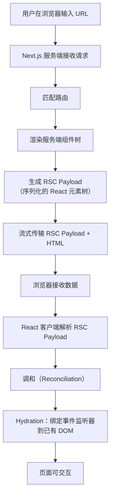
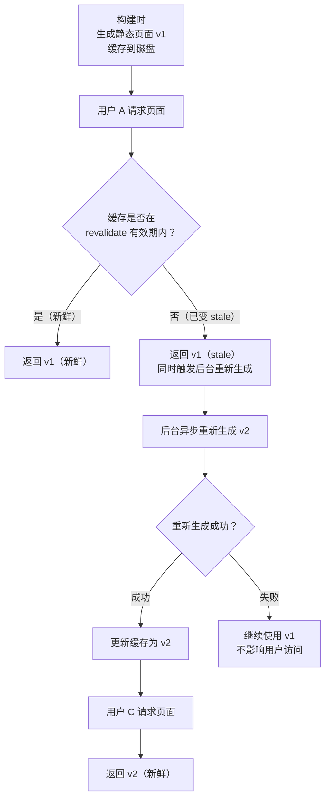
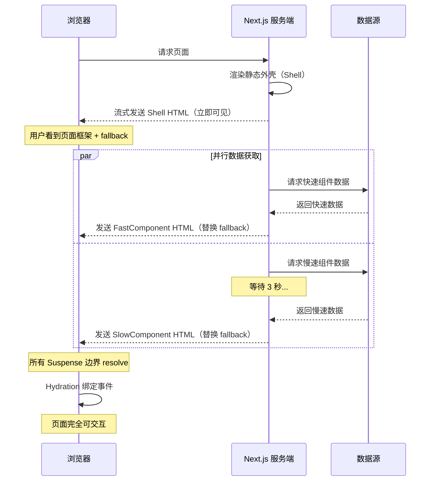
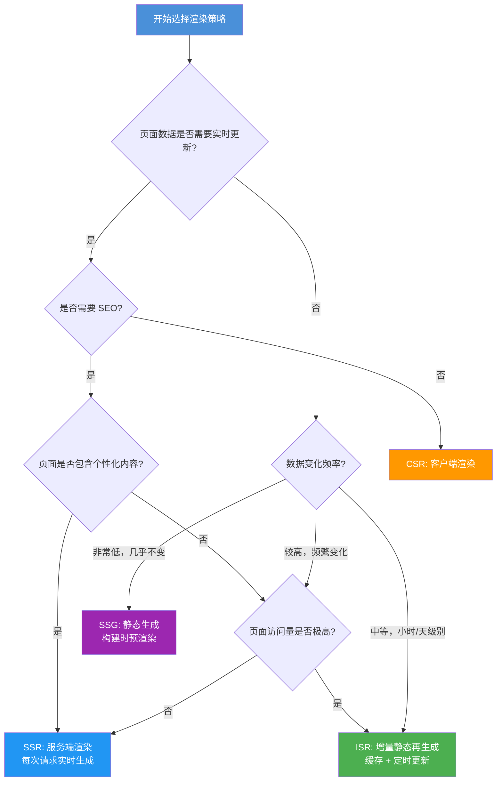

> 模块：08-performance（第8周 前端性能优化）
> 难度：★★★ 架构进阶
> 前置知识：React Server Components 基础概念、Next.js 基础

---

# 04-渲染架构深度

---

## 一、核心概念

### 1.1 四种渲染策略总览

现代前端框架的渲染策略可以类比**报纸印刷**的不同方式，每种策略在"内容新鲜度"和"交付速度"之间做出不同的权衡取舍。

| 渲染策略 | 全称 | 报纸类比 | 渲染时机 | 数据新鲜度 | 首屏速度 |
|---|---|---|---|---|---|
| **SSG** | Static Site Generation | 提前印好的报纸 | 构建时 | 最低（需重新构建） | 最快 |
| **ISR** | Incremental Static Regeneration | 定时更新的报纸 | 首次请求 + 定时重建 | 中（可配置间隔） | 快（首次后） |
| **SSR** | Server-Side Rendering | 有人要看才印 | 每次请求 | 最高（实时） | 中（依赖服务器） |
| **CSR** | Client-Side Rendering | 给白纸让读者自己写 | 浏览器端 | 最高（实时） | 最慢（白屏） |

**SSG（静态生成）**：构建时预渲染所有页面为静态 HTML。就像报社提前把所有报纸印好摞在仓库里，用户来了直接拿走。缺点：数据不会自动更新，需要重新部署。

```typescript
// Next.js Pages Router SSG
export async function getStaticProps() {
  const posts = await fetch('https://api.example.com/posts').then(r => r.json());
  return { props: { posts } };
}
```

```typescript
// Next.js App Router SSG（默认行为，无需特殊配置）
export default async function BlogPage() {
  const posts = await fetch('https://api.example.com/posts').then(r => r.json());
  return <PostList posts={posts} />;
}
```

**ISR（增量静态再生成）**：在 SSG 基础上，允许在运行时按需重新生成指定页面。就像报社每天定时重印某些版面，但不会一次性重新印刷全部报纸。

```typescript
// Next.js Pages Router ISR
export async function getStaticProps() {
  const posts = await fetch('https://api.example.com/posts').then(r => r.json());
  return {
    props: { posts },
    revalidate: 60, // 每 60 秒最多重新生成一次
  };
}
```

```typescript
// Next.js App Router ISR
export const revalidate = 60;

export default async function BlogPage() {
  const posts = await fetch('https://api.example.com/posts').then(r => r.json());
  return <PostList posts={posts} />;
}
```

**SSR（服务端渲染）**：每次请求都在服务器端生成完整的 HTML 返回。就像有人走进报社说"我要看今天的新闻"，报社才马上开机印刷。数据实时但服务器压力大。

```typescript
// Next.js Pages Router SSR
export async function getServerSideProps(context) {
  const { req } = context;
  const posts = await fetch('https://api.example.com/posts').then(r => r.json());
  return { props: { posts } };
}
```

```typescript
// Next.js App Router SSR（使用 dynamic 强制动态渲染）
import { headers } from 'next/headers';

export const dynamic = 'force-dynamic';

export default async function BlogPage() {
  const headerList = await headers();
  const cookie = headerList.get('cookie');
  const posts = await fetch('https://api.example.com/posts', {
    headers: { cookie: cookie ?? '' },
  }).then(r => r.json());
  return <PostList posts={posts} />;
}
```

**CSR（客户端渲染）**：浏览器下载一个几乎空的 HTML 和 JavaScript 包，在客户端执行 JS 来渲染页面。就像给读者一张白纸和一支笔，让读者自己画内容。首屏白屏时间长，但之后交互体验流畅。

```typescript
// React CSR（传统 SPA 模式）
import { useEffect, useState } from 'react';

export default function BlogPage() {
  const [posts, setPosts] = useState([]);
  const [loading, setLoading] = useState(true);

  useEffect(() => {
    fetch('https://api.example.com/posts')
      .then(r => r.json())
      .then(data => {
        setPosts(data);
        setLoading(false);
      });
  }, []);

  if (loading) return <div>Loading...</div>;
  return <PostList posts={posts} />;
}
```

> 📖 **参考链接**：
> - [Next.js 官方文档 - 渲染](https://nextjs.org/docs/app/building-your-application/rendering)

### 1.2 React Server Components（RSC）核心理念

> **本主题权威章节**（其他模块的同主题内容均指向此处）。

RSC（React Server Components）在 React 18 中作为实验性功能引入（通过 Next.js 13 App Router 首次落地实践），在 React 19 中正式成为稳定特性。核心理念是：**默认在服务端渲染，只有需要交互的组件才发送到客户端**。

想象一个餐厅：服务端组件是厨房（准备食材、烹饪），客户端组件是餐桌（食客互动、添加调料）。不需要把所有食材和厨具都搬到餐桌上。

```typescript
// app/page.tsx —— 这是一个服务端组件，默认在服务端执行
import { db } from '@/lib/db';
import { LikeButton } from './LikeButton'; // 客户端组件

export default async function HomePage() {
  // 直接在服务端查询数据库，无需 API 端点
  const posts = await db.post.findMany({
    orderBy: { createdAt: 'desc' },
    take: 10,
  });

  return (
    <div>
      <h1>最新文章</h1>
      {posts.map(post => (
        <article key={post.id}>
          <h2>{post.title}</h2>
          <p>{post.excerpt}</p>
          {/* 只有这个按钮需要客户端交互，其余都是服务端渲染 */}
          <LikeButton postId={post.id} initialLikes={post.likes} />
        </article>
      ))}
    </div>
  );
}
```

```typescript
// app/LikeButton.tsx —— 'use client' 标记为客户端组件
'use client';

import { useState } from 'react';

export function LikeButton({ postId, initialLikes }: { postId: string; initialLikes: number }) {
  const [likes, setLikes] = useState(initialLikes);

  return (
    <button onClick={() => setLikes(l => l + 1)}>
      点赞 ({likes})
    </button>
  );
}
```

**RSC 的关键规则**：
- 服务端组件不能使用 `useState`、`useEffect`、`onClick` 等交互 API
- 服务端组件可以直接访问数据库、文件系统、后端 API
- 客户端组件必须在文件顶部标记 `'use client'`
- 服务端组件可以导入客户端组件，但反过来不行（客户端组件不能直接导入服务端组件，可通过 props.children 传递）

### 1.3 PPR（Partial Prerendering）部分预渲染

PPR 是 Next.js 15 引入的混合渲染策略（Next.js 14 中为实验性功能，Next.js 15 中仍为实验性，Next.js 16 中进一步集成趋于稳定），核心思想：**静态外壳 + 流式动态内容**。

继续用报纸类比：PPR 像是提前印好版面框架（标题、栏目、页脚），在框架中预留一些"洞"，等读者拿到报纸时动态内容才刚刚完成并填入洞里。

```typescript
// next.config.ts（Next.js 15+）
import type { NextConfig } from 'next';

const nextConfig: NextConfig = {
  ppr: 'incremental', // Next.js 15 中 PPR 仍为实验性，使用 ppr: 'incremental' 逐步启用
};

export default nextConfig;
```

```typescript
// app/page.tsx —— PPR 示例
import { Suspense } from 'react';
import { StaticNav } from '@/components/StaticNav';
import { StaticFooter } from '@/components/StaticFooter';
import { DynamicProductList } from '@/components/DynamicProductList';
import { DynamicRecommendations } from '@/components/DynamicRecommendations';

export default function HomePage() {
  return (
    <div>
      {/* 静态外壳：构建时预渲染，用户立即看到 */}
      <StaticNav />
      <h1>欢迎来到商城</h1>

      {/* 动态内容：流式传输，填充到静态外壳中 */}
      <Suspense fallback={<ProductListSkeleton />}>
        <DynamicProductList />
      </Suspense>

      <Suspense fallback={<RecommendationsSkeleton />}>
        <DynamicRecommendations />
      </Suspense>

      {/* 静态外壳：构建时预渲染 */}
      <StaticFooter />
    </div>
  );
}
```

---

## 二、底层原理

### 2.1 Next.js App Router 渲染流程

Next.js App Router 的完整渲染流程分为三个阶段：RSC Payload 生成、流式传输、客户端 Hydration。

**Next.js App Router 完整渲染流程图：**



> 上图展示了 Next.js App Router 从请求到可交互的完整链路：服务端生成 RSC Payload 并流式传输，客户端解析后通过 Hydration 将静态 HTML 转换为可交互的 React 应用，兼顾了首屏速度与交互体验。

```
用户在浏览器输入 URL
        |
        v
Next.js 服务端接收请求
        |
        v
匹配路由 → 渲染服务端组件树 → 生成 RSC Payload（序列化的 React 元素树）
        |
        v
流式传输 RSC Payload + HTML → 浏览器接收
        |
        v
React 客户端解析 RSC Payload → 调和（Reconciliation）
        |
        v
Hydration：将事件监听器绑定到已有的 DOM 节点 → 页面可交互
```

**RSC Payload 是什么**：RSC Payload 是一种特殊的序列化格式，包含服务端渲染的 React 元素树结构。它不是 HTML 字符串，而是 React 能理解的中间表示，客户端 React 用它来重建组件树。

```typescript
// RSC Payload 简化示例（实际格式更复杂）
// 客户端接收到的数据结构类似：
// M1:{"id":"./components/Post.tsx","chunks":["client-chunk-1"],"name":"Post"}
// J0:["$","div",null,{"children":["$","h1",null,{"children":"Hello World"}]}]
```

```typescript
// app/layout.tsx —— 理解渲染流程
export default function RootLayout({ children }: { children: React.ReactNode }) {
  return (
    <html lang="zh-CN">
      <body>
        {/* 静态外壳：服务端立即发送 */}
        <header>
          <nav>
            <a href="/">首页</a>
            <a href="/blog">博客</a>
          </nav>
        </header>

        {/* 主要内容：RSC Payload 流式传输 */}
        <main>{children}</main>

        <footer>© 2025</footer>
      </body>
    </html>
  );
}
```

> 📖 **参考链接**：
> - [web.dev - 关键渲染路径](https://web.dev/learn/performance/understanding-the-critical-path)
> - [MDN - 浏览器如何渲染页面](https://developer.mozilla.org/zh-CN/docs/Web/Performance/How_browsers_work)

### 2.2 ISR 的 revalidate 机制

ISR 基于 **stale-while-revalidate**（SWR）策略：先返回缓存（stale）内容，同时在后台异步重新生成（revalidate）新内容，下次请求返回新内容。

**ISR stale-while-revalidate 工作流程图：**



> 上图展示了 ISR 的 stale-while-revalidate 策略：缓存过期时仍立即返回旧内容（stale）保证响应速度，同时在后台异步重新生成新内容（revalidate），下次请求即可拿到新版本。即使重新生成失败，用户仍能看到旧内容，保证了可用性。

```typescript
// ISR 的工作流程详解
// 1. 构建时生成静态页面 v1，缓存到磁盘
// 2. 用户 A 请求页面 → 返回 v1（新鲜）
// 3. 60 秒后，用户 B 请求页面 → 返回 v1（已变 stale，但同时触发后台重新生成）
// 4. 后台重新生成 v2 成功 → 更新缓存
// 5. 用户 C 请求页面 → 返回 v2（新鲜）
// 6. 如果后台重新生成失败 → 继续使用 v1，不影响用户

// App Router 实现
export const revalidate = 3600; // 每 1 小时

export async function generateStaticParams() {
  const posts = await fetch('https://api.example.com/posts').then(r => r.json());
  return posts.map((post: { id: string }) => ({ id: post.id }));
}

export default async function PostPage({ params }: { params: { id: string } }) {
  // fetch 支持 ISR：next.revalidate 控制缓存时间
  const post = await fetch(`https://api.example.com/posts/${params.id}`, {
    next: { revalidate: 60 }, // 该 fetch 请求独立缓存 60 秒
  }).then(r => r.json());

  return (
    <article>
      <h1>{post.title}</h1>
      <div>{post.content}</div>
    </article>
  );
}
```

```typescript
// On-Demand Revalidation：按需重新验证
// app/api/revalidate/route.ts
import { revalidatePath, revalidateTag } from 'next/cache';
import { NextRequest } from 'next/server';

export async function POST(request: NextRequest) {
  const { searchParams } = new URL(request.url);
  const secret = searchParams.get('secret');

  // 安全校验
  if (secret !== process.env.REVALIDATION_SECRET) {
    return Response.json({ message: 'Invalid token' }, { status: 401 });
  }

  // 按路径重新验证
  revalidatePath('/blog');

  // 按标签重新验证
  revalidateTag('posts');

  return Response.json({ revalidated: true });
}
```

### 2.3 Streaming SSR 原理

Streaming SSR 允许服务端将 HTML 分块发送到浏览器，而不是等待整个页面渲染完成。React 18 的 `renderToPipeableStream` 配合 `Suspense` 边界实现这一能力。

**Streaming SSR 分块传输时序图：**



> 上图展示了 Streaming SSR 的分块传输机制：服务端先发送静态外壳让用户立即看到页面框架，随后各 Suspense 边界内的异步内容在数据就绪后以独立 chunk 流式推送，浏览器逐步替换 fallback 占位内容。这种模式避免了传统 SSR 必须等待所有数据获取完毕才响应的问题，显著降低了首字节时间（TTFB）和首次内容绘制（FCP）。

```typescript
// 服务端：renderToPipeableStream 实现流式渲染
// server.ts
import { renderToPipeableStream } from 'react-dom/server';
import express from 'express';

const app = express();

app.get('/', (req, res) => {
  const { pipe } = renderToPipeableStream(
    <App />,
    {
      bootstrapScripts: ['/client.js'],
      onShellReady() {
        // 静态外壳（Shell）已就绪，立即开始流式传输
        res.setHeader('Content-Type', 'text/html');
        pipe(res);
      },
      onShellError(error) {
        res.statusCode = 500;
        res.send('Server Error');
      },
      onError(error) {
        console.error('Streaming error:', error);
      },
    },
  );
});
```

```typescript
// 客户端：Suspense 边界控制流式内容
// app/page.tsx
import { Suspense } from 'react';

// 模拟慢速数据获取
async function SlowComponent() {
  // 模拟 3 秒延迟
  await new Promise(resolve => setTimeout(resolve, 3000));
  const data = await fetch('https://api.example.com/slow-data').then(r => r.json());
  return <div>{data.content}</div>;
}

// 模拟快速数据获取
async function FastComponent() {
  const data = await fetch('https://api.example.com/fast-data').then(r => r.json());
  return <div>{data.content}</div>;
}

export default function Page() {
  return (
    <div>
      <h1>流式渲染示例</h1>

      {/* 快速内容：立即出现在 HTML 中 */}
      <Suspense fallback={<div>加载快速内容...</div>}>
        <FastComponent />
      </Suspense>

      {/* 慢速内容：先显示 fallback，3 秒后替换为真实内容 */}
      <Suspense fallback={<div>加载慢速内容...</div>}>
        <SlowComponent />
      </Suspense>

      {/* 嵌套 Suspense 边界 */}
      <Suspense fallback={<div>加载评论...</div>}>
        <CommentsSection />
      </Suspense>
    </div>
  );
}
```

```typescript
// 骨架屏（Skeleton）作为 fallback，提升用户体验
function ProductListSkeleton() {
  return (
    <div className="grid grid-cols-3 gap-4 animate-pulse">
      {Array.from({ length: 6 }).map((_, i) => (
        <div key={i} className="bg-gray-200 rounded-lg h-48" />
      ))}
    </div>
  );
}
```

> 📖 **参考链接**：
> - [React 官方文档 - renderToPipeableStream](https://react.dev/reference/react-dom/server/renderToPipeableStream)
> - [React 官方文档 - Suspense](https://react.dev/reference/react/Suspense)

### 2.4 Edge Runtime 与 Serverless 差异

| 对比维度 | Edge Runtime | Serverless | Node.js 传统服务 |
|---|---|---|---|
| 运行环境 | V8 Isolates（Web 标准） | 容器化 Node.js | 完整 Node.js 进程 |
| 冷启动时间 | ~0ms（V8 Isolate 极快） | 50-200ms | 取决于服务部署 |
| 全球部署 | 自动部署到全球边缘节点 | 单区域 / 多区域配置 | 手动多区域部署 |
| 运行时限制 | 不支持 Node.js 原生 API（fs、net、child_process） | 支持完整 Node.js API | 支持完整 Node.js API |
| 最大执行时间 | 30 秒（Vercel） | 10 秒-15 分钟 | 无限制 |
| 最大响应体 | 4 MB | 4.5 MB（Vercel） | 无限制 |
| 适用场景 | 轻量级 API 网关、A/B 测试、地理位置路由、简单认证 | 数据库查询、ORM 操作、复杂计算 | 长时间任务、WebSocket、文件处理 |

```typescript
// Edge Runtime 示例：地理位置路由
// middleware.ts
import { NextRequest, NextResponse } from 'next/server';

export const config = {
  runtime: 'edge', // Edge Runtime
};

export function middleware(request: NextRequest) {
  const country = request.geo?.country ?? 'US';

  // 根据用户地理位置重定向到不同语言版本
  if (country === 'CN') {
    return NextResponse.redirect(new URL('/zh-CN', request.url));
  }
  if (country === 'JP') {
    return NextResponse.redirect(new URL('/ja', request.url));
  }

  return NextResponse.next();
}
```

---

## 三、实战应用

### 3.1 Next.js 15 渲染模式实战

在一个页面中同时使用 SSG、ISR、SSR 三种渲染模式，展示如何根据内容特性选择最佳策略。

```typescript
// app/mixed-rendering/page.tsx
import { Suspense } from 'react';

// ============ SSG 区域：静态内容，构建时生成 ============
// 这些内容不需要从数据库获取，构建时直接写入 HTML
function StaticHeader() {
  return (
    <header className="bg-gradient-to-r from-blue-600 to-purple-600 text-white p-8">
      <h1 className="text-3xl font-bold">欢迎来到我们的平台</h1>
      <p className="mt-2 opacity-80">每天更新最前沿的技术内容</p>
    </header>
  );
}

// ============ ISR 区域：定期更新的内容 ============
// 每 5 分钟重新生成一次，适合不频繁变化的内容
export const revalidate = 300;

async function TrendingPosts() {
  const posts = await fetch('https://api.example.com/trending', {
    next: { revalidate: 300 },
  }).then(r => r.json());

  return (
    <section className="p-8">
      <h2 className="text-2xl font-bold mb-4">热门文章</h2>
      <div className="grid grid-cols-3 gap-4">
        {posts.map((post: { id: string; title: string; excerpt: string }) => (
          <div key={post.id} className="border rounded-lg p-4 hover:shadow-lg transition">
            <h3 className="font-semibold">{post.title}</h3>
            <p className="text-gray-600 mt-2">{post.excerpt}</p>
          </div>
        ))}
      </div>
    </section>
  );
}

// ============ SSR 区域：动态内容，每次请求实时生成 ============
async function LiveFeed() {
  // 强制动态渲染
  const data = await fetch('https://api.example.com/live', {
    cache: 'no-store',
  }).then(r => r.json());

  return (
    <section className="p-8 bg-gray-50">
      <h2 className="text-2xl font-bold mb-4">实时动态</h2>
      <ul className="space-y-2">
        {data.items.map((item: { id: string; text: string; time: string }) => (
          <li key={item.id} className="flex items-center gap-2">
            <span className="w-2 h-2 bg-green-500 rounded-full animate-pulse" />
            <span>{item.text}</span>
            <span className="text-gray-400 text-sm">{item.time}</span>
          </li>
        ))}
      </ul>
    </section>
  );
}

// ============ 组合页面 ============
export default function MixedRenderingPage() {
  return (
    <div>
      {/* SSG：静态内容 */}
      <StaticHeader />

      {/* ISR：定期更新 */}
      <TrendingPosts />

      {/* SSR：实时动态 */}
      <Suspense fallback={<div className="p-8">加载实时动态中...</div>}>
        <LiveFeed />
      </Suspense>
    </div>
  );
}
```

### 3.2 Server Actions 表单处理

> **本主题权威章节**（其他模块的同主题内容均指向此处）。

Server Actions 是 Next.js 14+ 引入的特性，允许在服务端组件中直接定义可被客户端调用的异步函数，极大简化了表单处理流程。

```typescript
// app/submit/page.tsx —— 完整表单处理示例
import { revalidatePath } from 'next/cache';
import { redirect } from 'next/navigation';
import { z } from 'zod';

// 表单验证 schema
const PostSchema = z.object({
  title: z.string().min(3, '标题至少 3 个字符').max(100),
  content: z.string().min(10, '内容至少 10 个字符'),
  category: z.enum(['tech', 'life', 'design']),
});

// Server Action：在服务端执行
async function createPost(formData: FormData) {
  'use server';

  // 1. 验证表单数据
  const validated = PostSchema.safeParse({
    title: formData.get('title'),
    content: formData.get('content'),
    category: formData.get('category'),
  });

  if (!validated.success) {
    return {
      error: validated.error.flatten().fieldErrors,
    };
  }

  // 2. 写入数据库
  try {
    const { title, content, category } = validated.data;
    // await db.post.create({ data: { title, content, category } });
    console.log('创建文章:', { title, content, category });
  } catch {
    return { error: { _form: ['数据库写入失败'] } };
  }

  // 3. 重新验证缓存并重定向
  revalidatePath('/posts');
  redirect('/posts');
}
```

```typescript
// app/submit/PostForm.tsx —— 客户端表单组件
'use client';

import { useActionState } from 'react';
import { useOptimistic } from 'react';

// useActionState 管理表单提交状态
import { createPost } from './actions';

export function PostForm() {
  const [state, formAction, isPending] = useActionState(createPost, { error: {} });

  return (
    <form action={formAction} className="max-w-2xl mx-auto p-8 space-y-6">
      <div>
        <label htmlFor="title" className="block text-sm font-medium">标题</label>
        <input
          id="title"
          name="title"
          type="text"
          className="mt-1 block w-full border rounded-md px-3 py-2"
          required
        />
        {state.error?.title && (
          <p className="text-red-500 text-sm mt-1">{state.error.title[0]}</p>
        )}
      </div>

      <div>
        <label htmlFor="content" className="block text-sm font-medium">内容</label>
        <textarea
          id="content"
          name="content"
          rows={6}
          className="mt-1 block w-full border rounded-md px-3 py-2"
          required
        />
        {state.error?.content && (
          <p className="text-red-500 text-sm mt-1">{state.error.content[0]}</p>
        )}
      </div>

      <div>
        <label htmlFor="category" className="block text-sm font-medium">分类</label>
        <select
          id="category"
          name="category"
          className="mt-1 block w-full border rounded-md px-3 py-2"
        >
          <option value="tech">技术</option>
          <option value="life">生活</option>
          <option value="design">设计</option>
        </select>
      </div>

      {state.error?._form && (
        <p className="text-red-500 text-sm">{state.error._form[0]}</p>
      )}

      <button
        type="submit"
        disabled={isPending}
        className="bg-blue-600 text-white px-6 py-2 rounded-md hover:bg-blue-700 disabled:opacity-50"
      >
        {isPending ? '提交中...' : '发布文章'}
      </button>
    </form>
  );
}
```

```typescript
// useOptimistic 乐观更新示例
// app/posts/LikeButton.tsx
'use client';

import { useOptimistic, startTransition } from 'react';

interface LikeButtonProps {
  postId: string;
  initialLikes: number;
}

async function likePost(postId: string) {
  'use server';
  // await db.post.update({ where: { id: postId }, data: { likes: { increment: 1 } } });
  await new Promise(resolve => setTimeout(resolve, 500));
}

export function LikeButton({ postId, initialLikes }: LikeButtonProps) {
  // useOptimistic：立即更新 UI，服务器确认后自动同步
  const [optimisticLikes, addOptimisticLike] = useOptimistic(
    initialLikes,
    (currentLikes: number, increment: number) => currentLikes + increment
  );

  async function handleLike() {
    startTransition(() => {
      addOptimisticLike(1); // 立即乐观更新
    });
    await likePost(postId);
  }

  return (
    <button
      onClick={handleLike}
      className="flex items-center gap-1 text-pink-500 hover:text-pink-700"
    >
      <span>♥</span>
      <span>{optimisticLikes}</span>
    </button>
  );
}
```

### 3.3 流式渲染实战

设计优雅的 Suspense 边界，实现骨架屏与内容逐步填充。

```typescript
// app/streaming/page.tsx
import { Suspense } from 'react';

// ============ 骨架屏组件 ============
function ProductCardSkeleton() {
  return (
    <div className="border rounded-xl p-4 animate-pulse">
      <div className="bg-gray-200 h-40 rounded-lg mb-3" />
      <div className="bg-gray-200 h-5 rounded w-3/4 mb-2" />
      <div className="bg-gray-200 h-4 rounded w-1/2" />
    </div>
  );
}

function ProductGridSkeleton({ count = 6 }: { count?: number }) {
  return (
    <div className="grid grid-cols-1 md:grid-cols-2 lg:grid-cols-3 gap-6">
      {Array.from({ length: count }).map((_, i) => (
        <ProductCardSkeleton key={i} />
      ))}
    </div>
  );
}

function ReviewSkeleton() {
  return (
    <div className="space-y-4 animate-pulse">
      {Array.from({ length: 3 }).map((_, i) => (
        <div key={i} className="flex gap-3">
          <div className="bg-gray-200 w-10 h-10 rounded-full" />
          <div className="flex-1">
            <div className="bg-gray-200 h-4 rounded w-1/4 mb-2" />
            <div className="bg-gray-200 h-3 rounded w-full" />
          </div>
        </div>
      ))}
    </div>
  );
}

// ============ 数据获取组件 ============
async function ProductGrid() {
  // 模拟 2 秒延迟
  await new Promise(resolve => setTimeout(resolve, 2000));
  const products = await fetch('https://api.example.com/products').then(r => r.json());

  return (
    <div className="grid grid-cols-1 md:grid-cols-2 lg:grid-cols-3 gap-6">
      {products.map((product: { id: string; name: string; price: number; image: string }) => (
        <div key={product.id} className="border rounded-xl p-4 hover:shadow-lg transition">
          
          <h3 className="font-semibold">{product.name}</h3>
          <p className="text-blue-600 font-bold">¥{product.price}</p>
        </div>
      ))}
    </div>
  );
}

async function Reviews() {
  // 模拟 3 秒延迟
  await new Promise(resolve => setTimeout(resolve, 3000));
  const reviews = await fetch('https://api.example.com/reviews').then(r => r.json());

  return (
    <div className="space-y-4">
      {reviews.map((review: { id: string; author: string; avatar: string; content: string }) => (
        <div key={review.id} className="flex gap-3">
          
          <div>
            <p className="font-semibold">{review.author}</p>
            <p className="text-gray-600">{review.content}</p>
          </div>
        </div>
      ))}
    </div>
  );
}

// ============ 主页面：Suspense 边界设计 ============
export default function StreamingPage() {
  return (
    <div className="max-w-6xl mx-auto p-8 space-y-12">
      {/* 静态内容：立即渲染 */}
      <header>
        <h1 className="text-4xl font-bold">商品列表</h1>
        <p className="text-gray-500 mt-2">精选好物，等你来发现</p>
      </header>

      {/* 商品列表：先显示骨架屏，2 秒后替换为真实内容 */}
      <section>
        <h2 className="text-2xl font-bold mb-6">热门商品</h2>
        <Suspense fallback={<ProductGridSkeleton count={6} />}>
          <ProductGrid />
        </Suspense>
      </section>

      {/* 用户评价：先显示骨架屏，3 秒后替换为真实内容 */}
      <section>
        <h2 className="text-2xl font-bold mb-6">用户评价</h2>
        <Suspense fallback={<ReviewSkeleton />}>
          <Reviews />
        </Suspense>
      </section>

      {/* 静态内容：立即渲染 */}
      <footer className="text-center text-gray-400 border-t pt-8">
        <p>© 2025 流式渲染实战</p>
      </footer>
    </div>
  );
}
```

### 3.4 渲染策略选择决策树

根据页面数据更新频率、SEO 需求和访问量，可按以下决策树选择最合适的渲染策略：



**决策辅助表**：

| 场景 | 推荐策略 | 理由 |
|---|---|---|
| 个人博客、文档站、营销页面 | SSG | 内容不常变，构建时生成速度最快 |
| 电商商品列表、新闻列表 | ISR | 需要新鲜度但不需要实时，revalidate=60-3600 |
| 用户仪表盘、后台管理 | CSR | 需要登录态，不需要 SEO |
| 个性化推荐、实时数据看板 | SSR | 每个用户看到不同内容，需要实时数据 |
| 混合内容页面（部分静态+部分动态） | PPR | 静态外壳快，动态内容流式填充 |

---

## 四、常见面试题

**Q1：请解释 SSG、ISR、SSR、CSR 四种渲染策略的区别和适用场景。**

**答案要点**：
- SSG：构建时预渲染，首屏最快，适合内容不常变的页面（博客、文档）
- ISR：SSG + 定时重新生成，兼顾速度和新鲜度，适合电商、新闻列表
- SSR：每次请求服务端渲染，数据实时，适合个性化内容、实时数据
- CSR：浏览器端渲染，首屏慢但交互流畅，适合后台管理、需要登录态的应用
- 用报纸类比：SSG 是提前印好的报纸，ISR 是定时更新的报纸，SSR 是有人要看才印，CSR 是给白纸让读者自己写

**Q2：React Server Components 的核心设计理念是什么？它解决了什么问题？**

**答案要点**：
- 核心理念：默认服务端渲染，按需客户端交互
- 解决的问题：减少客户端 JavaScript 体积（服务端组件代码不发送到浏览器）、直接访问后端资源（数据库、文件系统）
- 组件树中服务端组件和客户端组件可以交错，服务端组件可导入客户端组件
- 关键规则：`'use client'` 边界，服务端组件不能用 `useState`/`useEffect`/事件处理

**Q3：PPR（Partial Prerendering）是如何工作的？**

**答案要点**：
- 核心思想：静态外壳 + 流式动态内容
- 构建时预渲染静态外壳（导航栏、页脚、标题等），生成静态 HTML
- 动态内容通过 Suspense 边界标记，请求时流式传输
- 用户立即看到静态外壳，动态内容逐步填充，无需等待整个页面渲染完成
- 结合了 SSG 的速度和 SSR 的动态能力

**Q4：Streaming SSR 和传统 SSR 的本质区别是什么？**

**答案要点**：
- 传统 SSR：必须等待整个页面渲染完成后一次性发送 HTML，最慢的组件拖慢整个页面
- Streaming SSR：使用 `renderToPipeableStream` 和 Suspense 边界，将 HTML 分块流式发送
- 用户先看到静态外壳（onShellReady），动态内容按 Suspense 边界逐步填充
- 通过 `Transfer-Encoding: chunked` 实现 HTTP 流式传输
- 本质：从"全量一次性交付"变为"按优先级渐进交付"

**Q5：Server Actions 相比传统 API Routes 有什么优势？**

**答案要点**：
- 渐进增强：即使在 JavaScript 未加载完成时也能工作（原生 form action）
- 类型安全：服务端逻辑和客户端调用在同一文件中，TypeScript 类型自动共享
- 减少样板代码：不需要创建 API 端点、处理请求解析、手动序列化
- 自动处理 CSRF 保护（Next.js 内置）
- 与 `useActionState`、`useOptimistic` 深度集成，简化表单状态管理

---

## 五、避坑指南

| 坑点 | 现象 | 原因 | 解决方案 |
|---|---|---|---|
| Server Component 中使用 useState | 编译报错："useState is not supported in Server Components" | 服务端组件运行在服务端，无法保持客户端状态 | 将需要交互的部分提取为客户端组件，并在文件顶部添加 `'use client'` 指令 |
| ISR revalidate 设置过短导致频繁构建 | 服务器 CPU 飙升，构建队列堆积，页面响应变慢 | revalidate 间隔短于实际构建时间，上一个构建未完成下一个已触发 | 确保 revalidate 间隔 > 页面构建时间；使用 On-Demand Revalidation 替代定时重新生成；监控构建队列长度 |
| Streaming 未设置 Suspense 边界导致整个页面等待最慢组件 | 页面白屏时间长，TBT（Total Blocking Time）指标差 | 没有 Suspense 边界时，整个页面必须等待所有异步组件渲染完成后才发送 | 用 Suspense 包裹每个异步组件，为每个边界设置合适的 fallback（骨架屏）；优先发送静态外壳，动态内容逐步填充 |

---

## 本章学习自检

- [ ] 能够用自己的话解释 SSG、ISR、SSR、CSR 四种渲染策略的区别和适用场景
- [ ] 理解 React Server Components 的核心理念，能区分服务端组件和客户端组件的职责边界
- [ ] 理解 PPR 的工作机制，能解释"静态外壳 + 流式动态内容"的含义
- [ ] 理解 Next.js App Router 的完整渲染流程（RSC Payload 生成 → 流式传输 → 客户端 Hydration）
- [ ] 能够写出 ISR 的 revalidate 配置和 On-Demand Revalidation 代码
- [ ] 理解 Streaming SSR 的原理，能使用 Suspense 边界设计流式渲染页面
- [ ] 能够使用 Server Actions + useActionState + useOptimistic 完成表单处理
- [ ] 能够根据业务场景选择合适的渲染策略，画出决策树

---

## 学习导航

- 上一章：[02-运行时优化](./02-运行时优化.md)
- 下一章：无（本章为 08-performance 渲染架构深度补充章）
- 导览文件：[04-渲染架构深度-导览](./04-渲染架构深度-导览.md)
- 常见错误：[常见错误汇总](./常见错误汇总.md)
- 概念对比：[概念对比速查](./概念对比速查.md)
- 综合场景：[综合场景](./综合场景.md)