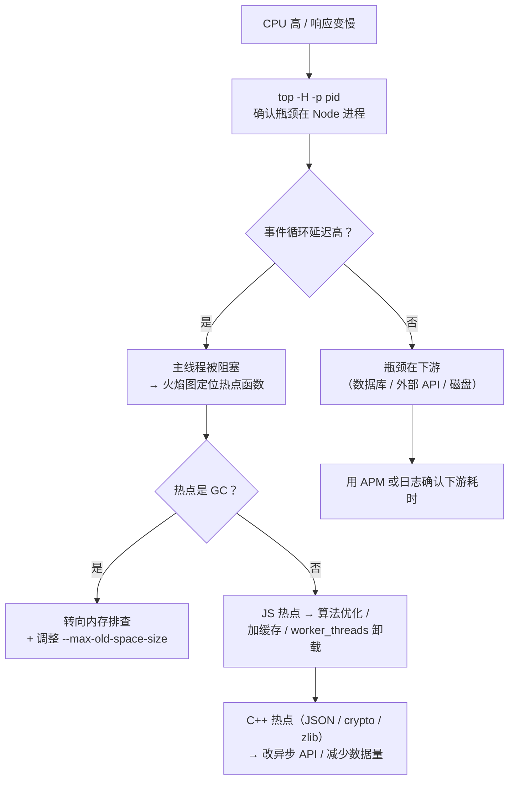

# 05-Node 性能调优与内存排查

> 模块：09-nodejs（第9周 Node.js）
> 重点：性能分析工具链、CPU 与内存瓶颈定位、GC 调优、句柄泄漏、压测基准、Serverless 场景
> 难度：★★★★★

---

## 一、核心概念

Node.js 应用的线上问题表现为四类症状：**响应变慢**（CPU 瓶颈或事件循环阻塞）、**内存持续上涨**（内存泄漏）、**进程不退出**（句柄泄漏）、**偶发超时**（GC 停顿或连接耗尽）。四类问题的排查路径完全不同，第一步不是"优化代码"，而是**判断问题属于哪一类**。

性能调优的四条原则：

1. **先测量，再优化**。没有 profiling 数据支撑的优化都是猜测。
2. **关注分位数，而非平均值**。P95 / P99 才是用户体验的真实边界。
3. **区分 CPU 密集与 I/O 密集**。CPU 密集任务必须卸载到 `worker_threads` 或外部服务。
4. **区分 V8 堆内存与外部内存**。`heapUsed` 不包含 `Buffer` 与 `ArrayBuffer` 占用的内存。

| 症状 | 首选工具 | 关键指标 |
|------|---------|---------|
| CPU 使用率高、响应变慢 | `--cpu-prof` / `0x` 火焰图 / `clinic flame` | 自耗时最高的函数 |
| 内存持续上涨 | `process.memoryUsage()` 采样 + Heap Snapshot 三快照法 | `heapUsed` / `external` / `arrayBuffers` 趋势 |
| 进程无法退出 | `why-is-node-running` | 存活的 handle 与 request |
| 偶发卡顿 | `perf_hooks.monitorEventLoopDelay()` | 事件循环延迟的 P99 |
| 吞吐与容量评估 | autocannon / k6 | 吞吐量、P95 / P99 延迟、错误率 |

---

## 二、底层原理

### 2.1 Node 性能分析工具链

**`--prof`：V8 内置采样分析器**。以固定频率采样调用栈，零依赖、成本最低。

```bash
node --prof app.js                                   # 启动采样
node --prof-process isolate-0x*.log > processed.txt  # 转换成可读报告
# 报告分段：[Summary] 事件占比 / [JavaScript] 按自耗时排序的 JS 函数
#          / [C++] 原生调用 / [Bottom up] 按调用方聚合 / [GC] 回收耗时占比
```

`[Summary]` 中 GC 占比超过 10%，说明内存压力大，应优先排查内存问题。

**`--cpu-prof`**：直接产出 DevTools 可加载的 `.cpuprofile`，省去手工转换。

```bash
node --cpu-prof --cpu-prof-dir=./profiles --cpu-prof-interval=500 app.js
# --cpu-prof-interval 是采样间隔（微秒），默认 1000；调小更细粒度但开销更大
```

**`--inspect`**：交互式调试。Chrome 打开 `chrome://inspect` 连接，常用 Profiler（CPU 火焰图）、Memory（Heap Snapshot、Allocation timeline）、Performance monitor（实时堆大小与事件循环延迟）三个面板。

```bash
node --inspect app.js                 # 默认端口 9229
node --inspect-brk app.js             # 首行断住，适合排查启动阶段问题
node --inspect=0.0.0.0:9229 app.js    # 容器内需监听 0.0.0.0 才能被宿主机访问
```

> **安全提示**：`--inspect` 暴露任意代码执行能力，**绝不能在生产环境开放到公网**，线上排查要走内网跳板机或 SSH 隧道。

**`0x`：火焰图生成器**。`npx 0x -- node server.js` 生成可交互火焰图，同时用另一个终端 `npx autocannon -c 100 -d 30 <url>` 打流量。读法：横轴是**采样占比**（不是时间顺序），宽度越大说明占用 CPU 越多；纵轴是**调用栈深度**。重点关注"宽而平"的矩形（自身热点）与"宽而深"的栈（调用链过长）。采样期间必须有真实流量，否则只反映空转。

**`clinic.js`：一体化诊断套件**。`clinic doctor` 综合诊断并直接给出"事件循环延迟过高""GC 占比过高"这类结论式建议；`clinic flame` 生成火焰图；`clinic bubbleprof` 用气泡图展示异步流程时序。**该项目目前已进入低维护状态**，功能仍可用，但不应作为唯一依赖。

**事件循环延迟监控**。这是 Node.js 最核心的健康指标，直接反映主线程阻塞程度。

```javascript
const { monitorEventLoopDelay } = require('node:perf_hooks')

const histogram = monitorEventLoopDelay({ resolution: 20 }) // 20ms 采样分辨率
histogram.enable()

setInterval(() => {
  // 统计值单位是纳秒，除以 1e6 转成毫秒
  console.log({
    mean: (histogram.mean / 1e6).toFixed(2) + 'ms',
    p99: (histogram.percentile(99) / 1e6).toFixed(2) + 'ms',
    max: (histogram.max / 1e6).toFixed(2) + 'ms'
  })
  histogram.reset() // 重置，避免统计值被历史数据拉平
}, 10000).unref()
```

P99 长期超过 100ms 说明主线程存在明显阻塞；超过 500ms 说明有严重的长任务或同步 I/O。

### 2.2 CPU 瓶颈定位流程



标准流程：**确认瓶颈归属 → 看事件循环延迟 → 有流量时采样 → 按自耗时排序定位热点 → 分类处理 → 相同压测条件复测**。

| 热点类型 | 处理方式 |
|---------|---------|
| 业务算法 | 优化算法复杂度、加缓存、批量处理 |
| 无法优化的纯计算 | 卸载到 `worker_threads` |
| `JSON.parse` / `JSON.stringify` | 减少数据量、避免大对象深拷贝（如用解构只取需要的字段） |
| `crypto` / `zlib` | 改用异步 API（走 libuv 线程池）、降低调用频次 |
| GC | 转向内存排查（见 2.3、2.4） |

### 2.3 V8 堆结构与内存管理

| 空间 | 别名 | 存放内容 | 回收算法 |
|------|------|---------|---------|
| New Space | 新生代 | 新创建的小对象 | Scavenge（Cheney 复制算法） |
| Old Space | 老生代 | 存活较久或较大的对象 | Mark-Sweep-Compact |
| Large Object Space | 大对象空间 | 超过阈值的大对象，不经过新生代 | Mark-Sweep-Compact |
| Code Space / Map Space | 代码空间 / 隐藏类空间 | JIT 机器码 / 对象隐藏类 | 随对应对象回收 |

**Scavenge（新生代）**：New Space 均分为 `from-space` 与 `to-space` 两个半空间（64 位系统默认总大小约 16MB，由 `--max-semi-space-size` 控制）。新对象分配在 `from-space`；满了触发 Scavenge，从根出发标记存活对象并**复制**到 `to-space`（复制即压缩，无碎片），清空 `from-space` 后交换两者角色；经两轮 Scavenge 仍存活的对象**晋升**到 Old Space。

**Mark-Sweep-Compact（老生代）**：**标记**阶段用三色标记法（白 = 未访问、灰 = 已发现未扫描、黑 = 已完成），配合**增量标记**把标记拆成小步穿插在 JS 执行之间，并用**写屏障**保证并发修改下标记正确；**清除**阶段回收未标记对象形成空闲列表，可与 JS 执行**并发**进行；**压缩**阶段整理存活对象消除碎片，仅在碎片率较高时触发（移动对象需要更新所有引用）。

**`process.memoryUsage()` 的五个字段**（最常被误读的 API）：

```javascript
const usage = process.memoryUsage()
const mb = (v) => (v / 1024 / 1024).toFixed(2) + 'MB'

console.log({
  rss: mb(usage.rss), // 进程占用的物理内存（含堆、C++ 对象、Buffer、代码段）
  // → 容器 OOM Killer 的判断依据，内存上限必须按 rss 规划
  heapTotal: mb(usage.heapTotal), // V8 已申请的堆内存总量
  heapUsed: mb(usage.heapUsed), // V8 堆中对象占用（含未回收垃圾，GC 后才是真实存活量）
  // → 内存泄漏的主战场，看它的长期趋势
  external: mb(usage.external), // V8 管理的、绑定到 JS 对象的 C++ 侧内存（含 Buffer）
  // → heapUsed 正常但 rss 很高时，重点看这里
  arrayBuffers: mb(usage.arrayBuffers) // ArrayBuffer / SharedArrayBuffer 内存，是 external 的子集
  // → Buffer / ArrayBuffer 泄漏的关键指标
})
```

**关键结论**：`heapUsed` 上涨不一定是泄漏（GC 未触发时会积累垃圾），判断泄漏必须看**多次 GC 后的基线是否持续抬高**；`Buffer` 的内存**不计入 `heapUsed`**，只持有 Buffer 的服务可能 `heapUsed` 稳定但 `rss` 持续上涨。可用 `v8.getHeapSpaceStatistics()` 查看各空间用量，判断是新生代频繁 GC 还是老生代压力大。

**Heap Snapshot 三快照法**。单张快照无法区分"应有的对象"与"泄漏的对象"，三快照法通过"重复同一操作"暴露增量。导出方式：`node --heapsnapshot-signal=SIGUSR2 --diagnostic-dir=./snapshots app.js` 后用 `kill -USR2 <pid>` 触发，或在代码中调用 `v8.writeHeapSnapshot(path)`（文件可能几百 MB，注意磁盘空间）。

操作步骤：① 抓快照 1（基线）→ ② 执行一次可疑操作 → ③ 抓快照 2 → ④ 再执行一次同一操作 → ⑤ 抓快照 3 → ⑥ 在 DevTools Memory 面板选中快照 3，切到 **Comparison** 视图对比快照 2，筛选 **"Objects allocated between Snapshot 2 and Snapshot 3"**。

判读规则：某类对象的 `Delta` 随操作次数**线性增长**，且在操作结束后仍存活（快照 2 中已存在又未回收），即为泄漏；正常缓存的特征是"数量有上限或能被 TTL 淘汰"。找到对象后展开 `Retainers` 面板，沿 GC Root 到该对象的引用链（如 `global → cache → Map → entry`）找到持有者——泄漏的本质就是"某条本不该存在的引用链还在"。

### 2.4 内存泄漏常见成因

| 成因 | 原理 | 解决 |
|------|------|------|
| 意外的全局变量 | 未声明变量赋值会挂到全局对象，永不回收 | 严格模式（`'use strict'` / ESM 默认严格），用 `let` / `const` |
| 全局容器累积 | 模块级 `Map` / `Set` / 数组只增不减 | LRU 淘汰、设置 TTL，或改用 `WeakMap` |
| 闭包持有大对象 | 闭包引用的变量随闭包一起存活 | 只捕获必要字段，及时置 `null` |
| 事件监听未移除 | `EventEmitter` 的 listener 数组持续增长 | 用 `once`、销毁时 `off`，`setMaxListeners` 暴露问题 |
| 定时器未清理 | `setInterval` 回调闭包长期存活 | 生命周期结束时清理，后台任务加 `unref()` |
| 缓存无上限 | 内存缓存没有容量或过期策略 | LRU + 最大条目数 + TTL，或改用 Redis |
| Buffer 未释放 | 外部内存不计入 `heapUsed`，容易被忽略 | 用 `Buffer.from(buf)` 复制独立内存，及时释放引用 |
| 未取消的异步任务 | 长生命周期 Promise / 流持有上下文 | 用 `AbortController` 取消，监听 `close` 销毁资源 |
| 全局单例持有请求上下文 | 把 `req` / `res` 挂到全局对象 | 改用 `AsyncLocalStorage` 传递请求上下文 |

```javascript
// 反例一：模块级缓存无上限（条目数随用户数无限增长）
const cache = new Map()
function getUser(id) {
  if (!cache.has(id)) cache.set(id, buildUserProfile(id))
  return cache.get(id)
}

// 反例二：每次请求都注册监听器，从不移除，10 次后 Node 会打印 MaxListenersExceededWarning
function handleRequest(req, res) {
  emitter.on('data', (payload) => res.write(payload))
}

// 反例三：Buffer.slice 与底层内存共享，容易"意外持有"整块大内存
const big = Buffer.alloc(100 * 1024 * 1024)
const small = big.slice(0, 10) // 只用了 10 字节，但仍持有整块 100MB 底层内存
```

```javascript
// 正例一：用 Map 的插入顺序实现简化版 LRU（容量上限 + TTL）
class LRUCache {
  constructor(maxSize = 1000, ttlMs = 5 * 60 * 1000) {
    this.maxSize = maxSize
    this.ttlMs = ttlMs
    this.map = new Map()
  }

  get(key) {
    const entry = this.map.get(key)
    if (!entry) return undefined

    if (Date.now() - entry.time > this.ttlMs) {
      this.map.delete(key) // 过期即删除
      return undefined
    }

    this.map.delete(key) // 命中后重新插入，使其排到 Map 末尾（最近使用）
    this.map.set(key, entry)
    return entry.value
  }

  set(key, value) {
    if (this.map.has(key)) this.map.delete(key)
    this.map.set(key, { value, time: Date.now() })

    if (this.map.size > this.maxSize) {
      this.map.delete(this.map.keys().next().value) // 淘汰最久未使用的条目
    }
  }
}

// 正例二：请求结束时移除监听器（正常结束或异常断开都清理）
function handleRequestFixed(req, res) {
  const onData = (payload) => res.write(payload)
  emitter.on('data', onData)
  res.on('close', () => emitter.off('data', onData))
}

// 正例三：需要独立的小 Buffer 时显式复制
const independent = Buffer.from(big.subarray(0, 10)) // 新分配 10 字节
```

### 2.5 GC 调优参数

```bash
# --max-old-space-size：老生代堆上限（单位 MB），最常用的调优参数
node --max-old-space-size=4096 app.js

# --max-semi-space-size：新生代单个 semi-space 上限（单位 MB）
# 调大 → 新生代更大 → Scavenge 频率降低，但单次停顿变长、内存占用上升；调小则相反
node --max-semi-space-size=64 app.js

node --expose-gc app.js        # 暴露 global.gc()，仅用于排查
node --trace-gc app.js         # 打印每次 GC 的类型、耗时与堆大小变化
node --trace-gc-verbose app.js # 更详细，含各阶段耗时
```

也可以用 `PerformanceObserver` 监听 `entryTypes: ['gc']` 累计 GC 耗时——长期超过 10% 说明内存压力大。

**容器环境的关键注意点**：

- Node 12+ 在推导默认堆上限时会考虑 cgroup 限制，但**不同 Node 版本与运行时的规则不同，显式设置最稳妥**。
- 经验值：`--max-old-space-size` 设为**容器内存上限的 70%-80%**，留出空间给 `external` 内存（Buffer）、C++ 对象、代码段与运行时本身。例如容器 limit 1GB 时启动命令写 `node --max-old-space-size=768 dist/main.js`。
- 只设置容器 limit 而不设置堆上限最危险：V8 堆没到上限但 `rss` 已超过容器 limit 时，进程会被 OOM Killer 直接杀掉，且**不会产生 JS 层的 OOM 错误与堆栈**，排查时看不到任何线索。
- `worker_threads` 可以用 `resourceLimits: { maxOldGenerationSizeMb, maxYoungGenerationSizeMb, stackSizeMb }` 单独限制每个 Worker 的堆大小。

### 2.6 句柄泄漏与进程退出排查

**症状**：进程收到 `SIGTERM` 后不退出，或脚本执行完却"卡住"不结束。原因是事件循环中还有**活跃的 handle**（定时器、socket、文件描述符）或 **request**（进行中的 I/O）。

排查方式：用 `why-is-node-running`（`pnpm add -D why-is-node-running`）打印所有让进程无法退出的 handle 及其创建位置的调用栈，输出形如 `There are 3 handle(s) keeping the process running` / `# Timer at Object.<anonymous> (/app/index.js:10:15)`；或用 `process._getActiveHandles()` / `process._getActiveRequests()`（下划线开头是内部 API，仅用于排查）查看活跃资源类型。

| 来源 | 现象 | 解决 |
|------|------|------|
| 未清理的 `setInterval` | 进程不退出，CPU 空转 | `clearInterval`，或创建时加 `.unref()` |
| 未关闭的数据库连接 | 进程不退出，连接数持续增长 | 优雅关闭时 `await pool.end()` / `client.quit()` |
| 未销毁的 keep-alive socket | 连接池中的空闲连接阻止退出 | `agent.destroy()`，或设置 `keepAlive: false` |
| 未关闭的文件描述符 | 句柄数增长，最终 `EMFILE` | `try/finally` 中确保 `close()` |
| 未取消的 `AbortController` 超时定时器 | 进程不退出 | 用 `AbortSignal.timeout()`，或手动清理定时器 |

```javascript
// 优雅关闭：停止接收新请求 → 清理资源 → 超时兜底强制退出
const server = http.createServer(app)

async function shutdown(signal) {
  console.log(`收到 ${signal}，开始优雅关闭`)
  server.close(() => console.log('HTTP 服务已关闭')) // 停止接收新连接

  // 并行清理各类资源
  await Promise.allSettled([dbPool.end(), redisClient.quit(), workerPool.destroy()])

  setTimeout(() => process.exit(1), 10000).unref() // 兜底：超时后强制退出
}

process.on('SIGTERM', () => shutdown('SIGTERM'))
process.on('SIGINT', () => shutdown('SIGINT'))

// 后台定时器不阻塞进程退出：加 .unref() 后不参与"是否有活跃工作"的判断
setInterval(collectMetrics, 60000).unref()
```

### 2.7 压测与基准测试

**五项基本原则**：必须有预热（JIT 需要时间达到稳定优化状态）；压测机与被测服务分离；关注 P95 / P99 与错误率而非平均 QPS；区分吞吐测试与延迟测试；固定并记录环境变量（CPU 核数、Node 版本、堆上限、数据库状态）。

```bash
# autocannon：Node 生态首选，零脚本、开箱即用
npx autocannon -c 100 -d 30 -w 5 -p 10 http://localhost:3000/api/users
# -c 并发连接数 / -d 持续时间（秒）/ -w 预热时间（秒）
# -p 每个连接的 pipelining 请求数 / -j 以 JSON 输出，便于脚本化对比
```

| 指标 | 含义 | 关注点 |
|------|------|--------|
| Req/Sec | 吞吐量（每秒请求数） | 平均与 P99 差距大说明性能波动明显 |
| Latency | 延迟分布（avg / p50 / p97.5 / p99 / max） | p99 与 avg 差距超 3 倍说明存在长尾 |
| Throughput | 每秒传输字节数 | 判断瓶颈是否在网络 |
| Non-2xx / Errors / Timeouts | 非成功响应与错误数 | 必须为 0，否则数据无意义 |

```javascript
// k6：脚本化的场景压测，支持阶段式负载与阈值断言，适合 CI 集成（k6 run load-test.js）
import http from 'k6/http'
import { check, sleep } from 'k6'

export const options = {
  // 阶段式负载：逐步加压，观察不同压力下的表现
  stages: [
    { duration: '30s', target: 50 }, // 30 秒内升到 50 个虚拟用户
    { duration: '1m', target: 50 }, // 保持 50 并发 1 分钟
    { duration: '30s', target: 200 }, // 升到 200 并发
    { duration: '30s', target: 0 } // 逐步降压
  ],
  thresholds: {
    http_req_duration: ['p(95)<500'], // 95% 的请求延迟低于 500ms，不满足则 CI 失败
    http_req_failed: ['rate<0.01'] // 错误率低于 1%
  }
}

export default function () {
  const res = http.get('http://localhost:3000/api/users')
  check(res, { '状态码为 200': (r) => r.status === 200 })
  sleep(1) // 模拟用户思考时间，避免所有虚拟用户完全同步
}
```

函数级基准测试用 `node:perf_hooks` 的 `performance.now()` 计时，**必须先跑若干轮预热**再统计。**微基准的陷阱**：V8 的 JIT 优化（内联缓存、死代码消除）会让微基准结果严重偏离真实场景，微基准只用于**同一环境下的相对比较**，可信结论必须来自端到端压测。

### 2.8 Serverless 场景

Serverless 把"进程常驻"变成"按请求启动 / 复用实例"，优化重点从"常驻进程吞吐"转为"冷启动"与"无状态约束"。

**冷启动优化**。冷启动分两段：**初始化阶段**（下载代码、启动运行时、加载依赖、执行模块顶层代码）与**调用阶段**（执行 handler），优化目标是压缩初始化阶段。

| 手段 | 说明 |
|------|------|
| 减小包体积 | 只装生产依赖、Tree Shaking、用 esbuild 打包成单文件（收益最直接） |
| 延迟初始化 | 把非必需的重初始化移到首次使用，配合动态 `import()` |
| 减少顶层副作用 | 模块顶层不做网络请求、读文件、复杂解析 |
| 使用轻量依赖 | 用 `undici` 替代重型 HTTP 客户端，避免引入完整 SDK |
| 复用连接 | 客户端初始化放在 handler 外部，利用实例复用（热启动几乎零成本） |
| 提高内存配置 | 多数平台 CPU 与内存成正比，跑得更快可能更省钱（需实测） |
| 预留并发 | AWS Lambda 的 Provisioned Concurrency、Vercel 的实例预热（彻底消除冷启动但成本上升） |

```javascript
// 反例：初始化放在 handler 内，每次调用都付出全部成本
exports.handler = async (event) => {
  const client = new DynamoDBClient({}) // 每次调用都解析模块 + 建连接
  return client.send(/* ... */)
}

// 正例：客户端提到模块作用域（冷启动执行一次、热启动复用），重初始化延迟到首次使用
const client = new DynamoDBClient({})
let heavyIndex = null
function getHeavyIndex() {
  if (!heavyIndex) heavyIndex = buildExpensiveIndex()
  return heavyIndex
}

exports.handler = async (event) => {
  if (event.path === '/search') return search(getHeavyIndex(), event.query)
  return { statusCode: 200, body: 'ok' }
}
```

**无状态约束**：

| 约束 | 含义 | 应对 |
|------|------|------|
| 实例不固定 | 同一逻辑请求可能落到不同实例 | 会话状态外置到 Redis / 数据库 / JWT |
| 本地磁盘不共享 | `/tmp` 只属于当前实例，回收后丢失 | 只把 `/tmp` 当临时缓存，不作为数据源 |
| 内存不共享 | 实例内缓存对其他实例不可见 | 内存缓存只能作为"优化"，正确性不能依赖它 |
| 实例会被回收 | 长时间无请求的实例被销毁 | 不能依赖进程内后台定时任务，改用平台定时触发器 |
| 事件可能重复投递 | 至少一次语义 | handler 必须**幂等**（用唯一 ID 去重） |

**连接池与数据库连接的坑**。核心问题：每个 Serverless 实例都有独立连接池，**总连接数 = 实例数 × 单实例池大小**，弹性扩容时很容易打爆数据库的 `max_connections`。

| 方案 | 原理 | 适用 |
|------|------|------|
| 外部连接池 | 数据库前加一层连接池代理（PgBouncer / RDS Proxy），实例连代理 | 通用，最稳妥 |
| 池大小设为 1 | 每个实例只保持 1 个连接，并发交给代理或数据库 | 低 QPS、实例数多的场景 |
| HTTP 数据访问 | 用 HTTP 协议访问数据库（Neon / PlanetScale 的 serverless driver），无长连接 | 支持该能力的数据库 |
| 连接超时与重试 | 实例被回收后连接会失效，必须有超时与重试 | 必须配置，否则出现偶发 `Connection terminated` |

```javascript
// Serverless 场景池大小设为 1，并在模块作用域复用（100 个实例 × 20 连接 = 2000 连接会打爆数据库）
const pool = new Pool({
  connectionString: process.env.DATABASE_URL,
  max: 1, // 每个实例只保持 1 个连接
  idleTimeoutMillis: 10000, // 空闲连接尽快释放
  connectionTimeoutMillis: 5000 // 拿不到连接时快速失败，避免请求堆积
})

exports.handler = async () => {
  const client = await pool.connect()
  try {
    const result = await client.query('SELECT now()')
    return { statusCode: 200, body: JSON.stringify(result.rows) }
  } finally {
    client.release() // 必须归还，否则连接泄漏
  }
}

// Prisma 的 serverless 友好写法：全局单例 + 不在 handler 里 $disconnect
// 连接池参数通过 URL 传递：?connection_limit=1&pool_timeout=10
const prisma = globalThis.prisma ?? new PrismaClient() // 全局单例，避免热启动重复建连
if (process.env.NODE_ENV !== 'production') globalThis.prisma = prisma
```

**Vercel 与 AWS Lambda 部署要点**：

| 平台 / 能力 | 关键点 |
|------------|--------|
| Vercel Serverless Functions | 完整 Node.js 运行时，可用内置模块与原生依赖，适合数据库访问等重任务 |
| Vercel Edge Functions | 基于 Web 标准 API（`Request` / `Response` / `fetch`），**无 Node 内置模块、无原生依赖、无长连接**，适合鉴权 / 重定向 / A/B 测试 |
| Vercel 配置 | `maxDuration` 控制执行上限（不同套餐上限不同），`regions` 让函数靠近数据库减少往返 |
| AWS Lambda | **内存与 CPU 成正比**，加内存可能反而更省钱；执行环境会复用，模块作用域变量在热启动间保留 |
| AWS Lambda 限制 | 超时上限 15 分钟；前面挂 API Gateway 时还要受其约 29 秒超时限制；`/tmp` 默认 512MB 且只在当前实例内有效 |
| AWS Lambda 事件循环 | Node.js 运行时默认等待事件循环清空，keep-alive 连接会导致调用卡到超时 |

```javascript
// AWS Lambda handler —— 控制事件循环行为（Node.js 特有）
exports.handler = async (event, context) => {
  // 不要让 Lambda 等待事件循环中的空闲连接而卡到超时
  context.callbackWaitsForEmptyEventLoop = false

  const { rows } = await pool.query('SELECT count(*) FROM users')
  return { statusCode: 200, body: JSON.stringify(rows) }
}
```

部署配置要点：AWS Lambda 用 `memorySize`（内存越高 CPU 配额越多）、`timeout`、`reservedConcurrency`（限制并发以保护数据库连接数）与 `environment`（从 SSM 注入密钥）控制行为。

---

## 三、实战应用

### 3.1 一次内存泄漏的完整排查过程

**现象**：服务运行 6 小时后 `rss` 从 200MB 涨到 1.8GB，随后被容器 OOM Killer 杀掉；重启后重复同样过程。

**步骤一：确认是泄漏而不是"GC 未触发"**。定时采样 `rss` / `heapUsed` / `external` / `arrayBuffers` 四个指标，发现 `heapUsed` 稳定在 300MB 上下波动，但 `rss` 与 `external` 持续上涨——**问题不在 V8 堆，而在外部内存**，很可能与 `Buffer` / `ArrayBuffer` 有关。

**步骤二：三快照法确认泄漏对象**。用 `--heapsnapshot-signal=SIGUSR2` 抓三张快照，中间重复调用同一接口（如"导出报表"）。在 DevTools 中选中快照 3，Comparison 对比快照 2，筛选 "Objects allocated between Snapshot 2 and Snapshot 3"，发现 `ArrayBuffer` 类型新增两个约 50MB 实例且未被回收。

**步骤三：用 Retainers 找引用链**。引用链为 `(GC roots) → global → reportCache → Map → ArrayBuffer`，定位到"把生成的大 Buffer 缓存进了无上限的 Map"：

```javascript
const reportCache = new Map()

async function generateReport(id) {
  if (!reportCache.has(id)) {
    reportCache.set(id, await buildLargeReport(id)) // 几十 MB 的 Buffer，且永不清理
  }
  return reportCache.get(id)
}
```

**步骤四：修复并验证**。加容量上限 + TTL，大对象写入对象存储、缓存只留引用。

```javascript
const reportCache = new LRUCache(50, 10 * 60 * 1000)

async function generateReport(id) {
  const cached = reportCache.get(id)
  if (cached) return cached

  const buffer = await buildLargeReport(id)
  // 大文件写入对象存储，缓存里只留 URL，避免把大 Buffer 留在堆外内存中
  const url = await uploadToObjectStorage(buffer)
  reportCache.set(id, url)
  return url
}
```

修复后重新采样：`rss` 稳定在 250-320MB 之间波动，不再单调上涨。

### 3.2 一次 CPU 飙高的定位过程

**现象**：接口 P99 从 80ms 涨到 1.5s，CPU 从 30% 涨到 95%，事件循环延迟 P99 超过 800ms。

**步骤一：确认主线程阻塞**。`monitorEventLoopDelay()` 输出 P99 超过 800ms，说明问题在 Node 进程内部。**步骤二：有流量时采集**：`node --cpu-prof --cpu-prof-dir=./profiles --cpu-prof-interval=500 app.js`。**步骤三：读火焰图定位热点**：把 `.cpuprofile` 拖入 DevTools 的 Performance 面板，按自耗时排序后发现 `JSON.stringify` 与 `structuredClone` 合计占 45% CPU，调用栈指向"每次请求都对完整订单对象做深拷贝用于审计日志"。

**步骤四：优化**。只记录审计必需字段，并把非关键路径改为队列 + 定时批量刷盘。

```javascript
// 优化前：每次请求对完整对象做深拷贝 + 序列化
function writeAuditLog(order) {
  const snapshot = structuredClone(order) // 大对象深拷贝，非常昂贵
  auditLogger.info(JSON.stringify(snapshot))
}

// 优化后：只记录审计必需字段
function writeAuditLogFast(order) {
  const { id, status, updatedAt, operatorId } = order
  auditLogger.info(JSON.stringify({ id, status, updatedAt, operatorId }))
}

// 非关键路径改为异步批量，不阻塞响应
const logQueue = []
setInterval(async () => {
  if (logQueue.length === 0) return
  await auditLogger.writeBatch(logQueue.splice(0, 100))
}, 100).unref()
```

优化后 P99 回落到 90ms，CPU 使用率降到 35%。

### 3.3 Serverless 冷启动优化实践

**现状**：某 Vercel Serverless 接口冷启动 P95 为 2.8s，热启动 P95 为 120ms。

**诊断**：在模块顶层与 handler 内打点分段计时，发现 `require('some-heavy-sdk')` 的依赖加载耗时 1400ms，是冷启动的主要瓶颈。

**优化措施**：① 改用基于 `undici` 的轻量封装，依赖加载从 1400ms 降到 180ms；② 延迟初始化 + 动态 `import()`，把只在特定路径使用的模块移出冷启动关键路径；③ 用 esbuild 打包成单文件，减少模块解析开销；④ 连接池改为 PgBouncer 外部代理，单实例连接数从 10 降为 1。

```javascript
// 优化后的 handler：只在需要时动态加载，把成本从冷启动关键路径移走
exports.handler = async (event) => {
  if (event.action === 'export') {
    const { exportService } = await import('./services/export.js')
    return exportService.run(event)
  }

  return { statusCode: 200, body: 'ok' } // 常规路径不加载重依赖
}
```

**结果**：冷启动 P95 从 2.8s 降到 700ms，热启动 P95 保持 120ms，数据库连接峰值从 2000 降到 200。

---

## 四、常见面试题

**Q1：Node.js 服务 CPU 飙高，你会怎么排查？**

① `top -H -p <pid>` 看线程级 CPU，或用 APM 判断是 Node 进程还是下游服务；② 用 `monitorEventLoopDelay()` 判断主线程是否被阻塞——延迟高说明问题在进程内部，延迟正常但响应慢说明瓶颈在下游；③ 在有真实流量时用 `--cpu-prof` 或 `0x` 采样；④ 按**自耗时**排序找出热点函数；⑤ 分类处理：业务算法热点做优化或加缓存，无法优化的纯计算卸载到 `worker_threads`，`JSON` / `crypto` / `zlib` 热点改用异步 API 或减少数据量，GC 热点转向内存排查；⑥ 用相同压测条件复测吞吐与 P95 / P99。

**Q2：`process.memoryUsage()` 各字段的含义？内存泄漏应该看哪个？**

`rss` 是进程占用的物理内存总量（容器 OOM Killer 的判断依据）；`heapTotal` 是 V8 已申请的堆内存总量；`heapUsed` 是堆中对象占用（含未回收垃圾，GC 后才是真实存活量）；`external` 是 V8 管理的、绑定到 JS 对象的 C++ 侧内存（包含 `Buffer` 底层内存）；`arrayBuffers` 是 `ArrayBuffer` / `SharedArrayBuffer` 内存，是 `external` 的子集。

**关键点**：`heapUsed` 上涨不一定是泄漏（GC 未触发时会积累垃圾），必须看多次 GC 后的基线是否持续抬高。**`Buffer` 的内存不计入 `heapUsed`**，因此"`heapUsed` 稳定但 `rss` 持续上涨"是典型的外部内存泄漏特征，此时要看 `external` 与 `arrayBuffers`。

**Q3：Heap Snapshot 三快照法是什么？怎么判断对象是泄漏而不是正常缓存？**

步骤：抓快照 1 作为基线 → 执行一次可疑操作 → 抓快照 2 → 再执行一次同一操作 → 抓快照 3 → 选中快照 3，用 Comparison 视图对比快照 2，筛选 "Objects allocated between Snapshot 2 and Snapshot 3"。

判断标准：某类对象的 `Delta` 随操作次数**线性增长**，且操作结束后仍存活（在快照 2 中已存在又未回收），就是泄漏。正常缓存的特征是"数量有上限或能被 TTL 淘汰"，泄漏的特征是"只增不减"。找到泄漏对象后，用 `Retainers` 面板展开从 GC Root 到该对象的引用链，才能定位到具体代码。

**Q4：常见的 Node.js 内存泄漏成因有哪些？**

九类：意外的全局变量（未声明变量挂到全局对象）、全局容器累积（模块级 `Map` / `Set` 只增不减）、闭包持有大对象、事件监听未移除（`EventEmitter` listener 数组持续增长）、定时器未清理、缓存无上限（没有容量或 TTL 策略）、`Buffer` / `ArrayBuffer` 未释放（外部内存，不计入 `heapUsed`）、未取消的异步任务、全局单例持有请求上下文（应改用 `AsyncLocalStorage`）。

**Q5：`--max-old-space-size` 有什么作用？容器里怎么设置？**

它设置 V8 老生代堆的上限（单位 MB）。容器中的关键点：Node 12+ 在推导默认堆上限时会考虑 cgroup 限制，但不同版本与运行时的规则不同，**显式设置最稳妥**；经验值是设为**容器内存上限的 70%-80%**，留出空间给 `external` 内存（Buffer）、C++ 对象、代码段与运行时本身；只设置容器 limit 而不设置堆上限是危险的——V8 堆没到上限但 `rss` 超过容器 limit 时进程会被 OOM Killer 直接杀掉，**不会产生 JS 层错误与堆栈**；`worker_threads` 可以用 `resourceLimits` 单独限制每个 Worker 的堆大小。

**Q6：进程收到 `SIGTERM` 后不退出，怎么排查？**

原因是事件循环中还有活跃的 handle 或 request。用 `why-is-node-running` 打印所有让进程无法退出的 handle 及其创建位置的调用栈；或用 `process._getActiveHandles()` / `process._getActiveRequests()`（内部 API，仅用于排查）查看活跃资源类型。

常见来源：未清理的 `setInterval`（可加 `.unref()`）、未关闭的数据库连接、未销毁的 keep-alive socket、未关闭的文件描述符、未移除的 `EventEmitter` 监听。修复方式是完善优雅关闭流程：停止接收新请求 → 依次关闭数据库 / Redis / Worker → 设置超时兜底强制退出。

**Q7：autocannon 和 k6 有什么区别？压测要注意什么？**

`autocannon` 是 Node 生态的命令行压测工具，零脚本、开箱即用，适合快速测接口吞吐与延迟分布；`k6` 用 JavaScript 编写压测脚本，支持阶段式负载、自定义指标与阈值断言，适合复杂场景与 CI 集成。

压测注意事项：必须有预热（JIT 需要时间稳定）；压测机与被测服务分离；关注 P95 / P99 与错误率而非平均 QPS；固定并记录环境变量（CPU 核数、Node 版本、堆上限、数据库状态）；非 2xx 响应数必须为 0，否则数据无意义。

**Q8：Serverless 场景下数据库连接池有什么坑？怎么解决？**

核心问题是**每个 Serverless 实例都有独立连接池**，总连接数 = `实例数 × 单实例池大小`，弹性扩容时很容易打爆数据库的 `max_connections`。

解决方案：用外部连接池代理（PgBouncer / RDS Proxy），实例连代理而非直连数据库；把单实例池大小设为 1，把并发交给代理或数据库；使用 HTTP 协议访问数据库的 serverless driver（无长连接）；必须配置连接超时与重试，因为实例回收后连接会失效，否则出现偶发 `Connection terminated`。另外不要在每个 handler 里 `$disconnect`，否则热启动会反复建连。

**Q9：Serverless 的冷启动怎么优化？无状态约束有哪些？**

冷启动分"初始化阶段"（下载代码、启动运行时、加载依赖、执行模块顶层代码）与"调用阶段"。优化手段按收益排序：减小包体积（只装生产依赖、Tree Shaking、用 esbuild 打包成单文件）；延迟初始化（把非必需的重初始化移到首次使用，配合动态 `import()`）；减少模块顶层副作用；用轻量依赖替代重型 SDK；把数据库 / HTTP 客户端初始化放在 handler 外部以复用热启动实例；提高内存配置（多数平台 CPU 与内存成正比）；用预留并发彻底消除冷启动。

无状态约束有四个：实例不固定（会话状态必须外置到 Redis / 数据库 / JWT）；本地磁盘不共享（`/tmp` 只属于当前实例，实例回收即丢失，只能当临时缓存）；内存不共享（实例内缓存只能作为"优化"，正确性不能依赖它）；实例会被回收（不能依赖进程内后台定时任务，应改用平台定时触发器）。此外事件可能重复投递，handler 必须**幂等**。

---

## 五、避坑指南

| 常见错误 | 现象 | 原因 | 解决方案 |
|---------|------|------|---------|
| 没有 profiling 数据就开始优化 | 优化后性能没变化甚至变差 | 凭直觉猜测热点，改的不是真正的瓶颈 | 先用 `--cpu-prof` / `0x` 采样，按自耗时排序定位热点再动手 |
| 只看 `heapUsed` 判断内存泄漏 | `heapUsed` 稳定，但进程仍被 OOM 杀掉 | `Buffer` 的内存计入 `external` / `arrayBuffers`，不计入 `heapUsed` | 同时监控 `rss` / `heapUsed` / `external` / `arrayBuffers` 四个指标 |
| 单张 Heap Snapshot 就下结论 | 误判正常缓存为泄漏 | 单张快照无法区分"应有的对象"与"泄漏的对象" | 用三快照法，通过重复同一操作观察增量是否线性增长 |
| 只设容器内存 limit，不设堆上限 | 进程被 OOM Killer 静默杀掉，无 JS 堆栈 | V8 堆未达上限但 `rss` 超过容器 limit | 显式设置 `--max-old-space-size` 为容器上限的 70%-80% |
| 生产环境开放 `--inspect` 到公网 | 任意代码执行漏洞 | `--inspect` 暴露完整的调试与执行能力 | 只在排查时开启，通过内网跳板机或 SSH 隧道访问 |
| 压测不做预热 | 前几秒数据严重偏低，结论失真 | JIT 尚未达到稳定优化状态 | 加 `-w` 预热参数，丢弃预热阶段数据 |
| 压测机与被测服务同机 | 压测结果波动大且偏低 | 压测进程与被测进程抢 CPU 与网络 | 压测机独立部署，或用 cgroup 限制压测进程资源 |
| 只看平均延迟 | 平均值正常但用户抱怨卡顿 | 平均值掩盖了长尾 | 关注 P95 / P99，以及非 2xx 响应数与错误率 |
| Serverless 中每实例连接池过大 | 数据库连接数被打爆，大量连接拒绝 | 总连接数 = 实例数 × 单实例池大小 | 池大小设为 1，或用 PgBouncer / RDS Proxy 做外部连接池 |
| Serverless 中在 handler 内初始化重依赖 | 冷启动 P95 高达数秒 | 依赖加载与连接建立全部进入冷启动关键路径 | 客户端初始化提到模块作用域，重初始化改为懒加载 + 动态 `import()` |
| 用进程内变量存会话 | 多实例下登录状态随机失效 | Serverless 实例不固定且会回收 | 会话外置到 Redis / 数据库 / JWT，实例内只做可失效的缓存 |
| 定时器未 `unref()` 也未清理 | 进程收到 `SIGTERM` 后不退出 | 活跃 handle 让事件循环无法清空 | 后台定时器加 `.unref()`，请求级定时器在生命周期结束时清理 |
| Lambda 中 keep-alive 连接导致调用超时 | 调用一直卡到超时时间 | Node.js 运行时默认等待事件循环清空 | 设置 `context.callbackWaitsForEmptyEventLoop = false`，或正确管理连接生命周期 |
| 微基准测试结果直接推断线上表现 | 线上与基准结论相反 | V8 的 JIT 优化让微基准严重偏离真实场景 | 微基准只用于同环境相对比较，结论以端到端压测为准 |
| 把 CPU 密集任务写成 `async` 就以为不阻塞 | 事件循环延迟居高不下 | `async` 不改变执行线程，`await` 之前的同步计算仍占用主线程 | 用 `worker_threads` 卸载，或用时间片拆分 |

---

> **学习导航**：
> - 返回 [学习路线总览](../README.md)
> - 本模块其他文件：[01-Node运行时与核心API](./01-Node运行时与核心API.md) | [02-Web框架与BFF层](./02-Web框架与BFF层.md) | [03-Node.js笔面试题集](./03-Node.js笔面试题集.md) | [04-数据库与ORM](./04-数据库与ORM.md)
> - 相关模块：[08-性能优化](../08-performance/01-加载性能优化.md) | [14-监控与可观测性](../14-monitoring/)
> - 进阶学习：[企业后台管理系统](../10-project/01-企业后台管理系统实战.md)

---

## 本章学习自检

- [ ] 能根据症状（CPU 高 / 内存涨 / 进程不退出 / 偶发卡顿）选择正确的排查工具
- [ ] 掌握 `--prof` / `--prof-process` 与 `--cpu-prof` 的用法，能读懂火焰图并按自耗时定位热点
- [ ] 能描述 CPU 瓶颈的标准定位流程（确认归属 → 事件循环延迟 → 采样 → 定位热点 → 分类处理 → 验证）
- [ ] 理解 V8 堆空间划分与 Scavenge、Mark-Sweep-Compact 的差异
- [ ] 能准确解释 `process.memoryUsage()` 五个字段的含义，知道内存泄漏该看哪个指标
- [ ] 掌握 Heap Snapshot 三快照法的操作步骤与判读规则，会用 `Retainers` 找引用链
- [ ] 能列举至少六种常见内存泄漏成因并给出对应解决方案
- [ ] 理解 `--max-old-space-size` 的作用，知道容器环境下该如何设置
- [ ] 能用 `why-is-node-running` 与 `process._getActiveHandles()` 排查句柄泄漏
- [ ] 能写出完整的优雅关闭流程（停止接收请求 → 清理资源 → 超时兜底）
- [ ] 掌握 autocannon 与 k6 的用法，能解读 Req/Sec、Latency 分位数与错误率
- [ ] 理解 Serverless 冷启动的构成与优化手段，能按收益排序选择优化策略
- [ ] 理解 Serverless 的无状态约束与数据库连接池的坑，能给出外部连接池方案
- [ ] 能说出 Vercel Serverless Functions 与 Edge Functions 的能力差异
- [ ] 掌握 AWS Lambda 的关键配置项（内存与 CPU 关系、超时、并发、`/tmp`、执行环境复用）
