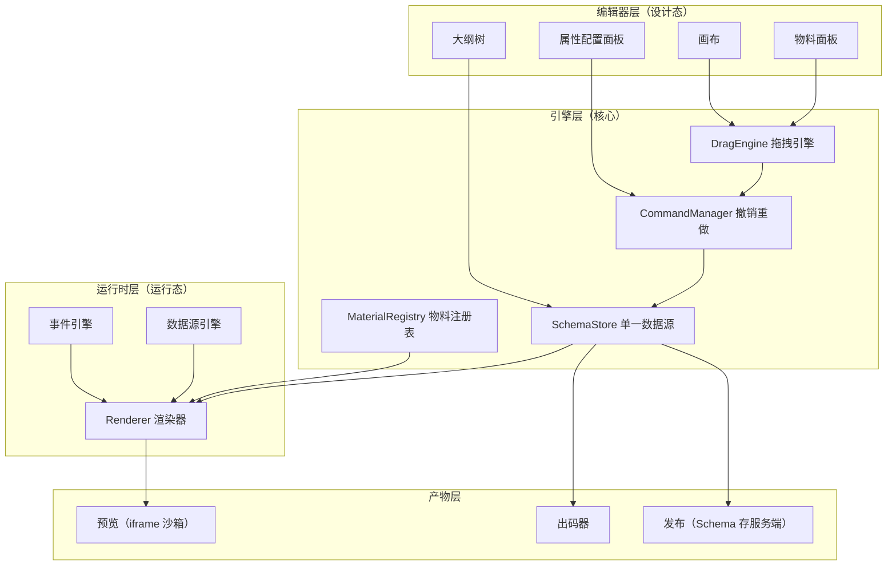
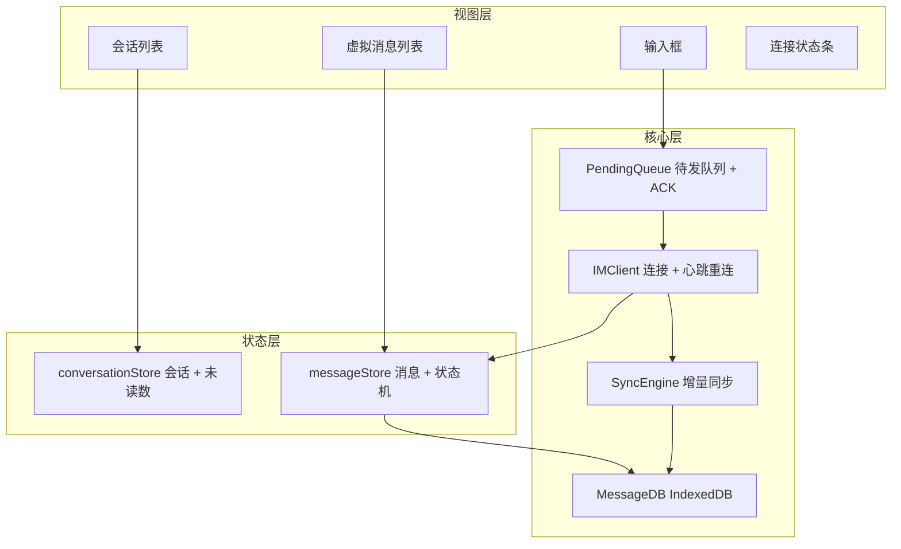
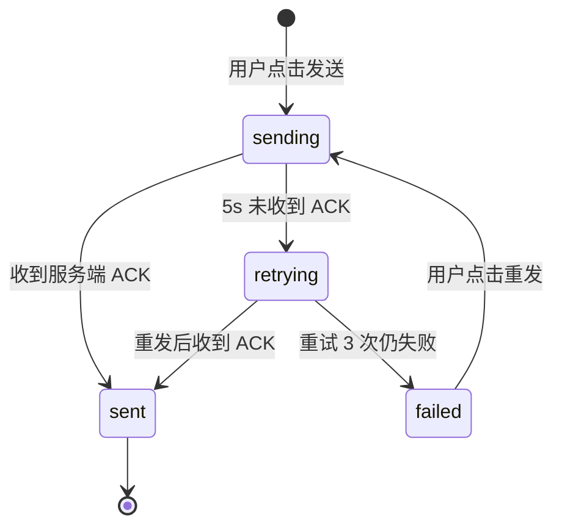

# 高频项目类型实战

> 学习路线对应：综合实战（第 1-9 周知识串联 + 项目类型拓展）
> 技术栈：Vue 3 / React 18 + TypeScript + Vite + pnpm workspace + ECharts + WebSocket
> 项目目标：掌握组件库、低代码平台、数据可视化大屏、IM 即时通讯四类面试高频项目的架构设计与讲法
> 前置知识：[01-企业后台管理系统实战](./01-企业后台管理系统实战.md)、[02-电商平台实战](./02-电商平台实战.md)

---

## 本文目录

- [一、核心概念](#一核心概念)
- [二、底层原理](#二底层原理)
- [三、实战应用](#三实战应用)
- [四、常见面试题](#四常见面试题)
- [五、避坑指南](#五避坑指南)
- [六、本章学习自检](#六本章学习自检)

---

## 一、核心概念

前两个实战模块解决的是"业务功能怎么实现"，本章解决的是"**技术产品怎么做出来**"。组件库、低代码平台、可视化大屏、IM 即时通讯有一个共同特征：**它们本身不是业务系统，而是被业务系统使用的技术设施**。因此这类项目在面试中的含金量高于普通 CRUD 项目——它同时考察架构设计、抽象能力和技术深度。

### 1.1 四类项目的定位与考察重点

| 项目类型 | 本质 | 核心技术主线 | 考察重点 | 难度 |
|---------|------|-------------|---------|:----:|
| 组件库 / 设计系统 | 把 UI 能力沉淀为可复用资产 | 工程化（Monorepo、构建产物）、API 设计、发布流程 | 抽象能力、Tree Shaking 理解深度 | ★★★ |
| 低代码平台 | 把页面开发过程本身变成产品 | Schema 驱动渲染、物料协议、命令模式 | 数据驱动思维、架构分层 | ★★★★★ |
| 数据可视化大屏 | 把数据表达为可投屏的视觉产物 | 图表渲染、分辨率适配、性能优化 | 性能优化、方案权衡 | ★★★ |
| IM 即时通讯前端 | 把不可靠网络包装成可靠体验 | WebSocket、消息可靠性、虚拟滚动 | 网络编程、状态机思维、边界处理 | ★★★★ |

### 1.2 四类项目的共性技术主线

四类项目共享同一条主线：**用配置（数据）描述意图，用渲染器（代码）把意图变成界面**。

```
组件库      →  用 Props / Slots 描述意图，用组件实现渲染
低代码平台  →  用 JSON Schema 描述意图，用渲染器引擎实现渲染
可视化大屏  →  用 ECharts Option 描述意图，用 Canvas 渲染引擎实现渲染
IM 即时通讯 →  用消息协议描述意图，用状态机 + 虚拟列表实现渲染
```

理解这条主线，就能把四类项目串成一个整体：它们都是"**数据驱动视图**"这一前端核心思想在不同抽象层级上的应用。

### 1.3 面试中怎么用这四类项目

面试官问项目，本质是验证三件事：

1. **你做过什么**（真实性）：技术选型的理由、踩过的坑、量化的收益
2. **你思考过什么**（深度）：为什么选 A 不选 B、方案边界在哪、重来会怎么改
3. **你能迁移什么**（潜力）：从具体项目抽象出的通用方法论

因此本章每类项目都按「项目背景与技术选型 → 核心架构设计 → 关键技术难点与解决方案 → 面试怎么讲」四段组织，最后一段给出可直接复用的 STAR 表达。

---

## 二、底层原理

### 2.1 组件库 / 设计系统的底层原理

#### 2.1.1 Monorepo 与 pnpm workspace

组件库几乎必然采用 Monorepo，因为"一仓库、多包、相互依赖"是它的天然形态：

```
packages/
├── components/   # 组件实现（@my/ui）
├── hooks/        # 通用组合式函数（@my/hooks）
├── icons/        # 图标（@my/icons）
├── theme/        # 设计令牌（@my/theme）
└── docs/         # 文档站点
```

```yaml
# pnpm-workspace.yaml
packages:
  - 'packages/*'
  - 'playground'      # 本地调试工程
```

```json
// packages/components/package.json（片段）
{
  "name": "@my/ui",
  "version": "1.2.0",
  "dependencies": {
    "@my/hooks": "workspace:*",   // workspace: 协议指向本地包
    "@my/theme": "workspace:*"
  }
}
```

**`workspace:*` 的关键作用**：开发时直接软链到本地源码（改完立即生效，无需 `npm link`），发布时被 pnpm 自动替换为真实版本号。这是 pnpm 相对 npm / yarn 在 Monorepo 场景下最实用的能力。

构建编排交给 Turborepo，核心是**任务依赖图 + 缓存**：

```json
// turbo.json
{
  "tasks": {
    "build": { "dependsOn": ["^build"], "outputs": ["dist/**"] },
    "test":  { "dependsOn": ["build"] }
  }
}
```

`dependsOn: ["^build"]` 保证"先构建上游依赖包，再构建当前包"，同时命中缓存的任务直接复用产物。

#### 2.1.2 构建产物与 Tree Shaking

Tree Shaking 生效的**三个前提**：

1. 产物是 **ESM 格式**：`import` / `export` 是静态语法，打包器能做静态分析；CJS 的 `require` 是运行时行为，无法静态消除
2. 包声明 **`"sideEffects": false`**：告诉打包器"未被引用的模块可以安全删除"
3. 使用方也用 ESM 且开启 `production` 模式

```json
// packages/components/package.json（发布相关字段）
{
  "type": "module",
  "main": "./dist/index.cjs",       // CJS 入口（兼容老工具链）
  "module": "./dist/index.mjs",     // ESM 入口（打包器优先读这个）
  "types": "./dist/index.d.ts",
  "exports": {
    ".": { "types": "./dist/index.d.ts", "import": "./dist/index.mjs", "require": "./dist/index.cjs" },
    "./style.css": "./dist/style.css"
  },
  "sideEffects": ["**/*.css"]       // 关键：CSS 有副作用，不能一起摇掉
}
```

> **最常见的踩坑点**：写 `"sideEffects": false` 会把 CSS 也摇掉，必须写成 `["**/*.css"]`。

```typescript
// packages/components/vite.config.ts
export default defineConfig({
  plugins: [vue(), dts({ rollupTypes: true })],  // rollupTypes 把 d.ts 合并为单文件
  build: {
    lib: { entry: 'src/index.ts', formats: ['es', 'cjs'],
           fileName: (f) => `index.${f === 'es' ? 'mjs' : 'cjs'}` },
    rollupOptions: {
      external: ['vue', '@vue/runtime-core'],   // 不把 Vue 打进产物
      output: { preserveModules: true, preserveModulesRoot: 'src' },  // 保留模块结构，细化摇树粒度
    },
  },
})
```

| 配置 | 作用 | 不配置的后果 |
|------|------|-------------|
| `external: ['vue']` | 不把 Vue 打进产物 | 使用方加载两份 Vue，`provide/inject` 失效、体积翻倍 |
| `preserveModules: true` | 保留 `src/` 模块结构 | 产物被打成单个大文件，摇树粒度变粗 |
| `formats: ['es', 'cjs']` | 同时提供两种模块格式 | 老工具链无法使用 |

#### 2.1.3 按需引入的三种实现方式

| 方式 | 原理 | 代表 | 优缺点 |
|------|------|------|--------|
| 手动按路径引入 | `import Button from '@my/ui/button'` | 早期 Element UI | 零配置、最可控，但写法繁琐 |
| 编译期自动转换 | 构建插件把 `import { Button }` 重写为按路径导入 | `unplugin-vue-components`、`babel-plugin-import` | 写法简洁，但依赖构建插件 |
| 原生 ESM 摇树 | 产物已是细粒度 ESM，打包器自动消除 | antd 5.x | 无需插件，要求构建链完整支持 ESM |

```typescript
// 使用方工程的 vite.config.ts
import Components from 'unplugin-vue-components/vite'
import { ElementPlusResolver } from 'unplugin-vue-components/resolvers'

export default defineConfig({
  plugins: [Components({
    resolvers: [ElementPlusResolver()],   // 自动把 <el-button> 解析为按需 import
    dts: 'src/types/components.d.ts',     // 生成类型声明，保证 TS 提示
  })],
})
```

#### 2.1.4 语义化版本与发布流程

| 版本位 | 名称 | 何时递增 | 示例 |
|-------|------|---------|------|
| MAJOR | 主版本 | 有不兼容的 API 变更 | `1.4.2` → `2.0.0` |
| MINOR | 次版本 | 向下兼容地新增功能 | `1.4.2` → `1.5.0` |
| PATCH | 修订号 | 向下兼容地修复缺陷 | `1.4.2` → `1.4.3` |

```bash
pnpm changeset            # 1. 开发者在 PR 中描述变更，生成 changeset 文件
pnpm changeset version    # 2. 合并后 CI 汇总 changeset，统一升级版本号
pnpm build && pnpm changeset publish   # 3. 构建并发布到 npm
pnpm changeset pre enter beta          # 预发布模式，版本号变为 2.0.0-beta.0
```

```markdown
<!-- .changeset/curly-dogs-sing.md -->
---
'@my/ui': minor
'@my/hooks': patch
---
新增 DatePicker 组件；修复 useResize 在 SSR 环境下的报错
```

### 2.2 低代码平台的底层原理

#### 2.2.1 Schema 驱动与渲染器实现

低代码平台的一切建立在"**页面即数据**"这个前提上：

```json
{
  "componentName": "Form",
  "props": { "labelWidth": "100px" },
  "children": [
    { "componentName": "Input", "props": { "label": "订单号", "name": "orderNo" } }
  ]
}
```

这棵 JSON 树就是**页面描述（Schema）**，与虚拟 DOM 树结构高度同构。渲染器把它映射为组件树：

```tsx
// 渲染器核心逻辑（约 20 行即可跑通）
import { materialMap } from './materials'   // 物料表：componentName → 组件实现

interface SchemaNode {
  componentName: string
  props?: Record<string, any>
  children?: SchemaNode[]
}

export function Renderer({ schema }: { schema: SchemaNode }) {
  const Component = materialMap[schema.componentName]
  // 未知物料必须容错，否则画布会整片白屏
  if (!Component) return <div style={{ color: 'red' }}>未注册的物料：{schema.componentName}</div>

  const children = schema.children?.map((child, i) => <Renderer key={i} schema={child} />)
  return <Component {...schema.props}>{children}</Component>
}
```

**渲染器的三个职责**：物料查找（`componentName` → 组件）、递归渲染（深度优先遍历）、上下文注入（数据源与事件回调通过 Context 下传）。

**Schema 与虚拟 DOM 的区别**（高频追问）：结构同构，但虚拟 DOM 是运行时临时产物、由代码生成、每次渲染重建；Schema 是持久化数据、由配置生成、可序列化存储与传输。因此 Schema 可以服务端下发、保存草稿、编译出码。

#### 2.2.2 物料体系与物料协议

**物料（Material）** 是可拖入画布的组件资产。合格物料 = 组件实现 + 元信息，这份元信息就是**物料协议**：

```typescript
interface MaterialProtocol {
  componentName: string          // 唯一标识，Schema 中引用它
  title: string                  // 面板显示名
  category: string               // 分组：基础组件 / 业务组件 / 布局组件
  version: string
  schema: Partial<SchemaNode>    // 拖入画布时生成的初始节点
  configure: {
    props: Array<{
      name: string
      title: string
      setter: string             // 用哪个 Setter 渲染这个属性
      defaultValue?: any
    }>
    events?: Array<{ name: string; title: string }>
  }
  snippets?: Array<{ title: string; schema: SchemaNode }>   // 出码用代码片段
}
```

```typescript
// materials/index.ts —— 组件实现与元信息分离
export const materialMap: Record<string, React.ComponentType<any>> = { Input, Table }

export const materialProtocols: MaterialProtocol[] = [{
  componentName: 'Input', title: '输入框', category: '基础组件', version: '1.0.0',
  schema: { componentName: 'Input', props: { label: '输入框', name: 'field' } },
  configure: { props: [
    { name: 'label', title: '标签', setter: 'StringSetter' },
    { name: 'disabled', title: '禁用', setter: 'BooleanSetter', defaultValue: false },
  ]},
}]
```

**分离的价值**：元信息可序列化、可服务端下发、可跨平台共享。这是阿里低代码引擎等方案的设计基础。

#### 2.2.3 属性配置面板（Setter）设计

Setter 是"属性 → 编辑器组件"的映射机制，用一张注册表实现：

```tsx
const setterMap: Record<string, SetterComponent> = {}

export function registerSetter(name: string, c: SetterComponent) { setterMap[name] = c }
// 兜底，避免物料协议写错导致面板崩溃
export function getSetter(name: string) { return setterMap[name] ?? FallbackSetter }

registerSetter('StringSetter', ({ value, onChange, field }) => (
  <input value={value ?? ''} placeholder={`请输入${field.title}`}
         onChange={(e) => onChange(e.target.value)} />
))

// 面板渲染：遍历物料协议声明，自动为每个属性找到 Setter
function SetterPanel({ node, onPropChange }) {
  const protocol = getProtocol(node.componentName)
  return protocol.configure.props.map((field) => {
    const Setter = getSetter(field.setter)
    return (
      <div key={field.name}>
        <label>{field.title}</label>
        <Setter value={node.props?.[field.name] ?? field.defaultValue}
                field={field} onChange={(v) => onPropChange(field.name, v)} />
      </div>
    )
  })
}
```

**关键收益**：新增物料只需写组件 + 物料协议，**不需要修改面板代码**——这是低代码平台可扩展性的核心。

#### 2.2.4 拖拽实现：HTML5 DnD vs 鼠标事件

| 维度 | HTML5 Drag and Drop | 鼠标 / Pointer 事件 |
|------|--------------------|--------------------|
| 核心 API | `draggable` + `dragstart` / `dragover` / `drop` | `pointerdown` / `pointermove` / `pointerup` |
| 移动端支持 | 差（需 polyfill） | 好（Pointer Events 统一鼠标与触摸） |
| 拖拽预览 | 受 `setDragImage` 限制，样式难定制 | 完全自由，可渲染任意 DOM |
| 落点精度 | 只能在 `dragover` 拿坐标，精度受限 | 可精确计算落点与吸附位置 |
| 跨窗口拖拽 | 原生支持 | 不支持 |
| 实现复杂度 | 低 | 中高 |

```tsx
// HTML5 DnD 最小实现：物料项作为拖拽源
<div draggable
     onDragStart={(e) => {
       // dataTransfer 只能存字符串，需序列化
       e.dataTransfer.setData('application/json', JSON.stringify(protocol.schema))
       e.dataTransfer.effectAllowed = 'copy'
     }}>{protocol.title}</div>

// 画布作为放置目标
<div onDragOver={(e) => {
       e.preventDefault()          // 必须 preventDefault，否则浏览器不触发 drop（最常见坑）
       e.dataTransfer.dropEffect = 'copy'
     }}
     onDrop={(e) => { e.preventDefault(); onDropNode(JSON.parse(e.dataTransfer.getData('application/json'))) }} />
```

```typescript
// Pointer Events 方案（支持鼠标 + 触摸，落点更精确）
function handlePointerDown(e: React.PointerEvent) {
  e.currentTarget.setPointerCapture(e.pointerId)   // 捕获指针，移出元素也不丢事件
  onStart({ x: e.clientX, y: e.clientY })

  const move = (ev: PointerEvent) => onMove({ x: ev.clientX, y: ev.clientY })
  const up = (ev: PointerEvent) => {
    window.removeEventListener('pointermove', move)
    window.removeEventListener('pointerup', up)
    onEnd({ x: ev.clientX, y: ev.clientY })
  }
  window.addEventListener('pointermove', move)
  window.addEventListener('pointerup', up)
}
```

> **大型低代码平台多选鼠标事件方案**：需要精确的插入位置指示线、吸附对齐、实时预览和移动端支持，HTML5 DnD 的 `dragImage` 与 `dragover` 精度都满足不了。

#### 2.2.5 撤销重做：命令模式

| 方案 | 原理 | 内存占用 | 精度 |
|------|------|---------|------|
| 快照栈 | 每次操作后深拷贝完整 Schema | 与 Schema 大小成正比 | 简单可靠，不会出错 |
| 命令模式 | 每个操作封装为 `do` / `undo` 命令对象 | 只与操作数量成正比 | 需为每种操作实现逆操作 |
| 补丁 | 记录差异（Immer patches / JSON Patch） | 低 | 语义清晰，依赖补丁库 |

```typescript
interface Command { name: string; do(): void; undo(): void }

class CommandManager {
  private undoStack: Command[] = []
  private redoStack: Command[] = []
  private maxSize = 50            // 限制栈深，防止长会话内存无限增长

  execute(cmd: Command) {
    cmd.do()
    this.undoStack.push(cmd)
    if (this.undoStack.length > this.maxSize) this.undoStack.shift()
    this.redoStack = []           // 新操作清空重做栈（标准撤销重做语义）
  }
  undo() { const c = this.undoStack.pop(); if (!c) return; c.undo(); this.redoStack.push(c) }
  redo() { const c = this.redoStack.pop(); if (!c) return; c.do(); this.undoStack.push(c) }
}
```

**三个工程要点**：① `undo()` 必须幂等，重复调用不产生额外副作用；② **复合命令**——一次拖拽会同时触发"删旧位置 + 插新位置"，必须合并成一条命令，否则用户要按两次撤销；③ 栈深度限制防止内存增长。

#### 2.2.6 出码方案与适用边界

| 方案 | 原理 | 优点 | 缺点 |
|------|------|------|------|
| 模板字符串拼接 | 按固定模板拼出代码字符串 | 实现简单 | 嵌套复杂时易生成非法代码 |
| AST 生成 | 构造 AST 后用 `@babel/generator` 输出 | 输出规范、可格式化 | 实现成本高 |

```typescript
// AST 出码简化示意
function schemaToJSX(node: SchemaNode): t.JSXElement {
  const attrs = Object.entries(node.props ?? {}).map(([k, v]) =>
    t.jsxAttribute(t.jsxIdentifier(k), t.stringLiteral(String(v))))
  const children = (node.children ?? []).map(schemaToJSX)
  return t.jsxElement(
    t.jsxOpeningElement(t.jsxIdentifier(node.componentName), attrs, children.length === 0),
    children.length ? t.jsxClosingElement(t.jsxIdentifier(node.componentName)) : null,
    children)
}
const code = generate(schemaToJSX(pageSchema)).code
```

**低代码平台的适用边界**（面试必答的批判性思考）：

| 适合 | 不适合 |
|------|--------|
| 中后台 CRUD 页面（表单、表格、搜索区） | 强交互场景（富文本编辑器、图形编辑器、地图） |
| 营销落地页（结构固定、需批量产出） | 动画与视觉要求高的 C 端页面 |
| 内部工具快速搭建、表单流程类应用 | 性能敏感的复杂列表 / 大规模实时渲染 |

**判断标准**：如果页面复杂度主要来自"**字段数量多**"而不是"**交互逻辑复杂**"，低代码就能显著提效；反之强行上低代码会导致"平台越做越复杂，最后不如直接写代码"。

### 2.3 数据可视化大屏的底层原理

#### 2.3.1 ECharts 渲染机制与按需引入

ECharts 的核心是 **Option 驱动的渲染管线**：

```
Option → 数据处理（dataset / transform）→ 布局计算（坐标系）
      → 图元生成（每个 series 生成图形元素）→ 渲染（Canvas / SVG）→ 交互层
```

按需引入是控制体积的关键（全量约 1MB，按需可降至 300KB 以内）：

```typescript
// echarts.ts —— 统一出口，集中管理按需引入
import * as echarts from 'echarts/core'
import { LineChart, BarChart, PieChart } from 'echarts/charts'
import { GridComponent, TooltipComponent, LegendComponent, DataZoomComponent } from 'echarts/components'
import { CanvasRenderer } from 'echarts/renderers'

echarts.use([LineChart, BarChart, PieChart,
             GridComponent, TooltipComponent, LegendComponent, DataZoomComponent, CanvasRenderer])

export default echarts
export type { EChartsOption } from 'echarts'
```

```typescript
// 组件内使用：注意 shallowRef 与 dispose
const chartRef = ref<HTMLDivElement>()
// ECharts 实例内部属性极多，用 shallowRef 避免深度响应式带来的巨大依赖收集开销
const chart = shallowRef<echarts.ECharts>()

onMounted(() => {
  chart.value = echarts.init(chartRef.value!, undefined, { renderer: 'canvas' })
  chart.value.setOption(option)
  // ResizeObserver 比 window.resize 更精准
  const observer = new ResizeObserver(() => chart.value?.resize())
  observer.observe(chartRef.value!)
  onBeforeUnmount(() => observer.disconnect())
})

onBeforeUnmount(() => chart.value?.dispose())   // 必须 dispose，否则 Canvas 与事件监听不释放
```

#### 2.3.2 自适应适配方案对比

| 方案 | 原理 | 优点 | 缺点 | 适用场景 |
|------|------|------|------|---------|
| `transform: scale` | 按设计稿固定尺寸布局，整体等比缩放 | 实现简单，1:1 还原设计稿 | 非整数缩放下细边框模糊；`getBoundingClientRect` 返回缩放后尺寸 | 定宽定高投屏（最常见） |
| `rem` + 动态根字号 | JS 设置 `html` 的 `font-size`，尺寸用 rem | 流式自然、字体清晰 | 需 PostCSS 转换；Canvas 内容（图表）不跟随 | 需要在不同分辨率重新排版 |
| `vw` / `vh` | 直接用视口单位 | 纯 CSS，无 JS | 极端宽高比下布局变形 | 简单响应式大屏 |

```typescript
// composables/useScreenScale.ts —— 等比缩放 + 居中（contain 语义）
export function useScreenScale(designWidth = 1920, designHeight = 1080) {
  const scale = ref(1), offsetX = ref(0), offsetY = ref(0)

  function update() {
    const w = window.innerWidth, h = window.innerHeight
    // 取较小值保证内容完整可见（不裁切）
    scale.value = Math.min(w / designWidth, h / designHeight)
    offsetX.value = (w - designWidth * scale.value) / 2
    offsetY.value = (h - designHeight * scale.value) / 2
  }

  onMounted(() => { update(); window.addEventListener('resize', update) })
  onBeforeUnmount(() => window.removeEventListener('resize', update))
  return { scale, offsetX, offsetY }
}
```

```vue
<div class="screen-body" :style="{
       width: '1920px', height: '1080px',
       transform: `translate(${offsetX}px, ${offsetY}px) scale(${scale})`,
       transformOrigin: 'left top' }"><slot /></div>
```

> **`scale` 方案的两个坑**：① 非整数缩放下 `1px` 边框会渲染成亚像素而模糊或缺失，改用 `box-shadow: 0 0 0 1px color` 模拟；② `getBoundingClientRect()` 返回缩放后的值，做"点击坐标 → 数据坐标"换算时需除以 `scale` 补偿（ECharts 场景可直接用 `convertFromPixel`）。

#### 2.3.3 图表性能优化

| 优化手段 | 配置 | 原理 |
|---------|------|------|
| 关闭数据点标记 | `showSymbol: false` | 避免渲染数万个圆点 |
| `large` 模式 | `large: true, largeThreshold: 2000` | 跳过逐点样式计算，走批量渲染路径 |
| 降采样 | `sampling: 'lttb'` | Largest-Triangle-Three-Buckets 算法，保留趋势特征 |
| 增量渲染 | `progressive: 400, progressiveThreshold: 3000` | 分帧渲染，避免阻塞主线程 |
| 增量追加 | `chart.appendData()` | 只追加增量，不重建整个 series |
| 区域缩放 | `dataZoom` + `filterMode: 'weakFilter'` | 只渲染可视区域数据 |
| 关闭动画 | `animation: false` | 省去动画帧计算（高频刷新场景） |

```typescript
// 十万点折线图配置
const option = {
  animation: false,
  xAxis: { type: 'category', data: timeList, boundaryGap: false },
  yAxis: { type: 'value' },
  series: [{
    type: 'line', data: valueList,
    sampling: 'lttb',          // 数据量优化：降采样
    large: true,               // 渲染路径优化：批量渲染
    largeThreshold: 2000,
    showSymbol: false,         // 关键！否则要渲染 10 万个圆点
  }],
  dataZoom: [{ type: 'inside', filterMode: 'weakFilter' }],
}
```

```typescript
// 实时增量更新：appendData 只追加，不重建 series
chart.setOption({ series: [{ type: 'line', data: [], showSymbol: false }] })
setInterval(() => chart.appendData({ seriesIndex: 0, data: [nextValue] }), 1000)
```

> **`appendData` 的限制**：只能追加，不能修改或删除；series 的 `data` 必须初始为空数组。若需要滚动窗口（只保留最近 N 个点），必须改用 `setOption` 传新数组，此时配合 `dataZoom` 控制可视范围。

#### 2.3.4 定时刷新与部署投屏

```typescript
let timer: number | undefined
onMounted(() => {
  timer = window.setInterval(async () => {
    const data = await fetchDashboardData()
    // notMerge: false 合并更新，保留用户已设置的缩放等交互状态
    chart.value?.setOption(buildOption(data), { notMerge: false })
  }, 30_000)
})
onBeforeUnmount(() => { if (timer) window.clearInterval(timer) })   // 不清理会泄漏 + 后台持续请求
```

| 投屏要点 | 做法 | 原因 |
|---------|------|------|
| 全屏无地址栏 | Chrome `--kiosk` 参数 | 避免投屏露出浏览器 UI |
| 固定浏览器缩放 | 锁定 100% | 缩放会破坏等比缩放基准 |
| 禁止息屏 | 关闭休眠与屏保 | 大屏需 7×24 常亮 |
| 定时重载 | 凌晨低峰期 `location.reload()` | 防长时间运行内存碎片导致卡死 |
| 关闭光标 | `cursor: none` | 大屏通常无鼠标操作 |

### 2.4 IM 即时通讯前端的底层原理

#### 2.4.1 WebSocket 长连接管理与重连

WebSocket 提供全双工通信，但**不提供任何可靠性保证**：连接会断、消息会丢、顺序会乱。IM 前端的复杂度大部分来自"在 WebSocket 之上补齐可靠性"。

```typescript
// utils/socket.ts —— 心跳 + 指数退避重连
class IMClient {
  private ws: WebSocket | null = null
  private retryCount = 0

  connect() {
    this.ws = new WebSocket(this.url)

    this.ws.onopen = () => {
      this.retryCount = 0            // 连接成功必须重置重试计数
      this.startHeartbeat()
      this.flushPendingQueue()       // 补发断线期间积压的消息
    }
    this.ws.onmessage = (e) => {
      const msg = JSON.parse(e.data)
      if (msg.type === 'pong') return  // 心跳响应不进入业务分发
      this.emit(msg.type, msg.payload)
    }
    this.ws.onclose = () => { this.stopHeartbeat(); this.scheduleReconnect() }
    // onerror 之后必定触发 onclose，所以重连逻辑统一放 onclose，避免重复触发
    this.ws.onerror = () => { /* 仅记录日志 */ }
  }

  private startHeartbeat() {
    // WebSocket 协议层有 ping/pong 帧，但 JS API 不暴露发送能力，需应用层心跳
    this.heartbeatTimer = window.setInterval(() => this.send({ type: 'ping' }), 30_000)
  }

  private scheduleReconnect() {
    if (this.reconnectTimer) return
    const base = Math.min(1000 * 2 ** this.retryCount, 30_000)  // 1s→2s→4s→…→30s 封顶
    const delay = base + Math.random() * 1000                   // 随机抖动，避免惊群
    this.retryCount++
    this.reconnectTimer = window.setTimeout(() => this.connect(), delay)
  }
}
```

**心跳的必要性**：TCP 存在"**假死**"状态——拔网线、NAT 表项超时、中间代理静默断开时浏览器不触发 `onclose`，前端会误以为连接正常。应用层心跳通过"定时发包 + 超时未收到 `pong` 就主动断开重连"来发现假死连接。

#### 2.4.2 消息可靠性：ACK、去重、顺序

```typescript
type MessageStatus = 'sending' | 'sent' | 'failed'
interface ChatMessage {
  msgId: string        // 客户端生成的唯一 ID（用于去重与 ACK 匹配）
  seq?: number         // 服务端分配的会话内序号（用于排序）
  status: MessageStatus
  createdAt: number
}
```

**（1）ACK 确认 + 超时重发**

```typescript
const pendingAck = new Map<string, { msg: ChatMessage; timer: number; retries: number }>()

function sendMessage(msg: ChatMessage) {
  msg.status = 'sending'
  insertLocal(msg)                       // 乐观更新：体验上"秒发"
  pendingAck.set(msg.msgId, { msg, retries: 0,
    timer: window.setTimeout(() => retry(msg.msgId), 5000) })
  socket.send({ type: 'chat', msgId: msg.msgId, content: msg.content })
}

socket.on('ack', ({ msgId, seq }) => {
  const p = pendingAck.get(msgId); if (!p) return
  window.clearTimeout(p.timer); pendingAck.delete(msgId)
  updateLocal(msgId, { status: 'sent', seq })      // 状态流转 sending → sent
})
```

**（2）去重**：重发会导致服务端收到重复消息，服务端按 `msgId` 幂等处理；客户端侧也要去重——自己发的消息被服务端回推时只更新状态，不重复插入：

```typescript
function onIncomingMessage(msg: ChatMessage) {
  const existing = localMessages.find((m) => m.msgId === msg.msgId)
  if (existing) { Object.assign(existing, { status: 'sent', seq: msg.seq }); return }
  insertLocal(msg)
}
```

**（3）顺序保证**：网络不保证到达顺序，用服务端分配的 `seq` 重排：

```typescript
function mergeAndSort(incoming: ChatMessage[]) {
  return [...localMessages, ...incoming].sort((a, b) => {
    if (a.seq == null && b.seq == null) return a.createdAt - b.createdAt
    if (a.seq == null) return -1        // 未 ACK 的本地消息排最前
    if (b.seq == null) return 1
    return a.seq - b.seq
  })
}
```

> **为什么不用 `Date.now()` 排序**：客户端时钟不可信——设备时间可能被手动修改，也存在时钟漂移。服务端统一分配的单调递增序号才是可靠依据。

**（4）离线消息与增量同步**：本地记录 `lastSyncSeq`，重连后只拉增量，避免全量拉取：

```typescript
async function syncMessages() {
  const lastSyncSeq = await db.getMeta('lastSyncSeq') ?? 0
  const { messages, latestSeq } = await api.getMessagesAfter({ lastSyncSeq, limit: 200 })
  mergeAndSort(messages)
  await db.setMeta('lastSyncSeq', latestSeq)
}
```

> **存储选择**：消息可能上万条，`localStorage` 有 5MB 上限且同步读写阻塞主线程，应使用 **IndexedDB**（异步、容量大、支持索引），常用 Dexie.js 封装。

#### 2.4.3 已读回执实现

已读回执的本质是"**上报 + 广播 + 计算未读数**"：

```typescript
// 会话级已读：只上报"已读到的最大 seq"，比逐条上报节省几个数量级的请求
function markAsRead(conversationId: string, readSeq: number) {
  socket.send({ type: 'read', conversationId, readSeq })
}
// 未读数 = 会话最新 seq - 我读到的最新 seq
function calcUnread(conv: Conversation, myReadSeq: number) {
  return Math.max(0, conv.latestSeq - myReadSeq)
}
```

**三个工程细节**：① **防抖上报**——滚动时不要每条消息都上报，用户停止滚动 500ms 后上报一次；② **窗口失焦不上报**——页面在后台时不应标记已读；③ **幂等性**——`readSeq` 只增不减，服务端做 `max(readSeq, storedReadSeq)` 校验，防乱序请求导致回退。

群聊已读需要维护"每个成员各自的 readSeq"，存储量大，通常只对"重要消息"（如 @ 我）开启。

#### 2.4.4 富文本消息渲染与 XSS 防护

```typescript
import { marked } from 'marked'
import DOMPurify from 'dompurify'

export function renderMessage(raw: string): string {
  const html = marked.parse(raw, { async: false }) as string
  // 白名单消毒：只保留安全标签与属性
  return DOMPurify.sanitize(html, {
    ALLOWED_TAGS: ['p', 'br', 'strong', 'em', 'code', 'pre', 'a', 'img', 'ul', 'ol', 'li'],
    ALLOWED_ATTR: ['href', 'src', 'alt', 'title', 'target', 'rel'],
    ALLOWED_URI_REGEXP: /^(?:https?|mailto):/i,   // 禁止 javascript: / data: 协议
  })
}
```

| 风险 | 攻击方式 | 防护 |
|------|---------|------|
| `v-html` / `dangerouslySetInnerHTML` 注入 | 消息含 `` | 渲染前必须 `DOMPurify.sanitize` |
| 链接协议注入 | `javascript:alert(1)` | 协议白名单，只允许 `http/https/mailto` |
| 图片地址泄露 IP | 第三方图片 URL 记录访问者 IP | 图片走服务端代理 + CDN 中转 |
| 外链钓鱼 | `<a target="_blank">` 配合 `window.opener` 篡改原页面 | 加 `rel="noopener noreferrer"` |

#### 2.4.5 大消息列表的虚拟滚动

| 需求 | 难点 | 解决思路 |
|------|------|---------|
| 动态行高 | 消息长度不一，无法预设 `itemHeight` | 渲染后测量并缓存高度 |
| 向上加载历史 | 顶部插入数据后 `scrollTop` 跳变 | 插入前后记录 `scrollHeight` 差值补偿 |
| 保持滚动位置 | 新消息到达不应把用户"拽"到底部 | 判断"是否在底部附近"，只有底部才自动滚动 |
| 图片消息 | 图片加载后高度才确定，布局抖动 | 用宽高比容器预留占位高度 |

```typescript
// 向上加载历史：补偿滚动位置
async function loadHistory(container: HTMLElement) {
  const prevHeight = container.scrollHeight
  const prevTop = container.scrollTop

  const older = await api.getHistory({ beforeSeq: minSeq, limit: 50 })
  prependMessages(older)
  await nextTick()                                  // 等 DOM 更新完成

  container.scrollTop = prevTop + (container.scrollHeight - prevHeight)
}

// 新消息到达：只有本来就在底部才自动滚动
function handleIncoming(container: HTMLElement, msg: ChatMessage) {
  const atBottom = container.scrollHeight - container.scrollTop - container.clientHeight < 80
  appendMessage(msg)
  nextTick(() => {
    if (atBottom) container.scrollTop = container.scrollHeight
    else unreadBadge.value++          // 否则显示"有新消息"浮标，不打断阅读
  })
}
```

#### 2.4.6 连接状态与降级策略

```typescript
// 降级：WebSocket → SSE → 长轮询 → 本地队列
async send(msg: any) {
  if (this.mode === 'ws' && this.ws?.readyState === WebSocket.OPEN) {
    return this.ws.send(JSON.stringify(msg))
  }
  return fetch('/api/im/send', { method: 'POST', body: JSON.stringify(msg) })  // 降级走 HTTP
}

// 弱网检测
window.addEventListener('offline', () => { this.mode = 'poll'; this.setState('offline') })
window.addEventListener('online',  () => { this.mode = 'ws'; this.connect() })
```

| 网络状况 | 策略 | 说明 |
|---------|------|------|
| 正常 | WebSocket 全双工 | 实时性最好，服务端可主动推送 |
| WS 被中间设备拦截 | SSE（Server-Sent Events） | 单向推送 + HTTP 上行，穿透性更好 |
| 弱网 / 高丢包 | 长轮询（如 30s） | 牺牲实时性换取稳定性 |
| 完全离线 | 本地队列 + 恢复后批量补发 | 保证消息不丢，不保证实时 |

---

## 三、实战应用

### 3.1 组件库 / 设计系统项目

#### 项目背景与技术选型

**背景**：公司有 8 个中后台系统，UI 风格不统一，同一个"表格 + 分页"在每个项目各写一遍，一次样式改动要改 8 个仓库。

| 技术 | 选型 | 理由 |
|------|------|------|
| 包管理 | pnpm workspace | 天然支持 Monorepo，`workspace:*` 解决本地依赖 |
| 构建 | Vite 库模式 + `vite-plugin-dts` | 配置简单，产物可控，类型声明自动生成 |
| 任务编排 | Turborepo | 增量构建 + 远程缓存，CI 从 8 分钟降到 2 分钟 |
| 版本管理 | Changesets | 自动生成 CHANGELOG，多包版本联动 |
| 文档 | VitePress（对外文档）+ Storybook（开发调试） | 各司其职 |
| 测试 | Vitest + Vue Test Utils + Chromatic 视觉回归 | 逻辑 + 样式双保险 |

#### 核心架构设计

```
my-design-system/
├── packages/
│   ├── theme/            # 设计令牌：颜色 / 间距 / 字号 / 圆角
│   │   ├── src/tokens.ts       # 单一数据源
│   │   └── src/css-vars.css    # 由 tokens 生成的 CSS 变量
│   ├── hooks/            # 无 UI 逻辑（useResize / useClickOutside）
│   ├── icons/            # SVG 图标，构建为组件
│   ├── components/       # 组件实现 + 单测
│   └── docs/             # VitePress 文档站点
├── playground/           # 本地调试工程（workspace 包）
└── turbo.json
```

**设计令牌是设计系统的地基**，组件只引用令牌，不写死颜色值：

```typescript
// packages/theme/src/tokens.ts
export const tokens = {
  color: { primary: '#1677ff', danger: '#ff4d4f', bgContainer: '#ffffff' },
  spacing: { xs: 4, sm: 8, md: 16, lg: 24, xl: 32 },
  radius: { sm: 4, md: 8, lg: 12 },
  fontSize: { sm: 12, md: 14, lg: 16, xl: 20 },
}
```

```css
/* 令牌 → CSS 变量，支持主题切换 */
:root { --md-color-primary: #1677ff; --md-spacing-md: 16px; --md-radius-md: 8px; }
html.dark { --md-color-primary: #1668dc; --md-bg-container: #141414; }
```

**组件 API 设计规范**（最能体现抽象能力的地方）：

| 规范 | 做法 | 反例 |
|------|------|------|
| Props 命名统一 | 全库统一 `size` / `type` / `disabled` / `loading` | 有的用 `type`，有的用 `variant` |
| 尺寸用枚举 | `size="small" \| "middle" \| "large"` | `width={32}` 硬编码像素 |
| 受控 + 非受控双模式 | `value` + `onChange`，同时支持 `defaultValue` | 只支持受控，使用方必须写 state |
| 透传原生属性 | `inheritAttrs: false` + `v-bind="$attrs"` 到根元素 | 屏蔽原生属性导致无法设置 `data-*` |
| 组合优于配置 | 用插槽而非 `xxxRender` 函数 Prop | `renderFooter={() => ...}` 在 Vue 中不自然 |
| 无障碍 | 内置 `aria-*` / `role`，支持键盘操作 | 只做视觉，不支持键盘 |

```vue
<!-- Button.vue —— API 设计完整示例 -->
<template>
  <button class="md-button" :class="[`md-button--${type}`, `md-button--${size}`]"
          :disabled="disabled || loading" :aria-busy="loading || undefined" v-bind="$attrs">
    <span v-if="loading" class="md-button__spinner" aria-hidden="true" />
    <slot />
  </button>
</template>

<script setup lang="ts">
defineOptions({ inheritAttrs: false })   // 关闭自动继承，手动绑定到 button 元素
withDefaults(defineProps<{
  type?: 'primary' | 'default' | 'text' | 'danger'
  size?: 'small' | 'middle' | 'large'
  disabled?: boolean
  loading?: boolean
}>(), { type: 'default', size: 'middle', disabled: false, loading: false })
</script>
```

#### 关键技术难点与解决方案

| 难点 | 问题表现 | 解决方案 |
|------|---------|---------|
| 样式隔离与主题覆盖 | 组件样式互相污染；使用方无法覆盖 | 统一 `md-` 前缀 + BEM 命名 + CSS 变量，不用深度选择器穿透 |
| 摇树失效 | 只用了 1 个组件却引入全部 | `sideEffects: ["**/*.css"]` + `preserveModules` + ESM 产物 |
| Vue 版本冲突 | 使用方加载两份 Vue，`provide/inject` 失效 | `vue` 放进 `peerDependencies` 且 `rollupOptions.external` |
| 类型提示丢失 | 使用方 TS 无提示 | `vite-plugin-dts` 生成 d.ts；`exports` 中声明 `types` |
| 视觉回归成本高 | 改样式要人工对比几十个页面 | Storybook + Chromatic 自动截图 diff，只对超阈值报告人工介入 |
| 多包版本不一致 | `@my/ui` 与 `@my/hooks` 版本错配 | Changesets 的 `fixed` 配置让相关包版本联动 |

#### 面试怎么讲（STAR 结构）

| 环节 | 内容 |
|------|------|
| **S 背景** | 公司 8 个中后台系统 UI 风格不统一，同一个"带搜索的表格页"在每个项目各写一遍，一次交互规范调整要改 8 个仓库，平均 3 天才能全部上线 |
| **T 目标** | 把 UI 能力沉淀为组件库：统一视觉规范、新项目接入成本降到 1 天以内、样式改动可控不引入回归 |
| **A 动作** | ① **建地基**：pnpm workspace 搭 Monorepo，拆成 `theme` / `hooks` / `icons` / `components` 四包，把所有颜色间距字号抽成设计令牌，组件只引用令牌——"换肤"从改 8 个仓库变成改 1 个文件。② **定规范**：统一 Props 命名，支持受控与非受控双模式，`inheritAttrs: false` + `$attrs` 透传原生属性，内置 `aria-*`；物料协议与组件实现分离，为后续接入低代码留口子。③ **控质量**：Vitest + Vue Test Utils 单测、Storybook + Chromatic 视觉回归、Changesets 管版本与 CHANGELOG，发布走 CI |
| **R 结果** | 覆盖 46 个组件，8 个后台系统全部接入；新项目搭建从 5 天降到 1 天；交互规范调整从 3 天降到半天；通过 `sideEffects` + `preserveModules` 产物优化，使用方首屏 JS 体积相比全量引入减少约 60% |

**可能被追问的点**：

| 追问 | 回答要点 |
|------|---------|
| Tree Shaking 为什么能生效？ | 三个前提：ESM 静态语法、`sideEffects: false`、打包器生产模式；CJS 的 `require` 是运行时行为无法静态消除 |
| `sideEffects: false` 有什么坑？ | 会把 CSS 一起摇掉，必须写成 `["**/*.css"]` |
| 为什么 Vue 要 external？ | 否则使用方加载两份 Vue，`provide/inject` 与全局配置失效，体积翻倍 |
| 破坏性变更怎么管理？ | 按 SemVer 升 MAJOR，CHANGELOG 写迁移指南，提前一个版本打 deprecation 警告，必要时提供 codemod |
| 视觉回归的误报怎么处理？ | 固定测试环境的字体、时区、DPR；动画区域设置 delay 或 disable；diff 阈值配置化 |
| 组件库怎么和低代码打通？ | 物料协议与组件实现分离，元信息可序列化下发，发布时同步产出物料包 |

---

### 3.2 低代码平台

#### 项目背景与技术选型

**背景**：运营每月要配置 20+ 活动落地页和 50+ 表单收集页，每个页面都要前端排期 2-3 天，交付周期成为业务瓶颈。

| 技术 | 选型 | 理由 |
|------|------|------|
| 框架 | React 18 + TypeScript | 渲染器需要频繁递归与条件渲染，JSX 表达递归更自然 |
| 拖拽 | Pointer Events（自研） | 需要精确落点指示与吸附，HTML5 DnD 精度不足 |
| 状态管理 | Zustand + Immer | Immer 的 `produce` 让不可变更新写法简洁，且能产出 patch |
| 撤销重做 | 命令模式 | 纯快照在 Schema 大时内存爆炸 |
| 出码 | `@babel/generator` 生成 AST | 输出规范可格式化，避免拼接产生非法代码 |
| 沙箱 | iframe + `postMessage` | 隔离样式与脚本，防止配置代码影响编辑器 |

#### 核心架构设计



**SchemaStore 是整个平台的心脏**，所有操作（拖拽、改属性、删除、撤销）都只改这一份数据：

```typescript
// store/schemaStore.ts
export const useSchemaStore = create<SchemaState>((set) => ({
  schema: { componentName: 'Page', children: [] },   // 页面 Schema 树（单一数据源）
  selectedId: null,

  select: (id) => set({ selectedId: id }),           // 选中变化 → 属性面板自动联动

  updateProps: (id, props) => set((state) => ({
    // Immer 让"深拷贝 + 修改"变成直接改，且不破坏不可变性
    schema: produce(state.schema, (draft) => {
      const node = findNode(draft, id)
      if (node) Object.assign(node.props ??= {}, props)
    }),
  })),

  insertNode: (parentId, node, index) => set((state) => ({
    schema: produce(state.schema, (draft) => {
      const parent = findNode(draft, parentId)
      if (parent) (parent.children ??= []).splice(index, 0, node)
    }),
  })),
}))
```

#### 关键技术难点与解决方案

| 难点 | 问题表现 | 解决方案 |
|------|---------|---------|
| 拖拽落点精度 | 无法判断"插到第几个子节点" | 遍历子节点 `getBoundingClientRect()`，与中线比较确定 index |
| 撤销粒度错误 | 拖拽一次要按两次撤销 | 用复合命令把"删旧 + 插新"合并成一条 |
| Schema 与视图不同步 | 改了属性画布不刷新 | 单一数据源 + 不可变更新，视图只从 Schema 派生 |
| 编辑器样式污染预览 | 预览页样式影响编辑器 UI | 预览放 iframe，`postMessage` 通信并做来源校验 |
| 出码结果不可读 | 拼接字符串导致缩进混乱甚至语法错误 | 改用 AST 生成，输出后接 Prettier 格式化 |
| 性能劣化 | 节点超 500 后拖拽卡顿 | 节点级订阅（每节点只订阅自己的 Schema 分片）；拖拽期间只更新 `transform`，`dragend` 才提交命令 |
| 数据源联动 | 表格数据依赖表单筛选条件 | 数据源声明式配置 `dependsOn`，依赖变化自动重新请求 |

```typescript
// engine/dragEngine.ts —— 计算拖拽落点 { parentId, index }
function calcDropTarget(x: number, y: number, schema: SchemaNode) {
  const containers = collectContainerNodes(schema)   // 只允许放进容器类物料
  let best: { parentId: string; index: number; area: number } | null = null

  for (const container of containers) {
    const rect = document.querySelector(`[data-node-id="${container.id}"]`)!.getBoundingClientRect()
    if (x < rect.left || x > rect.right || y < rect.top || y > rect.bottom) continue  // 不在容器内

    // 与每个子节点的垂直中线比较，得出插入 index
    let index = container.children?.length ?? 0
    container.children?.forEach((child, i) => {
      const childRect = document.querySelector(`[data-node-id="${child.id}"]`)!.getBoundingClientRect()
      if (y < childRect.top + childRect.height / 2) index = Math.min(index, i)
    })

    // 取"最深"的容器（面积最小的那个）
    const area = rect.width * rect.height
    if (!best || area < best.area) best = { parentId: container.id, index, area }
  }
  return best
}
```

**出码方案的取舍**：

| 方案 | 运行方式 | 优点 | 缺点 |
|------|---------|------|------|
| 运行时渲染 | 服务端下发 Schema，前端 Renderer 渲染 | 改配置立即生效，无需发版 | 依赖平台运行时，无法脱离平台 |
| 出码 | 生成源码纳入业务仓库 | 可脱离平台维护、可深度定制 | 平台与代码双份维护，Schema 改动无法回流 |
| 混合 | 主体运行时渲染，复杂模块出码嵌入 | 兼顾灵活性与可控性 | 架构复杂度最高 |

> **主流选择是运行时渲染**。出码看起来更自由，但一旦导出，Schema 的后续修改无法同步到已导出代码，形成双份维护；出码更适合"平台下线时导出资产"或"作为二次开发起点"。

#### 面试怎么讲（STAR 结构）

| 环节 | 内容 |
|------|------|
| **S 背景** | 运营每月要配置 20+ 活动落地页和 50+ 表单页，页面结构高度相似（表单 + 表格 + 图表），但每个都要前端排期 2-3 天，运营常因等排期错过活动时间点 |
| **T 目标** | 做面向运营的低代码平台，把"页面开发"变成"页面配置"，让运营自助完成 80% 常规页面 |
| **A 动作** | ① **引擎层**：用 JSON Schema 描述页面，SchemaStore 作为单一数据源，所有操作通过命令对象修改它；撤销重做用命令模式而非快照栈（快照在几百节点时内存会爆）。踩过的坑：拖拽同时触发"删旧 + 插新"两个操作，用户要按两次撤销，后来用复合命令合并成一条。② **编辑器层**：拖拽选 Pointer Events 自研而非 HTML5 DnD（需要精确落点指示线）；落点算法遍历容器节点 `getBoundingClientRect()` 与子节点中线比较；属性面板用 Setter 注册表，物料协议声明每个属性用哪个 Setter，面板遍历协议自动渲染。③ **运行时层**：渲染器递归映射 Schema 为组件树；预览放 iframe 隔离；出码用 AST 生成避免非法代码。④ **划边界**：只支持"字段多但交互简单"的场景，富文本编辑、图形编辑这类强交互需求不纳入平台 |
| **R 结果** | 覆盖 60+ 页面，运营自助配置占新增页面的 75%；常规页面交付周期从 2-3 天降到 2 小时；物料库沉淀 32 个业务物料，新物料接入从 1 天降到 2 小时（只需写组件 + 协议，不用改平台代码） |

**可能被追问的点**：

| 追问 | 回答要点 |
|------|---------|
| 为什么用命令模式而不是快照？ | 快照内存占用与 Schema 大小成正比，每次操作深拷贝，内存与 GC 压力都大；命令模式只存操作，但需为每种操作实现正确的逆操作 |
| HTML5 DnD 为什么不够用？ | `dragImage` 样式难定制、`dragover` 坐标精度受限、移动端支持差、无法做吸附对齐与实时预览 |
| 低代码的适用边界在哪？ | 判断标准是"复杂度来自字段数量还是交互逻辑"；字段多的 CRUD 适合，强交互 / 动画 / 性能敏感场景不适合 |
| Schema 怎么设计才能兼容未来？ | 用 `componentName` + `props` + `children` 的最小结构，扩展信息（数据源、事件）放可选字段；物料协议与组件实现分离 |
| 运行时渲染和出码怎么选？ | 运行时渲染为主（改配置立即生效、无双份维护）；出码适合资产导出或二次开发起点 |
| 怎么保证配置的页面不出安全问题？ | 渲染时不执行用户脚本；预览用 iframe 沙箱 + `postMessage` 白名单校验；数据源请求走后端代理，不暴露内网地址 |

---

### 3.3 数据可视化大屏

#### 项目背景与技术选型

**背景**：为城市交通指挥中心做 4K 大屏，展示 12 类实时数据（车流量、拥堵指数、事件告警等），要求 7×24 常亮，刷新延迟低于 3 秒。

| 技术 | 选型 | 理由 |
|------|------|------|
| 框架 | Vue 3 + TypeScript | 团队熟悉，Composition API 便于封装 `useChart` |
| 图表 | ECharts 5（按需引入） | 图表全、文档完善，`large` / `sampling` 优化成熟 |
| 适配 | `transform: scale` | 设计稿 1920×1080 定尺寸投屏，需 1:1 还原 |
| 实时数据 | WebSocket 推送 + 定时轮询兜底 | 推送延迟低，轮询保证断线后仍能刷新 |
| 部署 | Chrome `--kiosk` + 定时自动重载 | 全屏无地址栏，防长时间运行卡死 |

#### 核心架构设计

```
src/
├── charts/
│   ├── useChart.ts       # 图表生命周期 hook（init / resize / dispose）
│   └── echarts.ts        # 按需引入的 echarts 出口
├── components/
│   ├── ScreenWrapper.vue # 等比缩放容器
│   └── ChartCard.vue     # 带标题边框的图表卡片
├── stores/realtime.ts    # 实时数据 store（WebSocket 消息分发）
└── styles/screen.scss    # 大屏主题（深色 + 发光边框）
```

```typescript
// charts/useChart.ts —— 统一生命周期，避免每个图表重复写 init / resize / dispose
export function useChart(getOption: () => echarts.EChartsOption) {
  const el = ref<HTMLDivElement>()
  const chart = shallowRef<echarts.ECharts>()     // 大对象必须用 shallowRef
  let observer: ResizeObserver | undefined

  onMounted(() => {
    chart.value = echarts.init(el.value!, undefined, { renderer: 'canvas' })
    chart.value.setOption(getOption())
    observer = new ResizeObserver(() => chart.value?.resize())
    observer.observe(el.value!)
  })

  onBeforeUnmount(() => {
    observer?.disconnect()
    chart.value?.dispose()      // 不 dispose 会泄漏 Canvas 与事件监听
    chart.value = undefined
  })

  // notMerge: false 合并更新，保留用户交互状态
  function update() { chart.value?.setOption(getOption(), { notMerge: false }) }
  return { el, chart, update }
}
```

#### 关键技术难点与解决方案

| 难点 | 问题表现 | 解决方案 |
|------|---------|---------|
| 分辨率适配 | 换 4K 屏后布局错位、文字模糊 | `transform: scale` 等比缩放 + 居中；避免细边框（用 `box-shadow` 模拟） |
| 十万点折线卡顿 | 首帧渲染 3 秒以上，交互掉帧 | `sampling: 'lttb'` + `large: true` + `showSymbol: false` + `animation: false` |
| 实时刷新重建图表 | 每秒 `setOption` 全量数据导致闪烁 | 用 `appendData` 追加；需滚动窗口时用 `notMerge: false` 合并更新 |
| 图表内存泄漏 | 切换路由后内存持续增长 | `onBeforeUnmount` 中 `dispose()` + 断开 `ResizeObserver` + 清理定时器 |
| 定时器泄漏 | 组件卸载后仍在请求接口 | 统一封装 `useInterval`，卸载时清理 |
| 缩放下的坐标换算 | 点击图表拿到的坐标与数据不匹配 | 手动除以 `scale` 补偿，或用 ECharts 的 `convertFromPixel` |
| 长时间运行卡死 | 运行 3 天后页面无响应 | 凌晨低峰期定时 `location.reload()` + 内存监控告警 |

```typescript
// stores/realtime.ts —— WebSocket 推送 + 轮询兜底
function start() {
  ws = new WebSocket(import.meta.env.VITE_WS_URL)
  ws.onmessage = (e) => { const { key, value } = JSON.parse(e.data); metrics.value[key] = value }
  ws.onclose = () => startPolling()          // 断线降级为轮询，保证大屏数据不中断
}
function startPolling() {
  if (pollTimer) return
  pollTimer = window.setInterval(async () => {
    metrics.value = await fetch('/api/metrics').then((r) => r.json())
  }, 30_000)
}
function stop() { ws?.close(); if (pollTimer) window.clearInterval(pollTimer) }
```

#### 面试怎么讲（STAR 结构）

| 环节 | 内容 |
|------|------|
| **S 背景** | 城市交通指挥中心大屏项目，设计稿 1920×1080，实际投屏设备有 1080P、2K、4K 三种；要求 7×24 常亮，12 类数据实时刷新，延迟不超过 3 秒 |
| **T 目标** | ① 任意分辨率下 1:1 还原设计稿；② 十万级数据点图表要流畅；③ 长时间运行不卡死、不内存泄漏 |
| **A 动作** | ① **适配**：选 `transform: scale` 而不是 `rem` / `vw`——大屏设计稿是固定尺寸的"视觉作品"，用 `rem` 重新排版会破坏设计比例；按 `min(宽/1920, 高/1080)` 算缩放比再算居中偏移。② **性能**：渲染层面 `sampling: 'lttb'` 降采样、`large: true` 走批量渲染、`showSymbol: false` 关掉十万个数据点标记、`animation: false` 省动画帧；更新层面实时曲线用 `appendData` 只追加增量，需滚动窗口时用 `setOption` 配 `notMerge: false` 合并更新以保留用户缩放状态。③ **稳定性**：所有图表 `onBeforeUnmount` 里 `dispose()` 并清理 `ResizeObserver` 与定时器（早期漏了 `dispose` 导致内存持续增长）；WebSocket 断线自动降级为 30 秒轮询；部署用 Chrome `--kiosk` 全屏 + 凌晨低峰期定时重载 |
| **R 结果** | 1080P / 2K / 4K 三种设备均完整还原设计稿；十万点折线图首帧渲染从 3.2 秒降到 400 毫秒内，交互帧率稳定 55 FPS 以上；连续运行 30 天无重启，内存曲线平稳 |

**可能被追问的点**：

| 追问 | 回答要点 |
|------|---------|
| `scale` / `rem` / `vw` 怎么选？ | 定尺寸投屏选 `scale`（1:1 还原）；需要流式重排选 `rem`；简单响应式选 `vw/vh` |
| `scale` 方案有什么坑？ | 非整数缩放下细边框模糊（改用 `box-shadow`）；`getBoundingClientRect` 返回缩放后的值，坐标换算要补偿 |
| `large` 与 `sampling` 的区别？ | `large` 是渲染路径优化（跳过逐点样式计算），`sampling` 是数据量优化（降采样），两者可叠加 |
| `appendData` 的限制？ | 只能追加不能修改删除；`data` 必须初始为空数组；需滚动窗口时必须改用 `setOption` |
| 为什么 ECharts 实例要用 `shallowRef`？ | 实例内部属性极多，深度响应式代理会造成巨大依赖收集开销，明显掉帧 |
| 大屏怎么做容错？ | 数据层 WS 断线降级轮询；渲染层接口失败保留上次数据并标注"数据更新于 xx:xx"；进程层定时重载 + 内存监控 |

---

### 3.4 IM 即时通讯前端

#### 项目背景与技术选型

**背景**：为 SaaS 客服系统做 IM 模块，客服同时处理 5-10 个会话，要求消息不丢、不重、不乱序，弱网下也要可用。

| 技术 | 选型 | 理由 |
|------|------|------|
| 传输 | WebSocket（wss 加密） | 全双工，服务端可主动推送 |
| 降级 | SSE → 长轮询 | WS 被中间设备拦截时仍可用 |
| 本地存储 | IndexedDB（Dexie.js 封装） | 消息量大，需异步读写 + 索引查询 |
| 虚拟滚动 | 自研动态高度虚拟列表 | 消息高度不定，需动态测量 |
| 富文本 | `marked` + `DOMPurify` | Markdown 渲染 + XSS 消毒 |
| 状态管理 | Pinia（会话级 store 拆分） | 避免单一 store 过大导致性能下降 |

#### 核心架构设计





#### 关键技术难点与解决方案

| 难点 | 问题表现 | 解决方案 |
|------|---------|---------|
| 消息丢失 | 网络抖动时发出的消息对端收不到 | 客户端生成 `msgId` + 服务端 ACK + 超时重发（最多 3 次）+ 失败可手动重发 |
| 消息重复 | 重发后服务端收到两条 | `msgId` 幂等去重；客户端收到已存在 `msgId` 只更新状态不重复插入 |
| 消息乱序 | 到达顺序与发送顺序不一致 | 服务端分配会话内递增 `seq`，客户端按 `seq` 排序，未 ACK 的排最前 |
| 假死连接 | 拔网线后 `onclose` 不触发 | 应用层心跳（30s ping / 超时未收 pong 判定断开）+ 主动重连 |
| 重连惊群 | 服务端重启后所有客户端同时重连 | 指数退避 + 随机抖动（`base + random(0, 1000ms)`） |
| 历史消息卡顿 | 上万条消息一次性渲染 | 动态高度虚拟滚动 + 分页加载（每页 50 条） |
| 向上加载跳变 | 加载历史后滚动位置跳走 | 记录插入前后 `scrollHeight` 差值补偿 `scrollTop` |
| 已读回执风暴 | 每条消息都上报导致请求爆炸 | 会话级上报 `readSeq` + 500ms 防抖 + 只增不减 |
| XSS 注入 | 消息内容注入脚本 | Markdown 渲染后 `DOMPurify.sanitize` + 协议白名单 |

```typescript
// core/pendingQueue.ts —— 断线期间的消息积压与补发
class PendingQueue {
  private queue: ChatMessage[] = []

  // 发送失败（连接未就绪）时入队，而不是直接报错
  enqueue(msg: ChatMessage) { this.queue.push(msg) }

  // 重连成功后统一补发
  flush(send: (msg: ChatMessage) => boolean) {
    const pending = [...this.queue]
    this.queue = []
    for (const msg of pending) {
      if (!send(msg)) { this.queue.unshift(msg); break }   // 再次断线：剩余消息放回队列
    }
  }
}
```

#### 面试怎么讲（STAR 结构）

| 环节 | 内容 |
|------|------|
| **S 背景** | SaaS 客服系统的 IM 模块，客服同时处理 5-10 个会话，漏一条客户消息就可能造成投诉。线上主要有三个问题：弱网下消息偶发丢失、切换会话回来发现消息乱序、消息超 5000 条后滚动明显卡顿 |
| **T 目标** | 做到"不丢、不重、不乱序"，同时保证万条消息下的滚动流畅度和弱网可用性 |
| **A 动作** | ① **可靠性**：设计客户端消息状态机 `sending → sent → failed`；发送时生成唯一 `msgId` 先乐观更新到列表（体验"秒发"），同时启动 5 秒 ACK 超时定时器；服务端回 ACK 带 `seq` 后状态转 `sent`；超时重发最多 3 次，仍失败标记 `failed` 并提供手动重发。去重靠 `msgId`（服务端幂等 + 客户端只更新状态不重复插入）；乱序靠服务端分配的会话内递增 `seq` 重排，未 ACK 的排最前。② **连接管理**：WebSocket 的 JS API 不暴露 ping/pong 帧发送能力，所以实现应用层心跳（30s 发 `ping`，60s 未收 `pong` 主动断开重连）解决 TCP 假死；重连用指数退避 + 随机抖动避免惊群；重连成功后按 `lastSyncSeq` 拉增量并补发积压队列。③ **性能与安全**：动态高度虚拟滚动，向上加载历史时记录 `scrollHeight` 差值补偿 `scrollTop`，新消息只在"距底部 < 80px"时自动滚动，否则显示浮标；渲染链路 `marked` → `DOMPurify.sanitize`，协议白名单只允许 `http/https/mailto`，外链加 `rel="noopener noreferrer"` |
| **R 结果** | 消息送达率从 99.2% 提升到 99.98%，乱序问题清零；万条消息列表滚动帧率从 20 FPS 提升到稳定 55 FPS 以上；弱网（4G 弱信号）下消息发送成功率从 87% 提升到 99.5% |

**可能被追问的点**：

| 追问 | 回答要点 |
|------|---------|
| 为什么需要应用层心跳？ | TCP 假死（拔网线、NAT 超时、代理静默断开）不触发 `onclose`，只有应用层定时发包才能发现 |
| 重连为什么加随机抖动？ | 服务端重启后大量客户端同时重连形成惊群，抖动把重连时间打散 |
| 消息顺序怎么保证？ | 传输层不保证顺序，靠服务端分配的会话内递增 `seq` 在客户端重排 |
| 为什么用 IndexedDB 而不是 localStorage？ | localStorage 有 5MB 上限且同步读写阻塞主线程；IndexedDB 异步、容量大、支持索引 |
| 已读回执为什么按会话而不是按消息上报？ | 按消息上报请求量是 O(消息数)，按会话上报 `readSeq` 是 O(会话数)，量级差几个数量级 |
| XSS 防护只靠 DOMPurify 够吗？ | 不够，还要协议白名单、外链 `rel` 加固、图片走服务端代理防 IP 泄露，服务端侧也要存储转义（纵深防御） |
| 降级策略怎么设计？ | WS → SSE → 长轮询 → 本地队列；配合 `navigator.onLine` 与 `offline/online` 事件，离线时停止重连避免无意义请求 |

---

## 四、常见面试题

### 1. 组件库如何做到按需引入？Tree Shaking 生效的前提是什么？（★★★）

**按需引入的三种方式**：手动按路径引入（`import Button from '@my/ui/button'`，零配置但繁琐）；编译期自动转换（`unplugin-vue-components` 等插件把 `import { Button }` 重写为按路径导入）；原生 ESM 摇树（产物已是细粒度 ESM，如 antd 5.x）。

**Tree Shaking 的三个前提**：① 产物是 **ESM 格式**（`import`/`export` 是静态语法可静态分析，CJS 的 `require` 是运行时行为）；② 包声明 **`"sideEffects": false`**（含 CSS 的包必须写 `["**/*.css"]`）；③ 使用方也走 ESM 且开启生产模式。

**追问：`preserveModules` 有什么作用？**
默认 Rollup 会把多个模块打成单个 chunk，摇树粒度变粗。`preserveModules: true` 保留 `src/` 模块结构，使用方可按目录粒度摇树。

**追问：为什么 `vue` 要 external？**
不 external 会把 Vue 打进产物，使用方加载两份 Vue，导致 `provide/inject` 失效、全局配置不生效、体积翻倍。正确做法是放进 `peerDependencies` 同时在 `rollupOptions.external` 排除。

---

### 2. 低代码平台的 Schema 驱动渲染原理是什么？如何设计渲染器？（★★★）

**核心思想**：页面即数据。用 JSON 树描述页面结构，渲染器递归地把树映射为组件树。

**渲染器的三个职责**：物料查找（维护 `componentName → 组件实现` 注册表）、递归渲染（深度优先遍历）、上下文注入（数据源与事件回调通过 Context 下传）。

**设计要点**：

| 要点 | 做法 |
|------|------|
| 未知物料容错 | 渲染占位提示而非抛错，否则整个画布白屏 |
| 容器 vs 叶子 | 协议中声明 `isContainer`，只有容器才接收拖拽子节点 |
| 条件渲染 | 支持 Schema 中的 `if` / `show` 表达式，运行时求值 |
| 循环渲染 | 支持 `loop` 配置，遍历数据源生成子节点 |
| 性能 | 节点级订阅，每个节点只订阅自己的 Schema 分片，避免一个属性变化触发全树重渲染 |

**追问：Schema 和虚拟 DOM 有什么区别？**
结构同构（树 + 类型 + 属性 + 子节点），但虚拟 DOM 是运行时临时产物、由代码生成、每次渲染重建；Schema 是持久化数据、由配置生成、可序列化存储与传输，因此可以服务端下发、保存草稿、编译出码。

---

### 3. 低代码的撤销重做怎么实现？命令模式和快照有什么区别？（★★★）

| 方案 | 原理 | 内存占用 | 精度 |
|------|------|---------|------|
| 快照栈 | 每次操作后深拷贝完整 Schema | 与 Schema 大小成正比 | 简单可靠，不会出错 |
| 命令模式 | 每个操作封装为 `do` / `undo` 命令对象 | 只与操作数量成正比 | 需为每种操作实现逆操作 |
| 补丁 | 记录差异（Immer patches / JSON Patch） | 低 | 语义清晰，依赖补丁库 |

**三个工程要点**：① `undo()` 必须幂等，重复调用不产生额外副作用；② **复合命令**——一次拖拽会同时触发"删除 + 插入"，必须合并成一条，否则用户要按两次撤销；③ 栈深度限制（`maxSize`）防长会话内存增长。

**追问：为什么新操作要清空重做栈？**
这是标准撤销重做语义。用户撤销到历史中间位置后做了新操作，原来的"未来"分支已不存在，保留它会与当前状态冲突。

---

### 4. 大屏自适应适配方案怎么选？`transform: scale` 有什么坑？（★★★）

| 方案 | 适用场景 | 缺点 |
|------|---------|------|
| `transform: scale` | 定尺寸投屏、1:1 还原设计稿 | 非整数缩放细边框模糊；`getBoundingClientRect` 返回缩放后值 |
| `rem` + 动态根字号 | 需在不同分辨率重新排版 | 需 PostCSS 转换；Canvas 内容（图表）不跟随 |
| `vw` / `vh` | 简单响应式大屏 | 极端宽高比下布局变形 |

**`scale` 的两个坑**：① 非整数缩放下 `1px` 边框渲染成亚像素，出现模糊或缺失，改用 `box-shadow: 0 0 0 1px color` 模拟；② `getBoundingClientRect()` 返回缩放后的尺寸，做"点击坐标 → 数据坐标"换算时需除以 `scale`，ECharts 场景可直接用 `convertFromPixel`。

**追问：为什么用 `min` 而不是 `max`？**
`max` 是 cover 语义会导致内容超出屏幕被裁切；大屏要求信息完整可见，所以用 `min`（contain 语义）并居中留白。

---

### 5. ECharts 大数据量渲染有哪些优化手段？（★★★）

| 优化手段 | 配置 | 原理 |
|---------|------|------|
| 关闭数据点标记 | `showSymbol: false` | 避免渲染数万个圆点 |
| `large` 模式 | `large: true, largeThreshold: 2000` | 跳过逐点样式计算，走批量渲染 |
| 降采样 | `sampling: 'lttb'` | 保留趋势特征的降采样算法 |
| 增量渲染 | `progressive: 400` | 分帧渲染，避免阻塞主线程 |
| 增量追加 | `chart.appendData()` | 只追加增量，不重建 series |
| 区域缩放 | `dataZoom` + `filterMode: 'weakFilter'` | 只渲染可视区域 |
| 关闭动画 | `animation: false` | 省去动画帧计算 |

**追问：`appendData` 有什么限制？**
只能追加，不能修改或删除；series 的 `data` 必须初始为空数组；若需滚动窗口必须改用 `setOption` 传新数组，配合 `dataZoom` 控制可视范围。

**追问：为什么 ECharts 实例要用 `shallowRef`？**
实例内部属性极多，被 Vue 深度响应式代理后每次更新都会触发大量依赖收集与触发，造成明显掉帧。`shallowRef` 只追踪 `.value` 引用变化。

---

### 6. WebSocket 为什么要心跳？重连策略怎么设计？（★★★）

**心跳的必要性**：TCP 存在"假死"状态——拔网线、NAT 表项超时、中间代理静默断开时浏览器不触发 `onclose`，前端误以为连接正常。WebSocket 协议层虽有 ping/pong 帧，但浏览器 JS API 不暴露发送 ping 帧的能力，因此需要**应用层心跳**：定时发 `ping`，超时未收到 `pong` 就主动 `close()` 并重连。

**重连策略设计**：

```typescript
const base = Math.min(1000 * 2 ** retryCount, 30_000)   // 指数退避，封顶 30s
const delay = base + Math.random() * 1000                // 随机抖动防惊群
```

| 设计点 | 原因 |
|-------|------|
| 指数退避 | 避免网络恢复前疯狂重试，浪费资源 |
| 封顶 30s | 避免退避时间无限增长导致恢复过慢 |
| 随机抖动 | 避免服务端重启后大量客户端同时重连 |
| 连接成功重置计数 | 否则重试计数会一直累加 |
| `offline` 时停止重连 | 已确定无网络时重连是无意义请求 |

**追问：`onerror` 和 `onclose` 的关系？**
`onerror` 之后必定触发 `onclose`，所以重连逻辑统一放在 `onclose` 中，避免重复触发重连。

---

### 7. IM 消息如何保证不丢、不重、不乱序？（★★★）

**不丢**：客户端生成唯一 `msgId`，先乐观更新 UI；服务端回 ACK（带分配的 `seq`）；客户端启动 ACK 超时定时器（5s），超时重发最多 3 次；超过上限标记 `failed` 提供手动重发；断线期间消息进入待发队列，重连成功后统一补发。

**不重**：服务端按 `msgId` 幂等去重；客户端收到已存在的 `msgId` 只更新状态（`sending → sent`），不重复插入列表。

**不乱序**：服务端为每个会话维护递增 `seq`；客户端按 `seq` 排序，未 ACK（`seq` 为空）的消息排最前，按本地时间兜底。

**追问：为什么不用 `Date.now()` 排序？**
客户端时钟不可信——设备时间可能被手动修改，也存在时钟漂移。服务端统一分配的单调递增序号才是可靠依据。

---

### 8. IM 大消息列表的虚拟滚动有什么特殊难点？（★★）

| 难点 | 原因 | 解决方案 |
|------|------|---------|
| 动态行高 | 消息长度不一，无法预设固定高度 | 渲染后测量并缓存高度 |
| 向上加载跳变 | 顶部插入数据改变 `scrollHeight`，视觉位置跳走 | 记录插入前后差值补偿 `scrollTop` |
| 打断阅读 | 新消息无条件滚到底部会打断用户看历史 | 距底部 < 80px 才自动滚动，否则显示"有新消息"浮标 |
| 图片消息 | 图片加载完成后高度才确定，导致布局抖动 | 用宽高比容器预留占位高度 |

**追问：为什么用 IndexedDB 而不是 localStorage 存消息？**
localStorage 有 5MB 上限且同步读写阻塞主线程，消息上万条时明显卡顿；IndexedDB 异步、容量大、支持索引查询（如按会话 + seq 范围查询）。

---

## 五、避坑指南

| 常见错误 | 现象 | 原因 | 解决方案 |
|---------|------|------|---------|
| `sideEffects: false` 摇掉 CSS | 使用方引入组件后样式全丢 | 该字段表示所有模块无副作用，CSS 也被消除 | 写成 `["**/*.css"]` 或明确列出样式文件 |
| 组件库未 external `vue` | 报错 / 体积翻倍 / `provide` 失效 | Vue 被打进产物，出现两份实例 | `rollupOptions.external` 排除 `vue`，同时放入 `peerDependencies` |
| 组件库样式互相污染 | A 项目样式覆盖影响 B 项目 | 没有命名空间隔离 | 统一前缀 + BEM + CSS 变量，避免全局选择器 |
| 低代码撤销粒度错误 | 一次拖拽要按两次撤销 | 拖拽被拆成"删除 + 插入"两条命令 | 用复合命令把关联操作合并为一条 |
| 低代码拖拽落点不准 | 元素总是插到错误位置 | 只判断了鼠标在哪个容器内，没算子节点 index | 遍历子节点 `getBoundingClientRect()` 与中线比较 |
| 预览区污染编辑器样式 | 配置的样式把编辑器 UI 也改了 | 预览与编辑器在同一文档 | 预览放 iframe，`postMessage` 通信并校验来源 |
| 出码结果语法错误 | 导出的代码无法编译 | 字符串拼接在复杂嵌套时拼错 | 改用 AST 生成，输出后接 Prettier |
| 大屏用 `rem` 但图表不适配 | 布局跟着缩放，图表还是原尺寸 | Canvas 内容不响应 `rem` 变化 | 用 `transform: scale` 统一缩放，或监听尺寸变化调 `chart.resize()` |
| ECharts 实例未 `dispose` | 内存持续增长，长时间后卡死 | Canvas 与事件监听未释放 | `onBeforeUnmount` 中 `dispose()` 并断开 `ResizeObserver` |
| ECharts 实例用 `ref` | 图表更新时明显掉帧 | 深度响应式代理超大对象 | 用 `shallowRef` 包裹实例 |
| 大屏定时器未清理 | 组件卸载后仍请求接口 | `setInterval` 未在卸载时清理 | 统一封装 `useInterval`，卸载时清理 |
| WS 只依赖 `onclose` 判断断线 | 拔网线后界面一直显示"已连接" | TCP 假死不触发 `onclose` | 实现应用层心跳，超时主动断开重连 |
| 重连无退避无抖动 | 服务端重启后被重连请求打垮 | 所有客户端同时高频重连 | 指数退避 + 随机抖动 + 封顶 30s |
| IM 消息无 `msgId` | 重发导致消息重复显示 | 缺少幂等标识 | 客户端生成唯一 `msgId`，收发两侧都去重 |
| IM 用本地时间排序 | 消息顺序错乱 | 客户端时钟不可信 | 用服务端分配的会话内递增 `seq` |
| 消息直接 `v-html` | XSS 注入，可窃取 Token | 未消毒用户输入 | `DOMPurify.sanitize` + 协议白名单 + 外链 `rel` 加固 |
| 已读回执逐条上报 | 请求量爆炸，服务端压力大 | 上报粒度过细 | 会话级上报 `readSeq` + 防抖 + 只增不减 |
| 虚拟列表向上加载跳变 | 加载历史后滚动位置乱跳 | 顶部插入数据改变 `scrollHeight` | 记录差值补偿 `scrollTop` |
| 新消息强制滚到底部 | 用户看历史时被反复打断 | 未判断用户当前位置 | 距底部 < 80px 才自动滚动，否则显示浮标 |
| 消息存 `localStorage` | 消息多时界面卡顿 | 同步读写阻塞主线程 + 5MB 上限 | 改用 IndexedDB（Dexie.js 封装） |

---

## 六、本章学习自检

完成本章学习后，应该能够：

- [ ] 说出四类项目的考察重点，并用一句话概括它们共同的技术主线
- [ ] 用 pnpm workspace 搭建组件库 Monorepo，配置 `workspace:*` 与 Turborepo 任务依赖
- [ ] 解释 Tree Shaking 生效的三个前提，说明 `sideEffects` 与 `preserveModules` 的作用
- [ ] 说明按需引入的三种实现方式及适用场景
- [ ] 按 SemVer 规则判断版本号该升哪一位，并用 Changesets 完成一次多包发布
- [ ] 手写一个 20 行的 Schema 渲染器，说明它的三个核心职责
- [ ] 设计一份物料协议，说明 `componentName` / `schema` / `configure` / `snippets` 的作用
- [ ] 用 Setter 注册表实现属性配置面板，并说明为什么新增物料不需要改面板代码
- [ ] 对比 HTML5 DnD 与 Pointer Events，说明大型低代码平台为什么选后者
- [ ] 用命令模式实现撤销重做，并说明复合命令要解决什么问题
- [ ] 说出低代码平台的适用边界，以及判断"该不该上低代码"的标准
- [ ] 用 ECharts 按需引入把体积降下来，并说明为什么实例要用 `shallowRef`
- [ ] 对比大屏三种适配方案，说明 `transform: scale` 的两个坑及规避方式
- [ ] 列举 ECharts 大数据量优化的至少 5 种手段，说明 `large` 与 `sampling` 的区别
- [ ] 手写带心跳与指数退避重连的 WebSocket 封装，并解释为什么需要应用层心跳
- [ ] 说明 IM 消息"不丢、不重、不乱序"分别由什么机制保证
- [ ] 实现 IM 虚拟列表的滚动位置保持与新消息浮标逻辑
- [ ] 说出 IM 富文本渲染的完整 XSS 防护链路（消毒 + 协议白名单 + 外链加固 + 服务端纵深）
- [ ] 针对任意一类项目，用 STAR 结构讲清背景、目标、动作、结果，并预判 3 个可能的追问

---

> **学习导航**：
> - 返回 [学习路线总览](../README.md)
> - 本模块参考：[01-企业后台管理系统实战](./01-企业后台管理系统实战.md) | [02-电商平台实战](./02-电商平台实战.md) | [03-项目实战笔面试题集](./03-项目实战笔面试题集.md)
> - 后端实战参考：[后端资料库](../../backend/README.md)

---

## 补充内容：项目讲法模板与量化指标

> 面试中"做了什么"和"怎么讲"是两件事。本节给出可直接复用的讲法模板与指标清单。

### 四类项目的 STAR 骨架速查

| 项目类型 | S（背景痛点） | T（目标，要可衡量） | A（三个动作） | R（量化结果） |
|---------|--------------|-------------------|--------------|-------------|
| 组件库 | 多系统 UI 不统一、重复开发、改动成本高 | 统一视觉规范 + 接入成本降到 1 天 | 建 Monorepo 与设计令牌 → 定 API 规范 → 建质量与发布体系 | 组件数、接入项目数、接入耗时、体积下降比例 |
| 低代码 | 运营需求排队、交付周期长 | 让运营自助完成 80% 常规页面 | 设计 Schema 与渲染器 → 实现拖拽与命令模式 → 沉淀物料体系 | 覆盖页面数、自助配置占比、交付周期、物料接入耗时 |
| 大屏 | 多分辨率适配差、大数据量卡顿、长运行不稳定 | 全分辨率还原 + 万级数据流畅 + 7×24 稳定 | 缩放适配 → 渲染与更新优化 → 稳定性加固 | 首帧耗时、帧率、连续运行天数、内存曲线 |
| IM | 消息丢失 / 乱序 / 卡顿 | 不丢不重不乱序 + 万条消息流畅 | 消息状态机与 ACK → 心跳重连与降级 → 虚拟滚动与安全 | 送达率、乱序率、帧率、弱网发送成功率 |

### 量化指标的采集方式

| 指标类型 | 采集方式 | 示例 |
|---------|---------|------|
| 体积类 | `vite build --report` / `rollup-plugin-visualizer` | 首屏 JS 体积从 480KB 降到 190KB |
| 性能类 | Chrome Performance 面板 / Lighthouse / `PerformanceObserver` | 首帧渲染从 3.2s 降到 400ms |
| 帧率类 | `requestAnimationFrame` 采样统计 | 滚动帧率从 20 FPS 提升到 55 FPS |
| 业务类 | 埋点统计 / 后台报表 | 自助配置占比 75%、交付周期从 2-3 天到 2 小时 |
| 稳定性类 | Sentry / 自建监控 | 消息送达率 99.2% → 99.98% |
| 效率类 | 研发流程统计 | 新项目接入从 5 天降到 1 天 |

### 讲项目时的三条禁忌

| 禁忌 | 问题 | 正确做法 |
|------|------|---------|
| 只讲技术栈不讲决策 | "用了 Vue 3 + Pinia + Vite" | 讲清"为什么选它"和"对比了哪些备选" |
| 只讲顺利不讲踩坑 | 听起来像照着教程做的 | 讲清一个具体技术难题 + 排查过程 + 最终方案 |
| 只讲功能不讲量化 | 无法判断项目影响力 | 用体积 / 性能 / 业务效率三类指标量化收益 |

### 高频追问的通用应答结构

面试官追问时，用"**结论 → 原理 → 边界 → 实践**"四步回答，比直接展开细节更容易得分：

```
结论：先给一句话答案（如"用命令模式而不是快照栈"）
原理：说明底层机制（快照内存与 Schema 规模成正比）
边界：说明方案的适用条件与失效场景（操作种类多时需为每种实现逆操作）
实践：给出项目中的真实做法（我们用复合命令合并拖拽的两步操作）
```

> 这个结构能同时展现"知道答案""理解原理""有边界意识""有实战经验"四个层次，是项目类面试题最稳的应答框架。
