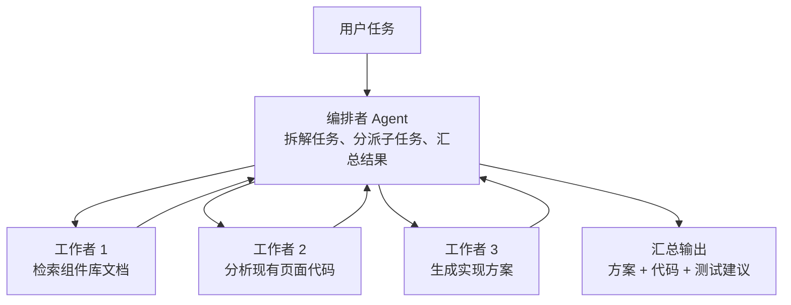
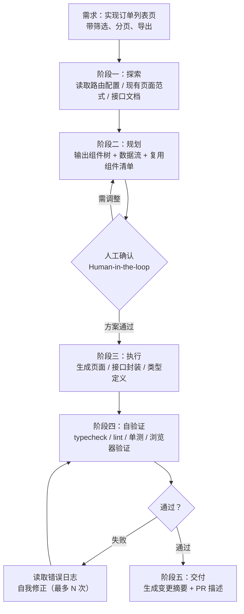

# MCP 协议与 Agent 工作流

> 模块：11-ai-assisted（AI 辅助前端开发）
> 知识点：MCP 协议、MCP Server 开发、Agent 工作流、ReAct、多 Agent 协作、AI 前端生成工具、RAG 前端落地
> 前置知识：[01-AI编程工具与工作流](./01-AI编程工具与工作流.md)、[02-Prompt工程与代码生成](./02-Prompt工程与代码生成.md)

---

## 本文目录

- [一、核心概念](#一核心概念)
- [二、底层原理](#二底层原理)
- [三、实战应用](#三实战应用)
- [四、常见面试题](#四常见面试题)
- [五、避坑指南](#五避坑指南)
- [六、本章学习自检](#六本章学习自检)

---

## 一、核心概念

前几章解决的是"怎么用好 AI 编程工具"，本章解决的是"**怎么让 AI 接入你的工程体系**"。这两件事的差别，类似"会用浏览器"和"会写浏览器扩展"。

**核心概念要点：**

1. **MCP 是 AI 与外部世界之间的标准接口**：它把"工具 / 数据 / 提示词模板"的提供方与消费方解耦，任何 Host（IDE、CLI、桌面应用）都能接入任何 Server，无需为每个 Host 单独适配
2. **Agent 工作流是"让模型自主多步完成任务"的工程方法**：ReAct 用推理-行动循环逐步逼近目标，Plan-and-Execute 先规划再执行，多 Agent 用编排者-工作者模式拆分复杂任务
3. **上下文是 Agent 的稀缺资源**：上下文管理的核心手段是压缩、外部记忆、子 Agent 上下文隔离、按需检索
4. **AI 前端生成工具的能力边界清晰**：v0 / Bolt / Lovable 擅长从零生成标准 UI，但不了解你的内部设计系统与业务约束，正确用法是"原型验证"而非"直接产出生产代码"
5. **RAG 解决的是"模型不知道你的私有知识"**：检索增强生成把外部知识注入上下文，前端需要处理检索结果的消费与流式输出的渲染

---

## 二、底层原理

### 2.1 MCP 协议定位与三层架构

**MCP（Model Context Protocol）** 是 Anthropic 于 2024 年 11 月开源的开放协议，用于标准化"大模型应用如何连接外部工具与数据源"。它基于 **JSON-RPC 2.0**，定义了消息格式、生命周期、能力协商与传输方式。

**它解决什么问题**：在 MCP 出现之前，每个 AI 应用要接入"数据库 / 设计稿 / 接口文档 / 浏览器"都需要单独开发适配层，M 个应用 × N 个数据源 = M × N 份集成代码。MCP 把这件事变成 M + N：数据源实现一次 MCP Server，所有 Host 都能用。

**三层架构**：

```
Host（宿主应用：Claude Desktop / Claude Code / IDE / 自研 AI 应用）
  └── Client（协议客户端，与 Server 一对一连接）
        ↕  JSON-RPC 2.0（stdio / Streamable HTTP）
      Server（能力提供方：暴露 Tools / Resources / Prompts）
```

| 角色 | 职责 | 关键点 |
|------|------|--------|
| **Host** | 运行大模型、管理会话、决定何时调用工具、向用户展示结果 | 一个 Host 可创建多个 Client |
| **Client** | 与 Server 建立并维护连接、发送请求、接收通知 | 与 Server **一对一**，负责能力协商与生命周期 |
| **Server** | 暴露工具、资源、提示词模板，执行业务逻辑并返回结果 | 可以是本地进程（stdio）或远程服务（HTTP） |

> **注意**：Host 与 Client 通常由同一个应用实现（如 Claude Desktop 内部就实现了 Host 与 Client 两层），面试中说明"Client 是协议连接器"即可，不必强行区分为两个独立进程。

### 2.2 MCP 三大能力：Tools / Resources / Prompts

MCP Server 可以暴露三类能力，**三者的关键差别在于"谁来决定使用"**：

| 能力 | 谁决定使用 | 语义 | 前端开发中的例子 |
|------|-----------|------|-----------------|
| **Tools** | **模型**决定（model-controlled） | 可执行的动作，有副作用 | 读取设计稿、查询接口文档、执行浏览器自动化、创建 Issue |
| **Resources** | **应用**决定（application-controlled） | 只读的上下文数据，无副作用 | 组件库 API 文档、设计令牌 JSON、数据库表结构 |
| **Prompts** | **用户**决定（user-controlled） | 预置的提示词模板，需显式触发 | "审查组件可访问性"、"按设计稿生成页面" |

**这个分类是高频考点**。判断标准是"调用由谁发起"：

- 模型自主判断"我需要查一下接口文档" → 这是 Tool
- 应用根据用户当前打开的文件，自动把相关文档塞进上下文 → 这是 Resource
- 用户在界面上点了一个"生成单测"的按钮 → 这是 Prompt

除了 Server 侧的三类能力，协议还定义了 Client 侧的能力（了解即可）：**Sampling**（Server 反向请求 Host 调用模型）、**Roots**（Host 告知 Server 可访问的文件范围）、**Elicitation**（Server 请求 Host 向用户补充信息）。

### 2.3 MCP 传输方式

| 传输 | 通信方式 | 适用场景 | 状态 |
|------|---------|---------|------|
| **stdio** | 标准输入 / 输出，Server 作为子进程启动 | 本地工具（文件系统、Git、本地数据库） | 现行标准，最常用 |
| **HTTP + SSE** | 两个端点：POST 发请求、SSE 收流 | 远程 Server | 已被 Streamable HTTP 取代（2025-03-26 起） |
| **Streamable HTTP** | 单端点，POST 发请求、可选升级为 SSE 流 | 远程 Server、需要鉴权与多客户端 | 现行标准 |

**stdio 的工作方式**：Host 用 `command` + `args` 启动 Server 子进程，通过 stdin / stdout 交换 JSON-RPC 消息，Server 的日志必须写到 stderr（写 stdout 会污染协议消息）。

**Streamable HTTP 的关键设计**：只有一个端点（如 `/mcp`），客户端用 POST 发送请求；服务端可以选择直接返回 JSON，也可以升级为 SSE 流式返回（用于长任务或流式输出）；会话通过 `Mcp-Session-Id` 响应头维护，客户端后续请求需回传该头。

```json
// 本地 stdio Server 的接入配置（Claude Desktop 的 claude_desktop_config.json）
{
  "mcpServers": {
    "design-tokens": {
      "command": "node",
      "args": ["D:/mcp/design-token-server/dist/server.js"],
      "env": { "TOKEN_API": "https://internal.example.com/tokens" }
    }
  }
}
```

```bash
# Claude Code 中添加 MCP Server
claude mcp add design-tokens -- node D:/mcp/design-token-server/dist/server.js
```

> **路径注意**：Windows 下 `claude_desktop_config.json` 位于 `%APPDATA%\Claude\`，macOS 下位于 `~/Library/Application Support/Claude/`。

### 2.4 MCP 与 Function Calling 的区别

这是本章最容易答错的题。**两者不是替代关系，而是不同层次的东西**：

| 维度 | Function Calling | MCP |
|------|-----------------|-----|
| 层次 | **模型能力**（模型输出结构化调用） | **通信协议**（标准化工具与上下文的接入） |
| 定义位置 | 写在每次 API 请求的 `tools` 参数里 | 由独立的 Server 进程 / 服务暴露 |
| 谁执行 | 调用方应用自己执行并回填结果 | Server 执行，Host 通过协议获取结果 |
| 复用性 | 每个应用各自集成，无法跨应用复用 | 一次实现，任何 Host 都能接入 |
| 包含内容 | 只有函数签名与参数 | 工具 + 资源 + 提示词 + 生命周期 + 能力协商 + 传输 + 鉴权 |
| 厂商绑定 | 与各家的 API 格式绑定 | 开放标准，跨厂商跨应用 |

**两者的关系**：Host 会把 MCP Server 暴露的 Tools **转换成模型的 Function Calling schema**，模型仍然通过 Function Calling 输出调用意图，Host 再把意图转成 MCP 请求发给 Server。

```
用户提问 → 模型推理 → 输出 Function Call（tool name + args）
         → Host 把 Function Call 翻译为 MCP tools/call 请求
         → MCP Server 执行 → 返回结果
         → Host 把结果回填为 tool 消息 → 模型继续推理
```

一句话总结：**Function Calling 解决"模型怎么表达要调用什么"，MCP 解决"工具从哪里来、怎么统一接入"**。

### 2.5 Agent 工作流：ReAct / Plan-and-Execute / 多 Agent

#### ReAct 模式（推理-行动循环）

ReAct（Reasoning + Acting）的核心是让模型在"思考"与"行动"之间交替，每轮行动的结果作为下一轮思考的输入：

```
Thought（分析现状、决定下一步）
  → Action（调用工具）
  → Observation（工具返回结果）
  → Thought（基于新信息重新分析）→ Action → Observation → …
  → Final Answer（任务完成）
```

```typescript
// Agent 主循环（ReAct 的工程化骨架）
async function runAgent(userInput: string, maxSteps = 10) {
  const messages = [{ role: 'user', content: userInput }]

  for (let step = 0; step < maxSteps; step++) {
    // 1. 推理：模型输出最终答案，或输出工具调用意图
    const res = await llm.chat({ messages, tools })

    if (res.finishReason === 'stop') return res.content   // 无工具调用，任务结束
    if (res.finishReason === 'length') break              // 上下文超限，需压缩或终止

    // 2. 行动：执行模型请求的工具（无依赖的调用可并行）
    const results = await Promise.all(res.toolCalls.map(executeTool))

    // 3. 观察：把工具结果回填为下一轮上下文
    messages.push(res.message)
    for (const r of results) {
      messages.push({ role: 'tool', toolCallId: r.id, content: r.output })
    }
  }
  // 必须有步数上限，否则模型可能陷入"调用-失败-再调用"的死循环
  throw new Error('超过最大步数，任务未完成')
}
```

**ReAct 的工程要点**：

| 要点 | 做法 | 原因 |
|------|------|------|
| 步数上限 | `maxSteps`（通常 8-15） | 防止死循环与成本失控 |
| 工具结果截断 | 单次工具返回超长时截断并附提示 | 工具输出会占用上下文，长日志可能一次吃掉整个窗口 |
| 失败反馈 | 把错误信息作为 Observation 回填，让模型自我修正 | 直接抛错会让 Agent 无法自愈 |
| 并行调用 | 无依赖的工具调用并行执行 | 串行会显著拉长任务耗时 |

#### Plan-and-Execute 模式

ReAct 是"走一步看一步"，Plan-and-Execute 是"先出计划再执行"：

```
Planner（模型）：把任务拆解为有序的步骤列表
   ↓
Executor（模型或确定性代码）：逐步执行，每步可用工具
   ↓
Replanner（模型）：根据执行结果判断计划是否需要调整
```

| 维度 | ReAct | Plan-and-Execute |
|------|-------|-----------------|
| 决策时机 | 每步都重新决策 | 先规划全局，再逐步执行 |
| 适合任务 | 步骤不确定、需要探索 | 步骤可预判、任务较长 |
| Token 消耗 | 较高（每步都要带完整历史推理） | 较低（执行阶段按计划走） |
| 风险 | 容易在局部打转 | 计划一旦错误，后续全错（需 Replanner 兜底） |

#### 多 Agent 协作：编排者-工作者模式

复杂任务可以拆给多个 Agent，最常用的是**编排者-工作者（Orchestrator-Worker）**：



**多 Agent 的核心收益不是"更强"，而是"上下文隔离"**：每个工作者只看到自己子任务相关的上下文，避免单个 Agent 的上下文被无关信息撑爆。

| 模式 | 结构 | 适用场景 |
|------|------|---------|
| 编排者-工作者 | 中心 Agent 分派与汇总 | 可并行拆解的检索 / 分析类任务 |
| 顺序流水线 | A 的输出是 B 的输入 | 生成 → 审查 → 修复 |
| 层级式 | 编排者下还有子编排者 | 超大型任务（通常过度设计） |
| 对抗式 | 两个 Agent 互相审查 | 代码审查、方案挑刺 |

**代价**：多 Agent 的 Token 消耗通常是单 Agent 的 3-10 倍，且调试难度显著上升。**能用单 Agent 加好工具解决的任务，不要上多 Agent**。

### 2.6 工具调用（Tool Use）的设计要点

工具设计的质量直接决定 Agent 的可靠性。**工具描述就是 Prompt**：

```typescript
// 好的工具定义：命名清晰、描述具体、参数最小、有边界说明
server.registerTool(
  'search_components',
  {
    title: '搜索组件库',
    description:
      '在内部组件库中按关键词搜索组件，返回组件名、描述与文档链接。' +
      '当需要确认"项目中是否已有可复用组件"时使用。' +
      '不返回组件的完整 API，需要 API 细节时请改用 get_component_api。',
    inputSchema: {
      keyword: z.string().describe('搜索关键词，如 "表格"、"日期选择"'),
      limit: z.number().int().min(1).max(20).default(5).describe('返回条数，默认 5'),
    },
  },
  async ({ keyword, limit }) => {
    const list = await componentApi.search(keyword, limit)
    // 返回结构化的紧凑结果，避免把整个文档塞进上下文
    return { content: [{ type: 'text', text: JSON.stringify(list) }] }
  }
)
```

| 设计要点 | 反例 | 正确做法 |
|---------|------|---------|
| 命名语义化 | `doThing` / `handler2` | `search_components` / `get_component_api` |
| 描述写清"何时用" | 只写"搜索组件" | 补充使用时机、返回内容边界、与相似工具的区别 |
| 参数最小化 | 一个工具接受 12 个可选参数 | 拆成多个职责单一的工具 |
| 参数有类型与约束 | `limit: string` | `z.number().int().min(1).max(20)` |
| 返回紧凑结构化 | 返回 5000 行原始 HTML | 返回关键字段的 JSON，或返回摘要 + 分页参数 |
| 错误信息可行动 | `"Error"` | `"未找到关键词为 xxx 的组件，可尝试更宽泛的关键词，如 '表格' 而非 '可编辑表格 v2'"` |
| 副作用要幂等或显式 | 重试导致重复创建 | 读操作天然幂等；写操作需带幂等键或要求确认 |

### 2.7 上下文管理与压缩

Agent 的上下文是稀缺资源。四类核心手段：

| 手段 | 做法 | 适用场景 |
|------|------|---------|
| **压缩（Compaction）** | 接近窗口上限时，让模型总结历史并重建上下文 | 长对话、长任务 |
| **外部记忆（Note-taking）** | 把关键信息写入文件 / 数据库，需要时再检索 | 跨会话任务、大型重构 |
| **子 Agent 隔离** | 子任务交给独立 Agent，只把结论回传 | 检索类、分析类子任务 |
| **按需检索（JIT）** | 不预先塞入全部文档，用工具按需拉取 | 知识库问答、代码库理解 |

```typescript
// 上下文压缩：接近阈值时总结历史并重建
async function compactIfNeeded(messages: Message[], tokenLimit: number) {
  if (estimateTokens(messages) < tokenLimit * 0.8) return messages

  // 只压缩早期历史，保留最近若干轮与当前任务描述
  const recent = messages.slice(-6)
  const earlier = messages.slice(0, -6)

  const summary = await llm.chat([{
    role: 'user',
    content: '请总结以下对话，保留：已完成的工作、关键决策与理由、待办事项、重要文件路径。' +
             '省略寒暄与重复内容。\n\n' + serialize(earlier),
  }])

  return [
    { role: 'user', content: `【历史摘要】\n${summary}` },
    ...recent,
  ]
}
```

> **压缩的两个风险**：① 摘要会丢失细节，压缩后可能遗忘关键约束（如"不要修改 XX 文件"），需在摘要 Prompt 中明确要求保留；② 压缩本身要消耗一次模型调用，过于频繁会显著增加成本。

### 2.8 RAG 的基本流程

**RAG（Retrieval-Augmented Generation，检索增强生成）** 解决的是"模型不知道你的私有知识"：

```
离线阶段（索引）
  文档加载 → 切分（chunking）→ 向量化（embedding）→ 存入向量库

在线阶段（查询）
  用户问题 → 向量化 → 相似度检索 top-k → 重排（rerank）
          → 与问题一起拼装 Prompt → 模型生成 → 流式返回
```

| 环节 | 关键决策 | 常见做法 |
|------|---------|---------|
| 切分（Chunking） | 块大小与重叠 | 按语义边界切（标题 / 段落），块大小 300-800 token，重叠 10-20% |
| 向量化（Embedding） | 模型选择 | 中文场景选多语言模型；文档量大时用轻量模型降本 |
| 存储 | 向量库选择 | pgvector（已有 Postgres 时最省事）、Milvus、Qdrant、Chroma |
| 检索 | 纯向量 vs 混合检索 | 混合检索（BM25 关键词 + 向量）对专有名词效果更好 |
| 重排（Rerank） | 是否加 rerank | 先召回 top-50，再用 rerank 模型精选 top-5，显著提升准确率 |
| 生成 | 是否要求引用 | 要求模型标注来源片段，便于验证与追溯 |

**RAG 与微调（Fine-tuning）的选择**：

| 维度 | RAG | 微调 |
|------|-----|------|
| 解决什么 | 模型不知道的事实性知识 | 模型的输出风格与格式偏好 |
| 更新成本 | 低（更新索引即可） | 高（需重新训练） |
| 可溯源 | 可以（返回引用片段） | 不能 |
| 适合场景 | 内部文档问答、组件库检索 | 固定的输出格式、特定领域语气 |

> **实践中的结论**：知识类需求优先用 RAG，风格类需求才考虑微调；两者可以叠加。

---

## 三、实战应用

### 3.1 手写一个前端开发用的 MCP Server

**场景**：让 AI 编程助手能查询公司内部组件库的组件列表与 API 文档，避免它凭空编造组件名与 Props。

```typescript
// server.ts —— 基于官方 TypeScript SDK 的最小实现
// 依赖：@modelcontextprotocol/sdk、zod
import { McpServer } from '@modelcontextprotocol/sdk/server/mcp.js'
import { StdioServerTransport } from '@modelcontextprotocol/sdk/server/stdio.js'
import { z } from 'zod'

const server = new McpServer({ name: 'internal-design-system', version: '1.0.0' })

// ---------- 能力一：Tools（模型自主调用） ----------
server.registerTool(
  'search_components',
  {
    title: '搜索组件库',
    description: '按关键词搜索内部组件库，返回组件名与描述。确认"是否已有可复用组件"时使用。',
    inputSchema: { keyword: z.string().describe('关键词，如 "表格"'), limit: z.number().int().min(1).max(20).default(5) },
  },
  async ({ keyword, limit }) => {
    const list = await componentApi.search(keyword, limit)
    return { content: [{ type: 'text', text: JSON.stringify(list) }] }
  }
)

server.registerTool(
  'get_component_api',
  {
    title: '获取组件 API',
    description: '返回指定组件的完整 Props / Events / Slots 文档。需要写具体用法时使用。',
    inputSchema: { name: z.string().describe('组件名，如 "MdTable"') },
  },
  async ({ name }) => {
    const doc = await componentApi.getDoc(name)
    if (!doc) {
      // 错误信息要可行动，引导模型换一种尝试方式
      return { isError: true, content: [{ type: 'text', text: `未找到组件 ${name}，请先用 search_components 确认组件名` }] }
    }
    return { content: [{ type: 'text', text: doc }] }
  }
)

// ---------- 能力二：Resources（应用决定注入） ----------
server.registerResource(
  'design-tokens',
  'design://tokens/light',
  { title: '设计令牌（亮色）', mimeType: 'application/json' },
  async (uri) => ({
    contents: [{ uri: uri.href, text: JSON.stringify(await loadTokens('light')) }],
  })
)

// ---------- 能力三：Prompts（用户显式触发） ----------
server.registerPrompt(
  'review-component',
  { title: '审查组件', argsSchema: { file: z.string() } },
  ({ file }) => ({
    messages: [{
      role: 'user',
      content: { type: 'text', text: `请审查 ${file}：重点检查无障碍属性、事件清理、样式隔离与 Props 类型完整性。` },
    }],
  })
)

// 本地 Server 使用 stdio 传输；日志必须写 stderr，写 stdout 会污染协议消息
const transport = new StdioServerTransport()
await server.connect(transport)
console.error('[mcp] design-system server started')   // 注意：stderr
```

```json
// package.json 中的构建与调试
{
  "type": "module",
  "bin": { "design-system-mcp": "dist/server.js" },
  "scripts": {
    "build": "tsc",
    "inspect": "npx @modelcontextprotocol/inspector node dist/server.js"
  }
}
```

**远程部署用 Streamable HTTP**（单端点、可鉴权、支持多客户端）：

```typescript
import { StreamableHTTPServerTransport } from '@modelcontextprotocol/sdk/server/streamableHttp.js'

// 每个会话一个 transport 实例，用 Mcp-Session-Id 关联（此处为骨架示意）
const transport = new StreamableHTTPServerTransport({
  sessionIdGenerator: () => randomUUID(),
  enableJsonResponse: false,          // true 时直接返回 JSON，false 时用 SSE 流式返回
})
await server.connect(transport)
// 在 HTTP 处理函数中把请求交给 transport.handleRequest(req, res, body)
```

**开发调试工具**：官方提供 `@modelcontextprotocol/inspector`，可以可视化查看 Server 暴露的工具列表、手动传参调用、查看原始 JSON-RPC 消息——写 MCP Server 时几乎是必备工具。

### 3.2 MCP 在前端开发中的实际应用

| 接入对象 | 能力类型 | 具体价值 |
|---------|---------|---------|
| **设计稿（Figma）** | Tools + Resources | 读取图层结构、设计令牌、间距与字号，生成 1:1 还原的样式代码 |
| **接口文档（Swagger / OpenAPI）** | Resources | 把接口定义注入上下文，生成的请求代码不会编造字段名 |
| **数据库 Schema** | Resources | 读取表结构与字段注释，生成类型定义与 Mock 数据 |
| **组件库** | Tools + Resources | 查询组件列表与 API，避免编造组件名与 Props（见 3.1） |
| **浏览器自动化** | Tools | 让 Agent 自己打开页面、截图、读控制台错误、验证修复效果 |
| **CI / 流水线** | Tools | 触发构建、读取失败日志、拉取产物 |
| **错误监控（Sentry 等）** | Tools | 按条件查询线上错误，定位具体堆栈与影响版本 |

**浏览器自动化的价值最容易被低估**：有了它，Agent 形成"改代码 → 打开页面 → 读控制台报错 → 继续改"的闭环，而不是"改完就宣称完成"。这是 Agent 从"能写代码"到"能验证代码"的关键一步。

```json
// 一个较完整的前端开发 MCP 配置示例（claude_desktop_config.json）
{
  "mcpServers": {
    "design-system": { "command": "node", "args": ["D:/mcp/design-system/dist/server.js"] },
    "figma": {
      "command": "npx",
      "args": ["-y", "figma-developer-mcp", "--figma-api-key=YOUR_KEY", "--stdio"]
    },
    "openapi": { "command": "npx", "args": ["-y", "openapi-mcp-server", "D:/api/openapi.json"] },
    "browser": { "command": "npx", "args": ["-y", "@playwright/mcp@latest"] }
  }
}
```

> **安全提醒**：MCP Server 是**以你的身份执行操作**的进程。接入数据库、生产接口、CI 触发类工具时，必须限定只读权限或走审批，避免 Agent 误操作造成不可逆后果。

### 3.3 Agent 工作流在前端开发中的落地

**场景**：把"实现一个带筛选的列表页"这种中等规模任务交给 Agent 自主完成。



**每个阶段的工程要点**：

| 阶段 | 关键做法 | 反面案例 |
|------|---------|---------|
| 探索 | 先用工具读现有代码范式，禁止凭空设计 | 直接开始写代码，产出与项目风格完全不一致 |
| 规划 | 输出可检查的方案（组件树、数据流、复用清单） | 跳过规划，一次生成 500 行代码 |
| 人工确认 | 在"不可逆 / 影响面大"的决策点设审批门 | 全自动执行到 PR，人只看结果 |
| 执行 | 分步生成 + 每步验证，而非一次性输出 | 一次性生成整个模块 |
| 自验证 | 跑 `typecheck` / `lint` / `test`，用浏览器工具验证 | 声称"已完成"但没运行过任何验证 |
| 修正 | 把错误日志作为 Observation 回填，限定重试次数 | 无限重试或直接放弃 |

**Human-in-the-loop（HITL）的三种介入点**：

| 介入点 | 触发条件 | 实现方式 |
|-------|---------|---------|
| 方案审批 | 任务开始前的规划阶段 | Agent 输出方案后暂停，等待用户确认 |
| 危险操作确认 | 删除文件、执行数据库写操作、`git push`、发布 | 工具调用前拦截并要求显式批准 |
| 异常升级 | 重试 N 次仍失败、涉及安全 / 支付 / 权限逻辑 | 停止执行并上报，交人工处理 |

```typescript
// 危险操作拦截：在工具执行前加审批门
async function executeToolWithApproval(call: ToolCall) {
  if (DANGEROUS_TOOLS.has(call.name)) {
    const approved = await requestUserApproval({
      tool: call.name,
      args: call.args,
      reason: '该操作会修改共享状态且不可逆',
    })
    if (!approved) return { isError: true, content: '用户拒绝了该操作，请改用只读方式或说明原因' }
  }
  return executeTool(call)
}
```

**失败重试与自我修正的边界**：重试必须**带上失败原因**才有意义——把错误信息作为 Observation 回填，模型才能换一种方式尝试；单纯重试同一个调用只会重复失败。

```typescript
// 带错误反馈的重试
for (let attempt = 0; attempt < 3; attempt++) {
  const res = await executeTool(call)
  if (!res.isError) return res
  // 关键：把错误信息追加到上下文，让模型有机会换方案
  messages.push({ role: 'tool', toolCallId: call.id, content: `执行失败（第 ${attempt + 1} 次）：${res.error}` })
}
// 超过上限：升级为 HITL，而不是继续硬试
```

### 3.4 AI 前端生成工具：v0 / Bolt / Lovable

**产品定位差异**：

| 产品 | 定位 | 技术特点 | 最擅长的输出 |
|------|------|---------|-------------|
| **v0**（Vercel） | UI 组件与页面生成 | 生成 React / Next.js + Tailwind + shadcn/ui；支持从截图或描述生成 | 单个页面 / 组件的高保真 UI，可直接复制进项目 |
| **Bolt**（StackBlitz） | 全栈项目脚手架 | 基于 WebContainers 在浏览器内跑 Node，能 `install` / `build` / 预览 | 从零搭一个可运行的全栈 Demo |
| **Lovable** | 对话式全栈应用生成 | 生成 React + 后端（如 Supabase），自动接入认证与数据库 | 带登录与数据持久化的完整小应用 |

**能力边界（面试时最需要讲清的部分）**：

| 能做得好 | 做不好 |
|---------|--------|
| 标准 UI 布局（表单、列表、卡片、图表） | 复杂业务状态机与领域逻辑 |
| 常见交互（弹窗、分页、筛选、表单校验） | 性能敏感的复杂渲染（虚拟滚动、大数据量图表） |
| 快速搭出可运行的 Demo | 无障碍、国际化、边界态（loading / error / empty） |
| 使用主流开源库的常见用法 | 使用公司内部组件库与私有工具函数 |

**产物质量与可维护性问题**：

| 问题 | 具体表现 | 处理方式 |
|------|---------|---------|
| 巨型单文件组件 | 一个文件 600 行，逻辑与视图混杂 | 按职责拆分为组件 + composable |
| 编造 API | 使用不存在的 Props 或已废弃的写法 | 用 ESLint 自定义规则 + 类型检查拦截 |
| 样式硬编码 | 颜色、间距写死，不引用设计令牌 | 替换为设计令牌与组件库 Props |
| 缺少边界态 | 只有"快乐路径"，没有 loading / error / empty | 补齐三种状态 + 错误重试 |
| 无测试 | 完全没有单测 | 用 AI 生成测试骨架，人工补边界用例 |
| 无障碍缺失 | 无 `aria-*`、键盘不可用 | 用审查 Prompt 或 axe 工具扫描 |

**在真实项目中的正确用法**：

```
原型验证（推荐）              生产代码（不推荐直接用）
├── 需求评审时快速出可点原型    ├── 直接合并 AI 生成的代码
├── 探索"这个交互怎么做"        ├── 假设它了解你的设计系统
├── 生成标准 CRUD 页面的骨架    ├── 依赖它的边界态处理
└── 学习某个库的常见写法        └── 不做代码审查
```

> **一句话原则**：**把 AI 生成工具当作"草稿生成器"而不是"代码交付方"**。它可以帮你跳过"从空白文件开始"的阶段，但架构决策、设计系统对齐、边界态处理、安全审查仍然必须由人完成。

### 3.5 RAG 在前端的落地

#### 3.5.1 组件库 / 文档的向量化检索

**场景**：让 AI 助手能回答"我们项目里表格组件怎么设置固定列"这类问题。

```
离线索引（CI 中定期执行）
  组件文档 Markdown → 按标题层级切分 → 向量化 → 写入向量库
  元数据：{ component, section, version, path }

在线查询（前端 → BFF → 向量库）
  用户问题 → 向量化 → 检索 top-k → rerank → 拼装 Prompt → 生成答案 + 引用
```

```typescript
// BFF 层：检索 + 生成（前端不直接持有向量库凭据）
app.post('/api/docs/ask', async (req, res) => {
  const { question } = req.body

  // 1. 混合检索：向量召回 + 关键词召回，兼顾语义与专有名词
  const [vectorHits, keywordHits] = await Promise.all([
    vectorStore.search(await embed(question), { topK: 30 }),
    keywordIndex.search(question, { topK: 20 }),
  ])

  // 2. 合并去重 + rerank，精选最相关的若干片段
  const merged = dedupe([...vectorHits, ...keywordHits])
  const top = await rerank(question, merged, { topK: 5 })

  // 3. 拼装 Prompt 时明确要求"只依据给定片段回答"
  const context = top.map((d, i) => `[${i + 1}] ${d.metadata.path}\n${d.text}`).join('\n\n')
  const stream = await llm.stream({
    messages: [{
      role: 'user',
      content: `只依据以下文档片段回答问题；片段中没有的内容请明确说明"文档中未提及"，不要编造。\n\n${context}\n\n问题：${question}`,
    }],
  })

  // 4. 流式返回给前端，同时把引用来源放进自定义事件
  res.setHeader('Content-Type', 'text/event-stream')
  for await (const chunk of stream) {
    res.write(`data: ${JSON.stringify({ delta: chunk.text })}\n\n`)
  }
  res.write(`data: ${JSON.stringify({ sources: top.map((d) => d.metadata) })}\n\n`)
  res.write('data: [DONE]\n\n')
  res.end()
})
```

#### 3.5.2 前端如何消费 RAG 结果：流式输出渲染

**流式输出的三种技术选择**：

| 方案 | 原理 | 适用场景 | 限制 |
|------|------|---------|------|
| `EventSource` | 浏览器原生 SSE 客户端 | 简单的 GET 流式接口 | 只支持 GET，无法传复杂 Body 与自定义头 |
| `fetch` + `ReadableStream` | 手动读取响应流并解析 SSE | **推荐**，支持 POST / 自定义头 / 取消 | 需要自己处理分片边界 |
| WebSocket | 全双工 | 需要双向交互（如中途打断并追问） | 服务端与网关改造成本高 |

```typescript
// 前端消费流式响应（fetch + ReadableStream，推荐方案）
async function streamAsk(question: string, onDelta: (t: string) => void, onSources: (s: any[]) => void) {
  const controller = new AbortController()   // 支持用户取消

  const res = await fetch('/api/docs/ask', {
    method: 'POST',
    headers: { 'Content-Type': 'application/json' },
    body: JSON.stringify({ question }),
    signal: controller.signal,
  })

  const reader = res.body!.getReader()
  const decoder = new TextDecoder()
  let buffer = ''                            // 关键：缓存不完整的分片

  while (true) {
    const { done, value } = await reader.read()
    if (done) break

    // stream: true 表示这是分片解码，避免多字节字符被截断
    buffer += decoder.decode(value, { stream: true })

    // SSE 以空行分隔事件块；最后一个元素可能是"半个事件"，留在 buffer 中
    const blocks = buffer.split('\n\n')
    buffer = blocks.pop() ?? ''

    for (const block of blocks) {
      const line = block.split('\n').find((l) => l.startsWith('data:'))
      if (!line) continue
      const data = line.slice(5).trim()
      if (data === '[DONE]') return

      const parsed = JSON.parse(data)
      if (parsed.delta) onDelta(parsed.delta)
      if (parsed.sources) onSources(parsed.sources)
    }
  }

  return controller    // 暴露出去以便组件卸载时 abort()
}
```

**渲染层要处理的三件事**：

```typescript
// 1. 节流渲染：token 到达频率远高于帧率，逐条触发响应式更新会卡顿
const pending = ref('')
let rafId: number | undefined

function onDelta(text: string) {
  pending.value += text
  if (rafId) return
  rafId = requestAnimationFrame(() => {
    rendered.value += pending.value      // 每帧最多更新一次
    pending.value = ''
    rafId = undefined
  })
}

// 2. 卸载时取消请求，避免回调写入已销毁组件
onBeforeUnmount(() => {
  controller?.abort()
  if (rafId) cancelAnimationFrame(rafId)
})

// 3. 增量 Markdown 渲染：流式过程中可能只有"半个代码块"，需容错
//    常见做法：未闭合的 ``` 自动补全后再交给 marked 渲染，或流式期间用纯文本、结束后再渲染 Markdown
```

#### 3.5.3 成本与延迟优化

| 优化方向 | 手段 | 收益 |
|---------|------|------|
| 检索成本 | 缓存 query → embedding 结果；文档变更时才重新索引 | 避免重复向量化 |
| 检索质量 | 混合检索（BM25 + 向量）+ rerank | 专有名词与语义查询兼顾，准确率显著提升 |
| 上下文成本 | 控制 chunk 大小与 top-k；只传必要片段 | 直接减少输入 token |
| 生成延迟 | 流式输出（首 token 时间远小于总时长） | 用户感知延迟大幅下降 |
| 生成成本 | 简单问题走小模型，复杂问题才路由到大模型 | 成本可降一半以上 |
| 重复问题 | 语义缓存（相似问题直接命中缓存答案） | 高频问题的响应与成本都大幅优化 |
| Prompt 缓存 | 利用厂商的 prompt caching 缓存固定的系统提示与长文档 | 重复前缀部分不计费或大幅折扣 |

> **首 token 延迟（TTFT）比总时长更重要**：用户对"开始有响应"的感知远强于"全部输出完"。因此即使总生成时间不变，流式输出也能显著改善体验。

---

## 四、常见面试题

### 1. MCP 是什么？它的三层架构和三大能力分别是什么？（★★★）

**MCP（Model Context Protocol）** 是 Anthropic 开源的开放协议，基于 JSON-RPC 2.0，用于标准化大模型应用连接外部工具与数据源。它解决的是"M 个应用 × N 个数据源"的集成爆炸问题，把 M×N 变成 M+N。

**三层架构**：**Host**（宿主应用，运行模型、管理会话、决定何时调用工具）、**Client**（协议连接器，与 Server 一对一，负责能力协商与生命周期）、**Server**（能力提供方，执行业务逻辑）。

**三大能力**，区分标准是"**谁决定使用**"：

| 能力 | 决定方 | 语义 | 例子 |
|------|-------|------|------|
| Tools | 模型 | 可执行动作，有副作用 | 查询接口文档、浏览器自动化 |
| Resources | 应用 | 只读上下文，无副作用 | 组件库 API 文档、设计令牌 |
| Prompts | 用户 | 预置提示词模板 | "审查组件可访问性" |

**追问：Client 和 Server 是一对一还是多对多？**
Client 与 Server 是**一对一**；一个 Host 可以创建多个 Client，因此一个 Host 能同时连接多个 Server。

**追问：传输方式有哪些？**
stdio（本地子进程，最常用）、Streamable HTTP（远程，单端点，支持 SSE 升级与会话管理）。早期的 HTTP+SSE 双端点方案已被 Streamable HTTP 取代。

---

### 2. MCP 和 Function Calling 有什么区别？（★★★）

**两者不在同一层次**：Function Calling 是**模型能力**（模型输出结构化的调用意图），MCP 是**通信协议**（标准化工具与上下文的接入方式）。

| 维度 | Function Calling | MCP |
|------|-----------------|-----|
| 定义位置 | 每次 API 请求的 `tools` 参数 | 独立的 Server 进程 / 服务 |
| 谁执行 | 调用方应用自己执行并回填 | Server 执行，Host 通过协议获取结果 |
| 复用性 | 每个应用各自集成 | 一次实现，任何 Host 可接入 |
| 包含内容 | 仅函数签名与参数 | 工具 + 资源 + 提示词 + 生命周期 + 能力协商 + 传输 + 鉴权 |

**它们如何配合**：Host 把 MCP Server 暴露的 Tools 转换为模型的 Function Calling schema；模型通过 Function Calling 输出调用意图，Host 再把意图翻译为 MCP 的 `tools/call` 请求发给 Server，最后把结果回填为 tool 消息。

**一句话总结**：Function Calling 解决"模型怎么表达要调用什么"，MCP 解决"工具从哪里来、怎么统一接入"。

---

### 3. ReAct 模式和 Plan-and-Execute 模式有什么区别？各自适合什么场景？（★★★）

**ReAct** 是"推理-行动循环"：每轮 `Thought → Action → Observation`，根据观察结果重新推理下一步。适合步骤不确定、需要探索的任务。

**Plan-and-Execute** 是"先规划再执行"：Planner 输出有序步骤列表，Executor 逐步执行，Replanner 根据结果调整计划。适合步骤可预判、任务较长的场景。

| 维度 | ReAct | Plan-and-Execute |
|------|-------|-----------------|
| 决策时机 | 每步重新决策 | 先规划全局，再逐步执行 |
| Token 消耗 | 较高（每步带完整历史） | 较低（执行阶段按计划走） |
| 风险 | 容易在局部打转 | 计划错误会全错（需 Replanner 兜底） |

**追问：ReAct 循环为什么必须设步数上限？**
模型可能陷入"调用工具 → 失败 → 再次调用同一工具"的死循环，导致成本失控与任务永不终止。工程上通常设 `maxSteps` 8-15，超限后升级为 Human-in-the-loop 而非继续硬试。

**追问：工具执行失败时应该怎么做？**
把错误信息作为 Observation 回填到上下文，让模型有机会换一种方案尝试。直接抛错会让 Agent 无法自我修正；单纯重复同一个调用也只会重复失败。

---

### 4. 多 Agent 协作的编排者-工作者模式解决了什么问题？代价是什么？（★★）

**解决的核心问题是上下文隔离**：每个工作者只看到与自己子任务相关的上下文，避免单个 Agent 的上下文被无关信息撑爆。同时，可并行拆解的子任务能显著缩短总耗时。

| 模式 | 结构 | 适用场景 |
|------|------|---------|
| 编排者-工作者 | 中心 Agent 分派与汇总 | 可并行拆解的检索 / 分析任务 |
| 顺序流水线 | A 的输出是 B 的输入 | 生成 → 审查 → 修复 |
| 对抗式 | 两个 Agent 互相审查 | 代码审查、方案挑刺 |

**代价**：Token 消耗通常是单 Agent 的 3-10 倍；调试难度显著上升（一个错误可能来自编排者、工作者或它们之间的信息传递）；端到端延迟增加。

**实践原则**：**能用单 Agent 加好工具解决的任务，不要上多 Agent**。多 Agent 是"上下文隔离"的手段，不是"能力增强"的魔法。

---

### 5. Agent 的工具（Tool）设计有哪些要点？（★★★）

工具描述本身就是 Prompt，质量直接决定 Agent 的可靠性。

| 要点 | 反例 | 正确做法 |
|------|------|---------|
| 命名语义化 | `doThing` | `search_components` |
| 描述写清"何时用" | 只写"搜索组件" | 补充使用时机、返回内容边界、与相似工具的区别 |
| 参数最小化 | 12 个可选参数 | 拆成多个职责单一的工具 |
| 参数有约束 | `limit: string` | `z.number().int().min(1).max(20)` |
| 返回紧凑结构化 | 返回 5000 行原始 HTML | 返回关键字段 JSON 或摘要 + 分页 |
| 错误可行动 | `"Error"` | `"未找到 xxx 组件，请先用 search_components 确认组件名"` |
| 写操作要确认 | 直接删除数据 | 需幂等键或人工审批 |

**追问：为什么工具返回内容要紧凑？**
工具返回值会进入上下文并占用 token 预算。一次返回超长日志可能直接吃掉大部分窗口，导致模型丢失前面的推理与约束。工程上通常对工具输出做截断并附"已截断"提示。

---

### 6. Agent 的上下文管理有哪些手段？压缩有什么风险？（★★★）

**四类手段**：

| 手段 | 做法 | 适用场景 |
|------|------|---------|
| 压缩（Compaction） | 接近窗口上限时总结历史并重建上下文 | 长对话、长任务 |
| 外部记忆 | 关键信息写入文件 / 数据库，需要时检索 | 跨会话任务、大型重构 |
| 子 Agent 隔离 | 子任务交给独立 Agent，只回传结论 | 检索类、分析类子任务 |
| 按需检索（JIT） | 不预塞全部文档，用工具按需拉取 | 知识库问答、代码库理解 |

**压缩的两个风险**：① 摘要会丢失细节，压缩后可能遗忘关键约束（如"不要修改 XX 文件"），需要在摘要 Prompt 中明确要求保留"已完成工作、关键决策与理由、待办事项、重要文件路径"；② 压缩本身消耗一次模型调用，过于频繁会显著增加成本。

**追问：什么时候该开新会话而不是压缩？**
任务方向已经改变时应该直接开新会话。压缩保留的是"历史摘要"，而方向改变意味着历史本身就是干扰信息。

---

### 7. RAG 的完整流程是什么？和微调怎么选？（★★★）

**流程**：离线阶段做「文档加载 → 切分 → 向量化 → 存入向量库」；在线阶段做「问题向量化 → 相似度检索 top-k → rerank → 拼装 Prompt → 生成 → 流式返回」。

| 环节 | 关键决策 |
|------|---------|
| 切分 | 按语义边界切（标题 / 段落），块大小 300-800 token，重叠 10-20% |
| 向量化 | 中文场景选多语言模型；文档量大时用轻量模型降本 |
| 检索 | 混合检索（BM25 + 向量）对专有名词效果更好 |
| 重排 | 先召回 top-50，再用 rerank 精选 top-5，显著提升准确率 |
| 生成 | 要求模型标注来源片段，便于验证与追溯 |

**RAG vs 微调**：RAG 解决"模型不知道的事实性知识"，更新成本低（更新索引即可）、可溯源；微调解决"输出风格与格式偏好"，更新成本高、不可溯源。知识类需求优先 RAG，风格类需求才考虑微调，两者可叠加。

**追问：前端如何消费 RAG 的流式结果？**
推荐 `fetch` + `ReadableStream` 手动解析 SSE（支持 POST、自定义头、`AbortController` 取消）。关键细节是**用 buffer 缓存不完整的分片**，因为 SSE 事件块可能被 TCP 分片切断；同时用 `TextDecoder` 的 `stream: true` 避免多字节字符被截断。渲染层需用 `requestAnimationFrame` 节流，避免逐 token 触发响应式更新导致卡顿。

---

### 8. v0 / Bolt / Lovable 这类 AI 生成工具的定位差异与正确用法是什么？（★★）

**定位差异**：v0 专注 UI 组件与页面生成（React / Next.js + Tailwind + shadcn/ui，支持从截图生成）；Bolt 基于 WebContainers 在浏览器内跑 Node，擅长从零搭可运行的全栈 Demo；Lovable 是对话式全栈应用生成，自动接入认证与数据库。

**能力边界**：擅长标准 UI 布局、常见交互、快速搭 Demo；不擅长复杂业务状态机、性能敏感渲染、无障碍与边界态，也不了解公司内部组件库与私有工具。

**产物质量问题**：巨型单文件组件、编造 API、样式硬编码、缺少 loading / error / empty 三种状态、无测试、无障碍缺失。

**正确用法**：**当作"草稿生成器"而非"代码交付方"**。适合需求评审时快速出可点原型、探索交互方案、生成标准 CRUD 页面骨架、学习某个库的常见写法；不适合直接合并进生产代码。架构决策、设计系统对齐、边界态处理、安全审查必须由人完成。

---

## 五、避坑指南

| 常见错误 | 现象 | 原因 | 解决方案 |
|---------|------|------|---------|
| MCP Server 往 stdout 打日志 | 协议解析失败，连接异常断开 | stdio 传输下 stdout 是协议通道 | 所有日志写 stderr（`console.error`） |
| 把 MCP 说成"Function Calling 的替代品" | 面试失分 | 混淆了协议层次与模型能力 | 讲清 MCP 是协议、Function Calling 是模型能力，二者配合使用 |
| 混淆 Tools / Resources / Prompts | 能力设计错位 | 没有抓住"谁决定使用"这一区分标准 | 模型决定 → Tools；应用决定 → Resources；用户决定 → Prompts |
| 工具描述写得含糊 | Agent 频繁选错工具或传错参数 | 工具描述本身就是 Prompt | 描述中写明使用时机、返回边界、与相似工具的区别 |
| 工具返回超长内容 | 上下文被一次调用吃满，后续推理丢失约束 | 工具输出直接进上下文 | 返回关键字段的紧凑 JSON，超长时截断并附提示 |
| Agent 无步数上限 | 死循环，成本失控 | 缺少终止条件 | 设 `maxSteps`（8-15），超限升级为 HITL |
| 失败后直接抛错 | Agent 无法自我修正 | 错误信息没有回填上下文 | 把错误作为 Observation 回填，并在重试时附上失败原因 |
| 所有任务都上多 Agent | 成本翻数倍且难以调试 | 误以为多 Agent 等于更强 | 多 Agent 是"上下文隔离"手段；能用单 Agent 加好工具解决就不上 |
| 压缩后遗忘关键约束 | Agent 违反"不要修改 XX 文件"等要求 | 摘要 Prompt 未要求保留约束 | 在摘要 Prompt 中明确列出必须保留的内容（决策、待办、文件路径、禁忌） |
| 流式响应按 token 直接更新视图 | 页面卡顿、掉帧 | token 到达频率远高于帧率 | 用 `requestAnimationFrame` 节流，每帧最多更新一次 |
| SSE 解析不做 buffer | 偶发 JSON 解析错误 | 事件块被 TCP 分片切断 | 用 buffer 缓存不完整分片，按 `\n\n` 切分后把最后一段留回 buffer |
| `TextDecoder` 未用 `stream: true` | 中文出现乱码 | 多字节字符被分片截断 | `decoder.decode(value, { stream: true })` |
| 组件卸载未取消流式请求 | 回调写入已销毁组件，报错或内存泄漏 | 未使用 `AbortController` | 保存 controller，`onBeforeUnmount` 中 `abort()` |
| 让 RAG 自由发挥 | 答案编造文档中不存在的内容 | Prompt 未约束"只依据给定片段" | 明确要求"片段中没有的内容请说明文档未提及，不要编造"，并要求标注来源 |
| 只做向量检索 | 专有名词、组件名检索不到 | 纯向量检索对精确匹配不擅长 | 混合检索（BM25 + 向量）+ rerank |
| MCP Server 授予过宽权限 | Agent 误操作生产数据 | Server 以用户身份执行操作 | 限定只读权限；写操作走审批门（HITL） |
| 直接把 AI 生成代码合并 | 线上出现编造 API、样式错乱 | 生成工具不了解内部设计系统与业务约束 | 当作草稿：走代码审查、替换为设计令牌、补齐边界态与测试 |
| 在 Prompt 中塞入全部文档 | 成本高且模型抓不住重点 | 上下文不是越长越好 | 用 RAG 按需检索，只注入相关片段 |

---

## 六、本章学习自检

请逐项检查自己是否掌握了以下知识点：

- [ ] 我能说出 MCP 解决的核心问题（M×N → M+N），并画出 Host / Client / Server 三层架构
- [ ] 我能用"谁决定使用"这一标准区分 Tools / Resources / Prompts，并各举一个前端开发中的例子
- [ ] 我能说出 MCP 的三种传输方式，以及 Streamable HTTP 相对 HTTP+SSE 的改进
- [ ] 我能讲清 MCP 与 Function Calling 的层次差异，以及两者如何配合工作
- [ ] 我能基于官方 TypeScript SDK 写一个包含 Tools / Resources / Prompts 的 MCP Server，并知道日志必须写 stderr
- [ ] 我能说出 MCP 在前端开发中的至少 5 个落地场景（设计稿、接口文档、数据库、组件库、浏览器自动化）
- [ ] 我能讲清 ReAct 的 Thought → Action → Observation 循环，并说明步数上限与错误回填的必要性
- [ ] 我能对比 ReAct 与 Plan-and-Execute 的决策时机、Token 消耗与风险差异
- [ ] 我能画出编排者-工作者模式的结构，并说明它的收益（上下文隔离）与代价（成本、调试难度）
- [ ] 我能说出 Agent 工具设计的至少 6 个要点，并解释为什么工具返回内容要紧凑
- [ ] 我能说出上下文管理的四类手段（压缩、外部记忆、子 Agent 隔离、按需检索）与压缩的两个风险
- [ ] 我能说出 Human-in-the-loop 的三种介入点，并实现一个危险操作的审批门
- [ ] 我能说出 v0 / Bolt / Lovable 的定位差异，以及 AI 生成工具的能力边界与正确用法
- [ ] 我能完整描述 RAG 的离线索引与在线查询流程，并说明 RAG 与微调的适用场景差异
- [ ] 我能用 `fetch` + `ReadableStream` 正确消费 SSE 流（含 buffer 处理与 `stream: true`）
- [ ] 我理解流式渲染为什么要用 `requestAnimationFrame` 节流，以及组件卸载时如何取消请求

---

> **学习导航**：下一步阅读 [04-AI辅助开发笔面试题集](./04-AI辅助开发笔面试题集.md) 检验本章知识的掌握程度。

---

## 补充内容：Agent 与 MCP 的工程化落地检查清单

> 把 MCP Server 和 Agent 工作流从 Demo 推向可用，需要一套可复用的检查清单。本节把前面的要点整理成落地时的核对表。

### MCP Server 上线前检查清单

| 检查项 | 合格标准 | 不合格的后果 |
|-------|---------|-------------|
| 日志输出 | 全部写 stderr，stdout 只走协议消息 | 连接异常断开，且难以定位 |
| 工具描述 | 每个工具都写明"何时用、返回什么、与相似工具的区别" | Agent 频繁选错工具 |
| 参数校验 | 用 Zod 等 schema 声明类型与取值范围 | 非法参数直接打到下游服务 |
| 返回体积 | 单次返回有大小上限，超长内容截断并提示 | 一次调用吃满上下文 |
| 错误信息 | 错误描述可行动，包含"下一步建议" | Agent 无法自我修正 |
| 权限范围 | 只读优先；写操作需审批或幂等键 | Agent 误操作不可逆数据 |
| 超时与重试 | 下游调用有超时，重试有次数上限 | 请求堆积，Server 被拖死 |
| 调试工具 | 能用 `@modelcontextprotocol/inspector` 验证 | 出问题只能靠猜 |

### Agent 工作流设计检查清单

| 检查项 | 合格标准 |
|-------|---------|
| 终止条件 | 有 `maxSteps` 与"任务完成"的明确判定，不会无限循环 |
| 规划阶段 | 复杂任务先输出可检查的方案，而非直接生成代码 |
| 上下文预算 | 有 token 估算与压缩阈值，工具输出有截断策略 |
| 错误处理 | 失败信息回填上下文，重试附上失败原因，超限升级 HITL |
| 验证闭环 | 能运行 `typecheck` / `lint` / `test`，能通过浏览器工具验证页面 |
| 审批门 | 危险操作（删除、写库、发布、`git push`）执行前需人工批准 |
| 可观测性 | 记录每步的思考、工具调用、耗时与 token 消耗，便于复盘 |
| 交付物 | 输出变更摘要与验证结果，而不是只说"已完成" |

### 前端接入 AI 能力的架构分层

```
视图层      流式渲染、节流更新、取消请求、来源引用展示
   ↓
BFF 层      检索（混合检索 + rerank）、Prompt 拼装、模型调用、SSE 转发
   ↓            ↑
能力层      MCP Server（组件库 / 接口文档 / 设计稿 / 浏览器自动化）
   ↓
数据层      向量库、文档索引、设计令牌、组件元数据
```

**分层的关键原则**：**密钥与向量库凭据只放在 BFF 层，绝不下发到浏览器**；前端只负责发起请求、消费流式响应与渲染结果；MCP Server 作为能力层，让 AI 助手与业务应用共享同一套工具实现。

### 什么时候不该用这些技术

| 技术 | 不该用的场景 | 更简单的替代 |
|------|-------------|-------------|
| MCP | 只有一个应用会用到、且不需要跨工具复用 | 直接在应用内写 Function Calling |
| 多 Agent | 单 Agent 加好工具就能完成 | 单 Agent + 更好的工具与 Prompt |
| RAG | 知识量很小（能直接放进上下文） | 直接把文档写进系统提示 |
| 向量库 | 文档量在几百条以内 | 关键词检索或直接全量注入 |
| Agent 工作流 | 任务步骤固定且确定性强 | 用脚本 / CI 流水线固化流程 |

> **判断原则**：先问"**能不能用确定性代码解决**"。Agent 的价值在于处理"步骤不确定、需要探索"的任务；如果流程是固定的，用脚本比用 Agent 更便宜、更可靠、更容易调试。
