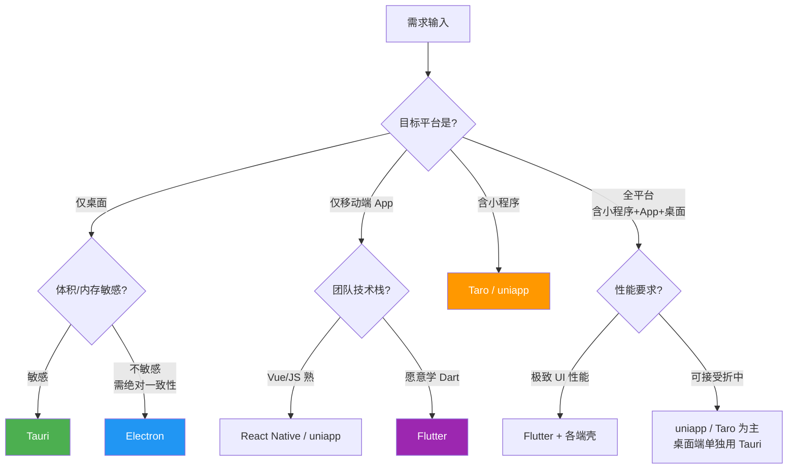

> 模块：12-cross-platform（拓展 跨端开发）
> 难度：★★★ 架构进阶
> 前置知识：uniapp 基础、HTML/CSS/JS 基础、Node.js 与 npm 基础

---

# 05-跨端方案选型与桌面端

---

## 一、核心概念

### 1.1 跨端方案的四大分类

"跨端"不是一种技术，而是一类问题的统称。按**渲染方式**这一最本质的维度，主流方案可划分为四类。

| 分类 | 代表方案 | 渲染方式 | 一句话概括 |
|---|---|---|---|
| **WebView 容器类** | uniapp、Cordova、Capacitor | 系统 WebView 或小程序渲染层 | 写 Web 代码，装进一个"壳"里运行 |
| **编译时转换类** | Taro、uniapp（小程序端） | 编译产物 + 平台原生组件 | 编译期把一套源码翻译成多端代码 |
| **原生渲染类** | React Native、Flutter | RN 映射原生组件、Flutter 自绘引擎 | 不依赖 WebView，直接操控原生渲染管线 |
| **桌面端类** | Electron、Tauri | 内置 Chromium / 系统 WebView | 用 Web 技术栈开发桌面应用 |

**分类的关键判据：**

1. **谁来绘制像素**——浏览器内核、系统 WebView、原生组件，还是框架自带的渲染引擎？
2. **跨端发生在什么时候**——编译期（转换类）还是运行期（容器类）？
3. **UI 与业务逻辑的边界在哪里**——逻辑是否完全用 JS 编写，UI 是否需要写原生代码？

> 分类之间并非互斥。uniapp 在小程序端是"编译时转换 + 平台原生组件"，在 App 端则是"WebView 容器 + 原生渲染"的混合体。

### 1.2 主流跨端方案对比矩阵

| 方案 | 技术栈 | 渲染方式 | 性能 | 包体积 | 生态成熟度 | 学习成本 | 适用场景 |
|---|---|---|---|---|---|---|---|
| **uniapp** | Vue 2/3 | WebView / 小程序渲染层 / nvue | 中（受 setData 限制） | 小（H5 几 MB，App 包 20MB 起） | 国内小程序生态极成熟 | 低（会 Vue 即可） | 小程序矩阵、国内 To C 业务、快速交付 |
| **Taro** | React / Vue | 编译产物 + 平台原生组件 | 中 | 小 | 国内小程序成熟，鸿蒙支持较好 | 低-中 | 多端小程序、需与 React 技术栈统一 |
| **React Native** | React + JS/TS | JS 驱动，映射为原生组件 | 高（接近原生，桥接为瓶颈） | 中 | 成熟，海外大厂广泛使用 | 中-高 | 需要原生体验的 iOS/Android 双端 App |
| **Flutter** | Dart | 自绘引擎（Skia / Impeller） | 极高 | 大（Android 包 10MB+） | 成熟，自绘一致性最强 | 高（需学 Dart） | 高性能、强 UI 一致性、多端含桌面与嵌入式 |
| **Electron** | HTML/CSS/JS + Node.js | 内置 Chromium + Node.js | 中（内存占用高） | 很大（80MB+） | 极成熟（VS Code 级验证） | 低（前端可直接上手） | 桌面工具、IDE、IM 客户端 |
| **Tauri** | 前端 + Rust | 系统 WebView + Rust 后端 | 中-高 | 极小（通常 3-10MB） | 发展中（2.0 起趋于稳定） | 中-高（需少量 Rust） | 轻量桌面工具、注重体积与安全 |

**读法：** 性能一列看的是"能否稳定跑满 60fps 复杂交互"，不是"功能能否实现"；包体积一列看的是增量成本，Electron 的体积来自内置 Chromium 而非业务代码。

### 1.3 选型决策树：四个维度

选型不是"哪个技术更好"，而是"在当前约束下哪个更合适"。



| 维度 | 判断要点 |
|---|---|
| **目标平台** | 仅微信小程序 → 原生小程序 / uniapp / Taro；iOS + Android → RN、Flutter、uniapp（重度原生能力排除 uniapp）；含小程序 + App + H5 → uniapp、Taro；桌面 → Electron、Tauri；全平台一套代码无完美方案，通常"移动端一套 + 桌面端一套"更务实 |
| **团队技术栈** | Vue 系 → uniapp、Taro；React 系 → RN、Taro、Electron；有原生能力 → Flutter、RN 原生模块更顺畅；无前端积累的后端团队不建议直接上 Flutter，Dart + 声明式 UI 的双重学习成本容易被低估 |
| **性能要求** | 一般（表单、列表、内容展示）→ 任意方案；较高（长列表、复杂手势、实时数据）→ RN 新架构、Flutter；极高（高帧率动画、图形化 UI）→ Flutter、原生 |
| **交付周期** | 周期紧、平台多 → 优先学习成本低 + 生态成熟的方案（uniapp / Taro）；周期宽松、要长期维护 → 优先架构清晰、性能天花板高的方案（Flutter / RN 新架构）；需要热更新快速发版 → 排除纯原生，优先 RN / uniapp |

### 1.4 桌面端方案概览：Electron 与 Tauri

桌面端是相对独立的一支，核心诉求不是"一套代码跑多个移动平台"，而是"用 Web 技术栈开发桌面应用"。

| 对比项 | Electron | Tauri |
|---|---|---|
| 发布方 | OpenJS Foundation（原 GitHub 发起） | Tauri 社区（CrabNebula 主导） |
| 后端语言 | Node.js | Rust |
| 渲染引擎 | 内置 Chromium（自带） | 系统 WebView（WebView2 / WKWebView / WebKitGTK） |
| 典型体积 / 内存 | 80-150MB / 150MB+ | 3-10MB / 相对更低 |
| 代表应用 | VS Code、飞书、Slack、Discord | Pake、Spacedrive 等开源项目 |

---

## 二、底层原理

### 2.1 Electron 的三进程模型

Electron 的架构可概括为 **"一个 Node.js 主进程 + N 个 Chromium 渲染进程 + 预加载脚本"**。

| 角色 | 运行环境 | 职责 | DOM | Node API |
|---|---|---|---|---|
| **主进程** | Node.js | 创建窗口、管理生命周期、调用系统能力（菜单、托盘、文件对话框）、与渲染进程通信 | 否 | 是 |
| **渲染进程** | Chromium | 渲染页面、执行前端代码、响应用户交互 | 是 | 默认否 |
| **预加载脚本** | 渲染进程上下文，在页面脚本之前执行 | 作为"安全桥"，把受限的 Node 能力有选择地暴露给页面 | 是 | 是（受配置限制） |

**三个关键点：**

1. **每个窗口一个渲染进程**——内存占用随窗口数线性增长
2. **主进程是单例**——所有系统级操作都必须经过它，被阻塞时会卡住整个应用
3. **预加载脚本运行在隔离世界中**——与页面共享 DOM，但拥有独立的 JavaScript 上下文（`contextIsolation: true` 时）

```javascript
// main.js —— 主进程：创建窗口并声明安全配置
const { app, BrowserWindow, ipcMain, dialog } = require('electron');
const path = require('node:path');

function createWindow() {
  const win = new BrowserWindow({
    width: 1200,
    height: 800,
    webPreferences: {
      // 预加载脚本：页面加载前执行，用于安全地暴露受限 API
      preload: path.join(__dirname, 'preload.js'),
      // 上下文隔离：预加载脚本与页面脚本运行在不同上下文，防止原型污染攻击
      contextIsolation: true,
      // 关闭渲染进程的 Node 集成：页面无法直接 require / process
      nodeIntegration: false,
      // 启用 Chromium 沙箱：渲染进程运行在受限的 OS 级沙箱中
      sandbox: true,
    },
  });
  win.loadFile('index.html');
}

// 应用就绪后再创建窗口，避免白屏与 API 未初始化问题
app.whenReady().then(createWindow);

// macOS 约定：点击 Dock 图标且无窗口时重新创建窗口
app.on('activate', () => {
  if (BrowserWindow.getAllWindows().length === 0) createWindow();
});
// Windows/Linux 约定：关闭所有窗口即退出；macOS 保持应用驻留
app.on('window-all-closed', () => {
  if (process.platform !== 'darwin') app.quit();
});
```

### 2.2 进程间通信：IPC 与 contextBridge

Electron 的通信分两步：**contextBridge 负责"开门"，IPC 负责"传话"**。

| 模式 | 主进程侧 | 渲染进程侧 | 特点 |
|---|---|---|---|
| **请求-响应** | `ipcMain.handle()` | `ipcRenderer.invoke()` | 返回 Promise，最常用 |
| **单向通知** | `ipcMain.on()` | `ipcRenderer.send()` | 无返回值，适合"告知"类操作 |
| **主进程推送** | `win.webContents.send()` | `ipcRenderer.on()` | 主进程主动通知渲染进程 |

```javascript
// preload.js —— 预加载脚本：用 contextBridge 暴露受限 API
const { contextBridge, ipcRenderer } = require('electron');

// exposeInMainWorld 会在页面的 window 上挂载只读的 api 对象
// 注意：只暴露"具体函数"，绝不暴露 ipcRenderer 本体
contextBridge.exposeInMainWorld('desktopApi', {
  readConfig: () => ipcRenderer.invoke('config:read'),
  saveConfig: (data) => ipcRenderer.invoke('config:save', data),
  // 主进程推送：必须包装一层，避免把原始 event 对象泄露给页面
  onUpdateProgress: (callback) => {
    const listener = (_event, payload) => callback(payload);
    ipcRenderer.on('update:progress', listener);
    // 返回取消订阅函数，防止内存泄漏
    return () => ipcRenderer.removeListener('update:progress', listener);
  },
});
```

```javascript
// main.js —— 主进程：注册 IPC 处理器
const { ipcMain } = require('electron');
const fs = require('node:fs/promises');
const path = require('node:path');

// 允许访问的配置目录白名单，避免任意路径读写
const CONFIG_DIR = path.join(app.getPath('userData'), 'config');

ipcMain.handle('config:read', async () => {
  try {
    return JSON.parse(await fs.readFile(path.join(CONFIG_DIR, 'settings.json'), 'utf-8'));
  } catch (err) {
    // 文件不存在时返回默认值，而不是抛错
    if (err.code === 'ENOENT') return {};
    throw err;
  }
});

ipcMain.handle('config:save', async (_event, data) => {
  // 关键：对来自渲染进程的数据做校验，不要直接信任
  if (typeof data !== 'object' || data === null) throw new Error('配置必须是对象');
  await fs.mkdir(CONFIG_DIR, { recursive: true });
  await fs.writeFile(path.join(CONFIG_DIR, 'settings.json'), JSON.stringify(data, null, 2), 'utf-8');
  return true;
});

// renderer.js 侧的使用方式（访问 window.desktopApi，而不是 ipcRenderer）：
// const config = await window.desktopApi.readConfig();
// const unsubscribe = window.desktopApi.onUpdateProgress((p) => console.log(p.percent));
```

### 2.3 Electron 安全实践

安全原则是 **最小权限 + 显式授权**。

| 配置项 | 安全值 | 默认值变化 | 风险说明 |
|---|---|---|---|
| `contextIsolation` | `true` | Electron 12 起默认为 `true` | 关闭后页面脚本可篡改预加载脚本上下文，`contextBridge` 被绕过 |
| `nodeIntegration` | `false` | Electron 5 起默认为 `false` | 开启后页面可 `require('child_process')`，任意代码执行 |
| `sandbox` | `true` | Electron 20 起默认为 `true` | 关闭后渲染进程失去 OS 级沙箱保护 |
| `webSecurity` | `true` | 默认 `true` | 关闭后同源策略失效，XSS 可读取任意站点数据 |
| `allowRunningInsecureContent` | `false` | 默认 `false` | 开启后 HTTPS 页面可加载 HTTP 资源 |

```javascript
// main.js —— CSP 注入 + 外链拦截
const { session, shell } = require('electron');

app.whenReady().then(() => {
  // 通过响应头注入 CSP，比 meta 标签更可靠（meta 对部分指令无效）
  // script-src 'self'：禁止内联脚本与 eval，从源头抑制 XSS
  session.defaultSession.webRequest.onHeadersReceived((details, callback) => {
    callback({
      responseHeaders: {
        ...details.responseHeaders,
        'Content-Security-Policy': [
          "default-src 'self'; script-src 'self'; style-src 'self' 'unsafe-inline'; img-src 'self' data: https:; connect-src 'self' https://api.example.com",
        ],
      },
    });
  });
});

// 错误做法：允许页面直接新开窗口，攻击者可打开钓鱼页面
// win.webContents.setWindowOpenHandler(() => ({ action: 'allow' }));

// 正确做法：拦截新窗口请求，交由系统浏览器打开，并校验协议
// 只允许 http/https，拒绝 file:、javascript: 等危险协议
win.webContents.setWindowOpenHandler(({ url }) => {
  if (url.startsWith('https://') || url.startsWith('http://')) shell.openExternal(url);
  return { action: 'deny' };
});

// 同时拦截页内导航，防止渲染进程被导航到外部站点
win.webContents.on('will-navigate', (event, url) => {
  if (!url.startsWith('file://')) {
    event.preventDefault();
    shell.openExternal(url);
  }
});
```

### 2.4 Electron 打包与自动更新

**electron-builder** 负责把源码、Chromium、Node.js 运行时组装成各平台安装包。

```json
{
  "name": "my-desktop-app",
  "version": "1.0.0",
  "main": "main.js",
  "scripts": { "build": "electron-builder", "release": "electron-builder --publish always" },
  "build": {
    "appId": "com.example.desktop",
    "productName": "MyDesktopApp",
    "directories": { "output": "release", "buildResources": "build" },
    "files": ["main.js", "preload.js", "dist/**/*"],
    "win": { "target": ["nsis"], "icon": "build/icon.ico" },
    "mac": { "target": ["dmg", "zip"], "category": "public.app-category.productivity", "hardenedRuntime": true },
    "linux": { "target": ["AppImage", "deb"], "category": "Utility" },
    "publish": [{ "provider": "generic", "url": "https://update.example.com/releases" }]
  }
}
```

```javascript
// main.js —— 自动更新：electron-updater
const { autoUpdater } = require('electron-updater');
const { dialog } = require('electron');

// 只在打包后启用，开发环境无更新源
if (app.isPackaged) {
  // 启动时静默检查，有新版本时下载
  autoUpdater.checkForUpdatesAndNotify();

  autoUpdater.on('download-progress', (progress) => {
    // 把进度推送给渲染进程，由 UI 展示进度条
    mainWindow?.webContents.send('update:progress', { percent: Math.round(progress.percent) });
  });

  autoUpdater.on('update-downloaded', async () => {
    const { response } = await dialog.showMessageBox({
      type: 'info',
      buttons: ['立即重启', '稍后'],
      defaultId: 0,
      message: '新版本已下载完成，是否立即重启更新？',
    });
    // 用户确认后退出并安装，否则下次启动时静默安装
    if (response === 0) autoUpdater.quitAndInstall();
  });

  autoUpdater.on('error', (err) => console.error('自动更新失败：', err));
}
```

**体积与内存问题的三个成因：**

1. **Chromium 与 Node.js 全量内置**——即使业务代码只有 1MB，基础体积也在 80MB 以上
2. **多进程架构**——每个窗口一个渲染进程，加上 GPU 与 Utility 进程，空应用内存就在 100MB 量级
3. **无法按需裁剪**——Chromium 是预编译二进制，不能像前端代码那样 tree-shaking

常见缓解手段：合并窗口为多标签（单窗口多视图）、延迟创建窗口、使用 `v8CacheOptions` 优化启动、关闭不用的 Chromium 特性开关。

### 2.5 Tauri 的架构与体积优势

Tauri 的核心思路是 **"把 Chromium 换成系统自带的 WebView，把 Node.js 换成 Rust"**。

| 层 | Electron | Tauri |
|---|---|---|
| 渲染层 | 内置 Chromium（打包进安装包） | 系统 WebView：Windows 用 WebView2、macOS 用 WKWebView、Linux 用 WebKitGTK |
| 后端层 | Node.js 运行时 | Rust 编译的单一二进制 |
| 通信层 | IPC（基于 Chromium 的进程通信） | 命令系统 + 事件系统（基于序列化消息） |

**包体积优势的三个成因：**

1. **不打包浏览器内核**——Chromium 是体积的绝对大头，换成系统 WebView 后这部分体积直接归零
2. **Rust 编译为单一静态二进制**——无运行时解释器、无 JIT，且可通过 LTO 与 `strip` 进一步压缩
3. **前端产物即静态资源**——HTML/CSS/JS 打包后作为资源嵌入二进制，体积只取决于业务代码

**代价：** Windows 依赖 WebView2 Runtime（Windows 11 与多数 Windows 10 已预装）；各平台 WebView 内核版本不同，存在**渲染一致性风险**；Linux 上 WebKitGTK 版本碎片化严重，是兼容问题最多的平台。

### 2.6 Tauri 的命令系统与 IPC

Tauri 用 **`#[tauri::command]` 宏 + `invoke` 调用**替代 Electron 的 IPC。

```rust
// src-tauri/src/lib.rs —— Rust 侧：定义并注册命令
use serde::{Deserialize, Serialize};

#[derive(Serialize, Deserialize)]
struct User {
    name: String,
    age: u32,
}

// 同步命令：返回 String
#[tauri::command]
fn greet(name: &str) -> String {
    format!("你好，{}！", name)
}

// 异步命令：耗时操作（文件、网络、数据库）应使用 async，避免阻塞
#[tauri::command]
async fn save_user(user: User) -> Result<String, String> {
    if user.name.is_empty() {
        // 返回 Err 时，前端 invoke 会抛出异常
        return Err("用户名不能为空".to_string());
    }
    Ok(format!("已保存用户：{}（{} 岁）", user.name, user.age))
}

#[cfg_attr(mobile, tauri::mobile_entry_point)]
pub fn run() {
    tauri::Builder::default()
        // 注册命令：只有在这里注册过的命令才能被前端调用
        .invoke_handler(tauri::generate_handler![greet, save_user])
        .run(tauri::generate_context!())
        .expect("启动 Tauri 应用失败");
}
```

```typescript
// src/main.ts —— 前端侧：调用命令
// Tauri 2 从 @tauri-apps/api/core 导入 invoke；Tauri 1 为 @tauri-apps/api/tauri
import { invoke } from '@tauri-apps/api/core';
import { listen } from '@tauri-apps/api/event';

const message = await invoke<string>('greet', { name: '世界' });
console.log(message); // 你好，世界！

try {
  // 调用异步命令，用 try/catch 捕获 Rust 侧的 Err
  const result = await invoke<string>('save_user', { user: { name: '张三', age: 28 } });
  console.log(result);
} catch (error) {
  console.error('保存失败：', error); // error 即 Rust 侧 Err(String) 的内容
}

// 监听 Rust 侧通过 emit 主动推送的事件
await listen<{ percent: number }>('download-progress', (event) => {
  console.log(`下载进度：${event.payload.percent}%`);
});
```

```json
// src-tauri/tauri.conf.json —— Tauri 2 主配置（节选）
{
  "$schema": "https://schema.tauri.app/config/2",
  "productName": "my-desktop-app",
  "version": "1.0.0",
  "identifier": "com.example.desktop",
  "build": {
    "frontendDist": "../dist",
    "devUrl": "http://localhost:5173",
    "beforeDevCommand": "pnpm dev",
    "beforeBuildCommand": "pnpm build"
  },
  "app": {
    "windows": [{ "title": "我的桌面应用", "width": 1200, "height": 800 }],
    "security": { "csp": "default-src 'self'; img-src 'self' asset: http://asset.localhost" }
  },
  "bundle": { "active": true, "targets": "all", "icon": ["icons/32x32.png", "icons/icon.ico"] }
}
```

### 2.7 Tauri 的安全模型与权限配置

Tauri 2 引入了 **Capabilities + Permissions + Scope** 三层模型，比 Electron 的默认配置更细粒度。

| 概念 | 作用 | 存放位置 |
|---|---|---|
| **Permission** | 单个 API 的最小权限单元，如 `fs:allow-read-text-file` | 由插件提供 |
| **Capability** | 一组权限的集合，并指定作用于哪些窗口 | `src-tauri/capabilities/*.json` |
| **Scope** | 权限的生效范围，如允许访问的目录白名单 | 在 capability 中配置 |

```json
// src-tauri/capabilities/default.json —— 默认能力集
{
  "$schema": "../gen/schemas/desktop-schema.json",
  "identifier": "default",
  "description": "主窗口的默认权限集",
  "windows": ["main"],
  "permissions": [
    "core:default",
    "shell:allow-open",
    "dialog:allow-open",
    {
      "identifier": "fs:allow-read-text-file",
      "allow": [{ "path": "$APPDATA/config/**" }]
    }
  ]
}
```

| 维度 | Electron | Tauri 2 |
|---|---|---|
| 默认姿态 | 安全默认（`contextIsolation` 开、`nodeIntegration` 关） | 默认全部关闭，需显式声明 capability |
| 权限粒度 | 由开发者在主进程写校验逻辑 | 框架提供声明式权限与 scope |
| 前端越权风险 | 预加载脚本暴露过宽则存在风险 | 即使前端被 XSS 控制，未声明权限的 API 也无法调用 |
| 配置位置 | 代码中（`webPreferences` + IPC 校验） | 配置文件中（capabilities JSON） |

### 2.8 Electron vs Tauri 逐项对比

| 对比项 | Electron | Tauri | 结论 |
|---|---|---|---|
| **包体积** | 80-150MB 起 | 3-10MB | Tauri 完胜，差距来自是否内置 Chromium |
| **内存占用** | 空应用 100MB+，随窗口线性增长 | 明显更低，但 WebView 本身仍占内存 | Tauri 占优，但非数量级差异 |
| **渲染一致性** | 内置 Chromium，全平台完全一致 | 依赖系统 WebView，各平台版本不同 | Electron 完胜，这是 Tauri 最大的隐性成本 |
| **性能** | 中等，启动较慢 | 启动更快，但受系统 WebView 影响 | 各有胜负 |
| **生态与文档** | 极成熟，第三方库与社区答案海量 | 发展中，Tauri 2 后趋于稳定但仍有空白 | Electron 占优 |
| **学习成本** | 前端可直接上手，只需理解进程模型 | 需理解 Rust 基础、所有权、`Result` 错误处理 | Electron 占优 |
| **原生能力** | 通过 Node.js 生态，几乎无限制 | 通过 Rust crate 与官方插件，覆盖主流场景 | Electron 覆盖更广 |
| **安全性** | 需开发者主动配置，容易配错 | 默认拒绝 + 声明式权限，安全边界更清晰 | Tauri 占优 |
| **移动端** | 不支持 | Tauri 2 支持 iOS / Android | Tauri 占优 |
| **更新机制** | electron-updater 成熟稳定 | 官方 updater 插件可用，配置略复杂 | Electron 占优 |
| **构建时间** | 快（无需编译 Rust） | 慢（首次编译 Rust 依赖可能数分钟） | Electron 占优 |

> **一句话结论**：需要**渲染一致性、成熟生态、低学习成本** → Electron；需要**极小体积、更清晰的安全模型、移动端延伸** → Tauri。团队无 Rust 能力且周期紧张时，Electron 依然是更稳的选择。

---

## 三、实战应用

### 3.1 Electron 最小可用工程结构

```
my-desktop-app/
├── main.js              # 主进程入口
├── preload.js           # 预加载脚本（安全桥）
├── renderer/            # 渲染进程（前端工程产物）
│   ├── index.html
│   └── renderer.js
├── package.json
└── build/               # 打包资源（图标等）
    └── icon.ico
```

```javascript
// main.js —— 含窗口管理、白屏消除、外链拦截与 IPC 注册
const { app, BrowserWindow, ipcMain, dialog, shell } = require('electron');
const path = require('node:path');
const fs = require('node:fs/promises');

let mainWindow = null;

function createWindow() {
  mainWindow = new BrowserWindow({
    width: 1200,
    height: 800,
    // 先隐藏窗口，等 ready-to-show 再显示，避免白屏闪烁
    show: false,
    webPreferences: {
      preload: path.join(__dirname, 'preload.js'),
      contextIsolation: true,
      nodeIntegration: false,
      sandbox: true,
    },
  });

  mainWindow.loadFile(path.join(__dirname, 'renderer', 'index.html'));
  mainWindow.once('ready-to-show', () => mainWindow.show());
  mainWindow.on('closed', () => { mainWindow = null; });

  // 外部链接一律交给系统浏览器
  mainWindow.webContents.setWindowOpenHandler(({ url }) => {
    if (/^https?:\/\//.test(url)) shell.openExternal(url);
    return { action: 'deny' };
  });
}

// 选择文件：系统对话框必须由主进程调用（dialog / shell / Menu 只在主进程可用）
ipcMain.handle('dialog:pickFile', async () => {
  const { canceled, filePaths } = await dialog.showOpenDialog({
    properties: ['openFile'],
    filters: [{ name: '文本文件', extensions: ['txt', 'md', 'json'] }],
  });
  if (canceled || filePaths.length === 0) return null;
  const filePath = filePaths[0];
  return { filePath, content: await fs.readFile(filePath, 'utf-8') };
});

app.whenReady().then(createWindow);
app.on('window-all-closed', () => { if (process.platform !== 'darwin') app.quit(); });
app.on('activate', () => { if (BrowserWindow.getAllWindows().length === 0) createWindow(); });
```

### 3.2 Tauri 最小可用工程结构

```
my-tauri-app/
├── src/                      # 前端工程
│   ├── index.html
│   └── main.ts
├── src-tauri/                # Rust 工程
│   ├── src/
│   │   ├── main.rs           # 二进制入口（仅调用 lib 的 run）
│   │   └── lib.rs            # 业务逻辑与命令定义
│   ├── capabilities/default.json   # 权限配置
│   ├── Cargo.toml
│   ├── tauri.conf.json
│   └── icons/
└── package.json
```

```rust
// src-tauri/src/main.rs —— 二进制入口极薄，便于 Tauri 2 复用为移动端入口
#![cfg_attr(not(debug_assertions), windows_subsystem = "windows")]

fn main() {
    my_tauri_app_lib::run();
}
```

```bash
# 创建 Tauri 工程（官方脚手架）
pnpm create tauri-app

# 开发模式：启动前端 dev server + Rust 编译 + 热重载
pnpm tauri dev

# 构建安装包：产物在 src-tauri/target/release/bundle/
pnpm tauri build
```

---

## 四、常见面试题

**Q1：跨端方案如何分类？选型时最关键的判断依据是什么？**

**答案要点：**

- 按渲染方式分为四类：WebView 容器类、编译时转换类、原生渲染类、桌面端类
- 最关键的判断依据是**"谁来绘制像素"**：浏览器内核 → WebView 类；原生组件 → RN；自绘引擎 → Flutter
- 选型综合四个维度：目标平台、团队技术栈、性能要求、交付周期
- 没有最优方案，只有约束下最合适的方案

**Q2：Electron 的主进程、渲染进程、预加载脚本各是什么？为什么要这么设计？**

**答案要点：**

- 主进程运行在 Node.js 环境，是单例，负责窗口生命周期与系统能力调用，不能访问 DOM
- 渲染进程运行在 Chromium 环境，每个窗口一个，负责页面渲染，默认无 Node 能力
- 预加载脚本在页面脚本之前执行，同时拥有 DOM 访问能力与受限的 Node 能力，是唯一的安全桥梁
- 设计动机是**权限分离**：高危系统能力集中在主进程，渲染进程只做 UI，即使页面被 XSS 也无法直接操作系统

**Q3：为什么 Electron 的安装包和内存占用都这么大？**

**答案要点：**

- 体积来自内置 Chromium + Node.js 运行时，是预编译二进制，无法 tree-shaking，基础体积 80MB 起
- 内存来自多进程架构：主进程 + 每个窗口一个渲染进程 + GPU 进程 + 若干 Utility 进程
- 缓解手段：多标签单窗口、延迟创建窗口、减少不必要的 BrowserView、关闭未使用的 Chromium 特性
- 若体积是第一约束，应改用 Tauri 而非在 Electron 上做裁剪

**Q4：Tauri 的包体积为什么能做到几 MB？代价是什么？**

**答案要点：**

- 三个成因：不打包浏览器内核（用系统 WebView）、Rust 编译为单一静态二进制、前端产物作为静态资源嵌入
- 代价一：Windows 依赖 WebView2 Runtime，老旧系统需引导安装
- 代价二：各平台 WebView 内核版本不一致，存在渲染一致性与 CSS 兼容风险（Linux WebKitGTK 尤甚）
- 代价三：需要 Rust 能力，首次构建耗时明显长于 Electron

**Q5：Electron 中有哪些必须注意的安全配置？Tauri 2 的权限模型有何不同？**

**答案要点：**

- Electron 安全基线：`contextIsolation: true`、`nodeIntegration: false`、`sandbox: true`
- 预加载脚本只暴露具体函数，绝不暴露 `ipcRenderer` 本体；主进程对所有参数做校验，路径走白名单
- 配置 CSP 禁止内联脚本与 `eval`；外链用 `setWindowOpenHandler` + `shell.openExternal` 并校验协议
- Tauri 2 采用 Permission（最小权限单元）+ Capability（绑定窗口的权限集合）+ Scope（生效范围）三层模型
- Tauri 权限以声明式 JSON 配置，未声明的 API 前端无法调用，思路更接近"默认拒绝"

---

## 五、避坑指南

| 常见错误 | 现象 | 原因 | 解决方案 |
|---|---|---|---|
| 预加载脚本中直接暴露 `ipcRenderer` | 渲染进程被 XSS 后可调用任意 IPC 通道，包括文件系统操作 | 暴露了 IPC 本体而非受限函数，等于把全部主进程能力交给页面 | 只暴露具体的、带参数校验的函数，如 `readConfig()`、`saveConfig(data)` |
| 开启 `nodeIntegration: true` 图方便 | 页面可直接 `require('child_process')`，任意代码执行 | 关闭了渲染进程与 Node 之间的隔离 | 保持 `nodeIntegration: false`，系统能力走 IPC |
| 主进程不校验 IPC 参数 | 渲染进程可传 `../../etc/passwd` 读取任意文件 | 信任了来自渲染进程的输入，存在目录穿越 | 主进程对路径做白名单校验，或 `path.resolve` 后判断是否在允许目录内 |
| 使用 `ipcRenderer.on` 后忘记移除监听 | 窗口重开后回调触发多次，出现重复日志或重复请求 | 监听器未随组件卸载而释放 | 预加载脚本返回取消订阅函数，渲染进程在卸载时调用 |
| 把 `contextIsolation` 设为 `false` 以复用全局变量 | 安全模型失效，`contextBridge` 形同虚设 | 关闭隔离后预加载脚本与页面共享上下文，可被原型污染攻击 | 保持 `contextIsolation: true`，需要共享数据就显式通过 `contextBridge` 暴露 |
| 在渲染进程直接调用系统对话框 | 报错 `dialog is not a function` | `dialog`、`shell`、`Menu` 等模块只在主进程可用 | 通过 `ipcRenderer.invoke` 转发到主进程调用 |
| Tauri 前端调用未注册的命令 | `invoke` 报错 `command xxx not found` | 命令未在 `generate_handler![]` 中注册 | 在 `invoke_handler` 中补上命令名 |
| Tauri 中直接读取任意路径文件 | 调用被拒绝，提示权限不足 | 未在 capability 中声明 `fs:allow-read-text-file` 及其 scope | 在 `capabilities/*.json` 添加权限并配置 `allow` 路径范围 |
| 用 Tauri 开发对渲染一致性要求极高的应用 | 各平台 UI 细节不一致，Linux 上样式错乱 | 依赖系统 WebView，各平台内核版本与 CSS 支持度不同 | 关键 UI 做多平台回归测试；一致性是硬需求时改用 Electron |

---

## 本章学习自检

- [ ] 我能按渲染方式把跨端方案分为四大类，并说出每类的代表方案
- [ ] 我能读懂对比矩阵的七个维度，并解释"性能"与"包体积"两列的判断口径
- [ ] 我能用目标平台、团队技术栈、性能要求、交付周期四个维度做一次完整选型推理
- [ ] 我能画出 Electron 的主进程 / 渲染进程 / 预加载脚本三者关系，并说明各自的权限边界
- [ ] 我能区分 `ipcMain.handle` + `ipcRenderer.invoke` 与 `ipcMain.on` + `ipcRenderer.send` 的使用场景
- [ ] 我能写出安全的 `preload.js`，只暴露具体函数而不暴露 `ipcRenderer`
- [ ] 我能说出 `contextIsolation`、`nodeIntegration`、`sandbox` 三个安全配置的默认值与风险
- [ ] 我能用 electron-builder 配置多平台打包，并用 electron-updater 实现自动更新
- [ ] 我能解释 Tauri 包体积优势的三个成因，以及系统 WebView 带来的兼容性代价
- [ ] 我能写出一个完整的 Tauri 命令（Rust 侧 `#[tauri::command]` + 前端 `invoke`）
- [ ] 我能说明 Tauri 2 的 Permission / Capability / Scope 三层权限模型
- [ ] 我能在 Electron 与 Tauri 之间给出有依据的选型结论，而不是只说"看情况"

---

## 学习导航

- 上一章：[04-跨端开发笔面试题集](./04-跨端开发笔面试题集.md)
- 下一章：[06-ReactNative与Flutter](./06-ReactNative与Flutter.md)
- 导览文件：[05-跨端方案选型与桌面端-导览](./05-跨端方案选型与桌面端-导览.md)
- 常见错误：[常见错误汇总](./常见错误汇总.md)
- 概念对比：[概念对比速查](./概念对比速查.md)
- 综合场景：[综合场景](./综合场景.md)
