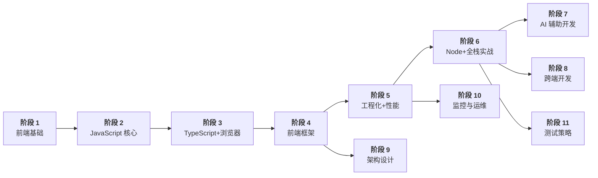

# 前端学习路线图

> 基于 `frontend/` 目录 15 个模块的完整知识体系，参考 2026 Java 学习路线图格式，多阶段循序渐进，覆盖 HTML/CSS → JavaScript → TypeScript → 浏览器 → 框架 → 工程化 → 性能 → Node.js → 全栈实战 → AI 辅助开发 → 跨端开发 → 架构设计 → 监控运维 → 测试策略。

---

## 路线图总览

---

## 阶段一：前端基础（HTML + CSS）

> **定位**：网页的骨架与皮肤，建立对网页结构和样式的直观认知。
> **对应文件**：`01-html-css/`

### 学习目标

掌握 HTML5 语义化标签体系，能写出结构清晰、SEO 友好的网页；掌握 CSS3 核心布局能力（盒模型、Flex、Grid），能实现常见的企业级页面布局。

### 为什么这是第一阶段

HTML 和 CSS 是前端开发的"第一门语言"。它们不涉及编程逻辑（没有变量、循环、条件判断），学习曲线最为平缓，适合作为零基础入门。更重要的是，JavaScript 操作 DOM 的前提是理解 HTML 元素树结构，CSS 选择器也是后续学习 DOM 操作、jQuery、浏览器渲染的基础。先建立对网页的直观认知，再学习编程语言会事半功倍。

### 知识点清单

**HTML 核心与语义化**
- HTML5 新特性（`<header>`、`<nav>`、`<main>`、`<article>`、`<section>`、`<footer>`）
- 语义化标签的意义（SEO 优化、无障碍访问、代码可读性）
- 元素分类：块级元素 vs 行内元素 vs 行内块元素
- Canvas 基础（2D 上下文、绘制矩形/路径/文本）与 SVG 基础（基本形状、路径）
- 表单元素与验证（HTML5 表单验证属性）
  - 自定义验证规则（`setCustomValidity()`、`checkValidity()`）
  - 正则验证（邮箱、手机号、身份证号格式校验）
  - 实时验证反馈（`input`/`change` 事件驱动验证，错误提示 UI 设计）
  - 验证样式（`:valid`/`:invalid` 伪类、`validationMessage`）
  - HTML5 新增输入类型（email、url、date、range、color、number、tel、search）
  - enctype 属性（application/x-www-form-urlencoded vs multipart/form-data）
- meta 标签（viewport、charset、SEO 相关）
- 无障碍访问（a11y）基础：
  - WAI-ARIA 属性（`role`、`aria-label`、`aria-labelledby`、`aria-hidden`）
  - 键盘可访问性（`tabindex`、焦点管理、`:focus-visible` 伪类）
  - 颜色对比度（WCAG AA/AAA 标准，对比度检测工具）
  - 跳过导航链接（Skip Navigation Link 实现）

**CSS 布局核心**
- 盒模型（标准盒模型 vs IE 盒模型，`box-sizing`）
- BFC（块级格式化上下文）— 解决外边距合并、浮动塌陷
- Flex 布局（容器属性 + 项目属性，主轴/交叉轴，九宫格布局）
- Grid 布局（网格容器、网格线、网格区域、fr 单位）
- 居中方案（水平居中、垂直居中、水平垂直居中，共 6 种方案）
- CSS scroll-snap（原生滚动吸附，移动端轮播/卡片滑动）
- 响应式设计（媒体查询、rem/vw/vh、移动端适配）

**CSS 进阶与性能**
- CSS3 动画（transition、animation、transform、@keyframes）
- CSS 变量（`--custom-property`）
- 回流（Reflow）与重绘（Repaint）— 触发条件与优化策略
- CSS 选择器优先级与性能
- 移动端 1px 边框问题、retina 屏适配
- CSS @supports（特性检测，渐进增强基础）
- will-change（CSS 性能优化，提前通知浏览器即将变化的属性）
- CSS containment（contain 属性，隔离渲染范围提升性能）
- 层叠上下文（Stacking Context）与 z-index 层级管理
- CSS 工具链（了解即可，后续在框架项目中深入使用）：
  - Sass / Less（变量、嵌套、混入、函数）
  - Tailwind CSS（原子化 CSS，工具类优先）
  - CSS Modules（组件级样式隔离）
- CSS 组织与命名规范：
  - BEM 命名规范（Block\_\_Element--Modifier）
  - 其他方法论概览（OOCSS、SMACSS、ITCSS，了解即可）
  - 实践意义：大规模 CSS 的可维护性、命名冲突避免
- CSS 新特性（了解即可）：
  - Container Queries（组件级响应式布局，2023 年全浏览器支持）
  - CSS Layers（`@layer`，样式优先级控制）
  - CSS Nesting（原生 CSS 嵌套语法）
  - `:has()` 选择器（父选择器，2023 年底全浏览器支持）

### 技能获得

具备独立完成静态页面还原的能力，能根据设计稿实现像素级页面，掌握 Flex/Grid 双布局体系，理解 CSS 性能优化方向。

### 学习建议

- 每学完一个布局知识点，立即动手还原一个真实网站页面（如淘宝首页、京东商品列表）
- 不要死记 CSS 属性，通过 Chrome DevTools 实时调试加深理解
- 建立自己的 CSS 代码片段库（常用 Flex/Grid 布局模板、动画预设）
- 熟悉 Chrome DevTools 核心面板（Elements 检查元素、Console 调试、Network 网络请求、Application 存储）
- 现阶段不需要掌握 Git，先在本地安心写代码，阶段四开始构建项目时再系统学习 Git 版本控制

---

## 阶段二：JavaScript 核心

> **定位**：前端唯一编程语言，理解语言本质与运行机制。
> **对应文件**：`02-javascript-core/`

### 学习目标

深入理解 JavaScript 的核心机制：执行上下文、作用域链、原型链、this 绑定、事件循环；掌握 ES6+ 核心特性（Promise、async/await、模块化）；能手写 call/apply/bind、防抖节流、深拷贝等高频面试题。

### 为什么这是第二阶段

HTML/CSS 解决的是"页面长什么样"，JavaScript 解决的是"页面能做什么"。JS 是前端唯一的编程语言，后续所有框架（Vue、React）、工具链（Webpack、Vite）、运行时（Node.js）都建立在 JS 之上。如果 JS 基础不扎实，学框架时只会"会用但不知道为什么"，遇到问题无法从原理层面分析。这一阶段投资回报率最高，是前端面试的核心考察点。

### 知识点清单

**语法基础与执行机制**
- 变量声明（var/let/const）— 作用域、提升（Hoisting）、暂时性死区（TDZ）
- 数据类型（7 种原始类型 + Object，类型判断 typeof/instanceof/toString）
- ArrayBuffer / TypedArray / DataView（二进制数据处理基础）
- 执行上下文（创建阶段 vs 执行阶段，变量对象 VO/AO）
- 作用域链（词法作用域，`[[Scopes]]` 内部属性）
- 原型链（`__proto__` / `prototype`，原型继承，instanceof 原理）
- this 绑定（默认绑定、隐式绑定、显式绑定、new 绑定、箭头函数）
- 闭包（定义、形成条件、实际应用场景）
- 错误处理：
  - `try/catch/finally` 语法与执行流程
  - `throw` 语句与自定义错误信息
  - Error 内置类型（`Error`、`SyntaxError`、`TypeError`、`RangeError`、`ReferenceError`）
  - 自定义 Error 类（继承 `Error`、`name` 和 `message` 属性）
  - 全局错误捕获（`window.onerror`、`unhandledrejection` 事件）
  - 错误传播（异步错误、Promise 拒绝未捕获）

**DOM 操作与事件机制**
- DOM 树概念：文档节点树、节点类型（元素节点/文本节点/注释节点）、父子兄弟关系
- 节点增删改查：`createElement`、`appendChild`、`removeChild`、`insertBefore`、`replaceChild`、`cloneNode`
- DOM 遍历：`parentNode`、`children`、`firstChild`/`lastChild`、`nextSibling`/`previousSibling`
- 选择器 API：`querySelector`、`querySelectorAll`、`getElementById`、`getElementsByClassName`
- 属性操作：`getAttribute`/`setAttribute`/`removeAttribute`、`dataset`、`classList` API
- 样式操作：`element.style`、`getComputedStyle`、`classList.add/remove/toggle`
- 尺寸与位置：`offsetWidth`/`offsetHeight`、`clientWidth`/`clientHeight`、`scrollTop`/`scrollLeft`、`getBoundingClientRect()`
- MutationObserver：DOM 变化监听、配置项（childList/attributes/characterData）
- IntersectionObserver（元素可见性监听，懒加载/无限滚动核心 API）
- ResizeObserver（元素尺寸变化监听，响应式组件核心 API）
- 事件流三阶段：捕获阶段 → 目标阶段 → 冒泡阶段
- 事件冒泡与捕获：`event.bubbles`、冒泡路径
- 事件委托：利用冒泡实现动态元素的事件绑定，`event.target` 判断
- 阻止冒泡与默认行为：`stopPropagation()` vs `stopImmediatePropagation()`、`preventDefault()`
- 自定义事件：`CustomEvent` 构造函数、`dispatchEvent`、组件间解耦通信

**BOM 浏览器对象模型**
- `window` 对象：全局作用域、`setTimeout`/`setInterval`、`alert`/`confirm`/`prompt`、`open`/`close`、`scrollTo`/`scrollBy`
- `location` 对象：`href`、`search`、`hash`、`pathname`、`reload()`、`replace()`、`assign()`
- `history` 对象：`pushState`/`replaceState`（SPA 路由基础）、`back`/`forward`/`go`、`popstate` 事件
- `navigator` 对象：`userAgent`、`platform`、`language`、`onLine`、`cookieEnabled`
- `screen` 对象：`width`/`height`、`availWidth`/`availHeight`、屏幕适配
- `URL` 与 `URLSearchParams`：解析与构造 URL、查询参数操作
- 浏览器扩展 Web APIs（了解即可）：
  - Geolocation API（`navigator.geolocation.getCurrentPosition()`）
  - Notification API（`Notification.requestPermission()`）
  - Clipboard API（`navigator.clipboard.writeText()`/`readText()`）
  - Fullscreen API（`element.requestFullscreen()`）
  - Page Visibility API（`document.visibilityState`、`visibilitychange` 事件）

**异步编程与 ES6+ 特性**
- 事件循环（Event Loop）— 调用栈、宏任务队列、微任务队列、渲染时机
- setTimeout/setInterval 与事件循环的关系（延迟不保证精确执行）
- 回调函数（Callback）— 回调地狱问题
- Promise（三种状态、then/catch/finally、链式调用、Promise.all/race/allSettled）
- async/await（语法糖本质、错误处理、并发控制）
- ES6+ 核心特性（箭头函数、解构赋值、模板字符串、扩展运算符、可选链、空值合并、Symbol 唯一标识/Symbol.for/Symbol.iterator）
- 模块化（ES Module vs CommonJS，静态导入 vs 动态导入）

**JSON 与网络请求**
- JSON 格式规范：键值对、双引号、数据类型限制
- `JSON.parse()`：解析 JSON 字符串，`reviver` 参数
- `JSON.stringify()`：序列化对象，`replacer` 参数，`space` 参数
- 序列化陷阱：`undefined`/函数/`Symbol`/`Date`/循环引用的处理，`toJSON()` 方法
- AJAX 概念：异步 JavaScript 与 XML，无刷新更新页面
- XMLHttpRequest (XHR)：`open`/`send`、`readyState`、`onreadystatechange`、`status`、`responseText`
- Fetch API：`fetch()` 基础用法、Response 对象、`json()`/`text()`/`blob()`、`Headers` 对象
- 请求取消：AbortController / AbortSignal
- 超时处理：`AbortSignal.timeout()`、手动超时 Promise.race
- Axios 核心特性：请求/响应拦截器、实例创建、默认配置、取消请求

**正则表达式**
- 基础语法：元字符（`.` `\d` `\w` `\s`）、量词（`*` `+` `?` `{n,m}`）、字符类（`[abc]`）、分组（`()`）、或（`|`）、锚点（`^` `$`）
- 正则标志：`g`（全局）、`i`（忽略大小写）、`m`（多行）、`s`（dotAll）、`u`（Unicode）
- 正则方法：`test()`、`exec()`、`match()`、`matchAll()`、`replace()`、`search()`、`split()`
- 常用正则：邮箱、手机号、URL、身份证号、IP 地址、日期格式
- 贪婪与非贪婪：`.*` vs `.*?`
- 前瞻与后顾：`(?=)`、`(?!)`、`(?<=)`、`(?<!)`

**常用 API 与手写原理**
- 防抖（debounce）与节流（throttle）— 区别、手写实现、应用场景
- 深拷贝与浅拷贝（JSON 深拷贝、structuredClone、手写递归深拷贝）
- 函数式编程基础：
  - 纯函数（相同输入始终相同输出、无副作用）
  - 不可变性（不修改原始数据，返回新数据）
  - 高阶函数（函数作为参数或返回值，`map`/`filter`/`reduce`）
  - 函数柯里化（currying）— 实现与应用
  - 函数组合（`compose`/`pipe`，与柯里化配合）
  - 声明式 vs 命令式（声明式编程的优势）
- 手写 call / apply / bind（含 new 绑定优先级处理）
- 手写 new 操作符
- 手写 instanceof
- EventEmitter 模式（发布-订阅，on/emit/once/removeListener，Node.js events 模块基础）
- 垃圾回收机制（标记清除、引用计数、V8 分代回收）

### 技能获得

具备扎实的 JavaScript 核心编程能力，能解释 JS 的执行机制，能手写高频面试原理题，为框架学习打下坚实基础。

### 学习建议

- 这一阶段**不要跳过**任何原理章节，这是前端面试的核心考察点
- 每学完一个手写原理，在白纸上默写一遍代码
- 推荐阅读资源：MDN 文档、《JavaScript 高级程序设计》（红宝书）
- 使用 [Loupe](https://latentflip.com/loupe/) 可视化事件循环加深理解
- 掌握 Chrome DevTools Sources 面板调试：断点调试、条件断点、Watch 表达式、Call Stack 调用栈追踪

---

## 阶段三：TypeScript + 浏览器原理

> **定位**：类型安全与运行环境，从语言层面到运行层面的衔接。
> **对应文件**：`03-typescript/`、`04-browser/`

### 学习目标

掌握 TypeScript 的类型系统（基础类型、泛型、高级类型），能配置 tsconfig 并应用于实际项目；理解浏览器渲染原理（从 HTML 到像素的完整流程）、V8 引擎执行机制、事件循环、Web 安全防御。

### 为什么这是第三阶段

TypeScript 是 JavaScript 的超集，在 JS 基础不扎实时学 TS 会"两头落空"——既搞不清 JS 的动态类型，又理解不了 TS 的静态约束。必须在 JS 核心之后学 TS，才能理解 TS 的编译产物和类型体操的意义。

浏览器原理是 JS 的"运行环境说明书"。事件循环、渲染流程、V8 执行机制这些概念在阶段二的 JS 原理中已经涉及，但放在浏览器原理模块中系统学习，能形成完整的"JS 代码 → 浏览器执行 → 像素渲染"知识闭环。TS 和浏览器原理可以并行学习——TS 侧重开发时的类型安全，浏览器原理侧重运行时的环境理解。

### 知识点清单

**TypeScript 基础与类型系统**
- 基础类型（string/number/boolean/array/tuple/enum/void/never/unknown/any）
- 联合类型与交叉类型（`|` / `&`）
- 接口（interface）vs 类型别名（type）— 区别与选择
- 泛型（约束、默认值、条件类型）
- 工具类型（Partial/Required/Readonly/Pick/Omit/Record/Exclude/Extract）

**TypeScript 高级类型与工程配置**
- 条件类型（`T extends U ? X : Y`）与 infer 关键字
- 映射类型（`[K in keyof T]`）
- 装饰器（类装饰器、方法装饰器、属性装饰器）
- tsconfig.json 核心配置（strict、paths、moduleResolution）
- 类型声明文件（`.d.ts`）与 DefinitelyTyped

**网络协议基础（TCP/IP + DNS）**
- 网络分层模型：OSI 七层模型、TCP/IP 四层模型、各层协议对应
- DNS 解析过程：域名 → IP 的解析流程（浏览器缓存 → OS 缓存 → hosts 文件 → 本地 DNS → 根 DNS → 顶级 DNS → 权威 DNS），递归查询 vs 迭代查询
- TCP 三次握手：SYN → SYN-ACK → ACK，为什么是三次而不是两次
- TCP 四次挥手：FIN → ACK → FIN → ACK，TIME_WAIT 状态
- UDP vs TCP：面向连接 vs 无连接、可靠性 vs 速度、应用场景
- IP 地址与端口：IPv4/IPv6、端口号范围、常见默认端口（80/443/3000/8080）
- URL 组成：`scheme://host:port/path?query#fragment` 各部分含义
- URL 编码/解码：`encodeURIComponent` vs `encodeURI`、`decodeURIComponent`

**HTTP 协议基础**
- HTTP 请求方法（GET/POST/PUT/DELETE/PATCH，幂等性与安全性）
- HTTP 状态码（1xx 信息 / 2xx 成功 / 3xx 重定向 / 4xx 客户端错误 / 5xx 服务端错误）
- HTTP 请求头与响应头（Content-Type、Cache-Control、ETag、CORS 头部）
- HTTPS 与 TLS 握手（对称加密、非对称加密、证书链）
- HTTP/1.1 vs HTTP/2 vs HTTP/3（多路复用、头部压缩、QUIC）
- RESTful API 设计原则：
  - 资源命名规范（名词复数，如 `/api/users`，非 `/api/getUsers`）
  - HTTP 方法语义（GET 查、POST 增、PUT 全量改、PATCH 部分改、DELETE 删）
  - 状态码语义（200/201/204/301/302/304/400/401/403/404/409/422/500）
  - API 版本控制（URL 路径版本 `/v1/`、请求头版本）
  - 分页/过滤/排序（`?page=1&limit=20`、`?sort=name`、`?filter=status:active`）
  - 分页模式对比（offset-based `?page=1&limit=20` vs cursor-based `?cursor=xxx`，适用场景与性能差异）

**浏览器渲染原理**
- 多进程架构（浏览器进程、渲染进程、GPU 进程、网络进程）
- 渲染流程（HTML 解析 → CSSOM → 渲染树 → 布局 → 绘制 → 合成）
- 关键渲染路径优化（减少关键资源数量、减小关键资源大小）
- V8 引擎执行管线（Parser → Ignition 解释器 → Sparkplug → Maglev → TurboFan 优化编译器）
- V8 垃圾回收（新生代 Scavenge、老生代 Mark-Sweep & Mark-Compact）

**事件循环与 Web 安全**
- 浏览器事件循环（与 Node.js 的区别）
- 宏任务与微任务的执行顺序
- requestAnimationFrame 与 requestIdleCallback
- 同源策略（Same-Origin Policy）定义：协议+域名+端口一致
- 跨域与 CORS（简单请求 vs 预检请求，CORS 头部）
- XSS 攻击（存储型、反射型、DOM 型）与防御（CSP、输入转义、HttpOnly）
- CSRF 攻击与防御（SameSite Cookie、CSRF Token、Referer 校验）
- Cookie 安全属性详解（SameSite Strict/Lax/None、Secure、HttpOnly、Domain/Path）
- 浏览器存储（Cookie / localStorage / sessionStorage / IndexedDB）
- WebSocket 基础（全双工通信、`ws://` 协议、`new WebSocket()`、`onmessage`/`onopen`/`onclose` 事件）

### 技能获得

能用 TypeScript 编写类型安全的前端代码，理解浏览器从输入 URL 到页面渲染的完整流程，能分析和防御常见 Web 安全漏洞。

### 学习建议

- TS 学习重在实践：拿一个 JS 项目迁移到 TS，在实战中理解类型系统
- 浏览器渲染原理借助 Chrome DevTools Performance 面板可视化学习
- 安全部分建议搭建本地环境，亲手复现一次 XSS 和 CSRF 攻击

---

## 阶段四：前端框架（Vue 3 + React 18）

> **定位**：组件化开发，现代前端工程的核心能力。
> **对应文件**：`05-vue/`、`06-react/`

### 学习目标

掌握 Vue 3 Composition API 和 React 18 Hooks 两种主流范式，理解响应式原理（Proxy vs defineProperty）、虚拟 DOM 与 diff 算法、路由与状态管理，能独立开发中大型前端应用。

### 为什么这是第四阶段

前端框架是对 DOM 操作、响应式数据、组件化的高层封装。如果没有阶段二的 JS 核心基础（this、闭包、原型链）和阶段三的浏览器原理（渲染流程、diff 算法背景），学框架时只能"会用 API"，无法理解响应式原理、虚拟 DOM diff、Fiber 调度等核心机制。TS 放在框架之前学，能让框架项目从一开始就具备类型安全。

Vue 和 React 并列学习而非二选一，是因为两者代表了不同的设计哲学——Vue 的响应式数据驱动和 React 的不可变数据 + 函数式思维。先学 Vue 3（入门曲线更平滑，单文件组件直观），再学 React 18（Hooks 思维更函数式，Fiber 架构更深入），能形成互补认知。Git 和包管理器作为前置准备放在这里，是因为此时学习者即将开始构建真实的框架项目，有了代码管理需求，且已具备命令行操作基础。

> **前置准备**：在学习框架之前，需要掌握两个基础工具：
> 
> **包管理器**：推荐使用 pnpm（比 npm 更快、更节省磁盘空间）：
> - 初始化项目：`pnpm init`
> - 安装依赖：`pnpm install` / `pnpm add <package>`
> - 运行脚本：`pnpm dev` / `pnpm build`
> - 了解 `package.json` 的 scripts 和 dependencies 字段
> 
> **Git 版本控制**：管理项目代码，协作开发的基础：
> - 工作区、暂存区、本地仓库、远程仓库
> - 基本操作：clone、add、commit、push、pull、branch、merge、checkout
> - `.gitignore` 与常用忽略规则
> - 分支策略（Git Flow / GitHub Flow，了解即可）
> - 推荐资源：[Git 官方教程](https://git-scm.com/book/zh/v2)、[Learn Git Branching](https://learngitbranching.js.org/)

### 知识点清单

**Vue 3 核心**
- Composition API（ref/reactive、computed、watch、watchEffect）
- 生命周期（setup → onMounted → onUnmounted）
- 组件通信（props/emits、provide/inject、v-model、插槽）
- v-model 实现原理（:modelValue + @update:modelValue 语法糖）
- 响应式原理（Proxy vs Object.defineProperty，依赖收集 track/trigger）
- 虚拟 DOM 与 diff 算法（双端比较、静态标记、Block Tree）
- Vue Router（hash vs history 模式、路由守卫、动态路由）
- Pinia（状态管理，setup store vs option store）
- `<script setup>` 语法糖（官方推荐写法，编译时优化）
- Teleport 组件（模态框/弹窗的官方解决方案）
- Suspense 异步组件（原生异步组件加载方案）

**React 18 核心**
- JSX 语法与虚拟 DOM
- Hooks（useState、useEffect、useLayoutEffect、useRef、useMemo、useCallback、useReducer）
- Hooks 规则与原理（闭包过期、依赖数组、自定义 Hooks）
- React.memo（与 useMemo / useCallback 的区别和配合使用）
- Fiber 架构（可中断渲染、时间分片、双缓冲树）
- Diff 算法（同级比较、key 的作用、三种策略）
- React Router v6（路由配置、嵌套路由、懒加载）
- 状态管理（Redux Toolkit vs Zustand）
- Concurrent Features（useTransition、useDeferredValue）
- Automatic Batching（React 18 默认行为变更）
- Server Components (RSC)（React 未来方向，Next.js 13+ 已广泛使用）

### 技能获得

能独立使用 Vue 3 或 React 18 开发企业级中后台应用，理解框架核心原理（响应式、虚拟 DOM diff、Fiber 调度），具备框架选型和技术决策能力。

### 学习建议

- 两个框架都需要学：Vue 3 建议先学，React 18 紧随其后
- 学习路线：框架核心语法 → 原理深入 → 状态管理 → 路由 → 项目实战
- 每个框架至少做一个完整项目（TodoList → 博客系统 → 后台管理系统）
- 面试中常考"Vue 和 React 的区别"，建议学完后写一篇对比总结

---

## 阶段五：工程化 + 性能优化

> **定位**：从"能写代码"到"能写好代码"的质变。
> **对应文件**：`07-engineering/`、`08-performance/`

### 学习目标

理解 Webpack 和 Vite 的构建原理，能配置和优化前端构建流程；掌握前端性能优化的完整方法论（Core Web Vitals、加载性能、运行时性能）；建立工程规范意识（ESLint/Prettier/Husky/CI/CD）。

### 为什么这是第五阶段

工程化解决的是框架项目的构建、打包、部署问题，性能优化解决的是框架应用的用户体验问题。如果没有阶段四的框架实战经验，就无法理解"Tree Shaking 为什么能减少打包体积"、"代码分割应该如何划分边界"、"懒加载应该在什么粒度使用"——这些问题的答案都来自实际的框架项目经验。

工具链（Webpack/Vite）本身也是用 JavaScript 编写的，对 JS 原理和 Node.js 的理解直接影响工程化学习深度。性能优化中的"回流重绘"、"事件循环"、"内存泄漏"等概念，直接依赖阶段二和阶段三的前置知识。

### 知识点清单

**构建工具原理**
- Webpack 核心概念（Entry、Output、Loader、Plugin、Module）
- Babel 转译（ES6+ → ES5，与 Webpack 配合的 babel-loader）
- Webpack 打包流程（依赖图构建 → 模块打包 → 输出资源）
- Loader vs Plugin 的区别与执行顺序
- Vite 原理（ES Module 原生支持、依赖预构建（esbuild）、HMR 热更新）
- Webpack vs Vite 对比与选型
- Bundle 分析工具（webpack-bundle-analyzer）

**工程规范与流程**
- ESLint（规则配置、自定义规则、与 Prettier 配合）
- Prettier（代码格式化，与 ESLint 的冲突解决）
- Husky + lint-staged（Git Hooks 自动化代码检查）
- CI/CD（GitHub Actions / GitLab CI，自动化构建与部署）
- Monorepo（pnpm workspace、Turborepo）
- Docker 基础（Dockerfile、Docker Compose，前端容器化部署）
- 前端测试体系：
  - 单元测试（Jest / Vitest）— 测试纯函数、工具方法
  - 组件测试（Vue Test Utils / React Testing Library）— 测试组件渲染与交互
  - 端到端测试（Cypress / Playwright）— 模拟用户操作全流程测试
  - 测试金字塔：单元测试 > 集成测试 > E2E 测试
- 前端常用设计模式：
  - 观察者模式（Vue 响应式 / React 状态管理的基础）
  - 发布-订阅模式（EventEmitter、事件总线）
  - 单例模式（全局状态、Vuex/Pinia store）
  - 工厂模式（组件工厂、`createElement`）
  - 策略模式（表单验证策略、条件渲染）
  - 代理模式（Vue 3 Proxy 响应式、ES6 Proxy）
  - 装饰器模式（TypeScript 装饰器、HOC 高阶组件）

**加载性能优化**
- Core Web Vitals（LCP、FID/INP、CLS）
- 代码分割（Code Splitting）— 路由级分割、组件级分割、动态 import
- Tree Shaking（ES Module 静态分析，sideEffects 配置）
- 懒加载（图片懒加载、组件懒加载）
- 缓存策略（强缓存/协商缓存、Service Worker、CDN）
- Service Worker 生命周期（install → activate → fetch，Cache API 缓存策略）
- 资源优化（图片压缩/WebP、字体子集化、Gzip/Brotli 压缩）
- 响应式图片（srcset / sizes / picture 元素）
- 资源预加载提示（preload / prefetch / preconnect / dns-prefetch）
- Critical CSS 内联关键 CSS（首屏样式提取与内联）

**运行时优化**
- 防抖节流在业务场景中的实际应用
- 回流重绘优化（批量 DOM 操作、CSS 合成层提升）
- 虚拟列表（大量数据渲染优化）
- 内存泄漏排查（Chrome DevTools Memory 面板）
- SSR/SSG/ISR（服务端渲染方案对比与选择）

### 技能获得

能独立搭建前端工程的构建与部署流程，能对现有项目进行系统性的性能优化，能编写单元测试和组件测试，能将 LCP 降至 2.5s 以内，具备工程化思维。

### 学习建议

- 从零搭建一个 Webpack 项目，再迁移到 Vite，对比两者的配置差异
- 使用 Chrome DevTools Lighthouse 和 Performance 面板分析性能瓶颈
- 性能优化要"有数据、有对比"：优化前先录基线数据，优化后对比提升幅度

---

## 阶段六：Node.js + 全栈项目实战

> **定位**：补全服务端能力，综合检验前五阶段学习成果。
> **对应文件**：`09-nodejs/`、`10-project/`

### 学习目标

理解 Node.js 运行时架构（V8 + libuv），掌握 Koa/Express 框架和洋葱模型，能设计 BFF 层；通过企业后台管理系统实战，综合运用所有前置知识，完成一个完整的前后端分离项目。

### 为什么这是第六阶段

Node.js 让前端工程师具备了服务端开发能力，这是"前端"到"全栈"的最后一块拼图。BFF 层的设计、SSR 渲染、构建工具的开发都需要 Node.js 基础。项目实战是对所有前置知识的综合检验——一个企业后台管理系统同时涉及 HTML/CSS 布局、JS 逻辑、TS 类型约束、框架组件化、工程化打包、性能优化、Node.js 接口开发。

这一阶段放在最后，是因为没有前五阶段的知识积累，项目实战会变成"照猫画虎"——只能复制代码而无法理解设计决策。有了完整知识体系后，项目实战才能真正锻炼"从需求到架构到实现"的完整能力。

### 知识点清单

**Node.js 运行时与核心 API**
- V8 + libuv 架构（事件循环六个阶段：timers → pending callbacks → idle/prepare → poll → check → close callbacks）
- 模块机制（CommonJS 加载流程、模块缓存、循环引用处理）
- Buffer 与 Stream（二进制数据处理、可读流/可写流/转换流、背压机制）
- 文件系统（fs 模块，同步 vs 异步 vs 流式读取）
- process 对象（环境变量、命令行参数、进程管理）
- 进程管理（PM2 / cluster 模块，生产环境部署必备）
- 日志与错误处理（winston / pino 日志库，全局错误处理中间件）
- 环境变量与配置管理（dotenv、多环境配置策略）

**数据库与 ORM**
- 关系型数据库基础（MySQL / PostgreSQL，表结构/SQL 增删改查/索引）
- SQL 核心概念（JOIN 类型 INNER/LEFT/RIGHT/FULL、事务 ACID、索引类型 B-Tree/Hash/全文）
- NoSQL 数据库基础（MongoDB，文档/集合/聚合管道）
- 缓存数据库（Redis，字符串/哈希/列表/过期策略）
- ORM 工具（Prisma / TypeORM / Sequelize，模型定义/迁移/关联查询）

**Web 框架与 BFF 层**
- Express vs Koa（中间件机制、洋葱模型、错误处理）
- 洋葱模型原理（compose 函数实现）
- Session/Cookie 鉴权（Session 存储、Cookie 安全属性）
- JWT 鉴权（access token + refresh token 双令牌机制）
- CORS 中间件配置（cors 包，Access-Control-Allow-Origin 等响应头）
- 速率限制（express-rate-limit 中间件）
- 安全中间件（helmet，设置安全相关 HTTP 头）
- 文件上传处理（multer 中间件，multipart/form-data 解析，文件大小限制与类型校验）
- API 文档（Swagger / OpenAPI 规范，自动化文档生成与维护）
- SSE（Server-Sent Events，服务端推送单向通信，与 WebSocket 的选择对比）
- BFF 层设计（接口聚合、数据裁剪、格式转换）

**企业后台管理系统实战**
- 需求分析与技术选型（Vue 3 + TypeScript + Vite + Pinia）
- RBAC 权限模型（用户 → 角色 → 权限，前端菜单权限 + 按钮权限）
- 路由守卫（登录鉴权、权限校验、动态路由注册）
- 组件封装（表格组件、表单组件、弹窗组件的二次封装）
- 打包与部署（环境变量配置、Docker 部署、Nginx 反向代理）

### 技能获得

具备独立开发前后端分离项目的能力，能设计 BFF 层接口，能完成从需求分析到部署上线的完整流程，达到初中级前端工程师的面试和入职标准。

### 学习建议

- 项目实战不要停留在"看文档"，一定要动手写代码
- 从简单功能开始迭代：先做登录 → 再做列表页 → 再做表单页 → 最后做权限管理
- 每个功能完成后写一段总结，记录遇到的问题和解决方案

---

## 阶段七：AI 辅助前端开发

> **定位**：AI 时代的前端效率倍增器，从工具使用到 Prompt 工程再到代码质量管控。
> **对应文件**：`11-ai-assisted/`

### 学习目标

掌握 Cursor、Claude Code、GitHub Copilot 等主流 AI 编程工具的核心用法；能编写高质量 Prompt 生成前端代码、组件和单元测试；理解 AI 代码审查的工作流，能识别 AI 幻觉代码并通过 AST 规则自动拦截。

### 为什么这是第七阶段

AI 辅助开发的前提是你已经具备独立编码能力。如果没有阶段一到六的扎实基础，你会无法判断 AI 生成的代码是否正确、是否安全、是否符合最佳实践。AI 是效率工具，不是替代品——它放大你的能力，但不会赋予你能力。在所有基础模块学完之后再学习 AI 工具，才能做到"人主导、AI 辅助"。

### 知识点清单

**AI 编程工具与工作流**
- Cursor 核心功能：Tab 补全、Cmd+K 编辑、Composer 多文件生成、Agent 模式
- Claude Code 核心功能：CLI 交互、项目级上下文理解、多文件重构
- GitHub Copilot 核心功能：行内补全、Chat、Workspace 代理
- 工具选型对比（适用场景、优劣势、定价）
- AI 编程工作流：需求 → 架构设计 → 任务拆解 → Prompt → 生成 → 审查 → 合并

**Prompt 工程与代码生成**
- Prompt 五要素：角色设定、任务描述、上下文注入、输出格式约束、示例引导（Few-shot）
- 前端专用 Prompt 模板：组件生成、单元测试、重构代码、代码审查
- 复杂表单 Prompt 策略：几百个字段的分组/分步策略
- 避免 AI 幻觉的 Prompt 技巧：约束 API 使用范围、要求引用官方文档、分步生成

**AI 代码审查与质量管控**
- 三级审查模型：AI 自动审查 → AI 深度审查 → 人工复核
- 竞态条件检测：请求竞态（AbortController）、状态更新竞态（useEffect cleanup）、定时器竞态
- AST 自动拦截：编写自定义 ESLint 规则拦截 AI 幻觉代码
- 防调试方案识别：debugger 循环、getter 陷阱、console 劫持的识别与重构
- CI/CD 集成 AI 审查：GitHub Actions + AI Review Bot

### 技能获得

能用 AI 工具提升 3-5 倍开发效率，能编写高质量 Prompt 生成生产级代码，能建立 AI 代码质量门禁体系。

### 学习建议

- 不要跳过传统学习直接学 AI 工具——基础不牢，AI 生成的代码你看不懂
- 先学一个工具（推荐 Cursor），精通后再扩展
- 建立自己的 Prompt 模板库，反复优化
- 每个 AI 生成的代码都要经过审查，不要盲目信任

---

## 阶段八：跨端开发（uniapp）

> **定位**：一套代码多端运行，覆盖 H5、小程序、App 的跨端开发能力。
> **对应文件**：`12-cross-platform/`

### 学习目标

掌握 uniapp 的架构原理和条件编译机制；能开发同时运行在 H5、微信小程序、App 的应用；理解 H5 和微信小程序渲染差异，能排查跨端兼容性问题；掌握跨端首屏性能优化和分包策略。

### 为什么这是第八阶段

跨端开发需要同时理解 Web 渲染（H5）和原生渲染（小程序/App）两套体系。没有阶段四的框架基础和阶段三的浏览器原理，你无法理解为什么同一段代码在 H5 和小程序上表现不同。放在最后学习，是因为跨端开发本质上是前端知识的综合应用——你需要同时驾驭 Vue、CSS、性能优化、工程化等多领域知识。

### 知识点清单

**uniapp 跨端开发基础**
- uniapp 架构原理：编译时转换 vs 运行时适配
- 条件编译（`#ifdef`/`#ifndef`）：template、script、style 三种场景
- 项目结构：pages.json（路由配置）、manifest.json（应用配置）、uni.scss（全局样式）
- 生命周期：应用生命周期（onLaunch/onShow/onHide）vs 页面生命周期（onLoad/onShow/onReady）
- 组件体系：内置组件（view/scroll-view/swiper）、uni-ui 扩展组件
- API 体系：uni.request、uni.getLocation、uni.chooseImage
- 跨端适配工具函数：getPlatform、safeNavigate

**渲染差异与性能优化**
- H5 vs 小程序渲染差异：浏览器 DOM 渲染 vs 双线程同层渲染
- flex 布局差异：默认主轴方向、flex-wrap 默认值、gap 支持度
- CSS 支持度差异：position: fixed、overflow: scroll、::before/::after
- 标准排查路径：环境检查 → 条件编译排查 → 样式隔离 → 原生组件限制 → 数据绑定差异
- 首屏秒开优化：分包加载（主包<2MB）、预加载配置、组件懒加载
- 原生模块与 AI SDK 的极限依赖拆分策略
- 小程序性能优化专项：setData 合并/路径/节流/减量四重优化、长列表虚拟滚动

### 技能获得

能用 uniapp 开发一套代码同时运行在 H5、微信小程序、App 的应用，能独立排查跨端渲染差异问题，能实施跨端性能优化策略。

### 学习建议

- 先完成一个简单的三端 Demo（H5 + 微信小程序 + App），体验条件编译
- 使用微信开发者工具的"真机调试"功能验证小程序表现
- 遇到渲染差异时，先查 [02-uniapp渲染差异与性能优化.md](./12-cross-platform/02-uniapp渲染差异与性能优化.md) 的排查路径
- 分包策略在项目初期就规划好，后期改造成本高

---

## 阶段九：架构设计

> **定位**：从单页面开发转向系统级架构设计，培养架构师思维。
> **对应文件**：`13-architecture/`

### 学习目标

掌握微前端架构设计（qiankun / wujie / Module Federation），理解前端分层架构（视图层 / 业务逻辑层 / 数据层），能设计可扩展的前端应用架构，掌握技术选型方法论和技术债务管理。

### 为什么这是第九阶段

架构设计是前端工程师从"会写代码"到"会设计系统"的分水岭。前八个阶段解决的是"怎么实现"，架构设计解决的是"怎么组织"。微前端、分层架构、设计系统这些不是单个页面或组件的优化，而是对整个应用体系的顶层设计。只有在前面的阶段积累了足够的框架、工程化、性能优化经验，才能做出合理的架构决策。

### 知识点清单

**微前端架构**
- 微前端核心思想：独立开发、独立部署、独立运行、技术栈无关
- 三种主流方案对比：
  - qiankun（基于 single-spa，JS 沙箱 + CSS 沙箱，适合存量项目改造）
  - wujie（基于 WebComponent + iframe 隔离，性能更优，隔离性更强）
  - Module Federation（Webpack 5 原生支持，运行时模块共享，适合新项目）
- 子应用注册与生命周期（bootstrap、mount、unmount）
- 沙箱隔离机制：
  - JS 沙箱：快照沙箱（SnapshotSandbox）vs 代理沙箱（ProxySandbox）
  - CSS 沙箱：Shadow DOM 隔离、Scoped CSS、CSS Modules
- 应用间通信：CustomEvent、共享状态（全局 store）、props 传递
- 公共依赖共享（shared dependencies）：react、react-dom、antd 等
- 路由分发：主应用路由匹配 → 加载对应子应用 → 子应用接管内部路由
- 样式隔离策略：CSS Module、CSS-in-JS、Shadow DOM、BEM 命名

**设计系统与组件库架构**
- Design Tokens 三层体系：基础 Token（颜色/字号/间距）→ 语义 Token（primary/success/warning）→ 组件 Token（button-color-primary）
- 组件库架构设计：原子组件 → 复合组件 → 业务组件 → 页面模板
- 主题切换机制：CSS 变量方案、CSS-in-JS 方案、运行时样式注入
- 零运行时 CSS 方案：Tailwind CSS、UnoCSS、StyleX
- 组件文档与测试：Storybook 文档化、视觉回归测试（Chromatic/Percy）
- 版本管理与发布策略：语义化版本（SemVer）、CHANGELOG 自动化

**前端分层架构**
- 三层架构模型：表现层（View）→ 业务逻辑层（Service/BLL）→ 数据层（Repository/DAL）
- 依赖倒置原则（DIP）：高层模块不依赖低层模块，两者都依赖抽象
- 依赖注入（DI）：控制反转（IoC）容器简化依赖管理
- 分层架构的可测试性：Mock 数据层、隔离业务逻辑测试
- 实际项目中的分层实践：
  - API 层：统一封装 HTTP 请求、拦截器、错误处理
  - Service 层：业务逻辑封装，数据处理与转换
  - Store 层：全局状态管理（Pinia/Zustand）
  - View 层：纯展示组件，通过 props 接收数据

**技术管理**
- 技术选型方法论：业务需求匹配度、团队技术栈、社区活跃度、长期维护成本
- ADR（Architecture Decision Record）架构决策记录：标题、背景、决策、后果、状态
- 技术债务管理：识别（SonarQube/ESLint 规则）、量化（技术债务比率）、偿还计划（Sprint 中分配 20% 时间）
- 前端研发规范制定：命名规范、目录结构、Git 分支策略、Code Review 流程
- 技术分享与团队协作：技术分享会、知识库建设、Code Review 文化

### 技能获得

能独立设计微前端架构方案，能构建企业级设计系统与组件库，能设计分层清晰的前端应用架构，具备架构师思维和技术决策能力。

### 学习建议

- 微前端不要过早引入，单团队单体应用时不需要微前端
- 组件库先从一个业务项目的公共组件提取开始，逐步抽象为独立组件库
- ADR 从第一个架构决策开始记录，养成习惯
- 技术选型时多参考业界实践（如 ThoughtWorks 技术雷达）

---

## 阶段十：监控与运维

> **定位**：建立前端可观测性体系，保障线上质量。
> **对应文件**：`14-monitoring/`

### 学习目标

搭建前端监控体系（错误监控、性能监控、用户行为分析），掌握灰度发布与部署策略，建立故障排查与告警响应机制，理解可观测性三支柱（Logs/Metrics/Traces）。

### 为什么这是第十阶段

监控与运维是线上系统稳定性的最后一道防线。架构设计决定了系统"能做成什么样"，监控运维决定了系统"出问题后多快能恢复"。没有监控体系，线上问题就是"黑盒"——用户投诉了才知道。只有建立了完整的可观测性体系，才能从"被动救火"转变为"主动发现"。

### 知识点清单

**前端监控体系**
- 错误监控三大来源：
  - JS 运行时错误：`window.onerror` / `window.addEventListener('error')`
  - Promise 未捕获异常：`window.addEventListener('unhandledrejection')`
  - 资源加载错误：捕获阶段 `error` 事件
- 性能监控核心指标：
  - Core Web Vitals：LCP（最大内容绘制）、INP（交互到下次绘制）、CLS（累积布局偏移）
  - 补充指标：FCP（首次内容绘制）、TTFB（首字节时间）、FID（首次输入延迟）
  - 自定义指标：首屏渲染时间、API 响应时间、资源加载耗时
- 性能采集 API：
  - `PerformanceObserver`：监听性能条目（largest-contentful-paint、layout-shift、longtask）
  - `performance.getEntriesByType()`：获取已记录的性能数据
  - `performance.timing` / `PerformanceNavigationTiming`：页面加载时间线
- 用户行为监控：
  - 面包屑（Breadcrumbs）：用户操作轨迹（点击、路由、网络请求、console 输出）
  - 用户行为路径：页面访问序列、停留时长、关键操作
  - 自定义埋点：关键业务事件（按钮点击、表单提交、支付成功）
- Sourcemap 还原：线上错误堆栈定位到源码
  - 上传 Sourcemap 到 Sentry 或自建服务
  - 注意：Sourcemap 不要部署到生产环境 CDN（避免源码泄露）
- Sentry 核心能力：
  - 错误分组（Fingerprint）：基于堆栈指纹自动归类
  - Release 追踪：关联代码版本与错误
  - 自定义上下文：用户信息、Tags、Breadcrumbs
- 自建监控 SDK 设计：
  - 错误采集器（ErrorCollector）：window.onerror + unhandledrejection + 资源错误
  - 性能采集器（PerfCollector）：PerformanceObserver + Performance API
  - 上报器（Reporter）：批量上报、请求合并、失败重试、离线缓存

**灰度发布与部署策略**
- Feature Flags 四类模型：
  - Release Toggles（发布开关）：未完成功能暂不公开
  - Experiment Toggles（实验开关）：A/B 测试对比方案
  - Ops Toggles（运维开关）：紧急关闭非核心功能
  - Permission Toggles（权限开关）：付费/高级功能控制
- 三种部署策略：
  - 灰度发布（Canary）：逐步放量，风险可控
  - 蓝绿部署（Blue-Green）：两套环境，秒级切换
  - 滚动更新（Rolling Update）：逐个替换实例
- Nginx 层灰度：Cookie 分流、Header 分流、比例分流（split_clients）
- CDN 边缘灰度：Cloudflare Workers / Vercel Edge Functions 在边缘节点分流
- 容器化部署：Docker 多阶段构建、K8s 滚动更新、健康检查探针

**可观测性与故障排查**
- 可观测性三支柱：
  - Logs（日志）：记录离散事件，用于问题排查
  - Metrics（指标）：聚合数值数据，用于趋势分析
  - Traces（链路追踪）：分布式请求追踪，用于性能瓶颈定位
- OpenTelemetry：开源可观测性标准，统一 Logs/Metrics/Traces 采集
- W3C Trace Context：分布式追踪上下文传播标准（trace-id、span-id）
- 前端接入：`@opentelemetry/sdk-trace-web` + `@opentelemetry/exporter-trace-otlp-http`
- Session Replay：录屏回放用户操作，还原错误现场
- 告警策略：
  - 错误率告警：错误率 > 1% 触发告警
  - 性能告警：LCP > 2.5s 或 API 响应时间 > 3s 触发告警
  - 业务告警：关键业务指标异常（如支付成功率下降）
- 故障排查流程：告警触发 → 查看监控大盘 → 定位时间段 → 查看错误详情 → 分析面包屑 → 定位代码 → 修复上线

### 技能获得

能搭建完整的前端监控体系，能实施灰度发布策略，能利用可观测性工具快速定位线上故障，具备线上质量保障能力。

### 学习建议

- 监控体系从错误监控开始，逐步扩展到性能和业务监控
- Sourcemap 安全管理是重点，务必做好访问控制
- 可观测性三支柱理论先行，再结合实际工具（Sentry + Grafana + Jaeger）实践

---

## 阶段十一：测试策略

> **定位**：建立前端质量保障体系，从单元测试到 E2E 测试全覆盖。
> **对应文件**：`15-testing/`

### 学习目标

掌握测试金字塔（单元测试 → 组件测试 → 集成测试 → E2E 测试），熟练使用 Vitest + Testing Library + Playwright 构建完整测试体系，能在 CI/CD 中集成自动化测试门禁。

### 为什么这是第十一阶段

测试是软件质量的最后一道防线。前面十个阶段解决了"怎么开发"，测试策略解决的是"怎么保证质量"。如果没有前面的知识积累，写测试时会不知道测什么、怎么测、测到什么程度。测试金字塔的每一层都对应不同的知识和技能：单元测试需要 JS/TS 功底，组件测试需要框架知识，E2E 测试需要项目全貌理解。

### 知识点清单

**测试金字塔与单元测试**
- 测试金字塔模型：单元测试（50-60%）> 组件测试（20-30%）> 集成测试（10-15%）> E2E 测试（5-10%）
- 核心原则：越底层运行越快、维护成本越低、定位问题越精确
- Vitest 核心特性：
  - 与 Vite 共享配置，零配置启动
  - 兼容 Jest API（describe/it/expect）
  - 原生 ESM 支持，HMR 热更新测试
  - 内置覆盖率（v8/istanbul）
- 断言库：`expect` 核心匹配器（toBe/toEqual/toContain/toThrow/toMatchSnapshot）
- Mock 策略：
  - `vi.fn()`：创建 Mock 函数，追踪调用次数和参数
  - `vi.mock()`：Mock 整个模块，替换模块导出
  - `vi.spyOn()`：监听对象方法，保留原始行为
- 测试覆盖率类型：
  - 行覆盖率（Lines）：代码行被执行的比例
  - 分支覆盖率（Branches）：if/else/switch 分支被覆盖的比例
  - 函数覆盖率（Functions）：函数被调用的比例
  - 语句覆盖率（Statements）：语句被执行的比例
- TDD（测试驱动开发）实践：红 → 绿 → 重构循环

**组件测试与集成测试**
- Testing Library 核心原则：测试用户行为而非实现细节
- 渲染与查询：
  - `render()`：渲染组件到 jsdom
  - 查询优先级：`getByRole` > `getByLabelText` > `getByPlaceholderText` > `getByText` > `getByTestId`
- 用户事件模拟：`@testing-library/user-event`（模拟真实用户行为，推荐）vs `fireEvent`（直接触发 DOM 事件）
- 异步测试：`waitFor`、`findBy*` 查询、`waitForElementToBeRemoved`
- 快照测试（Snapshot Testing）：`toMatchSnapshot()` 检测 UI 意外变化
- 集成测试：测试多个组件/模块协作，验证数据流
- MSW（Mock Service Worker）：拦截网络请求，Mock API 响应
  - 优势：不需要 Mock 函数，在 Service Worker 层拦截，更接近真实环境

**E2E 测试与视觉回归**
- Playwright 核心能力：
  - 多浏览器支持（Chromium/Firefox/WebKit）
  - 自动等待（Auto-waiting），无需手动 waitFor
  - 网络拦截与 Mock（`page.route()`）
  - 截图与录屏（`page.screenshot()`、`trace viewer`）
  - 移动端模拟（`page.emulate()`）
- E2E 场景设计：
  - 关键路径测试：登录 → 浏览 → 下单 → 支付
  - 边界场景测试：空数据、网络错误、超时
  - 权限测试：不同角色看到不同内容
- 视觉回归测试：
  - 截图对比：`toMatchSnapshot()` 对比组件截图
  - Chromatic/Percy：自动化视觉回归平台
  - 适用场景：组件库、设计系统、品牌页面
- CI 集成：
  - GitHub Actions 中运行 E2E 测试
  - 测试报告生成与归档
  - 失败时自动截图和录屏，辅助排查

**测试最佳实践**
- 测试文件组织：`__tests__` 目录或 `.test.ts` / `.spec.ts` 后缀
- 测试命名规范：`describe('模块名', () => { it('应该做什么', () => { ... }) })`
- 测试独立性：每个测试用例独立运行，不依赖执行顺序
- Arrange-Act-Assert（AAA）模式：准备数据 → 执行操作 → 断言结果
- 测试覆盖率阈值：设置 CI 门禁（如 lines: 80%），低于阈值构建失败
- 不要追求 100% 覆盖率：关注核心业务逻辑和边界场景

### 技能获得

能独立搭建前端测试体系，能编写单元测试、组件测试和 E2E 测试，能设置 CI 测试门禁，具备质量保障的系统思维。

### 学习建议

- 从单元测试开始，逐步扩展到组件测试和 E2E 测试
- 测试代码也是代码，需要维护，不要为了覆盖率写无意义的测试
- 优先测试核心业务逻辑和容易出错的边界场景

---

## 学习建议总结

### Vue 与 React 学习建议

- **求职方向**：国内中小公司以 Vue 为主，大厂和国外以 React 为主
- **推荐策略**：两者都学，先 Vue 后 React。Vue 3 入门快，能快速建立"组件化开发"的认知模型；React 18 的 Hooks 思维更函数式，能加深对"数据驱动视图"的理解
- **面试策略**：如果时间紧张，先精通一个框架（达到能讲原理的程度），另一个框架了解核心概念即可

### 项目穿插建议

- 阶段一完成 → 做一个静态页面（个人主页、产品介绍页）
- 阶段二完成 → 做一个交互式应用（TodoList、计算器）
- 阶段四完成 → 做一个完整的前端项目（博客系统、电商首页）
- 全部完成 → 做一个全栈项目（后台管理系统、社区论坛）

---

## 后续进阶方向

完成阶段十一学习后，你已经具备初中级前端工程师的能力，并向架构师方向迈出了坚实一步。建议持续关注以下方向进行技术深度与广度拓展：源码阅读、数据结构与算法、性能极致优化、前端安全、可视化、实时通信、GraphQL、Web Components、PWA、Serverless、全栈框架、CSS 前沿等。

---

## 与 frontend 目录文件对应关系

| 阶段 | 对应目录 | 核心文件 | 辅助文件 |
|:---:|------|------|------|
| 阶段一 | `01-html-css/` | `01-HTML核心与语义化.md`、`02-CSS布局核心.md`、`03-CSS进阶与性能.md` | `04-HTMLCSS笔面试题集.md` |
| 阶段二 | `02-javascript-core/` | `01-语法基础与执行机制.md`、`02-异步编程与ES6+特性.md`、`03-常用API与手写原理.md`、`05-DOM操作与事件机制.md`、`06-JSON与网络请求.md`、`07-正则表达式.md`、`08-BOM与浏览器扩展API.md` | `04-JavaScript核心笔面试题集.md`、`01-语法基础与执行机制-原型链流程图.md`、`01-语法基础与执行机制-双链协同图.md` |
| 阶段三 | `03-typescript/` + `04-browser/` | `01-TypeScript基础与类型系统.md`、`02-高级类型与工程配置.md`、`01-浏览器渲染与V8原理.md`、`02-事件循环与Web安全.md`、`04-网络协议基础.md`、`05-前端安全深度.md` | `03-TypeScript笔面试题集.md`、`03-浏览器笔面试题集.md` |
| 阶段四 | `05-vue/` + `06-react/` | `01-Vue3核心语法.md`、`02-响应式与编译优化.md`、`03-路由与状态管理.md`、`01-React核心与Hooks.md`、`02-Diff算法与性能优化.md`、`03-路由与状态管理.md` | `04-Vue3笔面试题集.md`、`04-React笔面试题集.md` |
| 阶段五 | `07-engineering/` + `08-performance/` | `01-构建工具原理.md`、`02-工程规范与流程.md`、`04-测试集成与质量门禁.md`、`01-加载性能优化.md`、`02-运行时优化.md`、`04-渲染架构深度.md` | `03-前端工程化笔面试题集.md`、`03-性能优化笔面试题集.md` |
| 阶段六 | `09-nodejs/` + `10-project/` | `01-Node运行时与核心API.md`、`02-Web框架与BFF层.md`、`04-数据库与ORM.md`、`01-企业后台管理系统实战.md`、`02-电商平台实战.md` | `03-Node.js笔面试题集.md`、`03-项目实战笔面试题集.md` |
| 阶段七 | `11-ai-assisted/` | `01-AI编程工具与工作流.md`、`02-Prompt工程与代码生成.md`、`03-AI代码审查与质量管控.md` | `04-AI辅助开发笔面试题集.md` |
| 阶段八 | `12-cross-platform/` | `01-uniapp跨端开发基础.md`、`02-uniapp渲染差异与性能优化.md`、`03-PWA与WebComponents.md` | `04-跨端开发笔面试题集.md` |
| 阶段九 | `13-architecture/` | `01-微前端架构.md`、`02-设计系统与组件库架构.md`、`03-前端分层架构与技术管理.md` | `04-前端架构设计笔面试题集.md` |
| 阶段十 | `14-monitoring/` | `01-前端监控体系.md`、`02-灰度发布与部署策略.md`、`03-可观测性与故障排查.md` | `04-前端监控与运维笔面试题集.md` |
| 阶段十一 | `15-testing/` | `01-测试金字塔与单元测试.md`、`02-组件测试与集成测试.md`、`03-E2E测试与视觉回归.md` | `04-前端测试笔面试题集.md` |

> 每个模块还包含以下辅助文件：
> - `*-导览.md`（学习导航）— 帮助快速了解模块结构与学习路径，建议在学习每个模块前先阅读
> - `常见错误汇总.md`（避坑指南）— 汇总该模块常见错误及解决方案
> - `概念对比速查.md`（核心概念对照）— 易混淆概念的对比表格
> - `综合场景.md`（实践场景）— 综合性的实战场景练习
> - `笔面试题集`（面试备考）— 高频面试题与详解
>
> 此外，`02-javascript-core/` 模块还包含两个专属可视化辅助文件：
> - `01-语法基础与执行机制-原型链流程图.md` — 原型链查找关系可视化
> - `01-语法基础与执行机制-双链协同图.md` — 作用域链与原型链协同决策可视化

---

> 学习路线图 HTML 可视化版本：[前端学习路线图.html](./前端学习路线图.html)
>
> **学习辅助**：[知识导览](./知识导览.md) — 全部源文件的五维导览索引，快速查阅与复习。
- E2E 测试关注关键路径，不要试图覆盖所有场景